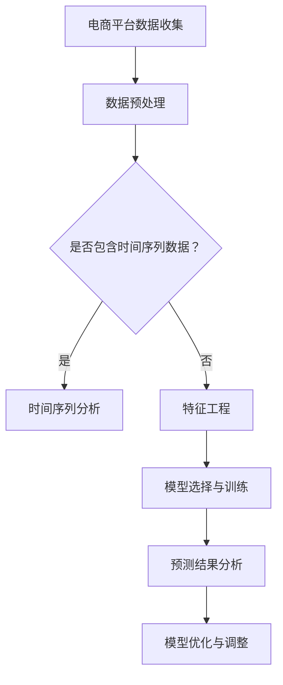

                 

# AI驱动的电商平台商品趋势预测

> **关键词**：AI、电商平台、商品趋势预测、时间序列分析、机器学习、深度学习、项目实战

> **摘要**：随着电商平台的快速发展，商品趋势预测成为了电商平台竞争的关键。本文将探讨如何利用人工智能技术，特别是机器学习和深度学习算法，对电商平台商品趋势进行预测。文章将详细介绍相关核心概念、理论基础、算法原理、数学模型以及项目实战，旨在为电商平台运营提供有效的策略支持。

### 目录大纲

- 第一部分：引言与概述
  - 第1章：电商平台商品趋势预测概述
  - 第2章：电商平台基础
  - 第3章：AI与机器学习基础
  - 第4章：核心概念与联系

- 第二部分：核心算法原理讲解
  - 第5章：时间序列分析
  - 第6章：机器学习算法原理
  - 第7章：深度学习算法

- 第三部分：数学模型与公式解析
  - 第8章：时间序列分析数学模型
  - 第9章：机器学习数学模型
  - 第10章：深度学习数学模型

- 第四部分：项目实战
  - 第11章：项目实战一：使用ARIMA模型预测商品销量
  - 第12章：项目实战二：使用深度学习模型预测商品趋势
  - 第13章：项目实战三：综合应用AI算法预测商品趋势

- 第五部分：总结与展望
  - 第14章：总结与展望

- 附录
  - 附录A：常用工具与库
  - 附录B：参考资料

### 第一部分：引言与概述

## 第1章：电商平台商品趋势预测概述

### 1.1 商品趋势预测的重要性

在电商行业，商品趋势预测是电商平台运营决策的核心环节。准确预测商品趋势有助于电商平台优化库存管理、提升用户购物体验、制定有效的营销策略。以下为商品趋势预测的重要性：

1. **库存管理**：通过预测商品未来的销量，电商平台可以合理调整库存水平，避免库存过剩或短缺，降低库存成本。
2. **营销策略**：了解商品的趋势变化，可以帮助电商平台制定更有针对性的营销活动，提高转化率和销售额。
3. **用户满意度**：精准的商品推荐和供应，可以提升用户购物体验，增加用户忠诚度。

### 1.2 AI在商品趋势预测中的应用

人工智能（AI）在电商领域的应用已经非常广泛，尤其在商品趋势预测方面，AI技术发挥着关键作用。以下是AI在商品趋势预测中的应用：

1. **时间序列分析**：AI通过时间序列分析方法，可以捕捉商品销量随时间的变化规律，预测未来的销售趋势。
2. **机器学习**：利用机器学习算法，可以从海量数据中挖掘出潜在的规律，提高预测的准确性。
3. **深度学习**：深度学习算法具有强大的特征学习能力，可以处理复杂的非线性关系，提升预测效果。

### 1.3 本书内容结构安排

本书将分为五个部分，详细探讨电商平台商品趋势预测的各个方面：

- **第一部分：引言与概述**：介绍商品趋势预测的重要性以及AI在其中的应用。
- **第二部分：核心概念与理论基础**：阐述电商平台基础、AI与机器学习基础以及核心概念与联系。
- **第三部分：核心算法原理讲解**：深入讲解时间序列分析、机器学习算法原理以及深度学习算法。
- **第四部分：数学模型与公式解析**：介绍时间序列分析数学模型、机器学习数学模型以及深度学习数学模型。
- **第五部分：项目实战**：通过实际项目案例，展示如何应用AI算法进行商品趋势预测。

### 第2章：电商平台基础

#### 2.1 电商平台的基本概念

电商平台是指通过互联网提供商品交易、支付、物流等服务的电子平台。电商平台可以分为B2B（企业对企业）、B2C（企业对消费者）和C2C（消费者对消费者）三种模式。

#### 2.2 电商平台的主要组成部分

一个完整的电商平台通常包括以下几个主要组成部分：

1. **商品信息管理**：负责商品分类、描述、库存管理等功能。
2. **用户管理**：包括用户注册、登录、个人信息管理等。
3. **订单管理**：处理订单生成、支付、物流跟踪等环节。
4. **支付系统**：提供多种支付方式，确保交易的安全和便捷。
5. **物流系统**：负责商品配送，确保用户能够及时收到商品。
6. **推荐系统**：根据用户行为和偏好，为用户推荐合适的商品。

#### 2.3 商品信息管理与分析

商品信息管理是电商平台的核心模块之一，主要包括以下功能：

1. **商品信息录入**：管理员可以添加、编辑和删除商品信息。
2. **商品分类管理**：对商品进行分类，便于用户浏览和搜索。
3. **价格管理**：设置商品价格，支持价格变动和折扣策略。
4. **库存管理**：实时监控商品库存情况，避免库存过剩或短缺。

商品信息分析则是通过分析商品销售数据，挖掘销售规律和趋势，为电商平台提供决策支持。常见的分析方法包括：

1. **销售数据分析**：分析不同时间段、不同地区的商品销售情况，了解销售热点和低谷。
2. **用户行为分析**：分析用户浏览、搜索、购买等行为，了解用户偏好和需求。
3. **市场趋势分析**：通过对比历史数据和当前数据，预测市场趋势，为库存管理和营销策略提供依据。

### 第3章：AI与机器学习基础

#### 3.1 AI的基本概念

人工智能（Artificial Intelligence，简称AI）是指由人制造出的系统所表现出的智能行为。AI的目标是让机器能够完成通常需要人类智能的任务，如视觉识别、语音识别、自然语言处理等。

#### 3.2 机器学习的基本概念

机器学习（Machine Learning，简称ML）是AI的一个重要分支，它使计算机系统能够通过数据学习并做出决策。机器学习的主要任务包括：

1. **监督学习**：系统根据已有数据（输入和输出对）进行学习，并能够对新数据做出预测。
2. **无监督学习**：系统根据未标记的数据进行学习，如聚类、降维等。
3. **强化学习**：系统通过与环境的交互进行学习，以最大化长期奖励。

#### 3.3 常见的机器学习算法介绍

常见的机器学习算法包括：

1. **线性回归**：用于预测连续值输出。
2. **逻辑回归**：用于预测分类结果。
3. **决策树**：通过一系列规则对数据分类或回归。
4. **支持向量机**：用于分类和回归任务。
5. **神经网络**：模拟人脑神经元连接的网络，用于复杂模式的识别。

### 第4章：核心概念与联系

#### 4.1 AI与电商平台的关系

AI技术在电商平台中的应用非常广泛，不仅提升了平台的运营效率，还改善了用户体验。具体来说，AI与电商平台的关系体现在以下几个方面：

1. **个性化推荐**：通过分析用户行为和偏好，为用户推荐合适的商品。
2. **商品趋势预测**：利用时间序列分析和机器学习算法，预测商品未来的销量趋势。
3. **智能客服**：通过自然语言处理技术，实现智能客服机器人，提高客户服务质量。
4. **智能定价**：通过数据分析，制定合理的商品定价策略，提高销售额。

#### 4.2 商品趋势预测的相关概念

商品趋势预测涉及多个相关概念，包括：

1. **时间序列**：商品销量随时间变化的序列。
2. **季节性**：商品销量在一年中的周期性变化。
3. **趋势**：商品销量随时间的长期变化趋势。
4. **异常值**：与正常销量相比，销量异常波动的数据点。

#### 4.3 AI驱动的商品趋势预测流程

AI驱动的商品趋势预测流程通常包括以下几个步骤：

1. **数据收集**：收集电商平台的历史销售数据、用户行为数据等。
2. **数据预处理**：对收集到的数据进行清洗、转换和归一化处理。
3. **特征工程**：从原始数据中提取有用的特征，为后续建模做准备。
4. **模型选择**：选择合适的时间序列分析或机器学习算法进行建模。
5. **模型训练与评估**：使用历史数据对模型进行训练和评估，调整模型参数。
6. **预测与反馈**：使用训练好的模型进行预测，并根据预测结果调整电商平台的运营策略。

### 附录A：常用工具与库

#### A.1 Python数据分析库

1. **Pandas**：用于数据处理和分析。
2. **NumPy**：用于数值计算。
3. **Matplotlib**：用于数据可视化。

#### A.2 机器学习库

1. **Scikit-learn**：提供各种机器学习算法。
2. **TensorFlow**：用于构建和训练深度学习模型。
3. **PyTorch**：用于构建和训练深度学习模型。

#### A.3 深度学习框架

1. **TensorFlow**：Google开发的深度学习框架。
2. **PyTorch**：Facebook开发的深度学习框架。

#### A.4 电商平台开发框架

1. **Django**：Python Web开发框架，适合快速构建电商平台。
2. **Flask**：Python Web开发框架，轻量级，适合小型电商平台。

### 附录B：参考资料

1. **相关书籍推荐**：
   - 《机器学习实战》
   - 《深度学习》
   - 《Python数据科学手册》

2. **学术论文推荐**：
   - “Deep Learning for Time Series Classification”
   - “A Comprehensive Study on Time Series Classification”

3. **在线课程与教程推荐**：
   - Coursera上的“机器学习”课程
   - Udacity的“深度学习纳米学位”

### 附录中的Mermaid流程图



### 附录中的伪代码

```python
# 伪代码：使用ARIMA模型进行商品销量预测

# 步骤1：数据预处理
data <- preprocess_data(raw_data)

# 步骤2：时间序列分解
decomposition <- decomposition(data, type='additive')

# 步骤3：选择合适的ARIMA模型参数
p <- auto_arima_predictor(data)
d <- auto_arima_difference(data)
model <- Arima(p, d, 1)

# 步骤4：模型训练
trained_model <- train(model, data)

# 步骤5：预测
predictions <- predict(trained_model, n=forecast_steps)

# 步骤6：评估模型性能
performance <- evaluate_predictions(predictions, actual_values)
```

### 附录中的数学公式

#### 时间序列分析数学模型

#### ARIMA模型

$$
X_t = \phi_0 + \phi_1 X_{t-1} + \dots + \phi_p X_{t-p} + \varepsilon_t
$$

#### VAR模型

$$
Y_t = c + A_1 Y_{t-1} + A_2 Y_{t-2} + \dots + A_p Y_{t-p} + \varepsilon_t
$$

#### LSTM模型

$$
h_t = \sigma(W_h \cdot [h_{t-1}, x_t] + b_h)
$$

### 附录中的代码解读与分析

```python
# 代码解读与分析：使用LSTM模型进行商品趋势预测

# 1. 数据预处理
# - 加载商品销量数据
# - 划分训练集和测试集
# - 序列化数据，转化为适用于LSTM的格式

# 2. 模型建立
# - 定义LSTM模型结构
# - 编译模型，设置优化器和损失函数

# 3. 模型训练
# - 使用训练集数据进行模型训练
# - 记录训练过程中的损失值和准确率

# 4. 预测
# - 使用训练好的模型对测试集进行预测
# - 计算预测值与实际值的误差

# 5. 评估
# - 评估模型的预测性能
# - 对比预测值与实际值的差异，调整模型参数

# 6. 实际应用
# - 在实际业务场景中应用模型进行商品趋势预测
# - 根据预测结果调整电商平台的营销策略
```

### 总结与展望

随着人工智能技术的不断发展，AI驱动的商品趋势预测在电商平台中的应用越来越广泛。本文通过详细讲解相关核心概念、算法原理、数学模型以及项目实战，展示了如何利用AI技术进行商品趋势预测。

未来，随着数据量的增加和计算能力的提升，AI驱动的商品趋势预测将更加精准，为电商平台的运营提供更加有效的支持。同时，深度学习和强化学习等先进技术的应用，将进一步推动商品趋势预测技术的发展。

总之，AI驱动的商品趋势预测不仅有助于电商平台提升运营效率，还有助于企业更好地满足用户需求，实现可持续发展。我们期待未来更多创新的AI技术为电商平台带来变革。

