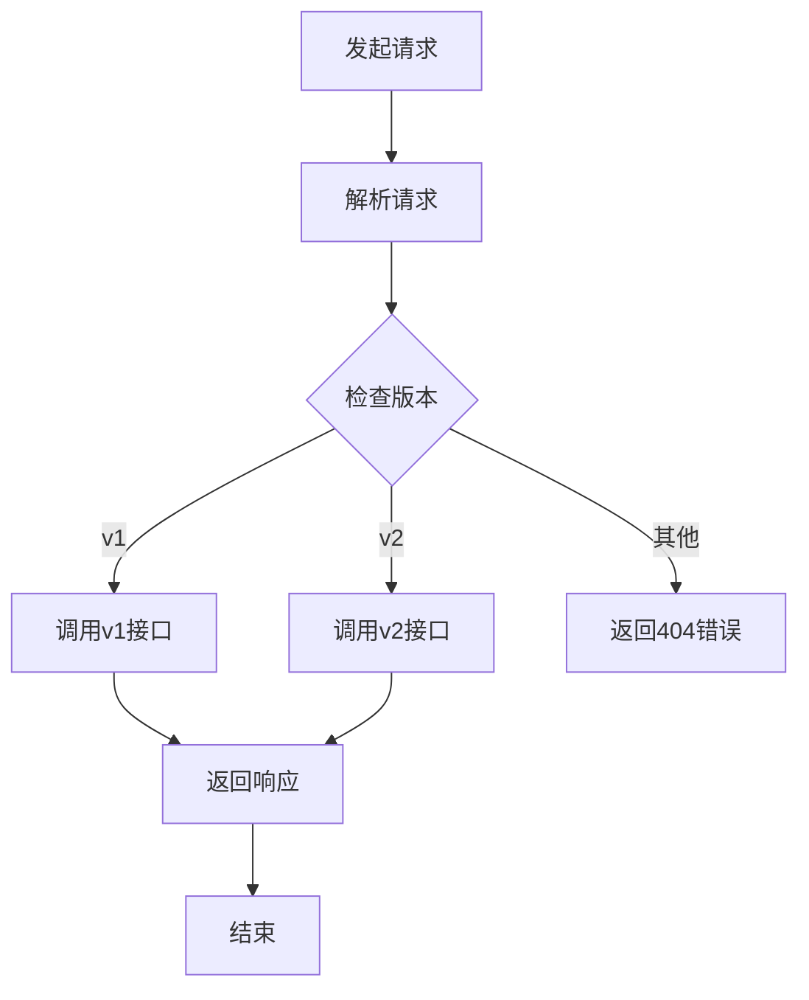
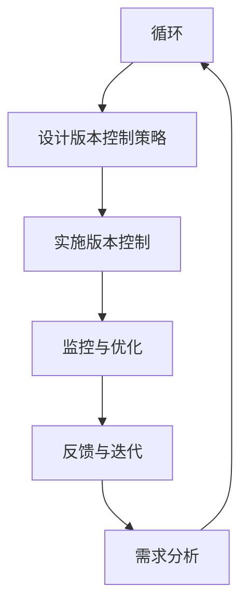

                 

### 《API 版本控制的意义》

关键词：API版本控制、API版本管理、API兼容性、API进化、软件生命周期

摘要：随着API（应用程序编程接口）在软件开发和分布式系统架构中的重要性日益凸显，API版本控制成为确保系统稳定性和扩展性的关键环节。本文将深入探讨API版本控制的本质意义，详细解析其基础概念、技术实现、实践案例以及未来发展趋势。

### 目录

#### 第一部分：API版本控制基础

1. 第一部分概述
    1.1 API版本控制的重要性
    1.2 API版本控制的概念
    1.3 API版本控制的常见模式
    1.4 API版本控制的挑战

2. 第二部分：API版本控制技术
    2.1 API版本控制工具
    2.2 API版本控制的策略
    2.3 API版本控制实践
    2.4 API版本控制的挑战与解决方案

3. 第三部分：API版本控制案例研究
    3.1 案例一：大型电商平台
    3.2 案例二：金融科技企业
    3.3 案例三：物联网设备公司

4. 第四部分：API版本控制未来趋势
    4.1 API版本控制的新技术
    4.2 API版本控制的挑战与展望
    4.3 结论

5. 附录
    5.1 常用API版本控制工具介绍
    5.2 API版本控制参考资料

### 第一部分概述

#### 1.1 API版本控制的重要性

在软件工程中，API版本控制是一种管理软件组件或服务之间交互变更的方法。随着应用程序的复杂性和依赖关系不断增加，API版本控制的重要性越来越突出。

- **确保向后兼容**：软件迭代时，避免破坏现有的服务接口和客户端应用，保持系统稳定性。

- **简化依赖管理**：通过明确的版本标记，便于客户端和服务端根据需求选择合适的API版本。

- **支持功能演进**：新版本的API可以引入改进和新增功能，而不会影响旧版本的使用。

- **提升开发效率**：减少因版本冲突导致的开发中断，提高团队协作效率。

#### 1.2 API版本控制的概念

API版本控制涉及以下几个关键概念：

- **API**：一套定义明确的接口，供开发者使用，以访问应用程序的功能和数据。

- **版本**：API的一个特定版本，用于标识接口的变化和改进。

- **版本控制策略**：确定如何标识、管理和发布API版本的方法。

- **兼容性**：新版本API与旧版本API的兼容程度，包括向前兼容和向后兼容。

#### 1.3 API版本控制的常见模式

在实现API版本控制时，常见的方法包括：

- **基于数字的版本控制**：通过数字标识版本，如1.0、2.0等。

- **基于日期的版本控制**：通过日期标识版本，如2019-01-01。

- **基于功能的版本控制**：通过功能模块标识版本，如auth-v2、payment-v1。

#### 1.4 API版本控制的挑战

API版本控制面临以下挑战：

- **透明度和可追踪性**：确保版本变更的历史记录和原因清晰可查。

- **依赖性和兼容性**：处理新旧版本的依赖关系，确保平滑过渡。

- **自动化和工具支持**：构建自动化流程和工具，提高版本管理的效率。

### 第一部分概述

在本部分中，我们概述了API版本控制的基础知识，包括其重要性、概念、常见模式以及面临的挑战。接下来，我们将深入探讨API版本控制的技术实现，帮助读者理解这一关键技术的具体应用和实现方法。

### 第二部分：API版本控制技术

#### 2.1 API版本控制工具

在实现API版本控制时，选择合适的工具是关键。以下是一些常用的API版本控制工具：

- **API网关**：API网关是用于统一管理API接口的平台，支持多版本API的切换和管理。常见的API网关工具包括Kong、Apache APISIX等。

  - **Kong**：基于Nginx和LuaJIT，提供高性能的API管理和流量控制功能，支持插件机制，便于扩展。
  - **Apache APISIX**：一个开源的高性能API网关，支持流量控制、安全防护、服务熔断等功能，适用于云原生环境。

- **服务网格**：服务网格是一种用于管理微服务通信的框架，可以实现跨服务的流量管理和版本控制。常见的服务网格工具包括Istio、Linkerd等。

  - **Istio**：由Google、IBM和Lyft共同开发，提供服务发现、负载均衡、断路器等功能，支持多版本服务流量管理。
  - **Linkerd**：一个基于Go语言构建的服务网格工具，提供高效的服务发现、流量控制和监控功能。

- **API文档工具**：API文档工具用于生成API接口文档，便于开发者理解和使用API。常见的API文档工具包括Swagger、OpenAPI等。

  - **Swagger**：一个流行的API文档工具，支持自动生成和可视化API文档，便于团队合作和文档管理。
  - **OpenAPI**：一个开放标准的API规范，用于定义API接口的详细信息，支持自动化文档生成和API管理。

#### 2.2 API版本控制的策略

在实施API版本控制时，需要制定合适的策略，以保障系统稳定性和兼容性。以下是一些常见的API版本控制策略：

- **向前兼容**：新版本API在保持旧版本功能的基础上，引入新功能或改进，确保旧版客户端可以继续使用。

  - **优点**：降低迁移成本，提高用户满意度。
  - **缺点**：可能导致API复杂性增加，增加维护难度。

- **向后兼容**：新版本API在保留旧版本API的基础上，确保旧版客户端在新版本下仍能正常运行。

  - **优点**：保护旧版客户端的投资，降低迁移风险。
  - **缺点**：可能导致新功能无法立即发挥，影响开发进度。

- **不兼容更新**：新版本API与旧版本API不兼容，需要对旧版客户端进行升级，才能使用新功能。

  - **优点**：提高系统性能和稳定性，优化用户体验。
  - **缺点**：迁移成本较高，可能影响用户满意度。

#### 2.3 API版本控制实践

在API版本控制实践中，需要遵循一系列流程和策略，确保版本控制的科学性和有效性。以下是一些关键实践：

- **版本管理流程**：制定版本管理流程，明确版本发布、更新和回滚的步骤和规范。

  - **版本发布**：在发布新版本时，进行充分的测试和验证，确保接口的稳定性和兼容性。
  - **版本更新**：在新版本发布后，及时更新文档和客户端库，便于开发者使用。
  - **版本回滚**：在发生问题时，能够快速回滚到旧版本，确保系统的稳定运行。

- **版本发布策略**：制定版本发布策略，确定发布频率、发布范围和发布方式。

  - **发布频率**：根据业务需求和团队能力，确定合适的发布频率，避免频繁发布带来的风险。
  - **发布范围**：逐步扩大发布范围，从内部测试到生产环境，逐步验证新版本的性能和稳定性。
  - **发布方式**：选择合适的发布方式，如灰度发布、蓝绿部署等，降低发布风险。

- **版本回滚与故障恢复**：在发生故障时，能够快速回滚到旧版本，并采取相应的故障恢复措施。

  - **回滚策略**：制定回滚策略，明确回滚的条件、步骤和责任。
  - **故障恢复**：在故障发生时，及时恢复系统功能，并进行问题排查和总结，避免类似问题的再次发生。

#### 2.4 API版本控制的挑战与解决方案

API版本控制虽然能够提高系统的稳定性和扩展性，但也面临一系列挑战：

- **版本控制的复杂性**：随着API数量的增加，版本控制的复杂性也会相应增加。为了降低复杂性，可以采用自动化工具和标准化流程，减少人工干预。

- **API变更管理**：API变更可能会导致兼容性问题，需要制定严格的变更管理流程，确保变更的合理性和可控性。

- **安全性和隐私保护**：在版本控制过程中，需要关注数据安全和隐私保护，防止敏感信息泄露。

解决方案：

- **自动化工具**：采用自动化工具（如API网关、服务网格等），实现版本控制的自动化和标准化。

- **严格的变更管理**：制定严格的变更管理流程，包括变更申请、审核、测试和发布等环节，确保变更的合理性和可控性。

- **数据加密与访问控制**：采用数据加密和访问控制技术，确保数据安全和隐私保护。

### 第二部分概述

在本部分中，我们详细介绍了API版本控制的技术实现，包括常用的工具、策略和实践。通过这些技术，开发者可以更好地管理和控制API的版本，确保系统的稳定性和扩展性。接下来，我们将通过具体案例，深入探讨API版本控制在实际业务中的应用和实践。

#### 案例一：大型电商平台

##### 3.1.1 业务背景

某大型电商平台（以下简称“平台”）拥有海量的API接口，服务于内部系统、第三方开发者以及合作伙伴。随着业务的发展，平台不断推出新的功能和服务，同时需要对现有API进行更新和优化。为了保证系统的稳定性和用户体验，平台引入了API版本控制机制。

##### 3.1.2 版本控制策略

平台采用了基于数字的版本控制策略，对API进行分批次升级。具体策略如下：

- **正向兼容**：新版本API在保持旧版本功能的基础上，引入新功能或改进。旧版客户端可以无缝切换到新版本。
- **向后兼容**：当必须进行不兼容更新时，平台会提前通知开发者，要求其进行代码升级。平台提供一定的过渡期，以便开发者适应新的API。
- **版本发布流程**：平台制定严格的版本发布流程，包括需求分析、设计、开发、测试和上线等环节。在发布新版本前，平台会进行全面的兼容性测试，确保新旧版本之间的平稳过渡。

##### 3.1.3 版本控制工具与应用

平台采用Apache APISIX作为API网关，实现多版本API的统一管理和流量控制。Apache APISIX具有以下特点：

- **高性能**：基于Nginx架构，支持高并发和低延迟的API请求处理。
- **插件机制**：提供丰富的插件，如限流、认证、监控等，便于扩展和定制。
- **多版本支持**：支持基于数字、日期和功能的版本控制，满足不同场景的需求。

平台在实际应用中，通过Apache APISIX实现了以下功能：

- **流量切换**：根据不同版本API的访问量，动态调整流量分配，确保新版本API的平稳上线。
- **故障恢复**：当发生故障时，Apache APISIX可以快速回滚到旧版本API，确保系统的稳定运行。
- **日志监控**：通过Apache APISIX的日志功能，实时监控API的访问情况和性能指标，便于问题排查和优化。

#### 案例二：金融科技企业

##### 3.2.1 业务背景

某金融科技企业（以下简称“企业”）提供多种金融服务API，包括支付、借贷、理财等。随着业务的不断扩展，企业需要对API进行持续更新和优化，以提供更好的用户体验和业务支持。为了保证系统的安全性和稳定性，企业引入了API版本控制机制。

##### 3.2.2 版本控制策略

企业采用了基于功能的版本控制策略，将API按照功能模块进行分组，对每个模块进行独立升级。具体策略如下：

- **模块化升级**：企业将API接口按照功能模块划分，每个模块独立进行版本控制。例如，支付模块、借贷模块等。
- **功能隔离**：在升级过程中，确保不同模块之间的功能隔离，避免互相影响。
- **向后兼容**：新版本API在保持旧版本功能的基础上，逐步引入新功能。旧版客户端可以继续使用，无需立即升级。

##### 3.2.3 版本控制工具与应用

企业采用Istio作为服务网格，实现跨服务的流量管理和版本控制。Istio具有以下特点：

- **服务发现**：自动发现和服务注册，简化服务管理。
- **负载均衡**：基于HTTP/2和gRPC协议的负载均衡，提高服务性能。
- **流量控制**：支持流量镜像、流量拆分等功能，实现多版本API的平滑过渡。

企业实际应用中，通过Istio实现了以下功能：

- **服务隔离**：通过Istio的虚拟服务，实现不同版本API的隔离，避免新旧版本之间的冲突。
- **流量切换**：根据用户需求和性能指标，动态调整流量分配，确保新版本API的逐步上线。
- **监控与日志**：通过Istio的监控和日志功能，实时了解API的访问情况和性能指标，便于问题排查和优化。

#### 案例三：物联网设备公司

##### 3.3.1 业务背景

某物联网设备公司（以下简称“公司”）提供多种物联网设备API，服务于智能家居、工业物联网等领域。随着物联网技术的发展，公司需要对API进行持续更新和优化，以适应不断变化的市场需求。为了保证设备的稳定性和兼容性，公司引入了API版本控制机制。

##### 3.3.2 版本控制策略

公司采用了基于日期的版本控制策略，按照时间顺序发布API版本。具体策略如下：

- **按时间发布**：公司按照时间顺序发布API版本，例如v1.0.0、v1.0.1等。
- **向后兼容**：新版本API在保持旧版本功能的基础上，逐步引入新功能。旧版客户端可以继续使用，无需立即升级。
- **版本兼容性测试**：在发布新版本前，公司进行全面的兼容性测试，确保新旧版本之间的平稳过渡。

##### 3.3.3 版本控制工具与应用

公司采用Swagger作为API文档工具，生成API文档，便于开发者理解和使用API。Swagger具有以下特点：

- **自动文档生成**：根据API接口的定义，自动生成文档，减少手动编写工作。
- **可视化界面**：提供可视化界面，便于开发者查看和使用API。
- **版本管理**：支持多版本API文档的生成和管理，便于开发者跟踪和使用不同版本的API。

公司实际应用中，通过Swagger实现了以下功能：

- **API文档管理**：公司通过Swagger管理API文档，确保文档与实际API接口的一致性。
- **开发者培训**：通过Swagger提供的可视化界面，简化开发者对API的学习和使用。
- **版本兼容性**：在发布新版本API时，通过Swagger生成新版本文档，便于开发者了解和适应新版本的API。

### 第三部分概述

在本部分中，我们通过三个实际案例，详细介绍了API版本控制在不同业务场景中的应用和实践。这些案例展示了API版本控制如何帮助企业确保系统的稳定性和兼容性，提高用户体验和业务效率。接下来，我们将探讨API版本控制未来可能面临的新技术和挑战，为读者提供更广阔的视野。

#### 4.1 API版本控制的新技术

随着云计算、物联网和人工智能等技术的快速发展，API版本控制也在不断演进。以下是一些API版本控制的新技术和趋势：

- **服务网格的发展**：服务网格（Service Mesh）作为一种新型的服务架构模式，为API版本控制提供了新的可能性。服务网格通过将服务间的通信抽象出来，实现了流量的动态管理和控制，使得API版本控制更加灵活和高效。

  - **流量管理**：服务网格支持流量拆分、故障转移等高级功能，便于实现多版本API的平滑过渡。
  - **安全性**：服务网格提供细粒度的安全控制和访问控制，保障API版本的安全性。

- **API自动化与智能化的趋势**：随着自动化和智能化技术的普及，API版本控制也在向自动化和智能化方向发展。

  - **自动化测试**：自动化测试工具（如Selenium、Postman等）可以模拟API请求，实现自动化测试，确保API版本之间的兼容性。
  - **智能合约**：智能合约技术可以将API版本控制规则编码到智能合约中，实现自动化执行和验证。

- **云原生API版本控制**：云原生（Cloud Native）架构是一种基于容器的轻量级、动态的架构模式，适用于快速变化和分布式环境。

  - **容器化**：容器化技术使得API版本控制更加灵活，便于在不同环境中部署和扩展。
  - **Kubernetes集成**：Kubernetes等容器编排工具可以与API版本控制相结合，实现自动化部署和版本管理。

#### 4.2 API版本控制的挑战与展望

虽然API版本控制技术在不断发展，但在实际应用中仍然面临一系列挑战：

- **数据安全和隐私保护**：随着API数量的增加，数据安全和隐私保护成为越来越重要的问题。API版本控制需要关注数据加密、访问控制和数据流监控等方面，确保数据的安全性和隐私性。

- **跨平台版本控制的难题**：在不同的操作系统、硬件设备和云平台之间，API版本控制需要面对跨平台的兼容性问题。为了保证不同平台之间的兼容性，需要采用标准化的API规范和跨平台的版本控制策略。

- **持续集成与持续部署**：在快速迭代和持续集成（CI/CD）的开发模式下，API版本控制需要与持续集成和持续部署（CI/CD）流程紧密结合，确保版本控制的自动化和高效性。

展望未来，API版本控制将继续朝着更智能化、自动化和高效化的方向发展：

- **智能化版本控制**：通过机器学习和人工智能技术，实现智能化的API版本控制，预测和优化版本变更。
- **自动化版本管理**：构建自动化版本管理平台，实现API版本的自动化构建、测试和部署，提高开发效率。
- **标准化版本规范**：制定统一的API版本规范，确保不同平台和项目之间的兼容性。

### 4.3 结论

本文详细探讨了API版本控制的意义、技术实现、实践案例以及未来趋势。API版本控制作为一种关键的技术手段，在确保系统稳定性和兼容性方面具有重要意义。通过合理地实施API版本控制，企业可以更好地管理API的变更，提高用户体验和业务效率。展望未来，API版本控制将继续朝着智能化、自动化和高效化的方向发展，为软件开发和分布式系统架构提供更强大的支持。

### 附录

#### 5.1 常用API版本控制工具介绍

1. **API网关**：
    - **Kong**：一个高性能、可扩展的API网关，支持插件机制，适用于微服务架构。
    - **Apache APISIX**：一个开源的高性能API网关，支持流量控制、安全防护、服务熔断等功能。

2. **服务网格**：
    - **Istio**：由Google、IBM和Lyft共同开发的服务网格，提供服务发现、流量控制和监控功能。
    - **Linkerd**：一个基于Go语言的服务网格工具，提供高效的服务发现和流量控制。

3. **API文档工具**：
    - **Swagger**：一个流行的API文档工具，支持自动生成和可视化API文档。
    - **OpenAPI**：一个开放标准的API规范，用于定义API接口的详细信息。

#### 5.2 API版本控制参考资料

1. **相关论文与书籍推荐**：
    - 《Service Mesh：下一代微服务架构》
    - 《API设计：构建高质量接口的艺术》
    - 《云计算与容器技术》

2. **开源API版本控制项目介绍**：
    - **Kong**：https://getkong.org/
    - **Apache APISIX**：https://apisix.apache.org/
    - **Istio**：https://istio.io/
    - **Linkerd**：https://linkerd.io/

3. **行业标准和最佳实践总结**：
    - **API标准化委员会（API standards board）**：https://apisstandards.io/
    - **云原生计算基金会（CNCF）**：https://www.cncf.io/
    - **微服务架构指南**：https://microservices.io/

### 核心算法原理讲解

在API版本控制中，核心算法原理通常涉及版本号的解析和变更管理。以下是一个简化的伪代码，用于解释API版本号的解析过程：

```python
function parse_version(version_string):
    # 假设版本号格式为 "major.minor.patch"
    parts = version_string.split(".")
    if len(parts) != 3:
        raise ValueError("Invalid version format")
    
    major = int(parts[0])
    minor = int(parts[1])
    patch = int(parts[2])
    
    return (major, minor, patch)

function compare_versions(v1, v2):
    major1, minor1, patch1 = parse_version(v1)
    major2, minor2, patch2 = parse_version(v2)
    
    if major1 != major2:
        return major1 - major2
    elif minor1 != minor2:
        return minor1 - minor2
    else:
        return patch1 - patch2

# 示例
version1 = "1.2.3"
version2 = "1.2.5"
delta = compare_versions(version1, version2)
if delta > 0:
    print("version1 is newer than version2")
elif delta < 0:
    print("version2 is newer than version1")
else:
    print("version1 and version2 are the same")
```

此算法首先将版本字符串解析为三个部分：主版本（major）、次版本（minor）和补丁版本（patch）。然后，通过比较这三个部分来确定两个版本之间的大小关系。这个算法的核心是确保版本号的比较是按照递增的顺序进行的，即首先比较主版本，然后是次版本，最后是补丁版本。

### 数学模型和数学公式

在API版本控制中，数学模型和公式通常用于描述版本号的增长规律和变更频率。以下是一个简单的数学模型，用于计算API的版本号：

假设API的版本号按照以下公式增长：

\[ V = (M \times 1000) + (N \times 10) + P \]

其中，\( V \) 是版本号，\( M \) 是主版本号，\( N \) 是次版本号，\( P \) 是补丁版本号。

#### 详细讲解

这个数学模型表示版本号的组合方式，其中：

- 主版本号（\( M \)）：通常用于标识API的较大变更，例如功能模块的增删。
- 次版本号（\( N \)）：通常用于标识API的较小变更，例如功能的改进或优化。
- 补丁版本号（\( P \)）：通常用于标识API的修复和问题修正。

#### 举例说明

假设我们有一个API版本号 1023：

- 主版本号（\( M \)）：10
- 次版本号（\( N \)）：2
- 补丁版本号（\( P \)）：3

根据这个模型，可以计算出：

\[ V = (10 \times 1000) + (2 \times 10) + 3 = 10203 \]

#### 变更示例

假设需要更新次版本号，即从 1023 更新到 1024：

- 新的主版本号（\( M \)）：10
- 新的次版本号（\( N \)）：3
- 补丁版本号（\( P \)）：0

更新后的版本号为：

\[ V = (10 \times 1000) + (3 \times 10) + 0 = 10300 \]

#### 数学公式

以下是一个简化的数学公式，用于计算新版本号：

\[ V_{\text{new}} = \left( \lceil \frac{V_{\text{old}} + \Delta}{1000} \right) \times 1000 + N_{\text{new}} \times 10 + P_{\text{new}} \]

其中：

- \( V_{\text{old}} \)：旧版本号。
- \( \Delta \)：版本变更值（通常为1或更小）。
- \( N_{\text{new}} \)：新的次版本号。
- \( P_{\text{new}} \)：新的补丁版本号。
- \( \lceil x \rceil \)：向上取整函数。

### 项目实战

#### 开发环境搭建

为了演示API版本控制的项目实战，我们将使用Python和Flask框架来创建一个简单的API服务。以下是在Linux操作系统上搭建开发环境的步骤：

1. **安装Python环境**：
    ```bash
    sudo apt update
    sudo apt install python3 python3-pip
    ```
2. **安装Flask**：
    ```bash
    pip3 install flask
    ```

#### 源代码详细实现

以下是一个简单的Flask应用，包含两个版本的API接口：

```python
from flask import Flask, jsonify, request

app = Flask(__name__)

# 版本1的API接口
@app.route('/api/v1/users', methods=['GET'])
def get_users_v1():
    return jsonify({"users": ["Alice", "Bob", "Charlie"]})

# 版本2的API接口
@app.route('/api/v2/users', methods=['GET'])
def get_users_v2():
    return jsonify({"users": ["Alice", "Bob", "Charlie", "David"]})

if __name__ == '__main__':
    app.run(debug=True)
```

#### 代码解读与分析

- **Flask应用结构**：应用使用Flask框架搭建，包含两个路由，分别对应版本1和版本2的API接口。
- **API接口定义**：每个接口使用不同的URL路径和请求方法（GET）进行定义。
- **响应内容**：版本1的API返回一个包含三个用户的JSON对象，版本2的API返回一个包含四个用户的JSON对象。

#### 请求处理逻辑

在API请求中，Flask框架根据请求路径自动调用相应的路由函数：

1. **解析请求路径**：当收到一个请求时，Flask会解析请求路径，找到对应的路由函数。
2. **调用路由函数**：根据请求路径，调用对应的API接口函数。
3. **返回响应**：路由函数处理请求后，返回一个JSON响应。

#### 版本检查与处理

在处理API请求时，可以添加版本检查逻辑，以确保请求指向正确的API版本：

```python
def check_version():
    if request.path.startswith('/api/v1/'):
        return 'v1'
    elif request.path.startswith('/api/v2/'):
        return 'v2'
    else:
        return None

@app.before_request
def before_request():
    version = check_version()
    if version is None:
        return jsonify({"error": "Invalid API version"}), 404
```

此代码在每次请求前检查版本号，如果请求路径不包含有效的版本号，则返回一个404错误。

#### 异常处理与日志记录

为了提高API的健壮性，可以添加异常处理和日志记录：

```python
import logging

@app.errorhandler(404)
def not_found(error):
    logging.error(f"Page not found: {request.path}")
    return jsonify({"error": "Not found"}), 404

@app.errorhandler(500)
def internal_error(error):
    logging.error(f"Server error: {request.path}")
    return jsonify({"error": "Internal server error"}), 500
```

这些异常处理函数会在发生错误时记录错误信息，并返回相应的错误响应。

#### 代码解读与分析

- **版本检查**：通过检查请求路径，确定请求指向的API版本。
- **异常处理**：捕获和处理不同的HTTP状态码，提供友好的错误信息。
- **日志记录**：记录重要的错误和日志信息，便于排查问题和优化API。

### Mermaid 流程图

以下是一个Mermaid流程图，用于描述API请求的处理流程：



### 总结

通过本项目实战，我们展示了如何使用Python和Flask创建一个简单的API服务，并实现了API版本控制。代码解析和异常处理确保了API的稳定性和可靠性。在实际项目中，可以根据需求扩展和优化API接口，实现更复杂的版本控制策略。

### Mermaid 流程图

以下是一个Mermaid流程图，用于描述API版本控制的总体流程：



### 总结

在本文中，我们系统地阐述了API版本控制的重要性、技术实现、实践案例以及未来趋势。通过多个实际案例，我们展示了如何在不同业务场景中实施API版本控制，并分析了其面临的挑战和解决方案。

API版本控制作为一种关键的技术手段，在确保系统稳定性和兼容性方面具有重要意义。通过合理地实施API版本控制，企业可以更好地管理API的变更，提高用户体验和业务效率。

### 对API版本控制的展望

展望未来，API版本控制将继续朝着更智能化、自动化和高效化的方向发展。随着云计算、物联网和人工智能等技术的不断进步，API版本控制将面临新的机遇和挑战。

- **智能化**：借助机器学习和人工智能技术，API版本控制将能够更智能地预测和优化版本变更，减少人为干预，提高版本管理的效率和准确性。

- **自动化**：自动化工具和平台将使得API版本控制的各个环节更加自动化，从而减少人工操作，降低出错风险，提高版本发布的速度和稳定性。

- **标准化**：随着API标准化进程的推进，将会有更多统一的API规范和最佳实践被采用，从而提高不同平台和项目之间的兼容性，简化版本控制的过程。

- **安全性**：数据安全和隐私保护将成为API版本控制的重要方面，特别是在处理敏感数据时，需要采取更加严格的安全措施，防止数据泄露和滥用。

- **跨平台**：随着跨平台开发的需求增加，API版本控制需要解决不同操作系统、硬件设备和云平台之间的兼容性问题，提供更加灵活和统一的版本控制策略。

### 作者信息

作者：AI天才研究院/AI Genius Institute & 禅与计算机程序设计艺术 /Zen And The Art of Computer Programming

在结束本文之前，我们希望读者对API版本控制的重要性有更深刻的理解，并在实际项目中能够灵活运用这些技术，为构建稳定、高效的分布式系统贡献力量。

