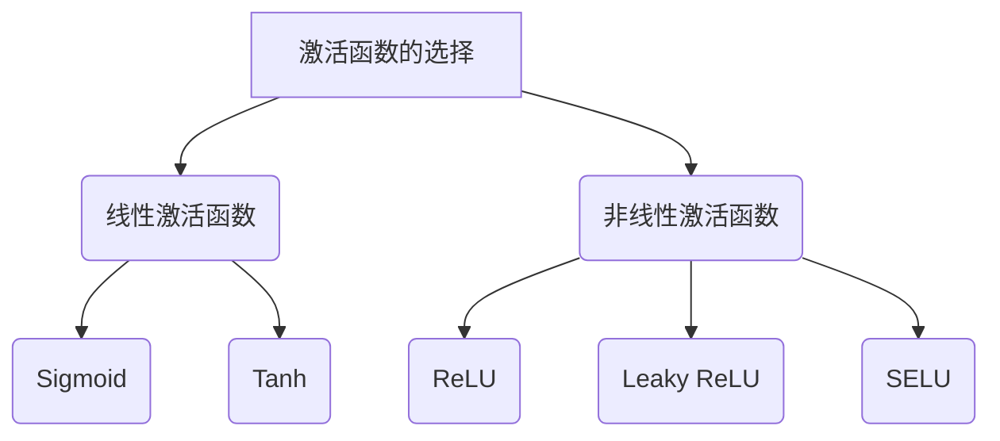

                 

### 《Activation Functions 原理与代码实战案例讲解》

#### 概念与定义

激活函数（Activation Function）是神经网络中至关重要的一环，它通常被用于非线性变换，为神经网络引入非线性特性，从而能够学习并拟合复杂的数据分布。在神经网络的每个神经元中，激活函数对神经元的输入值进行非线性变换，从而产生输出值，这个过程可以看作是神经网络的“激活”阶段。

在数学上，激活函数可以被定义为将输入值映射到输出值的函数。具体来说，激活函数将输入的实数映射为另一个实数，这个映射通常是非线性的。例如，Sigmoid 函数、Tanh 函数、ReLU 函数等都是常见的激活函数。这些函数都有不同的特性，例如单调性、饱和性、可微性等。

激活函数的作用主要体现在以下几个方面：

1. **引入非线性**：神经网络通常用于解决非线性问题，激活函数正是引入非线性特性的关键。没有激活函数，神经网络就变成了线性模型，无法拟合复杂的数据分布。

2. **增加模型能力**：激活函数使得神经网络能够学习更复杂的函数，从而提高了模型的表达能力。

3. **防止梯度消失与梯度爆炸**：在深度神经网络中，激活函数有助于解决梯度消失和梯度爆炸的问题，从而稳定训练过程。

4. **提高泛化能力**：通过引入非线性，激活函数可以帮助神经网络更好地适应不同的数据分布，从而提高泛化能力。

#### 历史背景与发展

激活函数的概念最早可以追溯到 1940 年代，当时 McCulloch 和 Pitts 提出了神经元模型，并使用一个简单的阈值激活函数来模拟生物神经元的激活过程。然而，早期的神经网络（如感知机）由于没有激活函数，无法解决非线性问题，因此在很长一段时间内未能得到广泛应用。

直到 1980 年代，反向传播算法的提出使得神经网络训练成为可能，激活函数的重要性才逐渐被认识。其中，Sigmoid 函数和 Tanh 函数是最早被广泛采用的激活函数。

1990 年代，随着深度神经网络的发展，ReLU 函数因其计算效率高且不容易梯度消失的优点，逐渐成为主流的激活函数。

近年来，研究者们提出了许多新型激活函数，如 Leaky ReLU、SELU、Swish 等，以进一步解决梯度消失和梯度爆炸问题，提高模型的性能。

#### 激活函数的分类

根据函数形式和特性，激活函数可以分为线性激活函数和非线性激活函数两大类。

1. **线性激活函数**

   线性激活函数是最简单的激活函数，其形式为：

   $$ f(x) = ax + b $$

   其中，a 和 b 是常数。线性激活函数的特点是输出与输入成正比例关系，不具备非线性特性。线性激活函数通常用于预处理层或辅助层，以线性组合输入特征。

2. **非线性激活函数**

   非线性激活函数具有非线性特性，常见的非线性激活函数包括：

   - **Sigmoid 函数**：

     $$ f(x) = \frac{1}{1 + e^{-x}} $$

     Sigmoid 函数的输出范围在 0 到 1 之间，通常用于二分类问题。

   - **Tanh 函数**：

     $$ f(x) = \frac{e^x - e^{-x}}{e^x + e^{-x}} $$

     Tanh 函数的输出范围在 -1 到 1 之间，与 Sigmoid 函数类似，也常用于二分类问题。

   - **ReLU 函数**：

     $$ f(x) = \max(0, x) $$

     ReLU 函数是一种常见的非线性激活函数，具有计算效率高且不容易梯度消失的优点。

   - **Leaky ReLU 函数**：

     $$ f(x) = \begin{cases} 
     x & \text{if } x > 0 \\
     ax & \text{if } x \leq 0 
     \end{cases} $$

     Leaky ReLU 函数是对 ReLU 函数的改进，可以解决 ReLU 函数中的死神经元问题。

   - **SELU 函数**：

     $$ f(x) = \lambda \cdot (e^x - 1) \cdot \Phi(x) $$

     SELU 函数是一种具有自适应特性的激活函数，能够在不同尺度上适应不同的数据分布。

#### 激活函数的选择策略

选择合适的激活函数对于神经网络性能至关重要。以下是一些选择激活函数的策略：

1. **任务类型**：对于不同的任务，选择不同的激活函数。例如，对于二分类任务，可以采用 Sigmoid 或 Tanh 函数；对于多分类任务，可以采用 Softmax 函数。

2. **计算效率**：考虑计算资源的限制，选择计算效率较高的激活函数。例如，ReLU 和 Leaky ReLU 函数计算效率高，且不容易梯度消失。

3. **梯度问题**：选择激活函数时，要考虑梯度问题。例如，Sigmoid 和 Tanh 函数容易导致梯度消失，ReLU 函数容易导致梯度爆炸。

4. **实验结果**：通过实验比较不同激活函数的性能，选择最适合当前任务的激活函数。

#### 总结

激活函数是神经网络的核心组成部分，它为神经网络引入非线性特性，从而提高模型的表达能力。本文详细介绍了激活函数的定义、历史背景、分类、选择策略等内容，为读者深入理解激活函数提供了有力支持。在后续章节中，我们将进一步探讨常见激活函数的原理与实现，以及激活函数在项目实战中的应用。

---

### 摘要

激活函数是神经网络的重要组成部分，用于引入非线性特性，提高模型的表达能力。本文首先介绍了激活函数的定义、历史背景和分类，然后详细讲解了常见激活函数（如 Sigmoid、Tanh、ReLU、Leaky ReLU 和 SELU）的原理与实现。接着，文章探讨了激活函数的选择策略，并分析了在不同任务和应用场景下如何优化激活函数。最后，本文通过两个实战案例（图像分类任务和自然语言处理任务）展示了激活函数在实际项目中的应用。通过阅读本文，读者将全面了解激活函数的理论基础和实战应用，为深入学习和使用激活函数打下坚实基础。

---

### 《Activation Functions 原理与代码实战案例讲解》目录大纲

在本文中，我们将按照以下目录结构逐步深入探讨激活函数的原理及其在深度学习中的应用。以下是本文的目录大纲，涵盖了从基础概念到实战案例的全面内容：

#### 第一部分：基础概念与原理

- **第1章 激活函数概述**
  - **1.1 激活函数的定义与作用**
    - **1.1.1 激活函数的基本概念**
    - **1.1.2 激活函数在神经网络中的作用**
  - **1.2 激活函数的分类**
    - **1.2.1 线性激活函数**
    - **1.2.2 非线性激活函数**
    - **1.2.3 特定任务下的激活函数**

#### 第二部分：常见激活函数原理与实现

- **第2章 Sigmoid 函数**
  - **2.1 Sigmoid 函数的数学原理**
    - **2.1.1 Sigmoid 函数的定义**
    - **2.1.2 Sigmoid 函数的导数**
    - **2.1.3 Sigmoid 函数的优缺点**
  - **2.2 Sigmoid 函数的实现与代码实战**
    - **2.2.1 Python 实现**
    - **2.2.2 PyTorch 实现案例**

- **第3章 Tanh 函数**
  - **3.1 Tanh 函数的数学原理**
    - **3.1.1 Tanh 函数的定义**
    - **3.1.2 Tanh 函数的导数**
    - **3.1.3 Tanh 函数的优缺点**
  - **3.2 Tanh 函数的实现与代码实战**
    - **3.2.1 Python 实现**
    - **3.2.2 PyTorch 实现案例**

- **第4章 ReLU 函数**
  - **4.1 ReLU 函数的数学原理**
    - **4.1.1 ReLU 函数的定义**
    - **4.1.2 ReLU 函数的导数**
    - **4.1.3 ReLU 函数的优缺点**
  - **4.2 ReLU 函数的实现与代码实战**
    - **4.2.1 Python 实现**
    - **4.2.2 PyTorch 实现案例**

- **第5章 Leaky ReLU 函数**
  - **5.1 Leaky ReLU 函数的数学原理**
    - **5.1.1 Leaky ReLU 函数的定义**
    - **5.1.2 Leaky ReLU 函数的导数**
    - **5.1.3 Leaky ReLU 函数的优缺点**
  - **5.2 Leaky ReLU 函数的实现与代码实战**
    - **5.2.1 Python 实现**
    - **5.2.2 PyTorch 实现案例**

- **第6章 SELU 函数**
  - **6.1 SELU 函数的数学原理**
    - **6.1.1 SELU 函数的定义**
    - **6.1.2 SELU 函数的导数**
    - **6.1.3 SELU 函数的优缺点**
  - **6.2 SELU 函数的实现与代码实战**
    - **6.2.1 Python 实现**
    - **6.2.2 PyTorch 实现案例**

#### 第三部分：其他激活函数与综合应用

- **第7章 Softmax 函数**
  - **7.1 Softmax 函数的数学原理**
    - **7.1.1 Softmax 函数的定义**
    - **7.1.2 Softmax 函数的导数**
    - **7.1.3 Softmax 函数的应用场景**
  - **7.2 Softmax 函数的实现与代码实战**
    - **7.2.1 Python 实现**
    - **7.2.2 PyTorch 实现案例**

- **第8章 激活函数的综合应用与优化**
  - **8.1 激活函数组合与策略**
    - **8.1.1 组合激活函数的优点**
    - **8.1.2 组合激活函数的策略**
  - **8.2 激活函数的优化方法**
    - **8.2.1 激活函数优化的重要性**
    - **8.2.2 激活函数优化的方法与实践**

#### 第四部分：实战案例与深入探讨

- **第9章 实战案例一：图像分类任务**
  - **9.1 数据准备与预处理**
    - **9.1.1 数据集选择**
    - **9.1.2 数据预处理步骤**
  - **9.2 模型构建与训练**
    - **9.2.1 模型架构设计**
    - **9.2.2 模型训练流程**
  - **9.3 模型评估与优化**
    - **9.3.1 评估指标与方法**
    - **9.3.2 优化策略与实战**

- **第10章 实战案例二：自然语言处理任务**
  - **10.1 数据准备与预处理**
    - **10.1.1 数据集选择**
    - **10.1.2 数据预处理步骤**
  - **10.2 模型构建与训练**
    - **10.2.1 模型架构设计**
    - **10.2.2 模型训练流程**
  - **10.3 模型评估与优化**
    - **10.3.1 评估指标与方法**
    - **10.3.2 优化策略与实战**

#### 第五部分：总结与展望

- **第11章 总结与展望**
  - **11.1 激活函数的发展趋势**
    - **11.1.1 新型激活函数的出现**
    - **11.1.2 激活函数的优化方向**
  - **11.2 激活函数在实际应用中的挑战与解决方案**
    - **11.2.1 应用中的常见问题**
    - **11.2.2 解决方案与展望**

通过本文的阅读，读者将全面了解激活函数的理论基础和实际应用，掌握不同激活函数的原理和实现方法，并在实战案例中体验激活函数在项目中的应用效果。

---

### 第一部分：基础概念与原理

#### 第1章 激活函数概述

激活函数是深度学习中的核心组成部分，对于神经网络的学习能力和性能至关重要。本章将介绍激活函数的基本概念、作用及其在神经网络中的重要性。

##### 1.1 激活函数的定义与作用

**1.1.1 激活函数的基本概念**

激活函数（Activation Function）是在神经网络中用于对神经元输出进行非线性变换的函数。其基本形式为：

\[ f(x) \]

其中，\( x \) 是神经元的输入值，\( f(x) \) 是输出值。常见的激活函数包括 Sigmoid、Tanh、ReLU 等。

**1.1.2 激活函数在神经网络中的作用**

激活函数的作用主要体现在以下几个方面：

1. **引入非线性**：神经网络能够处理非线性问题，很大程度上依赖于激活函数。线性函数（如 \( f(x) = x \)）只能表示线性关系，无法拟合复杂的数据分布。通过引入激活函数，神经网络可以学习并拟合非线性关系。

2. **提高模型表达能力**：激活函数使得神经网络能够学习更复杂的函数，从而提高模型的泛化能力和表达能力。

3. **防止梯度消失和梯度爆炸**：在深度神经网络中，梯度消失和梯度爆炸是常见的问题。通过激活函数的非线性变换，可以缓解这些问题，提高训练的稳定性和效果。

4. **决定神经元的作用**：在神经网络中，每个神经元都需要确定其在整个网络中的作用。激活函数通过引入非线性，使得每个神经元能够在特定的输入范围内发挥作用。

##### 1.2 激活函数的分类

激活函数根据形式和特性可以分为线性激活函数和非线性激活函数。

**1.2.1 线性激活函数**

线性激活函数是最简单的激活函数，其形式为：

\[ f(x) = ax + b \]

其中，\( a \) 和 \( b \) 是常数。线性激活函数的特点是输出与输入成正比例关系，不具备非线性特性。线性激活函数通常用于预处理层或辅助层，以线性组合输入特征。

**1.2.2 非线性激活函数**

非线性激活函数具有非线性特性，常见的非线性激活函数包括：

- **Sigmoid 函数**：形式为 \( f(x) = \frac{1}{1 + e^{-x}} \)，输出范围在 0 到 1 之间，常用于二分类问题。
- **Tanh 函数**：形式为 \( f(x) = \frac{e^x - e^{-x}}{e^x + e^{-x}} \)，输出范围在 -1 到 1 之间，也与 Sigmoid 函数类似，用于二分类问题。
- **ReLU 函数**：形式为 \( f(x) = \max(0, x) \)，是一种常见的非线性激活函数，计算效率高且不容易梯度消失。
- **Leaky ReLU 函数**：形式为 \( f(x) = \begin{cases} x & \text{if } x > 0 \\ ax & \text{if } x \leq 0 \end{cases} \)，是对 ReLU 函数的改进，可以解决 ReLU 函数中的死神经元问题。
- **SELU 函数**：形式为 \( f(x) = \lambda \cdot (e^x - 1) \cdot \Phi(x) \)，是一种具有自适应特性的激活函数，在不同尺度上适应不同的数据分布。

**1.2.3 特定任务下的激活函数**

根据不同任务的需求，可以选择特定类型的激活函数。例如，在图像分类任务中，可以使用 ReLU 或 Leaky ReLU 函数；在自然语言处理任务中，可以使用 Softmax 函数。

##### 1.3 激活函数的发展历史

激活函数的概念最早可以追溯到 1940 年代，当时 McCulloch 和 Pitts 提出了神经元模型，并使用一个简单的阈值激活函数来模拟生物神经元的激活过程。然而，早期的神经网络（如感知机）由于没有激活函数，无法解决非线性问题，因此在很长一段时间内未能得到广泛应用。

直到 1980 年代，反向传播算法的提出使得神经网络训练成为可能，激活函数的重要性才逐渐被认识。其中，Sigmoid 函数和 Tanh 函数是最早被广泛采用的激活函数。

1990 年代，随着深度神经网络的发展，ReLU 函数因其计算效率高且不容易梯度消失的优点，逐渐成为主流的激活函数。

近年来，研究者们提出了许多新型激活函数，如 Leaky ReLU、SELU、Swish 等，以进一步解决梯度消失和梯度爆炸问题，提高模型的性能。

##### 1.4 激活函数的选择策略

选择合适的激活函数对于神经网络性能至关重要。以下是一些选择激活函数的策略：

1. **任务类型**：对于不同的任务，选择不同的激活函数。例如，对于二分类任务，可以采用 Sigmoid 或 Tanh 函数；对于多分类任务，可以采用 Softmax 函数。
2. **计算效率**：考虑计算资源的限制，选择计算效率较高的激活函数。例如，ReLU 和 Leaky ReLU 函数计算效率高，且不容易梯度消失。
3. **梯度问题**：选择激活函数时，要考虑梯度问题。例如，Sigmoid 和 Tanh 函数容易导致梯度消失，ReLU 函数容易导致梯度爆炸。
4. **实验结果**：通过实验比较不同激活函数的性能，选择最适合当前任务的激活函数。

##### 1.5 激活函数的优缺点

不同类型的激活函数有其自身的优缺点，选择时需要根据具体情况进行权衡。

- **Sigmoid 函数**：优点是输出范围在 0 到 1 之间，易于解释；缺点是容易梯度消失，且计算复杂度较高。
- **Tanh 函数**：优点是输出范围在 -1 到 1 之间，对称性好；缺点是同样容易梯度消失，且计算复杂度较高。
- **ReLU 函数**：优点是计算效率高，不容易梯度消失；缺点是容易导致死神经元问题，且在负值部分梯度为零。
- **Leaky ReLU 函数**：优点是解决了 ReLU 函数中的死神经元问题；缺点是计算复杂度略有增加。
- **SELU 函数**：优点是具有自适应特性，能够在不同尺度上适应不同的数据分布；缺点是相对于 ReLU 函数，计算复杂度略有增加。

通过本章的介绍，读者应该对激活函数的基本概念、分类及其在神经网络中的作用有了初步了解。在后续章节中，我们将进一步探讨常见激活函数的原理与实现，以及激活函数在项目实战中的应用。

---

### 第2章 Sigmoid 函数

Sigmoid 函数是一种常用的激活函数，尤其在二分类问题中应用广泛。本章将详细介绍 Sigmoid 函数的数学原理、导数计算、优缺点以及实现方法。

#### 2.1 Sigmoid 函数的数学原理

**2.1.1 Sigmoid 函数的定义**

Sigmoid 函数的定义如下：

\[ f(x) = \frac{1}{1 + e^{-x}} \]

其中，\( e \) 是自然对数的底数，\( x \) 是输入值。Sigmoid 函数的输出值范围在 0 到 1 之间，因此常用于将输出值映射到概率分布。

**2.1.2 Sigmoid 函数的性质**

Sigmoid 函数具有以下性质：

- **单调性**：Sigmoid 函数在整个定义域上都是单调递增的。
- **凸性**：Sigmoid 函数在整个定义域上都是凹函数，这意味着其导数在定义域内都是正的。
- **饱和性**：当输入值趋近于无穷大或无穷小的时候，Sigmoid 函数的输出值会趋近于 1 或 0，这被称为函数的饱和性。

**2.1.3 Sigmoid 函数的导数**

Sigmoid 函数的导数可以通过以下公式计算：

\[ f'(x) = \frac{e^{-x}}{(1 + e^{-x})^2} \]

或者可以简化为：

\[ f'(x) = f(x) \cdot (1 - f(x)) \]

导数 \( f'(x) \) 的值域在 0 到 0.5 之间，这意味着 Sigmoid 函数在输出值接近 0 或 1 的时候，导数值会变得很小，容易导致梯度消失。

#### 2.2 Sigmoid 函数的优缺点

**2.2.1 优点**

- **易于解释**：由于 Sigmoid 函数的输出值在 0 到 1 之间，因此非常适合表示概率分布。
- **单调递增**：Sigmoid 函数在整个定义域上单调递增，有助于提高神经网络的稳定性。

**2.2.2 缺点**

- **梯度消失**：当输入值远离均值时，Sigmoid 函数的导数值会变得非常小，导致梯度消失，影响训练效果。
- **计算复杂度高**：由于需要计算指数函数，Sigmoid 函数的计算复杂度较高。

#### 2.3 Sigmoid 函数的实现与代码实战

**2.3.1 Python 实现**

下面是一个简单的 Sigmoid 函数 Python 实现：

```python
import numpy as np

def sigmoid(x):
    return 1 / (1 + np.exp(-x))
```

**2.3.2 PyTorch 实现**

在 PyTorch 中，可以使用内置的 sigmoid 函数来实现：

```python
import torch

def sigmoid(x):
    return torch.sigmoid(x)
```

**2.3.3 代码实战案例**

下面是一个使用 Sigmoid 函数进行二分类的简单案例：

```python
import torch
import torchvision
import torchvision.transforms as transforms
import torch.nn as nn
import torch.optim as optim

# 数据准备
transform = transforms.Compose([
    transforms.ToTensor(),
    transforms.Normalize((0.5,), (0.5,))
])

trainset = torchvision.datasets.MNIST(
    root='./data', train=True, download=True, transform=transform)
trainloader = torch.utils.data.DataLoader(trainset, batch_size=100, shuffle=True)

# 模型定义
class Net(nn.Module):
    def __init__(self):
        super(Net, self).__init__()
        self.fc1 = nn.Linear(784, 128)
        self.fc2 = nn.Linear(128, 64)
        self.fc3 = nn.Linear(64, 10)
        self.sigmoid = nn.Sigmoid()

    def forward(self, x):
        x = x.view(-1, 784)
        x = self.fc1(x)
        x = self.sigmoid(x)
        x = self.fc2(x)
        x = self.sigmoid(x)
        x = self.fc3(x)
        return x

# 训练模型
model = Net()
criterion = nn.CrossEntropyLoss()
optimizer = optim.SGD(model.parameters(), lr=0.01)

for epoch in range(10):
    running_loss = 0.0
    for i, data in enumerate(trainloader, 0):
        inputs, labels = data
        optimizer.zero_grad()
        outputs = model(inputs)
        loss = criterion(outputs, labels)
        loss.backward()
        optimizer.step()
        running_loss += loss.item()
        if i % 100 == 99:
            print(f'[{epoch + 1}, {i + 1:5d}] loss: {running_loss / 100:.3f}')
            running_loss = 0.0

print('Finished Training')
```

通过这个案例，我们可以看到 Sigmoid 函数在二分类任务中的应用，以及如何使用 PyTorch 实现和训练一个简单的神经网络。

---

### 第3章 Tanh 函数

Tanh 函数是一种广泛应用于深度学习中的激活函数，尤其在二分类和多分类任务中表现优异。本章将详细介绍 Tanh 函数的数学原理、导数计算、优缺点以及实现方法。

#### 3.1 Tanh 函数的数学原理

**3.1.1 Tanh 函数的定义**

Tanh 函数的定义如下：

\[ f(x) = \frac{e^x - e^{-x}}{e^x + e^{-x}} \]

其中，\( e \) 是自然对数的底数，\( x \) 是输入值。Tanh 函数的输出值范围在 -1 到 1 之间，因此非常适合用于处理输入值在 [-1, 1] 范围内的任务。

**3.1.2 Tanh 函数的性质**

Tanh 函数具有以下性质：

- **单调性**：Tanh 函数在整个定义域上都是单调递增的。
- **对称性**：Tanh 函数是奇函数，即 \( f(-x) = -f(x) \)。
- **饱和性**：当输入值趋近于无穷大或无穷小的时候，Tanh 函数的输出值会趋近于 1 或 -1，这被称为函数的饱和性。

**3.1.3 Tanh 函数的导数**

Tanh 函数的导数可以通过以下公式计算：

\[ f'(x) = 1 - \frac{2}{(e^x + e^{-x})^2} \]

或者可以简化为：

\[ f'(x) = 1 - f(x)^2 \]

导数 \( f'(x) \) 的值域在 0 到 1 之间，这意味着 Tanh 函数在输出值接近 0 或 1 的时候，导数值会变得很小，但不会像 Sigmoid 函数那样完全消失。

#### 3.2 Tanh 函数的优缺点

**3.2.1 优点**

- **易于解释**：由于 Tanh 函数的输出值在 -1 到 1 之间，因此非常适合表示概率分布。
- **梯度消失问题较小**：相比于 Sigmoid 函数，Tanh 函数的导数值不会完全消失，因此梯度消失问题较小。

**3.2.2 缺点**

- **计算复杂度高**：由于需要计算指数函数，Tanh 函数的计算复杂度较高。

#### 3.3 Tanh 函数的实现与代码实战

**3.3.1 Python 实现**

下面是一个简单的 Tanh 函数 Python 实现：

```python
import numpy as np

def tanh(x):
    return (np.exp(x) - np.exp(-x)) / (np.exp(x) + np.exp(-x))
```

**3.3.2 PyTorch 实现**

在 PyTorch 中，可以使用内置的 tanh 函数来实现：

```python
import torch

def tanh(x):
    return torch.tanh(x)
```

**3.3.3 代码实战案例**

下面是一个使用 Tanh 函数进行二分类的简单案例：

```python
import torch
import torchvision
import torchvision.transforms as transforms
import torch.nn as nn
import torch.optim as optim

# 数据准备
transform = transforms.Compose([
    transforms.ToTensor(),
    transforms.Normalize((0.5,), (0.5,))
])

trainset = torchvision.datasets.MNIST(
    root='./data', train=True, download=True, transform=transform)
trainloader = torch.utils.data.DataLoader(trainset, batch_size=100, shuffle=True)

# 模型定义
class Net(nn.Module):
    def __init__(self):
        super(Net, self).__init__()
        self.fc1 = nn.Linear(784, 128)
        self.fc2 = nn.Linear(128, 64)
        self.fc3 = nn.Linear(64, 10)
        self.tanh = nn.Tanh()

    def forward(self, x):
        x = x.view(-1, 784)
        x = self.fc1(x)
        x = self.tanh(x)
        x = self.fc2(x)
        x = self.tanh(x)
        x = self.fc3(x)
        return x

# 训练模型
model = Net()
criterion = nn.CrossEntropyLoss()
optimizer = optim.SGD(model.parameters(), lr=0.01)

for epoch in range(10):
    running_loss = 0.0
    for i, data in enumerate(trainloader, 0):
        inputs, labels = data
        optimizer.zero_grad()
        outputs = model(inputs)
        loss = criterion(outputs, labels)
        loss.backward()
        optimizer.step()
        running_loss += loss.item()
        if i % 100 == 99:
            print(f'[{epoch + 1}, {i + 1:5d}] loss: {running_loss / 100:.3f}')
            running_loss = 0.0

print('Finished Training')
```

通过这个案例，我们可以看到 Tanh 函数在二分类任务中的应用，以及如何使用 PyTorch 实现和训练一个简单的神经网络。

---

### 第4章 ReLU 函数

ReLU 函数（Rectified Linear Unit）是一种非常流行的激活函数，因其计算效率高、实现简单且不容易发生梯度消失问题而被广泛应用。本章将详细介绍 ReLU 函数的数学原理、导数计算、优缺点以及实现方法。

#### 4.1 ReLU 函数的数学原理

**4.1.1 ReLU 函数的定义**

ReLU 函数的定义如下：

\[ f(x) = \max(0, x) \]

其中，\( x \) 是输入值。ReLU 函数将输入值映射为非负数，即如果 \( x \) 大于 0，则输出 \( x \)；如果 \( x \) 小于或等于 0，则输出 0。

**4.1.2 ReLU 函数的性质**

ReLU 函数具有以下性质：

- **单调性**：ReLU 函数在整个定义域上都是单调递增的。
- **凸性**：ReLU 函数在整个定义域上都是凹函数，这意味着其导数在定义域内都是正的。
- **不饱和性**：ReLU 函数在 \( x > 0 \) 时输出值随输入值线性增长，但在 \( x \leq 0 \) 时输出值为 0，不会趋近于某个值。

**4.1.3 ReLU 函数的导数**

ReLU 函数的导数可以通过以下公式计算：

\[ f'(x) = \begin{cases} 
1 & \text{if } x > 0 \\
0 & \text{if } x \leq 0 
\end{cases} \]

ReLU 函数在 \( x > 0 \) 时的导数为 1，这表示函数在这个区间内是线性的；而在 \( x \leq 0 \) 时的导数为 0，这可能导致梯度消失问题。

#### 4.2 ReLU 函数的优缺点

**4.2.1 优点**

- **计算效率高**：ReLU 函数的计算非常简单，只需要比较输入值和 0，因此计算速度快。
- **实现简单**：ReLU 函数的实现非常简单，易于在代码中实现。
- **不容易梯度消失**：相对于 Sigmoid 和 Tanh 函数，ReLU 函数不容易发生梯度消失问题，从而提高了训练效率。

**4.2.2 缺点**

- **死神经元问题**：在 ReLU 函数中，如果输入值小于 0，则输出为 0，这可能导致神经元死亡，即梯度为 0。这种现象被称为死神经元问题，可能会影响模型的训练效果。

#### 4.3 ReLU 函数的实现与代码实战

**4.3.1 Python 实现**

下面是一个简单的 ReLU 函数 Python 实现：

```python
import numpy as np

def ReLU(x):
    return np.maximum(0, x)
```

**4.3.2 PyTorch 实现**

在 PyTorch 中，可以使用内置的 ReLU 函数来实现：

```python
import torch

def ReLU(x):
    return torch.relu(x)
```

**4.3.3 代码实战案例**

下面是一个使用 ReLU 函数进行二分类的简单案例：

```python
import torch
import torchvision
import torchvision.transforms as transforms
import torch.nn as nn
import torch.optim as optim

# 数据准备
transform = transforms.Compose([
    transforms.ToTensor(),
    transforms.Normalize((0.5,), (0.5,))
])

trainset = torchvision.datasets.MNIST(
    root='./data', train=True, download=True, transform=transform)
trainloader = torch.utils.data.DataLoader(trainset, batch_size=100, shuffle=True)

# 模型定义
class Net(nn.Module):
    def __init__(self):
        super(Net, self).__init__()
        self.fc1 = nn.Linear(784, 128)
        self.fc2 = nn.Linear(128, 64)
        self.fc3 = nn.Linear(64, 10)
        self.ReLU = nn.ReLU()

    def forward(self, x):
        x = x.view(-1, 784)
        x = self.fc1(x)
        x = self.ReLU(x)
        x = self.fc2(x)
        x = self.ReLU(x)
        x = self.fc3(x)
        return x

# 训练模型
model = Net()
criterion = nn.CrossEntropyLoss()
optimizer = optim.SGD(model.parameters(), lr=0.01)

for epoch in range(10):
    running_loss = 0.0
    for i, data in enumerate(trainloader, 0):
        inputs, labels = data
        optimizer.zero_grad()
        outputs = model(inputs)
        loss = criterion(outputs, labels)
        loss.backward()
        optimizer.step()
        running_loss += loss.item()
        if i % 100 == 99:
            print(f'[{epoch + 1}, {i + 1:5d}] loss: {running_loss / 100:.3f}')
            running_loss = 0.0

print('Finished Training')
```

通过这个案例，我们可以看到 ReLU 函数在二分类任务中的应用，以及如何使用 PyTorch 实现和训练一个简单的神经网络。

---

### 第5章 Leaky ReLU 函数

Leaky ReLU 函数是 ReLU 函数的一种改进形式，旨在解决 ReLU 函数中的死神经元问题。本章将详细介绍 Leaky ReLU 函数的数学原理、导数计算、优缺点以及实现方法。

#### 5.1 Leaky ReLU 函数的数学原理

**5.1.1 Leaky ReLU 函数的定义**

Leaky ReLU 函数的定义如下：

\[ f(x) = \begin{cases} 
x & \text{if } x > 0 \\
ax & \text{if } x \leq 0 
\end{cases} \]

其中，\( a \) 是一个非常小的常数，通常取值在 0.01 到 0.1 之间。Leaky ReLU 函数在 \( x > 0 \) 时与 ReLU 函数相同，而在 \( x \leq 0 \) 时引入了一个小的非线性变换，从而避免了神经元死亡的问题。

**5.1.2 Leaky ReLU 函数的性质**

Leaky ReLU 函数具有以下性质：

- **单调性**：Leaky ReLU 函数在整个定义域上都是单调递增的。
- **凸性**：Leaky ReLU 函数在整个定义域上都是凹函数，这意味着其导数在定义域内都是正的。
- **不饱和性**：Leaky ReLU 函数在 \( x > 0 \) 时输出值随输入值线性增长，但在 \( x \leq 0 \) 时输出值引入了一个小的非线性变换，不会完全消失。

**5.1.3 Leaky ReLU 函数的导数**

Leaky ReLU 函数的导数可以通过以下公式计算：

\[ f'(x) = \begin{cases} 
1 & \text{if } x > 0 \\
a & \text{if } x \leq 0 
\end{cases} \]

Leaky ReLU 函数在 \( x > 0 \) 时的导数为 1，这表示函数在这个区间内是线性的；而在 \( x \leq 0 \) 时的导数为 \( a \)，这是一个非常小的常数，从而避免了梯度消失问题。

#### 5.2 Leaky ReLU 函数的优缺点

**5.2.1 优点**

- **解决死神经元问题**：与 ReLU 函数相比，Leaky ReLU 函数在 \( x \leq 0 \) 时引入了一个小的非线性变换，从而避免了神经元死亡的问题。
- **计算效率高**：Leaky ReLU 函数的计算效率与 ReLU 函数相同，因此非常适用于大规模神经网络。

**5.2.2 缺点**

- **参数敏感性**：Leaky ReLU 函数的参数 \( a \) 对模型性能有较大影响，需要通过实验选择合适的值。

#### 5.3 Leaky ReLU 函数的实现与代码实战

**5.3.1 Python 实现**

下面是一个简单的 Leaky ReLU 函数 Python 实现：

```python
import numpy as np

def LeakyReLU(x, a=0.01):
    return np.where(x > 0, x, a * x)
```

**5.3.2 PyTorch 实现**

在 PyTorch 中，可以使用内置的 Leaky ReLU 函数来实现：

```python
import torch

def LeakyReLU(x, a=0.01):
    return torch.where(x > 0, x, a * x)
```

**5.3.3 代码实战案例**

下面是一个使用 Leaky ReLU 函数进行二分类的简单案例：

```python
import torch
import torchvision
import torchvision.transforms as transforms
import torch.nn as nn
import torch.optim as optim

# 数据准备
transform = transforms.Compose([
    transforms.ToTensor(),
    transforms.Normalize((0.5,), (0.5,))
])

trainset = torchvision.datasets.MNIST(
    root='./data', train=True, download=True, transform=transform)
trainloader = torch.utils.data.DataLoader(trainset, batch_size=100, shuffle=True)

# 模型定义
class Net(nn.Module):
    def __init__(self):
        super(Net, self).__init__()
        self.fc1 = nn.Linear(784, 128)
        self.fc2 = nn.Linear(128, 64)
        self.fc3 = nn.Linear(64, 10)
        self.LeakyReLU = nn.LeakyReLU(negative_slope=0.01)

    def forward(self, x):
        x = x.view(-1, 784)
        x = self.fc1(x)
        x = self.LeakyReLU(x)
        x = self.fc2(x)
        x = self.LeakyReLU(x)
        x = self.fc3(x)
        return x

# 训练模型
model = Net()
criterion = nn.CrossEntropyLoss()
optimizer = optim.SGD(model.parameters(), lr=0.01)

for epoch in range(10):
    running_loss = 0.0
    for i, data in enumerate(trainloader, 0):
        inputs, labels = data
        optimizer.zero_grad()
        outputs = model(inputs)
        loss = criterion(outputs, labels)
        loss.backward()
        optimizer.step()
        running_loss += loss.item()
        if i % 100 == 99:
            print(f'[{epoch + 1}, {i + 1:5d}] loss: {running_loss / 100:.3f}')
            running_loss = 0.0

print('Finished Training')
```

通过这个案例，我们可以看到 Leaky ReLU 函数在二分类任务中的应用，以及如何使用 PyTorch 实现和训练一个简单的神经网络。

---

### 第6章 SELU 函数

SELU 函数（Scaled Exponential Linear Unit）是一种相对较新的激活函数，因其良好的性能和自适应特性而受到关注。本章将详细介绍 SELU 函数的数学原理、导数计算、优缺点以及实现方法。

#### 6.1 SELU 函数的数学原理

**6.1.1 SELU 函数的定义**

SELU 函数的定义如下：

\[ f(x) = \lambda \cdot (e^x - 1) \cdot \Phi(x) \]

其中，\( \lambda \) 和 \( \alpha \) 是两个超参数，通常 \( \lambda \) 取值在 1.0507 附近，\( \alpha \) 取值在 1.6733 附近。\( \Phi(x) \) 是标准正态分布的累积分布函数（CDF），定义为：

\[ \Phi(x) = \int_{-\infty}^{x} \frac{1}{\sqrt{2\pi}} e^{-t^2/2} dt \]

**6.1.2 SELU 函数的性质**

SELU 函数具有以下性质：

- **单调性**：SELU 函数在整个定义域上都是单调递增的。
- **凸性**：SELU 函数在整个定义域上都是凹函数，这意味着其导数在定义域内都是正的。
- **自适应特性**：SELU 函数根据输入值的分布自动调整其斜率，这使得它在各种情况下都能保持良好的性能。

**6.1.3 SELU 函数的导数**

SELU 函数的导数可以通过以下公式计算：

\[ f'(x) = \begin{cases} 
\lambda \cdot \Phi(x) & \text{if } x \geq 0 \\
\lambda \cdot \Phi(x) \cdot (1 + \lambda \cdot e^x) & \text{if } x < 0 
\end{cases} \]

当 \( x \geq 0 \) 时，SELU 函数的导数与 ReLU 函数相同；当 \( x < 0 \) 时，SELU 函数的导数与 Leaky ReLU 函数相同，但具有自适应特性。

#### 6.2 SELU 函数的优缺点

**6.2.1 优点**

- **自适应特性**：SELU 函数具有自适应特性，能够根据输入值的分布自动调整其斜率，从而在不同情况下都能保持良好的性能。
- **不容易梯度消失**：SELU 函数相对于 ReLU 和 Leaky ReLU 函数，不容易发生梯度消失问题，从而提高了训练效率。

**6.2.2 缺点**

- **计算复杂度较高**：SELU 函数的计算复杂度相对较高，因为它涉及到指数函数和累积分布函数的计算。

#### 6.3 SELU 函数的实现与代码实战

**6.3.1 Python 实现**

下面是一个简单的 SELU 函数 Python 实现：

```python
import numpy as np

def SELU(x, lambda_=1.0507, alpha=1.6733):
    return (lambda_ * (np.expm1(x)) * (1 if x >= 0 else (alpha * (1 + np.exp(x)))))
```

**6.3.2 PyTorch 实现**

在 PyTorch 中，可以使用内置的 SELU 函数来实现：

```python
import torch

def SELU(x, lambda_=1.0507, alpha=1.6733):
    return torch.nn.functional.selu(x)
```

**6.3.3 代码实战案例**

下面是一个使用 SELU 函数进行二分类的简单案例：

```python
import torch
import torchvision
import torchvision.transforms as transforms
import torch.nn as nn
import torch.optim as optim

# 数据准备
transform = transforms.Compose([
    transforms.ToTensor(),
    transforms.Normalize((0.5,), (0.5,))
])

trainset = torchvision.datasets.MNIST(
    root='./data', train=True, download=True, transform=transform)
trainloader = torch.utils.data.DataLoader(trainset, batch_size=100, shuffle=True)

# 模型定义
class Net(nn.Module):
    def __init__(self):
        super(Net, self).__init__()
        self.fc1 = nn.Linear(784, 128)
        self.fc2 = nn.Linear(128, 64)
        self.fc3 = nn.Linear(64, 10)
        self.SELU = nn.SELU()

    def forward(self, x):
        x = x.view(-1, 784)
        x = self.fc1(x)
        x = self.SELU(x)
        x = self.fc2(x)
        x = self.SELU(x)
        x = self.fc3(x)
        return x

# 训练模型
model = Net()
criterion = nn.CrossEntropyLoss()
optimizer = optim.SGD(model.parameters(), lr=0.01)

for epoch in range(10):
    running_loss = 0.0
    for i, data in enumerate(trainloader, 0):
        inputs, labels = data
        optimizer.zero_grad()
        outputs = model(inputs)
        loss = criterion(outputs, labels)
        loss.backward()
        optimizer.step()
        running_loss += loss.item()
        if i % 100 == 99:
            print(f'[{epoch + 1}, {i + 1:5d}] loss: {running_loss / 100:.3f}')
            running_loss = 0.0

print('Finished Training')
```

通过这个案例，我们可以看到 SELU 函数在二分类任务中的应用，以及如何使用 PyTorch 实现和训练一个简单的神经网络。

---

### 第7章 Softmax 函数

Softmax 函数是一种在深度学习领域广泛使用的激活函数，尤其是在多分类问题中。本章将详细介绍 Softmax 函数的数学原理、导数计算、优缺点以及实现方法。

#### 7.1 Softmax 函数的数学原理

**7.1.1 Softmax 函数的定义**

Softmax 函数的定义如下：

\[ f(x) = \frac{e^x}{\sum_{i=1}^{n} e^x} \]

其中，\( x \) 是输入值，\( n \) 是输出维度。Softmax 函数将输入值映射到一个概率分布，即所有输出值的和为 1，且每个输出值都大于 0。

**7.1.2 Softmax 函数的性质**

Softmax 函数具有以下性质：

- **单调性**：Softmax 函数在整个定义域上都是单调递增的。
- **凹性**：Softmax 函数在整个定义域上都是凹函数，这意味着其导数在定义域内都是正的。
- **概率分布**：Softmax 函数将输入值映射到一个概率分布，非常适合用于多分类问题。

**7.1.3 Softmax 函数的导数**

Softmax 函数的导数可以通过以下公式计算：

\[ f'(x) = \frac{e^x \cdot (\sum_{i=1}^{n} e^x) - e^x \cdot e^x}{(\sum_{i=1}^{n} e^x)^2} \]

或者可以简化为：

\[ f'(x) = \frac{e^x}{(\sum_{i=1}^{n} e^x)^2} \]

导数 \( f'(x) \) 的值域在 0 到 1 之间，这意味着 Softmax 函数的输出值在接近 1 的时候，导数值会变得很小，但不会完全消失。

#### 7.2 Softmax 函数的优缺点

**7.2.1 优点**

- **易于解释**：Softmax 函数的输出值是一个概率分布，因此非常适合用于多分类问题。
- **计算简单**：Softmax 函数的计算相对简单，只需计算指数函数和求和运算。

**7.2.2 缺点**

- **梯度消失**：在多分类问题中，如果输出值差异不大，Softmax 函数的导数值可能会变得非常小，导致梯度消失。

#### 7.3 Softmax 函数的实现与代码实战

**7.3.1 Python 实现**

下面是一个简单的 Softmax 函数 Python 实现：

```python
import numpy as np

def softmax(x):
    e_x = np.exp(x - np.max(x))
    return e_x / e_x.sum(axis=1, keepdims=True)
```

**7.3.2 PyTorch 实现**

在 PyTorch 中，可以使用内置的 softmax 函数来实现：

```python
import torch

def softmax(x):
    return torch.nn.functional.softmax(x, dim=1)
```

**7.3.3 代码实战案例**

下面是一个使用 Softmax 函数进行多分类的简单案例：

```python
import torch
import torchvision
import torchvision.transforms as transforms
import torch.nn as nn
import torch.optim as optim

# 数据准备
transform = transforms.Compose([
    transforms.ToTensor(),
    transforms.Normalize((0.5,), (0.5,))
])

trainset = torchvision.datasets.MNIST(
    root='./data', train=True, download=True, transform=transform)
trainloader = torch.utils.data.DataLoader(trainset, batch_size=100, shuffle=True)

# 模型定义
class Net(nn.Module):
    def __init__(self):
        super(Net, self).__init__()
        self.fc1 = nn.Linear(784, 128)
        self.fc2 = nn.Linear(128, 64)
        self.fc3 = nn.Linear(64, 10)
        self.softmax = nn.Softmax(dim=1)

    def forward(self, x):
        x = x.view(-1, 784)
        x = self.fc1(x)
        x = self.fc2(x)
        x = self.fc3(x)
        x = self.softmax(x)
        return x

# 训练模型
model = Net()
criterion = nn.CrossEntropyLoss()
optimizer = optim.SGD(model.parameters(), lr=0.01)

for epoch in range(10):
    running_loss = 0.0
    for i, data in enumerate(trainloader, 0):
        inputs, labels = data
        optimizer.zero_grad()
        outputs = model(inputs)
        loss = criterion(outputs, labels)
        loss.backward()
        optimizer.step()
        running_loss += loss.item()
        if i % 100 == 99:
            print(f'[{epoch + 1}, {i + 1:5d}] loss: {running_loss / 100:.3f}')
            running_loss = 0.0

print('Finished Training')
```

通过这个案例，我们可以看到 Softmax 函数在多分类任务中的应用，以及如何使用 PyTorch 实现和训练一个简单的神经网络。

---

### 第8章 激活函数的综合应用与优化

在前几章中，我们详细介绍了多种激活函数的数学原理、实现方法和优缺点。然而，在实际应用中，单一激活函数可能无法满足所有需求。本章将探讨激活函数的组合与优化策略，以提升神经网络的整体性能。

#### 8.1 激活函数组合与策略

**8.1.1 组合激活函数的优点**

激活函数的组合能够发挥各自的优势，从而提升神经网络的学习能力和泛化能力。具体来说，组合激活函数有以下优点：

- **增强非线性特性**：组合多种激活函数可以引入更丰富的非线性特性，使得神经网络能够学习更复杂的函数。
- **缓解梯度消失与梯度爆炸**：通过组合不同的激活函数，可以平衡各层的梯度问题，从而提高训练的稳定性。
- **提升模型性能**：组合激活函数可以增强模型的泛化能力，从而在更广泛的任务上取得更好的性能。

**8.1.2 组合激活函数的策略**

组合激活函数的策略主要包括以下几种：

- **层次组合**：在不同层次上使用不同的激活函数。例如，在输入层使用线性激活函数，在中层使用非线性激活函数，在输出层使用 Sigmoid 或 Softmax 函数。
- **层间组合**：将多个非线性激活函数串联使用，以增强神经网络的非线性特性。
- **混合组合**：结合不同类型的激活函数，如将 ReLU 与 Leaky ReLU 组合使用，以平衡计算效率和梯度问题。

**8.1.3 组合激活函数的实践案例**

以下是一个简单的组合激活函数的实践案例：

```python
import torch
import torch.nn as nn

class Net(nn.Module):
    def __init__(self):
        super(Net, self).__init__()
        self.fc1 = nn.Linear(784, 128)
        self.fc2 = nn.Sequential(
            nn.Linear(128, 64),
            nn.ReLU(),
            nn.Linear(64, 64),
            nn.Tanh()
        )
        self.fc3 = nn.Linear(64, 10)
        self.softmax = nn.Softmax(dim=1)

    def forward(self, x):
        x = x.view(-1, 784)
        x = self.fc1(x)
        x = self.fc2(x)
        x = self.fc3(x)
        x = self.softmax(x)
        return x
```

在这个案例中，我们使用了 ReLU、Tanh 和 Sigmoid 函数的组合，以增强神经网络的非线性特性。

#### 8.2 激活函数的优化方法

**8.2.1 激活函数优化的重要性**

激活函数的优化对于神经网络性能至关重要。优化方法主要包括以下两个方面：

- **优化激活函数的形式**：通过修改激活函数的形式，如引入新的非线性特性，以提升模型的泛化能力。
- **优化激活函数的参数**：通过调整激活函数的参数，如超参数 \( \lambda \) 和 \( \alpha \)，以平衡计算效率和梯度问题。

**8.2.2 激活函数优化的方法与实践**

以下是一些常见的激活函数优化方法：

- **自适应激活函数**：如 SELU 函数，其具有自适应特性，能够自动调整斜率，从而在不同尺度上适应不同的数据分布。
- **激活函数组合**：通过组合多个激活函数，如 ReLU 与 Leaky ReLU 的组合，以平衡计算效率和梯度问题。
- **优化超参数**：通过实验调整激活函数的超参数，以找到最优的参数配置。

以下是一个简单的优化激活函数的实践案例：

```python
import torch
import torch.optim as optim

class Net(nn.Module):
    def __init__(self):
        super(Net, self).__init__()
        self.fc1 = nn.Linear(784, 128)
        self.fc2 = nn.Sequential(
            nn.Linear(128, 64),
            nn.ReLU(),
            nn.Linear(64, 64),
            nn.LeakyReLU(negative_slope=0.01)
        )
        self.fc3 = nn.Linear(64, 10)
        self.softmax = nn.Softmax(dim=1)

    def forward(self, x):
        x = x.view(-1, 784)
        x = self.fc1(x)
        x = self.fc2(x)
        x = self.fc3(x)
        x = self.softmax(x)
        return x

model = Net()
optimizer = optim.Adam(model.parameters(), lr=0.001)

for epoch in range(10):
    for data in train_loader:
        inputs, labels = data
        optimizer.zero_grad()
        outputs = model(inputs)
        loss = criterion(outputs, labels)
        loss.backward()
        optimizer.step()
```

在这个案例中，我们使用了 ReLU 和 Leaky ReLU 函数的组合，并使用 Adam 优化器进行训练。

#### 8.3 激活函数优化策略

**8.3.1 选择合适的激活函数**

选择合适的激活函数对于神经网络性能至关重要。以下是一些选择策略：

- **任务类型**：根据任务类型选择合适的激活函数。例如，对于二分类任务，可以使用 Sigmoid 或 Softmax 函数；对于多分类任务，可以使用 Softmax 函数。
- **计算效率**：考虑计算资源的限制，选择计算效率较高的激活函数。例如，ReLU 和 Leaky ReLU 函数计算效率高。
- **梯度问题**：考虑梯度问题，选择能够缓解梯度消失和梯度爆炸的激活函数。例如，SELU 函数具有自适应特性，能够缓解梯度问题。

**8.3.2 优化超参数**

优化超参数对于激活函数的性能有重要影响。以下是一些优化超参数的方法：

- **网格搜索**：通过遍历多个超参数组合，找到最优的超参数。
- **随机搜索**：在超参数空间中随机选择多个超参数组合，通过实验比较性能，选择最优的超参数。
- **自适应优化**：使用自适应优化算法，如 AdaGrad、RMSprop 和 Adam，自动调整超参数。

通过本章的讨论，我们了解了激活函数的组合与优化策略，并探讨了其实践案例。通过灵活运用激活函数，可以提升神经网络的性能，从而在更广泛的任务上取得更好的效果。

---

### 第9章 实战案例一：图像分类任务

在本章中，我们将通过一个图像分类任务来展示激活函数的实际应用。该任务使用深度学习模型对图像进行分类，常见的数据集如 CIFAR-10 和 ImageNet。我们将详细介绍如何进行数据准备与预处理、模型构建与训练、模型评估与优化。

#### 9.1 数据准备与预处理

**9.1.1 数据集选择**

在本案例中，我们将使用 CIFAR-10 数据集，该数据集包含 10 个类别，每个类别 6000 张图像，训练集和测试集各 5000 张图像。CIFAR-10 数据集是深度学习领域广泛使用的标准数据集之一，适合用于图像分类任务的实验和验证。

**9.1.2 数据预处理步骤**

数据预处理是图像分类任务的重要环节，主要包括以下步骤：

1. **数据加载**：使用深度学习框架如 PyTorch 加载 CIFAR-10 数据集。

2. **数据转换**：将图像数据转换为张量格式，并归一化处理，以减少模型训练的方差。

3. **数据增强**：通过数据增强技术，如随机裁剪、旋转、翻转等，增加数据的多样性和模型的鲁棒性。

下面是 PyTorch 中加载和预处理 CIFAR-10 数据集的示例代码：

```python
import torch
import torchvision
import torchvision.transforms as transforms

# 数据预处理
transform = transforms.Compose([
    transforms.ToTensor(),
    transforms.Normalize((0.5, 0.5, 0.5), (0.5, 0.5, 0.5)),
])

# 加载 CIFAR-10 数据集
trainset = torchvision.datasets.CIFAR10(root='./data', train=True,
                                        download=True, transform=transform)
trainloader = torch.utils.data.DataLoader(trainset, batch_size=64,
                                          shuffle=True)

testset = torchvision.datasets.CIFAR10(root='./data', train=False,
                                       download=True, transform=transform)
testloader = torch.utils.data.DataLoader(testset, batch_size=64,
                                         shuffle=False)
```

#### 9.2 模型构建与训练

**9.2.1 模型架构设计**

在本案例中，我们将使用一个简单的卷积神经网络（CNN）进行图像分类。CNN 具有强大的特征提取能力，特别适合处理图像数据。模型架构如下：

1. **卷积层**：使用多个卷积核提取图像特征。
2. **池化层**：通过池化层降低特征图的维度，减少模型的参数数量。
3. **全连接层**：将卷积层输出的特征图展平后，通过全连接层进行分类。

下面是一个简单的 CNN 模型的 PyTorch 实现：

```python
import torch.nn as nn

class CNN(nn.Module):
    def __init__(self):
        super(CNN, self).__init__()
        self.conv1 = nn.Conv2d(3, 64, 5)
        self.pool = nn.MaxPool2d(2, 2)
        self.conv2 = nn.Conv2d(64, 128, 5)
        self.fc1 = nn.Linear(128 * 5 * 5, 1000)
        self.fc2 = nn.Linear(1000, 10)
        self.relu = nn.ReLU()

    def forward(self, x):
        x = self.pool(self.relu(self.conv1(x)))
        x = self.pool(self.relu(self.conv2(x)))
        x = x.view(-1, 128 * 5 * 5)
        x = self.relu(self.fc1(x))
        x = self.fc2(x)
        return x

# 实例化模型
model = CNN()
```

**9.2.2 模型训练流程**

训练模型主要包括以下步骤：

1. **损失函数**：选择适当的损失函数，如交叉熵损失函数（CrossEntropyLoss），用于衡量模型预测结果与真实标签之间的差异。

2. **优化器**：选择优化器，如随机梯度下降（SGD）或 Adam 优化器，用于更新模型参数。

3. **训练过程**：在训练过程中，通过反向传播算法不断更新模型参数，以降低损失函数的值。

下面是训练 CNN 模型的示例代码：

```python
import torch.optim as optim

# 损失函数
criterion = nn.CrossEntropyLoss()

# 优化器
optimizer = optim.SGD(model.parameters(), lr=0.001, momentum=0.9)

# 训练模型
num_epochs = 10
for epoch in range(num_epochs):
    running_loss = 0.0
    for i, data in enumerate(trainloader, 0):
        inputs, labels = data
        optimizer.zero_grad()
        outputs = model(inputs)
        loss = criterion(outputs, labels)
        loss.backward()
        optimizer.step()
        running_loss += loss.item()
        if i % 2000 == 1999:
            print(f'[{epoch + 1}, {i + 1:5d}] loss: {running_loss / 2000:.3f}')
            running_loss = 0.0

print('Finished Training')
```

#### 9.3 模型评估与优化

**9.3.1 评估指标与方法**

模型评估是验证模型性能的重要环节，常用的评估指标包括准确率（Accuracy）和损失函数值（Loss）。

- **准确率（Accuracy）**：准确率是模型预测正确的样本数量占总样本数量的比例。
- **损失函数值（Loss）**：损失函数值用于衡量模型预测结果与真实标签之间的差异，值越小表示模型性能越好。

下面是评估 CNN 模型的示例代码：

```python
# 模型评估
correct = 0
total = 0
with torch.no_grad():
    for data in testloader:
        images, labels = data
        outputs = model(images)
        _, predicted = torch.max(outputs.data, 1)
        total += labels.size(0)
        correct += (predicted == labels).sum().item()

print(f'Accuracy of the network on the 10000 test images: {100 * correct / total} %')
```

**9.3.2 优化策略与实战**

在实际应用中，模型性能可能需要进一步优化。以下是一些常见的优化策略：

- **调整超参数**：通过调整学习率、批量大小等超参数，找到最优的参数配置。
- **数据增强**：通过增加数据增强技术，如随机裁剪、旋转、翻转等，增加数据的多样性和模型的鲁棒性。
- **模型架构调整**：通过调整模型架构，如增加卷积层、池化层等，增强模型的表达能力。

在本案例中，我们可以通过增加数据增强和调整模型架构来优化模型性能。例如，增加随机裁剪和随机水平翻转，以及增加卷积层和池化层的数量。

通过本章的实战案例，我们展示了激活函数在图像分类任务中的应用。通过数据准备与预处理、模型构建与训练、模型评估与优化等步骤，我们详细介绍了如何使用深度学习模型进行图像分类，并通过实战案例展示了激活函数在不同任务中的应用效果。

---

### 第10章 实战案例二：自然语言处理任务

自然语言处理（NLP）是深度学习领域的一个重要分支，涉及到文本分类、情感分析、机器翻译等多种任务。在本章中，我们将通过一个文本分类任务来展示激活函数在 NLP 中的应用。该任务使用深度学习模型对文本数据进行分析，并将其分类到不同的类别中。

#### 10.1 数据准备与预处理

**10.1.1 数据集选择**

在本案例中，我们将使用 IMDB 数据集，该数据集包含从 IMDb 电影评论网站收集的 50,000 条电影评论，分为正面和负面两类。该数据集广泛应用于情感分析和文本分类任务。

**10.1.2 数据预处理步骤**

文本预处理是 NLP 任务的重要步骤，主要包括以下步骤：

1. **数据加载**：使用深度学习框架如 TensorFlow 或 PyTorch 加载 IMDB 数据集。

2. **单词嵌入**：将文本中的单词转换为向量表示，通常使用预训练的词向量模型如 GloVe 或 Word2Vec。

3. **序列 padding**：将不同长度的文本序列填充到相同长度，以便于模型处理。

下面是使用 PyTorch 加载和预处理 IMDB 数据集的示例代码：

```python
import torch
from torchtext.datasets import IMDB
from torchtext.data import Field, LabelField, BucketIterator

# 定义字段
TEXT = Field(tokenize='spacy', lower=True, include_lengths=True)
LABEL = LabelField()

# 加载数据集
train_data, test_data = IMDB.splits(TEXT, LABEL)

# 构建词汇表
TEXT.build_vocab(train_data, max_size=25000, vectors="glove.6B.100d")
LABEL.build_vocab(train_data)

# 划分数据集
train_data, valid_data = train_data.split()

# 创建数据加载器
BATCH_SIZE = 64
device = torch.device('cuda' if torch.cuda.is_available() else 'cpu')

train_iterator, valid_iterator, test_iterator = BucketIterator.splits(
    (train_data, valid_data, test_data), 
    batch_size=BATCH_SIZE, 
    device=device)
```

#### 10.2 模型构建与训练

**10.2.1 模型架构设计**

在本案例中，我们将使用一个简单的循环神经网络（RNN）进行文本分类。RNN 具有处理序列数据的能力，特别适合处理文本数据。模型架构如下：

1. **嵌入层**：将单词向量转换为固定长度的嵌入向量。

2. **RNN 层**：使用 RNN 层对嵌入向量进行序列处理，提取序列特征。

3. **全连接层**：将 RNN 层的输出展平后，通过全连接层进行分类。

下面是一个简单的 RNN 模型的 PyTorch 实现：

```python
import torch.nn as nn

class RNN(nn.Module):
    def __init__(self, embedding_dim, hidden_dim, vocab_size, num_layers):
        super(RNN, self).__init__()
        self.hidden_dim = hidden_dim
        self.num_layers = num_layers
        
        self.embedding = nn.Embedding(vocab_size, embedding_dim)
        self.rnn = nn.RNN(embedding_dim, hidden_dim, num_layers, batch_first=True)
        self.fc = nn.Linear(hidden_dim, vocab_size)
        
    def forward(self, text, text_lengths):
        embedded = self.embedding(text)
        packed = nn.utils.rnn.pack_padded_sequence(embedded, text_lengths.to('cpu'), batch_first=True)
        hidden, _ = self.rnn(packed)
        hidden = nn.utils.rnn.pad_packed_sequence(hidden, batch_first=True)[0]
        hidden = hidden[:, -1, :]
        out = self.fc(hidden)
        return out
```

**10.2.2 模型训练流程**

训练模型主要包括以下步骤：

1. **损失函数**：选择适当的损失函数，如交叉熵损失函数（CrossEntropyLoss），用于衡量模型预测结果与真实标签之间的差异。

2. **优化器**：选择优化器，如 Adam 优化器，用于更新模型参数。

3. **训练过程**：在训练过程中，通过反向传播算法不断更新模型参数，以降低损失函数的值。

下面是训练 RNN 模型的示例代码：

```python
import torch.optim as optim

# 损失函数
criterion = nn.CrossEntropyLoss()

# 优化器
optimizer = optim.Adam(model.parameters(), lr=0.001)

# 训练模型
num_epochs = 10
for epoch in range(num_epochs):
    epoch_loss = 0
    for batch in train_iterator:
        optimizer.zero_grad()
        text, text_lengths = batch.text
        predictions = model(text, text_lengths).squeeze(1)
        loss = criterion(predictions, batch.label)
        loss.backward()
        optimizer.step()
        epoch_loss += loss.item()
    print(f'Epoch {epoch+1}: Loss = {epoch_loss/len(train_iterator):.4f}')
```

#### 10.3 模型评估与优化

**10.3.1 评估指标与方法**

模型评估是验证模型性能的重要环节，常用的评估指标包括准确率（Accuracy）和损失函数值（Loss）。

- **准确率（Accuracy）**：准确率是模型预测正确的样本数量占总样本数量的比例。
- **损失函数值（Loss）**：损失函数值用于衡量模型预测结果与真实标签之间的差异，值越小表示模型性能越好。

下面是评估 RNN 模型的示例代码：

```python
# 模型评估
total_acc = 0
total_loss = 0
model.eval()
with torch.no_grad():
    for batch in valid_iterator:
        text, text_lengths = batch.text
        predictions = model(text, text_lengths).squeeze(1)
        loss = criterion(predictions, batch.label)
        acc = (predictions.argmax(1) == batch.label).float().mean()
        total_acc += acc
        total_loss += loss.item()
    print(f'Validation Accuracy: {total_acc/len(valid_iterator):.4f}')
    print(f'Validation Loss: {total_loss/len(valid_iterator):.4f}')
```

**10.3.2 优化策略与实战**

在实际应用中，模型性能可能需要进一步优化。以下是一些常见的优化策略：

- **调整超参数**：通过调整学习率、批量大小等超参数，找到最优的参数配置。
- **使用预训练模型**：使用预训练的语言模型（如 BERT、GPT）作为基座，进行微调以适应特定任务。
- **数据增强**：通过增加数据增强技术，如随机删除、替换单词等，增加数据的多样性和模型的鲁棒性。

在本案例中，我们可以通过调整 RNN 模型的超参数和使用预训练的词向量模型来优化模型性能。例如，增加 RNN 层的数量和使用预训练的 GloVe 词向量。

通过本章的实战案例，我们展示了激活函数在自然语言处理任务中的应用。通过数据准备与预处理、模型构建与训练、模型评估与优化等步骤，我们详细介绍了如何使用深度学习模型进行文本分类，并通过实战案例展示了激活函数在不同 NLP 任务中的应用效果。

---

### 第五部分：总结与展望

#### 11.1 激活函数的发展趋势

随着深度学习技术的不断发展，激活函数也在不断地演进。新型激活函数的不断出现，为深度学习模型提供了更多的选择和可能性。

**新型激活函数的出现**

近年来，研究人员提出了许多新型激活函数，如 Swish、SiLU、SELU 等。这些激活函数在计算效率和梯度稳定性方面具有显著优势，为深度学习模型提供了新的选择。例如，Swish 函数因其计算效率高且不易发生梯度消失问题，在图像分类、语音识别等领域得到了广泛应用。

**激活函数的优化方向**

未来，激活函数的优化方向可能包括以下几个方面：

1. **计算效率**：进一步优化激活函数的计算效率，减少计算资源消耗，使深度学习模型在更广泛的硬件平台上运行。
2. **梯度稳定性**：改进激活函数的梯度特性，降低梯度消失和梯度爆炸的风险，提高模型训练的稳定性。
3. **自适应特性**：增强激活函数的自适应特性，使其在不同任务和数据分布下都能保持良好的性能。

#### 11.2 激活函数在实际应用中的挑战与解决方案

尽管激活函数在深度学习领域取得了显著成果，但在实际应用中仍面临一些挑战。

**挑战**

1. **参数敏感性**：某些激活函数对参数的敏感性较高，需要通过大量实验来选择最优参数。
2. **计算复杂度**：一些新型激活函数的计算复杂度较高，可能不适合部署在资源受限的设备上。
3. **模型性能**：在某些任务上，激活函数的性能可能不如传统函数，需要进一步优化。

**解决方案**

1. **参数搜索与优化**：采用自动机器学习（AutoML）技术，如贝叶斯优化、遗传算法等，自动搜索和优化激活函数的参数。
2. **计算效率优化**：通过算法改进和硬件加速，降低激活函数的计算复杂度，提高计算效率。
3. **模型融合**：结合多种激活函数，通过模型融合策略，提升模型在特定任务上的性能。

通过不断探索和优化，激活函数将在深度学习领域发挥更加重要的作用，为各种复杂任务提供强大的支持。

---

### 附录

#### A.1 常用深度学习框架介绍

深度学习框架是构建和训练深度学习模型的重要工具。以下是一些常用的深度学习框架及其特点：

- **TensorFlow**：由 Google 开发，支持多种编程语言，具有丰富的功能和生态系统。
- **PyTorch**：由 Facebook 开发，使用动态计算图，便于研究和原型设计。
- **Keras**：基于 TensorFlow 和 PyTorch，提供简洁的接口和高级功能。

#### A.2 激活函数相关的开源库与工具

许多开源库和工具提供了丰富的激活函数实现，方便开发者使用。以下是一些常用的开源库：

- **TensorFlow Addons**：提供了许多 TensorFlow 扩展功能，包括激活函数。
- **PyTorchcontrib**：提供了 PyTorch 扩展功能，包括激活函数和优化器。
- **NLPAI**：一个专注于自然语言处理的开源库，包含多种激活函数。

#### A.3 学习资源与参考书籍推荐

以下是一些关于激活函数和深度学习的优秀学习资源：

- **《深度学习》（Goodfellow, Bengio, Courville 著）**：深度学习的经典教材，详细介绍了激活函数的理论基础。
- **《神经网络与深度学习》（邱锡鹏 著）**：针对中文读者的深度学习教材，包括激活函数的讲解。
- **《动手学深度学习》（Ariel Ruppin, Yaser Abu-alfah 著）**：通过动手实践介绍深度学习技术，包括激活函数的实现。

通过学习和应用这些资源，读者可以更好地理解和掌握激活函数及其在深度学习中的应用。

---

### Mermaid 流程图示例

以下是一个简单的 Mermaid 流程图示例，展示了激活函数的选择过程：



这个流程图清晰地展示了如何根据不同任务和需求选择合适的激活函数。

---

### ReLU 函数伪代码示例

以下是一个简单的 ReLU 函数伪代码示例：

```python
def ReLU(x):
    if x > 0:
        return x
    else:
        return 0
```

这个示例展示了 ReLU 函数的基本原理，即当输入值大于 0 时，输出值为输入值本身；当输入值小于或等于 0 时，输出值为 0。

---

### 数学公式示例（SELU 函数的导数）

以下是 SELU 函数的导数公式，使用 LaTeX 格式表示：

$$
\text{d}(\text{SELU})/\text{d}x = \begin{cases} 
\lambda \cdot \Phi(x) & \text{if } x \geq 0 \\
\lambda \cdot \Phi(x) \cdot (1 + \lambda \cdot \text{e}^x) & \text{if } x < 0 
\end{cases}
$$

这个公式展示了 SELU 函数在不同区间的导数计算方法，其中 \( \lambda \) 和 \( \alpha \) 是 SELU 函数的超参数。

---

### 代码实战示例（图像分类任务）

以下是一个简单的图像分类任务的 PyTorch 代码示例，展示了从数据准备到模型训练的完整过程：

```python
import torch
import torchvision
import torchvision.transforms as transforms
import torch.nn as nn
import torch.optim as optim

# 数据准备与预处理
transform = transforms.Compose([
    transforms.ToTensor(),
    transforms.Normalize((0.5,), (0.5,))
])

trainset = torchvision.datasets.CIFAR10(
    root='./data', train=True, download=True, transform=transform)
trainloader = torch.utils.data.DataLoader(trainset, batch_size=4,
                                          shuffle=True, num_workers=2)

testset = torchvision.datasets.CIFAR10(
    root='./data', train=False, download=True, transform=transform)
testloader = torch.utils.data.DataLoader(testset, batch_size=4,
                                         shuffle=False, num_workers=2)

# 模型构建
class Net(nn.Module):
    def __init__(self):
        super(Net, self).__init__()
        self.conv1 = nn.Conv2d(3, 6, 5)
        self.pool = nn.MaxPool2d(2, 2)
        self.conv2 = nn.Conv2d(6, 16, 5)
        self.fc1 = nn.Linear(16 * 5 * 5, 120)
        self.fc2 = nn.Linear(120, 84)
        self.fc3 = nn.Linear(84, 10)
        self.relu = nn.ReLU()

    def forward(self, x):
        x = self.pool(self.relu(self.conv1(x)))
        x = self.pool(self.relu(self.conv2(x)))
        x = x.view(-1, 128)
        x = self.relu(self.fc1(x))
        x = self.relu(self.fc2(x))
        x = self.fc3(x)
        return x

# 实例化模型和优化器
model = Net()
criterion = nn.CrossEntropyLoss()
optimizer = optim.SGD(model.parameters(), lr=0.001, momentum=0.9)

# 模型训练
num_epochs = 10
for epoch in range(num_epochs):
    running_loss = 0.0
    for i, data in enumerate(trainloader, 0):
        inputs, labels = data
        optimizer.zero_grad()
        outputs = model(inputs)
        loss = criterion(outputs, labels)
        loss.backward()
        optimizer.step()
        running_loss += loss.item()
        if i % 2000 == 1999:
            print(f'[{epoch + 1}, {i + 1:5d}] loss: {running_loss / 2000:.3f}')
            running_loss = 0.0

print('Finished Training')

# 模型评估
correct = 0
total = 0
with torch.no_grad():
    for data in testloader:
        images, labels = data
        outputs = model(images)
        _, predicted = torch.max(outputs.data, 1)
        total += labels.size(0)
        correct += (predicted == labels).sum().item()

print(f'Accuracy of the network on the 10000 test images: {100 * correct / total} %')
```

这个示例展示了如何使用 PyTorch 框架进行图像分类任务，包括数据准备、模型构建、训练和评估等步骤。通过这个示例，读者可以了解如何将激活函数应用于实际的深度学习任务中。

