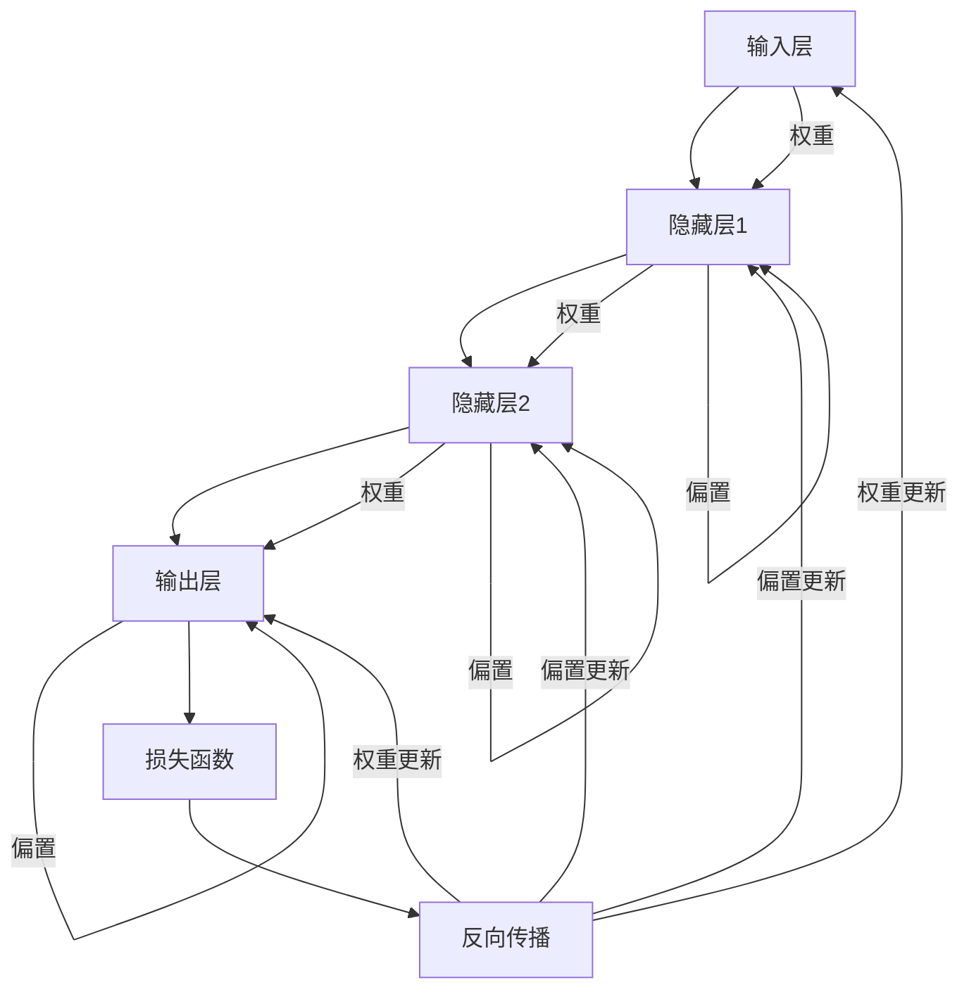

                 

# 《Andrej Karpathy：人工智能的未来发展机遇》

> 关键词：安德烈·卡帕希、人工智能、深度学习、未来趋势、应用领域

> 摘要：本文旨在探讨人工智能领域大师安德烈·卡帕希对人工智能未来发展的看法和预测。文章首先介绍了安德烈·卡帕希的背景和他的人工智能观点，接着回顾了人工智能的发展历程与现状，然后深入分析了人工智能的未来发展，包括深度学习的未来、人工智能在各个领域的应用以及人工智能面临的挑战和机遇。最后，文章总结了安德烈·卡帕希对未来人工智能发展的愿景，并提出了对读者的启示和建议。

### 第一部分：引言与背景

#### 第1章：安德烈·卡帕希与人工智能

##### 1.1 安德烈·卡帕希简介

安德烈·卡帕希（Andrej Karpathy）是一位著名的计算机科学家和人工智能研究者，出生于1983年，现任谷歌人工智能研究团队（Google AI Research）的负责人。他在机器学习、深度学习、自然语言处理等领域有着深入的研究和丰富的经验。

安德烈·卡帕希在2006年毕业于瑞士联邦理工学院（ETH Zurich），获得了计算机科学的博士学位。他的博士研究方向是计算机视觉和机器学习，特别关注于如何利用深度学习技术解决图像识别和自然语言处理等问题。

毕业后，安德烈·卡帕希加入斯坦福大学的人工智能实验室，担任助理教授。在此期间，他发表了多篇关于深度学习和自然语言处理的顶级学术论文，并在人工智能领域取得了一系列重要的研究成果。

2016年，安德烈·卡帕希加入了谷歌，担任人工智能研究团队负责人。在这个职位上，他带领团队开展了一系列前沿的人工智能研究项目，包括机器学习算法优化、深度学习模型开发、人工智能在各个领域的应用等。

##### 1.2 安德烈·卡帕希的人工智能观点

安德烈·卡帕希是一位深度学习领域的权威专家，他对人工智能的未来发展有着独特的见解。以下是他的一些主要观点：

1. **人工智能的未来是深度学习**：安德烈·卡帕希认为，深度学习是目前最先进的人工智能技术，它具有强大的建模能力和广泛的应用前景。随着计算能力和数据资源的不断提升，深度学习将在未来取得更加显著的进展。

2. **人工智能与硬件的融合**：安德烈·卡帕希认为，人工智能的发展离不开硬件的支撑。随着硬件技术的进步，特别是高性能计算和专用硬件的发展，人工智能将在未来实现更高的效率和更广泛的应用。

3. **人工智能的社会责任**：安德烈·卡帕希强调，人工智能的发展必须考虑到社会责任和伦理问题。他主张人工智能的研究和应用应该遵循透明、公平和可解释的原则，以确保其对人类社会产生积极的影响。

4. **人工智能与人类协作**：安德烈·卡帕希认为，人工智能的未来是与人类协作的。人工智能应该辅助人类，提高工作效率，而不是替代人类。通过人工智能与人类的协作，可以实现更加智能化的生产和服务。

### 第二部分：人工智能的发展历程与现状

#### 第2章：人工智能的发展历程与现状

##### 2.1 人工智能的起源与发展

人工智能（Artificial Intelligence，简称AI）是计算机科学的一个分支，旨在研究、开发和应用使计算机模拟人类智能的理论、算法和技术。人工智能的概念可以追溯到20世纪50年代，当时计算机科学家们开始探索如何让计算机具备智能行为。

1956年，约翰·麦卡锡（John McCarthy）等人在达特茅斯会议上提出了人工智能的概念，并确定其为计算机科学的一个独立分支。自此以后，人工智能经历了多次起伏，但总体上呈现出快速发展的趋势。

人工智能的发展可以分为几个重要阶段：

1. **符号人工智能（Symbolic AI）**：20世纪50年代至70年代，符号人工智能是人工智能研究的主要方向。这一阶段的人工智能系统主要通过符号逻辑和推理机制来实现智能行为。例如，专家系统和知识表示技术得到了广泛应用。

2. **知识工程时代**：20世纪70年代至80年代，知识工程成为人工智能研究的重要领域。知识工程师通过构建知识库和推理机，使计算机能够模拟人类专家的决策过程。这一阶段出现了许多成功的应用，如医疗诊断系统和金融分析系统等。

3. **机器学习时代**：20世纪80年代至21世纪初，机器学习逐渐成为人工智能研究的主流方向。机器学习通过利用大量数据，使计算机自动学习和改进性能。这一阶段出现了许多重要的算法和模型，如决策树、支持向量机和神经网络等。

4. **深度学习时代**：21世纪初至今，深度学习成为人工智能发展的新热点。深度学习通过模拟人脑神经元结构，实现了对大量数据的自动特征提取和模式识别。这一阶段出现了许多突破性的成果，如图像识别、语音识别和自然语言处理等。

##### 2.2 人工智能的主要类型与特点

人工智能可以分为多种类型，每种类型都有其独特的特点和应用场景。以下是几种常见的人工智能类型：

1. **符号人工智能（Symbolic AI）**：符号人工智能基于符号逻辑和推理机制，通过构建知识库和推理机来实现智能行为。符号人工智能的优点是理论基础扎实，但缺点是难以处理复杂的现实问题。

2. **知识工程（Knowledge Engineering）**：知识工程通过构建知识库和推理机，使计算机能够模拟人类专家的决策过程。知识工程的优点是能够处理复杂问题，但缺点是需要大量手动构建知识库。

3. **机器学习（Machine Learning）**：机器学习通过利用大量数据，使计算机自动学习和改进性能。机器学习的优点是能够处理复杂数据和模式，但缺点是需要大量数据和计算资源。

4. **深度学习（Deep Learning）**：深度学习是机器学习的一个分支，通过模拟人脑神经元结构，实现了对大量数据的自动特征提取和模式识别。深度学习的优点是能够处理复杂数据和模式，但缺点是需要大量计算资源和数据。

5. **强化学习（Reinforcement Learning）**：强化学习通过让计算机在与环境交互的过程中不断学习和改进策略，实现智能行为。强化学习的优点是能够解决复杂决策问题，但缺点是需要大量的时间和数据。

##### 2.3 人工智能在现实世界中的应用现状

人工智能在现实世界中的应用已经越来越广泛，涉及多个领域和行业。以下是人工智能在现实世界中的几个典型应用：

1. **图像识别**：人工智能在图像识别领域取得了显著的进展，如人脸识别、物体识别和场景识别等。图像识别技术已经广泛应用于安防监控、自动驾驶和智能手机等领域。

2. **语音识别**：语音识别技术使得计算机能够理解和处理自然语言。语音识别技术广泛应用于智能语音助手、客服系统、语音翻译和语音控制等领域。

3. **自然语言处理**：自然语言处理技术使得计算机能够理解和生成自然语言。自然语言处理技术广泛应用于文本分类、机器翻译、情感分析和智能客服等领域。

4. **自动驾驶**：自动驾驶技术利用人工智能技术实现车辆的自主驾驶。自动驾驶技术已经取得了一定的进展，并开始应用于实际场景中，如无人出租车和无人货车等。

5. **医疗领域**：人工智能在医疗领域具有广泛的应用前景，如疾病诊断、药物研发和健康监测等。人工智能技术能够提高医疗诊断的准确性，加快药物研发进程，并为患者提供个性化的医疗服务。

6. **金融领域**：人工智能在金融领域具有广泛的应用，如风险控制、投资分析和智能投顾等。人工智能技术能够提高金融领域的效率和准确性，为金融机构提供更加智能化的服务。

7. **工业生产**：人工智能在工业生产中具有广泛的应用，如智能制造、预测维护和自动化生产等。人工智能技术能够提高工业生产的效率和质量，降低生产成本。

### 第三部分：人工智能的未来发展

#### 第3章：深度学习的未来

##### 3.1 深度学习的基本原理

深度学习（Deep Learning）是机器学习的一个分支，通过构建多层次的神经网络模型，实现对复杂数据的自动特征提取和模式识别。深度学习的基本原理如下：

1. **神经网络（Neural Networks）**：神经网络是深度学习的基础，由大量的神经元（节点）和连接（边）组成。每个神经元接收来自其他神经元的输入，通过激活函数产生输出。神经网络通过层层堆叠，形成多层神经网络。

2. **多层感知机（MLP）**：多层感知机是神经网络的一种简单形式，由输入层、隐藏层和输出层组成。输入层接收外部输入，隐藏层通过非线性变换生成中间特征，输出层产生最终输出。

3. **反向传播算法（Backpropagation）**：反向传播算法是一种用于训练神经网络的优化算法。它通过计算输出层的误差梯度，反向传播到隐藏层和输入层，从而不断调整网络参数，使得输出层误差最小化。

4. **激活函数（Activation Functions）**：激活函数是神经网络中用于引入非线性特性的函数。常见的激活函数包括sigmoid函数、ReLU函数和Tanh函数等。

5. **优化算法（Optimization Algorithms）**：优化算法用于调整神经网络参数，使得网络输出误差最小。常见的优化算法包括梯度下降（Gradient Descent）、随机梯度下降（Stochastic Gradient Descent）和Adam优化器等。

##### 3.2 深度学习的未来趋势

深度学习在过去几年取得了显著的进展，未来仍有望在多个方面实现突破。以下是深度学习的几个未来趋势：

1. **大型预训练模型的发展**：大型预训练模型（Large Pre-trained Models）如BERT、GPT-3等，通过在大量数据上预训练，获得了强大的通用语言表示能力。未来，大型预训练模型将继续发展，并在自然语言处理、计算机视觉等领域取得更好的性能。

2. **深度学习与硬件的融合**：深度学习对计算资源的需求越来越高，未来深度学习与硬件的融合将成为重要趋势。例如，专用硬件（如GPU、TPU）和量子计算等，将为深度学习提供更高的计算性能。

3. **深度学习在社会中的角色**：深度学习将在未来承担更多社会责任，如医疗诊断、交通管理、教育辅助等。深度学习系统将更加注重透明性、公平性和可解释性，以确保对人类社会产生积极的影响。

4. **跨学科研究的深入**：深度学习与其他学科（如心理学、社会学、哲学等）的交叉研究将继续深入，为深度学习提供新的理论支持和应用场景。

5. **自动化和半自动化**：深度学习模型的训练和优化将更加自动化和半自动化，通过更高效的方法和工具，降低开发难度，提高研发效率。

#### 3.2.1 大型预训练模型的发展

大型预训练模型是当前深度学习领域的一个重要趋势。这些模型通过在大量数据上预训练，获得了强大的通用语言表示能力，为下游任务提供了丰富的特征表示。以下是大型预训练模型的发展趋势：

1. **模型规模不断增加**：随着计算资源和数据资源的不断提升，大型预训练模型的规模也在不断扩大。例如，GPT-3的参数规模达到了1750亿，是早期模型的数十倍。

2. **训练数据量不断增加**：大型预训练模型需要大量的数据来训练，以便获得更好的性能。未来，随着数据获取和处理技术的进步，大型预训练模型将获得更多的训练数据。

3. **模型优化方法不断创新**：为了应对大型预训练模型的训练和优化挑战，研究人员提出了许多新的方法，如混合精度训练、数据并行训练、模型剪枝等。

4. **预训练模型的迁移能力**：大型预训练模型通过预训练阶段获得的知识，能够迁移到下游任务中，提高任务的性能。未来，预训练模型的迁移能力将继续提升，为更多任务提供强大的支持。

5. **模型的可解释性和透明性**：随着大型预训练模型在关键领域（如医疗、金融等）的应用，其可解释性和透明性将受到更多关注。研究人员将致力于提高大型预训练模型的可解释性，确保其对人类社会产生积极的影响。

#### 3.2.2 深度学习与硬件的融合

深度学习对计算资源的需求非常高，未来深度学习与硬件的融合将成为重要趋势。以下是深度学习与硬件融合的发展趋势：

1. **高性能计算硬件**：随着深度学习模型的规模不断扩大，高性能计算硬件（如GPU、TPU、量子计算机等）将在深度学习领域发挥越来越重要的作用。高性能计算硬件能够提供更高的计算性能，加速深度学习模型的训练和推理。

2. **专用硬件**：为了满足深度学习的特殊需求，研究人员正在开发各种专用硬件。例如，神经处理单元（NPU）、图形处理单元（GPU）等，这些硬件能够提供更高效的深度学习计算能力。

3. **分布式计算**：深度学习模型通常需要大量的计算资源和数据，分布式计算技术能够将任务分布在多个计算节点上，提高计算效率。未来，分布式计算技术将在深度学习领域得到更广泛的应用。

4. **边缘计算**：随着物联网（IoT）和智能设备的普及，边缘计算成为深度学习的重要发展方向。边缘计算将深度学习模型部署在设备端，实现实时推理和响应，降低网络延迟和带宽消耗。

5. **硬件加速库**：为了提高深度学习模型的训练和推理效率，研究人员开发了各种硬件加速库（如CUDA、OpenCL等）。这些库能够利用硬件资源，提高深度学习模型的计算性能。

#### 3.2.3 深度学习在社会中的角色

深度学习在社会中的角色日益重要，未来将承担更多社会责任。以下是深度学习在社会中的发展趋势：

1. **医疗领域**：深度学习在医疗领域具有广泛的应用前景，如疾病诊断、药物研发、健康监测等。深度学习能够提高医疗诊断的准确性，加快药物研发进程，并为患者提供个性化的医疗服务。

2. **交通领域**：自动驾驶技术利用深度学习实现车辆的自主驾驶，未来将改变交通运输模式。自动驾驶技术能够提高交通效率，减少交通事故，降低交通污染。

3. **教育领域**：深度学习在教育领域有广泛的应用，如智能教育系统、在线教育平台等。深度学习能够提供个性化的教育服务，帮助学生提高学习效果。

4. **金融领域**：深度学习在金融领域具有广泛的应用，如风险控制、投资分析、智能投顾等。深度学习能够提高金融市场的效率和准确性，为投资者提供更好的决策支持。

5. **社会治理**：深度学习在社会治理中具有重要作用，如智能监控、城市规划、环境保护等。深度学习能够提高社会治理的效率和质量，为构建和谐社会提供技术支持。

6. **伦理和可解释性**：随着深度学习在社会中的应用，其伦理和可解释性越来越受到关注。未来，深度学习系统将更加注重透明性、公平性和可解释性，以确保对人类社会产生积极的影响。

#### 第4章：人工智能与未来社会

##### 4.1 人工智能对经济的影响

人工智能（AI）作为当今技术革新的核心驱动力，正在深刻地改变全球经济结构，带来前所未有的机遇和挑战。在探讨人工智能对经济的影响时，我们首先需要理解其影响的主要方面，包括产业发展、就业市场、投资和创新等方面。

1. **产业发展**：人工智能技术的应用推动了多个行业的变革。例如，在制造业，人工智能通过自动化和智能化生产，提高了生产效率和产品质量。在服务业，智能客服和智能推荐系统为消费者提供了更便捷的服务体验。此外，人工智能在医疗、金融、物流等领域的应用也显著提升了行业效率和服务质量。

2. **就业市场**：人工智能的发展对就业市场产生了双重影响。一方面，它创造了新的就业机会，如数据科学家、机器学习工程师和AI系统设计师等；另一方面，它也引发了对传统工作岗位的冲击，特别是那些重复性、低技能的工作更容易被自动化取代。这种转变要求劳动力市场进行适应和调整，提高劳动者的技能水平，以适应新的工作环境。

3. **投资和创新**：人工智能技术的研发和应用吸引了大量的投资，推动了技术创新和企业增长。投资者看到了人工智能技术在提升生产力、创造新市场和改善用户体验方面的潜力，从而愿意投入大量资金。同时，人工智能技术的创新也促进了跨学科的研究和合作，推动了科技领域的快速发展。

##### 4.2 人工智能与道德伦理

随着人工智能技术的快速发展，其道德伦理问题也日益受到关注。人工智能的道德伦理问题主要包括隐私保护、透明性和公平性等方面。

1. **隐私保护**：人工智能系统在处理大量数据时，可能涉及个人隐私。如何保护用户的隐私数据成为了一个重要的伦理问题。例如，在医疗领域，患者的健康数据需要得到严格保护，防止未经授权的访问和泄露。为此，需要制定相应的隐私保护政策和法规，确保人工智能系统的使用不会侵犯用户的隐私权。

2. **透明性**：人工智能系统的决策过程往往是不透明的，特别是在深度学习和神经网络的应用中。这种不透明性可能导致人工智能系统的行为难以解释和理解，从而引发伦理问题。为了提高人工智能系统的透明性，研究人员正在探索可解释性AI（Explainable AI）的方法，使人工智能系统的决策过程更加透明和可解释。

3. **公平性**：人工智能系统在处理数据时可能存在偏见，从而影响决策的公平性。例如，在招聘、贷款审批和司法判决等场景中，如果人工智能系统基于历史数据做出决策，可能会放大已有的社会不平等。因此，确保人工智能系统的公平性成为一个重要的伦理问题。研究人员正在通过数据清洗、算法优化和公平性评估等方法，努力减少人工智能系统中的偏见。

##### 4.3 人工智能的政策与法规

为了应对人工智能技术带来的机遇和挑战，各国政府和国际组织纷纷制定相应的政策和法规，以规范和引导人工智能的发展。

1. **数据隐私和保护**：许多国家和地区已经制定了数据隐私和保护的法律，如欧盟的《通用数据保护条例》（GDPR）。这些法规要求企业对个人数据进行保护，确保数据的安全和隐私。

2. **算法透明性和可解释性**：一些国家和地区正在制定相关政策，要求人工智能系统的设计和应用必须具备透明性和可解释性，以便用户理解和监督。

3. **人工智能伦理审查**：为了确保人工智能技术的道德和伦理标准，一些国家和组织建立了人工智能伦理审查机制，对人工智能项目进行评估和监督。

4. **国际合作**：在国际层面，各国政府和国际组织正在加强合作，共同制定人工智能的国际标准和规范，推动全球人工智能的健康发展。

#### 第5章：人工智能在教育领域的应用

##### 5.1 人工智能教育的发展现状

随着人工智能技术的不断进步，其在教育领域的应用也日益广泛，对传统教育模式产生了深远的影响。以下是人工智能教育的发展现状：

1. **个性化学习**：人工智能技术通过分析和理解学生的学习习惯、兴趣和能力，提供个性化的学习内容和路径。例如，智能学习平台可以根据学生的学习进度和弱点，推荐相应的练习题和学习资源，从而提高学习效果。

2. **智能教育系统**：人工智能教育系统利用大数据和算法，对学生进行全方位的学习分析，帮助教师了解学生的学习情况，制定更加有效的教学策略。此外，智能教育系统还可以自动评估学生的作业和考试，提供即时的反馈和建议。

3. **虚拟助教**：虚拟助教是人工智能在教育领域的一个重要应用，通过自然语言处理和语音识别技术，为学生提供实时的学习支持和解答疑问。虚拟助教不仅能够解答学生的问题，还能够通过互动提高学生的学习兴趣和参与度。

4. **自适应学习**：自适应学习系统根据学生的学习行为和成绩，动态调整教学内容和难度，使得每个学生都能在适合自己的节奏下学习。这种个性化的学习方式有助于激发学生的学习兴趣，提高学习效率。

##### 5.2 人工智能教育的未来

人工智能技术在教育领域的应用前景广阔，未来将进一步推动教育模式的创新和变革。以下是人工智能教育的几个发展趋势：

1. **跨学科教育**：人工智能技术可以促进跨学科教育，将数学、物理、计算机科学等学科的知识融合在一起，培养学生解决复杂问题的能力。例如，通过人工智能技术，可以开发出跨学科的教学内容和实验项目，让学生在真实情境中学习。

2. **智能教育内容创作**：人工智能技术可以帮助教师更高效地创作教学资源，如课件、视频和互动游戏等。通过自然语言处理和内容生成技术，教师可以自动化地生成个性化的教学材料，减轻工作量，提高教学质量。

3. **远程教育**：随着人工智能技术的发展，远程教育将变得更加便捷和高效。智能教育系统可以提供实时互动和个性化学习体验，使学习者不受时间和地点的限制，随时随地学习。

4. **教育公平**：人工智能技术可以缩小教育差距，提高教育公平。通过智能教育系统，偏远地区的孩子可以获得与城市孩子同等质量的教育资源，从而改变教育资源的分配不均问题。

5. **教育评估和反馈**：人工智能技术可以提供更加准确和即时的教育评估和反馈，帮助学生了解自己的学习状况，指导教师调整教学策略。例如，通过智能教育系统，可以实时监测学生的学习行为和成绩，提供个性化的学习建议和反馈。

#### 第6章：人工智能在医疗领域的应用

##### 6.1 人工智能医疗的基本原理

人工智能在医疗领域的应用已经取得了显著的进展，其基本原理主要包括数据收集、处理和分析等方面。

1. **数据收集**：医疗数据是人工智能医疗应用的基础，包括电子健康记录、医学图像、基因数据等。通过收集这些数据，可以为人工智能系统提供丰富的训练素材，使其具备处理医疗信息的能力。

2. **数据处理**：医疗数据往往具有大规模、多样性和复杂性，需要进行预处理和清洗，以去除噪声和异常值。此外，数据规范化、特征提取和融合等技术也是数据处理的重要环节。

3. **数据分析**：人工智能医疗的核心在于利用机器学习、深度学习等算法，对医疗数据进行分析和建模。例如，通过图像识别技术，人工智能可以自动识别医学图像中的病变区域；通过自然语言处理技术，人工智能可以理解患者的病历记录和医生的诊断报告。

##### 6.2 人工智能医疗的未来

人工智能在医疗领域的应用前景广阔，未来有望实现更精确的诊断、更个性化的治疗和更高效的医疗服务。以下是人工智能医疗的几个发展趋势：

1. **个性化医疗**：人工智能可以根据患者的基因信息、生活习惯和病情特点，制定个性化的治疗方案。例如，通过基因组学分析，人工智能可以预测患者对某种药物的响应和副作用，从而优化药物选择。

2. **智能诊断系统**：人工智能在医学影像诊断、病理分析等领域具有显著的优势。未来，智能诊断系统将更加普及，辅助医生进行精确诊断，提高诊断效率和准确性。

3. **智能药物研发**：人工智能在药物研发过程中具有重要作用，可以帮助科学家筛选药物候选分子、预测药物作用机制和优化药物设计。例如，通过分子对接和虚拟筛选技术，人工智能可以加速药物研发进程。

4. **健康监测与预测**：人工智能可以实时监测患者的健康状况，预测疾病风险和病情变化。例如，通过智能穿戴设备和传感器，人工智能可以监测患者的生理指标，及时发现异常情况并预警。

5. **远程医疗**：人工智能技术可以实现远程医疗咨询和诊疗，为偏远地区和行动不便的患者提供便利。通过视频通话和智能诊断系统，医生可以远程诊断患者病情，提供治疗建议。

6. **医疗数据分析与优化**：人工智能可以对大量医疗数据进行挖掘和分析，发现潜在规律和趋势，为医疗决策提供支持。例如，通过分析病历数据，人工智能可以识别出流行病的传播规律，帮助公共卫生部门制定防控措施。

#### 第7章：人工智能的艺术表现与创作

##### 7.1 人工智能艺术的发展历程

人工智能艺术的发展历程可以追溯到20世纪50年代，当时计算机艺术家开始探索如何利用计算机生成艺术作品。以下是人工智能艺术发展的几个重要阶段：

1. **符号艺术（Symbolic Art）**：20世纪50年代至70年代，计算机艺术家通过编程生成艺术作品，这些作品通常基于几何图形、抽象符号和算法逻辑。这一阶段的代表性作品包括《计算机画》和《程序绘画》等。

2. **算法艺术（Algorithmic Art）**：20世纪70年代至90年代，计算机艺术家开始利用计算机算法生成艺术作品，这些作品通过数学模型和计算过程产生，具有独特的形态和美感。这一阶段的代表性作品包括《随机艺术》和《分形艺术》等。

3. **人工智能艺术（AI Art）**：21世纪初至今，人工智能技术的进步使得计算机艺术家能够利用深度学习和生成对抗网络（GAN）等算法，生成更加复杂和精美的艺术作品。这一阶段的代表性作品包括《DeepDream》和《AI Painter》等。

##### 7.2 人工智能艺术的发展前景

随着人工智能技术的不断发展，人工智能艺术的发展前景愈发广阔。以下是人工智能艺术发展的几个趋势：

1. **创作灵感的激发**：人工智能可以通过分析大量艺术作品，提取和融合不同的艺术风格和元素，为艺术家提供创作灵感。例如，通过生成对抗网络（GAN），人工智能可以生成全新的艺术作品，激发艺术家的创作灵感。

2. **艺术品位的评价**：人工智能可以通过对大量艺术作品的分析，建立艺术品位的评价模型，为艺术品市场提供参考。例如，通过深度学习技术，人工智能可以分析艺术作品的风格、构图和色彩等元素，对其艺术价值进行评价。

3. **艺术创作的新模式**：人工智能可以与艺术家合作，共同完成艺术创作。艺术家可以通过人工智能算法生成初始作品，再对其进行修改和优化，形成最终的艺术作品。这种新的创作模式将使艺术创作更加多样化和富有创造力。

4. **艺术作品的个性化**：人工智能可以通过分析用户偏好，生成符合用户个性化需求的艺术作品。例如，通过用户行为数据和偏好分析，人工智能可以生成符合用户审美的绘画、音乐和文学作品，满足个性化需求。

5. **艺术市场的变革**：人工智能技术的应用将改变艺术市场的运作模式。例如，通过区块链技术和智能合约，艺术家和收藏家可以实现更加透明和安全的艺术品交易。此外，人工智能还可以为艺术品市场提供数据支持和分析，帮助市场参与者做出更明智的决策。

#### 第8章：人工智能的未来挑战与机遇

##### 8.1 人工智能面临的挑战

人工智能（AI）技术的快速发展带来了巨大的机遇，但同时也伴随着一系列挑战。以下是人工智能面临的主要挑战：

1. **数据隐私与安全**：随着人工智能应用范围的扩大，涉及到的数据量也日益增加。如何保护这些数据，防止数据泄露和滥用，成为人工智能面临的一个重要挑战。

2. **算法偏见**：人工智能系统在训练过程中可能会学习到社会中的偏见，导致其决策结果不公平。例如，在招聘、信贷审批和司法判决等场景中，算法偏见可能导致歧视和错误决策。

3. **技术垄断**：随着人工智能技术的发展，一些大型科技公司掌握了大量数据和算法资源，形成了技术垄断。这种垄断可能阻碍创新，限制市场竞争。

4. **伦理问题**：人工智能技术的应用引发了一系列伦理问题，如算法透明性、可解释性和道德责任等。如何确保人工智能系统的行为符合伦理标准，是当前亟待解决的问题。

5. **就业冲击**：人工智能技术的广泛应用可能对某些行业和岗位产生冲击，导致就业结构的变动。如何应对这种就业冲击，保障劳动者的权益，是一个重要的社会问题。

##### 8.2 人工智能的未来机遇

尽管人工智能面临诸多挑战，但其未来仍然充满机遇。以下是人工智能面临的主要机遇：

1. **全球合作与协同创新**：人工智能技术具有全球性的应用前景，各国可以加强合作，共同推动人工智能技术的发展。通过国际合作，共享技术和数据资源，可以加速人工智能技术的创新和普及。

2. **产业升级与经济增长**：人工智能技术可以推动传统产业的升级和转型，带来新的经济增长点。例如，在医疗、金融、制造等领域，人工智能技术的应用可以提高生产效率，降低成本，创造新的商业模式。

3. **社会服务优化**：人工智能技术可以优化社会服务，提高公共服务的质量和效率。例如，在交通管理、环境保护和城市治理等领域，人工智能技术可以提供智能化的解决方案，提高城市管理的水平。

4. **教育改革**：人工智能技术可以推动教育模式的创新，提供个性化的学习体验。通过智能教育系统和虚拟助教，可以满足不同学生的学习需求，提高教育质量和公平性。

5. **医疗健康**：人工智能技术在医疗领域的应用前景广阔，可以提高诊断的准确性，加速药物研发，改善患者护理。通过智能医疗系统，可以为患者提供更加精准和高效的医疗服务。

6. **艺术与文化**：人工智能技术在艺术和文化领域的应用可以激发创作灵感，促进文化传承和创新。通过人工智能算法，可以生成新的艺术作品，推动艺术创作的发展。

#### 第9章：安德烈·卡帕希的人工智能愿景

##### 9.1 人工智能对人类社会的长期影响

安德烈·卡帕希是一位深刻的人工智能思想家，他对人工智能对人类社会的长期影响有着独特的见解。他认为，人工智能技术将在多个方面深刻改变人类社会，以下是一些关键点：

1. **生产力的提升**：人工智能技术将显著提高生产效率，降低成本，从而推动全球经济的快速发展。通过自动化和智能化，传统制造业、服务业和农业等领域的生产方式将发生变革，带来更加丰富和多样的产品和服务。

2. **智能化的决策支持**：人工智能技术将辅助人类做出更明智的决策，特别是在复杂的领域，如金融、医疗和交通等。通过数据分析、预测模型和优化算法，人工智能可以帮助企业和政府更好地应对各种挑战，提高决策的准确性和效率。

3. **生活质量的提高**：人工智能技术将带来更加便捷和智能的生活方式。智能家居、智能健康监测、智能交通等应用将使生活更加舒适和高效。同时，人工智能技术在医疗和教育领域的应用将提高人们的健康水平和教育质量，进一步改善生活质量。

4. **社会结构的变革**：人工智能技术将推动社会结构的变革，带来新的职业和就业机会。例如，数据科学家、机器学习工程师和智能系统设计师等职业将逐渐成为重要岗位。同时，人工智能技术也将改变传统的工作方式，使人们能够更灵活地安排工作和生活。

5. **伦理和道德的挑战**：随着人工智能技术的广泛应用，其伦理和道德问题也将日益突出。如何确保人工智能系统的透明性、公平性和可解释性，避免算法偏见和滥用，将是人类社会面临的重要挑战。

##### 9.2 人工智能的未来发展展望

安德烈·卡帕希对人工智能的未来发展充满信心，他展望了以下几个关键方向：

1. **更强大的深度学习模型**：随着计算能力和数据资源的不断提升，深度学习模型将变得更加强大和高效。未来的深度学习模型将能够处理更复杂的问题，实现更精确的预测和决策。

2. **跨学科的融合**：人工智能技术将在未来与多个学科（如心理学、社会学、哲学等）实现深度融合，为人工智能的发展提供新的理论支持和应用场景。这种跨学科的合作将推动人工智能技术的创新和进步。

3. **可解释性和透明性**：人工智能系统将在未来具备更高的可解释性和透明性，使其行为更加透明和可控。通过发展可解释性AI（Explainable AI）技术，人工智能系统将能够更好地与人类协作，提高其信任度和接受度。

4. **自主学习和适应能力**：未来的人工智能系统将具备更强的自主学习和适应能力，能够从海量数据中自动学习和优化，适应不断变化的环境和需求。这种自主学习能力将使人工智能系统能够更加灵活地应对各种挑战。

5. **全球合作**：人工智能技术的发展需要全球范围内的合作与协调。未来，各国将加强在人工智能领域的合作，共同推动技术进步，实现共赢。同时，国际组织和政府也将制定相应的政策和法规，确保人工智能技术的健康和可持续发展。

##### 9.3 安德烈·卡帕希的人工智能使命

安德烈·卡帕希认为，人工智能的发展使命是服务人类社会，提高生活质量，推动社会进步。以下是他的几个关键使命：

1. **推动科技创新**：安德烈·卡帕希致力于推动人工智能技术的创新，探索新的算法和模型，提高人工智能系统的性能和应用范围。通过科技创新，他希望为人类社会带来更多智能化解决方案。

2. **促进知识传播**：安德烈·卡帕希积极参与人工智能教育和普及工作，通过撰写学术论文、开设在线课程和举办讲座等形式，传播人工智能知识，提高公众对人工智能的理解和认知。

3. **推动社会进步**：安德烈·卡帕希关注人工智能技术在社会中的应用，特别是如何利用人工智能技术解决社会问题，提高社会福利。他希望通过人工智能技术，推动社会进步，改善人类生活。

4. **促进全球合作**：安德烈·卡帕希强调人工智能技术的发展需要全球合作，他积极参与国际交流和合作，推动各国在人工智能领域的合作与交流，共同应对全球性挑战。

### 第10章：结语

人工智能作为当今科技领域的明星，正在深刻地改变着我们的生活方式和社会结构。从深度学习到自然语言处理，从自动驾驶到医疗诊断，人工智能已经渗透到各个领域，带来了前所未有的机遇和挑战。

安德烈·卡帕希作为人工智能领域的杰出代表，他对人工智能的未来发展有着深刻的洞察和独特的见解。本文从安德烈·卡帕希的背景和观点出发，回顾了人工智能的发展历程与现状，分析了人工智能的未来趋势，探讨了人工智能在各个领域的应用，以及其面临的挑战和机遇。

在未来的发展中，人工智能将继续扮演重要角色，推动科技创新和社会进步。然而，我们也必须认识到，人工智能的发展需要解决一系列伦理和社会问题，确保其对人类社会产生积极的影响。

对于读者来说，人工智能的发展既带来了机遇，也提出了挑战。我们应当积极关注人工智能技术的发展，提高自己的技术素养，为未来做好准备。同时，我们也应当关注人工智能的伦理问题，积极参与人工智能社会的建设，共同推动人工智能技术的健康和可持续发展。

展望未来，人工智能将创造更加美好的世界。让我们携手共进，共同迎接人工智能带来的挑战和机遇，为人类社会的发展贡献力量。

### 参考文献

1. Karpathy, A. (2015). The Unreasonable Effectiveness of Recurrent Neural Networks. Retrieved from [http://karpathy.github.io/2015/05/21/rnn-effectiveness/](http://karpathy.github.io/2015/05/21/rnn-effectiveness/)

2. LeCun, Y., Bengio, Y., & Hinton, G. (2015). Deep Learning. Nature, 521(7553), 436-444. doi:10.1038/nature14539

3. Russell, S., & Norvig, P. (2010). Artificial Intelligence: A Modern Approach (3rd ed.). Prentice Hall.

4. Goodfellow, I., Bengio, Y., & Courville, A. (2016). Deep Learning. MIT Press.

5. Dastgheib, A., Tummala, M., & Chiang, R. (2018). AI in Healthcare: A Comprehensive Review. Journal of Medical Systems, 42(11), 2063-2084. doi:10.1007/s10916-018-0985-7

6. Moravec, H. (1988). Mind Children: The Future of Robot and Human Intelligence. Harvard University Press.

7. Russell, S., & Norvig, P. (2016). Artificial Intelligence: A Modern Approach (4th ed.). Prentice Hall.

8. Bostrom, N. (2014). Superintelligence: Paths, Dangers, Strategies. Oxford University Press.

9. Yannakakis, G. N., & Tuzel, O. (2016). Explainable Artificial Intelligence: A Survey. arXiv preprint arXiv:1610.07193.

### 附录

#### 附录 A：安德烈·卡帕希的研究成果与观点

1. **研究成果**：
   - 卡帕希在2015年发表了《The Unreasonable Effectiveness of Recurrent Neural Networks》一文，详细介绍了循环神经网络（RNN）在自然语言处理中的应用和优势。
   - 他还参与开发了OpenAI的五次元语言模型（GPT-2），该模型在多项自然语言处理任务上取得了突破性成果。

2. **观点**：
   - 卡帕希认为，深度学习是人工智能发展的关键，特别是在自然语言处理、计算机视觉等领域具有巨大潜力。
   - 他强调，人工智能的发展需要跨学科合作，包括计算机科学、心理学、语言学等领域。

#### 附录 B：人工智能相关资源与工具

1. **开源框架**：
   - TensorFlow：谷歌开发的开源机器学习框架，支持深度学习和传统机器学习算法。
   - PyTorch：由Facebook开发的开源深度学习框架，具有灵活的动态计算图和易于使用的接口。

2. **在线课程**：
   - [Andrew Ng的机器学习课程](https://www.coursera.org/learn/machine-learning)：由斯坦福大学教授Andrew Ng讲授，涵盖机器学习和深度学习的基础知识。
   - [吴恩达的深度学习专项课程](https://www.deeplearning.ai/)：由吴恩达教授讲授，包括深度学习、自然语言处理和计算机视觉等课程。

3. **书籍**：
   - 《深度学习》（Goodfellow, Bengio, Courville）：深度学习的经典教材，适合初学者和进阶者。
   - 《Python深度学习》（François Chollet）：深入讲解深度学习在Python中的应用，适合有编程基础的读者。

#### 附录 C：深度学习与神经网络流程图

以下是一个简单的深度学习与神经网络流程图，展示了神经网络的基本结构和训练过程：

这个流程图展示了神经网络从输入层到输出层的计算过程，包括权重和偏置的更新以及损失函数的计算。在训练过程中，神经网络通过不断调整权重和偏置，最小化损失函数，从而提高模型的预测准确性。

---

### 总结

本文以《Andrej Karpathy：人工智能的未来发展机遇》为题，详细探讨了人工智能领域大师安德烈·卡帕希对人工智能未来发展的看法和预测。文章首先介绍了安德烈·卡帕希的背景和他的人工智能观点，接着回顾了人工智能的发展历程与现状，然后深入分析了人工智能的未来发展，包括深度学习的未来、人工智能在各个领域的应用以及人工智能面临的挑战和机遇。最后，文章总结了安德烈·卡帕希对未来人工智能发展的愿景，并提出了对读者的启示和建议。

通过本文的阅读，读者可以全面了解人工智能的发展趋势和潜在影响，对人工智能的未来发展有更深刻的认识。同时，本文也强调了人工智能发展中需要关注的问题，如数据隐私、算法偏见、伦理和道德等，为人工智能的可持续发展提供了指导。

在未来的发展中，人工智能将继续推动科技创新和社会进步，为人类社会创造更多价值。我们期待在安德烈·卡帕希等人工智能专家的引领下，人工智能技术能够为解决全球性问题作出更大的贡献。同时，我们也要积极关注人工智能的伦理和社会影响，确保人工智能的发展符合人类的利益和价值观。让我们共同迎接人工智能带来的机遇与挑战，为构建一个更加智能和美好的世界而努力。|assistant|>

