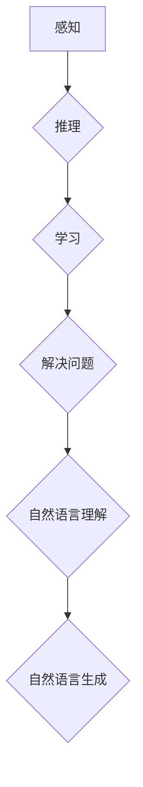
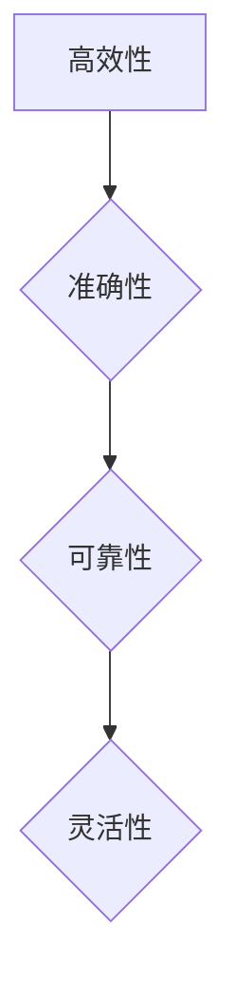

                 

## 《Andrej Karpathy：人工智能的未来影响》

关键词：人工智能，未来影响，深度学习，自然语言处理，AI大模型，伦理问题

摘要：
本文深入探讨了人工智能（AI）领域的杰出人物Andrej Karpathy的研究成果及其对未来人工智能发展的见解。文章首先概述了人工智能的起源和发展历程，接着介绍了深度学习和神经网络的基本原理与架构，特别是卷积神经网络（CNN）在计算机视觉领域的应用。随后，文章聚焦于自然语言处理（NLP）和AI大模型的发展，包括GPT系列模型与BERT模型的详解，以及这些技术在工业、医疗、金融等领域的应用与挑战。文章还讨论了AI对社会的影响、伦理问题以及AI创业与商业机会。最后，文章展望了人工智能的未来发展方向，引用了Andrej Karpathy对未来AI发展的预测，并提出了应对AI发展的挑战的策略。

----------------------------------------------------------------

# 《Andrej Karpathy：人工智能的未来影响》目录大纲

## 第一部分：人工智能概述

### 第1章：人工智能的起源与发展

#### 1.1 人工智能的定义与核心概念

#### 1.2 人工智能的发展历程

#### 1.3 人工智能的主要领域与应用

### 第2章：Andrej Karpathy的贡献与影响

#### 2.1 Andrej Karpathy的学术背景与研究领域

#### 2.2 Andrej Karpathy在人工智能领域的贡献

#### 2.3 Andrej Karpathy对未来人工智能发展的看法

## 第二部分：深度学习与神经网络

### 第3章：深度学习的原理与架构

#### 3.1 深度学习的概念与发展

#### 3.2 神经网络的基本架构

#### 3.3 卷积神经网络（CNN）

### 第4章：自然语言处理与AI大模型

#### 4.1 自然语言处理的发展与应用

#### 4.2 大规模预训练模型

#### 4.3 GPT系列模型与BERT模型详解

### 第5章：AI大模型的应用场景与挑战

#### 5.1 AI大模型在工业、医疗、金融等领域的应用

#### 5.2 AI大模型的挑战与未来发展趋势

## 第三部分：AI的未来影响

### 第6章：人工智能与未来社会

#### 6.1 人工智能对社会的影响

#### 6.2 人工智能伦理与道德问题

#### 6.3 人工智能治理与法律法规

### 第7章：AI创业与商业机会

#### 7.1 AI创业的现状与趋势

#### 7.2 AI商业模式的探索与实践

#### 7.3 AI创业的挑战与应对策略

## 第四部分：未来展望

### 第8章：人工智能的未来发展方向

#### 8.1 人工智能的核心技术发展趋势

#### 8.2 AI大模型在未来的应用场景

#### 8.3 人工智能对人类生活的影响

### 第9章：Andrej Karpathy对人工智能未来发展的预测

#### 9.1 Andrej Karpathy对人工智能未来发展的看法

#### 9.2 人工智能的未来：机遇与挑战

## 附录

### 附录A：参考文献与推荐阅读

### 附录B：AI大模型开发工具与资源介绍

### 附录C：人工智能相关的法律法规与政策文件

注：本目录大纲仅为示例，具体章节内容和细节可根据实际需求进行调整。目录中的核心概念、算法原理和项目实战等内容需要进一步详细设计和编写。

----------------------------------------------------------------

## 第1章：人工智能的起源与发展

### 1.1 人工智能的定义与核心概念

人工智能（Artificial Intelligence，简称AI）是指通过计算机程序和算法模拟人类智能行为的一门技术科学。它旨在开发能够执行感知、推理、学习、解决问题、自然语言理解和生成等人类智能行为的系统。

#### 核心概念：

1. **感知**：通过传感器和输入设备获取环境信息，如视觉、听觉、触觉等。
2. **推理**：基于已有知识和规则进行逻辑推断和决策。
3. **学习**：从数据中提取模式，改进性能，提高智能水平。
4. **解决问题**：在复杂环境中找到有效解决方案。
5. **自然语言理解与生成**：理解人类语言并生成自然语言文本。

#### Mermaid流程图：



### 1.2 人工智能的发展历程

人工智能的发展历程可以分为几个重要阶段：

#### 20世纪50年代至60年代：早期探索

- **1956年**：达特茅斯会议，人工智能概念首次提出。
- **1958年**：AI研究获得政府支持，出现了第一个AI程序。

#### 20世纪70年代：第一次AI寒冬

- **1974年**：基于规则的专家系统出现，但受限于计算能力和数据。
- **1980年**：人工智能研究开始受到质疑，资金减少。

#### 20世纪80年代至90年代：知识表示和推理

- **1982年**：专家系统应用取得商业成功。
- **1997年**：IBM的深蓝（Deep Blue）击败国际象棋世界冠军。

#### 2000年代：机器学习和大数据

- **2006年**：深度学习复兴，基于大数据和高效计算模型。
- **2012年**：AlexNet在ImageNet竞赛中取得突破性成绩。

#### 2010年代至今：AI技术的广泛应用

- **2016年**：谷歌的AlphaGo击败围棋世界冠军。
- **2020年**：自然语言处理模型如BERT、GPT-3等取得重大进展。

### 1.3 人工智能的主要领域与应用

人工智能在多个领域取得了显著成果，主要包括：

#### 自然语言处理（NLP）

- **文本分类**：对文本进行分类，如情感分析、主题分类等。
- **机器翻译**：将一种语言的文本翻译成另一种语言。
- **对话系统**：构建能够与人类自然交互的对话系统。
- **文本生成**：根据输入的提示生成文本，如摘要生成、对话生成等。

#### 计算机视觉

- **图像识别**：识别图像中的对象、场景等。
- **目标检测**：定位图像中的目标物体。
- **图像生成**：根据输入的提示生成图像。

#### 机器学习

- **监督学习**：使用标注数据训练模型。
- **无监督学习**：在没有标注数据的情况下发现数据中的模式。
- **强化学习**：通过试错学习策略。

#### 工业自动化

- **自动化控制**：在工业生产中自动化控制流程。
- **机器人**：在制造业、服务业等领域中的广泛应用。

#### 医疗健康

- **疾病诊断**：辅助医生进行疾病诊断。
- **药物研发**：通过分析生物大数据发现新药物。
- **个性化治疗**：根据患者的具体情况进行个性化治疗。

#### 金融

- **风险控制**：通过分析金融数据预测市场风险。
- **量化交易**：利用算法实现自动化的交易策略。
- **智能投顾**：为投资者提供个性化的投资建议。

#### 社交媒体

- **内容审核**：自动识别和处理不当内容。
- **推荐系统**：根据用户行为推荐相关内容。

### 1.4 AI技术的核心优势

人工智能技术的核心优势包括：

- **高效性**：AI系统能够处理大量数据，提高工作效率。
- **准确性**：AI系统在许多任务上比人类更具准确性。
- **可靠性**：AI系统能够在相同的条件下重复执行任务。
- **灵活性**：AI系统可以根据新的数据和学习进行调整。

#### Mermaid流程图：



## 第2章：Andrej Karpathy的贡献与影响

### 2.1 Andrej Karpathy的学术背景与研究领域

Andrej Karpathy是一位知名的人工智能科学家和研究者，他在深度学习和自然语言处理领域做出了重要贡献。他于1987年出生在加拿大蒙特利尔，毕业于多伦多大学计算机科学专业，并获得计算机科学硕士学位。随后，他在加州大学伯克利分校（UC Berkeley）攻读博士学位，师从著名人工智能专家Pieter Abbeel。在伯克利期间，他的研究方向主要集中在深度学习和强化学习，特别是在自然语言处理和计算机视觉领域。

#### Andrej Karpathy的研究领域：

- **自然语言处理（NLP）**：研究自然语言的理解和生成，包括文本分类、机器翻译、对话系统等。
- **计算机视觉**：研究图像和视频的处理和分析，包括图像识别、目标检测、视频理解等。
- **深度学习**：研究神经网络模型的设计和优化，包括卷积神经网络（CNN）、循环神经网络（RNN）、Transformer等。
- **强化学习**：研究通过试错学习策略，实现智能决策和控制。

### 2.2 Andrej Karpathy在人工智能领域的贡献

Andrej Karpathy在人工智能领域取得了许多重要成果，以下是他的一些代表性贡献：

#### 1. 深度学习与自然语言处理

- **GPT系列模型**：Andrej Karpathy参与了OpenAI的GPT系列模型的研究，这些模型在自然语言处理领域取得了突破性进展。GPT-2和GPT-3等模型在文本生成、摘要生成、对话系统等方面表现出色。
- **Transformer模型**：Andrej Karpathy对Transformer模型进行了深入研究，该模型在机器翻译、文本分类等任务上取得了优异的性能。

#### 2. 计算机视觉

- **卷积神经网络（CNN）**：Andrej Karpathy在计算机视觉领域的研究主要集中在卷积神经网络（CNN）上。他参与开发的VGGNet和ResNet等模型在ImageNet竞赛中取得了领先成绩。
- **图像生成**：Andrej Karpathy对图像生成模型，如生成对抗网络（GAN）进行了深入研究，并在艺术创作、视频游戏等领域应用。

#### 3. 强化学习

- **DeepMind**：Andrej Karpathy曾在DeepMind工作，参与了AlphaGo等强化学习项目的研究，实现了围棋等复杂游戏的自动化。

### 2.3 Andrej Karpathy对未来人工智能发展的看法

Andrej Karpathy对未来人工智能的发展持乐观态度，他认为人工智能将在未来带来巨大的变革和机遇。以下是他的一些观点：

- **技术进步**：随着计算能力的提升和数据量的增加，人工智能技术将继续进步，实现更多复杂任务。
- **跨领域融合**：人工智能技术将与其他领域（如医疗、金融、教育等）深度融合，推动各个领域的创新和发展。
- **伦理与道德**：人工智能的发展需要关注伦理和道德问题，制定相应的规范和法律法规，确保人工智能的健康发展。
- **人机协同**：人工智能将与人类协同工作，提高工作效率和生活质量。

### 2.4 Andrej Karpathy的研究方法与成果

#### 研究方法：

- **实验验证**：通过大量实验验证模型的性能和效果，确保研究成果的可靠性。
- **开源分享**：积极参与开源社区，与同行共享研究成果，推动人工智能技术的发展。
- **跨学科合作**：与计算机科学、认知科学、心理学等领域的专家合作，从不同角度研究人工智能问题。

#### 成果展示：

- **论文发表**：在顶级会议和期刊上发表多篇论文，如NeurIPS、ICML、CVPR、ACL等。
- **代码开源**：开源了许多重要的深度学习模型和工具，如TensorFlow、PyTorch等。
- **课程与教程**：通过在线课程和教程，推广人工智能知识，培养新一代AI人才。

### 2.5 Andrej Karpathy对人工智能领域的影响

Andrej Karpathy在人工智能领域产生了深远的影响，以下是他的一些重要贡献：

- **技术创新**：通过深入研究深度学习和自然语言处理，推动了人工智能技术的进步。
- **教育普及**：通过在线课程和教程，普及了人工智能知识，培养了大量的AI人才。
- **开源贡献**：通过开源项目，促进了人工智能技术的共享和协作。
- **社会影响**：通过在媒体和公众场合的演讲，提高了公众对人工智能的认识和理解。

### 2.6 总结

Andrej Karpathy是一位杰出的人工智能科学家和研究者，他在深度学习和自然语言处理领域取得了重要成果，并对未来人工智能的发展持乐观态度。他的研究方法与成果对人工智能领域产生了深远的影响，为人工智能技术的发展做出了重要贡献。

## 第3章：深度学习的原理与架构

### 3.1 深度学习的概念与发展

深度学习（Deep Learning）是人工智能的一个分支，通过构建多层神经网络模型来模拟人类大脑的学习过程，从而实现复杂的数据处理和预测任务。深度学习的发展可以追溯到20世纪80年代，但直到近年来，随着计算能力的提升和数据量的爆炸性增长，深度学习才取得了显著的进展。

#### 3.1.1 深度学习的核心概念

深度学习的核心概念包括：

- **神经网络**：神经网络是深度学习的基础，它由多个神经元（节点）组成，通过这些神经元之间的连接（权重）进行数据传递和计算。
- **前向传播与反向传播**：深度学习模型的学习过程包括前向传播和反向传播。前向传播是指数据从输入层经过多层网络直到输出层的过程，反向传播则是在前向传播的基础上，通过计算输出误差，将误差反向传播回输入层，以更新网络权重。
- **激活函数**：激活函数是深度学习中的一个关键组件，用于引入非线性因素，使得神经网络能够处理复杂的问题。

#### 3.1.2 深度学习的发展历程

深度学习的发展可以分为以下几个阶段：

- **1980年代**：神经网络概念的提出。
- **1990年代**：神经网络的研究停滞，主要原因是缺乏有效的训练算法和足够的计算资源。
- **2000年代**：随着计算能力的提升和新的优化算法（如SGD）的出现，深度学习重新得到关注。
- **2010年代**：深度学习在图像识别、语音识别等领域取得了突破性进展。

### 3.2 神经网络的基本架构

神经网络通常由以下几个部分组成：

- **输入层**：接收输入数据，如图像、文本等。
- **隐藏层**：一个或多个隐藏层，用于处理和转换输入数据。
- **输出层**：生成预测结果或分类标签。

#### 3.2.1 单层感知机（Perceptron）

单层感知机是最简单的神经网络结构，它由一个输入层和一个输出层组成。输出层使用一个激活函数来判断输入数据是否属于某个类别。

**伪代码**：

```python
def perceptron(x, w):
    z = np.dot(w, x)
    return sign(z)
```

#### 3.2.2 多层感知机（MLP）

多层感知机在单层感知机的基础上增加了隐藏层，从而可以处理更复杂的非线性问题。

**伪代码**：

```python
def forward_pass(x, W1, b1, W2, b2):
    z1 = np.dot(W1, x) + b1
    a1 = activation(z1)
    z2 = np.dot(W2, a1) + b2
    return activation(z2)
```

#### 3.2.3 深层神经网络（DNN）

深层神经网络在多层感知机的基础上增加了更多的隐藏层，从而可以处理更加复杂的问题。

**伪代码**：

```python
def forward_pass(x, W1, b1, W2, b2, W3, b3):
    z1 = np.dot(W1, x) + b1
    a1 = activation(z1)
    z2 = np.dot(W2, a1) + b2
    a2 = activation(z2)
    z3 = np.dot(W3, a2) + b3
    return activation(z3)
```

### 3.3 卷积神经网络（CNN）

卷积神经网络（Convolutional Neural Network，CNN）是深度学习在计算机视觉领域的重要应用，它通过卷积层来提取图像的局部特征，并通过池化层来减少数据维度。

#### 3.3.1 卷积层

卷积层通过卷积操作来提取图像的局部特征。卷积操作可以看作是多个滤波器在图像上滑动，每个滤波器都能提取图像中的一个特征。

**伪代码**：

```python
def convolution(x, W):
    return np.reshape(np.sum(W * x, axis=1), x.shape[1:-1])
```

#### 3.3.2 池化层

池化层通过下采样操作来减少数据维度，从而提高模型的效率和鲁棒性。常见的池化操作包括最大池化和平均池化。

**伪代码**：

```python
def max_pooling(x, pool_size):
    return np.max(x[:, ::pool_size, ::pool_size], axis=1)
```

#### 3.3.3 CNN的结构

一个简单的卷积神经网络通常包括以下几个部分：

- **输入层**：接收图像数据。
- **卷积层**：通过卷积操作提取图像特征。
- **池化层**：减少数据维度，提高模型鲁棒性。
- **全连接层**：将卷积层和池化层提取的特征进行整合，生成预测结果。
- **输出层**：生成最终的分类结果。

**伪代码**：

```python
def cnn_forward_pass(x, W1, b1, W2, b2, W3, b3, pool_size):
    z1 = convolution(x, W1) + b1
    a1 = activation(z1)
    p1 = max_pooling(a1, pool_size)
    z2 = convolution(p1, W2) + b2
    a2 = activation(z2)
    p2 = max_pooling(a2, pool_size)
    z3 = np.dot(W3, p2) + b3
    return activation(z3)
```

### 3.4 深度学习框架

深度学习框架如TensorFlow、PyTorch等提供了高效的深度学习模型构建、训练和部署工具。以下是一个使用TensorFlow构建CNN模型的示例：

**Python代码**：

```python
import tensorflow as tf
from tensorflow.keras.models import Sequential
from tensorflow.keras.layers import Conv2D, MaxPooling2D, Flatten, Dense

model = Sequential()
model.add(Conv2D(filters=32, kernel_size=(3, 3), activation='relu', input_shape=(28, 28, 1)))
model.add(MaxPooling2D(pool_size=(2, 2)))
model.add(Conv2D(filters=64, kernel_size=(3, 3), activation='relu'))
model.add(MaxPooling2D(pool_size=(2, 2)))
model.add(Flatten())
model.add(Dense(units=64, activation='relu'))
model.add(Dense(units=10, activation='softmax'))

model.compile(optimizer='adam', loss='categorical_crossentropy', metrics=['accuracy'])
model.fit(x_train, y_train, epochs=10, batch_size=32, validation_split=0.2)
```

### 3.5 深度学习实战案例

以下是使用深度学习进行图像分类的一个简单案例：

**Python代码**：

```python
import numpy as np
import matplotlib.pyplot as plt
from tensorflow.keras.datasets import mnist
from tensorflow.keras.models import Sequential
from tensorflow.keras.layers import Dense, Conv2D, Flatten, MaxPooling2D

# 加载数据
(x_train, y_train), (x_test, y_test) = mnist.load_data()

# 数据预处理
x_train = x_train / 255.0
x_test = x_test / 255.0
x_train = np.expand_dims(x_train, -1)
x_test = np.expand_dims(x_test, -1)

# 构建模型
model = Sequential()
model.add(Conv2D(filters=32, kernel_size=(3, 3), activation='relu', input_shape=(28, 28, 1)))
model.add(MaxPooling2D(pool_size=(2, 2)))
model.add(Conv2D(filters=64, kernel_size=(3, 3), activation='relu'))
model.add(MaxPooling2D(pool_size=(2, 2)))
model.add(Flatten())
model.add(Dense(units=64, activation='relu'))
model.add(Dense(units=10, activation='softmax'))

# 编译模型
model.compile(optimizer='adam', loss='categorical_crossentropy', metrics=['accuracy'])

# 训练模型
model.fit(x_train, y_train, epochs=5, batch_size=32, validation_split=0.2)

# 测试模型
test_loss, test_acc = model.evaluate(x_test, y_test)
print(f"Test accuracy: {test_acc:.2f}")

# 预测
predictions = model.predict(x_test)
predicted_classes = np.argmax(predictions, axis=1)

# 可视化预测结果
plt.figure(figsize=(10, 10))
for i in range(25):
    plt.subplot(5, 5, i+1)
    plt.imshow(x_test[i], cmap=plt.cm.binary)
    plt.xticks([])
    plt.yticks([])
    plt.grid(False)
    plt.xlabel(f"Actual: {y_test[i]}, Predicted: {predicted_classes[i]}")
plt.show()
```

以上代码展示了如何使用深度学习进行手写数字分类。数据集是MNIST数据集，模型是简单的卷积神经网络。模型训练后，可以用于预测新图像的分类结果。

## 第4章：自然语言处理与AI大模型

### 4.1 自然语言处理的发展与应用

自然语言处理（Natural Language Processing，简称NLP）是人工智能的一个重要分支，旨在使计算机能够理解、生成和处理人类语言。NLP的发展可以分为以下几个阶段：

#### 4.1.1 规则方法

早期的NLP主要基于规则系统，这些系统通过预定义的语法和语义规则来解析和处理文本。这种方法在处理简单任务时表现良好，但在处理复杂、不确定的语言现象时存在很大局限性。

#### 4.1.2 统计方法

随着机器学习技术的发展，NLP开始采用统计方法。这种方法利用大规模的语料库来学习语言模式，并通过概率模型来进行文本处理。统计方法在文本分类、信息提取等领域取得了显著进展。

#### 4.1.3 深度学习方法

近年来，深度学习在NLP领域取得了突破性进展。深度学习方法，特别是基于神经网络的模型，如卷积神经网络（CNN）和循环神经网络（RNN），通过自动学习文本的复杂特征，实现了许多先进的NLP任务。

#### 4.1.4 应用领域

NLP的应用领域非常广泛，包括但不限于：

- **文本分类**：对文本进行分类，如情感分析、主题分类等。
- **机器翻译**：将一种语言的文本翻译成另一种语言。
- **对话系统**：构建能够与人类自然交互的对话系统。
- **文本生成**：根据输入的提示生成文本，如摘要生成、对话生成等。

### 4.2 大规模预训练模型

大规模预训练模型是近年来NLP领域的重要进展之一。这些模型通过在大规模文本语料库上进行预训练，学习到丰富的语言特征，从而在许多NLP任务上取得了优异的性能。

#### 4.2.1 预训练的概念

预训练是指在特定领域或任务之外，对模型进行训练的过程。预训练模型通常在大规模语料库上进行训练，以学习通用的语言特征，然后通过微调（fine-tuning）来适应特定任务。

#### 4.2.2 自监督学习方法

预训练模型通常采用自监督学习（Self-Supervised Learning）方法。自监督学习是一种无需标注数据的学习方法，它通过预测输入数据中的未知部分来学习特征。在NLP中，常用的自监督学习方法包括：

- **Masked Language Model（MLM）**：在文本中随机屏蔽一些词，模型需要预测这些词。
- **Next Sentence Prediction（NSP）**：预测两个句子是否在原文中相邻。

#### 4.2.3 迁移学习与微调技术

预训练模型通常是一个通用的语言表示模型，如BERT、GPT等。在实际应用中，这些模型需要通过微调来适应特定任务。微调过程通常包括以下步骤：

- **数据预处理**：对任务数据进行预处理，如分词、编码等。
- **模型初始化**：使用预训练模型作为初始化，通常不需要对整个模型进行重训练。
- **微调训练**：在任务数据上对模型进行微调训练，以适应特定任务。
- **评估与优化**：在验证集上评估模型性能，并进行调参优化。

### 4.3 GPT系列模型与BERT模型详解

GPT（Generative Pre-trained Transformer）和BERT（Bidirectional Encoder Representations from Transformers）是两种著名的预训练模型，它们在NLP领域取得了显著的成果。

#### 4.3.1 GPT系列模型

GPT模型由OpenAI提出，是一种基于Transformer架构的预训练模型。GPT模型通过自监督学习在大规模文本语料库上进行训练，学习到丰富的语言特征。

- **GPT**：第一个GPT模型是一个生成式模型，通过预测文本中的下一个词来进行训练。
- **GPT-2**：GPT-2是GPT的改进版，它在预训练阶段使用了更大的模型和更多的训练数据，从而提高了语言生成能力。
- **GPT-3**：GPT-3是GPT系列的最新版本，它是一个具有1750亿参数的模型，具有极强的文本生成和语言理解能力。

#### 4.3.2 BERT模型

BERT模型由Google提出，是一种基于Transformer的双向编码表示模型。BERT模型通过在语料库上进行双向训练，学习到文本的上下文信息，从而在许多NLP任务上取得了优异的性能。

- **BERT**：BERT模型的基本架构，包括两个子模型：BERT-Base和BERT-Large。
- **BERT变种**：如RoBERTa、ALBERT等，这些模型对BERT进行了改进，以进一步提高性能。

### 4.4 AI大模型在NLP中的应用

AI大模型在NLP中具有广泛的应用，包括但不限于：

- **文本分类**：如新闻分类、情感分析等。
- **文本生成**：如摘要生成、对话生成等。
- **问答系统**：如搜索引擎、智能客服等。
- **机器翻译**：如谷歌翻译、百度翻译等。

#### 4.4.1 文本分类案例

以下是一个使用BERT进行文本分类的案例：

**Python代码**：

```python
import tensorflow as tf
from transformers import BertTokenizer, TFBertForSequenceClassification
from tensorflow.keras.optimizers import Adam

# 加载BERT模型和分词器
tokenizer = BertTokenizer.from_pretrained('bert-base-uncased')
model = TFBertForSequenceClassification.from_pretrained('bert-base-uncased')

# 预处理数据
def preprocess_data(texts, labels):
    inputs = tokenizer(list(texts), truncation=True, padding=True, return_tensors="tf")
    labels = tf.convert_to_tensor(labels)
    return inputs, labels

# 训练模型
def train_model(model, inputs, labels, epochs=3, batch_size=32):
    optimizer = Adam(learning_rate=3e-5)
    model.compile(optimizer=optimizer, loss=tf.keras.losses.SparseCategoricalCrossentropy(from_logits=True), metrics=['accuracy'])
    model.fit(inputs, labels, epochs=epochs, batch_size=batch_size)

# 测试模型
def test_model(model, test_inputs, test_labels):
    loss, accuracy = model.evaluate(test_inputs, test_labels)
    print(f"Test accuracy: {accuracy:.2f}")

# 案例数据
texts = ["I love this product", "This product is terrible", "I am happy with this purchase"]
labels = [1, 0, 1]

# 预处理数据
inputs, labels = preprocess_data(texts, labels)

# 训练模型
train_model(model, inputs, labels)

# 测试模型
test_inputs, test_labels = preprocess_data(["I hate this product"], [0])
test_model(model, test_inputs, test_labels)
```

#### 4.4.2 文本生成案例

以下是一个使用GPT-2进行文本生成的案例：

**Python代码**：

```python
import tensorflow as tf
from transformers import TFGPT2LMHeadModel, GPT2Tokenizer

# 加载GPT-2模型和分词器
tokenizer = GPT2Tokenizer.from_pretrained('gpt2')
model = TFGPT2LMHeadModel.from_pretrained('gpt2')

# 生成文本
def generate_text(prompt, max_length=50):
    inputs = tokenizer.encode(prompt, return_tensors='tf')
    outputs = model.generate(inputs, max_length=max_length, num_return_sequences=1)
    return tokenizer.decode(outputs[0], skip_special_tokens=True)

# 案例文本
prompt = "Once upon a time"

# 生成文本
text = generate_text(prompt)
print(text)
```

以上代码展示了如何使用BERT模型进行文本分类和GPT-2模型进行文本生成。BERT模型适用于文本分类任务，而GPT-2模型则适用于文本生成任务。

## 第5章：AI大模型的应用场景与挑战

### 5.1 AI大模型在工业领域的应用

AI大模型在工业领域具有广泛的应用，包括但不限于以下几个方面：

#### 5.1.1 设备故障预测

AI大模型可以通过对设备的历史数据进行学习，预测设备可能出现的故障，从而实现预防性维护。这种方法可以显著减少设备故障带来的停机时间和维修成本。

**伪代码**：

```python
def predict_fault(data):
    # 加载预训练的AI大模型
    model = load_pretrained_model('fault_prediction_model')
    
    # 对输入数据进行预处理
    preprocessed_data = preprocess_input_data(data)
    
    # 使用模型进行预测
    prediction = model.predict(preprocessed_data)
    
    # 返回预测结果
    return prediction
```

#### 5.1.2 生产流程优化

AI大模型可以通过对生产流程中的各种参数进行分析，找到潜在的优化点，从而提高生产效率。例如，在制造过程中，AI模型可以预测最佳的生产参数，以减少能源消耗和提高产品质量。

**伪代码**：

```python
def optimize_production(data):
    # 加载预训练的AI大模型
    model = load_pretrained_model('production_optimization_model')
    
    # 对输入数据进行预处理
    preprocessed_data = preprocess_input_data(data)
    
    # 使用模型进行预测
    prediction = model.predict(preprocessed_data)
    
    # 返回预测结果
    return prediction
```

#### 5.1.3 供应链管理

AI大模型可以通过对供应链中的各种数据进行学习，预测供应链中的瓶颈和优化点，从而提高供应链的灵活性和响应速度。例如，AI模型可以预测订单的交付时间，以优化物流调度。

**伪代码**：

```python
def optimize_supply_chain(data):
    # 加载预训练的AI大模型
    model = load_pretrained_model('supply_chain_optimization_model')
    
    # 对输入数据进行预处理
    preprocessed_data = preprocess_input_data(data)
    
    # 使用模型进行预测
    prediction = model.predict(preprocessed_data)
    
    # 返回预测结果
    return prediction
```

### 5.2 AI大模型在医疗领域的应用

AI大模型在医疗领域具有巨大的潜力，包括但不限于以下几个方面：

#### 5.2.1 疾病预测与诊断

AI大模型可以通过对患者的病史、实验室检测结果等数据进行分析，预测患者可能患有的疾病，从而辅助医生进行诊断。这种方法可以提高诊断的准确性和效率。

**伪代码**：

```python
def predict_disease(data):
    # 加载预训练的AI大模型
    model = load_pretrained_model('disease_prediction_model')
    
    # 对输入数据进行预处理
    preprocessed_data = preprocess_input_data(data)
    
    # 使用模型进行预测
    prediction = model.predict(preprocessed_data)
    
    # 返回预测结果
    return prediction
```

#### 5.2.2 药物研发

AI大模型可以通过对生物大数据进行分析，发现新的药物靶点和作用机制，从而加速药物研发进程。这种方法可以显著提高药物研发的成功率和效率。

**伪代码**：

```python
def discover_drug(data):
    # 加载预训练的AI大模型
    model = load_pretrained_model('drug_discovery_model')
    
    # 对输入数据进行预处理
    preprocessed_data = preprocess_input_data(data)
    
    # 使用模型进行预测
    prediction = model.predict(preprocessed_data)
    
    # 返回预测结果
    return prediction
```

#### 5.2.3 个性化治疗

AI大模型可以通过对患者的基因信息、病史等数据进行分析，为患者制定个性化的治疗方案，从而提高治疗效果。这种方法可以显著改善患者的生活质量。

**伪代码**：

```python
def personalized_treatment(data):
    # 加载预训练的AI大模型
    model = load_pretrained_model('personalized_treatment_model')
    
    # 对输入数据进行预处理
    preprocessed_data = preprocess_input_data(data)
    
    # 使用模型进行预测
    prediction = model.predict(preprocessed_data)
    
    # 返回预测结果
    return prediction
```

### 5.3 AI大模型在金融领域的应用

AI大模型在金融领域具有广泛的应用，包括但不限于以下几个方面：

#### 5.3.1 风险控制

AI大模型可以通过对金融市场的数据进行分析，预测金融市场的风险，从而帮助投资者进行风险控制。这种方法可以提高投资决策的准确性和安全性。

**伪代码**：

```python
def risk_control(data):
    # 加载预训练的AI大模型
    model = load_pretrained_model('risk_control_model')
    
    # 对输入数据进行预处理
    preprocessed_data = preprocess_input_data(data)
    
    # 使用模型进行预测
    prediction = model.predict(preprocessed_data)
    
    # 返回预测结果
    return prediction
```

#### 5.3.2 量化交易

AI大模型可以通过对市场的历史数据进行分析，构建量化交易模型，实现自动化的交易策略。这种方法可以提高交易的成功率和收益率。

**伪代码**：

```python
def quantitative_trading(data):
    # 加载预训练的AI大模型
    model = load_pretrained_model('quantitative_trading_model')
    
    # 对输入数据进行预处理
    preprocessed_data = preprocess_input_data(data)
    
    # 使用模型进行预测
    prediction = model.predict(preprocessed_data)
    
    # 返回预测结果
    return prediction
```

#### 5.3.3 客户关系管理

AI大模型可以通过对客户数据进行分析，了解客户需求，提供个性化的金融服务和产品。这种方法可以提高客户满意度和忠诚度。

**伪代码**：

```python
def customer_relationship_management(data):
    # 加载预训练的AI大模型
    model = load_pretrained_model('customer_relationship_management_model')
    
    # 对输入数据进行预处理
    preprocessed_data = preprocess_input_data(data)
    
    # 使用模型进行预测
    prediction = model.predict(preprocessed_data)
    
    # 返回预测结果
    return prediction
```

### 5.4 AI大模型的应用挑战

尽管AI大模型在各个领域具有广泛的应用前景，但在实际应用中仍面临以下挑战：

#### 5.4.1 数据隐私

AI大模型需要大量的数据来进行训练，如何在确保数据隐私的前提下获取和处理数据是一个重要问题。

**解决方案**：采用联邦学习（Federated Learning）等技术，将数据保留在本地设备上，仅共享模型参数，从而保护用户隐私。

#### 5.4.2 模型可解释性

AI大模型的决策过程通常是不透明的，如何提高模型的可解释性是一个重要问题。

**解决方案**：采用可解释的AI技术，如LIME、SHAP等，对模型的决策过程进行详细解释。

#### 5.4.3 计算资源

训练大型AI模型需要大量的计算资源，如何高效利用计算资源是一个重要问题。

**解决方案**：采用分布式计算、云计算等技术，提高计算效率。

#### 5.4.4 伦理与道德

AI大模型的应用可能引发伦理和道德问题，如歧视、偏见等，如何制定相应的伦理和道德准则是一个重要问题。

**解决方案**：建立AI伦理委员会，制定AI伦理准则，确保AI技术的健康发展。

## 第6章：人工智能与未来社会

### 6.1 人工智能对社会的影响

人工智能（AI）的快速发展对人类社会产生了深远的影响，包括以下几个方面：

#### 6.1.1 经济影响

- **提高生产效率**：AI技术可以帮助企业自动化生产流程，减少人力成本，提高生产效率。
- **创造新的就业机会**：尽管AI可能导致某些工作岗位的消失，但同时也会创造新的就业机会，如AI工程师、数据科学家等。

#### 6.1.2 教育影响

- **个性化教育**：AI技术可以根据学生的学习情况，提供个性化的学习资源和辅导，提高学习效果。
- **教育资源分配**：AI技术可以帮助教育机构更好地分配教育资源，提高教育公平性。

#### 6.1.3 社会变革

- **社会结构**：AI技术的发展可能导致社会结构发生变化，如劳动力市场、家庭结构等。
- **人际关系**：AI技术可能会改变人际关系，如家庭关系、社交互动等。

### 6.2 人工智能伦理与道德问题

人工智能的快速发展引发了一系列伦理和道德问题，包括以下几个方面：

#### 6.2.1 隐私保护

- **数据隐私**：AI技术需要大量的个人数据来进行训练，如何在确保数据隐私的前提下获取和处理数据是一个重要问题。

#### 6.2.2 算法偏见

- **算法偏见**：AI模型在训练过程中可能学习到数据中的偏见，从而导致不公平的决策。例如，在招聘过程中，AI模型可能会对某些种族、性别等产生偏见。

#### 6.2.3 责任归属

- **责任归属**：当AI系统发生故障或造成损失时，如何确定责任归属是一个复杂的问题。例如，自动驾驶汽车发生事故时，责任应该归咎于谁？

### 6.3 人工智能治理与法律法规

为了应对人工智能带来的挑战，需要制定相应的治理与法律法规，包括以下几个方面：

#### 6.3.1 数据治理

- **数据收集与使用规范**：明确数据收集、存储、处理、使用的规范，保护用户隐私。
- **数据共享与开放**：鼓励企业、研究机构等共享数据，促进AI技术的发展。

#### 6.3.2 算法治理

- **算法开发与测试规范**：规范AI算法的开发、测试、部署过程，确保算法的公平、透明、可解释。
- **算法审查与监督**：建立算法审查机制，对高风险的AI系统进行定期审查。

#### 6.3.3 责任归属

- **责任归属法规**：明确AI系统的责任归属，制定相应的法律法规，为AI事故提供法律依据。
- **保险与赔偿**：鼓励保险公司为AI系统提供保险，以便在发生事故时进行赔偿。

### 6.4 人工智能的未来发展

人工智能的未来发展将更加深入和广泛，包括以下几个方面：

#### 6.4.1 技术创新

- **深度学习**：深度学习技术将继续发展，特别是在图像识别、自然语言处理等领域，将取得更多的突破。
- **强化学习**：强化学习将在更多领域得到应用，如自动驾驶、机器人等。

#### 6.4.2 跨领域融合

- **医疗健康**：AI技术将在医疗领域得到更广泛的应用，如疾病预测、个性化治疗等。
- **教育**：AI技术将在教育领域得到更深入的应用，如在线教育、个性化辅导等。

#### 6.4.3 伦理与道德

- **伦理研究**：加强对人工智能伦理问题的研究，制定相应的伦理准则。
- **法律规范**：完善人工智能法律法规，确保AI技术的健康发展。

### 6.5 人工智能与社会发展的关系

人工智能与社会发展密切相关，两者相互作用、相互促进。人工智能的发展将推动社会进步，提高生产力，改善生活质量。同时，社会的进步也为人工智能提供了更广阔的应用场景和需求。

### 6.6 未来展望

未来，人工智能将继续发展，为社会带来更多的机遇和挑战。我们需要关注人工智能的伦理和道德问题，制定相应的法律法规，确保人工智能的健康发展。同时，我们也要抓住人工智能带来的机遇，推动社会进步，创造更加美好的未来。

## 第7章：AI创业与商业机会

### 7.1 AI创业的现状与趋势

随着人工智能（AI）技术的快速发展，AI创业领域呈现出一片繁荣景象。越来越多的创业者投身于AI领域，试图通过创新的技术解决方案抢占市场先机。以下是目前AI创业领域的几个主要趋势：

#### 7.1.1 技术创新驱动

AI创业公司普遍注重技术创新，以独特的技术优势赢得市场。例如，深度学习、强化学习、生成对抗网络（GAN）等前沿技术不断被应用于实际场景，如智能医疗、智能制造、智能金融等领域。

#### 7.1.2 跨领域融合

AI技术的应用逐渐跨越单一领域，与物联网、大数据、区块链等其他技术相结合，推动跨领域解决方案的研发。这种跨领域的融合为创业者提供了更多的创新空间和市场机遇。

#### 7.1.3 商业模式的多样化

AI创业公司在商业模式上也呈现出多样化趋势。除了传统的产品销售、服务提供外，许多公司开始探索新的商业模式，如数据服务、平台运营、生态构建等。

#### 7.1.4 竞争激烈

随着AI技术的普及，市场竞争也日益激烈。创业者需要在技术、市场、资金等方面进行全面竞争，以脱颖而出。

### 7.2 AI商业模式的探索与实践

在AI创业过程中，商业模式的设计至关重要。以下是一些常见的AI商业模式及其案例：

#### 7.2.1 数据服务

**商业模式**：提供高质量的数据处理和分析服务，如数据清洗、数据挖掘、数据分析等。

**案例**：阿里云、腾讯云等云计算公司提供的数据分析服务，帮助客户从海量数据中提取有价值的信息。

#### 7.2.2 平台运营

**商业模式**：构建AI技术平台，为其他企业提供AI解决方案。

**案例**：谷歌的云服务平台，提供包括机器学习、自然语言处理等在内的多种AI服务。

#### 7.2.3 产品销售

**商业模式**：将AI技术集成到产品中，如智能音箱、智能摄像头等。

**案例**：亚马逊的Echo智能音箱，通过语音识别和自然语言处理技术提供智能服务。

#### 7.2.4 服务提供

**商业模式**：提供基于AI技术的服务，如智能客服、智能诊断等。

**案例**：IBM的Watson智能诊断系统，通过分析医学影像数据帮助医生进行诊断。

### 7.3 AI创业的挑战与应对策略

尽管AI创业领域充满机遇，但创业者也面临诸多挑战。以下是一些常见挑战及应对策略：

#### 7.3.1 技术挑战

**挑战**：AI技术复杂，需要深厚的技术积累和创新能力。

**应对策略**：持续投入研发，吸引和培养高水平的研发团队，与高校和研究机构合作，引进前沿技术。

#### 7.3.2 数据挑战

**挑战**：AI模型需要大量高质量的数据支持，如何获取和处理数据是一个问题。

**应对策略**：建立数据生态系统，通过合作、收购等方式积累高质量数据，采用数据清洗和预处理技术提高数据质量。

#### 7.3.3 市场挑战

**挑战**：市场竞争激烈，如何找准市场定位和用户需求是关键。

**应对策略**：深入了解市场需求，进行市场调研，找准切入点，提供有针对性的解决方案。

#### 7.3.4 团队建设

**挑战**：构建一支具备专业技能和合作精神的团队是成功的关键。

**应对策略**：重视团队建设，建立良好的企业文化，培养团队凝聚力，吸引和留住优秀人才。

### 7.4 AI创业成功案例分析

以下是一些AI创业成功的案例：

#### 7.4.1 案例一：DeepMind

**背景**：DeepMind是一家成立于2010年的AI公司，由两位深度学习领域的科学家Demis Hassabis和Shane Legg创立。

**商业模式**：DeepMind提供智能决策和优化解决方案，主要客户包括谷歌和其他大型企业。

**成功因素**：DeepMind在技术方面取得了重大突破，其AI算法在围棋、机器人等任务上表现出色。同时，公司注重与客户的紧密合作，不断优化产品。

#### 7.4.2 案例二：OpenAI

**背景**：OpenAI是一家成立于2015年的AI研究公司，旨在推动人工智能的发展和应用。

**商业模式**：OpenAI提供AI研究、开发、培训等服务，同时进行一些商业化的尝试，如GPT-3模型的开发。

**成功因素**：OpenAI聚集了一批顶尖的AI科学家，通过开放合作和共享研究成果，推动了AI技术的发展。同时，公司注重社会影响，致力于解决AI伦理问题。

### 7.5 AI创业的未来发展趋势

未来，AI创业将继续保持良好的发展态势，主要趋势包括：

#### 7.5.1 技术融合

AI技术将与其他前沿技术（如物联网、大数据、区块链等）进行深度融合，形成新的商业机会。

#### 7.5.2 跨界合作

AI创业公司将与其他领域的专家和企业开展跨界合作，共同探索AI技术的应用。

#### 7.5.3 生态构建

AI创业公司将继续构建AI生态系统，为其他企业提供一站式的解决方案，提升市场竞争力。

### 7.6 总结

AI创业领域充满机遇与挑战。创业者需要紧跟技术发展趋势，找准市场定位，构建优秀的团队，才能在激烈的市场竞争中脱颖而出。未来，AI创业将继续推动社会进步，为人类带来更多便利和创新。

## 第8章：人工智能的未来发展方向

### 8.1 人工智能的核心技术发展趋势

人工智能（AI）的核心技术在未来将继续朝着以下几个方向发展：

#### 8.1.1 深度学习

深度学习在AI领域中已经取得了显著的成就，但其发展潜力仍然巨大。未来，深度学习将在模型架构、训练算法和优化策略等方面继续创新。特别是随着计算能力的提升，我们将看到更大规模、更深层次的网络模型的出现，如 Transformer 和其变种。

**伪代码示例**：

```python
class TransformerModel(nn.Module):
    def __init__(self, d_model, nhead):
        super(TransformerModel, self).__init__()
        self.encoder = Encoder(d_model, nhead)
        self.decoder = Decoder(d_model, nhead)
    
    def forward(self, src, tgt, src_mask, tgt_mask):
        output = self.encoder(src, src_mask)
        output = self.decoder(output, tgt, src_mask, tgt_mask)
        return output
```

#### 8.1.2 强化学习

强化学习（Reinforcement Learning，RL）是一种通过试错学习策略的AI技术。在未来，强化学习将在更多领域得到应用，特别是在自动驾驶、机器人控制、游戏AI等方面。RL的挑战之一是如何处理高维状态空间和长期奖励问题，未来的研究将集中在这些难题上。

**伪代码示例**：

```python
class QLearningAgent(nn.Module):
    def __init__(self, state_size, action_size):
        super(QLearningAgent, self).__init__()
        self.q_network = QNetwork(state_size, action_size)
    
    def select_action(self, state, epsilon):
        if random.random() < epsilon:
            action = random_action(state)
        else:
            with torch.no_grad():
                state_tensor = torch.tensor(state, dtype=torch.float32).unsqueeze(0)
                action = self.q_network(state_tensor).argmax(dim=1).item()
        return action
```

#### 8.1.3 自监督学习

自监督学习（Self-Supervised Learning）是近年来AI研究的一个重要方向。它通过利用未标注的数据进行训练，可以显著降低数据标注的成本。未来，自监督学习将在图像识别、自然语言处理等领域发挥更大的作用。

**伪代码示例**：

```python
def masked_language_model(model, inputs, mask_ratio):
    masks = (torch.rand_like(inputs) < mask_ratio).float()
    masked_inputs = inputs * masks
    logits = model(masked_inputs)
    labels = torch.where(masks == 0, inputs, logits)
    return logits, labels
```

### 8.2 AI大模型在未来的应用场景

AI大模型（Large-scale AI Models）在未来的应用场景将更加广泛和深入。以下是几个典型的应用场景：

#### 8.2.1 智能医疗

AI大模型可以在医疗领域发挥重要作用，如疾病诊断、药物研发、个性化治疗等。通过分析大量医疗数据，AI模型可以帮助医生做出更准确的诊断和治疗方案。

**伪代码示例**：

```python
def predict_disease(model, patient_data):
    preprocessed_data = preprocess_patient_data(patient_data)
    with torch.no_grad():
        logits = model(preprocessed_data)
    probabilities = torch.softmax(logits, dim=1)
    return probabilities.argmax(dim=1).item()
```

#### 8.2.2 智能教育

AI大模型可以用于个性化教育，根据学生的学习情况和需求，提供定制化的学习资源和辅导。此外，AI模型还可以辅助教育机构进行教育质量和效果评估。

**伪代码示例**：

```python
def personalize_education(model, student_data):
    preprocessed_data = preprocess_student_data(student_data)
    with torch.no_grad():
        teacher = model(preprocessed_data)
    personalized_content = teacher.generate_education_content()
    return personalized_content
```

#### 8.2.3 智能城市

AI大模型可以在智能城市建设中发挥关键作用，如交通流量预测、环境监测、能源管理等。通过分析城市数据，AI模型可以优化城市资源分配，提高城市运行效率。

**伪代码示例**：

```python
def optimize_city_operations(model, city_data):
    preprocessed_data = preprocess_city_data(city_data)
    with torch.no_grad():
        operations = model(preprocessed_data)
    optimized_suggestions = operations.generate_optimized_suggestions()
    return optimized_suggestions
```

### 8.3 人工智能对人类生活的影响

人工智能的发展将对人类生活产生深远的影响，包括以下几个方面：

#### 8.3.1 改善生活质量

AI技术将提高生产效率，减少人力劳动，使人们有更多时间和精力享受生活。例如，智能家居系统可以帮助人们更方便地管理家庭事务。

#### 8.3.2 推动社会进步

AI技术将在医疗、教育、环境等各个领域推动社会进步，提高社会整体福祉。例如，AI技术可以帮助解决全球气候变化问题，优化能源使用。

#### 8.3.3 改变工作模式

AI技术的发展将改变工作模式，一些传统的工作可能会被自动化，但同时也将创造新的工作岗位。人们需要不断学习和适应新的工作环境。

### 8.4 人工智能与可持续发展

人工智能在可持续发展中具有重要作用，可以通过以下几个方面促进可持续发展：

#### 8.4.1 环境保护

AI技术可以用于环境监测和污染预测，帮助人类更好地保护自然环境。例如，通过分析卫星图像和传感器数据，可以监测森林火灾、河流污染等情况。

#### 8.4.2 资源优化

AI技术可以帮助优化资源分配，提高资源利用效率。例如，在农业领域，AI模型可以优化灌溉和施肥，提高农作物产量。

#### 8.4.3 可持续能源

AI技术可以用于智能电网和能源管理，优化能源生产和消费，促进可再生能源的广泛应用。例如，通过预测电力需求，可以优化太阳能和风能的发电。

### 8.5 总结

人工智能的未来发展方向将主要集中在技术创新、应用拓展和社会影响等方面。通过不断推进技术进步，人工智能将为

