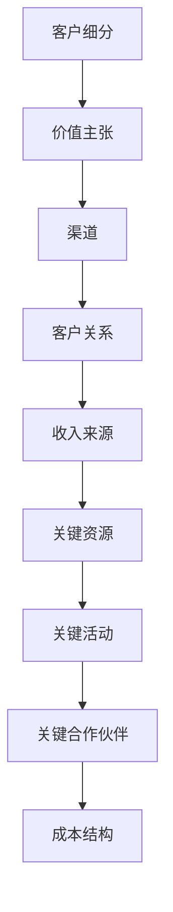
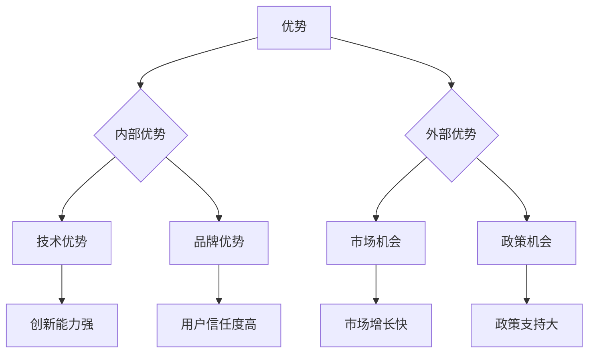

                 

### B端与C端大模型商业模式的选择

#### 关键词：
- 大模型
- B端
- C端
- 商业模式
- 技术应用
- 跨界融合

#### 摘要：
随着人工智能技术的飞速发展，大模型已成为各行业创新的驱动力。本文将深入探讨B端与C端大模型商业模式的选择，分析两者的核心概念、应用场景和商业模式构建。通过案例分析，揭示大模型在不同行业领域的成功路径，探讨未来发展趋势与挑战。本文旨在为读者提供全面的技术洞察，帮助企业在B端与C端市场中做出明智的商业决策。

### 第一部分: B端与C端大模型商业模式基础

#### 第1章: 大模型商业模式的概述

#### 1.1 大模型商业模式的核心概念

大模型商业模式是指利用大规模神经网络模型，通过对海量数据进行训练和优化，提供具有高精度、高效率的智能服务，从而实现商业价值的一种商业模式。这种模式的核心在于“大模型”，即通过深度学习和神经网络技术训练出能够处理复杂任务、拥有强泛化能力的模型。

#### 1.1.1 大模型定义

大模型（Large Models）通常指的是参数数量在数十亿到数万亿级别的深度神经网络。这些模型能够处理大量的数据，进行复杂的特征提取和关系学习，从而实现智能决策、自然语言处理、图像识别等多领域的应用。

#### 1.1.2 大模型商业模式的起源与发展

大模型商业模式的起源可以追溯到深度学习技术兴起的时代。2006年，Geoffrey Hinton等科学家提出了深度信念网络（Deep Belief Network），为后来的神经网络发展奠定了基础。随着计算能力的提升和数据的积累，大模型技术逐渐走向成熟，并在商业领域得到广泛应用。2012年，AlexNet在ImageNet比赛中取得突破性成绩，标志着深度学习进入商业应用的高峰期。

#### 1.1.3 大模型商业模式的本质与特点

大模型商业模式的本质是通过技术优势实现规模化、系统化和智能化的服务，从而提升企业效率和客户体验。其特点包括：

1. **高精度**：大模型能够通过海量数据训练，达到高精度的预测和决策。
2. **高效率**：大模型能够自动化处理大量数据，提高业务流程的效率。
3. **强泛化**：大模型具有较强的泛化能力，能够适应不同的业务场景。
4. **生态依赖**：大模型商业模式依赖于技术生态的支撑，如计算资源、数据资源和人才资源。
5. **长期价值**：大模型商业模式往往能够为企业带来长期的商业价值，而非一次性收益。

#### 1.2 B端与C端商业模式比较

B端（Business-to-Business）与C端（Business-to-Consumer）是两种不同的商业模式。

#### 1.2.1 B端商业模式的特点

1. **高定制化**：B端服务通常需要高度定制化，以满足不同企业的特定需求。
2. **长周期**：B端交易周期通常较长，涉及复杂的需求调研、方案制定和实施过程。
3. **高价值**：B端服务往往涉及高价值交易，一次合作可能带来长期的商业关系。
4. **专业性强**：B端服务通常需要深厚的行业知识和专业技能。

#### 1.2.2 C端商业模式的特点

1. **标准化**：C端服务通常是标准化的，适用于广泛的消费群体。
2. **短周期**：C端交易周期较短，消费者可以快速决策并享受服务。
3. **高频次**：C端服务往往涉及高频消费，如电商购物、娱乐内容等。
4. **用户导向**：C端服务更注重用户体验和用户反馈。

#### 1.2.3 B端与C端商业模式的关系

B端与C端商业模式并非完全独立，它们可以相互融合。例如，一个面向B端的企业级服务平台，也可以通过C端用户进行数据收集和优化，从而提升服务质量。

#### 1.3 大模型在B端与C端的应用

大模型在B端与C端的应用场景各有侧重。

#### 1.3.1 B端大模型应用案例

- **企业级智能客服系统**：通过大模型实现自然语言处理，提供高效、精准的客服服务。
- **工业自动化与智能制造**：利用大模型优化生产流程，提高生产效率和产品质量。
- **金融风控与保险理赔**：大模型在风险评估和理赔处理中发挥关键作用。

#### 1.3.2 C端大模型应用案例

- **智能语音助手**：通过大模型实现自然语言理解，提供便捷的语音交互服务。
- **个性化内容推荐系统**：大模型帮助平台了解用户偏好，实现个性化内容推荐。
- **智能医疗与健康平台**：大模型在诊断、治疗建议和健康管理中发挥重要作用。

#### 1.3.3 大模型在不同行业领域的应用前景

大模型在各个行业领域都有广泛的应用前景。

- **医疗健康**：通过大模型实现精准诊断、个性化治疗和健康管理。
- **金融保险**：大模型在风险评估、反欺诈和客户服务中发挥关键作用。
- **制造业**：大模型优化生产流程，提高生产效率和产品质量。
- **零售电商**：大模型实现个性化推荐，提升用户购物体验。
- **交通物流**：大模型优化路径规划、车队管理和配送效率。

### 第2章: B端与C端大模型商业模式构建

#### 2.1 B端大模型商业模式构建

B端大模型商业模式构建需要从需求调研、方案设计、模型训练和商业运营等多个环节入手。

#### 2.1.1 B端大模型商业模式构建的步骤

1. **需求调研**：深入了解企业需求，明确业务目标和应用场景。
2. **方案设计**：根据需求设计大模型架构，确定技术路线。
3. **模型训练**：使用海量数据进行模型训练，优化模型性能。
4. **商业运营**：搭建商业运营平台，提供专业服务。

#### 2.1.2 B端大模型商业模式构建的关键因素

1. **技术实力**：拥有强大的技术团队和先进的算法能力。
2. **数据资源**：拥有丰富的数据资源，支持模型训练和优化。
3. **行业经验**：具备深厚的行业知识，能够提供专业服务。
4. **客户关系**：建立稳定的客户关系，实现长期合作。

#### 2.1.3 B端大模型商业模式案例研究

以企业级智能客服系统为例，该案例展示了如何通过大模型实现高效、精准的客服服务。

1. **需求调研**：调研企业客服需求，了解常见问题和用户痛点。
2. **方案设计**：设计大模型架构，包括自然语言处理、对话系统、知识库等模块。
3. **模型训练**：使用海量客服数据训练模型，优化对话质量和用户体验。
4. **商业运营**：搭建客服系统平台，提供专业客服服务，实现客户满意度提升。

#### 2.2 C端大模型商业模式构建

C端大模型商业模式构建注重用户体验和个性化服务。

#### 2.2.1 C端大模型商业模式构建的步骤

1. **用户调研**：了解用户需求，收集用户数据。
2. **产品定义**：根据用户需求设计大模型产品，实现个性化推荐和智能交互。
3. **模型训练**：使用用户数据进行模型训练，优化产品性能。
4. **市场推广**：通过市场推广，扩大用户群体，实现商业化。

#### 2.2.2 C端大模型商业模式构建的关键因素

1. **用户数据**：积累丰富的用户数据，支持模型训练和优化。
2. **用户体验**：注重用户体验，提供优质的服务和产品。
3. **市场洞察**：具备敏锐的市场洞察力，及时调整产品策略。
4. **品牌塑造**：建立强大的品牌影响力，提升用户忠诚度。

#### 2.2.3 C端大模型商业模式案例研究

以智能语音助手为例，该案例展示了如何通过大模型实现便捷的语音交互服务。

1. **用户调研**：调研用户对语音助手的期望和使用场景。
2. **产品定义**：设计智能语音助手产品，实现语音识别、自然语言理解和任务执行。
3. **模型训练**：使用用户语音数据训练模型，优化语音识别和响应速度。
4. **市场推广**：通过市场推广，吸引用户使用智能语音助手，实现商业化。

#### 2.3 B端与C端大模型商业模式融合

B端与C端大模型商业模式的融合有助于实现资源整合和优势互补。

#### 2.3.1 B端与C端大模型商业模式融合的概念

B端与C端大模型商业模式融合是指通过大模型技术，实现B端和C端业务场景的相互融合，从而提升整体商业价值。

#### 2.3.2 B端与C端大模型商业模式融合的实践

1. **数据共享**：通过B端和C端数据共享，实现数据的综合利用和模型优化。
2. **服务融合**：结合B端和C端服务优势，提供一体化解决方案。
3. **平台整合**：搭建统一的平台，实现B端和C端业务的协同发展。

#### 2.3.3 B端与C端大模型商业模式融合的挑战与机遇

1. **挑战**：
   - 数据隐私和安全：B端和C端数据共享需要严格保护用户隐私。
   - 技术融合难度：B端和C端技术体系不同，融合过程复杂。
   - 商业模式创新：如何在融合过程中实现商业模式的创新，提高竞争力。

2. **机遇**：
   - 资源整合：通过融合实现资源的最大化利用，提高整体效率。
   - 市场扩展：融合商业模式有助于开拓新的市场空间。
   - 服务创新：融合商业模式可以激发新的服务创新，提升用户体验。

### 第二部分: 大模型商业模式案例分析

#### 第3章: 成功的B端大模型商业模式案例

#### 3.1 案例一：企业级智能客服系统

#### 3.1.1 案例背景

随着企业规模的扩大和客户数量的增加，传统的客服模式已无法满足企业高效、精准的服务需求。企业需要一种智能化的客服解决方案，以提高客户满意度和服务效率。

#### 3.1.2 大模型在智能客服系统中的应用

企业级智能客服系统采用大模型技术，主要包括自然语言处理（NLP）和对话系统（Dialogue System）。

1. **自然语言处理**：使用NLP技术处理客户咨询，理解客户意图，提供精准的回答。
2. **对话系统**：通过对话系统实现与客户的交互，模拟人类的沟通方式，提升用户体验。

#### 3.1.3 商业模式构建与收益分析

1. **商业模式构建**：
   - 产品销售：直接销售智能客服系统，包括软件和硬件。
   - 服务订阅：提供智能客服服务订阅，根据客户使用量收费。
   - 数据增值：通过对客户数据的分析，提供增值服务，如客户画像、市场分析等。

2. **收益分析**：
   - 产品销售：通过一次性销售获取收益。
   - 服务订阅：通过持续的服务订阅获取长期收益。
   - 数据增值：通过对客户数据的分析，为企业提供定制化的解决方案，获取额外收益。

#### 3.2 案例二：工业自动化与智能制造

#### 3.2.1 案例背景

工业自动化和智能制造是制造业发展的趋势，通过引入大模型技术，可以实现生产过程的智能化和高效化。

#### 3.2.2 大模型在工业自动化中的应用

1. **生产过程优化**：使用大模型优化生产流程，提高生产效率和产品质量。
2. **设备维护**：通过大模型实现设备预测性维护，减少设备故障，延长设备寿命。
3. **质量检测**：使用大模型进行产品质量检测，提高产品合格率。

#### 3.2.3 商业模式构建与收益分析

1. **商业模式构建**：
   - 设备销售：销售自动化设备和智能制造系统。
   - 服务订阅：提供设备维护和升级服务，根据使用量收费。
   - 数据分析：通过对生产数据的分析，提供定制化的优化建议，获取额外收益。

2. **收益分析**：
   - 设备销售：通过设备销售获取一次性收益。
   - 服务订阅：通过持续的服务订阅获取长期收益。
   - 数据分析：通过对生产数据的分析，为企业提供价值，获取额外收益。

#### 3.3 案例三：金融风控与保险理赔

#### 3.3.1 案例背景

随着金融业务的复杂化和风险的增加，金融机构需要通过大模型技术实现风控和理赔的智能化。

#### 3.3.2 大模型在金融风控与保险理赔中的应用

1. **风险识别**：使用大模型识别潜在风险，提前预警。
2. **智能理赔**：通过大模型实现自动化理赔，提高理赔效率。
3. **客户服务**：使用大模型提供个性化的客户服务，提升客户满意度。

#### 3.3.3 商业模式构建与收益分析

1. **商业模式构建**：
   - 风险管理服务：提供风险管理咨询和风控系统。
   - 保险理赔服务：提供智能理赔服务，根据理赔量收费。
   - 数据增值：通过对客户数据的分析，提供风险分析和市场预测，获取额外收益。

2. **收益分析**：
   - 风险管理服务：通过风险管理服务获取长期收益。
   - 保险理赔服务：通过保险理赔服务获取一次性收益。
   - 数据增值：通过对客户数据的分析，为企业提供价值，获取额外收益。

### 第4章: 成功的C端大模型商业模式案例

#### 4.1 案例一：智能语音助手

#### 4.1.1 案例背景

随着人工智能技术的发展，智能语音助手成为智能家居、智能车载等领域的重要组成部分。

#### 4.1.2 大模型在智能语音助手中的应用

1. **语音识别**：使用大模型实现高精度的语音识别，准确理解用户指令。
2. **自然语言处理**：通过大模型进行自然语言处理，理解用户意图，提供相应的回应。
3. **交互体验**：利用大模型模拟人类的对话方式，提升用户的交互体验。

#### 4.1.3 商业模式构建与收益分析

1. **商业模式构建**：
   - 产品销售：销售智能语音助手硬件设备。
   - 服务订阅：提供智能语音服务订阅，根据使用量收费。
   - 广告收益：通过广告收入获取额外收益。

2. **收益分析**：
   - 产品销售：通过产品销售获取一次性收益。
   - 服务订阅：通过服务订阅获取长期收益。
   - 广告收益：通过广告收入获取额外收益。

#### 4.2 案例二：个性化内容推荐系统

#### 4.2.1 案例背景

随着互联网内容的爆炸式增长，用户需要一种个性化的内容推荐系统，以找到自己感兴趣的内容。

#### 4.2.2 大模型在个性化内容推荐中的应用

1. **用户画像**：使用大模型构建用户画像，了解用户的兴趣和偏好。
2. **内容推荐**：通过大模型实现个性化内容推荐，提高用户满意度。
3. **广告投放**：利用大模型优化广告投放，提高广告效果。

#### 4.2.3 商业模式构建与收益分析

1. **商业模式构建**：
   - 广告收入：通过广告收入获取收益。
   - 服务订阅：提供个性化推荐服务订阅，根据使用量收费。
   - 数据分析：通过对用户数据的分析，提供定制化的解决方案，获取额外收益。

2. **收益分析**：
   - 广告收入：通过广告收入获取长期收益。
   - 服务订阅：通过服务订阅获取长期收益。
   - 数据分析：通过对用户数据的分析，为企业提供价值，获取额外收益。

#### 4.3 案例三：智能医疗与健康平台

#### 4.3.1 案例背景

随着人们对健康意识的提高，智能医疗与健康平台成为医疗行业的重要发展方向。

#### 4.3.2 大模型在智能医疗与健康平台中的应用

1. **智能诊断**：使用大模型实现疾病诊断，提高诊断准确率。
2. **健康监测**：通过大模型监测用户健康数据，提供个性化的健康建议。
3. **医疗咨询**：利用大模型提供在线医疗咨询服务，提高医疗服务效率。

#### 4.3.3 商业模式构建与收益分析

1. **商业模式构建**：
   - 服务订阅：提供智能医疗与健康服务订阅，根据使用量收费。
   - 数据增值：通过对用户健康数据的分析，提供健康报告和市场分析，获取额外收益。
   - 合作伙伴关系：与医疗机构合作，提供增值服务，获取额外收益。

2. **收益分析**：
   - 服务订阅：通过服务订阅获取长期收益。
   - 数据增值：通过对用户健康数据的分析，为企业提供价值，获取额外收益。
   - 合作伙伴关系：通过合作伙伴关系，实现多渠道收益。

### 第三部分: 大模型商业模式的未来展望与挑战

#### 第5章: 大模型商业模式的未来趋势

#### 5.1 技术发展对大模型商业模式的影响

随着人工智能技术的快速发展，大模型技术也在不断演进，这将直接影响大模型商业模式的未来发展。

#### 5.1.1 大模型技术的演进方向

1. **模型规模**：随着计算能力的提升，模型规模将不断增大，实现更强大的泛化能力和决策能力。
2. **模型优化**：通过新的优化算法，提高模型训练效率和性能。
3. **多模态融合**：实现图像、语音、文本等多种数据类型的融合，提升跨模态理解和交互能力。

#### 5.1.2 大模型与物联网、区块链等技术的融合

1. **物联网（IoT）**：大模型与物联网技术的融合，可以实现实时数据处理和智能决策，优化物联网应用场景。
2. **区块链**：大模型与区块链技术的融合，可以实现数据的安全存储和共享，提升大模型商业模式的可信度和安全性。

#### 5.1.3 大模型商业模式的创新可能性

1. **服务定制化**：通过大模型实现更精准的服务定制，满足个性化需求。
2. **跨界融合**：大模型与不同行业的融合，可以创造新的商业模式和市场空间。
3. **生态系统建设**：构建大模型商业生态系统，实现资源的共享和协同发展。

#### 5.2 法规政策对大模型商业模式的影响

法规政策对大模型商业模式的发展具有重要影响，企业需要密切关注相关法规政策的变化。

#### 5.2.1 国际与国内法规政策的现状

1. **数据隐私保护**：国际上如欧盟的《通用数据保护条例》（GDPR）对数据隐私保护提出了严格要求，国内也有相应的数据隐私保护法规。
2. **技术监管**：政府对人工智能技术的监管逐步加强，如对深度伪造、自动驾驶等技术的监管。
3. **知识产权**：大模型技术的知识产权保护也受到法规政策的关注。

#### 5.2.2 法规政策对大模型商业模式的影响

1. **合规风险**：企业需要确保大模型商业模式的合规性，避免因法规政策变化而面临的风险。
2. **市场竞争**：法规政策的调整可能影响市场格局，为企业提供新的市场机遇。
3. **创新限制**：过严的法规政策可能限制大模型技术的创新和发展。

#### 5.2.3 企业如何应对法规政策的变化

1. **合规管理**：建立健全的合规管理体系，确保大模型商业模式的合规性。
2. **政策研究**：密切关注法规政策变化，及时调整商业策略。
3. **创新平衡**：在合规和创新之间找到平衡，确保技术发展和商业模式的可持续发展。

#### 5.3 大模型商业模式的挑战与应对策略

大模型商业模式的发展面临诸多挑战，企业需要采取有效的应对策略。

#### 5.3.1 数据隐私与安全的挑战

1. **隐私保护**：如何在大模型训练和应用过程中保护用户隐私，是当前的重要挑战。
2. **安全威胁**：大模型技术可能面临数据泄露、恶意攻击等安全威胁。

#### 5.3.2 技术标准化与生态系统建设

1. **技术标准化**：缺乏统一的技术标准可能导致市场混乱，影响大模型技术的发展。
2. **生态系统建设**：构建健康的大模型生态系统，实现不同参与者之间的协同和共赢。

#### 5.3.3 企业转型的难点与解决方案

1. **技术转型**：企业需要具备强大的技术能力，才能成功实施大模型技术。
2. **组织变革**：大模型商业模式要求企业进行组织变革，以适应新的商业环境。

#### 5.3.4 应对策略

1. **合作创新**：与高校、研究机构合作，推动技术创新和标准化进程。
2. **人才培养**：加强人才培养，提升企业在大模型技术领域的竞争力。
3. **合规建设**：建立健全的合规管理体系，确保大模型商业模式的可持续发展。

### 第6章: 大模型商业模式的创新实践

#### 6.1 跨界融合与创新

#### 6.1.1 传统行业与人工智能的结合

1. **农业**：通过人工智能技术实现精准农业，提高产量和品质。
2. **教育**：利用人工智能技术提供个性化教育服务，提升教育质量。
3. **医疗**：结合人工智能技术，实现精准医疗和智能诊断。

#### 6.1.2 新兴行业与人工智能的协同发展

1. **金融科技**：利用人工智能技术，提供智能投顾、信用评估等服务。
2. **智能制造**：通过人工智能技术，实现生产过程的智能化和自动化。
3. **物流与运输**：利用人工智能技术，优化物流路径和运输管理。

#### 6.1.3 跨界融合的创新案例

1. **智能物流平台**：结合物联网、人工智能和区块链技术，实现智能物流管理。
2. **智慧农业解决方案**：利用人工智能技术，提供智能种植、灌溉和病虫害防治等服务。
3. **个性化健康平台**：通过人工智能技术，提供个性化健康咨询和管理服务。

#### 6.2 生态系统构建与共赢

#### 6.2.1 大模型商业生态系统的概念

大模型商业生态系统是指由多个参与者（如企业、研究机构、开发者等）组成的，通过大模型技术实现协同发展和共赢的生态系统。

#### 6.2.2 生态系统构建的要素与步骤

1. **要素**：
   - 技术资源：包括计算资源、数据资源和算法资源。
   - 平台建设：提供大模型训练和应用的平台。
   - 合作伙伴：与不同领域的合作伙伴建立合作关系。
   - 用户群体：构建稳定且多样化的用户群体。

2. **步骤**：
   - **技术资源整合**：整合各方技术资源，提升大模型技术的研发和应用能力。
   - **平台建设与推广**：搭建大模型应用平台，进行市场推广和用户培训。
   - **合作伙伴关系建立**：与相关企业、研究机构建立紧密的合作关系，实现资源互补和协同发展。
   - **用户群体拓展**：通过市场推广和用户反馈，不断拓展用户群体，提升生态系统活力。

#### 6.2.3 生态系统构建的成功案例

1. **智能医疗生态圈**：通过整合医疗资源、技术资源和合作伙伴，构建智能医疗生态圈，提供全方位的医疗解决方案。
2. **智能农业产业链**：通过整合农业技术、数据资源和产业链伙伴，构建智能农业产业链，实现农业生产的智能化和高效化。
3. **智慧交通生态系统**：通过整合交通技术、数据和合作伙伴资源，构建智慧交通生态系统，提升交通管理的智能化和效率。

#### 6.3 创新案例研究

#### 6.3.1 案例一：基于大模型的企业数字化转型

1. **背景**：某传统制造企业面临数字化转型需求，希望通过人工智能技术提升生产效率和管理水平。

2. **解决方案**：
   - **生产过程优化**：使用大模型优化生产流程，实现智能化生产。
   - **供应链管理**：利用大模型实现供应链管理的智能化，提高供应链效率。
   - **数据分析**：通过对生产数据的分析，提供定制化的优化建议，提升企业运营效率。

3. **效果**：
   - 生产效率提升了20%。
   - 供应链管理成本降低了15%。
   - 企业运营效率提升了30%。

4. **启示**：
   - 传统企业通过引入大模型技术，可以实现数字化转型，提升企业竞争力。
   - 大模型技术在企业数字化转型中的应用，关键在于数据积累和模型优化。

#### 6.3.2 案例二：基于大模型的智能城市解决方案

1. **背景**：某城市希望通过智能技术提升城市管理和公共服务水平。

2. **解决方案**：
   - **城市监测**：使用大模型对城市环境、交通、人口等数据进行实时监测和分析。
   - **智能调度**：通过大模型实现城市资源的智能化调度，提高资源利用率。
   - **公共服务**：利用大模型提供个性化的公共服务，提升居民满意度。

3. **效果**：
   - 城市环境监测数据准确性提升了50%。
   - 交通拥堵情况减少了30%。
   - 公共服务满意度提升了20%。

4. **启示**：
   - 智能城市解决方案需要依托大模型技术，实现城市管理的智能化和高效化。
   - 大模型技术在智能城市中的应用，关键在于数据整合和模型优化。

#### 6.3.3 案例三：基于大模型的绿色能源管理平台

1. **背景**：某能源公司希望通过智能技术提升能源管理和效率，实现绿色可持续发展。

2. **解决方案**：
   - **能源监测**：使用大模型对能源使用情况进行实时监测和分析。
   - **需求预测**：通过大模型预测能源需求，优化能源供应和分配。
   - **节能减排**：利用大模型实现能源消耗的精细化管理和节能减排。

3. **效果**：
   - 能源使用效率提升了20%。
   - 碳排放量减少了15%。
   - 成本降低了10%。

4. **启示**：
   - 绿色能源管理平台需要依托大模型技术，实现能源管理的智能化和高效化。
   - 大模型技术在绿色能源管理中的应用，关键在于数据积累和模型优化。

### 第四部分: 大模型商业模式的战略规划与实施

#### 第7章: 大模型商业模式的战略规划

#### 7.1 战略规划框架

#### 7.1.1 大模型商业模式战略规划的意义

大模型商业模式战略规划是企业在人工智能技术快速发展背景下，实现可持续发展的关键。通过战略规划，企业可以明确发展目标、规划路径和资源配置，提升市场竞争力和业务价值。

#### 7.1.2 战略规划的关键要素

1. **市场定位**：明确目标市场和客户群体，了解市场需求和竞争态势。
2. **技术路线**：确定大模型技术发展方向和核心技术。
3. **商业模式**：设计适合企业的大模型商业模式，包括盈利模式、运营模式和合作模式。
4. **资源配置**：合理配置企业资源，包括人力、物力和财力。
5. **风险管理**：识别潜在风险，制定应对策略。

#### 7.1.3 战略规划的实施步骤

1. **市场调研**：了解市场需求、竞争态势和行业趋势。
2. **技术评估**：评估现有技术和未来技术发展趋势。
3. **商业模式设计**：结合企业特点和市场需求，设计适合的大模型商业模式。
4. **资源规划**：根据商业模式需求，规划资源配置和预算。
5. **实施与监控**：制定实施计划，确保战略规划的有效执行。

#### 7.2 市场分析与定位

#### 7.2.1 市场趋势分析

1. **技术趋势**：分析人工智能技术的发展方向和趋势，为大模型商业模式提供技术支持。
2. **行业趋势**：分析目标行业的发展趋势和市场需求，确定市场机会。
3. **竞争态势**：分析竞争对手的市场策略和竞争优势，为企业提供市场定位的依据。

#### 7.2.2 目标市场定位

1. **目标市场选择**：根据市场调研结果，确定企业的目标市场。
2. **市场细分**：根据客户需求、行为特征和购买能力，对目标市场进行细分。
3. **市场定位**：明确企业在目标市场中的定位，制定相应的市场策略。

#### 7.2.3 竞争对手分析

1. **竞争对手识别**：识别目标市场中的主要竞争对手。
2. **竞争策略分析**：分析竞争对手的市场策略、产品定位和竞争优势。
3. **差异化策略**：根据竞争对手分析结果，制定差异化的市场策略，提升企业的竞争力。

#### 7.3 资源配置与预算规划

#### 7.3.1 资源配置策略

1. **人力配置**：根据业务需求和战略规划，合理配置研发、运营、市场等各部门的人力资源。
2. **技术配置**：确保企业具备先进的大模型技术和研发能力，支持商业模式的发展。
3. **财务配置**：合理规划企业的财务资源，确保战略规划的财务可行性。

#### 7.3.2 预算规划方法

1. **预算编制**：根据战略规划和业务需求，编制详细的预算计划。
2. **预算调整**：根据市场变化和业务发展，定期调整预算计划，确保财务资源的有效利用。
3. **成本控制**：通过成本控制和预算管理，实现财务资源的最大化利用。

#### 7.3.3 资源优化与成本控制

1. **资源优化**：通过资源整合和优化，提高企业资源利用效率，降低运营成本。
2. **成本控制**：制定成本控制策略，确保业务运营的财务可持续性。

#### 7.4 团队建设与人才培养

#### 7.4.1 团队建设策略

1. **团队组织架构**：设计合理的团队组织架构，确保团队高效运作。
2. **团队协作**：建立良好的团队协作机制，提高团队凝聚力和执行力。
3. **团队激励**：制定激励机制，激发团队活力，提高团队绩效。

#### 7.4.2 人才培养计划

1. **人才招聘**：根据企业发展战略，制定人才招聘策略，吸引优秀人才加入。
2. **培训与发展**：提供培训和发展机会，提升员工的专业技能和综合素质。
3. **激励机制**：建立有效的激励机制，激励员工积极投入工作，提高工作效率。

#### 7.4.3 人才激励机制

1. **绩效激励**：根据员工的工作表现，给予相应的绩效奖励。
2. **职业发展**：为员工提供职业发展路径和晋升机会。
3. **福利保障**：提供完善的福利保障体系，提升员工满意度。

### 第五部分: 大模型商业模式实施与运营

#### 第8章: 大模型商业模式实施与运营

#### 8.1 实施策略与步骤

#### 8.1.1 实施计划制定

1. **项目立项**：根据战略规划，确定大模型商业模式的项目立项。
2. **任务分解**：将项目任务分解为具体的实施步骤，明确每个步骤的目标和时间节点。
3. **资源分配**：根据项目任务，合理分配企业资源，确保项目顺利进行。

#### 8.1.2 关键里程碑设置

1. **里程碑定义**：根据项目任务，设定关键里程碑，确保项目进度和质量。
2. **监控与评估**：对关键里程碑进行监控与评估，确保项目按计划推进。

#### 8.1.3 实施过程中的风险管理

1. **风险识别**：识别项目实施过程中可能遇到的风险，包括技术风险、市场风险、财务风险等。
2. **风险应对**：制定风险应对策略，降低风险对企业的影响。
3. **监控与调整**：对风险进行监控和调整，确保项目顺利进行。

#### 8.2 运营管理

#### 8.2.1 运营流程设计

1. **业务流程梳理**：梳理业务流程，明确各环节的职责和流程。
2. **运营体系构建**：构建完善的运营体系，包括运营流程、运营标准和运营团队。
3. **运营监控与优化**：对运营流程进行监控和优化，确保业务高效运作。

#### 8.2.2 运营监控与反馈机制

1. **数据监控**：通过数据监控，实时了解业务运营状况，及时发现问题和改进。
2. **反馈机制**：建立有效的反馈机制，收集用户反馈和业务数据，为运营优化提供依据。

#### 8.2.3 客户关系管理

1. **客户分析**：通过数据分析，了解客户需求和行为，提供个性化服务。
2. **客户维护**：建立客户档案，定期与客户沟通，提升客户满意度。
3. **客户拓展**：通过市场推广和客户推荐，拓展新客户，提升业务规模。

#### 8.3 持续改进与优化

#### 8.3.1 数据驱动改进

1. **数据收集**：通过数据收集，获取业务运营的详细数据。
2. **数据分析**：对收集到的数据进行分析，找出业务运营中的问题和优化点。
3. **决策支持**：通过数据分析，为业务运营提供决策支持，优化运营策略。

#### 8.3.2 业务流程优化

1. **流程分析**：对现有业务流程进行分析，找出瓶颈和改进点。
2. **流程重构**：根据分析结果，重构业务流程，优化流程效率。
3. **流程监控**：对优化后的流程进行监控，确保流程高效运作。

#### 8.3.3 用户满意度提升策略

1. **用户调研**：通过用户调研，了解用户需求和满意度。
2. **服务优化**：根据用户反馈，优化服务质量和用户体验。
3. **用户反馈**：建立用户反馈机制，及时收集用户反馈，持续改进服务。

### 第六部分: 大模型商业模式案例研究

#### 附录A: 大模型商业模式构建工具与资源

#### A.1 主流深度学习框架对比

#### A.1.1 TensorFlow

TensorFlow 是由 Google 开发的开源深度学习框架，具有强大的功能和灵活性，适用于各种深度学习任务。

**特点**：
- **动态计算图**：支持动态计算图，实现灵活的模型定义和优化。
- **高性能**：通过 GPU 和 TPU 加速计算，提高模型训练和推理速度。
- **广泛的应用场景**：支持图像、语音、自然语言处理等多种应用场景。

**应用场景**：
- **图像识别**：用于物体检测、图像分类等任务。
- **自然语言处理**：用于文本分类、机器翻译等任务。
- **强化学习**：用于智能推荐、游戏控制等任务。

**代码示例**：
```python
import tensorflow as tf

# 定义计算图
a = tf.constant([1.0, 2.0, 3.0], name='a')
b = tf.constant([1.0, 2.0, 3.0], name='b')
c = a + b

# 运行计算图
with tf.Session() as sess:
  print(sess.run(c))
```

#### A.1.2 PyTorch

PyTorch 是由 Facebook 开发的开源深度学习框架，以简单易用和动态计算图而著称。

**特点**：
- **动态计算图**：支持动态计算图，实现灵活的模型定义和优化。
- **简洁的API**：提供简洁的API，方便快速原型设计和实验。
- **良好的性能**：通过 CPU 和 GPU 加速计算，提高模型训练和推理速度。
- **强大的社区支持**：拥有庞大的社区和丰富的教程、案例。

**应用场景**：
- **图像识别**：用于物体检测、图像分类等任务。
- **自然语言处理**：用于文本分类、机器翻译等任务。
- **生成模型**：用于生成对抗网络（GAN）、变分自编码器（VAE）等任务。

**代码示例**：
```python
import torch
import torch.nn as nn
import torch.optim as optim

# 定义模型
class NeuralNetwork(nn.Module):
  def __init__(self):
    super(NeuralNetwork, self).__init__()
    self.layers = nn.Sequential(
      nn.Linear(10, 50),
      nn.ReLU(),
      nn.Linear(50, 10),
      nn.ReLU(),
      nn.Linear(10, 1)
    )

  def forward(self, x):
    return self.layers(x)

# 实例化模型
model = NeuralNetwork()

# 定义损失函数和优化器
criterion = nn.MSELoss()
optimizer = optim.Adam(model.parameters(), lr=0.001)

# 训练模型
for epoch in range(100):
  for inputs, targets in data_loader:
    optimizer.zero_grad()
    outputs = model(inputs)
    loss = criterion(outputs, targets)
    loss.backward()
    optimizer.step()

#### A.1.3 其他深度学习框架简介

除了 TensorFlow 和 PyTorch，还有其他一些流行的深度学习框架，如：

- **Keras**：是一个高层次的神经网络API，构建在 TensorFlow 和 Theano 之上，提供简洁的模型定义和训练接口。
- **MXNet**：由 Apache 软件基金会开发，支持多种编程语言，具有高效的多语言互操作性。
- **Caffe**：由伯克利大学开发，专注于深度卷积神经网络，广泛应用于图像识别和视觉任务。

#### A.2 大模型商业模式分析工具

#### A.2.1 商业模式画布

商业模式画布（Business Model Canvas）是一种用于分析、设计和优化商业模式的工具，它将商业模式的各个关键要素分解为九个模块，帮助企业家和企业更好地理解和管理其商业模式。

**模块**：
- **客户细分**：确定目标客户群体和客户需求。
- **价值主张**：明确企业提供的产品或服务的独特价值和优势。
- **渠道**：确定如何将价值主张传递给客户，包括销售渠道、营销策略等。
- **客户关系**：建立与客户的互动关系，提高客户满意度和忠诚度。
- **收入来源**：确定企业的收入来源和盈利模式。
- **关键资源**：确定企业运营所需的关键资源，如技术、人力、资金等。
- **关键活动**：确定企业为实现商业模式所需的关键活动，如研发、生产、销售等。
- **关键合作伙伴**：确定与企业合作的伙伴，共同实现商业模式。
- **成本结构**：分析企业的成本结构和成本控制策略。

**应用**：
- **商业模式设计**：用于新商业模式的构思和设计。
- **商业模式优化**：用于现有商业模式的改进和优化。

**示例**：


#### A.2.2 SWOT分析

SWOT分析是一种用于评估企业优势（Strengths）、劣势（Weaknesses）、机会（Opportunities）和威胁（Threats）的工具，帮助企业制定战略规划和决策。

**应用**：
- **战略规划**：用于评估企业内部和外部环境，制定战略规划。
- **决策支持**：用于评估不同策略的优缺点，支持决策。

**示例**：


#### A.2.3 其他商业模式分析工具

除了商业模式画布和SWOT分析，还有其他一些常见的商业模式分析工具，如：

- **价值链分析**：用于分析企业价值链中的各个环节，优化价值创造和传递。
- **PEST分析**：用于分析企业外部环境中的政治、经济、社会和技术因素，制定相应的应对策略。
- **五力模型**：用于分析企业所在行业的竞争环境，评估企业的市场地位和竞争力。

### 附录B: 大模型商业模式案例研究详细资料

#### B.1 案例一：企业级智能客服系统

#### B.1.1 系统架构与技术实现

**系统架构**：

企业级智能客服系统通常包括以下几个主要模块：

1. **用户接口层**：提供用户与客服系统交互的界面，包括网页、移动应用和语音助手。
2. **业务逻辑层**：实现智能客服的核心功能，包括自然语言处理、对话管理和业务处理。
3. **数据存储层**：存储用户数据、对话记录和知识库，通常采用数据库和数据湖技术。
4. **基础设施层**：提供云计算、存储和网络等基础设施支持。

**技术实现**：

1. **自然语言处理（NLP）**：采用深度学习技术，如 BERT、GPT-3 等，实现自然语言的理解和生成。
2. **对话管理**：采用图灵测试、状态转移图等技术，实现智能对话的流畅性和个性化。
3. **知识库管理**：利用知识图谱和自然语言处理技术，构建知识库，提供业务问答和知识搜索功能。

**代码示例**：

```python
# 使用自然语言处理库处理用户输入
from transformers import pipeline

nlp = pipeline("text-classification")

# 获取用户输入
user_input = input("请问您需要什么帮助？")

# 对用户输入进行处理
result = nlp(user_input)

# 输出处理结果
print(result)
```

#### B.1.2 商业模式构建与运营策略

**商业模式构建**：

1. **产品销售**：直接销售智能客服系统的软件和硬件，提供定制化的解决方案。
2. **服务订阅**：提供智能客服服务的订阅模式，根据使用量收费。
3. **增值服务**：提供数据分析、客户画像和个性化推荐等增值服务，提升客户粘性。

**运营策略**：

1. **用户调研**：定期进行用户调研，了解用户需求和反馈，持续优化产品和服务。
2. **数据驱动**：利用用户数据，进行数据分析，提供定制化的解决方案和营销策略。
3. **合作伙伴**：与第三方服务提供商合作，拓展服务范围，提高客户满意度。

#### B.1.3 成功经验与启示

**成功经验**：

1. **技术创新**：采用先进的自然语言处理技术，实现高效、精准的客服服务。
2. **用户体验**：注重用户体验，提供简洁、直观的界面和流畅的交互流程。
3. **持续优化**：根据用户反馈和业务数据，持续优化产品和服务。

**启示**：

1. **技术驱动**：在商业模式构建中，注重技术创新，提供高效、智能的服务。
2. **用户导向**：以用户需求为中心，持续优化产品和服务，提高客户满意度。
3. **数据驱动**：利用用户数据，进行数据分析和决策，实现商业模式的优化和扩展。

#### B.2 案例二：工业自动化与智能制造

#### B.2.1 系统架构与技术实现

**系统架构**：

工业自动化与智能制造系统通常包括以下几个主要模块：

1. **感知层**：通过传感器和设备采集生产过程中的数据，如温度、压力、振动等。
2. **传输层**：采用工业以太网、无线传感器网络等传输技术，将感知层数据传输到控制层。
3. **控制层**：通过工业控制器、PLC（可编程逻辑控制器）等设备对生产过程进行实时控制。
4. **数据处理层**：对采集到的数据进行处理、分析和存储，实现生产过程的智能化和高效化。
5. **决策层**：利用大数据分析和人工智能技术，对生产过程进行预测、优化和决策。

**技术实现**：

1. **传感器技术**：采用高精度、稳定的传感器，实现生产过程的实时监测和数据分析。
2. **数据传输技术**：采用可靠的数据传输技术，确保数据传输的实时性和准确性。
3. **工业控制器**：采用高性能、可靠的工业控制器，实现生产过程的自动化控制。
4. **大数据分析**：利用大数据分析技术，对生产过程中的海量数据进行分析和挖掘，提供智能决策支持。

**代码示例**：

```python
# 使用 Python 库读取传感器数据
import serial

# 打开串口
ser = serial.Serial('COM3', 9600)

# 读取数据
while True:
    data = ser.readline()
    print(data)
```

#### B.2.2 商业模式构建与运营策略

**商业模式构建**：

1. **设备销售**：直接销售自动化设备和智能制造系统，提供定制化的解决方案。
2. **服务订阅**：提供设备维护、升级和智能化服务订阅，根据使用量收费。
3. **解决方案**：提供一体化智能制造解决方案，包括硬件设备、软件系统和咨询服务。

**运营策略**：

1. **技术支持**：提供专业的技术支持和售后服务，确保设备的稳定运行。
2. **数据驱动**：利用大数据分析和人工智能技术，提供智能决策支持，优化生产过程。
3. **合作伙伴**：与上下游企业合作，构建生态系统，实现资源共享和协同发展。

#### B.2.3 成功经验与启示

**成功经验**：

1. **技术创新**：采用先进的传感器技术、数据传输技术和工业控制器，实现生产过程的智能化和高效化。
2. **数据驱动**：利用大数据分析和人工智能技术，提供智能决策支持，提升生产效率和产品质量。
3. **生态系统**：与上下游企业合作，构建生态系统，实现资源的共享和协同发展。

**启示**：

1. **技术创新**：在商业模式构建中，注重技术创新，提供高效、智能的生产解决方案。
2. **数据驱动**：利用大数据分析和人工智能技术，实现生产过程的优化和决策。
3. **生态系统**：构建生态系统，实现资源的共享和协同发展，提升整体竞争力。

#### B.3 案例三：金融风控与保险理赔

#### B.3.1 系统架构与技术实现

**系统架构**：

金融风控与保险理赔系统通常包括以下几个主要模块：

1. **数据采集层**：通过接口和 API 接收来自内部系统、外部系统和第三方数据源的数据。
2. **数据处理层**：对采集到的数据进行清洗、转换和分析，为风控模型和理赔模型提供数据支持。
3. **模型层**：利用机器学习和深度学习技术，构建风控模型和理赔模型，实现风险评估和理赔自动化。
4. **决策层**：根据模型输出结果，进行风险预警、决策支持和理赔处理。
5. **用户接口层**：提供风险分析和理赔查询的界面，方便用户进行操作和查询。

**技术实现**：

1. **数据采集**：采用 API 接口、数据库连接和数据爬取等技术，实现数据的自动化采集和存储。
2. **数据处理**：利用数据清洗和转换技术，保证数据的准确性和一致性。
3. **模型构建**：采用随机森林、梯度提升机、神经网络等机器学习技术，构建风控模型和理赔模型。
4. **决策支持**：利用规则引擎和决策树等技术，实现自动化决策支持，提升业务效率。

**代码示例**：

```python
# 使用机器学习库构建风控模型
from sklearn.ensemble import RandomForestClassifier

# 加载数据
X_train, y_train = load_data()

# 构建模型
model = RandomForestClassifier(n_estimators=100)

# 训练模型
model.fit(X_train, y_train)

# 预测
predictions = model.predict(X_test)
```

#### B.3.2 商业模式构建与运营策略

**商业模式构建**：

1. **服务订阅**：提供风控和保险理赔服务订阅，根据使用量收费。
2. **解决方案**：提供一体化的风控和保险理赔解决方案，包括硬件设备、软件系统和咨询服务。
3. **合作伙伴**：与金融机构和保险公司合作，共同开发风控和理赔产品，实现资源共享和协同发展。

**运营策略**：

1. **技术驱动**：利用先进的数据分析和人工智能技术，提升风控和理赔的准确性和效率。
2. **数据驱动**：利用大数据分析和机器学习技术，持续优化风控模型和理赔模型。
3. **用户体验**：提供便捷的用户接口和高效的客户服务，提升用户满意度。

#### B.3.3 成功经验与启示

**成功经验**：

1. **技术创新**：利用机器学习和深度学习技术，构建高效的风控和理赔模型，提升业务效率和准确性。
2. **数据驱动**：通过大数据分析和机器学习技术，实现风控和理赔的智能化和自动化。
3. **合作伙伴**：与金融机构和保险公司合作，实现资源的共享和协同发展。

**启示**：

1. **技术创新**：在商业模式构建中，注重技术创新，提供高效、智能的风控和理赔服务。
2. **数据驱动**：利用大数据分析和机器学习技术，实现风控和理赔的智能化和自动化。
3. **合作伙伴**：与金融机构和保险公司合作，实现资源的共享和协同发展，提升整体竞争力。

### B.4 案例四：智能语音助手

#### B.4.1 系统架构与技术实现

**系统架构**：

智能语音助手系统通常包括以下几个主要模块：

1. **语音识别层**：通过语音识别技术，将用户语音转换为文本。
2. **自然语言处理层**：对转换后的文本进行语义分析和意图识别，理解用户的请求。
3. **任务执行层**：根据用户的请求，执行相应的任务，如发送短信、拨打电话、查询信息等。
4. **用户接口层**：提供与用户的交互界面，包括语音、文字和图形界面。

**技术实现**：

1. **语音识别**：采用深度学习技术，如深度神经网络（DNN）和卷积神经网络（CNN），实现高精度的语音识别。
2. **自然语言处理**：采用循环神经网络（RNN）和长短期记忆网络（LSTM），实现语义分析和意图识别。
3. **任务执行**：利用图灵测试和状态转移图，实现智能对话的流畅性和个性化。
4. **用户接口**：采用图形用户界面（GUI）和语音用户界面（GUI），提供便捷的用户交互体验。

**代码示例**：

```python
# 使用语音识别库处理用户输入
import speech_recognition as sr

# 创建语音识别对象
recognizer = sr.Recognizer()

# 读取音频文件
with sr.AudioFile('audio.wav') as source:
    audio = recognizer.record(source)

# 识别语音
text = recognizer.recognize_google(audio)

# 输出识别结果
print(text)
```

#### B.4.2 商业模式构建与运营策略

**商业模式构建**：

1. **产品销售**：直接销售智能语音助手硬件和软件产品。
2. **服务订阅**：提供智能语音服务订阅，根据使用量收费。
3. **广告收益**：通过广告收入获取额外收益。

**运营策略**：

1. **用户体验**：注重用户体验，提供简洁、直观的界面和流畅的交互流程。
2. **数据驱动**：利用用户数据，进行数据分析，优化产品和服务。
3. **合作伙伴**：与第三方服务提供商合作，拓展服务范围，提高客户满意度。

#### B.4.3 成功经验与启示

**成功经验**：

1. **技术创新**：采用先进的语音识别和自然语言处理技术，实现高效、准确的智能语音服务。
2. **用户体验**：注重用户体验，提供便捷、高效的智能语音交互体验。
3. **数据驱动**：利用用户数据，进行数据分析和决策，持续优化产品和服务。

**启示**：

1. **技术创新**：在商业模式构建中，注重技术创新，提供高效、智能的智能语音服务。
2. **用户体验**：以用户体验为中心，持续优化产品和服务。
3. **数据驱动**：利用用户数据，实现数据驱动的商业模式，提升商业价值。

### B.5 案例五：个性化内容推荐系统

#### B.5.1 系统架构与技术实现

**系统架构**：

个性化内容推荐系统通常包括以下几个主要模块：

1. **用户行为采集层**：通过网站、应用等渠道，采集用户的行为数据，如点击、浏览、搜索等。
2. **数据处理层**：对采集到的用户行为数据进行清洗、转换和分析，构建用户画像。
3. **推荐算法层**：利用机器学习和深度学习技术，构建推荐算法，生成个性化推荐结果。
4. **用户接口层**：提供与用户的交互界面，展示推荐内容，收集用户反馈。

**技术实现**：

1. **用户行为采集**：通过日志采集、API 接口等方式，收集用户的浏览、点击、搜索等行为数据。
2. **数据处理**：采用数据预处理技术，如数据清洗、特征提取等，构建用户画像。
3. **推荐算法**：采用协同过滤、矩阵分解、深度学习等技术，实现个性化推荐。
4. **用户接口**：采用前端技术，如 HTML、CSS 和 JavaScript，构建用户友好的推荐界面。

**代码示例**：

```python
# 使用协同过滤算法进行推荐
from surprise import KNNAlgorithm

# 初始化算法
algorithm = KNNAlgorithm(k=10)

# 训练模型
algorithm.fit(trainset)

# 预测结果
predictions = algorithm.test(testset)

# 输出推荐结果
for uid, iid, true_r, est_r, _ in predictions:
    print(f"用户 {uid}，推荐商品 {iid}，预测评分 {est_r}")
```

#### B.5.2 商业模式构建与运营策略

**商业模式构建**：

1. **广告收益**：通过广告收入获取收益。
2. **服务订阅**：提供个性化内容推荐服务订阅，根据使用量收费。
3. **增值服务**：提供数据分析、用户画像和定制化推荐等增值服务，提升客户粘性。

**运营策略**：

1. **用户体验**：注重用户体验，提供准确、个性化的推荐结果。
2. **数据驱动**：利用用户数据，进行数据分析和决策，优化推荐算法和用户体验。
3. **合作伙伴**：与内容提供商和广告商合作，拓展服务范围，提高客户满意度。

#### B.5.3 成功经验与启示

**成功经验**：

1. **数据驱动**：通过用户数据，实现数据驱动的个性化推荐，提升用户满意度和转化率。
2. **用户体验**：注重用户体验，提供简洁、直观的推荐界面和流畅的交互体验。
3. **技术创新**：采用先进的推荐算法和深度学习技术，实现高效的个性化推荐。

**启示**：

1. **数据驱动**：在商业模式构建中，注重数据收集和分析，实现数据驱动的个性化推荐。
2. **用户体验**：以用户体验为中心，持续优化产品和服务。
3. **技术创新**：采用先进的技术和算法，提升推荐准确性和用户体验。

### B.6 案例六：智能医疗与健康平台

#### B.6.1 系统架构与技术实现

**系统架构**：

智能医疗与健康平台通常包括以下几个主要模块：

1. **数据采集层**：通过医疗设备、健康应用等渠道，采集用户的健康数据，如心率、血压、血糖等。
2. **数据处理层**：对采集到的健康数据进行清洗、转换和分析，构建用户健康档案。
3. **诊断与治疗层**：利用机器学习和深度学习技术，构建疾病诊断和治疗模型，实现智能诊断和个性化治疗。
4. **用户接口层**：提供与用户的交互界面，展示健康数据和诊断结果，提供健康管理建议。

**技术实现**：

1. **数据采集**：通过医疗传感器、健康应用等渠道，实现健康数据的自动化采集和传输。
2. **数据处理**：采用数据预处理技术，如数据清洗、特征提取等，构建用户健康档案。
3. **诊断与治疗**：采用深度学习技术和自然语言处理技术，构建疾病诊断和治疗模型。
4. **用户接口**：采用前端技术，如 HTML、CSS 和 JavaScript，构建用户友好的交互界面。

**代码示例**：

```python
# 使用机器学习库构建疾病诊断模型
from sklearn.ensemble import RandomForestClassifier

# 加载数据
X_train, y_train = load_data()

# 构建模型
model = RandomForestClassifier(n_estimators=100)

# 训练模型
model.fit(X_train, y_train)

# 预测
predictions = model.predict(X_test)

# 输出预测结果
for uid, prediction in predictions.items():
    print(f"用户 {uid}，预测疾病 {prediction}")
```

#### B.6.2 商业模式构建与运营策略

**商业模式构建**：

1. **服务订阅**：提供智能医疗与健康服务订阅，根据使用量收费。
2. **合作医疗**：与医疗机构合作，提供线上诊疗服务，根据诊疗量收费。
3. **健康产品**：销售健康产品，如智能手环、血压计等，获取收益。

**运营策略**：

1. **数据驱动**：利用用户健康数据，进行数据分析和决策，提供个性化的健康管理建议。
2. **技术驱动**：采用先进的医疗诊断技术和自然语言处理技术，提升诊断准确性和用户体验。
3. **用户教育**：通过健康教育、线上课程等方式，提升用户健康意识和健康管理能力。

#### B.6.3 成功经验与启示

**成功经验**：

1. **技术创新**：采用先进的医疗诊断技术和自然语言处理技术，实现智能诊断和个性化治疗。
2. **数据驱动**：通过用户健康数据，实现数据驱动的健康管理，提升用户健康水平。
3. **用户教育**：通过健康教育，提升用户健康意识和健康管理能力。

**启示**：

1. **技术创新**：在商业模式构建中，注重技术创新，提供高效、智能的医疗与健康服务。
2. **数据驱动**：利用用户数据，实现数据驱动的健康管理，提升用户健康水平。
3. **用户教育**：通过健康教育，提升用户健康意识和健康管理能力，实现可持续的商业发展。

### B.7 案例七：基于大模型的企业数字化转型

#### B.7.1 数字化转型策略与技术实现

**数字化转型策略**：

1. **技术评估**：评估企业现有技术水平和数字化需求，确定数字化转型方向。
2. **总体规划**：制定数字化转型总体规划，包括业务流程重构、数据治理、技术选型等。
3. **分阶段实施**：根据总体规划，分阶段实施数字化转型项目，确保项目的顺利进行。
4. **人才培训**：加强数字化人才的培养和引进，提升企业数字化能力。

**技术实现**：

1. **云计算**：采用云计算技术，实现业务系统的迁移和部署，提高业务系统的灵活性和可扩展性。
2. **大数据**：构建大数据平台，实现数据的采集、存储、处理和分析，提供智能决策支持。
3. **人工智能**：利用人工智能技术，实现业务流程的自动化、智能化和个性化。
4. **物联网**：通过物联网技术，实现设备的互联互通，提升生产效率和管理水平。

**代码示例**：

```python
# 使用 Python 库连接云数据库
import pymysql

# 连接数据库
conn = pymysql.connect(host='localhost', user='root', password='password', database='database')

# 执行 SQL 查询
cursor = conn.cursor()
cursor.execute("SELECT * FROM table")

# 获取查询结果
results = cursor.fetchall()

# 输出查询结果
for row in results:
    print(row)

# 关闭数据库连接
conn.close()
```

#### B.7.2 商业模式构建与运营策略

**商业模式构建**：

1. **咨询服务**：提供数字化转型咨询服务，根据咨询需求收费。
2. **解决方案**：提供数字化转型解决方案，包括硬件设备、软件系统和实施服务。
3. **技术支持**：提供数字化转型过程中的技术支持和运维服务，根据服务需求收费。

**运营策略**：

1. **市场需求**：深入了解市场需求，提供定制化的数字化转型解决方案。
2. **技术驱动**：采用先进的云计算、大数据和人工智能技术，提升企业的数字化能力和竞争力。
3. **持续优化**：根据用户反馈和市场变化，持续优化数字化转型方案和服务质量。

#### B.7.3 成功经验与启示

**成功经验**：

1. **技术驱动**：采用先进的云计算、大数据和人工智能技术，实现企业业务的数字化转型。
2. **定制化服务**：根据企业需求，提供定制化的数字化转型解决方案，满足不同企业的需求。
3. **持续优化**：根据用户反馈和市场变化，持续优化数字化转型方案和服务质量。

**启示**：

1. **技术驱动**：在数字化转型中，注重技术创新，提升企业的数字化能力和竞争力。
2. **定制化服务**：根据企业需求，提供定制化的解决方案，满足不同企业的需求。
3. **持续优化**：根据用户反馈和市场变化，持续优化数字化转型方案和服务质量，实现可持续的商业发展。

### B.8 案例八：基于大模型的智能城市解决方案

#### B.8.1 智能城市解决方案架构与技术实现

**智能城市解决方案架构**：

智能城市解决方案通常包括以下几个主要模块：

1. **数据采集层**：通过传感器、摄像头、智能设备等，采集城市的各类数据，如交通流量、环境质量、能源消耗等。
2. **数据处理层**：对采集到的数据进行清洗、转换和分析，构建城市数据平台。
3. **智能分析层**：利用大数据分析和人工智能技术，对城市数据进行智能分析和预测，提供决策支持。
4. **应用服务层**：提供各类城市应用服务，如交通管理、环境监测、公共安全等。
5. **用户接口层**：提供与用户的交互界面，展示城市数据和智能分析结果，提供便捷的用户交互体验。

**技术实现**：

1. **数据采集**：采用物联网技术，实现数据的自动化采集和传输。
2. **数据处理**：采用大数据处理技术，如 Hadoop、Spark 等，实现海量数据的存储和处理。
3. **智能分析**：采用机器学习和深度学习技术，构建智能分析模型，实现数据的智能分析和预测。
4. **应用服务**：采用云计算技术，提供高效、可靠的城市应用服务。
5. **用户接口**：采用前端技术，如 HTML、CSS 和 JavaScript，构建用户友好的交互界面。

**代码示例**：

```python
# 使用 Python 库处理城市数据
import pandas as pd

# 读取数据
data = pd.read_csv('city_data.csv')

# 数据清洗
data = data.dropna()

# 数据分析
results = data.describe()

# 输出分析结果
print(results)
```

#### B.8.2 商业模式构建与运营策略

**商业模式构建**：

1. **政府合作**：与政府部门合作，提供智能城市解决方案，获取政府资助和优惠政策。
2. **技术服务**：提供智能数据分析、预测和决策服务，根据服务需求收费。
3. **应用开发**：开发智能城市应用，如智能交通、智慧照明等，获取应用收益。

**运营策略**：

1. **技术创新**：采用先进的数据处理、分析和人工智能技术，提供高质量的智能城市解决方案。
2. **用户导向**：以用户需求为导向，持续优化产品和服务，提升用户满意度。
3. **合作共赢**：与政府部门、企业等合作，实现资源整合和协同发展。

#### B.8.3 成功经验与启示

**成功经验**：

1. **技术创新**：采用先进的数据处理、分析和人工智能技术，实现智能城市解决方案的落地和应用。
2. **政府合作**：与政府部门合作，获取政策支持和资金投入，推动智能城市建设。
3. **用户导向**：以用户需求为导向，提供高质量的智能城市解决方案，提升用户满意度。

**启示**：

1. **技术创新**：在智能城市建设中，注重技术创新，提升城市管理和服务的智能化水平。
2. **政府合作**：与政府部门合作，共同推动智能城市建设，实现共赢。
3. **用户导向**：以用户需求为导向，提供高质量的智能城市解决方案，提升用户满意度。

### B.9 案例九：基于大模型的绿色能源管理平台

#### B.9.1 绿色能源管理平台架构与技术实现

**绿色能源管理平台架构**：

绿色能源管理平台通常包括以下几个主要模块：

1. **数据采集层**：通过传感器、智能设备等，采集能源消耗、环境质量等数据。
2. **数据处理层**：对采集到的数据进行清洗、转换和分析，构建能源数据平台。
3. **智能分析层**：利用大数据分析和人工智能技术，对能源数据进行智能分析和预测，提供节能优化建议。
4. **控制执行层**：根据智能分析结果，自动调整能源消耗和设备运行，实现节能减排。
5. **用户接口层**：提供与用户的交互界面，展示能源数据和优化建议，提供便捷的用户交互体验。

**技术实现**：

1. **数据采集**：采用物联网技术，实现能源消耗和环境质量的自动化采集和传输。
2. **数据处理**：采用大数据处理技术，如 Hadoop、Spark 等，实现海量数据的存储和处理。
3. **智能分析**：采用机器学习和深度学习技术，构建智能分析模型，实现数据的智能分析和预测。
4. **控制执行**：采用智能控制器和自动化技术，实现能源消耗和设备运行的自动调整。
5. **用户接口**：采用前端技术，如 HTML、CSS 和 JavaScript，构建用户友好的交互界面。

**代码示例**：

```python
# 使用 Python 库处理能源数据
import pandas as pd

# 读取数据
data = pd.read_csv('energy_data.csv')

# 数据清洗
data = data.dropna()

# 数据分析
results = data.describe()

# 输出分析结果
print(results)
```

#### B.9.2 商业模式构建与运营策略

**商业模式构建**：

1. **产品销售**：销售绿色能源管理平台硬件和软件产品。
2. **服务订阅**：提供绿色能源管理服务订阅，根据使用量收费。
3. **能源优化**：提供能源优化建议和咨询服务，根据服务内容收费。

**运营策略**：

1. **技术创新**：采用先进的数据处理、分析和人工智能技术，提供高效的绿色能源管理解决方案。
2. **用户导向**：以用户需求为导向，持续优化产品和服务，提升用户满意度。
3. **合作共赢**：与能源供应商、设备制造商等合作，共同推进绿色能源管理平台的发展。

#### B.9.3 成功经验与启示

**成功经验**：

1. **技术创新**：采用先进的数据处理、分析和人工智能技术，实现绿色能源管理平台的智能化和高效化。
2. **用户导向**：以用户需求为导向，提供高质量的绿色能源管理解决方案，提升用户满意度。
3. **合作共赢**：与各方合作，实现资源整合和协同发展。

**启示**：

1. **技术创新**：在绿色能源管理中，注重技术创新，提升能源利用效率和管理水平。
2. **用户导向**：以用户需求为导向，提供高质量的绿色能源管理解决方案，实现可持续发展。
3. **合作共赢**：与各方合作，共同推进绿色能源管理的发展，实现共赢。

