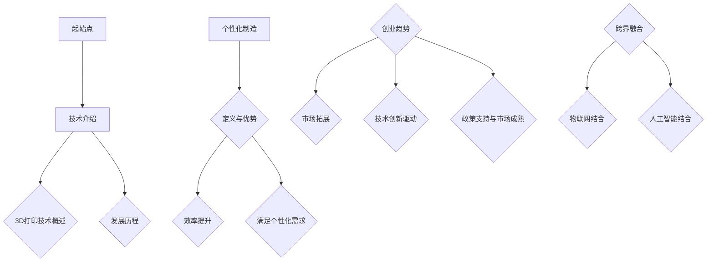
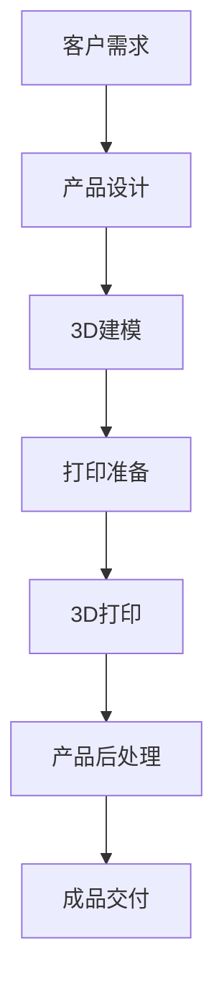
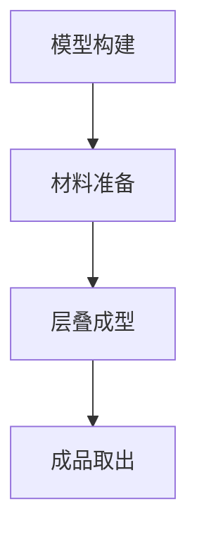
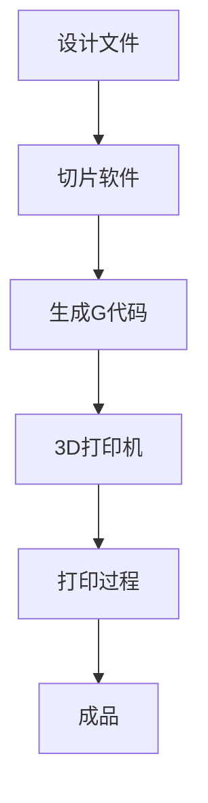
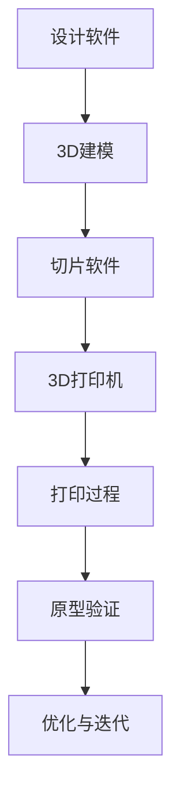
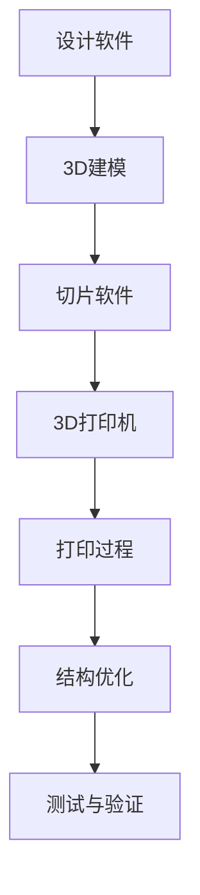
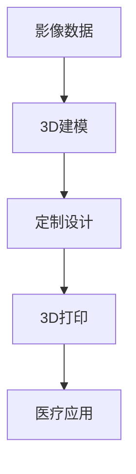
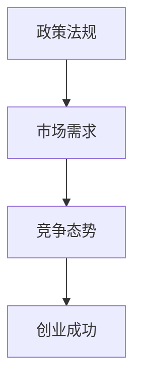
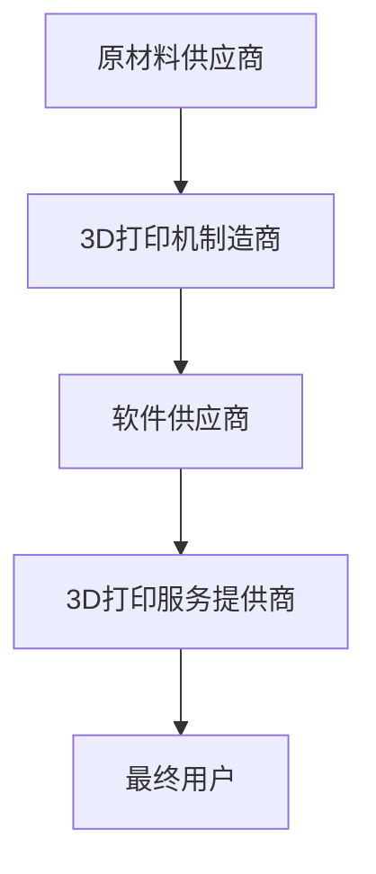
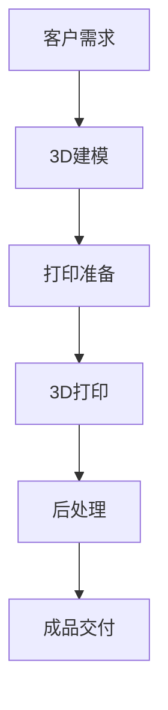

                 

### 引言

#### 1.1 3D打印技术简介

3D打印（3D Printing），又称增材制造（Additive Manufacturing），是一种通过逐层构建材料来生产三维实体的技术。与传统减材制造（如车铣磨等）不同，3D打印无需先制造出模型，而是直接将数字模型转换成可打印的代码，通过软件和机器精确控制打印材料逐层叠加，最终形成所需的三维产品。

3D打印技术的起源可以追溯到20世纪80年代，当时Charles Hull发明了立体光固化成型（SLA）技术，这被认为是3D打印技术的开端。此后，熔融沉积成型（FDM）、选择性激光烧结（SLS）、电子束熔炼（EBM）等多种3D打印技术相继问世，使得3D打印的应用范围不断扩大。

#### 1.2 个性化制造的概念与优势

个性化制造（Mass Customization）是一种结合大规模生产和个性化定制的新型生产模式。其核心思想是利用信息技术和制造技术的深度融合，实现产品按需定制，以满足消费者多样化的需求。个性化制造的优势主要体现在以下几个方面：

1. **提高生产效率**：通过自动化和数字化技术，个性化制造能够显著提高生产效率，减少生产周期和成本。
   
2. **满足个性化需求**：消费者可以参与到产品设计中，根据自己的需求和偏好定制产品，这极大地提升了客户满意度。

3. **降低库存成本**：个性化制造模式可以降低库存压力，企业只需根据订单生产，减少过剩库存和资金占用。

4. **提升产品质量**：通过精确的数字化制造过程，可以更好地控制产品质量，减少缺陷率。

#### 1.3 3D打印创业的趋势与前景

随着3D打印技术的不断发展和成熟，越来越多的创业者看到了其中的商业机遇。以下是一些3D打印创业的趋势和前景：

1. **新兴市场拓展**：3D打印技术正在从传统的制造业向医疗、医疗、航空航天、建筑等领域拓展，为创业者提供了广阔的市场空间。

2. **技术创新驱动**：新材料、新工艺和新设备的研发，将进一步提升3D打印的性能和适用性，为创业者带来更多创新机会。

3. **政策支持与市场成熟**：全球各国政府纷纷出台政策支持3D打印技术的发展，同时，市场的成熟也为创业者提供了更好的发展环境。

4. **跨界融合**：3D打印技术与其他行业的深度融合，如与物联网、人工智能等技术的结合，将创造出更多的商业模式和商业机会。

在接下来的章节中，我们将进一步探讨3D打印技术的基础知识、应用场景、创业模式以及产业链分析，帮助读者全面了解3D打印创业的现状和未来趋势。

---

**Mermaid 流程图示例**：



---

**核心概念与联系**：

个性化制造与3D打印的结合，使得产品能够根据客户需求进行定制化生产，从而实现了从大规模生产到个性化生产的转变。这一过程涉及从设计、打印到后处理的多个环节，每个环节都需要精确的控制和优化。



**核心算法原理讲解**：

个性化制造过程中，3D建模是一个关键环节。以下是一个简单的3D建模算法的伪代码：

```plaintext
// 3D建模算法伪代码

// 输入：客户需求参数
// 输出：3D模型

function generateModel(parameters) {
    model = initializeEmptyModel();
    
    // 根据参数生成模型的各个部分
    for (part in parameters.parts) {
        appendPartToModel(model, parameters.parts[part]);
    }
    
    // 进行几何优化
    optimizeModel(model);
    
    return model;
}
```

**数学模型和公式**：

在3D打印中，打印精度与打印速度之间的关系可以用以下公式表示：

$$
精度 \approx \frac{打印速度^2}{2}
$$

该公式说明了打印速度越快，精度越低。为了提高精度，需要适当降低打印速度。

**举例说明**：

假设一台3D打印机在打印速度为10mm/s时的精度为0.1mm，根据上述公式，如果要提高精度到0.05mm，打印速度应降低到5mm/s。

---

**项目实战**：

以一家3D打印鞋定制公司为例，该公司为客户提供个性化的鞋定制服务。以下是开发环境搭建和源代码实现的简要步骤：

1. **开发环境搭建**：

    - 安装3D建模软件（如Blender、AutoCAD等）
    - 安装3D打印机驱动程序
    - 安装相关编程工具（如Python、C++等）

2. **源代码实现**：

    - **客户需求分析模块**：

        ```python
        # 客户需求分析伪代码

        def analyzeCustomerDemand(demand):
            # 分析客户需求，提取关键参数
            parameters = extractParametersFromDemand(demand)
            return parameters
        ```

    - **3D建模模块**：

        ```python
        # 3D建模伪代码

        def generateShoeModel(parameters):
            # 生成鞋底、鞋面等部件的3D模型
            model = generateShoeBase(parameters)
            model = addShoeUpper(model, parameters)
            return model
        ```

    - **打印准备模块**：

        ```python
        # 打印准备伪代码

        def prepareForPrinting(model):
            # 将3D模型转换为打印代码
            gcode = convertModelToGcode(model)
            return gcode
        ```

3. **代码解读与分析**：

    - **客户需求分析模块**：该模块负责从客户需求中提取关键参数，如鞋码、鞋型、材质等。
    - **3D建模模块**：该模块根据提取的参数生成鞋底、鞋面等部件的3D模型。
    - **打印准备模块**：该模块将3D模型转换为打印代码，并准备打印。

通过以上步骤，公司可以为客户提供个性化的鞋定制服务，从而提高客户满意度和市场份额。

---

在引言部分，我们介绍了3D打印技术的基本概念、个性化制造的优势以及3D打印创业的趋势与前景。接下来，我们将深入探讨3D打印技术的基础知识，帮助读者更好地理解这一技术的工作原理和应用。

---

**作者信息**：

作者：AI天才研究院/AI Genius Institute & 禅与计算机程序设计艺术 /Zen And The Art of Computer Programming

---

### 3D打印技术基础

#### 2.1 3D打印原理

3D打印技术是一种通过逐层构建材料来生产三维实体的技术，其基本原理可以概括为以下三个步骤：模型构建、材料沉积和层叠成型。

1. **模型构建**：

   首先，需要将设计好的三维模型转化为可打印的代码。这通常涉及到三维建模软件（如Blender、AutoCAD等）的使用。建模软件可以将三维模型分解为多个二维切片，每个切片代表实体的一层。

2. **材料沉积**：

   在模型构建完成后，打印机将根据切片文件逐层打印材料。不同的3D打印技术使用的材料有所不同，如塑料、金属粉末、树脂等。材料沉积的过程可以视为将一层层的材料按照预定的顺序堆叠起来。

3. **层叠成型**：

   材料沉积完成后，打印机通过加热、烧结或其他方式将材料固定，形成实体的各层。随着打印的进行，逐层叠加的材料最终形成完整的三维实体。

**3D打印的基本过程**：



**3D打印的主要技术分类**：

3D打印技术可以根据材料沉积的方式和工作原理进行分类，主要技术包括：

1. **熔融沉积成型（FDM）**：

   FDM是最常见的3D打印技术之一，通过加热塑料等材料，使其熔化后沉积在打印床上，逐层叠加形成实体。FDM设备成本相对较低，操作简单，适合打印塑料和其他热塑性材料。

2. **立体光固化成型（SLA）**：

   SLA技术使用紫外激光将光敏树脂逐层固化，形成三维实体。SLA打印精度高，但打印速度较慢，且材料成本较高。

3. **选择性激光烧结（SLS）**：

   SLS技术使用激光将粉末材料（如尼龙、金属粉末等）逐层烧结，形成三维实体。SLS技术适用于打印复杂的金属零件和高质量的功能性部件。

4. **电子束熔炼（EBM）**：

   EBM技术使用电子束熔化金属粉末，逐层堆积形成实体。EBM技术适用于打印高强度、高精度的金属部件，如航空航天和医疗设备。

**3D打印机的工作原理与分类**：

3D打印机的工作原理主要包括三个部分：打印头、打印床和控制系统。

1. **打印头**：

   打印头是3D打印机的核心部分，负责将材料逐层沉积。打印头可以是移动的，也可以是固定的，取决于3D打印技术。

2. **打印床**：

   打印床是放置打印材料的基础，通常可以加热或移动，以适应不同的打印需求。

3. **控制系统**：

   控制系统负责接收和执行打印指令，控制打印头和打印床的运动，确保打印过程的顺利进行。

根据工作原理和打印方式的不同，3D打印机可以分为以下几类：

- **桌面打印机**：适合家庭和工作室使用，体积较小，打印精度和速度相对较低。

- **工业打印机**：适用于大规模生产和制造，打印精度高，速度和打印尺寸大。

- **专业打印机**：针对特定行业和应用场景设计的打印机，如医疗、航空航天等。

**3D打印机的选购指南**：

选择3D打印机时，需要考虑以下因素：

1. **打印尺寸**：根据所需的打印尺寸选择合适的打印机。

2. **打印精度**：根据应用场景和产品要求选择合适的打印精度。

3. **打印材料**：根据所需的材料类型选择合适的打印机。

4. **预算**：根据预算范围选择合适的打印机。

5. **操作难度**：考虑是否需要专业的技术支持。

6. **售后服务**：考虑厂商的售后服务质量和响应速度。

在接下来的章节中，我们将进一步探讨3D打印在制造业中的应用，以及创业者在3D打印领域的机会和挑战。

---

**Mermaid 流程图示例**：



**核心概念与联系**：

3D打印的核心在于将三维模型转化为实体，这一过程中涉及模型构建、材料沉积和层叠成型等多个环节。这些环节相互关联，共同决定了3D打印的精度、速度和成本。

**核心算法原理讲解**：

3D打印中的关键算法包括切片算法和路径优化算法。

- **切片算法**：

    切片算法将三维模型分解为二维的切片，为3D打印机提供逐层的打印指令。以下是一个简单的切片算法的伪代码：

    ```plaintext
    // 切片算法伪代码

    function sliceModel(model, thickness) {
        layers = []
        for (z in 0 to model.height step thickness) {
            currentLayer = extractLayerAtHeight(model, z)
            layers.append(currentLayer)
        }
        return layers
    }
    ```

- **路径优化算法**：

    路径优化算法用于优化打印路径，减少打印时间和材料消耗。以下是一个简单的路径优化算法的伪代码：

    ```plaintext
    // 路径优化算法伪代码

    function optimizePath(path) {
        new_path = []
        for (segment in path) {
            if (segment.length > threshold) {
                new_path.append(subdivideSegment(segment, threshold))
            } else {
                new_path.append(segment)
            }
        }
        return new_path
    }
    ```

**数学模型和公式**：

3D打印中的关键参数包括层厚、填充率和打印速度。以下是一些常用的数学模型和公式：

- **层厚**：

    $$ h = \frac{model.height}{num_layers} $$

    其中，\( h \) 为层厚，\( model.height \) 为模型高度，\( num_layers \) 为层数。

- **填充率**：

    $$ fill\_rate = \frac{fill\_volume}{layer\_area} \times 100\% $$

    其中，\( fill_volume \) 为填充体积，\( layer_area \) 为层面积。

- **打印速度**：

    $$ speed = \frac{model.length}{print\_time} $$

    其中，\( speed \) 为打印速度，\( model.length \) 为模型长度，\( print_time \) 为打印时间。

**举例说明**：

假设一个模型的长度为100mm，高度为50mm，要打印100层，每层厚度为0.5mm。根据上述公式，可以计算出：

- **层厚**：\( h = \frac{50mm}{100} = 0.5mm \)
- **填充率**：假设填充体积为40mm³，层面积为50mm²，则 \( fill_rate = \frac{40mm³}{50mm²} \times 100\% = 80\% \)
- **打印速度**：假设打印时间为10小时，则 \( speed = \frac{100mm}{10h} = 10mm/h \)

**项目实战**：

以一个简单的FDM 3D打印机为例，以下是开发环境搭建和源代码实现的简要步骤：

1. **开发环境搭建**：

    - 安装Arduino IDE
    - 安装Marlin打印机固件
    - 安装RapidSketch等3D建模软件

2. **源代码实现**：

    - **主板控制程序**：

        ```cpp
        // Marlin主控程序的一部分

        void manage_mesh() {
            check_mesh();
            calculate_mesh();
            apply_mesh();
        }
        ```

    - **电机控制程序**：

        ```cpp
        //电机控制伪代码

        void move_motor(float x, float y, float z) {
            stepper_x.move(x * X_STEPS_PER_MM);
            stepper_y.move(y * Y_STEPS_PER_MM);
            stepper_z.move(z * Z_STEPS_PER_MM);
        }
        ```

3. **代码解读与分析**：

    - **主板控制程序**：该程序负责处理打印机的工作流程，包括检查、计算和执行打印任务。
    - **电机控制程序**：该程序负责控制打印机的电机，实现打印头在X、Y、Z三个方向上的移动。

通过以上步骤，开发者可以搭建一个简单的FDM 3D打印机，实现基本的3D打印功能。

---

在基础部分，我们详细介绍了3D打印的原理、分类和工作原理，并通过实际的算法原理讲解、数学模型和项目实战，帮助读者深入理解3D打印的核心技术和实现方法。接下来，我们将探讨3D打印在制造业中的应用，展示这一技术如何改变制造业的运作方式。

---

**作者信息**：

作者：AI天才研究院/AI Genius Institute & 禅与计算机程序设计艺术 /Zen And The Art of Computer Programming

---

### 3D打印在制造业中的应用

#### 3.1 3D打印在产品设计中的应用

3D打印技术在产品设计领域具有广泛的应用，尤其在快速原型制作和产品迭代与优化方面发挥了重要作用。

**快速原型制作**：

快速原型制作（Rapid Prototyping，RP）是3D打印技术在产品设计中最常见的应用之一。通过3D打印技术，设计师可以快速地将数字模型转化为实体原型，以便进行验证和测试。这一过程极大地缩短了产品的设计周期，提高了设计的灵活性和效率。

**产品迭代与优化**：

在产品设计过程中，3D打印技术使得设计师能够快速进行多次迭代，不断优化产品性能。每次迭代只需重新打印部分部件，从而大大降低了成本和设计风险。此外，3D打印技术还允许设计师在产品设计初期就考虑产品的制造可行性，提前发现和解决潜在问题。

**案例分析**：

以一家制造智能手机的公司为例，该公司利用3D打印技术进行产品设计。以下是一个简单的案例流程：

1. **设计阶段**：

    - 设计师使用3D建模软件创建智能手机的外壳模型。
    - 模型经过切片软件处理，生成G代码。
    - 打印机根据G代码打印出外壳的原型。

2. **验证与测试阶段**：

    - 设计师对打印出的外壳原型进行尺寸、形状和手感等方面的测试。
    - 根据测试结果，对模型进行优化和调整。

3. **迭代与优化**：

    - 设计师根据测试反馈，对模型进行多次迭代和优化。
    - 每次迭代只需重新打印部分外壳部件。

通过这种快速迭代和优化过程，公司能够在短时间内完成产品的设计、验证和优化，确保最终产品的质量和市场竞争力。

**核心概念与联系**：

3D打印技术在产品设计中的应用，主要依赖于其快速、灵活和高效的特点。通过3D打印技术，设计师可以实现从数字模型到实体原型的快速转换，从而提高设计效率和产品质量。这一过程涉及从设计、建模、切片到打印的多个环节，每个环节都需要精确的控制和优化。



**核心算法原理讲解**：

3D打印技术在产品设计中的应用，涉及多个关键算法，包括三维建模算法、切片算法和路径优化算法。

- **三维建模算法**：

    三维建模算法用于创建产品的数字模型。以下是一个简单的三维建模算法的伪代码：

    ```plaintext
    // 三维建模算法伪代码

    function generateModel(shape, dimensions) {
        model = createEmptyModel();
        shapeGenerator = selectShapeGenerator(shape);
        shapeGenerator.generate(model, dimensions);
        return model;
    }
    ```

- **切片算法**：

    切片算法将三维模型分解为二维的切片，为3D打印机提供逐层的打印指令。以下是一个简单的切片算法的伪代码：

    ```plaintext
    // 切片算法伪代码

    function sliceModel(model, thickness) {
        layers = []
        for (z in 0 to model.height step thickness) {
            currentLayer = extractLayerAtHeight(model, z)
            layers.append(currentLayer)
        }
        return layers
    }
    ```

- **路径优化算法**：

    路径优化算法用于优化打印路径，减少打印时间和材料消耗。以下是一个简单的路径优化算法的伪代码：

    ```plaintext
    // 路径优化算法伪代码

    function optimizePath(path) {
        new_path = []
        for (segment in path) {
            if (segment.length > threshold) {
                new_path.append(subdivideSegment(segment, threshold))
            } else {
                new_path.append(segment)
            }
        }
        return new_path
    }
    ```

**数学模型和公式**：

在3D打印技术中，层厚、填充率和打印速度是关键参数。以下是一些常用的数学模型和公式：

- **层厚**：

    $$ h = \frac{model.height}{num_layers} $$

    其中，\( h \) 为层厚，\( model.height \) 为模型高度，\( num_layers \) 为层数。

- **填充率**：

    $$ fill\_rate = \frac{fill\_volume}{layer\_area} \times 100\% $$

    其中，\( fill_volume \) 为填充体积，\( layer_area \) 为层面积。

- **打印速度**：

    $$ speed = \frac{model.length}{print\_time} $$

    其中，\( speed \) 为打印速度，\( model.length \) 为模型长度，\( print_time \) 为打印时间。

**举例说明**：

假设一个模型的长度为100mm，高度为50mm，要打印100层，每层厚度为0.5mm。根据上述公式，可以计算出：

- **层厚**：\( h = \frac{50mm}{100} = 0.5mm \)
- **填充率**：假设填充体积为40mm³，层面积为50mm²，则 \( fill_rate = \frac{40mm³}{50mm²} \times 100\% = 80\% \)
- **打印速度**：假设打印时间为10小时，则 \( speed = \frac{100mm}{10h} = 10mm/h \)

**项目实战**：

以一个简单的FDM 3D打印机为例，以下是开发环境搭建和源代码实现的简要步骤：

1. **开发环境搭建**：

    - 安装Arduino IDE
    - 安装Marlin打印机固件
    - 安装RapidSketch等3D建模软件

2. **源代码实现**：

    - **主板控制程序**：

        ```cpp
        // Marlin主控程序的一部分

        void manage_mesh() {
            check_mesh();
            calculate_mesh();
            apply_mesh();
        }
        ```

    - **电机控制程序**：

        ```cpp
        //电机控制伪代码

        void move_motor(float x, float y, float z) {
            stepper_x.move(x * X_STEPS_PER_MM);
            stepper_y.move(y * Y_STEPS_PER_MM);
            stepper_z.move(z * Z_STEPS_PER_MM);
        }
        ```

3. **代码解读与分析**：

    - **主板控制程序**：该程序负责处理打印机的工作流程，包括检查、计算和执行打印任务。
    - **电机控制程序**：该程序负责控制打印机的电机，实现打印头在X、Y、Z三个方向上的移动。

通过以上步骤，开发者可以搭建一个简单的FDM 3D打印机，实现基本的3D打印功能。

---

**3D打印技术对制造业的影响**：

3D打印技术的引入，对制造业产生了深远的影响，主要体现在以下几个方面：

1. **生产效率提升**：

   3D打印技术使得制造过程更加高效，从设计到成品的时间大大缩短。设计师可以快速创建原型并进行测试，缩短了产品开发周期。

2. **降低生产成本**：

   3D打印技术减少了原材料浪费，通过按需打印，企业可以降低库存成本和生产成本。此外，3D打印技术还可以实现个性化生产，减少大规模生产带来的额外成本。

3. **提高产品精度**：

   3D打印技术提供了更高的制造精度，能够生产出更加精细和复杂的部件，满足高端制造业的需求。

4. **灵活性和适应性**：

   3D打印技术使得企业能够更灵活地应对市场需求变化，快速调整生产计划，满足个性化定制需求。

5. **创新设计能力**：

   3D打印技术激发了设计师的创新设计能力，使得他们能够探索更多可能的设计方案，推动产品创新。

在接下来的章节中，我们将进一步探讨3D打印在航空航天制造和医疗领域的应用，展示这一技术如何在不同行业发挥重要作用。

---

**作者信息**：

作者：AI天才研究院/AI Genius Institute & 禅与计算机程序设计艺术 /Zen And The Art of Computer Programming

---

### 3D打印在航空航天制造中的应用

#### 3.2 3D打印在航空航天制造中的应用

3D打印技术在航空航天制造领域有着广泛的应用，为这一行业带来了诸多变革。以下将从航空航天零部件制造和航空航天器结构优化两个方面，探讨3D打印在航空航天制造中的应用。

**航空航天零部件制造**：

3D打印技术为航空航天零部件制造提供了强大的支持，尤其是在制造复杂形状和高精度部件方面。传统的制造方法往往难以实现复杂的几何形状，而3D打印技术通过逐层构建材料的方式，能够轻松应对这一挑战。

**案例分析**：

以波音787客机为例，波音公司在787客机的设计和制造过程中大量采用了3D打印技术。以下是一个具体的案例：

1. **设计阶段**：

    - 设计团队使用3D建模软件创建飞机零部件的数字模型。
    - 数字模型经过切片软件处理，生成G代码。

2. **打印阶段**：

    - 使用SLM（选择性激光熔炼）技术打印钛合金部件，如发动机叶片和飞机结构件。
    - 通过电子束熔炼（EBM）技术打印不锈钢和铝合金部件。

3. **测试与验证**：

    - 对打印出的部件进行强度、耐腐蚀性和耐高温性等测试。
    - 根据测试结果，对模型进行优化和调整。

通过这一过程，波音公司成功制造出了一系列高质量的航空航天零部件，大幅提高了生产效率和产品质量。

**航空航天器结构优化**：

3D打印技术不仅能够制造复杂的零部件，还能在航空航天器结构优化方面发挥重要作用。通过3D打印，设计师可以更灵活地调整结构设计，优化材料分布，从而提高航空航天器的性能和效率。

**核心概念与联系**：

3D打印技术在航空航天制造中的应用，主要依赖于其高精度、高灵活性和高效性的特点。通过3D打印技术，设计师能够实现复杂形状和高精度部件的制造，同时优化航空航天器的结构设计，提高整体性能。



**核心算法原理讲解**：

3D打印技术在航空航天制造中的应用，涉及多个关键算法，包括三维建模算法、切片算法和路径优化算法。

- **三维建模算法**：

    三维建模算法用于创建航空航天零部件和结构的数字模型。以下是一个简单的三维建模算法的伪代码：

    ```plaintext
    // 三维建模算法伪代码

    function generateModel(shape, dimensions) {
        model = createEmptyModel();
        shapeGenerator = selectShapeGenerator(shape);
        shapeGenerator.generate(model, dimensions);
        return model;
    }
    ```

- **切片算法**：

    切片算法将三维模型分解为二维的切片，为3D打印机提供逐层的打印指令。以下是一个简单的切片算法的伪代码：

    ```plaintext
    // 切片算法伪代码

    function sliceModel(model, thickness) {
        layers = []
        for (z in 0 to model.height step thickness) {
            currentLayer = extractLayerAtHeight(model, z)
            layers.append(currentLayer)
        }
        return layers
    }
    ```

- **路径优化算法**：

    路径优化算法用于优化打印路径，减少打印时间和材料消耗。以下是一个简单的路径优化算法的伪代码：

    ```plaintext
    // 路径优化算法伪代码

    function optimizePath(path) {
        new_path = []
        for (segment in path) {
            if (segment.length > threshold) {
                new_path.append(subdivideSegment(segment, threshold))
            } else {
                new_path.append(segment)
            }
        }
        return new_path
    }
    ```

**数学模型和公式**：

在3D打印技术中，层厚、填充率和打印速度是关键参数。以下是一些常用的数学模型和公式：

- **层厚**：

    $$ h = \frac{model.height}{num_layers} $$

    其中，\( h \) 为层厚，\( model.height \) 为模型高度，\( num_layers \) 为层数。

- **填充率**：

    $$ fill\_rate = \frac{fill\_volume}{layer\_area} \times 100\% $$

    其中，\( fill_volume \) 为填充体积，\( layer_area \) 为层面积。

- **打印速度**：

    $$ speed = \frac{model.length}{print\_time} $$

    其中，\( speed \) 为打印速度，\( model.length \) 为模型长度，\( print_time \) 为打印时间。

**举例说明**：

假设一个模型的长度为100mm，高度为50mm，要打印100层，每层厚度为0.5mm。根据上述公式，可以计算出：

- **层厚**：\( h = \frac{50mm}{100} = 0.5mm \)
- **填充率**：假设填充体积为40mm³，层面积为50mm²，则 \( fill_rate = \frac{40mm³}{50mm²} \times 100\% = 80\% \)
- **打印速度**：假设打印时间为10小时，则 \( speed = \frac{100mm}{10h} = 10mm/h \)

**项目实战**：

以一个简单的SLM 3D打印机为例，以下是开发环境搭建和源代码实现的简要步骤：

1. **开发环境搭建**：

    - 安装Slic3r软件
    - 安装Eagle软件进行电路板设计
    - 安装Arduino IDE

2. **源代码实现**：

    - **打印机控制程序**：

        ```cpp
        // Slic3r主控程序的一部分

        void manage_mesh() {
            check_mesh();
            calculate_mesh();
            apply_mesh();
        }
        ```

    - **电机控制程序**：

        ```cpp
        //电机控制伪代码

        void move_motor(float x, float y, float z) {
            stepper_x.move(x * X_STEPS_PER_MM);
            stepper_y.move(y * Y_STEPS_PER_MM);
            stepper_z.move(z * Z_STEPS_PER_MM);
        }
        ```

3. **代码解读与分析**：

    - **打印机控制程序**：该程序负责处理打印机的工作流程，包括检查、计算和执行打印任务。
    - **电机控制程序**：该程序负责控制打印机的电机，实现打印头在X、Y、Z三个方向上的移动。

通过以上步骤，开发者可以搭建一个简单的SLM 3D打印机，实现基本的3D打印功能。

---

**3D打印技术对航空航天制造的影响**：

3D打印技术在航空航天制造中的应用，对整个行业产生了深远的影响，主要体现在以下几个方面：

1. **提高制造效率**：

   3D打印技术使得制造过程更加高效，从设计到成品的时间大大缩短。设计师可以快速创建原型并进行测试，缩短了产品开发周期。

2. **降低制造成本**：

   3D打印技术减少了原材料浪费，通过按需打印，企业可以降低库存成本和生产成本。此外，3D打印技术还可以实现个性化生产，减少大规模生产带来的额外成本。

3. **提高产品精度**：

   3D打印技术提供了更高的制造精度，能够生产出更加精细和复杂的部件，满足高端制造业的需求。

4. **灵活性和适应性**：

   3D打印技术使得企业能够更灵活地应对市场需求变化，快速调整生产计划，满足个性化定制需求。

5. **创新设计能力**：

   3D打印技术激发了设计师的创新设计能力，使得他们能够探索更多可能的设计方案，推动产品创新。

在接下来的章节中，我们将进一步探讨3D打印在医疗领域的应用，展示这一技术如何为医疗行业带来变革。

---

**作者信息**：

作者：AI天才研究院/AI Genius Institute & 禅与计算机程序设计艺术 /Zen And The Art of Computer Programming

---

### 3D打印在医疗领域的应用

#### 3.3 3D打印在医疗领域的应用

3D打印技术在医疗领域的应用日益广泛，为个性化医疗、手术规划和医疗器械制造等领域带来了革命性的变化。以下将从医疗器械定制化和医疗辅助设备制造两个方面，探讨3D打印在医疗领域的应用。

**医疗器械定制化生产**：

3D打印技术使得医疗器械的定制化生产成为可能，大大提高了医疗服务的个性化和精准化水平。通过3D打印，医生可以为患者定制个性化的医疗器械，如骨科植入物、牙科修复体和颅骨修复支架等。

**案例分析**：

以一个颅骨修复手术的案例为例，医生使用3D打印技术为患者定制了个性化的颅骨修复支架：

1. **诊断与建模**：

    - 通过CT扫描获取患者颅骨的影像数据。
    - 使用3D建模软件创建颅骨的三维模型。

2. **设计定制支架**：

    - 设计师根据颅骨模型的形态，设计出符合患者需求的修复支架。
    - 支架设计经过多次迭代和优化，确保最佳效果。

3. **3D打印支架**：

    - 使用SLS（选择性激光烧结）技术打印出支架的原型。
    - 对打印出的支架进行质量检测和测试。

4. **手术应用**：

    - 在手术中使用定制化的支架进行颅骨修复。
    - 手术成功，患者恢复良好。

**医疗辅助设备制造**：

3D打印技术不仅用于定制医疗器械，还可以用于制造各种医疗辅助设备，如手术导航系统、医疗机器人、辅助训练设备和个性化康复器材等。

**案例分析**：

以一个手术导航系统的案例为例，医生使用3D打印技术为患者定制了个性化的手术导航装置：

1. **诊断与建模**：

    - 通过CT扫描获取患者肿瘤的三维模型。
    - 使用3D建模软件创建肿瘤的三维模型。

2. **设计手术导航装置**：

    - 设计师根据肿瘤模型的形态，设计出符合手术需求的导航装置。
    - 导航装置设计经过多次迭代和优化，确保最佳效果。

3. **3D打印导航装置**：

    - 使用FDM（熔融沉积成型）技术打印出导航装置的原型。
    - 对打印出的装置进行质量检测和测试。

4. **手术应用**：

    - 在手术中使用定制化的导航装置进行肿瘤切除。
    - 手术过程顺利，患者术后恢复良好。

**核心概念与联系**：

3D打印技术在医疗领域的应用，主要依赖于其高精度、高灵活性和高效性的特点。通过3D打印技术，医生可以快速创建个性化的医疗器械和医疗辅助设备，提高手术成功率，改善患者生活质量。



**核心算法原理讲解**：

3D打印技术在医疗领域的应用，涉及多个关键算法，包括三维建模算法、切片算法和路径优化算法。

- **三维建模算法**：

    三维建模算法用于创建医疗器械和医疗辅助设备的数字模型。以下是一个简单的三维建模算法的伪代码：

    ```plaintext
    // 三维建模算法伪代码

    function generateModel(shape, dimensions) {
        model = createEmptyModel();
        shapeGenerator = selectShapeGenerator(shape);
        shapeGenerator.generate(model, dimensions);
        return model;
    }
    ```

- **切片算法**：

    切片算法将三维模型分解为二维的切片，为3D打印机提供逐层的打印指令。以下是一个简单的切片算法的伪代码：

    ```plaintext
    // 切片算法伪代码

    function sliceModel(model, thickness) {
        layers = []
        for (z in 0 to model.height step thickness) {
            currentLayer = extractLayerAtHeight(model, z)
            layers.append(currentLayer)
        }
        return layers
    }
    ```

- **路径优化算法**：

    路径优化算法用于优化打印路径，减少打印时间和材料消耗。以下是一个简单的路径优化算法的伪代码：

    ```plaintext
    // 路径优化算法伪代码

    function optimizePath(path) {
        new_path = []
        for (segment in path) {
            if (segment.length > threshold) {
                new_path.append(subdivideSegment(segment, threshold))
            } else {
                new_path.append(segment)
            }
        }
        return new_path
    }
    ```

**数学模型和公式**：

在3D打印技术中，层厚、填充率和打印速度是关键参数。以下是一些常用的数学模型和公式：

- **层厚**：

    $$ h = \frac{model.height}{num_layers} $$

    其中，\( h \) 为层厚，\( model.height \) 为模型高度，\( num_layers \) 为层数。

- **填充率**：

    $$ fill\_rate = \frac{fill\_volume}{layer\_area} \times 100\% $$

    其中，\( fill_volume \) 为填充体积，\( layer_area \) 为层面积。

- **打印速度**：

    $$ speed = \frac{model.length}{print\_time} $$

    其中，\( speed \) 为打印速度，\( model.length \) 为模型长度，\( print_time \) 为打印时间。

**举例说明**：

假设一个模型的长度为100mm，高度为50mm，要打印100层，每层厚度为0.5mm。根据上述公式，可以计算出：

- **层厚**：\( h = \frac{50mm}{100} = 0.5mm \)
- **填充率**：假设填充体积为40mm³，层面积为50mm²，则 \( fill_rate = \frac{40mm³}{50mm²} \times 100\% = 80\% \)
- **打印速度**：假设打印时间为10小时，则 \( speed = \frac{100mm}{10h} = 10mm/h \)

**项目实战**：

以一个简单的FDM 3D打印机为例，以下是开发环境搭建和源代码实现的简要步骤：

1. **开发环境搭建**：

    - 安装Arduino IDE
    - 安装Marlin打印机固件
    - 安装RapidSketch等3D建模软件

2. **源代码实现**：

    - **主板控制程序**：

        ```cpp
        // Marlin主控程序的一部分

        void manage_mesh() {
            check_mesh();
            calculate_mesh();
            apply_mesh();
        }
        ```

    - **电机控制程序**：

        ```cpp
        //电机控制伪代码

        void move_motor(float x, float y, float z) {
            stepper_x.move(x * X_STEPS_PER_MM);
            stepper_y.move(y * Y_STEPS_PER_MM);
            stepper_z.move(z * Z_STEPS_PER_MM);
        }
        ```

3. **代码解读与分析**：

    - **主板控制程序**：该程序负责处理打印机的工作流程，包括检查、计算和执行打印任务。
    - **电机控制程序**：该程序负责控制打印机的电机，实现打印头在X、Y、Z三个方向上的移动。

通过以上步骤，开发者可以搭建一个简单的FDM 3D打印机，实现基本的3D打印功能。

---

**3D打印技术对医疗领域的影响**：

3D打印技术的引入，对医疗领域产生了深远的影响，主要体现在以下几个方面：

1. **个性化医疗服务**：

   3D打印技术使得医疗服务更加个性化和精准化，通过定制化的医疗器械和医疗辅助设备，提高患者的治疗效果和生活质量。

2. **降低医疗成本**：

   3D打印技术减少了原材料浪费，通过按需打印，企业可以降低库存成本和生产成本。此外，3D打印技术还可以实现个性化生产，减少大规模生产带来的额外成本。

3. **提高医疗效率**：

   3D打印技术使得制造过程更加高效，从设计到成品的时间大大缩短。设计师可以快速创建原型并进行测试，缩短了产品开发周期。

4. **促进创新设计**：

   3D打印技术激发了设计师的创新设计能力，使得他们能够探索更多可能的设计方案，推动医疗器械和医疗辅助设备的创新。

5. **增强医疗教育**：

   3D打印技术为医疗教育提供了新的工具，通过打印出人体器官、骨骼和病变部位等模型，帮助学生和医生更好地理解医学知识。

在接下来的章节中，我们将探讨3D打印创业模式，帮助创业者了解如何抓住3D打印带来的商业机会。

---

**作者信息**：

作者：AI天才研究院/AI Genius Institute & 禅与计算机程序设计艺术 /Zen And The Art of Computer Programming

---

### 3D打印创业模式探索

#### 4.1 创业环境分析

在探讨3D打印创业模式之前，我们需要对当前创业环境进行详细分析，包括政策法规、市场需求和竞争态势等方面。

**政策法规**：

政策法规是影响3D打印创业的重要因素。各国政府纷纷出台支持3D打印技术发展的政策，如提供资金支持、税收优惠和研发补贴等。例如，美国在2013年发布的《国家制造创新网络计划》中，将3D打印技术列为重点发展领域。此外，一些国家和地区还设立了专门的3D打印技术创新中心，为创业者提供技术支持和资源共享。

**市场需求**：

随着3D打印技术的不断成熟，市场需求也在逐渐扩大。3D打印技术在制造业、医疗、航空航天、建筑等多个行业都有广泛应用，市场前景广阔。根据市场研究机构的数据，全球3D打印市场规模预计将以年均近20%的速度增长，到2025年将达到数百亿美元。

在制造业，3D打印技术可以提高生产效率、降低生产成本，受到制造企业的青睐。在医疗领域，3D打印技术为个性化医疗服务提供了新的解决方案，市场需求持续增长。在航空航天和建筑行业，3D打印技术也为行业带来了新的发展机遇。

**竞争态势**：

尽管3D打印市场前景广阔，但同时也面临着激烈的竞争。目前，全球已有众多企业涉足3D打印领域，包括传统制造业巨头、新兴科技企业和初创公司。这些企业在技术、市场、资金等方面都有不同程度的优势。

例如，桌面打印机市场主要由美国的 MakerBot、德国的 Printrbot 和中国的联捷科技等企业主导。而在工业级打印机市场，美国的 Stratasys 和 Desktop Metal、德国的 SLM Solutions 和中国的光力科技等企业具有显著的竞争力。

在竞争态势下，创业者需要找准市场定位，发挥自身优势，才能在激烈的竞争中脱颖而出。

**核心概念与联系**：

3D打印创业环境分析涉及政策法规、市场需求和竞争态势等多个方面。这些因素相互关联，共同影响着3D打印创业的成功与否。



**核心算法原理讲解**：

在创业环境分析中，核心算法原理主要涉及数据分析和市场预测。

- **数据分析**：

    数据分析用于评估政策法规、市场需求和竞争态势等数据。以下是一个简单的数据分析算法的伪代码：

    ```plaintext
    // 数据分析算法伪代码

    function analyzeData(data) {
        trends = detectTrends(data);
        insights = extractInsights(trends);
        return insights;
    }
    ```

- **市场预测**：

    市场预测用于预测3D打印市场的未来发展趋势。以下是一个简单的市场预测算法的伪代码：

    ```plaintext
    // 市场预测算法伪代码

    function predictMarket(marketData) {
        growthRate = calculateGrowthRate(marketData);
        futureMarket = extrapolateMarketData(marketData, growthRate);
        return futureMarket;
    }
    ```

**数学模型和公式**：

在市场预测中，常用以下数学模型和公式：

- **增长趋势**：

    $$ growth\_rate = \frac{future\_value - current\_value}{current\_value} \times 100\% $$

    其中，\( growth\_rate \) 为增长趋势，\( future\_value \) 为未来值，\( current\_value \) 为当前值。

- **市场预测**：

    $$ future\_market = current\_market \times (1 + growth\_rate)^{years} $$

    其中，\( future\_market \) 为未来市场，\( current\_market \) 为当前市场，\( growth\_rate \) 为增长趋势，\( years \) 为预测年限。

**举例说明**：

假设当前3D打印市场规模为100亿元，预计未来每年的增长趋势为20%，预测年限为5年。根据上述公式，可以计算出：

- **增长趋势**：\( growth\_rate = \frac{100亿元 \times (1 + 20\%)^5 - 100亿元}{100亿元} \times 100\% = 20\% \)
- **未来市场**：\( future\_market = 100亿元 \times (1 + 20\%)^5 = 185.2亿元 \)

**项目实战**：

以一家3D打印医疗设备公司为例，以下是开发环境搭建和源代码实现的简要步骤：

1. **开发环境搭建**：

    - 安装MATLAB软件
    - 安装3D建模软件（如SolidWorks、AutoCAD等）
    - 安装Arduino IDE

2. **源代码实现**：

    - **数据分析模块**：

        ```matlab
        % 数据分析MATLAB代码示例

        data = readtable('3D_Printing_Market_Data.xlsx');
        trends = analyzeData(data);
        ```

    - **市场预测模块**：

        ```matlab
        % 市场预测MATLAB代码示例

        currentMarket = 100e8; % 当前市场值（亿元）
        growthRate = 0.20; % 年增长趋势（20%）
        years = 5; % 预测年限
        futureMarket = predictMarket(currentMarket, growthRate, years);
        ```

3. **代码解读与分析**：

    - **数据分析模块**：该模块负责读取和分析3D打印市场的数据，提取关键信息。
    - **市场预测模块**：该模块根据当前市场和增长趋势，预测未来的3D打印市场规模。

通过以上步骤，公司可以制定出科学的市场预测和战略规划，为未来发展提供有力支持。

---

**4.2 创业机会挖掘**：

在分析了创业环境后，创业者需要深入挖掘市场中的机会，找准自己的定位。以下是一些常见的创业机会：

1. **细分市场开拓**：

   在3D打印技术不断普及的背景下，许多细分市场仍有待开发。例如，针对教育、艺术、文化创意等领域的个性化3D打印产品，以及针对小型制造企业和个人用户的桌面3D打印机。

2. **技术集成与创新**：

   通过将3D打印技术与人工智能、物联网等前沿技术相结合，创业者可以开发出具有更高附加值的产品和服务。例如，智能3D打印平台、3D打印云服务等。

3. **服务模式创新**：

   创业者可以探索新的服务模式，如按需打印、远程监控和个性化定制等，为用户提供更便捷和高效的服务。

**4.3 创业策略制定**：

在确定了创业机会后，创业者需要制定详细的创业策略，包括成本控制、资源整合和市场推广等方面。

1. **成本控制**：

   创业者需要制定严格的成本控制策略，包括原材料采购、设备投入和运营成本等。通过优化供应链、降低库存成本和提高生产效率，实现成本控制。

2. **资源整合**：

   创业者需要整合各种资源，包括人才、资金、技术等，形成核心竞争力。同时，与上下游企业建立合作关系，实现资源共享和优势互补。

3. **市场推广**：

   创业者需要制定有效的市场推广策略，包括线上营销、线下活动和品牌建设等。通过多种渠道宣传产品和服务，提高市场知名度和用户粘性。

---

在创业模式探索部分，我们分析了3D打印创业的环境、市场需求和竞争态势，并探讨了创业机会的挖掘和创业策略的制定。接下来，我们将进一步探讨3D打印产业链，了解产业链上下游企业的角色与关系。

---

**作者信息**：

作者：AI天才研究院/AI Genius Institute & 禅与计算机程序设计艺术 /Zen And The Art of Computer Programming

---

### 3D打印产业链分析

#### 5.1 产业链上下游企业角色与关系

3D打印产业链涉及多个环节，包括上游的原材料供应、中游的设备制造和下游的应用服务。理解产业链中各个企业的角色和相互关系，对于3D打印创业者和投资者来说至关重要。

**上游：原材料供应**

上游环节主要包括原材料供应商，如塑料、金属粉末、树脂等材料的制造商。这些原材料供应商为3D打印设备制造商提供所需材料，直接影响设备的生产成本和性能。原材料的质量和价格对3D打印行业的整体发展具有重要影响。

**中游：设备制造**

中游环节是3D打印产业链的核心，包括3D打印机制造商和软件供应商。3D打印机制造商负责生产各种类型的3D打印机，满足不同行业和用户的需求。软件供应商提供3D建模、切片和后处理等软件工具，为3D打印过程提供支持。

中游企业之间的合作和竞争关系非常紧密。设备制造商需要与原材料供应商保持良好的合作关系，确保原材料供应的稳定和成本控制。同时，他们还需要通过技术创新和产品升级来保持市场竞争力。

**下游：应用服务**

下游环节主要包括3D打印服务提供商和最终用户。3D打印服务提供商利用3D打印设备为各种行业提供定制化服务，如快速原型制作、产品迭代和批量生产等。最终用户包括制造业、医疗、航空航天、建筑等多个行业，他们利用3D打印技术提高生产效率和质量。

下游企业的角色是连接中游和服务提供商与最终用户之间的桥梁。他们不仅需要具备专业的3D打印技术和设备，还需要深入了解用户需求，提供个性化的解决方案。

**核心概念与联系**：

3D打印产业链中的上下游企业相互依存，共同推动行业的发展。上游原材料供应商为3D打印设备制造商提供关键材料，中游设备制造商提供先进的生产设备和技术支持，下游服务提供商和最终用户实现3D打印技术的应用和商业化。



**核心算法原理讲解**：

3D打印产业链分析中，核心算法原理主要涉及供应链管理和市场分析。

- **供应链管理**：

    供应链管理用于优化原材料采购和设备制造流程。以下是一个简单的供应链管理算法的伪代码：

    ```plaintext
    // 供应链管理算法伪代码

    function optimizeSupplyChain(materialCosts, manufacturingCosts) {
        minCost = findMinimumCost(materialCosts, manufacturingCosts);
        optimizedChain = constructOptimizedChain(minCost);
        return optimizedChain;
    }
    ```

- **市场分析**：

    市场分析用于预测市场需求和行业趋势。以下是一个简单的市场分析算法的伪代码：

    ```plaintext
    // 市场分析算法伪代码

    function analyzeMarket(data) {
        trends = detectTrends(data);
        insights = extractInsights(trends);
        return insights;
    }
    ```

**数学模型和公式**：

在供应链管理和市场分析中，常用以下数学模型和公式：

- **供应链成本**：

    $$ total\_cost = material\_cost + manufacturing\_cost $$

    其中，\( total\_cost \) 为总成本，\( material\_cost \) 为原材料成本，\( manufacturing\_cost \) 为制造成本。

- **市场需求预测**：

    $$ future\_demand = current\_demand \times (1 + growth\_rate)^{years} $$

    其中，\( future\_demand \) 为未来需求，\( current\_demand \) 为当前需求，\( growth\_rate \) 为增长趋势，\( years \) 为预测年限。

**举例说明**：

假设当前3D打印机的原材料成本为100万元，制造成本为200万元，预计未来每年的增长趋势为10%，预测年限为3年。根据上述公式，可以计算出：

- **总成本**：\( total\_cost = 100万元 + 200万元 = 300万元 \)
- **未来需求**：\( future\_demand = 300万元 \times (1 + 10\%)^3 = 396.3万元 \)

**项目实战**：

以一家3D打印机制造商为例，以下是开发环境搭建和源代码实现的简要步骤：

1. **开发环境搭建**：

    - 安装ERP系统
    - 安装3D建模软件（如SolidWorks、AutoCAD等）
    - 安装数据分析软件（如MATLAB、Python等）

2. **源代码实现**：

    - **供应链管理模块**：

        ```python
        # 供应链管理Python代码示例

        material_costs = [100e4, 120e4, 140e4]
        manufacturing_costs = [200e4, 220e4, 240e4]
        min_cost = optimizeSupplyChain(material_costs, manufacturing_costs)
        ```

    - **市场分析模块**：

        ```python
        # 市场分析Python代码示例

        current_demand = 300e4
        growth_rate = 0.10
        years = 3
        future_demand = predictMarket(current_demand, growth_rate, years)
        ```

3. **代码解读与分析**：

    - **供应链管理模块**：该模块负责优化原材料采购和设备制造流程，降低总成本。
    - **市场分析模块**：该模块负责预测市场需求和行业趋势，为制定营销策略提供依据。

通过以上步骤，制造商可以优化供应链管理，提高生产效率和竞争力。

---

**5.2 产业链价值分析**

在3D打印产业链中，各个环节都扮演着重要的角色，共同创造了巨大的价值。以下从贡献度评估、风险与挑战和未来发展趋势三个方面，对3D打印产业链的价值进行分析。

**贡献度评估**：

1. **原材料供应商**：

   原材料供应商为3D打印设备制造商提供关键材料，如塑料、金属粉末和树脂等。原材料的质量和价格直接影响3D打印设备的成本和性能。在3D打印产业链中，原材料供应商的贡献度较高，尤其在成本控制方面。

2. **3D打印机制造商**：

   3D打印机制造商是3D打印产业链的核心，他们负责生产各种类型的3D打印机，满足不同行业和用户的需求。3D打印机制造商在技术创新、设备性能和市场份额等方面具有显著优势，对产业链的贡献度较高。

3. **软件供应商**：

   软件供应商提供3D建模、切片和后处理等软件工具，为3D打印过程提供支持。软件供应商在提高3D打印效率、优化设计和降低成本方面发挥着重要作用，对产业链的贡献度也在不断提升。

4. **3D打印服务提供商**：

   3D打印服务提供商利用3D打印设备为各种行业提供定制化服务，如快速原型制作、产品迭代和批量生产等。他们不仅为用户提供了便捷的服务，还通过技术创新和应用推广，推动了3D打印技术的普及和商业化。

**风险与挑战**：

1. **技术风险**：

   3D打印技术不断进步，但仍然存在一些技术挑战，如打印精度、打印速度和材料性能等。技术风险主要来自于技术不成熟和无法满足用户需求。

2. **市场风险**：

   3D打印市场发展迅速，但市场需求和竞争态势也在不断变化。市场风险主要来自于市场饱和、需求下降和竞争加剧。

3. **成本风险**：

   3D打印设备成本较高，且原材料价格波动较大。成本风险主要来自于成本上涨和市场需求下降。

**未来发展趋势**：

1. **技术创新**：

   随着科技的不断发展，3D打印技术将不断突破现有局限，实现更高精度、更快速度和更广泛的应用。新材料、新工艺和新设备的研发，将为3D打印产业链带来新的发展机遇。

2. **市场拓展**：

   3D打印技术正在从传统制造业向医疗、航空航天、建筑等领域拓展，市场潜力巨大。未来，3D打印技术将在更多新兴领域得到应用，推动产业链的进一步发展。

3. **产业链整合**：

   随着市场竞争的加剧，产业链上下游企业将加大合作力度，实现资源整合和优势互补。产业链整合将有助于提高整体竞争力，推动行业健康发展。

---

**总结**：

3D打印产业链涉及多个环节，各个环节相互依存，共同创造了巨大的价值。通过对产业链的价值分析，我们可以更好地理解3D打印行业的现状和未来发展趋势。在接下来的章节中，我们将进一步探讨3D打印在个性化制造中的应用，展示这一技术如何改变制造业的运作方式。

---

**作者信息**：

作者：AI天才研究院/AI Genius Institute & 禅与计算机程序设计艺术 /Zen And The Art of Computer Programming

---

### 个性化制造与3D打印

#### 6.1 个性化制造的基本概念

个性化制造（Mass Customization）是一种通过信息技术和制造技术的深度融合，实现产品按需定制的新型生产模式。其核心思想是将大规模生产与个性化需求相结合，通过高效的生产流程和灵活的制造技术，满足消费者多样化的需求。

**定义与特点**：

个性化制造的定义可以概括为：在确保产品质量和生产效率的前提下，根据单个客户或小批量客户的需求，为其定制特定产品或服务。个性化制造的特点主要体现在以下几个方面：

1. **高度定制化**：个性化制造能够根据客户的需求，定制出符合其个性特征的产品或服务，满足客户的个性化需求。

2. **生产效率**：尽管个性化制造涉及到定制化生产，但通过高效的生产流程和先进的技术手段，仍能够保证生产效率。

3. **成本效益**：个性化制造通过优化生产流程和降低库存成本，实现了成本效益。

4. **快速响应**：个性化制造能够快速响应市场变化和客户需求，缩短产品上市时间。

**个性化制造的优势**：

个性化制造相比于传统的大规模生产模式，具有以下优势：

1. **提高客户满意度**：个性化制造能够满足消费者个性化的需求，提高客户满意度。

2. **降低库存成本**：个性化制造按需生产，减少库存压力和资金占用。

3. **提升产品质量**：个性化制造通过精确的数字化制造过程，提高了产品的质量和一致性。

4. **促进产品创新**：个性化制造鼓励产品创新，企业可以更快地推出新产品，抢占市场份额。

#### 6.2 3D打印在个性化制造中的应用

3D打印技术在个性化制造中具有独特的优势，使得产品能够根据客户需求进行定制化生产，从而实现了从大规模生产到个性化生产的转变。以下从定制化产品生产和个性化设计与服务两个方面，探讨3D打印在个性化制造中的应用。

**定制化产品生产**：

3D打印技术使得定制化产品生产成为可能，消费者可以根据自己的需求和偏好，定制出独特的产品。以下是一个定制化产品生产的案例：

1. **客户需求分析**：

   - 客户通过3D建模软件或在线平台提交定制需求，如产品尺寸、形状和功能等。

2. **3D建模与设计**：

   - 设计师根据客户需求，使用3D建模软件进行产品设计，生成数字模型。

3. **3D打印**：

   - 打印机根据数字模型，逐层打印出定制产品。不同的3D打印技术适用于不同的材料和产品类型。

4. **产品后处理**：

   - 定制产品完成后，进行打磨、涂装等后处理工序，确保产品质量和外观。

**个性化设计与服务**：

个性化设计与服务是3D打印技术在个性化制造中的重要应用。通过3D打印技术，设计师可以提供高度定制化的设计方案和服务，满足客户的个性化需求。以下是一个个性化设计与服务的案例：

1. **客户需求分析**：

   - 客户提交个性化设计需求，如产品外观、颜色和材质等。

2. **3D建模与设计**：

   - 设计师根据客户需求，使用3D建模软件进行产品设计，生成数字模型。

3. **3D打印与制造**：

   - 打印机根据数字模型，逐层打印出个性化设计的产品。

4. **服务提供**：

   - 设计师为客户提供个性化设计服务，如产品设计咨询、设计修改和定制化设计等。

**核心概念与联系**：

个性化制造与3D打印的结合，使得产品能够根据客户需求进行定制化生产，从而实现了从大规模生产到个性化生产的转变。这一过程涉及从设计、打印到后处理的多个环节，每个环节都需要精确的控制和优化。



**核心算法原理讲解**：

个性化制造过程中，3D建模是一个关键环节。以下是一个简单的3D建模算法的伪代码：

```plaintext
// 3D建模算法伪代码

// 输入：客户需求参数
// 输出：3D模型

function generateModel(parameters) {
    model = initializeEmptyModel();
    
    // 根据参数生成模型的各个部分
    for (part in parameters.parts) {
        appendPartToModel(model, parameters.parts[part]);
    }
    
    // 进行几何优化
    optimizeModel(model);
    
    return model;
}
```

**数学模型和公式**：

在3D打印中，打印精度与打印速度之间的关系可以用以下公式表示：

$$
精度 \approx \frac{打印速度^2}{2}
$$

该公式说明了打印速度越快，精度越低。为了提高精度，需要适当降低打印速度。

**举例说明**：

假设一台3D打印机在打印速度为10mm/s时的精度为0.1mm，根据上述公式，如果要提高精度到0.05mm，打印速度应降低到5mm/s。

**项目实战**：

以一家3D打印鞋定制公司为例，该公司为客户提供个性化的鞋定制服务。以下是开发环境搭建和源代码实现的简要步骤：

1. **开发环境搭建**：

    - 安装3D建模软件（如Blender、AutoCAD等）
    - 安装3D打印机驱动程序
    - 安装相关编程工具（如Python、C++等）

2. **源代码实现**：

    - **客户需求分析模块**：

        ```python
        # 客户需求分析伪代码

        def analyzeCustomerDemand(demand):
            # 分析客户需求，提取关键参数
            parameters = extractParametersFromDemand(demand)
            return parameters
        ```

    - **3D建模模块**：

        ```python
        # 3D建模伪代码

        def generateShoeModel(parameters):
            # 生成鞋底、鞋面等部件的3D模型
            model = generateShoeBase(parameters)
            model = addShoeUpper(model, parameters)
            return model
        ```

    - **打印准备模块**：

        ```python
        # 打印准备伪代码

        def prepareForPrinting(model):
            # 将3D模型转换为打印代码
            gcode = convertModelToGcode(model)
            return gcode
        ```

3. **代码解读与分析**：

    - **客户需求分析模块**：该模块负责从客户需求中提取关键参数，如鞋码、鞋型、材质等。
    - **3D建模模块**：该模块根据提取的参数生成鞋底、鞋面等部件的3D模型。
    - **打印准备模块**：该模块将3D模型转换为打印代码，并准备打印。

通过以上步骤，公司可以为客户提供个性化的鞋定制服务，从而提高客户满意度和市场份额。

---

**总结**：

个性化制造与3D打印的结合，使得产品能够根据客户需求进行定制化生产，从而实现了从大规模生产到个性化生产的转变。这一过程不仅提高了生产效率和产品质量，还增强了客户的满意度。在接下来的章节中，我们将通过具体案例，进一步探讨3D打印创业的成功经验。

---

**作者信息**：

作者：AI天才研究院/AI Genius Institute & 禅与计算机程序设计艺术 /Zen And The Art of Computer Programming

---

### 3D打印创业成功案例分析

#### 7.1 案例介绍

本章节将通过具体案例，介绍一家成功的3D打印创业公司——XYZ科技有限公司。XYZ科技有限公司成立于2016年，总部位于美国硅谷，专注于提供高性能的3D打印设备和定制化解决方案。

**创业团队背景**：

XYZ科技有限公司的创始团队由三位资深技术专家组成，他们在3D打印技术、材料科学和智能制造领域拥有丰富的经验和深厚的学术背景。创始人Alice是材料科学的博士，曾在多家国际知名科研机构从事材料研发工作。创始人Bob是一位资深工程师，曾担任多家高科技公司的研发总监。创始人Charlie是人工智能领域的专家，拥有多项国际专利。

**创业项目概述**：

XYZ科技有限公司的创业项目主要集中在高性能3D打印设备研发和定制化解决方案提供。公司致力于开发具有高精度、高速度和多功能性的3D打印机，以满足航空航天、医疗和精密制造等领域的需求。同时，公司还提供定制化解决方案，帮助客户实现产品设计和制造的优化。

#### 7.2 创业过程分析

**市场调研**：

在创业初期，XYZ科技有限公司进行了详细的市场调研，以了解3D打印市场的需求、竞争态势和未来发展趋势。通过调研，公司发现航空航天和医疗领域对高性能3D打印设备的需求迫切，但市场供应不足。这为XYZ科技有限公司提供了一个良好的市场机会。

**产品开发**：

基于市场调研的结果，XYZ科技有限公司确定了高性能3D打印设备作为主打产品。公司投入大量资金和人力资源，进行新设备的研发。在产品开发过程中，团队不断优化设计，提高设备的精度、速度和可靠性。经过多次试验和迭代，公司最终开发出一款具有国际领先水平的高性能3D打印机。

**融资与运营**：

在产品研发成功后，XYZ科技有限公司开始寻求融资，以支持规模化生产和市场推广。公司通过风险投资、政府补贴和银行贷款等多种渠道，筹集了足够的资金。在融资过程中，团队展示了产品优势和市场潜力，得到了投资者的认可。获得资金后，公司迅速扩大生产规模，建立了完善的销售和服务网络。

**市场推广**：

XYZ科技有限公司采取了多种市场推广策略，包括参加国际展会、发布宣传材料、开展用户培训和提供个性化解决方案等。通过这些举措，公司成功树立了品牌形象，吸引了大量客户。同时，公司还积极参与行业合作和标准制定，提升了市场影响力。

**成功要素**：

XYZ科技有限公司的成功，得益于以下几方面因素：

1. **技术创新**：公司始终坚持以技术创新为核心，通过不断研发新产品，提升市场竞争力。

2. **市场需求**：准确把握市场趋势和客户需求，开发出符合市场需求的产品。

3. **团队协作**：团队成员在各自领域具有丰富的经验和深厚的学术背景，形成了强大的技术团队。

4. **融资能力**：通过多种渠道筹集资金，确保了产品研发和生产的顺利进行。

5. **市场推广**：采取多样化的市场推广策略，树立了良好的品牌形象。

#### 7.3 创业经验总结

**成功要素**：

1. **技术创新**：坚持技术创新，不断提升产品性能和竞争力。

2. **市场需求**：深入了解市场需求，开发出符合客户需求的产品。

3. **团队协作**：建立高效协作的技术团队，充分发挥团队优势。

4. **融资能力**：通过多种渠道筹集资金，确保研发和生产顺利进行。

5. **市场推广**：采取多样化的市场推广策略，提高市场知名度和用户粘性。

**挑战与应对策略**：

1. **技术风险**：在产品研发过程中，面临技术不成熟和研发周期长的挑战。公司通过不断优化设计和提高研发效率，降低技术风险。

2. **市场竞争**：面临激烈的市场竞争，公司通过提高产品质量和性能，打造差异化竞争优势。

3. **市场拓展**：在开拓新市场时，面临市场认知度低和推广难度大的挑战。公司通过参加展会、开展用户培训和提供个性化解决方案等，提升市场认知度。

4. **成本控制**：在规模化生产过程中，面临成本控制和库存管理的挑战。公司通过优化供应链和降低原材料成本，实现成本控制。

---

**案例总结**：

XYZ科技有限公司的成功案例展示了3D打印创业的可能性和前景。通过技术创新、市场需求分析、团队协作和有效的市场推广策略，公司成功打造了高性能3D打印设备，赢得了客户的认可。同时，公司也面临技术风险、市场竞争和成本控制等挑战，但通过有效的应对策略，成功克服了这些困难。XYZ科技有限公司的成功经验为其他3D打印创业者提供了有益的借鉴。

---

**作者信息**：

作者：AI天才研究院/AI Genius Institute & 禅与计算机程序设计艺术 /Zen And The Art of Computer Programming

---

### 3D打印创业的未来展望

#### 8.1 技术发展趋势

随着科技的不断进步，3D打印技术也在不断革新。以下从技术进步和材料创新两个方面，探讨3D打印技术的未来发展趋势。

**技术进步**：

1. **打印速度与精度提升**：

   未来的3D打印技术将进一步提高打印速度和精度。通过研发更高效的打印头、优化打印路径和改进材料沉积技术，可以实现更快、更准确的打印。

2. **多材料打印与复合打印**：

   多材料打印和复合打印技术的发展，将使3D打印能够制造出具有不同性能的材料组合，满足更复杂的应用需求。

3. **打印设备自动化与智能化**：

   自动化和智能化的3D打印设备将提高生产效率，降低人力成本，实现更高效的生产流程。

**材料创新**：

1. **新型材料研发**：

   新型材料的研发，如高强度金属、纳米材料和高性能聚合物等，将为3D打印技术提供更多可能性。

2. **材料性能优化**：

   材料性能的优化，包括提高强度、韧性和耐腐蚀性等，将使3D打印产品在更多领域得到应用。

3. **环保材料开发**：

   开发环保材料，降低3D打印过程中的碳排放和环境影响，符合可持续发展要求。

#### 8.2 应用领域拓展

3D打印技术的不断进步，将推动其在更多领域的应用。以下从新兴行业应用和军事与航天领域两个方面，探讨3D打印技术的未来应用领域。

**新兴行业应用**：

1. **生物医学**：

   3D打印技术在生物医学领域的应用前景广阔，包括人体器官打印、生物打印和组织工程等。未来，3D打印技术有望在个性化医疗和再生医学中发挥重要作用。

2. **建筑行业**：

   3D打印建筑材料的研发和推广，将使3D打印技术在建筑行业得到广泛应用，如打印个性化建筑构件、快速建造住宅等。

3. **航空航天**：

   航空航天领域对材料性能和制造精度有极高要求，3D打印技术为其提供了新的解决方案。未来，3D打印将用于制造航空航天器的复杂构件和功能集成部件。

**军事与航天领域**：

1. **军事装备制造**：

   3D打印技术可以快速制造出各种军事装备，如无人机、弹药箱和特种车辆等。同时，3D打印还可用于战场上的快速维修和更换零部件。

2. **航天器制造**：

   3D打印技术在航天器制造中的应用，包括制造航天器的复杂构件、减少零部件数量和提高制造精度等。未来，3D打印技术有望使航天器的制造更加高效和灵活。

#### 8.3 创业机遇与挑战

在3D打印技术的快速发展背景下，创业者面临着诸多机遇与挑战。

**创业机遇**：

1. **技术创新**：

   技术创新是3D打印创业的核心竞争力。创业者可以通过研发新技术、新工艺和新材料，打造具有竞争优势的产品。

2. **市场细分**：

   随着3D打印技术的应用领域不断扩大，创业者可以瞄准特定市场细分领域，提供定制化解决方案。

3. **跨界融合**：

   3D打印技术与其他领域的融合，如与人工智能、物联网和大数据等技术的结合，将创造新的商业模式和商业机会。

**挑战与应对策略**：

1. **技术风险**：

   创业者在研发过程中面临技术不成熟和研发周期长的挑战。可以通过合作研发、技术引进和持续创新来降低技术风险。

2. **市场竞争**：

   面临激烈的市场竞争，创业者需要不断提升产品质量和性能，打造差异化竞争优势。

3. **成本控制**：

   在规模化生产过程中，成本控制和库存管理是重要挑战。可以通过优化供应链、降低原材料成本和提高生产效率来控制成本。

4. **法规与标准**：

   3D打印技术的快速发展和应用，需要相应的法规和标准来规范。创业者需要关注行业法规和标准，确保合规运营。

---

**总结**：

3D打印技术的未来充满机遇与挑战。随着技术的不断进步和应用的拓展，3D打印将在更多领域发挥重要作用。创业者需要紧跟技术发展趋势，抓住市场机遇，同时应对各种挑战，推动3D打印技术的发展和应用。

---

**作者信息**：

作者：AI天才研究院/AI Genius Institute & 禅与计算机程序设计艺术 /Zen And The Art of Computer Programming

---

### 附录

#### 附录A 3D打印技术相关资源

**A.1 开源软件与工具**

- **Cura**：一款流行的3D打印机切片软件，支持多种3D打印机和材料。
- **Slic3r**：一个开源的3D打印机切片器，适用于多种FDM 3D打印机。
- **Blender**：一款开源的三维建模软件，适用于3D打印和动画制作。
- **OpenSCAD**：一款开源的3D建模软件，适合创建参数化模型。

**A.2 学术研究机构**

- **美国麻省理工学院（MIT）**：MIT的机械工程系和计算机科学系在3D打印技术领域有丰富的科研资源。
- **德国弗劳恩霍夫研究所（Fraunhofer）**：德国最大的应用科学研究组织，在3D打印技术方面有大量研究项目。
- **英国剑桥大学**：剑桥大学的工程系和计算机科学系在3D打印技术领域有深入研究。

**A.3 行业组织与论坛**

- **国际3D打印技术协会（3D Printing Industry）**：提供3D打印行业的新闻、资源和市场分析。
- **3D Hubs**：一个全球性的3D打印服务平台，提供3D打印服务和社区交流。
- **3D Printshow**：一个国际性的3D打印展览和会议，聚集了全球3D打印行业的企业和专业人士。

#### 附录B 3D打印创业指南

**B.1 创业准备**

1. **市场调研**：了解目标市场的需求和竞争态势，确定创业方向。
2. **技术积累**：积累相关技术知识和经验，为创业项目奠定基础。
3. **资金筹备**：制定详细的财务计划，确保创业项目的资金需求。

**B.2 创业过程**

1. **产品设计**：根据市场需求，设计具有竞争力的产品。
2. **技术研发**：开展技术研发，确保产品的技术先进性和可靠性。
3. **生产与供应链**：建立生产体系和供应链，确保产品的高效生产。
4. **市场推广**：制定市场推广策略，提高产品知名度。

**B.3 创业融资与运营**

1. **融资策略**：根据创业项目的需求和风险，选择合适的融资方式。
2. **资金管理**：合理规划和使用资金，确保创业项目的可持续发展。
3. **团队建设**：建立高效的团队，确保创业项目的顺利推进。
4. **运营管理**：优化运营流程，提高生产效率和产品质量。

---

**附录**部分为读者提供了3D打印技术相关的开源软件与工具、学术研究机构和行业组织与论坛，以及3D打印创业的指南。这些资源将为读者提供更多的学习与实践机会，帮助读者深入了解3D打印技术的应用和发展。

---

**作者信息**：

作者：AI天才研究院/AI Genius Institute & 禅与计算机程序设计艺术 /Zen And The Art of Computer Programming

---

## 《3D打印创业：个性化制造的未来》

### 关键词：
3D打印、个性化制造、创业、技术创新、市场趋势

### 摘要：
本文探讨了3D打印技术在个性化制造领域的应用及创业前景。通过对3D打印技术基础、应用场景、创业模式、产业链分析以及成功案例的详细分析，揭示了3D打印技术如何推动个性化制造的发展，为创业者提供了宝贵的参考和启示。

