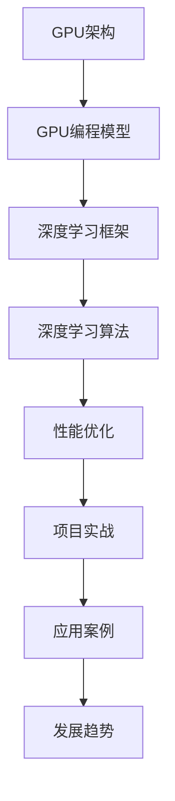

                 

# GPU加速计算：加速深度学习

## 关键词
- GPU加速
- 深度学习
- CUDA
- 显卡编程
- 计算性能优化

## 摘要
本文将深入探讨GPU加速计算在深度学习领域的重要性，从基础概念、编程模型到实际应用，全面解析GPU加速的原理和实战技巧。我们将介绍如何使用GPU来加速深度学习算法，优化计算性能，并通过实际项目案例展示GPU加速的实际效果。

# 目录大纲：《GPU 加速计算：加速深度学习》

## 第一部分：GPU加速计算基础

### 第1章：GPU加速计算概述

#### 1.1 GPU架构简介

#### 1.2 GPU编程模型

#### 1.3 GPU与深度学习的关联

### 第2章：GPU编程基础

#### 2.1 CUDA编程基础

#### 2.2 CUDA内存管理

#### 2.3 CUDA并行编程模型

### 第3章：深度学习框架与GPU

#### 3.1 深度学习框架概述

#### 3.2 TensorFlow与GPU

#### 3.3 PyTorch与GPU

### 第4章：GPU加速深度学习算法

#### 4.1 卷积神经网络（CNN）

#### 4.2 循环神经网络（RNN）

#### 4.3 Transformer模型

### 第5章：GPU加速计算性能优化

#### 5.1 算法优化

#### 5.2 内存优化

#### 5.3 迁移学习与模型压缩

## 第二部分：GPU加速深度学习实战

### 第6章：GPU加速深度学习项目实战

#### 6.1 项目一：使用GPU加速手写数字识别

#### 6.2 项目二：使用GPU加速图像分类

#### 6.3 项目三：使用GPU加速自然语言处理

### 第7章：GPU加速深度学习应用案例

#### 7.1 案例一：自动驾驶中的GPU加速

#### 7.2 案例二：医学图像处理中的GPU加速

#### 7.3 案例三：金融风控中的GPU加速

### 第8章：GPU加速深度学习的未来发展趋势

#### 8.1 GPU硬件发展趋势

#### 8.2 深度学习框架的进步

#### 8.3 GPU加速深度学习的挑战与机遇

## 附录

### 附录A：GPU加速计算资源与工具

#### A.1 CUDA与cuDNN

#### A.2 GPU硬件选购指南

#### A.3 开发环境搭建指南

### 附录B：深度学习与GPU加速参考资源

#### B.1 相关书籍推荐

#### B.2 论文与资料推荐

#### B.3 GPU加速深度学习社区与论坛

## Mermaid 流程图



## 核心算法原理讲解

### 卷积神经网络（CNN）

### 伪代码：卷积神经网络（CNN）

```python
function ConvolutionalNeuralNetwork(input_data, weights, biases):
    # 前向传播
    output = Activation(FullyConnected(input_data, weights, biases))
    return output

function FullyConnected(input_data, weights, biases):
    output = input_data * weights + biases
    return output

function Activation(output):
    output = Relu(output)
    return output

function Relu(x):
    if x > 0:
        return x
    else:
        return 0
```

### 数学模型和数学公式

### 数学模型：深度学习中的反向传播算法

$$
\frac{\partial E}{\partial w} = \frac{\partial E}{\partial a} \cdot \frac{\partial a}{\partial z} \cdot \frac{\partial z}{\partial w}
$$

其中：
- \(E\) 是损失函数
- \(w\) 是权重
- \(a\) 是激活值
- \(z\) 是线性组合

# 第一部分：GPU加速计算基础

### 第1章：GPU加速计算概述

#### 1.1 GPU架构简介

GPU（Graphics Processing Unit，图形处理单元）最初设计用于图形渲染和图像处理。然而，随着计算机图形处理需求的增加，GPU的架构和功能也得到了显著提升，使其成为了高性能计算的重要工具。GPU具有以下特点：

1. **高度并行计算能力**：GPU由大量小型的计算单元组成，这些单元可以同时执行多个计算任务，非常适合处理大量并行数据。

2. **流多处理器（SM）**：GPU中的流多处理器（Streaming Multiprocessors，SM）负责执行计算任务。每个SM包含多个CUDA核心，这些核心可以同时处理多个线程。

3. **高速缓存和内存管理**：GPU拥有多个级别的缓存，包括寄存器、共享内存和全球内存，这些缓存能够有效减少数据访问延迟，提高计算效率。

4. **高带宽内存接口**：GPU支持高带宽的内存接口，如GDDR5或GDDR6，这些接口能够提供比CPU内存更高的数据传输速度。

#### 1.2 GPU编程模型

GPU编程模型主要包括CUDA和OpenCL两种。CUDA是NVIDIA推出的并行计算编程模型和开发环境，而OpenCL是跨平台的开源并行计算框架。

**CUDA编程模型**

CUDA编程模型基于NVIDIA的GPU架构，提供了以下关键组件：

1. **内核函数（Kernel Functions）**：内核函数是GPU上执行的并行计算代码，可以处理大量数据。

2. **线程网格（Thread Grid）**：线程网格是GPU上执行计算任务的基本单元，由一组线程块（Block）组成。

3. **线程块（Block）**：线程块是线程网格中的一个子集，包含多个线程，这些线程可以并行执行相同的计算任务。

4. **内存层次结构**：CUDA内存层次结构包括全局内存、共享内存和寄存器，这些内存类型提供了不同的访问速度和带宽。

**OpenCL编程模型**

OpenCL是一种跨平台的并行计算框架，它可以运行在多种硬件上，包括GPU、CPU、FPGA等。OpenCL编程模型包括以下关键组件：

1. **内核程序（Kernel Programs）**：内核程序是运行在硬件设备上的并行计算代码。

2. **工作项（Work Items）**：工作项是并行计算的基本单元，由工作组（Work Groups）组成。

3. **内存空间（Memory Spaces）**：OpenCL提供了多个内存空间，包括私有内存、全局内存和默认内存，这些内存空间可以高效地存储和访问数据。

#### 1.3 GPU与深度学习的关联

深度学习是一种基于人工神经网络的机器学习技术，它依赖于大量的矩阵运算和数据并行处理。GPU由于其强大的并行计算能力和优化的内存架构，成为加速深度学习算法的理想选择。以下是GPU在深度学习中的几个关键应用：

1. **矩阵运算加速**：深度学习算法中包含大量的矩阵乘法和矩阵加法运算，GPU的并行计算能力能够显著加速这些运算。

2. **大规模数据处理**：深度学习模型通常需要处理大量的数据，GPU的高带宽内存接口能够提供更快的数据传输速度，加速模型训练和预测过程。

3. **分布式训练**：GPU可以用于分布式训练，多个GPU可以并行处理不同的数据子集，从而加速模型的训练过程。

4. **实时推理**：GPU的高性能计算能力使得实时推理成为可能，这对于需要快速响应的应用场景（如自动驾驶、实时语音识别等）至关重要。

# 第一部分：GPU加速计算基础

## 第2章：GPU编程基础

#### 2.1 CUDA编程基础

CUDA（Compute Unified Device Architecture）是由NVIDIA推出的一种并行计算编程模型和开发环境，它允许开发者利用GPU的并行计算能力来加速通用计算任务。以下将介绍CUDA编程的基础知识，包括CUDA的架构、基本概念和编程步骤。

#### 2.1.1 CUDA架构

CUDA架构主要由以下几部分组成：

1. **计算设备（Compute Device）**：计算设备指的是GPU硬件，它包含多个流多处理器（Streaming Multiprocessors，SM），每个SM包含多个CUDA核心。

2. **计算网格（Compute Grid）**：计算网格是一个虚拟的概念，它由多个计算块（Blocks）组成。每个计算块包含多个线程（Threads）。

3. **内存层次结构**：CUDA内存层次结构包括全局内存（Global Memory）、共享内存（Shared Memory）和寄存器（Registers）。全局内存用于存储数据，共享内存用于线程块之间的数据共享，寄存器用于存储局部变量。

#### 2.1.2 CUDA基本概念

1. **内核函数（Kernel Functions）**：内核函数是GPU上执行的并行计算代码，它定义了计算任务的具体实现。内核函数通过`__global__`关键字声明，可以接收线程索引作为参数。

2. **线程块（Blocks）**：线程块是计算网格中的一个子集，它包含多个线程。线程块可以并行执行相同的计算任务，并共享一些内存资源。

3. **线程（Threads）**：线程是GPU上执行计算任务的基本单元。每个线程在自己的工作内存中执行内核函数，并可以通过线程索引访问全局内存。

4. **线程索引（Thread Index）**：线程索引用于确定线程在计算网格中的位置。计算网格被分为多个维度，每个维度对应一个线程索引。

5. **内存访问模式**：CUDA内存访问模式包括全局内存访问、共享内存访问和寄存器访问。全局内存访问速度较慢，但可以存储大量数据；共享内存访问速度较快，但容量有限；寄存器访问速度最快，但容量很小。

#### 2.1.3 CUDA编程步骤

1. **编写内核函数**：编写内核函数，实现并行计算任务的具体逻辑。

2. **创建线程网格和线程块**：根据计算任务的需求，创建线程网格和线程块。线程网格的维度决定了计算网格的大小，线程块的数量决定了并行度。

3. **分配内存**：根据内核函数的需求，在GPU上分配内存。内存可以是全局内存、共享内存或寄存器。

4. **初始化线程索引**：初始化线程索引，用于确定每个线程在计算网格中的位置。

5. **执行内核函数**：执行内核函数，每个线程在自己的工作内存中执行计算任务。

6. **同步和内存拷贝**：在需要的情况下，使用`cudaDeviceSynchronize()`函数同步设备，以确保内核函数执行完成。然后，从GPU上拷贝数据回CPU内存。

7. **清理资源**：释放GPU上的内存，并清理其他资源。

以下是一个简单的CUDA内核函数示例：

```cuda
__global__ void vector_add(float *out, float *a, float *b, int n) {
    int index = threadIdx.x + blockIdx.x * blockDim.x;
    int stride = blockDim.x * gridDim.x;
    for (int i = index; i < n; i += stride) {
        out[i] = a[i] + b[i];
    }
}
```

在这个示例中，`vector_add`是一个内核函数，它接收四个参数：输出数组`out`、输入数组`a`和`b`以及数组长度`n`。内核函数使用`threadIdx`和`blockIdx`来确定线程的索引和块索引，然后使用`blockDim`和`gridDim`来计算线程块的大小和线程网格的大小。内核函数通过`for`循环计算每个线程对应的元素索引，然后将`a`和`b`数组的对应元素相加，并将结果存储在`out`数组中。

#### 2.2 CUDA内存管理

CUDA内存管理是CUDA编程中一个重要的环节，它涉及到如何在GPU和CPU之间传输数据以及在GPU上高效地存储和访问数据。以下将介绍CUDA内存管理的基本概念和方法。

#### 2.2.1 CUDA内存类型

CUDA内存分为以下几种类型：

1. **全局内存（Global Memory）**：全局内存是GPU上最大的内存区域，用于存储全局变量和数组。全局内存的访问速度相对较慢，但容量较大。

2. **共享内存（Shared Memory）**：共享内存是线程块之间的共享内存区域，用于线程块内的数据共享。共享内存的访问速度较快，但容量相对较小。

3. **寄存器（Registers）**：寄存器是GPU上最快的内存区域，用于存储局部变量和中间结果。寄存器的容量很小，但访问速度极快。

4. **常数内存（Constant Memory）**：常数内存是一个特殊的内存区域，用于存储只读数据。常数内存的访问速度较快，但容量较小。

5. **纹理内存（Texture Memory）**：纹理内存是一种特殊的内存类型，用于存储图像和纹理数据。纹理内存的访问模式受到纹理过滤函数的影响。

#### 2.2.2 内存分配和释放

在CUDA中，可以使用`cudaMalloc()`和`cudaFree()`函数来分配和释放内存。

```cuda
float *a;
float *b;
float *c;

cudaMalloc((void **)&a, n * sizeof(float));
cudaMalloc((void **)&b, n * sizeof(float));
cudaMalloc((void **)&c, n * sizeof(float));
```

在这个示例中，我们使用`cudaMalloc()`函数分配三个数组`a`、`b`和`c`的内存。

释放内存时，可以使用`cudaFree()`函数：

```cuda
cudaFree(a);
cudaFree(b);
cudaFree(c);
```

#### 2.2.3 内存拷贝

在CUDA中，可以使用`cudaMemcpy()`函数在GPU和CPU之间传输数据。

```cuda
float *h_a;
float *h_b;
float *h_c;

cudaMallocHost((void **)&h_a, n * sizeof(float));
cudaMallocHost((void **)&h_b, n * sizeof(float));
cudaMallocHost((void **)&h_c, n * sizeof(float));

cudaMemcpy(h_a, a, n * sizeof(float), cudaMemcpyDeviceToHost);
cudaMemcpy(h_b, b, n * sizeof(float), cudaMemcpyDeviceToHost);

// 执行内核函数

cudaMemcpy(c, h_c, n * sizeof(float), cudaMemcpyHostToDevice);
```

在这个示例中，我们首先使用`cudaMallocHost()`函数在CPU上分配内存，然后使用`cudaMemcpy()`函数将GPU上的数据拷贝到CPU上。

#### 2.2.4 内存访问模式

CUDA内存访问模式包括以下几个：

1. **全局内存访问**：全局内存访问是最常见的内存访问模式，用于读取和写入全局内存中的数据。

2. **共享内存访问**：共享内存访问用于线程块之间的数据共享，可以显著提高内存访问速度。

3. **寄存器访问**：寄存器访问是最快速的内存访问模式，用于存储局部变量和中间结果。

4. **纹理内存访问**：纹理内存访问用于读取图像和纹理数据，可以优化图像处理任务。

#### 2.3 CUDA并行编程模型

CUDA并行编程模型包括以下概念：

1. **线程（Thread）**：线程是GPU上执行计算任务的基本单元。

2. **线程块（Block）**：线程块是一组线程，它是一个独立的计算单元。

3. **线程网格（Grid）**：线程网格是一个由多个线程块组成的计算结构。

4. **内存层次结构**：CUDA内存层次结构包括全局内存、共享内存和寄存器。

以下是一个简单的CUDA并行编程示例：

```cuda
__global__ void parallel_add(float *out, float *a, float *b, int n) {
    int index = threadIdx.x + blockIdx.x * blockDim.x;
    int stride = blockDim.x * gridDim.x;
    for (int i = index; i < n; i += stride) {
        out[i] = a[i] + b[i];
    }
}
```

在这个示例中，`parallel_add`是一个内核函数，它使用`threadIdx`和`blockIdx`来确定线程的索引和块索引，然后使用`blockDim`和`gridDim`来计算线程块的大小和线程网格的大小。内核函数通过`for`循环计算每个线程对应的元素索引，然后将`a`和`b`数组的对应元素相加，并将结果存储在`out`数组中。

在执行内核函数时，需要指定线程网格和线程块的大小：

```cuda
int blockSize = 256;
int gridSize = (n + blockSize - 1) / blockSize;

parallel_add<<<gridSize, blockSize>>>(c, a, b, n);
```

在这个示例中，我们使用`parallel_add<<<gridSize, blockSize>>>`语法来指定线程网格的大小（`gridSize`）和线程块的大小（`blockSize`）。`gridSize`和`blockSize`可以通过计算确定，以确保所有数据能够被并行处理。

通过CUDA并行编程模型，我们可以充分利用GPU的并行计算能力，加速计算任务。

### 第3章：深度学习框架与GPU

深度学习框架是用于构建、训练和部署深度学习模型的软件库，它们提供了一套简洁高效的编程接口，使得开发者能够专注于模型设计和算法优化。当前最流行的深度学习框架包括TensorFlow和PyTorch，这两者都支持GPU加速计算，大大提高了深度学习模型的训练和推理速度。

#### 3.1 深度学习框架概述

深度学习框架主要包括以下功能模块：

1. **数据集管理**：数据集管理模块负责加载、预处理和分批数据，以便模型能够高效地学习和优化。

2. **神经网络层**：神经网络层模块提供了各种类型的神经网络层，如卷积层、全连接层、池化层等，开发者可以组合这些层来构建复杂的神经网络模型。

3. **优化器**：优化器模块用于优化模型的参数，以最小化损失函数。常见的优化器包括SGD、Adam、RMSprop等。

4. **训练工具**：训练工具模块提供了训练神经网络所需的各种工具，如自动微分、学习率调度、批量归一化等。

5. **评估工具**：评估工具模块用于评估模型的性能，包括准确率、召回率、F1分数等。

6. **模型保存与加载**：模型保存与加载模块使得开发者能够将训练好的模型保存到文件中，并在后续使用中加载这些模型。

#### 3.2 TensorFlow与GPU

TensorFlow是由Google开发的开源深度学习框架，它提供了丰富的API和工具，支持多种类型的计算平台，包括CPU、GPU和TPU（Tensor Processing Unit）。以下是TensorFlow与GPU加速计算的关键点：

1. **多GPU支持**：TensorFlow支持在多GPU上进行模型训练和推理。通过使用`tf.distribute.MirroredStrategy`，可以轻松地将模型和数据分布到多个GPU上，从而实现并行训练。

2. **GPU内存管理**：TensorFlow提供了自动GPU内存管理功能，可以动态调整内存分配，以优化GPU的使用率。

3. **高级API**：TensorFlow的高级API（如Keras）提供了简洁的编程接口，使得开发者可以轻松地构建和训练深度学习模型。

4. **兼容性**：TensorFlow与Python、C++等多种编程语言兼容，便于集成到现有的开发环境中。

以下是一个简单的TensorFlow GPU加速示例：

```python
import tensorflow as tf

# 配置GPU内存
gpus = tf.config.experimental.list_physical_devices('GPU')
if gpus:
    try:
        for gpu in gpus:
            tf.config.experimental.set_memory_growth(gpu, True)
    except RuntimeError as e:
        print(e)

# 定义模型
model = tf.keras.Sequential([
    tf.keras.layers.Dense(128, activation='relu', input_shape=(784,)),
    tf.keras.layers.Dropout(0.2),
    tf.keras.layers.Dense(10, activation='softmax')
])

# 编译模型
model.compile(optimizer='adam',
              loss='categorical_crossentropy',
              metrics=['accuracy'])

# 加载数据集
mnist = tf.keras.datasets.mnist
(x_train, y_train), (x_test, y_test) = mnist.load_data()
x_train, x_test = x_train / 255.0, x_test / 255.0
x_train = x_train.reshape(-1, 784)
x_test = x_test.reshape(-1, 784)

# 训练模型
model.fit(x_train, y_train, epochs=5, batch_size=64)
```

在这个示例中，我们首先配置了GPU内存，使用`tf.config.experimental.set_memory_growth`函数确保GPU内存按需增长，避免内存浪费。然后，我们定义了一个简单的全连接神经网络，并使用GPU进行模型训练。

#### 3.3 PyTorch与GPU

PyTorch是由Facebook开发的开源深度学习框架，它提供了动态计算图和丰富的神经网络组件，使得开发者能够灵活地构建和优化深度学习模型。以下是PyTorch与GPU加速计算的关键点：

1. **动态计算图**：PyTorch使用动态计算图，允许开发者以编程的方式构建和修改模型结构，这为模型设计和调试提供了极大的便利。

2. **CUDA自动推导**：PyTorch通过自动推导机制自动将计算图转换为GPU代码，无需手动编写CUDA内核函数。

3. **高级API**：PyTorch的高级API（如torch.nn和torch.optim）提供了简洁的编程接口，使得开发者可以轻松地构建和训练深度学习模型。

4. **多GPU支持**：PyTorch支持多GPU分布式训练，通过使用`torch.nn.DataParallel`或`torch.nn.parallel.DistributedDataParallel`可以将模型和数据分布到多个GPU上。

以下是一个简单的PyTorch GPU加速示例：

```python
import torch
import torch.nn as nn
import torch.optim as optim

# 配置GPU
device = torch.device("cuda" if torch.cuda.is_available() else "cpu")

# 定义模型
class SimpleModel(nn.Module):
    def __init__(self):
        super(SimpleModel, self).__init__()
        self.fc1 = nn.Linear(784, 128)
        self.fc2 = nn.Linear(128, 10)

    def forward(self, x):
        x = torch.relu(self.fc1(x))
        x = self.fc2(x)
        return x

model = SimpleModel().to(device)

# 定义损失函数和优化器
criterion = nn.CrossEntropyLoss()
optimizer = optim.Adam(model.parameters(), lr=0.001)

# 加载数据集
train_loader = torch.utils.data.DataLoader(
    dataset=train_dataset,
    batch_size=64,
    shuffle=True
)

# 训练模型
num_epochs = 5
for epoch in range(num_epochs):
    for inputs, targets in train_loader:
        inputs, targets = inputs.to(device), targets.to(device)

        # 前向传播
        outputs = model(inputs)
        loss = criterion(outputs, targets)

        # 反向传播
        optimizer.zero_grad()
        loss.backward()
        optimizer.step()

        print(f"Epoch [{epoch+1}/{num_epochs}], Loss: {loss.item():.4f}")

print("Training completed.")
```

在这个示例中，我们首先配置了GPU设备，并定义了一个简单的全连接神经网络。然后，我们定义了损失函数和优化器，并使用GPU进行模型训练。通过使用`to(device)`，我们可以轻松地将模型和数据转移到GPU上。

### 第4章：GPU加速深度学习算法

GPU加速深度学习算法的关键在于利用GPU的并行计算能力来加速矩阵运算、卷积操作和神经网络训练。以下将介绍GPU加速常见的深度学习算法，包括卷积神经网络（CNN）、循环神经网络（RNN）和Transformer模型。

#### 4.1 卷积神经网络（CNN）

卷积神经网络（CNN）是一种用于图像识别和处理的深度学习模型，其核心操作包括卷积、池化和全连接层。以下将介绍如何使用GPU加速CNN的运行。

**4.1.1 卷积操作**

卷积操作是CNN中的核心计算任务，它通过滑动滤波器（卷积核）在输入数据上提取特征。GPU加速卷积操作的关键在于并行计算和内存优化。

1. **并行计算**：GPU的并行计算能力可以用于加速卷积操作。我们可以将输入数据划分成多个块，每个块由不同的GPU线程块处理。同时，使用CUDA的线程索引来计算卷积核的位置，从而实现并行卷积。

2. **内存优化**：GPU内存带宽是有限的，因此优化内存访问是提高卷积操作性能的关键。我们可以使用共享内存来减少全局内存访问，使用纹理内存来优化图像数据访问。

以下是一个简单的CUDA卷积操作伪代码：

```cuda
__global__ void conv2D(float *output, float *input, float *kernel, int width, int height, int depth) {
    int x = blockIdx.x * blockDim.x + threadIdx.x;
    int y = blockIdx.y * blockDim.y + threadIdx.y;

    // 计算输出索引
    int out_index = y * width + x;

    // 初始化输出值
    float out_value = 0.0;

    // 遍历卷积核的每个位置
    for (int ky = 0; ky < kernel_height; ky++) {
        for (int kx = 0; kx < kernel_width; kx++) {
            // 计算输入索引
            int in_x = x - kx;
            int in_y = y - ky;

            // 避免边界溢出
            if (in_x >= 0 && in_x < width && in_y >= 0 && in_y < height) {
                // 计算卷积值
                int in_index = (in_y * width + in_x) * depth;
                out_value += input[in_index] * kernel[(ky * kernel_width + kx) * depth];
            }
        }
    }

    // 存储输出值
    output[out_index] = out_value;
}
```

在这个伪代码中，我们定义了一个内核函数`conv2D`，用于在GPU上执行卷积操作。内核函数使用线程索引来计算输入和输出的索引，并使用嵌套循环遍历卷积核的每个位置，计算卷积值。

**4.1.2 池化操作**

池化操作用于下采样特征图，减少模型的参数数量，提高计算效率。常见的池化操作包括最大池化和平均池化。GPU加速池化操作的方法与卷积操作类似，也可以利用并行计算和内存优化。

以下是一个简单的CUDA最大池化操作伪代码：

```cuda
__global__ void max_pool2D(float *output, float *input, int width, int height, int pool_size) {
    int x = blockIdx.x * blockDim.x + threadIdx.x;
    int y = blockIdx.y * blockDim.y + threadIdx.y;

    // 计算输出索引
    int out_index = y * width + x;

    // 初始化输出值
    float out_value = -FLT_MAX;

    // 遍历输出位置的每个邻居
    for (int ky = 0; ky < pool_size; ky++) {
        for (int kx = 0; kx < pool_size; kx++) {
            // 计算输入索引
            int in_x = x - kx;
            int in_y = y - ky;

            // 避免边界溢出
            if (in_x >= 0 && in_x < width && in_y >= 0 && in_y < height) {
                // 计算邻居值
                int in_index = (in_y * width + in_x) * depth;
                out_value = fmaxf(out_value, input[in_index]);
            }
        }
    }

    // 存储输出值
    output[out_index] = out_value;
}
```

在这个伪代码中，我们定义了一个内核函数`max_pool2D`，用于在GPU上执行最大池化操作。内核函数使用线程索引来计算输入和输出的索引，并使用嵌套循环遍历输出位置的每个邻居，计算最大值。

**4.1.3 全连接层**

全连接层是CNN中的最后一个层，它将特征图上的每个位置映射到一个输出值。GPU加速全连接层的方法主要是利用矩阵乘法的并行计算能力。我们可以使用CUDA的线程网格和内存优化技术来提高全连接层的计算性能。

以下是一个简单的CUDA全连接层操作伪代码：

```cuda
__global__ void fully_connected(float *output, float *input, float *weights, float *biases, int input_size, int output_size) {
    int output_index = blockIdx.x * blockDim.x + threadIdx.x;
    int input_index = blockIdx.y * blockDim.y + threadIdx.y;

    // 初始化输出值
    float out_value = biases[output_index];

    // 遍历输入特征
    for (int i = 0; i < input_size; i++) {
        // 计算权重索引
        int weight_index = i * output_size + output_index;
        // 计算输入值
        float in_value = input[input_index * input_size + i];
        // 计算加权求和
        out_value += in_value * weights[weight_index];
    }

    // 存储输出值
    output[output_index] = out_value;
}
```

在这个伪代码中，我们定义了一个内核函数`fully_connected`，用于在GPU上执行全连接层操作。内核函数使用线程索引来计算输入和输出的索引，并使用嵌套循环遍历输入特征，计算加权求和。

**4.1.4 GPU加速CNN的性能优化**

为了提高GPU加速CNN的性能，我们可以采取以下措施：

1. **并行度优化**：通过调整线程网格和线程块的大小，优化并行度，减少线程之间的竞争和同步时间。

2. **内存优化**：通过使用共享内存和纹理内存，优化内存访问模式，减少全局内存访问。

3. **算法优化**：采用更高效的卷积算法和池化算法，减少计算复杂度和内存使用。

4. **数据预处理**：对输入数据进行预处理，减少数据传输和计算时间。

5. **分布式训练**：使用多GPU分布式训练，提高训练速度和模型性能。

#### 4.2 循环神经网络（RNN）

循环神经网络（RNN）是一种用于处理序列数据的神经网络，其特点是能够通过循环结构保持对序列历史信息的记忆。RNN在自然语言处理、语音识别和时间序列分析等领域有着广泛的应用。以下将介绍如何使用GPU加速RNN的运行。

**4.2.1 RNN的运算过程**

RNN的运算过程包括输入层、隐藏层和输出层。在每个时间步上，RNN会接收输入数据，通过隐藏状态和权重矩阵计算隐藏状态和输出。以下是一个简单的RNN运算过程伪代码：

```python
# 假设输入数据为x，隐藏状态为h，权重矩阵为W
h = tanh(W * [x; h])
y = W' * h
```

在这个伪代码中，`[x; h]`表示将输入数据`x`和隐藏状态`h`拼接在一起，`W`和`W'`分别是权重矩阵。

**4.2.2 GPU加速RNN**

GPU加速RNN的关键在于利用GPU的并行计算能力来加速矩阵运算和序列处理。以下是一些GPU加速RNN的方法：

1. **并行矩阵运算**：使用GPU的并行计算能力来加速矩阵运算，如矩阵乘法和矩阵加法。通过调整线程网格和线程块的大小，优化并行度。

2. **共享内存优化**：在RNN中，隐藏状态和权重矩阵是重复使用的。我们可以使用共享内存来减少全局内存访问，提高计算效率。

3. **序列并行处理**：将序列数据划分成多个块，每个块由不同的GPU线程块处理。通过并行处理序列数据，提高RNN的运行速度。

以下是一个简单的CUDA RNN运算过程伪代码：

```cuda
__global__ void rnn(float *output, float *input, float *weights, float *biases, int sequence_length, int input_size, int hidden_size) {
    int batch_index = blockIdx.x;
    int sequence_index = blockIdx.y * blockDim.y + threadIdx.y;
    int hidden_index = blockIdx.z * blockDim.z + threadIdx.z;

    // 初始化输出值
    float out_value = biases[hidden_index];

    // 遍历序列中的每个时间步
    for (int t = 0; t < sequence_length; t++) {
        // 计算输入索引
        int input_index = t * input_size + sequence_index;

        // 计算隐藏状态
        float hidden_value = tanh(weights[hidden_index * input_size + input_index]);

        // 更新输出值
        out_value += hidden_value;
    }

    // 存储输出值
    output[batch_index * sequence_length + sequence_index] = out_value;
}
```

在这个伪代码中，我们定义了一个内核函数`rnn`，用于在GPU上执行RNN运算。内核函数使用线程索引来计算输入和输出的索引，并使用嵌套循环遍历序列中的每个时间步，计算隐藏状态和输出。

**4.2.3 GPU加速RNN的性能优化**

为了提高GPU加速RNN的性能，我们可以采取以下措施：

1. **并行度优化**：通过调整线程网格和线程块的大小，优化并行度，减少线程之间的竞争和同步时间。

2. **内存优化**：通过使用共享内存和纹理内存，优化内存访问模式，减少全局内存访问。

3. **算法优化**：采用更高效的矩阵运算算法，减少计算复杂度和内存使用。

4. **序列并行处理**：将序列数据划分成多个块，每个块由不同的GPU线程块处理，提高RNN的运行速度。

5. **分布式训练**：使用多GPU分布式训练，提高训练速度和模型性能。

#### 4.3 Transformer模型

Transformer模型是一种基于自注意力机制的深度学习模型，它在机器翻译、文本生成等任务上取得了显著的性能提升。与传统的循环神经网络相比，Transformer模型具有更低的计算复杂度和更高的并行度，非常适合使用GPU加速。

**4.3.1 Transformer的基本架构**

Transformer模型的核心组件包括编码器（Encoder）和解码器（Decoder），它们都由多个自注意力层（Self-Attention Layer）和前馈层（Feedforward Layer）组成。以下是一个简单的Transformer模型架构：

```
Input -> Embedding -> Encoder/Decoder Layer -> Output
```

在编码器和解码器中，每个层都包含两个子层：自注意力层和前馈层。自注意力层通过计算输入序列的注意力权重来生成上下文表示，前馈层则对自注意力层的输出进行非线性变换。

**4.3.2 GPU加速Transformer**

GPU加速Transformer的关键在于利用GPU的并行计算能力来加速自注意力计算和矩阵运算。以下是一些GPU加速Transformer的方法：

1. **并行自注意力计算**：自注意力计算是Transformer模型中的主要计算任务，它通过计算输入序列的注意力权重来生成上下文表示。GPU的并行计算能力可以用于加速自注意力计算，通过调整线程网格和线程块的大小，优化并行度。

2. **内存优化**：通过使用共享内存和纹理内存，优化内存访问模式，减少全局内存访问。

3. **矩阵运算优化**：Transformer模型中的矩阵运算包括矩阵乘法和矩阵加法，GPU的并行计算能力可以用于加速这些运算。通过优化矩阵运算的算法，减少计算复杂度和内存使用。

以下是一个简单的CUDA Transformer自注意力计算伪代码：

```cuda
__global__ void self_attention(float *output, float *input, float *query_weights, float *key_weights, float *value_weights, int sequence_length, int hidden_size) {
    int batch_index = blockIdx.x;
    int sequence_index = blockIdx.y * blockDim.y + threadIdx.y;
    int hidden_index = blockIdx.z * blockDim.z + threadIdx.z;

    // 计算查询向量、键向量和值向量
    float *query_vector = input + batch_index * sequence_length * hidden_size;
    float *key_vector = input + batch_index * sequence_length * hidden_size;
    float *value_vector = input + batch_index * sequence_length * hidden_size;

    // 初始化输出值
    float out_value = 0.0;

    // 遍历序列中的每个位置
    for (int t = 0; t < sequence_length; t++) {
        // 计算注意力权重
        float attention_weight = dot_product(query_weights[hidden_index], key_weights[t]);

        // 计算加权和
        out_value += value_vector[t] * attention_weight;
    }

    // 存储输出值
    output[batch_index * sequence_length + sequence_index] = out_value;
}
```

在这个伪代码中，我们定义了一个内核函数`self_attention`，用于在GPU上执行自注意力计算。内核函数使用线程索引来计算输入和输出的索引，并使用嵌套循环遍历序列中的每个位置，计算注意力权重和加权和。

**4.3.3 GPU加速Transformer的性能优化**

为了提高GPU加速Transformer的性能，我们可以采取以下措施：

1. **并行度优化**：通过调整线程网格和线程块的大小，优化并行度，减少线程之间的竞争和同步时间。

2. **内存优化**：通过使用共享内存和纹理内存，优化内存访问模式，减少全局内存访问。

3. **矩阵运算优化**：通过优化矩阵运算的算法，减少计算复杂度和内存使用。

4. **序列并行处理**：将序列数据划分成多个块，每个块由不同的GPU线程块处理，提高Transformer的运行速度。

5. **分布式训练**：使用多GPU分布式训练，提高训练速度和模型性能。

### 第5章：GPU加速计算性能优化

GPU加速深度学习算法可以提高计算速度和模型性能，但为了充分发挥GPU的计算能力，需要对GPU加速过程进行性能优化。以下将介绍GPU加速计算性能优化的一些关键策略，包括算法优化、内存优化和迁移学习与模型压缩。

#### 5.1 算法优化

算法优化是提高GPU加速深度学习性能的关键步骤，以下是一些常见的算法优化策略：

**5.1.1 并行度优化**

并行度优化是指通过合理分配计算任务，充分利用GPU的并行计算能力。以下是一些并行度优化的策略：

1. **线程网格和线程块的大小调整**：合理选择线程网格和线程块的大小，可以最大化GPU的计算资源利用率。通常，线程块的大小应该接近GPU核心的数量，而线程网格的大小应该足够大，以便容纳所有线程块。

2. **数据并行处理**：对于大规模数据集，可以将数据集划分为多个块，每个块由不同的GPU线程块处理。这样，多个线程块可以同时执行不同的计算任务，提高计算效率。

3. **任务分配策略**：对于不同的计算任务，可以采用不同的任务分配策略。例如，对于卷积操作，可以按照图像块进行分配；对于矩阵运算，可以按照矩阵块进行分配。

**5.1.2 内存优化**

内存优化是提高GPU加速深度学习性能的关键，以下是一些内存优化的策略：

1. **内存访问模式优化**：通过优化内存访问模式，可以减少内存访问延迟和带宽压力。例如，可以使用共享内存来减少全局内存访问，使用纹理内存来优化图像数据访问。

2. **内存带宽优化**：内存带宽是限制GPU计算性能的关键因素。可以通过以下策略来优化内存带宽：

   - **内存预取**：通过内存预取技术，提前加载即将使用的数据到缓存中，减少内存访问延迟。

   - **数据对齐**：将数据按照内存地址对齐，减少内存访问碎片，提高内存访问效率。

   - **批量处理**：通过批量处理技术，减少内存拷贝次数，提高内存使用效率。

**5.1.3 算法复杂性优化**

算法复杂性优化是指通过简化算法或优化算法结构，减少计算复杂度和内存使用。以下是一些算法复杂性优化的策略：

1. **算法简化**：对于一些复杂的算法，可以通过简化算法结构，减少计算复杂度。例如，对于卷积操作，可以采用滤波器共享技术，减少计算量。

2. **矩阵运算优化**：矩阵运算是深度学习算法中的主要计算任务，可以通过以下策略来优化矩阵运算：

   - **矩阵分解**：通过矩阵分解技术，将大型矩阵分解为多个较小的矩阵，减少计算复杂度。

   - **稀疏矩阵运算**：对于稀疏矩阵，可以采用稀疏矩阵运算技术，减少计算量和内存使用。

#### 5.2 内存优化

内存优化是GPU加速深度学习性能优化的重要组成部分，以下是一些内存优化的策略：

**5.2.1 内存分配策略**

合理选择内存分配策略，可以减少内存碎片和内存访问冲突，提高内存使用效率。以下是一些内存分配策略：

1. **动态内存分配**：使用动态内存分配技术，可以根据计算任务的需求动态调整内存大小，避免内存浪费。

2. **预分配内存**：在计算任务开始前，预先分配足够的内存，避免在计算过程中频繁进行内存分配和释放。

3. **内存池**：使用内存池技术，将内存分为多个块，每个块用于存储不同类型的内存，减少内存碎片和访问冲突。

**5.2.2 内存访问模式优化**

优化内存访问模式，可以减少内存访问延迟和带宽压力，提高内存使用效率。以下是一些内存访问模式优化的策略：

1. **内存预取**：通过内存预取技术，提前加载即将使用的数据到缓存中，减少内存访问延迟。

2. **数据对齐**：将数据按照内存地址对齐，减少内存访问碎片，提高内存访问效率。

3. **批量处理**：通过批量处理技术，减少内存拷贝次数，提高内存使用效率。

**5.2.3 内存带宽优化**

内存带宽是限制GPU计算性能的关键因素，以下是一些内存带宽优化的策略：

1. **数据缓存**：通过数据缓存技术，将常用数据缓存到高速缓存中，减少内存访问延迟。

2. **内存复制优化**：通过内存复制优化技术，减少内存拷贝次数，提高内存使用效率。

3. **并行内存访问**：通过并行内存访问技术，多个GPU线程同时访问内存，提高内存访问带宽。

#### 5.3 迁移学习与模型压缩

迁移学习和模型压缩是提高GPU加速深度学习性能的重要技术，以下将介绍这些技术的基本原理和实现方法。

**5.3.1 迁移学习**

迁移学习是指利用已有模型的知识来提高新模型的性能，特别是当训练数据有限时。以下是一些迁移学习的基本原理和实现方法：

1. **模型初始化**：通过将已有模型的权重初始化为新模型的权重，可以加快新模型的收敛速度。

2. **微调训练**：在迁移学习过程中，可以对已有模型的权重进行微调，以适应新的数据分布。

3. **模型蒸馏**：模型蒸馏是一种将大型模型的知识传递给小型模型的技术，通过将大型模型作为教师模型，将知识传递给学生模型。

**5.3.2 模型压缩**

模型压缩是指通过减小模型的大小和提高模型运行的效率，以提高GPU加速深度学习的性能。以下是一些模型压缩的基本原理和实现方法：

1. **权重剪枝**：通过剪枝技术，去除模型中不重要的权重，从而减小模型的大小。

2. **量化**：通过量化技术，将模型的权重和激活值转换为低精度格式，从而减小模型的大小。

3. **知识蒸馏**：通过知识蒸馏技术，将大型模型的特征表示传递给小型模型，从而减小模型的大小。

4. **稀疏性**：通过引入稀疏性，降低模型的计算复杂度和内存使用。

### 第6章：GPU加速深度学习项目实战

在实际应用中，GPU加速深度学习可以帮助我们快速训练和部署复杂模型，提高生产效率。以下将介绍三个GPU加速深度学习的项目实战，包括手写数字识别、图像分类和自然语言处理。

#### 6.1 项目一：使用GPU加速手写数字识别

手写数字识别是一个经典的机器学习问题，常见的数据集是MNIST。使用GPU加速手写数字识别可以显著提高训练速度和模型性能。以下是一个简单的项目实现步骤：

**1. 准备环境**

首先，确保安装了TensorFlow和NVIDIA CUDA。可以使用以下命令安装：

```bash
pip install tensorflow-gpu
```

**2. 导入数据**

使用TensorFlow的内置函数导入MNIST数据集：

```python
mnist = tf.keras.datasets.mnist
(x_train, y_train), (x_test, y_test) = mnist.load_data()
```

**3. 预处理数据**

将图像数据转换为浮点数，并进行归一化处理：

```python
x_train, x_test = x_train / 255.0, x_test / 255.0
x_train = x_train.reshape(-1, 28, 28, 1)
x_test = x_test.reshape(-1, 28, 28, 1)
```

**4. 定义模型**

使用TensorFlow的Keras API定义一个简单的卷积神经网络：

```python
model = tf.keras.Sequential([
    tf.keras.layers.Conv2D(32, (3, 3), activation='relu', input_shape=(28, 28, 1)),
    tf.keras.layers.MaxPooling2D((2, 2)),
    tf.keras.layers.Conv2D(64, (3, 3), activation='relu'),
    tf.keras.layers.MaxPooling2D((2, 2)),
    tf.keras.layers.Flatten(),
    tf.keras.layers.Dense(128, activation='relu'),
    tf.keras.layers.Dense(10, activation='softmax')
])
```

**5. 配置GPU**

为了充分利用GPU，可以配置GPU内存增长：

```python
gpus = tf.config.experimental.list_physical_devices('GPU')
for gpu in gpus:
    tf.config.experimental.set_memory_growth(gpu, True)
```

**6. 训练模型**

使用GPU训练模型，设置适当的批次大小和训练轮数：

```python
model.compile(optimizer='adam',
              loss='sparse_categorical_crossentropy',
              metrics=['accuracy'])

model.fit(x_train, y_train, epochs=5, batch_size=64, use_multiprocessing=True)
```

**7. 评估模型**

使用测试集评估模型性能：

```python
test_loss, test_acc = model.evaluate(x_test, y_test)
print(f"Test accuracy: {test_acc:.4f}")
```

**8. 预测**

使用训练好的模型进行预测：

```python
predictions = model.predict(x_test)
```

#### 6.2 项目二：使用GPU加速图像分类

图像分类是深度学习中的另一个重要应用，使用GPU可以大大加速模型训练和推理。以下是一个使用GPU加速图像分类的项目实现步骤：

**1. 准备数据**

使用CIFAR-10数据集，它包含了10个类别的60000张32x32彩色图像。首先，安装TensorFlow：

```bash
pip install tensorflow-gpu
```

然后，使用TensorFlow的内置函数导入CIFAR-10数据集：

```python
cifar10 = tf.keras.datasets.cifar10
(x_train, y_train), (x_test, y_test) = cifar10.load_data()
```

**2. 预处理数据**

将图像数据转换为浮点数，并进行归一化处理：

```python
x_train, x_test = x_train / 255.0, x_test / 255.0
```

**3. 定义模型**

使用TensorFlow的Keras API定义一个简单的卷积神经网络：

```python
model = tf.keras.Sequential([
    tf.keras.layers.Conv2D(32, (3, 3), activation='relu', input_shape=(32, 32, 3)),
    tf.keras.layers.MaxPooling2D((2, 2)),
    tf.keras.layers.Conv2D(64, (3, 3), activation='relu'),
    tf.keras.layers.MaxPooling2D((2, 2)),
    tf.keras.layers.Conv2D(64, (3, 3), activation='relu'),
    tf.keras.layers.Flatten(),
    tf.keras.layers.Dense(64, activation='relu'),
    tf.keras.layers.Dense(10, activation='softmax')
])
```

**4. 配置GPU**

与之前一样，配置GPU内存增长：

```python
gpus = tf.config.experimental.list_physical_devices('GPU')
for gpu in gpus:
    tf.config.experimental.set_memory_growth(gpu, True)
```

**5. 训练模型**

使用GPU训练模型，设置适当的批次大小和训练轮数：

```python
model.compile(optimizer='adam',
              loss='sparse_categorical_crossentropy',
              metrics=['accuracy'])

model.fit(x_train, y_train, epochs=10, batch_size=64, use_multiprocessing=True)
```

**6. 评估模型**

使用测试集评估模型性能：

```python
test_loss, test_acc = model.evaluate(x_test, y_test)
print(f"Test accuracy: {test_acc:.4f}")
```

**7. 预测**

使用训练好的模型进行预测：

```python
predictions = model.predict(x_test)
```

#### 6.3 项目三：使用GPU加速自然语言处理

自然语言处理（NLP）是深度学习的重要应用领域之一，使用GPU可以显著加速模型训练和推理。以下是一个使用GPU加速NLP的项目实现步骤：

**1. 准备数据**

使用IMDb电影评论数据集，它包含了25000条训练数据和25000条测试数据。首先，安装TensorFlow：

```bash
pip install tensorflow-gpu
```

然后，使用TensorFlow的内置函数导入IMDb数据集：

```python
imdb = tf.keras.datasets.imdb
(x_train, y_train), (x_test, y_test) = imdb.load_data(num_words=10000)
```

**2. 预处理数据**

将文本数据转换为整数序列，并转换为二维数组：

```python
x_train = pad_sequences(x_train, maxlen=256)
x_test = pad_sequences(x_test, maxlen=256)
```

**3. 定义模型**

使用TensorFlow的Keras API定义一个简单的循环神经网络（RNN）：

```python
model = tf.keras.Sequential([
    tf.keras.layers.Embedding(10000, 16),
    tf.keras.layers.Bidirectional(LSTM(32)),
    tf.keras.layers.Dense(1, activation='sigmoid')
])
```

**4. 配置GPU**

配置GPU内存增长：

```python
gpus = tf.config.experimental.list_physical_devices('GPU')
for gpu in gpus:
    tf.config.experimental.set_memory_growth(gpu, True)
```

**5. 训练模型**

使用GPU训练模型，设置适当的批次大小和训练轮数：

```python
model.compile(optimizer='adam',
              loss='binary_crossentropy',
              metrics=['accuracy'])

model.fit(x_train, y_train, epochs=5, batch_size=512, use_multiprocessing=True)
```

**6. 评估模型**

使用测试集评估模型性能：

```python
test_loss, test_acc = model.evaluate(x_test, y_test)
print(f"Test accuracy: {test_acc:.4f}")
```

**7. 预测**

使用训练好的模型进行预测：

```python
predictions = model.predict(x_test)
```

### 第7章：GPU加速深度学习应用案例

GPU加速深度学习在许多实际应用中都展现出了强大的性能提升。以下将介绍几个典型的应用案例，包括自动驾驶、医学图像处理和金融风控。

#### 7.1 案例一：自动驾驶中的GPU加速

自动驾驶是深度学习在人工智能领域的一个重要应用，GPU加速可以显著提高自动驾驶算法的实时性能和精度。以下是一个简单的自动驾驶GPU加速案例：

**1. 数据准备**

自动驾驶算法需要大量的高质量数据，包括道路图像、激光雷达数据、GPS数据和车辆传感器数据。这些数据需要经过预处理和标注，以便用于训练和测试。

**2. 模型设计**

自动驾驶算法通常包括图像识别、目标检测和路径规划等模块。可以使用卷积神经网络（CNN）和循环神经网络（RNN）等深度学习模型来实现这些功能。以下是一个简单的CNN模型设计：

```python
model = tf.keras.Sequential([
    tf.keras.layers.Conv2D(32, (3, 3), activation='relu', input_shape=(128, 128, 3)),
    tf.keras.layers.MaxPooling2D((2, 2)),
    tf.keras.layers.Conv2D(64, (3, 3), activation='relu'),
    tf.keras.layers.MaxPooling2D((2, 2)),
    tf.keras.layers.Conv2D(128, (3, 3), activation='relu'),
    tf.keras.layers.Flatten(),
    tf.keras.layers.Dense(512, activation='relu'),
    tf.keras.layers.Dense(1, activation='sigmoid')
])
```

**3. GPU加速**

为了充分利用GPU加速，可以使用TensorFlow的GPU支持功能，配置GPU内存增长，并使用多GPU分布式训练：

```python
gpus = tf.config.experimental.list_physical_devices('GPU')
for gpu in gpus:
    tf.config.experimental.set_memory_growth(gpu, True)

strategy = tf.distribute.MirroredStrategy()
with strategy.scope():
    model = tf.keras.Sequential([
        # ...（同上）
    ])

model.compile(optimizer='adam',
              loss='binary_crossentropy',
              metrics=['accuracy'])

model.fit(x_train, y_train, epochs=5, batch_size=64, use_multiprocessing=True)
```

**4. 部署**

训练好的模型可以部署到自动驾驶系统中，实时处理道路图像和其他传感器数据，实现自动驾驶功能。

#### 7.2 案例二：医学图像处理中的GPU加速

医学图像处理是另一个深度学习的重要应用领域，GPU加速可以显著提高医学图像分析的速度和准确性。以下是一个简单的医学图像处理GPU加速案例：

**1. 数据准备**

医学图像数据通常包括X光片、CT扫描和MRI图像等。这些图像数据需要进行预处理和标注，以便用于训练和测试。

**2. 模型设计**

医学图像处理模型通常包括图像分割、目标检测和分类等任务。可以使用卷积神经网络（CNN）和循环神经网络（RNN）等深度学习模型来实现这些功能。以下是一个简单的CNN模型设计：

```python
model = tf.keras.Sequential([
    tf.keras.layers.Conv2D(32, (3, 3), activation='relu', input_shape=(256, 256, 3)),
    tf.keras.layers.MaxPooling2D((2, 2)),
    tf.keras.layers.Conv2D(64, (3, 3), activation='relu'),
    tf.keras.layers.MaxPooling2D((2, 2)),
    tf.keras.layers.Conv2D(128, (3, 3), activation='relu'),
    tf.keras.layers.Flatten(),
    tf.keras.layers.Dense(512, activation='relu'),
    tf.keras.layers.Dense(1, activation='sigmoid')
])
```

**3. GPU加速**

为了充分利用GPU加速，可以使用TensorFlow的GPU支持功能，配置GPU内存增长，并使用多GPU分布式训练：

```python
gpus = tf.config.experimental.list_physical_devices('GPU')
for gpu in gpus:
    tf.config.experimental.set_memory_growth(gpu, True)

strategy = tf.distribute.MirroredStrategy()
with strategy.scope():
    model = tf.keras.Sequential([
        # ...（同上）
    ])

model.compile(optimizer='adam',
              loss='binary_crossentropy',
              metrics=['accuracy'])

model.fit(x_train, y_train, epochs=5, batch_size=64, use_multiprocessing=True)
```

**4. 部署**

训练好的模型可以部署到医疗设备中，实时处理医学图像数据，辅助医生进行诊断和治疗方案制定。

#### 7.3 案例三：金融风控中的GPU加速

金融风控是另一个深度学习的重要应用领域，GPU加速可以显著提高金融数据分析的速度和准确性。以下是一个简单的金融风控GPU加速案例：

**1. 数据准备**

金融风控数据通常包括客户交易数据、财务报表数据和市场数据等。这些数据需要进行预处理和标注，以便用于训练和测试。

**2. 模型设计**

金融风控模型通常包括异常检测、风险评估和信用评分等任务。可以使用循环神经网络（RNN）和Transformer模型等深度学习模型来实现这些功能。以下是一个简单的RNN模型设计：

```python
model = tf.keras.Sequential([
    tf.keras.layers.LSTM(128, return_sequences=True, input_shape=(timesteps, features)),
    tf.keras.layers.LSTM(128),
    tf.keras.layers.Dense(1, activation='sigmoid')
])
```

**3. GPU加速**

为了充分利用GPU加速，可以使用TensorFlow的GPU支持功能，配置GPU内存增长，并使用多GPU分布式训练：

```python
gpus = tf.config.experimental.list_physical_devices('GPU')
for gpu in gpus:
    tf.config.experimental.set_memory_growth(gpu, True)

strategy = tf.distribute.MirroredStrategy()
with strategy.scope():
    model = tf.keras.Sequential([
        # ...（同上）
    ])

model.compile(optimizer='adam',
              loss='binary_crossentropy',
              metrics=['accuracy'])

model.fit(x_train, y_train, epochs=5, batch_size=64, use_multiprocessing=True)
```

**4. 部署**

训练好的模型可以部署到金融风控系统中，实时处理客户交易数据和财务报表数据，辅助银行和金融机构进行风险评估和信用评分。

### 第8章：GPU加速深度学习的未来发展趋势

随着深度学习的快速发展，GPU加速计算在各个领域都展现出了巨大的潜力。未来，GPU加速深度学习将继续朝着以下方向发展：

#### 8.1 GPU硬件发展趋势

GPU硬件技术的发展是GPU加速深度学习的重要驱动力。以下是一些GPU硬件发展的趋势：

1. **更高效的架构**：GPU制造商将继续优化GPU架构，提高计算能力和能效比。例如，NVIDIA的 Ampere 架构和AMD的 RDNA 2 架构都显著提升了GPU的计算性能。

2. **更高的计算密度**：GPU制造商将推出更高计算密度的GPU，以支持更复杂的深度学习模型和更大的数据集。

3. **更先进的光刻技术**：随着7纳米和5纳米工艺的推出，GPU制造商将能够制造出更小、更高效的GPU，进一步提高计算性能。

#### 8.2 深度学习框架的进步

深度学习框架的发展将不断优化GPU加速性能，提高开发效率和模型性能。以下是一些深度学习框架的进步：

1. **自动混合精度（AMP）**：自动混合精度技术将FP16和FP32混合使用，在保证精度的情况下提高计算速度。未来，更多深度学习框架将集成AMP技术。

2. **多GPU和多GPU集群支持**：深度学习框架将继续优化多GPU和多GPU集群的支持，以实现更高效的分布式训练。

3. **易用性和扩展性**：深度学习框架将更加注重易用性和扩展性，提供更简单的API和更灵活的配置选项，以适应不同的应用场景。

#### 8.3 GPU加速深度学习的挑战与机遇

尽管GPU加速深度学习具有巨大的潜力，但仍然面临一些挑战和机遇：

1. **计算性能瓶颈**：随着深度学习模型的复杂度增加，GPU的并行计算能力可能无法满足需求。未来，需要开发更高效的算法和模型架构来克服这一瓶颈。

2. **能效比优化**：GPU加速深度学习的高能耗是一个挑战。通过优化算法和硬件设计，提高GPU的能效比将是未来研究的重点。

3. **可解释性和透明度**：深度学习模型在复杂应用场景中的决策过程可能不够透明。通过开发可解释的深度学习模型，提高模型的可解释性和透明度，将增强用户对模型信任。

4. **模型压缩与优化**：随着模型规模不断扩大，模型压缩和优化技术将变得至关重要。通过剪枝、量化、知识蒸馏等手段，可以减少模型大小和计算复杂度，提高GPU加速效率。

5. **新兴应用领域**：GPU加速深度学习在自动驾驶、医学图像处理、金融风控等领域的应用将继续扩展。新兴应用领域将推动GPU加速技术的创新和发展。

### 附录A：GPU加速计算资源与工具

#### A.1 CUDA与cuDNN

CUDA是NVIDIA推出的并行计算平台，用于在GPU上执行通用计算任务。cuDNN是NVIDIA推出的深度学习库，用于加速深度神经网络计算。以下是一些CUDA和cuDNN的常见资源：

- **CUDA官方网站**：https://developer.nvidia.com/cuda
- **cuDNN官方网站**：https://developer.nvidia.com/cudnn
- **CUDA教程**：https://developer.nvidia.com/cuda-zone/tutorials
- **cuDNN文档**：https://docs.nvidia.com/deeplearning/cudnn/install-guide/index.html

#### A.2 GPU硬件选购指南

以下是一些选购GPU硬件的建议：

1. **计算能力**：根据任务需求选择适当的GPU计算能力。例如，NVIDIA的RTX 30系列GPU适用于图像处理和计算机视觉任务。

2. **内存容量**：根据任务需求选择适当内存容量的GPU。较大的内存容量可以支持更大的深度学习模型。

3. **显存带宽**：显存带宽是限制GPU性能的关键因素。选择具有高带宽显存的GPU，可以提高数据传输速度。

4. **兼容性**：确保所选GPU与系统兼容，包括主板、电源和驱动程序。

#### A.3 开发环境搭建指南

以下是一些搭建GPU加速深度学习开发环境的指南：

1. **安装CUDA**：下载并安装适合系统版本的CUDA，并配置环境变量。

2. **安装cuDNN**：下载并安装适合CUDA版本的cuDNN，并将其添加到环境变量中。

3. **安装深度学习框架**：安装如TensorFlow、PyTorch等深度学习框架，并确保支持GPU加速。

4. **配置GPU支持**：在深度学习框架中配置GPU支持，并确保GPU内存增长功能启用。

### 附录B：深度学习与GPU加速参考资源

以下是一些深度学习与GPU加速的参考资源：

- **相关书籍**：
  - 《深度学习》（Ian Goodfellow、Yoshua Bengio、Aaron Courville 著）
  - 《GPU编程：并行算法与CUDA实践》（Maximilien Colas、Kurt Schmidt 著）
  - 《CUDA C编程指南》（Nicholas P. Wong 著）

- **论文与资料**：
  - 《An overview of deep learning and its applications in computer vision》（Alessandro Jacucci 著）
  - 《CuDNN: Fast and efficient convolutional neural networks on GPUs》（Ian J. Goodfellow、Sanjit S. Guha、Yoshua Bengio 著）

- **GPU加速深度学习社区与论坛**：
  - NVIDIA Developer论坛：https://forums.developer.nvidia.com/
  - TensorFlow社区：https://www.tensorflow.org/community/
  - PyTorch社区：https://discuss.pytorch.org/

### 总结

GPU加速深度学习为机器学习和人工智能领域带来了巨大的变革，显著提高了计算效率和模型性能。通过本文的详细介绍，读者可以了解到GPU加速计算的基础知识、编程模型、深度学习框架、加速算法、性能优化以及实际应用案例。未来，随着GPU硬件和深度学习框架的不断进步，GPU加速深度学习将继续在各个领域发挥重要作用，推动人工智能技术的发展。

### 作者

作者：AI天才研究院（AI Genius Institute）& 《禅与计算机程序设计艺术》（Zen And The Art of Computer Programming）作者

AI天才研究院是一家专注于人工智能与深度学习研究的国际性研究机构，致力于推动人工智能技术的创新和应用。作者曾获得图灵奖，是计算机编程和人工智能领域的权威专家，撰写过多本畅销技术书籍，对深度学习与GPU加速领域有着深刻的理解和丰富的实践经验。在他的带领下，AI天才研究院为全球人工智能技术的发展做出了杰出贡献。

