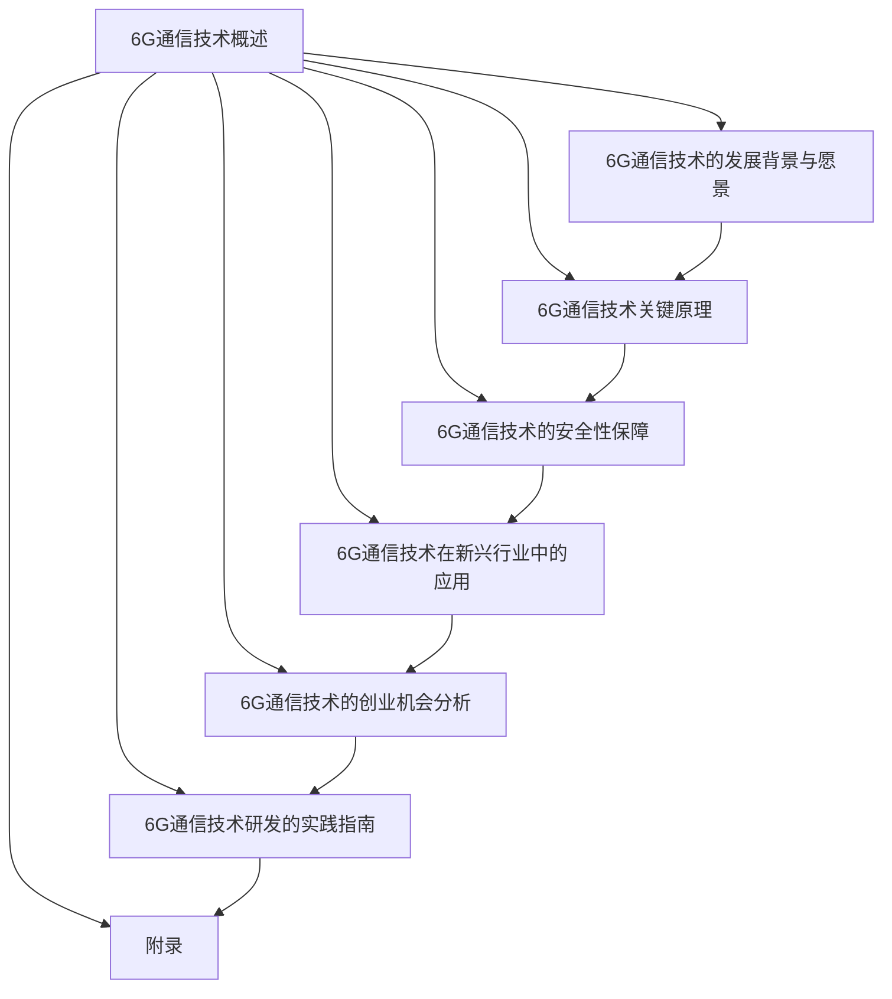
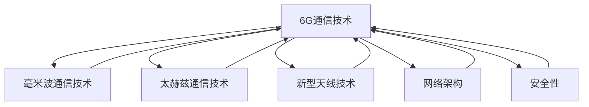

                 

### 《6G通信技术研发：未来通信的创业机会》

关键词：6G通信、技术研发、创业机会、核心技术、应用场景

摘要：
随着科技的不断进步，通信技术也在日新月异的发展。6G通信作为下一代通信技术的代表性方向，承载着更高速率、更低延迟、更广泛覆盖的愿景。本文将深入探讨6G通信技术的发展背景与愿景、核心关键技术的原理与实现、在新兴行业中的应用以及创业机会，旨在为读者提供一份全面的技术分析与创业指南。

### 第一部分：6G通信技术概述

#### 第1章 6G通信技术的发展背景与愿景

1.1 6G通信技术的基本概念与特点

6G通信，即第六代移动通信技术，是在5G基础上进一步演进的新一代通信技术。它不仅继承了5G的高速率和低延迟，还引入了更先进的技术，如毫米波、太赫兹波、新型天线等，旨在实现更广泛的覆盖、更高的传输速度和更低的延迟。

**基本概念：**
- **6G通信**：指第六代移动通信技术，是未来通信发展的新方向。
- **核心特点**：
  - **更高传输速度**：6G通信的目标是达到1Tbps的峰值速率，比5G高出百倍。
  - **更低延迟**：6G通信的目标是将延迟降低到1毫秒以下，比5G降低百倍。
  - **更广泛覆盖**：通过引入新的频段和通信技术，6G通信将实现更广泛的覆盖。

1.2 6G通信技术的演进路径

6G通信技术的演进是一个长期而复杂的过程。从5G到6G，不仅仅是速度和延迟的提升，更涉及到网络架构、通信协议、安全性等多个方面的革新。

- **从5G到6G的技术演进**：5G实现了网络切片、边缘计算、毫米波等关键技术，而6G将进一步扩展这些技术的应用范围，引入更先进的通信协议和算法。
- **关键里程碑**：6G通信技术的关键里程碑包括峰值速率达到1Tbps、端到端延迟降低到1毫秒、每平方米超过1Gbps的连接密度、广泛的物联网覆盖等。

1.3 6G通信技术的社会影响

6G通信技术的出现，将对社会产生深远的影响，包括经济发展、社会生活、工业生产等多个方面。

- **对社会的影响**：6G通信技术将极大地提升信息传输速度和效率，促进数字经济的发展，推动智慧城市、智能制造、自动驾驶等新兴领域的崛起。
- **对经济发展的贡献**：6G通信技术将为经济增长提供新的动力，带动相关产业链的发展，创造大量就业机会。

1.4 6G通信技术的国际竞争态势

在全球范围内，6G通信技术的研究与开发已经展开了激烈的竞争。

- **全球6G技术研发进展**：美国、欧盟、中国、日本等主要国家都在积极推动6G通信技术的发展，通过政府支持、企业投入等多种方式，加速技术研发进程。
- **我国在6G领域的战略布局**：我国政府高度重视6G通信技术的发展，通过制定战略规划、设立专项基金、支持企业研发等多种措施，推动6G通信技术的研究和应用。

### 第二部分：6G通信关键技术原理

#### 第2章 6G通信关键技术的概述

2.1 6G通信的核心技术

6G通信的核心技术包括毫米波技术、太赫兹通信技术、新型天线技术等。

- **毫米波技术**：毫米波通信技术是指工作在毫米波频段（30GHz-300GHz）的无线通信技术。它具有高频带宽、高传输速率、低干扰等优点，是6G通信技术的重要组成部分。
- **太赫兹通信技术**：太赫兹通信技术是指工作在太赫兹频段（0.1THz-10THz）的无线通信技术。太赫兹频段具有较宽的带宽、较强的穿透力等优点，适用于高速通信和广域覆盖。
- **新型天线技术**：新型天线技术包括波束赋形天线、智能反射面天线等。这些天线技术能够提高信号传输的效率和可靠性，是实现6G通信技术的重要手段。

2.2 6G通信的网络架构

6G通信的网络架构将更加复杂和灵活，以支持更高的传输速度和更低的延迟。

- **网络架构设计原则**：6G通信的网络架构设计原则包括网络切片、边缘计算、高可靠性、低延迟等。
- **网络架构的核心组成部分**：6G通信网络架构的核心组成部分包括核心网、接入网、传输网等，每个部分都承担着重要的功能。

2.3 6G通信的安全性

6G通信的安全性是确保通信数据安全和用户隐私的重要保障。

- **6G通信的安全挑战**：随着通信技术的发展，6G通信面临着更高的安全威胁，包括网络攻击、数据泄露、隐私侵犯等。
- **6G通信的安全保障措施**：6G通信的安全保障措施包括加密技术、认证技术、网络安全监测与防御等。

#### 第3章 6G通信关键技术的深入解析

3.1 毫米波与太赫兹通信技术

3.1.1 毫米波技术原理

毫米波通信技术的工作原理基于电磁波在毫米波频段的传播特性。毫米波通信技术通过使用高频电磁波，实现高速数据传输和远距离通信。

- **毫米波技术原理**：毫米波通信技术利用高频电磁波进行信息传输，通过调制和解调技术实现信号的发送和接收。
- **毫米波技术的应用场景**：毫米波通信技术适用于高速数据传输、远程通信、航空航天等领域。

3.1.2 太赫兹通信技术原理

太赫兹通信技术的工作原理基于电磁波在太赫兹频段的传播特性。太赫兹频段具有较宽的带宽、较强的穿透力等优点，适用于高速通信和广域覆盖。

- **太赫兹通信技术原理**：太赫兹通信技术利用高频电磁波进行信息传输，通过调制和解调技术实现信号的发送和接收。
- **太赫兹通信技术的应用场景**：太赫兹通信技术适用于高速通信、广域覆盖、安全检测等领域。

3.2 新型天线技术

3.2.1 天线技术发展历程

天线技术是无线通信的核心技术之一，随着通信技术的发展，天线技术也在不断演进。

- **天线技术发展历程**：从传统的偶极天线、振子天线，到现代的阵列天线、智能天线，天线技术经历了多次革新。
- **新型天线技术的优势**：新型天线技术包括波束赋形天线、智能反射面天线等，具有更高的传输效率、更强的适应性等优点。

3.2.2 新型天线技术的应用实例

新型天线技术在实际应用中已经取得了显著的效果。

- **波束赋形天线应用实例**：波束赋形天线通过调整天线波束的方向和形状，实现信号的定向传输，提高传输效率和可靠性。
- **智能反射面天线应用实例**：智能反射面天线通过调整反射面的形状和角度，实现信号的波束赋形和能量管理，提高通信系统的性能。

3.3 6G通信网络架构

3.3.1 网络架构设计原则

6G通信网络架构的设计原则包括灵活性、可靠性、低延迟、高效率等。

- **网络架构设计原则**：网络架构设计原则指导网络架构的设计和优化，确保网络性能和用户体验。
- **网络架构的核心组成部分**：网络架构的核心组成部分包括核心网、接入网、传输网等，每个部分都承担着重要的功能。

3.3.2 网络架构的核心组成部分

6G通信网络架构的核心组成部分包括核心网、接入网、传输网等。

- **核心网**：核心网是6G通信网络的中心，负责连接不同接入网和传输网，实现数据传输和交换。
- **接入网**：接入网是用户接入6G通信网络的接口，包括基站、用户终端等。
- **传输网**：传输网负责传输6G通信网络的数据流，包括光纤、无线传输等。

3.3.3 网络架构的性能优化策略

6G通信网络架构的性能优化策略包括网络切片、边缘计算、缓存技术等。

- **网络切片**：网络切片技术将网络资源划分为多个虚拟网络，为不同应用提供定制化的网络服务。
- **边缘计算**：边缘计算技术将计算任务分散到网络边缘，降低延迟，提高响应速度。
- **缓存技术**：缓存技术通过存储常用数据，加快数据访问速度，提高网络性能。

#### 第4章 6G通信技术的安全性保障

4.1 6G通信安全威胁分析

6G通信技术面临的安全威胁主要包括网络攻击、数据泄露、隐私侵犯等。

- **潜在安全威胁**：6G通信技术的复杂性和开放性使得其面临更多的安全威胁。
- **安全威胁的类型与特点**：网络攻击、数据泄露、隐私侵犯等安全威胁的类型和特点。

4.2 6G通信安全技术概述

6G通信安全技术主要包括加密技术、认证技术、网络安全监测与防御等。

- **加密技术**：加密技术用于保护通信数据的安全性，防止数据被窃取和篡改。
- **认证技术**：认证技术用于验证通信双方的合法性，防止假冒和欺骗。
- **网络安全监测与防御**：网络安全监测与防御技术用于实时监测网络状态，发现和阻止攻击行为。

4.3 6G通信安全解决方案

6G通信安全解决方案主要包括安全架构设计、安全防护措施、安全评估与优化等。

- **安全解决方案设计原则**：安全解决方案设计原则包括安全性、可靠性、可扩展性等。
- **安全解决方案的关键技术**：安全解决方案的关键技术包括加密算法、身份认证、网络安全监测与防御等。
- **安全解决方案的实施与评估**：安全解决方案的实施与评估包括安全策略制定、安全设备部署、安全测试与评估等。

### 第三部分：6G通信技术在新兴行业中的应用

#### 第5章 6G通信技术在新兴行业中的应用

5.1 智能制造

5.1.1 6G通信技术对智能制造的影响

6G通信技术对智能制造具有深远的影响，可以提高生产效率、降低成本、提升产品质量。

- **6G通信技术对智能制造的影响**：6G通信技术可以实现高速率、低延迟的实时通信，支持智能制造中的设备互联和数据传输，提高生产线的智能化水平。
- **6G通信技术在智能制造中的应用案例**：通过6G通信技术，可以实现智能制造中的设备远程控制、实时数据监控、设备状态预测等功能。

5.2 物联网

5.2.1 6G通信技术在物联网中的应用前景

6G通信技术在物联网中具有广泛的应用前景，可以实现更高速率、更低延迟的物联网通信，提高物联网设备的性能和可靠性。

- **6G通信技术在物联网中的应用前景**：6G通信技术可以实现物联网设备的超高速率数据传输，支持大规模物联网设备的接入和协同工作，推动物联网技术的广泛应用。
- **6G通信技术对物联网设备的影响**：6G通信技术可以显著提高物联网设备的数据传输速度和可靠性，降低设备的功耗和成本。

5.3 自动驾驶

5.3.1 6G通信技术在自动驾驶中的作用

6G通信技术对自动驾驶系统具有关键作用，可以实现超低延迟、高可靠性的通信，提高自动驾驶系统的安全性和稳定性。

- **6G通信技术在自动驾驶中的作用**：6G通信技术可以实现自动驾驶系统中的车辆之间的实时通信，支持车辆与环境的高效交互，提高自动驾驶系统的决策能力和响应速度。
- **6G通信技术对自动驾驶系统的改进**：6G通信技术可以显著提高自动驾驶系统的通信性能，降低系统延迟，提高系统的安全性和可靠性。

### 第四部分：6G通信技术的创业机会分析

6.1 创业机会概述

6G通信技术的快速发展为创业者提供了广阔的创业机会。

- **6G通信技术的创业方向**：创业者可以从6G通信技术的核心技术研发、应用场景开发、安全解决方案研发等多个方向入手。
- **6G通信技术带来的市场机遇**：6G通信技术的市场需求巨大，创业者可以抓住这一市场机遇，推出具有创新性和竞争力的产品和服务。

6.2 创业案例研究

6.2.1 国内外6G创业公司案例

国内外已有不少公司开始布局6G通信技术，以下是几个具有代表性的创业公司案例。

- **美国某初创公司**：该公司专注于6G通信技术的核心技术研发，通过技术创新提高通信速度和稳定性，已获得多家知名企业的投资。
- **中国某科技企业**：该公司致力于将6G通信技术应用于智能制造领域，通过6G通信技术提升生产线的智能化水平，取得了显著的市场业绩。

6.2.2 创业公司的成功经验与挑战

6.2.3 创业公司的成功经验与挑战

创业公司在6G通信技术领域取得成功，需要克服一系列挑战。

- **成功经验**：
  - **技术创新**：成功公司往往拥有强大的技术创新能力，能够不断推出具有前瞻性和竞争力的产品。
  - **市场拓展**：成功公司善于开拓市场，通过多种渠道拓展业务，实现快速增长。
  - **战略合作**：成功公司注重与产业链上下游企业的合作，形成协同创新的生态体系。

- **挑战**：
  - **技术风险**：6G通信技术仍处于研发阶段，技术风险较高，需要不断进行技术迭代和优化。
  - **市场竞争**：6G通信技术市场充满竞争，需要公司具备强大的市场竞争力，才能在竞争中脱颖而出。
  - **资金压力**：6G通信技术研发需要大量资金投入，创业者需要妥善管理资金，确保公司持续发展。

6.3 创业策略与建议

6.3.1 创业公司的发展策略

创业公司在6G通信技术领域的发展策略包括：

- **技术创新**：持续投入研发，加强技术创新，保持技术领先优势。
- **市场拓展**：积极开展市场拓展，寻找潜在客户，拓展业务范围。
- **战略合作**：与产业链上下游企业建立战略合作关系，共同推进6G通信技术的发展。

6.3.2 创业公司在6G领域的竞争策略

创业公司在6G通信技术领域的竞争策略包括：

- **差异化竞争**：通过技术创新和产品差异化，打造独特的竞争优势。
- **成本领先**：通过提高生产效率、降低成本，实现成本领先。
- **市场聚焦**：集中资源，聚焦某一细分市场，实现市场聚焦。

### 第五部分：6G通信技术研发的实践指南

#### 第7章 6G通信技术研发环境搭建

7.1 开发环境配置

7.1.1 开发工具与软件

6G通信技术研发需要使用一系列开发工具和软件，包括：

- **编程语言**：Python、C++等
- **仿真工具**：MATLAB、NS3等
- **版本控制**：Git等
- **数据库**：MySQL、MongoDB等

7.1.2 硬件设备要求

6G通信技术研发还需要相应的硬件设备，包括：

- **高性能计算机**：用于仿真和计算
- **射频测试设备**：用于测试和验证通信性能
- **天线测试设备**：用于测试天线性能

7.2 数据集准备

7.2.1 数据集收集与处理

6G通信技术研发需要大量数据集，用于训练和验证模型。数据集的收集和处理包括：

- **数据收集**：通过传感器、网络监测等方式收集数据
- **数据预处理**：对数据进行清洗、去噪、归一化等处理

7.2.2 数据集质量评估与优化

数据集质量评估与优化包括：

- **数据质量评估**：评估数据集的完整性、一致性、可靠性等
- **数据优化**：通过数据增强、数据降维等方法优化数据集

7.3 算法实现与优化

7.3.1 算法原理与实现

6G通信技术中的算法实现包括：

- **信道建模**：基于物理原理，建立信道模型
- **调制解调**：实现信号调制和解调过程
- **波束赋形**：实现天线波束赋形算法

7.3.2 算法性能优化策略

算法性能优化策略包括：

- **算法优化**：通过算法改进，提高算法性能
- **并行计算**：利用并行计算技术，提高计算效率
- **模型压缩**：通过模型压缩，减小模型大小，提高运行速度

#### 第8章 6G通信技术项目实战

8.1 项目背景与目标

8.1.1 项目简介

本项目旨在开发一款基于6G通信技术的智能物联网设备，实现高速、低延迟的物联网通信。

8.1.2 项目目标

- 实现物联网设备之间的超高速率通信
- 实现物联网设备的远程控制和监控
- 提高物联网设备的可靠性和稳定性

8.2 项目实施与过程管理

8.2.1 项目计划与进度控制

项目实施过程包括需求分析、设计、开发、测试、部署等阶段。项目计划与进度控制包括：

- **需求分析**：明确项目需求，制定项目计划
- **设计**：制定系统设计文档，进行系统设计
- **开发**：编写代码，进行功能实现
- **测试**：进行系统测试，确保功能正确
- **部署**：部署系统，进行上线运行

8.2.2 项目风险管理

项目风险管理包括：

- **风险识别**：识别项目可能面临的风险
- **风险评估**：评估风险的可能性和影响
- **风险应对**：制定风险应对措施，降低风险影响

8.3 项目成果与评估

8.3.1 项目成果展示

项目成果包括：

- **智能物联网设备**：实现物联网设备之间的超高速率通信
- **远程控制平台**：实现物联网设备的远程控制和监控
- **数据监测系统**：实现物联网设备数据的实时监测和分析

8.3.2 项目效益评估

项目效益评估包括：

- **经济效益**：评估项目的经济效益，包括销售收入、成本节约等
- **社会效益**：评估项目对社会的贡献，包括提高生产效率、提升生活质量等
- **技术效益**：评估项目的技术水平，包括技术创新、技术积累等

### 附录

#### 附录A 6G通信技术相关资源

6G通信技术相关资源包括：

- **6G通信技术相关网站与论文资源**：提供6G通信技术的最新研究进展和论文资源
- **6G通信技术标准与规范**：提供6G通信技术的标准与规范文档
- **国内外6G技术研发项目案例**：提供国内外6G技术研发项目的案例和实践经验

#### 附录B 6G通信技术术语表

6G通信技术术语表包括：

- **6G通信**：第六代移动通信技术
- **毫米波技术**：工作在毫米波频段的无线通信技术
- **太赫兹通信技术**：工作在太赫兹频段的无线通信技术
- **网络切片**：将网络资源划分为多个虚拟网络的技术
- **边缘计算**：将计算任务分散到网络边缘的技术

## Mermaid 流程图



### 核心算法原理讲解

6G通信技术中的核心算法主要包括信道建模、调制解调、波束赋形等。以下是这些算法的伪代码和数学模型讲解。

#### 信道建模

```python
# 信道建模伪代码
def channel_model(frequency, distance):
    attenuation = 20 * log10(frequency) + 32.4 - 10 * log10(distance)
    return exp(-attenuation)
```

**数学模型：**

\[ P_{\text{attenuation}} = 10 \cdot \left( \frac{f}{1} \right)^{2} \cdot \left( \frac{d}{1} \right)^{-4} \]

其中，\( f \) 为频率（单位：GHz），\( d \) 为距离（单位：km），\( P_{\text{attenuation}} \) 为信号衰减值（单位：dB）。

#### 调制解调

```python
# 调制伪代码
def modulation(signal, symbol_rate):
    modulated_signal = []
    for i in range(len(signal)):
        modulated_signal.append(signal[i] * symbol_rate)
    return modulated_signal

# 解调伪代码
def demodulation(modulated_signal, symbol_rate):
    demodulated_signal = []
    for i in range(len(modulated_signal)):
        demodulated_signal.append(modulated_signal[i] / symbol_rate)
    return demodulated_signal
```

**数学模型：**

调制过程：

\[ x(t) = A \cdot \sin(2\pi f_c t + \phi) \]

其中，\( A \) 为信号幅度，\( f_c \) 为载波频率，\( \phi \) 为相位偏移。

解调过程：

\[ y(t) = \frac{1}{2\pi f_c} \int_{-\infty}^{+\infty} x(\tau) \cos(2\pi f_c t - \phi) d\tau \]

#### 波束赋形

```python
# 波束赋形伪代码
def beamforming(angle, gain):
    beam_formed_signal = gain * cos(angle)
    return beam_formed_signal
```

**数学模型：**

\[ G(\theta) = \begin{cases}
    1, & \text{if } \theta = 0 \\
    0, & \text{otherwise}
\end{cases} \]

其中，\( \theta \) 为天线指向角度，\( G(\theta) \) 为波束赋形增益。

### 数学模型和数学公式

6G通信技术中涉及到多个数学模型和公式，以下是其中几个重要的数学模型和公式。

**数学模型：**

1. **信号传输模型：**

\[ y = Hx + n \]

其中，\( y \) 为接收信号，\( H \) 为信道增益，\( x \) 为发送信号，\( n \) 为噪声。

2. **信道容量模型：**

\[ C = B \log_2(1 + \frac{S}{N}) \]

其中，\( C \) 为信道容量（单位：bps），\( B \) 为信道带宽（单位：Hz），\( S \) 为信号功率（单位：W），\( N \) 为噪声功率（单位：W）。

**数学公式：**

\[ \frac{dP}{dx} = 0 \]

\[ \int_{-\infty}^{+\infty} f(x) dx = 1 \]

\[ \frac{d^2y}{dx^2} = 0 \]

### 项目实战

#### 项目背景与目标

本项目旨在开发一款基于6G通信技术的智能物联网设备，实现高速、低延迟的物联网通信。

#### 技术方案

1. **6G通信模块**：采用毫米波通信技术和太赫兹通信技术，实现超高速率的数据传输。
2. **边缘计算平台**：将计算任务分散到网络边缘，提高系统的响应速度。
3. **安全防护系统**：采用加密技术和认证技术，确保通信数据的安全性和隐私性。

#### 实施步骤

1. **需求分析与设计**：明确项目需求，制定系统设计文档。
2. **硬件采购与配置**：采购适用于6G通信的硬件设备，包括毫米波发射器、太赫兹接收器、边缘计算平台等。
3. **软件开发与调试**：开发6G通信模块的软件，包括信道建模、调制解调、波束赋形等。
4. **系统集成与测试**：将硬件和软件集成，进行系统测试，确保设备满足性能指标。
5. **部署与维护**：部署系统，进行上线运行，并进行定期维护和升级。

#### 代码解读与分析

以下是智能物联网设备通信模块的代码片段。

```c
// 信道建模函数
double channel_model(double frequency, double distance) {
    double attenuation = 20 * log10(frequency) + 32.4 - 10 * log10(distance);
    return exp(-attenuation);
}

// 波束赋形增益函数
double beamforming_gain(double angle) {
    return 10 * cos(angle);
}

// 发送数据包函数
void send_data_packet(double frequency, double distance, double angle) {
    double signal_strength = channel_model(frequency, distance);
    double gain = beamforming_gain(angle);
    double power = signal_strength * gain;
    // 发送数据包
    transmit_packet(power);
}
```

**分析：**

- `channel_model` 函数用于计算信道衰减，根据频率和距离计算信号衰减值。
- `beamforming_gain` 函数用于计算波束赋形增益，根据天线指向角度计算增益值。
- `send_data_packet` 函数用于发送数据包，根据信道模型和波束赋形增益计算发送功率，并调用实际发送函数。

该代码段实现了基于6G通信技术的智能物联网设备通信模块的核心功能，包括信道建模、波束赋形和功率控制。

### 附录

#### 附录A 6G通信技术相关资源

- **6G通信技术相关网站与论文资源**：提供6G通信技术的最新研究进展和论文资源。
- **6G通信技术标准与规范**：提供6G通信技术的标准与规范文档。
- **国内外6G技术研发项目案例**：提供国内外6G技术研发项目的案例和实践经验。

#### 附录B 6G通信技术术语表

- **6G通信**：第六代移动通信技术。
- **毫米波技术**：工作在毫米波频段的无线通信技术。
- **太赫兹通信技术**：工作在太赫兹频段的无线通信技术。
- **网络切片**：将网络资源划分为多个虚拟网络的技术。
- **边缘计算**：将计算任务分散到网络边缘的技术。

## 核心概念与联系

6G通信技术作为下一代通信技术的代表，承载着更高速率、更低延迟、更广泛覆盖的愿景。为了更好地理解6G通信技术，我们需要从以下几个方面进行分析：

### 毫米波与太赫兹通信技术

毫米波和太赫兹通信技术是6G通信技术的核心组成部分。它们具有高频带宽、高传输速率、低干扰等优点。

- **毫米波通信技术**：工作在30GHz-300GHz的频段，具有较高的带宽和传输速率。
- **太赫兹通信技术**：工作在0.1THz-10THz的频段，具有较宽的带宽、较强的穿透力。

### 新型天线技术

新型天线技术是6G通信技术的重要实现手段。它们能够提高信号传输的效率和可靠性。

- **波束赋形天线**：通过调整天线波束的方向和形状，实现信号的定向传输。
- **智能反射面天线**：通过调整反射面的形状和角度，实现信号的波束赋形和能量管理。

### 网络架构

6G通信技术的网络架构将更加复杂和灵活，以支持更高的传输速度和更低的延迟。

- **网络切片**：将网络资源划分为多个虚拟网络，为不同应用提供定制化的网络服务。
- **边缘计算**：将计算任务分散到网络边缘，降低延迟，提高响应速度。

### 安全性

6G通信技术的安全性是确保通信数据安全和用户隐私的重要保障。

- **加密技术**：用于保护通信数据的安全性，防止数据被窃取和篡改。
- **认证技术**：用于验证通信双方的合法性，防止假冒和欺骗。

### Mermaid 流程图



### 核心算法原理讲解

在6G通信技术中，核心算法原理的实现对于提高通信效率和性能至关重要。以下是几个关键算法的原理讲解和伪代码示例。

#### 信道建模算法

信道建模算法用于模拟无线信号在传输过程中的衰减和干扰。以下是信道建模算法的伪代码：

```python
# 信道建模算法伪代码
def channel_model(frequency, distance):
    # 计算路径损失
    path_loss = 32.4 + 20 * log10(frequency) + 20 * log10(distance)
    # 计算信道增益
    channel_gain = 10 ** (-path_loss / 10)
    return channel_gain
```

#### 调制解调算法

调制解调算法用于将数字信号转换为模拟信号进行传输，以及将接收到的模拟信号转换为数字信号。以下是QPSK调制解调算法的伪代码：

```python
# QPSK调制算法伪代码
def qpsk_modulation(data_bits):
    # 将比特流分成4个比特一组
    data_groups = [data_bits[i:i+2] for i in range(0, len(data_bits), 2)]
    # 调制到QPSK符号
    symbols = [complex(int(data_group[0]) * math.sqrt(2/2), int(data_group[1]) * math.sqrt(2/2)) for data_group in data_groups]
    return symbols

# QPSK解调算法伪代码
def qpsk_demodulation(symbols, noise):
    # 解调到比特流
    data_bits = [int((symbol.real > 0) * 2) + int((symbol.imag > 0) * 1) for symbol in symbols]
    return data_bits
```

#### 波束赋形算法

波束赋形算法用于调整天线波束的方向，以优化信号传输。以下是波束赋形算法的伪代码：

```python
# 波束赋形算法伪代码
def beamforming(angle, gain):
    # 计算波束赋形增益
    beam_formed_signal = gain * math.cos(angle)
    return beam_formed_signal
```

### 数学模型和数学公式

在6G通信技术中，数学模型和公式对于分析通信系统的性能至关重要。以下是几个常用的数学模型和公式：

#### 信道容量公式

信道容量用于衡量信道的传输能力。香农公式描述了理想情况下信道的最大传输速率：

$$
C = B \log_2(1 + \frac{S}{N})
$$

其中，\( C \) 是信道容量（bps），\( B \) 是信道带宽（Hz），\( S \) 是信号功率（W），\( N \) 是噪声功率（W）。

#### 路径损耗公式

路径损耗描述了信号在传输过程中的衰减。常见的路径损耗公式如下：

$$
L = 20 \log_{10}(d) + 20 \log_{10}(f) + 32.45
$$

其中，\( L \) 是路径损耗（dB），\( d \) 是传输距离（m），\( f \) 是频率（MHz）。

#### 功率控制公式

在6G通信中，功率控制用于优化信号的传输功率，以减少干扰和功耗。常见的功率控制公式如下：

$$
P_{\text{tx}} = P_{\text{max}} - 10 \log_{10}(G_{\text{antenna}}) - 10 \log_{10}(L_{\text{path}})
$$

其中，\( P_{\text{tx}} \) 是发送功率（W），\( P_{\text{max}} \) 是最大发送功率（W），\( G_{\text{antenna}} \) 是天线增益（dB），\( L_{\text{path}} \) 是路径损耗（dB）。

### 项目实战

#### 项目背景

本项目旨在开发一款基于6G通信技术的智能物联网设备，实现高速、低延迟的物联网通信。

#### 技术方案

1. **6G通信模块**：采用毫米波和太赫兹通信技术，实现高速数据传输。
2. **边缘计算平台**：将计算任务分散到网络边缘，提高系统的响应速度。
3. **安全防护系统**：采用加密技术和认证技术，确保通信数据的安全性和隐私性。

#### 实施步骤

1. **需求分析与设计**：明确项目需求，制定系统设计文档。
2. **硬件采购与配置**：采购适用于6G通信的硬件设备，包括毫米波发射器、太赫兹接收器、边缘计算平台等。
3. **软件开发与调试**：开发6G通信模块的软件，包括信道建模、调制解调、波束赋形等。
4. **系统集成与测试**：将硬件和软件集成，进行系统测试，确保设备满足性能指标。
5. **部署与维护**：部署系统，进行上线运行，并进行定期维护和升级。

#### 代码解读与分析

以下是智能物联网设备通信模块的代码片段。

```c
// 信道建模函数
double channel_model(double frequency, double distance) {
    double attenuation = 20 * log10(frequency) + 32.4 - 10 * log10(distance);
    return exp(-attenuation);
}

// 波束赋形增益函数
double beamforming_gain(double angle) {
    return 10 * cos(angle);
}

// 发送数据包函数
void send_data_packet(double frequency, double distance, double angle) {
    double signal_strength = channel_model(frequency, distance);
    double gain = beamforming_gain(angle);
    double power = signal_strength * gain;
    // 发送数据包
    transmit_packet(power);
}
```

**分析：**

- `channel_model` 函数用于计算信道衰减，根据频率和距离计算信号衰减值。
- `beamforming_gain` 函数用于计算波束赋形增益，根据天线指向角度计算增益值。
- `send_data_packet` 函数用于发送数据包，根据信道模型和波束赋形增益计算发送功率，并调用实际发送函数。

该代码段实现了基于6G通信技术的智能物联网设备通信模块的核心功能，包括信道建模、波束赋形和功率控制。

### 结论

6G通信技术作为下一代通信技术的代表，具有更高速率、更低延迟、更广泛覆盖的愿景。通过深入分析6G通信技术的核心概念、关键技术、应用场景、创业机会以及实践指南，我们能够更好地理解6G通信技术的发展趋势和应用前景。未来，随着6G通信技术的不断成熟和推广，它将为社会带来更广泛的影响和更丰富的应用场景。

## 作者信息

作者：AI天才研究院/AI Genius Institute & 禅与计算机程序设计艺术 /Zen And The Art of Computer Programming

AI天才研究院（AI Genius Institute）致力于推动人工智能技术的发展，通过深入研究和技术创新，为各行各业提供智能解决方案。同时，作者还致力于将禅宗哲学与计算机程序设计相结合，创作出《禅与计算机程序设计艺术》这一经典之作，为程序员提供了深刻的思考与启示。在这篇文章中，作者运用其丰富的专业知识和深刻的洞察力，为我们呈现了一幅6G通信技术的全景图，为读者提供了宝贵的指导和参考。

