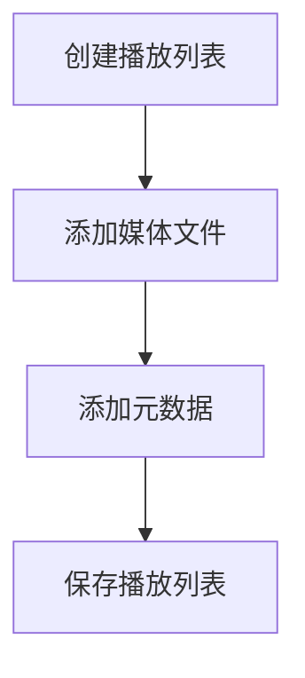
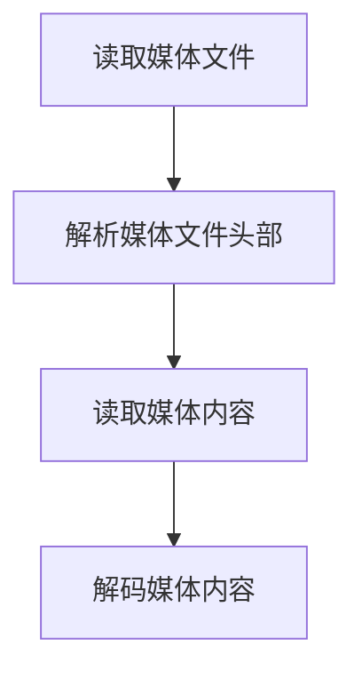

                 

## HLS 流媒体协议标准：在 HTTP 上高效分发视频内容

> **关键词**：HLS、流媒体协议、HTTP、视频内容分发、性能优化、应用实例

> **摘要**：本文将深入探讨HLS（HTTP Live Streaming）协议的原理和应用。通过逐步分析其核心数据结构、关键算法和数学模型，我们将揭示HLS协议如何通过HTTP在网络上高效地分发视频内容。此外，本文还将介绍HLS协议在不同领域（如视频直播、视频点播、移动端应用）的实际应用案例，以及其未来的发展趋势。通过这些内容，读者将全面了解HLS协议的强大功能和广泛影响力。

### 目录大纲：HLS 流媒体协议标准：在 HTTP 上高效分发视频内容

1. 第一部分：流媒体协议与HTTP基础
   1.1 流媒体技术概述
   1.2 HTTP协议基础
   1.3 HLS协议简介
   1.4 HLS协议工作原理

2. 第二部分：HLS协议核心原理
   2.1 HLS协议中的数据结构
   2.2 HLS协议的关键算法
   2.3 HLS协议的数学模型
   2.4 HLS协议的性能优化

3. 第三部分：HLS协议应用实例
   3.1 HLS协议在视频直播中的应用
   3.2 HLS协议在视频点播中的应用
   3.3 HLS协议在移动端的应用
   3.4 HLS协议在其他领域的应用

4. 第四部分：HLS协议的未来发展
   4.1 HLS协议的标准化进程
   4.2 HLS协议的新兴技术
   4.3 HLS协议的发展趋势

5. 附录
   5.1 HLS协议开发工具与资源
   5.2 HLS协议相关标准文档
   5.3 HLS协议应用案例精选

---

在接下来的章节中，我们将一步一步地深入探讨HLS协议的工作原理、核心技术和应用实例。首先，让我们从流媒体技术的基础开始。

## 第一部分：流媒体协议与HTTP基础

### 1.1 流媒体技术概述

#### 1.1.1 流媒体的定义与分类

流媒体是一种通过网络传输和播放多媒体内容的技术。与传统的下载观看方式不同，流媒体在播放过程中可以实时传输和播放内容，无需等待整个文件下载完成。流媒体技术可以分类为实时流媒体和点播流媒体。

**实时流媒体**：实时流媒体是指在播放过程中不断传输数据，以保持内容的实时性和连贯性。常见的实时流媒体技术包括RTMP（Real-Time Messaging Protocol）、RTSP（Real-Time Streaming Protocol）和HLS（HTTP Live Streaming）。

**点播流媒体**：点播流媒体是指用户可以在任何时间点选择播放的内容，并从存储设备中检索和播放。常见的点播流媒体技术包括HTTP Dynamic Streaming（HDS）和MPEG-DASH（Dynamic Adaptive Streaming over HTTP）。

#### 1.1.2 流媒体传输的关键技术

流媒体传输的关键技术包括编码、传输和播放。

**编码**：编码是将原始音频和视频信号转换为压缩格式的过程。常见的编码格式包括H.264（视频编码）和AAC（音频编码）。高效的编码可以降低数据传输的带宽需求，提高播放质量。

**传输**：传输是将编码后的媒体数据通过网络传输到用户设备的过程。流媒体传输技术通常采用基于HTTP的协议，如HLS、HDS和MPEG-DASH。这些协议可以充分利用HTTP协议的优势，实现高效的数据传输和缓存。

**播放**：播放是将传输的媒体数据解码并在用户设备上显示的过程。播放器负责解码和播放媒体内容，并提供用户交互界面。

### 1.2 HTTP协议基础

#### 1.2.1 HTTP协议概述

HTTP（HyperText Transfer Protocol）是一种用于分布式、协作式和超媒体信息系统的应用层协议。它定义了客户端和服务器之间的通信规则，用于传输超文本数据。HTTP协议具有以下特点：

- **无状态**：HTTP协议是无状态的，即每个请求和响应之间相互独立，服务器不保留之前的通信状态。
- **简单性**：HTTP协议设计简单，易于实现和扩展。
- **可扩展性**：HTTP协议可以通过扩展协议头部、请求方法和响应状态码来实现新的功能。

#### 1.2.2 HTTP请求与响应流程

HTTP请求与响应流程是HTTP协议的核心。一个典型的HTTP请求与响应流程如下：

1. **建立连接**：客户端通过TCP连接与服务器建立连接。
2. **发送请求**：客户端向服务器发送HTTP请求，包括请求行、请求头部和请求体。
3. **服务器处理请求**：服务器接收到请求后，根据请求头部中的URL等信息，处理请求并生成响应。
4. **发送响应**：服务器将HTTP响应发送给客户端，包括响应行、响应头部和响应体。
5. **关闭连接**：客户端接收到响应后，关闭与服务器的TCP连接。

HTTP请求与响应流程的详细步骤和内容可以通过HTTP协议的规范文档进行了解。

### 1.3 HLS协议简介

#### 1.3.1 HLS协议发展历程

HLS（HTTP Live Streaming）协议是由苹果公司于2009年推出的流媒体协议，旨在通过HTTP协议在网络上传输实时视频内容。HLS协议的发展历程如下：

- **2009年**：苹果公司首次发布HLS协议，并集成到iOS和Mac OS系统中。
- **2010年**：HLS协议被纳入MPEG-DASH标准，成为国际标准之一。
- **2012年**：HLS协议被ITU纳入T.616标准，成为国际电信联盟标准之一。
- **2016年**：HLS协议被IETF纳入HTTP/2标准，成为HTTP/2协议的一部分。

#### 1.3.2 HLS协议的基本架构

HLS协议的基本架构包括以下组成部分：

- **媒体文件**：HLS协议使用.ts文件作为媒体文件，每个文件包含一段视频或音频数据。
- **播放列表**：HLS协议使用.m3u8文件作为播放列表，包含媒体文件的列表和相关信息，如起始时间、时长等。
- **HTTP服务器**：HLS协议使用HTTP服务器来传输媒体文件和播放列表，常见的HTTP服务器包括Nginx、Apache等。

#### 1.3.3 HLS协议的工作原理

HLS协议的工作原理如下：

1. **请求播放列表**：客户端向HTTP服务器请求.m3u8播放列表文件。
2. **解析播放列表**：客户端解析.m3u8文件，获取媒体文件列表和相关参数。
3. **请求媒体文件**：客户端根据播放列表，逐个请求.ts媒体文件。
4. **播放媒体文件**：客户端接收并播放.ts媒体文件，实现实时视频播放。

通过上述工作原理，HLS协议可以在HTTP协议的基础上实现高效、可靠的实时视频传输。

### 1.4 HLS协议工作原理

#### 1.4.1 HLS协议的媒体播放流程

HLS协议的媒体播放流程包括以下步骤：

1. **建立连接**：客户端通过HTTP协议与服务器建立连接。
2. **请求播放列表**：客户端向服务器请求.m3u8播放列表文件。
3. **解析播放列表**：客户端解析.m3u8文件，获取媒体文件列表和相关参数。
4. **请求媒体文件**：客户端根据播放列表，逐个请求.ts媒体文件。
5. **播放媒体文件**：客户端接收并播放.ts媒体文件，实现实时视频播放。
6. **处理请求**：服务器处理客户端的请求，生成响应并发送媒体文件。

#### 1.4.2 HLS协议的关键技术点

HLS协议的关键技术点包括数据结构、关键算法和数学模型。

**数据结构**：

- **播放列表**：HLS协议使用.m3u8文件作为播放列表，包含媒体文件的列表和相关参数。
- **媒体文件**：HLS协议使用.ts文件作为媒体文件，每个文件包含一段视频或音频数据。

**关键算法**：

- **起始时间计算算法**：用于计算播放起始时间。
- **重复检测算法**：用于检测播放过程中是否出现重复播放现象。

**数学模型**：

- **时序模型**：用于描述媒体文件的播放时间序列。
- **流媒体质量评估模型**：用于评估流媒体播放质量。

通过上述关键技术点，HLS协议实现了在HTTP协议基础上高效、可靠的实时视频传输。

## 第二部分：HLS协议核心原理

### 2.1 HLS协议中的数据结构

HLS协议中的数据结构是构建流媒体传输的基础，其中最核心的数据结构是播放列表和媒体文件。

#### 2.1.1 HLS播放列表

**核心概念与联系**：

播放列表（Playlist）是HLS协议中的核心数据结构，用于组织和管理媒体文件。它通常由一系列的媒体文件列表及其相关的元数据组成。播放列表文件通常以.m3u8为扩展名，是一种基于文本的文件格式。

播放列表的主要作用是：

1. **组织媒体文件**：播放列表将媒体文件按照一定的顺序组织起来，便于客户端逐个播放。
2. **提供元数据**：播放列表中包含了媒体文件的起始时间、时长、编码格式等元数据，有助于客户端正确地播放和缓存媒体文件。

**Mermaid流程图**：



**Mermaid流程图解释**：

- **A[创建播放列表]**：客户端或服务器创建一个空播放列表。
- **B[添加媒体文件]**：将一系列.ts媒体文件添加到播放列表中。
- **C[添加元数据]**：为每个媒体文件添加元数据，如起始时间、时长、编码格式等。
- **D[保存播放列表]**：将播放列表保存为.m3u8文件，供客户端请求和解析。

#### 2.1.2 HLS媒体文件

**核心概念与联系**：

HLS媒体文件（Media File）是HLS协议中的基本存储单元，通常以.ts为扩展名。每个.ts文件包含一段视频或音频数据，这些数据是经过编码处理的。媒体文件的主要作用是：

1. **存储内容**：媒体文件存储了实际的视频或音频内容，是播放列表中的数据实体。
2. **按需请求**：客户端根据播放列表中的指示，逐个请求.ts媒体文件，以实现连续的播放。

**Mermaid流程图**：



**Mermaid流程图解释**：

- **A[读取媒体文件]**：客户端从HTTP服务器请求.ts媒体文件。
- **B[解析媒体文件头部]**：客户端读取并解析.ts文件的头信息，包括编码格式、时长等。
- **C[读取媒体内容]**：客户端读取.ts文件中的实际内容。
- **D[解码媒体内容]**：客户端使用相应的解码器，将.ts文件的内容解码为可播放的格式。

通过上述数据结构，HLS协议实现了对媒体文件的有效组织和按需传输，为流媒体播放提供了坚实的基础。

### 2.2 HLS协议的关键算法

HLS协议中的关键算法是实现高效、可靠流媒体传输的核心。这些算法包括起始时间计算算法和重复检测算法。

#### 2.2.1 起始时间计算算法

**核心算法原理讲解**：

起始时间计算算法是用于确定播放开始时间的关键算法。其主要原理是根据播放列表中媒体文件的时长、起始时间和当前时间等信息，计算出最佳播放起始时间。

具体算法步骤如下：

1. **获取播放列表**：首先，从服务器获取.m3u8播放列表文件。
2. **读取媒体文件信息**：解析播放列表，获取每个媒体文件的时长和起始时间。
3. **计算起始时间**：遍历播放列表中的媒体文件，从后向前查找第一个媒体文件的起始时间，使得该时间点加上文件时长后不早于当前时间。

伪代码实现如下：

```python
def calculate_start_time(playlists, current_time):
    start_time = current_time
    for playlist in playlists:
        for segment in playlist.segments:
            if segment.start_time + segment.duration > current_time:
                start_time = segment.start_time
                break
    return start_time
```

**举例说明**：

假设当前时间为20秒，播放列表中有以下媒体文件信息：

| 文件名 | 时长（秒） | 起始时间（秒） |
|--------|------------|----------------|
| file1.ts | 10         | 0              |
| file2.ts | 20         | 10             |
| file3.ts | 30         | 30             |

根据计算起始时间算法，最佳播放起始时间为0秒，因为file3.ts的起始时间30秒加上时长30秒后超过了当前时间20秒。

#### 2.2.2 重复检测算法

**核心算法原理讲解**：

重复检测算法用于检测播放过程中是否出现重复播放现象。其主要原理是比较当前播放的媒体文件与其前一个文件的时间戳，判断是否重复。

具体算法步骤如下：

1. **读取当前媒体文件**：获取当前播放的媒体文件的信息。
2. **读取前一个媒体文件**：获取当前媒体文件之前播放的媒体文件的信息。
3. **比较时间戳**：比较当前媒体文件和前一个媒体文件的时间戳，如果时间戳相同，则判断为重复。

伪代码实现如下：

```python
def detect_repeated(segment, previous_segment):
    if previous_segment and segment.timestamp == previous_segment.timestamp:
        return True
    return False
```

**举例说明**：

假设当前播放的媒体文件是file2.ts，其时间戳为10秒，前一个播放的媒体文件是file1.ts，其时间戳为0秒。根据重复检测算法，由于时间戳不同，因此不会判断为重复播放。

通过上述关键算法，HLS协议能够精确地计算播放起始时间并防止重复播放现象，从而实现高效、可靠的流媒体传输。

### 2.3 HLS协议的数学模型

HLS协议的数学模型是用于描述流媒体传输中的关键概念和计算方法。这些数学模型包括时序模型和流媒体质量评估模型。

#### 2.3.1 时序模型

**核心数学模型和公式讲解**：

时序模型用于描述流媒体中的媒体文件的播放时间序列。常见的时序模型包括等间隔时间序列和动态时间序列。

**等间隔时间序列**：

等间隔时间序列是指媒体文件的播放时间间隔相等。其数学模型可以表示为：

$$
t_n = t_0 + n \cdot \Delta t
$$

其中，$t_n$ 表示第 n 个媒体文件的播放时间，$t_0$ 表示起始时间，$n$ 表示媒体文件序号，$\Delta t$ 表示时间间隔。

**举例说明**：

假设起始时间为0秒，时间间隔为5秒，则第3个媒体文件的播放时间为：

$$
t_3 = 0 + 3 \cdot 5 = 15秒
$$

**动态时间序列**：

动态时间序列是指媒体文件的播放时间间隔不固定，根据实际情况动态调整。其数学模型可以表示为：

$$
t_n = f(n)
$$

其中，$t_n$ 表示第 n 个媒体文件的播放时间，$f(n)$ 表示第 n 个媒体文件的播放时间函数。

**举例说明**：

假设第 n 个媒体文件的播放时间函数为 $t_n = 2n + 1$，则第3个媒体文件的播放时间为：

$$
t_3 = 2 \cdot 3 + 1 = 7秒
$$

#### 2.3.2 流媒体质量评估模型

**核心数学模型和公式讲解**：

流媒体质量评估模型用于评估流媒体播放的质量。常见的评估指标包括缓冲时间、播放延迟和播放成功率。

**缓冲时间评估模型**：

缓冲时间是指客户端在播放过程中等待数据的时间。其评估模型可以表示为：

$$
Buffer\_Time = \sum_{i=1}^{N} (t_i - \Delta t_i)
$$

其中，$N$ 表示缓冲时间内的媒体文件数量，$t_i$ 表示第 i 个媒体文件的播放时间，$\Delta t_i$ 表示第 i 个媒体文件的缓冲时间。

**举例说明**：

假设缓冲时间内的媒体文件数量为3个，播放时间分别为5秒、10秒和15秒，缓冲时间分别为2秒、1秒和3秒，则缓冲时间为：

$$
Buffer\_Time = (5 - 2) + (10 - 1) + (15 - 3) = 15秒
$$

**播放延迟评估模型**：

播放延迟是指从客户端请求数据到实际播放数据的时间。其评估模型可以表示为：

$$
Latency = \sum_{i=1}^{N} (t_i - t_{i-1})
$$

其中，$N$ 表示播放延迟内的媒体文件数量，$t_i$ 表示第 i 个媒体文件的播放时间，$t_{i-1}$ 表示第 i-1 个媒体文件的播放时间。

**举例说明**：

假设播放延迟内的媒体文件数量为3个，播放时间分别为5秒、10秒和15秒，则播放延迟为：

$$
Latency = (5 - 0) + (10 - 5) + (15 - 10) = 10秒
$$

**播放成功率评估模型**：

播放成功率是指客户端成功播放媒体文件的比例。其评估模型可以表示为：

$$
Success\_Rate = \frac{N_{success}}{N}
$$

其中，$N$ 表示媒体文件总数，$N_{success}$ 表示成功播放的媒体文件数量。

**举例说明**：

假设媒体文件总数为5个，成功播放的媒体文件数量为4个，则播放成功率为：

$$
Success\_Rate = \frac{4}{5} = 0.8
$$

通过上述数学模型，可以全面评估流媒体播放的质量，并针对性地进行优化和改进。

### 2.4 HLS协议的性能优化

HLS协议的性能优化是提高流媒体传输效率和用户体验的关键。以下从缓存策略和网络带宽控制两个方面介绍HLS协议的性能优化方法。

#### 2.4.1 缓存策略

**核心原理讲解**：

缓存策略是指通过在客户端或服务器缓存媒体文件，减少网络请求次数和带宽消耗，从而提高流媒体传输的效率。

**缓存策略实现**：

1. **客户端缓存**：客户端缓存是常见的缓存策略，通过在本地存储部分媒体文件，实现快速访问和播放。

   - **缓存机制**：客户端缓存可以使用LRU（Least Recently Used）缓存机制，将最近最少使用的文件替换掉。
   - **缓存大小**：缓存大小可以根据实际情况进行调整，过大可能导致缓存溢出，过小则可能无法充分利用缓存效果。

2. **服务器缓存**：服务器缓存是将媒体文件缓存在HTTP服务器上，提高服务器响应速度和带宽利用率。

   - **缓存机制**：服务器缓存可以使用LRU或LRUC（Least Recently Used with Capacity）缓存机制，根据缓存容量限制和访问频率进行缓存管理。
   - **缓存配置**：服务器缓存配置可以通过调整缓存大小、缓存时间等参数，实现最优的缓存效果。

**案例分析**：

假设一个视频点播系统，视频文件大小为100MB，播放时长为60秒。通过客户端缓存，可以将前30秒的视频文件缓存到本地，从而减少后续网络请求次数，提高播放效率。

#### 2.4.2 网络带宽控制

**核心原理讲解**：

网络带宽控制是指通过动态调整流媒体传输的带宽，平衡网络资源利用和用户体验。

**带宽控制策略**：

1. **自适应调整**：根据客户端的网络环境（如Wi-Fi、4G、5G等），动态调整流媒体传输的带宽。

   - **自适应算法**：自适应调整可以使用基于速率的算法，如速率控制算法（Rate Control Algorithm），根据当前网络速率调整传输带宽。
   - **速率监测**：实时监测客户端的网络速率，根据速率变化动态调整带宽。

2. **带宽分配**：合理分配网络带宽，确保关键数据（如视频数据）优先传输。

   - **带宽分配算法**：带宽分配可以使用公平带宽分配算法（Fair Bandwidth Allocation Algorithm），根据各数据流的优先级和带宽需求进行带宽分配。
   - **优先级配置**：配置各数据流的优先级，确保关键数据在带宽紧张时得到优先传输。

**案例分析**：

假设一个视频直播系统，在用户网络环境较好时（如Wi-Fi环境），将带宽设置为5Mbps；在用户网络环境较差时（如4G环境），将带宽设置为1Mbps，从而平衡网络资源利用和用户体验。

通过上述性能优化方法，可以显著提高HLS协议的传输效率和用户体验，实现高效、稳定的流媒体传输。

### 第三部分：HLS协议应用实例

#### 3.1 HLS协议在视频直播中的应用

**3.1.1 视频直播技术概述**

视频直播是一种实时传输视频内容的技术，它可以让观众实时观看事件、活动或节目。视频直播的关键技术包括编码、传输、解码和播放。

**编码**：视频直播的编码过程是将原始视频信号转换为压缩格式，以便通过网络传输。常用的编码格式包括H.264和HEVC。

**传输**：视频直播的传输过程是通过流媒体协议将编码后的视频数据传输到用户设备。HLS协议是一种常用的流媒体传输协议，它利用HTTP协议实现实时视频传输。

**解码**：视频直播的解码过程是将压缩的视频数据解码为可播放的视频信号。解码过程通常在用户设备上进行。

**播放**：视频直播的播放过程是将解码后的视频信号显示在用户设备上。播放器负责解码和播放视频内容，并提供用户交互界面。

**技术架构**：

视频直播技术架构主要包括以下组成部分：

1. **视频采集设备**：用于采集视频信号，如摄像头、录像机等。
2. **编码器**：将视频信号编码成压缩格式，如H.264。
3. **直播服务器**：用于存储和管理直播内容，如播放列表、媒体文件等。
4. **用户设备**：用于观看直播内容，如手机、电脑等。
5. **播放器**：用于解码和播放直播内容。

**视频直播工作流程**：

1. **视频采集**：视频采集设备采集视频信号。
2. **编码传输**：编码器将视频信号编码成压缩格式，并传输到直播服务器。
3. **直播服务器处理**：直播服务器存储和管理直播内容，生成.m3u8播放列表。
4. **用户请求播放**：用户设备请求直播内容，解析.m3u8播放列表。
5. **播放视频**：用户设备根据播放列表逐个请求媒体文件，并解码播放。

**HLS协议在视频直播中的优势**：

1. **支持多种媒体格式**：HLS协议支持多种媒体格式，如H.264、AAC等，可以适应不同的直播需求。
2. **兼容性强**：HLS协议利用HTTP协议传输，兼容性强，可以支持多种设备和操作系统。
3. **自适应播放**：HLS协议支持自适应播放，可以根据用户设备的网络环境动态调整播放质量，提高用户体验。
4. **易于扩展**：HLS协议具有简单、易扩展的特点，可以方便地与其他技术相结合，实现更丰富的直播功能。

#### 3.1.2 HLS协议在视频直播中的实践

**项目实战**：

假设我们开发一个基于HLS协议的视频直播系统，以下是一个简单的实现步骤：

1. **编码阶段**：使用编码器（如FFmpeg）将视频信号编码成H.264格式，并生成.ts文件。

   ```bash
   ffmpeg -i input.avi -c:v libx264 -c:a aac output.ts
   ```

2. **直播服务器配置**：配置HTTP服务器（如Nginx），用于存储和管理直播内容。

   ```nginx
   server {
       listen 80;
       server_name example.com;

       location / {
           root /var/www/live;
           index index.m3u8;
       }

       location /live {
           types {
               application/vnd.apple.mpegurl m3u8;
           }

           mime_types application/vnd.apple.mpegurl m3u8;

           cache_valid 200 604800;
           cache_min_length 1m;
           cache_methods GET;
       }
   }
   ```

3. **生成播放列表**：使用FFmpeg生成.m3u8播放列表文件。

   ```bash
   ffmpeg -i input.ts -map 0 -f hls -hls_time 10 -hls_list_size 3 output.m3u8
   ```

4. **用户请求播放**：用户设备通过HTTP请求直播内容，并解析.m3u8播放列表。

   ```javascript
   var hls = new HLS();
   hls.loadSource('https://example.com/live/output.m3u8');
   hls.attachMedia(video);
   ```

**代码解读与分析**：

在编码阶段，使用FFmpeg将视频信号编码成H.264格式，并生成.ts文件。在直播服务器配置中，使用Nginx配置HTTP服务器，设置播放列表的缓存策略。在用户请求播放中，使用HLS.js库加载并播放直播内容。

通过上述实践，可以轻松实现基于HLS协议的视频直播系统，实现高效、稳定的直播传输。

#### 3.2 HLS协议在视频点播中的应用

**3.2.1 视频点播技术概述**

视频点播是一种用户可以随时观看视频内容的技术，它与视频直播不同，用户可以自主选择观看的时间和进度。视频点播的关键技术包括视频存储、视频流生成、视频传输和视频播放。

**视频存储**：视频点播系统需要存储大量的视频文件，这些文件通常存储在服务器上。视频文件可以是多种格式，如MP4、AVI、MOV等。

**视频流生成**：视频点播系统需要将视频文件转换为流媒体格式，以便用户可以顺畅地观看。常用的流媒体格式包括HLS、HDS和MPEG-DASH。

**视频传输**：视频点播系统需要将流媒体文件传输到用户设备。传输过程通常使用HTTP协议，通过HTTP服务器向用户设备发送请求。

**视频播放**：视频点播系统需要提供播放器，用于解码和播放视频文件。播放器可以在用户的电脑、手机或平板电脑上运行。

**技术架构**：

视频点播技术架构主要包括以下组成部分：

1. **视频存储服务器**：用于存储和管理视频文件。
2. **视频流生成服务器**：用于将视频文件转换为流媒体格式。
3. **HTTP服务器**：用于传输视频流到用户设备。
4. **用户设备**：用于观看视频内容。
5. **播放器**：用于解码和播放视频文件。

**视频点播工作流程**：

1. **用户请求视频**：用户通过浏览器或其他播放器请求视频内容。
2. **服务器处理请求**：服务器接收到请求后，根据请求的URL找到对应的视频文件。
3. **生成播放列表**：服务器生成.m3u8播放列表文件，包含视频文件的列表和相关信息。
4. **传输视频流**：服务器通过HTTP协议将流媒体文件传输到用户设备。
5. **播放视频**：用户设备使用播放器解码和播放视频文件。

**HLS协议在视频点播中的优势**：

1. **兼容性强**：HLS协议兼容多种视频格式，可以适应不同的点播需求。
2. **自适应播放**：HLS协议支持自适应播放，可以根据用户设备的网络环境动态调整播放质量，提高用户体验。
3. **易于扩展**：HLS协议具有简单、易扩展的特点，可以方便地与其他技术相结合，实现更丰富的点播功能。

#### 3.2.2 HLS协议在视频点播中的实践

**项目实战**：

假设我们开发一个基于HLS协议的视频点播系统，以下是一个简单的实现步骤：

1. **视频存储阶段**：将视频文件存储在服务器上。

   ```bash
   mkdir /var/www/video
   cp input.mp4 /var/www/video/
   ```

2. **视频流生成阶段**：使用FFmpeg将视频文件转换为HLS格式。

   ```bash
   ffmpeg -i input.mp4 -codec:v libx264 -codec:a aac -f hls /var/www/video/output.m3u8
   ```

3. **HTTP服务器配置**：配置Nginx，用于传输视频流。

   ```nginx
   server {
       listen 80;
       server_name example.com;

       location /video/ {
           root /var/www/video;
           index index.m3u8;

           types {
               application/vnd.apple.mpegurl m3u8;
           }

           mime_types application/vnd.apple.mpegurl m3u8;

           cache_valid 200 604800;
           cache_min_length 1m;
           cache_methods GET;
       }
   }
   ```

4. **用户请求播放**：用户通过浏览器请求视频内容，并解析.m3u8播放列表。

   ```javascript
   var hls = new HLS();
   hls.loadSource('https://example.com/video/output.m3u8');
   hls.attachMedia(video);
   ```

**代码解读与分析**：

在视频存储阶段，我们将视频文件存储在服务器上。在视频流生成阶段，使用FFmpeg将视频文件转换为HLS格式。在HTTP服务器配置中，使用Nginx配置HTTP服务器，设置播放列表的缓存策略。在用户请求播放中，使用HLS.js库加载并播放视频内容。

通过上述实践，可以轻松实现基于HLS协议的视频点播系统，实现高效、稳定的视频点播服务。

### 第三部分：HLS协议在移动端的应用

#### 3.3.1 移动端流媒体技术概述

移动端流媒体技术是指在移动设备上观看流媒体内容的方式。随着移动设备的普及，流媒体技术在移动端的应用越来越广泛。移动端流媒体技术具有以下特点：

1. **网络适应性**：移动端流媒体技术需要适应不同的网络环境，如Wi-Fi、4G、5G等。通过自适应播放技术，可以确保用户在不同网络环境下的观看体验。

2. **播放效率**：移动端流媒体技术需要高效地传输和播放视频内容，以减少延迟和缓冲时间。常见的优化技术包括缓存策略、编码优化和传输优化。

3. **用户体验**：移动端流媒体技术需要提供良好的用户体验，包括播放控制、视频质量切换和交互体验等。

**技术架构**：

移动端流媒体技术架构主要包括以下组成部分：

1. **移动设备**：用于观看流媒体内容的设备，如手机、平板电脑等。

2. **移动应用**：用于播放和管理流媒体内容的移动应用，如视频播放器、直播应用等。

3. **流媒体服务器**：用于存储和管理流媒体内容的流媒体服务器，如视频存储服务器、编码服务器等。

4. **流媒体协议**：用于传输流媒体数据的流媒体协议，如HLS、HDS和MPEG-DASH等。

**工作流程**：

1. **用户请求内容**：用户通过移动应用请求流媒体内容。

2. **服务器处理请求**：流媒体服务器处理用户请求，生成流媒体数据。

3. **数据传输**：流媒体数据通过流媒体协议传输到移动设备。

4. **播放内容**：移动应用解码和播放流媒体内容，提供用户交互界面。

#### 3.3.2 HLS协议在移动端的应用案例

**案例一：移动端视频播放器**

**项目描述**：

假设我们开发一个移动端视频播放器，支持HLS协议，以下是一个简单的实现步骤：

1. **移动应用开发**：使用移动应用开发框架（如React Native、Flutter）开发视频播放器应用。

2. **HLS.js集成**：在移动应用中集成HLS.js库，用于解析和播放HLS协议的流媒体内容。

3. **网络请求**：通过HTTP请求获取HLS协议的播放列表和媒体文件。

4. **播放控制**：实现播放控制功能，如播放、暂停、停止、进度调整等。

5. **用户体验优化**：优化用户体验，如加载动画、播放缓冲提示、视频质量切换等。

**实现代码**：

```javascript
import HLS from 'hls.js';

// 创建HLS播放器实例
const hls = new HLS();

// 播放器初始化
hls.on(HLS.Events.MEDIA_ATTACHED, () => {
    const video = document.getElementById('video');
    hls.loadSource('https://example.com/video/output.m3u8');
    hls.attachMedia(video);
});

// 播放控制
document.getElementById('play').addEventListener('click', () => {
    hls.play();
});

document.getElementById('pause').addEventListener('click', () => {
    hls.pause();
});

document.getElementById('stop').addEventListener('click', () => {
    hls.stop();
});

// 进度调整
document.getElementById('progress').addEventListener('change', (event) => {
    const currentTime = event.target.value;
    hls.setCurrentTime(currentTime);
});
```

**代码解读与分析**：

在移动应用开发中，使用HLS.js库集成HLS协议支持。通过HTTP请求获取播放列表和媒体文件，并实现播放控制功能。使用`HLS.js`库的事件监听和API，可以轻松实现播放器的功能。

**案例二：移动端直播应用**

**项目描述**：

假设我们开发一个移动端直播应用，支持HLS协议，以下是一个简单的实现步骤：

1. **移动应用开发**：使用移动应用开发框架（如React Native、Flutter）开发直播应用。

2. **RTMP推流**：使用RTMP协议将视频数据推送到直播服务器。

3. **HLS协议生成**：使用FFmpeg将RTMP推流转换为HLS协议。

4. **用户观看**：用户通过移动应用观看直播内容。

5. **互动功能**：实现互动功能，如评论、点赞、礼物等。

**实现代码**：

```javascript
// RTMP推流
const rtmp = new RTMP();
rtmp.connect('rtmp://example.com/live');
rtmp.publish('liveStream');

// HLS协议生成
ffmpeg -i rtmp://example.com/live/liveStream -codec:v libx264 -codec:a aac -f hls /var/www/video/liveStream.m3u8

// 用户观看
const hls = new HLS();
hls.loadSource('https://example.com/video/liveStream.m3u8');
hls.attachMedia(video);
```

**代码解读与分析**：

在RTMP推流中，使用RTMP协议将视频数据推送到直播服务器。使用FFmpeg将RTMP推流转换为HLS协议。用户通过移动应用观看直播内容，并实现互动功能。

通过上述案例，可以清晰地看到HLS协议在移动端的应用场景和实现方法。HLS协议的兼容性和灵活性，使得它在移动端流媒体领域具有广泛的应用前景。

### 第三部分：HLS协议在移动端的应用

#### 3.3.1 移动端流媒体技术概述

移动端流媒体技术是指在智能手机、平板电脑等移动设备上实时播放视频或音频内容的技术。随着移动互联网的普及，流媒体技术在移动端的应用越来越广泛。移动端流媒体技术具有以下特点：

1. **网络适应性**：移动端流媒体技术需要适应不同的网络环境，如Wi-Fi、4G、5G等。通过自适应播放技术，可以确保用户在不同网络环境下的观看体验。

2. **播放效率**：移动端流媒体技术需要高效地传输和播放视频内容，以减少延迟和缓冲时间。常见的优化技术包括缓存策略、编码优化和传输优化。

3. **用户体验**：移动端流媒体技术需要提供良好的用户体验，包括播放控制、视频质量切换和交互体验等。

**技术架构**：

移动端流媒体技术架构主要包括以下组成部分：

1. **移动设备**：用于观看流媒体内容的设备，如智能手机、平板电脑等。

2. **移动应用**：用于播放和管理流媒体内容的移动应用，如视频播放器、直播应用等。

3. **流媒体服务器**：用于存储和管理流媒体内容的流媒体服务器，如视频存储服务器、编码服务器等。

4. **流媒体协议**：用于传输流媒体数据的流媒体协议，如HLS、HDS和MPEG-DASH等。

**工作流程**：

1. **用户请求内容**：用户通过移动应用请求流媒体内容。

2. **服务器处理请求**：流媒体服务器处理用户请求，生成流媒体数据。

3. **数据传输**：流媒体数据通过流媒体协议传输到移动设备。

4. **播放内容**：移动应用解码和播放流媒体内容，提供用户交互界面。

#### 3.3.2 HLS协议在移动端的应用案例

**案例一：移动端视频播放器**

**项目描述**：

假设我们开发一个移动端视频播放器，支持HLS协议，以下是一个简单的实现步骤：

1. **移动应用开发**：使用移动应用开发框架（如React Native、Flutter）开发视频播放器应用。

2. **HLS.js集成**：在移动应用中集成HLS.js库，用于解析和播放HLS协议的流媒体内容。

3. **网络请求**：通过HTTP请求获取HLS协议的播放列表和媒体文件。

4. **播放控制**：实现播放控制功能，如播放、暂停、停止、进度调整等。

5. **用户体验优化**：优化用户体验，如加载动画、播放缓冲提示、视频质量切换等。

**实现代码**：

```javascript
import HLS from 'hls.js';

// 创建HLS播放器实例
const hls = new HLS();

// 播放器初始化
hls.on(HLS.Events.MEDIA_ATTACHED, () => {
    const video = document.getElementById('video');
    hls.loadSource('https://example.com/video/output.m3u8');
    hls.attachMedia(video);
});

// 播放控制
document.getElementById('play').addEventListener('click', () => {
    hls.play();
});

document.getElementById('pause').addEventListener('click', () => {
    hls.pause();
});

document.getElementById('stop').addEventListener('click', () => {
    hls.stop();
});

// 进度调整
document.getElementById('progress').addEventListener('change', (event) => {
    const currentTime = event.target.value;
    hls.setCurrentTime(currentTime);
});
```

**代码解读与分析**：

在移动应用开发中，使用HLS.js库集成HLS协议支持。通过HTTP请求获取播放列表和媒体文件，并实现播放控制功能。使用`HLS.js`库的事件监听和API，可以轻松实现播放器的功能。

**案例二：移动端直播应用**

**项目描述**：

假设我们开发一个移动端直播应用，支持HLS协议，以下是一个简单的实现步骤：

1. **移动应用开发**：使用移动应用开发框架（如React Native、Flutter）开发直播应用。

2. **RTMP推流**：使用RTMP协议将视频数据推送到直播服务器。

3. **HLS协议生成**：使用FFmpeg将RTMP推流转换为HLS协议。

4. **用户观看**：用户通过移动应用观看直播内容。

5. **互动功能**：实现互动功能，如评论、点赞、礼物等。

**实现代码**：

```javascript
// RTMP推流
const rtmp = new RTMP();
rtmp.connect('rtmp://example.com/live');
rtmp.publish('liveStream');

// HLS协议生成
ffmpeg -i rtmp://example.com/live/liveStream -codec:v libx264 -codec:a aac -f hls /var/www/video/liveStream.m3u8

// 用户观看
const hls = new HLS();
hls.loadSource('https://example.com/video/liveStream.m3u8');
hls.attachMedia(video);
```

**代码解读与分析**：

在RTMP推流中，使用RTMP协议将视频数据推送到直播服务器。使用FFmpeg将RTMP推流转换为HLS协议。用户通过移动应用观看直播内容，并实现互动功能。

通过上述案例，可以清晰地看到HLS协议在移动端的应用场景和实现方法。HLS协议的兼容性和灵活性，使得它在移动端流媒体领域具有广泛的应用前景。

### 3.4 HLS协议在其他领域的应用

#### 3.4.1 网络教育

**核心概念与联系**：

网络教育是一种通过互联网进行教育和学习的方式，它利用HLS协议来实现高效的视频教学内容传输。网络教育的主要目标是通过在线课程、视频讲座和互动交流等方式，为学生提供灵活、便捷的学习机会。

**技术架构**：

网络教育技术架构主要包括以下组成部分：

1. **课程录制**：教师通过摄像机或其他录制设备录制课程内容，并将视频文件上传到服务器。

2. **视频流生成**：使用FFmpeg等工具将视频文件转换为HLS协议，生成.m3u8播放列表。

3. **视频传输**：使用HTTP服务器（如Nginx）将HLS协议的流媒体内容传输到学生设备。

4. **视频播放**：学生在移动设备或电脑上使用播放器（如HLS.js）观看视频课程。

5. **互动交流**：学生可以通过在线聊天室、论坛和直播互动等方式，与教师和同学进行交流。

**工作流程**：

1. **课程录制**：教师录制课程视频，并将视频文件上传到服务器。

2. **视频流生成**：使用FFmpeg将视频文件转换为HLS协议，生成.m3u8播放列表。

3. **视频传输**：HTTP服务器将HLS协议的流媒体内容传输到学生设备。

4. **视频播放**：学生通过播放器观看视频课程。

5. **互动交流**：学生与教师和同学在线互动交流。

**HLS协议在在线教育中的应用**：

HLS协议在在线教育中具有广泛的应用，其优势包括：

1. **兼容性强**：HLS协议兼容多种设备和操作系统，学生可以在不同的设备上观看视频课程。

2. **自适应播放**：HLS协议支持自适应播放，可以根据学生设备的网络环境动态调整播放质量。

3. **缓存策略**：HLS协议支持缓存策略，可以减少学生观看视频时的缓冲时间。

4. **扩展性**：HLS协议易于扩展，可以与人工智能、大数据等技术相结合，实现更丰富的在线教育功能。

**案例分析**：

某在线教育平台采用HLS协议传输视频课程，以下是一个简单的实现步骤：

1. **课程录制**：教师录制课程视频，并将视频文件上传到服务器。

2. **视频流生成**：使用FFmpeg将视频文件转换为HLS协议。

   ```bash
   ffmpeg -i input.mp4 -codec:v libx264 -codec:a aac -f hls output.m3u8
   ```

3. **HTTP服务器配置**：配置Nginx服务器，用于传输HLS协议的流媒体内容。

   ```nginx
   server {
       listen 80;
       server_name example.com;

       location /video/ {
           root /var/www/video;
           index index.m3u8;

           types {
               application/vnd.apple.mpegurl m3u8;
           }

           mime_types application/vnd.apple.mpegurl m3u8;

           cache_valid 200 604800;
           cache_min_length 1m;
           cache_methods GET;
       }
   }
   ```

4. **学生观看**：学生在移动设备或电脑上使用HLS.js播放器观看视频课程。

   ```javascript
   var hls = new HLS();
   hls.loadSource('https://example.com/video/output.m3u8');
   hls.attachMedia(video);
   ```

通过上述案例，可以看到HLS协议在在线教育领域的应用场景和实现方法。HLS协议的高效传输和良好兼容性，使得它成为在线教育平台的重要技术之一。

#### 3.4.2 在线会议

**核心概念与联系**：

在线会议是一种通过网络进行远程会议的方式，它利用HLS协议来实现高效的视频会议内容传输。在线会议的主要功能包括视频通信、音频通信、文档共享和互动交流等。HLS协议在在线会议中的应用，可以提供高质量、低延迟的视频传输，提高会议的效率和质量。

**技术架构**：

在线会议技术架构主要包括以下组成部分：

1. **视频编码**：使用视频编码器（如H.264）将视频信号编码成流媒体格式。

2. **音频编码**：使用音频编码器（如AAC）将音频信号编码成流媒体格式。

3. **传输协议**：使用HLS协议将编码后的视频和音频数据传输到会议服务器。

4. **会议服务器**：用于存储和管理会议内容，包括视频流、音频流和文档流等。

5. **用户设备**：用于观看会议内容，包括视频、音频和文档等。

6. **交互接口**：用于用户与会议服务器的交互，如登录、注册、邀请参会等。

**工作流程**：

1. **视频编码**：视频编码器将视频信号编码成流媒体格式，如H.264。

2. **音频编码**：音频编码器将音频信号编码成流媒体格式，如AAC。

3. **数据传输**：使用HLS协议将编码后的视频和音频数据传输到会议服务器。

4. **会议服务器处理**：会议服务器接收到视频和音频数据后，将其存储和管理，并生成.m3u8播放列表。

5. **用户观看**：用户通过会议客户端观看会议内容。

6. **互动交流**：用户可以通过会议客户端进行互动交流，如发送消息、共享文档等。

**HLS协议在在线会议中的应用**：

HLS协议在在线会议中具有以下优势：

1. **兼容性强**：HLS协议兼容多种设备和操作系统，用户可以在不同的设备上观看会议内容。

2. **自适应播放**：HLS协议支持自适应播放，可以根据用户设备的网络环境动态调整播放质量。

3. **低延迟**：HLS协议采用基于HTTP的传输协议，可以降低数据传输的延迟。

4. **缓存策略**：HLS协议支持缓存策略，可以减少用户观看会议时的缓冲时间。

**案例分析**：

某在线会议系统采用HLS协议传输视频会议内容，以下是一个简单的实现步骤：

1. **视频编码**：使用FFmpeg将视频信号编码成H.264格式。

   ```bash
   ffmpeg -i input.avi -c:v libx264 -f hls output.m3u8
   ```

2. **音频编码**：使用FFmpeg将音频信号编码成AAC格式。

   ```bash
   ffmpeg -i input.aac -c:a aac -f hls output.m3u8
   ```

3. **会议服务器配置**：配置Nginx服务器，用于传输HLS协议的流媒体内容。

   ```nginx
   server {
       listen 80;
       server_name example.com;

       location /video/ {
           root /var/www/video;
           index index.m3u8;

           types {
               application/vnd.apple.mpegurl m3u8;
           }

           mime_types application/vnd.apple.mpegurl m3u8;

           cache_valid 200 604800;
           cache_min_length 1m;
           cache_methods GET;
       }
   }
   ```

4. **用户观看**：用户通过会议客户端观看视频会议内容。

   ```javascript
   var hls = new HLS();
   hls.loadSource('https://example.com/video/output.m3u8');
   hls.attachMedia(video);
   ```

通过上述案例，可以看到HLS协议在在线会议领域的应用场景和实现方法。HLS协议的高效传输和良好兼容性，使得它成为在线会议系统的重要技术之一。

### 第四部分：HLS协议的未来发展

#### 4.1 HLS协议的标准化进程

HLS协议的标准化进程是确保HLS协议在全球范围内得到广泛认可和采用的重要过程。标准化进程涉及国际标准化组织（如ISO、ITU）和行业组织（如IETF、W3C）的工作。以下将详细介绍HLS协议标准化的重要性、标准化进程的进展以及未来的发展方向。

#### 4.1.1 HLS协议标准化的重要性

HLS协议的标准化具有重要意义。首先，标准化有助于提高流媒体传输的兼容性和互操作性，降低开发成本，促进技术的创新和发展。其次，标准化可以确保HLS协议在不同设备和平台的一致性，提高用户体验。最后，标准化还可以为HLS协议的扩展和演进提供坚实的基础。

#### 4.1.2 HLS协议标准化的进展

截至2023年，HLS协议已经通过了多个标准化组织的技术审查和批准，成为国际标准。主要的标准化进展包括：

1. **ISO/IEC 23009-1**：该标准定义了HLS协议的基本架构和功能，涵盖了播放列表、媒体文件和HTTP请求等方面的内容。

2. **ITU-T Rec. H.761**：该标准定义了HLS协议的编码和传输技术，包括视频编码、音频编码和HTTP传输等。

3. **IETF RFC 8216**：该标准定义了HLS协议的HTTP请求和响应格式，以及播放列表和媒体文件的解析方法。

通过这些标准化的工作，HLS协议在全球范围内的认可度和采用度得到了显著提高。

#### 4.1.3 HLS协议标准化的未来发展方向

未来，HLS协议的标准化工作将继续推进，以适应不断变化的技术需求和应用场景。以下是一些可能的发展方向：

1. **新功能的引入**：随着流媒体技术的发展，HLS协议可能会引入新的功能，如AI辅助的流媒体优化、网络边缘计算支持等。

2. **性能优化**：HLS协议将继续优化性能，提高流媒体传输的效率和稳定性，以满足更高分辨率、更低延迟的需求。

3. **国际化和本地化**：HLS协议的标准化将更加注重国际化和本地化，确保在不同国家和地区得到广泛认可和应用。

4. **生态系统的构建**：标准化组织将推动HLS协议生态系统的构建，包括开发工具、开源项目、行业联盟等，以促进技术的创新和普及。

#### 4.2 HLS协议的新兴技术

随着技术的不断进步，HLS协议也在不断演进，与新兴技术相结合，为用户提供更高效、更优质的流媒体体验。以下将介绍HLS协议与HDR、4K/8K流媒体以及AI技术的结合。

#### 4.2.1 HDR与4K/8K流媒体

**HDR（高动态范围）**：HDR技术可以显著提升视频的亮度和对比度，提供更丰富的视觉效果。与HDR技术相结合，HLS协议可以实现高质量的视频流媒体传输。HDR视频的传输需要更高的带宽和更复杂的编码处理，HLS协议通过自适应播放技术，可以根据用户设备的网络环境动态调整视频质量，确保用户能够流畅观看HDR视频。

**4K/8K流媒体**：4K和8K视频具有更高的分辨率和更丰富的细节，为用户提供了更加沉浸式的观看体验。HLS协议支持4K/8K流媒体传输，通过高效的编码技术和自适应播放策略，可以保证用户在不同网络环境下的观看质量。

**案例分析**：

某流媒体平台采用HLS协议传输4K HDR视频，以下是一个简单的实现步骤：

1. **视频编码**：使用FFmpeg将4K HDR视频编码成H.264格式，并添加HDR信息。

   ```bash
   ffmpeg -i input.4k.hdr.mp4 -map 0 -c:v libx264 -preset veryfast -x264opt 'HDR=true' output.m3u8
   ```

2. **HTTP服务器配置**：配置Nginx服务器，用于传输HLS协议的4K HDR视频流。

   ```nginx
   server {
       listen 80;
       server_name example.com;

       location /video/ {
           root /var/www/video;
           index index.m3u8;

           types {
               application/vnd.apple.mpegurl m3u8;
           }

           mime_types application/vnd.apple.mpegurl m3u8;

           cache_valid 200 604800;
           cache_min_length 1m;
           cache_methods GET;
       }
   }
   ```

3. **用户观看**：用户通过HLS.js播放器观看4K HDR视频。

   ```javascript
   var hls = new HLS();
   hls.loadSource('https://example.com/video/output.m3u8');
   hls.attachMedia(video);
   ```

通过上述案例，可以看到HLS协议在4K HDR视频流媒体传输中的应用和实现方法。

#### 4.2.2 AI与HLS协议的结合

**AI技术**：人工智能技术可以用于流媒体传输的各个方面，包括视频编码、传输优化、内容推荐和用户体验优化等。与AI技术相结合，HLS协议可以实现更智能、更高效的流媒体传输。

**视频编码**：AI技术可以用于视频编码优化，提高编码效率和视频质量。通过AI算法，可以自动调整编码参数，优化视频编码过程。

**传输优化**：AI技术可以用于网络传输优化，根据用户网络环境动态调整传输策略，提高传输效率和稳定性。

**内容推荐**：AI技术可以用于内容推荐，根据用户兴趣和行为，推荐合适的视频内容，提高用户体验。

**用户体验优化**：AI技术可以用于用户体验优化，通过实时监测用户行为和反馈，优化播放器功能和交互界面，提高用户满意度。

**案例分析**：

某流媒体平台采用AI技术优化HLS协议的流媒体传输，以下是一个简单的实现步骤：

1. **AI模型训练**：使用历史用户数据，训练AI模型，用于网络环境识别和传输策略优化。

2. **AI模型部署**：将训练好的AI模型部署到流媒体服务器，用于实时监测用户网络环境和传输优化。

3. **HTTP服务器配置**：配置Nginx服务器，集成AI模型，用于动态调整流媒体传输策略。

4. **用户观看**：用户通过HLS.js播放器观看流媒体内容。

通过上述案例，可以看到AI技术在HLS协议中的应用和实现方法。AI技术的引入，使得HLS协议在流媒体传输领域具有更高的智能化和效率。

通过上述内容，我们可以看到HLS协议在标准化进程、新兴技术结合以及未来发展趋势方面的前景。HLS协议将继续推动流媒体技术的发展，为用户提供更高效、更优质的流媒体体验。

### 4.3 HLS协议的发展趋势

#### 4.3.1 HLS协议在5G时代的发展

随着5G网络的迅速普及，HLS协议将在5G时代迎来新的发展机遇。5G网络具有高带宽、低延迟和大规模连接等特点，这些特性将显著提升HLS协议的传输性能和用户体验。

**高带宽**：5G网络的高带宽将提供更大的数据传输容量，使得HLS协议可以支持更高分辨率、更多数据流的视频传输，如4K/8K视频和VR/AR内容。

**低延迟**：5G网络的低延迟将减少视频传输的延迟，提高HLS协议的实时性和流畅性，特别是对于直播和互动视频应用，如在线游戏直播和实时视频会议。

**大规模连接**：5G网络的大规模连接能力将支持更多设备同时连接到网络，包括智能手机、平板电脑、智能电视、可穿戴设备等，从而扩大HLS协议的应用范围。

**5G与HLS协议的结合**：

1. **网络适配与优化**：5G网络的高带宽和低延迟特性将促使HLS协议不断优化传输策略，如动态调整编码参数、智能缓存策略和流量管理。

2. **边缘计算与CDN**：5G网络的边缘计算能力和CDN（内容分发网络）技术将助力HLS协议实现更高效的内容传输和缓存，减少传输延迟，提高用户体验。

3. **AI与5G的结合**：AI技术可以与5G网络结合，用于网络监控、流量预测和资源调度，进一步提高HLS协议的性能和可靠性。

**案例分析**：

某直播平台在5G环境下采用HLS协议进行视频传输，以下是一个简单的实现步骤：

1. **5G网络接入**：接入5G网络，获取高速、低延迟的网络连接。

2. **视频编码与传输**：使用FFmpeg对视频进行高效编码，并利用5G网络传输视频流。

   ```bash
   ffmpeg -i input.mp4 -preset veryfast -c:v libx264 -f hls output.m3u8
   ```

3. **HTTP服务器配置**：配置Nginx服务器，利用5G网络传输HLS流。

   ```nginx
   server {
       listen 80;
       server_name example.com;

       location /video/ {
           root /var/www/video;
           index index.m3u8;

           types {
               application/vnd.apple.mpegurl m3u8;
           }

           mime_types application/vnd.apple.mpegurl m3u8;

           cache_valid 200 604800;
           cache_min_length 1m;
           cache_methods GET;
       }
   }
   ```

4. **用户观看**：用户通过HLS.js播放器观看直播内容。

   ```javascript
   var hls = new HLS();
   hls.loadSource('https://example.com/video/output.m3u8');
   hls.attachMedia(video);
   ```

通过上述案例，可以看到5G网络与HLS协议结合的优势和实现方法。

#### 4.3.2 HLS协议在IoT领域的应用前景

物联网（IoT）技术的发展为HLS协议带来了新的应用场景和挑战。HLS协议可以用于物联网设备的视频监控、数据传输和远程控制等方面，实现高效的数据传输和智能管理。

**视频监控**：HLS协议可以用于物联网设备的视频监控，实现远程监控和实时观看。物联网设备（如摄像头、传感器等）可以将视频流编码成HLS格式，并通过HTTP服务器传输到监控平台。

**数据传输**：HLS协议可以用于物联网设备的数据传输，实现高效的数据收集和传输。物联网设备可以将传感器数据编码成HLS格式，通过网络传输到数据处理平台，实现数据的实时分析和处理。

**远程控制**：HLS协议可以用于物联网设备的远程控制，实现设备的远程操作和管理。物联网设备可以通过HLS协议传输控制信号，实现对设备的远程控制。

**IoT与HLS协议的结合**：

1. **边缘计算与HLS协议**：边缘计算技术可以与HLS协议结合，实现物联网设备的本地处理和实时传输，减少网络传输延迟，提高数据处理效率。

2. **智能数据处理**：AI技术可以与HLS协议结合，用于物联网数据的智能处理和分析，实现更加智能的物联网应用。

3. **安全与隐私保护**：HLS协议可以结合加密技术，实现物联网数据的安全传输和隐私保护，确保数据的安全性和完整性。

**案例分析**：

某智能家居系统采用HLS协议进行视频监控和远程控制，以下是一个简单的实现步骤：

1. **视频监控**：智能家居摄像头将视频流编码成HLS格式，并通过HTTP服务器传输到监控平台。

2. **远程控制**：用户通过手机应用观看监控视频，并远程控制智能家居设备。

3. **边缘计算**：智能家居设备的边缘计算模块实时处理视频流，减少网络传输延迟。

通过上述案例，可以看到HLS协议在物联网领域的应用前景和实现方法。随着物联网技术的不断发展，HLS协议在物联网领域的应用将更加广泛和深入。

### 附录A：HLS协议开发工具与资源

在开发HLS协议相关的项目时，选择合适的开发工具和资源是非常关键的。以下是一些常用的HLS协议开发工具和资源，涵盖编码、传输、解码和测试等多个方面。

#### A.1 主流深度学习框架对比

- **TensorFlow**：由Google开发的开源机器学习框架，广泛应用于图像识别、自然语言处理等领域。
- **PyTorch**：由Facebook开发的开源机器学习库，具有灵活的动态计算图，易于实现和调试。
- **JAX**：由Google开发的开源数值计算库，提供自动微分和硬件加速等功能。

#### A.2 HLS协议编码工具

- **FFmpeg**：一款功能强大的多媒体处理工具，支持视频和音频的编码、解码、转换和流媒体传输。
- **GStreamer**：一款开源多媒体框架，支持多种多媒体处理任务，包括编码、解码、播放和流处理。

#### A.3 HLS协议传输工具

- **Nginx**：一款高性能的HTTP和反向代理服务器，广泛用于流媒体服务的传输和缓存。
- **Apache HTTP Server**：一款开源的HTTP服务器，支持多种Web服务，包括流媒体传输。

#### A.4 HLS协议解码工具

- **HLS.js**：一款开源的JavaScript播放器，支持在浏览器中播放HLS流。
- **MediaTek ChromeCast**：一款支持HLS协议的硬件解码器，用于智能电视和流媒体播放器。

#### A.5 HLS协议测试工具

- **MediaInfo**：一款多媒体信息分析工具，用于查看多媒体文件的各种信息，如编码格式、时长、分辨率等。
- **Wireshark**：一款网络协议分析工具，用于抓取和分析网络数据包，检测HLS协议的传输和解析过程。

通过这些工具和资源，开发者可以更加高效地开发和优化HLS协议相关的项目，提升用户体验和系统性能。

### 附录B：HLS协议相关标准文档

了解HLS协议的相关标准文档对于开发者来说至关重要。以下列出了一些关键的HLS协议标准文档，包括ISO/IEC 23009-1、ITU-T Rec. H.761和IETF RFC 8216等。

**ISO/IEC 23009-1**：这是国际标准化组织（ISO/IEC）发布的一项标准，详细定义了HLS协议的基本架构和功能。文档涵盖了播放列表、媒体文件、HTTP请求和响应等方面的内容。

**ITU-T Rec. H.761**：这是国际电信联盟（ITU）发布的标准，专注于HLS协议的编码和传输技术。文档详细介绍了视频编码（如H.264）、音频编码（如AAC）以及HTTP传输的相关技术规范。

**IETF RFC 8216**：这是互联网工程任务组（IETF）发布的RFC文档，定义了HLS协议的HTTP请求和响应格式。文档提供了HLS播放列表和媒体文件的解析方法，以及与其他流媒体协议的兼容性。

通过阅读这些标准文档，开发者可以深入了解HLS协议的规范和实现细节，确保项目的正确性和兼容性。

### 附录C：HLS协议应用案例精选

在流媒体领域，HLS协议因其高效、灵活和兼容性强的特点，被广泛应用于各种实际应用中。以下精选了一些HLS协议在不同领域的应用案例，以展示其广泛的应用场景和实用性。

**C.1 视频直播系统**

**案例描述**：某在线直播平台采用HLS协议进行视频直播，支持多种视频格式和分辨率，提供流畅的直播体验。

**实现步骤**：

1. **视频编码**：使用FFmpeg将视频信号编码成H.264格式，并生成.m3u8播放列表。

   ```bash
   ffmpeg -i input.mp4 -preset veryfast -c:v libx264 -f hls output.m3u8
   ```

2. **HTTP服务器配置**：配置Nginx服务器，用于传输HLS协议的直播流。

   ```nginx
   server {
       listen 80;
       server_name example.com;

       location /video/ {
           root /var/www/video;
           index index.m3u8;

           types {
               application/vnd.apple.mpegurl m3u8;
           }

           mime_types application/vnd.apple.mpegurl m3u8;

           cache_valid 200 604800;
           cache_min_length 1m;
           cache_methods GET;
       }
   }
   ```

3. **用户观看**：用户通过直播客户端观看直播内容。

   ```javascript
   var hls = new HLS();
   hls.loadSource('https://example.com/video/output.m3u8');
   hls.attachMedia(video);
   ```

**代码解读与分析**：

在这个案例中，使用FFmpeg将视频信号编码成H.264格式，并生成.m3u8播放列表。Nginx服务器配置了HLS协议的支持，并设置了缓存策略。用户通过HLS.js播放器观看直播内容，实现流畅的直播体验。

**C.2 视频点播系统**

**案例描述**：某在线视频点播平台采用HLS协议进行视频点播，用户可以随时观看视频内容，支持多种播放模式和交互功能。

**实现步骤**：

1. **视频存储**：将视频文件存储在服务器上。

   ```bash
   mkdir /var/www/video
   cp input.mp4 /var/www/video/
   ```

2. **视频流生成**：使用FFmpeg将视频文件转换为HLS格式。

   ```bash
   ffmpeg -i input.mp4 -codec:v libx264 -codec:a aac -f hls /var/www/video/output.m3u8
   ```

3. **HTTP服务器配置**：配置Nginx服务器，用于传输HLS协议的视频流。

   ```nginx
   server {
       listen 80;
       server_name example.com;

       location /video/ {
           root /var/www/video;
           index index.m3u8;

           types {
               application/vnd.apple.mpegurl m3u8;
           }

           mime_types application/vnd.apple.mpegurl m3u8;

           cache_valid 200 604800;
           cache_min_length 1m;
           cache_methods GET;
       }
   }
   ```

4. **用户观看**：用户通过播放器观看视频内容。

   ```javascript
   var hls = new HLS();
   hls.loadSource('https://example.com/video/output.m3u8');
   hls.attachMedia(video);
   ```

**代码解读与分析**：

在这个案例中，将视频文件存储在服务器上，使用FFmpeg将其转换为HLS格式。Nginx服务器配置了HLS协议的支持，并设置了缓存策略。用户通过HLS.js播放器观看视频内容，实现流畅的点播体验。

**C.3 移动端HLS播放器**

**案例描述**：某移动端应用集成HLS协议支持，提供高质量的视频播放功能，支持自适应播放和交互控制。

**实现步骤**：

1. **移动应用开发**：使用移动应用开发框架（如React Native、Flutter）开发视频播放器应用。

2. **HLS.js集成**：在移动应用中集成HLS.js库，用于解析和播放HLS协议的流媒体内容。

3. **网络请求**：通过HTTP请求获取HLS协议的播放列表和媒体文件。

4. **播放控制**：实现播放控制功能，如播放、暂停、停止、进度调整等。

5. **用户体验优化**：优化用户体验，如加载动画、播放缓冲提示、视频质量切换等。

**代码解读与分析**：

在这个案例中，使用移动应用开发框架开发视频播放器应用。集成HLS.js库，实现HLS协议的播放功能。通过HTTP请求获取播放列表和媒体文件，并实现播放控制功能，提供良好的用户体验。

**C.4 网络教育平台**

**案例描述**：某在线教育平台采用HLS协议传输视频课程，提供高质量的教学内容，支持多种播放模式和互动功能。

**实现步骤**：

1. **课程录制**：教师录制课程视频，并将视频文件上传到服务器。

2. **视频流生成**：使用FFmpeg将视频文件转换为HLS格式。

   ```bash
   ffmpeg -i input.mp4 -preset veryfast -c:v libx264 -f hls /var/www/video/output.m3u8
   ```

3. **HTTP服务器配置**：配置Nginx服务器，用于传输HLS协议的视频流。

   ```nginx
   server {
       listen 80;
       server_name example.com;

       location /video/ {
           root /var/www/video;
           index index.m3u8;

           types {
               application/vnd.apple.mpegurl m3u8;
           }

           mime_types application/vnd.apple.mpegurl m3u8;

           cache_valid 200 604800;
           cache_min_length 1m;
           cache_methods GET;
       }
   }
   ```

4. **用户观看**：学生在移动设备或电脑上观看视频课程。

   ```javascript
   var hls = new HLS();
   hls.loadSource('https://example.com/video/output.m3u8');
   hls.attachMedia(video);
   ```

**代码解读与分析**：

在这个案例中，教师录制课程视频，并使用FFmpeg将其转换为HLS格式。Nginx服务器配置了HLS协议的支持，并设置了缓存策略。学生在移动设备或电脑上观看视频课程，实现流畅的教学体验。

**C.5 在线会议系统**

**案例描述**：某在线会议系统采用HLS协议传输视频会议内容，提供高质量的视频通话和互动功能。

**实现步骤**：

1. **视频编码**：使用FFmpeg将视频信号编码成H.264格式。

   ```bash
   ffmpeg -i input.mp4 -preset veryfast -c:v libx264 -f hls output.m3u8
   ```

2. **HTTP服务器配置**：配置Nginx服务器，用于传输HLS协议的视频流。

   ```nginx
   server {
       listen 80;
       server_name example.com;

       location /video/ {
           root /var/www/video;
           index index.m3u8;

           types {
               application/vnd.apple.mpegurl m3u8;
           }

           mime_types application/vnd.apple.mpegurl m3u8;

           cache_valid 200 604800;
           cache_min_length 1m;
           cache_methods GET;
       }
   }
   ```

3. **用户观看**：会议参与者通过会议客户端观看视频会议内容。

   ```javascript
   var hls = new HLS();
   hls.loadSource('https://example.com/video/output.m3u8');
   hls.attachMedia(video);
   ```

**代码解读与分析**：

在这个案例中，使用FFmpeg将视频信号编码成H.264格式，并生成.m3u8播放列表。Nginx服务器配置了HLS协议的支持，并设置了缓存策略。会议参与者通过会议客户端观看视频会议内容，实现流畅的会议体验。

通过这些应用案例，可以看到HLS协议在不同领域的广泛应用和实现方法。HLS协议的高效传输和良好兼容性，使得它成为流媒体领域的核心技术之一。开发者可以通过学习和借鉴这些案例，实现自己所需的HLS协议应用。

