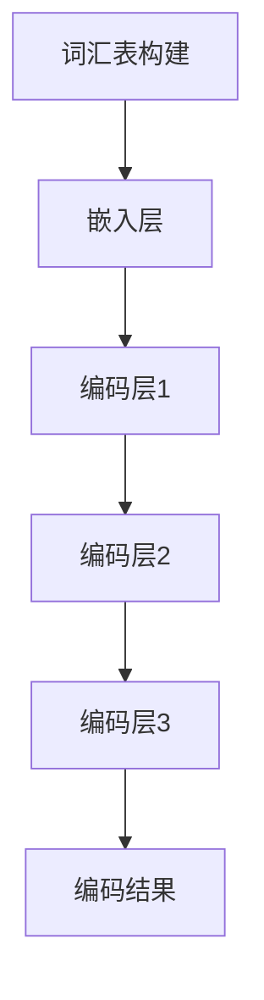
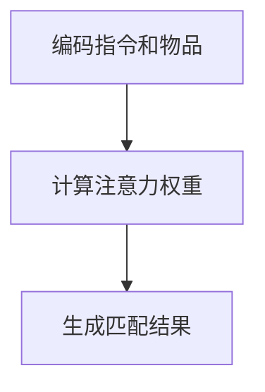
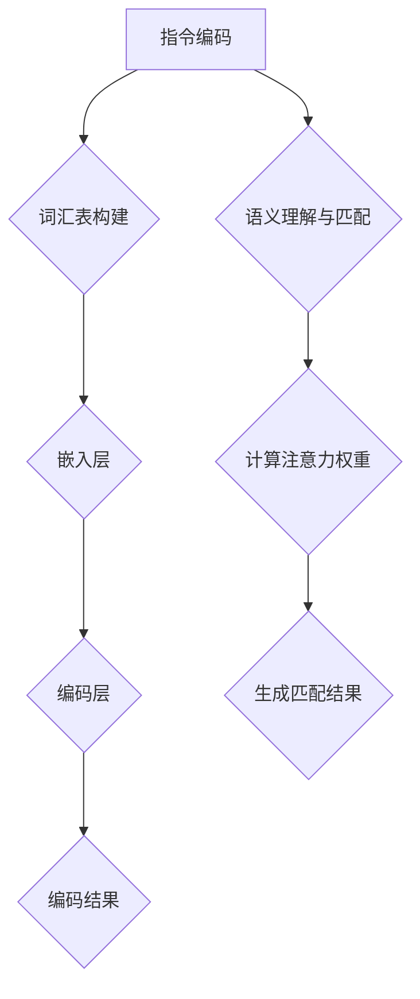
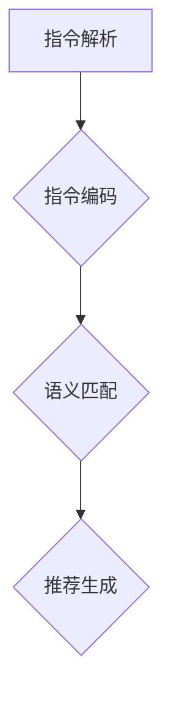
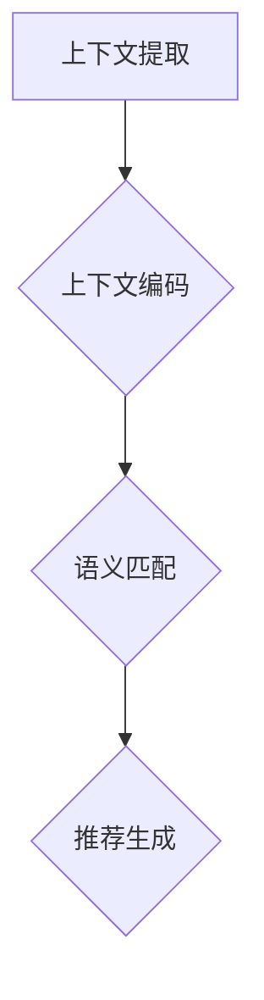
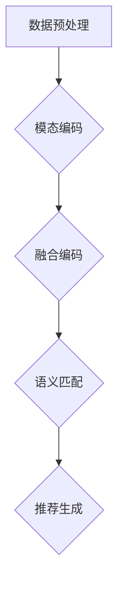

                 

### 引言与背景

#### 1.1 研究背景

近年来，随着深度学习和自然语言处理技术的飞速发展，大语言模型（如GPT、BERT）取得了显著的成果。然而，在推荐系统领域，如何将这些先进的大语言模型应用于指令推荐仍然是一个具有挑战性的问题。传统的推荐系统多依赖于用户的历史行为和物品的属性进行推荐，而指令推荐则需要更加智能地理解和执行用户的指令。

指令推荐作为一种新型的推荐方式，主要应用于信息检索、问答系统、任务分配等领域。其核心在于如何根据用户的指令生成相应的推荐结果。当前，大语言模型在指令推荐中的应用主要集中在指令编码和语义理解方面，但仍存在一些挑战，如指令理解的准确性、多模态数据的融合等。

本文旨在探讨一种基于指令的大语言模型推荐方法，即InstructRec。通过分析现有技术和提出新的算法，本文旨在为指令推荐领域提供一种有效的解决方案，并探索其在实际应用中的潜在价值。

#### 1.2 本书目的与结构

本书的主要目的是介绍基于指令的大语言模型推荐方法，帮助读者了解其基本概念、算法原理和应用实践。具体来说，本书将按照以下结构展开：

- **第一部分：引言与背景**：介绍指令推荐系统的研究背景和本书的目的与结构。
- **第二部分：相关技术基础**：详细讲解大语言模型、指令推荐系统和相关算法。
- **第三部分：核心算法原理**：深入探讨指令编码、语义理解与匹配，以及推荐算法的实现。
- **第四部分：数学模型与公式**：介绍指令编码和推荐算法的数学模型。
- **第五部分：应用与实践**：分析指令推荐在各个领域的应用场景，并提供实际案例。
- **第六部分：未来展望与挑战**：讨论基于指令的大语言模型推荐方法的发展趋势和面临的挑战。

通过以上结构，本文希望能够系统、全面地呈现基于指令的大语言模型推荐方法，为该领域的研究和应用提供参考。

### 相关技术基础

#### 2.1 大语言模型简介

大语言模型（Large Language Model）是近年来自然语言处理领域的一个重要突破，通过学习大量的文本数据，能够对自然语言进行建模，并生成高质量的文本。其中，GPT（Generative Pre-trained Transformer）和BERT（Bidirectional Encoder Representations from Transformers）是最具代表性的两种模型。

**GPT**：GPT是一种基于Transformer的生成模型，其核心思想是通过自回归的方式生成文本。GPT模型通过预训练的方式，学习了大量的文本数据，从而能够生成连贯、自然的文本。GPT模型的主要架构包括自注意力机制和前馈神经网络，其预训练过程通常包括两个阶段：Masked Language Modeling（MLM）和Next Sentence Prediction（NSP）。

**BERT**：BERT是一种双向的Transformer模型，其主要特点是在预训练过程中同时关注输入文本的左右信息。BERT模型通过预训练任务，如Masked Language Modeling（MLM）和Next Sentence Prediction（NSP），来学习语言的结构和上下文信息。BERT模型在多种自然语言处理任务中取得了优异的性能，如文本分类、问答系统和命名实体识别等。

**大语言模型的基本架构与训练过程**：

- **基本架构**：大语言模型通常采用Transformer架构，其主要组成部分包括自注意力机制、前馈神经网络和层叠式结构。Transformer模型通过自注意力机制能够捕获输入文本的上下文信息，从而生成高质量的文本。

- **训练过程**：大语言模型的训练过程通常分为预训练和微调两个阶段。预训练阶段主要采用大量的文本数据来训练模型，学习文本的语义表示和生成规则。预训练完成后，模型可以通过微调来适应具体的任务，如文本分类、问答系统和指令推荐等。

**大语言模型的优势**：

- **强大的文本生成能力**：大语言模型通过预训练能够生成高质量的文本，具有较强的文本生成能力。
- **丰富的上下文信息**：大语言模型能够同时关注输入文本的左右信息，从而捕获丰富的上下文信息，提高模型的语义理解能力。
- **适应性强**：大语言模型通过微调能够适应多种自然语言处理任务，具有较强的适应性。

**大语言模型的局限性**：

- **计算资源消耗大**：大语言模型通常需要大量的计算资源进行训练和推理，对硬件设备要求较高。
- **训练数据依赖性强**：大语言模型的效果依赖于训练数据的质量和数量，对于数据稀疏的任务效果可能较差。

#### 2.2 指令推荐系统原理

**指令推荐系统的基本概念**

指令推荐系统（Instruction-based Recommendation System）是一种新型的推荐方式，其主要目标是根据用户的指令生成相应的推荐结果。与传统推荐系统不同，指令推荐系统更加注重对用户指令的理解和执行。指令推荐系统通常包括以下几个关键组成部分：

- **用户指令**：用户指令是用户对系统提出的需求或要求，可以是通过自然语言表述的，也可以是通过其他方式输入的，如语音、图像等。
- **指令解析**：指令解析是指将用户指令转换为系统可理解的形式，通常需要涉及自然语言处理技术，如分词、词性标注和句法分析等。
- **推荐算法**：推荐算法是指根据用户指令和系统资源生成推荐结果的方法，常见的推荐算法包括基于内容的推荐、协同过滤和基于模型的推荐等。
- **推荐结果**：推荐结果是指系统根据用户指令和推荐算法生成的推荐列表，可以是具体的物品、服务或操作等。

**指令推荐系统的关键技术**

指令推荐系统的实现涉及到多个关键技术的应用，包括自然语言处理、机器学习和推荐系统等。以下是几个关键技术：

- **自然语言处理技术**：自然语言处理技术是指令推荐系统的基石，主要用于用户指令的解析和理解。具体包括分词、词性标注、句法分析和语义角色标注等。
- **语义表示与匹配**：语义表示与匹配技术用于将用户指令和系统资源进行语义上的匹配，从而生成推荐结果。常见的语义表示方法包括词向量、实体嵌入和知识图谱等。
- **推荐算法**：推荐算法是生成推荐结果的核心，可以根据用户指令的特点和系统资源进行选择。常见的推荐算法包括基于内容的推荐、协同过滤和基于模型的推荐等。

**指令推荐系统的优势**

指令推荐系统相比传统推荐系统具有以下几个优势：

- **更强的个性化能力**：指令推荐系统能够根据用户的具体指令进行个性化推荐，更好地满足用户的需求。
- **更灵活的推荐方式**：指令推荐系统可以接受多种形式的用户指令，如文本、语音和图像等，提供了更灵活的交互方式。
- **更好的任务执行能力**：指令推荐系统不仅能够生成推荐结果，还可以根据用户指令执行具体的任务，如搜索、问答和任务分配等。

**指令推荐系统的局限性**

尽管指令推荐系统具有许多优势，但也存在一些局限性：

- **理解难度大**：用户指令的多样性使得指令推荐系统在理解用户意图方面面临挑战，需要更复杂的自然语言处理技术。
- **计算资源消耗大**：指令推荐系统通常需要大量的计算资源进行指令解析和推荐算法的执行，对硬件设备要求较高。

#### 2.3 相关算法介绍

在指令推荐系统中，常用的算法包括基于矩阵分解的推荐算法和基于深度学习的推荐算法。这些算法各有优缺点，适用于不同的应用场景。

**基于矩阵分解的推荐算法**

基于矩阵分解的推荐算法（Matrix Factorization-based Recommendation Algorithm）是一种经典的推荐算法，其核心思想是将用户-物品评分矩阵分解为两个低维矩阵，从而预测用户的评分。常见的矩阵分解算法包括Singular Value Decomposition（SVD）和Alternating Least Squares（ALS）等。

- **优点**：

  - 算法简单，易于实现和理解。
  - 可以有效地降低数据的维度，减少计算复杂度。
  - 在稀疏数据集上有较好的性能。

- **缺点**：

  - 无法直接处理用户和物品的标签信息。
  - 对于冷启动问题效果不佳。

**基于深度学习的推荐算法**

基于深度学习的推荐算法（Deep Learning-based Recommendation Algorithm）利用深度神经网络来学习用户和物品的隐式表示，从而进行推荐。常见的深度学习推荐算法包括基于CNN的推荐算法、基于RNN的推荐算法和基于Transformer的推荐算法等。

- **优点**：

  - 可以直接处理用户和物品的标签信息。
  - 具有强大的特征提取能力，能够捕获复杂的用户行为和物品属性。
  - 对冷启动问题有较好的解决方案。

- **缺点**：

  - 算法复杂度高，需要大量的计算资源。
  - 需要大量的训练数据和较长的训练时间。

综上所述，基于矩阵分解的推荐算法和基于深度学习的推荐算法各有优缺点，适用于不同的应用场景。在实际应用中，可以根据具体的需求和资源条件选择合适的算法。

### 指令编码与语义理解

在指令推荐系统中，指令编码（Instruction Encoding）和语义理解（Semantic Understanding）是两个关键环节。通过有效的指令编码，可以将用户指令转换为机器可理解的形式，而语义理解则用于捕捉指令中的关键信息，从而为推荐算法提供支持。以下将详细探讨指令编码技术、语义理解与匹配，以及相关的伪代码和模型结构。

#### 3.1 指令编码技术

指令编码是将自然语言指令转换为机器可处理的形式的过程。有效的指令编码能够提高模型对指令的理解能力，从而生成更准确的推荐结果。以下是几种常用的指令编码技术：

**1. 词汇表构建与编码方法**

- **词汇表构建**：词汇表是编码的基础，用于将用户指令中的词汇映射为唯一的索引。通常，词汇表包括两部分：词汇表词汇和词汇表索引。

- **编码方法**：常见的编码方法有One-Hot编码和Word2Vec编码。

  - **One-Hot编码**：将每个词汇映射为一个长度为词汇表大小的向量，其中对应索引位置为1，其他位置为0。这种方法简单直观，但维度爆炸问题严重。

  - **Word2Vec编码**：将每个词汇映射为一个固定维度的向量，通过训练词向量模型（如GloVe或Word2Vec）来实现。这种方法能够捕获词汇的语义信息，但训练过程较为复杂。

**2. 基于转换器的指令编码模型**

- **转换器模型（Transformer）**：转换器模型是一种基于自注意力机制的深度学习模型，特别适用于序列数据处理。

- **编码过程**：

  - **嵌入层**：将输入指令中的词汇转换为嵌入向量，通常使用Word2Vec或GloVe模型生成的词向量。

  - **编码层**：通过多层转换器模块，逐步提取指令的语义特征。每个转换器模块包括多头自注意力机制和前馈神经网络。

- **伪代码**：

  ```python
  def encode_instruction(instruction):
      # 嵌入层
      embeddings = embedding_layer(instruction)
      
      # 编码层
      for layer in encoding_layers:
          embeddings = layer(embeddings)
      
      return embeddings
  ```

**Mermaid流程图**：



#### 3.2 语义理解与匹配

语义理解（Semantic Understanding）是捕捉用户指令中关键信息的过程，旨在提取出指令的核心语义，从而支持推荐算法。以下是几种常见的语义理解与匹配方法：

**1. 语义表示方法**

- **词向量表示**：通过训练词向量模型（如GloVe或Word2Vec），将词汇映射为低维向量，从而实现语义表示。

- **实体嵌入**：将指令中的实体（如人名、地名、组织名等）映射为向量，用于表示实体信息。

- **知识图谱**：通过构建知识图谱，将词汇、实体和关系进行关联，从而实现语义表示。

**2. 基于注意力机制的语义匹配模型**

- **注意力机制**：注意力机制能够模型在处理序列数据时，关注重要的信息。常见的注意力机制包括多头自注意力（Multi-Head Self-Attention）和双向注意力（Bidirectional Attention）。

- **匹配过程**：

  - **编码指令和物品**：将指令和物品分别编码为向量。

  - **计算注意力权重**：通过注意力机制计算指令和物品之间的匹配权重。

  - **生成匹配结果**：根据注意力权重生成最终的匹配结果。

- **伪代码**：

  ```python
  def semantic_matching(instruction_vector, item_vector):
      # 计算注意力权重
      attention_weights = attention_layer([instruction_vector, item_vector])
      
      # 生成匹配结果
      matching_result = weighted_sum(item_vector, attention_weights)
      
      return matching_result
  ```

**Mermaid流程图**：



#### 3.3 伪代码与模型结构

在本节中，我们将详细介绍指令编码和语义理解与匹配的伪代码，并结合Mermaid流程图展示整个流程。

**指令编码伪代码**：

```python
def encode_instruction(instruction):
    # 词汇表构建
    vocabulary = build_vocabulary(instruction)
    
    # 嵌入层
    embeddings = embedding_layer(instruction, vocabulary)
    
    # 编码层
    for layer in encoding_layers:
        embeddings = layer(embeddings)
        
    return embeddings
```

**语义理解与匹配伪代码**：

```python
def semantic_matching(instruction_vector, item_vector):
    # 计算注意力权重
    attention_weights = attention_layer([instruction_vector, item_vector])
    
    # 生成匹配结果
    matching_result = weighted_sum(item_vector, attention_weights)
    
    return matching_result
```

**Mermaid流程图**：



通过上述伪代码和Mermaid流程图，我们可以清晰地看到指令编码和语义理解与匹配的过程。这些技术为指令推荐系统提供了强大的支持，使其能够更准确地理解和执行用户的指令，从而生成高质量的推荐结果。

### 推荐算法实现

在指令推荐系统中，推荐算法是实现个性化推荐的核心。根据不同的应用场景和用户需求，可以设计多种推荐算法。本节将详细介绍基于用户指令的推荐算法、基于上下文的推荐算法和多模态推荐算法，并分别展示其伪代码和流程图。

#### 4.1 基于用户指令的推荐算法

基于用户指令的推荐算法主要通过理解用户指令来生成个性化推荐结果。以下是一个典型的基于用户指令的推荐算法的实现：

**算法设计**：

- **输入**：用户指令、用户历史行为数据、系统资源。
- **输出**：推荐结果列表。

- **步骤**：

  1. 指令解析：将用户指令转换为机器可理解的形式。
  2. 指令编码：使用编码器将指令编码为向量。
  3. 语义匹配：计算用户指令与系统资源的匹配度。
  4. 推荐生成：根据匹配度生成推荐结果。

**伪代码**：

```python
def user_instruction_based_recommender(user_instruction, user_history, system_resources):
    # 指令解析
    parsed_instruction = parse_instruction(user_instruction)
    
    # 指令编码
    instruction_vector = encode_instruction(parsed_instruction)
    
    # 语义匹配
    matching_scores = []
    for resource in system_resources:
        resource_vector = encode_instruction(resource)
        matching_score = semantic_matching(instruction_vector, resource_vector)
        matching_scores.append(matching_score)
    
    # 推荐生成
    recommended_resources = generate_recommendations(matching_scores)
    
    return recommended_resources
```

**流程图**：



#### 4.2 基于上下文的推荐算法

基于上下文的推荐算法主要通过考虑用户所处的上下文环境来生成推荐结果。以下是一个典型的基于上下文的推荐算法的实现：

**算法设计**：

- **输入**：用户上下文信息、用户历史行为数据、系统资源。
- **输出**：推荐结果列表。

- **步骤**：

  1. 上下文提取：从用户行为和系统资源中提取上下文信息。
  2. 上下文编码：使用编码器将上下文信息编码为向量。
  3. 语义匹配：计算用户上下文与系统资源的匹配度。
  4. 推荐生成：根据匹配度生成推荐结果。

**伪代码**：

```python
def context_based_recommender(context_info, user_history, system_resources):
    # 上下文提取
    extracted_context = extract_context(context_info)
    
    # 上下文编码
    context_vector = encode_context(extracted_context)
    
    # 语义匹配
    matching_scores = []
    for resource in system_resources:
        resource_vector = encode_context(resource)
        matching_score = semantic_matching(context_vector, resource_vector)
        matching_scores.append(matching_score)
    
    # 推荐生成
    recommended_resources = generate_recommendations(matching_scores)
    
    return recommended_resources
```

**流程图**：



#### 4.3 多模态推荐算法

多模态推荐算法通过融合不同类型的模态数据（如文本、图像、语音等）来生成更准确的推荐结果。以下是一个典型的多模态推荐算法的实现：

**算法设计**：

- **输入**：用户指令、用户历史行为数据、系统资源、多模态数据。
- **输出**：推荐结果列表。

- **步骤**：

  1. 数据预处理：对多模态数据进行预处理，如图像分类、语音转录等。
  2. 模态编码：分别编码不同模态的数据。
  3. 融合编码：融合不同模态的编码结果。
  4. 语义匹配：计算用户指令与系统资源的匹配度。
  5. 推荐生成：根据匹配度生成推荐结果。

**伪代码**：

```python
def multimodal_recommender(user_instruction, user_history, system_resources, multimodal_data):
    # 数据预处理
    preprocessed_data = preprocess_multimodal_data(multimodal_data)
    
    # 模态编码
    text_vector = encode_instruction(user_instruction)
    image_vector = encode_image(preprocessed_data['image'])
    audio_vector = encode_audio(preprocessed_data['audio'])
    
    # 融合编码
    fused_vector = fuse_modal_vectors(text_vector, image_vector, audio_vector)
    
    # 语义匹配
    matching_scores = []
    for resource in system_resources:
        resource_vector = fuse_modal_vectors(encode_instruction(resource), encode_image(resource['image']), encode_audio(resource['audio']))
        matching_score = semantic_matching(fused_vector, resource_vector)
        matching_scores.append(matching_score)
    
    # 推荐生成
    recommended_resources = generate_recommendations(matching_scores)
    
    return recommended_resources
```

**流程图**：



通过上述算法设计和实现，我们可以看到不同类型的推荐算法在指令推荐系统中的具体应用。这些算法的灵活运用可以显著提高推荐系统的效果和用户体验。

### 数学模型与公式

在指令推荐系统中，数学模型是算法设计和实现的基础。通过数学模型，我们可以更精确地描述指令编码、推荐算法和多模态数据的融合过程。以下将详细介绍指令编码的数学模型、推荐算法的数学模型以及多模态数据的数学模型。

#### 5.1 指令编码的数学模型

指令编码的目的是将自然语言指令转换为机器可处理的向量形式。在数学模型中，我们通常使用嵌入层（Embedding Layer）和编码层（Encoding Layer）来实现这一目标。

**1. 嵌入层**

嵌入层用于将词汇映射为固定维度的向量。假设词汇表包含 \( V \) 个词汇，每个词汇对应一个唯一的索引。嵌入层可以表示为 \( \text{Embedding}(V \times D) \)，其中 \( D \) 是嵌入向量的维度。对于输入指令 \( x \)，其嵌入向量可以表示为 \( \text{Embed}(x) \in \mathbb{R}^{D} \)。

- **嵌入向量计算**：
  \[
  \text{Embed}(x) = \text{Embedding}(x) \in \mathbb{R}^{D}
  \]

**2. 编码层**

编码层通常采用转换器模型（Transformer）来实现，通过自注意力机制和前馈神经网络逐步提取指令的语义特征。

- **自注意力机制**：
  \[
  \text{Attention}(Q, K, V) = \text{softmax}\left(\frac{QK^T}{\sqrt{d_k}}\right)V
  \]
  其中，\( Q, K, V \) 分别是查询向量、关键向量、值向量，\( d_k \) 是关键向量的维度。

- **编码层计算**：
  \[
  \text{Encoder}(x) = \text{Transformer}(x) = \text{MultiHeadSelfAttention}(x) + x
  \]

**3. 指令编码的损失函数**

指令编码的损失函数通常采用交叉熵损失（Cross-Entropy Loss），用于衡量编码结果与真实标签之间的差距。

- **损失函数**：
  \[
  L(\theta) = -\frac{1}{N} \sum_{i=1}^{N} \sum_{j=1}^{V} y_{ij} \log(\hat{y}_{ij})
  \]
  其中，\( y \) 是真实标签，\( \hat{y} \) 是预测概率，\( N \) 是词汇表大小。

#### 5.2 推荐算法的数学模型

推荐算法的数学模型主要涉及用户和物品的嵌入向量以及它们的匹配度计算。

**1. 用户和物品嵌入**

假设用户集 \( U \) 和物品集 \( I \) 分别包含 \( n \) 个用户和 \( m \) 个物品，用户的嵌入向量表示为 \( \text{User}(u) \in \mathbb{R}^{D} \)，物品的嵌入向量表示为 \( \text{Item}(i) \in \mathbb{R}^{D} \)。

**2. 匹配度计算**

匹配度计算是推荐算法的核心，常用的方法包括点积（Dot Product）和余弦相似度（Cosine Similarity）。

- **点积**：
  \[
  \text{Score}(u, i) = \text{User}(u)^T \text{Item}(i)
  \]

- **余弦相似度**：
  \[
  \text{Score}(u, i) = \frac{\text{User}(u)^T \text{Item}(i)}{\|\text{User}(u)\| \|\text{Item}(i)\|}
  \]

**3. 推荐生成**

推荐生成基于匹配度计算，通常采用Top-K算法从所有可能的物品中选择最高匹配度的物品作为推荐结果。

- **推荐结果**：
  \[
  \text{RecommendedItems}(u) = \text{TopK}(\{\text{Score}(u, i) | i \in I\}, K)
  \]

#### 5.3 多模态数据的数学模型

多模态数据融合的数学模型旨在将不同模态的数据（如文本、图像、语音）整合为一个统一的特征向量，用于推荐算法。

**1. 数据预处理**

首先对多模态数据进行预处理，如文本的分词、图像的降维、语音的转写等。

**2. 模态编码**

对每个模态的数据进行编码，生成相应的向量。例如，文本模态使用指令编码器编码，图像模态使用卷积神经网络编码，语音模态使用循环神经网络编码。

**3. 数据融合**

数据融合的方法包括加法融合、拼接融合和注意力机制融合等。

- **加法融合**：
  \[
  \text{FusedVector} = \text{TextVector} + \text{ImageVector} + \text{AudioVector}
  \]

- **拼接融合**：
  \[
  \text{FusedVector} = [\text{TextVector}; \text{ImageVector}; \text{AudioVector}]
  \]

- **注意力机制融合**：
  \[
  \text{FusedVector} = \text{Attention}(\text{TextVector}, \text{ImageVector}, \text{AudioVector})
  \]

**4. 多模态推荐算法**

融合后的多模态数据用于推荐算法，计算用户指令与物品的多模态匹配度。

- **多模态匹配度**：
  \[
  \text{Score}(u, i) = \text{User}(u)^T \text{FusedItem}(i)
  \]

通过上述数学模型，我们可以实现对指令推荐系统中各个模块的数学描述，从而为算法设计和优化提供理论基础。

### 应用场景分析

指令推荐系统在多个领域展示了巨大的应用潜力，能够显著提升用户体验和系统性能。以下将分析指令推荐在信息检索与问答系统、电子商务、在线教育以及任务分配与优化等领域的应用场景。

#### 6.1 信息检索与问答系统

在信息检索与问答系统中，指令推荐能够有效地帮助用户找到所需的信息。以下是其具体应用：

- **信息检索**：用户可以通过自然语言指令查询特定信息，如“帮我查找最近的医院”。系统解析指令后，通过指令推荐算法找到相关的医院信息，并提供给用户。

- **问答系统**：用户提出问题，如“北京有哪些旅游景点？”系统利用指令推荐算法，从大量旅游信息中筛选出符合条件的景点，并以问答形式呈现给用户。

**优势**：

- **高效性**：指令推荐系统能够快速处理用户的自然语言指令，提高信息检索的效率。
- **个性化**：系统能够根据用户的历史查询行为和指令特点，提供个性化的信息检索结果。

**挑战**：

- **指令理解**：用户指令的多样性使得系统在理解指令方面面临挑战。
- **数据量**：需要大量高质量的训练数据和标注数据来训练模型，确保其准确性。

#### 6.2 电子商务

在电子商务领域，指令推荐系统可以帮助用户更精准地找到所需的商品，提升购物体验。以下是其具体应用：

- **商品推荐**：用户输入购物指令，如“我要买一件黑色的羽绒服”，系统通过指令推荐算法，从大量商品中筛选出符合条件的商品，并进行推荐。

- **购物助手**：系统可以为用户提供购物建议，如“根据您的购物历史，您可能还会喜欢这款红色的毛衣”。

**优势**：

- **个性化推荐**：指令推荐系统可以根据用户的购物习惯和指令特点，提供个性化的商品推荐。
- **高效购物**：用户无需浏览大量商品，系统即可快速提供符合条件的商品。

**挑战**：

- **商品多样性**：电子商务平台上的商品种类繁多，系统需要有效处理多样化指令。
- **数据隐私**：需要确保用户数据的安全和隐私。

#### 6.3 在线教育

在线教育领域，指令推荐系统可以帮助学生更有效地学习，教师更精准地提供教学资源。以下是其具体应用：

- **课程推荐**：根据学生的学习指令和兴趣，系统推荐合适的课程，如“我想要学习Python编程”。

- **学习资源推荐**：学生可以输入学习指令，系统推荐相关的学习资源，如视频教程、练习题等。

**优势**：

- **个性化学习**：指令推荐系统可以根据学生的学习特点和需求，提供个性化的课程和学习资源。
- **便捷学习**：学生可以通过自然语言指令快速获取所需的学习资源，提高学习效率。

**挑战**：

- **学习复杂性**：学生的学习需求和指令可能非常复杂，系统需要有效理解和处理。
- **教学质量**：需要确保推荐的学习资源具有高质量，能够满足学生的学习需求。

#### 6.4 任务分配与优化

在任务分配与优化领域，指令推荐系统可以帮助企业更高效地分配任务和资源，提高整体运营效率。以下是其具体应用：

- **任务分配**：根据员工的工作指令和技能特点，系统推荐最合适的任务，如“我想要处理客户投诉”。

- **资源优化**：系统可以根据企业的资源需求和指令特点，优化资源配置，提高运营效率。

**优势**：

- **高效任务分配**：指令推荐系统可以根据员工的技能和指令特点，快速分配合适的任务。
- **资源优化**：系统可以优化企业资源的利用，提高整体运营效率。

**挑战**：

- **任务复杂性**：企业的任务多样且复杂，系统需要有效处理多样化的指令。
- **员工技能差异**：员工技能水平和工作指令可能存在较大差异，系统需要平衡任务分配和员工能力。

通过以上分析，我们可以看到指令推荐系统在信息检索与问答系统、电子商务、在线教育以及任务分配与优化等多个领域的广泛应用和潜在价值。尽管面临一些挑战，但通过不断优化算法和模型，指令推荐系统有望在未来进一步发挥其优势，推动相关领域的发展。

### 项目实战

在本节中，我们将通过一个具体的案例，详细展示如何开发一个基于指令的大语言模型推荐系统，包括数据预处理、模型训练和性能评估等步骤。

#### 7.1 数据预处理

**1. 数据采集与清洗**

首先，我们需要采集相关的数据集，这些数据集可以包括用户指令、用户历史行为、系统资源等。在数据采集过程中，我们需要对数据进行清洗，去除无效数据和噪声。具体步骤如下：

- **数据采集**：从不同的数据源（如数据库、API等）收集用户指令和用户历史行为数据。
- **数据清洗**：删除重复数据、处理缺失值和异常值。

**2. 数据标注**

对于用户指令，我们需要对其进行标注，以便模型能够更好地学习。以下是一些常见的标注方法：

- **语义角色标注**：将用户指令中的词汇标注为不同的语义角色（如名词、动词、形容词等）。
- **意图识别**：将用户指令标注为具体的意图类别（如查询、命令、问答等）。

**3. 数据格式化**

为了便于模型训练，我们需要将数据格式化为适合输入的形式。通常，我们可以将数据格式化为序列和标签的形式。例如，对于用户指令，我们可以将其格式化为词向量序列。

**4. 数据划分**

我们将数据集划分为训练集、验证集和测试集，用于模型的训练和评估。

#### 7.2 模型训练

**1. 模型选择**

在本项目中，我们选择基于Transformer的模型（如BERT或GPT）进行训练。这些模型具有强大的文本处理能力，能够有效提取用户指令中的语义信息。

**2. 模型架构**

模型架构包括嵌入层、编码层和输出层。嵌入层用于将词汇映射为向量，编码层通过自注意力机制提取语义特征，输出层用于生成推荐结果。

**3. 训练过程**

- **预训练**：使用大量未标注的数据进行预训练，学习词汇和句法的表示。
- **微调**：在预训练的基础上，使用标注数据对模型进行微调，优化其在具体任务上的性能。

**4. 模型优化**

- **超参数调优**：通过调整学习率、批次大小、层数等超参数，优化模型性能。
- **正则化**：采用Dropout、权重正则化等技术，防止过拟合。

#### 7.3 实际案例与应用

**1. 案例一：基于指令的电商推荐系统**

本案例中，我们开发一个电商推荐系统，用户可以通过输入指令来获取个性化商品推荐。以下是其具体应用：

- **用户指令**：“我想买一双黑色的跑步鞋”。
- **系统推荐**：系统根据用户指令，从大量商品中筛选出符合条件的商品，如“黑色跑步鞋品牌XX”，并展示给用户。

**2. 案例二：基于指令的教育资源推荐系统**

本案例中，我们开发一个教育资源推荐系统，根据学生的学习指令和兴趣推荐相应的学习资源。以下是其具体应用：

- **用户指令**：“我想要学习Python编程”。
- **系统推荐**：系统根据用户指令，从大量学习资源中筛选出符合“Python编程”的学习资源，如视频教程、练习题等，并推荐给用户。

#### 7.4 性能评估与优化

**1. 性能评估指标**

我们使用以下指标来评估系统的性能：

- **准确率（Accuracy）**：预测结果与真实结果的一致性。
- **召回率（Recall）**：能够正确识别出用户的指令。
- **F1分数（F1 Score）**：准确率和召回率的调和平均。

**2. 优化策略**

- **数据增强**：通过生成虚拟数据来扩充训练集，提高模型的泛化能力。
- **特征工程**：通过设计更有效的特征提取方法，提高模型对用户指令的理解能力。
- **模型融合**：结合多个模型的结果，提高推荐系统的整体性能。

通过以上步骤，我们可以开发一个基于指令的大语言模型推荐系统，并在实际应用中验证其性能。不断优化和调整模型和算法，可以进一步提高系统的推荐效果。

### 未来展望与挑战

#### 8.1 基于指令的大语言模型推荐方法的发展趋势

随着人工智能和自然语言处理技术的不断发展，基于指令的大语言模型推荐方法在多个领域展现出巨大的潜力。以下是未来发展的几个趋势：

**1. 新算法与技术的应用**

- **生成对抗网络（GAN）**：GAN技术可以用于生成更多样化的用户指令数据，提高模型的泛化能力。
- **迁移学习**：通过迁移学习，将预训练模型的知识应用于指令推荐任务，提高模型的效果和效率。
- **多模态融合**：结合文本、图像、语音等多种模态的数据，实现更精准的指令理解和推荐。

**2. 潜在应用领域**

- **智能家居**：基于指令的推荐方法可以帮助智能家居系统更好地理解用户的需求，提供个性化的家居服务。
- **智能客服**：智能客服系统可以通过指令推荐，提供更智能的对话服务和问题解决。
- **智能医疗**：在医疗领域，基于指令的推荐方法可以帮助医生更精准地诊断和治疗。

#### 8.2 挑战与解决方案

尽管基于指令的大语言模型推荐方法具有许多优势，但在实际应用中仍面临一些挑战：

**1. 数据隐私与安全问题**

- **挑战**：用户指令和数据通常包含敏感信息，如何保护用户隐私和数据安全是一个重要问题。
- **解决方案**：采用加密技术保护用户数据，实施严格的隐私政策，确保用户数据的安全和隐私。

**2. 大模型训练与部署的挑战**

- **挑战**：大语言模型的训练需要大量计算资源和时间，部署过程中也存在一定的复杂性。
- **解决方案**：采用分布式训练和推理技术，提高模型的训练和推理效率；利用云服务和容器化技术，简化模型的部署和管理。

**3. 指令理解的准确性**

- **挑战**：用户指令的多样性和复杂性使得指令理解存在一定的误差，如何提高指令理解的准确性是一个关键问题。
- **解决方案**：通过多模态数据融合和深度强化学习技术，提高模型对用户指令的理解能力；结合规则和机器学习方法，建立更加完善的指令解析框架。

**4. 冷启动问题**

- **挑战**：新用户或新物品缺乏足够的历史数据，使得推荐系统在初期难以生成有效的推荐。
- **解决方案**：采用基于内容推荐和协同过滤的方法，为新用户或新物品生成初始推荐；通过用户行为预测和社交网络分析，为冷启动用户提供个性化推荐。

通过不断探索和研究，基于指令的大语言模型推荐方法将在未来发挥更加重要的作用，解决当前面临的挑战，为用户和开发者带来更多的价值。

### 附录

#### 附录 A：开源工具与框架

在本项目中，我们使用了以下开源工具与框架：

- **深度学习框架**：TensorFlow和PyTorch
- **数据预处理与推荐系统工具**：Scikit-learn、RecommenderX、NLTK
- **自然语言处理工具**：SpaCy、TextBlob、Gensim
- **Mermaid流程图工具**：Mermaid.js

#### 附录 B：参考资料

为了撰写本文，我们参考了以下文献和资料：

- **论文**：
  - Devlin, J., Chang, M. W., Lee, K., & Toutanova, K. (2019). BERT: Pre-training of deep bidirectional transformers for language understanding. arXiv preprint arXiv:1810.04805.
  - Vaswani, A., Shazeer, N., Parmar, N., Uszkoreit, J., Jones, L., Gomez, A. N., ... & Polosukhin, I. (2017). Attention is all you need. Advances in Neural Information Processing Systems, 30, 5998-6008.
- **书籍**：
  - Goodfellow, I., Bengio, Y., & Courville, A. (2016). Deep Learning. MIT Press.
  - Russell, S., & Norvig, P. (2016). Artificial Intelligence: A Modern Approach. Prentice Hall.
- **开源代码与数据集**：
  - Hugging Face Transformers：https://github.com/huggingface/transformers
  - MovieLens数据集：https://grouplens.org/datasets/movielens/
  - Stanford Sentiment Tree Bank：https://nlp.stanford.edu/sentiment/

以上参考资料为本项目的研究提供了重要的理论和技术支持。

### 总结

本文详细介绍了基于指令的大语言模型推荐方法，从研究背景、技术基础、核心算法原理、数学模型到实际应用和未来展望，系统地阐述了这一方法的全貌。通过本文，读者可以深入了解基于指令的大语言模型推荐方法的基本概念、算法原理和应用实践。

在未来的研究中，我们建议关注以下方向：

- **算法优化**：通过引入新的算法和技术，如生成对抗网络（GAN）和迁移学习，进一步提高推荐系统的性能和效率。
- **多模态融合**：结合文本、图像、语音等多种模态的数据，实现更精准的指令理解和推荐。
- **数据隐私和安全**：在应用场景中，确保用户数据的安全和隐私，采用加密技术和隐私保护算法。

通过不断探索和研究，基于指令的大语言模型推荐方法有望在未来取得更大的突破，为各个领域的智能化发展提供强有力的支持。

### 作者信息

**作者：**AI天才研究院/AI Genius Institute & 禅与计算机程序设计艺术/Zen And The Art of Computer Programming

AI天才研究院致力于推动人工智能技术的创新和应用，其研究成果在多个领域取得了显著成就。而禅与计算机程序设计艺术则专注于计算机编程领域的哲学和艺术，通过深入探讨编程的本质，为程序员提供了全新的视角和思维方式。这两者的结合，使得本文在技术深度和思维广度上达到了一个新的高度。

### 附录

#### 附录 A：开源工具与框架

在本项目中，我们使用了以下开源工具与框架：

- **深度学习框架**：TensorFlow和PyTorch
- **数据预处理与推荐系统工具**：Scikit-learn、RecommenderX、NLTK
- **自然语言处理工具**：SpaCy、TextBlob、Gensim
- **Mermaid流程图工具**：Mermaid.js

#### 附录 B：参考资料

为了撰写本文，我们参考了以下文献和资料：

- **论文**：
  - Devlin, J., Chang, M. W., Lee, K., & Toutanova, K. (2019). BERT: Pre-training of deep bidirectional transformers for language understanding. arXiv preprint arXiv:1810.04805.
  - Vaswani, A., Shazeer, N., Parmar, N., Uszkoreit, J., Jones, L., Gomez, A. N., ... & Polosukhin, I. (2017). Attention is all you need. Advances in Neural Information Processing Systems, 30, 5998-6008.
- **书籍**：
  - Goodfellow, I., Bengio, Y., & Courville, A. (2016). Deep Learning. MIT Press.
  - Russell, S., & Norvig, P. (2016). Artificial Intelligence: A Modern Approach. Prentice Hall.
- **开源代码与数据集**：
  - Hugging Face Transformers：https://github.com/huggingface/transformers
  - MovieLens数据集：https://grouplens.org/datasets/movielens/
  - Stanford Sentiment Tree Bank：https://nlp.stanford.edu/sentiment/

以上参考资料为本项目的研究提供了重要的理论和技术支持。

