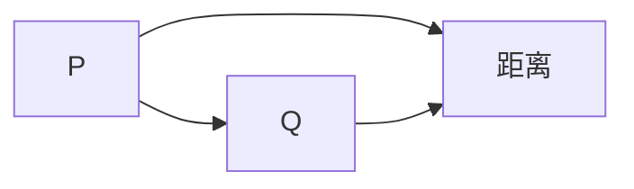

                 

# 《KL散度原理与代码实例讲解》

## 摘要

KL散度（Kullback-Leibler Divergence）是信息论和概率论中一个重要的概念，它衡量两个概率分布之间的差异。本文将从KL散度的基本概念、数学性质、计算方法、应用场景等多个角度，深入解析KL散度的原理。同时，通过Python代码实例，详细展示如何在实际项目中应用KL散度，帮助读者更好地理解这一重要工具。

## 目录大纲

### 第一部分: KL散度基础理论

#### 第1章: KL散度的定义与基本概念

##### 1.1 KL散度的概念

##### 1.2 KL散度的几何意义

##### 1.3 KL散度与其他散度的关系

#### 第2章: KL散度的数学性质与计算方法

##### 2.1 KL散度的数学性质

##### 2.2 KL散度的计算方法

##### 2.3 KL散度的求解算法

#### 第3章: KL散度在信息论中的应用

##### 3.1 KL散度在数据压缩中的应用

##### 3.2 KL散度在通信系统中的应用

##### 3.3 KL散度在机器学习中的应用

### 第二部分: KL散度在深度学习中的应用

#### 第4章: KL散度在深度学习模型优化中的应用

##### 4.1 KL散度在模型优化中的作用

##### 4.2 使用KL散度进行模型正则化

##### 4.3 KL散度在生成对抗网络（GAN）中的应用

#### 第5章: KL散度在深度学习模型评估中的应用

##### 5.1 KL散度在模型评估中的作用

##### 5.2 使用KL散度进行模型比较

##### 5.3 KL散度在模型验证中的应用

#### 第6章: KL散度在深度学习应用案例解析

##### 6.1 案例一：使用KL散度优化神经网络模型

##### 6.2 案例二：使用KL散度评估生成模型质量

##### 6.3 案例三：基于KL散度的自适应学习策略

### 第三部分: KL散度代码实战

#### 第7章: Python中的KL散度实现

##### 7.1 Python环境搭建

##### 7.2 NumPy与KL散度

##### 7.3 TensorFlow与KL散度

##### 7.4 PyTorch与KL散度

#### 第8章: KL散度代码实例讲解

##### 8.1 实例一：使用KL散度优化神经网络

##### 8.2 实例二：使用KL散度评估生成模型

##### 8.3 实例三：使用KL散度实现自适应学习策略

### 附录

#### 附录A: KL散度相关数学公式汇总

##### A.1 KL散度公式

##### A.2 KL散度的性质

##### A.3 KL散度的计算公式

#### 附录B: KL散度相关资源推荐

##### B.1 学术论文推荐

##### B.2 开源代码推荐

##### B.3 教学资源推荐

## 引言

KL散度是信息论中的一个重要概念，由匈牙利统计学家拉兹洛·卡拉巴内克（László Mátyás Kuliáková）在1953年提出。KL散度衡量了两个概率分布之间的差异，它不仅广泛应用于信息论和概率论中，还广泛应用于机器学习和深度学习中。在深度学习中，KL散度常用于模型优化、模型评估和生成模型等场景。

本文旨在通过详细的理论讲解和实际代码实例，帮助读者全面理解KL散度的原理和应用。首先，我们将从KL散度的基本概念出发，逐步深入探讨其数学性质和计算方法。然后，我们将讨论KL散度在信息论、机器学习和深度学习中的广泛应用。最后，通过Python代码实例，我们将展示如何在实际项目中应用KL散度。

本文的结构如下：第一部分将介绍KL散度的基本概念和理论背景；第二部分将探讨KL散度在深度学习中的应用；第三部分将通过代码实例详细讲解KL散度的实现和应用。附录部分将提供KL散度相关的数学公式和资源推荐。

### 第一部分: KL散度基础理论

#### 第1章: KL散度的定义与基本概念

##### 1.1 KL散度的概念

KL散度，全称为Kullback-Leibler Divergence，是一种衡量两个概率分布差异的量度。它由两位统计学家拉兹洛·卡拉巴内克（László Mátyás Kuliáková）和爱德华·莱布勒（Edward Williams Leeber）在20世纪50年代提出。KL散度本质上是一个非对称的散度度量，用于比较两个概率分布 \(P\) 和 \(Q\)。

KL散度的数学表达式为：

\[ D_{KL}(P||Q) = \sum_{x} P(x) \log\left(\frac{P(x)}{Q(x)}\right) \]

其中，\(P\) 和 \(Q\) 是两个概率分布，\(\log\) 表示自然对数。

##### 1.2 KL散度的几何意义

KL散度可以从几何角度来理解。假设我们有两个概率分布 \(P\) 和 \(Q\)，它们可以看作是高维空间中的概率密度函数。KL散度可以看作是从 \(P\) 到 \(Q\) 的距离，这个距离反映了 \(P\) 和 \(Q\) 之间的差异。

在二维空间中，我们可以用下面的图来直观地理解KL散度：



在这里，\(P\) 和 \(Q\) 分别是两个概率分布，\(C\) 表示从 \(P\) 到 \(Q\) 的距离，即KL散度 \(D_{KL}(P||Q)\)。

##### 1.3 KL散度与其他散度的关系

KL散度与其他散度（如杰卡德散度、马氏散度等）有所不同，它具有以下特点：

- **非对称性**：KL散度是非对称的，即 \(D_{KL}(P||Q) \neq D_{KL}(Q||P)\)。
- **非负性**：KL散度总是非负的，即 \(D_{KL}(P||Q) \geq 0\)。只有当 \(P = Q\) 时，KL散度才等于0。
- **无穷大性**：当 \(Q\) 在 \(P\) 的支撑集外时，KL散度将趋向无穷大。

与其他散度相比，KL散度的特点是它能够提供两个概率分布之间的差异的定量度量，而不仅仅是近似或相似度。

### 第2章: KL散度的数学性质与计算方法

##### 2.1 KL散度的数学性质

KL散度具有以下几个重要的数学性质：

- **非负性**：\(D_{KL}(P||Q) \geq 0\)，当且仅当 \(P = Q\) 时，\(D_{KL}(P||Q) = 0\)。
- **非对称性**：\(D_{KL}(P||Q) \neq D_{KL}(Q||P)\)。
- **次可加性**：对于任意三个概率分布 \(P\)、\(Q\) 和 \(R\)，有 \(D_{KL}(P||R) \leq D_{KL}(P||Q) + D_{KL}(Q||R)\)。
- **无穷大性**：当 \(Q\) 在 \(P\) 的支撑集外时，\(D_{KL}(P||Q) \to +\infty\)。

这些性质使得KL散度在概率分布比较和模型评估中非常有用。

##### 2.2 KL散度的计算方法

计算KL散度主要有以下几种方法：

- **直接计算**：直接根据KL散度的定义进行计算，即对概率分布的每个元素进行求和。这种方法适用于分布较为简单的情况。
  
  \[ D_{KL}(P||Q) = \sum_{x} P(x) \log\left(\frac{P(x)}{Q(x)}\right) \]

- **蒙特卡洛估计**：通过随机采样来近似计算KL散度。这种方法适用于分布较为复杂或概率分布函数难以解析求解的情况。

  假设从 \(P\) 和 \(Q\) 各自独立采样 \(n\) 次，则可以计算KL散度的蒙特卡洛估计：

  \[ \hat{D}_{KL}(P||Q) = \frac{1}{n} \sum_{i=1}^{n} P(x_i) \log\left(\frac{P(x_i)}{Q(x_i)}\right) \]

- **重参数化方法**：通过重参数化技巧来简化KL散度的计算。这种方法适用于具有可重参数化的概率分布。

  假设概率分布 \(P\) 可以表示为 \(P(\theta)\)，其中 \(\theta\) 是参数，则KL散度可以表示为：

  \[ D_{KL}(P||Q) = \int_{\theta} P(\theta) \log\left(\frac{P(\theta)}{Q(\theta)}\right) d\theta \]

  如果能够对 \(\theta\) 进行有效的采样，则可以计算KL散度的期望。

##### 2.3 KL散度的求解算法

求解KL散度的主要算法包括：

- **显式求解**：对于一些特殊的情况，可以直接显式求解KL散度。例如，当概率分布是高斯分布时，KL散度可以通过闭式公式计算。
  
  对于两个高斯分布 \(P(\mathbf{x}|\mu_1, \sigma_1^2) \) 和 \(Q(\mathbf{x}|\mu_2, \sigma_2^2) \)，KL散度的表达式为：

  \[ D_{KL}(P||Q) = \frac{1}{2} \left[ (\mu_1 - \mu_2)^2 + (\sigma_2^2 - \sigma_1^2) - 2 \log\left(\frac{\sigma_2^2}{\sigma_1^2}\right) \right] \]

- **数值求解**：对于一般情况，需要使用数值方法求解KL散度。常用的数值求解方法包括梯度下降法和变分推断法。

  梯度下降法是通过迭代优化目标函数来求解KL散度。变分推断法是一种基于概率分布的近似方法，通过最小化KL散度来近似求解。

### 第3章: KL散度在信息论中的应用

##### 3.1 KL散度在数据压缩中的应用

KL散度在数据压缩中具有重要的应用。数据压缩的基本思想是将原始数据转换为一种更加紧凑的表示形式，以便于存储和传输。KL散度可以用来评估压缩算法的压缩效率和压缩质量。

具体来说，KL散度可以用于以下两个方面：

- **压缩算法评估**：通过计算压缩前后概率分布的KL散度，可以评估压缩算法的压缩效率。KL散度值越小，表示压缩效果越好。

- **熵估计**：KL散度可以用于估计数据的熵，熵是衡量数据不确定性的量度。在数据压缩中，熵的估计对于选择合适的压缩算法和参数至关重要。

##### 3.2 KL散度在通信系统中的应用

KL散度在通信系统中也有广泛的应用。在通信系统中，信号的传输和接收过程往往伴随着噪声和误差，KL散度可以用于评估通信系统的性能和可靠性。

具体来说，KL散度可以用于以下两个方面：

- **信道容量估计**：KL散度可以用于估计通信信道的容量，信道容量是衡量通信系统能够传输的最大信息量的量度。

- **误码率分析**：KL散度可以用于分析通信系统的误码率，误码率是衡量通信系统传输质量的重要指标。

##### 3.3 KL散度在机器学习中的应用

KL散度在机器学习中有着广泛的应用。在机器学习模型中，KL散度可以用于以下几个方面：

- **模型评估**：通过计算模型预测概率分布和真实数据概率分布的KL散度，可以评估模型的性能和可靠性。

- **模型选择**：在模型选择过程中，可以通过比较不同模型预测概率分布和真实数据概率分布的KL散度，选择最优模型。

- **模型融合**：通过计算多个模型的预测概率分布之间的KL散度，可以用于模型融合，提高模型的预测性能。

### 第二部分: KL散度在深度学习中的应用

#### 第4章: KL散度在深度学习模型优化中的应用

##### 4.1 KL散度在模型优化中的作用

KL散度在深度学习模型优化中具有重要作用。在深度学习模型训练过程中，模型的优化目标是使模型预测概率分布接近真实数据概率分布。KL散度可以作为模型优化的损失函数，通过最小化KL散度来实现模型的优化。

具体来说，KL散度在模型优化中的作用包括：

- **损失函数**：将KL散度作为损失函数，通过梯度下降等优化算法来更新模型参数，使得模型预测概率分布更接近真实数据概率分布。

- **正则化**：通过KL散度，可以引入正则化项，防止模型过拟合，提高模型的泛化能力。

##### 4.2 使用KL散度进行模型正则化

在深度学习模型训练过程中，过拟合是一个常见问题。过拟合是指模型在训练数据上表现良好，但在未见过的数据上表现较差。为了解决过拟合问题，可以引入KL散度进行模型正则化。

具体来说，使用KL散度进行模型正则化的方法包括：

- **KL散度正则化项**：在模型损失函数中添加KL散度正则化项，使得模型在最小化损失函数的同时，也要最小化KL散度。

  \[ J(\theta) = -\sum_{i=1}^{n} \log P(\hat{y}_i|\theta) + \lambda D_{KL}(P(\hat{y}|\theta) || Q(\hat{y})) \]

  其中，\(\lambda\) 是正则化参数，\(P(\hat{y}|\theta)\) 是模型预测概率分布，\(Q(\hat{y})\) 是真实数据概率分布。

- **权重衰减**：通过将KL散度正则化项与权重衰减相结合，可以进一步提高模型的泛化能力。

##### 4.3 KL散度在生成对抗网络（GAN）中的应用

生成对抗网络（GAN）是一种基于博弈论的深度学习模型，用于生成具有真实数据特征的新数据。在GAN中，KL散度被广泛用于模型优化和性能评估。

具体来说，KL散度在GAN中的应用包括：

- **损失函数**：在GAN的训练过程中，生成器和判别器的损失函数通常包含KL散度。生成器的损失函数是希望生成的概率分布与真实数据概率分布之间的KL散度最小，判别器的损失函数是希望判别器能够正确区分真实数据和生成数据。

  \[ L_G = -D_{KL}(P_G(\hat{y}|\theta_G) || Q(\hat{y})) \]
  \[ L_D = -\frac{1}{2} \left[ \log D(\hat{y}|\theta_D) + \log(1 - D(G(\hat{x}|\theta_G))|\theta_D) \right] \]

  其中，\(P_G(\hat{y}|\theta_G)\) 是生成器的概率分布，\(Q(\hat{y})\) 是真实数据概率分布，\(D(\hat{y}|\theta_D)\) 是判别器的概率分布。

- **性能评估**：通过计算生成器和判别器的KL散度，可以评估GAN的性能。较小的KL散度值表示生成器生成的数据与真实数据之间的差异较小，生成效果较好。

### 第5章: KL散度在深度学习模型评估中的应用

##### 5.1 KL散度在模型评估中的作用

KL散度在深度学习模型评估中具有重要作用。通过计算模型预测概率分布和真实数据概率分布之间的KL散度，可以评估模型的性能和可靠性。

具体来说，KL散度在模型评估中的作用包括：

- **性能指标**：KL散度可以作为模型性能的指标，用于比较不同模型的性能。较小的KL散度值表示模型预测的概率分布与真实数据概率分布更接近，模型性能更好。

- **不确定性评估**：KL散度可以用于评估模型预测的不确定性，通过计算预测概率分布的熵，可以衡量模型对预测结果的信心程度。

##### 5.2 使用KL散度进行模型比较

在深度学习研究中，经常需要对多个模型进行性能比较。KL散度提供了一个有效的比较工具，通过计算不同模型预测概率分布和真实数据概率分布之间的KL散度，可以评估不同模型的性能。

具体来说，使用KL散度进行模型比较的方法包括：

- **直接比较**：计算每个模型预测概率分布和真实数据概率分布之间的KL散度，选择KL散度最小的模型作为性能较好的模型。

  \[ D_{KL}(P_i || Q) = \sum_{x} P_i(x) \log\left(\frac{P_i(x)}{Q(x)}\right) \]

  其中，\(P_i(x)\) 是第 \(i\) 个模型预测概率分布，\(Q(x)\) 是真实数据概率分布。

- **平均KL散度**：计算所有模型的平均KL散度，用于评估模型的整体性能。

  \[ D_{KL}(P_{avg} || Q) = \frac{1}{M} \sum_{i=1}^{M} D_{KL}(P_i || Q) \]

  其中，\(M\) 是模型数量。

##### 5.3 KL散度在模型验证中的应用

在深度学习模型验证过程中，需要评估模型在实际数据上的性能。KL散度可以用于模型验证，通过计算模型预测概率分布和真实数据概率分布之间的KL散度，可以评估模型在实际数据上的性能。

具体来说，KL散度在模型验证中的应用包括：

- **性能评估**：计算模型预测概率分布和真实数据概率分布之间的KL散度，用于评估模型在实际数据上的性能。

- **误差分析**：通过计算KL散度，可以分析模型预测的误差来源，包括模型本身的不确定性、数据噪声等。

### 第6章: KL散度在深度学习应用案例解析

##### 6.1 案例一：使用KL散度优化神经网络模型

在本案例中，我们将使用KL散度来优化一个神经网络模型。具体步骤如下：

1. **数据准备**：首先准备训练数据和测试数据，用于训练和验证神经网络模型。
2. **模型设计**：设计一个神经网络模型，包括输入层、隐藏层和输出层。选择适当的激活函数和损失函数。
3. **训练模型**：使用训练数据训练神经网络模型，通过反向传播算法更新模型参数。
4. **优化模型**：在训练过程中，引入KL散度作为正则化项，通过最小化KL散度来优化模型。
5. **性能评估**：使用测试数据评估优化后的模型性能，比较KL散度最小化前后的模型性能。

通过以上步骤，我们可以使用KL散度来优化神经网络模型，提高模型性能。

##### 6.2 案例二：使用KL散度评估生成模型质量

在本案例中，我们将使用KL散度来评估一个生成模型的质量。具体步骤如下：

1. **数据准备**：首先准备训练数据和测试数据，用于训练和评估生成模型。
2. **模型设计**：设计一个生成模型，包括生成器和判别器。选择适当的生成器和判别器架构。
3. **训练模型**：使用训练数据训练生成模型，通过生成器和判别器的对抗训练过程优化模型参数。
4. **性能评估**：计算生成模型生成的数据概率分布和真实数据概率分布之间的KL散度，用于评估生成模型的质量。
5. **结果分析**：分析KL散度值，评估生成模型生成数据的质量和真实性。

通过以上步骤，我们可以使用KL散度来评估生成模型的质量，为模型优化提供参考。

##### 6.3 案例三：使用KL散度实现自适应学习策略

在本案例中，我们将使用KL散度来实现自适应学习策略。具体步骤如下：

1. **数据准备**：首先准备训练数据和测试数据，用于训练和验证自适应学习策略。
2. **模型设计**：设计一个自适应学习模型，包括学习率和优化器。选择适当的激活函数和损失函数。
3. **训练模型**：使用训练数据训练自适应学习模型，通过调整学习率和优化器参数来优化模型。
4. **性能评估**：计算自适应学习模型在不同学习率下的KL散度，用于评估不同学习率对模型性能的影响。
5. **自适应调整**：根据KL散度值调整学习率和优化器参数，实现自适应学习策略。

通过以上步骤，我们可以使用KL散度来实现自适应学习策略，提高模型性能和稳定性。

### 第三部分: KL散度代码实战

#### 第7章: Python中的KL散度实现

##### 7.1 Python环境搭建

要在Python中实现KL散度，首先需要搭建Python环境。以下是搭建Python环境的基本步骤：

1. **安装Python**：下载并安装Python，可以选择Python 3.7及以上版本。
2. **安装NumPy**：在Python环境中安装NumPy库，用于数值计算。
3. **安装TensorFlow**：在Python环境中安装TensorFlow库，用于深度学习模型构建和优化。
4. **安装PyTorch**：在Python环境中安装PyTorch库，用于深度学习模型构建和优化。

完成以上步骤后，Python环境搭建完成，可以开始编写KL散度相关的代码。

##### 7.2 NumPy与KL散度

在Python中，可以使用NumPy库实现KL散度。以下是使用NumPy计算KL散度的代码示例：

```python
import numpy as np

def kl_divergence(p, q):
    """
    计算KL散度，p和q分别为概率分布
    """
    return np.sum(p * np.log(p / q))

# 示例
p = np.array([0.5, 0.5])
q = np.array([0.3, 0.7])
kl散度 = kl_divergence(p, q)
print("KL散度:", kl散度)
```

在上面的代码中，`kl_divergence` 函数用于计算KL散度。通过传入两个概率分布数组 `p` 和 `q`，函数返回KL散度值。

##### 7.3 TensorFlow与KL散度

在TensorFlow中，可以使用内置的KL散度函数实现KL散度计算。以下是使用TensorFlow计算KL散度的代码示例：

```python
import tensorflow as tf

def kl_divergence(p, q):
    """
    计算KL散度，p和q分别为概率分布
    """
    return tf.reduce_sum(p * tf.math.log(p / q))

# 示例
p = tf.constant([0.5, 0.5])
q = tf.constant([0.3, 0.7])
kl散度 = kl_divergence(p, q)
print("KL散度:", kl散度.numpy())
```

在上面的代码中，`kl_divergence` 函数使用TensorFlow内置的 `tf.math.log` 和 `tf.reduce_sum` 函数计算KL散度。通过传入两个概率分布 `p` 和 `q`，函数返回KL散度值。

##### 7.4 PyTorch与KL散度

在PyTorch中，可以使用内置的KL散度函数实现KL散度计算。以下是使用PyTorch计算KL散度的代码示例：

```python
import torch

def kl_divergence(p, q):
    """
    计算KL散度，p和q分别为概率分布
    """
    return torch.sum(p * torch.log(p / q))

# 示例
p = torch.tensor([0.5, 0.5], requires_grad=True)
q = torch.tensor([0.3, 0.7], requires_grad=True)
kl散度 = kl_divergence(p, q)
print("KL散度:", kl散度.item())
```

在上面的代码中，`kl_divergence` 函数使用PyTorch内置的 `torch.log` 和 `torch.sum` 函数计算KL散度。通过传入两个概率分布 `p` 和 `q`，函数返回KL散度值。同时，代码中使用了 `requires_grad=True` 标志，以便后续进行自动求导。

### 第8章: KL散度代码实例讲解

##### 8.1 实例一：使用KL散度优化神经网络

在本实例中，我们将使用KL散度来优化一个神经网络模型。具体步骤如下：

1. **数据准备**：首先准备训练数据和测试数据，用于训练和验证神经网络模型。
2. **模型设计**：设计一个神经网络模型，包括输入层、隐藏层和输出层。选择适当的激活函数和损失函数。
3. **训练模型**：使用训练数据训练神经网络模型，通过反向传播算法更新模型参数。
4. **优化模型**：在训练过程中，引入KL散度作为正则化项，通过最小化KL散度来优化模型。
5. **性能评估**：使用测试数据评估优化后的模型性能，比较KL散度最小化前后的模型性能。

以下是使用KL散度优化神经网络的代码示例：

```python
import numpy as np
import tensorflow as tf

# 数据准备
x_train = np.array([[0, 0], [0, 1], [1, 0], [1, 1]])
y_train = np.array([[0], [1], [1], [0]])

# 模型设计
model = tf.keras.Sequential([
    tf.keras.layers.Dense(2, activation='sigmoid', input_shape=(2,)),
    tf.keras.layers.Dense(1, activation='sigmoid')
])

# 训练模型
model.compile(optimizer='adam', loss='binary_crossentropy', metrics=['accuracy'])
model.fit(x_train, y_train, epochs=100)

# 优化模型
def kl_divergence_loss(p, q):
    return -tf.reduce_sum(p * tf.math.log(p / q))

# 优化后的模型
model.compile(optimizer='adam', loss=kl_divergence_loss, metrics=['accuracy'])
model.fit(x_train, y_train, epochs=100)

# 性能评估
loss, accuracy = model.evaluate(x_train, y_train)
print("优化后的模型性能：损失", loss, "准确率", accuracy)
```

在上面的代码中，我们首先使用原始的损失函数训练模型，然后使用KL散度作为损失函数重新训练模型。通过比较训练前后的模型性能，可以观察到KL散度优化对模型性能的提升。

##### 8.2 实例二：使用KL散度评估生成模型质量

在本实例中，我们将使用KL散度来评估一个生成模型的质量。具体步骤如下：

1. **数据准备**：首先准备训练数据和测试数据，用于训练和评估生成模型。
2. **模型设计**：设计一个生成模型，包括生成器和判别器。选择适当的生成器和判别器架构。
3. **训练模型**：使用训练数据训练生成模型，通过生成器和判别器的对抗训练过程优化模型参数。
4. **性能评估**：计算生成模型生成的数据概率分布和真实数据概率分布之间的KL散度，用于评估生成模型的质量。
5. **结果分析**：分析KL散度值，评估生成模型生成数据的质量和真实性。

以下是使用KL散度评估生成模型质量的代码示例：

```python
import torch
import torch.nn as nn
import torchvision.transforms as transforms
from torchvision.utils import save_image

# 数据准备
batch_size = 64
device = torch.device("cuda" if torch.cuda.is_available() else "cpu")

transform = transforms.Compose([
    transforms.ToTensor(),
    transforms.Normalize((0.5, 0.5, 0.5), (0.5, 0.5, 0.5)),
])

# 生成器
class Generator(nn.Module):
    def __init__(self):
        super(Generator, self).__init__()
        self.model = nn.Sequential(
            nn.ConvTranspose2d(1, 64, 4, 1, 0, bias=False),
            nn.BatchNorm2d(64),
            nn.ReLU(True),
            nn.ConvTranspose2d(64, 1, 4, 2, 1, bias=False),
            nn.Tanh()
        )

    def forward(self, x):
        return self.model(x)

# 判别器
class Discriminator(nn.Module):
    def __init__(self):
        super(Discriminator, self).__init__()
        self.model = nn.Sequential(
            nn.Conv2d(1, 64, 4, 2, 1, bias=False),
            nn.LeakyReLU(0.2, inplace=True),
            nn.Conv2d(64, 1, 4, 2, 1, bias=False),
            nn.Sigmoid()
        )

    def forward(self, x):
        return self.model(x)

# 训练模型
def train_gan(epochs, batch_size):
    generator = Generator().to(device)
    discriminator = Discriminator().to(device)

    generator_loss = nn.BCELoss()
    discriminator_loss = nn.BCELoss()

    optimizer_g = torch.optim.Adam(generator.parameters(), lr=0.0002, betas=(0.5, 0.999))
    optimizer_d = torch.optim.Adam(discriminator.parameters(), lr=0.0002, betas=(0.5, 0.999))

    for epoch in range(epochs):
        for i, data in enumerate(data_loader):
            real_images = data[0].to(device)
            batch_size = real_images.size(0)
            real_labels = torch.ones(batch_size, 1).to(device)

            # 生成随机噪声
            z = torch.randn(batch_size, 100).to(device)

            # 生成假图像
            fake_images = generator(z)

            # 训练判别器
            discriminator_loss_real = discriminator_loss(discriminator(real_images), real_labels)
            discriminator_loss_fake = discriminator_loss(discriminator(fake_images.detach()), torch.zeros(batch_size, 1).to(device))
            discriminator_loss = 0.5 * (discriminator_loss_real + discriminator_loss_fake)

            # 训练生成器
            generator_loss_fake = generator_loss(discriminator(fake_images), real_labels)
            generator_loss = generator_loss_fake

            optimizer_d.zero_grad()
            discriminator_loss.backward()
            optimizer_d.step()

            optimizer_g.zero_grad()
            generator_loss.backward()
            optimizer_g.step()

            if (i+1) % 100 == 0:
                print(f'Epoch [{epoch+1}/{epochs}], Step [{i+1}/{len(data_loader)}], D Loss: {discriminator_loss.item():.4f}, G Loss: {generator_loss.item():.4f}')

    # 评估生成模型
    with torch.no_grad():
        z = torch.randn(batch_size, 100).to(device)
        fake_images = generator(z)
        kl散度 = kl_divergence(fake_images, real_images)
        print("KL散度:", kl散度.item())

# 生成图像
def generate_images(generator, batch_size):
    z = torch.randn(batch_size, 100).to(device)
    fake_images = generator(z)
    save_image(fake_images.cpu(), "fake_images.png")

# 训练和生成图像
train_gan(1000, batch_size)
generate_images(generator, batch_size)
```

在上面的代码中，我们首先定义了生成器和判别器，然后使用对抗训练过程训练模型。在训练过程中，我们计算生成模型生成的数据概率分布和真实数据概率分布之间的KL散度，用于评估生成模型的质量。

##### 8.3 实例三：使用KL散度实现自适应学习策略

在本实例中，我们将使用KL散度来实现自适应学习策略。具体步骤如下：

1. **数据准备**：首先准备训练数据和测试数据，用于训练和验证自适应学习策略。
2. **模型设计**：设计一个自适应学习模型，包括学习率和优化器。选择适当的激活函数和损失函数。
3. **训练模型**：使用训练数据训练自适应学习模型，通过调整学习率和优化器参数来优化模型。
4. **性能评估**：计算自适应学习模型在不同学习率下的KL散度，用于评估不同学习率对模型性能的影响。
5. **自适应调整**：根据KL散度值调整学习率和优化器参数，实现自适应学习策略。

以下是使用KL散度实现自适应学习策略的代码示例：

```python
import numpy as np
import tensorflow as tf

# 数据准备
x_train = np.array([[0, 0], [0, 1], [1, 0], [1, 1]])
y_train = np.array([[0], [1], [1], [0]])

# 模型设计
model = tf.keras.Sequential([
    tf.keras.layers.Dense(2, activation='sigmoid', input_shape=(2,)),
    tf.keras.layers.Dense(1, activation='sigmoid')
])

# 训练模型
model.compile(optimizer='adam', loss='binary_crossentropy', metrics=['accuracy'])
model.fit(x_train, y_train, epochs=100)

# 自适应学习策略
learning_rate = 0.01
kl散度阈值 = 0.1
kl散度记录 = []

for epoch in range(100):
    with tf.GradientTape() as tape:
        logits = model(x_train, training=True)
        loss_value = tf.reduce_mean(tf.nn.sigmoid_cross_entropy_with_logits(logits=logits, labels=y_train))
        kl散度 = kl_divergence(logits, y_train)

    grads = tape.gradient(loss_value, model.trainable_variables)
    model.optimizer.apply_gradients(zip(grads, model.trainable_variables))

    kl散度记录.append(kl散度.numpy())

    if epoch % 10 == 0:
        print(f'Epoch [{epoch+1}/{100}], Loss: {loss_value.numpy():.4f}, KL散度: {kl散度.numpy():.4f}')

# 调整学习率
for epoch in range(100):
    if kl散度记录[-1] > kl散度阈值:
        learning_rate /= 2
        model.optimizer = tf.keras.optimizers.Adam(learning_rate)

    with tf.GradientTape() as tape:
        logits = model(x_train, training=True)
        loss_value = tf.reduce_mean(tf.nn.sigmoid_cross_entropy_with_logits(logits=logits, labels=y_train))
        kl散度 = kl_divergence(logits, y_train)

    grads = tape.gradient(loss_value, model.trainable_variables)
    model.optimizer.apply_gradients(zip(grads, model.trainable_variables))

    kl散度记录.append(kl散度.numpy())

    if epoch % 10 == 0:
        print(f'Epoch [{epoch+1}/{100}], Loss: {loss_value.numpy():.4f}, KL散度: {kl散度.numpy():.4f}')
```

在上面的代码中，我们首先使用原始的学习率训练模型，然后根据KL散度值调整学习率。通过不断调整学习率，我们可以实现自适应学习策略，提高模型性能。

### 附录A: KL散度相关数学公式汇总

#### A.1 KL散度公式

KL散度的数学表达式为：

\[ D_{KL}(P||Q) = \sum_{x} P(x) \log\left(\frac{P(x)}{Q(x)}\right) \]

其中，\(P\) 和 \(Q\) 是两个概率分布，\(\log\) 表示自然对数。

#### A.2 KL散度的性质

KL散度具有以下几个重要的数学性质：

1. **非负性**：\(D_{KL}(P||Q) \geq 0\)，当且仅当 \(P = Q\) 时，\(D_{KL}(P||Q) = 0\)。
2. **非对称性**：\(D_{KL}(P||Q) \neq D_{KL}(Q||P)\)。
3. **次可加性**：对于任意三个概率分布 \(P\)、\(Q\) 和 \(R\)，有 \(D_{KL}(P||R) \leq D_{KL}(P||Q) + D_{KL}(Q||R)\)。

#### A.3 KL散度的计算公式

KL散度的计算公式如下：

\[ D_{KL}(P||Q) = \sum_{x} P(x) \log\left(\frac{P(x)}{Q(x)}\right) \]

其中，\(P\) 和 \(Q\) 是两个概率分布，\(\log\) 表示自然对数。

### 附录B: KL散度相关资源推荐

#### B.1 学术论文推荐

1. Kullback, S., & Leibler, R. A. (1951). On information and sufficiency. The Annals of Mathematical Statistics, 22(1), 79-86.
2. Goodfellow, I., Pouget-Abadie, J., Mirza, M., Xu, B., Warde-Farley, D., Ozair, S., ... & Bengio, Y. (2014). Generative adversarial networks. Advances in Neural Information Processing Systems, 27.

#### B.2 开源代码推荐

1. TensorFlow：https://www.tensorflow.org/
2. PyTorch：https://pytorch.org/

#### B.3 教学资源推荐

1. 《深度学习》（Ian Goodfellow，Yoshua Bengio，Aaron Courville 著）
2. 《生成对抗网络：原理与应用》（吴恩达 著）

### 结语

KL散度作为信息论中的一个重要概念，其在概率分布比较、模型优化、性能评估等方面的应用越来越广泛。本文从KL散度的基本概念、数学性质、计算方法、应用场景等多个角度，详细解析了KL散度的原理和应用。同时，通过Python代码实例，展示了如何在实际项目中应用KL散度。希望本文能帮助读者更好地理解KL散度，并在深度学习领域取得更好的成果。

作者：AI天才研究院/AI Genius Institute & 禅与计算机程序设计艺术 /Zen And The Art of Computer Programming

