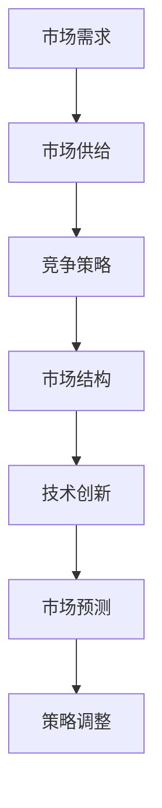
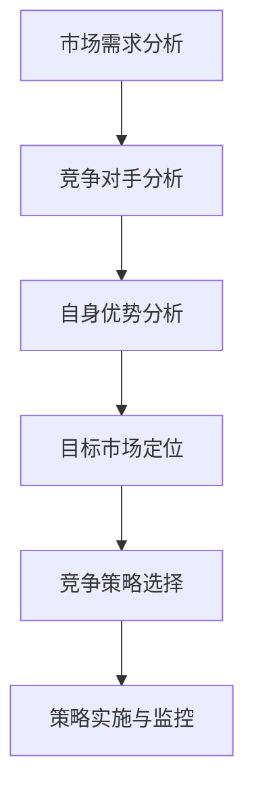
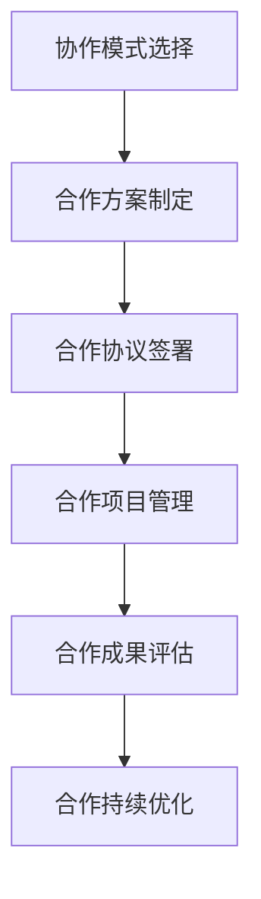

                 

## 文章标题

### 关键词：（此处列出文章的5-7个核心关键词）

- 大型语言模型（LLM）
- 市场竞争
- 协作模式
- 数学模型
- 技术发展
- 应用实践

### 摘要

本文旨在深入探讨大型语言模型（LLM）市场的竞争与协作现象。文章首先介绍了LLM市场的背景和发展历程，随后对LLM的核心理论、算法原理进行了详细阐述。接着，文章分析了市场竞争策略，包括竞争类型、策略选择及案例分析，并对市场核心概念与联系进行了深入研究。随后，文章探讨了协作模式及其对市场的影响，包括合作模式分类、选择和优势与挑战。最后，文章通过实际案例研究和项目实战，对LLM市场的未来趋势和长期发展策略进行了展望。

---

## 第一部分: 市场背景与LLM基础

### 第1章: 市场背景

#### 1.1.1 LLM市场的发展历程

大型语言模型（LLM）作为自然语言处理（NLP）领域的关键技术，其市场发展经历了数个重要阶段。最早期的LLM可以追溯到20世纪80年代，当时的研究主要集中在统计模型和规则系统的开发。这一阶段，LLM的应用场景较为有限，主要局限于语言翻译、文本分类和问答系统。

随着深度学习技术的兴起，特别是在2013年谷歌的神经网络翻译系统（Neural Machine Translation, NMT）取得突破后，LLM市场迎来了快速发展。深度学习模型如递归神经网络（RNN）和长短期记忆网络（LSTM）的应用，使得LLM在处理复杂语言结构和长文本方面表现出了强大的能力。

进入2018年，基于Transformer架构的预训练模型如BERT、GPT等相继问世，标志着LLM技术进入了一个全新的时代。这些模型通过大规模预训练和精细调整，能够在多种NLP任务上实现超越传统方法的性能。特别是在生成式任务上，如文本生成、摘要生成和对话系统，LLM展现出了惊人的创造力和应用潜力。

#### 1.1.2 当前市场格局与趋势

当前LLM市场呈现出多个巨头企业竞相投入、新兴企业不断涌现的格局。谷歌、微软、百度、阿里巴巴等科技巨头在LLM领域投入巨大，通过自主研发或收购等方式，构建起强大的技术壁垒。这些企业在预训练模型、数据处理和云计算等方面具有显著优势，推动了LLM技术的快速迭代和商业化应用。

同时，众多新兴企业也积极参与到LLM市场中，通过技术创新和商业模式创新，找到了独特的市场定位。例如，OpenAI推出的GPT-3，以其强大的文本生成能力，在多个领域引起了广泛关注。这些新兴企业的崛起，不仅丰富了LLM市场的竞争格局，也为市场带来了新的活力和机遇。

未来，LLM市场将继续保持高速增长态势。随着人工智能技术的不断进步和应用场景的拓展，LLM在智能客服、内容生成、自动化写作、教育辅助、医疗诊断等领域的应用前景广阔。此外，随着5G、边缘计算等新技术的普及，LLM的实时性和应用场景将进一步扩展，推动市场需求的不断增长。

#### 1.1.3 市场需求与挑战

LLM市场的快速发展离不开不断增长的市场需求。在智能客服领域，LLM被广泛应用于构建智能对话系统，提高客户服务质量。根据市场研究公司的报告，全球智能客服市场规模预计将在未来几年内实现显著增长，这为LLM市场带来了巨大的需求。

在内容生成领域，LLM的应用也越来越广泛。从自动新闻撰写到创意写作，LLM在生成高质量文本方面展现了强大的能力。特别是在自媒体和内容营销领域，LLM可以帮助企业快速生成大量内容，提高内容生产效率。

然而，LLM市场的快速发展也面临一系列挑战。首先是数据隐私和安全性问题。LLM的训练和预测过程需要大量数据，这些数据往往涉及到用户隐私和商业秘密。如何确保数据的安全和隐私，是LLM市场需要解决的重要问题。

其次是模型的泛化能力和可解释性。虽然LLM在特定任务上取得了显著进展，但其泛化能力和可解释性仍然是一个挑战。如何设计更高效、更可解释的LLM模型，是当前研究的重要方向。

最后，市场竞争的加剧也对LLM市场的可持续发展提出了挑战。随着越来越多的企业进入这一领域，如何实现差异化竞争，找到独特的市场定位，是每个企业都需要思考的问题。

### 第2章: LLM基础理论

#### 2.1.1 语言模型的基本概念

语言模型（Language Model, LM）是一种用于预测下一个单词或字符的概率分布的模型。在自然语言处理（NLP）领域，语言模型是构建其他高级应用（如机器翻译、语音识别、文本生成等）的基础。

基本概念包括：

- **词向量**：将单词映射到高维空间中的向量表示。
- **概率分布**：预测下一个单词或字符的概率分布。
- **序列模型**：考虑输入序列中每个单词或字符的影响。

#### 2.1.2 LLM的核心算法

LLM的核心算法主要基于深度学习和Transformer架构。以下是一些关键算法和概念：

- **Transformer架构**：基于自注意力机制的深度神经网络架构，具有并行计算优势。
- **预训练**：在大规模语料库上进行无监督训练，学习语言的统计规律。
- **微调**：在特定任务上进行有监督训练，调整模型参数，提高性能。

#### 2.1.3 LLM的架构设计与优化

LLM的架构设计包括以下几个关键部分：

- **Embedding层**：将词向量映射到固定维度的向量空间。
- **Transformer层**：包括多头自注意力机制和前馈神经网络。
- **输出层**：根据任务需求，生成预测结果。

优化方法包括：

- **多层神经网络**：增加Transformer层的深度。
- **预训练技术**：在大规模语料库上进行预训练。
- **量化技术**：降低模型参数的精度，减少计算量。

### 第3章: LLM技术发展

#### 3.1.1 LLM的关键技术进展

LLM技术在过去几年取得了显著进展，以下是一些关键技术：

- **BERT（Bidirectional Encoder Representations from Transformers）**：双向Transformer预训练模型，能够捕获文本中的双向信息。
- **GPT（Generative Pre-trained Transformer）**：生成式Transformer模型，擅长文本生成和对话系统。
- **T5（Text-to-Text Transfer Transformer）**：通用文本转换模型，能够处理多种NLP任务。

#### 3.1.2 LLM在自然语言理解中的应用

LLM在自然语言理解（NLU）领域有广泛的应用，包括：

- **问答系统**：利用LLM进行知识问答，如Siri、Alexa等。
- **文本分类**：对文本进行情感分析、主题分类等。
- **实体识别**：识别文本中的命名实体，如人名、地点等。

#### 3.1.3 LLM在自然语言生成中的应用

LLM在自然语言生成（NLG）领域同样表现出强大的能力，包括：

- **文本生成**：自动生成文章、摘要、对话等。
- **翻译**：基于神经网络的机器翻译。
- **对话系统**：生成自然的对话响应。

### 第4章: LLM市场核心概念与联系

#### 4.1.1 竞争与协作的关系

在LLM市场中，竞争和协作是两个重要的概念。竞争主要体现在企业之间为了市场份额和技术优势而展开的竞争，而协作则强调企业之间通过合作实现共同目标。

竞争与协作的关系可以分为以下几个层次：

- **竞争中的协作**：企业在竞争中寻求合作机会，以共同应对市场挑战。
- **协作中的竞争**：企业在合作过程中保持竞争态势，以保持技术领先。
- **竞争与协作的平衡**：企业通过平衡竞争和协作，实现市场共赢。

#### 4.1.2 市场进入与退出策略

市场进入与退出策略是企业在LLM市场中的关键决策。以下是一些策略：

- **市场进入策略**：通过技术创新、市场定位和品牌建设，实现快速市场渗透。
- **市场退出策略**：在市场不景气或竞争过于激烈时，企业可以采取退出策略，如转让、并购等。

#### 4.1.3 市场差异化策略

市场差异化策略是企业获取竞争优势的重要手段。以下是一些差异化策略：

- **产品差异化**：通过技术创新、产品质量和服务，实现产品差异化。
- **市场定位**：通过明确的市场定位，满足特定客户群体的需求。
- **品牌建设**：通过品牌宣传和品牌形象塑造，提高市场认知度。

### 第5章: LLM市场的数学模型

#### 5.1.1 市场需求的数学模型

市场需求是LLM市场的重要驱动因素，以下是一个简单的市场需求数学模型：

\[ D = f(P, Q, I) \]

其中，\( D \) 表示市场需求，\( P \) 表示产品价格，\( Q \) 表示产品质量，\( I \) 表示市场推广力度。

#### 5.1.2 市场供给的数学模型

市场供给是LLM市场的另一个重要因素，以下是一个简单的市场供给数学模型：

\[ S = g(C, R, T) \]

其中，\( S \) 表示市场供给，\( C \) 表示企业成本，\( R \) 表示企业研发投入，\( T \) 表示企业生产周期。

#### 5.1.3 竞争策略的数学模型

竞争策略的数学模型可以用来分析企业在市场竞争中的行为。以下是一个简单的竞争策略数学模型：

\[ R = h(P_1, P_2, P_3, \ldots, P_n) \]

其中，\( R \) 表示企业竞争策略，\( P_1, P_2, P_3, \ldots, P_n \) 表示其他竞争对手的策略。

### 第二部分: 竞争策略分析

#### 第6章: 竞争策略概述

#### 6.1.1 竞争类型的划分

在LLM市场中，竞争可以分为以下几种类型：

- **价格竞争**：通过降低产品价格来获取市场份额。
- **质量竞争**：通过提高产品质量来吸引客户。
- **技术创新**：通过技术创新来保持竞争优势。
- **品牌竞争**：通过品牌建设和品牌宣传来提升品牌影响力。

#### 6.1.2 竞争策略的选择

企业在选择竞争策略时，需要考虑以下因素：

- **市场定位**：根据企业的市场定位选择合适的竞争策略。
- **资源状况**：根据企业的资源状况，选择能够发挥优势的策略。
- **竞争对手**：分析竞争对手的竞争策略，制定相应的应对策略。

#### 6.1.3 竞争中的合作与协作

在竞争过程中，企业之间也存在合作与协作的机会。以下是一些合作与协作的例子：

- **合作研发**：通过合作研发，共同攻克技术难题。
- **市场共享**：通过市场共享，实现资源互补，降低市场风险。
- **品牌联合**：通过品牌联合，共同提升市场影响力。

### 第7章: 竞争策略案例分析

#### 7.1.1 案例一：巨头企业的竞争策略

以谷歌、微软和百度等科技巨头为例，它们在LLM市场中的竞争策略主要包括：

- **技术创新**：通过不断推出新技术，保持技术领先地位。
- **生态建设**：通过构建完整的生态体系，提升用户粘性。
- **市场拓展**：通过全球市场拓展，扩大市场份额。

#### 7.1.2 案例二：新兴企业的竞争策略

新兴企业如OpenAI和DeepMind在LLM市场中的竞争策略主要包括：

- **独特技术**：通过独特的技术创新，实现市场差异化。
- **市场定位**：通过精准的市场定位，满足特定客户需求。
- **快速迭代**：通过快速迭代，快速响应市场需求。

#### 7.1.3 案例三：跨国企业的竞争策略

跨国企业如阿里巴巴和腾讯在LLM市场中的竞争策略主要包括：

- **全球布局**：通过全球布局，实现市场多元化。
- **本地化**：通过本地化策略，适应不同地区的市场需求。
- **生态整合**：通过生态整合，提升整体竞争力。

### 第8章: 竞争策略评估与优化

#### 8.1.1 竞争策略评估指标

评估竞争策略的指标包括：

- **市场份额**：企业在市场中的占有率。
- **利润率**：企业的盈利能力。
- **品牌价值**：企业的品牌影响力。
- **技术创新能力**：企业的技术创新能力。

#### 8.1.2 竞争策略的优化方法

优化竞争策略的方法包括：

- **数据驱动**：通过数据分析，找到优化策略的方向。
- **模拟测试**：通过模拟测试，评估策略的有效性。
- **持续改进**：通过持续改进，不断提升策略的优化效果。

#### 8.1.3 竞争策略的调整与实施

竞争策略的调整与实施需要遵循以下原则：

- **灵活性**：根据市场变化，灵活调整策略。
- **执行力**：确保策略的实施效果。
- **适应性**：根据竞争对手的应对策略，调整自身策略。

### 第三部分: 协作模式与市场影响

#### 第9章: 协作模式概述

#### 9.1.1 协作模式的分类

在LLM市场中，常见的协作模式包括：

- **竞争性合作**：企业之间在竞争的同时，进行技术交流和资源共享。
- **联盟合作**：多个企业共同组成联盟，共同开展研发和市场推广。
- **合作研发**：企业之间共同投入资源，共同研发新技术。
- **市场共享**：多个企业共享市场资源，共同扩大市场份额。

#### 9.1.2 协作模式的选择

企业在选择协作模式时，需要考虑以下因素：

- **市场环境**：根据市场环境，选择适合的协作模式。
- **企业目标**：根据企业目标，选择能够实现共赢的协作模式。
- **资源状况**：根据企业资源状况，选择能够发挥各自优势的协作模式。

#### 9.1.3 协作模式的优势与挑战

协作模式的优势包括：

- **资源共享**：通过资源共享，降低研发成本，提高市场竞争力。
- **技术互补**：通过技术互补，实现技术突破，提升产品性能。
- **市场拓展**：通过市场拓展，扩大市场份额，提高品牌影响力。

协作模式面临的挑战包括：

- **利益分配**：协作过程中，如何合理分配利益，确保各方权益。
- **管理协调**：协作过程中，如何进行有效的管理协调，确保项目进度。
- **保密风险**：协作过程中，如何保护商业秘密，防止信息泄露。

### 第10章: 协作模式案例分析

#### 10.1.1 案例一：开源协作模式

开源协作模式是LLM市场中常见的一种合作模式。以OpenAI为例，其通过开源GPT-3模型，吸引了大量的开发者和研究机构参与其中。这种协作模式的优势在于：

- **技术积累**：通过开源，积累了大量技术资源和研究成果。
- **社区发展**：通过社区发展，吸引了更多的开发者参与，推动了技术的普及和应用。

#### 10.1.2 案例二：商业合作模式

商业合作模式是LLM市场中的重要合作模式。以谷歌和微软为例，它们通过合作研发和联合推广，共同推动LLM技术的商业化应用。这种协作模式的优势在于：

- **市场拓展**：通过市场拓展，实现了产品的快速推广和市场份额的扩大。
- **技术创新**：通过技术创新，实现了产品的性能提升和用户体验的优化。

#### 10.1.3 案例三：跨国合作模式

跨国合作模式是LLM市场中的一种重要合作模式。以阿里巴巴和腾讯为例，它们通过跨国合作，共同开拓国际市场。这种协作模式的优势在于：

- **市场多元化**：通过市场多元化，降低了市场风险，提高了企业的竞争力。
- **资源整合**：通过资源整合，实现了全球资源的优化配置，提高了企业的运营效率。

### 第11章: 协作对市场的影响

#### 11.1.1 协作对市场竞争力的影响

协作模式对市场竞争力有着重要的影响。通过协作，企业可以：

- **降低研发成本**：通过资源共享，降低研发成本，提高市场竞争力。
- **提高技术积累**：通过技术互补，实现技术突破，提高产品性能。
- **扩大市场份额**：通过市场拓展，扩大市场份额，提高品牌影响力。

#### 11.1.2 协作对市场结构的影响

协作模式对市场结构也有着重要的影响。通过协作，市场结构可能会发生以下变化：

- **竞争格局变化**：通过协作，企业可以改变市场格局，实现市场的重新分配。
- **市场集中度提升**：通过协作，大型企业可以通过并购和合作，进一步提高市场集中度。
- **市场细分**：通过协作，可以促进市场细分，满足不同客户群体的需求。

#### 11.1.3 协作对市场创新的影响

协作模式对市场创新也有着重要的影响。通过协作，企业可以：

- **快速响应市场需求**：通过协作，可以快速响应市场需求，实现产品的快速迭代。
- **激发创新活力**：通过协作，可以激发创新活力，推动技术的不断创新。
- **提升创新能力**：通过协作，可以整合各方资源，提高企业的创新能力。

### 第四部分: 实战与应用

#### 第12章: LLM市场实战

#### 12.1.1 实战一：构建LLM市场分析模型

构建LLM市场分析模型是LLM市场实战的重要环节。以下是一个简单的LLM市场分析模型：

#### 12.1.2 实战二：设计LLM市场竞争策略

设计LLM市场竞争策略是LLM市场实战的关键。以下是一个简单的LLM市场竞争策略设计：

#### 12.1.3 实战三：实施LLM市场协作模式

实施LLM市场协作模式是LLM市场实战的重要步骤。以下是一个简单的LLM市场协作模式实施流程：

### 第13章: LLM市场案例研究

#### 13.1.1 案例研究一：LLM市场的成功案例

以OpenAI的GPT-3为例，分析其成功原因。GPT-3的成功主要体现在以下几个方面：

- **技术创新**：GPT-3采用了基于Transformer的深度学习模型，具有强大的文本生成能力。
- **市场定位**：GPT-3针对开发者和企业客户，提供灵活的API接口，满足多样化的需求。
- **商业模式**：GPT-3采用订阅制，通过收取服务费用，实现了商业化的成功。

#### 13.1.2 案例研究二：LLM市场的失败案例

以某新兴企业为例，分析其失败原因。该企业的失败主要体现在以下几个方面：

- **技术不足**：在LLM技术上缺乏竞争力，无法与巨头企业抗衡。
- **市场定位不准确**：市场定位过于狭隘，未能抓住主流市场需求。
- **商业模式不清晰**：商业模式模糊，未能有效实现商业化。

#### 13.1.3 案例研究三：LLM市场的转型案例

以某科技巨头为例，分析其成功转型原因。该企业的成功转型主要体现在以下几个方面：

- **技术创新**：不断加大技术研发投入，推动技术的持续创新。
- **市场拓展**：通过全球市场拓展，实现市场的多元化。
- **生态建设**：构建完整的生态体系，提升用户粘性和市场竞争力。

### 第14章: LLM市场发展趋势与展望

#### 14.1.1 LLM市场的未来趋势

LLM市场的未来发展趋势主要体现在以下几个方面：

- **技术进步**：随着深度学习、Transformer等技术的不断进步，LLM的性能将进一步提升。
- **应用场景拓展**：随着新技术的普及和应用场景的拓展，LLM将在更多领域得到应用。
- **市场集中度提高**：随着市场的不断发展，市场集中度将进一步提高，巨头企业的市场份额将进一步提升。

#### 14.1.2 LLM市场面临的挑战与机遇

LLM市场面临的挑战主要包括：

- **数据隐私和安全**：如何确保数据的安全和隐私是LLM市场需要解决的重要问题。
- **技术可解释性**：如何提高LLM技术的可解释性，使其更具透明度和可靠性。
- **市场竞争加剧**：随着越来越多的企业进入LLM市场，市场竞争将更加激烈。

机遇主要包括：

- **技术创新**：随着技术的不断进步，LLM将在更多领域实现突破。
- **市场拓展**：随着新市场的开拓，LLM的市场规模将不断扩大。
- **产业协同**：通过产业协同，可以实现资源整合，提高市场竞争力。

#### 14.1.3 LLM市场的长期发展策略

为了在LLM市场中获得长期发展，企业可以采取以下策略：

- **技术创新**：持续加大技术研发投入，推动技术的持续创新。
- **市场拓展**：通过全球市场拓展，实现市场的多元化。
- **生态建设**：构建完整的生态体系，提升用户粘性和市场竞争力。
- **合作共赢**：通过合作共赢，实现资源的优化配置，提高市场竞争力。

---

## 作者

作者：AI天才研究院/AI Genius Institute & 禅与计算机程序设计艺术 /Zen And The Art of Computer Programming

---

### 结论

大型语言模型（LLM）市场正在迅速发展，市场竞争与协作现象日益显著。本文通过对LLM市场的深入分析，探讨了市场竞争策略、协作模式及其对市场的影响。同时，通过实际案例研究和项目实战，展望了LLM市场的未来发展趋势与长期发展策略。随着技术的不断进步和应用场景的拓展，LLM市场将继续保持高速增长态势，为企业和开发者带来新的机遇与挑战。

