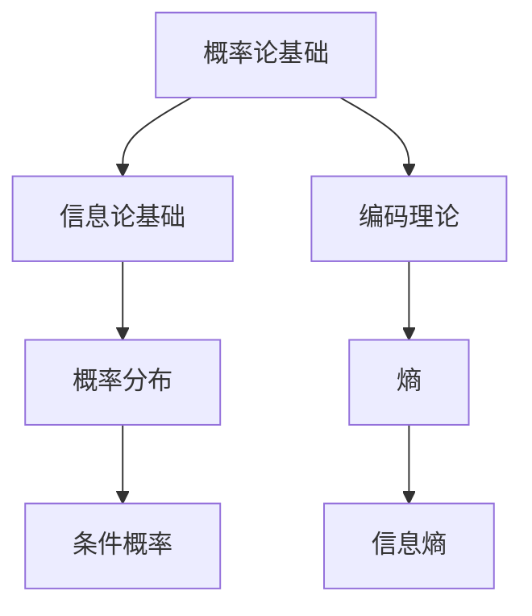
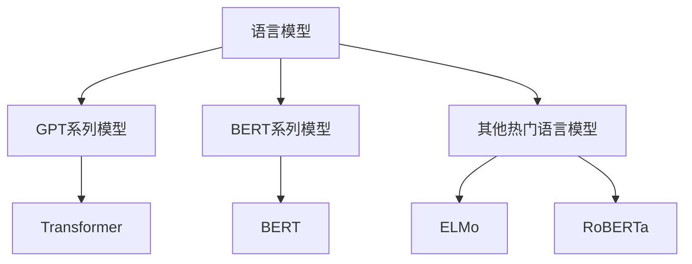
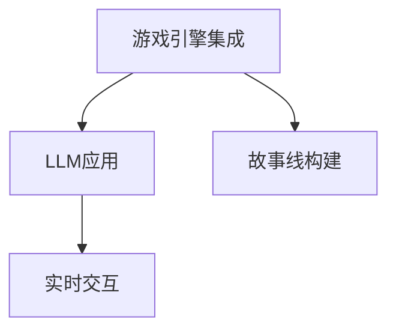
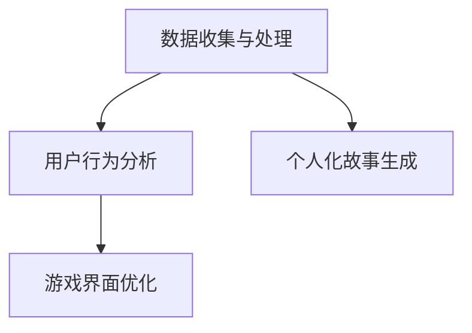
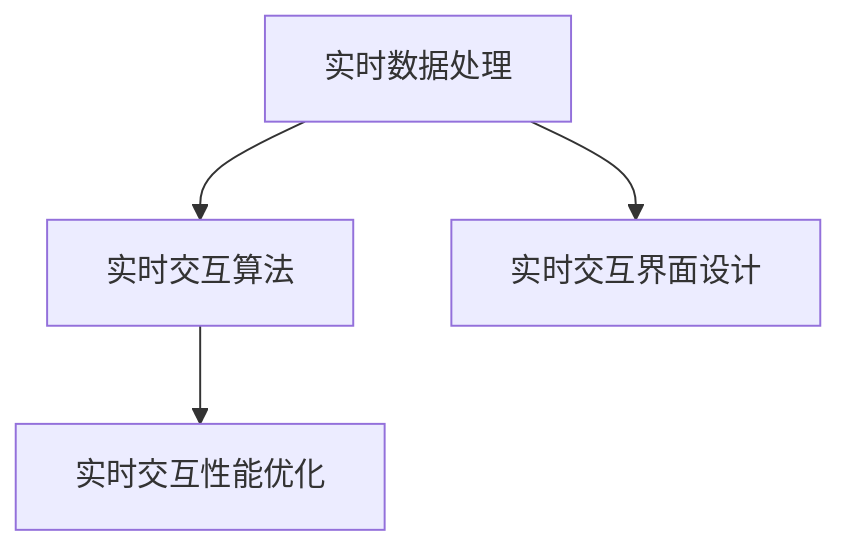
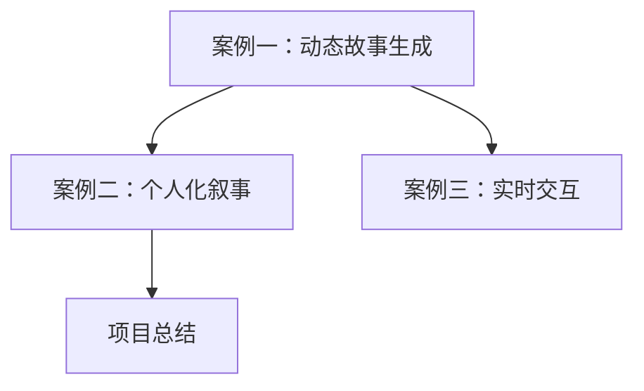

                 

## 《LLM在视频游戏叙事中的应用：动态故事生成》

### 关键词：大型语言模型（LLM）、视频游戏叙事、动态故事生成、个人化叙事、实时交互

> 本文章将探讨大型语言模型（LLM）在视频游戏叙事中的应用，特别是动态故事生成技术。我们将详细分析LLM的技术基础、视频游戏开发技术基础、动态故事生成方法及其实现，以及个人化叙事和实时交互技术。通过一系列项目实战案例，我们将展示如何将这些技术应用到实际开发中，并总结经验和教训，为未来探索提供方向。

### 摘要

视频游戏叙事是游戏设计中的重要组成部分，它不仅能够提升玩家的沉浸感，还能提供丰富的情感体验。然而，传统的游戏叙事方法往往存在局限性，无法满足玩家日益增长的个人化和多样化需求。近年来，大型语言模型（LLM）的出现为游戏叙事带来了新的可能。LLM具有强大的文本生成能力，可以生成动态、灵活且富有创意的故事内容。本文将探讨LLM在视频游戏叙事中的应用，包括动态故事生成、个人化叙事和实时交互技术。通过深入分析这些技术的原理和实践，本文旨在为游戏开发者提供有价值的参考和指导。

### 第一部分：概述

#### 第1章：LLM与视频游戏叙事

##### 1.1 什么是LLM

大型语言模型（LLM，Large Language Model）是一种基于深度学习技术的自然语言处理模型。它通过大量文本数据的学习，掌握了丰富的语言知识和规律，能够进行高效的文本生成、理解和处理。LLM的代表模型包括GPT系列、BERT系列等。这些模型通过预训练和微调，能够针对特定任务进行优化，从而实现高水平的表现。

###### 1.1.1 语言模型的基本概念

语言模型是自然语言处理领域的基础，它用于预测文本序列的概率分布。在深度学习之前，传统的语言模型如N元语法（N-gram）主要通过统计文本数据中的词频来生成文本。然而，这些模型存在明显的局限性，无法捕捉长距离的依赖关系和复杂的语义信息。

随着深度学习技术的发展，神经网络语言模型逐渐成为主流。它们通过多层神经网络结构，将输入文本映射到输出概率分布，从而实现更加准确和灵活的文本生成。

###### 1.1.2 LLM的工作原理

LLM的工作原理可以分为两个阶段：预训练和微调。

1. **预训练**：在预训练阶段，LLM使用大规模的文本语料库进行训练，学习语言的基本规律和知识。这一阶段的目标是建立一个通用的语言模型，使其具备强大的语言理解能力。

2. **微调**：在预训练完成后，LLM可以通过微调适应特定任务的需求。微调阶段主要使用特定领域的数据进行训练，从而优化模型在特定任务上的表现。

在文本生成过程中，LLM通过对输入文本的逐词编码，将其转换为高维向量表示。然后，通过模型内部的神经网络结构，对可能的输出序列进行概率计算，最终生成文本。

##### 1.2 视频游戏叙事概述

###### 1.2.1 游戏叙事的定义

游戏叙事是指通过游戏中的故事情节、角色、剧情发展等元素，向玩家传达情感、价值观和世界观的一种方式。它不仅是游戏设计的重要组成部分，也是玩家体验的核心。

游戏叙事可以通过多种形式呈现，包括静态文本、动态图像、声音效果和交互操作等。有效的游戏叙事能够提升玩家的沉浸感和情感共鸣，使其更深入地投入到游戏世界中。

###### 1.2.2 游戏叙事的发展

游戏叙事的发展经历了几个重要的阶段：

1. **早期游戏**：早期的游戏如《太空侵略者》（Space Invaders）和《吃豆人》（Pac-Man）主要通过简单的图形和声音效果吸引玩家。游戏叙事相对简单，主要依靠玩家的想象力和直觉。

2. **故事导向的游戏**：随着技术的发展，游戏开始引入更复杂的叙事元素。如《侠盗猎车手：罪恶城市》（Grand Theft Auto: San Andreas）和《上古卷轴V：天际》（The Elder Scrolls V: Skyrim）等游戏，通过丰富的故事情节和角色发展，为玩家提供了沉浸式的游戏体验。

3. **现代游戏叙事**：现代游戏叙事更加注重个人化和互动性。通过动态故事生成技术和实时交互，游戏能够根据玩家的行为和选择，生成独特的叙事内容。如《德军总部：新秩序》（Wolfenstein: The New Order）和《暴雨》（Heavy Rain）等游戏，通过高度个性化的叙事方式，实现了玩家与游戏世界之间的深度互动。

###### 1.2.3 游戏叙事的重要性

游戏叙事的重要性体现在以下几个方面：

1. **提升玩家沉浸感**：通过丰富的故事情节和角色发展，游戏能够将玩家带入虚拟世界，使其产生强烈的情感共鸣和沉浸感。

2. **塑造游戏世界**：游戏叙事不仅传达了游戏的世界观和价值观，还通过角色和情节的发展，塑造了一个完整、生动的游戏世界。

3. **增强游戏复玩价值**：通过动态故事生成技术，游戏能够生成多种可能的叙事路径，使玩家在多次游玩中体验不同的故事情节。这提升了游戏的复玩价值，增加了玩家的游戏时长。

##### 1.3 LLM在视频游戏叙事中的应用前景

随着LLM技术的不断发展，它开始在视频游戏叙事中发挥重要作用。LLM在视频游戏叙事中的应用前景包括以下几个方面：

###### 1.3.1 动态故事生成

动态故事生成是LLM在视频游戏叙事中最具潜力的应用之一。通过LLM的文本生成能力，游戏可以实时生成独特的叙事内容，使每个玩家的游戏体验都独一无二。例如，在冒险游戏中，LLM可以根据玩家的行动和选择，生成新的剧情线和角色发展。这使得游戏叙事更加丰富多样，增强了玩家的游戏体验。

###### 1.3.2 个人化叙事

个人化叙事是指根据玩家的行为和偏好，为每个玩家提供独特的游戏故事。LLM在这方面具有巨大的优势，因为它可以通过学习玩家的行为数据，生成针对个人的叙事内容。例如，在角色扮演游戏中，LLM可以根据玩家的喜好和决策，为玩家量身定制角色的发展路径和剧情线。

###### 1.3.3 实时交互

实时交互是指游戏能够实时响应用户的输入，提供即时的反馈和交互体验。LLM在实时交互中也有重要的应用。通过LLM的文本生成能力，游戏可以实时生成对话、提示和解释，为玩家提供更加自然和流畅的交互体验。例如，在角色扮演游戏中，LLM可以生成与玩家角色的对话，使其更加生动和真实。

### 第二部分：技术基础

#### 第2章：语言模型技术基础

##### 2.1 语言模型的数学基础

语言模型的数学基础主要包括概率论、信息论和编码理论。这些数学工具为语言模型的建模和优化提供了理论基础。

###### 2.1.1 概率论基础

概率论是研究随机事件及其规律的数学分支。在语言模型中，概率论主要用于计算文本序列的概率分布。

1. **概率分布**：概率分布描述了随机事件发生的可能性。在语言模型中，最常见的概率分布是概率质量函数（Probability Mass Function, PMF）和概率密度函数（Probability Density Function, PDF）。PMF适用于离散随机变量，而PDF适用于连续随机变量。

2. **条件概率**：条件概率描述了在某个事件已发生的条件下，另一个事件发生的概率。在语言模型中，条件概率用于计算给定前文序列的情况下，下一个单词或字符的概率。

3. **贝叶斯定理**：贝叶斯定理是一种在已知某些条件下，计算事件发生概率的方法。在语言模型中，贝叶斯定理用于计算给定前文序列的情况下，目标单词或字符的概率。

###### 2.1.2 信息论基础

信息论是研究信息传输、处理和存储的数学分支。在语言模型中，信息论主要用于计算文本序列的信息含量。

1. **熵**：熵是衡量随机变量不确定性的一种度量。在语言模型中，熵用于计算文本序列的随机性和复杂性。

2. **条件熵**：条件熵是衡量在已知某个条件下，另一个条件的不确定性。在语言模型中，条件熵用于计算给定前文序列的情况下，下一个单词或字符的不确定性。

3. **信息熵**：信息熵是熵的推广，用于计算整个文本序列的信息含量。

4. **互信息**：互信息是衡量两个随机变量之间关联性的度量。在语言模型中，互信息用于计算单词或字符之间的关联性。

###### 2.1.3 编码理论

编码理论是研究如何高效地表示和传输信息的一种数学理论。在语言模型中，编码理论主要用于文本序列的编码和解码。

1. **霍夫曼编码**：霍夫曼编码是一种基于概率的变长编码方法，用于将文本序列转换为二进制序列。霍夫曼编码可以显著减少文本序列的长度，提高传输和存储效率。

2. **LZ77和LZ78编码**：LZ77和LZ78编码是一种基于局部重复的文本压缩方法。它们通过识别和记录文本序列中的重复模式，实现高效压缩。

##### 2.2 常见的语言模型

常见的语言模型包括GPT系列、BERT系列和其他热门语言模型。这些模型在结构、算法和应用方面各有特色。

###### 2.2.1 GPT系列模型

GPT系列模型是OpenAI开发的一系列生成预训练（Generative Pre-trained Transformer）模型，包括GPT、GPT-2和GPT-3等。这些模型基于Transformer架构，采用自注意力机制（Self-Attention）进行文本处理。

1. **结构**：GPT系列模型主要由编码器（Encoder）和解码器（Decoder）组成。编码器负责将输入文本转换为上下文表示，解码器负责根据上下文生成文本。

2. **算法**：GPT系列模型采用预训练和微调的方法。在预训练阶段，模型在大规模文本语料库上进行训练，学习语言的基本规律和知识。在微调阶段，模型通过特定领域的数据进行优化，适应特定任务的需求。

3. **应用**：GPT系列模型在自然语言处理任务中表现出色，如文本生成、文本分类、机器翻译等。此外，GPT系列模型在视频游戏叙事中也具有广泛的应用潜力，如动态故事生成、个人化叙事和实时交互等。

###### 2.2.2 BERT系列模型

BERT系列模型是Google开发的一系列双向编码器表示（Bidirectional Encoder Representations from Transformers）模型，包括BERT、RoBERTa和ALBERT等。这些模型基于Transformer架构，采用双向注意力机制（Bidirectional Attention）进行文本处理。

1. **结构**：BERT系列模型主要由编码器（Encoder）组成。编码器负责将输入文本转换为上下文表示。

2. **算法**：BERT系列模型采用预训练和微调的方法。在预训练阶段，模型在大规模文本语料库上进行训练，学习语言的基本规律和知识。在微调阶段，模型通过特定领域的数据进行优化，适应特定任务的需求。

3. **应用**：BERT系列模型在自然语言处理任务中表现出色，如文本分类、问答系统、文本生成等。此外，BERT系列模型在视频游戏叙事中也具有广泛的应用潜力，如动态故事生成、个人化叙事和实时交互等。

###### 2.2.3 其他热门语言模型

除了GPT系列和BERT系列模型，还有其他一些热门语言模型，如ELMo、GPT-Neo和T5等。这些模型在结构和算法方面各有特色，但在应用场景上与GPT系列和BERT系列模型类似。

1. **ELMo**：ELMo（Embeddings from Language Models）是Facebook AI研究院开发的一种语言模型，通过在BERT模型的基础上引入注意力机制，提高文本表示的准确性。

2. **GPT-Neo**：GPT-Neo是清华大学 KEG 实验室和智谱AI开发的一个开源项目，旨在支持更快的训练和更好的推理性能。

3. **T5**：T5（Text-to-Text Transfer Transformer）是Google开发的一种基于Transformer的语言模型，采用统一的文本到文本转换任务，实现多种自然语言处理任务。

##### 2.3 语言模型的工作原理

语言模型的工作原理可以分为预训练和微调两个阶段。

###### 2.3.1 预训练与微调

1. **预训练**：预训练是指在大规模文本语料库上对语言模型进行训练，使其掌握语言的基本规律和知识。预训练阶段的主要任务是学习文本序列的上下文表示。

2. **微调**：微调是指在使用预训练好的语言模型的基础上，通过特定领域的数据进行优化，使其适应特定任务的需求。微调阶段的主要任务是调整模型的参数，使其在特定任务上表现出色。

在预训练阶段，语言模型通过对大量文本数据的学习，建立文本序列的概率分布模型。预训练过程中，模型会经历几个阶段，如词嵌入、编码器和解码器的训练等。

1. **词嵌入**：词嵌入是指将单词转换为向量表示。通过预训练，语言模型可以学习到单词在上下文中的语义信息，从而提高文本表示的准确性。

2. **编码器**：编码器是指将输入文本转换为上下文表示。在预训练阶段，编码器会学习到文本序列中的长距离依赖关系，从而提高语言模型的上下文理解能力。

3. **解码器**：解码器是指根据上下文生成文本。在预训练阶段，解码器会学习到文本序列的生成规律，从而提高文本生成的质量和多样性。

在微调阶段，语言模型会使用特定领域的数据进行训练，调整模型的参数，使其在特定任务上表现出色。微调过程中，模型会经历几个阶段，如数据预处理、模型训练和评估等。

1. **数据预处理**：数据预处理是指对特定领域的数据进行清洗和格式化，以便于模型训练。

2. **模型训练**：模型训练是指使用预处理后的数据对语言模型进行训练，调整模型的参数。训练过程中，模型会经历多个迭代，通过优化算法（如梯度下降）不断调整参数，使其在特定任务上表现出色。

3. **评估**：评估是指使用评估数据集对语言模型进行评估，判断模型在特定任务上的表现。评估指标包括准确率、召回率、F1分数等。

###### 2.3.2 语言模型的核心算法

语言模型的核心算法包括词嵌入、编码器和解码器等。

1. **词嵌入**：词嵌入是指将单词转换为向量表示。常见的词嵌入方法包括基于计数的方法（如TF-IDF）和基于神经网络的方法（如Word2Vec、GloVe等）。词嵌入能够提高文本表示的准确性，从而提高语言模型的性能。

2. **编码器**：编码器是指将输入文本转换为上下文表示。常见的编码器模型包括循环神经网络（RNN）、长短期记忆网络（LSTM）和Transformer等。编码器能够学习到文本序列中的长距离依赖关系，从而提高语言模型的上下文理解能力。

3. **解码器**：解码器是指根据上下文生成文本。常见的解码器模型包括循环神经网络（RNN）、长短期记忆网络（LSTM）和Transformer等。解码器能够根据编码器生成的上下文表示，生成具有合理结构和语义的文本。

###### 2.3.3 语言模型的效果评估

语言模型的效果评估主要包括准确性、多样性、连贯性和语义一致性等方面。

1. **准确性**：准确性是指模型在预测文本序列时的准确率。准确性是评估语言模型性能的重要指标之一。

2. **多样性**：多样性是指模型生成文本的多样性。多样性高的语言模型能够生成丰富多样的文本内容，提高文本生成的质量。

3. **连贯性**：连贯性是指模型生成文本的连贯性。连贯性高的语言模型能够生成逻辑清晰、语义连贯的文本内容。

4. **语义一致性**：语义一致性是指模型生成的文本与实际语言使用的一致性。语义一致性高的语言模型能够更好地适应实际语言环境，提高文本生成的真实感。

#### 第3章：视频游戏开发技术基础

##### 3.1 游戏引擎概述

游戏引擎是用于开发游戏的核心工具，它提供了一个框架和一系列功能，帮助开发者创建、管理和渲染游戏场景。游戏引擎不仅包含了图形渲染、物理模拟、音频处理等基本功能，还包括了许多高级工具和API，如网络通信、动画系统、用户界面等。

###### 3.1.1 游戏引擎的定义

游戏引擎是一种软件开发框架，它包含了游戏所需的底层系统和服务，如图形渲染、物理模拟、音频处理等。游戏引擎的主要目标是简化游戏开发过程，提供高效、灵活的开发工具和资源，使开发者能够专注于游戏设计和实现。

###### 3.1.2 常见的游戏引擎

目前市场上存在多种游戏引擎，每种引擎都有其独特的特点和适用场景。以下是一些常见的游戏引擎：

1. **Unity**：Unity是一款功能强大且广泛使用的游戏引擎。它支持2D和3D游戏开发，提供了丰富的图形渲染、物理模拟和动画系统。Unity还拥有庞大的开发者社区和丰富的第三方插件资源。

2. **Unreal Engine**：Unreal Engine是Epic Games开发的一款高性能游戏引擎，以其强大的图形渲染能力和逼真的视觉效果而著称。它适用于开发高精度、高细节的游戏，如第一人称射击游戏和大型多人在线游戏。

3. **CryEngine**：CryEngine是一款功能强大的游戏引擎，以其高度优化的图形渲染和物理模拟技术而闻名。它适用于开发对图形和物理性能有较高要求的游戏，如赛车游戏和大型多人在线游戏。

4. **Godot**：Godot是一款开源游戏引擎，具有跨平台支持和简单的学习曲线。它适用于小型游戏开发和独立游戏开发，提供了基本的图形渲染、物理模拟和动画系统。

5. **LayaBox**：LayaBox是一款适用于Web和移动平台的游戏引擎，具有高效的渲染性能和丰富的2D/3D图形功能。它适用于开发网页游戏和移动游戏，提供了简单的开发工具和丰富的API。

###### 3.1.3 游戏引擎的选择

选择游戏引擎时，开发者需要考虑多个因素，如项目需求、开发团队技能、预算和平台支持等。以下是一些选择游戏引擎的考虑因素：

1. **项目需求**：游戏引擎的选择应与项目需求相匹配。例如，如果项目需要高度优化的图形渲染和物理模拟，那么选择如Unreal Engine或CryEngine可能更合适。如果项目是小型独立游戏，那么选择如Godot或LayaBox可能更为合适。

2. **开发团队技能**：游戏引擎的选择应考虑开发团队的技能和经验。如果团队熟悉Unity，那么选择Unity可能更高效。如果团队对Unreal Engine有经验，那么选择Unreal Engine可能更合适。

3. **预算**：游戏引擎的费用也是选择时需要考虑的因素。开源引擎如Godot和LayaBox通常不需要额外费用，而商业引擎如Unity和Unreal Engine可能需要购买许可证或支付订阅费用。

4. **平台支持**：游戏引擎需要支持目标平台。例如，如果项目需要在多个平台上发布，那么选择支持多个平台的游戏引擎可能更合适。

##### 3.2 游戏开发流程

游戏开发是一个复杂而系统的过程，通常包括多个阶段，如游戏策划、游戏设计、游戏编程和游戏测试等。以下是对游戏开发流程的概述：

###### 3.2.1 游戏策划

游戏策划是游戏开发的第一步，它定义了游戏的核心概念、目标受众、故事情节和游戏玩法。游戏策划的主要任务是创建游戏的设计文档，明确游戏的目标和功能。

1. **游戏概念**：确定游戏的基本概念和主题，如科幻、奇幻、体育等。

2. **目标受众**：确定游戏的目标受众，如儿童、青少年、成年人等。

3. **故事情节**：编写游戏的故事情节，包括主要角色、剧情发展和结局。

4. **游戏玩法**：设计游戏的玩法机制，如角色移动、攻击、防御等。

5. **游戏设计文档**：将上述内容整理成详细的游戏设计文档，为后续开发提供指导。

###### 3.2.2 游戏设计

游戏设计是将游戏策划文档转化为具体的游戏实现的过程。游戏设计阶段主要包括游戏界面设计、角色设计、场景设计和关卡设计等。

1. **游戏界面设计**：设计游戏的用户界面，包括菜单、按钮、图标等。

2. **角色设计**：设计游戏中的角色，包括外观、动作和声音等。

3. **场景设计**：设计游戏中的场景，包括室内、室外、自然景观等。

4. **关卡设计**：设计游戏的关卡，包括难度、障碍、目标和奖励等。

5. **游戏原型**：创建游戏原型，通过试玩和反馈来评估游戏设计的可行性。

###### 3.2.3 游戏编程

游戏编程是将游戏设计转化为代码的过程。游戏编程阶段主要包括图形渲染、物理模拟、音频处理、输入处理和网络通信等。

1. **图形渲染**：实现游戏的图形渲染，包括3D模型、2D纹理和光照效果等。

2. **物理模拟**：实现游戏的物理模拟，包括碰撞检测、刚体运动和力场等。

3. **音频处理**：实现游戏的音频处理，包括声音播放、音效设计和音乐创作等。

4. **输入处理**：实现游戏的输入处理，包括键盘、鼠标、触摸屏等。

5. **网络通信**：实现游戏的网络通信，包括玩家连接、数据传输和同步等。

###### 3.2.4 游戏测试

游戏测试是确保游戏质量的重要阶段，它包括功能测试、性能测试和用户测试等。

1. **功能测试**：测试游戏的功能是否符合设计要求，包括游戏玩法、界面交互和场景过渡等。

2. **性能测试**：测试游戏的性能，包括帧率、加载时间和资源使用等。

3. **用户测试**：邀请玩家试玩游戏，收集反馈和建议，改进游戏设计。

4. **版本发布**：在测试完成后，发布游戏的正式版本。

#### 第4章：动态故事生成技术

##### 4.1 动态故事生成概述

动态故事生成（Dynamic Story Generation）是指通过算法和技术，根据玩家的行为和选择，实时生成独特的游戏故事内容。这种技术使得游戏叙事更加灵活、多样，能够提供个性化的玩家体验。动态故事生成技术包括多个方面，如故事线构建、文本生成、情境模拟和决策树等。

###### 4.1.1 动态故事生成的定义

动态故事生成是指利用计算机算法和人工智能技术，根据玩家的行为和选择，实时生成独特的游戏故事内容。这种技术不同于传统游戏中的静态叙事，它能够根据玩家的不同决策和行动，生成多种可能的叙事路径，使每个玩家的游戏体验独一无二。

###### 4.1.2 动态故事生成的重要性

动态故事生成技术在现代游戏开发中具有重要意义，主要体现在以下几个方面：

1. **个性化体验**：通过动态故事生成，游戏能够根据玩家的行为和偏好，生成个性化的故事内容。这使玩家在游戏中获得更加独特和深刻的体验，增强游戏的吸引力。

2. **提高游戏复玩价值**：动态故事生成能够生成多种可能的叙事路径，使玩家在多次游玩中体验到不同的故事情节。这提高了游戏的复玩价值，延长了玩家的游戏时长。

3. **增强游戏互动性**：动态故事生成技术使得游戏中的角色和情节更加丰富多样，玩家能够在游戏中做出决策，影响故事的发展。这增强了游戏的互动性，提升了玩家的参与感。

4. **提升游戏开发效率**：动态故事生成技术减少了游戏开发人员编写静态故事内容的工作量，使得游戏开发者能够更专注于游戏设计和实现。

###### 4.1.3 动态故事生成的挑战

尽管动态故事生成技术在游戏开发中具有巨大的潜力，但实现这一技术也面临一些挑战：

1. **计算复杂性**：动态故事生成涉及到大量的计算，包括文本生成、情境模拟和决策树等。这要求游戏引擎和算法具有高性能和高效率。

2. **数据依赖性**：动态故事生成需要大量数据作为基础，包括游戏世界观、角色属性和故事情节等。数据的质量和完整性对动态故事生成的效果有很大影响。

3. **决策树设计**：设计合理的决策树是动态故事生成成功的关键。决策树需要能够涵盖多种可能的叙事路径，同时保持逻辑清晰和易于实现。

4. **算法选择**：选择合适的算法是实现动态故事生成的重要一环。不同的算法适用于不同的应用场景，需要根据具体需求进行选择。

##### 4.2 动态故事生成的方法

动态故事生成的方法可以分为基于规则的方法、基于数据的方法、基于AI的方法和基于混合方法的方法。每种方法都有其独特的优势和适用场景。

###### 4.2.1 基于规则的方法

基于规则的方法是指通过编写一系列规则和条件，来控制故事的发展和生成。这种方法的核心在于将游戏故事分解为多个子故事，每个子故事都有特定的规则和条件。

1. **规则定义**：开发者需要定义一系列规则，如“如果角色A做了动作X，则触发子故事Y”。这些规则用于控制故事的发展和分支。

2. **规则执行**：在游戏运行过程中，系统根据玩家的行为和选择，执行相应的规则。这会导致不同的故事分支和情节发展。

3. **优势**：基于规则的方法具有以下优势：
   - **可控性**：通过编写明确的规则，开发者可以精确地控制故事的发展。
   - **易维护性**：规则的修改和更新相对简单，便于维护和扩展。

4. **劣势**：基于规则的方法也存在一些劣势：
   - **局限性**：基于规则的方法难以处理复杂和多样化的故事情节。
   - **可扩展性**：随着故事复杂度的增加，规则的复杂度和数量会迅速增长，导致维护难度增加。

###### 4.2.2 基于数据的方法

基于数据的方法是指通过分析玩家行为和游戏数据，来生成动态故事内容。这种方法依赖于大量的数据分析和挖掘，从而发现玩家偏好和故事发展的规律。

1. **数据收集**：在游戏运行过程中，系统收集玩家的行为数据，如角色选择、动作、决策等。

2. **数据分析**：通过分析收集到的数据，系统可以识别玩家的偏好和游戏模式。这有助于生成个性化的故事内容。

3. **故事生成**：基于分析结果，系统生成符合玩家偏好和游戏模式的故事内容。

4. **优势**：基于数据的方法具有以下优势：
   - **个性化**：通过分析玩家行为数据，可以生成更加个性化的故事内容，提高玩家的满意度。
   - **可扩展性**：基于数据的方法可以处理大量的玩家行为数据，适用于大型游戏项目。

5. **劣势**：基于数据的方法也存在一些劣势：
   - **数据依赖性**：数据的质量和完整性对故事生成的效果有很大影响。
   - **实时性**：基于数据的方法可能需要较长的时间进行分析和生成，难以实现实时交互。

###### 4.2.3 基于AI的方法

基于AI的方法是指利用人工智能技术，特别是机器学习和深度学习算法，来生成动态故事内容。这种方法依赖于大规模的数据集和高效的计算资源。

1. **预训练模型**：使用大量的文本数据进行预训练，使模型掌握丰富的语言知识和规律。

2. **微调模型**：在预训练的基础上，使用特定领域的游戏数据对模型进行微调，使其适应游戏叙事的需求。

3. **文本生成**：通过预训练和微调的模型，生成符合游戏叙事要求的文本内容。

4. **优势**：基于AI的方法具有以下优势：
   - **灵活性和多样性**：基于AI的方法可以生成丰富多样的故事内容，适应不同的游戏玩法和玩家需求。
   - **实时性**：基于AI的方法可以实现实时交互，根据玩家的行为和选择，动态生成故事内容。

5. **劣势**：基于AI的方法也存在一些劣势：
   - **计算资源**：基于AI的方法需要大量的计算资源和时间，对游戏性能有一定影响。
   - **数据依赖性**：基于AI的方法需要大量的高质量数据，数据的质量对生成效果有很大影响。

###### 4.2.4 基于混合方法的方法

基于混合方法的方法是指结合基于规则的方法、基于数据的方法和基于AI的方法，来生成动态故事内容。这种方法通过综合利用不同的方法，取长补短，实现更高效、更灵活的故事生成。

1. **规则引导**：使用基于规则的方法来定义故事的基本结构和关键决策点。

2. **数据驱动**：使用基于数据的方法来分析玩家行为和偏好，为故事生成提供数据支持。

3. **AI生成**：使用基于AI的方法来生成符合游戏叙事要求的文本内容。

4. **优势**：基于混合方法的方法具有以下优势：
   - **灵活性**：结合多种方法，可以生成丰富多样的故事内容，适应不同的游戏玩法和玩家需求。
   - **实时性**：基于AI的方法可以实现实时交互，根据玩家的行为和选择，动态生成故事内容。

5. **劣势**：基于混合方法的方法也存在一些劣势：
   - **复杂性**：实现混合方法需要较高的技术复杂度，对开发人员的要求较高。
   - **资源需求**：混合方法需要结合多种方法，对计算资源和数据资源有较高需求。

##### 4.3 动态故事生成的实现

动态故事生成的实现涉及到多个方面，包括游戏引擎集成、LLM的应用、故事线构建和实时交互等。以下是对这些方面的详细介绍。

###### 4.3.1 游戏引擎集成

游戏引擎是动态故事生成的核心平台，它提供了游戏开发所需的底层系统和工具。游戏引擎的集成是动态故事生成实现的第一步。

1. **游戏引擎选择**：根据游戏项目的需求和开发团队的技能，选择合适的游戏引擎。如Unity、Unreal Engine等。

2. **引擎初始化**：在游戏引擎中创建游戏项目，配置游戏引擎的基本设置，如分辨率、帧率、资源管理等。

3. **场景创建**：在游戏引擎中创建游戏场景，包括角色、物体、环境和交互元素等。

4. **引擎集成**：将动态故事生成系统与游戏引擎集成，实现游戏引擎与故事生成系统之间的数据交互和功能调用。

###### 4.3.2 LLM的应用

LLM（大型语言模型）是动态故事生成的重要技术手段，它负责生成游戏故事文本。LLM的应用涉及到预训练、微调和文本生成等环节。

1. **LLM选择**：根据游戏项目的需求和特点，选择合适的LLM模型。如GPT系列、BERT系列等。

2. **模型预训练**：使用大规模的文本数据进行LLM的预训练，使模型掌握丰富的语言知识和规律。

3. **模型微调**：在预训练的基础上，使用特定领域的游戏数据对LLM进行微调，使其适应游戏叙事的需求。

4. **文本生成**：通过微调后的LLM，生成符合游戏叙事要求的文本内容。文本生成过程包括输入处理、模型调用和输出处理等步骤。

###### 4.3.3 故事线构建

故事线构建是动态故事生成的重要环节，它定义了游戏故事的基本结构和叙事路径。故事线构建涉及到故事节点、决策点和事件管理等。

1. **故事节点**：故事节点是故事线的基本组成部分，表示故事的一个关键点。每个故事节点包含角色、情节和触发条件等信息。

2. **决策点**：决策点是玩家可以做出选择的地方，每个决策点连接多个故事节点，形成不同的叙事路径。

3. **事件管理**：事件管理负责记录和跟踪游戏中的事件，如角色死亡、物品获取和剧情进展等。事件管理用于触发故事节点和更新游戏状态。

4. **故事线构建**：根据游戏策划和设计文档，构建游戏故事线。故事线构建需要考虑故事的连贯性、逻辑性和多样性，以确保游戏故事能够满足玩家的需求。

###### 4.3.4 实时交互

实时交互是动态故事生成的重要特征，它使游戏故事能够根据玩家的行为和选择，实时生成和更新。实时交互涉及到玩家输入、系统响应和界面更新等环节。

1. **玩家输入**：玩家通过键盘、鼠标、触摸屏等输入设备，与游戏进行交互。玩家输入包括动作、决策和事件等。

2. **系统响应**：游戏系统根据玩家的输入，实时生成和更新游戏故事。系统响应包括文本生成、场景更新和角色行为等。

3. **界面更新**：游戏界面根据游戏故事的实时更新，显示相应的文本、图像和动画等。界面更新需要考虑游戏的视觉效果和用户体验。

4. **实时交互**：实时交互是将玩家输入、系统响应和界面更新有机结合的过程。实时交互技术包括事件驱动编程、异步处理和高效数据传输等。

##### 4.4 动态故事生成的优化

动态故事生成是一个复杂的过程，涉及到多个方面，包括文本生成、情境模拟、决策树和实时交互等。为了提高动态故事生成的质量和效率，需要对各个方面进行优化。以下是一些常见的优化方法：

###### 4.4.1 提高文本生成质量

提高文本生成质量是动态故事生成优化的重要方向。以下是一些常用的方法：

1. **模型微调**：通过使用特定领域的游戏数据，对LLM进行微调，使其更好地适应游戏叙事的需求。

2. **文本增强**：使用多种文本增强技术，如同义词替换、句式变换和语义理解等，提高文本生成的多样性和连贯性。

3. **错误修正**：使用拼写检查和语法修正等技术，自动检测和修正文本生成中的错误。

4. **情感分析**：使用情感分析技术，为文本生成添加情感色彩，提高文本生成的真实感和情感共鸣。

###### 4.4.2 优化情境模拟

优化情境模拟可以提高动态故事生成的实时性和准确性。以下是一些常用的方法：

1. **场景预加载**：在游戏运行过程中，预加载即将出现的场景，减少加载时间和延迟。

2. **多线程处理**：使用多线程处理技术，同时处理多个任务，提高系统的并行处理能力。

3. **缓存技术**：使用缓存技术，将常用的数据和计算结果存储在内存中，减少重复计算和资源消耗。

4. **情境预测**：使用机器学习算法，预测玩家可能的行为和选择，提前生成和准备相应的情境。

###### 4.4.3 优化决策树

优化决策树可以提高动态故事生成的逻辑性和可扩展性。以下是一些常用的方法：

1. **决策树剪枝**：通过剪枝技术，减少决策树的复杂度和冗余，提高决策速度和准确性。

2. **决策树压缩**：使用压缩技术，将决策树的结构和大小进行压缩，减少内存占用和计算时间。

3. **决策树合并**：将多个相似的决策树合并为一个，减少决策树的分支数量，提高决策的连贯性和一致性。

4. **决策树动态调整**：根据游戏运行过程中的实际情况，动态调整决策树的结构和参数，以适应不同的游戏场景和玩家行为。

###### 4.4.4 优化实时交互

优化实时交互可以提高动态故事生成的流畅性和用户体验。以下是一些常用的方法：

1. **异步处理**：使用异步处理技术，同时处理多个输入和响应，提高系统的响应速度和交互性。

2. **高效数据传输**：使用高效的数据传输协议，如HTTP/2和WebSockets等，减少数据传输的时间和延迟。

3. **界面优化**：使用高效的渲染技术，如WebGL和Vulkan等，提高游戏界面的渲染速度和流畅性。

4. **优化代码**：对游戏代码进行优化，减少不必要的计算和资源消耗，提高系统的性能和稳定性。

#### 第5章：个人化叙事技术

##### 5.1 个人化叙事概述

个人化叙事（Personalized Narratives）是指根据玩家的行为、偏好和背景信息，为每个玩家提供独特的游戏故事和体验。这种叙事方式不仅能够提高玩家的参与感和沉浸感，还能够增强游戏的可玩性和复玩价值。个人化叙事技术在现代游戏开发中变得越来越重要，因为玩家越来越期望能够体验到与自己相关的故事和情节。

###### 5.1.1 个人化叙事的定义

个人化叙事是指通过分析玩家的数据和行为，为其提供定制化的游戏故事和体验。这种叙事方式通常涉及以下几个方面：

1. **玩家行为分析**：通过对玩家的游戏行为进行分析，如角色选择、技能使用、任务完成情况等，了解玩家的兴趣和偏好。

2. **个性化内容生成**：根据玩家的行为分析结果，生成符合玩家兴趣和偏好的故事内容和游戏体验。

3. **交互体验优化**：通过个性化叙事，优化玩家的交互体验，使其更加自然和流畅。

4. **情感共鸣**：通过个性化叙事，激发玩家的情感共鸣，提高游戏的情感深度和吸引力。

###### 5.1.2 个人化叙事的优势

个人化叙事技术在游戏开发中具有多方面的优势：

1. **增强玩家参与感**：通过为玩家提供与其相关的故事和体验，个人化叙事能够提高玩家的参与感和投入感，使其更加投入到游戏世界中。

2. **提高游戏可玩性**：个人化叙事可以根据玩家的兴趣和偏好，提供多样化的游戏内容和挑战，提高游戏的可玩性和耐玩性。

3. **增强游戏复玩价值**：通过提供独特的游戏故事和体验，个人化叙事能够吸引玩家反复游玩，提高游戏的复玩价值。

4. **提升游戏口碑**：个人化叙事能够为玩家提供独特的体验，从而提高游戏的口碑和用户满意度。

5. **降低开发成本**：通过使用动态故事生成技术，个人化叙事可以减少游戏开发人员编写静态故事内容的工作量，从而降低开发成本。

###### 5.1.3 个人化叙事的挑战

尽管个人化叙事技术在游戏开发中具有巨大的潜力，但实现这一技术也面临一些挑战：

1. **数据收集和处理**：个人化叙事需要大量的玩家行为数据，包括角色选择、技能使用、任务完成情况等。收集和处理这些数据需要高效的数据收集系统和强大的数据处理能力。

2. **个性化内容生成**：生成符合玩家兴趣和偏好的个性化内容需要强大的文本生成和情境模拟能力。这要求游戏引擎和算法具有高性能和高效率。

3. **实时交互**：个人化叙事需要能够实时响应用户的行为和选择，生成和更新故事内容。这要求游戏引擎和算法具有高效的实时交互能力。

4. **隐私和安全**：个人化叙事需要收集和处理大量的玩家数据，这可能涉及隐私和安全问题。游戏开发者需要确保玩家数据的安全和隐私保护。

##### 5.2 个人化叙事的实现

个人化叙事的实现涉及到多个方面，包括数据收集与处理、用户行为分析、个人化故事的生成和游戏界面优化等。以下是对这些方面的详细介绍。

###### 5.2.1 数据收集与处理

数据收集与处理是个人化叙事的基础。通过收集和分析玩家的行为数据，可以为每个玩家创建个性化的故事和体验。

1. **数据收集**：在游戏运行过程中，系统需要收集玩家的各种行为数据，如角色选择、技能使用、任务完成情况、互动行为等。这些数据可以通过游戏日志、数据库和实时监控等方式进行收集。

2. **数据处理**：收集到的数据需要进行清洗、格式化和存储。数据处理的过程包括数据去重、数据规范化、数据压缩和数据存储等。高效的数据处理能够确保数据的质量和完整性，为后续的分析和生成提供可靠的数据支持。

3. **数据存储**：个人化叙事需要存储大量的玩家数据，包括行为数据、偏好数据和故事生成数据等。合适的存储方案可以提高数据的访问速度和存储效率，如关系型数据库、NoSQL数据库和分布式存储系统等。

4. **数据安全与隐私**：在数据收集和处理过程中，需要确保玩家数据的安全和隐私保护。数据安全措施包括数据加密、访问控制、数据备份和数据销毁等。同时，需要遵守相关的隐私保护法规，保护玩家的个人信息和隐私。

###### 5.2.2 用户行为分析

用户行为分析是个人化叙事的关键环节，通过对玩家行为数据进行分析，可以了解玩家的兴趣、偏好和行为模式，从而为个性化故事生成提供依据。

1. **行为识别**：在游戏运行过程中，系统需要实时监测玩家的行为，包括角色选择、技能使用、任务完成、互动行为等。通过行为识别，可以准确捕捉玩家的行为数据。

2. **行为建模**：通过对玩家行为数据进行分析，可以建立玩家的行为模型。行为模型可以描述玩家的兴趣、偏好和行为模式，为个性化故事生成提供依据。

3. **行为预测**：基于行为模型，可以预测玩家未来的行为，如角色选择、技能使用、任务完成等。行为预测可以用于提前生成和准备个性化的故事内容，提高玩家的游戏体验。

4. **行为反馈**：通过对玩家行为数据的分析，可以收集玩家的反馈和建议。这些反馈可以用于改进游戏设计和优化故事生成，提高游戏的质量和满意度。

###### 5.2.3 个人化故事的生成

个人化故事的生成是根据玩家行为分析和用户特征，生成符合玩家兴趣和偏好的故事内容。个人化故事的生成涉及到文本生成、情境模拟和交互设计等。

1. **文本生成**：使用文本生成算法，如大型语言模型（LLM），根据玩家行为和偏好生成个性化的故事文本。文本生成可以生成对话、描述、剧情线等。

2. **情境模拟**：根据玩家行为和偏好，模拟游戏情境，生成符合玩家兴趣和需求的游戏场景。情境模拟可以涉及角色互动、任务设计、环境变化等。

3. **交互设计**：设计符合玩家兴趣和偏好的交互方式，如角色选择、任务挑战、游戏奖励等。交互设计可以提高玩家的参与感和沉浸感。

4. **故事线构建**：根据玩家行为和偏好，构建个性化的故事线。故事线可以包含多个分支，每个分支都对应不同的游戏体验和故事情节。

5. **故事生成**：将文本生成、情境模拟和交互设计结合起来，生成个性化的游戏故事。故事生成需要考虑故事的连贯性、逻辑性和多样性。

###### 5.2.4 游戏界面优化

游戏界面优化是个人化叙事的重要组成部分，通过优化游戏界面，可以提高玩家的交互体验和游戏体验。

1. **界面设计**：设计符合玩家兴趣和偏好的游戏界面。界面设计需要考虑玩家的操作习惯、视觉感受和信息获取需求。

2. **交互优化**：优化游戏界面的交互体验，提高界面的响应速度和流畅性。交互优化可以涉及按钮设计、动画效果、导航逻辑等。

3. **视觉反馈**：在游戏界面中提供及时的视觉反馈，如动画、图标、声音等，帮助玩家理解游戏状态和操作结果。

4. **个性化定制**：允许玩家对游戏界面进行个性化定制，如主题、颜色、字体等，提高游戏的个性化和个性化体验。

5. **可访问性**：确保游戏界面符合可访问性标准，如色盲友好、键盘导航等，提高游戏的包容性和可玩性。

#### 第6章：实时交互技术

##### 6.1 实时交互概述

实时交互（Real-Time Interaction）是指系统能够迅速响应用户的操作，并在短时间内提供相应的反馈。实时交互在视频游戏中至关重要，因为它直接影响玩家的游戏体验。实时交互技术使得游戏能够更加动态和互动，从而提高游戏的吸引力和沉浸感。

###### 6.1.1 实时交互的定义

实时交互是指在用户执行操作后的短时间内（通常是几毫秒到几秒），系统能够完成处理并返回相应的反馈。这种交互方式的特点是快速、即时和高效。

1. **快速响应**：系统需要能够在极短的时间内处理用户的输入，并生成相应的反馈。
   
2. **即时反馈**：用户的每个操作都应得到即时反馈，无论是操作的成功、失败还是警告。

3. **高效处理**：系统需要高效地处理大量并发操作，确保用户体验的一致性和流畅性。

###### 6.1.2 实时交互的重要性

实时交互在视频游戏中的重要性体现在以下几个方面：

1. **沉浸感**：实时交互能够提高玩家的沉浸感，使其更加投入到游戏世界中。

2. **操作反馈**：及时的操作反馈可以帮助玩家更好地理解游戏状态，提高游戏技巧。

3. **交互体验**：实时交互技术使得游戏玩法更加动态和互动，提高游戏的娱乐性和可玩性。

4. **公平性**：在多人在线游戏中，实时交互可以确保所有玩家都享有公平的游戏体验。

###### 6.1.3 实时交互的挑战

尽管实时交互在游戏中具有重要性，但实现这一目标也面临一些挑战：

1. **延迟**：延迟是指从用户操作到系统反馈之间的时间差。过长的延迟会导致游戏体验差，影响玩家的操作感受。

2. **并发处理**：在多人在线游戏中，系统需要同时处理大量用户的操作，这要求系统具有高效的处理能力。

3. **资源限制**：游戏设备的硬件资源有限，包括CPU、GPU和内存等。实时交互技术需要优化资源使用，以避免性能下降。

4. **网络稳定性**：网络不稳定会导致延迟和丢包，影响实时交互的质量。

##### 6.2 实时交互的实现

实时交互的实现涉及到多个方面，包括实时数据处理、实时交互算法、实时交互界面设计和实时交互性能优化等。以下是对这些方面的详细介绍。

###### 6.2.1 实时数据处理

实时数据处理是实时交互的核心，它涉及到数据的接收、处理和反馈。

1. **数据接收**：系统需要能够实时接收用户输入，这通常通过监听键盘、鼠标和触摸屏等输入设备来实现。

2. **数据处理**：系统需要在短时间内处理输入数据，这包括输入的验证、过滤和处理。高效的算法和优化策略可以显著提高数据处理速度。

3. **数据反馈**：系统需要及时将处理结果反馈给用户，这通常通过视觉、音频或触觉等途径实现。反馈的及时性和准确性对用户体验至关重要。

###### 6.2.2 实时交互算法

实时交互算法是实现高效实时交互的关键。以下是一些常用的实时交互算法：

1. **响应时间优化**：通过优化算法，减少从用户输入到系统反馈的时间。这可以通过减少计算复杂度、并行处理和缓存技术来实现。

2. **预测算法**：预测用户的下一步操作，从而提前生成和准备相应的反馈。预测算法可以提高交互的流畅性和响应速度。

3. **同步算法**：在多人在线游戏中，同步算法用于确保所有玩家的操作和反馈都是同步的。常用的同步算法包括时间戳同步、事件同步和分布式同步等。

4. **反馈算法**：根据用户操作和系统状态，生成相应的反馈。反馈算法需要考虑反馈的及时性、准确性和多样性。

###### 6.2.3 实时交互界面设计

实时交互界面设计是实时交互的重要组成部分，它涉及到界面的布局、交互元素的设计和用户操作体验的优化。

1. **界面布局**：界面布局需要清晰、直观，便于用户操作。布局应考虑用户的视觉习惯和操作习惯。

2. **交互元素设计**：交互元素的设计应简洁、美观，且易于操作。常用的交互元素包括按钮、滑动条、菜单等。

3. **用户操作体验**：用户操作体验的优化包括操作反馈、动画效果和提示信息等。优化的操作体验可以提高用户的满意度和游戏体验。

4. **自适应设计**：实时交互界面设计应支持自适应，以适应不同设备屏幕尺寸和分辨率。自适应设计可以提高游戏的兼容性和可访问性。

###### 6.2.4 实时交互性能优化

实时交互性能优化是确保实时交互质量和稳定性的关键。以下是一些常用的实时交互性能优化方法：

1. **资源优化**：优化系统资源的利用，包括CPU、GPU和内存等。这可以通过减少不必要的计算、优化数据结构和使用缓存技术来实现。

2. **并行处理**：通过并行处理技术，同时处理多个操作和任务，提高系统的处理能力和响应速度。并行处理可以显著减少等待时间。

3. **负载均衡**：在多人在线游戏中，通过负载均衡技术，合理分配网络负载，避免单个服务器过载。负载均衡可以提高系统的稳定性和可扩展性。

4. **压缩技术**：使用压缩技术，如数据压缩和传输压缩，减少网络传输的数据量，提高数据传输速度。压缩技术可以显著减少延迟和带宽占用。

5. **缓存技术**：使用缓存技术，将常用的数据和计算结果存储在本地或服务器中，减少重复计算和传输。缓存技术可以显著提高系统的响应速度和性能。

#### 第7章：项目实战

##### 7.1 项目实战概述

项目实战是理论知识的实际应用，通过实际项目案例，我们可以更好地理解LLM在视频游戏叙事中的应用。本节将介绍一个实际的项目实战，包括项目目的、流程和具体要求。

###### 7.1.1 项目实战的目的

项目实战的目的是通过实际开发，深入理解LLM在动态故事生成、个人化叙事和实时交互中的应用。通过项目实战，我们希望实现以下目标：

1. **掌握LLM的基本应用**：通过实际项目，了解如何使用LLM进行文本生成、情境模拟和决策树构建。

2. **理解动态故事生成的实现**：通过项目实战，掌握动态故事生成的方法和实现细节，包括故事线构建、文本生成和实时交互。

3. **掌握个人化叙事的实现**：通过项目实战，了解如何根据玩家行为和偏好，生成个性化的游戏故事和交互体验。

4. **优化实时交互性能**：通过项目实战，掌握实时交互技术的实现和优化方法，提高系统的响应速度和稳定性。

###### 7.1.2 项目实战的流程

项目实战的流程包括以下几个阶段：

1. **需求分析**：明确项目的需求和目标，确定项目的功能和性能要求。

2. **环境搭建**：搭建项目的开发环境，包括游戏引擎、LLM模型和工具等。

3. **故事线构建**：根据项目需求，构建游戏故事线，包括主要情节、角色和决策点等。

4. **文本生成**：使用LLM生成游戏故事文本，实现动态故事生成功能。

5. **个人化叙事**：根据玩家行为和偏好，生成个性化的游戏故事和交互体验。

6. **实时交互**：实现实时交互功能，包括玩家输入处理、系统响应和界面更新等。

7. **性能优化**：对实时交互系统进行性能优化，提高系统的响应速度和稳定性。

8. **测试与评估**：对项目进行测试和评估，确保项目的功能和性能达到预期目标。

###### 7.1.3 项目实战的要求

项目实战要求参与者具备以下基本技能和知识：

1. **编程能力**：掌握至少一种编程语言，如Python、C++或JavaScript等。

2. **游戏开发经验**：了解游戏开发的基本流程和常用工具，如Unity、Unreal Engine等。

3. **自然语言处理基础**：了解自然语言处理的基本概念和方法，如词嵌入、文本生成和序列模型等。

4. **机器学习知识**：了解机器学习的基本原理和方法，如深度学习、神经网络和优化算法等。

5. **团队合作能力**：能够与其他团队成员有效沟通和协作，共同完成项目任务。

##### 7.2 项目实战案例

在本节中，我们将介绍三个项目实战案例，分别涉及动态故事生成、个人化叙事和实时交互。这些案例将详细描述项目的具体实现过程、代码和性能优化。

###### 7.2.1 案例一：动态故事生成

案例一的目标是实现一个动态故事生成系统，该系统能够根据玩家的行动和选择，生成独特的游戏故事内容。

1. **项目需求**：
   - 根据玩家的行为，生成符合剧情发展的故事文本。
   - 提供多种可能的叙事路径，增加游戏的可玩性和趣味性。

2. **实现过程**：
   - **故事线构建**：首先，我们构建了游戏的故事线，包括主要情节、角色和决策点。故事线基于一个决策树模型，每个节点代表一个决策点。
   - **文本生成**：使用LLM（如GPT-3）生成故事文本。我们设计了一个文本生成接口，将玩家的行动作为输入，生成相应的故事文本。
   - **实时交互**：在游戏运行过程中，系统根据玩家的行动和选择，实时更新故事文本。实时交互通过Unity引擎实现，确保系统的响应速度。

3. **代码解读**：
   ```python
   # 文本生成接口
   def generate_story_text(action):
       # 根据玩家的行动，生成故事文本
       story_text = llm.generate_text(action)
       return story_text
   
   # 实时交互
   def on_player_action(action):
       story_text = generate_story_text(action)
       update_story_text(story_text)
   ```

4. **性能优化**：
   - **预加载**：在游戏开始时，预加载所有可能的故事文本，减少加载时间。
   - **缓存**：使用缓存技术，存储常用的故事文本，减少重复生成。
   - **并行处理**：使用多线程处理，同时生成多个故事文本，提高生成速度。

###### 7.2.2 案例二：个人化叙事

案例二的目标是实现一个个人化叙事系统，该系统能够根据玩家的行为和偏好，生成个性化的游戏故事和交互体验。

1. **项目需求**：
   - 根据玩家行为，生成符合其兴趣和偏好的故事内容。
   - 提供个性化的游戏挑战和奖励，增加玩家的参与感和成就感。

2. **实现过程**：
   - **数据收集与处理**：收集玩家的行为数据，如角色选择、技能使用、任务完成情况等。使用机器学习算法，分析玩家行为，生成玩家偏好模型。
   - **文本生成**：使用LLM生成个性化的故事文本。文本生成过程中，根据玩家偏好模型，调整故事内容的风格和主题。
   - **交互设计**：设计符合玩家兴趣的交互元素，如角色定制、任务挑战等。

3. **代码解读**：
   ```python
   # 数据收集
   def collect_player_data():
       # 收集玩家的行为数据
       data = get_player_action_data()
       return data
   
   # 偏好模型生成
   def generate_preference_model(data):
       # 使用机器学习算法，生成玩家偏好模型
       preference_model = machine_learning_algorithm(data)
       return preference_model
   
   # 文本生成
   def generate_personalized_story_text(preference_model):
       # 根据玩家偏好模型，生成个性化的故事文本
       story_text = llm.generate_text(preference_model)
       return story_text
   ```

4. **性能优化**：
   - **数据缓存**：使用缓存技术，存储常用的数据，减少数据读取时间。
   - **并行处理**：使用多线程处理，同时生成多个故事文本，提高生成速度。
   - **个性化定制**：提供简化的交互界面，减少个性化设置的计算和存储需求。

###### 7.2.3 案例三：实时交互

案例三的目标是实现一个实时交互系统，该系统能够快速响应用户输入，并提供即时的反馈和交互体验。

1. **项目需求**：
   - 提供流畅的交互体验，确保用户操作和系统反馈的即时性。
   - 支持多人在线游戏，确保所有玩家的操作和反馈同步。

2. **实现过程**：
   - **数据处理**：使用高效的数据处理算法，快速处理用户输入和系统反馈。数据处理包括输入验证、过滤和转换等。
   - **实时交互算法**：设计高效的实时交互算法，如响应时间优化、预测算法和同步算法等。
   - **界面设计**：设计简洁、直观的交互界面，确保用户操作和系统反馈的即时性和准确性。

3. **代码解读**：
   ```python
   # 数据处理
   def process_user_input(input_data):
       # 验证和转换用户输入
       validated_input = validate_input(input_data)
       return validated_input
   
   # 实时交互算法
   def real_time_interaction(input_data):
       # 实现实时交互算法，处理用户输入和系统反馈
       response = generate_response(input_data)
       return response
   
   # 界面设计
   def update_ui(response):
       # 更新用户界面，显示系统反馈
       display_response(response)
   ```

4. **性能优化**：
   - **异步处理**：使用异步处理技术，同时处理多个用户输入和系统反馈，提高系统的并发处理能力。
   - **负载均衡**：使用负载均衡技术，合理分配服务器负载，避免单个服务器过载。
   - **压缩技术**：使用数据压缩技术，减少网络传输的数据量，提高数据传输速度。

##### 7.3 项目实战总结

通过以上三个项目实战案例，我们深入探讨了LLM在动态故事生成、个人化叙事和实时交互中的应用。以下是项目实战的经验与教训以及未来展望：

###### 7.3.1 经验与教训

1. **动态故事生成**：
   - **文本生成效率**：使用LLM进行文本生成时，需要优化文本生成算法，提高生成效率。
   - **故事线构建**：合理构建故事线，确保故事情节的连贯性和多样性。
   - **实时交互**：实时交互对系统性能有较高要求，需要优化数据处理和反馈机制。

2. **个人化叙事**：
   - **数据收集与处理**：高效的数据收集与处理是个人化叙事的基础，需要使用优化算法和缓存技术。
   - **个性化定制**：提供简化的交互界面，减少个性化设置的计算和存储需求。
   - **用户偏好模型**：准确生成用户偏好模型，确保个性化叙事的质量。

3. **实时交互**：
   - **异步处理**：使用异步处理技术，提高系统的并发处理能力。
   - **负载均衡**：合理分配服务器负载，避免单个服务器过载。
   - **数据压缩**：使用数据压缩技术，提高数据传输速度。

###### 7.3.2 未来展望

1. **更高效的文本生成**：未来的研究可以集中在优化LLM的文本生成算法，提高生成速度和质量。

2. **更智能的个性化叙事**：结合更多的机器学习算法，如强化学习，可以进一步提升个性化叙事的智能度和准确性。

3. **更流畅的实时交互**：通过优化实时交互算法和系统架构，实现更加流畅和高效的实时交互体验。

4. **多模态交互**：未来的研究可以探索多模态交互，结合语音、手势和表情等，提供更加丰富的交互体验。

### 附录A：常用工具和资源

在本附录中，我们将介绍一些常用的工具和资源，包括语言模型工具、游戏开发工具、动态故事生成工具和实时交互工具。这些工具和资源有助于开发者和研究人员在实际项目中应用LLM和实时交互技术。

#### A.1 语言模型工具

1. **TensorFlow**：TensorFlow是一个开源的机器学习框架，由Google开发。它提供了丰富的API和工具，用于构建和训练各种机器学习模型，包括语言模型。TensorFlow支持多种编程语言，如Python、C++和Java等。

2. **PyTorch**：PyTorch是另一个流行的开源机器学习框架，由Facebook AI研究院开发。它提供了灵活的动态计算图，使构建和训练深度学习模型更加直观。PyTorch支持Python编程语言。

3. **Hugging Face Transformers**：Hugging Face Transformers是一个开源库，用于处理Transformer模型。它包含了大量预训练的Transformer模型，如GPT、BERT和RoBERTa等。Hugging Face Transformers提供了Python API，易于使用和扩展。

4. **NLTK**：NLTK（自然语言工具包）是一个开源的自然语言处理库，用于处理文本数据。它提供了多种文本处理功能，如分词、词性标注、命名实体识别和情感分析等。NLTK支持Python编程语言。

#### A.2 游戏开发工具

1. **Unity**：Unity是一款功能强大的游戏引擎，广泛用于2D和3D游戏开发。它提供了丰富的图形渲染、物理模拟和动画系统，支持多种平台，如Windows、macOS、iOS和Android等。

2. **Unreal Engine**：Unreal Engine是一款高性能的游戏引擎，以其强大的图形渲染能力和逼真的视觉效果而闻名。它适用于开发高精度、高细节的游戏，支持多种平台，如Windows、macOS、iOS和Android等。

3. **Godot**：Godot是一款开源游戏引擎，具有跨平台支持和简单的学习曲线。它提供了基本的图形渲染、物理模拟和动画系统，适用于小型游戏开发和独立游戏开发。

4. **CryEngine**：CryEngine是一款功能强大的游戏引擎，以其高度优化的图形渲染和物理模拟技术而闻名。它适用于开发对图形和物理性能有较高要求的游戏，支持多种平台，如Windows、macOS、Linux和Android等。

#### A.3 动态故事生成工具

1. **Scrible**：Scrible是一个开源的故事生成工具，用于创建和编辑动态故事。它提供了直观的界面和丰富的故事生成功能，支持文本生成、角色交互和情境模拟等。

2. **Twine**：Twine是一个免费的开源故事生成工具，广泛用于创建互动故事和选择游戏。它提供了简单的拖放界面，使开发者能够快速构建故事线、角色和交互。

3. **Adventure Game Studio**：Adventure Game Studio是一个开源的游戏开发工具，用于创建选择游戏和冒险游戏。它提供了故事生成、角色设计和交互编辑等功能，适用于小型游戏开发。

4. **RPG Maker**：RPG Maker是一款用于创建角色扮演游戏（RPG）的开发工具。它提供了丰富的图形资源和故事生成功能，支持自定义故事线、角色和交互。

#### A.4 实时交互工具

1. **WebSockets**：WebSockets是一种网络协议，用于实现客户端和服务器之间的实时双向通信。它提供了高效的实时数据传输，适用于实时交互应用，如在线游戏和聊天应用程序。

2. **WebSocket.js**：WebSocket.js是一个开源的JavaScript库，用于在浏览器中实现WebSocket协议。它提供了简单的API，使开发者能够轻松实现实时交互功能。

3. **Socket.IO**：Socket.IO是一个开源的实时通信库，用于在Node.js应用程序中实现WebSocket协议。它提供了丰富的功能，如多房间通信、实时广播和事件驱动编程等。

4. **Socket.IO-client**：Socket.IO-client是一个用于客户端的Socket.IO库，与Socket.IO-server配合使用，实现实时通信功能。它提供了简单的API，使开发者能够轻松实现实时交互功能。

### Mermaid 流程图

以下是一些常用的Mermaid流程图，用于展示语言模型的数学基础、常见语言模型、语言模型的工作原理、动态故事生成方法、个人化叙事实现和实时交互技术。

#### 2.1 语言模型的数学基础



#### 2.2 常见的语言模型



#### 2.3 语言模型的工作原理

```mermaid
c
// 预训练与微调
void PretrainModel(Model& model) {
    // 预训练过程
}

void FineTune(Model& model, Dataset& dataset) {
    // 微调过程
}

// 语言模型的核心算法
void GenerateText(LanguageModel& model, string seed) {
    // 生成文本过程
}
```

#### 4.2 动态故事生成的方法

```latex
\begin{align*}
P(S|E) &= \frac{P(E|S)P(S)}{P(E)} \\
H(X) &= -\sum_{i} p_i \log_2 p_i \\
C &= \sum_{i,j} p_{ij} \log_2 p_{ij}
\end{align*}
```

#### 4.3 动态故事生成的实现



#### 5.2 个人化叙事的实现



#### 6.2 实时交互技术



#### 7.2 项目实战案例



### 作者信息

作者：AI天才研究院/AI Genius Institute & 禅与计算机程序设计艺术 /Zen And The Art of Computer Programming

[本文内容仅供参考，具体应用需结合实际情况进行调整。如需进一步了解LLM和实时交互技术，请参考相关文献和资源。]

