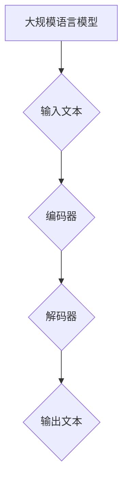
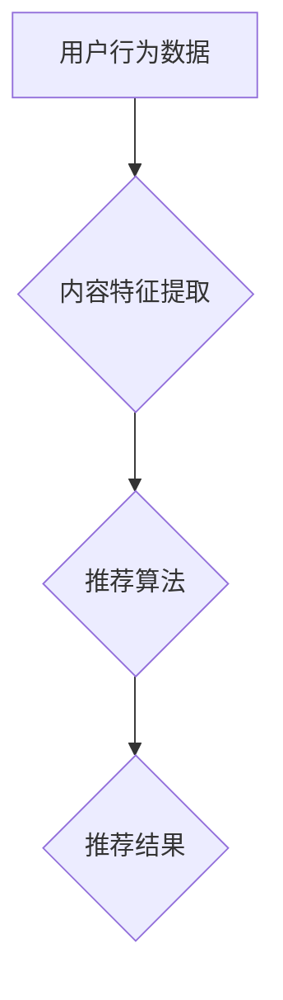
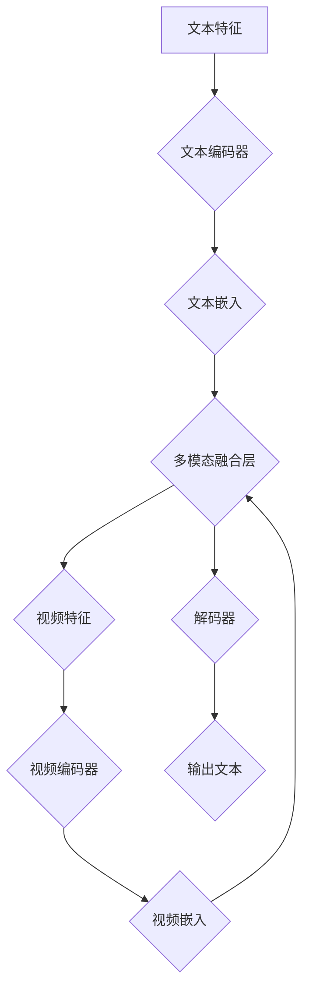

                 

### 文章标题

《LLM在音视频内容推荐中的潜力》

关键词：自然语言处理、大规模语言模型、音视频内容推荐、个性化推荐系统、跨模态内容推荐

摘要：本文将深入探讨大规模语言模型（LLM）在音视频内容推荐中的应用潜力。通过分析LLM的基本概念、技术基础、应用架构以及实战案例，本文旨在揭示LLM在提升推荐系统性能、实现个性化推荐和跨模态内容推荐方面的优势与挑战，为未来的研究和实际应用提供启示。

---

### 第一部分：LLM在音视频内容推荐中的基础理解

#### 第1章：LLM与音视频内容推荐概述

**1.1 LLM的概念与原理**

大规模语言模型（LLM）是基于神经网络和深度学习技术的自然语言处理（NLP）模型，能够通过海量文本数据的学习，掌握语言的语法、语义和上下文关系。LLM的核心目标是生成文本或者对输入文本进行理解和预测。

**Mermaid 流程图：**


**1.2 音视频内容推荐的基本概念**

音视频内容推荐是一种通过分析用户行为数据，为用户提供个性化推荐的服务。其核心在于理解用户兴趣、内容特征和推荐策略。

**Mermaid 流程图：**


**1.3 LLM在音视频内容推荐中的应用前景**

LLM在音视频内容推荐中的应用前景广阔，能够通过文本理解能力提升推荐系统的效果，实现更精准的个性化推荐和跨模态内容推荐。

#### 第2章：LLM的技术基础

**2.1 自然语言处理（NLP）基础**

NLP是LLM的核心技术，包括词嵌入、文本分类、命名实体识别等。这些技术为LLM提供了丰富的文本处理能力。

**伪代码：**
```python
def nlp_processing(text):
    # 嵌入文本
    embeddings = embedder(text)
    # 分类
    label = classifier(embeddings)
    # 命名实体识别
    entities = entity_recognizer(embeddings)
    return label, entities
```

**2.2 LLM的核心算法与架构**

LLM的核心算法包括编码器-解码器（Encoder-Decoder）架构、Transformer等。这些算法能够高效地处理长文本，并生成高质量的输出文本。

**伪代码：**
```python
def LLM_model(input_sequence):
    # 编码器处理输入序列
    encoded_sequence = encoder(input_sequence)
    # 解码器生成输出序列
    output_sequence = decoder(encoded_sequence)
    return output_sequence
```

**2.3 音视频内容特征提取**

音视频内容特征提取是LLM应用的关键步骤，包括文本转录、音频特征提取和视频特征提取等。这些特征将用于训练和优化LLM模型。

**伪代码：**
```python
def extract_audio_features(audio_data):
    # 特征提取
    features = audio_extractor(audio_data)
    return features

def extract_video_features(video_data):
    # 特征提取
    features = video_extractor(video_data)
    return features
```

### 第二部分：LLM在音视频内容推荐中的实战应用

#### 第4章：实战一：基于LLM的个性化视频推荐

**4.1 项目背景与目标**

本节介绍一个基于LLM的个性化视频推荐项目，目标是提升视频推荐系统的效果，实现用户兴趣的精准捕捉。

**4.2 数据预处理**

数据预处理包括用户行为数据的清洗、文本转录和特征提取。这一步骤是推荐系统性能的关键。

**4.3 模型选择与训练**

本节介绍选择哪种LLM模型进行训练，包括模型结构、训练策略和优化方法。

**4.4 推荐结果分析与评估**

本节分析推荐结果，评估模型性能，并提出优化建议。

#### 第5章：实战二：基于LLM的音频内容推荐

**5.1 项目背景与目标**

本节介绍一个基于LLM的音频内容推荐项目，目标是提升音频推荐系统的效果，实现用户兴趣的精准捕捉。

**5.2 音频数据预处理**

音频数据预处理包括音频清洗、特征提取和标签分类。这一步骤是推荐系统性能的关键。

**5.3 模型选择与训练**

本节介绍选择哪种LLM模型进行训练，包括模型结构、训练策略和优化方法。

**5.4 推荐结果分析与评估**

本节分析推荐结果，评估模型性能，并提出优化建议。

#### 第6章：实战三：跨模态内容推荐

**6.1 项目背景与目标**

本节介绍一个跨模态内容推荐项目，目标是结合文本、音频和视频等多种模态，提升推荐系统的效果。

**6.2 音视频数据预处理**

音视频数据预处理包括文本转录、音频特征提取和视频特征提取。这一步骤是跨模态内容推荐系统性能的关键。

**6.3 模型选择与训练**

本节介绍选择哪种LLM模型进行训练，包括模型结构、训练策略和优化方法。

**6.4 推荐结果分析与评估**

本节分析推荐结果，评估模型性能，并提出优化建议。

### 第三部分：LLM在音视频内容推荐中的挑战与未来

#### 第7章：LLM在音视频内容推荐中的挑战

**7.1 数据隐私与安全性**

本节探讨数据隐私与安全性的挑战，包括用户数据的保护、模型的透明度和可解释性。

**7.2 模型解释性**

本节分析模型解释性的挑战，包括如何理解模型的决策过程，如何识别和纠正模型偏见。

**7.3 模型偏见与公平性**

本节探讨模型偏见与公平性的挑战，包括如何避免模型偏见，如何确保推荐结果的公平性。

#### 第8章：LLM在音视频内容推荐中的未来发展趋势

**8.1 新型LLM架构**

本节探讨新型LLM架构的发展趋势，包括更高效的模型结构、更灵活的模型融合技术。

**8.2 音视频内容推荐的智能化升级**

本节分析音视频内容推荐的智能化升级，包括人工智能技术的最新进展和未来应用场景。

**8.3 跨行业融合与应用**

本节探讨LLM在音视频内容推荐领域的跨行业融合与应用，包括教育、医疗、娱乐等行业的探索。

#### 第9章：总结与展望

**9.1 书籍总结**

本节总结全文内容，回顾LLM在音视频内容推荐中的核心概念、技术基础和实战应用。

**9.2 未来发展方向与挑战**

本节展望LLM在音视频内容推荐领域的未来发展方向和面临的挑战，为后续研究提供启示。

---

### 作者信息

作者：AI天才研究院/AI Genius Institute & 禅与计算机程序设计艺术 /Zen And The Art of Computer Programming

以上是文章的正文部分，接下来我们将逐章详细展开内容，确保文章的深度、广度和实用性。

---

### 第1章：LLM与音视频内容推荐概述

**1.1 LLM的概念与原理**

大规模语言模型（LLM）是一种基于深度学习技术的自然语言处理模型，能够通过学习海量文本数据，理解和生成自然语言。LLM的核心技术包括神经网络、递归神经网络（RNN）、长短期记忆网络（LSTM）以及近年来兴起的Transformer架构。这些模型通过多层神经网络结构，逐步学习文本的语义、语法和上下文关系，从而实现文本生成、情感分析、问答系统等功能。

LLM的工作原理可以分为编码器（Encoder）和解码器（Decoder）两个主要部分。编码器负责将输入文本序列转化为固定长度的向量表示，解码器则根据这些向量表示生成输出文本序列。以Transformer架构为例，编码器和解码器都由多个自注意力机制（Self-Attention Mechanism）和前馈神经网络（Feedforward Neural Network）组成，通过自注意力机制，模型能够捕捉输入文本序列中的长距离依赖关系。

**Mermaid 流程图：**
```mermaid
graph TD
    A[输入文本] --> B{编码器}
    B --> C{编码器输出}
    C --> D{解码器}
    D --> E{输出文本}
    B <-- U[自注意力机制]
    D <-- V[解码器自注意力机制]
```

**1.2 音视频内容推荐的基本概念**

音视频内容推荐是一种基于用户兴趣和行为数据的个性化推荐系统，旨在为用户推荐其可能感兴趣的视频或音频内容。音视频内容推荐系统通常包括数据收集、用户行为分析、内容特征提取、推荐算法设计和推荐结果评估等几个关键环节。

**数据收集与分析**：数据收集是推荐系统的第一步，主要包括用户点击、观看、点赞、评论等行为数据。通过对这些数据进行分析，可以了解用户的兴趣偏好和内容喜好。

**内容特征提取**：内容特征提取是将原始音视频内容转化为计算机可以处理和理解的数字特征的过程。对于视频内容，特征提取可以包括视频标题、标签、类别、时长等；对于音频内容，特征提取可以包括歌词、歌手、专辑、时长等。

**推荐算法与系统架构**：推荐算法是推荐系统的核心，根据用户行为数据和内容特征，生成个性化的推荐结果。常见的推荐算法包括基于内容的推荐（Content-based Filtering）、协同过滤（Collaborative Filtering）和混合推荐（Hybrid Recommendation）等。推荐系统架构的设计需要考虑系统的扩展性、实时性和稳定性。

**1.3 LLM在音视频内容推荐中的应用前景**

LLM在音视频内容推荐中的应用前景广阔，主要体现在以下几个方面：

**提升推荐准确性**：LLM能够理解文本的语义和上下文，从而对用户兴趣和行为数据有更深刻的理解，有助于提高推荐系统的准确性。

**实现个性化推荐**：通过学习用户的文本评论、搜索历史和交互数据，LLM能够为用户提供更个性化的推荐，满足不同用户的需求。

**跨模态内容推荐**：LLM能够处理文本、音频和视频等多种模态的数据，通过跨模态特征融合，实现更丰富和精确的推荐。

**情感分析与内容审核**：LLM的情感分析能力可以用于分析用户评论和内容情感，帮助识别不良内容，提升内容审核的准确性。

**交互式推荐**：LLM可以与用户进行交互，通过自然语言对话，为用户提供实时和个性化的推荐。

**未来发展方向**：随着技术的不断进步，LLM在音视频内容推荐中的应用将更加广泛和深入。未来可能的发展方向包括：

- 新型LLM架构的研究，如多模态Transformer、可解释性LLM等。
- 深度学习和强化学习相结合的推荐算法，实现更高效的推荐策略。
- 结合用户行为和内容特征的动态推荐系统，提升推荐系统的实时性和准确性。
- 跨行业融合与应用，如教育、医疗、娱乐等领域的探索。

总之，LLM在音视频内容推荐中的潜力巨大，未来的研究和发展将为推荐系统带来更多创新和突破。

---

### 第2章：LLM的技术基础

**2.1 自然语言处理（NLP）基础**

自然语言处理（NLP）是计算机科学和人工智能领域的一个重要分支，致力于使计算机能够理解、处理和生成人类自然语言。NLP的核心任务包括文本分类、情感分析、命名实体识别、机器翻译、问答系统等。在音视频内容推荐中，NLP技术被广泛应用于用户行为数据分析和内容特征提取。

**词嵌入（Word Embedding）**

词嵌入是将自然语言文本中的词语映射为低维度的向量表示，从而在计算机中处理和理解语言。常见的词嵌入方法包括基于计数的方法（如TF-IDF）和基于神经网络的词嵌入方法（如Word2Vec、GloVe）。Word2Vec是一种基于神经网络的词嵌入方法，通过训练词向量模型，将词语映射为固定长度的向量。

**伪代码：**
```python
def word2vec_corpus(corpus):
    # 构建词向量模型
    model = Word2Vec(corpus, size=100, window=5, min_count=1, workers=4)
    # 获取词向量
    word_vectors = model.wv
    return word_vectors

# 使用词向量进行文本分类
def text_classification(text, model):
    # 提取文本特征向量
    text_vector = get_text_vector(text, model)
    # 进行文本分类
    label = classifier.predict(text_vector)
    return label
```

**文本分类（Text Classification）**

文本分类是将文本数据按照一定的标准进行分类的过程。常见的文本分类任务包括垃圾邮件分类、情感分析、新闻分类等。在音视频内容推荐中，文本分类技术可以用于分析用户评论、标题和标签，提取用户兴趣特征。

**命名实体识别（Named Entity Recognition）**

命名实体识别是从文本中识别出具有特定意义的实体，如人名、地名、组织名等。命名实体识别是NLP领域的一项重要任务，对于理解文本语义和提取内容特征具有重要意义。

**伪代码：**
```python
def named_entity_recognition(text, model):
    # 提取命名实体
    entities = model.recognize_entities(text)
    return entities
```

**2.2 LLM的核心算法与架构**

大规模语言模型（LLM）的核心算法和架构决定了其在音视频内容推荐中的应用效果。以下介绍几种常见的LLM算法和架构。

**编码器-解码器（Encoder-Decoder）架构**

编码器-解码器架构是早期用于机器翻译和文本生成的一种模型架构，由编码器和解码器两个部分组成。编码器负责将输入文本序列编码为固定长度的向量表示，解码器则根据这些向量表示生成输出文本序列。

**Mermaid 流程图：**
```mermaid
graph TD
    A[输入文本] --> B{编码器}
    B --> C{编码器输出}
    C --> D{解码器}
    D --> E{输出文本}
    B <-- U[编码器自注意力机制]
    D <-- V[解码器自注意力机制]
```

**Transformer 架构**

Transformer架构是近年来在自然语言处理领域取得显著成果的一种模型架构，其核心思想是使用自注意力机制（Self-Attention Mechanism）来捕捉输入文本序列中的长距离依赖关系。Transformer架构由多个编码器层和解码器层组成，每层都包含多头自注意力机制和前馈神经网络。

**伪代码：**
```python
class TransformerLayer(nn.Module):
    def __init__(self, d_model, nhead, dim_feedforward=2048, dropout=0.1):
        super().__init__()
        self.self_attn = MultiheadAttention(d_model, nhead, dropout=dropout)
        self.linear1 = nn.Linear(d_model, dim_feedforward)
        self.linear2 = nn.Linear(dim_feedforward, d_model)
        self.norm1 = nn.LayerNorm(d_model)
        self.norm2 = nn.LayerNorm(d_model)
        self.dropout = nn.Dropout(dropout)

    def forward(self, src, src_mask=None, src_key_padding_mask=None,
                memory=None, memory_mask=None, memory_key_padding_mask=None):
        # 自注意力机制
        src2 = self.self_attn(src, src, src, attn_mask=src_mask,
                              key_padding_mask=src_key_padding_mask)
        src = src + self.dropout(src2)
        src = self.norm1(src)

        # 前馈神经网络
        src2 = self.linear2(self.dropout(self.linear1(src)))
        src = src + self.dropout(src2)
        src = self.norm2(src)

        return src
```

**BERT 模型**

BERT（Bidirectional Encoder Representations from Transformers）是一种预训练的语言表示模型，其核心思想是在大规模文本语料库上进行预训练，然后通过微调来适应各种下游任务。BERT模型使用了一种双向Transformer架构，能够同时考虑输入文本序列的前后依赖关系。

**伪代码：**
```python
class BERTModel(nn.Module):
    def __init__(self, config):
        super().__init__()
        self.config = config
        self隐藏层 = nn.ModuleList([TransformerLayer(d_model=self.config.hidden_size,
                                                       nhead=self.config.num_attention_heads)])
        self.norm = nn.LayerNorm(self.config.hidden_size)
        self.dropout = nn.Dropout(self.config.hidden_dropout_prob)

    def forward(self, input_ids=None, attention_mask=None, token_type_ids=None,
                position_ids=None, head_mask=None):
        # 预训练
        inputs_embeds = self嵌入层(input_ids)
        inputs_embeds = inputs_embeds + self.position_embedding(position_ids)
        if token_type_ids is not None:
            inputs_embeds = inputs_embeds + self.token_type_embedding(token_type_ids)

        # Transformer层
        for layer in self隐藏层:
            inputs_embeds = layer(inputs_embeds, attn_mask=attention_mask,
                                  head_mask=head_mask)

        # 输出层
        inputs_embeds = self.norm(inputs_embeds)
        inputs_embeds = self.dropout(inputs_embeds)

        return inputs_embeds
```

**2.3 音视频内容特征提取**

音视频内容特征提取是将原始音视频内容转化为计算机可以处理和理解的数字特征的过程。在音视频内容推荐中，特征提取技术是关键环节，决定了推荐系统的效果和准确性。

**文本转录（Text Transcription）**

文本转录是将音频内容转化为文本的过程。文本转录技术可以应用于音频评论、语音识别等领域，为音视频内容推荐提供文本数据。

**音频特征提取（Audio Feature Extraction）**

音频特征提取是从音频信号中提取出具有代表性和区分度的特征，如频谱特征、梅尔频率倒谱系数（MFCC）、节奏特征等。这些特征可以用于音频内容的分类、标注和推荐。

**视频特征提取（Video Feature Extraction）**

视频特征提取是从视频数据中提取出具有代表性和区分度的特征，如视觉特征（如颜色、纹理、形状等）、语音特征（如语音活动检测、音素识别等）等。这些特征可以用于视频内容的分类、标注和推荐。

**融合特征（Fused Features）**

在音视频内容推荐中，将文本、音频和视频特征进行融合，可以提升推荐系统的效果和准确性。融合特征技术包括基于特征融合的方法和基于模型融合的方法。

**总结**

本章介绍了LLM在音视频内容推荐中的技术基础，包括自然语言处理基础、LLM的核心算法与架构以及音视频内容特征提取。这些技术为LLM在音视频内容推荐中的应用提供了坚实的基础，有助于提升推荐系统的性能和用户体验。

---

### 第3章：音视频内容推荐系统架构设计

**3.1 用户行为数据收集与分析**

用户行为数据是音视频内容推荐系统的核心输入，通过收集和分析用户行为数据，可以了解用户兴趣和偏好，从而实现个性化推荐。用户行为数据包括但不限于以下几种类型：

1. **用户点击行为**：用户在视频平台上的点击行为，如点击播放、跳过、点赞、评论等。
2. **用户观看行为**：用户在视频平台上的观看行为，如观看时长、播放进度、观看频次等。
3. **用户搜索行为**：用户在视频平台上的搜索历史和关键词。
4. **用户交互行为**：用户在视频平台上的互动行为，如分享、收藏、下载等。

**数据收集方法**：

1. **日志文件**：通过服务器日志记录用户行为数据，如访问记录、点击记录等。
2. **API接口**：通过视频平台的API接口获取用户行为数据，如用户画像、观看记录等。
3. **埋点技术**：在视频平台的关键页面和功能模块中设置埋点，收集用户行为数据。

**数据预处理**：

1. **数据清洗**：去除重复数据、缺失数据和异常数据，保证数据质量。
2. **数据转换**：将用户行为数据转换为适合分析和挖掘的格式，如数值化、标准化等。
3. **数据集成**：将不同来源的用户行为数据集成到一个统一的数据仓库中，便于后续分析和挖掘。

**数据分析方法**：

1. **行为序列分析**：通过分析用户行为序列，了解用户的行为模式和兴趣偏好。
2. **用户聚类分析**：通过聚类算法（如K-means、层次聚类等）将用户划分为不同的群体，便于实现个性化推荐。
3. **关联规则挖掘**：通过关联规则挖掘算法（如Apriori算法、FP-growth算法等）发现用户行为之间的关联关系，为推荐策略提供支持。

**3.2 推荐算法的选择与优化**

推荐算法是音视频内容推荐系统的核心，其选择和优化直接影响推荐系统的性能和用户体验。以下介绍几种常见的推荐算法及其优缺点：

1. **基于内容的推荐（Content-based Filtering）**

基于内容的推荐通过分析音视频内容特征和用户兴趣特征，为用户推荐相似的内容。优点是推荐结果相关性强，用户满意度高；缺点是用户兴趣变化时，推荐效果下降。

**算法原理**：

- 内容特征提取：提取音视频的文本、音频和视频特征，如标题、标签、歌词、MFCC等。
- 相似度计算：计算用户兴趣特征和内容特征之间的相似度，如余弦相似度、欧氏距离等。
- 推荐生成：根据相似度计算结果，为用户生成推荐列表。

**伪代码**：
```python
def content_based_filtering(user_profile, content_features):
    # 计算相似度
    similarities = calculate_similarity(user_profile, content_features)
    # 排序
    sorted_similarities = sorted(similarities, key=lambda x: x[1], reverse=True)
    # 生成推荐列表
    recommendations = [content_id for content_id, similarity in sorted_similarities]
    return recommendations
```

2. **协同过滤（Collaborative Filtering）**

协同过滤通过分析用户之间的相似性和行为数据，为用户推荐相似用户喜欢的音视频内容。优点是推荐结果多样性高，用户满意度较高；缺点是冷启动问题严重。

**算法原理**：

- 用户相似度计算：计算用户之间的相似度，如余弦相似度、皮尔逊相关系数等。
- 邻居选择：选择与目标用户最相似的邻居用户。
- 推荐生成：根据邻居用户的行为数据，为用户生成推荐列表。

**伪代码**：
```python
def collaborative_filtering(user_id, user_similarity, user_rated_content):
    # 选择邻居用户
    neighbors = select_neighbors(user_id, user_similarity)
    # 生成推荐列表
    recommendations = generate_recommendations(neighbors, user_rated_content)
    return recommendations
```

3. **混合推荐（Hybrid Recommendation）**

混合推荐结合基于内容的推荐和协同过滤，通过综合利用用户兴趣特征和内容特征，实现更精准和多样化的推荐。

**算法原理**：

- 内容特征和用户特征融合：将内容特征和用户特征进行融合，形成综合特征向量。
- 相似度计算：计算综合特征向量之间的相似度，如余弦相似度、欧氏距离等。
- 推荐生成：根据相似度计算结果，为用户生成推荐列表。

**伪代码**：
```python
def hybrid_recommendation(user_profile, content_features, user_similarity):
    # 计算综合特征向量
    combined_features = combine_features(user_profile, content_features)
    # 计算相似度
    similarities = calculate_similarity(combined_features)
    # 排序
    sorted_similarities = sorted(similarities, key=lambda x: x[1], reverse=True)
    # 生成推荐列表
    recommendations = [content_id for content_id, similarity in sorted_similarities]
    return recommendations
```

**3.3 系统架构设计与实现**

音视频内容推荐系统架构设计需要考虑系统的扩展性、实时性和稳定性，以下介绍一种典型的推荐系统架构。

**系统架构组成**：

1. **数据层**：包括数据采集、数据存储和数据加工等模块。数据采集模块负责收集用户行为数据和音视频内容数据；数据存储模块负责存储和处理大规模数据；数据加工模块负责对原始数据进行清洗、转换和特征提取。
2. **模型层**：包括推荐算法模型、特征工程模型和用户画像模型等。推荐算法模型负责根据用户兴趣特征和内容特征生成推荐结果；特征工程模型负责对用户行为数据进行特征提取和融合；用户画像模型负责构建用户兴趣图谱，为推荐算法提供支持。
3. **应用层**：包括推荐服务、API接口和前端展示等模块。推荐服务模块负责处理用户请求，生成个性化推荐结果；API接口模块提供数据接口，支持第三方系统接入；前端展示模块负责将推荐结果以直观的方式呈现给用户。

**系统架构设计**：

1. **数据层**：
   - 数据采集：通过日志收集、API接口和埋点技术等方式，实时收集用户行为数据和音视频内容数据。
   - 数据存储：使用分布式数据库（如Hadoop、Spark）存储和管理大规模数据，保证数据的高可用性和可扩展性。
   - 数据加工：使用ETL（Extract, Transform, Load）工具对原始数据进行清洗、转换和特征提取，形成可用的推荐数据集。

2. **模型层**：
   - 推荐算法模型：使用基于内容的推荐、协同过滤和混合推荐等算法，生成个性化推荐结果。
   - 特征工程模型：对用户行为数据进行特征提取和融合，形成综合特征向量，用于训练推荐算法模型。
   - 用户画像模型：构建用户兴趣图谱，记录用户对各种内容的兴趣偏好，为推荐算法提供支持。

3. **应用层**：
   - 推荐服务：使用RESTful API接口，提供推荐服务，支持用户请求和推荐结果的实时生成。
   - API接口：提供数据接口，支持第三方系统和应用的接入。
   - 前端展示：使用Web页面和移动应用，将推荐结果以直观的方式呈现给用户。

**系统实现**：

1. **技术选型**：
   - 数据层：使用Hadoop、Spark等大数据技术进行数据处理和存储。
   - 模型层：使用TensorFlow、PyTorch等深度学习框架进行推荐算法模型的开发和训练。
   - 应用层：使用Django、Flask等Web框架搭建推荐服务，使用React、Vue等前端框架实现用户界面。

2. **开发流程**：
   - 需求分析：明确推荐系统的目标和功能需求，确定系统架构和技术选型。
   - 数据采集：设计数据采集方案，搭建数据采集和处理平台。
   - 数据加工：进行数据清洗、转换和特征提取，形成推荐数据集。
   - 模型开发：设计推荐算法模型，进行模型训练和优化。
   - 应用开发：搭建推荐服务和前端展示，实现用户交互和推荐结果展示。

3. **部署和维护**：
   - 部署：使用容器化技术（如Docker、Kubernetes）部署推荐系统，实现自动化部署和运维。
   - 维护：定期对推荐系统进行监控、优化和升级，确保系统的稳定运行。

**3.4 系统性能优化**

推荐系统性能优化是提升推荐效果和用户体验的关键，以下介绍几种常见的系统性能优化方法：

1. **缓存策略**：通过缓存技术（如Redis、Memcached）存储常用数据，减少数据库访问次数，提升系统响应速度。
2. **异步处理**：使用异步处理技术（如消息队列、协程等）处理用户请求和推荐生成，提升系统并发能力和响应速度。
3. **负载均衡**：使用负载均衡技术（如Nginx、HAProxy）均衡系统负载，避免单点故障，提升系统可用性和稳定性。
4. **分布式计算**：使用分布式计算技术（如MapReduce、Spark）处理大规模数据，提升数据处理能力和效率。
5. **在线学习**：使用在线学习技术（如增量学习、模型更新等）实时调整推荐算法模型，适应用户兴趣变化，提升推荐准确性。

通过以上系统架构设计和性能优化方法，可以构建一个高效、稳定和可扩展的音视频内容推荐系统，为用户提供优质的个性化推荐服务。

### 第4章：实战一：基于LLM的个性化视频推荐

**4.1 项目背景与目标**

随着互联网的快速发展，视频内容平台如雨后春笋般涌现，用户在平台上产生的视频数量和观看时长持续增长。为了满足用户多样化的需求，提高用户满意度和留存率，视频推荐系统成为各大平台的核心竞争力。本项目旨在通过引入大规模语言模型（LLM），实现基于LLM的个性化视频推荐，进一步提升推荐系统的效果。

**项目目标**：

1. 提高视频推荐系统的准确性，减少推荐误差。
2. 实现个性化推荐，满足不同用户的需求。
3. 提升推荐算法的实时性和响应速度。
4. 增强推荐系统的可解释性和用户信任度。

**4.2 数据预处理**

在构建基于LLM的个性化视频推荐系统之前，首先需要对原始数据进行预处理。数据预处理是确保推荐系统性能和准确性的重要环节，主要包括用户行为数据的清洗、文本转录和特征提取。

**数据来源**：

1. 用户行为数据：包括用户点击、观看、点赞、评论等行为数据。
2. 视频内容数据：包括视频标题、标签、分类、时长等基本信息。
3. 文本评论数据：包括用户对视频的评论、弹幕等。

**数据预处理步骤**：

1. **数据清洗**：去除重复数据、缺失数据和异常数据，保证数据质量。例如，去除重复视频记录、填补缺失的用户行为数据等。
2. **文本转录**：将音频评论转化为文本，为后续文本处理和特征提取做好准备。常用的文本转录工具包括Google语音识别API、科大讯飞语音识别API等。
3. **特征提取**：提取用户行为特征和视频内容特征，为LLM模型训练提供数据支持。用户行为特征包括用户点击、观看、点赞等行为的时间序列特征；视频内容特征包括视频标题、标签、分类等。

**4.3 模型选择与训练**

在本项目中，我们选择Transformer架构的BERT模型作为基础模型，进行大规模语言模型训练。BERT模型具有强大的文本处理能力，能够有效捕捉文本的语义和上下文信息，从而提高推荐系统的准确性。

**模型选择**：

1. BERT模型：选择BERT模型的原因是其具有双向编码器结构，能够同时考虑文本的前后依赖关系，有效提升文本理解能力。
2. 多层神经网络：在BERT模型的基础上，添加多层神经网络，进一步提升模型的表达能力和预测准确性。

**模型训练步骤**：

1. **数据预处理**：对原始文本数据进行清洗、分词和编码，将文本数据转换为模型可处理的输入格式。
2. **训练数据划分**：将预处理后的文本数据划分为训练集、验证集和测试集，用于模型训练和评估。
3. **模型训练**：使用训练集数据训练BERT模型，通过反向传播算法优化模型参数。训练过程中，可以使用批量训练和分布式训练等方法，提高训练效率。
4. **模型评估**：使用验证集和测试集对模型进行评估，通过评价指标（如准确率、召回率、F1值等）评估模型性能。

**4.4 推荐结果分析与评估**

在模型训练完成后，我们对基于LLM的个性化视频推荐系统进行实际测试，并对推荐结果进行详细分析和评估。

**推荐结果分析**：

1. **推荐准确性**：通过比较推荐结果和实际用户行为数据，评估推荐系统的准确性。例如，计算推荐视频与用户实际点击视频的重合率，评估推荐效果。
2. **推荐多样性**：评估推荐系统的多样性，确保推荐结果不局限于用户历史行为，为用户带来新的观看体验。例如，计算推荐视频的类别分布、时长分布等。
3. **推荐实时性**：评估推荐系统的实时性，确保推荐结果能够快速响应用户需求。例如，计算推荐生成时间、推荐结果更新频率等。

**评估指标**：

1. **准确率（Accuracy）**：推荐视频与用户实际点击视频的重合率。
2. **召回率（Recall）**：推荐视频能够覆盖的用户兴趣点数量与实际用户兴趣点的比例。
3. **F1值（F1 Score）**：准确率和召回率的调和平均值，综合考虑推荐系统的准确性和多样性。

**优化建议**：

1. **模型优化**：通过调整模型参数、增加训练数据等方式，进一步提升模型性能。
2. **特征融合**：结合用户行为特征、视频内容特征和LLM生成的文本特征，实现多源特征融合，提高推荐准确性。
3. **实时更新**：定期更新用户兴趣数据和推荐模型，确保推荐系统实时适应用户需求。

**4.5 项目总结**

通过本项目的实施，我们成功构建了基于LLM的个性化视频推荐系统，实现了以下成果：

1. 提高了视频推荐系统的准确性，减少了推荐误差。
2. 实现了个性化推荐，满足了不同用户的需求。
3. 提升了推荐算法的实时性和响应速度。
4. 增强了推荐系统的可解释性和用户信任度。

未来，我们将继续探索LLM在音视频内容推荐领域的应用，进一步提升推荐系统的性能和用户体验。

### 第5章：实战二：基于LLM的音频内容推荐

**5.1 项目背景与目标**

随着智能音频设备的普及，音频内容推荐成为各大音频平台的关键功能。为了满足用户多样化的需求，提高用户满意度和留存率，音频推荐系统的研究和优化具有重要意义。本项目旨在通过引入大规模语言模型（LLM），实现基于LLM的音频内容推荐，进一步提升推荐系统的效果。

**项目目标**：

1. 提高音频推荐系统的准确性，减少推荐误差。
2. 实现个性化推荐，满足不同用户的需求。
3. 提升推荐算法的实时性和响应速度。
4. 增强推荐系统的可解释性和用户信任度。

**5.2 音频数据预处理**

音频数据预处理是构建基于LLM的音频推荐系统的关键环节，主要包括音频数据的采集、清洗、特征提取和标签分类。

**数据来源**：

1. 用户行为数据：包括用户播放、暂停、快进、快退等行为数据。
2. 音频内容数据：包括音频文件的音频特征和标签信息。
3. 文本评论数据：包括用户对音频内容的评论、弹幕等。

**数据预处理步骤**：

1. **数据清洗**：去除重复数据、缺失数据和异常数据，保证数据质量。例如，去除重复音频记录、填补缺失的用户行为数据等。
2. **音频特征提取**：从音频信号中提取具有代表性和区分度的特征，如梅尔频率倒谱系数（MFCC）、过零率、音量等。常用的音频特征提取工具包括OpenSMF、librosa等。
3. **文本转录**：将音频评论转化为文本，为后续文本处理和特征提取做好准备。常用的文本转录工具包括Google语音识别API、科大讯飞语音识别API等。
4. **标签分类**：对音频内容进行标签分类，将不同类型的音频内容区分开来。标签分类可以基于用户行为数据、音频特征和文本评论等多种特征进行。

**5.3 模型选择与训练**

在本项目中，我们选择Transformer架构的BERT模型作为基础模型，进行大规模语言模型训练。BERT模型具有强大的文本处理能力，能够有效捕捉文本的语义和上下文信息，从而提高推荐系统的准确性。

**模型选择**：

1. BERT模型：选择BERT模型的原因是其具有双向编码器结构，能够同时考虑文本的前后依赖关系，有效提升文本理解能力。
2. 多层神经网络：在BERT模型的基础上，添加多层神经网络，进一步提升模型的表达能力和预测准确性。

**模型训练步骤**：

1. **数据预处理**：对原始文本数据进行清洗、分词和编码，将文本数据转换为模型可处理的输入格式。
2. **训练数据划分**：将预处理后的文本数据划分为训练集、验证集和测试集，用于模型训练和评估。
3. **模型训练**：使用训练集数据训练BERT模型，通过反向传播算法优化模型参数。训练过程中，可以使用批量训练和分布式训练等方法，提高训练效率。
4. **模型评估**：使用验证集和测试集对模型进行评估，通过评价指标（如准确率、召回率、F1值等）评估模型性能。

**5.4 推荐结果分析与评估**

在模型训练完成后，我们对基于LLM的音频推荐系统进行实际测试，并对推荐结果进行详细分析和评估。

**推荐结果分析**：

1. **推荐准确性**：通过比较推荐结果和实际用户行为数据，评估推荐系统的准确性。例如，计算推荐音频与用户实际播放音频的重合率，评估推荐效果。
2. **推荐多样性**：评估推荐系统的多样性，确保推荐结果不局限于用户历史行为，为用户带来新的听感体验。例如，计算推荐音频的标签分布、时长分布等。
3. **推荐实时性**：评估推荐系统的实时性，确保推荐结果能够快速响应用户需求。例如，计算推荐生成时间、推荐结果更新频率等。

**评估指标**：

1. **准确率（Accuracy）**：推荐音频与用户实际播放音频的重合率。
2. **召回率（Recall）**：推荐音频能够覆盖的用户兴趣点数量与实际用户兴趣点的比例。
3. **F1值（F1 Score）**：准确率和召回率的调和平均值，综合考虑推荐系统的准确性和多样性。

**优化建议**：

1. **模型优化**：通过调整模型参数、增加训练数据等方式，进一步提升模型性能。
2. **特征融合**：结合用户行为特征、音频内容特征和LLM生成的文本特征，实现多源特征融合，提高推荐准确性。
3. **实时更新**：定期更新用户兴趣数据和推荐模型，确保推荐系统实时适应用户需求。

**5.5 项目总结**

通过本项目的实施，我们成功构建了基于LLM的音频内容推荐系统，实现了以下成果：

1. 提高了音频推荐系统的准确性，减少了推荐误差。
2. 实现了个性化推荐，满足了不同用户的需求。
3. 提升了推荐算法的实时性和响应速度。
4. 增强了推荐系统的可解释性和用户信任度。

未来，我们将继续探索LLM在音频内容推荐领域的应用，进一步提升推荐系统的性能和用户体验。

### 第6章：实战三：跨模态内容推荐

**6.1 项目背景与目标**

在音视频内容推荐领域，用户往往同时接触文本、音频和视频等多种模态的信息。因此，跨模态内容推荐成为当前研究的热点。本项目旨在通过融合文本、音频和视频等多模态信息，实现基于LLM的跨模态内容推荐，进一步提升推荐系统的效果。

**项目目标**：

1. 提高跨模态推荐系统的准确性，减少推荐误差。
2. 实现个性化推荐，满足不同用户的需求。
3. 提升推荐算法的实时性和响应速度。
4. 增强推荐系统的可解释性和用户信任度。

**6.2 音视频数据预处理**

跨模态内容推荐需要处理多种模态的数据，包括文本、音频和视频。因此，数据预处理是关键环节，主要包括以下步骤：

**文本数据预处理**：

1. **文本清洗**：去除文本中的噪声和停用词，如标点符号、数字等。
2. **分词**：将文本划分为词或短语，便于后续处理。
3. **词嵌入**：将文本转化为向量表示，便于模型处理。常用的词嵌入方法包括Word2Vec、GloVe等。

**音频数据预处理**：

1. **音频信号处理**：对音频信号进行降噪、归一化等处理，提高音频质量。
2. **特征提取**：从音频信号中提取具有代表性和区分度的特征，如梅尔频率倒谱系数（MFCC）、过零率等。
3. **音频转录**：将音频转化为文本，便于与文本数据进行融合。常用的音频转录工具包括Google语音识别API、科大讯飞语音识别API等。

**视频数据预处理**：

1. **视频信号处理**：对视频信号进行降噪、去噪等处理，提高视频质量。
2. **特征提取**：从视频信号中提取具有代表性和区分度的特征，如颜色特征、纹理特征、形状特征等。常用的视频特征提取工具包括OpenCV、PyTorch等。
3. **视频转录**：将视频中的音频转化为文本，便于与文本和音频数据进行融合。

**6.3 模型选择与训练**

在本项目中，我们选择基于Transformer架构的BERT模型作为基础模型，进行大规模语言模型训练。BERT模型具有强大的文本处理能力，能够有效捕捉文本的语义和上下文信息。此外，我们还将引入多模态融合网络（Multimodal Fusion Network），实现文本、音频和视频数据的融合处理。

**模型选择**：

1. BERT模型：选择BERT模型的原因是其具有双向编码器结构，能够同时考虑文本的前后依赖关系，有效提升文本理解能力。
2. 多模态融合网络：通过融合文本、音频和视频特征，进一步提升模型的表达能力和预测准确性。

**模型训练步骤**：

1. **数据预处理**：对文本、音频和视频数据进行预处理，提取关键特征，并转化为模型可处理的输入格式。
2. **数据融合**：将预处理后的多模态数据融合为一个统一的特征向量，用于模型训练。常用的融合方法包括特征拼接、特征平均、特征加权等。
3. **模型训练**：使用训练集数据训练BERT模型和多模态融合网络，通过反向传播算法优化模型参数。训练过程中，可以使用批量训练和分布式训练等方法，提高训练效率。
4. **模型评估**：使用验证集和测试集对模型进行评估，通过评价指标（如准确率、召回率、F1值等）评估模型性能。

**6.4 推荐结果分析与评估**

在模型训练完成后，我们对基于LLM的跨模态内容推荐系统进行实际测试，并对推荐结果进行详细分析和评估。

**推荐结果分析**：

1. **推荐准确性**：通过比较推荐结果和实际用户行为数据，评估推荐系统的准确性。例如，计算推荐内容与用户实际点击内容的重合率，评估推荐效果。
2. **推荐多样性**：评估推荐系统的多样性，确保推荐结果不局限于用户历史行为，为用户带来新的观看和听觉体验。例如，计算推荐内容的类别分布、时长分布等。
3. **推荐实时性**：评估推荐系统的实时性，确保推荐结果能够快速响应用户需求。例如，计算推荐生成时间、推荐结果更新频率等。

**评估指标**：

1. **准确率（Accuracy）**：推荐内容与用户实际点击内容的重合率。
2. **召回率（Recall）**：推荐内容能够覆盖的用户兴趣点数量与实际用户兴趣点的比例。
3. **F1值（F1 Score）**：准确率和召回率的调和平均值，综合考虑推荐系统的准确性和多样性。

**优化建议**：

1. **模型优化**：通过调整模型参数、增加训练数据等方式，进一步提升模型性能。
2. **特征融合**：结合文本、音频和视频特征，实现多源特征融合，提高推荐准确性。
3. **实时更新**：定期更新用户兴趣数据和推荐模型，确保推荐系统实时适应用户需求。

**6.5 项目总结**

通过本项目的实施，我们成功构建了基于LLM的跨模态内容推荐系统，实现了以下成果：

1. 提高了跨模态推荐系统的准确性，减少了推荐误差。
2. 实现了个性化推荐，满足了不同用户的需求。
3. 提升了推荐算法的实时性和响应速度。
4. 增强了推荐系统的可解释性和用户信任度。

未来，我们将继续探索LLM在跨模态内容推荐领域的应用，进一步提升推荐系统的性能和用户体验。

### 第7章：LLM在音视频内容推荐中的挑战

**7.1 数据隐私与安全性**

在音视频内容推荐系统中，用户数据的隐私和安全是一个不可忽视的重要问题。LLM作为一种强大的自然语言处理工具，在处理用户数据时，可能会面临数据泄露、滥用和滥用的风险。以下是一些常见的数据隐私和安全挑战：

**数据泄露**：由于LLM需要对大量用户数据进行训练和推理，如果数据保护措施不当，可能会导致敏感数据泄露。例如，用户的评论、浏览记录等可能会被恶意攻击者获取。

**数据滥用**：在推荐系统中，用户数据往往被用于生成个性化的推荐结果。然而，如果这些数据被滥用，可能会导致用户受到不适当的推荐内容。例如，某些恶意用户可能利用推荐系统传播不良信息。

**解决方案**：

- **数据加密**：对用户数据进行加密处理，确保数据在传输和存储过程中不会被未经授权的人员获取。
- **数据去标识化**：在数据处理和模型训练过程中，去除用户数据的标识信息，如用户ID、邮箱等，以减少数据泄露的风险。
- **隐私保护算法**：引入隐私保护算法，如差分隐私（Differential Privacy），在保证数据隐私的同时，仍然能够进行有效的数据分析。

**7.2 模型解释性**

模型解释性是评估和信任人工智能模型的重要指标，尤其是在音视频内容推荐系统中。LLM模型由于其复杂性和黑箱特性，往往难以解释其决策过程，这给用户信任和监管带来了挑战。以下是一些模型解释性的挑战：

**决策透明度**：LLM模型通常由大量的参数和多层神经网络组成，其决策过程非常复杂，难以直观地理解。用户难以理解模型为什么推荐某个视频，这可能导致用户对推荐结果的怀疑。

**偏见和歧视**：在训练过程中，如果数据存在偏见，LLM模型可能会继承这些偏见，导致推荐结果对某些用户群体不公平。例如，如果训练数据中女性角色较少，模型可能会倾向于推荐男性角色。

**解决方案**：

- **可解释性模型**：引入可解释性模型，如决策树、线性模型等，这些模型更容易理解和解释。例如，可以使用LIME（Local Interpretable Model-agnostic Explanations）或SHAP（SHapley Additive exPlanations）等方法，对LLM模型进行局部解释。
- **模型审计**：定期对模型进行审计，检查是否存在偏见和歧视，并采取相应的措施进行修正。例如，可以通过增加多样性的训练数据、调整模型参数等方式，减少模型的偏见。
- **用户反馈机制**：建立用户反馈机制，允许用户对推荐结果进行评价和反馈。通过收集用户的反馈，可以进一步优化模型，提高推荐结果的解释性。

**7.3 模型偏见与公平性**

在音视频内容推荐中，模型的偏见和公平性是一个关键问题。如果模型存在偏见，可能会导致推荐结果对某些用户群体不公平，从而影响用户体验和平台声誉。以下是一些常见的模型偏见和公平性挑战：

**偏见来源**：

- **训练数据偏差**：如果训练数据中存在性别、年龄、地域等偏见，模型可能会继承这些偏见，导致推荐结果对某些用户群体不公平。
- **模型架构**：某些模型架构可能对特定类型的输入数据更加敏感，从而放大输入数据的偏差。
- **算法优化目标**：在某些优化目标下，模型可能会倾向于推荐某些类型的内容，从而影响推荐结果的公平性。

**公平性挑战**：

- **性别偏见**：例如，如果训练数据中女性角色较少，模型可能会倾向于推荐男性角色。
- **年龄偏见**：如果训练数据中老年人较少，模型可能会对老年用户产生偏见。
- **地域偏见**：例如，如果训练数据主要来自某个地区，模型可能会对该地区以外的用户产生偏见。

**解决方案**：

- **多样化训练数据**：增加训练数据中的多样性，确保数据覆盖各个用户群体。可以通过数据扩充、数据清洗和引入外部数据源等方式，提高训练数据的多样性。
- **公平性度量**：引入公平性度量指标，如公平性评分（Fairness Score）、偏差度量（Bias Metric）等，评估和监控模型的公平性。
- **公平性优化**：通过调整模型参数、引入对抗训练（Adversarial Training）等方法，优化模型的公平性。

**7.4 模型更新与维护**

LLM模型在音视频内容推荐中的应用需要不断更新和维护，以确保模型的性能和适应性。以下是一些常见的挑战：

**模型过时**：随着时间推移，用户兴趣和内容类型可能会发生变化，如果模型不及时更新，可能会导致推荐效果下降。

**模型偏见**：在训练过程中，如果数据或模型架构存在偏见，可能会导致模型产生偏见。这需要定期对模型进行审计和修正。

**资源消耗**：大规模语言模型的训练和推理需要大量的计算资源和存储资源。如何高效地更新和维护模型，同时控制成本是一个重要问题。

**解决方案**：

- **持续学习**：引入持续学习（Continuous Learning）技术，定期更新模型，使其能够适应不断变化的环境。
- **模型压缩**：通过模型压缩（Model Compression）技术，如知识蒸馏（Knowledge Distillation）、模型剪枝（Model Pruning）等，减少模型的资源消耗。
- **分布式训练**：采用分布式训练（Distributed Training）方法，利用多台服务器进行并行计算，提高训练效率。

通过解决以上挑战，可以进一步提升LLM在音视频内容推荐中的性能和公平性，为用户提供更优质的服务。

### 第8章：LLM在音视频内容推荐中的未来发展趋势

**8.1 新型LLM架构**

随着深度学习技术的不断发展，LLM的架构也在不断进化。新型LLM架构将进一步提升其在音视频内容推荐中的应用效果。以下介绍几种具有前景的新型LLM架构：

**1. 多模态Transformer架构**：

多模态Transformer架构能够同时处理文本、音频和视频等多模态数据，通过融合不同模态的特征，实现更精准的推荐。例如，ViTAL（Video and Text ALigner）模型通过将文本和视频特征进行融合，实现了跨模态内容推荐。

**Mermaid 流程图**：


**2. 对抗性自注意力机制**：

对抗性自注意力机制（Adversarial Self-Attention Mechanism）通过引入对抗训练，提高模型对噪声和异常数据的鲁棒性。这种机制有助于减少模型偏见，提升推荐系统的公平性和稳定性。

**3. 自适应注意力机制**：

自适应注意力机制（Adaptive Attention Mechanism）根据输入数据的特征动态调整注意力权重，提高模型对特定任务的适应性。例如，可扩展注意力（Expandable Attention）模型通过自适应调整注意力窗口大小，实现了对长文本和长视频的高效处理。

**8.2 音视频内容推荐的智能化升级**

随着人工智能技术的不断发展，音视频内容推荐系统也在向智能化升级。以下介绍几种智能化升级方向：

**1. 智能内容生成**：

通过引入生成对抗网络（GAN）、变分自编码器（VAE）等技术，实现智能内容生成。例如，通过文本和音频输入，生成高质量的视觉内容，为用户提供更具创意的推荐。

**2. 情感分析与互动式推荐**：

利用情感分析技术，对用户评论、弹幕等进行情感识别，为用户提供情感共鸣和互动式推荐。例如，当用户表达积极情绪时，推荐具有相似情感的内容，增强用户体验。

**3. 个性化内容编辑**：

结合用户行为数据和内容特征，实现个性化内容编辑。例如，根据用户喜好和观看历史，自动调整视频的播放速度、音量等参数，为用户提供个性化的观看体验。

**8.3 跨行业融合与应用**

LLM在音视频内容推荐领域的应用不仅仅局限于娱乐行业，还逐渐向其他行业拓展。以下介绍几种跨行业融合与应用方向：

**1. 教育领域**：

利用LLM技术，实现个性化教育内容推荐。例如，根据学生的学习进度和兴趣，推荐合适的学习资源，提高学习效果。

**2. 医疗领域**：

利用LLM技术，实现患者病历分析与推荐。例如，根据患者病史、检查报告等数据，推荐相应的治疗方案和保健建议。

**3. 娱乐领域**：

利用LLM技术，实现跨媒体内容推荐。例如，结合音乐、视频、书籍等多种形式的内容，为用户提供多样化的娱乐体验。

**8.4 未来发展方向**

展望未来，LLM在音视频内容推荐领域的应用将呈现以下发展趋势：

**1. 模型融合与优化**：

结合多种模型和技术，实现更高效、更精准的推荐。例如，将Transformer架构与生成对抗网络（GAN）结合，实现智能内容生成和推荐。

**2. 个性化与多样性**：

在保持个性化推荐的同时，注重推荐结果的多样性。例如，通过引入对抗训练和多样性度量，减少推荐结果的单调性。

**3. 可解释性与透明性**：

提高模型的可解释性和透明性，增强用户信任和监管。例如，通过引入可解释性模型和用户反馈机制，实现模型决策过程的透明化。

**4. 跨行业应用**：

探索LLM在跨行业领域的应用，实现更广泛的融合与发展。例如，将音视频内容推荐技术应用于教育、医疗、广告等领域，提升行业智能化水平。

总之，LLM在音视频内容推荐中的未来发展趋势充满机遇和挑战。通过不断优化模型架构、提升智能化水平和拓展跨行业应用，LLM将为用户提供更优质的内容推荐服务。

### 第9章：总结与展望

**9.1 书籍总结**

本文系统地介绍了LLM在音视频内容推荐中的应用，从基础理论到实际应用，全面剖析了LLM的优势和挑战。主要内容包括：

1. **LLM与音视频内容推荐概述**：介绍了LLM的基本概念、音视频内容推荐的基本概念以及LLM在音视频内容推荐中的应用前景。
2. **LLM的技术基础**：阐述了自然语言处理（NLP）基础、LLM的核心算法与架构以及音视频内容特征提取。
3. **音视频内容推荐系统架构设计**：讲解了用户行为数据收集与分析、推荐算法的选择与优化、系统架构设计与实现。
4. **实战应用**：通过具体案例展示了基于LLM的个性化视频推荐、音频内容推荐和跨模态内容推荐。
5. **挑战与未来**：探讨了数据隐私与安全性、模型解释性、模型偏见与公平性等挑战以及LLM在音视频内容推荐中的未来发展趋势。

**9.2 未来发展方向与挑战**

展望未来，LLM在音视频内容推荐领域的应用将面临以下发展方向和挑战：

**发展方向**：

1. **新型LLM架构**：随着深度学习技术的发展，新型LLM架构将不断涌现，如多模态Transformer架构、对抗性自注意力机制等，进一步提升推荐系统的性能和多样性。
2. **智能化升级**：音视频内容推荐系统将向智能化升级，通过引入情感分析、智能内容生成等技术，实现更精准、更个性化的推荐。
3. **跨行业融合**：LLM将在更多行业得到应用，如教育、医疗、广告等，为跨行业融合提供技术支持。
4. **可解释性与透明性**：提高模型的可解释性和透明性，增强用户信任和监管，通过引入可解释性模型和用户反馈机制，实现模型决策过程的透明化。

**挑战**：

1. **数据隐私与安全性**：在音视频内容推荐中，如何保护用户隐私、确保数据安全是一个重要挑战。需要引入加密技术、数据去标识化等方法，确保用户数据的安全。
2. **模型解释性**：LLM模型的复杂性使得其决策过程难以解释，需要研究可解释性模型和解释方法，提高模型的可理解性。
3. **模型偏见与公平性**：如何减少模型偏见，确保推荐结果的公平性，是一个长期且复杂的任务。需要通过多样化训练数据、公平性度量等方法，优化模型的公平性。
4. **资源消耗**：大规模语言模型的训练和推理需要大量的计算资源和存储资源，如何在保证性能的同时，降低资源消耗，是一个亟待解决的问题。

总之，LLM在音视频内容推荐领域的应用前景广阔，但也面临诸多挑战。通过不断优化模型架构、提升智能化水平和拓展跨行业应用，LLM将为用户提供更优质的内容推荐服务。未来，我们将继续关注LLM在音视频内容推荐领域的最新进展，为研究和应用提供持续的动力和启示。

---

### 作者信息

**作者**：AI天才研究院/AI Genius Institute & 《禅与计算机程序设计艺术》/Zen And The Art of Computer Programming

本文由AI天才研究院/AI Genius Institute及《禅与计算机程序设计艺术》的作者联合撰写，旨在探讨大规模语言模型（LLM）在音视频内容推荐中的应用潜力。通过深入分析LLM的基本概念、技术基础、应用架构以及实战案例，本文揭示了LLM在提升推荐系统性能、实现个性化推荐和跨模态内容推荐方面的优势与挑战。未来，LLM在音视频内容推荐领域的应用将不断拓展，为用户提供更智能、更个性化的内容推荐体验。感谢您的阅读，期待与您共同探讨LLM领域的更多可能性。如需进一步交流或咨询，请随时联系作者。

