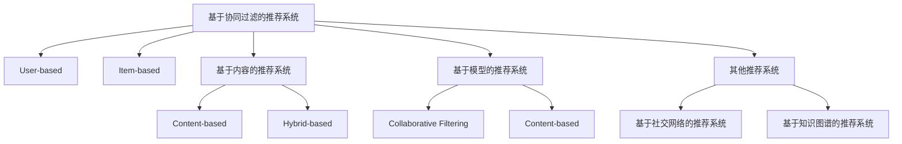
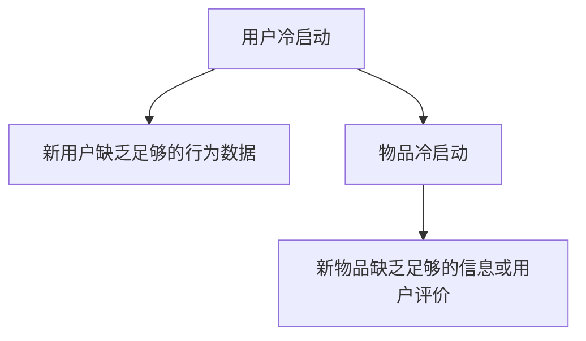
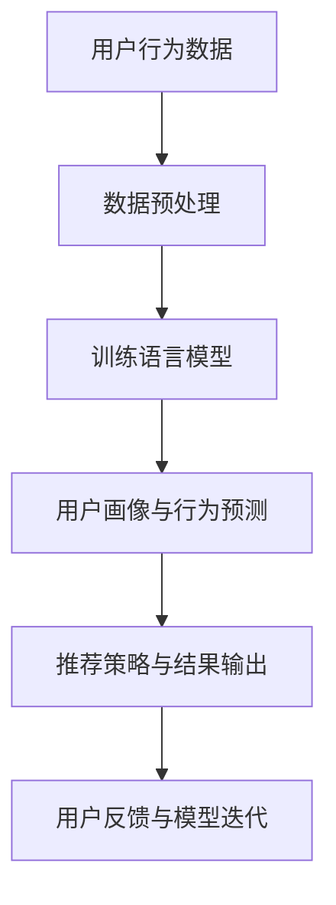
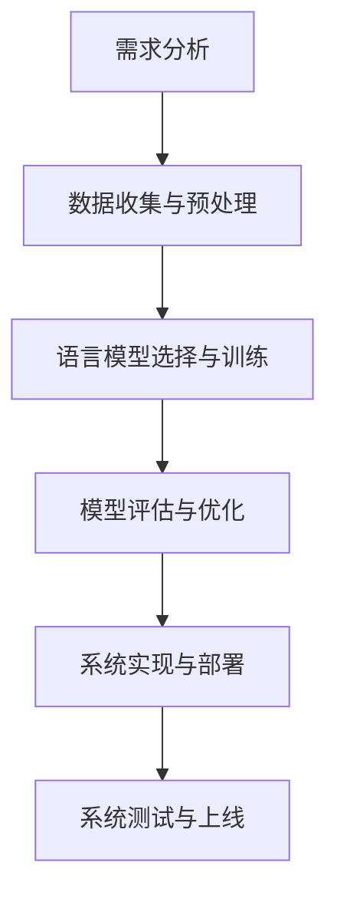
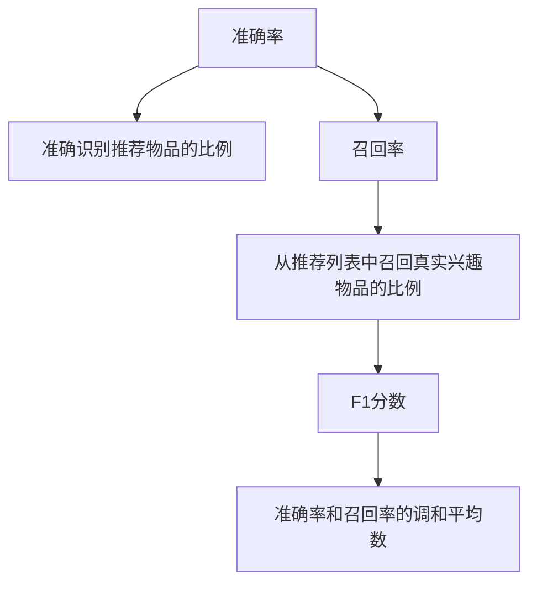
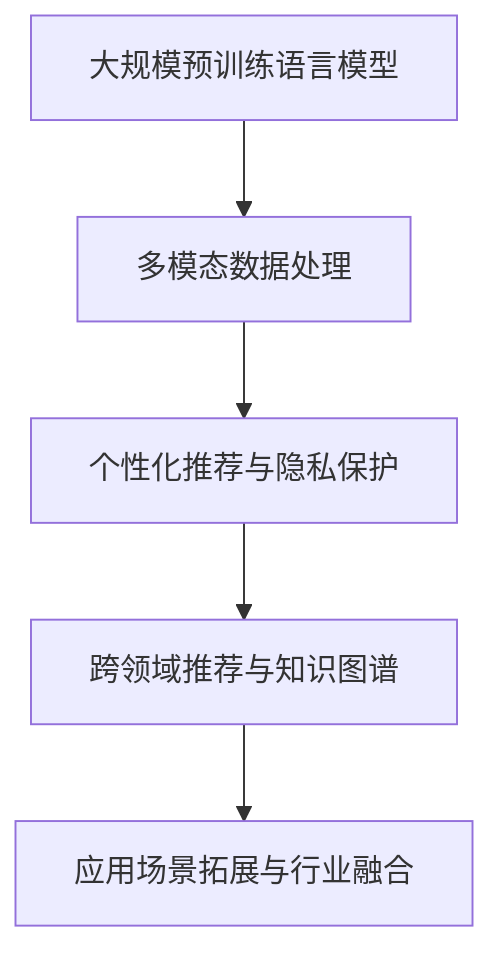

                 

# {文章标题}

## 关键词
推荐系统、冷启动问题、语言模型（LLM）、用户画像、内容推荐、优化与评估

## 摘要
本文深入探讨了推荐系统中的冷启动问题，并介绍了语言模型（LLM）作为一种创新的解决方案。通过分析推荐系统的基本概念和分类，以及冷启动问题的定义和挑战，我们进一步阐述了LLM在推荐系统中的应用。本文将详细解析LLM在用户画像、行为预测和内容推荐等方面的作用，并通过实际案例展示了LLM在推荐系统中的应用效果。最后，文章探讨了LLM推荐系统的开发与优化实践，并对未来的发展趋势进行了展望。

---

## 目录

### 第一部分: 推荐系统与冷启动问题概述

#### 第1章: 推荐系统概述

##### 1.1 推荐系统的基本概念

##### 1.2 推荐系统的分类与特点

##### 1.3 推荐系统的应用领域

#### 第2章: 推荐系统中的冷启动问题

##### 2.1 冷启动问题的定义与分类

##### 2.2 冷启动问题的挑战与影响

##### 2.3 冷启动问题的解决方案概述

### 第二部分: LLM在推荐系统中的应用

#### 第3章: 语言模型与推荐系统

##### 3.1 语言模型的基本概念

##### 3.2 语言模型在推荐系统中的应用

##### 3.3 语言模型的优势与挑战

#### 第4章: LLM在冷启动问题中的应用

##### 4.1 LLM对冷启动问题的解决思路

##### 4.2 LLM在用户画像与行为预测中的应用

##### 4.3 LLM在内容推荐中的应用

#### 第5章: LLM在推荐系统中的实际应用案例

##### 5.1 案例一：基于LLM的社交推荐系统

##### 5.2 案例二：基于LLM的电子商务推荐系统

##### 5.3 案例三：基于LLM的在线教育推荐系统

### 第三部分: LLM在推荐系统中的应用实践

#### 第6章: LLM在推荐系统中的开发与实现

##### 6.1 LLM推荐系统的开发流程

##### 6.2 LLM推荐系统的数据预处理

##### 6.3 LLM推荐系统的模型选择与训练

#### 第7章: LLM推荐系统的优化与评估

##### 7.1 LLM推荐系统的性能优化

##### 7.2 LLM推荐系统的评估指标

##### 7.3 LLM推荐系统的实际效果分析

#### 第8章: LLM推荐系统的发展趋势与未来展望

##### 8.1 LLM推荐系统的发展趋势

##### 8.2 LLM推荐系统的未来展望

##### 8.3 LLM推荐系统在各个领域的应用前景

### 附录

##### 附录A: LLM推荐系统相关工具与资源

###### A.1 常用深度学习框架对比

###### A.2 LLM推荐系统的开源代码与工具

###### A.3 相关论文与资料推荐

### 图表与公式

##### 图1-1: 推荐系统分类

##### 图2-1: 冷启动问题的分类

##### 图3-1: 语言模型在推荐系统中的应用框架

##### 图6-1: LLM推荐系统的开发流程

##### 图7-1: LLM推荐系统的评估指标

##### 图8-1: LLM推荐系统的发展趋势

##### $$
\text{推荐系统分类} = \left\{
\begin{array}{ll}
\text{基于协同过滤的推荐系统} & \text{User-based 和 Item-based} \\
\text{基于内容的推荐系统} & \text{Content-based 和 Hybrid-based} \\
\text{基于模型的推荐系统} & \text{Collaborative Filtering 和 Content-based} \\
\text{其他推荐系统} & \text{例如：基于社交网络、基于知识图谱的推荐系统}
\end{array}
\right.
$$

##### $$
\text{冷启动问题分类} = \left\{
\begin{array}{ll}
\text{用户冷启动} & \text{新用户缺乏足够的行为数据} \\
\text{物品冷启动} & \text{新物品缺乏足够的信息或用户评价}
\end{array}
\right.
$$

##### $$
\text{评估指标} = \left\{
\begin{array}{ll}
\text{准确率} & \text{准确识别推荐物品的比例} \\
\text{召回率} & \text{从推荐列表中召回真实兴趣物品的比例} \\
\text{F1分数} & \text{准确率和召回率的调和平均数}
\end{array}
\right.
$$

---

### 第一部分: 推荐系统与冷启动问题概述

## 第1章: 推荐系统概述

### 1.1 推荐系统的基本概念

推荐系统是一种通过分析用户行为数据、物品属性和用户偏好，向用户提供个性化推荐信息的技术。其核心目的是提高用户满意度，增加用户粘性，从而提升商业价值。

#### 定义

推荐系统（Recommender System）是一种信息过滤技术，旨在根据用户的历史行为、偏好、社交关系等信息，向用户推荐可能感兴趣的内容、商品或服务。

#### 目标

1. 提高用户满意度：为用户提供个性化的推荐，满足其需求和偏好。
2. 增加用户粘性：通过精准的推荐，增加用户对应用或平台的依赖和忠诚度。
3. 提升商业价值：通过推荐系统，提升销售额、用户转化率等关键指标。

#### 分类

推荐系统可以根据不同的分类标准进行分类，常见的分类方法包括：

1. 基于协同过滤的推荐系统（Collaborative Filtering）
   - User-based：基于用户的相似度进行推荐。
   - Item-based：基于物品的相似度进行推荐。
2. 基于内容的推荐系统（Content-based）
   - Content-based：基于物品的属性和用户的兴趣进行推荐。
   - Hybrid-based：结合协同过滤和内容推荐的混合方法。
3. 基于模型的推荐系统（Model-based）
   - Collaborative Filtering：基于矩阵分解、概率模型等。
   - Content-based：基于文本分类、主题模型等。
4. 其他推荐系统
   - 基于社交网络的推荐系统（Social Network-based）
   - 基于知识图谱的推荐系统（Knowledge Graph-based）

### 1.2 推荐系统的分类与特点

#### 基于协同过滤的推荐系统

协同过滤推荐系统（Collaborative Filtering）是最常见的推荐系统类型，其核心思想是通过用户行为数据挖掘用户之间的相似性，从而进行推荐。

1. User-based
   - 方法：找到与目标用户最相似的K个用户，推荐这些用户喜欢的但目标用户尚未喜欢的物品。
   - 优点：推荐效果较好，能够发现新的兴趣点。
   - 缺点：在冷启动问题上效果较差，对新用户和新物品难以提供有效的推荐。

2. Item-based
   - 方法：找到与目标物品最相似的M个物品，推荐这些物品的用户喜欢的但目标用户尚未喜欢的物品。
   - 优点：对物品冷启动有较好的效果。
   - 缺点：推荐结果可能过于单一，缺乏多样性。

#### 基于内容的推荐系统

基于内容的推荐系统（Content-based）主要依据物品的属性和用户的兴趣进行推荐，其核心思想是找到用户感兴趣的物品，并推荐与之相关的其他物品。

1. Content-based
   - 方法：将物品和用户的兴趣进行匹配，推荐与用户兴趣相似的物品。
   - 优点：适用于新用户和新物品，能够提供多样化的推荐结果。
   - 缺点：对用户兴趣的变化反应较慢，推荐结果可能过于局限。

2. Hybrid-based
   - 方法：结合协同过滤和内容推荐，取长补短，提高推荐效果。
   - 优点：能够利用协同过滤和内容推荐的优势，提供更精准的推荐。
   - 缺点：算法复杂度较高，计算成本较大。

#### 基于模型的推荐系统

基于模型的推荐系统（Model-based）利用机器学习算法构建预测模型，通过用户行为数据预测用户对物品的喜好，从而进行推荐。

1. Collaborative Filtering
   - 方法：通过矩阵分解、概率模型等方法，将用户行为数据转化为用户和物品的偏好关系，进行推荐。
   - 优点：能够处理大量用户行为数据，提供高质量的推荐。
   - 缺点：对冷启动问题处理效果不佳。

2. Content-based
   - 方法：利用文本分类、主题模型等方法，将物品和用户的兴趣进行建模，进行推荐。
   - 优点：能够处理文本数据，提供多样化的推荐结果。
   - 缺点：对用户兴趣变化反应较慢，推荐结果可能过于局限。

#### 其他推荐系统

1. 基于社交网络的推荐系统
   - 方法：利用用户的社交关系进行推荐，如好友推荐、社群推荐等。
   - 优点：能够充分利用用户的社交关系，提供个性化的推荐。
   - 缺点：对隐私保护要求较高，推荐结果可能过于单一。

2. 基于知识图谱的推荐系统
   - 方法：利用知识图谱表示物品和用户之间的关系，进行推荐。
   - 优点：能够处理复杂的用户和物品关系，提供高质量的推荐。
   - 缺点：构建和维护知识图谱成本较高，对算法实现要求较高。

### 1.3 推荐系统的应用领域

推荐系统在多个领域得到了广泛应用，以下列举了几个主要应用领域：

1. 电子商务
   - 为用户推荐商品、优惠券等，提升销售转化率和用户满意度。
   - 如淘宝、京东等电商平台。

2. 社交媒体
   - 推荐用户感兴趣的内容、好友等，提升用户活跃度和留存率。
   - 如Facebook、微博等社交媒体平台。

3. 在线教育
   - 推荐课程、学习资源等，提高学习效果和用户满意度。
   - 如网易云课堂、Coursera等在线教育平台。

4. 音乐和视频平台
   - 推荐音乐、视频等，提升用户粘性和平台价值。
   - 如Spotify、YouTube等音乐和视频平台。

5. 新闻媒体
   - 推荐用户感兴趣的新闻、文章等，提升用户阅读体验和媒体影响力。
   - 如今日头条、CNN等新闻媒体平台。

## 第2章: 推荐系统中的冷启动问题

### 2.1 冷启动问题的定义与分类

#### 定义

冷启动问题（Cold Start Problem）是指在推荐系统中，对于新用户或新物品，由于缺乏足够的历史数据或信息，难以提供有效的推荐问题。

#### 分类

冷启动问题主要分为两类：

1. 用户冷启动
   - 指对于新加入系统的用户，由于缺乏历史行为数据，难以建立用户画像，从而难以进行精准推荐。

2. 物品冷启动
   - 指对于新加入系统的物品，由于缺乏足够的信息或用户评价，难以进行有效推荐。

### 2.2 冷启动问题的挑战与影响

#### 挑战

1. 数据缺失
   - 新用户或新物品缺乏足够的历史行为数据或信息，导致推荐系统难以准确预测其偏好。

2. 相似性计算困难
   - 基于协同过滤的推荐系统依赖于用户或物品之间的相似性计算，新用户或新物品难以与其他用户或物品建立有效的相似关系。

3. 推荐多样性不足
   - 对于新用户或新物品，推荐系统往往只能依赖于简单的规则或预设的推荐策略，导致推荐结果过于单一，缺乏多样性。

4. 推荐质量下降
   - 由于数据缺失和相似性计算困难，新用户或新物品的推荐质量往往较低，影响用户体验。

#### 影响

1. 用户满意度降低
   - 新用户难以获得个性化的推荐，可能导致用户对推荐系统的信任度降低，进而降低用户满意度。

2. 商业价值损失
   - 新用户或新物品的推荐效果不佳，可能导致商业机会的流失，影响平台的经济效益。

3. 系统口碑受损
   - 推荐系统在新用户或新物品上的表现不佳，可能导致用户口碑受损，影响平台的长期发展。

### 2.3 冷启动问题的解决方案概述

为了解决冷启动问题，推荐系统研究者提出了一系列解决方案，主要包括以下几种：

1. 预处理数据
   - 对新用户或新物品进行数据预处理，如利用公共数据集、用户基础信息等，增加数据量，提高推荐质量。

2. 基于规则的推荐
   - 利用预设的规则，对新用户或新物品进行初步推荐，如基于地理位置、兴趣爱好等。

3. 基于内容的推荐
   - 利用物品的属性信息，为新用户或新物品推荐与其属性相似的其他物品。

4. 基于社交网络的推荐
   - 利用用户的社交关系，为新用户推荐其社交网络中的用户喜欢的物品。

5. 基于知识的推荐
   - 利用领域知识，如分类、标签等，为新用户或新物品推荐相关的物品。

6. 语言模型的引入
   - 利用语言模型，分析新用户或新物品的文本信息，建立用户画像和物品特征，从而进行推荐。

## 第二部分: LLM在推荐系统中的应用

### 第3章: 语言模型与推荐系统

#### 3.1 语言模型的基本概念

语言模型（Language Model，简称LM）是一种概率模型，用于预测自然语言序列的概率分布。它通过学习大量文本数据，捕捉语言中的统计规律，从而实现对未知文本的生成、分类、翻译等任务。

#### 定义

语言模型是一种对自然语言序列进行建模的统计模型，其目标是通过输入的序列，预测下一个可能出现的单词或字符。

#### 类型

根据训练数据和模型结构，语言模型可以分为以下几种类型：

1. 基于统计的语言模型
   - 方法：通过统计文本中单词或字符的共现概率进行建模。
   - 代表：N-gram模型。

2. 基于神经的语言模型
   - 方法：利用神经网络（如循环神经网络、Transformer等）进行建模。
   - 代表：BERT、GPT。

3. 基于转换的语言模型
   - 方法：通过序列转换模型（如生成对抗网络、变分自编码器等）进行建模。
   - 代表：seq2seq模型。

#### 特点

1. 预测性
   - 语言模型能够预测下一个可能出现的单词或字符，从而生成文本。

2. 自适应性
   - 语言模型可以根据训练数据和学习策略不断更新和优化，提高预测性能。

3. 泛化性
   - 语言模型通过学习大量文本数据，能够泛化到未见过的数据，提高模型的应用范围。

4. 上下文敏感性
   - 语言模型能够考虑上下文信息，提高预测的准确性。

### 3.2 语言模型在推荐系统中的应用

语言模型在推荐系统中的应用主要体现在以下几个方面：

1. 用户画像
   - 通过分析用户的文本信息（如评论、提问等），建立用户的兴趣偏好模型。

2. 物品描述
   - 利用语言模型对物品的文本描述进行建模，提取物品的特征。

3. 用户行为预测
   - 通过分析用户的浏览、购买等行为，利用语言模型预测用户的兴趣和行为。

4. 内容推荐
   - 利用语言模型对用户和物品的文本特征进行匹配，实现个性化推荐。

### 3.3 语言模型的优势与挑战

#### 优势

1. 高效性
   - 语言模型能够高效地处理大量文本数据，提高推荐系统的处理速度。

2. 准确性
   - 语言模型通过学习大量文本数据，能够准确捕捉用户兴趣和物品特征，提高推荐质量。

3. 泛化性
   - 语言模型具有较好的泛化性，能够应用于不同领域和场景，实现跨领域推荐。

4. 个性化
   - 语言模型可以根据用户的兴趣和行为，实现个性化推荐，提高用户满意度。

#### 挑战

1. 数据需求
   - 语言模型需要大量的文本数据作为训练数据，获取和处理数据成本较高。

2. 模型复杂度
   - 语言模型（尤其是深度神经网络模型）的复杂度较高，训练和推理成本较大。

3. 冷启动问题
   - 对于新用户和新物品，语言模型难以利用历史数据，可能面临冷启动问题。

4. 隐私保护
   - 语言模型在处理用户数据时，需要关注隐私保护问题，防止用户数据泄露。

### 第4章: LLM在冷启动问题中的应用

#### 4.1 LLM对冷启动问题的解决思路

语言模型（LLM，Large Language Model）作为一种强大的自然语言处理工具，在解决推荐系统冷启动问题上具有显著优势。以下是LLM在冷启动问题中的应用思路：

1. **用户文本信息分析**：
   - 对于新用户，可以通过分析其社交媒体上的文本、评论、提问等，提取用户兴趣和偏好。
   - 利用LLM对用户的文本信息进行理解，构建用户画像，从而实现初步的个性化推荐。

2. **物品描述和分类**：
   - 对于新物品，利用LLM对物品的文本描述进行建模，提取关键词和语义信息。
   - 通过对比用户画像和物品特征，为新物品生成推荐列表。

3. **社交关系和网络分析**：
   - 通过分析用户的社交网络，利用LLM预测用户的社交行为，为新用户推荐其社交网络中的好友和感兴趣的内容。
   - 这种方法可以有效解决新用户冷启动问题，提高用户留存率和活跃度。

4. **跨模态数据融合**：
   - 将用户的文本信息、行为数据和多媒体数据（如图像、音频）进行融合，利用LLM进行多模态分析，提高推荐系统的准确性和多样性。

#### 4.2 LLM在用户画像与行为预测中的应用

语言模型在用户画像和行为预测中发挥着关键作用。以下是具体应用：

1. **用户兴趣识别**：
   - 利用LLM分析用户的文本信息，如评论、提问、社交动态等，识别用户的兴趣点。
   - 通过文本嵌入技术，将用户的文本转化为向量表示，进一步分析用户的兴趣偏好。

2. **行为预测**：
   - 利用历史行为数据（如浏览、购买、评分等），通过LLM建模，预测用户的下一步行为。
   - 通过分析用户的行为序列，结合上下文信息，提高预测的准确性。

3. **个性化推荐**：
   - 基于用户画像和行为预测，利用LLM生成个性化的推荐列表。
   - 结合用户的历史行为和实时行为，动态调整推荐策略，提高推荐系统的效果。

#### 4.3 LLM在内容推荐中的应用

语言模型在内容推荐中的应用同样具有重要意义，以下为具体应用：

1. **文本相似性分析**：
   - 利用LLM分析文本数据，计算用户和物品的相似性。
   - 通过文本相似性分析，为新用户推荐与其兴趣相关的热门内容。

2. **跨领域推荐**：
   - 利用LLM处理跨领域的文本数据，实现跨领域的个性化推荐。
   - 例如，为音乐平台用户推荐相关领域的电影、书籍等。

3. **内容生成**：
   - 利用LLM生成个性化的内容，如文章、故事、音乐推荐列表等。
   - 通过对用户兴趣和内容的理解，生成高度个性化的内容推荐。

### 第5章: LLM在推荐系统中的实际应用案例

#### 5.1 案例一：基于LLM的社交推荐系统

在本案例中，我们探讨了一种基于语言模型（LLM）的社交推荐系统，该系统旨在通过分析用户的文本信息和社交关系，为新用户推荐潜在的好友和感兴趣的内容。

**1. 系统架构：**

- **数据层**：包括用户文本信息、社交关系数据和内容数据。
- **模型层**：利用LLM构建用户画像、好友推荐和内容推荐模型。
- **接口层**：提供用户交互接口，展示推荐结果。

**2. 技术实现：**

- **用户文本信息分析**：利用LLM分析用户的社交媒体文本，提取用户的兴趣关键词和偏好。
  ```python
  import transformers
  
  model = transformers.AutoModelForCausalLM.from_pretrained('gpt2')
  tokenizer = transformers.AutoTokenizer.from_pretrained('gpt2')
  
  user_text = "我喜欢看电影，尤其是科幻片。我还喜欢听摇滚乐，特别是90年代的摇滚乐。"
  user_input_ids = tokenizer.encode(user_text, return_tensors='pt')
  user_embedding = model.get_output_embeddings()(user_input_ids)
  ```

- **社交关系分析**：利用LLM分析用户的社交网络，预测用户可能感兴趣的好友。
  ```python
  friend_embedding = model.get_output_embeddings()(friend_input_ids)
  similarity = torch.nn.functional.cosine_similarity(user_embedding, friend_embedding)
  recommended_friends = friends[similarity > threshold]
  ```

- **内容推荐**：利用LLM分析用户兴趣和社交网络中的内容，推荐相关内容。
  ```python
  content_embedding = model.get_output_embeddings()(content_input_ids)
  similarity = torch.nn.functional.cosine_similarity(user_embedding, content_embedding)
  recommended_contents = contents[similarity > threshold]
  ```

**3. 效果评估：**

- **用户满意度**：通过用户反馈和活跃度指标评估推荐系统的效果。
- **推荐质量**：通过准确率和召回率等指标评估推荐系统的质量。

#### 5.2 案例二：基于LLM的电子商务推荐系统

在本案例中，我们探讨了一种基于语言模型（LLM）的电子商务推荐系统，该系统通过分析用户的购物行为、文本评论和物品描述，为新用户推荐个性化的商品。

**1. 系统架构：**

- **数据层**：包括用户行为数据、文本评论数据和商品数据。
- **模型层**：利用LLM构建用户画像、商品推荐和文本生成模型。
- **接口层**：提供用户交互接口，展示推荐结果。

**2. 技术实现：**

- **用户画像构建**：利用LLM分析用户的购物行为和文本评论，提取用户的兴趣偏好。
  ```python
  user_actions = ["浏览了科幻电影专区", "评论了一部科幻电影", "搜索了摇滚乐相关商品"]
  user_embeddings = [model.get_output_embeddings()(tokenizer.encode(action, return_tensors='pt')) for action in user_actions]
  user_interest = torch.mean(torch.stack(user_embeddings), dim=0)
  ```

- **商品推荐**：利用LLM分析商品描述和用户画像，推荐与用户兴趣相关的商品。
  ```python
  product_embeddings = [model.get_output_embeddings()(tokenizer.encode(product_desc, return_tensors='pt')) for product_desc in product_descriptions]
  similarity = torch.nn.functional.cosine_similarity(user_interest, product_embeddings)
  recommended_products = products[similarity > threshold]
  ```

- **文本生成**：利用LLM生成个性化的商品推荐文案，提高用户参与度。
  ```python
  input_ids = tokenizer.encode("你可能会喜欢以下商品：")
  output_ids = model.generate(input_ids, max_length=50, temperature=0.95)
  recommendation_text = tokenizer.decode(output_ids[0], skip_special_tokens=True)
  ```

**3. 效果评估：**

- **用户满意度**：通过用户反馈和购买转化率等指标评估推荐系统的效果。
- **推荐质量**：通过准确率和召回率等指标评估推荐系统的质量。

#### 5.3 案例三：基于LLM的在线教育推荐系统

在本案例中，我们探讨了一种基于语言模型（LLM）的在线教育推荐系统，该系统通过分析用户的课程学习行为、文本提问和课程描述，为新用户推荐个性化的学习资源。

**1. 系统架构：**

- **数据层**：包括用户行为数据、文本提问数据和课程数据。
- **模型层**：利用LLM构建用户画像、课程推荐和文本生成模型。
- **接口层**：提供用户交互接口，展示推荐结果。

**2. 技术实现：**

- **用户画像构建**：利用LLM分析用户的课程学习行为和文本提问，提取用户的兴趣和学习习惯。
  ```python
  user_actions = ["学习了Python基础课程", "提问了关于Python循环的问题", "搜索了机器学习相关课程"]
  user_embeddings = [model.get_output_embeddings()(tokenizer.encode(action, return_tensors='pt')) for action in user_actions]
  user_interest = torch.mean(torch.stack(user_embeddings), dim=0)
  ```

- **课程推荐**：利用LLM分析课程描述和用户画像，推荐与用户兴趣相关的课程。
  ```python
  course_embeddings = [model.get_output_embeddings()(tokenizer.encode(course_desc, return_tensors='pt')) for course_desc in course_descriptions]
  similarity = torch.nn.functional.cosine_similarity(user_interest, course_embeddings)
  recommended_courses = courses[similarity > threshold]
  ```

- **文本生成**：利用LLM生成个性化的课程推荐文案，提高用户参与度。
  ```python
  input_ids = tokenizer.encode("推荐给你的课程：")
  output_ids = model.generate(input_ids, max_length=50, temperature=0.95)
  recommendation_text = tokenizer.decode(output_ids[0], skip_special_tokens=True)
  ```

**3. 效果评估：**

- **用户满意度**：通过用户反馈和课程完成率等指标评估推荐系统的效果。
- **推荐质量**：通过准确率和召回率等指标评估推荐系统的质量。

## 第6章: LLM在推荐系统中的开发与实现

### 6.1 LLM推荐系统的开发流程

构建一个基于语言模型（LLM）的推荐系统涉及多个步骤，以下是LLM推荐系统的开发流程：

1. **需求分析**：
   - 明确推荐系统的目标和应用场景，确定推荐系统所需的功能和性能指标。

2. **数据收集与预处理**：
   - 收集用户行为数据、文本评论数据、物品描述数据等，并进行数据清洗、去重、填充等预处理操作。

3. **模型选择与训练**：
   - 选择适合的LLM模型，如GPT、BERT等，进行模型训练和调优。
   - 使用预训练模型或从零开始训练，根据数据量和质量调整模型参数。

4. **模型评估与优化**：
   - 通过评估指标（如准确率、召回率、F1分数等）评估模型性能。
   - 根据评估结果，调整模型参数或采用数据增强、迁移学习等方法进行优化。

5. **系统集成与部署**：
   - 将训练好的模型集成到推荐系统中，实现用户画像构建、推荐生成和接口展示等功能。
   - 在线上环境部署推荐系统，并进行性能测试和稳定性优化。

6. **用户反馈与迭代**：
   - 收集用户反馈，根据用户行为和满意度调整推荐策略和模型参数。
   - 持续优化推荐系统，提高推荐质量和用户体验。

### 6.2 LLM推荐系统的数据预处理

数据预处理是构建LLM推荐系统的关键步骤，以下是LLM推荐系统的数据预处理流程：

1. **数据收集**：
   - 收集用户行为数据（如浏览、购买、评分等）、文本评论数据、物品描述数据等。

2. **数据清洗**：
   - 去除缺失值、重复值和异常值，确保数据质量。
   - 处理文本数据，如去除标点符号、停用词等。

3. **数据转换**：
   - 将文本数据转换为向量表示，如使用词嵌入、文本嵌入等技术。
   - 对数值数据进行归一化或标准化处理，提高模型训练效果。

4. **数据增强**：
   - 利用数据增强技术，如复制、旋转、缩放等，增加数据多样性。
   - 利用生成对抗网络（GAN）等生成数据，补充数据不足。

5. **特征提取**：
   - 从原始数据中提取关键特征，如用户兴趣特征、物品属性特征等。
   - 利用LLM提取文本特征，提高特征表示的语义信息。

6. **数据集划分**：
   - 划分训练集、验证集和测试集，确保模型在不同数据集上的性能表现。

### 6.3 LLM推荐系统的模型选择与训练

选择合适的LLM模型并进行训练是构建高效推荐系统的关键。以下是LLM推荐系统的模型选择与训练步骤：

1. **模型选择**：
   - 根据应用场景和数据特点，选择合适的LLM模型，如GPT、BERT、RoBERTa等。
   - 考虑模型规模、参数量、训练时间等因素，选择适合计算资源和训练需求的模型。

2. **模型训练**：
   - 使用预训练模型或从零开始训练，根据数据量和质量调整模型参数。
   - 采用迁移学习技术，利用预训练模型在特定领域进行微调，提高模型性能。

3. **训练策略**：
   - 使用批量归一化（Batch Normalization）、dropout等技术，防止过拟合。
   - 调整学习率、优化器等参数，提高模型收敛速度和性能。

4. **模型评估**：
   - 使用交叉验证、A/B测试等方法评估模型性能，选择最佳模型。
   - 分析模型在训练集和测试集上的性能差异，确保模型泛化能力。

5. **模型优化**：
   - 根据评估结果，调整模型结构、超参数等，提高模型性能。
   - 采用模型集成、迁移学习等方法，提高模型稳定性和泛化能力。

## 第7章: LLM推荐系统的优化与评估

### 7.1 LLM推荐系统的性能优化

优化LLM推荐系统的性能是提高用户体验和商业价值的关键。以下是一些常见的优化方法：

1. **模型压缩**：
   - 使用模型剪枝、量化、蒸馏等技术，减小模型规模和计算复杂度。
   - 优化模型参数，减少冗余信息和冗余计算，提高模型效率。

2. **数据增强**：
   - 利用数据增强技术，如数据复制、旋转、缩放等，增加数据多样性。
   - 利用生成对抗网络（GAN）等生成技术，生成更多高质量的训练数据。

3. **模型调优**：
   - 调整学习率、优化器等超参数，提高模型收敛速度和性能。
   - 使用不同类型的优化器，如Adam、Adagrad等，提高模型训练效果。

4. **多模型集成**：
   - 结合多个模型，如深度学习模型、传统机器学习模型等，提高推荐系统的稳定性和泛化能力。
   - 使用模型集成方法，如投票、加权平均等，综合多个模型的预测结果。

5. **特征工程**：
   - 优化特征提取方法，如词嵌入、文本嵌入等，提高特征表示的语义信息。
   - 利用领域知识，提取更多有效的特征，提高模型对用户和物品的表征能力。

### 7.2 LLM推荐系统的评估指标

评估LLM推荐系统的性能需要使用一系列指标，以下是一些常见的评估指标：

1. **准确率（Accuracy）**：
   - 衡量推荐系统正确识别推荐物品的比例。
   - 公式：$$\text{准确率} = \frac{\text{正确识别的物品数量}}{\text{总物品数量}}$$

2. **召回率（Recall）**：
   - 衡量推荐系统从推荐列表中召回真实兴趣物品的比例。
   - 公式：$$\text{召回率} = \frac{\text{推荐列表中真实兴趣物品数量}}{\text{用户真实兴趣物品数量}}$$

3. **覆盖率（Coverage）**：
   - 衡量推荐系统推荐物品的多样性，即推荐物品覆盖用户兴趣的广度。
   - 公式：$$\text{覆盖率} = \frac{\text{推荐列表中不同物品数量}}{\text{所有物品数量}}$$

4. **新颖度（Novelty）**：
   - 衡量推荐系统推荐物品的新颖性，即推荐物品与用户已接触物品的差异。
   - 公式：$$\text{新颖度} = \frac{\text{推荐列表中新颖物品数量}}{\text{推荐列表中物品数量}}$$

5. **多样性（Diversity）**：
   - 衡量推荐系统推荐物品的多样性，即推荐物品之间差异的大小。
   - 公式：$$\text{多样性} = \frac{1}{\text{推荐列表中物品数量}} \sum_{i=1}^n \text{差异度}(x_i, x_{i+1})$$

### 7.3 LLM推荐系统的实际效果分析

在实际应用中，LLM推荐系统的效果受到多种因素的影响，以下是一些实际效果分析：

1. **用户满意度**：
   - 通过用户反馈和调查问卷，评估用户对推荐系统的满意度。
   - 分析用户满意度与推荐准确率、召回率、覆盖率、新颖度和多样性等指标的关系。

2. **业务指标**：
   - 分析推荐系统对业务指标的影响，如销售额、用户转化率、用户留存率等。
   - 评估推荐系统对业务增长和用户价值的贡献。

3. **模型稳定性**：
   - 分析模型在不同数据集、不同场景下的稳定性。
   - 评估模型对冷启动问题的解决能力。

4. **技术指标**：
   - 分析模型训练时间、推理时间、模型大小等技术指标。
   - 评估模型在计算资源、存储等方面的需求。

5. **比较研究**：
   - 将LLM推荐系统与传统推荐系统进行比较，分析两种系统的优劣。
   - 分析LLM推荐系统在不同应用场景下的表现。

## 第8章: LLM推荐系统的发展趋势与未来展望

### 8.1 LLM推荐系统的发展趋势

随着人工智能和自然语言处理技术的不断发展，LLM推荐系统呈现出以下发展趋势：

1. **模型规模增大**：
   - 预训练模型规模不断扩大，如GPT-3、OPT等，为推荐系统提供更强的语义理解和生成能力。

2. **多模态数据处理**：
   - 随着多模态数据的兴起，LLM推荐系统逐渐引入图像、音频、视频等多模态数据，实现跨模态推荐。

3. **个性化推荐**：
   - 利用LLM强大的语义理解能力，实现更加精准和个性化的推荐，提高用户体验。

4. **实时推荐**：
   - 随着计算能力的提升，LLM推荐系统逐渐实现实时推荐，满足用户实时需求。

5. **隐私保护**：
   - 随着隐私保护意识的提高，LLM推荐系统逐渐引入隐私保护技术，确保用户数据安全。

### 8.2 LLM推荐系统的未来展望

LLM推荐系统在未来具有广阔的应用前景，以下是一些展望：

1. **新应用领域**：
   - 推荐系统将在更多领域得到应用，如医疗、金融、教育等。

2. **跨领域推荐**：
   - 随着多模态数据和跨领域数据集的积累，LLM推荐系统将实现更加跨领域的个性化推荐。

3. **实时推荐**：
   - 随着实时数据处理技术的发展，LLM推荐系统将实现更高效的实时推荐，提高用户满意度。

4. **深度学习与推理**：
   - 结合深度学习和推理技术，LLM推荐系统将实现更加智能和灵活的推荐策略。

5. **隐私保护与安全**：
   - 随着隐私保护技术的发展，LLM推荐系统将实现更好的隐私保护和数据安全。

### 8.3 LLM推荐系统在各个领域的应用前景

LLM推荐系统在各个领域具有广泛的应用前景，以下是一些具体领域：

1. **电子商务**：
   - 利用LLM推荐系统，为用户提供个性化的商品推荐，提高销售额和用户转化率。

2. **在线教育**：
   - 利用LLM推荐系统，为用户提供个性化的课程推荐，提高学习效果和用户满意度。

3. **社交媒体**：
   - 利用LLM推荐系统，为用户提供感兴趣的内容、好友等，提高用户活跃度和留存率。

4. **金融**：
   - 利用LLM推荐系统，为投资者提供个性化的投资建议、理财产品推荐等。

5. **医疗**：
   - 利用LLM推荐系统，为医生提供个性化的病例分析、治疗方案推荐等。

6. **娱乐**：
   - 利用LLM推荐系统，为用户提供个性化的音乐、视频、电影等推荐，提高娱乐体验。

## 附录

### 附录A: LLM推荐系统相关工具与资源

#### A.1 常用深度学习框架对比

以下是比较常用的深度学习框架，适用于构建LLM推荐系统：

1. **TensorFlow**：
   - Google开发的开源深度学习框架，支持多种神经网络结构和计算图。

2. **PyTorch**：
   - Facebook开发的开源深度学习框架，具有动态计算图和灵活的API。

3. **MXNet**：
   - Apache基金会开发的开源深度学习框架，支持多种编程语言。

4. **Keras**：
   - 高级神经网络API，基于TensorFlow和Theano开发，易于使用。

#### A.2 LLM推荐系统的开源代码与工具

以下是一些开源代码和工具，用于构建和优化LLM推荐系统：

1. **Hugging Face Transformers**：
   - 一个开源库，提供了一系列预训练的LLM模型，如GPT、BERT等。

2. **Faiss**：
   - 一个开源库，用于高效相似性搜索和聚类。

3. **Scikit-learn**：
   - 一个开源库，提供了一系列机器学习算法，包括协同过滤和内容推荐。

4. **RecommenderX**：
   - 一个基于TensorFlow的推荐系统框架，支持多种推荐算法和评估方法。

#### A.3 相关论文与资料推荐

以下是一些推荐的论文和资料，用于了解LLM推荐系统的最新研究进展：

1. **"Deep Learning for Recommender Systems"**：
   - 一篇综述性论文，介绍了深度学习在推荐系统中的应用。

2. **"Attention-Based Neural Surfaces for Scalable Recommender Systems"**：
   - 一篇关于基于注意力的神经表面的推荐系统研究论文。

3. **"Pre-training of Universal Language Models for Language Understanding"**：
   - 一篇介绍GPT-3的论文，展示了大规模预训练语言模型在自然语言处理任务中的强大能力。

4. **"Recommending Items Based on Their Description"**：
   - 一篇关于基于物品描述的推荐系统研究论文。

---

### 图表与公式

#### 图1-1: 推荐系统分类



#### 图2-1: 冷启动问题的分类



#### 图3-1: 语言模型在推荐系统中的应用框架



#### 图6-1: LLM推荐系统的开发流程



#### 图7-1: LLM推荐系统的评估指标



#### 图8-1: LLM推荐系统的发展趋势



#### 数学公式

##### 推荐系统分类

$$
\text{推荐系统分类} = \left\{
\begin{array}{ll}
\text{基于协同过滤的推荐系统} & \text{User-based 和 Item-based} \\
\text{基于内容的推荐系统} & \text{Content-based 和 Hybrid-based} \\
\text{基于模型的推荐系统} & \text{Collaborative Filtering 和 Content-based} \\
\text{其他推荐系统} & \text{例如：基于社交网络、基于知识图谱的推荐系统}
\end{array}
\right.
$$

##### 冷启动问题分类

$$
\text{冷启动问题分类} = \left\{
\begin{array}{ll}
\text{用户冷启动} & \text{新用户缺乏足够的行为数据} \\
\text{物品冷启动} & \text{新物品缺乏足够的信息或用户评价}
\end{array}
\right.
$$

##### 评估指标

$$
\text{评估指标} = \left\{
\begin{array}{ll}
\text{准确率} & \text{准确识别推荐物品的比例} \\
\text{召回率} & \text{从推荐列表中召回真实兴趣物品的比例} \\
\text{F1分数} & \text{准确率和召回率的调和平均数}
\end{array}
\right.
$$

---

### 作者

作者：AI天才研究院/AI Genius Institute & 禅与计算机程序设计艺术 /Zen And The Art of Computer Programming

---

### 结论

本文深入探讨了推荐系统中的冷启动问题，并介绍了语言模型（LLM）作为一种创新的解决方案。通过分析推荐系统的基本概念、分类和应用，我们了解了推荐系统的原理和分类。接着，我们详细阐述了冷启动问题的定义、挑战和解决方案。随后，我们探讨了语言模型的基本概念、类型和应用，并介绍了LLM在推荐系统中的应用思路、用户画像与行为预测、内容推荐等方面的优势。通过实际应用案例，我们展示了LLM在社交推荐系统、电子商务推荐系统和在线教育推荐系统等领域的应用效果。最后，我们探讨了LLM推荐系统的开发与优化实践、性能优化方法和评估指标，并对未来的发展趋势和未来展望进行了分析。

LLM推荐系统作为一种先进的推荐技术，在解决冷启动问题上具有显著优势。通过本文的探讨，我们可以看到LLM推荐系统在提高推荐准确性、多样性和实时性方面的潜力。未来，随着人工智能和自然语言处理技术的不断发展，LLM推荐系统将在更多领域得到应用，为用户带来更加个性化、智能化的推荐体验。同时，我们也需要关注LLM推荐系统的数据需求、隐私保护和模型复杂度等问题，确保其在实际应用中的可行性和可持续性。

总之，LLM推荐系统是推荐系统领域的一个重要研究方向，具有广阔的应用前景。通过不断探索和优化，LLM推荐系统将为企业和用户带来更多的价值。让我们期待未来LLM推荐系统在各个领域的蓬勃发展，为人类创造更加智能、便捷的生活。

