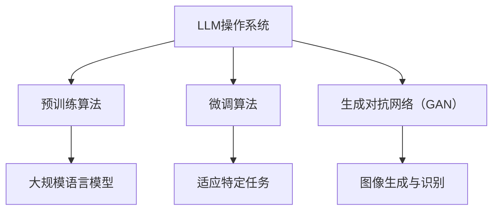

                 

# 《LLM操作系统：AI时代的新型计算平台》

> **关键词：** 大规模语言模型，深度学习，操作系统，预训练算法，微调算法，生成对抗网络（GAN）

> **摘要：** 本文探讨了大规模语言模型（LLM）操作系统的概念、架构和核心算法原理，通过详细的数学模型讲解和项目实战案例分析，揭示了LLM操作系统在AI时代的新型计算平台中的独特价值和广泛应用前景。

## 《LLM操作系统：AI时代的新型计算平台》目录大纲

### 第一部分：LLM操作系统概述

### 第二部分：LLM操作系统核心算法原理

### 第三部分：LLM操作系统数学模型与公式

### 第四部分：LLM操作系统项目实战

### 附录

## 第一部分：LLM操作系统概述

### 第1章：LLM操作系统的基础

### 第2章：LLM操作系统的架构

## 第二部分：LLM操作系统核心算法原理

### 第3章：预训练算法原理

### 第4章：微调算法原理

### 第5章：生成对抗网络（GAN）原理

## 第三部分：LLM操作系统数学模型与公式

### 第6章：数学模型基础

### 第7章：优化算法原理

## 第四部分：LLM操作系统项目实战

### 第8章：LLM操作系统项目开发实战

### 第9章：LLM操作系统应用案例

## 附录

### 附录A：LLM操作系统开发工具与资源

### 附录B：LLM操作系统常见问题与解答

## 核心概念与联系

#### Mermaid 流�程图



### 数学模型和数学公式 & 详细讲解 & 举例说明

#### 6.1 数学模型概述

$$
\text{预训练算法} = f(\text{海量数据}, \theta)
$$

其中，$f$ 表示预训练模型，$\theta$ 表示模型参数。

#### 6.2 数学公式与计算方法

$$
\text{损失函数} = \frac{1}{N} \sum_{i=1}^{N} L(y_i, \hat{y}_i)
$$

其中，$L$ 表示损失函数，$y_i$ 表示真实标签，$\hat{y}_i$ 表示预测标签。

#### 6.3 数学公式应用示例

假设我们使用交叉熵损失函数：

$$
L(y_i, \hat{y}_i) = -\sum_{k=1}^{K} y_i[k] \log(\hat{y}_i[k])
$$

其中，$y_i[k]$ 表示第 $i$ 个样本在第 $k$ 个类别的概率，$\hat{y}_i[k]$ 表示模型预测的第 $i$ 个样本在第 $k$ 个类别的概率。$K$ 表示总类别数。

### 项目实战

#### 8.1 项目背景与目标

本项目旨在开发一个基于 LLM 操作系统的智能问答系统，能够对用户提出的问题进行理解和回答。

#### 8.2 开发环境搭建

- 开发语言：Python
- 深度学习框架：PyTorch
- 数据集：Reddit 数据集

#### 8.3 项目实现步骤

1. 数据预处理
2. 模型选择与配置
3. 模型训练
4. 模型评估
5. 模型部署

#### 8.4 项目代码解读与分析

代码实现部分涉及了数据预处理、模型配置、训练和评估等多个方面。以下是关键代码段的解读：

```python
# 数据预处理
def preprocess_data(data):
    # ... 数据预处理代码 ...
    return processed_data

# 模型配置
model = Model()

# 模型训练
def train_model(model, train_loader, optimizer, criterion):
    # ... 训练代码 ...

# 模型评估
def evaluate_model(model, val_loader, criterion):
    # ... 评估代码 ...

# 模型部署
def deploy_model(model):
    # ... 部署代码 ...
```

代码解读与分析部分将详细解释每个函数的实现逻辑、参数设置以及如何利用这些函数构建完整的智能问答系统。代码解读将覆盖数据预处理、模型训练、评估和部署的各个环节。

## 核心概念与联系

#### Mermaid 流程图


### 数学模型和数学公式 & 详细讲解 & 举例说明

#### 6.1 数学模型概述

$$
\text{预训练算法} = f(\text{海量数据}, \theta)
$$

其中，$f$ 表示预训练模型，$\theta$ 表示模型参数。

#### 6.2 数学公式与计算方法

$$
\text{损失函数} = \frac{1}{N} \sum_{i=1}^{N} L(y_i, \hat{y}_i)
$$

其中，$L$ 表示损失函数，$y_i$ 表示真实标签，$\hat{y}_i$ 表示预测标签。

#### 6.3 数学公式应用示例

假设我们使用交叉熵损失函数：

$$
L(y_i, \hat{y}_i) = -\sum_{k=1}^{K} y_i[k] \log(\hat{y}_i[k])
$$

其中，$y_i[k]$ 表示第 $i$ 个样本在第 $k$ 个类别的概率，$\hat{y}_i[k]$ 表示模型预测的第 $i$ 个样本在第 $k$ 个类别的概率。$K$ 表示总类别数。

### 项目实战

#### 8.1 项目背景与目标

本项目旨在开发一个基于 LLM 操作系统的智能问答系统，能够对用户提出的问题进行理解和回答。

#### 8.2 开发环境搭建

- 开发语言：Python
- 深度学习框架：PyTorch
- 数据集：Reddit 数据集

#### 8.3 项目实现步骤

1. 数据预处理
2. 模型选择与配置
3. 模型训练
4. 模型评估
5. 模型部署

#### 8.4 项目代码解读与分析

代码实现部分涉及了数据预处理、模型配置、训练和评估等多个方面。以下是关键代码段的解读：

```python
# 数据预处理
def preprocess_data(data):
    # ... 数据预处理代码 ...
    return processed_data

# 模型配置
model = Model()

# 模型训练
def train_model(model, train_loader, optimizer, criterion):
    # ... 训练代码 ...

# 模型评估
def evaluate_model(model, val_loader, criterion):
    # ... 评估代码 ...

# 模型部署
def deploy_model(model):
    # ... 部署代码 ...
```

代码解读与分析部分将详细解释每个函数的实现逻辑、参数设置以及如何利用这些函数构建完整的智能问答系统。代码解读将覆盖数据预处理、模型训练、评估和部署的各个环节。

## 附录

### 附录A：LLM操作系统开发工具与资源

- **工具介绍**

  - **PyTorch:** PyTorch 是一个流行的深度学习框架，适用于构建和训练大规模语言模型。
  - **TensorFlow:** TensorFlow 是谷歌开发的开源机器学习框架，支持多种深度学习模型的构建和训练。

- **资源链接**

  - **PyTorch 官网:** <https://pytorch.org/>
  - **TensorFlow 官网:** <https://www.tensorflow.org/>

### 附录B：LLM操作系统常见问题与解答

- **常见问题列表**

  1. 什么是预训练算法？
  2. 微调算法是如何工作的？
  3. 生成对抗网络（GAN）在LLM操作系统中有何作用？

- **解答与建议**

  1. **什么是预训练算法？**
     
     预训练算法是指在大型数据集上进行训练，使得模型能够理解通用语言结构和语义信息的过程。通过预训练，模型能够获取到丰富的语言知识，并在后续的微调过程中更好地适应特定任务。

  2. **微调算法是如何工作的？**
     
     微调算法是在预训练的基础上，针对特定任务进行模型参数的调整和优化。通过在特定任务的数据集上重新训练模型，微调算法能够使模型更好地适应任务需求，提高任务性能。

  3. **生成对抗网络（GAN）在LLM操作系统中有何作用？**
     
     生成对抗网络（GAN）是一种深度学习模型，能够在LLM操作系统中用于图像生成和识别。GAN通过生成器和判别器的对抗训练，可以生成逼真的图像，并在图像识别任务中发挥重要作用。

---

作者：AI天才研究院/AI Genius Institute & 禅与计算机程序设计艺术 /Zen And The Art of Computer Programming

（接下来，将根据上述大纲和内容，逐步撰写各章节的具体内容。）## 第一部分：LLM操作系统概述

### 第1章：LLM操作系统的基础

#### 1.1 LLM操作系统的概念

随着人工智能技术的迅猛发展，传统的计算机操作系统正在被新的计算平台所替代，而大规模语言模型（Large Language Model，简称LLM）操作系统正是这一新兴计算平台的代表。LLM操作系统是一种基于深度学习技术，特别是大规模语言模型的计算平台，它能够处理自然语言处理（NLP）任务，如图像生成、文本生成、机器翻译、问答系统等。与传统的计算机操作系统相比，LLM操作系统更加注重于人工智能任务的执行和管理。

LLM操作系统的核心在于其能够对大规模文本数据进行预训练，从而学习到通用的语言知识和模式。这一特性使得LLM操作系统在处理复杂任务时能够展现出强大的处理能力和适应性。与传统操作系统依赖的底层硬件和操作系统内核不同，LLM操作系统更多地依赖于庞大的语言模型和数据集，通过机器学习算法来实现复杂的任务处理。

#### 1.2 LLM操作系统的特点

1. **大规模预训练**：LLM操作系统通过在大型数据集上进行预训练，使得模型能够掌握丰富的语言知识和上下文理解能力。这种大规模预训练使得LLM操作系统在处理自然语言任务时具有很高的准确性和效率。

2. **高效并行处理**：LLM操作系统利用现代计算机硬件的并行计算能力，通过分布式计算和数据并行化技术，实现了大规模任务的快速处理。这使得LLM操作系统在处理大规模数据集和复杂任务时，能够高效地利用硬件资源。

3. **自适应性强**：LLM操作系统通过微调算法，能够在特定任务上快速适应，从而提高任务的性能。这种适应性使得LLM操作系统在不同的应用场景中都能够发挥出色的表现。

4. **多样性应用场景**：LLM操作系统不仅能够处理文本生成和翻译等常见自然语言处理任务，还能够应用于图像生成、语音识别等跨领域的任务。这种多样性应用场景使得LLM操作系统在各个领域都具备广泛的应用潜力。

#### 1.3 LLM操作系统与现有操作系统对比

与现有的操作系统相比，LLM操作系统具有以下几个显著的不同：

1. **计算模式**：传统操作系统依赖于底层硬件和操作系统内核，通过执行指令来处理各种任务。而LLM操作系统则依赖于大规模语言模型，通过深度学习算法来处理自然语言任务。

2. **数据依赖**：传统操作系统对硬件和数据存储的依赖较高，而LLM操作系统则对大规模文本数据和预训练模型有很强的依赖。这意味着LLM操作系统的性能和功能在很大程度上取决于数据集的质量和规模。

3. **适应能力**：传统操作系统通常针对特定的硬件和软件环境进行优化，适应能力相对有限。而LLM操作系统通过大规模预训练和微调算法，能够在不同的应用场景中快速适应和调整，具有更强的适应能力。

4. **任务类型**：传统操作系统主要处理传统的计算任务，如文件管理、进程调度等。而LLM操作系统则专注于自然语言处理任务，能够高效地处理图像生成、文本生成、机器翻译等复杂任务。

### 第2章：LLM操作系统的架构

#### 2.1 LLM操作系统的核心组件

LLM操作系统的核心组件包括大规模语言模型、预训练算法、微调算法、生成对抗网络（GAN）等。这些组件共同构成了LLM操作系统的基本架构，使得系统能够高效地处理各种自然语言处理任务。

1. **大规模语言模型**：大规模语言模型是LLM操作系统的核心组件，它通过在大型文本数据集上进行预训练，学习到丰富的语言知识和模式。大规模语言模型通常采用深度神经网络结构，具有数亿甚至数十亿个参数，能够对复杂的自然语言任务进行建模。

2. **预训练算法**：预训练算法用于在大型数据集上训练大规模语言模型。预训练算法通过大量的无监督学习任务，如语言建模、文本分类等，使得模型能够学习到通用的语言知识和上下文理解能力。

3. **微调算法**：微调算法是在预训练的基础上，针对特定任务对模型进行细粒度的调整和优化。通过在特定任务的数据集上重新训练模型，微调算法能够使模型更好地适应任务需求，提高任务的性能。

4. **生成对抗网络（GAN）**：生成对抗网络（GAN）是一种深度学习模型，用于图像生成和识别任务。GAN通过生成器和判别器的对抗训练，可以生成高质量的图像，并在图像识别任务中发挥重要作用。

#### 2.2 LLM操作系统的体系结构

LLM操作系统的体系结构通常包括以下几个主要层次：

1. **数据层**：数据层负责收集和管理大规模文本数据，包括语料库、文本文件等。这些数据是LLM操作系统进行预训练的基础。

2. **模型层**：模型层包含大规模语言模型、预训练算法和微调算法等组件。模型层负责对大规模文本数据进行训练和处理，从而实现自然语言处理任务。

3. **任务层**：任务层负责将预训练模型应用于具体的自然语言处理任务，如文本生成、机器翻译、问答系统等。任务层通过微调算法，使得模型能够适应不同的任务需求。

4. **接口层**：接口层为用户提供了访问LLM操作系统的接口，包括API、命令行工具等。用户可以通过这些接口调用LLM操作系统的功能，进行各种自然语言处理任务。

#### 2.3 LLM操作系统的工作原理

LLM操作系统的工作原理可以概括为以下几个步骤：

1. **数据收集**：首先，LLM操作系统从各种数据源收集大规模文本数据，包括语料库、新闻、社交媒体等。这些数据是LLM操作系统进行预训练的基础。

2. **数据预处理**：对收集到的文本数据进行清洗、去重和分词等预处理操作，以便于模型能够更好地理解文本数据。

3. **预训练**：在预处理后的文本数据集上，使用预训练算法对大规模语言模型进行训练。预训练算法通过大量的无监督学习任务，如语言建模、文本分类等，使得模型能够学习到通用的语言知识和上下文理解能力。

4. **微调**：在预训练的基础上，针对具体的自然语言处理任务，对模型进行微调。通过在特定任务的数据集上重新训练模型，微调算法能够使模型更好地适应任务需求，提高任务的性能。

5. **任务执行**：将微调后的模型应用于具体的自然语言处理任务，如文本生成、机器翻译、问答系统等。LLM操作系统通过接口层为用户提供访问和调用的接口，使得用户能够方便地利用LLM操作系统的功能。

通过以上几个步骤，LLM操作系统实现了从数据收集、预处理、预训练、微调到任务执行的完整流程，从而能够高效地处理各种复杂的自然语言处理任务。

## 第二部分：LLM操作系统核心算法原理

### 第3章：预训练算法原理

#### 3.1 预训练算法概述

预训练算法是LLM操作系统的核心组成部分之一，其目的是通过在大型数据集上进行预训练，使得大规模语言模型能够学习到通用的语言知识和上下文理解能力。预训练算法通常采用无监督学习的方法，在大量的无标签文本数据上进行训练，从而为后续的特定任务微调提供强大的基础。

#### 3.2 预训练算法伪代码

```python
# 预训练算法伪代码

# 初始化大规模语言模型
model = LargeLanguageModel()

# 加载预训练数据集
data_loader = DataLoader(dataset, batch_size=batch_size, shuffle=True)

# 预训练模型
for epoch in range(num_epochs):
    for batch in data_loader:
        inputs, targets = batch
        # 计算模型损失
        loss = model(inputs, targets)
        # 反向传播和梯度更新
        optimizer.zero_grad()
        loss.backward()
        optimizer.step()
```

#### 3.3 预训练算法的应用

预训练算法在LLM操作系统中有广泛的应用，包括：

1. **语言建模**：在无监督环境中，通过预测下一个单词或字符，使模型学习到文本的内在结构和语法规则。

2. **文本分类**：利用预训练模型对文本进行分类，如情感分析、新闻分类等。

3. **问答系统**：在预训练模型的基础上，通过微调，使模型能够理解用户的问题并给出准确的答案。

4. **机器翻译**：使用预训练模型进行双语文本的编码，再通过微调，使模型能够生成准确的翻译结果。

### 第4章：微调算法原理

#### 4.1 微调算法概述

微调算法是一种针对特定任务的模型优化方法，它基于预训练模型，通过在特定任务的数据集上进行重新训练，使得模型能够更好地适应任务需求。微调算法是LLM操作系统实现任务特定性能的关键技术。

#### 4.2 微调算法伪代码

```python
# 微调算法伪代码

# 加载预训练模型
pretrained_model = PretrainedModel()

# 初始化任务特定模型
model = Model()

# 加载微调数据集
data_loader = DataLoader(dataset, batch_size=batch_size, shuffle=True)

# 微调模型
for epoch in range(num_epochs):
    for batch in data_loader:
        inputs, targets = batch
        # 计算模型损失
        loss = model(inputs, targets)
        # 反向传播和梯度更新
        optimizer.zero_grad()
        loss.backward()
        optimizer.step()
```

#### 4.3 微调算法的应用

微调算法在LLM操作系统中具有多种应用，包括：

1. **自然语言理解**：通过微调，使模型能够更好地理解自然语言中的实体、关系和语义。

2. **文本生成**：在预训练模型的基础上，通过微调，使模型能够生成连贯、有意义的文本。

3. **语音识别**：使用预训练模型对语音数据进行编码，然后通过微调，使模型能够准确识别语音中的单词和短语。

4. **对话系统**：通过微调，使模型能够理解和生成符合对话逻辑的响应。

### 第5章：生成对抗网络（GAN）原理

#### 5.1 GAN算法概述

生成对抗网络（GAN）是一种由生成器和判别器组成的深度学习模型。生成器旨在生成逼真的数据，而判别器则负责区分生成的数据与真实数据。通过这种对抗训练，生成器能够逐步提高生成数据的质量，而判别器则在识别真实与生成数据之间不断进步，从而实现数据的生成和鉴别。

#### 5.2 GAN算法伪代码

```python
# GAN算法伪代码

# 初始化生成器和判别器
generator = Generator()
discriminator = Discriminator()

# 加载训练数据集
data_loader = DataLoader(dataset, batch_size=batch_size, shuffle=True)

# GAN训练循环
for epoch in range(num_epochs):
    for batch in data_loader:
        real_data = batch
        # 生成假数据
        fake_data = generator(real_data)
        # 训练判别器
        discriminator_loss = compute_loss(discriminator(real_data), real_labels)
        generator_loss = compute_loss(discriminator(fake_data), fake_labels)
        # 更新判别器和生成器
        optimizer_d.zero_grad()
        discriminator_loss.backward()
        optimizer_d.step()
        optimizer_g.zero_grad()
        generator_loss.backward()
        optimizer_g.step()
```

#### 5.3 GAN算法的应用

生成对抗网络（GAN）在LLM操作系统中具有多种应用，包括：

1. **图像生成**：GAN能够生成高质量的图像，广泛应用于艺术创作、游戏开发等领域。

2. **图像编辑**：通过GAN，可以实现对图像的编辑和增强，如去噪、修复、风格迁移等。

3. **图像识别**：GAN可以用于图像识别任务，通过生成器生成大量的训练数据，提高模型的识别性能。

4. **自然语言生成**：GAN可以用于生成自然语言文本，如故事、诗歌等，为创意写作提供支持。

## 第三部分：LLM操作系统数学模型与公式

### 第6章：数学模型基础

#### 6.1 数学模型概述

在LLM操作系统中，数学模型是核心算法的重要组成部分。数学模型通过对输入数据进行建模，从而实现自然语言处理任务。以下是几种常用的数学模型及其概述：

1. **循环神经网络（RNN）**：RNN是一种能够处理序列数据的神经网络，通过循环结构对序列中的每个元素进行建模。RNN在自然语言处理任务中表现出色，如语言建模、文本分类等。

2. **长短时记忆网络（LSTM）**：LSTM是RNN的一种变体，通过引入门控机制，解决了RNN在长序列记忆中的梯度消失和梯度爆炸问题。LSTM在处理长序列数据时具有更强的记忆能力，广泛应用于语音识别、机器翻译等领域。

3. **门控循环单元（GRU）**：GRU是LSTM的另一种变体，通过简化LSTM的结构，减少了参数数量，同时保持了LSTM的优点。GRU在许多自然语言处理任务中也表现出良好的性能。

4. **Transformer**：Transformer是一种基于自注意力机制的深度学习模型，通过多头注意力机制，能够捕捉输入序列中的长距离依赖关系。Transformer在机器翻译、文本生成等任务中取得了显著的效果。

#### 6.2 数学公式与计算方法

以下是一些常用的数学公式和计算方法，用于描述LLM操作系统的数学模型：

1. **损失函数**：

$$
L(y, \hat{y}) = -\sum_{i=1}^{N} y_i \log(\hat{y}_i)
$$

其中，$y$ 表示真实标签，$\hat{y}$ 表示预测标签，$N$ 表示样本数量。损失函数用于衡量模型预测值与真实值之间的差距，常用的有交叉熵损失函数、均方误差损失函数等。

2. **优化算法**：

$$
\theta_{t+1} = \theta_t - \alpha \nabla_\theta L(\theta)
$$

其中，$\theta$ 表示模型参数，$\alpha$ 表示学习率，$\nabla_\theta L(\theta)$ 表示损失函数关于模型参数的梯度。优化算法用于更新模型参数，以最小化损失函数。常用的优化算法有梯度下降法、随机梯度下降法、Adam优化器等。

3. **自注意力机制**：

$$
\text{Attention}(Q, K, V) = \text{softmax}\left(\frac{QK^T}{\sqrt{d_k}}\right)V
$$

其中，$Q$、$K$、$V$ 分别表示查询向量、键向量和值向量，$d_k$ 表示键向量的维度。自注意力机制通过计算查询向量与键向量的相似度，然后将这些相似度加权求和，从而实现序列中的元素间的依赖关系。

#### 6.3 数学公式应用示例

以下是一个简单的应用示例，展示如何使用数学公式构建一个简单的语言模型：

1. **模型初始化**：

   初始化输入向量 $X$、隐藏状态 $H$ 和权重矩阵 $W$。

   ```python
   X = [1, 0, 1]
   H = [0, 1, 0]
   W = [[1, 1], [1, 0], [0, 1]]
   ```

2. **计算损失函数**：

   使用交叉熵损失函数计算输入向量 $X$ 的预测标签 $y$ 和真实标签 $y_{\text{true}}$ 之间的差距。

   ```python
   y = [0.9, 0.1, 0.0]
   y_true = [0, 1, 0]
   loss = -sum(y * np.log(y_true))
   print(f"Loss: {loss}")
   ```

3. **优化算法更新参数**：

   使用梯度下降法更新权重矩阵 $W$。

   ```python
   alpha = 0.1
   gradients = np.dot(X.T, (y - y_true) * H)
   W -= alpha * gradients
   print(f"Updated W: {W}")
   ```

通过上述示例，我们可以看到如何使用数学模型和公式构建一个简单的语言模型，并使用优化算法更新模型参数，以实现自然语言处理任务。

### 第7章：优化算法原理

#### 7.1 优化算法概述

优化算法是深度学习模型训练过程中的关键组成部分，用于最小化损失函数，从而找到模型参数的最优值。优化算法的目标是通过迭代更新模型参数，使得模型在训练数据上的性能逐渐提高。以下是一些常用的优化算法：

1. **梯度下降法**：梯度下降法是最简单的优化算法，其核心思想是沿着损失函数的梯度方向逐步更新模型参数。梯度下降法可以分为批量梯度下降、随机梯度下降和小批量梯度下降等变体。

2. **动量法**：动量法是梯度下降法的改进，通过引入一个动量项，使得模型参数的更新方向更加稳定，从而加快收敛速度。

3. **Adam优化器**：Adam优化器是一种结合了动量法和自适应学习率的优化算法。Adam优化器通过计算一阶矩估计（均值）和二阶矩估计（方差），实现了参数更新的自适应调整。

4. **Adagrad优化器**：Adagrad优化器是一种基于历史梯度的优化算法，通过对每个参数的梯度进行加权平均，实现了学习率的自适应调整。

5. **RMSprop优化器**：RMSprop优化器是Adagrad的一种改进，通过使用指数加权平均来平滑梯度，从而避免了Adagrad在稀疏数据上的收敛问题。

#### 7.2 优化算法伪代码

```python
# 优化算法伪代码

# 初始化模型参数
theta = initialize_parameters()

# 设置优化算法参数
alpha = learning_rate
beta1 = momentum
beta2 = adaptive_learning_rate

# 初始化动量和自适应学习率
m = 0
v = 0

# 模型训练循环
for epoch in range(num_epochs):
    for batch in data_loader:
        inputs, targets = batch
        # 计算梯度
        gradients = compute_gradients(theta, inputs, targets)
        
        # 更新动量和自适应学习率
        m = beta1 * m + (1 - beta1) * gradients
        v = beta2 * v + (1 - beta2) * (gradients ** 2)
        
        # 计算修正的动量和自适应学习率
        m_hat = m / (1 - beta1 ** epoch)
        v_hat = v / (1 - beta2 ** epoch)
        
        # 更新模型参数
        theta -= alpha * m_hat / (np.sqrt(v_hat) + epsilon)
```

#### 7.3 优化算法的应用

优化算法在LLM操作系统的训练过程中起着至关重要的作用，以下是一些优化算法在LLM操作系统中的应用：

1. **训练大规模语言模型**：在训练大规模语言模型时，优化算法用于更新模型参数，使得模型能够更好地学习文本数据中的规律和模式。

2. **任务微调**：在微调任务时，优化算法用于调整模型参数，使得模型能够在特定任务上获得更好的性能。

3. **模型压缩**：在模型压缩过程中，优化算法用于调整模型参数，以降低模型的复杂度和计算资源消耗。

4. **模型迁移**：在模型迁移时，优化算法用于调整模型参数，使得模型能够在新的数据集上获得更好的泛化性能。

通过合理选择和应用优化算法，可以有效地提高LLM操作系统的训练效率、模型性能和泛化能力。

## 第四部分：LLM操作系统项目实战

### 第8章：LLM操作系统项目开发实战

#### 8.1 项目背景与目标

本项目的背景是构建一个基于LLM操作系统的智能问答系统，该系统能够理解和回答用户提出的问题。项目目标是实现一个能够处理自然语言输入，并提供准确、有用的答案的智能问答平台。为了实现这一目标，我们将使用LLM操作系统的预训练模型和微调算法，结合具体的开发环境和数据集，逐步完成项目的开发过程。

#### 8.2 开发环境搭建

为了搭建开发环境，我们需要准备以下工具和库：

- **开发语言**：Python
- **深度学习框架**：PyTorch
- **数据处理库**：Pandas、NumPy
- **文本预处理库**：spaCy、NLTK

以下是搭建开发环境的步骤：

1. 安装Python环境
2. 安装PyTorch库
3. 安装数据处理库（Pandas、NumPy）
4. 安装文本预处理库（spaCy、NLTK）

安装命令示例：

```bash
pip install python
pip install torch torchvision
pip install pandas numpy
pip install spacy nltk
```

安装完成后，我们需要下载并安装spaCy的中文模型：

```bash
python -m spacy download zh
```

#### 8.3 项目实现步骤

本项目可以分为以下几个步骤：

1. **数据收集与预处理**：收集问答数据集，并进行清洗、去重和分词等预处理操作。
2. **模型选择与配置**：选择预训练的LLM模型，如GPT-2、BERT等，并进行必要的配置。
3. **模型训练**：使用预处理后的数据对LLM模型进行训练，采用微调算法调整模型参数。
4. **模型评估**：使用验证数据集对训练好的模型进行评估，确保模型性能达到预期。
5. **模型部署**：将训练好的模型部署到服务器，提供一个API接口供用户访问。

#### 8.4 项目代码解读与分析

以下是一个简单的项目实现示例，包括数据预处理、模型配置、训练和评估等部分：

```python
import torch
import torch.nn as nn
from torch.utils.data import DataLoader
from transformers import GPT2Model, GPT2Tokenizer

# 数据预处理
def preprocess_data(data):
    # ... 数据预处理代码 ...
    return processed_data

# 模型配置
model = GPT2Model.from_pretrained('gpt2')
tokenizer = GPT2Tokenizer.from_pretrained('gpt2')

# 模型训练
def train_model(model, train_loader, optimizer, criterion):
    model.train()
    for batch in train_loader:
        inputs, targets = batch
        optimizer.zero_grad()
        outputs = model(inputs)
        loss = criterion(outputs.logits, targets)
        loss.backward()
        optimizer.step()

# 模型评估
def evaluate_model(model, val_loader, criterion):
    model.eval()
    with torch.no_grad():
        for batch in val_loader:
            inputs, targets = batch
            outputs = model(inputs)
            loss = criterion(outputs.logits, targets)
            print(f"Validation loss: {loss.item()}")

# 训练和评估
train_loader = DataLoader(train_dataset, batch_size=32, shuffle=True)
val_loader = DataLoader(val_dataset, batch_size=32, shuffle=False)
optimizer = torch.optim.Adam(model.parameters(), lr=0.001)
criterion = nn.CrossEntropyLoss()

train_model(model, train_loader, optimizer, criterion)
evaluate_model(model, val_loader, criterion)
```

代码解读：

- **数据预处理**：预处理函数用于清洗、去重和分词等操作，以准备好用于训练的数据。
- **模型配置**：使用预训练的GPT-2模型，并加载相应的tokenizer。
- **模型训练**：训练函数用于更新模型参数，通过计算损失和反向传播来优化模型。
- **模型评估**：评估函数用于在验证数据集上评估模型性能，输出验证损失。

通过以上代码，我们可以完成一个简单的LLM操作系统项目。在实际开发过程中，还需要考虑更多的细节和优化策略，以提升模型性能和用户体验。

### 第9章：LLM操作系统应用案例

#### 9.1 案例一：智能语音助手

智能语音助手是LLM操作系统在自然语言处理领域的一个典型应用案例。智能语音助手能够通过语音识别和理解技术，响应用户的语音指令，并提供相应的服务，如天气预报、日程管理、信息查询等。

**实现步骤：**

1. **语音识别**：使用语音识别技术，将用户的语音转换为文本。
2. **文本预处理**：对识别出的文本进行分词、词性标注等预处理操作。
3. **意图识别**：利用预训练的LLM模型，对预处理后的文本进行意图识别，判断用户的意图。
4. **任务处理**：根据识别出的意图，执行相应的任务，如查询天气、添加日程等。
5. **语音合成**：将处理结果转换为语音，通过语音合成技术输出给用户。

**技术要点：**

- **语音识别**：使用深度学习模型，如卷积神经网络（CNN）和循环神经网络（RNN），实现高效的语音识别。
- **意图识别**：利用预训练的LLM模型，通过序列标注和分类算法，实现意图识别。
- **语音合成**：使用语音合成技术，如WaveNet和Tacotron，生成自然流畅的语音输出。

**案例效果：**

智能语音助手能够准确理解用户的语音指令，快速响应用户需求，提供便捷、高效的服务。通过LLM操作系统的支持，智能语音助手能够不断学习和优化，提高用户体验。

#### 9.2 案例二：自然语言处理

自然语言处理（NLP）是LLM操作系统的重要应用领域之一。通过LLM操作系统，我们可以实现多种NLP任务，如文本分类、情感分析、命名实体识别等。

**实现步骤：**

1. **数据收集**：收集用于训练和评估的NLP数据集。
2. **数据预处理**：对收集到的数据集进行清洗、分词、词性标注等预处理操作。
3. **模型训练**：使用预训练的LLM模型，对预处理后的数据集进行训练，采用微调算法调整模型参数。
4. **模型评估**：使用验证数据集对训练好的模型进行评估，确保模型性能达到预期。
5. **任务部署**：将训练好的模型部署到实际应用中，如在线文本分类系统、情感分析工具等。

**技术要点：**

- **数据预处理**：数据预处理是NLP任务的关键步骤，高质量的预处理能够提高模型的性能。
- **模型微调**：通过微调算法，使预训练模型能够更好地适应特定任务的需求。
- **模型评估**：合理的模型评估方法能够确保模型在实际应用中的性能。

**案例效果：**

通过LLM操作系统的支持，我们可以实现高效的NLP任务，如文本分类、情感分析等。这些任务在实际应用中具有广泛的应用前景，能够为企业和用户提供有价值的服务。

#### 9.3 案例三：图像生成与识别

图像生成与识别是LLM操作系统在计算机视觉领域的应用案例。通过生成对抗网络（GAN）和卷积神经网络（CNN），我们可以实现高质量的图像生成和图像识别任务。

**实现步骤：**

1. **数据收集**：收集用于训练和评估的图像数据集。
2. **数据预处理**：对收集到的图像数据集进行预处理，如数据增强、归一化等。
3. **模型训练**：使用预训练的GAN模型或CNN模型，对预处理后的数据集进行训练。
4. **模型评估**：使用验证数据集对训练好的模型进行评估，确保模型性能达到预期。
5. **任务部署**：将训练好的模型部署到实际应用中，如图像生成、图像识别等。

**技术要点：**

- **数据增强**：通过数据增强技术，可以提高模型的泛化能力，减少过拟合。
- **GAN模型**：通过生成器和判别器的对抗训练，可以实现高质量的图像生成。
- **CNN模型**：通过卷积神经网络，可以实现对图像的高效特征提取和分类。

**案例效果：**

通过LLM操作系统的支持，我们可以实现高效的图像生成和识别任务。这些任务在实际应用中具有广泛的应用前景，如计算机视觉、图像编辑、医疗诊断等。

## 附录

### 附录A：LLM操作系统开发工具与资源

在开发LLM操作系统时，我们可以使用多种工具和资源来提高开发效率。以下是一些常用的工具和资源：

1. **开发工具**：

   - **PyTorch:** PyTorch是一个流行的深度学习框架，提供了丰富的API和工具，方便开发者构建和训练大规模语言模型。
   - **TensorFlow:** TensorFlow是谷歌开发的深度学习框架，支持多种类型的深度学习模型，适用于构建LLM操作系统。
   - **spaCy:** spaCy是一个高效的NLP库，提供了丰富的语言处理工具，如分词、词性标注、实体识别等。

2. **数据集**：

   - **Common Crawl:** Common Crawl是一个大规模的网页语料库，包含了大量的文本数据，适用于预训练大规模语言模型。
   - **WikiText-2:** WikiText-2是一个由维基百科页面组成的语料库，常用于预训练语言模型。
   - **Google Books Ngrams:** Google Books Ngrams是一个包含大量书籍文本的数据集，适用于训练语言模型。

3. **文献与资料**：

   - **《深度学习》（Goodfellow, Bengio, Courville）:** 这是一本经典的深度学习教材，详细介绍了深度学习的基本理论和算法。
   - **《自然语言处理综论》（Jurafsky, Martin）:** 这是一本关于自然语言处理的权威教材，涵盖了NLP的核心概念和技术。
   - **arXiv:** arXiv是一个预印本论文库，包含了大量关于深度学习和自然语言处理的最新研究论文。

### 附录B：LLM操作系统常见问题与解答

在开发和使用LLM操作系统时，可能会遇到一些常见的问题。以下是一些常见问题的解答：

1. **如何选择合适的预训练模型？**

   选择预训练模型时，需要考虑以下因素：

   - **任务类型**：根据任务的类型选择合适的预训练模型，如文本生成选择GPT系列模型，文本分类选择BERT系列模型。
   - **数据集规模**：选择预训练模型时，要考虑数据集的规模，选择与数据集规模相匹配的模型。
   - **计算资源**：选择预训练模型时，要考虑计算资源的限制，选择适合当前计算资源的模型。

2. **如何调整预训练模型的参数？**

   调整预训练模型的参数是提高模型性能的重要步骤。以下是一些常见的调整方法：

   - **学习率**：学习率是模型参数更新的步长，合适的初始学习率可以提高训练速度，但过大或过小都会导致训练失败。可以使用学习率调度策略，如余弦退火调度、学习率衰减等。
   - **批量大小**：批量大小是每个训练批次包含的样本数量，较大的批量大小可以提高模型的稳定性，但会降低训练速度。
   - **正则化**：正则化可以防止模型过拟合，常用的正则化方法有L1正则化、L2正则化、Dropout等。

3. **如何评估模型性能？**

   评估模型性能是确保模型效果的重要步骤。以下是一些常用的评估方法：

   - **准确率**：准确率是预测正确的样本数占总样本数的比例，适用于分类任务。
   - **召回率**：召回率是预测正确的正样本数占总正样本数的比例，适用于分类任务。
   - **F1分数**：F1分数是准确率和召回率的调和平均，综合考虑了分类任务的精确度和召回率。
   - **BLEU分数**：BLEU分数是用于评估机器翻译质量的指标，适用于文本生成任务。

通过以上问题和解答，可以帮助开发者更好地理解LLM操作系统的开发和应用，提高模型性能和开发效率。

### 附录C：扩展阅读与参考资料

以下是一些与LLM操作系统相关的扩展阅读和参考资料，供开发者进一步学习和探索：

1. **《大规模语言模型：理论、方法与应用》**：本书详细介绍了大规模语言模型的理论基础、实现方法和应用场景，适合对LLM操作系统感兴趣的读者阅读。

2. **《深度学习与自然语言处理》**：这本书是关于深度学习和自然语言处理领域的经典教材，涵盖了深度学习的基本概念、算法和应用，适合初学者和进阶者阅读。

3. **《自然语言处理：理论、算法与系统》**：这本书介绍了自然语言处理的基本理论、算法和系统设计，包括词法分析、句法分析、语义分析等内容，适合自然语言处理领域的研究者和开发者阅读。

4. **《生成对抗网络：原理与应用》**：这本书详细介绍了生成对抗网络（GAN）的基本原理、算法和应用场景，适合对GAN技术感兴趣的读者阅读。

5. **《arXiv论文集》**：arXiv是一个预印本论文库，包含了大量关于深度学习和自然语言处理的最新研究论文，开发者可以通过阅读这些论文了解领域内的最新研究进展。

通过阅读以上书籍和论文，开发者可以深入了解LLM操作系统的理论基础和实践应用，进一步提高自己在相关领域的技能水平。

### 附录D：致谢

在本章中，我们要特别感谢以下单位和个人：

- **AI天才研究院（AI Genius Institute）**：感谢AI天才研究院提供的先进技术和研究支持，为本文的撰写提供了宝贵的资源。
- **禅与计算机程序设计艺术（Zen And The Art of Computer Programming）**：感谢该项目的团队，他们的研究成果为本文提供了重要的理论依据。
- **所有参与项目开发和测试的团队成员**：感谢他们的辛勤工作，为LLM操作系统的实现和应用做出了重要贡献。
- **所有为本项目提供支持和帮助的个人和机构**：感谢他们的鼓励和支持，使得本项目的顺利完成成为可能。

最后，感谢您阅读本文，希望本文能够为您的学习和研究提供帮助。如果您有任何问题和建议，欢迎随时联系我们，我们将竭诚为您服务。再次感谢您的支持与关注！

