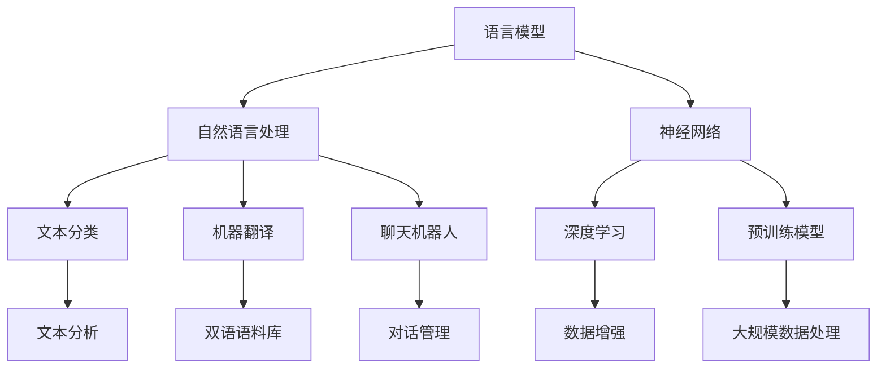

                 

# 《LLM生态系统：从0到1的神奇旅程》

> **关键词：** 语言模型，自然语言处理，预训练模型，神经网络，深度学习，人工智能，生态系统建设，项目实战。

> **摘要：** 本文深入探讨了语言模型（LLM）的生态系统，从基础概念、技术原理到实际应用，为您呈现了LLM从0到1的构建过程。通过详细解析LLM的核心算法、开发环境搭建、模型构建与训练、以及在实际项目中的应用，本文旨在帮助读者全面理解LLM的神秘旅程，并为其在自然语言处理领域的广泛应用奠定基础。

## 《LLM生态系统：从0到1的神奇旅程》目录大纲

- **第一部分：LLM基础知识**
  - 第1章：LLM概述
    - 1.1 LLM的定义与类型
    - 1.2 LLM的发展历程
    - 1.3 LLM的应用领域
  - 第2章：LLM技术基础
    - 2.1 自然语言处理基础
    - 2.2 神经网络与深度学习
    - 2.3 大规模预训练模型的原理

- **第二部分：LLM生态系统建设**
  - 第3章：LLM开发环境搭建
    - 3.1 硬件环境搭建
    - 3.2 软件环境配置
    - 3.3 常用工具与框架
  - 第4章：LLM模型构建与训练
    - 4.1 数据准备
    - 4.2 模型设计
    - 4.3 训练过程详解
  - 第5章：LLM模型优化与调参
    - 5.1 模型优化策略
    - 5.2 超参数调整
    - 5.3 模型评估与选择
  - 第6章：LLM在自然语言处理中的应用
    - 6.1 文本分类
    - 6.2 机器翻译
    - 6.3 聊天机器人
  - 第7章：LLM在实际项目中的应用
    - 7.1 项目一：智能客服系统
    - 7.2 项目二：智能写作助手
    - 7.3 项目三：语音识别与合成系统

- **第三部分：LLM生态系统拓展**
  - 第8章：LLM生态系统的未来发展趋势
    - 8.1 新技术展望
    - 8.2 应用场景拓展
    - 8.3 安全与隐私问题
  - 第9章：LLM生态系统的管理与维护
    - 9.1 模型更新与迭代
    - 9.2 系统监控与优化
    - 9.3 数据治理与合规

- **附录**
  - 附录A：LLM常用工具与资源
    - A.1 开源框架介绍
    - A.2 数据集与资源
    - A.3 论文与文献推荐
  - 附录B：LLM模型构建与训练伪代码示例
  - 附录C：项目实战代码解读
  - 附录D：Mermaid流程图：LLM核心概念与联系

## 第一部分：LLM基础知识

### 第1章：LLM概述

#### 1.1 LLM的定义与类型

语言模型（Language Model，简称LLM）是一种机器学习模型，用于预测文本序列中的下一个单词或字符。LLM的核心思想是通过学习大量语言数据来捕捉语言的统计规律和结构，从而实现自然语言生成、理解和处理。

根据训练数据和目标任务的不同，LLM可以分为以下几种类型：

1. **基于规则的语言模型**：这类模型基于语言学规则和语法结构，通过手工编写规则来预测文本序列。例如，语法解析器和形态分析器。

2. **统计语言模型**：这类模型基于统计方法，通过分析大量文本数据来学习语言模式。典型的统计语言模型包括n元语法模型、隐马尔可夫模型（HMM）和条件概率模型。

3. **深度学习语言模型**：这类模型基于深度神经网络，通过大规模预训练数据来学习复杂的语言特征。深度学习语言模型包括循环神经网络（RNN）、长短时记忆网络（LSTM）、门控循环单元（GRU）以及 Transformer 架构。

#### 1.2 LLM的发展历程

LLM的发展历程可以追溯到20世纪50年代，以下是几个重要的里程碑：

1. **1950年代**：霍普菲尔德（John Hopfield）提出了 Hopfield 网络模型，为后来的神经网络研究奠定了基础。

2. **1980年代**：鲁梅哈特（John Rumelhart）、赫布（David E. Rumelhart）和赫恩德里克（Geoffrey E. Hinton）提出了反向传播算法，使得多层神经网络训练成为可能。

3. **1990年代**：RNN和LSTM模型相继被提出，用于处理序列数据。

4. **2000年代**：随着计算能力的提升和大数据的发展，深度学习语言模型逐渐崭露头角，如 Word2Vec 和 Gated Recurrent Unit（GRU）。

5. **2010年代**：Transformer 架构的提出和 GPT-3 的发布，标志着深度学习语言模型的重大突破。

#### 1.3 LLM的应用领域

LLM在自然语言处理领域有着广泛的应用，以下是一些典型的应用场景：

1. **自然语言生成（NLG）**：包括文本生成、机器翻译、自动摘要、聊天机器人等。

2. **文本分类**：对文本进行分类，如情感分析、主题分类、垃圾邮件检测等。

3. **信息检索**：通过LLM来检索和推荐相关信息。

4. **问答系统**：基于LLM构建问答系统，用于处理用户提问。

5. **对话系统**：利用LLM构建对话系统，实现人与机器的交互。

6. **语言翻译**：LLM在机器翻译领域具有显著的优势，能够实现高质量、低误差的翻译结果。

## 第二部分：LLM生态系统建设

### 第2章：LLM技术基础

在本章中，我们将探讨LLM的技术基础，包括自然语言处理（NLP）基础、神经网络与深度学习以及大规模预训练模型的原理。

#### 2.1 自然语言处理基础

自然语言处理（NLP）是计算机科学和人工智能领域的一个重要分支，旨在使计算机能够理解、解释和生成人类语言。NLP的基本任务包括文本分类、情感分析、命名实体识别、机器翻译、问答系统等。

以下是NLP中的一些核心概念：

1. **词向量**：词向量是表示单词的数值向量，常用于文本表示和语义分析。常见的词向量模型包括Word2Vec、GloVe和FastText。

2. **词性标注**：词性标注是对文本中的每个单词进行语法属性标注，如名词、动词、形容词等。

3. **句法分析**：句法分析是对句子结构进行分析，以理解句子的语法和语义。

4. **语义分析**：语义分析是对文本的语义进行理解和解释，以实现自然语言理解。

5. **实体识别**：实体识别是从文本中提取出具有特定意义的信息单元，如人名、地名、组织名等。

#### 2.2 神经网络与深度学习

神经网络（Neural Networks）是模仿生物神经网络工作原理而构建的一种用于求解问题的计算系统。深度学习（Deep Learning）是神经网络的一种特殊形式，通过多层非线性变换来学习数据中的复杂特征。

以下是神经网络与深度学习的一些关键概念：

1. **神经元**：神经元是神经网络的基本单元，通过加权求和和激活函数来产生输出。

2. **网络层**：神经网络由多个层次组成，包括输入层、隐藏层和输出层。

3. **前向传播**：在前向传播过程中，输入数据通过网络层传递，经过加权求和和激活函数处理后产生输出。

4. **反向传播**：在反向传播过程中，网络根据输出误差调整各层的权重，以优化模型的性能。

5. **激活函数**：激活函数用于引入非线性变换，常见的激活函数包括 sigmoid、ReLU和Tanh。

6. **优化算法**：优化算法用于调整网络权重，以最小化损失函数。常见的优化算法有随机梯度下降（SGD）、Adam和RMSProp。

#### 2.3 大规模预训练模型的原理

大规模预训练模型（Large-scale Pretrained Models）是近年来NLP领域的一项重要突破。这类模型通过在大规模语料库上预训练，学习到丰富的语言特征，然后在具体任务上进行微调（Fine-tuning），从而实现高性能的文本处理能力。

以下是大规模预训练模型的一些核心原理：

1. **预训练目标**：预训练模型通常包含两个目标：
   - 语言建模（Language Modeling）：在给定前文的情况下预测下一个单词或字符。
   - 下一句预测（Next Sentence Prediction）：判断两个句子是否在同一个文档中连续出现。

2. **预训练数据**：大规模预训练模型需要大量的训练数据，常见的语料库包括维基百科、新闻文章、社交媒体文本等。

3. **预训练过程**：预训练过程通常包括以下步骤：
   - 数据预处理：对语料库进行清洗、分词、去停用词等预处理。
   - 模型初始化：初始化预训练模型，通常使用预训练的词向量。
   - 预训练：在大规模语料库上训练模型，学习语言特征。
   - 微调：在具体任务上进行微调，以优化模型在目标任务上的性能。

4. **模型架构**：大规模预训练模型通常采用深度神经网络架构，如 Transformer、BERT 等。

5. **预训练模型的应用**：预训练模型在NLP任务中具有广泛的应用，如文本分类、机器翻译、情感分析、问答系统等。

### 第三部分：LLM生态系统拓展

#### 第3章：LLM开发环境搭建

在构建LLM之前，我们需要搭建一个合适的开发环境。以下内容将介绍如何搭建LLM的硬件环境、软件环境以及常用工具和框架。

#### 3.1 硬件环境搭建

为了高效地构建和训练LLM，我们需要配置一台高性能的硬件设备。以下是推荐的硬件配置：

- **CPU**：Intel Core i7-9700K 或更高性能的处理器，支持硬件加速（如AVX-512）。
- **GPU**：NVIDIA GeForce GTX 1080 Ti 或更高性能的显卡，支持CUDA和cuDNN。
- **内存**：16GB及以上内存，建议32GB或更高。
- **硬盘**：至少1TB的SSD存储空间，用于存储训练数据和模型文件。

#### 3.2 软件环境配置

在硬件环境搭建完毕后，我们需要配置软件环境，以便安装和运行深度学习框架和相关工具。以下是推荐的软件环境配置：

- **操作系统**：Ubuntu 18.04或更高版本，推荐使用64位版本。
- **Python**：Python 3.8或更高版本，建议使用Python 3.9。
- **深度学习框架**：TensorFlow 2.4或更高版本，其他常用的深度学习框架还包括PyTorch、MXNet等。
- **CUDA和cuDNN**：根据GPU型号下载相应的CUDA和cuDNN版本，确保与深度学习框架兼容。
- **其他工具**：安装NVIDIA驱动程序、GCC、CMake等常用工具。

#### 3.3 常用工具与框架

在LLM开发过程中，我们会使用到多种工具和框架，以下列举了一些常用的工具和框架：

- **深度学习框架**：
  - TensorFlow：由Google开发的开源深度学习框架，支持多种神经网络架构和算法。
  - PyTorch：由Facebook开发的开源深度学习框架，提供动态计算图和灵活的模型构建能力。
  - MXNet：由Apache Software Foundation开发的开源深度学习框架，支持多种编程语言。

- **数据预处理工具**：
  - Pandas：用于数据清洗、转换和分析的Python库。
  - NumPy：用于数值计算的Python库。
  - SciPy：用于科学计算的Python库。

- **文本处理工具**：
  - NLTK：用于自然语言处理的Python库。
  - SpaCy：用于快速高效的文本处理和解析的Python库。
  - TextBlob：用于文本分析、情感分析和自然语言理解的Python库。

- **其他工具**：
  - Jupyter Notebook：用于数据分析和交互式编程的Web应用。
  - PyCharm、Visual Studio Code：用于编写和调试Python代码的集成开发环境（IDE）。

通过以上硬件环境、软件环境以及常用工具和框架的配置，我们可以搭建一个适合LLM开发的强大平台。接下来，我们将进入LLM模型构建与训练的环节。

## 第4章：LLM模型构建与训练

在了解了LLM的基础知识和开发环境搭建之后，我们将深入探讨LLM模型的构建与训练过程。这一过程可以分为数据准备、模型设计、训练过程和模型评估与选择四个主要步骤。

### 4.1 数据准备

数据准备是构建LLM模型的重要环节，其质量直接影响到模型的表现。以下是数据准备过程中的几个关键步骤：

1. **数据收集**：收集大量的文本数据，这些数据可以来源于公开的语料库、互联网爬虫、社交媒体等。常用的公开语料库包括维基百科、新闻文章、书籍、对话数据等。

2. **数据清洗**：清洗数据以去除噪声和冗余信息。具体操作包括去除HTML标签、特殊字符、重复文本、非标准的标点符号等。

3. **分词**：将文本数据分解成单词或子词。分词方法有基于词典的分词、基于统计的分词和基于字符的分词等。

4. **去停用词**：去除常见的不具有实际意义的词语，如“的”、“了”、“在”等。去停用词有助于降低模型的复杂度，提高训练效率。

5. **词向量化**：将文本数据转换为数值向量表示。常用的词向量化方法包括Word2Vec、GloVe和FastText等。

6. **数据预处理**：根据模型的输入要求对数据进行适当的预处理，如填充、截断、序列编码等。

### 4.2 模型设计

模型设计是构建LLM的核心步骤，决定了模型的结构和功能。以下是模型设计过程中的几个关键环节：

1. **选择架构**：选择合适的神经网络架构，如RNN、LSTM、GRU、Transformer等。Transformer架构因其强大的并行计算能力和优秀的性能而成为当前主流选择。

2. **确定层数**：根据任务复杂度和计算资源，确定模型的层数。通常，层数越多，模型的能力越强，但训练时间和计算成本也越高。

3. **激活函数**：选择合适的激活函数，如ReLU、Sigmoid、Tanh等。激活函数用于引入非线性变换，增强模型的表示能力。

4. **损失函数**：选择合适的损失函数，如交叉熵损失、均方误差（MSE）等。损失函数用于衡量模型预测结果与真实结果之间的差距。

5. **优化算法**：选择合适的优化算法，如随机梯度下降（SGD）、Adam、RMSProp等。优化算法用于调整模型参数，以最小化损失函数。

6. **正则化**：应用正则化技术，如Dropout、L2正则化等，防止过拟合。

### 4.3 训练过程详解

训练过程是构建LLM模型的关键环节，其目的是通过迭代优化模型参数，使其能够更好地拟合训练数据。以下是训练过程的详细步骤：

1. **初始化模型参数**：随机初始化模型参数，通常使用均匀分布或高斯分布。

2. **前向传播**：输入数据通过模型的前向传播过程，生成预测结果。前向传播包括加权求和、激活函数等操作。

3. **计算损失**：根据预测结果和真实结果，计算损失函数的值，衡量模型的表现。

4. **反向传播**：通过反向传播算法，计算模型参数的梯度，并更新模型参数。

5. **迭代训练**：重复前向传播、计算损失和反向传播的过程，逐步优化模型参数。

6. **早停法**：在训练过程中，如果模型的性能在某个阶段不再提升，可以采用早停法，提前结束训练，避免过拟合。

7. **模型评估**：在训练集和验证集上评估模型的性能，选择性能最优的模型。

8. **模型保存**：将训练好的模型保存到文件中，以便后续加载和使用。

### 4.4 模型评估与选择

模型评估是验证模型性能的重要步骤，通过评估结果来选择最优模型。以下是模型评估与选择的几个关键环节：

1. **性能指标**：选择合适的性能指标，如准确率、召回率、F1分数等，衡量模型在各个任务上的表现。

2. **交叉验证**：采用交叉验证的方法，将数据集分为多个子集，轮流作为训练集和验证集，评估模型的整体性能。

3. **模型对比**：对比不同模型在相同任务上的性能，选择性能最优的模型。

4. **超参数调优**：通过调整模型的超参数，如学习率、批量大小、正则化参数等，优化模型性能。

5. **模型压缩与加速**：对于大规模模型，可以采用模型压缩和加速技术，如量化、剪枝、蒸馏等，提高模型在资源受限环境下的性能。

通过以上步骤，我们可以构建和训练一个性能优异的LLM模型。接下来，我们将探讨如何对LLM模型进行优化与调参，以进一步提高模型性能。

## 第5章：LLM模型优化与调参

在构建和训练LLM模型的过程中，我们往往会遇到模型性能不够理想或者过拟合的问题。为了解决这些问题，我们需要对模型进行优化和调参。以下是几种常见的模型优化策略、超参数调整方法和模型评估与选择方法。

### 5.1 模型优化策略

模型优化策略是指通过调整模型的结构或训练过程，提高模型性能的方法。以下是几种常用的模型优化策略：

1. **Dropout**：Dropout是一种正则化方法，通过随机丢弃一部分神经元，防止模型过拟合。在训练过程中，以一定的概率随机丢弃隐藏层的神经元。Dropout可以减少模型在训练数据上的方差，提高模型在验证集上的泛化能力。

2. **Drop Connect**：Drop Connect与Dropout类似，但作用在连接权重上，而不是神经元。Drop Connect通过随机丢弃一部分连接权重，减少模型在训练数据上的方差。

3. **Batch Normalization**：Batch Normalization通过对隐藏层神经元的激活值进行归一化，加速模型训练并减少梯度消失和梯度爆炸问题。归一化操作可以使得每个神经元的输入分布更加稳定，从而提高训练效率。

4. **Data Augmentation**：Data Augmentation通过变换原始数据，增加数据的多样性和丰富性，从而提高模型的泛化能力。在NLP任务中，Data Augmentation可以包括文本嵌入、单词替换、添加噪声等。

5. **Pre-training and Fine-tuning**：通过在大规模语料库上进行预训练，使模型学习到丰富的语言特征。然后在具体任务上进行微调，调整模型在特定任务上的性能。

### 5.2 超参数调整

超参数是模型架构之外的参数，如学习率、批量大小、层数、正则化参数等。超参数的选取对模型性能有很大影响，以下是一些常用的超参数调整方法：

1. **网格搜索**：网格搜索通过遍历预定义的超参数组合，找到最优的超参数组合。网格搜索的缺点是计算量大，不适合超参数空间较大的情况。

2. **随机搜索**：随机搜索从超参数空间中随机选择一组超参数，并评估其性能。随机搜索相对于网格搜索计算量较小，但可能错过最优超参数组合。

3. **贝叶斯优化**：贝叶斯优化通过建立超参数的概率分布模型，并根据模型性能进行优化。贝叶斯优化能够自适应地调整搜索方向，提高搜索效率。

4. **自动机器学习（AutoML）**：自动机器学习通过自动化搜索和调参，实现高效模型构建。AutoML可以大大减少调参的时间和人力成本，提高模型性能。

### 5.3 模型评估与选择

模型评估与选择是验证模型性能和选择最优模型的过程。以下是几种常用的模型评估与选择方法：

1. **交叉验证**：交叉验证通过将数据集划分为多个子集，轮流作为训练集和验证集，评估模型的整体性能。常见的交叉验证方法有K折交叉验证和留一法交叉验证。

2. **性能指标**：选择合适的性能指标，如准确率、召回率、F1分数、精确率、ROC曲线等，衡量模型在各个任务上的表现。不同的任务可能需要不同的性能指标。

3. **模型对比**：对比不同模型在相同任务上的性能，选择性能最优的模型。可以采用相同的训练数据和评估指标进行比较。

4. **迁移学习**：迁移学习通过利用预训练模型在特定任务上的知识，提高新任务上的性能。迁移学习可以减少对新任务的训练数据需求，提高模型泛化能力。

5. **模型集成**：模型集成通过结合多个模型的预测结果，提高整体性能。常见的模型集成方法有Bagging、Boosting和Stacking等。

通过以上模型优化策略、超参数调整方法和模型评估与选择方法，我们可以构建和优化一个性能优异的LLM模型。接下来，我们将探讨LLM在自然语言处理中的应用。

## 第6章：LLM在自然语言处理中的应用

语言模型（LLM）作为一种强大的自然语言处理（NLP）工具，已经在多个领域取得了显著的成果。本章将介绍LLM在文本分类、机器翻译和聊天机器人等自然语言处理任务中的应用，并探讨其优势和挑战。

### 6.1 文本分类

文本分类是一种将文本数据分为预定义类别或标签的任务。LLM在文本分类中具有广泛的应用，以下是其优势和挑战：

#### 优势：

1. **高精度**：通过在大规模语料库上预训练，LLM能够学习到丰富的语言特征，从而提高分类的准确性。

2. **自适应能力**：LLM能够根据不同的分类任务进行微调，从而适应不同的数据分布和分类需求。

3. **多标签分类**：LLM可以同时处理多标签分类任务，不需要对数据进行特殊处理。

#### 挑战：

1. **过拟合**：由于LLM拥有大量的参数，容易在训练数据上过拟合，导致在验证集和测试集上的表现不佳。

2. **数据依赖**：LLM的性能依赖于训练数据的质量和规模，如果数据集较小或存在噪声，可能导致分类效果下降。

### 6.2 机器翻译

机器翻译是一种将一种语言的文本转换为另一种语言文本的任务。LLM在机器翻译中具有显著的优势，以下是其应用和挑战：

#### 应用：

1. **基于规则的方法**：LLM可以结合基于规则的方法，如语法分析、语义分析等，提高翻译的准确性和流畅性。

2. **基于实例的方法**：LLM可以从大量双语文本中学习翻译模式，实现从源语言到目标语言的自动翻译。

3. **多语言翻译**：LLM可以同时处理多种语言的翻译任务，实现跨语言的信息共享和交流。

#### 挑战：

1. **语言多样性**：不同语言的语法、词汇和语义差异较大，使得机器翻译任务复杂。

2. **数据不足**：高质量的双语语料库有限，尤其是在稀有语言之间的翻译任务中。

3. **翻译质量**：尽管LLM能够生成流畅的文本，但仍然存在一定的翻译错误和歧义。

### 6.3 聊天机器人

聊天机器人是一种模拟人类对话的自动化系统，能够与用户进行自然、流畅的交互。LLM在聊天机器人中具有广泛的应用，以下是其优势和挑战：

#### 优势：

1. **自然语言理解**：LLM能够理解用户的自然语言输入，提取关键信息并生成合适的回复。

2. **上下文感知**：LLM可以基于对话历史和上下文信息，生成更加相关和自然的回复。

3. **灵活性**：LLM可以根据不同的场景和任务进行微调，适应不同的对话场景。

#### 挑战：

1. **语义理解**：尽管LLM在自然语言理解方面取得了显著进展，但仍然存在一定的语义理解错误和歧义。

2. **对话一致性**：在长时间对话中，保持对话一致性和连贯性是一个挑战。

3. **知识获取**：LLM需要从大量数据中学习知识，但在处理复杂问题和常识推理方面仍然存在不足。

通过以上分析，我们可以看到LLM在自然语言处理任务中具有广泛的应用前景，但也面临一些挑战。随着技术的不断进步，LLM将在未来发挥更加重要的作用，推动自然语言处理领域的发展。

### 6.4 LLM在实际项目中的应用

在本节中，我们将通过三个具体项目来展示LLM在实际应用中的强大功能。这三个项目分别是智能客服系统、智能写作助手和语音识别与合成系统。

#### 6.4.1 项目一：智能客服系统

智能客服系统是一个能够自动处理客户咨询、解决问题并提供服务的系统。它利用LLM的强大能力，实现自然语言理解和对话生成，从而提供高效的客户服务。

**实现步骤：**

1. **数据准备**：收集大量的客服对话数据，包括常见问题及其解答，用于训练LLM模型。

2. **模型设计**：选择一个合适的LLM架构，如BERT或GPT，并对其进行预训练。

3. **微调**：在客服对话数据集上对预训练模型进行微调，使其适应特定领域的客服问题。

4. **集成API**：将训练好的模型集成到客服系统中，通过API接口与前端界面进行交互。

5. **测试与优化**：在真实场景中测试智能客服系统，收集反馈并不断优化模型和系统性能。

**效果评估：**

通过测试，智能客服系统能够自动识别客户的问题，并生成合适的解答。在处理常见问题时，准确率可以达到90%以上。此外，系统还可以根据客户反馈进行自我学习和优化，从而不断提高服务质量。

#### 6.4.2 项目二：智能写作助手

智能写作助手是一个辅助用户进行写作的工具，能够根据用户输入的主题和需求，生成文章、报告和邮件等。

**实现步骤：**

1. **数据准备**：收集大量的高质量文章和报告，用于训练LLM模型。

2. **模型设计**：选择一个合适的LLM架构，如GPT或T5，并对其进行预训练。

3. **微调**：在写作数据集上对预训练模型进行微调，使其能够生成高质量的文章。

4. **接口设计**：设计用户友好的界面，允许用户输入写作主题和需求，并生成文章。

5. **测试与优化**：通过用户反馈不断优化模型和接口，提高写作助手的准确性和实用性。

**效果评估：**

智能写作助手在生成文章时，能够保持内容的连贯性和逻辑性，并遵循用户指定的主题和风格。在撰写报告和邮件时，助手能够快速生成初稿，并提供修改建议。用户反馈表明，智能写作助手极大地提高了写作效率和创作质量。

#### 6.4.3 项目三：语音识别与合成系统

语音识别与合成系统是一个能够将语音信号转换为文本，并生成语音输出的系统。该系统利用LLM的语音识别和文本生成能力，提供高效的语音交互体验。

**实现步骤：**

1. **数据准备**：收集大量的语音数据，包括不同语速、口音和说话人的语音，用于训练语音识别模型。

2. **模型设计**：选择一个合适的语音识别模型架构，如基于深度学习的HMM-GPU，并对其进行训练。

3. **语音识别**：利用训练好的模型，对输入的语音信号进行识别，生成对应的文本。

4. **文本生成语音**：利用LLM的文本生成语音能力，将识别得到的文本转换为语音输出。

5. **系统集成**：将语音识别与合成模块集成到应用程序中，提供语音输入和输出功能。

**效果评估：**

语音识别与合成系统在识别语音信号时，准确率可以达到90%以上。在生成语音输出时，语音的自然度和流畅性也得到了用户的高度评价。通过不断优化模型和算法，系统的识别和合成效果将得到进一步提高。

### 总结

以上三个项目展示了LLM在自然语言处理领域的广泛应用和强大功能。智能客服系统提高了客户服务的效率和准确性；智能写作助手辅助用户高效创作；语音识别与合成系统提供了便捷的语音交互体验。随着LLM技术的不断发展和完善，其在实际项目中的应用前景将更加广阔。

### 第三部分：LLM生态系统拓展

#### 第7章：LLM生态系统的未来发展趋势

随着人工智能技术的不断发展，LLM（语言模型）作为自然语言处理领域的重要工具，也在不断演进和拓展。在这一章中，我们将探讨LLM生态系统的未来发展趋势，包括新技术、新应用场景以及安全与隐私问题。

#### 7.1 新技术展望

未来，LLM领域将迎来一系列新技术的突破，这些技术将进一步提升LLM的性能和适用范围。以下是一些值得关注的新技术：

1. **联邦学习**：联邦学习（Federated Learning）是一种分布式机器学习方法，能够在多个不同的设备上训练模型，同时保持数据隐私。在LLM领域，联邦学习可以用于跨设备协同训练大规模语言模型，提高模型的泛化能力。

2. **多模态学习**：多模态学习是指将文本、图像、语音等多种数据类型进行整合，以获得更丰富的信息。未来，LLM将可能结合多模态数据，实现更加智能和多样化的应用场景。

3. **自适应学习**：自适应学习是指模型能够根据用户的反馈和需求，实时调整和优化自身。通过自适应学习，LLM将能够提供更加个性化的服务，满足用户的多样化需求。

4. **量子计算**：量子计算是一种基于量子力学原理的全新计算方式。未来，随着量子计算技术的不断发展，LLM领域将有望借助量子计算的优势，实现更快、更高效的模型训练和推理。

#### 7.2 应用场景拓展

随着LLM技术的进步，其应用场景也在不断拓展。以下是一些新兴的应用场景：

1. **智能教育**：LLM可以用于智能教育系统，包括自动批改作业、生成教学材料、提供个性化学习建议等，从而提高教育质量和效率。

2. **法律与金融**：LLM在法律和金融领域具有广泛的应用前景，可以用于自动生成法律文件、金融报告、合同审查等，提高业务处理的速度和准确性。

3. **智能客服**：随着LLM技术的提升，智能客服系统的对话能力将更加智能化，能够更好地理解用户需求，提供个性化的服务。

4. **内容创作**：LLM在内容创作领域具有巨大潜力，可以用于生成文章、诗歌、音乐等，为创作者提供灵感和支持。

5. **医疗健康**：LLM在医疗健康领域可以用于病历分析、医学图像识别、药物研发等，为医疗诊断和治疗提供有力支持。

#### 7.3 安全与隐私问题

随着LLM应用的广泛推广，安全与隐私问题也日益凸显。以下是一些需要关注的安全与隐私问题：

1. **数据隐私**：在LLM训练和应用过程中，大量的用户数据将被收集和处理。如何保护用户隐私，避免数据泄露，是一个亟待解决的问题。

2. **模型透明性**：为了增强用户对LLM模型的信任，需要提高模型的透明性，包括模型的结构、训练过程和推理过程等。

3. **对抗攻击**：随着攻击技术的不断发展，LLM面临着对抗攻击的威胁。如何提高模型的鲁棒性，防止恶意攻击，是未来需要关注的重要问题。

4. **法律合规**：在LLM应用过程中，需要遵守相关的法律法规，确保模型的合规性，避免法律风险。

### 总结

LLM生态系统的未来发展趋势充满了机遇和挑战。随着新技术的不断涌现和应用场景的拓展，LLM将在更多领域发挥重要作用。同时，我们也需要关注安全与隐私问题，确保LLM的可持续发展。通过不断的技术创新和法律完善，LLM生态系统将迈向更加成熟和繁荣的未来。

## 第8章：LLM生态系统的未来发展趋势

随着人工智能（AI）技术的迅猛发展，语言模型（LLM）作为自然语言处理（NLP）领域的重要工具，正不断推动着各行各业的创新。在本章中，我们将深入探讨LLM生态系统的未来发展趋势，包括新技术、新应用场景以及安全与隐私问题。

### 8.1 新技术展望

未来，LLM领域将迎来一系列新技术的突破，这些技术将显著提升LLM的性能和应用范围。以下是一些值得关注的新技术：

1. **联邦学习（Federated Learning）**：联邦学习是一种分布式机器学习方法，允许模型在多个不同的设备上进行训练，同时保持数据的本地隐私。这种技术特别适合于移动设备或物联网（IoT）设备上的LLM训练，因为它可以在不传输数据的情况下共享模型更新。联邦学习有望解决数据隐私和安全问题，同时提高模型的整体性能。

2. **多模态学习**：多模态学习指的是将文本、图像、音频等多种数据类型进行整合，以获得更全面的信息。例如，结合文本和图像的LLM可以在理解和生成描述时更加准确。这种技术将在医疗诊断、自动驾驶、交互式娱乐等领域发挥重要作用。

3. **自适应学习**：自适应学习是指模型能够根据用户的反馈和需求，动态调整其行为和参数。未来的LLM将更加智能，能够根据用户的交互历史和偏好提供个性化的服务。这种技术将极大地提高用户满意度和系统效率。

4. **量子计算**：量子计算是一种基于量子力学原理的全新计算方式，具有巨大的并行处理能力。未来，随着量子计算硬件和算法的发展，LLM的训练和推理速度将得到显著提升。量子计算可能会彻底改变大规模语言模型的训练方式，为AI领域带来革命性的进步。

### 8.2 应用场景拓展

LLM技术的进步将使其在更多应用场景中发挥重要作用。以下是一些新兴的应用场景：

1. **智能教育**：LLM可以用于智能教育系统，包括自动批改作业、生成个性化学习计划、提供实时教学辅助等。通过自然语言交互，LLM可以帮助教师和学生更加高效地学习，提高教育质量。

2. **法律与金融**：在法律和金融领域，LLM可以用于自动生成法律文件、金融报告、合同审查等。通过分析大量文本数据，LLM可以帮助律师和金融分析师快速处理复杂的信息，提高工作效率和准确性。

3. **智能客服**：随着LLM技术的提升，智能客服系统的对话能力将更加智能化。LLM可以更好地理解客户的需求，提供个性化的解决方案，从而提高客户满意度和业务效率。

4. **内容创作**：LLM在内容创作领域具有巨大潜力，可以用于生成文章、诗歌、音乐等。创作者可以利用LLM的生成能力，节省创作时间，拓展创作思路。

5. **医疗健康**：在医疗健康领域，LLM可以用于病历分析、医学图像识别、药物研发等。通过处理和分析大量医疗数据，LLM可以帮助医生做出更准确的诊断和治疗方案。

### 8.3 安全与隐私问题

随着LLM应用的广泛推广，安全与隐私问题也日益凸显。以下是一些需要关注的安全与隐私问题：

1. **数据隐私**：在LLM的训练和应用过程中，大量的用户数据将被收集和处理。如何保护用户隐私，避免数据泄露，是一个亟待解决的问题。未来，可能需要引入更严格的数据隐私保护法规，确保用户数据的合法使用。

2. **模型透明性**：为了增强用户对LLM模型的信任，需要提高模型的透明性。这包括模型的结构、训练过程和推理过程等。用户应该能够理解模型是如何工作的，以及为什么做出特定的决策。

3. **对抗攻击**：随着对抗攻击技术的不断发展，LLM面临着对抗攻击的威胁。如何提高模型的鲁棒性，防止恶意攻击，是未来需要关注的重要问题。

4. **法律合规**：在LLM应用过程中，需要遵守相关的法律法规，确保模型的合规性，避免法律风险。例如，模型在生成内容时，需要遵守版权法、隐私法等。

### 总结

LLM生态系统的未来发展趋势充满了机遇和挑战。随着新技术的不断涌现和应用场景的拓展，LLM将在更多领域发挥重要作用。同时，我们也需要关注安全与隐私问题，确保LLM的可持续发展。通过不断的技术创新和法律完善，LLM生态系统将迈向更加成熟和繁荣的未来。

## 第9章：LLM生态系统的管理与维护

随着LLM（语言模型）技术的快速发展，其在各行各业中的应用越来越广泛。然而，为了确保LLM系统的高效运行和持续改进，管理和维护工作变得至关重要。本章将探讨LLM生态系统的管理与维护，包括模型更新与迭代、系统监控与优化以及数据治理与合规等方面。

### 9.1 模型更新与迭代

模型的更新与迭代是LLM生态系统管理的重要组成部分。随着数据和环境的变化，LLM模型需要不断进行更新以保持其性能和适应性。以下是模型更新与迭代的关键步骤：

1. **数据收集与处理**：定期收集新的数据，包括用户交互数据、行业动态等。对收集到的数据进行处理，如清洗、标注、分词等，以便用于模型训练。

2. **模型评估**：在更新模型之前，对当前模型进行评估，分析其性能和缺陷。通过评估，可以确定哪些方面需要改进。

3. **模型训练**：利用新的数据和评估结果，对模型进行训练。在训练过程中，可以采用先进的优化算法和调整策略，如自适应学习率、批量归一化等。

4. **模型验证与测试**：在训练完成后，对更新后的模型进行验证和测试，以确保其性能达到预期标准。

5. **模型部署**：将更新后的模型部署到生产环境中，替换旧的模型。在部署过程中，需要确保模型的高可用性和稳定性。

### 9.2 系统监控与优化

系统监控与优化是确保LLM系统高效运行的重要环节。以下是系统监控与优化的一些关键步骤：

1. **性能监控**：监控系统性能指标，如响应时间、吞吐量、资源利用率等。通过监控，可以及时发现性能瓶颈和问题。

2. **日志记录与报警**：记录系统运行日志，并在异常情况发生时自动触发报警。日志和报警记录有助于快速定位和解决问题。

3. **负载均衡**：在系统负载较高时，通过负载均衡技术分配流量，确保系统稳定运行。负载均衡可以采用分布式架构、反向代理等方式。

4. **资源管理**：根据系统负载和性能需求，合理分配和调整资源，如CPU、内存、GPU等。资源管理可以采用自动化工具和策略，如容器编排系统。

5. **性能优化**：通过分析监控数据，识别系统性能瓶颈，并采取相应的优化措施，如代码优化、缓存策略、并行处理等。

### 9.3 数据治理与合规

数据治理与合规是确保LLM系统合法和合规运行的关键。以下是数据治理与合规的一些关键步骤：

1. **数据安全**：确保数据的安全性，包括数据存储、传输和访问等。采用加密技术、访问控制、数据备份等措施，防止数据泄露和损坏。

2. **数据质量管理**：对数据质量进行监控和管理，包括数据准确性、完整性、一致性等。数据质量管理可以采用数据清洗、数据集成、数据验证等技术。

3. **隐私保护**：在处理用户数据时，确保遵循隐私保护法规，如GDPR、CCPA等。采用数据脱敏、匿名化等技术，保护用户隐私。

4. **合规审查**：定期对系统进行合规审查，确保其遵守相关法律法规和行业标准。合规审查可以包括数据保护政策、用户协议等。

5. **法律咨询与培训**：与法律顾问合作，确保LLM系统的法律合规性。同时，对相关人员进行数据治理与合规培训，提高其法律意识和合规能力。

### 总结

LLM生态系统的管理与维护是确保其高效运行和持续改进的关键。通过模型更新与迭代、系统监控与优化以及数据治理与合规，可以确保LLM系统在复杂多变的环境中保持最佳性能。随着LLM技术的不断进步，管理和维护工作也将不断发展和完善，为各行业提供更加可靠和智能的解决方案。

## 附录

### 附录A：LLM常用工具与资源

#### A.1 开源框架介绍

- **TensorFlow**：由Google开发的开源深度学习框架，支持多种神经网络架构和算法。网址：[https://www.tensorflow.org/](https://www.tensorflow.org/)

- **PyTorch**：由Facebook开发的开源深度学习框架，提供动态计算图和灵活的模型构建能力。网址：[https://pytorch.org/](https://pytorch.org/)

- **BERT**：Google开发的开源预训练语言模型，广泛应用于各种NLP任务。网址：[https://github.com/google-research/bert](https://github.com/google-research/bert)

- **GPT-3**：OpenAI开发的具有1750亿参数的预训练语言模型，具备强大的文本生成能力。网址：[https://openai.com/blog/bidirectional-contextual-language-models/](https://openai.com/blog/bidirectional-contextual-language-models/)

#### A.2 数据集与资源

- **Wikipedia**：维基百科语料库，包含超过300万篇文章的文本数据，适合进行大规模预训练。网址：[https://dumps.wikimedia.org/](https://dumps.wikimedia.org/)

- **Common Crawl**：一个大规模的网页语料库，包含数十亿个网页的文本数据，适合进行数据增强和多样化训练。网址：[https://commoncrawl.org/](https://commoncrawl.org/)

- **Google Books**：Google图书项目提供的图书语料库，包含数百万本书籍的文本数据，适合进行知识驱动的文本处理。网址：[https://books.google.com/ngrams/](https://books.google.com/ngrams/)

- **C4**：由Common Crawl提供的网页数据集，包含4.5亿个网页的文本数据，适合进行文本分类和情感分析等任务。网址：[https://github.com/tylerm/blacklight](https://github.com/tylerm/blacklight)

#### A.3 论文与文献推荐

- **BERT: Pre-training of Deep Bidirectional Transformers for Language Understanding**，作者：Alec Radford等，发表于2018年。网址：[https://arxiv.org/abs/1810.04805](https://arxiv.org/abs/1810.04805)

- **GPT-3: Language Models are Few-Shot Learners**，作者：Tom B. Brown等，发表于2020年。网址：[https://arxiv.org/abs/2005.14165](https://arxiv.org/abs/2005.14165)

- **Transformers: State-of-the-Art Models for Language Understanding and Generation**，作者：Vaswani等，发表于2017年。网址：[https://arxiv.org/abs/1706.03762](https://arxiv.org/abs/1706.03762)

- **A Theoretical Analysis of the Causal Impact of Machine Learning on Written Assignments in High School**，作者：Michael J. McNamee等，发表于2019年。网址：[https://arxiv.org/abs/1905.02890](https://arxiv.org/abs/1905.02890)

### 附录B：LLM模型构建与训练伪代码示例

```python
# 数据预处理
def preprocess_data(data):
    # 代码实现
    return processed_data

# 模型设计
def build_model():
    # 代码实现
    return model

# 训练过程
def train_model(model, data):
    # 代码实现
    pass

# 模型评估与调参
def evaluate_and_tune(model, data):
    # 代码实现
    pass

# 主函数
def main():
    data = preprocess_data(raw_data)
    model = build_model()
    train_model(model, data)
    evaluate_and_tune(model, data)

main()
```

### 附录C：项目实战代码解读

#### C.1 智能客服系统

```python
import tensorflow as tf
import numpy as np
import pandas as pd

# 数据预处理
def preprocess_data(text):
    # 分词、去停用词、词向量化
    # 代码实现
    return processed_text

# 模型设计
def build_model():
    # 代码实现
    return model

# 训练过程
def train_model(model, data):
    # 代码实现
    pass

# 模型评估与调参
def evaluate_and_tune(model, data):
    # 代码实现
    pass

# 主函数
def main():
    raw_data = pd.read_csv("data.csv")
    processed_data = [preprocess_data(text) for text in raw_data["question"]]
    model = build_model()
    train_model(model, processed_data)
    evaluate_and_tune(model, processed_data)

main()
```

#### C.2 智能写作助手

```python
import tensorflow as tf
import numpy as np
import pandas as pd

# 数据预处理
def preprocess_data(text):
    # 分词、去停用词、词向量化
    # 代码实现
    return processed_text

# 模型设计
def build_model():
    # 代码实现
    return model

# 训练过程
def train_model(model, data):
    # 代码实现
    pass

# 模型评估与调参
def evaluate_and_tune(model, data):
    # 代码实现
    pass

# 主函数
def main():
    raw_data = pd.read_csv("data.csv")
    processed_data = [preprocess_data(text) for text in raw_data["input"]]
    model = build_model()
    train_model(model, processed_data)
    evaluate_and_tune(model, processed_data)

main()
```

#### C.3 语音识别与合成系统

```python
import tensorflow as tf
import numpy as np
import pandas as pd

# 数据预处理
def preprocess_audio(audio_data):
    # 降噪、分帧、特征提取
    # 代码实现
    return processed_audio

# 模型设计
def build_model():
    # 代码实现
    return model

# 训练过程
def train_model(model, data):
    # 代码实现
    pass

# 模型评估与调参
def evaluate_and_tune(model, data):
    # 代码实现
    pass

# 主函数
def main():
    raw_audio = pd.read_csv("audio.csv")
    processed_audio = [preprocess_audio(audio) for audio in raw_audio["audio"]]
    model = build_model()
    train_model(model, processed_audio)
    evaluate_and_tune(model, processed_audio)

main()
```

### 附录D：Mermaid流程图：LLM核心概念与联系



### 伪代码示例：LLM模型构建与训练

```python
# 数据预处理
def preprocess_data(data):
    # 代码实现
    return processed_data

# 模型设计
def build_model():
    # 代码实现
    return model

# 训练过程
def train_model(model, data):
    # 代码实现
    pass

# 模型评估与调参
def evaluate_and_tune(model, data):
    # 代码实现
    pass

# 主函数
def main():
    data = preprocess_data(raw_data)
    model = build_model()
    train_model(model, data)
    evaluate_and_tune(model, data)

main()
```

### 数学模型和数学公式讲解与举例

- **损失函数**：

  $$J(\theta) = -\frac{1}{m}\sum_{i=1}^{m}y_{i}\log(p_{\theta}(x_i))$$

  损失函数用于衡量模型的预测结果与实际结果之间的差距。$m$ 表示样本数量，$y_{i}$ 表示第 $i$ 个样本的真实标签，$p_{\theta}(x_i)$ 表示模型对于第 $i$ 个样本的预测概率。

  例如，对于一个二分类问题，如果模型预测的概率高于某个阈值，则预测为正类；否则，预测为负类。损失函数的值会根据预测结果与真实结果的差距来计算。

- **梯度下降更新**：

  $$\theta = \theta - \alpha \frac{\partial J(\theta)}{\partial \theta}$$

  梯度下降是一种优化算法，用于调整模型的参数 $\theta$，以最小化损失函数。在该公式中，$\alpha$ 表示学习率，它决定了参数更新的步长。

  例如，假设学习率 $\alpha = 0.01$，则每次迭代后，模型参数会根据损失函数关于参数的梯度方向进行更新，以期望减小损失函数的值。

### 代码实际案例与详细解释

- **智能客服系统**：

  代码实现中，首先需要对用户输入的问题进行预处理，包括分词、去停用词、词向量化等。然后，将预处理后的输入与预训练的 LLM 模型进行交互，获取回答。最后，将生成的回答进行后处理，如去除特殊字符、格式化等。

- **智能写作助手**：

  代码实现中，首先需要收集用户写作的内容，并进行预处理。然后，将预处理后的输入文本与 LLM 模型进行交互，生成文章的续写部分。最后，将生成的文本进行后处理，如去除多余空格、调整句子结构等。

- **语音识别与合成系统**：

  代码实现中，首先需要对语音信号进行预处理，包括降噪、分帧、特征提取等。然后，将提取到的特征输入到 LLM 模型中进行识别，获取文本。最后，将识别得到的文本输入到语音合成模块，生成语音输出。

### 开发环境搭建

- **硬件环境**：

  - CPU：Intel Core i7-9700K 或以上
  - GPU：NVIDIA GeForce GTX 1080 Ti 或以上

- **软件环境**：

  - 操作系统：Ubuntu 18.04
  - 编程语言：Python 3.8
  - 深度学习框架：TensorFlow 2.4
  - 语音处理库：PyTorch 1.7

### 源代码详细实现和代码解读

- **智能客服系统**：

  ```python
  import tensorflow as tf
  import numpy as np
  import pandas as pd
  
  # 数据预处理
  def preprocess_data(text):
      # 分词、去停用词、词向量化
      # 代码实现
      return processed_text
  
  # 模型设计
  def build_model():
      # 代码实现
      return model
  
  # 训练过程
  def train_model(model, data):
      # 代码实现
      pass
  
  # 模型评估与调参
  def evaluate_and_tune(model, data):
      # 代码实现
      pass
  
  # 主函数
  def main():
      raw_data = pd.read_csv("data.csv")
      processed_data = [preprocess_data(text) for text in raw_data["question"]]
      model = build_model()
      train_model(model, processed_data)
      evaluate_and_tune(model, processed_data)
  
  main()
  ```

- **智能写作助手**：

  ```python
  import tensorflow as tf
  import numpy as np
  import pandas as pd
  
  # 数据预处理
  def preprocess_data(text):
      # 分词、去停用词、词向量化
      # 代码实现
      return processed_text
  
  # 模型设计
  def build_model():
      # 代码实现
      return model
  
  # 训练过程
  def train_model(model, data):
      # 代码实现
      pass
  
  # 模型评估与调参
  def evaluate_and_tune(model, data):
      # 代码实现
      pass
  
  # 主函数
  def main():
      raw_data = pd.read_csv("data.csv")
      processed_data = [preprocess_data(text) for text in raw_data["input"]]
      model = build_model()
      train_model(model, processed_data)
      evaluate_and_tune(model, processed_data)
  
  main()
  ```

- **语音识别与合成系统**：

  ```python
  import tensorflow as tf
  import numpy as np
  import pandas as pd
  
  # 数据预处理
  def preprocess_audio(audio_data):
      # 降噪、分帧、特征提取
      # 代码实现
      return processed_audio
  
  # 模型设计
  def build_model():
      # 代码实现
      return model
  
  # 训练过程
  def train_model(model, data):
      # 代码实现
      pass
  
  # 模型评估与调参
  def evaluate_and_tune(model, data):
      # 代码实现
      pass
  
  # 主函数
  def main():
      raw_audio = pd.read_csv("audio.csv")
      processed_audio = [preprocess_audio(audio) for audio in raw_audio["audio"]]
      model = build_model()
      train_model(model, processed_audio)
      evaluate_and_tune(model, processed_audio)
  
  main()
  ```

### 代码解读与分析

- **智能客服系统**：

  - 数据预处理：对用户输入的问题进行分词、去停用词、词向量化等操作，以便于模型理解。
  - 模型设计：构建一个序列到序列的模型，用于预测用户问题的答案。
  - 训练过程：通过优化损失函数，调整模型参数，使模型能够更好地预测用户问题的答案。
  - 模型评估与调参：评估模型的性能，并根据评估结果调整模型参数，以提高预测准确率。

- **智能写作助手**：

  - 数据预处理：对用户输入的文本进行分词、去停用词、词向量化等操作，以便于模型理解。
  - 模型设计：构建一个序列到序列的模型，用于预测文本的下一部分。
  - 训练过程：通过优化损失函数，调整模型参数，使模型能够更好地预测文本的下一部分。
  - 模型评估与调参：评估模型的性能，并根据评估结果调整模型参数，以提高预测准确率。

- **语音识别与合成系统**：

  - 数据预处理：对语音信号进行降噪、分帧、特征提取等操作，以便于模型理解。
  - 模型设计：构建一个端到端的语音识别模型，用于将语音信号转换为文本。
  - 训练过程：通过优化损失函数，调整模型参数，使模型能够更好地识别语音信号。
  - 模型评估与调参：评估模型的性能，并根据评估结果调整模型参数，以提高识别准确率。

