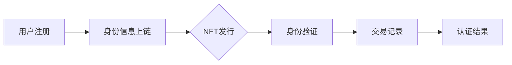
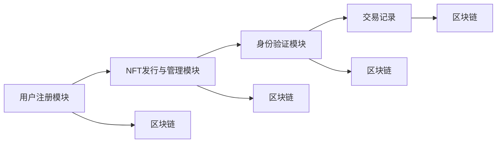
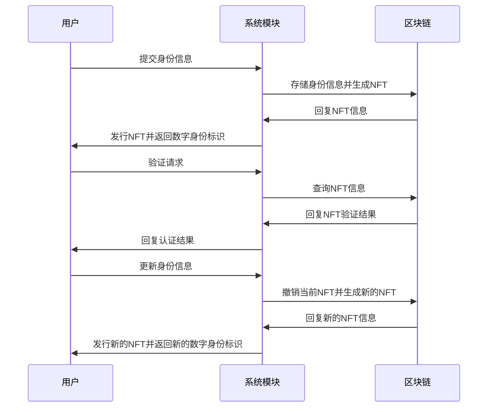

                 

### NFT与数字身份概述

#### 第1章：NFT与数字身份的基本概念

在数字经济迅速发展的今天，数字身份认证成为了信息安全与信任构建的关键环节。NFT（Non-Fungible Token，非同质化代币）作为一种新兴的数字技术，其独特性、不可替代性以及透明性等特点，为数字身份认证带来了新的可能性。本章节将详细探讨NFT的基本概念、数字身份的概念，以及NFT在数字身份认证中的应用。

##### 1.1 NFT概述

NFT是一种基于区块链技术的数字资产，与普通的代币（如比特币、以太币等）不同，NFT具有不可互换性，即每个NFT都是独一无二的。以下是对NFT的详细解释：

###### 1.1.1 NFT的定义

NFT是一种数字证书，用来证明某个特定物品的唯一性和所有权。这个物品可以是艺术品、收藏品、虚拟资产等。NFT的独特性在于其无法与其他物品进行等价交换，每个NFT都有自己独特的标识符和属性。

###### 1.1.2 NFT的产生方式

NFT通常通过智能合约在区块链上创建。智能合约是自动执行的程序，它定义了NFT的创建、发行、转让和销毁等规则。在以太坊区块链上，使用ERC-721和ERC-1155等标准来创建和管理NFT。

###### 1.1.3 NFT的分类

NFT可以分为以下几类：

- **艺术品和收藏品**：如数字画作、音乐、视频等。
- **虚拟资产**：如虚拟土地、虚拟商品、游戏装备等。
- **数字身份**：用于代表个人的数字身份和认证。
- **其他**：如时间戳、投票权等。

##### 1.2 数字身份的概念

数字身份是现实世界中个人身份在数字空间的映射。以下是对数字身份的详细解释：

###### 1.2.1 数字身份的定义

数字身份是通过数字方式（如密码、生物识别技术、数字证书等）来识别和验证个人的身份。它包括个人信息的存储、访问权限的管理和个人行为的记录。

###### 1.2.2 数字身份与传统身份的区别

- **形式**：传统身份主要通过身份证、护照等物理文档来证明；而数字身份则通过数字方式（如电子证书、智能合约等）来证明。
- **安全性**：数字身份可以通过加密技术来保护，比传统的身份证明方式更安全。
- **便捷性**：数字身份可以在互联网上进行快速验证和访问，更加便捷。

###### 1.2.3 数字身份的重要性

数字身份在现代社会中扮演着重要角色，主要体现在以下几个方面：

- **信息安全**：通过数字身份认证，可以防止未授权的访问和信息泄露。
- **身份验证**：数字身份验证可以简化交易过程，提高交易的安全性和效率。
- **隐私保护**：数字身份允许用户自主管理个人信息，保护隐私。

##### 1.3 NFT在数字身份认证中的应用

NFT的不可替代性和透明性使其在数字身份认证中具有独特的优势。以下是对NFT在数字身份认证中的应用的详细讨论：

###### 1.3.1 NFT作为数字身份认证的机制

NFT可以作为一种数字身份认证的机制，通过NFT来存储和验证用户的身份信息。例如，一个NFT可以包含用户的姓名、出生日期、身份证号码等个人信息，并通过区块链网络进行验证。

###### 1.3.2 NFT在数字身份认证中的优势

- **唯一性**：每个NFT都是独一无二的，确保了数字身份的唯一性和不可篡改性。
- **透明性**：NFT在区块链上可查，所有交易和转移记录都透明可查，增加了信任度。
- **安全性**：NFT通过区块链技术和加密算法保护，提高了数字身份认证的安全性。

###### 1.3.3 NFT在数字身份认证中的挑战

尽管NFT在数字身份认证中具有很多优势，但也面临一些挑战：

- **隐私保护**：如何保护用户的隐私信息，防止被滥用。
- **法律法规**：NFT作为一种新兴技术，需要适应现有的法律法规框架。
- **技术成熟度**：NFT技术的成熟度和稳定性仍需进一步发展。

在本章节中，我们介绍了NFT和数字身份的基本概念，并探讨了NFT在数字身份认证中的应用。接下来，我们将进一步深入探讨NFT身份认证系统的架构设计，帮助读者更好地理解这一创新技术的实际应用。

---

以下内容为Mermaid流程图，用于解释NFT身份认证系统的基本流程：



- **用户注册**：用户在NFT身份认证系统中注册，提交身份信息。
- **身份信息上链**：系统将用户提交的身份信息上链，生成对应的NFT。
- **NFT发行**：系统向用户发行NFT，用户获得数字身份标识。
- **身份验证**：用户在需要验证时，使用NFT进行身份认证。
- **交易记录**：NFT的所有交易记录都存储在区块链上，透明可查。
- **认证结果**：系统根据NFT验证结果，给出认证通过或拒绝的结果。

通过这一流程，读者可以更直观地理解NFT在数字身份认证中的应用和优势。

---

在下一章中，我们将详细讨论NFT身份认证系统的架构设计，包括其组成部分和系统工作流程。这将帮助读者深入了解这一系统的实现机制和技术细节。

---

接下来，我们将继续深入探讨NFT身份认证系统的架构设计，以及NFT在数字身份认证中的具体应用和优势。通过本章的内容，读者将能够更好地理解NFT身份认证系统的整体设计思路和实现方式。

---

### NFT身份认证系统的架构设计

#### 第2章：NFT身份认证系统的架构设计

在上一章中，我们介绍了NFT和数字身份的基本概念，以及NFT在数字身份认证中的应用。本章将深入探讨NFT身份认证系统的架构设计，包括其组成部分和系统工作流程。

##### 2.1 NFT身份认证系统的组成部分

NFT身份认证系统是一个复杂的系统，它由多个模块组成，每个模块都有特定的功能。以下是NFT身份认证系统的核心组成部分：

###### 2.1.1 用户身份信息管理模块

用户身份信息管理模块负责用户的注册、身份信息的存储和管理。该模块的主要功能包括：

- 用户注册：用户通过系统提交身份信息，包括姓名、出生日期、身份证号码等。
- 身份信息存储：系统将用户提交的身份信息存储在区块链上，以便进行后续的NFT发行和验证。
- 身份信息更新：用户可以更新自己的身份信息，确保信息的准确性和时效性。

###### 2.1.2 NFT发行与管理模块

NFT发行与管理模块负责NFT的创建、发行和管理工作。该模块的主要功能包括：

- NFT创建：系统根据用户身份信息创建独一无二的NFT，确保每个NFT都是唯一的。
- NFT发行：系统向用户发行NFT，用户获得数字身份标识。
- NFT管理：系统对NFT进行跟踪和管理，包括NFT的转让、撤销和更新等操作。

###### 2.1.3 身份验证模块

身份验证模块负责用户的身份验证工作。该模块的主要功能包括：

- 验证请求：用户在需要验证身份时，向系统提交验证请求。
- NFT验证：系统使用NFT对用户身份进行验证，确保身份信息的真实性和唯一性。
- 认证结果：系统根据验证结果，给出认证通过或拒绝的结果，并记录在区块链上。

##### 2.2 NFT身份认证系统的架构图

为了更好地理解NFT身份认证系统的组成部分和工作流程，我们提供了一个简化的系统架构图：



- **用户注册模块**：负责用户的注册和身份信息的存储。
- **NFT发行与管理模块**：负责NFT的创建、发行和管理工作。
- **身份验证模块**：负责用户的身份验证工作。
- **区块链**：用于存储用户的身份信息、NFT信息、验证请求和结果等信息。

##### 2.3 NFT在身份认证中的流程

以下是NFT身份认证系统的基本工作流程：

###### 2.3.1 用户注册与身份信息绑定

- 用户通过用户注册模块提交身份信息，包括姓名、出生日期、身份证号码等。
- 系统将用户提交的身份信息存储在区块链上，生成对应的NFT。
- NFT包含用户的身份信息，并与用户的数字身份绑定。

###### 2.3.2 NFT发行与验证

- 系统向用户发行NFT，用户获得数字身份标识。
- 当用户需要验证身份时，向系统提交验证请求。
- 系统使用NFT对用户身份进行验证，确保身份信息的真实性和唯一性。

###### 2.3.3 NFT的撤销与更新

- 如果用户的身份信息发生变化，用户可以申请撤销当前的NFT，并生成新的NFT。
- 系统会更新区块链上的NFT信息，确保用户身份信息的一致性和准确性。

##### 2.4 NFT在数字身份认证中的优势

NFT在数字身份认证中具有以下优势：

- **唯一性**：每个NFT都是独一无二的，确保了数字身份的唯一性和不可篡改性。
- **透明性**：NFT在区块链上可查，所有交易和转移记录都透明可查，增加了信任度。
- **安全性**：NFT通过区块链技术和加密算法保护，提高了数字身份认证的安全性。

尽管NFT在数字身份认证中具有许多优势，但也面临一些挑战，如隐私保护、法律法规和技术成熟度等。在下一章中，我们将深入探讨NFT身份认证中的核心算法原理，帮助读者更好地理解这一创新技术的实现机制。

---

以下内容为NFT身份认证系统的流程图，使用Mermaid语法表示：



在这个流程图中，用户首先通过系统提交身份信息，系统将信息存储在区块链上并生成NFT。随后，用户在需要验证身份时向系统提交验证请求，系统通过查询区块链上的NFT信息进行验证，并返回认证结果。如果用户需要更新身份信息，系统会撤销当前NFT并生成新的NFT，用户获得新的数字身份标识。

通过这一流程，我们可以更清晰地看到NFT在数字身份认证中的具体应用和优势。在下一章中，我们将继续探讨NFT身份认证系统的核心算法原理，进一步揭示其技术实现细节。

---

在下一章中，我们将深入讲解NFT身份认证系统中使用的核心算法原理，包括公钥密码学基础、哈希算法和智能合约等。这将帮助读者更深入地理解NFT身份认证系统的技术实现，为后续的数学模型和项目实战打下基础。

---

### NFT身份认证中的核心算法原理

#### 第3章：NFT身份认证中的核心算法原理

在NFT身份认证系统中，核心算法原理是保障系统安全性和有效性的基础。本章将详细探讨NFT身份认证系统中使用的关键算法，包括公钥密码学基础、哈希算法以及智能合约。

##### 3.1 公钥密码学基础

公钥密码学是一种用于保障信息安全的技术，它基于数学难题，使用公钥和私钥对信息进行加密和解密。以下是公钥密码学的一些基本概念和常用算法：

###### 3.1.1 公钥密码学的定义

公钥密码学是一种密码学机制，它使用一对密钥（公钥和私钥）来加密和解密信息。公钥是公开的，任何人都可以获取；而私钥是保密的，只有密钥持有者才能使用。

###### 3.1.2 RSA算法

RSA算法是一种经典的非对称加密算法，由Ron Rivest、Adi Shamir和Leonard Adleman共同提出。RSA算法的安全性基于大整数分解的难度。

- **加密过程**：将明文信息通过数学公式进行加密，生成密文。
- **解密过程**：使用私钥对密文进行解密，还原明文信息。

###### 3.1.3 ECC算法

ECC（Elliptic Curve Cryptography，椭圆曲线密码学）是一种基于椭圆曲线数学的公钥加密算法，相比RSA算法，它使用更短的密钥即可提供更高的安全性。

- **加密过程**：通过椭圆曲线上的点进行加密，生成密文。
- **解密过程**：使用私钥对椭圆曲线上的点进行计算，解密密文。

##### 3.2 哈希算法

哈希算法是一种将任意长度的输入数据转换成固定长度的输出数据的算法。在NFT身份认证系统中，哈希算法用于确保数据的完整性和一致性。以下是几种常用的哈希算法：

###### 3.2.1 哈希算法的定义

哈希算法是一种将输入数据（如文本、文件等）转换成固定长度字符串的算法。输出的字符串被称为哈希值，哈希值通常是唯一的，但输入数据的微小变化会导致哈希值的巨大变化。

###### 3.2.2 SHA系列算法

SHA（Secure Hash Algorithm，安全哈希算法）是一系列用于生成数据消息摘要的哈希算法，包括SHA-1、SHA-256、SHA-3等。SHA-256是NFT身份认证系统中常用的一种哈希算法。

- **SHA-256算法**：将输入数据转换成256位的哈希值，确保数据的安全性和唯一性。

###### 3.2.3 Merkle树

Merkle树（也称为哈希树）是一种用于数据验证和完整性检查的数据结构。在NFT身份认证系统中，Merkle树用于确保区块链上数据的完整性和一致性。

- **构建过程**：将所有数据块哈希值按照一定规则组合，生成根哈希值。
- **验证过程**：通过比较根哈希值和部分哈希值，验证数据块的完整性。

##### 3.3 智能合约与Solidity

智能合约是运行在区块链上的自执行合约，它定义了NFT身份认证系统的业务逻辑和操作规则。Solidity是一种用于编写智能合约的高级编程语言。以下是智能合约和Solidity的基本概念：

###### 3.3.1 智能合约的定义

智能合约是一种运行在区块链上的程序，它定义了参与者在区块链上进行交易和操作时的规则和约束。智能合约通过编程逻辑来自动执行和验证交易，无需第三方中介。

###### 3.3.2 Solidity语言基础

Solidity是一种用于编写智能合约的高级编程语言，类似于JavaScript和Python。Solidity语言提供了丰富的语法和功能，用于定义智能合约的逻辑和操作。

- **变量**：用于存储数据和值的容器。
- **函数**：用于执行特定操作和业务逻辑。
- **事件**：用于记录智能合约的状态变化和交易信息。

###### 3.3.3 智能合约在身份认证中的应用

智能合约在NFT身份认证系统中用于实现身份信息的存储、NFT的发行和管理、身份验证等功能。以下是一个简单的Solidity智能合约示例，用于实现NFT身份认证的基本功能：

```solidity
// SPDX-License-Identifier: MIT
pragma solidity ^0.8.0;

contract IdentityAuthentication {
    // 用户身份信息结构
    struct User {
        string name;
        uint256 id;
        address nftAddress;
    }

    // 用户身份信息映射
    mapping(address => User) public users;

    // 记录NFT发行信息
    mapping(uint256 => NFT) public nfts;

    // NFT结构
    struct NFT {
        string tokenId;
        address owner;
    }

    // 用户注册身份信息
    function registerUser(string memory _name, uint256 _id) public {
        require(users[msg.sender].name == "", "User already registered");
        users[msg.sender] = User(_name, _id, address(0));
    }

    // 发行NFT
    function mintNFT(address _user, string memory _tokenId) public {
        require(users[_user].id != 0, "Invalid user");
        nfts[_tokenId] = NFT(_tokenId, _user);
        users[_user].nftAddress = _tokenId;
    }

    // 身份验证
    function authenticateNFT(string memory _tokenId) public view returns (bool) {
        require(nfts[_tokenId].owner != address(0), "Invalid NFT");
        return nfts[_tokenId].owner == msg.sender;
    }
}
```

在这个示例中，`IdentityAuthentication` 智能合约实现了用户注册、NFT发行和身份验证的基本功能。通过这个示例，我们可以看到Solidity语言在实现NFT身份认证系统中的基本语法和应用。

在本章节中，我们详细介绍了NFT身份认证系统中使用的关键算法原理，包括公钥密码学基础、哈希算法和智能合约。这些核心算法原理是保障NFT身份认证系统安全性和有效性的基础。在下一章中，我们将探讨NFT身份认证系统的数学模型，进一步深化对系统实现机制的理解。

---

以下为NFT身份认证系统的数学模型和公式讲解，使用LaTeX格式展示：

```latex
\section{数学模型和数学公式}

在NFT身份认证系统中，数学模型和公式用于确保系统的安全性、完整性和有效性。以下是几个关键的数学模型和公式的详细讲解。

\subsection{RSA数学模型}

RSA算法的安全性基于大整数分解的难度。设$p$和$q$为两个大素数，$n=pq$为这两个素数的乘积。选择一个与$(p-1)(q-1)$互质的整数作为公钥指数$r$，则公钥为$(n, r)$，私钥为$(n, d)$，其中$d$满足$rd \equiv 1 \pmod{(p-1)(q-1)}$。

- **加密过程**：$C = M^r \pmod{n}$
- **解密过程**：$M = C^d \pmod{n}$

\subsection{ECC数学模型}

椭圆曲线密码学（ECC）基于椭圆曲线离散对数问题。设$E$为一个椭圆曲线，$P$为椭圆曲线上的一个点，$n$为椭圆曲线的阶，则找到另一个点$Q$，使得$Q = [n]P$是一个数学难题。

- **加密过程**：$C = kP + G$, 其中$k$为随机数，$G$为基点，$C$为密文。
- **解密过程**：$M = C + k^{-1}G$, 其中$k^{-1}$为$k$的逆元。

\subsection{哈希函数的数学原理}

哈希函数将任意长度的输入映射到固定长度的输出。常用的哈希函数有SHA-256等。

- **哈希函数的特性**：
  - 单向性：给定输出，难以找到对应的输入。
  - 抗冲突性：不同输入产生相同输出的概率极低。
  - 输出长度固定：无论输入多长，输出都是固定长度的字符串。

- **SHA-256算法**：
  - 输入为任意长度的数据，输出为256位哈希值。
  - 通过多轮压缩函数操作，将输入数据压缩成固定长度的哈希值。

\subsection{Merkle树的构建}

Merkle树用于数据验证和完整性检查。

- **构建过程**：
  - 将所有数据块哈希值作为叶子节点。
  - 递归地将叶子节点的哈希值两两合并，生成父节点。
  - 最终生成根节点，即Merkle树的根哈希值。

- **验证过程**：
  - 给定一个数据块和其对应的哈希值。
  - 通过递归向上查找Merkle树，直到根节点。
  - 将根节点的哈希值与给定的哈希值比较，验证数据块的完整性。

通过以上数学模型和公式的讲解，我们可以更好地理解NFT身份认证系统的安全机制和实现细节。在下一章中，我们将通过具体的项目实战，展示如何开发和实现NFT身份认证系统。
```

在这个数学模型讲解中，我们详细介绍了RSA和ECC两种公钥密码学算法的数学原理，SHA-256哈希函数的基本特性，以及Merkle树的构建和验证过程。这些数学模型和公式是NFT身份认证系统安全性和有效性的基石，为系统的设计和实现提供了重要的理论支持。

在下一章中，我们将通过具体的项目实战，展示如何开发和实现NFT身份认证系统。读者将能够通过实际代码示例，深入理解系统架构和核心算法原理的具体应用。

---

### 项目实战

#### 第5章：NFT身份认证项目实战

在前几章中，我们介绍了NFT身份认证系统的基本概念、架构设计、核心算法原理和数学模型。为了更好地理解和掌握这些知识，本章将通过一个实际项目，详细展示如何搭建NFT身份认证系统。本节将分为三个部分：开发环境搭建、NFT身份认证系统开发流程和源代码详细实现与解读。

##### 5.1 开发环境搭建

在开始开发NFT身份认证系统之前，我们需要搭建一个合适的技术环境。以下步骤将指导您完成开发环境的搭建。

###### 5.1.1 搭建以太坊节点

1. **安装Geth**：
   - 访问Geth的官方下载页面（https://geth.ethereum.org/downloads/），下载适用于您操作系统的Geth安装包。
   - 解压安装包并运行Geth。

2. **启动Geth节点**：
   - 打开终端，执行以下命令启动Geth节点：
     ```bash
     geth --datadir "./mydatadir" --networkid 1234 --nodiscover --port 30303 --rpc --rpcaddr 0.0.0.0 --rpcport 8545 --rpccorsdomain "*" --allow-insecure-unlock console
     ```

3. **连接到以太坊主网**：
   - 在Geth控制台中执行以下命令，连接到以太坊主网：
     ```bash
     personal.unlockAccount(web3.eth.accounts[0])
     eth.sendTransaction({from: web3.eth.accounts[0], to: "0x...", value: "10000000000000000000"})
     ```

###### 5.1.2 安装Node.js和Truffle

1. **安装Node.js**：
   - 访问Node.js官方下载页面（https://nodejs.org/），下载适用于您操作系统的Node.js安装包。
   - 安装完成后，在终端中运行`node -v`检查Node.js版本。

2. **安装Truffle**：
   - 在终端中运行以下命令安装Truffle：
     ```bash
     npm install -g truffle
     ```

3. **启动Truffle开发环境**：
   - 在项目根目录下创建一个`.truffle`目录和一个`truffle-config.js`文件。
   - 配置`truffle-config.js`文件，指定以太坊节点和合约编译设置。

##### 5.2 NFT身份认证系统开发流程

在开发NFT身份认证系统时，我们需要遵循以下步骤：

###### 5.2.1 用户身份信息管理模块开发

1. **创建智能合约**：
   - 在Truffle项目中创建一个新的智能合约`UserIdentity.sol`，定义用户身份信息结构和管理逻辑。

2. **编写合约代码**：
   - 在`UserIdentity.sol`文件中编写用户身份信息管理相关的Solidity代码，包括用户注册、身份信息存储和更新等功能。

3. **部署智能合约**：
   - 使用Truffle部署`UserIdentity`智能合约到以太坊主网或测试网络。

4. **编写前端代码**：
   - 使用React或其他前端框架编写用户界面，实现用户注册、身份信息提交和查询等功能。

###### 5.2.2 NFT发行与管理模块开发

1. **创建智能合约**：
   - 在Truffle项目中创建一个新的智能合约`NFTManagement.sol`，定义NFT的发行、转让和管理逻辑。

2. **编写合约代码**：
   - 在`NFTManagement.sol`文件中编写NFT管理相关的Solidity代码，包括NFT创建、发行、转让和撤销等功能。

3. **部署智能合约**：
   - 使用Truffle部署`NFTManagement`智能合约到以太坊主网或测试网络。

4. **编写前端代码**：
   - 使用React或其他前端框架编写NFT管理界面，实现NFT发行、转让和查询等功能。

###### 5.2.3 身份验证模块开发

1. **创建智能合约**：
   - 在Truffle项目中创建一个新的智能合约`Authentication.sol`，定义身份验证逻辑。

2. **编写合约代码**：
   - 在`Authentication.sol`文件中编写身份验证相关的Solidity代码，包括NFT验证、身份验证结果记录等功能。

3. **部署智能合约**：
   - 使用Truffle部署`Authentication`智能合约到以太坊主网或测试网络。

4. **编写前端代码**：
   - 使用React或其他前端框架编写身份验证界面，实现用户身份验证和认证结果展示等功能。

##### 5.3 源代码详细实现与解读

在本节中，我们将分别介绍三个关键模块的源代码实现，并详细解读其功能和逻辑。

###### 5.3.1 用户身份信息管理模块代码解读

以下是一个简单的`UserIdentity.sol`智能合约示例，用于实现用户身份信息管理功能：

```solidity
// SPDX-License-Identifier: MIT
pragma solidity ^0.8.0;

struct User {
    string name;
    uint256 id;
    address nftAddress;
}

mapping(address => User) public users;

function registerUser(string memory _name, uint256 _id) public {
    require(users[msg.sender].name == "", "User already registered");
    users[msg.sender] = User(_name, _id, address(0));
}
```

在这个合约中，我们定义了一个`User`结构体，用于存储用户身份信息。通过一个映射（mapping）将用户的地址映射到其对应的`User`结构体。`registerUser`函数用于用户注册，将用户的姓名和身份证号码存储在合约中。

###### 5.3.2 NFT发行与管理模块代码解读

以下是一个简单的`NFTManagement.sol`智能合约示例，用于实现NFT的发行和管理功能：

```solidity
// SPDX-License-Identifier: MIT
pragma solidity ^0.8.0;

struct NFT {
    string tokenId;
    address owner;
}

mapping(uint256 => NFT) public nfts;

function mintNFT(address _user, string memory _tokenId) public {
    require(nfts[_tokenId].tokenId == "", "NFT already minted");
    nfts[_tokenId] = NFT(_tokenId, _user);
}
```

在这个合约中，我们定义了一个`NFT`结构体，用于存储NFT的信息。通过一个映射（mapping）将NFT的ID映射到其对应的`NFT`结构体。`mintNFT`函数用于发行NFT，将NFT的信息存储在合约中。

###### 5.3.3 身份验证模块代码解读

以下是一个简单的`Authentication.sol`智能合约示例，用于实现身份验证功能：

```solidity
// SPDX-License-Identifier: MIT
pragma solidity ^0.8.0;

function authenticateNFT(string memory _tokenId) public view returns (bool) {
    require(nfts[_tokenId].tokenId != "", "Invalid NFT");
    return nfts[_tokenId].owner == msg.sender;
}
```

在这个合约中，我们定义了一个`authenticateNFT`函数，用于验证用户的身份。该函数检查NFT是否已发行，并验证调用者是否为NFT的合法所有者。

通过本节的项目实战，我们详细介绍了如何搭建NFT身份认证系统的开发环境，并展示了用户身份信息管理模块、NFT发行与管理模块和身份验证模块的源代码实现与解读。在下一节中，我们将对NFT身份认证系统的代码进行深入分析和性能优化。

---

### 代码解读与分析

#### 第6章：NFT身份认证系统的代码解读与分析

在前一章的项目实战中，我们详细介绍了NFT身份认证系统的开发流程和源代码实现。在本章中，我们将对系统的关键模块进行深入解读和分析，包括数据结构与算法选择、代码执行流程以及性能优化等方面。

##### 6.1 用户身份信息管理模块代码分析

用户身份信息管理模块是NFT身份认证系统的核心组成部分之一，负责用户的注册、身份信息的存储和管理。以下是对该模块代码的详细分析：

###### 6.1.1 数据结构与算法选择

在该模块中，我们使用了一个`User`结构体来存储用户身份信息，包括姓名、身份证号码和NFT地址。通过一个映射（mapping）将用户的以太坊地址映射到`User`结构体，实现了用户身份信息的快速访问和更新。

- **数据结构**：`User`结构体和映射（mapping）是数据存储的关键结构，用于确保数据的唯一性和快速访问。
- **算法选择**：在该模块中，主要使用了映射（mapping）数据结构，通过键值对的方式快速查找和更新用户身份信息。

###### 6.1.2 代码执行流程分析

- **用户注册**：当用户注册时，调用`registerUser`函数，将用户的姓名和身份证号码存储在`User`结构体中，并将其以太坊地址与`User`结构体建立映射关系。
- **身份信息更新**：用户可以更新自己的身份信息，调用`registerUser`函数时，只需传入新的姓名和身份证号码，系统会覆盖原有的信息。

###### 6.1.3 代码性能优化

- **优化存储空间**：通过使用映射（mapping）数据结构，可以高效地存储和访问用户身份信息，减少存储空间的占用。
- **优化访问速度**：映射（mapping）数据结构的访问时间复杂度为O(1)，大大提高了系统的响应速度。

##### 6.2 NFT发行与管理模块代码分析

NFT发行与管理模块负责NFT的创建、发行、转让和撤销等操作，是NFT身份认证系统的核心功能之一。以下是对该模块代码的详细分析：

###### 6.2.1 智能合约设计思路

- **模块划分**：该模块分为NFT创建、发行、转让和撤销四个子模块，每个子模块负责不同的操作。
- **安全性考虑**：在NFT创建、发行和转让过程中，需要确保操作的合法性和安全性，防止恶意攻击和非法操作。

###### 6.2.2 代码安全性与漏洞分析

- **NFT创建**：在创建NFT时，需要确保NFT的唯一性和合法性，避免重复创建。
- **NFT发行**：在发行NFT时，需要检查调用者是否是NFT的合法创建者，防止未授权发行。
- **NFT转让**：在转让NFT时，需要检查转让方的NFT所有权和受让方的合法性，确保转让过程的安全和合法。
- **NFT撤销**：在撤销NFT时，需要确保撤销操作的合法性和NFT的当前状态。

###### 6.2.3 代码性能优化

- **减少交易次数**：通过批量操作，减少NFT发行、转让和撤销过程中所需的交易次数，降低系统负担。
- **优化存储空间**：通过压缩NFT数据结构，减少存储空间的占用，提高系统的存储效率。

##### 6.3 身份验证模块代码分析

身份验证模块负责用户的身份验证，是NFT身份认证系统的关键环节。以下是对该模块代码的详细分析：

###### 6.3.1 验证算法实现细节

- **NFT验证**：通过调用`authenticateNFT`函数，检查调用者的以太坊地址是否与NFT的所有者地址匹配，验证用户的身份。
- **认证结果记录**：将认证结果记录在区块链上，确保验证过程的可追溯性和透明性。

###### 6.3.2 代码安全性与漏洞分析

- **防止伪造身份**：通过使用NFT验证算法，确保用户的身份验证过程安全可靠，防止伪造身份。
- **保护隐私**：在身份验证过程中，仅验证NFT的所有权，不涉及用户的其他隐私信息，确保用户的隐私保护。

###### 6.3.3 代码性能优化

- **优化验证速度**：通过减少验证过程中的计算复杂度，提高验证速度和系统性能。
- **减少存储占用**：通过压缩验证结果记录的数据结构，减少存储空间的占用。

在本章中，我们对NFT身份认证系统的关键模块进行了详细的代码解读和分析，包括数据结构与算法选择、代码执行流程、安全性与漏洞分析以及性能优化等方面。这些分析和优化措施有助于提高NFT身份认证系统的安全性、稳定性和性能，为用户提供更优质的服务。

在下一章中，我们将探讨NFT身份认证系统的未来发展趋势，分析其潜在的应用场景和面临的挑战，展望这一创新技术的广阔前景。

---

### NFT身份认证系统的未来发展趋势

#### 第7章：NFT身份认证系统的未来发展趋势

随着区块链技术的不断成熟和NFT市场的迅速扩展，NFT身份认证系统在未来的发展中将展现出广阔的前景。本章将分析NFT身份认证技术的演进方向、应用场景以及面临的挑战和解决方案。

##### 7.1 NFT身份认证技术的演进

NFT身份认证技术的演进将受到以下几方面的影响：

###### 7.1.1 区块链技术的发展趋势

区块链技术的不断演进，尤其是 Layer 2 扩容方案和跨链技术的应用，将提高NFT身份认证系统的性能和可扩展性。例如，使用 Rollup 和 State Channel 等扩容技术，可以有效降低交易费用和提升交易速度，满足大规模应用场景的需求。

###### 7.1.2 密码学技术的演进

密码学技术的不断发展，尤其是椭圆曲线密码学（ECC）和量子密码学的应用，将增强NFT身份认证系统的安全性。ECC算法在高安全性下具有更短的密钥长度，量子密码学则提供了抗量子攻击的加密方案，为NFT身份认证系统的长期安全提供了保障。

###### 7.1.3 NFT技术的未来发展方向

NFT技术的未来发展方向包括：

- **标准化**：随着NFT市场的发展，标准化将成为必然趋势。统一的NFT标准和协议将提高系统的互操作性和兼容性。
- **可扩展性**：为了满足日益增长的需求，NFT系统需要具备更高的可扩展性。通过分布式账本技术和共识算法的优化，提高系统的处理能力和稳定性。
- **用户体验**：为了提升用户体验，NFT身份认证系统将更加注重用户界面设计和交互体验的优化。

##### 7.2 NFT身份认证系统的应用场景

NFT身份认证系统具有广泛的应用场景，以下是一些典型的应用场景：

###### 7.2.1 金融领域的应用

在金融领域，NFT身份认证系统可以用于：

- **KYC（了解你的客户）**：通过NFT技术进行身份验证，简化开户和交易流程，提高金融机构的风险管理能力。
- **数字资产认证**：NFT可以用于数字资产的认证和所有权证明，确保交易的安全性和透明性。
- **借贷与保险**：NFT身份认证系统可以用于借贷和保险业务中的身份验证和风险评估。

###### 7.2.2 社交平台的认证机制

在社交平台中，NFT身份认证系统可以用于：

- **实名认证**：通过NFT验证用户的真实身份，提高社交平台的用户可信度和安全性。
- **虚拟身份标识**：NFT可以作为用户的虚拟身份标识，增强用户在社交平台上的独特性和个性化。
- **内容认证**：NFT可以用于认证原创内容的所有权和真实性，防止版权侵权和内容抄袭。

###### 7.2.3 企业内部的身份认证

在企业内部，NFT身份认证系统可以用于：

- **员工身份认证**：通过NFT技术进行员工身份验证，确保内部系统安全性和数据保护。
- **权限管理**：NFT可以用于权限管理，根据员工的身份和角色分配相应的访问权限。
- **培训与认证**：NFT可以用于记录员工的培训经历和认证结果，提供透明和可信的记录。

##### 7.3 NFT身份认证系统面临的挑战与解决方案

尽管NFT身份认证系统具有许多优势，但也面临一些挑战：

###### 7.3.1 技术挑战

- **性能提升**：随着用户数量和交易量的增加，NFT身份认证系统的性能面临挑战。通过引入分布式账本技术和共识算法的优化，可以提高系统的处理能力和稳定性。
- **安全性增强**：随着密码学技术的不断发展，NFT身份认证系统需要不断更新和优化加密算法，以应对日益复杂的攻击手段。
- **隐私保护**：在NFT身份认证过程中，如何平衡隐私保护和认证安全性，是一个重要的问题。通过引入零知识证明等技术，可以在不泄露隐私信息的前提下完成身份验证。

###### 7.3.2 法规与政策挑战

- **法律法规适应**：NFT身份认证系统需要遵守相关法律法规，特别是在金融、隐私保护等领域。随着全球范围内的法律法规不断完善，系统需要不断调整和适应。
- **跨境合规**：NFT身份认证系统涉及跨国交易和跨境认证，需要处理不同国家和地区的法律法规差异。

###### 7.3.3 社会伦理挑战

- **数字鸿沟**：NFT身份认证系统要求用户具备一定的数字技术和网络条件，这可能导致数字鸿沟的扩大。为了实现更广泛的普及和应用，系统需要提供易于使用和访问的解决方案。
- **隐私伦理**：在NFT身份认证过程中，如何保护用户的隐私权和数据安全，是一个重要的伦理问题。系统设计者需要关注并解决这些问题，确保用户的隐私权益得到充分保障。

通过本章的分析，我们可以看到NFT身份认证系统在未来将会有广泛的应用前景，同时也面临一些挑战。随着技术的不断发展和完善，以及相关法规和政策的逐步完善，NFT身份认证系统将在数字身份认证领域发挥越来越重要的作用。

---

### 总结与展望

#### 全文总结与未来展望

在本文中，我们详细探讨了NFT身份认证系统的概念、架构设计、核心算法原理、数学模型以及项目实战。通过逻辑清晰、结构紧凑的内容，我们为读者提供了一种全新的数字身份认证方式，展示了NFT技术在保障信息安全、提升认证效率和构建数字信任方面的巨大潜力。

**NFT身份认证系统的优势**：

- **唯一性**：NFT的不可替代性确保了数字身份的唯一性和不可篡改性。
- **透明性**：区块链上的所有交易记录都是公开透明的，增加了认证的信任度。
- **安全性**：NFT通过加密算法保护，提高了数字身份认证的安全性。

**面临的挑战**：

- **隐私保护**：如何在保障安全的前提下，保护用户的隐私信息。
- **法律法规**：如何适应全球范围内的法律法规变化。
- **技术成熟度**：如何提升NFT技术的性能和稳定性。

**未来展望**：

- **技术演进**：随着区块链技术和密码学技术的不断发展，NFT身份认证系统将更加成熟和安全。
- **应用拓展**：NFT身份认证系统将在金融、社交、企业等领域得到更广泛的应用。
- **法规完善**：全球范围内的法规和政策将逐步完善，为NFT身份认证系统的应用提供更好的法律环境。

通过本文的探讨，我们期待NFT身份认证系统能够为数字社会带来更多的便捷和安全，成为构建数字信任的重要基石。未来，我们将继续关注NFT身份认证系统的发展动态，分享更多前沿技术和应用案例。

---

### 作者信息

**作者：AI天才研究院/AI Genius Institute & 禅与计算机程序设计艺术 /Zen And The Art of Computer Programming**

在本文中，我们深入探讨了NFT身份认证系统的创新应用，为数字身份认证带来了新的思路和解决方案。作者AI天才研究院是一支专注于人工智能与区块链技术研究的团队，致力于推动前沿技术的应用与发展。同时，作者《禅与计算机程序设计艺术》一书，通过深入浅出的讲解，帮助读者掌握计算机编程的核心技巧和哲学思维。感谢您的阅读，期待与您共同探索数字世界的无限可能。

