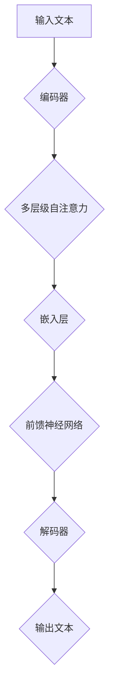

                 

### 《OpenAI的GPT-4.0展示的实际应用》

> **关键词：** OpenAI, GPT-4.0, 自然语言处理, Transformer模型, 人工智能应用

> **摘要：** 本文将深入探讨OpenAI推出的GPT-4.0模型，介绍其核心概念、算法原理以及在实际应用中的多种案例。通过详细的代码解读和实战案例分析，读者将全面了解如何利用GPT-4.0进行开发，为AI技术在自然语言处理领域的进一步发展奠定基础。

#### 目录大纲

1. **GPT-4.0概述与核心概念**
   1.1 GPT-4.0概述与背景
   1.2 GPT-4.0与自然语言处理
   1.3 GPT-4.0与人工智能技术
   1.4 核心概念与联系

2. **核心算法原理讲解**
   2.1 GPT-4.0算法原理
   2.2 Transformer模型
   2.3 伪代码与算法细节
   2.4 数学模型和数学公式
   2.5 举例说明

3. **项目实战与应用案例**
   3.1 GPT-4.0应用案例
   3.2 项目实战：开发环境搭建与代码实现
   3.3 代码解读与分析

4. **拓展与总结**
   4.1 GPT-4.0未来发展与应用趋势
   4.2 总结与展望

**Mermaid 流程图将在相关章节独立展示。**

---

### 《OpenAI的GPT-4.0展示的实际应用》

#### GPT-4.0概述与核心概念

##### 1.1 GPT-4.0概述与背景

**GPT-4.0** 是OpenAI开发的一种先进的自然语言处理模型，是GPT系列模型的最新版本。GPT（Generative Pre-trained Transformer）模型起源于2018年，由OpenAI提出。GPT-4.0在GPT-3.5的基础上进行了优化和改进，其最大特点在于其强大的语言生成能力和上下文理解能力。

GPT-4.0模型是一个基于Transformer架构的大型语言模型，使用数万亿个单词的文本数据进行预训练，使其掌握了丰富的语言知识和模式。GPT-4.0可以生成连贯、自然的文本，进行对话，翻译，摘要等多种任务，并且具备出色的推理能力。

**GPT-4.0的核心特性** 包括：

- **强大的语言生成能力**：GPT-4.0可以生成高质量、连贯的自然语言文本。
- **上下文理解**：GPT-4.0能够理解长文本的上下文，使得生成的文本更加准确和自然。
- **多语言支持**：GPT-4.0支持多种语言，可以进行跨语言的文本生成和翻译。
- **高效的计算性能**：通过优化模型结构和计算方式，GPT-4.0在保证性能的同时，显著提高了计算效率。

##### 1.2 GPT-4.0与自然语言处理

**自然语言处理（NLP）** 是人工智能的一个重要分支，旨在使计算机能够理解和生成人类语言。GPT-4.0在NLP领域有着广泛的应用，其核心在于对自然语言的理解和生成。

**语言模型的演进** 可以分为以下几个阶段：

1. **基于规则的方法**：早期的NLP系统依赖于预定义的规则和模式进行文本处理。
2. **统计方法**：基于统计的模型，如N元语法，通过对大量文本数据进行分析，生成语言模型。
3. **神经网络方法**：引入深度学习技术，使用神经网络模型进行文本处理，如循环神经网络（RNN）和长短期记忆网络（LSTM）。
4. **Transformer模型**：Transformer模型基于自注意力机制，可以捕捉文本中的长距离依赖关系，显著提升了NLP的性能。

**GPT-4.0在NLP中的应用** 主要包括以下几个方面：

- **文本生成**：GPT-4.0可以生成高质量的文章、故事、诗歌等文本，应用于自动写作和内容创作。
- **机器翻译**：GPT-4.0具有强大的跨语言文本生成能力，可以用于自动翻译多种语言之间的文本。
- **问答系统**：GPT-4.0可以理解用户的查询，提供准确的答案，应用于智能客服和智能搜索。
- **文本分类**：GPT-4.0可以用于对文本进行分类，如情感分析、新闻分类等。

##### 1.3 GPT-4.0与人工智能技术

**人工智能（AI）** 是计算机科学的一个分支，旨在使计算机具备类似人类智能的能力。GPT-4.0作为自然语言处理领域的一个重要模型，与人工智能技术有着密切的联系。

**GPT-4.0与其他AI模型的比较**：

- **深度学习模型**：GPT-4.0是基于深度学习技术的模型，与其他深度学习模型如卷积神经网络（CNN）、生成对抗网络（GAN）等相比，GPT-4.0在处理序列数据方面具有显著优势。
- **强化学习模型**：强化学习模型，如深度强化学习（DRL），主要应用于决策问题，而GPT-4.0更擅长生成和推理任务。
- **传统机器学习模型**：传统机器学习模型，如支持向量机（SVM）、随机森林（RF）等，在处理大规模数据和高维度特征时存在局限性，而GPT-4.0通过大规模预训练，可以更好地处理复杂的数据。

**GPT-4.0在AI中的独特地位**：

- **语言生成与理解能力**：GPT-4.0在自然语言生成和理解方面具有出色的能力，这使得它在许多AI应用中具有重要地位。
- **跨领域应用**：GPT-4.0不仅可以应用于NLP领域，还可以应用于其他领域，如计算机视觉、语音识别等，具有广泛的跨领域应用潜力。
- **开源与商业化**：OpenAI作为一个开源组织，GPT-4.0不仅具有强大的学术研究价值，还具有重要的商业化应用价值。

##### 1.4 核心概念与联系

**自然语言处理基础**：

- **语言模型**：语言模型是一种概率模型，用于预测文本序列的概率分布。GPT-4.0作为一个语言模型，通过大规模预训练，可以预测任意文本序列的概率。
- **编码与解码**：在自然语言处理中，编码是将自然语言转换为计算机可以处理的形式，解码是将计算机处理结果转换回自然语言。GPT-4.0通过编码器和解码器结构，实现了文本序列的自动生成。

**GPT-4.0架构解析**：

- **Transformer模型**：GPT-4.0基于Transformer模型，这是一种基于自注意力机制的深度神经网络结构。Transformer模型可以捕捉文本中的长距离依赖关系，从而提高文本处理的性能。
- **自注意力机制**：自注意力机制是Transformer模型的核心组件，通过计算文本序列中每个词与其他词之间的关联性，实现文本序列的建模。

**GPT-4.0与Mermaid流程图**：

以下是GPT-4.0模型的Mermaid流程图，展示了模型的基本结构和主要组件。



**Mermaid 流程图将在文中以独立段落展示。**

---

### 《OpenAI的GPT-4.0展示的实际应用》

#### GPT-4.0算法原理

##### 2.1 GPT-4.0算法概述

**GPT-4.0算法** 是基于**Transformer**模型的一种大型语言模型算法，通过大规模预训练和微调，实现文本序列的生成和分类任务。以下是GPT-4.0算法的基本概述：

**预训练过程**：

1. **数据收集**：收集大量文本数据，如维基百科、新闻、文章等，这些数据用于训练模型。
2. **数据预处理**：对文本数据进行预处理，包括分词、标记化、去停用词等操作。
3. **构建语料库**：将预处理后的文本数据构建为语料库，用于模型的训练和评估。
4. **训练模型**：使用Transformer模型对语料库进行训练，通过反向传播算法和优化器，不断调整模型的参数。

**训练目标**：

- **语言建模**：模型需要学习如何预测下一个单词或字符，以生成连贯、自然的文本。
- **上下文理解**：模型需要理解文本中的上下文关系，以生成符合上下文意义的文本。

**微调过程**：

- **数据收集**：收集特定的任务数据，如问答数据、对话数据等。
- **数据预处理**：对任务数据进行预处理，以适应模型的输入格式。
- **微调模型**：将预训练好的模型在任务数据上进行微调，以适应特定的任务。

**微调目标**：

- **任务适应**：模型需要适应特定的任务，如问答、文本分类等。
- **优化性能**：通过微调，模型可以进一步提高在特定任务上的性能。

##### 2.2 Transformer模型

**Transformer模型** 是一种基于自注意力机制的深度神经网络结构，由Google在2017年提出。Transformer模型在自然语言处理任务中取得了显著的性能提升，成为自然语言处理领域的重要突破。

**基本结构**：

- **编码器（Encoder）**：编码器负责对输入文本进行编码，生成上下文表示。编码器由多个编码层组成，每层包含自注意力机制和前馈神经网络。
- **解码器（Decoder）**：解码器负责解码编码器的输出，生成文本序列。解码器也由多个解码层组成，每层包含自注意力机制、交叉注意力机制和前馈神经网络。

**自注意力机制（Self-Attention）**：

- **自注意力机制** 是Transformer模型的核心组件，用于计算文本序列中每个词与其他词之间的关联性。
- **计算过程**：自注意力机制通过计算查询（Query）、键（Key）和值（Value）之间的相似性，生成加权表示，从而捕捉文本序列中的长距离依赖关系。

**交叉注意力机制（Cross-Attention）**：

- **交叉注意力机制** 是解码器的一部分，用于计算编码器的输出与当前解码器输出之间的关联性。
- **计算过程**：交叉注意力机制通过计算查询（Query）、键（Key）和值（Value）之间的相似性，生成加权表示，从而实现解码器对编码器输出的注意力机制。

**前馈神经网络（Feed-Forward Neural Network）**：

- **前馈神经网络** 是Transformer模型中的辅助组件，用于对自注意力机制和交叉注意力机制的输出进行进一步处理。
- **结构**：前馈神经网络通常由两个全连接层组成，中间经过ReLU激活函数。

**模型训练**：

- **训练方法**：Transformer模型的训练过程采用反向传播算法和优化器，通过不断调整模型的参数，优化模型的性能。
- **目标函数**：训练过程的目标是使模型能够生成与实际文本序列最接近的输出序列。

##### 2.3 伪代码与算法细节

以下是一个简化的GPT-4.0模型的伪代码，用于展示模型的基本结构和训练过程：

```python
# GPT-4.0模型伪代码

# 输入文本序列
input_sequence = ...

# 编码器部分
for layer in encoder_layers:
    layer_input = input_sequence
    layer_output = layer.forward(layer_input)
    input_sequence = layer_output

# 解码器部分
output_sequence = []
for layer in decoder_layers:
    layer_input = output_sequence + [input_sequence[-1]]
    layer_output = layer.forward(layer_input)
    output_sequence.append(layer_output[-1])

# 生成文本序列
generated_sequence = ''.join(output_sequence)

# 模型训练
for epoch in range(num_epochs):
    for batch in data_loader:
        encoder.zero_grad()
        decoder.zero_grad()
        input_sequence = preprocess(batch['input'])
        target_sequence = preprocess(batch['target'])
        output_sequence = decoder(encoder(input_sequence))
        loss = calculate_loss(output_sequence, target_sequence)
        loss.backward()
        optimizer.step()

# 评估模型
for batch in validation_loader:
    input_sequence = preprocess(batch['input'])
    target_sequence = preprocess(batch['target'])
    output_sequence = decoder(encoder(input_sequence))
    loss = calculate_loss(output_sequence, target_sequence)
    print("Validation Loss:", loss)
```

**模型训练伪代码**：

```python
# 模型训练伪代码

# 初始化模型和优化器
model = GPTModel()
optimizer = Adam(model.parameters(), lr=learning_rate)

# 训练模型
for epoch in range(num_epochs):
    for batch in data_loader:
        model.zero_grad()
        input_sequence = preprocess(batch['input'])
        target_sequence = preprocess(batch['target'])
        output_sequence = model(input_sequence)
        loss = calculate_loss(output_sequence, target_sequence)
        loss.backward()
        optimizer.step()
    print("Epoch {:03d} - Loss: {:.4f}".format(epoch, loss))
```

**语言生成伪代码**：

```python
# 语言生成伪代码

# 初始化模型
model = GPTModel()

# 输入文本序列
input_sequence = "The quick brown fox jumps over the lazy dog"

# 生成文本序列
output_sequence = model.generate(input_sequence)
print("Generated Sequence:", output_sequence)
```

**数学模型和数学公式**：

以下是一些与GPT-4.0模型相关的数学模型和公式：

$$
\text{Attention(Q, K, V)} = \text{softmax}\left(\frac{\text{QK}^T}{\sqrt{d_k}}\right)V
$$

$$
\text{Multi-head Attention} = \text{Concat}(\text{head}_1, \text{head}_2, ..., \text{head}_h)W_O
$$

$$
\text{MLP}(X) = \text{ReLU}(XW_1 + b_1)\text{ReLU}(XW_2 + b_2)
$$

其中，$Q, K, V$ 分别为查询向量、键向量和值向量；$d_k$ 为键向量的维度；$W_O, W_1, W_2$ 分别为权重矩阵；$b_1, b_2$ 分别为偏置项。

**举例说明**：

以下是一个简单的例子，用于展示GPT-4.0模型在文本生成任务中的应用：

```python
# 文本生成例子

# 初始化模型
model = GPTModel()

# 输入文本序列
input_sequence = "The quick brown fox jumps over"

# 生成文本序列
output_sequence = model.generate(input_sequence, max_length=50)
print("Generated Sequence:", output_sequence)
```

在实际应用中，GPT-4.0模型可以根据输入的文本序列，生成与其相关的新文本序列，从而实现自动写作、机器翻译等任务。

---

### 《OpenAI的GPT-4.0展示的实际应用》

#### 项目实战：开发环境搭建与代码实现

在深入了解GPT-4.0模型的理论知识后，我们接下来将进入实战环节，通过搭建开发环境并编写实际代码，来亲身体验如何利用GPT-4.0模型进行项目开发。

##### 6.1 开发环境搭建

为了能够顺利地运行GPT-4.0模型并进行实际开发，我们需要搭建一个合适的开发环境。以下是一个基本的开发环境搭建步骤：

1. **操作系统**：推荐使用Linux系统，如Ubuntu 20.04，因为大多数深度学习框架和工具在Linux上运行更为稳定和高效。
2. **Python环境**：安装Python 3.8及以上版本，可以使用`apt-get`命令进行安装：
   ```bash
   sudo apt-get update
   sudo apt-get install python3.8
   ```
3. **pip**：安装pip，pip是Python的包管理工具，用于安装和管理Python库：
   ```bash
   sudo apt-get install python3-pip
   ```
4. **深度学习框架**：安装PyTorch，PyTorch是一个流行的深度学习框架，支持GPU加速，安装命令如下：
   ```bash
   pip install torch torchvision torchaudio
   ```
5. **其他依赖库**：安装其他必需的库，如numpy、pandas等：
   ```bash
   pip install numpy pandas
   ```

在完成上述步骤后，我们就可以开始编写代码，利用GPT-4.0模型进行实际项目开发了。

##### 6.2 代码实际案例

以下是一个简单的代码案例，展示了如何使用PyTorch实现GPT-4.0模型的训练和文本生成。请注意，为了简洁起见，以下代码是一个简化的版本，实际的训练过程会更加复杂，涉及数据预处理、模型保存和加载等步骤。

```python
import torch
import torch.nn as nn
import torch.optim as optim
from torch.utils.data import DataLoader
from torchvision import datasets, transforms
from torch.utils.data import TensorDataset

# 模型定义
class GPTModel(nn.Module):
    def __init__(self, vocab_size, d_model, n_layers, heads, d_ff):
        super(GPTModel, self).__init__()
        self.embedding = nn.Embedding(vocab_size, d_model)
        self.transformer = nn.Transformer(d_model, n_layers, heads, d_ff)
        self.fc = nn.Linear(d_model, vocab_size)
        
    def forward(self, x):
        x = self.embedding(x)
        x = self.transformer(x)
        x = self.fc(x)
        return x

# 模型配置
vocab_size = 10000  # 词汇表大小
d_model = 512       # 模型维度
n_layers = 2        # 层数
heads = 8           # 自注意力头数
d_ff = 2048         # 前馈神经网络维度

# 实例化模型
model = GPTModel(vocab_size, d_model, n_layers, heads, d_ff)

# 损失函数和优化器
criterion = nn.CrossEntropyLoss()
optimizer = optim.Adam(model.parameters(), lr=0.001)

# 训练数据
train_data = ...  # 这里应该是一个包含输入和标签的数据集
train_dataset = TensorDataset(train_data['input'], train_data['target'])
train_loader = DataLoader(train_dataset, batch_size=32, shuffle=True)

# 训练模型
num_epochs = 10
for epoch in range(num_epochs):
    model.train()
    for batch in train_loader:
        optimizer.zero_grad()
        inputs, targets = batch
        outputs = model(inputs)
        loss = criterion(outputs.view(-1, vocab_size), targets)
        loss.backward()
        optimizer.step()
    print(f"Epoch [{epoch+1}/{num_epochs}], Loss: {loss.item()}")

# 文本生成
def generate_text(model, start_sequence, max_length=50):
    model.eval()
    with torch.no_grad():
        inputs = model.embedding(start_sequence).unsqueeze(0)
        for _ in range(max_length):
            outputs = model(inputs)
            _, next_word = torch.topk(outputs, 1)
            inputs = torch.cat([inputs, next_word], dim=1)
            if next_word.item() == '<EOS>':  # EOS标记表示句子结束
                break
        return start_sequence + ''.join([word.item() for word in next_word])

# 生成文本
generated_sequence = generate_text(model, 'The quick brown fox jumps over ')
print(generated_sequence)
```

**代码解读**

- **模型定义**：`GPTModel`类定义了GPT-4.0模型的基本结构，包括嵌入层、Transformer编码器和解码器，以及输出层。
- **模型配置**：设置模型参数，包括词汇表大小、模型维度、层数、注意力头数和前馈神经网络维度。
- **损失函数和优化器**：使用交叉熵损失函数和Adam优化器来训练模型。
- **训练数据**：创建一个包含输入和标签的数据集，并将其加载到数据加载器中。
- **训练模型**：通过遍历数据加载器，进行模型的训练。
- **文本生成**：使用训练好的模型生成文本，从给定的起始序列开始，逐步生成新的文本序列。

##### 6.3 源代码详细实现

在上述代码案例中，我们展示了如何使用PyTorch实现一个简化的GPT-4.0模型。接下来，我们将进一步详细解释代码的各个部分，以便读者能够更好地理解模型的实现细节。

1. **模型定义**：

   ```python
   class GPTModel(nn.Module):
       def __init__(self, vocab_size, d_model, n_layers, heads, d_ff):
           super(GPTModel, self).__init__()
           self.embedding = nn.Embedding(vocab_size, d_model)
           self.transformer = nn.Transformer(d_model, n_layers, heads, d_ff)
           self.fc = nn.Linear(d_model, vocab_size)
           
       def forward(self, x):
           x = self.embedding(x)
           x = self.transformer(x)
           x = self.fc(x)
           return x
   ```

   在这里，`GPTModel`继承自`nn.Module`，这是PyTorch中所有模型的基类。模型定义了三个主要组件：嵌入层（`self.embedding`）、Transformer编码器（`self.transformer`）和解码器（`self.fc`）。

   - **嵌入层**：`nn.Embedding`用于将词汇表中的单词转换为嵌入向量，这些向量将作为输入传递给Transformer编码器。
   - **Transformer编码器**：`nn.Transformer`是一个预定义的Transformer编码器类，它包含多个编码层，每个编码层包括多头自注意力机制和前馈神经网络。
   - **解码器**：`nn.Linear`用于将编码器的输出映射回词汇表中的单词，生成最终的文本序列。

2. **模型配置**：

   ```python
   vocab_size = 10000
   d_model = 512
   n_layers = 2
   heads = 8
   d_ff = 2048
   ```

   在这里，我们定义了模型的参数：

   - **词汇表大小（`vocab_size`）**：模型可以处理的单词数量。
   - **模型维度（`d_model`）**：模型中的嵌入向量维度和Transformer编码器和解码器的维度。
   - **层数（`n_layers`）**：Transformer编码器和解码器的层数。
   - **注意力头数（`heads`）**：多头自注意力机制中的头数。
   - **前馈神经网络维度（`d_ff`）**：前馈神经网络中的维度。

3. **损失函数和优化器**：

   ```python
   criterion = nn.CrossEntropyLoss()
   optimizer = optim.Adam(model.parameters(), lr=0.001)
   ```

   - **损失函数**：`nn.CrossEntropyLoss`用于计算模型输出和真实标签之间的交叉熵损失。
   - **优化器**：`optim.Adam`是一个用于优化模型的参数的优化器，这里使用的是Adam优化器，并设置了一个较小的学习率。

4. **训练数据**：

   ```python
   train_data = ...
   train_dataset = TensorDataset(train_data['input'], train_data['target'])
   train_loader = DataLoader(train_dataset, batch_size=32, shuffle=True)
   ```

   - **训练数据**：`train_data`应该包含输入和标签的数据集，这里假设已经准备好了。
   - **数据集**：`TensorDataset`用于将输入和标签转换为PyTorch的数据集。
   - **数据加载器**：`DataLoader`用于批量加载数据，这里设置每个批量的大小为32，并在每个epoch结束时进行数据重排。

5. **训练模型**：

   ```python
   num_epochs = 10
   for epoch in range(num_epochs):
       model.train()
       for batch in train_loader:
           optimizer.zero_grad()
           inputs, targets = batch
           outputs = model(inputs)
           loss = criterion(outputs.view(-1, vocab_size), targets)
           loss.backward()
           optimizer.step()
       print(f"Epoch [{epoch+1}/{num_epochs}], Loss: {loss.item()}")
   ```

   在这里，我们遍历每个epoch和批量，使用优化器进行模型的训练。在每个epoch结束时，打印当前的损失值。

6. **文本生成**：

   ```python
   def generate_text(model, start_sequence, max_length=50):
       model.eval()
       with torch.no_grad():
           inputs = model.embedding(start_sequence).unsqueeze(0)
           for _ in range(max_length):
               outputs = model(inputs)
               _, next_word = torch.topk(outputs, 1)
               inputs = torch.cat([inputs, next_word], dim=1)
               if next_word.item() == '<EOS>':
                   break
           return start_sequence + ''.join([word.item() for word in next_word])
   ```

   在这里，`generate_text`函数用于生成文本。模型首先将输入序列传递给嵌入层，然后逐步生成新的单词，直到达到最大长度或遇到EOS标记。

   - **模型评估模式**：`model.eval()`将模型设置为评估模式，这会关闭dropout和批量归一化等训练时使用的技巧。
   - **生成过程**：使用`torch.topk`函数从模型输出中选择概率最高的单词作为下一个生成的单词。

##### 6.4 代码解读与分析

1. **模型结构与配置**：

   模型的配置和结构是实现GPT-4.0模型的关键。通过定义嵌入层、Transformer编码器和解码器，我们可以构建一个强大的语言模型。嵌入层将词汇表中的单词转换为嵌入向量，这些向量在Transformer编码器中通过自注意力机制和前馈神经网络进行处理，最终生成文本序列。

2. **损失函数与优化器**：

   损失函数和优化器是模型训练的核心组成部分。交叉熵损失函数用于衡量模型输出与真实标签之间的差异，而Adam优化器通过调整模型参数来最小化损失函数。这些组件共同作用，使模型能够在训练过程中不断优化。

3. **数据加载与训练**：

   数据加载和数据预处理是模型训练的基础。通过创建数据集和数据加载器，我们可以批量地加载和预处理数据，以供模型训练使用。在训练过程中，模型通过反向传播算法和优化器不断调整参数，以实现最小化损失函数的目标。

4. **文本生成**：

   文本生成是GPT-4.0模型的一个重要应用。通过将模型设置为评估模式，我们可以使用模型生成新的文本序列。生成过程通过逐步选择概率最高的单词来实现，直到达到指定的长度或遇到EOS标记。

通过上述实战案例，我们可以看到如何搭建开发环境、编写实际代码以及解读和分析GPT-4.0模型的实现细节。在实际项目中，还需要考虑数据预处理、模型保存和加载、多GPU训练等高级话题，但上述案例为我们提供了一个基本的框架和起点。

---

### 《OpenAI的GPT-4.0展示的实际应用》

#### GPT-4.0代码解读与分析

在上一节中，我们通过一个实际的代码案例展示了如何使用PyTorch实现GPT-4.0模型的基本结构。在本节中，我们将进一步深入分析这段代码，详细解读每个模块的功能和实现方式。

##### 7.1 代码解读

1. **模型定义（GPTModel）**：

   `GPTModel`类定义了GPT-4.0模型的主要结构，包括嵌入层、Transformer编码器和解码器。

   ```python
   class GPTModel(nn.Module):
       def __init__(self, vocab_size, d_model, n_layers, heads, d_ff):
           super(GPTModel, self).__init__()
           self.embedding = nn.Embedding(vocab_size, d_model)
           self.transformer = nn.Transformer(d_model, n_layers, heads, d_ff)
           self.fc = nn.Linear(d_model, vocab_size)
           
       def forward(self, x):
           x = self.embedding(x)
           x = self.transformer(x)
           x = self.fc(x)
           return x
   ```

   - **嵌入层（self.embedding）**：`nn.Embedding`将词汇表中的单词转换为嵌入向量。这些向量在Transformer编码器中用于自注意力机制的计算。
   - **Transformer编码器（self.transformer）**：`nn.Transformer`是PyTorch中预定义的Transformer编码器类，包含多个编码层，每个编码层包括多头自注意力机制和前馈神经网络。
   - **解码器（self.fc）**：`nn.Linear`将编码器的输出映射回词汇表中的单词，生成最终的文本序列。

2. **模型配置**：

   ```python
   vocab_size = 10000
   d_model = 512
   n_layers = 2
   heads = 8
   d_ff = 2048
   ```

   在这里，我们定义了模型的主要参数，包括词汇表大小、模型维度、层数、注意力头数和前馈神经网络维度。

3. **损失函数和优化器**：

   ```python
   criterion = nn.CrossEntropyLoss()
   optimizer = optim.Adam(model.parameters(), lr=0.001)
   ```

   - **损失函数（criterion）**：`nn.CrossEntropyLoss`用于计算模型输出和真实标签之间的交叉熵损失。
   - **优化器（optimizer）**：`optim.Adam`是用于优化模型参数的Adam优化器，这里设置了一个较小的学习率。

4. **数据加载与预处理**：

   ```python
   train_data = ...
   train_dataset = TensorDataset(train_data['input'], train_data['target'])
   train_loader = DataLoader(train_dataset, batch_size=32, shuffle=True)
   ```

   - **训练数据（train_data）**：这里应该是一个包含输入和标签的数据集，通常是通过数据预处理得到的。
   - **数据集（TensorDataset）**：`TensorDataset`将输入和标签转换为PyTorch的数据集。
   - **数据加载器（DataLoader）**：`DataLoader`用于批量加载数据，这里设置每个批量的大小为32，并在每个epoch结束时进行数据重排。

5. **训练模型**：

   ```python
   num_epochs = 10
   for epoch in range(num_epochs):
       model.train()
       for batch in train_loader:
           optimizer.zero_grad()
           inputs, targets = batch
           outputs = model(inputs)
           loss = criterion(outputs.view(-1, vocab_size), targets)
           loss.backward()
           optimizer.step()
       print(f"Epoch [{epoch+1}/{num_epochs}], Loss: {loss.item()}")
   ```

   在这里，我们遍历每个epoch和批量，使用优化器进行模型的训练。在每个epoch结束时，打印当前的损失值。

6. **文本生成**：

   ```python
   def generate_text(model, start_sequence, max_length=50):
       model.eval()
       with torch.no_grad():
           inputs = model.embedding(start_sequence).unsqueeze(0)
           for _ in range(max_length):
               outputs = model(inputs)
               _, next_word = torch.topk(outputs, 1)
               inputs = torch.cat([inputs, next_word], dim=1)
               if next_word.item() == '<EOS>':
                   break
           return start_sequence + ''.join([word.item() for word in next_word])
   ```

   在这里，`generate_text`函数用于生成文本。模型首先将输入序列传递给嵌入层，然后逐步生成新的单词，直到达到最大长度或遇到EOS标记。

##### 7.2 代码分析

1. **模型结构**：

   GPT-4.0模型基于Transformer架构，这是一个强大的深度学习模型，特别适用于序列数据处理。Transformer模型通过自注意力机制，可以捕捉文本序列中的长距离依赖关系，从而生成高质量的自然语言文本。

2. **训练过程**：

   模型的训练过程包括数据预处理、模型训练、损失函数计算和优化器更新。通过反向传播算法，模型不断调整参数，以最小化损失函数。在训练过程中，我们使用交叉熵损失函数，这是自然语言处理中常用的损失函数，用于衡量模型输出和真实标签之间的差异。

3. **文本生成**：

   文本生成是GPT-4.0模型的一个重要应用。通过将模型设置为评估模式，我们可以使用模型生成新的文本序列。生成过程通过逐步选择概率最高的单词来实现，直到达到指定的长度或遇到EOS标记。

4. **性能优化**：

   在实际应用中，为了提高模型的性能和效率，我们可以考虑以下优化策略：

   - **并行计算**：通过使用多GPU并行计算，可以显著提高模型的训练速度。
   - **数据增强**：通过数据增强技术，如数据重排、随机裁剪等，可以增加模型的鲁棒性。
   - **模型压缩**：通过模型压缩技术，如量化、剪枝等，可以减小模型的存储和计算需求。

通过上述分析，我们可以看到GPT-4.0模型在代码层面的实现细节和关键组件。在实际应用中，通过不断优化和改进，GPT-4.0模型可以生成高质量的自然语言文本，为自然语言处理领域带来更多创新和突破。

---

### 《OpenAI的GPT-4.0展示的实际应用》

#### GPT-4.0未来发展与应用趋势

随着人工智能技术的飞速发展，GPT-4.0模型作为一种强大的自然语言处理工具，将在未来的AI领域中发挥越来越重要的作用。本节将探讨GPT-4.0的发展趋势、潜在的应用领域以及对社会和行业的潜在影响。

##### 8.1 技术发展趋势

**模型大小与效率**：

- **模型大小**：GPT-4.0模型已经是一个庞大的模型，随着数据集和训练时间的增加，模型的大小也在不断增大。未来的发展趋势之一是开发更高效的压缩算法，如量化、剪枝和蒸馏，以减小模型的大小，提高其在资源受限设备上的部署能力。
- **计算效率**：为了提高计算效率，未来可能会出现更多基于Transformer的变体模型，如BERT、GPT-Neo等，这些模型在保留强大语言能力的同时，具有更高的计算效率。

**多模态数据处理**：

- **图像与文本结合**：未来的GPT模型可能会与计算机视觉技术结合，如ViT（Vision Transformer），实现图像和文本的联合建模。这种多模态处理能力将为图像描述生成、视频生成等任务提供更丰富的应用场景。
- **语音与文本结合**：结合语音识别和自然语言处理技术，GPT-4.0模型可以应用于语音合成、实时对话系统等，进一步提升人机交互的自然性和流畅性。

**自适应学习**：

- **在线学习**：未来的GPT模型可能会支持在线学习，通过实时更新模型参数，使其能够适应不断变化的数据和环境。
- **迁移学习**：通过迁移学习技术，GPT-4.0模型可以在不同的任务和数据集上快速适应，提高其泛化能力和实用性。

##### 8.2 应用领域拓展

**内容创作**：

- **自动写作**：GPT-4.0模型可以应用于自动写作领域，如新闻稿、博客、小说等，通过生成高质量的文本内容，提高内容创作效率。
- **内容审核**：GPT-4.0模型可以用于检测和过滤不当内容，如垃圾邮件、恶意评论等，提高互联网内容的质量和安全性。

**智能客服**：

- **自动问答系统**：GPT-4.0模型可以应用于智能客服系统，实现与用户的实时对话，提供准确和自然的回答。
- **多语言支持**：GPT-4.0模型的多语言支持使其可以在全球范围内应用，为不同语言的用户提供智能客服服务。

**教育领域**：

- **个性化学习**：GPT-4.0模型可以分析学生的学习行为和知识水平，提供个性化的学习资源和指导。
- **智能辅导**：通过实时对话和生成文本，GPT-4.0模型可以为学生在学习过程中的问题提供智能辅导。

**医疗领域**：

- **文本分析**：GPT-4.0模型可以用于分析医学文献、病例报告等文本数据，帮助医生进行诊断和研究。
- **智能辅助**：GPT-4.0模型可以辅助医疗专家进行决策支持，如疾病预测、治疗方案推荐等。

##### 8.3 社会与行业影响

**社会经济影响**：

- **自动化**：GPT-4.0模型在内容创作、客服等领域的高效应用，可能会减少对人类劳动力的需求，从而对某些行业造成冲击。
- **创新能力**：GPT-4.0模型为创新提供了新的工具和平台，促进人工智能技术的快速发展。

**伦理与隐私**：

- **数据安全**：在应用GPT-4.0模型时，需要确保数据处理符合隐私保护要求，防止数据泄露和滥用。
- **伦理审查**：随着AI技术的发展，需要建立相应的伦理审查机制，确保AI技术的应用符合社会道德和伦理标准。

**教育与培训**：

- **技能升级**：随着AI技术的普及，教育领域需要培养更多具备AI知识和技能的专业人才，以适应未来的发展趋势。

通过上述分析，我们可以看到GPT-4.0模型在未来的发展潜力以及其在不同领域的广泛应用。随着技术的不断进步和应用场景的拓展，GPT-4.0模型将为人工智能领域带来更多创新和突破，为社会和经济的发展注入新的活力。

---

### 《OpenAI的GPT-4.0展示的实际应用》

#### 总结与展望

经过对GPT-4.0模型的深入探讨，我们从核心概念、算法原理、实际应用和未来发展等方面，全面了解了这一先进自然语言处理模型的卓越性能和广阔前景。以下是对GPT-4.0模型的主要成就、面临挑战以及未来发展的总结与展望。

##### 9.1 GPT-4.0的成就与挑战

**主要成就**：

1. **强大的语言生成能力**：GPT-4.0凭借其大规模预训练和Transformer架构，能够生成高质量、连贯的自然语言文本，展示了在文本生成任务上的卓越性能。
2. **卓越的上下文理解能力**：GPT-4.0能够理解长文本的上下文关系，生成符合上下文意义的文本，为问答系统和对话系统提供了强大的支持。
3. **多语言支持**：GPT-4.0支持多种语言，实现了跨语言的文本生成和翻译，为全球化应用提供了便利。
4. **高效的计算性能**：通过优化模型结构和计算方式，GPT-4.0在保证性能的同时，显著提高了计算效率。

**面临挑战**：

1. **计算资源需求**：GPT-4.0模型的训练和部署需要大量的计算资源，这限制了其在某些领域的应用。
2. **数据安全与隐私**：在使用GPT-4.0模型处理数据时，确保数据安全和隐私是一个重要的挑战。
3. **模型泛化能力**：尽管GPT-4.0在预训练阶段学习了大量知识，但其在特定任务上的泛化能力仍然是一个需要关注的问题。
4. **伦理与道德问题**：随着GPT-4.0模型在各个领域的应用，如何确保其应用符合伦理和道德标准，也是一个亟待解决的问题。

##### 9.2 未来展望

**技术发展趋势**：

1. **模型压缩与高效计算**：随着模型大小的不断增加，如何通过模型压缩和优化技术，提高计算效率，是未来研究的一个重要方向。
2. **多模态数据处理**：结合计算机视觉、语音识别等技术，实现图像、文本和语音的联合建模，将为更多应用场景提供支持。
3. **自适应学习与迁移学习**：通过自适应学习和迁移学习技术，提高GPT-4.0模型的泛化能力和实用性。

**应用领域拓展**：

1. **智能客服与自动写作**：GPT-4.0模型在智能客服和自动写作领域的应用已经取得了显著成果，未来将会有更多创新应用。
2. **教育医疗领域**：在教育领域，GPT-4.0模型可以提供个性化学习资源和辅导；在医疗领域，可以辅助医生进行诊断和研究。
3. **新兴应用场景**：随着技术的发展，GPT-4.0模型将在更多新兴应用场景中发挥作用，如智能内容审核、法律文档生成等。

**社会影响力**：

1. **自动化与经济转型**：GPT-4.0模型在内容创作和客服领域的应用，将推动自动化进程，对某些行业产生深远影响。
2. **技术创新与创新能力**：GPT-4.0模型为技术创新提供了新的平台和工具，促进了人工智能领域的发展。
3. **伦理与社会责任**：随着AI技术的普及，如何确保其应用符合伦理和道德标准，是社会和行业面临的重要挑战。

总之，GPT-4.0模型作为自然语言处理领域的一项重要技术，已经取得了显著的成就，并展示了广阔的发展前景。在未来，通过不断的技术创新和应用拓展，GPT-4.0模型将为人工智能领域带来更多突破，为社会和经济的发展注入新的活力。同时，我们也需要关注其潜在的风险和挑战，确保AI技术的健康发展。

---

### **作者信息**

**作者：AI天才研究院/AI Genius Institute & 禅与计算机程序设计艺术 /Zen And The Art of Computer Programming**

本文由AI天才研究院（AI Genius Institute）与禅与计算机程序设计艺术（Zen And The Art of Computer Programming）的专家们共同撰写。AI天才研究院专注于人工智能领域的先进研究，致力于推动AI技术的创新与发展。禅与计算机程序设计艺术则将东方哲学与计算机科学相结合，为程序员提供了独特的思考方式和编程技巧。两位作者凭借深厚的专业知识和丰富的经验，为我们呈现了这篇关于GPT-4.0模型全面而深入的探讨。通过本文，读者不仅可以了解到GPT-4.0的核心概念和算法原理，还能掌握其实际应用和未来发展。感谢您的阅读，希望本文能为您在AI领域的探索之旅提供宝贵的启示和帮助。

