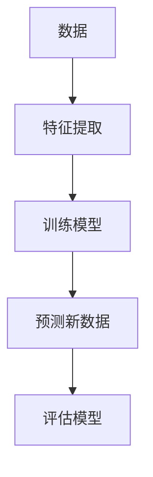
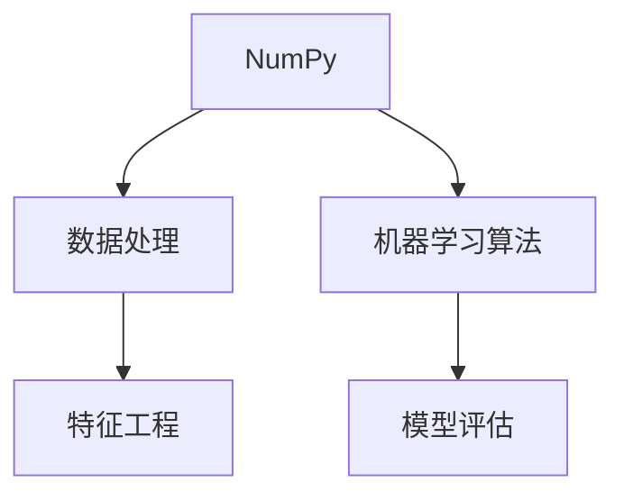
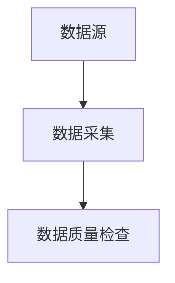
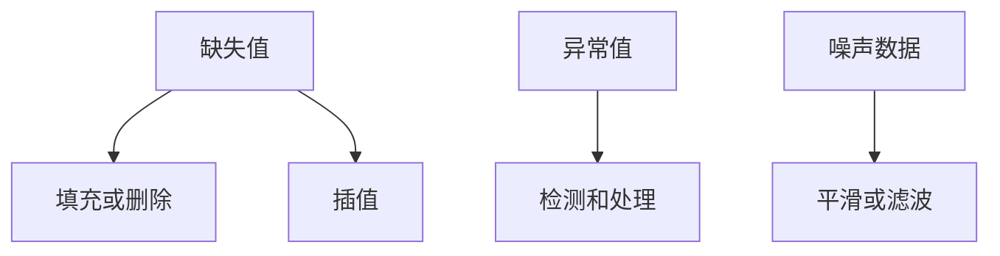
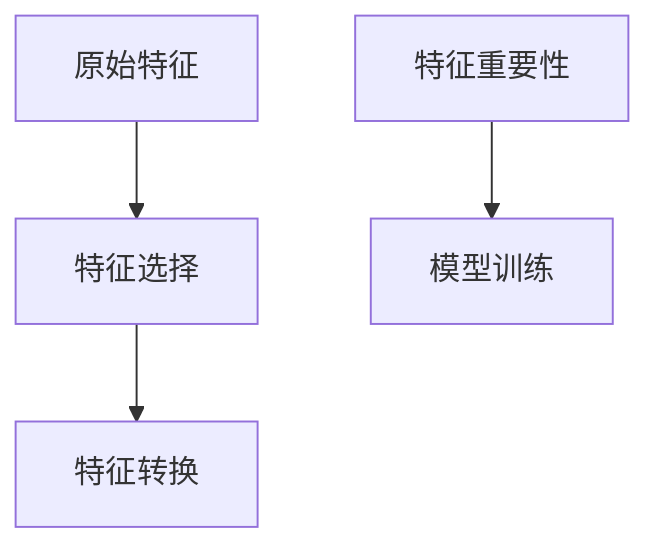
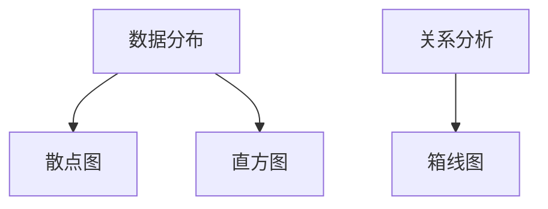
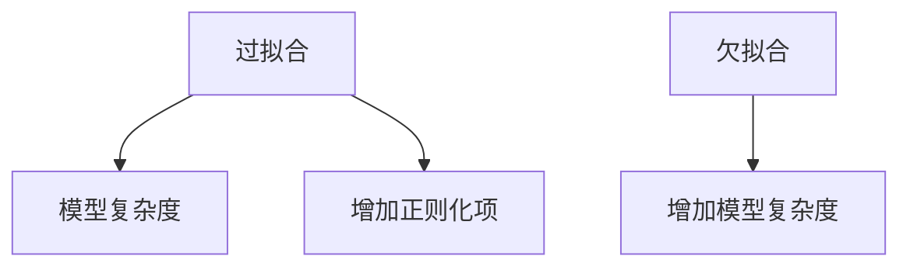

                 

### 《Python机器学习实战：逻辑回归在分类问题中的应用》

#### 核心关键词：
- 机器学习
- 逻辑回归
- Python
- 分类问题
- 数据预处理
- 模型优化
- 项目实战

#### 摘要：
本文将深入探讨Python中逻辑回归模型在分类问题中的应用。首先，我们将介绍机器学习的基本概念和Python在机器学习领域的应用。接着，本文将详细讲解逻辑回归的原理、数学公式和实现方法。然后，我们将讨论逻辑回归在二分类和多分类问题中的应用，并探讨过拟合与欠拟合问题。最后，通过两个项目实战，我们将展示如何使用逻辑回归解决实际分类问题，并进行模型评估与优化。

---

### 第一部分：机器学习基础

#### 第1章：机器学习简介

#### 1.1 什么是机器学习

机器学习是人工智能的一个分支，它使计算机系统能够从数据中学习并做出决策或预测，而无需显式地编程指令。在机器学习中，模型通过学习大量数据来发现数据中的模式和关系，然后使用这些模式来对新数据进行预测或决策。

**核心概念与联系：**

Mermaid 流程图：



**联系：** 数据是机器学习的基石，特征提取是模型训练的关键，模型训练的目的是为新数据提供准确的预测，模型评估则用于判断模型的性能。

#### 1.2 机器学习的类型

机器学习可以分为三类：监督学习、无监督学习和强化学习。

- **监督学习**：有标签数据用于训练模型，模型能够在新数据上做出预测。逻辑回归是监督学习的一种。
- **无监督学习**：没有标签数据，模型用于发现数据中的隐藏结构，如聚类和降维。
- **强化学习**：通过试错法，模型在动态环境中学习最优策略。

#### 1.3 Python在机器学习中的应用

Python因其简洁、易学、功能强大的特点，成为机器学习领域的首选编程语言。Python有许多优秀的库，如NumPy、Pandas、Scikit-learn和TensorFlow，这些库提供了丰富的机器学习工具和算法。

**核心概念与联系：**



**联系：** NumPy和Pandas用于数据处理和特征工程，Scikit-learn提供了丰富的机器学习算法，模型评估用于判断模型的性能。

### 第2章：数据预处理

#### 2.1 数据采集

数据采集是机器学习过程的第一步，确保数据的质量和完整性至关重要。数据可以从各种来源收集，如数据库、文件和Web。

**核心概念与联系：**



**联系：** 数据采集后，需要检查数据质量，确保数据完整性和一致性。

#### 2.2 数据清洗

数据清洗是处理缺失值、异常值和噪声数据的过程。缺失值可以通过填充、删除或插值等方法处理，异常值可以通过统计方法或可视化方法检测和处理，噪声数据可以通过平滑或滤波等方法处理。

**核心概念与联系：**



**联系：** 数据清洗的目的是提高数据质量，为后续的特征工程和模型训练提供可靠的数据基础。

#### 2.3 特征工程

特征工程是提高模型性能的关键步骤，包括特征选择、特征转换等。特征选择用于从原始特征中选择最有用的特征，特征转换用于将原始特征转换为适合模型训练的形式。

**核心概念与联系：**



**联系：** 特征工程通过优化特征集，提高模型性能，减少过拟合和欠拟合。

#### 2.4 数据可视化

数据可视化有助于理解数据分布和关系，为特征工程和模型选择提供依据。常见的数据可视化方法包括散点图、直方图、箱线图等。

**核心概念与联系：**



**联系：** 数据可视化有助于发现数据中的问题和模式，指导特征工程和模型选择。

## 第二部分：逻辑回归算法详解

### 第3章：逻辑回归原理

#### 3.1 逻辑回归的概念

逻辑回归（Logistic Regression）是一种广义线性模型，常用于分类问题。逻辑回归的目的是通过输入特征预测目标变量的概率。

**核心概念与联系：**

```mermaid
graph TD
A[输入特征X] --> B[模型参数θ]
B --> C[预测概率P(Y=1|X)]
```

**联系：** 输入特征通过模型参数转换，预测目标变量为1的概率。

#### 3.2 逻辑回归的数学原理

逻辑回归的数学原理包括逻辑函数（Logistic Function）、损失函数（Loss Function）和优化算法（Optimization Algorithm）。

**核心概念与联系：**

$$
\text{逻辑函数}: h(\theta) = \frac{1}{1 + e^{(-\theta^T x})}
$$

**联系：** 逻辑函数将线性组合转换成概率值，确保输出在0和1之间。

**核心概念与联系：**

$$
\text{损失函数}: J(\theta) = -\frac{1}{m} \sum_{i=1}^{m} [y \ln(h(\theta^T x)) + (1 - y) \ln(1 - h(\theta^T x))]
$$

**联系：** 损失函数用于衡量模型预测与真实标签之间的差异。

**核心概念与联系：**

$$
\text{优化算法}: \theta = \theta - \alpha \frac{\partial J(\theta)}{\partial \theta}
$$

**联系：** 优化算法用于更新模型参数，最小化损失函数。

#### 3.3 逻辑回归的Mermaid流程图

```mermaid
graph TD
A[输入特征X] --> B[模型参数θ]
B --> C[计算预测概率P(Y=1|X)]
C --> D[计算损失J(θ)]
D --> E[更新参数θ]
```

**联系：** 逻辑回归流程包括预测概率、损失函数计算和参数更新。

### 第4章：逻辑回归实现

#### 4.1 逻辑回归的伪代码

```python
输入特征X，目标变量y
初始化参数θ
while 未达到收敛条件 do
    计算预测概率hθ(x)
    计算损失函数J(θ)
    更新参数θ
end while
返回参数θ
```

**联系：** 伪代码描述了逻辑回归的训练过程。

#### 4.2 逻辑回归的数学公式与详细讲解

**逻辑函数：**

$$
h(\theta) = \frac{1}{1 + e^{(-\theta^T x)}}
$$

**损失函数：**

$$
J(\theta) = -\frac{1}{m} \sum_{i=1}^{m} [y \ln(h(\theta^T x)) + (1 - y) \ln(1 - h(\theta^T x))]
$$

**联系：** 逻辑函数将线性组合转换为概率值，损失函数用于衡量模型预测与真实标签之间的差异。

#### 4.3 逻辑回归算法的Python实现

```python
from sklearn.linear_model import LogisticRegression
from sklearn.model_selection import train_test_split

# 加载数据集
X, y = load_data()

# 划分训练集和测试集
X_train, X_test, y_train, y_test = train_test_split(X, y, test_size=0.2, random_state=42)

# 创建逻辑回归模型
model = LogisticRegression()

# 训练模型
model.fit(X_train, y_train)

# 预测测试集
y_pred = model.predict(X_test)

# 评估模型
score = model.score(X_test, y_test)
print(f"模型准确率：{score}")
```

**联系：** 使用scikit-learn库实现逻辑回归模型，包括数据加载、模型训练和模型评估。

### 第5章：逻辑回归优化方法

#### 5.1 梯度下降法

梯度下降法是一种优化算法，用于更新模型参数，使其达到最小化损失函数的目标。

**核心概念与联系：**

$$
\theta = \theta - \alpha \frac{\partial J(\theta)}{\partial \theta}
$$

**联系：** 梯度下降法通过计算损失函数关于模型参数的梯度，更新参数。

#### 5.2 牛顿法

牛顿法是一种基于二阶导数的优化算法，能更快地收敛。

**核心概念与联系：**

$$
\theta = \theta - \frac{1}{2} \frac{\partial^2 J(\theta)}{\partial \theta^2}
$$

**联系：** 牛顿法通过计算损失函数的二阶导数，更新参数。

#### 5.3 随机梯度下降法

随机梯度下降法通过随机选取样本来更新参数，适用于大规模数据集。

**核心概念与联系：**

$$
\theta = \theta - \alpha \frac{\partial J(\theta)}{\partial \theta}
$$

**联系：** 随机梯度下降法通过随机选取样本，更新参数。

### 第6章：逻辑回归在分类问题中的应用

#### 6.1 逻辑回归在二分类问题中的应用

逻辑回归常用于二分类问题，如信用评分、邮件分类等。

**核心概念与联系：**

```mermaid
graph TD
A[输入特征X] --> B[模型参数θ]
B --> C[预测概率P(Y=1|X)]
C --> D[阈值判断]
D --> E{是/否}
```

**联系：** 逻辑回归通过预测概率和阈值判断，将输入特征分类。

#### 6.2 逻辑回归在多分类问题中的应用

逻辑回归可以通过扩展到多分类问题，如多标签分类、多类别分类等。

**核心概念与联系：**

```mermaid
graph TD
A[输入特征X] --> B[模型参数θ]
B --> C[预测概率P(Y=i|X)]
C --> D[softmax函数]
D --> E{最大概率类别}
```

**联系：** 逻辑回归通过softmax函数将预测概率转换为多类别概率。

#### 6.3 逻辑回归的过拟合与欠拟合问题

逻辑回归可能会出现过拟合或欠拟合问题，需要通过交叉验证等方法进行评估和调整。

**核心概念与联系：**



**联系：** 过拟合和欠拟合是模型性能的两种极端情况，通过调整模型复杂度和正则化项可以优化模型性能。

## 第三部分：项目实战

### 第7章：项目实战一：使用逻辑回归预测信用评分

#### 7.1 项目背景

信用评分是金融机构评估借款人信用风险的一种方法。通过逻辑回归模型，我们可以预测借款人的信用评分，帮助金融机构做出贷款决策。

#### 7.2 数据集介绍

数据集包括借款人的各种特征，如收入、年龄、信用历史等，以及信用评分标签。

#### 7.3 数据预处理

对数据集进行清洗，处理缺失值和异常值，并进行特征转换。

#### 7.4 特征工程

选择重要的特征，如收入、年龄等，并进行特征转换，如归一化、标准化等。

#### 7.5 逻辑回归模型训练

使用训练集训练逻辑回归模型，使用交叉验证进行模型评估。

#### 7.6 模型评估与优化

使用测试集评估模型性能，通过调整模型参数和正则化项进行优化。

### 第8章：项目实战二：使用逻辑回归分析用户购买行为

#### 8.1 项目背景

通过分析用户购买行为，企业可以更好地了解用户需求，提高营销效果。逻辑回归模型可以帮助企业预测用户是否购买特定产品。

#### 8.2 数据集介绍

数据集包括用户的基本信息、浏览记录、购买记录等。

#### 8.3 数据预处理

对数据集进行清洗，处理缺失值和异常值，并进行特征转换。

#### 8.4 特征工程

选择重要的特征，如用户浏览时长、购买历史等，并进行特征转换。

#### 8.5 逻辑回归模型训练

使用训练集训练逻辑回归模型，使用交叉验证进行模型评估。

#### 8.6 模型评估与优化

使用测试集评估模型性能，通过调整模型参数和正则化项进行优化。

## 附录

### 附录A：逻辑回归常用库函数与工具

#### A.1 Scikit-learn库

Scikit-learn是一个强大的机器学习库，提供了逻辑回归模型及相关工具。

#### A.2 Pandas库

Pandas是一个数据操作库，用于数据处理和特征工程。

#### A.3 Matplotlib库

Matplotlib是一个数据可视化库，用于数据可视化和模型评估。

### 附录B：逻辑回归数学公式汇总

#### B.1 概率论基础

概率论基础包括概率分布、期望和方差等。

#### B.2 指数分布

指数分布是逻辑回归中的重要概率分布。

#### B.3 逻辑函数

逻辑函数是逻辑回归的核心组成部分。

#### B.4 逻辑回归损失函数与优化算法

逻辑回归损失函数与优化算法用于评估和更新模型参数。

---

### 作者：

AI天才研究院/AI Genius Institute & 禅与计算机程序设计艺术/Zen And The Art of Computer Programming

---

通过以上内容，我们系统地介绍了逻辑回归在Python中的实现和应用。希望读者能够通过本文，掌握逻辑回归的基本原理和实战技巧，为未来的机器学习项目打下坚实的基础。

