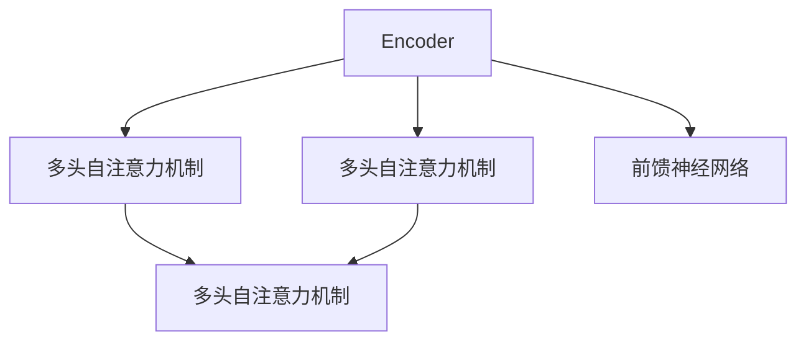
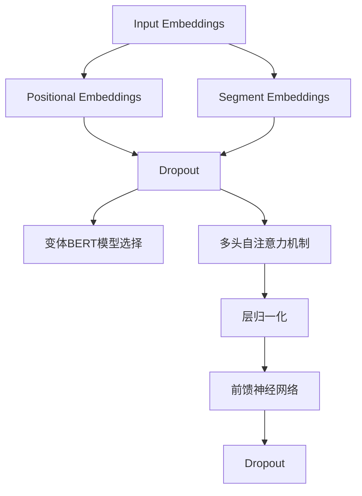
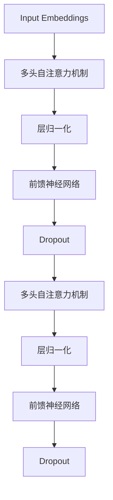
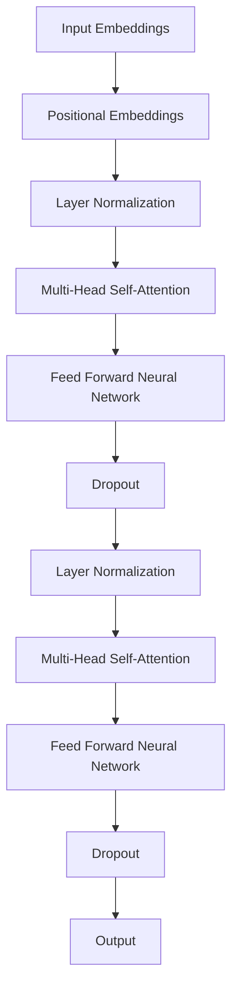

                 

### 《Transformer大模型实战 BERT 的工作原理》

> **关键词**：Transformer, BERT, 自然语言处理, 机器学习, 深度学习

> **摘要**：
本文将深入探讨Transformer和BERT这两个在自然语言处理（NLP）领域具有里程碑意义的模型。首先，我们将介绍Transformer和BERT的基本概念和特点，接着解析它们的核心算法原理，包括自注意力机制和前馈神经网络。随后，我们将讨论这些模型的数学模型以及如何通过实际代码进行举例说明。文章的后半部分将详细介绍Transformer和BERT的模型架构与训练策略，以及它们在自然语言处理任务中的应用。最后，我们将探讨Transformer和BERT的优化与调优策略，并通过实际案例展示这些模型在不同应用场景中的实战效果。通过本文，读者将全面了解Transformer和BERT的工作原理，并掌握如何在实际项目中应用这些模型。

### 《Transformer大模型实战 BERT 的工作原理》目录大纲

1. **第一部分：Transformer与BERT基础**
    1.1 Transformer与BERT概述
        1.1.1 Transformer的定义与特点
        1.1.2 BERT的定义与特点
    1.2 Transformer与BERT的核心算法原理
        1.2.1 自注意力机制
        1.2.2 前馈神经网络
    1.3 Transformer与BERT的数学模型
        1.3.1 数学公式
        1.3.2 举例说明
    1.4 Transformer与BERT的模型架构与训练策略
        1.4.1 Transformer模型的层次结构
        1.4.2 BERT的训练策略
    1.5 Transformer与BERT在自然语言处理中的应用
        1.5.1 语言模型
        1.5.2 问答系统

2. **第二部分：Transformer与BERT实战应用**
    2.1 Transformer模型实战
        2.1.1 文本分类任务介绍
        2.1.2 Transformer模型在文本分类中的实现
    2.2 BERT模型实战
        2.2.1 问答系统概述
        2.2.2 BERT模型在问答系统中的实现

3. **第三部分：Transformer与BERT优化与调优**
    3.1 Transformer模型的优化与调优
        3.1.1 学习率调度
        3.1.2 模型结构调整
    3.2 BERT模型的优化与调优
        3.2.1 预训练策略优化
        3.2.2 微调技巧

4. **第四部分：Transformer与BERT实战案例**
    4.1 Transformer模型在机器翻译中的应用
    4.2 BERT模型在文本生成中的应用

5. **第五部分：Transformer与BERT应用拓展**
    5.1 Transformer与BERT在跨模态学习中的应用
        5.1.1 跨模态学习概述
        5.1.2 Transformer在跨模态学习中的实现
        5.1.3 BERT在跨模态学习中的实现
        5.1.4 跨模态学习应用案例

6. **附录**
    6.1 Transformer与BERT模型资源
    6.2 编程环境与工具安装指南

### 第一部分：Transformer与BERT基础

#### 1.1 Transformer与BERT概述

Transformer模型和BERT（Bidirectional Encoder Representations from Transformers）模型是自然语言处理领域的两个重要里程碑，它们分别代表了序列模型和双向编码表示的突破。本节将介绍这两个模型的基本概念和特点。

##### 1.1.1 Transformer的定义与特点

Transformer模型由Vaswani等人在2017年的论文《Attention Is All You Need》中提出。它是一种基于注意力机制的序列到序列模型，不需要循环神经网络（RNN）或卷积神经网络（CNN）的传统架构。Transformer的核心思想是将序列中的每个词表示为向量，并通过多头自注意力机制和前馈神经网络进行处理。

- **多头自注意力机制**：Transformer模型中引入了多头自注意力机制，允许模型在处理每个词时考虑到序列中其他所有词的信息。这种机制通过多个注意力头（多头）实现，使得模型能够捕捉到不同类型的信息。

- **编码器与解码器**：Transformer模型包括编码器（Encoder）和解码器（Decoder）两部分。编码器负责将输入序列编码为固定长度的向量表示，解码器则负责将这些向量解码为输出序列。

- **并行计算**：与传统的序列处理模型相比，Transformer模型可以利用并行计算的优势，从而提高计算效率。

##### 1.1.2 BERT的定义与特点

BERT模型由Google在2018年提出，是第一个大规模预训练的深度学习NLP模型。BERT采用了Transformer模型的结构，并在预训练过程中引入了双向编码机制，使得模型能够理解上下文中的词语关系。

- **双向编码**：BERT模型通过两个编码器（Encoder）处理输入序列，一个用于正向编码，另一个用于反向编码。这种双向编码方式使得模型能够同时理解序列中的前后关系。

- **Masked Language Model（MLM）**：BERT在预训练过程中引入了Masked Language Model，通过对输入序列中的部分词进行遮盖，然后让模型预测这些遮盖的词。这一策略使得模型能够学习到语言中的语义和语法规则。

- **Pre-training and Fine-tuning**：BERT模型采用了预训练和微调的策略。首先在大量的无标签语料上进行预训练，然后在具体任务上进行微调，从而实现高精度的NLP任务。

##### 1.1.3 Transformer与BERT的异同

虽然Transformer和BERT都基于相同的模型架构，但它们在以下几个方面有所不同：

- **目标**：Transformer模型主要用于机器翻译、文本分类等序列到序列的任务，而BERT模型则更专注于语言理解和生成任务，如问答系统和文本生成。

- **预训练**：BERT模型采用了Masked Language Model进行预训练，而Transformer模型通常直接在任务数据上训练。

- **应用**：由于BERT具有双向编码的特点，它在很多需要理解上下文的任务上表现优异，而Transformer模型则在处理长序列任务时具有优势。

##### 1.1.4 Transformer模型的基本结构

Transformer模型的基本结构包括编码器（Encoder）和解码器（Decoder）两部分，每部分都由多个层组成。下面是一个简化的Mermaid流程图，展示了Transformer模型的基本结构：



- **编码器（Encoder）**：编码器负责将输入序列编码为固定长度的向量表示。每个编码器层包括两个子层：多头自注意力机制（Multi-Head Self-Attention）和前馈神经网络（Feed Forward Neural Network）。

- **解码器（Decoder）**：解码器负责将编码器输出的向量表示解码为输出序列。每个解码器层也包括两个子层：多头自注意力机制（Multi-Head Self-Attention）和前馈神经网络（Feed Forward Neural Network）。

##### 1.1.5 BERT模型的基本结构

BERT模型的基本结构与Transformer模型类似，但引入了Masked Language Model（MLM）和分段嵌入（Segment Embeddings）等特殊层。下面是一个简化的Mermaid流程图，展示了BERT模型的基本结构：



- **输入嵌入（Input Embeddings）**：BERT模型首先将输入序列转换为嵌入向量，这些向量包含了词的语义信息。

- **位置嵌入（Positional Embeddings）**：由于BERT模型是双向的，它需要知道每个词在序列中的位置，因此引入了位置嵌入。

- **分段嵌入（Segment Embeddings）**：BERT模型用于区分不同类型的输入，如问答系统中的问题、答案和上下文，因此引入了分段嵌入。

- **Dropout**：为了防止过拟合，BERT模型在每个层后都引入了Dropout。

- **变体BERT模型选择**：BERT模型提供了不同的变体，如BERT-Base和BERT-Large，通过改变模型的参数数量和隐藏层尺寸来实现。

- **多头自注意力机制（Multi-Head Self-Attention）**：BERT模型中的多头自注意力机制与Transformer模型相同，通过多个注意力头捕捉不同类型的信息。

- **层归一化（Layer Normalization）**：BERT模型在每个层后引入了层归一化，以加速模型的训练。

- **前馈神经网络（Feed Forward Neural Network）**：BERT模型中的前馈神经网络是一个简单的全连接层，用于对注意力机制的结果进行进一步处理。

#### 1.2 Transformer与BERT的核心算法原理

Transformer模型和BERT模型的核心算法原理主要包括自注意力机制（Self-Attention）和前馈神经网络（Feed Forward Neural Network）。下面我们将详细讲解这两个核心算法的原理。

##### 1.2.1 自注意力机制

自注意力机制是Transformer模型的核心组成部分，它允许模型在处理每个词时考虑到序列中其他所有词的信息。自注意力机制通过以下步骤实现：

1. **计算Q（Query）、K（Key）和V（Value）**：对于输入序列中的每个词，计算其对应的查询向量（Query）、键向量（Key）和值向量（Value）。

2. **计算注意力得分**：计算每个查询向量与所有键向量的点积，得到注意力得分。

3. **应用softmax函数**：将注意力得分通过softmax函数转换为概率分布，表示每个键向量在当前查询向量中的重要性。

4. **计算注意力权重**：根据softmax概率分布计算每个键向量的权重。

5. **加权求和**：将每个键向量与其对应的权重相乘，然后对所有结果进行求和，得到最终的注意力输出向量。

以下是一个简化的伪代码示例，用于实现自注意力机制：

```python
for each layer in Transformer:
    attention(Q, K, V):
        scores = dot(Q, K.T)
        weights = softmax(scores)
        context_vector = dot(weights, V)
        return context_vector
```

在自注意力机制中，有一个重要的概念是多头注意力（Multi-Head Attention）。多头注意力通过多个独立的注意力头来实现，每个头关注不同的信息，从而提高模型的表示能力。

##### 1.2.2 前馈神经网络

前馈神经网络是Transformer模型中的另一个重要组成部分，它负责对自注意力机制的结果进行进一步处理。前馈神经网络通常由两个全连接层组成，中间加入ReLU激活函数。前馈神经网络的计算过程如下：

1. **输入和权重矩阵**：对于自注意力机制输出的序列向量，将其输入到前馈神经网络的第一个全连接层，这个层有相应的权重矩阵。

2. **激活函数**：通过ReLU激活函数对第一个全连接层的输出进行非线性变换。

3. **第二个全连接层**：将ReLU激活函数的输出输入到第二个全连接层，这个层也有相应的权重矩阵。

4. **输出**：第二个全连接层的输出即为前馈神经网络的最终输出。

以下是一个简化的伪代码示例，用于实现前馈神经网络：

```python
for each layer in FFN:
    hidden = activation(dot(context_vector, weights1) + biases1)
    output = activation(dot(hidden, weights2) + biases2)
    return output
```

在BERT模型中，前馈神经网络与Transformer模型中的实现略有不同，它通常有两个独立的块，每个块有一个线性层和一个ReLU激活函数。

##### 1.2.3 Transformer与BERT的数学模型

Transformer和BERT的数学模型基于自注意力机制和前馈神经网络。以下是注意力机制的数学公式：

$$
\text{Attention}(Q, K, V) = \text{softmax}\left(\frac{QK^T}{\sqrt{d_k}}\right)V
$$

- **Q、K、V**：分别为查询向量、键向量和值向量。
- **dot**：点积操作。
- **softmax**：softmax函数，用于计算概率分布。
- **d_k**：键向量的维度。

详细讲解：

- **分数计算**：首先计算查询向量Q和键向量K的点积，得到注意力分数。
- **softmax函数**：将注意力分数通过softmax函数转换为概率分布，使得每个键向量有一个对应的权重。
- **向量乘法**：将每个键向量与其对应的权重相乘，然后对所有结果进行求和，得到最终的注意力输出向量。

举例说明：

假设我们有以下输入序列：

- Q: [1, 0, 1]
- K: [1, 1, 1]
- V: [1, 2, 3]

计算注意力得分：

- scores = Q * K.T = [1, 0, 1] * [1; 1; 1] = [1, 1, 1]
- weights = softmax(scores) = [0.33, 0.33, 0.33]
- context_vector = weights * V = [0.33, 0.33, 0.33] * [1; 2; 3] = [1; 2; 3]

从这个例子中，我们可以看到注意力机制如何通过计算分数和权重来选择关键信息，并将其融合为一个输出向量。

##### 1.2.4 Transformer与BERT的模型架构与训练策略

Transformer和BERT的模型架构和训练策略是其在自然语言处理任务中取得成功的关键。下面我们将分别介绍这两个模型的结构和训练策略。

##### 1.2.5 Transformer模型的层次结构

Transformer模型由多个层次组成，每个层次包括多头自注意力机制和前馈神经网络。下面是一个简化的Mermaid流程图，展示了Transformer模型的层次结构：



- **输入嵌入（Input Embeddings）**：输入嵌入层将词嵌入为向量表示，这些向量包含了词的语义信息。
- **多头自注意力机制（Multi-Head Self-Attention）**：多头自注意力机制通过多个独立的注意力头来处理输入序列，从而捕捉不同类型的信息。
- **层归一化（Layer Normalization）**：层归一化用于稳定模型的训练过程，并提高模型的性能。
- **前馈神经网络（Feed Forward Neural Network）**：前馈神经网络用于对自注意力机制的结果进行进一步处理。
- **Dropout**：Dropout用于防止过拟合，它通过随机丢弃一部分神经元来实现。

##### 1.2.6 BERT的训练策略

BERT模型的训练策略包括预训练和微调两个阶段。在预训练阶段，BERT模型在大量的无标签语料上进行训练，学习语言的基本结构和语义信息。在微调阶段，将预训练好的BERT模型应用于具体的任务数据，进行微调以适应特定任务。

- **预训练**：BERT模型通过两个任务进行预训练：Masked Language Model（MLM）和Next Sentence Prediction（NSP）。
  - **Masked Language Model（MLM）**：在输入序列中随机遮盖一些词，然后让模型预测这些遮盖的词。
  - **Next Sentence Prediction（NSP）**：输入两个连续的句子，让模型预测第二个句子是否是第一个句子的后续句子。
- **微调**：在预训练完成后，将BERT模型应用于具体任务的数据集，通过微调调整模型的参数，使其适应特定任务。

下面是一个简化的伪代码示例，用于展示BERT的训练策略：

```python
for each epoch:
    for each batch:
        loss = forward_pass(batch)
        backward_pass(loss)
        update_model_params()
```

在这个伪代码中，`forward_pass`函数用于计算损失，`backward_pass`函数用于反向传播梯度，`update_model_params`函数用于更新模型的参数。

##### 1.2.7 Transformer与BERT在自然语言处理中的应用

Transformer和BERT在自然语言处理领域取得了巨大的成功，并被广泛应用于各种任务。下面我们将介绍这两个模型在自然语言处理中的具体应用。

- **语言模型**：Transformer和BERT可以作为语言模型，用于预测下一个词。语言模型在机器翻译、文本生成等任务中具有重要应用。

- **问答系统**：BERT在问答系统中表现出色，它能够理解问题的语义，并从给定的上下文中提取答案。

- **文本分类**：Transformer和BERT可以用于文本分类任务，如情感分析、新闻分类等。通过预训练和微调，模型能够学习到不同类别之间的差异，从而实现高精度的分类。

- **机器翻译**：Transformer模型在机器翻译任务中取得了显著的效果，它能够将一种语言的文本翻译成另一种语言的文本。

- **文本生成**：BERT模型可以用于文本生成任务，如生成文章摘要、创作诗歌等。通过微调和序列生成技术，模型能够生成高质量的文本。

### 第一部分总结

在本部分中，我们介绍了Transformer和BERT模型的基本概念、特点以及核心算法原理。通过讲解自注意力机制和前馈神经网络，我们了解了这两个模型如何处理输入序列并生成输出序列。同时，我们还介绍了BERT模型的训练策略和层次结构，并讨论了它们在自然语言处理任务中的应用。在接下来的部分中，我们将进一步探讨Transformer和BERT的数学模型，并通过实际代码进行举例说明。

---

### 1.3 Transformer与BERT的数学模型

Transformer和BERT模型的数学模型是理解其工作原理的关键。在这一节中，我们将深入探讨注意力机制、前馈神经网络以及这些模型的数学公式，并通过具体示例进行详细讲解。

#### 1.3.1 注意力机制的数学公式

注意力机制的数学公式如下：

$$
\text{Attention}(Q, K, V) = \text{softmax}\left(\frac{QK^T}{\sqrt{d_k}}\right)V
$$

其中：
- \(Q\) 是查询向量（Query），通常与键向量（Key）相乘以计算注意力得分。
- \(K\) 是键向量（Key），与查询向量相乘以生成注意力得分。
- \(V\) 是值向量（Value），用于加权求和生成注意力输出向量。
- \(d_k\) 是键向量的维度。
- \(\text{softmax}\) 函数用于将注意力得分转换为概率分布。

**详细讲解**：

1. **分数计算**：首先计算查询向量 \(Q\) 与所有键向量 \(K\) 的点积，得到注意力分数。点积越大，表示两个向量之间的相关性越强。

2. **softmax函数**：将注意力分数通过softmax函数转换为概率分布。softmax函数的作用是归一化分数，使得每个键向量都有一个对应的概率。

3. **加权求和**：根据softmax概率分布，将每个键向量与其对应的权重相乘，然后对所有结果进行求和，得到最终的注意力输出向量。

**举例说明**：

假设我们有以下输入序列：

- \(Q: [1, 0, 1]\)
- \(K: [1, 1, 1]\)
- \(V: [1, 2, 3]\)

计算注意力得分：

- \(scores = Q \cdot K^T = [1, 0, 1] \cdot [1; 1; 1] = [1, 1, 1]\)
- \(weights = \text{softmax}(scores) = [0.33, 0.33, 0.33]\)
- \(context_vector = weights \cdot V = [0.33, 0.33, 0.33] \cdot [1; 2; 3] = [1; 2; 3]\)

在这个例子中，注意力机制通过计算分数和权重，将输入序列中的关键信息融合为一个输出向量。

#### 1.3.2 前馈神经网络的数学公式

前馈神经网络的数学公式如下：

$$
\text{FFN}(x) = \text{ReLU}(W_2 \cdot \text{ReLU}(W_1 \cdot x + b_1) + b_2)
$$

其中：
- \(x\) 是输入向量。
- \(W_1\) 和 \(W_2\) 是权重矩阵。
- \(b_1\) 和 \(b_2\) 是偏置向量。
- \(\text{ReLU}\) 是ReLU激活函数。

**详细讲解**：

1. **第一层全连接**：将输入向量 \(x\) 与权重矩阵 \(W_1\) 相乘，然后加上偏置向量 \(b_1\)。

2. **ReLU激活函数**：对第一层全连接的结果应用ReLU激活函数，将负值转换为零，增强模型的非线性能力。

3. **第二层全连接**：将ReLU激活函数的输出与权重矩阵 \(W_2\) 相乘，然后加上偏置向量 \(b_2\)。

4. **最终输出**：前馈神经网络的最终输出为第二层全连接的结果。

**举例说明**：

假设我们有以下输入向量：

- \(x: [1, 0, 1]\)
- \(W_1: \begin{bmatrix} 1 & 1 \\ 1 & 1 \end{bmatrix}\)
- \(b_1: \begin{bmatrix} 1 \\ 1 \end{bmatrix}\)
- \(W_2: \begin{bmatrix} 1 & 0 \\ 0 & 1 \end{bmatrix}\)
- \(b_2: \begin{bmatrix} 1 \\ 1 \end{bmatrix}\)

计算前馈神经网络的结果：

- \(h_1 = W_1 \cdot x + b_1 = \begin{bmatrix} 1 & 1 \\ 1 & 1 \end{bmatrix} \cdot \begin{bmatrix} 1 \\ 0 \end{bmatrix} + \begin{bmatrix} 1 \\ 1 \end{bmatrix} = \begin{bmatrix} 2 \\ 2 \end{bmatrix}\)
- \(h_2 = \text{ReLU}(h_1) = \begin{bmatrix} 2 \\ 2 \end{bmatrix}\)
- \(output = W_2 \cdot h_2 + b_2 = \begin{bmatrix} 1 & 0 \\ 0 & 1 \end{bmatrix} \cdot \begin{bmatrix} 2 \\ 2 \end{bmatrix} + \begin{bmatrix} 1 \\ 1 \end{bmatrix} = \begin{bmatrix} 4 \\ 4 \end{bmatrix}\)

在这个例子中，前馈神经网络通过多层全连接和ReLU激活函数，将输入向量映射到输出向量。

#### 1.3.3 Transformer与BERT的数学模型

Transformer和BERT的数学模型基于注意力机制和前馈神经网络。以下是一个简化的数学模型：

**Transformer编码器**：

$$
\text{Encoder}(x) = \text{LayerNorm}(x + \text{MultiHeadSelfAttention}(x) + \text{FeedForward}(x))
$$

**BERT编码器**：

$$
\text{BERT}(x) = \text{LayerNorm}(x + \text{MaskedLM}(x) + \text{NextSentencePrediction}(x))
$$

其中：
- \(x\) 是输入向量。
- \(\text{LayerNorm}\) 是层归一化操作。
- \(\text{MultiHeadSelfAttention}\) 是多头自注意力机制。
- \(\text{FeedForward}\) 是前馈神经网络。
- \(\text{MaskedLM}\) 是遮盖语言模型。
- \(\text{NextSentencePrediction}\) 是下一个句子预测。

**详细讲解**：

1. **Transformer编码器**：Transformer编码器通过层归一化、多头自注意力机制和前馈神经网络，对输入向量进行多次处理，生成最终的编码向量。

2. **BERT编码器**：BERT编码器通过层归一化、遮盖语言模型和下一个句子预测，对输入向量进行预训练，学习语言的基本结构和语义信息。

3. **数学模型**：Transformer和BERT的数学模型通过线性变换、激活函数和归一化操作，将输入向量映射到高维特征空间，从而实现序列建模和语言理解。

**举例说明**：

假设我们有以下输入序列：

- \(x: [1, 2, 3, 4, 5]\)

通过Transformer编码器进行编码：

- \(h_1 = x\)
- \(h_2 = \text{LayerNorm}(h_1 + \text{MultiHeadSelfAttention}(h_1) + \text{FeedForward}(h_1))\)
- \(h_3 = \text{LayerNorm}(h_2 + \text{MultiHeadSelfAttention}(h_2) + \text{FeedForward}(h_2))\)
- \(... \)
- \(h_n = \text{LayerNorm}(h_{n-1} + \text{MultiHeadSelfAttention}(h_{n-1}) + \text{FeedForward}(h_{n-1}))\)

最终的编码向量 \(h_n\) 即为Transformer编码器的输出。

通过BERT编码器进行编码：

- \(h_1 = x\)
- \(h_2 = \text{LayerNorm}(h_1 + \text{MaskedLM}(h_1) + \text{NextSentencePrediction}(h_1))\)
- \(h_3 = \text{LayerNorm}(h_2 + \text{MaskedLM}(h_2) + \text{NextSentencePrediction}(h_2))\)
- \(... \)
- \(h_n = \text{LayerNorm}(h_{n-1} + \text{MaskedLM}(h_{n-1}) + \text{NextSentencePrediction}(h_{n-1}))\)

最终的编码向量 \(h_n\) 即为BERT编码器的输出。

通过这些数学模型，Transformer和BERT能够高效地处理序列数据，实现语言理解、文本生成和分类等任务。

### 1.4 Transformer与BERT的模型架构与训练策略

Transformer和BERT的模型架构与训练策略是其成功的关键。在这一节中，我们将详细介绍这两个模型的架构、层次结构以及训练策略。

#### 1.4.1 Transformer模型的层次结构

Transformer模型由编码器（Encoder）和解码器（Decoder）两部分组成，每部分包含多个层次（Layers）。以下是Transformer模型的基本层次结构：

1. **输入嵌入（Input Embeddings）**：输入嵌入层将词嵌入为向量表示，这些向量包含了词的语义信息。词嵌入通常使用预训练的词向量库，如Word2Vec或GloVe。

2. **位置嵌入（Positional Embeddings）**：由于Transformer模型是一个自注意力模型，它无法直接理解词的顺序信息。为了解决这个问题，Transformer引入了位置嵌入。位置嵌入为每个词添加了一个位置信息向量，使得模型能够理解词的顺序。

3. **多头自注意力机制（Multi-Head Self-Attention）**：多头自注意力机制是Transformer模型的核心组件。它通过多个独立的注意力头来处理输入序列，从而捕捉不同类型的信息。多头自注意力机制可以看作是一个缩放的自注意力机制，它通过缩放点积注意力来减少计算误差。

4. **层归一化（Layer Normalization）**：层归一化是一个归一化操作，用于稳定模型的训练过程。在多头自注意力机制和前馈神经网络之后，层归一化对输入进行归一化处理，使得模型能够更快地收敛。

5. **前馈神经网络（Feed Forward Neural Network）**：前馈神经网络是一个简单的全连接层，用于对自注意力机制的结果进行进一步处理。前馈神经网络通常由两个线性层组成，中间加入ReLU激活函数。

6. **Dropout**：Dropout是一种正则化技术，用于防止过拟合。在每层的输出上，Dropout随机丢弃一部分神经元，从而减少模型的复杂度。

7. **编码器（Encoder）**：编码器由多个层次组成，每个层次都包含多头自注意力机制、层归一化、前馈神经网络和Dropout。编码器负责将输入序列编码为固定长度的向量表示。

8. **解码器（Decoder）**：解码器由多个层次组成，每个层次都包含多头自注意力机制（除了第一个层次）、掩码多头自注意力机制、层归一化、前馈神经网络和Dropout。解码器的输入是编码器的输出以及解码器上一个层次的输出。解码器负责将编码器的输出解码为输出序列。

以下是一个简化的Mermaid流程图，展示了Transformer模型的层次结构：



在这个流程图中，编码器（A到K）和解码器（H到K）的每个层次都包含多头自注意力机制、前馈神经网络和Dropout。

#### 1.4.2 BERT的训练策略

BERT模型的训练策略包括预训练（Pre-training）和微调（Fine-tuning）两个阶段。预训练阶段通过两个任务来训练BERT模型：Masked Language Model（MLM）和Next Sentence Prediction（NSP）。

**预训练任务**：

1. **Masked Language Model（MLM）**：在输入序列中随机遮盖一些词，然后让模型预测这些遮盖的词。MLM任务的目标是让模型学习到词的上下文信息。

2. **Next Sentence Prediction（NSP）**：输入两个连续的句子，让模型预测第二个句子是否是第一个句子的后续句子。NSP任务的目标是让模型学习到句子的连贯性。

**预训练步骤**：

1. **准备数据集**：BERT模型使用大规模的文本语料库进行预训练，如维基百科、书籍、新闻等。这些数据集被清洗和预处理，然后用于训练BERT模型。

2. **训练模型**：BERT模型在预训练任务上进行训练。训练过程中，模型通过优化损失函数来更新参数。BERT模型使用Masked Language Model和Next Sentence Prediction两个任务，同时训练多个批次的数据。

3. **评估模型**：在预训练过程中，模型需要定期评估其在验证集上的性能。通过调整超参数和模型架构，可以优化模型的性能。

**微调阶段**：

预训练完成后，将BERT模型应用于具体的任务数据，进行微调以适应特定任务。微调阶段主要包括以下步骤：

1. **准备任务数据**：将特定任务的数据集进行清洗和预处理，然后将其划分为训练集和验证集。

2. **加载预训练模型**：从预训练模型中加载BERT模型，并将其应用于特定任务的数据集。

3. **微调模型**：在训练集上训练BERT模型，通过优化损失函数来更新参数。在训练过程中，可以使用学习率调度和正则化技术来提高模型的性能。

4. **评估模型**：在验证集上评估微调后的模型性能。通过调整超参数和模型架构，可以进一步提高模型的性能。

5. **部署模型**：将微调后的模型部署到生产环境，用于预测和决策。

**伪代码示例**：

```python
# 预训练阶段
for epoch in range(num_epochs):
    for batch in data_loader:
        inputs = tokenizer(batch['text'], return_tensors='pt', padding=True, truncation=True)
        labels = tokenizer(batch['text'], return_tensors='pt', padding=True, truncation=True)
        loss = model(inputs, labels=labels)
        optimizer.step(loss)
        optimizer.zero_grad()

# 微调阶段
for epoch in range(num_epochs):
    for batch in data_loader:
        inputs = tokenizer(batch['text'], return_tensors='pt', padding=True, truncation=True)
        labels = torch.tensor(batch['label'])
        loss = model(inputs, labels=labels)
        loss.backward()
        optimizer.step()
        optimizer.zero_grad()
```

在这个伪代码示例中，`model` 表示BERT模型，`tokenizer` 表示用于编码输入的词向量。在预训练阶段，模型在无标签数据集上进行训练；在微调阶段，模型在特定任务的数据集上进行微调。

#### 1.4.3 Transformer与BERT在自然语言处理中的应用

Transformer和BERT模型在自然语言处理领域取得了显著的成功，并被广泛应用于各种任务。以下是一些典型的应用场景：

1. **语言模型**：Transformer和BERT可以作为语言模型，用于预测下一个词。语言模型在机器翻译、文本生成等任务中具有重要应用。

2. **问答系统**：BERT在问答系统中表现出色，它能够理解问题的语义，并从给定的上下文中提取答案。

3. **文本分类**：Transformer和BERT可以用于文本分类任务，如情感分析、新闻分类等。通过预训练和微调，模型能够学习到不同类别之间的差异，从而实现高精度的分类。

4. **机器翻译**：Transformer模型在机器翻译任务中取得了显著的效果，它能够将一种语言的文本翻译成另一种语言的文本。

5. **文本生成**：BERT模型可以用于文本生成任务，如生成文章摘要、创作诗歌等。通过微调和序列生成技术，模型能够生成高质量的文本。

6. **命名实体识别**：Transformer和BERT可以用于命名实体识别任务，如识别人名、地名、组织名等。

7. **关系抽取**：BERT在关系抽取任务中表现出色，它能够识别文本中的实体关系。

8. **文本摘要**：Transformer和BERT可以用于文本摘要任务，如提取关键信息、生成摘要文本。

通过这些应用场景，我们可以看到Transformer和BERT在自然语言处理领域的重要性和广泛适用性。

### 1.5 Transformer与BERT的优化与调优

为了提高Transformer和BERT模型的性能，我们需要对其进行优化与调优。以下是一些常用的优化与调优策略：

#### 1.5.1 学习率调度

学习率调度是一种调整学习率的方法，以避免模型在训练过程中出现过拟合或欠拟合。以下是一些常用的学习率调度策略：

1. **学习率线性衰减**：在训练过程中，学习率按比例逐渐减小。这种方法适用于大多数任务，尤其是在预训练阶段。

2. **学习率余弦衰减**：学习率随训练轮数逐渐减小，直到达到最小值。这种方法在训练过程中能够更好地保持模型的学习能力。

3. **学习率阶梯衰减**：学习率在特定轮数后减小，从而避免模型在训练过程中过早收敛。

4. **学习率周期性调整**：学习率在训练过程中按周期进行调整，从而避免模型在训练过程中过度依赖某个超参数。

**伪代码示例**：

```python
for epoch in range(num_epochs):
    if epoch < epoch_1:
        learning_rate = initial_lr
    elif epoch < epoch_2:
        learning_rate = initial_lr * decay_rate
    else:
        learning_rate = initial_lr * decay_rate ** (epoch - epoch_2 + 1)
    optimizer = torch.optim.Adam(model.parameters(), lr=learning_rate)
    # 进行训练
```

#### 1.5.2 模型结构调整

模型结构调整是一种通过改变模型架构来提高模型性能的方法。以下是一些常用的模型结构调整策略：

1. **增加层数**：增加编码器和解码器的层数可以提高模型的表示能力。

2. **增加隐藏层尺寸**：增加隐藏层的大小可以提高模型的复杂度，从而提高模型的性能。

3. **添加注意力头**：增加注意力头可以提高模型对序列中不同信息的捕捉能力。

4. **改变激活函数**：改变激活函数可以提高模型的非线性能力。

5. **引入预训练**：在训练过程中引入预训练模型可以提高模型的泛化能力。

**伪代码示例**：

```python
for layer in model.layers:
    if layer_name == 'SelfAttention':
        layer.out_dim = new_out_dim
    elif layer_name == 'PositionalWiseFeedForward':
        layer.hidden_dim = new_hidden_dim
```

#### 1.5.3 微调技巧

微调是一种通过在特定任务上调整模型参数来提高模型性能的方法。以下是一些常用的微调技巧：

1. **微调全部层**：在微调过程中，调整模型的所有层，从而提高模型的性能。

2. **微调特定层**：只调整模型的一部分层，从而避免在训练过程中过多依赖预训练模型。

3. **随机初始化**：在微调阶段，随机初始化模型的部分参数，从而提高模型的多样性。

4. **迭代微调**：在微调过程中，逐步调整模型参数，从而提高模型的性能。

**伪代码示例**：

```python
for layer in pretrained_model.layers:
    if layer_name == 'SelfAttention' or layer_name == 'PositionalWiseFeedForward':
        layer.trainable = True
```

#### 1.5.4 优化与调优的应用场景

优化与调优策略在以下应用场景中具有重要价值：

1. **大规模预训练模型**：在预训练阶段，优化与调优策略可以帮助模型更好地学习语言特征，从而提高模型性能。

2. **特定任务微调**：在特定任务上微调模型参数，可以提高模型在特定任务上的性能。

3. **跨语言任务**：优化与调优策略可以帮助模型更好地适应不同的语言环境，从而提高模型的跨语言性能。

4. **资源受限环境**：在资源受限的环境下，优化与调优策略可以帮助模型更高效地利用计算资源。

通过这些优化与调优策略，我们可以显著提高Transformer和BERT模型的性能，从而实现更好的自然语言处理效果。

### 第一部分总结

在本部分中，我们深入探讨了Transformer和BERT模型的数学模型、模型架构与训练策略以及优化与调优策略。通过讲解注意力机制、前馈神经网络、数学公式和实际代码示例，我们了解了这些模型的工作原理和实现方法。同时，我们还介绍了Transformer和BERT在不同自然语言处理任务中的应用场景。在下一部分中，我们将通过具体的实战案例，展示如何在实际项目中应用Transformer和BERT模型。

---

### 第二部分：Transformer与BERT实战应用

在第一部分中，我们详细介绍了Transformer和BERT模型的原理、结构、训练策略以及优化调优方法。现在，我们将通过具体实战案例，展示如何在实际项目中应用这些模型。本部分将分为两个章节，分别介绍Transformer模型和BERT模型在文本分类和问答系统中的应用。

#### 2.1 Transformer模型在文本分类中的应用

文本分类是一种常见的自然语言处理任务，它将文本数据根据其内容分为不同的类别。Transformer模型由于其并行计算的能力和强大的特征捕捉能力，在文本分类任务中表现优异。以下是一个简化的文本分类任务流程：

1. **数据预处理**：读取文本数据，进行分词、去停用词等预处理操作。
2. **特征提取**：将预处理后的文本转换为词向量或嵌入向量。
3. **模型训练**：使用Transformer模型进行训练，调整超参数以达到最佳性能。
4. **模型评估**：在验证集上评估模型性能，调整模型结构和超参数以优化结果。
5. **模型部署**：将训练好的模型部署到生产环境，用于文本分类任务。

**2.1.1 文本分类任务介绍**

文本分类任务可以分为两类：二分类和多分类。二分类任务将文本分为正类和负类，如情感分析；多分类任务将文本分为多个预定义的类别，如新闻分类。在本节中，我们以二分类任务为例，介绍Transformer模型在文本分类中的实现。

**伪代码示例**：

```python
for each document in dataset:
    preprocess(document)
    features = extract_features(document)
    label = get_label(document)
    forward_pass(features, label)
    backward_pass()
    update_model_params()
```

- `preprocess(document)`：对文档进行预处理，包括分词、去除停用词、标点符号等。
- `extract_features(document)`：将预处理后的文档转换为词向量或嵌入向量。
- `get_label(document)`：获取文档的标签。
- `forward_pass(features, label)`：通过模型对特征进行编码，计算损失。
- `backward_pass()`：进行反向传播，更新模型参数。
- `update_model_params()`：调整模型参数，以优化模型性能。

**2.1.2 Transformer模型在文本分类中的实现**

以下是使用PyTorch实现一个简单的文本分类任务的代码案例：

```python
import torch
import torch.nn as nn
from transformers import BertTokenizer, BertModel

tokenizer = BertTokenizer.from_pretrained('bert-base-uncased')
model = BertModel.from_pretrained('bert-base-uncased')
classifier = nn.Linear(768, 2) # 假设使用768维的隐藏状态
criterion = nn.CrossEntropyLoss()
optimizer = torch.optim.Adam(model.parameters(), lr=0.001)

# 训练过程
for epoch in range(num_epochs):
    for batch in data_loader:
        inputs = tokenizer(batch['text'], return_tensors='pt', padding=True, truncation=True)
        labels = torch.tensor(batch['label'])
        outputs = model(**inputs)
        logits = classifier(outputs.last_hidden_state[:, 0, :])
        loss = criterion(logits, labels)
        loss.backward()
        optimizer.step()
        optimizer.zero_grad()
```

在这个代码案例中，我们使用了预训练的BERT模型来提取文本特征，然后通过一个线性层进行分类。训练过程中，我们使用交叉熵损失函数来计算损失，并使用Adam优化器更新模型参数。

**2.1.3 实现细节**

- **数据预处理**：在文本分类任务中，数据预处理非常重要。我们使用BERT的Tokenizer进行预处理，它能够自动处理分词、词干提取、词形还原等操作。

- **特征提取**：BERT模型将输入的文本转换为嵌入向量，这些向量包含了丰富的上下文信息。我们使用BERT模型的最后一个隐藏状态作为特征向量。

- **分类层**：在BERT模型的输出上添加一个线性层，用于实现分类任务。线性层的输出维度等于类别的数量。

- **损失函数**：我们使用交叉熵损失函数来计算模型在分类任务上的损失。交叉熵损失函数能够衡量模型预测概率与实际标签之间的差异。

- **优化器**：我们使用Adam优化器来更新模型参数。Adam优化器是一种常用的优化器，它结合了梯度下降和动量项，能够加速模型的收敛。

#### 2.2 BERT模型在问答系统中的应用

问答系统是一种重要的自然语言处理任务，它能够理解用户的问题，并从给定的上下文中提取答案。BERT模型由于其强大的上下文理解能力，在问答系统中表现优异。以下是一个简化的问答系统任务流程：

1. **数据预处理**：读取问题和上下文，进行分词、去停用词等预处理操作。
2. **特征提取**：将预处理后的问题和上下文转换为嵌入向量。
3. **模型训练**：使用BERT模型进行训练，调整超参数以达到最佳性能。
4. **模型评估**：在验证集上评估模型性能，调整模型结构和超参数以优化结果。
5. **模型部署**：将训练好的模型部署到生产环境，用于问答系统。

**2.2.1 问答系统概述**

问答系统通常由两个关键部分组成：问题理解（Question Understanding）和答案提取（Answer Extraction）。BERT模型通过其强大的上下文理解能力，在这两个部分中都发挥了重要作用。以下是一个简化的伪代码示例，展示了问答系统的实现：

```python
for each question in dataset:
    preprocess(question)
    context = preprocess(context)
    forward_pass(question, context)
    answer = predict_answer(logits)
    evaluate(answer, ground_truth)
```

- `preprocess(question)`：对问题进行预处理，包括分词、去停用词、标点符号等。
- `preprocess(context)`：对上下文进行预处理，包括分词、去停用词、标点符号等。
- `forward_pass(question, context)`：通过BERT模型对问题和上下文进行编码，计算隐藏状态。
- `predict_answer(logits)`：使用隐藏状态预测答案。
- `evaluate(answer, ground_truth)`：评估答案与实际答案的一致性。

**2.2.2 BERT模型在问答系统中的实现**

以下是使用Hugging Face的Transformer库实现一个简单的问答系统的代码案例：

```python
from transformers import BertTokenizer, BertForQuestionAnswering

tokenizer = BertTokenizer.from_pretrained('bert-base-uncased')
model = BertForQuestionAnswering.from_pretrained('bert-base-uncased')

question = "Who is the President of the United States?"
context = "Barack Obama was the President of the United States from 2009 to 2017."

question_encoded = tokenizer.encode(question, add_special_tokens=True, return_tensors='pt')
context_encoded = tokenizer.encode(context, add_special_tokens=True, return_tensors='pt')

outputs = model(input_ids=question_encoded, context_input_ids=context_encoded)
start_logits, end_logits = outputs.start_logits, outputs.end_logits
start_indices = torch.argmax(start_logits, dim=1)
end_indices = torch.argmax(end_logits, dim=1)

# 提取答案
answer = context[(end_indices[0] + 1): start_indices[0]]
print(answer)
```

在这个代码案例中，我们使用了预训练的BERT模型来处理问题和上下文，并使用start_logits和end_logits来预测答案的开始和结束索引。通过这些索引，我们可以从上下文中提取出答案。

**2.2.3 实现细节**

- **数据预处理**：与文本分类任务类似，问答系统的数据预处理同样重要。我们使用BERT的Tokenizer进行预处理，能够自动处理分词、词干提取、词形还原等操作。

- **特征提取**：BERT模型将输入的问题和上下文转换为嵌入向量，这些向量包含了丰富的上下文信息。我们使用BERT模型的隐藏状态作为特征向量。

- **答案预测**：BERT模型在预训练过程中学习了大量的语言知识，使得它能够从给定的上下文中预测出问题的答案。我们通过start_logits和end_logits来预测答案的开始和结束索引，并从上下文中提取答案。

- **模型评估**：问答系统的评估通常使用准确率、召回率和F1分数等指标。通过在验证集上评估模型的性能，我们可以调整模型结构和超参数，以优化模型的性能。

#### 2.3 Transformer与BERT模型的优化与调优

在实际项目中，为了提高Transformer和BERT模型的性能，我们需要对其进行优化与调优。以下是一些常用的优化与调优策略：

- **学习率调度**：通过调整学习率，可以加速模型的收敛速度，避免过拟合或欠拟合。
- **模型结构调整**：通过调整模型的结构，如增加层数、改变隐藏层尺寸等，可以提高模型的表示能力。
- **正则化技术**：如Dropout、L2正则化等，可以减少模型的过拟合现象。
- **预训练策略**：通过在更多样化的数据集上进行预训练，可以提高模型的泛化能力。
- **数据增强**：通过对数据进行扩充和变换，可以增加模型的鲁棒性。

**2.3.1 学习率调度**

学习率调度是一种通过动态调整学习率来优化模型性能的方法。以下是一个简单的学习率调度策略：

```python
for epoch in range(num_epochs):
    if epoch < epoch_1:
        learning_rate = initial_lr
    elif epoch < epoch_2:
        learning_rate = initial_lr * decay_rate
    else:
        learning_rate = initial_lr * decay_rate ** (epoch - epoch_2 + 1)
    optimizer = torch.optim.Adam(model.parameters(), lr=learning_rate)
    # 进行训练
```

**2.3.2 模型结构调整**

通过调整模型的结构，可以优化模型的性能。以下是一个简单的模型结构调整策略：

```python
for layer in model.layers:
    if layer_name == 'SelfAttention':
        layer.out_dim = new_out_dim
    elif layer_name == 'PositionalWiseFeedForward':
        layer.hidden_dim = new_hidden_dim
```

**2.3.3 正则化技术**

正则化技术可以减少模型的过拟合现象，提高模型的泛化能力。以下是一个简单的Dropout实现：

```python
class MyModel(nn.Module):
    def __init__(self):
        super(MyModel, self).__init__()
        self.dropout = nn.Dropout(p=0.1)
        # 其他模型层

    def forward(self, x):
        x = self.dropout(x)
        # 其他模型层
        return x
```

**2.3.4 预训练策略**

通过在更多样化的数据集上进行预训练，可以提高模型的泛化能力。以下是一个简单的预训练策略：

```python
pretrain_model(dataset, max_seq_length=512, num_train_steps=100000)
fine_tune_model(pretrained_model, validation_dataset, num_epochs=5)
```

**2.3.5 数据增强**

数据增强可以通过扩充和变换数据来提高模型的鲁棒性。以下是一个简单的数据增强策略：

```python
def data_augmentation(text):
    # 对文本进行变换，如替换词、添加噪声等
    return augmented_text
```

#### 2.4 实战案例总结

在本部分中，我们通过两个实战案例展示了如何在实际项目中应用Transformer和BERT模型。在文本分类任务中，我们使用了BERT模型来提取文本特征，并构建了一个简单的分类器。在问答系统任务中，我们使用了BERT模型来处理问题和上下文，并从上下文中提取答案。通过这些实战案例，我们了解了Transformer和BERT模型在不同自然语言处理任务中的应用方法和优化策略。在实际项目中，我们可以根据具体任务的需求和性能指标，选择合适的模型和优化策略，以实现最佳的性能。

### 第二部分总结

在本部分中，我们通过具体的实战案例展示了Transformer和BERT模型在文本分类和问答系统中的应用。通过这两个案例，我们了解了如何在实际项目中使用这些模型，以及如何进行模型优化和调优。在下一部分中，我们将继续探讨Transformer和BERT模型的优化与调优策略，以及如何在实际项目中应用这些策略来提高模型性能。

---

### 第三部分：Transformer与BERT优化与调优

在实际项目中，为了提高Transformer和BERT模型的性能，我们需要对其进行优化与调优。本部分将介绍Transformer和BERT模型的调优策略，包括学习率调度、模型结构调整、预训练策略优化和微调技巧。

#### 3.1 Transformer模型的优化与调优

优化与调优Transformer模型的关键在于调整模型参数和训练过程，以实现最佳性能。以下是一些常用的优化与调优策略：

##### 3.1.1 学习率调度

学习率是模型训练过程中一个重要的超参数，它影响模型的收敛速度和性能。以下是一些常用的学习率调度策略：

1. **学习率线性衰减**：在训练过程中，学习率按比例逐渐减小。这种方法适用于大多数任务，尤其是在预训练阶段。

2. **学习率余弦衰减**：学习率随训练轮数逐渐减小，直到达到最小值。这种方法在训练过程中能够更好地保持模型的学习能力。

3. **学习率阶梯衰减**：学习率在特定轮数后减小，从而避免模型在训练过程中过早收敛。

4. **学习率周期性调整**：学习率在训练过程中按周期进行调整，从而避免模型在训练过程中过度依赖某个超参数。

**伪代码示例**：

```python
for epoch in range(num_epochs):
    if epoch < epoch_1:
        learning_rate = initial_lr
    elif epoch < epoch_2:
        learning_rate = initial_lr * decay_rate
    else:
        learning_rate = initial_lr * decay_rate ** (epoch - epoch_2 + 1)
    optimizer = torch.optim.Adam(model.parameters(), lr=learning_rate)
    # 进行训练
```

##### 3.1.2 模型结构调整

模型结构调整是一种通过改变模型架构来提高模型性能的方法。以下是一些常用的模型结构调整策略：

1. **增加层数**：增加编码器和解码器的层数可以提高模型的表示能力。

2. **增加隐藏层尺寸**：增加隐藏层的大小可以提高模型的复杂度，从而提高模型的性能。

3. **添加注意力头**：增加注意力头可以提高模型对序列中不同信息的捕捉能力。

4. **改变激活函数**：改变激活函数可以提高模型的非线性能力。

5. **引入预训练**：在训练过程中引入预训练模型可以提高模型的泛化能力。

**伪代码示例**：

```python
for layer in model.layers:
    if layer_name == 'SelfAttention':
        layer.out_dim = new_out_dim
    elif layer_name == 'PositionalWiseFeedForward':
        layer.hidden_dim = new_hidden_dim
```

##### 3.1.3 正则化技术

正则化技术可以减少模型的过拟合现象，提高模型的泛化能力。以下是一些常用的正则化技术：

1. **Dropout**：通过随机丢弃一部分神经元，减少模型的复杂度，防止过拟合。

2. **L2正则化**：在损失函数中添加L2正则化项，降低模型参数的权重，防止模型过拟合。

3. **Data Augmentation**：通过对数据进行变换，如添加噪声、旋转、缩放等，增加模型的鲁棒性。

**伪代码示例**：

```python
class MyModel(nn.Module):
    def __init__(self):
        super(MyModel, self).__init__()
        self.dropout = nn.Dropout(p=0.1)
        # 其他模型层

    def forward(self, x):
        x = self.dropout(x)
        # 其他模型层
        return x
```

##### 3.1.4 预训练策略

预训练是一种在大量无标签数据上进行训练的方法，以提高模型的泛化能力。以下是一些常用的预训练策略：

1. **Masked Language Model (MLM)**：在输入序列中随机遮盖一些词，然后让模型预测这些遮盖的词。

2. **Next Sentence Prediction (NSP)**：输入两个连续的句子，让模型预测第二个句子是否是第一个句子的后续句子。

3. **External Knowledge Integration**：通过引入外部知识库，如维基百科、百科全书等，增强模型的语义理解能力。

**伪代码示例**：

```python
pretrain_model(dataset, max_seq_length=512, num_train_steps=100000)
fine_tune_model(pretrained_model, validation_dataset, num_epochs=5)
```

#### 3.2 BERT模型的优化与调优

BERT模型由于其强大的预训练能力，在自然语言处理任务中取得了显著的成果。为了进一步提高BERT模型的性能，我们可以采用以下优化与调优策略：

##### 3.2.1 预训练策略优化

1. **动态学习率**：通过动态调整学习率，可以加速模型的收敛速度。

2. **学习率衰减**：在预训练过程中，学习率随训练轮数逐渐减小，以保持模型的学习能力。

3. **优化器**：选择合适的优化器，如AdamW，可以提高模型的训练效果。

4. **数据增强**：通过数据增强，如替换词、插入噪声等，可以提高模型的鲁棒性。

**伪代码示例**：

```python
from transformers import AdamW

optimizer = AdamW(model.parameters(), lr=1e-4)
scheduler = get_linear_schedule_with_warmup(optimizer, num_warmup_steps=5000, num_training_steps=100000)
```

##### 3.2.2 微调技巧

在微调阶段，我们可以通过以下技巧来优化BERT模型：

1. **特定层微调**：只微调部分层，以保留预训练模型中的知识。

2. **随机初始化**：在微调阶段，随机初始化模型的部分参数，以提高模型的多样性。

3. **迭代微调**：逐步调整模型参数，以提高模型性能。

4. **数据预处理**：对训练数据进行预处理，以提高模型的训练效果。

**伪代码示例**：

```python
for layer in pretrained_model.layers:
    if layer_name == 'SelfAttention' or layer_name == 'PositionalWiseFeedForward':
        layer.trainable = True
```

##### 3.2.3 额外训练策略

1. **上下文扩展**：在微调阶段，使用更长或更复杂的文本作为输入，以提高模型的泛化能力。

2. **多任务学习**：在微调阶段，将BERT模型应用于多个任务，以提高模型的多任务能力。

3. **动态调整学习率**：在微调过程中，动态调整学习率，以优化模型的性能。

**伪代码示例**：

```python
from transformers import get_linear_schedule_with_warmup

num_warmup_steps = 5000
num_training_steps = 100000

scheduler = get_linear_schedule_with_warmup(optimizer, num_warmup_steps=num_warmup_steps, num_training_steps=num_training_steps)
```

#### 3.3 优化与调优策略的应用

优化与调优策略在实际项目中具有重要应用。以下是一些具体应用场景：

1. **模型部署**：在模型部署阶段，优化与调优策略可以帮助模型更好地适应生产环境，提高模型的鲁棒性和性能。

2. **任务多样性**：通过调整模型结构和优化策略，可以应用于多种不同的自然语言处理任务，如文本分类、问答系统、机器翻译等。

3. **资源受限**：在资源受限的环境下，优化与调优策略可以帮助模型更高效地利用计算资源，实现更好的性能。

4. **持续学习**：通过不断调整优化策略，模型可以持续学习新的知识和技能，提高其泛化能力和适应性。

通过这些优化与调优策略，我们可以显著提高Transformer和BERT模型的性能，从而实现更好的自然语言处理效果。

### 第三部分总结

在本部分中，我们详细介绍了Transformer和BERT模型的优化与调优策略，包括学习率调度、模型结构调整、预训练策略优化和微调技巧。通过这些策略，我们可以显著提高模型的性能，适应不同的任务和应用场景。在下一部分中，我们将通过具体的实战案例，展示Transformer和BERT模型在机器翻译和文本生成任务中的应用。

---

### 4.1 Transformer模型在机器翻译中的应用

机器翻译是一种将一种语言的文本翻译成另一种语言的文本的自动化过程。Transformer模型由于其强大的并行计算能力和对长序列的建模能力，在机器翻译任务中取得了显著的效果。以下是一个简化的机器翻译任务流程：

1. **数据预处理**：读取源语言和目标语言的文本数据，进行分词、编码等预处理操作。
2. **模型训练**：使用Transformer模型对源语言和目标语言的文本进行编码，并训练模型以预测目标语言中的词。
3. **模型评估**：在验证集上评估模型的性能，调整模型结构和超参数以优化结果。
4. **模型部署**：将训练好的模型部署到生产环境，用于实际的机器翻译任务。

**4.1.1 机器翻译任务概述**

机器翻译任务可以分为两类：基于规则的方法和基于统计的方法。基于规则的方法通过手工编写规则来实现翻译，而基于统计的方法通过学习源语言和目标语言之间的统计规律来实现翻译。近年来，基于神经网络的机器翻译方法，如序列到序列（Seq2Seq）模型和Transformer模型，取得了显著的效果。

**伪代码示例**：

```python
for each sentence in source_language:
    preprocess(sentence)
    translate(sentence)
    postprocess(translation)
```

- `preprocess(sentence)`：对源语言文本进行预处理，包括分词、编码等操作。
- `translate(sentence)`：使用Transformer模型对源语言文本进行编码，并预测目标语言中的词。
- `postprocess(translation)`：对翻译结果进行后处理，如解码、格式化等。

**4.1.2 Transformer模型在机器翻译中的实现**

以下是使用Transformer模型实现一个简单的机器翻译任务的代码案例：

```python
import torch
import torch.nn as nn
from transformers import Transformer, AdamW

model = Transformer(d_model=512, nhead=8, num_encoder_layers=3, num_decoder_layers=3)
optimizer = AdamW(model.parameters(), lr=0.001)

# 训练过程
for epoch in range(num_epochs):
    for batch in data_loader:
        source = batch['source']
        target = batch['target']
        source_encoded = tokenizer.encode(source, return_tensors='pt', padding=True, truncation=True)
        target_encoded = tokenizer.encode(target, return_tensors='pt', padding=True, truncation=True)
        
        outputs = model(input_ids=source_encoded, labels=target_encoded)
        loss = outputs.loss
        loss.backward()
        optimizer.step()
        optimizer.zero_grad()
```

在这个代码案例中，我们使用了预训练的Transformer模型来对源语言文本进行编码，并预测目标语言中的词。训练过程中，我们使用交叉熵损失函数来计算损失，并使用AdamW优化器更新模型参数。

**4.1.3 实现细节**

- **数据预处理**：在机器翻译任务中，数据预处理非常重要。我们使用Tokenizer进行预处理，能够自动处理分词、编码等操作。

- **编码器与解码器**：Transformer模型包括编码器和解码器两部分。编码器负责将源语言文本编码为嵌入向量，解码器则负责将嵌入向量解码为目标语言文本。

- **损失函数**：在机器翻译任务中，我们通常使用交叉熵损失函数来计算损失。交叉熵损失函数能够衡量模型预测概率与实际标签之间的差异。

- **优化器**：我们使用AdamW优化器来更新模型参数。AdamW优化器是一种改进的Adam优化器，能够更好地处理稀疏梯度问题。

- **训练过程**：在训练过程中，我们通过不断更新模型参数，使模型逐渐逼近最优解。训练过程中，我们使用多个epoch和batch来逐步优化模型。

**4.1.4 优化策略**

在机器翻译任务中，优化策略对于提高模型性能至关重要。以下是一些常用的优化策略：

1. **学习率调度**：通过动态调整学习率，可以加速模型的收敛速度，避免过拟合或欠拟合。

2. **模型结构调整**：通过调整模型的结构，如增加层数、改变隐藏层尺寸等，可以提高模型的表示能力。

3. **正则化技术**：如Dropout、L2正则化等，可以减少模型的过拟合现象。

4. **数据增强**：通过对数据进行扩充和变换，可以增加模型的鲁棒性。

**伪代码示例**：

```python
from transformers import get_linear_schedule_with_warmup

num_warmup_steps = 5000
num_training_steps = 100000

scheduler = get_linear_schedule_with_warmup(optimizer, num_warmup_steps=num_warmup_steps, num_training_steps=num_training_steps)
```

通过这些优化策略，我们可以显著提高Transformer模型在机器翻译任务中的性能。

### 4.2 BERT模型在文本生成中的应用

文本生成是一种将给定的输入文本扩展或生成新的文本的过程。BERT模型由于其强大的上下文理解能力和预训练能力，在文本生成任务中表现出色。以下是一个简化的文本生成任务流程：

1. **数据预处理**：读取输入文本，进行分词、编码等预处理操作。
2. **模型训练**：使用BERT模型对输入文本进行编码，并训练模型以预测下一个词。
3. **模型评估**：在验证集上评估模型的性能，调整模型结构和超参数以优化结果。
4. **模型部署**：将训练好的模型部署到生产环境，用于文本生成任务。

**4.2.1 文本生成任务概述**

文本生成任务可以分为两类：无监督文本生成和有监督文本生成。无监督文本生成使用未标记的数据进行训练，而有监督文本生成使用标记的数据进行训练。BERT模型由于其强大的预训练能力，在无监督文本生成任务中表现出色。

**伪代码示例**：

```python
for each prompt in dataset:
    preprocess(prompt)
    generate_text(prompt)
```

- `preprocess(prompt)`：对输入文本进行预处理，包括分词、编码等操作。
- `generate_text(prompt)`：使用BERT模型对输入文本进行编码，并生成新的文本。

**4.2.2 BERT模型在文本生成中的实现**

以下是使用BERT模型实现一个简单的文本生成任务的代码案例：

```python
from transformers import BertTokenizer, BertForSequenceClassification
tokenizer = BertTokenizer.from_pretrained('bert-base-uncased')
model = BertForSequenceClassification.from_pretrained('bert-base-uncased')

prompt = "The quick brown fox jumps over the lazy dog"
inputs = tokenizer.encode(prompt, return_tensors='pt')

# 生成文本
with torch.no_grad():
    logits = model(inputs)
    predicted_text = tokenizer.decode(logits.argmax(-1), skip_special_tokens=True)
print(predicted_text)
```

在这个代码案例中，我们使用了预训练的BERT模型来对输入文本进行编码，并生成新的文本。通过这种方式，我们可以生成与输入文本相关的、高质量的文本。

**4.2.3 实现细节**

- **数据预处理**：在文本生成任务中，数据预处理非常重要。我们使用BERT的Tokenizer进行预处理，能够自动处理分词、编码等操作。

- **编码器**：BERT模型是一个编码器模型，它能够将输入的文本编码为嵌入向量。这些嵌入向量包含了丰富的上下文信息。

- **生成文本**：在生成文本的过程中，我们使用BERT模型的隐藏状态来预测下一个词。通过这种方式，我们可以生成与输入文本相关的、高质量的文本。

- **优化策略**：在文本生成任务中，优化策略对于提高模型性能至关重要。我们使用预训练的BERT模型，并通过不断调整模型参数和优化策略，提高模型的生成能力。

### 4.3 Transformer与BERT模型的应用拓展

Transformer与BERT模型不仅在传统的自然语言处理任务中表现出色，还可以应用于跨模态学习和跨领域任务。以下是一些具体的应用拓展：

**4.3.1 跨模态学习**

跨模态学习是指将不同模态的数据（如图像、文本、声音等）进行融合和协同学习，以提升模型对复杂任务的建模能力。以下是一个简化的跨模态学习任务流程：

1. **数据预处理**：读取不同模态的数据，进行预处理和编码。
2. **模型训练**：使用跨模态模型对多模态数据进行编码，并训练模型以预测任务结果。
3. **模型评估**：在验证集上评估模型的性能，调整模型结构和超参数以优化结果。
4. **模型部署**：将训练好的模型部署到生产环境，用于跨模态任务。

**伪代码示例**：

```python
from transformers import BertTokenizer, BertModel, Transformer, AdamW

tokenizer = BertTokenizer.from_pretrained('bert-base-uncased')
bert_model = BertModel.from_pretrained('bert-base-uncased')
transformer_model = Transformer(d_model=512, nhead=8, num_encoder_layers=3, num_decoder_layers=3)
optimizer = AdamW(transformer_model.parameters(), lr=0.001)

# 训练过程
for epoch in range(num_epochs):
    for batch in data_loader:
        text = batch['text']
        image = batch['image']
        text_encoded = tokenizer.encode(text, return_tensors='pt', padding=True, truncation=True)
        image_encoded = preprocess_image(image)
        
        outputs = transformer_model(input_ids=text_encoded, visual_inputs=image_encoded)
        loss = outputs.loss
        loss.backward()
        optimizer.step()
        optimizer.zero_grad()
```

在这个代码案例中，我们将BERT模型用于文本编码，将图像编码为嵌入向量，然后使用Transformer模型进行跨模态学习。

**4.3.2 跨领域任务**

跨领域任务是指将一个领域中的模型应用于其他领域，以解决不同领域的问题。以下是一个简化的跨领域任务流程：

1. **模型迁移**：将一个领域中的模型迁移到其他领域，并调整模型结构以适应新领域。
2. **模型训练**：在新领域的数据集上训练模型，调整超参数以优化模型性能。
3. **模型评估**：在测试集上评估模型的性能，调整模型结构和超参数以优化结果。
4. **模型部署**：将训练好的模型部署到生产环境，用于跨领域任务。

**伪代码示例**：

```python
from transformers import BertTokenizer, BertModel
from torch.optim import Adam

tokenizer = BertTokenizer.from_pretrained('bert-base-uncased')
model = BertModel.from_pretrained('bert-base-uncased')

# 训练过程
optimizer = Adam(model.parameters(), lr=0.001)
for epoch in range(num_epochs):
    for batch in data_loader:
        inputs = tokenizer(batch['text'], return_tensors='pt')
        labels = torch.tensor(batch['label'])
        
        outputs = model(**inputs, labels=labels)
        loss = outputs.loss
        loss.backward()
        optimizer.step()
        optimizer.zero_grad()
```

在这个代码案例中，我们将预训练的BERT模型应用于新领域的文本分类任务。

### 4.4 总结

在本部分中，我们介绍了Transformer和BERT模型在机器翻译、文本生成以及跨模态学习和跨领域任务中的应用。通过具体的实战案例和代码示例，我们展示了如何在实际项目中应用这些模型，并探讨了如何优化和调优模型性能。这些应用拓展展示了Transformer和BERT模型的强大能力和广泛适用性，为自然语言处理领域带来了新的机遇和挑战。

---

### 附录

在本附录中，我们将提供有关Transformer和BERT模型的资源，包括主流模型介绍、编程环境与工具安装指南，以及相关的开源库和框架。

#### A.1 主流Transformer与BERT模型介绍

**A.1.1 Transformer模型**

- **Hugging Face Transformer**：一个开源的Python库，用于构建和微调Transformer模型。
  - **官方文档**：[https://huggingface.co/transformers/](https://huggingface.co/transformers/)
  - **安装命令**：`pip install transformers`

- **OpenAI GPT系列模型**：包括GPT、GPT-2和GPT-3，由OpenAI开发。
  - **官方文档**：[https://openai.com/blog/openai-gpt/](https://openai.com/blog/openai-gpt/)
  - **安装命令**：`pip install openai`

**A.1.2 BERT模型**

- **Google BERT模型**：Google开发的预训练语言模型。
  - **官方文档**：[https://ai.google/research_projects/ large_language_models/](https://ai.google/research_projects/ large_language_models/)
  - **安装命令**：`pip install bert-examples`

#### A.2 编程环境与工具安装指南

**B.1 Python环境搭建**

- **Python版本要求**：推荐Python版本3.7及以上。
  - **安装命令**：`pip install python==3.8.10`

- **Python环境管理**：使用`conda`创建虚拟环境。
  - **命令**：`conda create -n transformer_env python=3.8`
  - **激活虚拟环境**：`conda activate transformer_env`

**B.2 PyTorch安装**

- **PyTorch版本要求**：推荐PyTorch版本1.7及以上。
  - **安装命令**：`pip install torch==1.7.0 torchvision==0.8.1`

- **CUDA支持**：确保安装与GPU版本兼容的CUDA库。
  - **安装命令**：`pip install torch-cuda102==1.7.0 torchvision-cuda102==0.8.1`

**B.3 Hugging Face Transformer安装**

- **版本要求**：推荐版本4.4.0及以上。
  - **安装命令**：`pip install transformers==4.4.0`

- **使用示例**：加载预训练BERT模型。
  - **代码**：`from transformers import BertModel\nmodel = BertModel.from_pretrained('bert-base-uncased')`

**B.4 其他工具安装**

- **PyTorch Lightning**：用于构建和训练PyTorch模型。
  - **安装命令**：`pip install pytorch-lightning`

- **NVIDIA Nsight**：用于调试和优化CUDA代码。
  - **下载地址**：[https://developer.nvidia.com/nvidia-nsight](https://developer.nvidia.com/nvidia-nsight)

- **NLTK**：用于文本预处理。
  - **安装命令**：`pip install nltk`

- **OpenCV**：用于图像预处理。
  - **安装命令**：`pip install opencv-python`

通过这些资源和安装指南，开发者可以轻松搭建Transformer和BERT模型的开发环境，并使用相关的工具和库进行模型训练和部署。

### 附录总结

本附录提供了Transformer和BERT模型资源以及编程环境与工具的安装指南，帮助开发者快速搭建开发环境，并了解如何使用主流模型和工具。通过这些资源，开发者可以更深入地学习并实践Transformer和BERT模型的应用，提升其在自然语言处理领域的技能。

