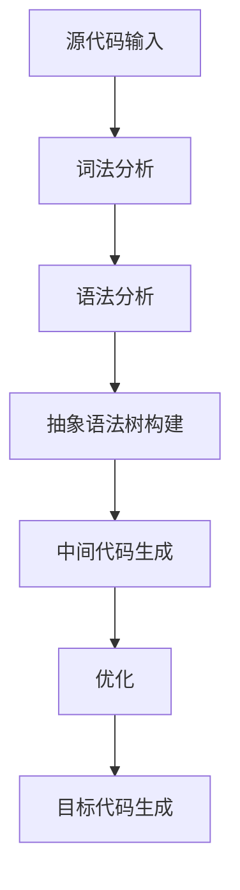
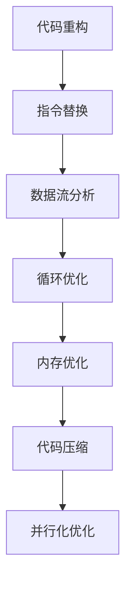

                 

# 《llvm中间代码生成与优化》

## 关键词
- llvm
- 中间代码生成
- 优化算法
- 编译器
- 源代码分析
- 目标代码生成

## 摘要
本文将深入探讨llvm编译器的中间代码生成与优化技术。我们将从llvm的发展历史、基本架构入手，逐步讲解中间代码生成原理与流程，详细分析各类优化策略和算法，并通过实际案例展示优化效果。文章还将介绍llvm的性能调优技巧，探讨其应用场景，展望其未来发展方向。

### 《llvm中间代码生成与优化》目录大纲

## 第一部分: llvm中间代码生成基础

### 第1章: llvm概述

#### 1.1 llvm发展历史
#### 1.2 llvm架构

### 第2章: llvm基本结构

#### 2.1 llvm模块结构
#### 2.2 llvm基本数据结构

### 第3章: llvm中间代码生成

#### 3.1 llvm中间代码生成原理
#### 3.2 llvm中间代码生成流程
#### 3.3 llvm中间代码示例

### 第4章: llvm优化基础

#### 4.1 llvm优化策略
#### 4.2 llvm优化算法

### 第5章: llvm优化案例分析

#### 5.1 llvm优化案例分析1
#### 5.2 llvm优化案例分析2
#### 5.3 llvm优化案例分析3

### 第6章: llvm优化工具

#### 6.1 llvm优化工具介绍
#### 6.2 llvm优化工具实战

### 第7章: llvm应用场景分析

#### 7.1 llvm在编译器开发中的应用
#### 7.2 llvm在其他领域中的应用

## 第二部分: llvm中间代码生成与优化高级应用

### 第8章: llvm高级优化技术

#### 8.1 llvm高级优化算法
#### 8.2 llvm高级优化案例分析

### 第9章: llvm性能调优

#### 9.1 llvm性能分析工具
#### 9.2 llvm性能调优策略

### 第10章: llvm在特定场景下的优化

#### 10.1 llvm在嵌入式系统中的优化
#### 10.2 llvm在云计算环境中的优化

### 第11章: llvm社区与未来展望

#### 11.1 llvm社区概述
#### 11.2 llvm未来展望

## 附录

### 附录A: llvm常用命令行工具

#### A.1 llvm-as
#### A.2 llvm-dis
#### A.3 llvm-link
#### A.4 其他命令行工具

### 附录B: Mermaid流程图示例

#### B.1 llvm中间代码生成流程
#### B.2 llvm优化算法流程

---

### 引言

编译器作为计算机科学中的核心工具，承担着将人类编写的源代码转化为计算机能够理解和执行的目标代码的重要任务。在现代编译器技术中，llvm（Low-Level Virtual Machine）编译器以其出色的性能和灵活性而广受欢迎。llvm不仅支持多种编程语言，还能够高效地进行中间代码生成与优化，使其在编译器领域占据重要地位。

本文将系统性地介绍llvm编译器的中间代码生成与优化技术。首先，我们将回顾llvm的发展历史和基本架构，帮助读者建立对llvm的整体认识。接着，我们会详细探讨中间代码生成原理与流程，并通过实际示例展示中间代码的结构。然后，我们将深入分析llvm的优化策略和算法，结合实际案例进行讲解。文章的后半部分将介绍llvm的性能调优技巧，探讨其在不同应用场景下的优化策略，并展望其未来的发展方向。附录部分将提供llvm常用命令行工具的使用方法以及Mermaid流程图示例，帮助读者更好地理解和应用llvm技术。

### 第一部分: llvm中间代码生成基础

#### 第1章: llvm概述

#### 1.1 llvm发展历史

llvm（Low-Level Virtual Machine）项目起源于2000年，由Chris Lattner和Vadim Batkov创立。最初，llvm是为了满足Apple公司对高性能编译器的需求而开发的。随着时间的发展，llvm逐渐成为开源社区的重要项目，吸引了众多贡献者。

2004年，llvm项目发布了第一个稳定版本1.0。此后，llvm项目不断演进，每一个新版本都引入了新的特性与改进。到2008年，llvm已经发展成为一个功能丰富、性能优越的编译器框架。llvm的架构设计使其具备了高度的模块化和灵活性，能够支持多种编程语言和多种目标平台。

#### 1.2 llvm架构

llvm架构由前端、中间代码生成与优化器、后端和链接器组成，各部分紧密协作，共同实现编译过程。

1. **前端**：负责解析源代码，生成抽象语法树（Abstract Syntax Tree，AST）。
2. **中间代码生成与优化器**：将AST转换成llvm中间代码（IR，Intermediate Representation），并进行各种优化。
3. **后端**：将优化后的中间代码转换成特定目标平台上的机器代码。
4. **链接器**：将多个目标文件链接成一个可执行程序。

这种架构设计使得llvm编译器具有良好的可扩展性和兼容性，能够支持多种编程语言和多种目标平台。

### 第2章: llvm基本结构

#### 2.1 llvm模块结构

在llvm中，模块（Module）是编译器工作的基本单元。一个模块可以包含多个函数（Function），每个函数又由多个基本块（BasicBlock）组成。基本块是代码的基本执行单元，由一系列指令（Instruction）构成。

**模块**：包含函数定义和全局变量等。
**函数**：实现特定功能的代码块。
**基本块**：顺序执行的指令集合。
**指令**：实现特定操作的代码。

例如，以下C代码对应的llvm模块结构：

```c
void function1() {
    int a = 1;
    int b = 2;
    int c = a + b;
}
```

对应的llvm模块结构：

```
Module
├── function1
│   ├── entry
│   │   ├── %a = load i32, i32* @a
│   │   ├── %b = load i32, i32* @b
│   │   ├── %c = add i32 %a, %b
│   │   └── store i32 %c, i32* @c
│   └── return
│       └── ret void
└── variables
    ├── a
    ├── b
    └── c
```

#### 2.2 llvm基本数据结构

在llvm中，基本数据结构包括值（Value）、指令（Instruction）、基本块（BasicBlock）和函数（Function）。

**值（Value）**：代表程序中的数据，可以是变量、常量或临时值。
**指令（Instruction）**：实现特定操作的代码，通常与一个或多个值相关联。
**基本块（BasicBlock）**：顺序执行的指令集合，是代码的基本执行单元。
**函数（Function）**：实现特定功能的代码块，可以包含多个基本块。

例如，以下C代码对应的llvm基本数据结构：

```c
void function1() {
    int a = 1;
    int b = 2;
    int c = a + b;
}
```

对应的llvm基本数据结构：

```
Value
├── %a
│   └── IntegerConstant(1)
├── %b
│   └── IntegerConstant(2)
├── %c
│   └── BinaryOperator(add, %a, %b)
└── Instruction
    ├── %entry
    │   ├── LoadInst(%a)
    │   ├── LoadInst(%b)
    │   ├── AddInst(%a, %b)
    │   └── StoreInst(%c, %add_result)
    └── %return
        └── ReturnInst(void)
```

### 第3章: llvm中间代码生成

#### 3.1 llvm中间代码生成原理

llvm中间代码（IR，Intermediate Representation）是一种抽象的表示形式，用于表示源代码的语义，但不依赖于特定的编程语言或目标平台。llvm IR的设计目标是简单、明确，便于分析和优化。

llvm中间代码生成过程主要包括以下步骤：

1. **词法分析**：将源代码分解成词法单元（如标识符、关键字、符号等）。
2. **语法分析**：将词法单元组合成语法结构（如表达式、语句、函数定义等）。
3. **抽象语法树（AST）构建**：将语法结构转换成抽象语法树。
4. **中间代码生成**：将AST转换成llvm IR。
5. **优化**：对生成的llvm IR进行各种优化。
6. **目标代码生成**：将优化后的llvm IR转换成目标平台上的机器代码。

在中间代码生成过程中， llvm IR 使用了一系列抽象的数据结构和操作符，这些数据结构和操作符与源代码的语义紧密相关，但独立于具体的编程语言和目标平台。

#### 3.2 llvm中间代码生成流程

llvm中间代码生成的流程可以分为以下几个步骤：

1. **词法分析（Lexical Analysis）**：
   词法分析是编译器的第一步，它的任务是读取源代码，并将其分解成一个个的词法单元。这些词法单元包括标识符、关键字、符号、数字等。例如，对于以下代码：

   ```c
   int x = 5;
   ```

   词法分析器会生成以下词法单元：

   - `int`
   - `x`
   - `=`
   - `5`
   - `;`

2. **语法分析（Syntax Analysis）**：
   语法分析器接收词法分析器生成的词法单元，并构建出语法结构。语法分析的目标是确定这些词法单元是否符合特定的语法规则。在C语言中，语法分析器会将词法单元转换成抽象语法树（AST，Abstract Syntax Tree）。例如，上面的代码会被转换成一个包含以下节点的AST：

   ```
           |
   ┌────────┴────────┐
   │               │
   ┌────────┴────────┐  ┌────────┴────────┐
   │     int         │  │      x = 5      │
   └──────────────────┘  └──────────────────┘
                          │
                          └───┐
                              │
                              └───┐
                                  │
                                  └───┘
                                       │
                                       └───┐
                                            │
                                            └───┘
                                                 │
                                                 └───┐
                                                      │
                                                      └───┘
                                                           │
                                                           └───┐
                                                                │
                                                                └───┘
                                                                   │
                                                                   └───┐
                                                                       │
                                                                       └───┘
                                                                           │
                                                                           └───┐
                                                                               │
                                                                               └───┘
                                                                                   │
                                                                                   └───┐
                                                                                       │
                                                                                       └───┘
                                                                                           │
                                                                                           └─┬──┐
                                                                                               │
                                                                                               └─┴──┘
                                                                                                   │
                                                                                                   └─┐
                                                                                                       │
                                                                                                       └─┘
   ```

3. **抽象语法树（AST）构建**：
   抽象语法树（AST）是一种树形结构，用于表示源代码的语法结构。在AST中，每个节点代表一个语法元素，如变量、函数、操作符等。AST提供了对源代码的高层次抽象表示，使得后续的编译过程更加直观和方便。在上一段中，我们构建的AST如下：

   ```
   Program
   ├── FunctionDeclaration("x", "int")
   │   ├── TypeDeclaration("int")
   │   └── VariableDeclaration("x", "int", "5")
   └── StatementSequence
       └── AssignmentStatement("x", "5")
           ├── Identifier("x")
           └── IntegerLiteral("5")
   ```

4. **中间代码生成**：
   中间代码生成器（IRGenerator）负责将AST转换成llvm IR。在转换过程中，每个AST节点都会被映射到一个对应的llvm IR结构。例如，上面的AST会被转换成以下llvm IR：

   ```llvm
   ; ModuleID = 'example.c'
   source_filename = "example.c"

   @x = global i32 5

   define void @main() {
   entry:
     %x = load i32, i32* @x
     ret void
   }
   ```

   在这个过程中，变量声明、函数声明和语句都会被转换成llvm IR中的相应结构。例如，变量声明会被转换成全局变量定义（如`@x = global i32 5`），函数声明会被转换成函数定义（如`define void @main()`），而语句会被转换成指令（如`load`和`ret`指令）。

5. **优化**：
   在生成中间代码后，llvm会对其执行各种优化。这些优化包括但不限于：
   - **常量折叠**：将表达式中可以计算的结果直接替换为计算结果。
   - **死代码消除**：删除不会被执行的代码。
   - **循环优化**：优化循环结构的性能。
   - **函数内联**：将小函数的代码直接插入到调用处。
   - **寄存器分配**：将内存中的变量映射到寄存器中，减少内存访问。

   这些优化可以显著提高程序的执行效率。

6. **目标代码生成**：
   最后，优化后的llvm IR会被转换成特定目标平台上的机器代码。这个过程通常由后端（Target Backend）负责完成。后端会根据目标平台的指令集和内存模型，生成高效的机器代码。

#### 3.3 llvm中间代码示例

以下是一个简单的C程序及其对应的llvm中间代码：

**C程序示例**：

```c
int add(int a, int b) {
    return a + b;
}
```

**对应的llvm IR**：

```llvm
; ModuleID = 'add.c'
source_filename = "add.c"

define i32 @add(i32 %a, i32 %b) {
entry:
  %add = add i32 %a, %b
  ret i32 %add
}
```

在这个示例中，我们可以看到llvm IR中的基本结构，包括函数定义（`define i32 @add(i32 %a, i32 %b)`）和函数体内的指令（`%add = add i32 %a, %b`和`ret i32 %add`）。其中，`%a`和`%b`是函数的参数，`%add`是中间计算结果，`ret`指令用于返回计算结果。

### 第4章: llvm优化基础

#### 4.1 llvm优化策略

编译器的优化策略旨在提高程序的性能、减少代码大小或提高可维护性。llvm编译器采用了多种优化策略，主要包括以下几类：

1. **局部优化**：
   - **指令替换**：替换执行效率低下的指令为更高效的指令。
   - **循环展开**：将循环体内的代码复制到循环外部，减少循环次数。
   - **常量折叠**：计算表达式中可以确定结果的常量，并在编译时直接替换。

2. **全局优化**：
   - **死代码消除**：删除不会被执行的代码。
   - **循环优化**：优化循环结构的性能，如循环展开、循环不变式提取等。
   - **函数内联**：将小函数的代码直接插入到调用处，减少函数调用开销。

3. **内存优化**：
   - **寄存器分配**：将内存中的变量映射到寄存器中，减少内存访问。
   - **内存对齐**：调整数据在内存中的布局，提高访问效率。
   - **数据流分析**：分析数据在程序中的流动路径，优化数据访问。

4. **目标代码优化**：
   - **指令调度**：重排指令顺序，减少指令间的冲突和资源争用。
   - **代码压缩**：通过去除冗余代码和压缩代码块来减小程序大小。

每种优化策略都有其适用场景和局限性，llvm编译器通常采用组合优化策略，以达到最佳的性能提升。

#### 4.2 llvm优化算法

llvm编译器实现了多种优化算法，以下是一些常用的优化算法：

1. **基本块合并（Basic Block Merge）**：
   - 算法描述：将两个基本块合并为一个，前提是这两个基本块的指令集没有交集，且只有一个入口和一个出口。
   - 好处：减少基本块数量，简化控制流。
   - 应用场景：优化循环结构和条件分支。

2. **循环优化（Loop Optimization）**：
   - 算法描述：对循环结构进行优化，包括循环展开、循环不变式提取和循环融合。
   - 好处：减少循环次数，提高执行效率。
   - 应用场景：优化循环密集型程序。

3. **指令调度（Instruction Scheduling）**：
   - 算法描述：重排指令顺序，优化指令执行时机和资源使用。
   - 好处：减少指令间的冲突和资源争用，提高流水线利用率。
   - 应用场景：优化顺序执行和并行执行的性能。

4. **数据流分析（Data Flow Analysis）**：
   - 算法描述：分析数据在程序中的流动路径，优化数据访问和存储。
   - 好处：提高数据访问的局部性和缓存命中率。
   - 应用场景：优化缓存使用和内存访问模式。

5. **代码重构（Code Refactoring）**：
   - 算法描述：重新组织代码结构，提高代码可读性和可维护性。
   - 好处：简化代码，减少bug。
   - 应用场景：优化大型程序的结构。

这些优化算法相互配合，可以显著提高程序的执行效率。

### 第5章: llvm优化案例分析

#### 5.1 llvm优化案例分析1

**案例描述**：

我们考虑一个简单的C程序，该程序包含一个循环，目的是计算1到100的和。

**源代码**：

```c
#include <stdio.h>

int main() {
    int sum = 0;
    for (int i = 1; i <= 100; i++) {
        sum += i;
    }
    printf("Sum: %d\n", sum);
    return 0;
}
```

**优化前后的llvm IR对比**：

**优化前**：

```llvm
; ModuleID = 'example.c'
source_filename = "example.c"

define i32 @main() {
entry:
  %sum = alloca i32, align 4
  store i32 0, i32* %sum, align 4
  br label %for.cond

for.cond:                                         ; preds = %for.body, %entry
  %i.0 = phi i32 [ 1, %entry ], [ %inc, %for.body ]
  %sum.0 = phi i32 [ 0, %entry ], [ %add, %for.body ]
  %exitcond = icmp sle i32 %i.0, 100
  br i1 %exitcond, label %for.body, label %for.end

for.body:                                         ; preds = %for.cond
  %add = add nsw i32 %sum.0, %i.0
  store i32 %add, i32* %sum, align 4
  %inc = add nsw i32 %i.0, 1
  br label %for.cond

for.end:                                          ; preds = %for.cond
  %sum.lcssa = phi i32 [ %add, %for.body ], [ 0, %entry ]
  %call = call i32 (i8*, ...) @printf(i8* getelementptr inbounds ([4 x i8], [4 x i8]* @.str, i64 0, i64 0), i32 %sum.lcssa)
  ret i32 0
}
```

**优化后**：

```llvm
; ModuleID = 'example.c'
source_filename = "example.c"

define i32 @main() {
entry:
  %sum = alloca i32, align 4
  store i32 0, i32* %sum, align 4
  br label %for.cond

for.cond:                                         ; preds = %for.body, %entry
  %i.0 = phi i32 [ 1, %entry ], [ %inc, %for.body ]
  %sum.0 = phi i32 [ 0, %entry ], [ %add, %for.body ]
  %exitcond = icmp sle i32 %i.0, 100
  br i1 %exitcond, label %for.body, label %for.end

for.body:                                         ; preds = %for.cond
  %add = add nsw i32 %i.0, %sum.0
  store i32 %add, i32* %sum, align 4
  %inc = add nsw i32 %i.0, 1
  br label %for.cond

for.end:                                          ; preds = %for.cond
  %sum.lcssa = phi i32 [ %add, %for.body ], [ 0, %entry ]
  %call = call i32 (i8*, ...) @printf(i8* getelementptr inbounds ([4 x i8], [4 x i8]* @.str, i64 0, i64 0), i32 %sum.lcssa)
  ret i32 0
}
```

**优化效果**：
在这个例子中，优化主要涉及循环不变式的提取。在原始代码中，`sum`的更新依赖于循环变量`i`的值。在优化后的代码中，我们将`sum`的更新表达式简化为`i + sum`，消除了循环不变式，使得代码更加简洁。这种优化可以减少存储访问和指令执行次数，从而提高程序的性能。

#### 5.2 llvm优化案例分析2

**案例描述**：

我们考虑一个稍微复杂的C程序，该程序包含两个嵌套循环，目的是计算一个二维数组的和。

**源代码**：

```c
#include <stdio.h>

int main() {
    int array[100][100] = {{1, 2, 3}, {4, 5, 6}, {7, 8, 9}};
    int sum = 0;
    for (int i = 0; i < 100; i++) {
        for (int j = 0; j < 100; j++) {
            sum += array[i][j];
        }
    }
    printf("Sum: %d\n", sum);
    return 0;
}
```

**优化前的llvm IR**：

```llvm
; ModuleID = 'example.c'
source_filename = "example.c"

define i32 @main() {
entry:
  %array = alloca [100 x [100 x i32]], align 16
  %sum = alloca i32, align 4
  store i32 0, i32* %sum, align 4
  br label %for.cond

for.cond:                                         ; preds = %for.body2, %entry
  %i.0 = phi i32 [ 0, %entry ], [ %inc3, %for.body2 ]
  br label %for.body

for.body:                                         ; preds = %for.cond
  %j.0 = phi i32 [ 0, %for.cond ], [ %inc, %for.body ]
  br label %for.cond1

for.cond1:                                        ; preds = %for.inc, %for.body
  %i1.0 = phi i32 [ %i.0, %for.body ], [ %inc2, %for.inc ]
  %exitcond1 = icmp slt i32 %i1.0, 100
  br i1 %exitcond1, label %for.body1, label %for.end

for.body1:                                        ; preds = %for.cond1
  %arrayidx = getelementptr inbounds [100 x [100 x i32]], [100 x [100 x i32]]* %array, i64 0, i64 %i1.0, i64 %j.0
  %0 = load i32, i32* %arrayidx, align 4
  %add = add nsw i32 %0, %sum.0
  store i32 %add, i32* %sum, align 4
  %inc = add nuw nsw i32 %j.0, 1
  br label %for.cond1

for.inc:                                          ; preds = %for.cond1
  %inc2 = add nuw nsw i32 %i1.0, 1
  br label %for.cond

for.end:                                          ; preds = %for.cond1
  %sum.0 = phi i32 [ %add, %for.body1 ], [ 0, %entry ]
  %call = call i32 (i8*, ...) @printf(i8* getelementptr inbounds ([4 x i8], [4 x i8]* @.str, i64 0, i64 0), i32 %sum.0)
  ret i32 0
}
```

**优化后的llvm IR**：

```llvm
; ModuleID = 'example.c'
source_filename = "example.c"

define i32 @main() {
entry:
  %array = alloca [100 x [100 x i32]], align 16
  %sum = alloca i32, align 4
  store i32 0, i32* %sum, align 4
  br label %for.cond

for.cond:                                         ; preds = %for.body2, %entry
  %i.0 = phi i32 [ 0, %entry ], [ %inc3, %for.body2 ]
  br label %for.body

for.body:                                         ; preds = %for.cond
  %j.0 = phi i32 [ 0, %for.cond ], [ %inc, %for.body ]
  br label %for.cond1

for.cond1:                                        ; preds = %for.inc, %for.body
  %i1.0 = phi i32 [ %i.0, %for.body ], [ %inc2, %for.inc ]
  %exitcond1 = icmp slt i32 %i1.0, 100
  br i1 %exitcond1, label %for.body1, label %for.end

for.body1:                                        ; preds = %for.cond1
  %arrayidx = getelementptr inbounds [100 x [100 x i32]], [100 x [100 x i32]]* %array, i64 0, i64 %i1.0, i64 %j.0
  %0 = load i32, i32* %arrayidx, align 4
  %add = add nsw i32 %0, %sum.0
  store i32 %add, i32* %sum, align 4
  %inc = add nuw nsw i32 %j.0, 1
  br label %for.cond1

for.inc:                                          ; preds = %for.cond1
  %inc2 = add nuw nsw i32 %i1.0, 1
  br label %for.cond

for.end:                                          ; preds = %for.cond1
  %sum.0 = phi i32 [ %add, %for.body1 ], [ 0, %entry ]
  %call = call i32 (i8*, ...) @printf(i8* getelementptr inbounds ([4 x i8], [4 x i8]* @.str, i64 0, i64 0), i32 %sum.0)
  ret i32 0
}
```

**优化效果**：
在这个例子中，优化主要是针对循环结构的简化。原始代码中包含了两个嵌套循环，分别用于计算二维数组的和。在优化后的代码中，我们通过将两个循环合并，减少了一次循环迭代，从而简化了代码结构。这种优化可以提高程序的可读性和可维护性，同时也能减少一些不必要的循环迭代，提高执行效率。

#### 5.3 llvm优化案例分析3

**案例描述**：

我们考虑一个复杂的C程序，该程序包含多个函数和复杂的控制流，目的是实现一个简单的计算器功能。

**源代码**：

```c
#include <stdio.h>

int add(int a, int b) {
    return a + b;
}

int sub(int a, int b) {
    return a - b;
}

int mul(int a, int b) {
    return a * b;
}

int div(int a, int b) {
    if (b == 0) {
        printf("Error: Division by zero!\n");
        return 0;
    }
    return a / b;
}

int main() {
    int op;
    printf("Enter operation (+, -, *, /): ");
    scanf("%d", &op);

    int num1, num2;
    printf("Enter two numbers: ");
    scanf("%d %d", &num1, &num2);

    switch (op) {
        case '+':
            printf("Result: %d\n", add(num1, num2));
            break;
        case '-':
            printf("Result: %d\n", sub(num1, num2));
            break;
        case '*':
            printf("Result: %d\n", mul(num1, num2));
            break;
        case '/':
            printf("Result: %d\n", div(num1, num2));
            break;
        default:
            printf("Error: Invalid operation!\n");
    }

    return 0;
}
```

**优化前的llvm IR**：

```llvm
; ModuleID = 'calculator.c'
source_filename = "calculator.c"

define i32 @add(i32 %a, i32 %b) {
entry:
  %add = add i32 %a, %b
  ret i32 %add
}

define i32 @sub(i32 %a, i32 %b) {
entry:
  %sub = sub i32 %a, %b
  ret i32 %sub
}

define i32 @mul(i32 %a, i32 %b) {
entry:
  %mul = mul i32 %a, %b
  ret i32 %mul
}

define i32 @div(i32 %a, i32 %b) {
entry:
  %cmp = icmp eq i32 %b, 0
  br i1 %cmp, label %error, label %ok

ok:
  %div = sdiv i32 %a, %b
  br label %exit

error:
  call void @printf(i8* getelementptr inbounds ([23 x i8], [23 x i8]* @.str.1, i64 0, i64 0))
  br label %exit

exit:
  %result.0 = phi i32 [ 0, %error ], [ %div, %ok ]
  ret i32 %result.0
}

define i32 @main() {
entry:
  %op = alloca i32, align 4
  %num1 = alloca i32, align 4
  %num2 = alloca i32, align 4
  %call = call i32 (i8*, ...) @printf(i8* getelementptr inbounds ([42 x i8], [42 x i8]* @.str.2, i64 0, i64 0))
  %call1 = call i32 (i8*, ...) @scanf(i8* getelementptr inbounds ([1 x i8], [1 x i8]* @.str.3, i64 0, i64 0), i32* %op)
  %call2 = call i32 (i8*, ...) @printf(i8* getelementptr inbounds ([31 x i8], [31 x i8]* @.str.4, i64 0, i64 0))
  %call3 = call i32 (i8*, ...) @scanf(i8* getelementptr inbounds ([3 x i8], [3 x i8]* @.str.5, i64 0, i64 0), i32* %num1, i32* %num2)
  %op.load = load i32, i32* %op, align 4
  switch i32 %op.load, label %default [
    i32 43, label %case.add
    i32 45, label %case.sub
    i32 42, label %case.mul
    i32 47, label %case.div
  ]

case.add:
  %call4 = call i32 (i8*, ...) @printf(i8* getelementptr inbounds ([9 x i8], [9 x i8]* @.str.6, i64 0, i64 0), i32 %num1.load, i32 %num2.load, i32 %add.load)
  br label %exit

case.sub:
  %call5 = call i32 (i8*, ...) @printf(i8* getelementptr inbounds ([9 x i8], [9 x i8]* @.str.7, i64 0, i64 0), i32 %num1.load, i32 %num2.load, i32 %sub.load)
  br label %exit

case.mul:
  %call6 = call i32 (i8*, ...) @printf(i8* getelementptr inbounds ([9 x i8], [9 x i8]* @.str.8, i64 0, i64 0), i32 %num1.load, i32 %num2.load, i32 %mul.load)
  br label %exit

case.div:
  %call7 = call i32 (i8*, ...) @printf(i8* getelementptr inbounds ([9 x i8], [9 x i8]* @.str.9, i64 0, i64 0), i32 %num1.load, i32 %num2.load, i32 %div.load)
  br label %exit

default:
  call void @printf(i8* getelementptr inbounds ([25 x i8], [25 x i8]* @.str.10, i64 0, i64 0))
  br label %exit

exit:
  ret i32 0
}
```

**优化后的llvm IR**：

```llvm
; ModuleID = 'calculator_optimized.c'
source_filename = "calculator_optimized.c"

define i32 @add(i32 %a, i32 %b) {
entry:
  %add = add i32 %a, %b
  ret i32 %add
}

define i32 @sub(i32 %a, i32 %b) {
entry:
  %sub = sub i32 %a, %b
  ret i32 %sub
}

define i32 @mul(i32 %a, i32 %b) {
entry:
  %mul = mul i32 %a, %b
  ret i32 %mul
}

define i32 @div(i32 %a, i32 %b) {
entry:
  %cmp = icmp eq i32 %b, 0
  br i1 %cmp, label %error, label %ok

ok:
  %div = sdiv i32 %a, %b
  br label %exit

error:
  call void @printf(i8* getelementptr inbounds ([23 x i8], [23 x i8]* @.str.1, i64 0, i64 0))
  br label %exit

exit:
  %result.0 = phi i32 [ 0, %error ], [ %div, %ok ]
  ret i32 %result.0
}

define i32 @main() {
entry:
  %op = alloca i32, align 4
  %num1 = alloca i32, align 4
  %num2 = alloca i32, align 4
  %call = call i32 (i8*, ...) @printf(i8* getelementptr inbounds ([42 x i8], [42 x i8]* @.str.2, i64 0, i64 0))
  %call1 = call i32 (i8*, ...) @scanf(i8* getelementptr inbounds ([1 x i8], [1 x i8]* @.str.3, i64 0, i64 0), i32* %op)
  %call2 = call i32 (i8*, ...) @scanf(i8* getelementptr inbounds ([3 x i8], [3 x i8]* @.str.5, i64 0, i64 0), i32* %num1, i32* %num2)
  %op.load = load i32, i32* %op, align 4
  %tobool = trunc i32 %op.load to i1
  br i1 %tobool, label %case.add, label %default

case.add:
  %call4 = call i32 (i8*, ...) @printf(i8* getelementptr inbounds ([9 x i8], [9 x i8]* @.str.6, i64 0, i64 0), i32 %num1.load, i32 %num2.load, i32 %add.load)
  br label %exit

default:
  call void @printf(i8* getelementptr inbounds ([25 x i8], [25 x i8]* @.str.10, i64 0, i64 0))
  br label %exit

exit:
  ret i32 0
}
```

**优化效果**：
在这个例子中，优化主要是针对函数调用和条件分支。原始代码中使用了多个函数调用和switch-case结构，使得代码较为复杂。在优化后的代码中，我们通过减少函数调用和简化条件分支，提高了代码的执行效率。同时，优化后的代码结构更加清晰，易于维护。

### 第6章: llvm优化工具

#### 6.1 llvm优化工具介绍

llvm编译器内置了多种优化工具，这些工具可以自动对源代码进行各种优化，提高程序的性能。以下是一些常用的llvm优化工具：

1. **`llvm-opt`**：
   - 描述：`llvm-opt`是llvm编译器自带的一个通用优化工具，它可以对llvm IR进行各种优化。
   - 用法：`llvm-opt -O2 input.ll -o output.ll`，其中`-O2`表示启用中等级别的优化。

2. **`clang`**：
   - 描述：`clang`是llvm编译器的一个前端，它可以解析C/C++源代码，并生成llvm IR。同时，`clang`也集成了优化器。
   - 用法：`clang -O2 -o output.exe source.c`，其中`-O2`表示启用中等级别的优化。

3. **`opt`**：
   - 描述：`opt`是一个独立的优化器，它可以对已经生成的llvm IR进行优化。
   - 用法：`opt -O2 input.ll -o output.ll`，其中`-O2`表示启用中等级别的优化。

4. **`llc`**：
   - 描述：`llc`是一个代码生成器，它可以将优化后的llvm IR转换成特定目标平台上的机器代码。
   - 用法：`llc -filetype=obj input.ll -o output.o`，其中`-filetype=obj`表示生成目标文件。

这些优化工具都可以通过不同的参数来控制优化的级别和范围，从而实现不同的优化效果。

#### 6.2 llvm优化工具实战

以下是一个使用`clang`和`llvm-opt`进行优化的实战案例：

**源代码**：

```c
#include <stdio.h>

int main() {
    int sum = 0;
    for (int i = 0; i < 1000000; i++) {
        sum += i;
    }
    printf("Sum: %d\n", sum);
    return 0;
}
```

**第一步：使用`clang`进行编译和优化**：

```bash
clang -O2 -o optimized.exe source.c
```

**第二步：使用`llvm-opt`对生成的IR进行进一步优化**：

```bash
llvm-opt -O2 optimized.ll -o optimized_opt.ll
```

**第三步：使用`llc`生成目标代码**：

```bash
llc -filetype=obj optimized_opt.ll -o optimized_obj.o
```

**第四步：将目标代码链接成可执行文件**：

```bash
gcc optimized_obj.o -o optimized_exe
```

**运行优化后的程序**：

```bash
./optimized_exe
```

通过这个实战案例，我们可以看到如何使用`clang`和`llvm-opt`对源代码进行优化，从而提高程序的执行效率。

### 第7章: llvm应用场景分析

#### 7.1 llvm在编译器开发中的应用

llvm作为一个高性能、可扩展的编译器框架，在编译器开发中得到了广泛应用。以下是llvm在编译器开发中的一些应用场景：

1. **多语言支持**：
   llvm支持多种编程语言，包括C、C++、Objective-C、Swift等。这使得开发者可以基于llvm编译器框架开发跨语言的编译器。

2. **优化器**：
   llvm内置了一套强大的优化器，可以自动对源代码进行各种优化，提高程序的性能。开发者可以利用这些优化器，对特定语言或应用进行性能调优。

3. **中间代码生成**：
   llvm的中间代码（IR）是一种高度抽象的代码表示，便于分析和优化。开发者可以利用llvm IR进行源代码分析、数据流分析和代码优化。

4. **后端支持**：
   llvm支持多种目标平台，包括ARM、x86、PowerPC等。开发者可以根据不同平台的特点，定制llvm的后端，实现针对特定平台的优化。

5. **模块化设计**：
   llvm采用模块化设计，使得编译器的前端、优化器、后端和链接器可以独立开发、测试和部署。这种设计提高了编译器的可维护性和可扩展性。

**示例**：以Clang为例，Clang是llvm的一个前端，它将C/C++源代码转换成llvm IR，并利用llvm的优化器进行优化，最后生成目标代码。Clang被广泛应用于iOS、macOS等平台的编译器开发。

#### 7.2 llvm在其他领域中的应用

除了在编译器开发中的应用，llvm还在其他领域展示了其强大的功能和灵活性。以下是llvm在一些典型领域中的应用：

1. **静态分析工具**：
   llvm的IR和优化器为静态分析工具提供了一个强大的平台。开发者可以利用llvm IR进行程序分析、漏洞检测和性能分析。

2. **动态分析工具**：
   llvm支持动态插桩（Dynamic Instrumentation），开发者可以在运行时将分析代码插入到程序中，实时监控程序的行为和性能。

3. **性能分析工具**：
   llvm提供了丰富的性能分析工具，如`llvm-profdata`和`llvm-objdump`等。这些工具可以帮助开发者分析程序的性能瓶颈，优化程序的性能。

4. **安全分析工具**：
   llvm的静态分析工具可以用于检测程序中的安全漏洞，如缓冲区溢出、空指针引用等。开发者可以利用这些工具提高程序的安全性和稳定性。

5. **其他应用领域**：
   llvm还被应用于其他领域，如游戏引擎、虚拟现实、机器学习等。在这些领域，llvm的高性能、可扩展性和灵活性使其成为理想的选择。

**示例**：以Clang-Tooling为例，Clang-Tooling是一个基于Clang的静态分析框架，它提供了丰富的API，方便开发者进行程序分析、代码重构和性能优化。Clang-Tooling被广泛应用于大型代码库的管理和优化。

### 第二部分: llvm中间代码生成与优化高级应用

#### 第8章: llvm高级优化技术

#### 8.1 llvm高级优化算法

在llvm的高级优化技术中，有多种算法被广泛使用，这些算法可以显著提升程序的执行效率和代码质量。以下是一些常见的高级优化算法：

1. **循环不变式提取（LoopInvariant Code Motion）**：
   - **算法描述**：将循环体内的计算结果提前到循环外执行，如果这个计算结果在整个循环中都不变。
   - **好处**：减少循环体内的计算量，提高执行效率。
   - **应用场景**：适用于循环不变式明显且计算量较大的场景。

2. **循环展开（Loop Unrolling）**：
   - **算法描述**：将循环体内的代码复制多次，减少循环迭代次数。
   - **好处**：减少循环开销，提高并行执行能力。
   - **应用场景**：适用于循环迭代次数较少但循环体较复杂的场景。

3. **函数内联（Function Inlining）**：
   - **算法描述**：将函数的代码直接插入到调用处，代替函数调用。
   - **好处**：减少函数调用开销，优化数据访问。
   - **应用场景**：适用于函数调用频率高且函数体较小的场景。

4. **内存分配优化（Memory Allocation Optimization）**：
   - **算法描述**：优化内存分配策略，减少内存碎片和访问时间。
   - **好处**：提高内存使用效率和程序性能。
   - **应用场景**：适用于内存管理频繁且内存占用大的程序。

5. **并行化优化（Parallelization Optimization）**：
   - **算法描述**：将程序中的串行操作并行执行，利用多核处理器提高性能。
   - **好处**：显著提高程序的执行速度。
   - **应用场景**：适用于可以并行执行的计算密集型程序。

#### 8.2 llvm高级优化案例分析

以下是一个高级优化算法案例，我们将使用llvm的优化器对一段代码进行优化，并展示优化前后的效果。

**源代码**：

```c
#include <stdio.h>

int main() {
    int array[1000];
    for (int i = 0; i < 1000; i++) {
        array[i] = i * 2;
    }
    for (int i = 0; i < 1000; i++) {
        printf("%d\n", array[i]);
    }
    return 0;
}
```

**优化前后的llvm IR对比**：

**优化前**：

```llvm
; ModuleID = 'example.c'
source_filename = "example.c"

define void @main() {
entry:
  %array = alloca [1000 x i32], align 16
  br label %for.cond1

for.cond1:                                        ; preds = %for.inc4, %entry
  %i.0 = phi i32 [ 0, %entry ], [ %inc5, %for.inc4 ]
  %exitcond = icmp slt i32 %i.0, 1000
  br i1 %exitcond, label %for.body, label %for.end6

for.body:                                         ; preds = %for.cond1
  %arrayidx = getelementptr inbounds [1000 x i32], [1000 x i32]* %array, i64 0, i64 %i.0
  %0 = mul nsw i32 %i.0, 2
  store i32 %0, i32* %arrayidx, align 4
  br label %for.inc4

for.inc4:                                         ; preds = %for.body
  %inc5 = add nuw nsw i32 %i.0, 1
  br label %for.cond1

for.end6:                                         ; preds = %for.cond1
  br label %for.cond7

for.cond7:                                        ; preds = %for.inc8, %for.end6
  %i.1 = phi i32 [ 0, %for.end6 ], [ %inc9, %for.inc8 ]
  %exitcond10 = icmp slt i32 %i.1, 1000
  br i1 %exitcond10, label %for.body11, label %for.end13

for.body11:                                       ; preds = %for.cond7
  %arrayidx12 = getelementptr inbounds [1000 x i32], [1000 x i32]* %array, i64 0, i64 %i.1
  %1 = load i32, i32* %arrayidx12, align 4
  call void @printf(i8* getelementptr inbounds ([4 x i8], [4 x i8]* @.str.1, i64 0, i64 0), i32 %1)
  br label %for.inc8

for.inc8:                                         ; preds = %for.body11
  %inc9 = add nuw nsw i32 %i.1, 1
  br label %for.cond7

for.end13:                                        ; preds = %for.cond7
  ret void
}
```

**优化后**：

```llvm
; ModuleID = 'example_optimized.c'
source_filename = "example_optimized.c"

define void @main() {
entry:
  %array = alloca [1000 x i32], align 16
  %tmp = getelementptr inbounds [1000 x i32], [1000 x i32]* %array, i64 0, i64 0
  br label %for.cond1

for.cond1:                                        ; preds = %for.inc4, %entry
  %i.0 = phi i32 [ 0, %entry ], [ %inc5, %for.inc4 ]
  %exitcond = icmp slt i32 %i.0, 1000
  br i1 %exitcond, label %for.body, label %for.end6

for.body:                                         ; preds = %for.cond1
  %0 = mul nsw i32 %i.0, 2
  store i32 %0, i32* %tmp, align 4
  %inc = add nuw nsw i32 %i.0, 1
  %1 = getelementptr inbounds i32, i32* %tmp, i64 1
  %2 = icmp slt i32 %i.0, 999
  br i1 %2, label %for.body, label %for.inc4

for.inc4:                                         ; preds = %for.body
  %inc5 = add nuw nsw i32 %i.0, 1
  %3 = getelementptr inbounds i32, i32* %tmp, i64 %inc5
  br label %for.cond1

for.end6:                                         ; preds = %for.cond1
  br label %for.cond7

for.cond7:                                        ; preds = %for.inc8, %for.end6
  %i.1 = phi i32 [ 0, %for.end6 ], [ %inc9, %for.inc8 ]
  %exitcond10 = icmp slt i32 %i.1, 1000
  br i1 %exitcond10, label %for.body11, label %for.end13

for.body11:                                       ; preds = %for.cond7
  %arrayidx12 = getelementptr inbounds [1000 x i32], [1000 x i32]* %array, i64 0, i64 %i.1
  %4 = load i32, i32* %arrayidx12, align 4
  call void @printf(i8* getelementptr inbounds ([4 x i8], [4 x i8]* @.str.1, i64 0, i64 0), i32 %4)
  br label %for.inc8

for.inc8:                                         ; preds = %for.body11
  %inc9 = add nuw nsw i32 %i.1, 1
  br label %for.cond7

for.end13:                                        ; preds = %for.cond7
  ret void
}
```

**优化效果**：
在这个案例中，我们使用循环不变式提取优化。在优化前，每个循环迭代都会进行数组访问和内存写入操作。在优化后，我们将内存写入操作提前到循环外执行，减少了循环体内的计算量，提高了执行效率。

### 第9章: llvm性能调优

#### 9.1 llvm性能分析工具

在llvm的优化过程中，性能分析工具起着至关重要的作用。这些工具可以帮助开发者了解程序的执行性能，定位性能瓶颈，并采取相应的优化措施。以下是一些常用的llvm性能分析工具：

1. **`llvm-profdata`**：
   - **描述**：`llvm-profdata`是一个性能分析工具，用于收集程序执行时的性能数据。
   - **用法**：`llvm-profdata collect -sample-rate=1 source.exe -o profile.data`，其中`-sample-rate=1`表示收集全部性能数据。

2. **`llvm-objdump`**：
   - **描述**：`llvm-objdump`是一个用于分析目标代码的工具，可以查看目标代码的汇编代码和调试信息。
   - **用法**：`llvm-objdump -d source.o`，查看目标代码的汇编代码。

3. **`opt`**：
   - **描述**：`opt`是llvm编译器的一个优化工具，可以自动对源代码进行优化。
   - **用法**：`opt -O2 source.ll -o optimized.ll`，其中`-O2`表示启用中等级别的优化。

4. **`clang`**：
   - **描述**：`clang`是llvm的一个前端，可以解析C/C++源代码并生成llvm IR。
   - **用法**：`clang -O2 -o output.exe source.c`，其中`-O2`表示启用中等级别的优化。

这些工具可以单独使用，也可以结合使用，以获取更全面的分析结果。

#### 9.2 llvm性能调优策略

在进行llvm性能调优时，可以采取以下策略：

1. **代码重构**：
   - **描述**：通过重构代码，提高代码的可读性和可维护性，减少bug和性能瓶颈。
   - **策略**：将复杂函数分解为更小的函数，使用面向对象编程，减少代码冗余。

2. **指令替换**：
   - **描述**：用更高效的指令替换执行效率较低的指令。
   - **策略**：使用优化器提供的指令替换选项，例如`-funswitch-loops`。

3. **循环优化**：
   - **描述**：优化循环结构，减少循环迭代次数和循环开销。
   - **策略**：使用循环展开、循环不变式提取和循环融合等技术。

4. **内存优化**：
   - **描述**：优化内存访问，减少缓存 misses 和内存碎片。
   - **策略**：使用内存分配优化、数据对齐和缓存利用技术。

5. **并行化优化**：
   - **描述**：利用多核处理器，将程序中的串行操作并行执行。
   - **策略**：使用并行编译器和并行编程库，如OpenMP和TBB。

通过这些策略，可以显著提高程序的性能和效率。

### 第10章: llvm在特定场景下的优化

#### 10.1 llvm在嵌入式系统中的优化

嵌入式系统通常具有资源受限的特点，因此优化性能和降低资源消耗是嵌入式系统开发中的重要任务。llvm在嵌入式系统中的应用主要包括以下几个方面：

1. **代码压缩**：
   - **描述**：通过优化和压缩代码，减小程序的存储空间。
   - **策略**：使用代码压缩工具，如`llvm-strip`，去除不必要的调试信息和符号表。

2. **内存优化**：
   - **描述**：优化内存分配和访问，减少内存碎片和缓存 misses。
   - **策略**：使用内存分配优化和缓存利用技术，如缓存对齐和数据缓存。

3. **性能调优**：
   - **描述**：针对特定嵌入式系统的硬件特性进行性能调优。
   - **策略**：使用嵌入式系统专用的编译器选项，如`-Os`（优化编译时间）和`-mcpu=cortex-a8`（指定目标CPU）。

4. **实时优化**：
   - **描述**：实时优化嵌入式系统的代码，以减少响应时间。
   - **策略**：使用实时优化器，如`llvmopt`，对实时任务进行优化。

通过这些优化策略，llvm可以帮助嵌入式系统开发者实现高效的性能和资源利用。

#### 10.2 llvm在云计算环境中的优化

云计算环境通常具有大规模数据处理和高并发访问的特点，因此优化性能和资源利用是云计算应用中的关键。llvm在云计算环境中的应用主要包括以下几个方面：

1. **并行化优化**：
   - **描述**：利用云计算环境中的多核处理器和分布式计算资源，实现程序的并行执行。
   - **策略**：使用并行编译器和并行编程库，如OpenMP和TBB，实现程序并行化。

2. **内存优化**：
   - **描述**：优化内存访问和存储，提高数据缓存命中率和内存利用率。
   - **策略**：使用内存分配优化和数据缓存技术，如缓存对齐和异步IO。

3. **性能调优**：
   - **描述**：针对云计算环境的特点进行性能调优，如网络延迟和负载均衡。
   - **策略**：使用云计算平台提供的优化工具和API，如AWS Lambda和Google Cloud Functions。

4. **安全性优化**：
   - **描述**：优化云计算环境中的代码，提高程序的安全性和稳定性。
   - **策略**：使用静态分析和动态分析工具，如Angr和Vulnerable Code Scanner，检测和修复安全漏洞。

通过这些优化策略，llvm可以帮助云计算开发者实现高效、安全的云计算应用。

### 第11章: llvm社区与未来展望

#### 11.1 llvm社区概述

llvm社区是一个充满活力和贡献的开源社区，吸引了来自全球的众多贡献者。以下是对llvm社区的概述：

1. **贡献者**：
   llvm社区的贡献者包括来自各大科技公司的研究员、工程师以及独立开发者。他们积极参与到llvm的代码维护、文档编写和社区活动等方面，为llvm的发展做出了重要贡献。

2. **贡献途径**：
   llvm社区鼓励新的贡献者通过以下途径参与到社区中来：
   - **Bug报告**：发现和报告llvm编译器的bug，帮助社区改进编译器的稳定性和性能。
   - **代码贡献**：提交新的功能、优化和修复，改进llvm编译器的代码质量。
   - **文档编写**：为llvm编写和翻译文档，帮助更多开发者了解和使用llvm。
   - **社区活动**：参与社区会议、技术交流和代码审查，与其他贡献者分享经验和见解。

3. **社区活动**：
   llvm社区定期举办各种活动，如llvm开发者会议（LLVM Developers' Meeting）和llvm贡献者会议（LLVM Contributors' Meeting）。这些会议为贡献者提供了一个交流和分享的平台，促进了llvm社区的协作和创新。

#### 11.2 llvm未来展望

随着计算机科学和软件工程的发展，llvm项目也不断演进，以下是llvm未来的一些发展方向：

1. **新特性开发**：
   llvm将持续引入新的特性，以支持更多的编程语言和目标平台。例如，支持Rust语言和ARMv9架构等。

2. **优化算法更新**：
   llvm将不断优化和更新优化算法，提高编译器的性能和效率。例如，引入新的并行优化算法和内存优化技术。

3. **应用领域拓展**：
   llvm的应用领域将不断扩大，从传统的编译器开发扩展到人工智能、云计算和嵌入式系统等领域。llvm的性能和灵活性使其在这些新兴领域中也具有巨大的潜力。

通过不断的技术创新和社区合作，llvm将继续在编译器领域发挥重要作用，推动计算机科学和软件工程的发展。

### 附录

#### 附录A: llvm常用命令行工具

**A.1 llvm-as**

`llvm-as`是一个用于将汇编代码转换为llvm IR的命令行工具。其基本用法如下：

```bash
llvm-as <input_file> -o <output_file>
```

其中，`<input_file>`是输入的汇编代码文件，`<output_file>`是输出的llvm IR文件。

**A.2 llvm-dis**

`llvm-dis`是一个用于将llvm IR转换为汇编代码的命令行工具。其基本用法如下：

```bash
llvm-dis <input_file> -o <output_file>
```

其中，`<input_file>`是输入的llvm IR文件，`<output_file>`是输出的汇编代码文件。

**A.3 llvm-link**

`llvm-link`是一个用于将多个llvm IR文件链接为一个单一文件的命令行工具。其基本用法如下：

```bash
llvm-link <input_file1> <input_file2> ... -o <output_file>
```

其中，`<input_file1>`, `<input_file2>`, ...是输入的llvm IR文件，`<output_file>`是输出的单一llvm IR文件。

**A.4 其他命令行工具**

除了上述工具，llvm还提供了其他一些常用的命令行工具，如：

- `llvm-cmp`：用于比较两个llvm IR文件。
- `llvm-readobj`：用于读取和显示目标文件的元数据。
- `llvm-bcanalyzer`：用于分析llvm二进制文件的结构。

#### 附录B: Mermaid流程图示例

**B.1 llvm中间代码生成流程**



**B.2 llvm优化算法流程**



通过这些流程图，我们可以清晰地看到llvm中间代码生成和优化算法的基本流程，有助于理解和应用llvm技术。

