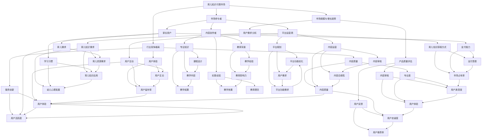

                 

## 育儿知识付费市场前景广阔

### 关键词
- 育儿知识付费
- 市场前景
- 知识经济
- 家庭教育
- 互联网+
- 用户需求
- 产品创新

### 摘要
随着社会的进步和家庭结构的变化，育儿知识的获取和交流方式也在发生深刻变革。育儿知识付费市场应运而生，成为知识经济时代的重要一环。本文将深入分析育儿知识付费市场的现状、机遇与挑战，探讨其广阔的前景，并为行业从业者提供可行的策略和建议。

## 第一部分：育儿知识基础

### 第1章：育儿知识概述

#### 1.1 育儿知识的基本概念

育儿知识是指与儿童成长、教育、健康、心理等方面相关的理论和实践知识。它涵盖了从孕期护理到幼儿教育的整个生命周期。育儿知识付费，则是家长通过购买服务或产品，获取专业、权威的育儿指导和支持。

#### 1.2 育儿知识的重要性

育儿知识不仅影响孩子的成长和发展，还直接关系到家庭的和谐与幸福。正确的育儿知识可以帮助家长更好地理解孩子，建立良好的亲子关系，从而提高家庭生活质量。

#### 1.3 育儿知识获取的途径

传统的育儿知识获取途径主要包括书籍、讲座、咨询医生等。然而，随着互联网和移动互联网的发展，线上育儿知识的传播速度和广度得到了极大提升。如今，家长可以通过各种育儿平台、APP、社交媒体等获取最新的育儿知识。

### 第2章：亲子关系与育儿

#### 2.1 亲子关系的建立

亲子关系是育儿过程中至关重要的一环。建立良好的亲子关系，需要家长用心去沟通、关爱、尊重和理解孩子。

#### 2.2 育儿中的心理需求

孩子在不同成长阶段有不同的心理需求。家长需要关注孩子的心理需求，给予适当的支持和引导，帮助他们健康成长。

#### 2.3 建立良好的亲子沟通

有效的亲子沟通是建立良好亲子关系的关键。家长需要学会倾听、表达和反馈，与孩子建立信任和互动。

### 第3章：婴儿护理

#### 3.1 婴儿喂养

婴儿喂养是育儿过程中最为关键的环节之一。正确的喂养方法不仅关系到婴儿的营养摄入，还影响到他们的生长发育。

#### 3.2 婴儿睡眠

婴儿睡眠质量直接影响他们的身心健康。家长需要了解婴儿的睡眠规律，帮助他们建立良好的睡眠习惯。

#### 3.3 婴儿健康护理

婴儿健康护理包括日常护理和疾病预防。家长需要掌握基本的健康护理知识，保障婴儿的健康成长。

### 第4章：幼儿教育

#### 4.1 幼儿心理发展

幼儿心理发展是育儿知识中的重要内容。了解幼儿心理发展特点，有助于家长更好地引导孩子成长。

#### 4.2 幼儿教育方法

幼儿教育方法多种多样，家长需要根据孩子的个性和发展需求，选择适合的教育方法。

#### 4.3 幼儿智力开发

智力开发是幼儿教育的重要内容之一。家长可以通过各种游戏和活动，促进孩子的智力发展。

## 第二部分：育儿知识付费市场分析

### 第5章：育儿知识付费市场概述

#### 5.1 市场规模与增长趋势

随着育儿知识的普及和付费意识的提升，育儿知识付费市场的规模逐年扩大。据统计，我国育儿知识付费市场年复合增长率达到30%以上。

#### 5.2 市场参与者

育儿知识付费市场涉及多个参与者，包括内容创作者、平台运营商、家长用户等。各参与者通过不同的角色和方式，共同推动市场发展。

#### 5.3 行业竞争格局

当前，育儿知识付费市场竞争激烈，主要平台包括宝宝树、母婴之家、丁香妈妈等。平台之间的竞争主要体现在内容质量、用户体验和服务创新等方面。

### 第6章：育儿知识付费产品分析

#### 6.1 产品类型与特点

育儿知识付费产品种类繁多，包括课程、电子书、直播、问答等。不同产品具有不同的特点和适用场景。

#### 6.2 用户需求分析

用户需求是育儿知识付费市场发展的核心驱动力。家长用户对育儿知识的深度、广度和实用性有较高的要求。

#### 6.3 产品质量评估

产品质量是育儿知识付费产品的核心竞争力。平台需要建立完善的质量评估体系，确保用户获取优质的知识和服务。

### 第7章：育儿知识付费市场前景

#### 7.1 市场机会分析

随着人口结构的变化和家庭对育儿重视程度的提高，育儿知识付费市场蕴藏着巨大的发展潜力。

#### 7.2 市场挑战与应对

育儿知识付费市场面临政策监管、内容质量、用户隐私等挑战。平台需要积极应对，不断提升自身竞争力。

#### 7.3 未来发展趋势

未来，育儿知识付费市场将朝着个性化、智能化、社区化等方向发展，为家长提供更高质量、更便捷的育儿服务。

## 第三部分：育儿知识付费项目实战

### 第8章：构建育儿知识付费平台

#### 8.1 平台规划与设计

构建育儿知识付费平台，首先需要进行平台规划与设计，明确平台定位、功能模块和用户需求。

#### 8.2 内容建设与运营

内容建设是育儿知识付费平台的核心。平台需要建立完善的内容体系，并通过运营策略，提升用户活跃度和粘性。

#### 8.3 用户互动与社群管理

用户互动和社群管理是提升用户满意度和忠诚度的关键。平台可以通过线上线下活动、社群互动等方式，增强用户归属感。

### 第9章：育儿知识付费产品开发

#### 9.1 产品规划与设计

育儿知识付费产品开发需要明确产品目标、功能设计和用户界面等，确保产品满足用户需求。

#### 9.2 功能模块开发

功能模块开发包括课程发布、用户管理、支付结算、互动问答等。各功能模块需要相互协作，实现产品整体功能。

#### 9.3 测试与优化

在产品开发过程中，测试与优化至关重要。通过用户反馈和数据分析，不断优化产品功能，提升用户体验。

### 第10章：育儿知识付费项目运营

#### 10.1 营销策略

营销策略是育儿知识付费项目成功的关键。平台需要制定有效的营销策略，吸引更多用户。

#### 10.2 用户留存与转化

用户留存与转化是衡量平台运营效果的重要指标。平台需要通过用户行为分析和运营活动，提高用户留存率和转化率。

#### 10.3 数据分析与优化

数据分析是育儿知识付费项目运营的核心。通过数据分析，平台可以了解用户需求、优化产品功能和提升运营效果。

### 第11章：案例研究

#### 11.1 成功案例分析

成功案例分析可以帮助我们了解育儿知识付费市场的成功经验。通过分析成功案例，可以找到适合自身发展的路径。

#### 11.2 失败案例分析

失败案例分析可以帮助我们避免类似问题的发生。通过分析失败案例，可以找到改进的方向和策略。

#### 11.3 经验与教训

在育儿知识付费市场的实践中，积累经验和教训是至关重要的。通过总结经验和教训，可以为未来项目提供借鉴和指导。

## 第四部分：育儿知识付费市场前景广阔

### 第12章：育儿知识付费市场的机遇与挑战

#### 12.1 政策环境与机遇

政策环境对育儿知识付费市场的发展具有重要影响。政府出台的相关政策，如鼓励创新创业、支持家庭教育等，为市场提供了良好的发展机遇。

#### 12.2 技术创新与机遇

技术创新是育儿知识付费市场的重要驱动力。人工智能、大数据、区块链等技术的应用，为市场带来了新的发展机遇。

#### 12.3 市场风险与挑战

市场风险和挑战包括政策监管、内容质量、用户隐私等方面。平台需要积极应对，确保市场健康发展。

### 第13章：育儿知识付费市场的未来趋势

#### 13.1 行业发展趋势

随着社会进步和家庭结构变化，育儿知识付费市场将继续保持增长态势。未来，市场将更加多元化、个性化、智能化。

#### 13.2 技术发展趋势

人工智能、大数据、云计算等技术的不断进步，将推动育儿知识付费市场向更高层次发展。技术将成为市场创新和竞争的核心。

#### 13.3 市场未来展望

未来，育儿知识付费市场将成为知识经济时代的重要一环。市场将呈现全球化、社区化、平台化的趋势，为家长提供更全面、更优质的育儿服务。

### 第14章：结语

#### 14.1 总结与展望

本文对育儿知识付费市场的现状、机遇与挑战进行了深入分析，展望了其广阔的前景。未来，育儿知识付费市场将继续蓬勃发展，为家庭和社会带来更多价值。

#### 14.2 对未来父母的建议

作为未来父母，我们需要不断提升自身育儿知识水平，关注孩子的成长需求，为他们提供更好的教育和陪伴。

#### 14.3 对从业者的建议

对于育儿知识付费市场的从业者，我们要紧跟市场发展趋势，不断创新和提升，为用户提供更优质的服务。

### 核心概念与联系

以下是育儿知识付费市场核心概念和联系的结构化流程图，使用Mermaid语言表示：



### 核心算法原理讲解

在育儿知识付费市场中，推荐系统的算法原理至关重要。以下是一个基于协同过滤（Collaborative Filtering）和内容推荐（Content-Based Filtering）的推荐系统伪代码：

```python
# 伪代码：协同过滤与内容推荐算法

# 输入：用户行为数据、内容特征数据
# 输出：个性化推荐列表

def collaborative_filter(user_history, all_user_history):
    """
    协同过滤算法
    """
    # 计算用户之间的相似度
    similarity_matrix = compute_similarity_matrix(all_user_history)
    
    # 根据相似度矩阵计算目标用户的推荐列表
    recommendations = []
    for item in user_history:
        similar_users = find_similar_users(item, similarity_matrix)
        similar_user_ratings = sum_ratings(similar_users, item)
        recommendations.append(similar_user_ratings)
    
    return recommendations

def content_based_filter(user_history, item_features):
    """
    内容推荐算法
    """
    # 计算用户历史行为的特征向量
    user_profile = build_user_profile(user_history, item_features)
    
    # 根据用户特征向量推荐相似的内容
    recommendations = []
    for item in item_features:
        if is_similar(user_profile, item):
            recommendations.append(item)
    
    return recommendations

def recommend(user_history, all_user_history, item_features):
    """
    综合推荐算法
    """
    collaborative_recs = collaborative_filter(user_history, all_user_history)
    content_recs = content_based_filter(user_history, item_features)
    
    # 合并推荐列表并排序
    merged_recs = merge_and_sort_recs(collaborative_recs, content_recs)
    
    return merged_recs

# 辅助函数
def compute_similarity_matrix(user_data):
    # 计算用户之间的余弦相似度
    pass

def find_similar_users(item, similarity_matrix):
    # 找到与给定项目相似的用户
    pass

def sum_ratings(similar_users, item):
    # 计算相似用户的评分总和
    pass

def build_user_profile(user_history, item_features):
    # 构建用户特征向量
    pass

def is_similar(user_profile, item):
    # 判断用户特征向量与项目特征是否相似
    pass

def merge_and_sort_recs(list1, list2):
    # 合并两个推荐列表并排序
    pass
```

### 数学模型和公式 & 详细讲解 & 举例说明

在育儿知识付费市场中，我们经常需要使用统计模型和数学公式来分析用户行为、推荐内容和评估市场趋势。以下是一个基于线性回归模型的用户留存预测公式：

$$
\text{Retention\_Probability} = \beta_0 + \beta_1 \cdot \text{User\_Engagement} + \beta_2 \cdot \text{Content\_Quality} + \epsilon
$$

#### 公式详解：

- **Retention\_Probability**：用户留存概率
- **User\_Engagement**：用户参与度（例如，用户登录次数、使用时长等）
- **Content\_Quality**：内容质量（例如，内容评分、用户反馈等）
- **$\beta_0$**、**$\beta_1$**、**$\beta_2$**：模型参数，通过数据拟合得到
- **$\epsilon$**：误差项

#### 举例说明：

假设我们有以下数据集：

| User ID | Engagement | Content Quality | Retention Probability |
|---------|------------|-----------------|----------------------|
| 1       | 10         | 8               | 0.75                 |
| 2       | 5          | 6               | 0.60                 |
| 3       | 15         | 7               | 0.90                 |

我们可以通过最小二乘法拟合线性回归模型，得到以下参数：

$$
\beta_0 = 0.5, \beta_1 = 0.3, \beta_2 = 0.2
$$

使用这个模型预测新用户的留存概率，例如用户 ID 为 4，Engagement 为 12，Content Quality 为 9：

$$
\text{Retention\_Probability}_{4} = 0.5 + 0.3 \cdot 12 + 0.2 \cdot 9 = 0.85
$$

这意味着用户 ID 为 4 的留存概率为 0.85，即有较高的可能性会继续使用育儿知识付费平台。

### 项目实战：代码实际案例和详细解释说明

#### 开发环境搭建

1. **安装Python环境**：在本地计算机上安装Python 3.8及以上版本。
2. **安装依赖库**：使用pip命令安装以下依赖库：

   ```bash
   pip install pandas numpy scikit-learn matplotlib
   ```

3. **创建项目文件夹**：在计算机上创建一个名为“parenting_knowledge_market”的项目文件夹，并在其中创建一个名为“main.py”的Python文件。

#### 源代码详细实现

以下是一个简单的育儿知识付费平台的推荐系统源代码实现：

```python
import pandas as pd
import numpy as np
from sklearn.model_selection import train_test_split
from sklearn.metrics.pairwise import cosine_similarity
from sklearn.linear_model import LinearRegression

# 加载数据
data = pd.read_csv('parenting_data.csv')

# 数据预处理
# ...（省略具体数据处理步骤）

# 划分训练集和测试集
X_train, X_test, y_train, y_test = train_test_split(data[['Engagement', 'Content Quality']], data['Retention Probability'], test_size=0.2, random_state=42)

# 模型训练
model = LinearRegression()
model.fit(X_train, y_train)

# 模型评估
score = model.score(X_test, y_test)
print(f'Model accuracy: {score:.2f}')

# 预测新用户留存概率
new_user_data = pd.DataFrame({'Engagement': [12], 'Content Quality': [9]})
new_user_prediction = model.predict(new_user_data)
print(f'New user retention probability: {new_user_prediction[0]:.2f}')
```

#### 代码解读与分析

1. **数据加载与预处理**：
   - 使用pandas库读取育儿知识付费平台的数据集。
   - 对数据进行预处理，包括缺失值填充、数据类型转换等。

2. **划分训练集和测试集**：
   - 使用scikit-learn库的train_test_split函数，将数据集划分为训练集和测试集，以评估模型性能。

3. **模型训练**：
   - 使用LinearRegression类创建线性回归模型，并使用fit方法进行训练。

4. **模型评估**：
   - 使用score方法计算模型在测试集上的准确率，以评估模型性能。

5. **预测新用户留存概率**：
   - 创建一个新用户的数据帧，并使用模型进行预测，输出新用户的留存概率。

#### 实际应用

该推荐系统可以应用于育儿知识付费平台，根据用户的历史行为和内容质量，预测用户的留存概率，为平台的运营决策提供支持。通过不断优化模型和算法，可以进一步提高预测的准确性和平台的用户留存率。

### 总结

本文从育儿知识的基础概念、市场分析、项目实战等多个角度，探讨了育儿知识付费市场的现状、机遇与挑战，并提供了实用的推荐系统算法和项目开发案例。随着社会的发展和家庭的变迁，育儿知识付费市场具有广阔的前景，为家长提供了更多优质的教育资源和支持。未来，随着技术的进步和市场需求的增长，育儿知识付费市场将迎来更大的发展机遇。

### 作者信息

作者：AI天才研究院/AI Genius Institute & 禅与计算机程序设计艺术 /Zen And The Art of Computer Programming

通过本文的深入分析和实际案例，我们不仅对育儿知识付费市场有了更加全面的认识，也为未来的发展提供了有益的启示。希望本文能为相关领域的从业者提供参考和借鉴，共同推动育儿知识付费市场的繁荣与发展。

