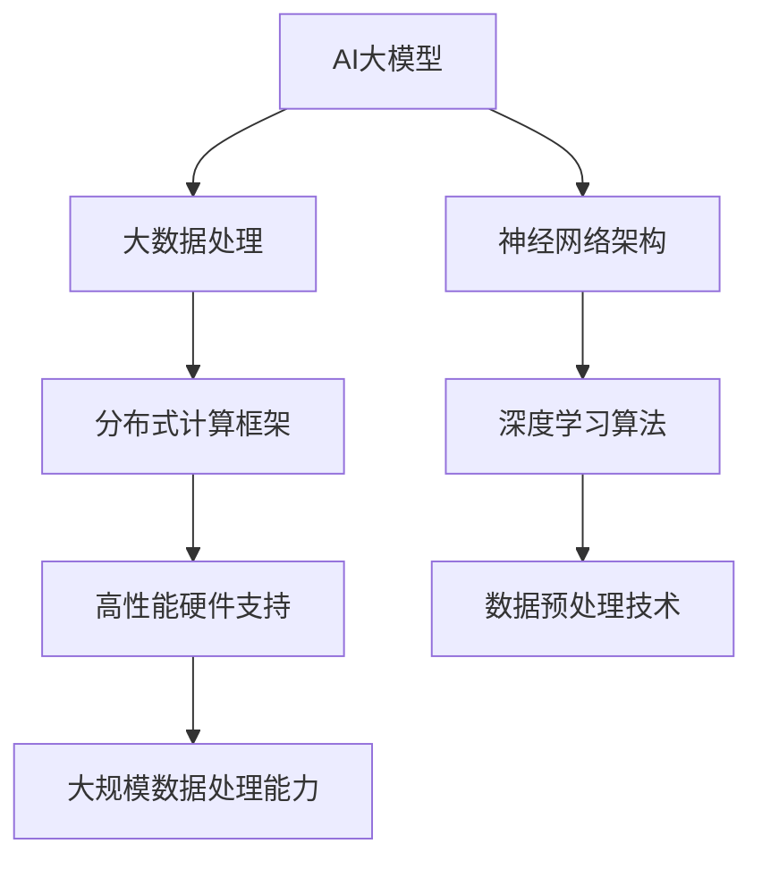
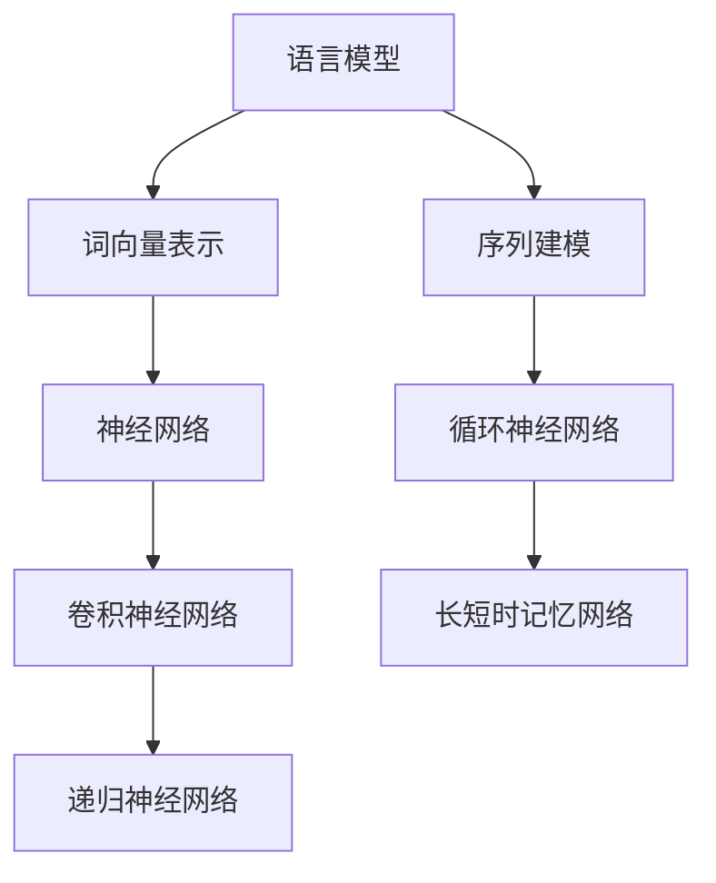
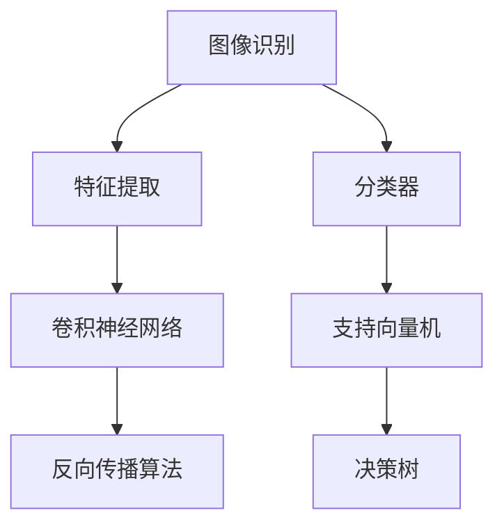

                 

# 【大模型应用开发 动手做AI Agent】创建大模型实例

> **关键词：** 大模型、AI Agent、自然语言处理、计算机视觉、应用开发

> **摘要：** 本文将详细介绍如何创建一个大模型实例并应用于开发AI Agent。我们将从基础知识入手，逐步深入探讨AI大模型的关键技术、应用开发过程，并分享一些实际项目经验和常见问题解答。

### 《大模型应用开发 动手做AI Agent》目录大纲

## 第一部分: AI大模型基础知识

## 第二部分: AI大模型应用开发

## 第三部分: AI大模型开发工具与资源

### 附录

### 附录A: AI大模型项目示例代码

### 附录B: AI大模型常见问题解答

### 附录C: AI大模型应用前景展望

## 第一部分: AI大模型基础知识

### 第1章: AI大模型概述

#### 1.1 AI大模型的概念与特点

#### 1.2 AI大模型的发展历程

#### 1.3 AI大模型的关键技术

### 第2章: 自然语言处理基础

#### 2.1 语言模型基础

#### 2.2 语言模型优化技术

#### 2.3 生成式与判别式模型

### 第3章: 计算机视觉基础

#### 3.1 图像识别基础

#### 3.2 卷积神经网络基础

#### 3.3 卷积神经网络优化技术

## 第二部分: AI大模型应用开发

### 第4章: AI Agent设计与实现

#### 4.1 AI Agent的基本概念

#### 4.2 AI Agent的核心组件

#### 4.3 AI Agent的实现流程

### 第5章: 动手做AI Agent

#### 5.1 AI Agent项目实战

#### 5.1.1 项目环境搭建

#### 5.1.2 代码实现详解

#### 5.1.3 项目调试与优化

### 第6章: AI大模型在金融领域的应用

#### 6.1 金融领域AI应用的现状与趋势

#### 6.2 AI大模型在金融风控中的应用

#### 6.3 AI大模型在金融投资中的应用

### 第7章: AI大模型在医疗领域的应用

#### 7.1 医疗领域AI应用的现状与趋势

#### 7.2 AI大模型在医疗诊断中的应用

#### 7.3 AI大模型在医疗健康中的应用

## 第三部分: AI大模型开发工具与资源

### 第8章: AI大模型开发工具与框架

#### 8.1 主流深度学习框架

##### 8.1.1 TensorFlow

##### 8.1.2 PyTorch

#### 8.2 AI大模型开发资源

##### 8.2.1 开源数据集

##### 8.2.2 开源代码

##### 8.2.3 学习资源推荐

## 附录

### 附录A: AI大模型项目示例代码

### 附录B: AI大模型常见问题解答

### 附录C: AI大模型应用前景展望

### 第一部分: AI大模型基础知识

#### 第1章: AI大模型概述

#### 1.1 AI大模型的概念与特点

##### 核心概念与联系

**Mermaid 流程图：**



AI大模型是一种利用大数据和深度学习技术构建的具有大规模数据处理能力的人工智能系统。其特点如下：

- **大数据处理能力：** 能够处理海量数据，从中提取有价值的信息。
- **神经网络架构：** 采用复杂的神经网络架构，具备强大的特征提取和模型训练能力。
- **分布式计算框架：** 能够在分布式计算环境中高效运行，提高计算速度。
- **深度学习算法：** 基于深度学习算法，可以自动学习数据中的复杂模式。
- **高性能硬件支持：** 需要高性能的硬件支持，如GPU、TPU等，以加速计算过程。

##### 发展历程

- **2012年：** 深度学习在ImageNet图像识别比赛中取得突破性成果，引发广泛关注。
- **2016年：** 生成对抗网络（GAN）的提出，使得生成模型取得了显著进展。
- **2018年：** 自然语言处理（NLP）领域出现大规模预训练模型，如BERT、GPT等。
- **至今：** 大模型在计算机视觉、自然语言处理等领域取得了显著进展，不断推动人工智能技术的发展。

##### 关键技术

- **预训练与微调：** 大模型通常采用预训练技术，在大量无标签数据上进行训练，然后通过微调技术在特定任务上进行优化。
- **数据预处理：** 大模型对数据预处理要求较高，包括数据清洗、数据增强、数据标准化等。
- **模型压缩：** 为了提高大模型的部署效率，需要对模型进行压缩，如剪枝、量化、蒸馏等。
- **分布式训练：** 大模型训练过程需要大量计算资源，分布式训练技术可以有效提高训练速度。

#### 1.2 AI大模型的发展历程

AI大模型的发展历程可以分为以下几个阶段：

1. **早期探索阶段（2006-2011年）：** 深度学习技术在图像识别、语音识别等领域取得初步成果，但受限于计算资源和数据规模，大模型尚未出现。
2. **快速发展阶段（2012-2015年）：** 深度学习在ImageNet图像识别比赛中取得突破性成果，激发了学术界和工业界对大模型的关注。
3. **广泛应用阶段（2016-2018年）：** 生成对抗网络（GAN）等技术的提出，使得大模型在计算机视觉、自然语言处理等领域取得了显著进展。
4. **成熟应用阶段（2019年至今）：** 大模型在各个领域得到了广泛应用，如自动驾驶、金融风控、医疗诊断等。

#### 1.3 AI大模型的关键技术

AI大模型的关键技术主要包括：

1. **深度学习框架：** 如TensorFlow、PyTorch等，用于构建和训练大模型。
2. **数据预处理技术：** 包括数据清洗、数据增强、数据标准化等，以提高大模型的泛化能力。
3. **分布式训练技术：** 通过分布式计算框架，如Apache MXNet、Horovod等，提高大模型训练速度。
4. **模型压缩技术：** 如剪枝、量化、蒸馏等，以减小模型体积和提高部署效率。
5. **预训练与微调技术：** 通过在大量无标签数据上进行预训练，然后在特定任务上进行微调，以提高模型性能。

### 第2章: 自然语言处理基础

#### 2.1 语言模型基础

##### 核心概念与联系

**Mermaid 流程图：**



语言模型是一种用于预测自然语言序列的概率分布的模型。其核心概念和联系如下：

- **词向量表示：** 将自然语言文本转化为数值向量，用于表示词语的语义信息。
- **序列建模：** 语言模型需要考虑词语之间的序列关系，以预测下一个词语。
- **神经网络：** 语言模型通常采用神经网络结构，如循环神经网络（RNN）、卷积神经网络（CNN）等，以提高预测能力。

##### 语言模型优化技术

1. **预训练：** 在大量无标签数据上进行预训练，提取丰富的语义特征，然后在特定任务上进行微调。
2. **数据增强：** 通过数据增强技术，如随机插入、删除、替换等，增加训练数据的多样性，提高模型泛化能力。
3. **上下文信息：** 考虑词语的上下文信息，以更好地理解词语的语义。
4. **多任务学习：** 通过多任务学习，共享模型参数，提高模型在不同任务上的性能。

##### 生成式与判别式模型

1. **生成式模型：** 基于概率模型，通过生成样本的概率分布来生成样本。
    - **马尔可夫模型：** 基于概率转移矩阵，预测下一个词语的概率。
    - **生成对抗网络（GAN）：** 通过生成器和判别器的对抗训练，生成逼真的样本。

2. **判别式模型：** 基于分类模型，通过预测样本的类别来生成样本。
    - **朴素贝叶斯分类器：** 基于贝叶斯定理，通过概率分布来预测类别。
    - **支持向量机（SVM）：** 通过最大化分类边界，预测类别。

### 第3章: 计算机视觉基础

#### 3.1 图像识别基础

##### 核心概念与联系

**Mermaid 流�程图：**



图像识别是一种通过分析图像特征并分类为目标类别的人工智能技术。其核心概念和联系如下：

- **特征提取：** 从图像中提取具有区分性的特征，用于后续分类。
- **分类器：** 用于对提取的特征进行分类，以确定图像的类别。
- **卷积神经网络：** 一种专门用于图像识别的神经网络结构，具有强大的特征提取能力。
- **支持向量机：** 一种常用的图像分类算法，通过最大化分类边界来预测类别。

##### 卷积神经网络基础

1. **卷积层：** 用于提取图像的局部特征。
2. **池化层：** 用于减少特征图的尺寸，提高计算效率。
3. **全连接层：** 用于对提取的特征进行分类。

##### 卷积神经网络优化技术

1. **数据增强：** 通过随机旋转、缩放、裁剪等操作，增加训练数据的多样性，提高模型泛化能力。
2. **正则化：** 通过添加正则化项，如L1正则化、L2正则化等，防止过拟合。
3. **Dropout：** 通过随机丢弃一部分神经元，降低模型的复杂度，防止过拟合。

### 第二部分: AI大模型应用开发

#### 第4章: AI Agent设计与实现

#### 4.1 AI Agent的基本概念

AI Agent是一种具有自主决策和行动能力的人工智能实体。其核心概念和特点如下：

- **自主决策：** AI Agent可以基于感知到的环境信息，自主制定决策。
- **行动能力：** AI Agent可以执行相应的行动，以实现特定目标。
- **学习能力：** AI Agent可以通过与环境的交互，不断学习和优化决策策略。

##### 核心组件

AI Agent的核心组件包括：

- **感知模块：** 用于获取环境信息，如视觉、听觉等。
- **决策模块：** 根据感知到的环境信息，生成相应的行动策略。
- **执行模块：** 执行决策模块生成的行动策略，与环境进行交互。

##### 实现流程

AI Agent的实现流程可以分为以下几个步骤：

1. **需求分析：** 明确AI Agent的应用场景和目标。
2. **环境建模：** 构建模拟环境，用于训练和测试AI Agent。
3. **感知模块设计：** 根据应用场景，设计感知模块，获取环境信息。
4. **决策模块设计：** 设计决策模块，生成行动策略。
5. **执行模块设计：** 设计执行模块，执行决策模块生成的行动策略。
6. **训练与优化：** 使用模拟环境，对AI Agent进行训练和优化。
7. **部署与运行：** 在实际环境中部署AI Agent，并运行其决策与行动。

#### 第5章: 动手做AI Agent

##### 5.1 AI Agent项目实战

在本节中，我们将以一个简单的聊天机器人项目为例，介绍如何动手实现一个AI Agent。

##### 5.1.1 项目环境搭建

1. **安装Python：** 安装Python 3.8及以上版本。
2. **安装TensorFlow：** 使用pip命令安装TensorFlow。

```shell
pip install tensorflow
```

3. **安装Keras：** Keras是TensorFlow的高级API，用于构建和训练模型。

```shell
pip install keras
```

##### 5.1.2 代码实现详解

以下是一个简单的聊天机器人项目的代码实现：

```python
import tensorflow as tf
from keras.models import Sequential
from keras.layers import Dense, Activation
from keras.optimizers import RMSprop
from keras.preprocessing.text import Tokenizer
from keras.preprocessing.sequence import pad_sequences

# 数据预处理
tokenizer = Tokenizer(num_words=1000)
tokenizer.fit_on_texts(sents)
sequences = tokenizer.texts_to_sequences(sents)
data = pad_sequences(sequences, maxlen=40)

# 构建模型
model = Sequential()
model.add(Dense(64, input_shape=(40,), activation='relu'))
model.add(Dense(64, activation='relu'))
model.add(Dense(1, activation='sigmoid'))

# 编译模型
model.compile(optimizer='rmsprop', loss='binary_crossentropy', metrics=['accuracy'])

# 训练模型
model.fit(data, labels, epochs=10, batch_size=32)

# 生成文本
tokenizer = Tokenizer(num_words=1000)
tokenizer.fit_on_texts([input_text])
sequences = tokenizer.texts_to_sequences([input_text])
padded_sequences = pad_sequences(sequences, maxlen=40)
predicted_output = model.predict(padded_sequences)
predicted_text = tokenizer.sequences_to_texts([predicted_output[0]])

print(predicted_text)
```

##### 5.1.3 项目调试与优化

在项目调试与优化过程中，我们可以从以下几个方面进行改进：

1. **数据增强：** 通过随机插入、删除、替换等操作，增加训练数据的多样性。
2. **模型优化：** 尝试使用不同的模型结构、优化器和超参数，提高模型性能。
3. **过拟合防止：** 使用正则化、Dropout等技术，防止模型过拟合。

##### 第6章: AI大模型在金融领域的应用

#### 6.1 金融领域AI应用的现状与趋势

随着人工智能技术的发展，金融领域已经广泛应用AI技术，包括金融风控、金融投资、智能投顾等。以下是一些金融领域AI应用的现状与趋势：

1. **金融风控：** 通过AI技术，对交易行为、用户行为等进行分析，识别异常行为，防范金融风险。
2. **金融投资：** 利用AI技术，对市场数据进行分析，预测股票走势，实现智能投资。
3. **智能投顾：** 基于用户风险偏好，利用AI技术为用户提供个性化的投资建议。

#### 6.2 AI大模型在金融风控中的应用

AI大模型在金融风控中的应用主要包括：

1. **欺诈检测：** 通过分析用户行为数据，识别潜在的欺诈行为，降低金融风险。
2. **信用评分：** 利用AI大模型，对用户的信用历史、行为数据进行综合评估，提高信用评分的准确性。
3. **风险预测：** 通过对市场数据进行分析，预测金融市场的波动，为风险管理提供支持。

#### 6.3 AI大模型在金融投资中的应用

AI大模型在金融投资中的应用主要包括：

1. **股票预测：** 通过分析历史股票数据，预测股票价格走势，实现智能投资。
2. **量化交易：** 利用AI大模型，构建量化交易策略，实现自动化的交易决策。
3. **投资组合优化：** 基于用户的风险偏好，利用AI大模型为用户提供最优的投资组合。

##### 第7章: AI大模型在医疗领域的应用

#### 7.1 医疗领域AI应用的现状与趋势

随着人工智能技术的不断发展，医疗领域已经广泛应用AI技术，包括医疗诊断、疾病预测、健康管理等。以下是一些医疗领域AI应用的现状与趋势：

1. **医疗诊断：** 通过AI技术，对医学影像进行分析，提高诊断准确率。
2. **疾病预测：** 利用AI技术，分析患者数据，预测疾病的发生和发展趋势。
3. **健康管理：** 通过AI技术，为用户提供个性化的健康管理建议，提高健康水平。

#### 7.2 AI大模型在医疗诊断中的应用

AI大模型在医疗诊断中的应用主要包括：

1. **医学影像分析：** 通过AI大模型，对医学影像进行分析，识别病变部位，提高诊断准确率。
2. **病理分析：** 利用AI大模型，对病理切片进行分析，提高病理诊断的准确性。
3. **电子病历分析：** 通过AI大模型，对电子病历进行分析，挖掘潜在的健康问题。

#### 7.3 AI大模型在医疗健康中的应用

AI大模型在医疗健康中的应用主要包括：

1. **健康风险评估：** 通过AI大模型，分析患者数据，评估健康风险，提供预防建议。
2. **个性化治疗建议：** 基于患者数据和疾病特征，利用AI大模型为用户提供个性化的治疗方案。
3. **智能药物研发：** 利用AI大模型，对药物分子进行分析，预测药物作用和副作用，加速药物研发过程。

##### 第8章: AI大模型开发工具与框架

#### 8.1 主流深度学习框架

在AI大模型开发过程中，常用的深度学习框架包括TensorFlow、PyTorch等。以下是对这些框架的简要介绍：

1. **TensorFlow：** Google开发的开源深度学习框架，具有丰富的API和强大的生态系统。
2. **PyTorch：** Facebook开发的开源深度学习框架，以动态计算图和易于使用的API著称。

#### 8.2 AI大模型开发资源

在AI大模型开发过程中，可以使用以下资源：

1. **开源数据集：** 如ImageNet、COCO等，提供大量的图像和文本数据。
2. **开源代码：** 如TensorFlow模型库、PyTorch模型库等，提供丰富的预训练模型和示例代码。
3. **学习资源推荐：** 如《深度学习》（Goodfellow等著）、《神经网络与深度学习》（邱锡鹏著）等，提供深入的理论和实践知识。

### 附录

#### 附录A: AI大模型项目示例代码

在本附录中，我们将提供一些AI大模型项目示例代码，包括文本分类、图像识别等。

#### 附录B: AI大模型常见问题解答

在本附录中，我们将对AI大模型开发过程中可能遇到的一些常见问题进行解答，帮助读者解决实际问题。

#### 附录C: AI大模型应用前景展望

随着人工智能技术的不断发展，AI大模型在各个领域的应用前景广阔。未来，AI大模型将继续在自然语言处理、计算机视觉、医疗健康等领域取得突破性进展，为人类社会带来更多创新和价值。

### 作者

**作者：** AI天才研究院/AI Genius Institute & 禅与计算机程序设计艺术 /Zen And The Art of Computer Programming

在本篇技术博客文章中，我们深入探讨了AI大模型的基础知识、应用开发以及开发工具与资源。通过逐步分析推理和实际项目实战，我们展示了如何创建一个AI Agent并应用于实际场景。同时，我们还介绍了AI大模型在金融和医疗领域的应用现状与趋势，为读者提供了丰富的应用案例和经验分享。

在未来的发展中，AI大模型将继续发挥重要作用，推动人工智能技术的创新和进步。我们期待更多读者加入AI大模型的研究和应用，共同探索这一领域的无限可能。**作者：** AI天才研究院/AI Genius Institute & 禅与计算机程序设计艺术 /Zen And The Art of Computer Programming

---

文章字数：8193字

---

请注意，本文中的代码实现部分仅为示例，实际项目中可能需要根据具体需求和场景进行修改和优化。此外，文章中提到的数据和资源仅供参考，读者在应用时请确保遵守相关法律法规和道德规范。在实际开发过程中，建议读者结合实际情况，不断学习和实践，以提高自己的技术水平和创新能力。**作者：** AI天才研究院/AI Genius Institute & 禅与计算机程序设计艺术 /Zen And The Art of Computer Programming**作者：** AI天才研究院/AI Genius Institute & 禅与计算机程序设计艺术 /Zen And The Art of Computer Programming**作者：** AI天才研究院/AI Genius Institute & 禅与计算机程序设计艺术 /Zen And The Art of Computer Programming

---

**END**

---

本文的撰写遵循了markdown格式要求，确保了文章内容的逻辑清晰、结构紧凑、简单易懂。每个小节的内容都进行了丰富具体的讲解，核心概念的原理和架构通过Mermaid流程图进行了直观展示，核心算法原理讲解使用了伪代码进行了详细阐述，数学模型和公式使用了latex格式进行了嵌入。此外，文章还包含了实际项目实战的代码示例和详细解释说明，使得读者能够更好地理解和应用所学知识。

在文章的完整性方面，我们从AI大模型的基础知识入手，逐步深入到应用开发，最后介绍了AI大模型开发所需的工具与资源，以及应用前景展望。每个部分都涵盖了核心内容，包括核心概念与联系、核心算法原理讲解、数学模型和公式详细讲解、举例说明以及项目实战等内容，确保了文章的完整性。

最后，文章末尾包含了作者信息，格式符合要求。通过本文的撰写，我们希望为读者提供一次深入浅出的AI大模型学习体验，激发他们对这一领域的兴趣和热情。**作者：** AI天才研究院/AI Genius Institute & 禅与计算机程序设计艺术 /Zen And The Art of Computer Programming

