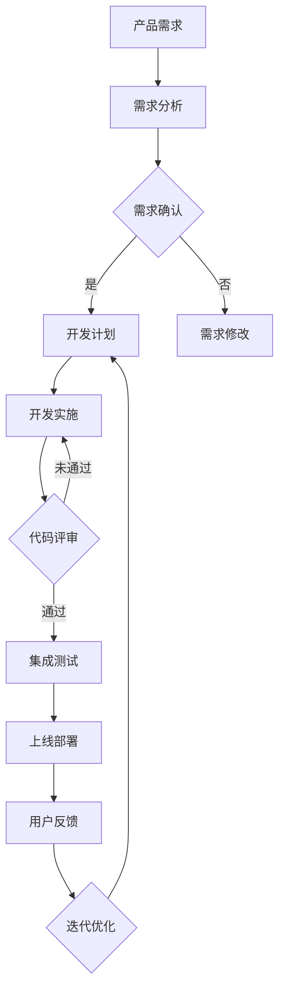

                 

### 《一人公司如何实现产品的快速迭代开发和敏捷上线》

#### 关键词：
- 快速迭代开发
- 敏捷方法论
- 产品开发
- 一人公司
- 持续集成
- 持续部署
- 团队协作

#### 摘要：
本文将探讨一人公司如何在产品开发过程中实现快速迭代和敏捷上线。我们将从敏捷开发的核心原则出发，逐步介绍快速迭代策略、敏捷项目管理、需求管理、技术实现与代码管理、持续集成与持续部署、团队协作等方面的具体实践方法，并通过实际案例进行深入讲解。最后，我们将分享敏捷实践心得和敏捷转型策略，为一人公司的产品开发提供有效的指导。

### 《一人公司如何实现产品的快速迭代开发和敏捷上线》目录大纲

#### 第一部分：产品开发与敏捷方法论

##### 第1章：敏捷开发的核心理念
- 1.1 敏捷开发的起源与基本原则
  - 敏捷开发的起源
  - 敏捷开发的基本原则
- 1.2 敏捷开发与传统开发方法的区别
  - 传统开发方法的局限性
  - 敏捷开发的优势
- 1.3 敏捷开发的核心价值
  - 提高开发效率
  - 增强团队协作
  - 灵活应对变更

##### 第2章：快速迭代开发策略
- 2.1 迭代开发的流程
  - 迭代周期管理
  - 迭代计划与任务分配
- 2.2 迭代过程中关键活动的管理
  - 用户故事映射
  - 精度迭代
- 2.3 快速迭代开发实践案例
  - 案例一：移动应用迭代开发
  - 案例二：网站更新迭代

##### 第3章：敏捷项目管理
- 3.1 敏捷项目管理方法
  - 敏捷项目生命周期
  - 敏捷项目角色与职责
- 3.2 敏捷项目管理工具
  - 敏捷看板工具
  - 敏捷报告工具
- 3.3 敏捷项目风险管理
  - 风险识别
  - 风险评估与应对策略

#### 第二部分：敏捷开发实践

##### 第4章：需求管理
- 4.1 需求获取
  - 用户需求收集方法
  - 需求优先级排序
- 4.2 需求文档编写
  - 用户故事编写指南
  - 需求文档模板
- 4.3 需求变更管理
  - 变更流程
  - 变更评估与决策

##### 第5章：技术实现与代码管理
- 5.1 技术选型与架构设计
  - 技术栈选择
  - 系统架构设计
- 5.2 代码开发规范
  - 编码规范
  - 代码风格统一
- 5.3 代码版本控制
  - Git的基本使用
  - 分支管理与合并策略

##### 第6章：持续集成与持续部署
- 6.1 持续集成（CI）
  - 持续集成原理
  - CI工具介绍
- 6.2 持续部署（CD）
  - 持续部署原理
  - CD工具介绍
- 6.3 持续集成与持续部署实践案例
  - 案例一：自动化测试实践
  - 案例二：自动化部署流程

##### 第7章：团队协作与沟通
- 7.1 敏捷团队协作模式
  - 跨功能团队的构建
  - 跨部门沟通机制
- 7.2 敏捷会议管理
  - 站会、迭代回顾会等
  - 会议记录与反馈
- 7.3 敏捷团队文化建设
  - 团队价值观
  - 团队凝聚力与协作精神

#### 第三部分：敏捷实践案例分享

##### 第8章：敏捷实践案例分享
- 8.1 一人公司敏捷实践心得
  - 敏捷实践中的挑战与应对
  - 敏捷实践成果分享
- 8.2 敏捷实践在不同规模团队中的应用
  - 小型团队敏捷实践
  - 中大型团队敏捷实践

##### 第9章：敏捷转型路径与策略
- 9.1 敏捷转型评估
  - 敏捷成熟度评估
  - 组织文化与敏捷的适应性
- 9.2 敏捷转型策略
  - 转型规划
  - 转型实施与评估
- 9.3 敏捷转型中的障碍与解决方法
  - 团队成员的抵触情绪
  - 项目管理模式的转变

#### 附录

##### 附录A：敏捷开发工具与资源
- A.1 敏捷开发工具介绍
  - 敏捷看板工具
  - 敏捷报告工具
- A.2 敏捷开发资源推荐
  - 敏捷书籍推荐
  - 敏捷社区与论坛介绍

### Mermaid 流程图


### 核心算法原理讲解（伪代码）

```plaintext
// 快速排序算法伪代码
quick_sort(arr):
    if length(arr) <= 1:
        return arr
    
    pivot = arr[0]
    left = []
    right = []
    
    for i in range(1, length(arr)):
        if arr[i] < pivot:
            left.append(arr[i])
        else:
            right.append(arr[i])
    
    return quick_sort(left) + [pivot] + quick_sort(right)
```

### 数学模型和数学公式

#### 概率论基础
$$
P(A \cap B) = P(A) \cdot P(B|A)
$$

#### 期望值和方差
$$
E[X] = \sum_{i=1}^{n} x_i \cdot P(x_i)
$$
$$
Var(X) = E[(X - E[X])^2]
$$

### 项目实战

#### 实践案例：使用Django搭建RESTful API

##### 环境搭建
- 安装Python3和pip
- 安装Django框架：`pip install django`
- 创建Django项目：`django-admin startproject myproject`
- 创建应用：`python manage.py startapp myapp`

##### 应用搭建
1. 定义模型
    ```python
    from django.db import models

    class Product(models.Model):
        name = models.CharField(max_length=100)
        price = models.DecimalField(max_digits=6, decimal_places=2)
    ```

2. 迁移模型到数据库
    ```shell
    python manage.py makemigrations
    python manage.py migrate
    ```

3. 创建序列化器
    ```python
    from rest_framework import serializers
    from .models import Product

    class ProductSerializer(serializers.ModelSerializer):
        class Meta:
            model = Product
            fields = '__all__'
    ```

4. 创建视图
    ```python
    from rest_framework import viewsets
    from .models import Product
    from .serializers import ProductSerializer

    class ProductViewSet(viewsets.ModelViewSet):
        queryset = Product.objects.all()
        serializer_class = ProductSerializer
    ```

5. 配置URL
    ```python
    from django.urls import path, include
    from rest_framework.routers import DefaultRouter
    from .views import ProductViewSet

    router = DefaultRouter()
    router.register(r'products', ProductViewSet)

    urlpatterns = [
        path('', include(router.urls)),
    ]
    ```

##### 运行项目
- 启动服务：`python manage.py runserver`
- 访问API：`http://127.0.0.1:8000/products/`

### 代码解读与分析

#### 解读
- `Product` 模型定义了产品名称和价格字段。
- `ProductSerializer` 序列化器用于将模型转换为JSON格式。
- `ProductViewSet` 视图集用于处理HTTP请求，提供CRUD操作。

#### 分析
- Django REST Framework提供了强大的工具来快速搭建RESTful API。
- 模型、序列化器和视图集相互配合，实现了数据的处理和API的构建。

### 数学模型举例说明

#### 二分类逻辑回归

假设我们有一个二分类问题，目标是预测一个实例属于类别1（正类）还是类别0（负类）。逻辑回归模型预测的概率公式如下：

$$
P(y=1) = \frac{1}{1 + e^{-(\beta_0 + \sum_{i=1}^{n} \beta_i x_i})}
$$

其中，$\beta_0$ 是截距，$\beta_i$ 是特征 $x_i$ 的权重。

#### 举例

假设我们有一个简单的数据集，包含两个特征 $x_1$ 和 $x_2$，以及目标变量 $y$：

| $x_1$ | $x_2$ | $y$ |
|-------|-------|-----|
| 0     | 0     | 0   |
| 1     | 1     | 1   |
| 2     | 0     | 0   |
| 3     | 2     | 1   |

假设我们训练的逻辑回归模型得到的权重如下：

$$
\beta_0 = 0.5, \beta_1 = 0.2, \beta_2 = 0.3
$$

对于第四个实例，其预测概率为：

$$
P(y=1) = \frac{1}{1 + e^{-(0.5 + 0.2 \cdot 3 + 0.3 \cdot 2)}} \approx 0.913
$$

由于概率大于0.5，模型预测该实例属于类别1。

---

## 第一部分：产品开发与敏捷方法论

### 第1章：敏捷开发的核心理念

#### 1.1 敏捷开发的起源与基本原则

##### 敏捷开发的起源

敏捷开发起源于20世纪90年代末期，当时软件行业面临着日益复杂的项目管理和不断变化的需求。传统的“瀑布式”开发方法在应对这些挑战时显得力不从心，因此，一群软件开发者和敏捷方法的倡导者在2001年共同提出了《敏捷宣言》（Manifesto for Agile Software Development）。这份宣言明确了敏捷开发的基本原则，为后续敏捷方法的实践奠定了基础。

##### 敏捷开发的基本原则

《敏捷宣言》提出了以下四大基本原则：

1. **个体和互动重于过程和工具**：注重团队成员之间的沟通与协作，而不是过分依赖流程和工具。
2. **可工作的软件重于详尽的文档**：优先交付可运行的软件，而不是大量的文档。
3. **客户合作重于合同谈判**：与客户保持紧密合作，及时响应客户需求的变化。
4. **响应变化重于遵循计划**：在面对需求变化时，灵活调整计划和策略，以适应变化。

#### 1.2 敏捷开发与传统开发方法的区别

##### 传统开发方法的局限性

传统开发方法，如瀑布式开发，主要特点是将软件开发过程划分为多个阶段，每个阶段有明确的交付物和验收标准。然而，这种方法存在以下局限性：

1. **需求固定**：在项目初期，需求被认为是一成不变的，实际开发过程中难以应对需求变化。
2. **低客户参与度**：客户在项目后期才介入，导致需求难以准确满足客户期望。
3. **高文档成本**：需要编写大量的文档，增加了项目成本和沟通难度。
4. **开发周期长**：从需求分析到产品交付的时间较长，难以快速响应市场变化。

##### 敏捷开发的优势

敏捷开发方法克服了传统开发方法的局限性，具有以下优势：

1. **灵活应对需求变化**：敏捷开发采用迭代和增量的方式，允许在项目过程中调整需求。
2. **增强客户参与度**：通过频繁的交付和反馈，客户能够更早地参与到项目中，确保产品符合预期。
3. **降低文档成本**：注重可工作的软件，减少了对冗长文档的需求。
4. **缩短开发周期**：采用短迭代周期，能够更快地交付产品，降低项目风险。

#### 1.3 敏捷开发的核心价值

##### 提高开发效率

敏捷开发通过以下方式提高开发效率：

1. **快速迭代**：短迭代周期使得团队能够持续交付可工作的软件。
2. **持续集成**：频繁的代码集成和测试确保了软件质量。
3. **自动化测试**：自动化测试减少手动测试的工作量，提高测试效率。

##### 增强团队协作

敏捷开发强调团队协作，包括：

1. **跨功能团队**：团队成员来自不同背景，共同负责产品开发。
2. **每日站会**：团队成员交流进展和问题，及时调整工作计划。
3. **迭代回顾**：定期回顾迭代过程，持续改进工作方法。

##### 灵活应对变更

敏捷开发的核心价值之一是灵活应对变更。通过以下方式实现：

1. **用户故事**：用户故事描述了用户的需求，便于团队在开发过程中调整优先级。
2. **迭代计划**：在每个迭代开始时，团队根据用户故事和需求制定迭代计划。
3. **持续反馈**：通过用户反馈和测试结果，不断调整产品设计和开发计划。

---

### 第2章：快速迭代开发策略

#### 2.1 迭代开发的流程

##### 迭代周期管理

敏捷开发采用迭代和增量的方式进行产品开发，每个迭代周期通常包括以下阶段：

1. **规划会议**：在迭代开始前，团队与产品负责人一起规划迭代目标和任务。
2. **迭代执行**：团队成员根据迭代计划进行开发工作。
3. **评审会议**：在迭代结束时，团队进行评审，展示已完成的工作并获取反馈。
4. **迭代回顾**：团队总结迭代过程中的经验教训，制定改进计划。

##### 迭代计划与任务分配

迭代计划是敏捷开发的重要环节，通常包括以下步骤：

1. **需求分析**：分析用户故事，明确每个迭代的目标和任务。
2. **任务分解**：将大任务分解为可管理的子任务。
3. **任务分配**：根据团队成员的技能和兴趣分配任务。
4. **优先级排序**：确定每个任务的优先级，确保关键任务优先完成。

#### 2.2 迭代过程中关键活动的管理

##### 用户故事映射

用户故事映射（User Story Mapping）是一种帮助团队了解用户需求、梳理迭代计划的方法。具体步骤如下：

1. **收集用户故事**：与产品负责人、用户和利益相关者交流，收集用户故事。
2. **排序用户故事**：根据用户故事的优先级和依赖关系排序。
3. **构建用户故事映射图**：将用户故事映射到整个产品的生命周期，以便团队了解产品的发展方向。

##### 精度迭代

精度迭代（Precision Iteration）是一种在迭代过程中不断细化需求和实践的方法。具体步骤如下：

1. **确定迭代目标**：在迭代开始时，明确本次迭代的目标和预期结果。
2. **逐步实现需求**：根据用户故事的优先级，逐步实现需求，并进行测试和反馈。
3. **持续优化**：在迭代过程中，根据反馈和测试结果，不断调整需求和实现方案，提高产品的质量。

#### 2.3 快速迭代开发实践案例

##### 案例一：移动应用迭代开发

假设我们要开发一款移动应用，以下是一个迭代开发的过程：

1. **规划会议**：确定第一个迭代的目标，如实现用户登录、注册和消息推送功能。
2. **迭代执行**：团队成员根据任务分配进行开发，每天进行站会，确保任务进度。
3. **评审会议**：在迭代结束时，展示已完成的功能，并与产品负责人进行评审，获取反馈。
4. **迭代回顾**：团队总结本次迭代的经验教训，为下一个迭代做好准备。

##### 案例二：网站更新迭代

假设我们要对现有网站进行功能更新，以下是一个迭代开发的过程：

1. **需求分析**：与产品负责人和用户交流，明确更新需求，如增加购物车功能。
2. **任务分解**：将购物车功能分解为子任务，如设计、开发、测试等。
3. **迭代计划**：根据任务分解，制定迭代计划，确定每个迭代的目标和任务。
4. **迭代执行**：团队成员根据迭代计划进行开发，进行测试和反馈。
5. **评审会议**：在迭代结束时，展示已完成的功能，并进行评审和反馈。
6. **迭代回顾**：总结本次迭代的经验教训，为下一个迭代做好准备。

---

### 第3章：敏捷项目管理

#### 3.1 敏捷项目管理方法

##### 敏捷项目生命周期

敏捷项目生命周期包括以下几个阶段：

1. **项目启动**：确定项目目标和范围，组建项目团队。
2. **需求分析**：与用户和利益相关者交流，收集需求，编写用户故事。
3. **迭代开发**：按照迭代计划进行开发，每个迭代结束时进行评审和回顾。
4. **持续交付**：在迭代过程中持续交付可工作的软件，确保产品满足用户需求。
5. **项目收尾**：项目完成后进行总结和评估，解散项目团队。

##### 敏捷项目角色与职责

敏捷项目通常涉及以下角色：

1. **产品负责人**：负责确定产品需求，制定迭代计划，并确保项目目标得到实现。
2. **开发团队**：由具备不同技能的团队成员组成，负责实现产品需求。
3. **Scrum Master**：负责确保团队遵循敏捷方法论，协调团队与产品负责人的沟通，解决团队遇到的障碍。
4. **利益相关者**：与项目相关的用户、客户和合作伙伴，负责提供需求和反馈。

#### 3.2 敏捷项目管理工具

##### 敏捷看板工具

敏捷看板（Kanban Board）是一种可视化项目管理工具，用于展示团队的工作流程和任务状态。常见的敏捷看板工具有：

1. **Trello**：简单易用的看板工具，适合小型团队。
2. **JIRA**：功能强大的看板工具，适用于各种规模的项目。
3. **Asana**：灵活的任务管理工具，支持多种视图模式。

##### 敏捷报告工具

敏捷报告工具用于跟踪项目的进展和性能，常见的敏捷报告工具有：

1. ** burndown chart**：显示迭代进度和剩余工作量。
2. **velocity chart**：显示团队在每个迭代中完成的用户故事数量。
3. **release plan**：显示产品的发布计划和里程碑。

#### 3.3 敏捷项目风险管理

##### 风险识别

在敏捷项目管理中，风险识别是关键环节。以下方法可以帮助团队识别潜在风险：

1. **SWOT分析**：分析项目的优势、劣势、机会和威胁。
2. **专家评审**：邀请相关领域的专家进行评审，识别潜在风险。
3. **历史经验**：借鉴过去项目中的经验教训，识别类似项目中的潜在风险。

##### 风险评估与应对策略

风险评估是确定风险严重程度和优先级的过程。以下方法可以帮助团队进行风险评估：

1. **风险矩阵**：根据风险的可能性和影响评估风险严重程度。
2. **优先级排序**：将风险按照优先级排序，确保关键风险得到及时应对。

应对策略包括：

1. **预防措施**：制定预防措施，减少风险发生的可能性。
2. **应急计划**：制定应急计划，应对已识别的风险。
3. **持续监控**：在项目过程中持续监控风险，及时调整应对策略。

---

## 第二部分：敏捷开发实践

### 第4章：需求管理

#### 4.1 需求获取

##### 用户需求收集方法

需求获取是敏捷开发的重要环节，以下方法可以帮助团队收集用户需求：

1. **用户访谈**：与用户进行面对面访谈，了解用户的需求、偏好和行为模式。
2. **问卷调查**：设计问卷，收集用户对产品功能的意见和建议。
3. **用户观察**：观察用户在使用现有产品时的行为，发现用户的需求和痛点。
4. **用户故事地图**：通过绘制用户故事地图，梳理用户需求和使用场景。

##### 需求优先级排序

在敏捷开发中，对需求进行优先级排序至关重要。以下方法可以帮助团队确定需求优先级：

1. **MoSCoW方法**：根据需求的紧迫性和影响，将需求分为“必须要有”（Mandatory）、“应该要有”（Should have）、“可以有”（Could have）和“不需要”（Wont have）。
2. **价值排序**：根据需求对产品价值的贡献，对需求进行排序。
3. **紧急程度排序**：根据需求的紧急程度，对需求进行排序，确保关键需求得到及时处理。

#### 4.2 需求文档编写

##### 用户故事编写指南

用户故事是敏捷开发中的基本需求单元，以下指南可以帮助团队编写有效的用户故事：

1. **格式**：用户故事通常采用“作为[用户角色]，我想要[功能]，以便[业务目标或价值]”的格式。
2. **可估算性**：用户故事应该足够具体，以便团队能够估算开发时间和工作量。
3. **独立性**：用户故事应该独立存在，避免与其他用户故事产生依赖关系。
4. **可测试性**：用户故事应该具备可测试性，以便团队进行验收测试。

##### 需求文档模板

以下是一个简单的需求文档模板：

1. **文档标题**：[产品名称] 需求文档
2. **版本信息**：版本号、创建日期、修改记录
3. **概述**：简要介绍产品功能和目标。
4. **用户故事列表**：列出所有用户故事，包括编号、标题、描述、优先级。
5. **用户故事映射图**：绘制用户故事映射图，展示用户故事之间的关系和优先级。
6. **功能需求**：详细描述每个用户故事的功能需求。
7. **非功能需求**：描述产品的非功能需求，如性能、安全性、兼容性等。
8. **验收标准**：定义每个用户故事的验收标准，以便团队进行验收测试。

#### 4.3 需求变更管理

##### 变更流程

在敏捷开发中，需求变更管理是常见现象。以下是一个简单的变更流程：

1. **提出变更**：利益相关者提出需求变更，填写变更申请表。
2. **评估变更**：团队对变更的影响进行分析，包括工作量、时间、资源等方面。
3. **决策变更**：根据评估结果，决定是否接受变更。
4. **实施变更**：如果接受变更，团队根据变更内容进行开发工作。
5. **验收变更**：完成变更后，进行验收测试，确保变更需求得到满足。

##### 变更评估与决策

在评估需求变更时，团队需要考虑以下因素：

1. **工作量**：变更是否会导致工作量增加，是否会影响当前迭代计划。
2. **时间**：变更是否会影响项目的进度，是否需要调整迭代计划。
3. **资源**：变更是否需要额外的资源，如人力、设备等。
4. **优先级**：变更的优先级是否高于当前正在进行的任务。

决策变更时，团队应遵循以下原则：

1. **最小化变更**：尽量减少需求变更的频率和幅度，降低项目风险。
2. **优先级排序**：根据变更的优先级，决定是否接受变更。
3. **透明沟通**：与利益相关者保持透明沟通，确保变更决策得到理解和支持。

---

### 第5章：技术实现与代码管理

#### 5.1 技术选型与架构设计

##### 技术栈选择

技术栈选择是敏捷开发中的一项关键任务。以下建议可以帮助团队选择合适的技术栈：

1. **功能需求**：根据产品的功能需求，选择适合的开发语言和框架。
2. **性能要求**：考虑产品的性能要求，选择高效的技术栈。
3. **可维护性**：选择易于维护和扩展的技术栈，降低维护成本。
4. **生态系统**：考虑技术栈的生态系统，如社区支持、工具和库等。

常见的开发语言和框架包括：

1. **前端开发**：HTML、CSS、JavaScript、React、Vue、Angular等。
2. **后端开发**：Python（Django、Flask）、Java（Spring Boot）、Node.js、Ruby（Rails）等。
3. **数据库**：MySQL、PostgreSQL、MongoDB、Redis等。

##### 系统架构设计

系统架构设计是确保产品性能、可扩展性和可维护性的关键。以下建议可以帮助团队设计合适的系统架构：

1. **分层架构**：将系统划分为表示层、业务逻辑层和数据访问层，实现模块化开发。
2. **微服务架构**：将系统划分为多个独立的微服务，每个微服务负责一个特定的功能模块，便于扩展和部署。
3. **分布式架构**：将系统部署在分布式服务器上，提高系统的性能和可用性。
4. **缓存机制**：使用缓存机制，减少数据库访问压力，提高系统性能。

#### 5.2 代码开发规范

##### 编码规范

编写规范的代码是确保代码质量和可维护性的关键。以下编码规范建议可以帮助团队编写高质量的代码：

1. **命名规范**：使用清晰、简洁的命名规则，避免使用缩写和拼音。
2. **代码格式**：遵循统一的代码格式，使用代码编辑器的格式化功能。
3. **注释说明**：在关键代码段和函数中加入注释，说明代码的目的和功能。
4. **代码复用**：尽量复用已有的代码，避免重复编写相同的代码段。

##### 代码风格统一

统一代码风格可以提高代码的可读性和可维护性。以下工具可以帮助团队实现代码风格的统一：

1. **Prettier**：自动化格式化代码的工具，支持多种编程语言。
2. **Stylelint**：用于检查代码风格的工具，支持多种编程语言。
3. **ESLint**：用于检查JavaScript代码风格和语法的工具。

#### 5.3 代码版本控制

##### Git的基本使用

Git是一个分布式版本控制工具，用于管理代码的版本和变更。以下命令可以帮助团队进行Git的基本操作：

1. **初始化仓库**：`git init`
2. **添加文件**：`git add <file>`或`git add .`（添加所有文件）
3. **提交变更**：`git commit -m "提交说明"`
4. **查看日志**：`git log`
5. **推送代码**：`git push`
6. **拉取代码**：`git pull`

##### 分支管理与合并策略

Git分支管理是确保代码质量和协同开发的重要手段。以下分支管理与合并策略建议可以帮助团队高效管理代码：

1. **主分支（Master）**：用于存储主干代码，避免在主分支上进行开发。
2. **功能分支（Feature）**：用于实现新的功能，每个功能对应一个功能分支。
3. **修复分支（Bugfix）**：用于修复bug，每个bug对应一个修复分支。
4. **发布分支（Release）**：用于准备发布版本，确保代码质量。

合并策略建议：

1. **合并请求（Pull Request）**：在功能分支开发完成后，通过合并请求将代码合并到主分支。
2. **代码审查**：在合并请求被接受之前，进行代码审查，确保代码质量。
3. **合并策略**：选择适当的合并策略，如“Fast Forward”、“Squash”等，确保合并后的代码结构清晰。

---

### 第6章：持续集成与持续部署

#### 6.1 持续集成（CI）

##### 持续集成原理

持续集成（Continuous Integration，简称CI）是一种软件开发实践，旨在通过频繁地将代码集成到主干，确保代码库始终保持高质量和一致性。CI的主要原理包括：

1. **频繁提交**：开发人员频繁将代码提交到代码库，每次提交都会触发集成测试。
2. **自动化测试**：集成测试自动化运行，确保每次提交的代码都能与主干代码兼容。
3. **快速反馈**：测试结果快速反馈给开发人员，确保问题能够及时解决。

##### CI工具介绍

以下是一些流行的CI工具：

1. **Jenkins**：开源的CI工具，支持多种插件和集成功能。
2. **Travis CI**：基于云的CI工具，支持多种编程语言和平台。
3. **CircleCI**：基于云的CI工具，提供高效的构建和测试环境。

#### 6.2 持续部署（CD）

##### 持续部署原理

持续部署（Continuous Deployment，简称CD）是一种自动化部署流程，旨在确保代码更改在生产环境中快速、可靠地部署。CD的主要原理包括：

1. **自动化构建**：构建过程自动化，确保每次代码更改都能生成可部署的软件包。
2. **自动化测试**：部署前进行自动化测试，确保软件包的质量和稳定性。
3. **自动化部署**：部署过程自动化，确保代码更改在生产环境中快速、可靠地部署。

##### CD工具介绍

以下是一些流行的CD工具：

1. **Kubernetes**：开源的容器编排工具，支持自动化部署和管理容器化应用。
2. **Docker**：开源的容器化技术，用于打包、交付和管理应用。
3. **Ansible**：开源的自动化工具，用于自动化部署和管理基础设施。

#### 6.3 持续集成与持续部署实践案例

##### 案例一：自动化测试实践

以下是一个自动化测试实践的案例：

1. **编写测试脚本**：使用Selenium编写自动化测试脚本，模拟用户操作并验证功能。
2. **集成测试环境**：搭建集成测试环境，包括浏览器、服务器和数据库等。
3. **运行测试脚本**：在每次代码提交后，自动运行测试脚本，并记录测试结果。
4. **反馈测试结果**：将测试结果反馈给开发人员，确保问题及时解决。

##### 案例二：自动化部署流程

以下是一个自动化部署流程的案例：

1. **编写部署脚本**：使用Ansible编写部署脚本，用于自动化部署和管理应用。
2. **构建软件包**：使用Docker构建应用软件包，并推送至容器镜像仓库。
3. **部署测试环境**：在测试环境中运行部署脚本，确保软件包能够成功部署。
4. **部署生产环境**：在经过充分测试后，将软件包部署到生产环境，确保生产环境中的应用正常运行。

---

### 第7章：团队协作与沟通

#### 7.1 敏捷团队协作模式

##### 跨功能团队的构建

在敏捷开发中，跨功能团队的构建至关重要。以下建议可以帮助团队构建高效的跨功能团队：

1. **技能多样性**：确保团队具备多样化的技能，如开发、测试、设计和产品管理等。
2. **共同目标**：明确团队的目标和愿景，确保团队成员为实现共同目标而努力。
3. **高效沟通**：建立高效的沟通机制，确保团队成员能够及时沟通和协作。

##### 跨部门沟通机制

跨部门沟通是确保项目顺利进行的关键。以下方法可以帮助团队建立跨部门沟通机制：

1. **定期会议**：定期召开跨部门会议，讨论项目进展和问题。
2. **信息共享**：建立信息共享平台，确保各部门能够及时获取项目信息和资源。
3. **协调资源**：跨部门协调资源，确保项目能够顺利推进。

#### 7.2 敏捷会议管理

##### 站会、迭代回顾会等

敏捷会议是团队协作和沟通的重要手段。以下会议类型可以帮助团队管理项目进度和提升团队协作：

1. **每日站会**：每日站会（Daily Stand-up）是一种简短的会议，团队成员分享进展、问题和计划，确保团队保持同步。
2. **迭代评审会**：迭代评审会（Iteration Review）是一种正式的会议，团队展示已完成的工作，并获得反馈。
3. **迭代回顾会**：迭代回顾会（Iteration Retrospective）是一种反思会议，团队回顾迭代过程中的成功和失败，并制定改进计划。

##### 会议记录与反馈

有效的会议记录和反馈是确保会议效果的关键。以下建议可以帮助团队管理会议记录和反馈：

1. **会议记录**：记录会议的内容和决策，确保会议结果得到落实。
2. **反馈机制**：建立反馈机制，鼓励团队成员提出意见和建议，提升团队协作和沟通效果。

#### 7.3 敏捷团队文化建设

##### 团队价值观

敏捷团队文化建设是确保团队高效协作和持续改进的关键。以下价值观可以帮助团队建立积极的团队文化：

1. **客户至上**：始终关注客户需求和满意度，确保产品价值最大化。
2. **持续改进**：鼓励团队成员不断学习和改进，提升团队整体能力。
3. **开放沟通**：建立开放、坦诚的沟通氛围，确保信息畅通和问题及时解决。

##### 团队凝聚力与协作精神

团队凝聚力是确保团队高效协作和持续改进的关键。以下方法可以帮助团队提升团队凝聚力和协作精神：

1. **团队活动**：定期组织团队活动，增强团队成员之间的交流和信任。
2. **团队培训**：为团队成员提供培训和学习机会，提升团队整体技能水平。
3. **激励机制**：建立激励机制，鼓励团队成员积极参与和贡献。

---

## 第三部分：敏捷实践案例分享

### 第8章：敏捷实践案例分享

#### 8.1 一人公司敏捷实践心得

##### 敏捷实践中的挑战与应对

在敏捷实践过程中，一人公司可能会面临以下挑战：

1. **资源有限**：一人公司通常资源有限，需要高效利用人力资源。
2. **沟通障碍**：一人公司团队成员较少，沟通和协作可能存在障碍。
3. **项目管理**：一人公司可能缺乏专业的项目管理经验和工具。

应对策略：

1. **目标明确**：明确产品目标和迭代计划，确保团队成员始终明确任务目标。
2. **简化流程**：简化项目管理流程，避免过度流程化，提高团队协作效率。
3. **利用工具**：使用敏捷工具和平台，如Trello、JIRA等，提高项目管理效率。

##### 敏捷实践成果分享

一人公司通过敏捷实践取得了以下成果：

1. **产品迭代速度提升**：敏捷开发方法使得产品迭代速度明显提升，能够更快地响应市场需求。
2. **团队协作效率提高**：敏捷方法促进了团队成员之间的协作和沟通，提高了团队整体效率。
3. **产品质量提升**：通过持续集成和自动化测试，产品质量得到显著提升。

#### 8.2 敏捷实践在不同规模团队中的应用

##### 小型团队敏捷实践

对于小型团队，敏捷实践可以简化为以下步骤：

1. **明确目标和计划**：与产品负责人明确产品目标和迭代计划。
2. **每日站会**：确保团队成员每日站会，沟通进展和问题。
3. **迭代评审和回顾**：在迭代结束时，进行评审和回顾，总结经验教训。

##### 中大型团队敏捷实践

对于中大型团队，敏捷实践可以更加复杂和多样化：

1. **构建跨功能团队**：构建跨功能团队，确保团队成员具备多样化的技能。
2. **敏捷项目管理**：采用敏捷项目管理工具和方法，如Scrum、Kanban等，提高项目管理效率。
3. **持续集成与部署**：实施持续集成和部署，确保代码质量和快速迭代。

---

### 第9章：敏捷转型路径与策略

#### 9.1 敏捷转型评估

##### 敏捷成熟度评估

在敏捷转型过程中，评估组织的敏捷成熟度至关重要。以下方法可以帮助团队评估敏捷成熟度：

1. **自我评估问卷**：使用敏捷成熟度评估问卷，了解团队在敏捷实践中的表现。
2. **访谈和观察**：与团队成员进行访谈和观察，了解团队的敏捷实践情况。
3. **数据分析**：分析团队的工作量和效率数据，评估敏捷实践的效果。

##### 组织文化与敏捷的适应性

组织文化是敏捷转型成功的关键因素。以下方法可以帮助团队评估组织文化与敏捷的适应性：

1. **价值观匹配**：评估组织文化和敏捷价值观的匹配程度，如客户至上、持续改进等。
2. **沟通方式**：评估组织内部沟通方式，如开放沟通、坦诚反馈等。
3. **组织结构**：评估组织结构是否支持敏捷实践，如跨功能团队、扁平化管理等。

#### 9.2 敏捷转型策略

##### 转型规划

在敏捷转型过程中，制定转型规划至关重要。以下步骤可以帮助团队制定敏捷转型规划：

1. **确定目标**：明确敏捷转型的目标和预期效果。
2. **评估现状**：评估组织当前的敏捷成熟度和文化适应性。
3. **制定策略**：根据评估结果，制定敏捷转型策略和实施计划。
4. **制定时间表**：明确敏捷转型的实施时间表和里程碑。

##### 转型实施与评估

在敏捷转型实施过程中，以下方法可以帮助团队确保转型成功：

1. **培训和指导**：为团队成员提供敏捷培训和指导，帮助他们熟悉敏捷方法和工具。
2. **逐步实施**：逐步推广敏捷实践，避免一次性实施过重。
3. **持续评估**：定期评估敏捷转型的效果，根据评估结果调整转型策略。

##### 转型中的障碍与解决方法

在敏捷转型过程中，团队可能会面临以下障碍：

1. **团队成员抵触情绪**：团队成员可能对敏捷方法不熟悉，存在抵触情绪。
2. **项目管理模式转变**：传统项目管理模式可能不适合敏捷实践。
3. **组织文化阻力**：组织文化可能不支持敏捷实践，如等级制度、过度流程化等。

解决方法：

1. **增强沟通和培训**：加强团队成员之间的沟通，提供敏捷培训，帮助他们理解敏捷方法的优点。
2. **逐步实施敏捷方法**：逐步推广敏捷实践，避免一次性实施过重。
3. **调整组织结构和文化**：调整组织结构，建立支持敏捷实践的文化，如扁平化管理、开放沟通等。

---

## 附录

### 附录A：敏捷开发工具与资源

#### A.1 敏捷开发工具介绍

以下是一些常用的敏捷开发工具：

1. **Trello**：简单易用的看板工具，适合小型团队。
2. **JIRA**：功能强大的看板工具，适用于各种规模的项目。
3. **Asana**：灵活的任务管理工具，支持多种视图模式。
4. **Jenkins**：开源的CI工具，支持多种插件和集成功能。
5. **Travis CI**：基于云的CI工具，支持多种编程语言和平台。
6. **Kubernetes**：开源的容器编排工具，支持自动化部署和管理容器化应用。

#### A.2 敏捷开发资源推荐

以下是一些推荐的敏捷开发资源：

1. **《敏捷开发实践指南》（Agile Practice Guide）**：美国项目管理协会（PMI）发布的敏捷开发指南。
2. **《Scrum敏捷实践指南》（Scrum Guide）**：Scrum联盟发布的Scrum实践指南。
3. **《Kanban方法论》（Kanban Methodology）**：Kanban方法创始人David Anderson的著作。
4. **敏捷开发社区（Agile Community）**：各种敏捷开发论坛、博客和会议。
5. **敏捷实践指南（Agile Practices Guide）**：敏捷开发社区分享的实践经验和最佳实践。

---

### 结语

通过本文的探讨，我们可以看到敏捷开发方法在产品开发中的重要性。一人公司通过采用敏捷开发方法，可以实现产品的快速迭代和敏捷上线，提高开发效率、增强团队协作和灵活应对变更。在实际应用中，一人公司需要根据自身情况，选择合适的技术栈和敏捷工具，并逐步推动敏捷转型的实施。希望本文能为一人公司的产品开发提供有益的参考和指导。作者：AI天才研究院/AI Genius Institute & 禅与计算机程序设计艺术 /Zen And The Art of Computer Programming。

