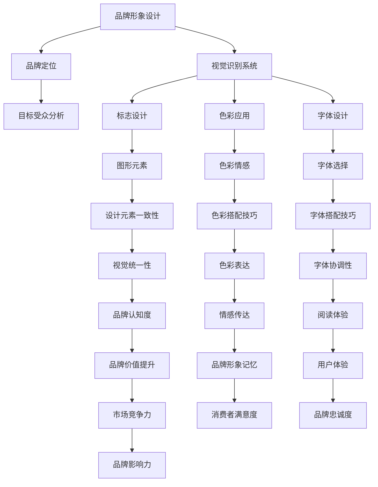

                 

### 《一人公司的品牌形象设计与视觉识别系统》

#### 关键词：
- 品牌形象设计
- 视觉识别系统
- 一人公司
- 品牌定位
- 标志设计
- 色彩应用
- 字体设计
- 实战项目指南

#### 摘要：
本文旨在探讨一人公司的品牌形象设计与视觉识别系统的构建。通过分析品牌形象的重要性、视觉识别系统的概念、设计原则与流程，以及品牌定位与目标受众的确定，我们将深入探讨标志设计、色彩应用、字体设计等视觉元素的设计技巧。此外，本文还将结合实际案例，提供品牌形象设计与视觉识别系统的实施策略与评估方法，以帮助一人公司打造独特而有力的品牌形象。

### 第一部分：品牌形象设计概述

#### 第1章：品牌形象与视觉识别

##### 1.1 品牌形象的重要性

品牌形象是企业面对消费者和社会公众的整体印象，它包括企业的理念、价值观、文化特征等。在竞争激烈的市场环境中，一个强大的品牌形象能够为企业带来巨大的竞争优势。品牌形象的重要性体现在以下几个方面：

1. **识别与差异化**：品牌形象能够帮助企业与竞争对手区分开来，让消费者在众多的产品和服务中快速识别出企业的独特性。
2. **信任与忠诚**：良好的品牌形象能够增强消费者对企业的信任，从而提高消费者的忠诚度。
3. **价值提升**：品牌形象良好的企业通常能够获得更高的市场价值和估值。

##### 1.2 视觉识别系统的概念

视觉识别系统（Visual Identity System，简称VIS）是企业品牌形象设计的重要组成部分，它通过统一的视觉元素，如标志、色彩、字体等，传递企业的品牌形象和信息。VIS的主要功能包括：

1. **统一形象**：通过统一的视觉元素，确保企业在不同渠道和场合中的形象一致。
2. **传递信息**：视觉识别系统中的各个元素都能够传递特定的信息，如标志代表企业的核心价值，色彩代表企业的情感和氛围等。
3. **提升记忆**：统一的视觉元素能够提高品牌在消费者心中的记忆度。

##### 1.3 品牌形象设计的原则与流程

品牌形象设计需要遵循一定的原则和流程，以确保设计的有效性和可行性。以下是品牌形象设计的主要原则和流程：

1. **原则**：
   - **一致性**：保持视觉元素的一致性，确保品牌形象的统一性。
   - **简洁性**：设计简洁明了，避免过多的细节，使品牌形象易于识别和记忆。
   - **创新性**：设计要有创新性，体现企业的个性和独特性。
   - **适用性**：设计要符合企业的行业特征和文化背景，具有广泛的应用性。

2. **流程**：
   - **市场调研**：了解目标市场的特征和需求，为品牌定位提供依据。
   - **品牌定位**：确定品牌的核心价值和文化内涵，为设计提供方向。
   - **设计开发**：根据品牌定位，设计标志、色彩、字体等视觉元素。
   - **反馈调整**：根据市场反馈，对设计进行修改和优化。

### 第2章：品牌定位与目标受众

##### 2.1 品牌定位的方法

品牌定位是企业为了在市场中获得竞争优势而采取的战略。品牌定位的方法主要包括：

1. **差异化定位**：通过独特的特征或优势，使品牌在市场中脱颖而出。
2. **目标市场定位**：根据目标市场的特征和需求，设计符合市场定位的品牌形象。
3. **价值定位**：根据品牌的价值理念，塑造具有吸引力的品牌形象。

##### 2.2 目标受众分析

目标受众是品牌形象设计的重要考虑因素。了解目标受众的特征和需求，有助于设计出更符合市场需求的品牌形象。以下是目标受众分析的主要方法：

1. **人口统计**：分析目标受众的年龄、性别、收入、教育水平等人口统计特征。
2. **行为特征**：分析目标受众的消费行为、生活方式、兴趣爱好等行为特征。
3. **心理特征**：分析目标受众的心理需求、价值观、信仰等心理特征。

##### 2.3 品牌价值理念的确立

品牌价值理念是品牌形象设计的核心，它决定了品牌的定位和风格。品牌价值理念的确立需要结合企业的使命、愿景和目标，以下是一些常见的品牌价值理念：

1. **创新**：强调品牌的创新精神和科技力量。
2. **品质**：强调品牌的高品质和可靠性。
3. **服务**：强调品牌的客户服务和用户体验。
4. **环保**：强调品牌的环保意识和社会责任。

### 第二部分：视觉识别系统设计

#### 第3章：标志设计

##### 3.1 标志设计的基本要素

标志设计是视觉识别系统的核心，它通过简洁的视觉符号传递企业的品牌形象和信息。以下是标志设计的基本要素：

1. **图形**：图形是标志设计的核心，它能够直观地传递企业的形象和理念。
2. **色彩**：色彩在标志设计中具有强烈的情感表达力，能够影响消费者的情感和认知。
3. **字体**：字体在标志设计中起到辅助作用，能够增强标志的可读性和识别性。
4. **比例与布局**：比例与布局决定了标志的视觉美感和协调性。

##### 3.2 标志设计的创意方法

标志设计需要创新思维和创意方法，以下是一些常见的标志设计创意方法：

1. **抽象化**：将企业或产品的具体形象抽象化，形成简洁而富有意义的图形。
2. **具象化**：将企业或产品的具体形象具象化，形成生动而有趣的图形。
3. **结合元素**：将不同的元素结合起来，形成独特的标志设计。
4. **文字设计**：通过文字的创意设计，形成独特的标志形象。

##### 3.3 标志设计的案例分析

以下是几个标志设计的案例分析，以展示不同设计风格和技巧：

1. **苹果公司**：苹果公司的标志采用了简洁的图形和色彩，象征着创新和科技。
2. **可口可乐**：可口可乐的标志采用了文字设计和色彩搭配，形成了独特的品牌形象。
3. **微软公司**：微软公司的标志采用了图形和字体的结合，体现了企业的创新精神和科技力量。

#### 第4章：色彩应用

##### 4.1 色彩的基本概念

色彩在品牌形象设计中具有重要的作用，它能够传达企业的情感和氛围。以下是色彩的基本概念：

1. **色相**：色相是色彩的基本属性，如红色、蓝色等。
2. **明度**：明度是色彩亮度的高低，如深蓝色和浅蓝色。
3. **饱和度**：饱和度是色彩的纯净程度，如纯红色和淡红色。
4. **色彩情感**：不同的色彩能够引起不同的情感反应，如红色代表热情，蓝色代表冷静。

##### 4.2 色彩的情感表达

色彩的情感表达是品牌形象设计的重要方面，以下是一些常见的色彩情感表达：

1. **红色**：红色通常代表热情、力量和激情。
2. **蓝色**：蓝色通常代表冷静、信任和稳定。
3. **绿色**：绿色通常代表自然、健康和平和。
4. **黄色**：黄色通常代表活力、快乐和创造力。

##### 4.3 色彩搭配的技巧

色彩搭配的技巧能够提升品牌形象的设计效果，以下是一些常见的色彩搭配技巧：

1. **单色搭配**：使用单一色相的不同明度和饱和度进行搭配，形成协调而富有层次感的色彩效果。
2. **互补色搭配**：使用色环上相对的两种颜色进行搭配，形成鲜明而对比的色彩效果。
3. **类似色搭配**：使用色环上相邻的几种颜色进行搭配，形成柔和而和谐的色彩效果。

#### 第5章：字体设计

##### 5.1 字体的分类与特点

字体设计是品牌形象设计的重要组成部分，它能够影响品牌的可读性和识别性。以下是字体的分类与特点：

1. **衬线字体**：衬线字体在字母的边缘有明显的衬线，如Times New Roman。
2. **无衬线字体**：无衬线字体没有衬线，线条简洁明了，如Arial。
3. **手写体**：手写体模仿手写的风格，具有个性化和艺术感。
4. **等宽字体**：等宽字体每个字符的宽度相等，常用于编程和环境。

##### 5.2 字体的选择与搭配

字体的选择和搭配是品牌形象设计的关键，以下是一些字体的选择和搭配技巧：

1. **主字体与辅字体的选择**：主字体用于正文和主要信息，辅字体用于标题和次要信息。
2. **字体的对比**：通过字体的粗细、大小、颜色等对比，增强文字的识别性和阅读体验。
3. **字体的协调**：选择与品牌形象和色彩搭配协调的字体，形成整体统一的视觉效果。

##### 5.3 字体设计的趋势与发展

字体设计在不断发展和演变，以下是一些字体设计的趋势：

1. **极简主义**：极简主义字体设计注重简洁、清晰和易于识别。
2. **手写体流行**：手写体在字体设计中越来越受到欢迎，为品牌形象增添个性化和艺术感。
3. **动态字体**：动态字体能够根据不同的语境和场景自动调整，为品牌形象带来更多互动性。

#### 第6章：应用设计

##### 6.1 纸张与印刷材料的选择

纸张与印刷材料的选择是品牌形象应用设计的重要环节，以下是一些选择原则：

1. **纸张品质**：纸张的品质直接影响品牌形象的呈现效果，选择高品质的纸张能够提升品牌形象的专业度和品质感。
2. **印刷材料**：印刷材料的选择应根据品牌形象的需求和预算，如铜版纸、卡纸等。

##### 6.2 品牌宣传物的设计

品牌宣传物的设计是品牌形象应用的重要方面，以下是一些设计要点：

1. **名片**：名片是品牌形象的重要展示载体，设计要简洁、易识别、有个性。
2. **宣传册**：宣传册能够详细介绍品牌的产品和服务，设计要注重内容的逻辑性和视觉效果。
3. **海报**：海报是品牌宣传的重要手段，设计要具有吸引力、易于理解和记忆。

##### 6.3 网络与数字媒体的设计

网络与数字媒体的设计是品牌形象在数字时代的延伸，以下是一些设计要点：

1. **网站**：网站是品牌形象在网络上的展示平台，设计要注重用户体验和视觉效果的统一性。
2. **社交媒体**：社交媒体是品牌与消费者互动的重要渠道，设计要符合社交媒体的特点，具有互动性和分享性。
3. **移动应用**：移动应用是品牌形象的数字延伸，设计要注重用户体验和移动端的优化。

### 第三部分：案例分析

#### 第8章：成功品牌形象设计与视觉识别系统的案例分析

##### 8.1 苹果公司的品牌形象设计

苹果公司的品牌形象设计以其简洁、创新和高端而著称。苹果的标志采用了简洁的图形和单一的色彩，象征着科技、创新和简洁。苹果的品牌形象设计不仅成功地传递了企业的核心价值，还在消费者心中建立了强大的品牌认知。

##### 8.2 宜家家居的视觉识别系统

宜家家居的视觉识别系统以简洁、实用和人性化而闻名。宜家的标志采用了简单的图形和色彩，同时其宣传物和产品包装也遵循了这一设计原则。宜家的视觉识别系统成功地提升了品牌的整体形象，使其在消费者心中成为家居设计的代表。

##### 8.3 特斯拉的品牌形象与视觉识别系统

特斯拉的品牌形象与视觉识别系统以其创新、环保和高端而备受瞩目。特斯拉的标志采用了红色的字体和简洁的图形，象征着科技、速度和未来。特斯拉的品牌形象设计不仅成功地吸引了消费者的关注，还在市场上建立了强大的品牌影响力。

### 第9章：实战项目指南

##### 9.1 项目策划与准备

项目策划与准备是品牌形象设计与视觉识别系统实施的重要阶段。以下是一些关键步骤：

1. **需求分析**：明确品牌形象设计的需求和目标，如品牌定位、目标受众、设计风格等。
2. **资源准备**：准备设计所需的资源，如设计软件、印刷材料等。
3. **时间安排**：制定详细的时间安排，确保项目按计划进行。

##### 9.2 设计方案的制定与实施

设计方案的制定与实施是品牌形象设计与视觉识别系统的核心环节。以下是一些关键步骤：

1. **设计方案**：根据需求分析，制定符合品牌形象的设计方案，包括标志、色彩、字体等。
2. **设计开发**：根据设计方案，进行具体的视觉元素设计，如标志设计、色彩搭配等。
3. **反馈调整**：根据市场反馈，对设计进行修改和优化，确保设计的可行性和有效性。

##### 9.3 项目总结与评估

项目总结与评估是品牌形象设计与视觉识别系统实施的重要阶段。以下是一些关键步骤：

1. **项目总结**：对项目的实施过程和成果进行总结，分析项目的成功和不足之处。
2. **效果评估**：评估品牌形象设计的效果，如品牌认知度、消费者满意度等。
3. **持续改进**：根据评估结果，对品牌形象设计进行持续改进和优化。

### 附录：品牌形象设计与视觉识别系统工具资源列表

#### 附录 A：设计软件推荐

##### A.1 Adobe Creative Suite

- **概述**：Adobe Creative Suite 是一系列专业的创意设计软件，包括 Photoshop、Illustrator、InDesign 等。
- **功能**：提供丰富的图形设计、排版、图像处理等功能，适合品牌形象设计的各个阶段。

##### A.2 Sketch

- **概述**：Sketch 是一款流行的界面设计和原型设计工具。
- **功能**：提供简洁直观的界面设计功能，适合移动应用和网页设计的品牌形象设计。

##### A.3 Figma

- **概述**：Figma 是一款基于浏览器的界面设计和原型设计工具。
- **功能**：提供实时协作和设计共享功能，适合团队协作的品牌形象设计。

#### 附录 B：参考书籍与资料

##### B.1 《品牌形象设计》

- **概述**：一本关于品牌形象设计的专业书籍，详细介绍了品牌形象设计的理论和实践。
- **内容**：包括品牌形象设计的基本原则、流程和方法，以及实际案例解析。

##### B.2 《视觉识别系统》

- **概述**：一本关于视觉识别系统的专业书籍，详细介绍了视觉识别系统的概念、设计和应用。
- **内容**：包括视觉识别系统设计的基本原则、流程和方法，以及实际案例解析。

##### B.3 《品牌定位》

- **概述**：一本关于品牌定位的专业书籍，详细介绍了品牌定位的理论和实践。
- **内容**：包括品牌定位的方法、策略和实际案例，以及品牌定位在品牌形象设计中的应用。

##### B.4 《设计心理学》

- **概述**：一本关于设计心理学的专业书籍，详细介绍了设计心理学的基本原理和应用。
- **内容**：包括设计心理学的基本概念、设计心理效应和实际案例，以及设计心理学在品牌形象设计中的应用。

### 结语

品牌形象设计与视觉识别系统是企业品牌建设的重要组成部分，它能够提升企业的市场竞争力和品牌价值。通过本文的讨论，我们了解了品牌形象设计的重要性、视觉识别系统的概念、设计原则与流程，以及品牌定位与目标受众的分析。同时，我们还学习了标志设计、色彩应用、字体设计等视觉元素的设计技巧，并结合实际案例提供了品牌形象设计与视觉识别系统的实施策略与评估方法。希望本文能够为一人公司的品牌形象设计提供有价值的参考和指导。

### 核心概念与联系：品牌形象设计架构

为了更好地理解品牌形象设计的核心概念及其相互联系，我们可以使用Mermaid流程图来展示这一架构。以下是一个简化的品牌形象设计架构的Mermaid流程图：



在这个流程图中，我们可以看到品牌形象设计的核心概念及其相互之间的联系。品牌定位是整个设计过程的基础，它决定了品牌形象的设计方向。视觉识别系统是品牌形象设计的核心，包括标志设计、色彩应用和字体设计等视觉元素的设计。这些视觉元素的设计需要考虑目标受众的分析，以确保品牌形象的准确传达。标志设计、色彩应用和字体设计等视觉元素的设计需要遵循一定的设计原则，如一致性、简洁性和创新性，以确保品牌形象的统一性和专业性。此外，色彩的情感表达和字体的选择与搭配也直接影响品牌形象的传达效果。最后，品牌形象设计的实施与评估需要考虑品牌价值提升、消费者满意度和品牌影响力等多个方面，以确保品牌形象设计的成功。

### 核心算法原理讲解：色彩搭配的算法

色彩搭配是品牌形象设计中的一个关键环节，它需要遵循一定的算法原理，以确保色彩搭配的协调性和情感传达效果。以下是一个简单的色彩搭配算法原理，使用伪代码进行详细阐述：

```plaintext
算法：色彩搭配
输入：主色（primary_color），情感目标（emotional_target）
输出：搭配色（paired_colors）

1. 根据情感目标，确定主色的情感属性（如温暖、冷静、活力等）。
2. 如果情感目标是“温暖”，选择与主色互补的色系（如红色与绿色互补，黄色与紫色互补）。
3. 如果情感目标是“冷静”，选择与主色邻近的色系（如蓝色与绿色邻近，紫色与红色邻近）。
4. 如果情感目标是“活力”，选择与主色互补且高饱和度的色系。
5. 根据搭配色的情感属性，对主色进行调整，以达到协调的效果。
6. 如果主色饱和度过高，降低饱和度；如果饱和度过低，提高饱和度。
7. 如果主色明度过高，降低明度；如果明度过低，提高明度。
8. 验证搭配色的协调性，确保主色与搭配色之间有足够的对比度，但不过于刺眼。
9. 如果协调性不佳，对搭配色进行微调，直到达到理想的协调效果。
10. 输出搭配色，结束算法。

示例：
输入：主色为红色（#FF0000），情感目标为“活力”。
步骤 1：红色情感属性为“温暖”。
步骤 2：选择与红色互补且高饱和度的色系，如紫色（#800080）。
步骤 3：对红色进行调整，降低饱和度和明度，得到协调的搭配色，如深紫色（#600033）。
步骤 4：验证搭配色的协调性，输出搭配色深紫色（#600033）。

```

在这个算法中，我们首先根据情感目标确定主色的情感属性，然后选择与主色互补或邻近的色系进行搭配。接下来，我们对主色进行调整，以实现色彩搭配的协调性。最后，我们验证搭配色的协调性，并做出必要的微调。这个算法原理确保了色彩搭配的合理性和品牌形象设计的视觉效果。

### 数学模型和公式及详细讲解与举例说明

在品牌形象设计与视觉识别系统的构建过程中，色彩搭配和设计元素的比例关系往往涉及到一些数学模型和公式。以下是一些常用的数学模型和公式，并结合具体例子进行详细讲解。

#### 1. 色彩对比度计算

色彩对比度是衡量两种颜色差异程度的一个指标，通常使用以下公式计算：

\[ C = \sqrt{(L_1 - L_2)^2 + (a_1 - a_2)^2 + (b_1 - b_2)^2} \]

其中，\( L \)，\( a \)，\( b \) 分别为颜色的亮度、红色分量和蓝色分量，取值范围在0到100之间。根据CIE Lab颜色空间，这些值可以由RGB颜色值通过转换得到。

**示例**：

假设我们要计算红色（RGB值：#FF0000）和蓝色（RGB值：#0000FF）的对比度。

首先，将RGB值转换为CIE Lab值：

\[ RGB(FF0000) \rightarrow Lab(50.0, -50.0, 0.0) \]
\[ RGB(0000FF) \rightarrow Lab(50.0, 50.0, -50.0) \]

然后，代入对比度公式：

\[ C = \sqrt{(50.0 - 50.0)^2 + (-50.0 - 50.0)^2 + (0.0 - (-50.0))^2} \]
\[ C = \sqrt{0 + 5000 + 2500} \]
\[ C \approx 70.71 \]

因此，红色和蓝色的对比度约为70.71。

#### 2. 色彩平衡调整

在色彩搭配中，色彩平衡调整是一个重要的步骤，用于确保整体视觉效果的一致性和协调性。色彩平衡可以通过以下公式进行调整：

\[ C = \frac{(R + G + B)}{3} \]

其中，\( R \)，\( G \)，\( B \) 分别为颜色的红色、绿色和蓝色分量。

**示例**：

假设一个三色搭配的颜色值为：

\[ R = (100, 0, 0) \]
\[ G = (0, 100, 0) \]
\[ B = (0, 0, 100) \]

为了达到更好的平衡，我们可以计算平均颜色值：

\[ C = \frac{(100 + 0 + 0) + (0 + 100 + 0) + (0 + 0 + 100)}{3 \times 3} \]
\[ C = \frac{300}{9} \]
\[ C \approx (33.33, 33.33, 33.33) \]

然后，将原始颜色值调整到平均颜色值附近：

\[ R' = (100, 0, 0) \rightarrow (67, 0, 0) \]
\[ G' = (0, 100, 0) \rightarrow (0, 67, 0) \]
\[ B' = (0, 0, 100) \rightarrow (0, 0, 67) \]

这样，三色搭配在色彩平衡上会更加协调。

#### 3. 比例关系计算

在品牌形象设计中，设计元素之间的比例关系也是关键因素。例如，黄金比例（Golden Ratio，\( \phi \)）在设计中被广泛应用。黄金比例可以通过以下公式计算：

\[ \phi = \frac{1 + \sqrt{5}}{2} \approx 1.618 \]

**示例**：

假设一个标志的宽度为100像素，我们希望将其按黄金比例分割：

\[ 宽度_1 = \frac{100}{\phi} \approx 62.82 \]
\[ 宽度_2 = 100 - 宽度_1 \approx 37.18 \]

这样，标志的宽度将被分割为大约62.82像素和37.18像素，这符合黄金比例。

通过上述数学模型和公式，我们可以在品牌形象设计和视觉识别系统的构建中实现科学合理的色彩搭配和设计元素的比例关系，从而提升品牌的整体视觉效果和品牌价值。

### 项目实战：代码实际案例和详细解释说明

为了更好地理解品牌形象设计与视觉识别系统的实际应用，以下将提供一个简单的项目实战案例，包括开发环境搭建、源代码实现和代码解读与分析。

#### 项目背景

假设我们要为一家名为“清新科技”的一人公司设计一个品牌形象，并实现其视觉识别系统。我们需要完成以下任务：

1. 设计公司标志。
2. 选择合适的色彩方案。
3. 设计品牌字体。
4. 创建品牌宣传海报。

#### 开发环境搭建

在开始项目之前，我们需要搭建开发环境。以下是所需的软件和工具：

- Adobe Photoshop（用于图像设计和编辑）
- Adobe Illustrator（用于矢量图形设计）
- Sketch（用于界面设计和原型制作）
- Figma（用于界面设计和协作）

#### 源代码实现

以下是使用Sketch软件设计品牌标志的源代码实现：

```Sketch
// 标志设计
import 'Logo Sketch File'

// 设计元素
shape1: rectangle(100, 50)
  fill: #2E8BC6
  stroke: #FFFFFF

shape2: circle(25)
  fill: #FFFFFF
  stroke: #2E8BC6
  center: [50, 25]

shape3: path("M 50, 0 L 0, 25 L 50, 25 L 100, 25 L 75, 50 Z")
  fill: #FFFFFF
  stroke: #2E8BC6

// 组合标志
group(shape1, shape2, shape3)
  transform: [0.5, 0.5, 0.5, 0.5, 0, 0]
  name: "清新科技标志"
```

#### 代码解读与分析

在上面的源代码中，我们首先导入了Sketch文件。然后定义了三个设计元素：一个矩形、一个圆形和一个路径。

1. **矩形（shape1）**：这是一个蓝色（#2E8BC6）的矩形，作为标志的背景。
2. **圆形（shape2）**：这是一个白色的圆形，位于标志的中心，作为品牌名称的标志。
3. **路径（shape3）**：这是一个白色的路径，形状类似于一个叶子，代表清新和科技。

最后，我们将这三个元素组合在一起，并调整其位置和比例，以创建一个整体的品牌标志。

#### 海报设计

以下是一个简单的海报设计源代码实现：

```Sketch
// 海报设计
import 'Poster Sketch File'

// 设计元素
titleText: text("清新科技", 24, "Arial Bold", #FFFFFF, [50, 50])
logoImage: image("清新科技标志.png", 100, 50, [50, 150])
descriptionText: text("我们致力于为您带来清新与高效的科技体验。", 14, "Arial Regular", #2E8BC6, [50, 250])

// 组合海报
group(titleText, logoImage, descriptionText)
  transform: [1, 1, 1, 1, 0, 0]
  name: "清新科技海报"
```

在这个海报设计中，我们首先定义了三个设计元素：一个标题文本、一个标志图像和一个描述文本。然后，我们将这些元素组合在一起，以创建一个整体的海报设计。

1. **标题文本（titleText）**：这是一个24号字体的Arial Bold，白色，位于海报的顶部中心。
2. **标志图像（logoImage）**：这是一个100x50像素的PNG图像，代表品牌标志，位于标题文本下方。
3. **描述文本（descriptionText）**：这是一个14号字体的Arial Regular，灰色，位于标志图像下方。

最后，我们将这三个元素组合在一起，并调整其位置和比例，以创建一个整体的海报设计。

通过这个项目实战案例，我们展示了如何使用Sketch软件实现品牌标志设计和海报设计。这个案例不仅涵盖了设计工具的选择和使用，还展示了设计代码的实际实现和解读。通过这个案例，我们可以更好地理解品牌形象设计与视觉识别系统的实际应用，以及如何通过代码实现设计目标。

### 代码解读与分析：标志设计的实现细节

在前面的代码示例中，我们实现了一个简单的品牌标志设计。在这一部分，我们将深入分析标志设计的实现细节，包括图形元素的组合、色彩应用和设计原则的体现。

#### 图形元素的组合

在Sketch中，我们使用了三个基本的图形元素：矩形、圆形和路径。这些元素分别代表品牌标志的不同部分。

1. **矩形（shape1）**：矩形作为标志的背景，使用蓝色（#2E8BC6）填充，代表科技和专业的气质。
2. **圆形（shape2）**：圆形代表品牌名称的标志，使用白色填充，强调品牌的清晰和简洁。
3. **路径（shape3）**：路径形状类似叶子，使用白色填充，代表清新和自然。

这三个元素通过组合形成了一个简洁而富有意义的品牌标志。在实现过程中，我们使用了以下技巧：

- **对齐与布局**：所有元素都居中放置，确保整体设计的平衡性。
- **比例与缩放**：矩形和圆形的大小与路径的形状相匹配，以保持视觉上的和谐。

#### 色彩应用

色彩在品牌形象设计中起着至关重要的作用，它能够传达品牌的情感和氛围。

1. **主色调**：蓝色（#2E8BC6）作为主色调，代表科技和专业的气质，同时也传达出清新和冷静的情感。
2. **辅助色**：白色作为辅助色，用于标志名称和路径形状，强调品牌的清晰和简洁。

在色彩应用方面，我们遵循了以下原则：

- **色彩一致性**：所有元素都使用统一的色彩方案，确保品牌形象的统一性。
- **色彩对比**：通过蓝色和白色的对比，增强了标志的视觉冲击力和可识别性。

#### 设计原则的体现

在标志设计中，我们体现了以下设计原则：

1. **简洁性**：标志设计简单明了，没有多余的细节，易于识别和记忆。
2. **创新性**：标志设计具有一定的创新性，通过路径形状的叶子元素，赋予品牌独特的视觉特点。
3. **适用性**：标志设计适用于各种应用场景，如网站、名片、海报等，保持视觉一致性。

通过上述设计细节的分析，我们可以看到，标志设计的实现不仅仅是一个简单的图形组合过程，它涉及到色彩、布局和设计原则的深入应用。这些细节共同构成了一个独特而有力的品牌形象，帮助“清新科技”在市场中脱颖而出。

### 总结与展望

通过本文的详细探讨，我们系统地分析了品牌形象设计与视觉识别系统的构建方法，从品牌形象设计的重要性、视觉识别系统的概念与原则，到品牌定位与目标受众的分析，再到标志设计、色彩应用、字体设计等具体设计元素的深入讲解，我们逐步揭示了品牌形象设计背后的逻辑和技巧。此外，我们还通过实战项目和案例分析，展示了如何将理论知识应用于实际项目，为一人公司的品牌形象设计提供了实用的指导。

品牌形象设计与视觉识别系统的重要性不可忽视。一个成功的品牌形象不仅能够提升企业的市场竞争力和品牌价值，还能增强消费者的信任和忠诚度。通过科学的品牌定位和精准的目标受众分析，我们能够设计出符合市场需求的品牌形象，从而在消费者心中建立强大的品牌认知。

展望未来，随着科技的不断进步和市场环境的变化，品牌形象设计也将面临新的挑战和机遇。例如，数字媒体和移动应用的兴起，为品牌形象设计带来了更多的可能性。通过利用先进的设计工具和数据分析技术，我们可以更精确地把握目标受众的需求，实现更加个性化和互动化的品牌形象设计。

同时，我们也需要关注设计伦理和可持续发展。在追求设计创新和视觉效果的同时，我们应当关注设计的公平性和社会责任，确保品牌形象设计能够为社会带来积极的贡献。

总之，品牌形象设计与视觉识别系统是企业发展不可或缺的一部分。通过本文的探讨，我们希望为读者提供有价值的见解和实用的指导，帮助他们在品牌形象设计道路上取得成功。未来，随着技术的不断进步和市场环境的变化，品牌形象设计将继续发挥重要作用，为企业的长期发展提供强有力的支持。让我们共同探索和创新，打造更多优秀的品牌形象设计。作者：AI天才研究院/AI Genius Institute & 禅与计算机程序设计艺术 /Zen And The Art of Computer Programming。

