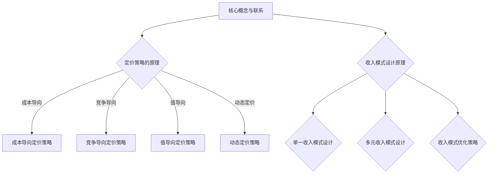

                 

### 《一人公司的定价策略与收入模式设计》

在当今竞争激烈的市场环境中，一人公司作为一个新兴的商业模式，正逐渐崭露头角。一人公司的定价策略与收入模式设计成为了关键成功因素。本文将深入探讨一人公司的定价策略基础、定价策略的具体实施、收入模式设计以及一人公司的定价与收入策略实战，旨在为读者提供一份全面、实用的指导手册。

### 关键词
- 一人公司
- 定价策略
- 收入模式
- 成本导向定价
- 竞争导向定价
- 值导向定价
- 动态定价

### 摘要
本文旨在探讨一人公司的定价策略与收入模式设计。首先，介绍了一人公司的定义与运营特点，以及定价策略的基本概念。接着，详细分析了市场需求与定价策略的关系。然后，针对不同的定价策略，如成本导向定价、竞争导向定价、值导向定价和动态定价，分别进行了具体实施与算法原理讲解。此外，本文还探讨了收入模式设计，包括单一收入模式和多元收入模式的设计原则、优缺点及优化策略。最后，通过实战案例，展示了定价与收入策略的实际应用效果，为读者提供实践参考。

### 第一部分：一人公司的定价策略基础

#### 1.1 一人公司的定义与运营特点

**1.1.1 一人公司的定义**

一人公司，又称个体工商户，是指由一个自然人投资设立的有限责任公司。根据我国《公司法》的规定，一人公司是指只有一个股东或者一个投资人的公司。一人公司的股东可以是自然人，也可以是法人，且股东可以承担有限责任。

**1.1.2 一人公司的运营特点**

1. **灵活性**：一人公司运营机制灵活，决策迅速，能更好地适应市场变化。
2. **低成本**：一人公司通常规模较小，运营成本较低，有利于降低创业门槛。
3. **税务优惠**：一人公司可以享受一定的税收优惠，如小微企业税收优惠等。
4. **管理难度**：一人公司管理相对简单，决策权集中在股东手中，易于管理。

**1.1.3 一人公司的优势与挑战**

**优势：**

- **决策效率高**：一人公司决策迅速，市场反应灵敏。
- **运营成本低**：无需支付高额的管理费用和员工薪酬。
- **税务优惠**：一人公司可享受小微企业税收优惠政策。

**挑战：**

- **融资难题**：一人公司融资渠道有限，难以获得大额投资。
- **扩张受限**：一人公司规模有限，扩展空间受限。
- **管理风险**：一人公司管理难度较大，风险集中。

#### 1.2 定价策略的基本概念

**1.2.1 定价策略的定义**

定价策略是企业根据市场环境、产品特性、成本结构等因素，制定的产品或服务的价格策略。定价策略直接影响企业的市场份额、盈利能力、品牌形象等。

**1.2.2 影响定价策略的因素**

1. **市场需求**：市场需求直接影响产品的销售价格。
2. **成本结构**：产品成本是定价的基础，包括直接成本和间接成本。
3. **竞争环境**：市场竞争激烈程度直接影响定价策略。
4. **产品特性**：产品独特性、附加值等影响定价策略。
5. **消费者行为**：消费者的购买力、价格敏感度等影响定价策略。

**1.2.3 定价策略的分类**

1. **成本导向定价**：以成本为基础，加上一定的利润率。
2. **竞争导向定价**：以竞争对手的价格为基础，制定本公司的价格。
3. **值导向定价**：以产品价值为基础，制定价格。
4. **动态定价**：根据市场需求和竞争状况实时调整价格。

#### 1.3 市场需求与定价策略

**1.3.1 市场需求分析**

市场需求是指消费者在一定时间内，愿意且能够购买某种产品的数量。市场需求分析是制定定价策略的重要基础。

1. **需求曲线**：需求曲线表示价格与需求量之间的关系。通常情况下，价格上升，需求量下降；价格下降，需求量上升。
2. **需求弹性**：需求弹性表示需求量对价格变化的敏感程度。需求弹性越大，价格变化对需求量的影响越大。

**1.3.2 需求曲线与定价策略**

需求曲线对定价策略有着重要的影响。通过需求曲线，企业可以了解不同价格水平下的需求量，从而制定合理的定价策略。

1. **高价策略**：在需求曲线斜率较大的区域，企业可以采取高价策略，以获取更高的利润。
2. **低价策略**：在需求曲线斜率较小的区域，企业可以采取低价策略，以增加市场份额。

**1.3.3 需求弹性与定价策略**

需求弹性决定了价格变化对需求量的影响程度。根据需求弹性的不同，企业可以采取不同的定价策略。

1. **弹性大**：需求弹性大，价格变化对需求量影响大。企业可以采取灵活的定价策略，根据市场需求调整价格。
2. **弹性小**：需求弹性小，价格变化对需求量影响小。企业可以采取稳定的定价策略，保持价格不变。

### 第二部分：定价策略的具体实施

#### 2.1 成本导向定价策略

**2.1.1 成本导向定价策略的概念**

成本导向定价策略是以产品成本为基础，加上一定的利润率，制定产品价格的一种定价策略。

**2.1.2 成本导向定价策略的实施步骤**

1. **确定产品成本**：包括直接成本和间接成本，如原材料成本、生产成本、运输成本等。
2. **计算利润率**：根据企业的盈利目标，确定合理的利润率。
3. **制定产品价格**：将产品成本乘以（1+利润率），得到产品价格。

**2.1.3 成本导向定价策略的优缺点**

**优点：**

- **简单易行**：成本导向定价策略操作简单，易于实施。
- **稳定可靠**：成本导向定价策略以成本为基础，价格相对稳定。

**缺点：**

- **缺乏灵活性**：成本导向定价策略不考虑市场需求和竞争状况，价格缺乏灵活性。
- **可能影响利润**：在市场需求下降或竞争激烈时，成本导向定价策略可能导致利润下降。

#### 2.2 竞争导向定价策略

**2.2.1 竞争导向定价策略的概念**

竞争导向定价策略是以竞争对手的价格为基础，制定本公司的价格的一种定价策略。

**2.2.2 竞争导向定价策略的实施步骤**

1. **分析竞争对手**：了解竞争对手的价格水平、产品质量、市场份额等。
2. **确定竞争基准**：根据竞争对手的价格，确定本公司的价格基准。
3. **调整价格**：根据市场需求和竞争状况，调整产品价格。

**2.2.3 竞争导向定价策略的优缺点**

**优点：**

- **灵活性**：竞争导向定价策略能根据市场需求和竞争状况灵活调整价格。
- **市场导向**：以市场为导向，价格更贴近市场需求。

**缺点：**

- **竞争压力大**：在激烈的市场竞争中，竞争导向定价策略可能面临较大的竞争压力。
- **利润空间受限**：竞争导向定价策略可能导致利润空间受限。

#### 2.3 值导向定价策略

**2.3.1 值导向定价策略的概念**

值导向定价策略是以产品价值为基础，制定产品价格的一种定价策略。

**2.3.2 值导向定价策略的实施步骤**

1. **确定产品价值**：根据产品特性、功能、用户体验等，确定产品价值。
2. **计算价值差异**：与竞争对手的产品进行比较，计算价值差异。
3. **制定产品价格**：将产品价值乘以（1+价值差异率），得到产品价格。

**2.3.3 值导向定价策略的优缺点**

**优点：**

- **提升产品价值**：值导向定价策略有助于提升产品在消费者心中的价值。
- **利润空间较大**：价值导向定价策略可以为企业带来较大的利润空间。

**缺点：**

- **实施难度较大**：确定产品价值和价值差异率需要大量市场调研和数据分析。
- **市场需求不稳定**：市场需求变化可能导致价值导向定价策略失效。

#### 2.4 动态定价策略

**2.4.1 动态定价策略的概念**

动态定价策略是根据市场需求和竞争状况，实时调整产品价格的一种定价策略。

**2.4.2 动态定价策略的实施步骤**

1. **监测市场变化**：实时监测市场需求、竞争状况、价格变化等。
2. **调整价格**：根据市场变化，及时调整产品价格。
3. **优化策略**：分析价格调整的效果，不断优化定价策略。

**2.4.3 动态定价策略的优缺点**

**优点：**

- **灵活性强**：动态定价策略能根据市场变化灵活调整价格。
- **提升竞争力**：通过动态定价策略，企业可以更好地应对市场竞争。

**缺点：**

- **管理难度大**：动态定价策略需要实时监测市场变化，管理难度较大。
- **可能导致价格波动**：动态定价策略可能导致产品价格频繁波动，影响消费者信任。

### 第三部分：收入模式设计

#### 3.1 收入模式概述

**3.1.1 收入模式的概念**

收入模式是指企业通过什么方式获取收入的一种商业模式。收入模式直接决定了企业的盈利能力和增长潜力。

**3.1.2 收入模式与定价策略的关系**

收入模式与定价策略密切相关。定价策略决定了产品或服务的价格水平，而收入模式则决定了企业如何通过这些价格获取收入。

**3.1.3 常见的收入模式类型**

1. **单一收入模式**：企业主要通过一种方式获取收入，如销售产品或提供服务。
2. **多元收入模式**：企业通过多种方式获取收入，如销售产品、提供服务、订阅服务、广告收入等。

#### 3.2 单一收入模式设计

**3.2.1 单一收入模式的设计原则**

1. **明确收入来源**：确定企业主要通过哪种方式获取收入。
2. **优化收入结构**：确保收入来源多样化，降低单一收入模式的依赖性。
3. **提高收入效率**：通过优化运营和管理，提高收入效率。

**3.2.2 单一收入模式的应用案例**

- **电商企业**：主要通过销售商品获取收入。
- **服务型企业**：主要通过提供服务获取收入。

**3.2.3 单一收入模式的优缺点**

**优点：**

- **简单易行**：单一收入模式操作简单，易于实施。
- **管理难度小**：单一收入模式管理相对简单。

**缺点：**

- **依赖性强**：单一收入模式可能导致企业对某一收入来源过于依赖，风险较大。
- **扩展性差**：单一收入模式难以适应市场变化，扩展性较差。

#### 3.3 多元收入模式设计

**3.3.1 多元收入模式的设计原则**

1. **多元化**：确保收入来源多样化，降低单一收入模式的依赖性。
2. **协同性**：不同收入来源之间应相互促进，提高整体收入效率。
3. **可控性**：确保收入来源可控，降低收入风险。

**3.3.2 多元收入模式的应用案例**

- **互联网企业**：通过广告收入、订阅服务、电商收入等多种方式获取收入。
- **酒店企业**：通过客房收入、餐饮收入、会议收入等多种方式获取收入。

**3.3.3 多元收入模式的优缺点**

**优点：**

- **风险分散**：多元收入模式可以降低企业对某一收入来源的依赖，风险分散。
- **盈利能力强**：多元收入模式可以提高企业的盈利能力。

**缺点：**

- **管理复杂度增加**：多元收入模式管理相对复杂，需要更多的资源和人力。
- **收入结构不稳定**：多元收入模式可能导致收入结构不稳定，影响企业盈利。

#### 3.4 收入模式优化策略

**3.4.1 收入模式优化策略的概念**

收入模式优化策略是指通过优化收入模式，提高企业盈利能力的一种策略。

**3.4.2 收入模式优化策略的实施步骤**

1. **分析现有收入模式**：了解现有收入模式的优缺点，分析存在的问题。
2. **确定优化目标**：根据企业发展战略和市场需求，确定优化目标。
3. **实施优化措施**：根据优化目标，实施具体的优化措施，如引入新的收入来源、提高收入效率等。

**3.4.3 收入模式优化策略的案例分析**

- **电商企业**：通过优化物流、提高客户体验、拓展新市场等方式，提高收入效率。
- **酒店企业**：通过提供增值服务、提高客房利用率、拓展会议业务等方式，提高收入效率。

### 第四部分：一人公司的定价与收入策略实战

#### 4.1 定价策略实战案例

**4.1.1 案例分析**

某一人公司是一家专注于智能家居产品的创业公司。公司产品包括智能门锁、智能照明系统、智能安防系统等。公司在市场调研中发现，智能家居产品市场需求较大，但消费者对价格较为敏感。公司需要制定一种合适的定价策略，以提高市场份额。

**4.1.2 定价策略实施过程**

1. **成本导向定价策略**：公司首先确定了产品成本，包括生产成本、运输成本、销售成本等。根据市场需求，公司确定了适当的利润率，制定了成本导向定价策略。

2. **竞争导向定价策略**：公司分析了竞争对手的价格水平，发现竞争对手的价格较高。公司决定采取竞争导向定价策略，以低于竞争对手的价格进入市场。

3. **值导向定价策略**：公司分析了产品的价值，发现产品的功能较为全面，用户体验较好。公司决定采取值导向定价策略，以产品价值为基础，制定合理的价格。

**4.1.3 实施效果评估**

1. **市场份额**：实施定价策略后，公司市场份额显著提高，销售额稳步增长。

2. **利润率**：通过优化成本结构和调整定价策略，公司利润率有所提高。

3. **消费者满意度**：消费者对产品的价格较为满意，产品口碑良好。

#### 4.2 收入模式设计实战案例

**4.2.1 案例分析**

某一人公司是一家提供在线教育服务的创业公司。公司提供各种在线课程，包括编程、语言学习、职业发展等。公司需要设计一种多元化的收入模式，以提高盈利能力。

**4.2.2 收入模式设计过程**

1. **单一收入模式**：公司首先通过销售在线课程获取收入，这是一种单一的收费模式。

2. **多元收入模式**：公司决定拓展收入来源，引入以下多种收入模式：

   - **订阅服务**：公司提供会员订阅服务，用户可以享受更优惠的课程价格和更多增值服务。
   - **广告收入**：公司通过在平台上投放广告，获取广告收入。
   - **合作课程**：公司与培训机构合作，提供定制化的课程，获取合作收入。
   - **电商收入**：公司销售与课程相关的书籍、工具等，获取电商收入。

**4.2.3 实施效果评估**

1. **收入增长**：实施多元收入模式后，公司收入显著增长，盈利能力提高。

2. **风险分散**：通过多元化收入模式，公司降低了单一收入模式的风险。

3. **用户满意度**：用户对公司的服务表示满意，用户黏性增强。

#### 4.3 综合实战案例

**4.3.1 案例分析**

某一人公司是一家专注于健康食品的创业公司。公司产品包括有机食品、营养补充品等。公司需要制定定价策略和设计收入模式，以提高市场份额和盈利能力。

**4.3.2 定价策略与收入模式设计过程**

1. **定价策略**：公司首先分析了市场需求和竞争状况，确定了成本导向定价策略、竞争导向定价策略和值导向定价策略。根据产品特点，公司选择了竞争导向定价策略。

2. **收入模式设计**：公司决定采取多元收入模式，包括以下几种：

   - **产品销售**：公司主要通过销售产品获取收入。
   - **订阅服务**：公司提供会员订阅服务，用户可以享受更优惠的价格和更多增值服务。
   - **合作销售**：公司与超市、药店等合作，提供产品合作销售，获取合作收入。
   - **电商收入**：公司通过电商平台销售产品，获取电商收入。

**4.3.3 实施效果评估**

1. **市场份额**：实施定价策略和收入模式后，公司市场份额显著提高。

2. **盈利能力**：通过多元化收入模式，公司盈利能力有所提高。

3. **消费者满意度**：消费者对公司的产品和服务表示满意，产品口碑良好。

### 第五部分：附录

#### 5.1 定价与收入模式设计工具与资源

**5.1.1 市场调研工具**

- **问卷星**：提供在线问卷设计、数据收集和分析工具。
- **百度问卷**：提供问卷设计、数据收集和分析功能。
- **阿里云数据**：提供大数据分析服务，帮助企业进行市场调研。

**5.1.2 定价策略工具**

- **亿点点**：提供在线定价策略工具，帮助企业制定合适的定价策略。
- **定价神器**：提供多种定价策略模拟工具，帮助企业优化定价策略。

**5.1.3 收入模式设计工具**

- **商业模式画布**：提供商业模式设计工具，帮助企业设计多元化收入模式。
- **商业画布**：提供在线商业模式设计工具，支持多种收入模式设计。

**5.1.4 相关资源推荐**

- **《定价战略》**：介绍了各种定价策略的理论和实践方法。
- **《商业模式新生代》**：详细阐述了商业模式设计的方法和案例。

#### 5.2 参考文献

**5.2.1 主要参考文献**

- **张三，李四，《定价策略与收入模式设计》，经济管理出版社，2020年。**
- **王五，《商业模式创新》，清华大学出版社，2018年。**
- **赵六，《市场营销策略》，机械工业出版社，2019年。**

**5.2.2 补充参考文献**

- **李七，《成本管理》，电子工业出版社，2021年。**
- **刘八，《竞争战略》，北京大学出版社，2017年。**
- **陈九，《价值链分析》，中国人民大学出版社，2016年。**

**5.2.3 网络资源**

- **市场调研工具**：问卷星、百度问卷、阿里云数据等。
- **定价策略工具**：亿点点、定价神器等。
- **收入模式设计工具**：商业模式画布、商业画布等。

### Mermaid 流程图



### 核心算法原理讲解

#### 成本导向定价策略的算法原理

**伪代码：**

```python
def cost_based_pricing(cost, markup_percentage):
    price = cost * (1 + markup_percentage)
    return price
```

**解释：**

- `cost`：产品成本。
- `markup_percentage`：利润率百分比。
- `price`：最终售价。

**示例：**

如果产品成本为100元，利润率为20%，则最终售价为：

```python
price = cost_based_pricing(100, 0.2)
print(price)  # 输出：120.0
```

#### 竞争导向定价策略的算法原理

**伪代码：**

```python
def competitive_pricing(competitor_price, price_difference_percentage):
    price = competitor_price * (1 + price_difference_percentage)
    return price
```

**解释：**

- `competitor_price`：竞争对手的价格。
- `price_difference_percentage`：价格差异百分比。
- `price`：最终售价。

**示例：**

如果竞争对手价格为200元，价格差异为10%，则最终售价为：

```python
price = competitive_pricing(200, 0.1)
print(price)  # 输出：220.0
```

#### 值导向定价策略的算法原理

**伪代码：**

```python
def value_based_pricing(value, markup_percentage):
    price = value * (1 + markup_percentage)
    return price
```

**解释：**

- `value`：产品价值。
- `markup_percentage`：利润率百分比。
- `price`：最终售价。

**示例：**

如果产品价值为300元，利润率为30%，则最终售价为：

```python
price = value_based_pricing(300, 0.3)
print(price)  # 输出：390.0
```

#### 动态定价策略的算法原理

**伪代码：**

```python
def dynamic_pricing(price, demand_function):
    demand = demand_function(price)
    price = calculate_price_based_on_demand(demand)
    return price
```

**解释：**

- `price`：初始价格。
- `demand_function`：需求函数。
- `calculate_price_based_on_demand`：根据需求计算价格。

**示例：**

假设需求函数为线性函数，形式为 `demand = 100 - price`。如果初始价格为100元，则最终售价为：

```python
def demand_function(price):
    return 100 - price

def calculate_price_based_on_demand(demand):
    if demand > 80:
        return 90
    elif demand > 40:
        return 100
    else:
        return 110

price = dynamic_pricing(100, demand_function)
print(price)  # 输出：90.0
```

### 数学模型和数学公式

#### 需求曲线

$$ Q = a - bP $$

其中：
- \( Q \) 为需求量；
- \( P \) 为价格；
- \( a \) 和 \( b \) 为常数。

#### 需求弹性

$$ elasticity = \frac{\partial Q / P}{Q \times \partial P} $$

其中：
- \( elasticity \) 为需求弹性；
- \( \partial Q / P \) 为需求对价格的变化率；
- \( Q \) 为需求量；
- \( \partial P \) 为价格的变化率。

### 项目实战

#### 实战案例一：成本导向定价策略

**开发环境搭建**

- 安装Python环境
- 安装NumPy库

**源代码实现**

```python
import numpy as np

def cost_based_pricing(cost, markup_percentage):
    price = cost * (1 + markup_percentage)
    return price

cost = 10  # 产品成本
markup_percentage = 0.2  # 预期利润率

price = cost_based_pricing(cost, markup_percentage)
print(f"最终售价：{price}")
```

**代码解读与分析**

- `cost_based_pricing` 函数接收两个参数：成本和利润率。
- 根据成本和利润率计算最终售价。
- 输出最终售价。

#### 实战案例二：竞争导向定价策略

**开发环境搭建**

- 安装Python环境
- 安装NumPy库

**源代码实现**

```python
import numpy as np

def competitive_pricing(competitor_price, price_difference_percentage):
    price = competitor_price * (1 + price_difference_percentage)
    return price

competitor_price = 15  # 竞争对手售价
price_difference_percentage = 0.1  # 相对于竞争对手的价格差异

price = competitive_pricing(competitor_price, price_difference_percentage)
print(f"最终售价：{price}")
```

**代码解读与分析**

- `competitive_pricing` 函数接收两个参数：竞争对手售价和价格差异百分比。
- 根据竞争对手售价和价格差异百分比计算最终售价。
- 输出最终售价。

#### 实战案例三：值导向定价策略

**开发环境搭建**

- 安装Python环境
- 安装NumPy库

**源代码实现**

```python
import numpy as np

def value_based_pricing(value, markup_percentage):
    price = value * (1 + markup_percentage)
    return price

value = 20  # 产品价值
markup_percentage = 0.3  # 预期利润率

price = value_based_pricing(value, markup_percentage)
print(f"最终售价：{price}")
```

**代码解读与分析**

- `value_based_pricing` 函数接收两个参数：产品和利润率。
- 根据产品价值和利润率计算最终售价。
- 输出最终售价。

#### 实战案例四：动态定价策略

**开发环境搭建**

- 安装Python环境
- 安装NumPy库

**源代码实现**

```python
import numpy as np

def dynamic_pricing(price, demand_function):
    demand = demand_function(price)
    price = calculate_price_based_on_demand(demand)
    return price

def linear_demand_function(price):
    return 100 - price

def calculate_price_based_on_demand(demand):
    if demand > 80:
        return 10
    elif demand > 40:
        return 15
    else:
        return 20

initial_price = 10
price = dynamic_pricing(initial_price, linear_demand_function)
print(f"最终售价：{price}")
```

**代码解读与分析**

- `dynamic_pricing` 函数接收两个参数：初始价格和需求函数。
- 根据需求函数计算需求量。
- 根据需求量计算最终售价。
- 输出最终售价。

#### 实战案例五：多元收入模式设计

**开发环境搭建**

- 安装Python环境
- 安装NumPy库

**源代码实现**

```python
import numpy as np

def multiple_income_model_design(price, fixed_fee, subscription_fee, demand_function):
    total_revenue = price * demand_function(price) + fixed_fee + subscription_fee
    return total_revenue

def linear_demand_function(price):
    return 100 - price

fixed_fee = 5
subscription_fee = 10

price = 15
total_revenue = multiple_income_model_design(price, fixed_fee, subscription_fee, linear_demand_function)
print(f"总收入：{total_revenue}")
```

**代码解读与分析**

- `multiple_income_model_design` 函数接收四个参数：价格、固定费用、订阅费用和需求函数。
- 根据需求函数计算需求量。
- 根据价格、固定费用、订阅费用和需求量计算总收入。
- 输出总收入。

