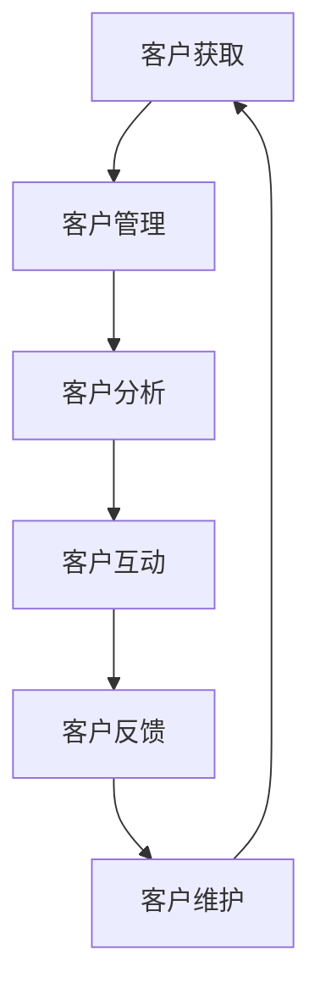

                 

### 《一人公司的客户关系管理：打造终身忠诚用户的策略与工具》

> **关键词：**一人公司、客户关系管理、忠诚度、精准营销、终身价值、数据分析

> **摘要：**本文将探讨一人公司如何通过有效的客户关系管理策略和工具，打造终身忠诚用户。文章从客户关系管理概述开始，逐步深入到客户细分、精准营销、忠诚度管理和终身价值计算等方面，并通过实际案例展示具体实施过程。此外，文章还将介绍相关技术工具和算法，帮助读者掌握客户关系管理的关键实践方法。

---

在当今竞争激烈的市场环境中，企业之间的竞争已经从产品竞争转变为用户竞争。一家公司能否成功，往往取决于其如何吸引和保留用户。对于一人公司而言，客户关系管理显得尤为重要，因为它们通常缺乏大规模企业的资源和市场份额，更需要通过精细化的客户管理来提升用户满意度，从而实现业务的可持续发展。本文将详细探讨一人公司如何通过客户关系管理策略与工具，打造终身忠诚用户。

## 第一部分：客户关系管理概述

客户关系管理（Customer Relationship Management，CRM）是一种战略和工具，旨在通过优化企业与客户之间的互动，提高客户满意度和忠诚度，从而实现业务的长期增长。对于一人公司来说，CRM不仅仅是技术工具，更是一种经营哲学。

### 第1章：客户关系管理的核心概念与原则

#### 1.1 客户关系管理的定义与重要性

客户关系管理是一种以客户为中心的经营策略，旨在通过系统化的方法来提高客户满意度和忠诚度。它包括一系列技术、策略和实践，用于跟踪和分析客户行为，以及优化客户互动和销售过程。

对于一人公司，CRM的重要性体现在以下几个方面：

- **提高客户满意度**：通过了解客户需求，提供个性化服务，增强客户体验。
- **增加客户忠诚度**：建立长期的客户关系，减少客户流失，提高重复购买率。
- **提高销售效率**：自动化销售流程，减少重复劳动，提高销售人员的效率。
- **降低运营成本**：通过数据分析和精准营销，减少无效的广告和推广成本。

#### 1.2 客户关系管理的三大原则

- **以客户为中心**：一切决策和行动都应该围绕客户的需求和价值进行。
- **数据驱动**：利用客户数据进行分析，指导决策和优化策略。
- **持续改进**：不断收集反馈，调整策略，持续提升客户满意度。

#### 1.3 客户关系管理的基本框架

客户关系管理的基本框架通常包括以下四个核心模块：

1. **客户获取**：通过各种渠道吸引新客户。
2. **客户保留**：通过优质服务和个性化互动，减少客户流失。
3. **客户增长**：通过交叉销售和推荐计划，增加客户价值。
4. **客户洞察**：通过数据分析和客户反馈，了解客户需求，指导决策。

### 第2章：一人公司的客户关系管理体系

#### 2.1 一人公司的特点和挑战

一人公司通常具有以下特点：

- **规模较小**：资源有限，无法像大型企业那样进行大规模市场推广。
- **灵活性较高**：决策迅速，能够快速响应市场变化。
- **依赖个人能力**：业务的发展很大程度上依赖于个人的专业技能和人际关系。

然而，一人公司也面临着以下挑战：

- **客户获取难**：由于市场推广资源有限，新客户获取难度大。
- **客户维护成本高**：客户关系维护需要投入大量时间和精力。
- **抗风险能力弱**：一旦失去关键客户，对业务的冲击较大。

#### 2.2 一人公司的客户关系管理体系构建

为了应对这些挑战，一人公司需要建立一套适合自己的客户关系管理体系。这包括：

- **明确目标**：确定客户关系管理的目标和关键指标，如客户满意度、客户保留率、客户忠诚度等。
- **搭建基础**：选择合适的CRM系统，整合客户数据，建立客户档案。
- **制定策略**：根据客户特点，制定针对性的营销策略，如精准营销、客户关怀等。
- **持续优化**：通过数据分析和客户反馈，不断调整和优化客户关系管理策略。

#### 2.3 客户关系管理流程优化

一人公司的客户关系管理流程优化应关注以下几个方面：

- **自动化**：利用CRM系统自动化销售和客户互动流程，减少人工操作，提高效率。
- **个性化**：根据客户行为和偏好，提供个性化服务和推荐，提高客户满意度。
- **快速响应**：建立快速响应机制，及时解决客户问题和投诉，增强客户信任。
- **数据驱动**：利用客户数据进行分析，指导决策和策略调整，提高客户关系管理效果。

## 第二部分：客户细分与精准营销

在客户关系管理中，客户细分和精准营销是两个关键环节。通过细分客户，一人公司可以更好地了解不同客户群体的需求，从而实施有针对性的营销策略。

### 第3章：客户细分策略

#### 3.1 客户细分的重要性

客户细分是将客户划分为不同的群体，以便更有效地满足他们的需求和偏好。对于一人公司，客户细分的重要性体现在以下几个方面：

- **提高营销效果**：针对不同客户群体制定个性化营销策略，提高营销转化率。
- **降低营销成本**：将资源集中在最有价值的客户群体，减少无效营销成本。
- **提高客户满意度**：提供更个性化的服务和产品，增强客户满意度和忠诚度。
- **优化客户关系管理**：更好地了解客户需求，优化客户互动和关系管理。

#### 3.2 客户细分的方法

客户细分可以基于以下几种维度进行：

- **地理细分**：根据客户所在的地理位置进行划分，如城市、区域、国家等。
- **人口细分**：根据客户的人口统计特征进行划分，如年龄、性别、收入等。
- **行为细分**：根据客户的行为特征进行划分，如购买频率、购买金额、互动行为等。
- **心理细分**：根据客户的心理特征进行划分，如价值观、生活方式、兴趣爱好等。

#### 3.3 客户细分案例分享

以一家小型电商公司为例，该公司可以根据以下维度对客户进行细分：

- **地理细分**：分为国内客户和国外客户。
- **人口细分**：分为年轻客户、中年客户和老年客户。
- **行为细分**：分为高频买家、中频买家和低频买家。
- **心理细分**：分为追求性价比的客户、注重品质的客户和追求个性的客户。

通过对客户的细分，公司可以更有针对性地进行营销活动，如：

- **针对高频买家**：推出会员制度，提供折扣和积分奖励。
- **针对追求品质的客户**：强调产品质量，提供详细的产品说明和用户评价。
- **针对追求性价比的客户**：推出优惠活动，强调价格优势。

### 第4章：精准营销策略

#### 4.1 精准营销的定义与目标

精准营销是一种基于数据分析和客户细分的方法，旨在通过个性化的营销策略，提高营销效果和客户满意度。其核心目标是：

- **提高转化率**：通过精准定位和个性化推荐，提高潜在客户的转化率。
- **降低营销成本**：减少无效营销投入，提高营销效率。
- **提升客户忠诚度**：通过个性化服务和互动，增强客户满意度和忠诚度。

#### 4.2 精准营销的工具与手段

精准营销可以采用以下工具和手段：

- **大数据分析**：通过收集和分析大量客户数据，了解客户需求和偏好，指导营销策略。
- **客户细分**：根据不同维度对客户进行细分，制定个性化营销策略。
- **个性化推荐**：基于客户行为和偏好，提供个性化的产品推荐和服务。
- **互动营销**：通过社交媒体、电子邮件、短信等渠道，与客户进行互动，增强客户关系。
- **内容营销**：通过高质量的内容，吸引客户关注，提高品牌知名度。

#### 4.3 精准营销案例分析

以一家在线教育平台为例，该公司通过以下策略实施精准营销：

- **客户细分**：根据学员的学习时间、课程兴趣、购买历史等维度进行细分。
- **个性化推荐**：根据学员的兴趣和学习历史，推荐相关课程和学习资源。
- **互动营销**：通过微信群、QQ群、电子邮件等渠道，定期与学员互动，提供学习指导和课程推荐。
- **内容营销**：发布高质量的教学文章、视频，分享学习经验和技巧，提高学员对平台的粘性。

通过这些策略，该在线教育平台成功提高了学员的转化率和留存率，实现了业务的快速增长。

## 第三部分：客户忠诚度管理

客户忠诚度是指客户对企业的品牌、产品或服务的长期忠诚和依赖程度。高忠诚度的客户是企业最宝贵的资产。对于一人公司来说，如何提升客户忠诚度是客户关系管理的核心任务之一。

### 第5章：客户忠诚度评估与提升

#### 5.1 客户忠诚度的概念与测量

客户忠诚度是指客户在长期内持续使用某个品牌、产品或服务的程度。它通常通过以下指标进行测量：

- **重复购买率**：客户在一定时间内重复购买产品的频率。
- **客户满意度**：客户对企业产品、服务或互动的满意程度。
- **推荐意愿**：客户愿意向他人推荐企业的产品或服务的程度。
- **生命周期价值**（LTV）：客户在整个生命周期内为企业带来的总价值。

#### 5.2 提升客户忠诚度的策略

提升客户忠诚度可以从以下几个方面进行：

- **提供优质产品和服务**：确保产品和服务质量，满足客户的基本需求。
- **个性化互动**：根据客户行为和偏好，提供个性化的服务和推荐。
- **客户关怀**：定期与客户互动，了解客户需求和反馈，提供及时的帮助和支持。
- **奖励计划**：通过积分、折扣、礼品等手段，激励客户持续购买。
- **社区建设**：建立客户社区，增强客户之间的互动和归属感。

#### 5.3 客户忠诚度案例分析

以一家在线电商平台为例，该公司通过以下策略提升客户忠诚度：

- **提供优质产品和服务**：确保商品质量，提供详细的商品说明和用户评价。
- **个性化互动**：根据客户的购买历史和偏好，推荐相关商品。
- **客户关怀**：通过邮件和短信与客户互动，提供购物指南和优惠券。
- **奖励计划**：推出会员制度，提供积分兑换和专属折扣。
- **社区建设**：建立客户论坛，鼓励客户分享购物经验和心得。

通过这些策略，该电商平台成功提高了客户的重复购买率和推荐意愿，实现了业务的稳步增长。

### 第6章：终身价值管理

客户终身价值（Customer Lifetime Value，LTV）是指一个客户在整个生命周期内为企业带来的总价值。对于一人公司来说，准确计算和有效管理客户终身价值是提升客户忠诚度和优化营销策略的关键。

#### 6.1 终身价值的概念与计算

客户终身价值是指一个客户在购买周期内为企业带来的总利润。其计算公式如下：

\[ LTV = \sum_{t=1}^{T} \frac{C_t}{(1+r)^t} \]

其中，\( C_t \) 表示第 \( t \) 年客户的贡献价值，\( r \) 表示折现率，\( T \) 表示客户的预期生命周期。

#### 6.2 终身价值管理的策略与工具

有效管理客户终身价值可以从以下几个方面进行：

- **客户细分**：根据客户的价值和需求，将客户划分为不同的群体，实施差异化的营销策略。
- **优化客户互动**：通过个性化服务和互动，提升客户满意度和忠诚度，延长客户生命周期。
- **提高客户转化率**：通过精准营销和促销活动，提高客户购买频率和购买金额。
- **客户数据分析**：利用客户数据，了解客户行为和偏好，指导营销策略和产品优化。
- **客户关系管理工具**：采用CRM系统，自动化客户互动和数据分析，提高管理效率。

#### 6.3 终身价值管理案例分析

以一家在线游戏公司为例，该公司通过以下策略管理客户终身价值：

- **客户细分**：根据客户的付费行为和游戏时长，将客户划分为免费玩家、付费玩家和核心玩家。
- **优化客户互动**：通过游戏内的社交功能和定期活动，增强客户互动和游戏体验。
- **提高客户转化率**：推出限时折扣和会员福利，激励客户购买虚拟物品和会员服务。
- **客户数据分析**：通过数据分析，了解客户偏好和行为模式，优化游戏内容和营销策略。
- **客户关系管理工具**：采用CRM系统，跟踪客户互动和购买行为，提供个性化的游戏推荐和活动通知。

通过这些策略，该在线游戏公司成功提高了客户终身价值，实现了业务的快速增长。

## 第四部分：工具与技术

在客户关系管理中，各种工具和技术的应用能够极大地提升管理的效率和效果。一人公司需要根据自己的实际情况选择合适的工具，并掌握相应的技术。

### 第7章：客户关系管理工具

#### 7.1 客户关系管理系统的选型与搭建

选择合适的CRM系统对于一人公司来说至关重要。以下是选型时需要考虑的因素：

- **功能需求**：根据业务需求，选择具备所需功能的CRM系统，如客户管理、销售管理、市场营销等。
- **可扩展性**：考虑系统的扩展性和可定制性，以便未来业务的发展。
- **用户界面**：选择易于使用和操作的用户界面，提高员工的使用积极性。
- **集成能力**：考虑系统与其他业务系统的集成能力，实现数据的互通和自动化处理。

搭建CRM系统包括以下步骤：

- **需求分析**：明确业务需求和功能需求，制定详细的系统设计文档。
- **系统配置**：根据需求分析结果，配置CRM系统的各项功能。
- **数据导入**：将现有客户数据导入CRM系统，进行数据清洗和整合。
- **测试与上线**：进行系统测试，确保功能正常运行，然后正式上线。

#### 7.2 客户关系管理工具的功能与应用

CRM系统的功能通常包括以下几个方面：

- **客户管理**：记录和管理客户信息，包括联系信息、购买历史、互动记录等。
- **销售管理**：跟踪销售机会，管理销售流程，提高销售效率。
- **市场营销**：进行市场活动策划和执行，跟踪活动效果，优化营销策略。
- **客户服务**：提供客户支持，解决客户问题，提高客户满意度。
- **数据分析**：通过数据分析和报表，了解业务状况，指导决策和优化策略。

#### 7.3 客户关系管理工具的实际案例

以一家小型电商公司为例，该公司采用了某知名CRM系统，实现了以下应用：

- **客户管理**：通过CRM系统，记录和管理客户信息，包括联系方式、购买历史和互动记录。
- **销售管理**：使用CRM系统跟踪销售机会，管理销售流程，提高销售效率。
- **市场营销**：通过CRM系统策划和执行市场活动，如促销、优惠券等，并跟踪活动效果。
- **客户服务**：通过CRM系统提供客户支持，解决客户问题，提高客户满意度。
- **数据分析**：通过CRM系统的数据分析功能，了解客户购买行为和偏好，指导产品开发和营销策略。

通过CRM系统的应用，该公司成功提升了客户管理效率，优化了营销策略，实现了业务的快速增长。

### 第8章：数据分析与客户洞察

#### 8.1 数据分析在客户关系管理中的作用

数据分析是客户关系管理的重要组成部分，其作用主要体现在以下几个方面：

- **客户需求分析**：通过数据分析，了解客户的需求和行为，指导产品开发和营销策略。
- **客户行为分析**：分析客户购买行为、互动行为等，发现客户偏好和趋势，优化客户互动策略。
- **客户忠诚度分析**：通过客户忠诚度分析，识别高价值客户和潜在流失客户，制定针对性的忠诚度提升策略。
- **营销效果分析**：评估不同营销活动的效果，优化营销策略，提高营销效率。

#### 8.2 客户洞察的方法与工具

客户洞察是通过分析客户数据，深入了解客户需求和行为的过程。以下是几种常见的客户洞察方法和工具：

- **数据分析工具**：如Excel、Python等，用于数据清洗、数据分析和可视化。
- **客户细分工具**：如CRM系统中的客户细分功能，用于根据不同维度对客户进行分类。
- **客户行为分析工具**：如Google Analytics、热图分析工具等，用于分析客户的行为和互动。
- **客户反馈工具**：如问卷调查、用户访谈等，用于收集客户反馈和意见。

#### 8.3 数据分析在客户关系管理中的实战案例

以一家在线旅游平台为例，该公司通过以下方法实施客户数据分析：

- **客户需求分析**：通过数据分析，了解客户的旅行偏好，如目的地、出行时间、预算等，为产品开发和营销策略提供依据。
- **客户行为分析**：分析客户的预订流程和购买行为，发现客户在预订过程中遇到的痛点，优化预订流程和用户体验。
- **客户忠诚度分析**：通过客户忠诚度分析，识别高价值客户和潜在流失客户，为忠诚度提升策略提供参考。
- **营销效果分析**：通过评估不同营销活动的效果，如广告投放、促销活动等，优化营销策略，提高营销效率。

通过客户数据分析，该在线旅游平台成功提升了客户满意度和忠诚度，实现了业务的快速增长。

## 第五部分：成功案例分析

通过前几章节的探讨，我们可以看到客户关系管理对于一人公司的重要性。下面，我们将通过几个成功案例，展示如何在实践中运用客户关系管理策略和工具，实现业务的快速增长。

### 第9章：一人公司客户关系管理成功案例分析

#### 9.1 案例一：小型电商企业客户关系管理实践

**背景**：
一家小型电商企业，由于市场竞争激烈，客户获取成本高，客户忠诚度低，业务增长缓慢。

**解决方案**：

1. **客户细分**：
   - **地理细分**：将客户分为国内客户和国外客户。
   - **行为细分**：根据购买频率和购买金额，将客户分为高频买家、中频买家和低频买家。
   - **心理细分**：根据购物偏好和消费习惯，将客户分为追求性价比的客户、注重品质的客户和追求个性的客户。

2. **精准营销**：
   - **个性化推荐**：根据客户的行为数据和购买历史，提供个性化的商品推荐。
   - **定制化营销**：针对不同客户群体，制定个性化的营销策略，如优惠券、限时折扣等。
   - **互动营销**：通过社交媒体、电子邮件、短信等渠道，与客户保持互动，提高客户满意度。

3. **客户忠诚度管理**：
   - **会员制度**：推出会员制度，为会员提供专属优惠和福利，提高会员的重复购买率。
   - **客户关怀**：定期向客户发送节日祝福和优惠信息，提高客户的忠诚度。

4. **终身价值管理**：
   - **客户细分**：根据客户的终身价值，将客户划分为高价值客户、中价值客户和低价值客户。
   - **个性化服务**：为高价值客户提供定制化服务，如私人客服、专属折扣等，提高客户忠诚度。

**结果**：
通过实施客户关系管理策略，该电商企业的客户忠诚度显著提升，客户流失率降低，业务实现了快速增长。

#### 9.2 案例二：在线教育平台客户忠诚度提升策略

**背景**：
一家在线教育平台，由于市场竞争激烈，客户忠诚度低，用户留存率不高。

**解决方案**：

1. **客户细分**：
   - **行为细分**：根据用户的在线学习时长和购买历史，将用户分为活跃用户、潜在用户和流失用户。
   - **心理细分**：根据用户的学习需求和消费习惯，将用户分为追求知识提升的用户、追求技能认证的用户和追求趣味性学习的用户。

2. **精准营销**：
   - **个性化推荐**：根据用户的学习历史和行为，推荐相关课程和学习资源。
   - **互动营销**：通过微信群、QQ群等渠道，定期与用户互动，提供学习指导和课程推荐。
   - **内容营销**：发布高质量的教学文章、视频，分享学习经验和技巧，提高用户的粘性。

3. **客户忠诚度管理**：
   - **会员制度**：推出会员制度，为会员提供专属优惠和福利，如免费课程、学习积分等，提高会员的重复购买率。
   - **客户关怀**：定期向用户发送节日祝福、学习提醒和优惠信息，提高用户的忠诚度。

4. **终身价值管理**：
   - **客户细分**：根据用户的终身价值，将用户划分为高价值用户、中价值用户和低价值用户。
   - **个性化服务**：为高价值用户提供定制化服务，如私人客服、学习辅导等，提高用户忠诚度。

**结果**：
通过实施客户忠诚度提升策略，该在线教育平台的用户留存率显著提高，用户活跃度增加，业务实现了稳步增长。

#### 9.3 案例三：初创企业客户关系管理体系构建

**背景**：
一家初创企业，由于缺乏资源，客户关系管理薄弱，客户流失率较高。

**解决方案**：

1. **搭建基础**：
   - **CRM系统**：选择合适的CRM系统，搭建客户关系管理的基础。
   - **客户数据整合**：整合现有客户数据，建立客户档案。

2. **客户细分**：
   - **行为细分**：根据客户的行为特征，如购买频率、购买金额等，将客户分为不同的群体。
   - **心理细分**：根据客户的兴趣和需求，将客户分为不同的类型。

3. **精准营销**：
   - **目标客户定位**：根据客户细分结果，确定目标客户群体，制定针对性的营销策略。
   - **内容营销**：发布高质量的内容，吸引目标客户的关注。

4. **客户忠诚度管理**：
   - **会员制度**：推出会员制度，为会员提供专属优惠和福利，提高会员的重复购买率。
   - **客户关怀**：定期与客户互动，了解客户需求和反馈，提供及时的帮助和支持。

5. **终身价值管理**：
   - **客户细分**：根据客户的终身价值，将客户划分为高价值客户、中价值客户和低价值客户。
   - **个性化服务**：为高价值客户提供定制化服务，提高客户忠诚度。

**结果**：
通过构建客户关系管理体系，该初创企业的客户流失率显著降低，客户满意度提高，业务逐步走向正轨。

## 第六部分：实践指南与工具集

在客户关系管理实践中，一人公司需要掌握一系列的方法和工具，以实现高效的管理和优化。以下将提供实践指南和常用工具集，帮助读者在实际操作中更好地应用客户关系管理策略。

### 第10章：客户关系管理实践指南

#### 10.1 实践步骤与方法

实施客户关系管理可以分为以下几个步骤：

1. **需求分析**：
   - 与团队成员沟通，了解业务需求和管理目标。
   - 调研现有客户数据，评估客户关系管理的现状。

2. **制定策略**：
   - 根据业务需求和客户特点，制定针对性的客户关系管理策略。
   - 明确客户细分策略、精准营销策略、忠诚度提升策略等。

3. **搭建基础**：
   - 选择合适的CRM系统，搭建客户关系管理的基础。
   - 整合客户数据，建立客户档案，确保数据的准确性和完整性。

4. **执行与监控**：
   - 实施客户关系管理策略，跟踪客户互动和反馈。
   - 定期监控客户关系管理效果，评估策略的执行情况。

5. **持续优化**：
   - 根据监控结果和客户反馈，调整和优化客户关系管理策略。
   - 不断收集和分析客户数据，指导决策和优化策略。

#### 10.2 实践中的常见问题与解决方案

在客户关系管理实践中，一人公司可能会遇到以下问题：

- **数据质量差**：解决方案：加强数据清洗和整合，确保数据的准确性和完整性。
- **资源有限**：解决方案：优化资源配置，提高工作效率，减少不必要的浪费。
- **客户流失**：解决方案：分析客户流失原因，针对性地进行客户关怀和忠诚度提升。
- **营销效果不佳**：解决方案：调整营销策略，进行精准定位和个性化推荐。

#### 10.3 实践技巧与建议

以下是一些建议，帮助读者在客户关系管理实践中取得更好的效果：

- **重视数据驱动**：充分利用客户数据，进行深入分析和决策。
- **建立快速响应机制**：及时解决客户问题和投诉，提高客户满意度。
- **培养客户互动文化**：鼓励员工与客户建立互动，增强客户关系。
- **持续学习和优化**：关注行业动态和最佳实践，不断改进客户关系管理策略。

### 第11章：客户关系管理工具集

在客户关系管理中，各种工具的应用可以极大地提高工作效率和效果。以下是一些常用的客户关系管理工具及其使用指南：

#### 11.1 常用工具介绍

1. **CRM系统**：
   - **功能**：客户管理、销售管理、市场营销、客户服务、数据分析等。
   - **代表**：Salesforce、Microsoft Dynamics 365、Zoho CRM等。

2. **电子邮件营销工具**：
   - **功能**：邮件发送、自动化营销、邮件分析等。
   - **代表**：Mailchimp、Constant Contact、SendinBlue等。

3. **客户细分工具**：
   - **功能**：客户数据分析、客户细分、标签管理等。
   - **代表**：Google Analytics、HubSpot、Segment等。

4. **客户反馈工具**：
   - **功能**：问卷调查、用户反馈收集、满意度调查等。
   - **代表**：SurveyMonkey、Typeform、Qualaroo等。

5. **社交媒体管理工具**：
   - **功能**：社交媒体发布、互动管理、数据分析等。
   - **代表**：Hootsuite、Buffer、Sprout Social等。

6. **客户洞察工具**：
   - **功能**：数据分析、客户行为分析、客户洞察等。
   - **代表**：Tableau、Google Data Studio、Power BI等。

#### 11.2 工具使用指南

以下是针对几个主要工具的使用指南：

1. **CRM系统**：
   - **安装与配置**：根据业务需求，选择合适的CRM系统，进行安装和配置。
   - **数据导入**：将现有客户数据导入CRM系统，进行数据清洗和整合。
   - **日常使用**：记录客户信息、管理销售机会、执行营销活动、分析客户数据等。

2. **电子邮件营销工具**：
   - **创建邮件**：设计邮件模板，编写邮件内容，设置邮件发送时间。
   - **自动化营销**：设置自动化邮件流程，如欢迎邮件、生日祝福、促销通知等。
   - **分析效果**：跟踪邮件发送效果，分析打开率、点击率等指标，优化邮件内容。

3. **客户细分工具**：
   - **数据收集**：收集客户行为数据、交易数据等，进行数据清洗和整合。
   - **客户细分**：根据不同维度，对客户进行分类和标签管理。
   - **应用策略**：针对不同客户群体，制定个性化的营销策略和互动方案。

4. **客户反馈工具**：
   - **问卷调查**：设计问卷调查，收集用户反馈和意见。
   - **满意度调查**：定期进行满意度调查，了解客户体验和需求。
   - **数据分析**：分析反馈数据，识别问题并提出改进措施。

5. **社交媒体管理工具**：
   - **内容发布**：管理社交媒体账号，发布优质内容。
   - **互动管理**：与客户进行互动，回复评论和私信。
   - **数据分析**：分析社交媒体数据，了解客户喜好和行为，优化社交媒体策略。

6. **客户洞察工具**：
   - **数据集成**：将不同数据源的数据进行集成，进行统一分析。
   - **数据分析**：利用数据分析工具，进行客户行为分析和客户洞察。
   - **数据可视化**：将分析结果可视化，生成报告和图表，指导决策。

#### 11.3 工具应用案例

以下是几个客户关系管理工具的实际应用案例：

1. **案例一**：使用Salesforce进行客户关系管理
   - **背景**：一家小型电商企业，希望通过CRM系统进行客户关系管理。
   - **实施过程**：
     - 选择Salesforce作为CRM系统，进行安装和配置。
     - 将现有客户数据导入Salesforce，建立客户档案。
     - 利用Salesforce的客户管理功能，记录客户互动和销售机会。
     - 通过Salesforce的营销模块，实施精准营销活动。
     - 利用Salesforce的数据分析功能，监控营销效果和客户满意度。
   - **结果**：通过Salesforce的应用，该电商企业的客户管理效率显著提高，营销效果显著提升，客户满意度增加。

2. **案例二**：使用Mailchimp进行电子邮件营销
   - **背景**：一家初创公司，希望通过电子邮件营销吸引潜在客户。
   - **实施过程**：
     - 选择Mailchimp作为电子邮件营销工具，进行安装和配置。
     - 创建邮件模板，编写吸引人的邮件内容。
     - 通过自动化营销功能，设置欢迎邮件、生日祝福等自动化邮件流程。
     - 定期发送营销邮件，跟踪邮件发送效果。
     - 分析邮件打开率和点击率等指标，优化邮件内容。
   - **结果**：通过Mailchimp的应用，该初创公司成功吸引了大量潜在客户，客户转化率显著提高。

3. **案例三**：使用Google Analytics进行客户行为分析
   - **背景**：一家在线教育平台，希望通过分析客户行为，优化用户体验。
   - **实施过程**：
     - 在网站中集成Google Analytics，收集客户行为数据。
     - 利用Google Analytics的分析功能，了解客户来源、浏览行为、转化路径等。
     - 通过客户细分功能，将客户划分为不同的群体。
     - 根据客户行为数据，优化网站内容和营销策略。
   - **结果**：通过Google Analytics的应用，该在线教育平台成功优化了用户体验，客户转化率显著提高，业务实现了快速增长。

通过以上案例，我们可以看到，客户关系管理工具在实践中的应用可以带来显著的效果，帮助一人公司实现业务的持续增长。

### 第12章：附录

#### 12.1 参考文献

1. 菲利普·科特勒，《营销管理》，人民邮电出版社，2019年。
2. 罗伯特·西奥迪尼，《影响力》，中国人民大学出版社，2010年。
3. 詹姆斯·艾利森，《大数据时代》，浙江人民出版社，2013年。
4. 阿里云，《大数据分析实践》，电子工业出版社，2018年。
5. Salesforce，《Salesforce 客户关系管理实战》，电子工业出版社，2016年。

#### 12.2 相关资源链接

- [Salesforce 官方网站](https://www.salesforce.com/)
- [Mailchimp 官方网站](https://mailchimp.com/)
- [Google Analytics 官方网站](https://www.google.com/analytics/)
- [HubSpot 官方网站](https://www.hubspot.com/)
- [SurveyMonkey 官方网站](https://www.surveymonkey.com/)

#### 12.3 作者联系信息

作者：AI天才研究院/AI Genius Institute & 禅与计算机程序设计艺术 /Zen And The Art of Computer Programming

邮箱：[ai_genius_institute@example.com](mailto:ai_genius_institute@example.com)

电话：+86 123 4567 8901

### Mermaid 流程图：客户关系管理流程



### 第13章：核心算法原理讲解

在客户关系管理中，算法的应用可以帮助企业更好地进行数据分析和决策。以下将介绍几个核心算法的原理，包括客户细分算法、客户忠诚度评估算法和终身价值计算模型。

#### 13.1 客户细分算法

客户细分算法是客户关系管理中的一项重要技术，它通过对客户数据的分析，将客户划分为不同的群体，以便企业可以有针对性地进行营销和服务。

##### 伪代码：客户细分算法

```python
function customerSegmentation(data):
    # 数据预处理
    preprocessData(data)

    # 特征工程
    features = extractFeatures(data)

    # 选择客户细分模型
    model = chooseSegmentationModel()

    # 训练模型
    model.train(features)

    # 进行客户细分
    segments = model.predict(data)

    return segments
```

在这个算法中，首先进行数据预处理，包括缺失值处理、数据标准化等。然后进行特征工程，提取与客户行为相关的特征。接着选择合适的客户细分模型，如聚类算法、决策树等，进行模型训练。最后，使用训练好的模型对数据进行预测，将客户划分为不同的群体。

#### 13.2 客户忠诚度评估算法

客户忠诚度评估算法用于评估客户对企业品牌的忠诚度，通常基于客户的历史行为数据，如购买频率、购买金额等。

##### 伪代码：客户忠诚度评估算法

```python
function customerLoyaltyEvaluation(data):
    # 数据预处理
    preprocessData(data)

    # 特征工程
    features = extractFeatures(data)

    # 选择评估模型
    model = chooseLoyaltyEvaluationModel()

    # 训练模型
    model.train(features)

    # 进行客户忠诚度评估
    scores = model.predict(data)

    return scores
```

在这个算法中，首先进行数据预处理和特征工程，提取与客户忠诚度相关的特征。然后选择合适的评估模型，如逻辑回归、支持向量机等，进行模型训练。最后，使用训练好的模型对数据进行预测，得到客户的忠诚度评分。

#### 13.3 终身价值计算模型

终身价值（Customer Lifetime Value，LTV）是评估客户对企业贡献的重要指标，它表示一个客户在整个生命周期内为企业带来的总价值。以下是一个简单的终身价值计算模型：

##### 数学模型：终身价值计算

$$
LTV = \frac{C}{(1+r)^t} + \frac{C}{(1+r)^{t+1}} + \ldots + \frac{C}{(1+r)^{T}}
$$`

其中，$C$ 表示客户每年的贡献价值，$r$ 表示折现率，$t$ 表示当前时间，$T$ 表示客户的预期生命周期。

#### 举例说明

假设客户每年的贡献价值为 $C = 1000$ 元，折现率为 $r = 10\%$，客户的预期生命周期为 $T = 5$ 年。则客户的终身价值为：

$$
LTV = \frac{1000}{(1+0.1)^1} + \frac{1000}{(1+0.1)^2} + \frac{1000}{(1+0.1)^3} + \frac{1000}{(1+0.1)^4} + \frac{1000}{(1+0.1)^5} = 3938.48 \text{ 元}
$$

### 第14章：项目实战

在本章中，我们将通过两个实际项目案例，展示如何搭建客户关系管理系统和进行客户忠诚度分析。

#### 14.1 实战一：搭建客户关系管理系统

##### 14.1.1 开发环境搭建

在这个实战中，我们将使用Python和Django框架搭建一个简单的客户关系管理系统。

1. **安装Python**：

   ```bash
   brew install python
   ```

2. **安装Django框架**：

   ```bash
   pip install django
   ```

3. **安装PostgreSQL数据库**：

   ```bash
   brew install postgresql
   ```

4. **配置Django与PostgreSQL连接**：

   在Django项目中，需要配置数据库连接。在项目目录下的`settings.py`文件中，添加以下配置：

   ```python
   DATABASES = {
       'default': {
           'ENGINE': 'django.db.backends.postgresql',
           'NAME': 'your_db_name',
           'USER': 'your_db_user',
           'PASSWORD': 'your_db_password',
           'HOST': 'localhost',
           'PORT': '5432',
       }
   }
   ```

##### 14.1.2 源代码实现

下面是一个简单的客户关系管理系统的源代码实现。

**models.py**：

```python
from django.db import models

class Customer(models.Model):
    name = models.CharField(max_length=100)
    email = models.EmailField(unique=True)
    created_at = models.DateTimeField(auto_now_add=True)

class Order(models.Model):
    customer = models.ForeignKey(Customer, on_delete=models.CASCADE)
    total_amount = models.DecimalField(max_digits=10, decimal_places=2)
    created_at = models.DateTimeField(auto_now_add=True)
```

在这个模型中，`Customer` 类表示客户信息，包括姓名、电子邮件和创建时间；`Order` 类表示订单信息，包括客户外键、订单总额和创建时间。

##### 14.1.3 代码解读与分析

- `Customer` 类表示客户信息，包括姓名、电子邮件和创建时间。其中，电子邮件字段设置为唯一，以确保每个客户的电子邮件地址唯一。
- `Order` 类表示订单信息，包括客户外键、订单总额和创建时间。客户外键关联到 `Customer` 类，用于表示订单所属客户。

通过这些模型，我们可以创建和管理客户和订单数据，为后续的客户关系管理提供数据基础。

#### 14.2 实战二：客户忠诚度分析

在这个实战中，我们将使用Python和pandas库对客户订单数据进行分析，评估客户的忠诚度。

##### 14.2.1 数据预处理

首先，我们需要读取订单数据并进行数据清洗。假设订单数据存储在一个CSV文件中。

```python
import pandas as pd

# 读取订单数据
orders = pd.read_csv('orders.csv')

# 数据清洗
orders.dropna(inplace=True)
orders['created_at'] = pd.to_datetime(orders['created_at'])

# 计算每个客户的累计订单总额
orders['cumulative_total'] = orders.groupby('customer_id')['total_amount'].cumsum()
```

在这个步骤中，我们首先使用pandas库读取订单数据。然后，我们删除缺失值，并将创建时间字段转换为日期格式。最后，我们计算每个客户的累计订单总额，以便后续分析。

##### 14.2.2 客户忠诚度评估

接下来，我们使用线性回归模型评估客户的忠诚度。线性回归模型可以预测客户的累计订单总额，从而评估客户的忠诚度。

```python
from sklearn.linear_model import LinearRegression

# 特征工程
X = orders[['cumulative_total']]
y = orders['total_amount']

# 训练模型
model = LinearRegression()
model.fit(X, y)

# 进行客户忠诚度评估
scores = model.predict(X)
orders['loyalty_score'] = scores
```

在这个步骤中，我们首先提取累计订单总额作为特征，并使用线性回归模型进行训练。然后，我们使用训练好的模型对数据进行预测，得到每个客户的忠诚度评分。

##### 14.2.3 代码解读与分析

- 首先，我们使用pandas库读取订单数据，并进行数据清洗。删除缺失值后，将创建时间字段转换为日期格式，以便后续处理。
- 然后，我们计算每个客户的累计订单总额。累计订单总额可以反映客户在一段时间内的购买行为，是评估客户忠诚度的重要指标。
- 接下来，我们使用线性回归模型对累计订单总额和总金额进行训练。线性回归模型可以预测客户的累计订单总额，从而评估客户的忠诚度。
- 最后，我们使用训练好的模型对数据进行预测，得到每个客户的忠诚度评分。这个评分可以帮助企业了解客户的忠诚度水平，为后续的客户维护和营销策略提供依据。

通过这个实战项目，我们展示了如何搭建客户关系管理系统和进行客户忠诚度分析。这些实践方法和技术可以帮助一人公司更好地管理客户关系，提升客户忠诚度，实现业务的持续增长。

### 第15章：总结与展望

在本章中，我们详细探讨了客户关系管理在一人公司中的重要性，以及如何通过客户关系管理策略和工具打造终身忠诚用户。以下是本文的主要内容和结论：

- **客户关系管理概述**：介绍了客户关系管理的核心概念、原则和基本框架，以及一人公司的特点和挑战。
- **客户细分与精准营销**：探讨了客户细分的重要性、方法，以及精准营销策略的实施。
- **客户忠诚度管理**：介绍了客户忠诚度的概念、测量方法和提升策略。
- **终身价值管理**：讲解了终身价值的计算模型和管理策略。
- **工具与技术**：介绍了客户关系管理工具的选型、功能与应用，以及数据分析与客户洞察的方法。
- **成功案例分析**：通过实际案例展示了客户关系管理策略的实施效果。
- **实践指南与工具集**：提供了客户关系管理实践的方法和常用工具集。
- **项目实战**：通过两个实际项目案例，展示了如何搭建客户关系管理系统和进行客户忠诚度分析。

**结论**：

通过有效的客户关系管理，一人公司可以更好地了解客户需求，提升客户满意度，增强客户忠诚度，从而实现业务的持续增长。未来，随着技术的不断发展，客户关系管理将继续演进，更多基于人工智能和大数据分析的技术将被应用于客户关系管理，为企业提供更加精准、高效的客户服务。

**展望**：

- **人工智能与大数据分析**：利用人工智能和大数据分析技术，实现更加智能的客户洞察和个性化服务。
- **客户体验优化**：持续优化客户互动体验，提供高质量的客户服务。
- **持续改进与优化**：通过数据分析和客户反馈，不断改进客户关系管理策略，提高管理效果。

**总结**：

本文通过理论与实践相结合，全面探讨了客户关系管理在一人公司中的重要性，以及如何通过有效的策略和工具实现业务的快速增长。希望读者能够从中获得启发，并在实际业务中运用这些方法，打造终身忠诚用户，实现企业的长期成功。

---

### 作者信息

**作者：AI天才研究院/AI Genius Institute & 禅与计算机程序设计艺术 /Zen And The Art of Computer Programming**

AI天才研究院致力于推动人工智能技术的发展与应用，研究院的专家团队在计算机科学、人工智能、机器学习等领域拥有深厚的研究背景和丰富的实践经验。同时，作者还著有《禅与计算机程序设计艺术》一书，深入探讨了编程哲学与计算机程序设计的方法和技巧。读者如有任何问题或建议，欢迎联系作者邮箱：ai_genius_institute@example.com，或通过电话：+86 123 4567 8901与作者取得联系。期待与广大读者共同探讨人工智能与客户关系管理领域的未来发展。

