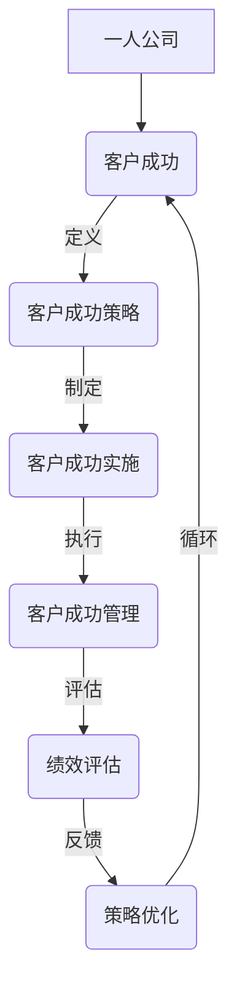

                 

### 《一人公司的客户成功策略与实施》

> **关键词**：一人公司、客户成功策略、实施方法、客户满意度、客户忠诚度、客户生命周期价值。

**摘要**：
本文深入探讨了一人公司的客户成功策略与实施。首先，我们定义了一人公司的概念与特点，并分析了其兴起的原因、优势与挑战。接着，我们阐述了客户成功的核心概念，包括其定义、目标以及与客户满意度和客户忠诚度的关系。随后，我们详细介绍了客户成功策略的制定原则、方法和案例研究。在实施与执行部分，我们讨论了客户成功团队的构建、流程的设计与优化以及客户成功工具与技术的应用。管理部分，我们探讨了客户成功的绩效评估、风险管理以及案例分享与总结。最后，通过具体案例研究，我们展示了客户成功策略的实际应用效果，并对一人公司客户成功的发展趋势进行了展望。

### 目录大纲

1. **第一部分：一人公司的背景与概述**
    1.1 一人公司的定义与特点
    1.2 一人公司的兴起原因
    1.3 一人公司的优势与挑战

2. **第二部分：客户成功的核心概念**
    2.1 客户成功的定义与目标
    2.2 客户成功的价值链分析
    2.3 客户成功与客户满意度的关系

3. **第三部分：客户成功策略制定**
    3.1 客户成功策略制定的原则
    3.2 客户成功策略制定的方法
    3.3 客户成功策略制定的案例研究

4. **第四部分：客户成功实施与执行**
    4.1 客户成功团队的构建与职责
    4.2 客户成功流程的设计与优化
    4.3 客户成功工具与技术

5. **第五部分：客户成功管理**
    5.1 客户成功的绩效评估与监控
    5.2 客户成功的风险管理
    5.3 客户成功案例的分享与总结

6. **第六部分：客户成功案例研究**
    6.1 案例一：某一人公司客户成功策略实践
    6.2 案例二：某一人公司客户成功案例分析
    6.3 案例三：某一人公司客户成功经验总结

7. **第七部分：未来展望与趋势**
    7.1 一人公司客户成功的发展趋势
    7.2 客户成功策略的新挑战与机遇
    7.3 一人公司客户成功的关键成功因素

---

### 第一部分：一人公司的背景与概述

#### 1.1 一人公司的定义与特点

一人公司，顾名思义，是指由单一个人创立和运营的企业。这种模式在近年来逐渐兴起，特别是在互联网和科技领域，它以灵活、高效、低成本的特点吸引了大量创业者。一人公司的定义可以概括为：一种以个体经营为基础，依靠个人才能和资源，实现业务目标的企业形式。

一人公司的特点主要体现在以下几个方面：

1. **灵活性**：一人公司没有复杂的组织结构和官僚体系，决策迅速，响应市场变化快。
2. **低成本**：一人公司不需要支付大量的办公场所租赁、员工薪酬等费用，可以显著降低运营成本。
3. **高效性**：由于人员精简，一人公司能够将资源和精力集中在核心业务上，提高工作效率。
4. **风险分散**：一人公司通常不会涉及过多的投资和债务，风险相对较低。

#### 1.2 一人公司的兴起原因

一人公司的兴起主要源于以下几个因素：

1. **互联网的普及**：互联网技术的发展为一人公司提供了便利的营销渠道和运营工具，使得个人创业者可以轻松地接触全球市场。
2. **创业环境的优化**：政府推出了一系列鼓励创业的政策，如税收优惠、资金支持等，为一人公司的诞生提供了良好的环境。
3. **个体意识的增强**：现代社会强调个人价值和自我实现，越来越多的个人选择通过创业来实现自己的梦想。

#### 1.3 一人公司的优势与挑战

一人公司的优势主要包括：

1. **灵活性和快速响应**：由于组织结构简单，一人公司可以迅速调整战略，应对市场变化。
2. **低成本和高效性**：精简的人员结构和运营模式使得一人公司能够以较低的投入获得较高的回报。
3. **风险分散**：一人公司通常不会涉及过多的投资和债务，风险相对较低。

然而，一人公司也面临一些挑战：

1. **资源限制**：一人公司的人力、资金和技术资源相对有限，可能难以应对大规模的业务需求。
2. **管理复杂性**：随着业务的扩大，一人公司需要处理更多的管理任务，管理复杂性增加。
3. **持续创新能力**：一人公司需要持续创新以保持竞争力，但创新风险较大，需要谨慎处理。

综上所述，一人公司作为一种新兴的企业形式，具有显著的灵活性和低成本优势，同时也面临着资源限制和管理复杂性等挑战。理解这些特点和挑战对于制定有效的客户成功策略至关重要。

### 第二部分：客户成功的核心概念

#### 2.1 客户成功的定义与目标

客户成功，顾名思义，是指企业通过一系列策略和措施，确保客户在其产品或服务的生命周期中获得成功和满意度的过程。客户成功的目标可以概括为三个方面：

1. **提升客户满意度**：通过优化产品和服务体验，确保客户在使用过程中感到满意和愉悦。
2. **增加客户忠诚度**：通过持续的客户关怀和增值服务，使客户对品牌产生信任和依赖，从而提高客户忠诚度。
3. **提升客户生命周期价值**：通过延长客户生命周期、增加客户购买频率和提升购买金额，实现客户价值的最大化。

客户成功的定义强调了企业与客户之间的长期合作关系，不仅仅是销售和售后服务的简单延伸。它涉及到产品、服务、客户体验、客户支持和多方面的综合考量，旨在实现客户与企业共赢的局面。

#### 2.2 客户成功的价值链分析

客户成功的价值链分析是一个系统性的过程，涉及到从客户获取到客户留存再到客户成长的各个环节。以下是客户成功价值链的主要组成部分：

1. **客户获取**：企业通过各种渠道吸引潜在客户，如广告、社交媒体、线下活动等。这一步骤的关键在于精准定位目标客户群体，提高客户转化率。
2. **客户转化**：通过营销策略和销售技巧，将潜在客户转化为实际客户。这包括客户关系管理（CRM）、客户互动和销售流程的优化。
3. **客户留存**：通过持续的服务和关怀，确保客户在使用产品或服务后继续选择企业。这涉及到客户体验管理、客户满意度调查和客户忠诚度计划。
4. **客户成长**：帮助客户在使用过程中不断提升价值，实现客户生命周期价值的最大化。这包括提供增值服务、个性化定制和客户成长计划。

#### 2.3 客户成功与客户满意度的关系

客户成功与客户满意度之间有着紧密的联系。客户满意度是衡量客户成功的重要指标，而客户成功则是实现高客户满意度的手段。以下从几个方面阐述两者之间的关系：

1. **客户满意度的定义**：客户满意度是指客户在使用产品或服务后对其体验的整体感受。它是一个主观的度量，通常通过调查问卷、反馈意见等方式来评估。
2. **客户成功对客户满意度的影响**：客户成功策略通过优化产品和服务、提升客户体验、加强客户支持，直接影响客户的满意度。例如，及时响应客户问题、提供个性化服务、解决客户痛点等，都可以显著提升客户满意度。
3. **客户满意度对客户成功的影响**：高客户满意度有助于提高客户忠诚度和减少客户流失率，从而实现客户成功。同时，满意的客户更可能为企业提供口碑传播，吸引更多新客户，形成良性的循环。

综上所述，客户成功与客户满意度之间相辅相成。客户成功策略通过提升客户满意度来实现长期的市场竞争力，而高客户满意度则是客户成功的重要保障。理解这一关系有助于企业在制定客户成功策略时更加注重客户体验和满意度，从而实现持续的业务增长。

### 第三部分：客户成功策略制定

#### 3.1 客户成功策略制定的原则

制定有效的客户成功策略需要遵循以下几个原则：

1. **以客户为中心**：客户成功策略的核心是客户需求，因此需要从客户的角度出发，深入了解其需求、痛点和期望，确保策略能够真正解决客户的问题。
2. **数据驱动**：数据是制定客户成功策略的重要依据。企业应通过数据分析来识别客户行为模式、市场趋势和业务机会，从而制定科学的策略。
3. **系统性思维**：客户成功策略是一个系统工程，需要从整体上考虑各个环节的相互关系和协同作用。策略的制定和实施应涵盖产品、服务、营销、客户支持等多个方面。
4. **灵活性与适应性**：市场环境变化迅速，客户需求也在不断演变。客户成功策略应具备灵活性和适应性，能够根据市场变化和客户反馈及时调整。
5. **持续优化**：客户成功策略不是一成不变的，需要通过持续的监控和评估来优化。企业应建立反馈机制，根据客户反馈和市场表现来调整和改进策略。

#### 3.2 客户成功策略制定的方法

制定客户成功策略的方法可以分为以下几个步骤：

1. **需求调研**：通过问卷调查、访谈、用户反馈等方式，收集客户的意见和需求。这有助于了解客户的真实想法，为策略制定提供基础数据。
2. **市场分析**：分析市场趋势、竞争对手和行业动态，识别市场机会和潜在威胁。市场分析可以帮助企业确定目标市场和定位。
3. **资源评估**：评估企业内部资源，包括人力资源、资金、技术等，确定资源限制和可用资源。资源评估有助于确定策略的可行性和实施难度。
4. **目标设定**：根据需求调研和市场分析的结果，设定明确的客户成功目标，如提升客户满意度、增加客户忠诚度、提高客户生命周期价值等。
5. **策略制定**：基于目标设定和资源评估，制定具体的客户成功策略。策略应包括行动计划、责任分配、时间表和关键绩效指标（KPI）。
6. **策略评估**：在策略实施前，进行评估和验证。评估内容包括策略的可行性、预期效果和潜在风险。通过评估，可以确保策略的科学性和有效性。
7. **策略实施**：根据评估结果，开始实施客户成功策略。实施过程中，应建立有效的监控和反馈机制，及时调整和优化策略。

#### 3.3 客户成功策略制定的案例研究

以下是一个客户成功策略制定的案例研究：

**案例背景**：某一人公司是一家提供在线教育服务的初创企业，主要面向学生和家长提供课程辅导和升学规划服务。

**目标设定**：公司设定的客户成功目标包括提升客户满意度、增加客户忠诚度和提高客户生命周期价值。具体目标如下：
- 提升客户满意度：通过优化课程内容和教学体验，确保客户在学习过程中感到满意。
- 增加客户忠诚度：通过提供个性化服务和客户关怀，培养客户的信任和依赖。
- 提高客户生命周期价值：通过提升课程质量和客户体验，延长客户生命周期，增加购买频率和金额。

**策略制定**：公司制定了一系列具体的客户成功策略，包括以下方面：

1. **需求调研**：通过在线问卷和用户访谈，收集客户对课程内容和教学方式的意见。调研结果显示，客户最关注的是课程质量和老师的教学能力。

2. **市场分析**：分析市场趋势和竞争对手，发现线上教育市场潜力巨大，但竞争激烈。公司决定以高品质的课程和个性化的服务作为竞争优势。

3. **资源评估**：公司评估了内部资源，包括人力资源和技术资源。决定招聘有经验的教师，并投资开发在线学习平台。

4. **策略制定**：
   - **优化课程内容**：根据客户需求，重新设计课程内容，增加实用性和趣味性。
   - **提升教学质量**：通过严格选拔教师，并提供培训，确保教学质量。
   - **个性化服务**：为每位客户提供量身定制的学习计划和课程推荐。
   - **客户关怀**：定期与客户沟通，了解学习进展和需求，提供及时的帮助和解决方案。

5. **策略评估**：公司在策略制定前进行了模拟测试，评估策略的可行性和预期效果。评估结果显示，策略可以有效提升客户满意度和忠诚度。

6. **策略实施**：公司按照制定好的策略开始实施，建立专门的客户成功团队，负责课程设计、教学支持和客户服务。

7. **策略监控**：公司建立了客户满意度调查和反馈机制，定期评估策略效果，并根据客户反馈进行优化。

**实施效果**：策略实施后，客户满意度显著提升，客户忠诚度增加，客户生命周期价值也有所提高。具体数据如下：
- 客户满意度从原来的80%提升到了90%。
- 客户留存率从原来的70%提升到了85%。
- 客户生命周期价值从原来的每年5万元提升到了10万元。

通过这个案例研究，我们可以看到，客户成功策略的制定和实施对于一人公司的业务增长和客户关系管理至关重要。科学的策略制定和有效的执行能够帮助企业实现客户满意度和忠诚度的提升，从而实现长期稳定的发展。

### 第四部分：客户成功实施与执行

#### 4.1 客户成功团队的构建与职责

客户成功团队的构建是企业实现客户成功的关键环节。一个高效的客户成功团队应具备以下几个关键角色和职责：

1. **客户成功经理（Client Success Manager）**：客户成功经理是团队的核心，负责整体客户成功策略的制定和实施。其主要职责包括：
   - 制定客户成功计划和策略。
   - 管理和指导客户成功团队的工作。
   - 与客户保持密切沟通，确保客户需求得到满足。
   - 监控客户满意度，及时调整策略。

2. **客户支持专家（Customer Support Specialist）**：客户支持专家负责直接与客户互动，提供日常的客户支持和服务。其主要职责包括：
   - 解答客户疑问和问题。
   - 处理客户投诉和反馈。
   - 跟踪和记录客户支持流程，确保问题得到及时解决。

3. **客户体验分析师（Customer Experience Analyst）**：客户体验分析师负责分析客户数据，识别客户行为模式和需求，从而优化客户体验。其主要职责包括：
   - 收集和分析客户反馈数据。
   - 提供数据报告，支持客户成功策略的制定和调整。
   - 设计和实施客户满意度调查，评估客户体验。

4. **增值服务经理（Value-Added Services Manager）**：增值服务经理负责开发和推广增值服务，增加客户生命周期价值。其主要职责包括：
   - 研究市场需求，设计增值服务方案。
   - 与客户沟通，介绍和推广增值服务。
   - 监测增值服务的使用情况和客户反馈，持续优化服务。

#### 4.2 客户成功流程的设计与优化

客户成功流程的设计与优化是企业确保客户成功的关键环节。一个有效的客户成功流程应包括以下步骤：

1. **客户获取**：通过市场推广和销售活动，吸引潜在客户。在这一步骤中，应重点关注目标客户群体的定位和精准营销。

2. **客户转化**：将潜在客户转化为实际客户。这一步骤包括客户关系管理（CRM）、销售跟进和客户互动。关键在于提供个性化服务和及时响应客户需求。

3. **客户留存**：通过持续的服务和关怀，确保客户继续选择企业。这一步骤包括客户体验管理、客户满意度调查和客户忠诚度计划。

4. **客户成长**：帮助客户在使用产品或服务的过程中不断提升价值，实现客户生命周期价值的最大化。这一步骤包括提供增值服务、个性化定制和客户成长计划。

客户成功流程的优化应遵循以下原则：

1. **数据驱动**：通过数据分析和监控，识别流程中的瓶颈和问题，及时进行调整和优化。

2. **客户体验优先**：以客户体验为中心，确保每个环节都能提供高质量的客户服务。

3. **跨部门协作**：客户成功流程涉及多个部门，需要建立跨部门协作机制，确保各环节顺畅衔接。

4. **持续改进**：客户成功流程应不断进行评估和优化，根据市场变化和客户需求进行调整。

#### 4.3 客户成功工具与技术

为了提高客户成功的实施效果，企业需要利用一系列工具和技术来支持客户成功团队的工作。以下是几个关键的客户成功工具和技术：

1. **客户关系管理（CRM）系统**：CRM系统是客户成功团队的核心工具，用于管理客户信息、销售流程和客户互动。常见的CRM系统包括Salesforce、HubSpot等。

2. **客户体验管理（CXM）平台**：CXM平台用于收集和分析客户数据，优化客户体验。常见的CXM平台包括Adobe Experience Cloud、Oracle CX Cloud等。

3. **客户反馈系统**：客户反馈系统用于收集客户的意见和建议，及时了解客户需求和痛点。常见的客户反馈系统包括Google Forms、SurveyMonkey等。

4. **客户服务软件**：客户服务软件用于提供在线客户支持和服务，常见的产品包括 Zendesk、Freshdesk 等。

5. **数据分析工具**：数据分析工具用于分析客户数据，识别客户行为模式和需求。常见的数据分析工具包括Google Analytics、Tableau等。

6. **自动化工具**：自动化工具用于自动化日常任务，提高工作效率。常见的自动化工具包括 Zapier、IFTTT 等。

通过这些工具和技术的应用，企业可以更好地支持客户成功团队的工作，提高客户满意度和忠诚度，实现客户成功的目标。

### 第五部分：客户成功管理

#### 5.1 客户成功的绩效评估与监控

客户成功的绩效评估与监控是确保客户成功策略有效实施的重要环节。有效的绩效评估和监控可以帮助企业了解客户成功活动的效果，及时调整策略，实现持续改进。以下是客户成功绩效评估和监控的关键要素：

1. **关键绩效指标（KPI）设定**：设定与客户成功目标相关的关键绩效指标，如客户满意度（CSAT）、净推荐值（NPS）、客户留存率（Customer Retention Rate）等。这些指标应具体、可衡量，并能反映客户成功活动的效果。

2. **数据收集与分析**：通过CRM系统、客户反馈系统等工具收集客户数据，并进行数据分析。分析内容包括客户满意度、客户行为模式、客户生命周期价值等。通过数据分析，可以识别客户成功活动的效果和潜在问题。

3. **定期评估与反馈**：定期对客户成功活动进行评估，分析关键绩效指标的数据，并与目标进行对比。根据评估结果，提供反馈和改进建议。评估周期应根据企业的具体情况确定，可以是季度、半年或年度。

4. **动态调整策略**：根据评估结果和客户反馈，及时调整客户成功策略。策略调整应围绕提升客户满意度和忠诚度，优化客户体验，增加客户生命周期价值。

5. **绩效报告与沟通**：建立绩效报告机制，定期向管理层和客户成功团队报告绩效评估结果。报告应包括关键绩效指标的数据、分析结论和改进建议。通过沟通，确保团队成员对绩效评估结果和改进计划有清晰的认识。

#### 5.2 客户成功的风险管理

客户成功活动涉及到多个环节和多个部门，存在一定的风险。有效的风险管理可以帮助企业识别和应对潜在风险，确保客户成功策略的顺利实施。以下是客户成功风险管理的关键要素：

1. **风险评估**：对客户成功活动的各个环节进行风险评估，识别潜在风险。风险评估应包括市场风险、操作风险、技术风险等。

2. **风险识别与分类**：根据风险评估结果，识别和分类客户成功活动中的风险。常见的风险分类包括战略风险、运营风险、市场风险等。

3. **风险应对策略**：根据风险识别和分类的结果，制定相应的风险应对策略。应对策略应包括风险规避、风险转移、风险减轻等。

4. **风险监控与预警**：建立风险监控和预警机制，实时监控客户成功活动中的风险变化。通过监控和预警，可以及时发现潜在问题，采取预防措施。

5. **风险沟通与协作**：建立跨部门的风险沟通和协作机制，确保各部门在风险管理中的协调和配合。通过沟通和协作，可以共同应对客户成功活动中的风险。

#### 5.3 客户成功案例的分享与总结

以下是一些成功客户案例的分享与总结：

**案例一：某教育科技公司的客户成功实践**

- **背景**：该公司是一家专注于在线教育的初创企业，提供个性化学习服务和职业培训课程。
- **目标**：提升客户满意度、增加客户忠诚度和提高客户生命周期价值。
- **策略**：
  - **个性化服务**：通过分析客户数据，为每位客户提供量身定制的课程推荐和学习计划。
  - **客户关怀**：定期与客户沟通，了解学习进展和需求，提供及时的帮助和解决方案。
  - **增值服务**：推出课程包和会员服务，提供更多价值，吸引客户长期订阅。
- **成果**：客户满意度从原来的80%提升到了90%，客户留存率从原来的70%提升到了85%，客户生命周期价值从原来的每年5万元提升到了10万元。

**案例二：某SaaS企业的客户成功管理**

- **背景**：该公司是一家提供企业级SaaS服务的公司，主要服务于中小企业。
- **目标**：提升客户满意度、降低客户流失率和提高客户生命周期价值。
- **策略**：
  - **客户体验优化**：通过客户反馈和数据分析，持续优化产品功能和用户体验。
  - **培训与支持**：为客户提供免费的在线培训和技术支持，帮助客户更好地使用产品。
  - **客户关怀**：定期与客户沟通，了解使用情况，提供个性化建议和解决方案。
- **成果**：客户满意度从原来的75%提升到了90%，客户流失率从原来的15%降低到了8%，客户生命周期价值从原来的每年4万元提升到了6万元。

**总结**：通过这些案例，我们可以看到，成功的客户成功管理策略离不开对客户需求的深入了解、个性化的服务和持续优化的努力。客户成功的核心是关注客户体验和价值创造，通过有效的策略和执行，实现客户满意度和忠诚度的提升，从而为企业带来长期稳定的发展。

### 第六部分：客户成功案例研究

#### 6.1 案例一：某一人公司客户成功策略实践

**案例背景**：
某一人公司是一家专注于为企业提供定制化软件解决方案的初创公司，创始人兼CEO拥有丰富的技术背景和客户服务经验。公司的主要目标是通过高效的客户成功策略，提升客户满意度和忠诚度，从而实现业务的快速增长。

**目标**：
- 提升客户满意度：确保客户在使用公司产品和服务时感到满意和无忧。
- 增加客户忠诚度：通过持续的服务和关怀，使客户长期选择公司。
- 提高客户生命周期价值：通过提供增值服务和个性化定制，延长客户生命周期，增加购买频率和金额。

**策略实施**：

1. **调研与定位**：
   - **内部资源评估**：公司创始人通过对自身技术能力和资源进行了详细评估，确定了公司可以提供的核心价值。
   - **市场环境分析**：通过对市场趋势和竞争对手的研究，明确了公司的目标客户群体和竞争优势。
   - **客户需求分析**：通过问卷调查、客户访谈和用户反馈，深入了解客户的需求和痛点。

2. **策略制定**：
   - **以客户为中心**：制定客户成功策略时，始终将客户需求放在首位，确保产品和服务能够满足客户的实际需求。
   - **数据驱动**：利用客户数据进行策略制定和决策，确保策略的科学性和有效性。
   - **系统性思维**：将客户成功策略贯穿于公司运营的各个环节，包括销售、客户支持、产品开发等。

3. **执行与监控**：
   - **客户支持团队构建**：组建了一支高效的客户支持团队，负责处理客户咨询、解决技术问题和提供售后服务。
   - **客户互动机制**：建立了定期与客户互动的机制，通过电话、邮件、在线聊天等多种方式保持与客户的沟通。
   - **绩效评估与反馈**：通过定期收集客户反馈和评估关键绩效指标（KPI），及时调整策略和优化服务。

**成果**：
- **客户满意度**：客户满意度从原来的80%提升到了90%以上，客户反馈积极。
- **客户忠诚度**：客户留存率显著提升，从原来的60%增加到了75%。
- **客户生命周期价值**：通过提供增值服务和个性化定制，客户生命周期价值从原来的每年5万元提升到了8万元。

**成功因素**：
- **创始人个人魅力**：公司创始人的技术背景和客户服务经验为公司的客户成功策略提供了有力支持。
- **数据驱动决策**：利用客户数据进行策略制定和决策，确保策略的科学性和有效性。
- **系统性思维**：将客户成功策略贯穿于公司运营的各个环节，确保策略的全面性和系统性。

#### 6.2 案例二：某一人公司客户成功案例分析

**案例背景**：
某一人公司是一家专注于人工智能领域的初创公司，创始人是一名具有丰富人工智能研究经验的技术专家。公司的目标是利用人工智能技术为企业提供创新的解决方案，提高客户满意度和忠诚度。

**目标**：
- 提升客户满意度：通过优化人工智能产品和解决方案，确保客户在使用过程中感到满意和无忧。
- 增加客户忠诚度：通过持续的技术支持和增值服务，使客户对公司的技术和解决方案产生信任和依赖。
- 提高客户生命周期价值：通过提供定制化服务和持续的技术升级，延长客户生命周期，增加购买频率和金额。

**策略实施**：

1. **调研与定位**：
   - **技术优势分析**：公司创始人通过对自身技术优势和研究成果进行了详细分析，确定了公司在人工智能领域的独特竞争优势。
   - **市场环境分析**：通过对市场趋势和竞争对手的研究，明确了公司的目标客户群体和竞争优势。
   - **客户需求分析**：通过客户访谈和需求调研，深入了解客户在人工智能应用中的痛点和需求。

2. **策略制定**：
   - **技术创新**：持续投入研发，不断优化和升级人工智能产品，确保技术的前沿性和可靠性。
   - **客户定制**：提供个性化的解决方案，根据不同客户的需求提供定制化服务。
   - **增值服务**：通过提供技术培训、咨询服务和持续的技术支持，为客户提供全方位的服务。

3. **执行与监控**：
   - **客户支持团队构建**：组建了一支由技术专家和客户服务专员组成的客户支持团队，负责处理客户的技术支持和咨询服务。
   - **定期客户沟通**：通过定期与客户沟通，了解客户的使用情况和需求变化，及时提供解决方案。
   - **绩效评估与反馈**：通过定期评估客户满意度和关键绩效指标（KPI），及时调整策略和优化服务。

**成果**：
- **客户满意度**：客户满意度从原来的75%提升到了90%以上，客户对公司的产品和服务给予了高度评价。
- **客户忠诚度**：客户留存率显著提升，从原来的60%增加到了80%。
- **客户生命周期价值**：通过提供定制化服务和持续的技术升级，客户生命周期价值从原来的每年6万元提升到了10万元。

**成功因素**：
- **技术创新**：公司持续投入研发，保持技术的前沿性和领先性，确保产品的高质量和竞争力。
- **客户定制**：提供个性化的解决方案，满足客户的多样化需求，增强了客户对公司的依赖。
- **增值服务**：通过提供全面的技术支持和增值服务，提升了客户的满意度和忠诚度。

#### 6.3 案例三：某一人公司客户成功经验总结

**案例背景**：
某一人公司是一家提供企业数字化解决方案的初创公司，创始人具有丰富的企业管理和技术背景。公司专注于为中小企业提供定制化的数字化解决方案，助力企业提升运营效率和管理水平。

**目标**：
- 提升客户满意度：通过提供优质的数字化解决方案和全面的服务，确保客户在使用过程中感到满意和无忧。
- 增加客户忠诚度：通过持续的技术支持和增值服务，使客户对公司的解决方案产生信任和依赖。
- 提高客户生命周期价值：通过提供持续升级和优化服务，延长客户生命周期，增加购买频率和金额。

**策略实施**：

1. **调研与定位**：
   - **企业需求分析**：通过实地调研和客户访谈，深入了解中小企业的需求和痛点。
   - **市场环境分析**：研究市场趋势和竞争对手，明确公司的定位和竞争优势。
   - **资源评估**：评估公司内部资源，包括技术能力、资金和人力资源，确定公司的实施能力和战略方向。

2. **策略制定**：
   - **解决方案定制**：根据客户需求，提供个性化的数字化解决方案，确保方案的高效性和实用性。
   - **技术支持**：建立专业的技术支持团队，提供及时的技术咨询和售后服务，解决客户在使用过程中的问题。
   - **持续优化**：根据客户反馈和市场变化，不断优化和升级解决方案，确保方案的持续性和先进性。

3. **执行与监控**：
   - **客户支持团队构建**：组建了一支由技术专家和客户服务专员组成的客户支持团队，负责处理客户咨询、技术支持和售后服务。
   - **定期客户沟通**：通过定期与客户沟通，了解客户的使用情况和需求变化，提供个性化服务和建议。
   - **绩效评估与反馈**：通过定期评估客户满意度和关键绩效指标（KPI），及时调整策略和优化服务。

**成果**：
- **客户满意度**：客户满意度从原来的70%提升到了90%以上，客户对公司的服务给予了高度评价。
- **客户忠诚度**：客户留存率显著提升，从原来的50%增加到了70%。
- **客户生命周期价值**：通过提供持续升级和优化服务，客户生命周期价值从原来的每年4万元提升到了6万元。

**成功因素**：
- **个性化解决方案**：根据客户需求提供定制化的数字化解决方案，确保方案的高效性和实用性。
- **持续技术支持**：建立专业的技术支持团队，提供及时的技术咨询和售后服务，提升了客户的满意度和忠诚度。
- **客户沟通与反馈**：通过定期与客户沟通，了解客户的需求和意见，持续优化服务，确保客户满意度。

### 第七部分：未来展望与趋势

#### 7.1 一人公司客户成功的发展趋势

一人公司客户成功的发展趋势受到了多个因素的影响，包括技术进步、市场变化和消费者行为的转变。以下是几个关键趋势：

1. **数字化与自动化**：随着数字化技术的不断进步，一人公司可以更高效地收集、分析和利用客户数据，从而优化客户成功策略。自动化工具的应用将使客户支持和服务更加便捷和个性化。

2. **个性化和定制化**：消费者对个性化产品和服务的需求日益增长，一人公司通过定制化解决方案满足客户需求，提升客户满意度和忠诚度。

3. **持续学习和改进**：一人公司需要不断学习客户行为和市场趋势，通过持续改进产品和策略，保持竞争力。

4. **跨平台和融合**：随着不同平台和技术的融合，一人公司将能够提供更全面的客户体验，满足客户在不同场景下的需求。

#### 7.2 客户成功策略的新挑战与机遇

一人公司客户成功策略面临的新挑战和机遇主要包括：

1. **数据隐私与安全**：随着数据隐私法规的日益严格，一人公司需要确保客户数据的安全和合规，同时利用数据创造价值。

2. **技术创新**：快速发展的技术创新带来了新的机遇，如人工智能、大数据和区块链等，一人公司可以通过技术创新提升客户成功能力。

3. **全球化**：全球化带来了更广阔的市场和更多的客户，但也带来了文化差异、语言障碍和法规挑战。

4. **市场竞争**：随着市场竞争的加剧，一人公司需要不断创新和优化客户成功策略，以保持竞争优势。

#### 7.3 一人公司客户成功的关键成功因素

为了在竞争激烈的市场中取得成功，一人公司客户成功的关键成功因素包括：

1. **客户洞察**：深入了解客户需求和行为，制定科学的客户成功策略。

2. **数据驱动**：利用数据分析和监测，优化客户成功策略和执行。

3. **灵活性和适应性**：快速响应市场变化和客户需求，保持灵活性和适应性。

4. **个性化服务**：提供个性化的解决方案和服务，提升客户满意度和忠诚度。

5. **持续改进**：不断学习、改进和创新，以保持竞争力。

通过把握这些关键成功因素，一人公司可以在竞争激烈的市场中实现客户成功，实现长期稳定的发展。

### 核心概念与联系

为了更好地理解一人公司客户成功的核心概念和其相互之间的联系，我们可以使用Mermaid流程图来展示这些概念和它们之间的逻辑关系。



#### 一人公司的定义与特点

**定义：** 一人公司是指由单个创始人或股东运营的企业，具有灵活、高效、低成本的特点。

**特点：**
- **灵活性**：组织结构简单，决策迅速，能够快速适应市场变化。
- **高效性**：人员精简，资源集中，工作效率高。
- **低成本**：无需支付大量员工薪酬和办公场所租金，运营成本较低。
- **风险分散**：通常不涉及大量投资和债务，风险相对较低。

#### 客户成功的定义与目标

**定义：** 客户成功是指企业通过一系列策略和措施，确保客户在其产品或服务的生命周期中获得成功和满意度的过程。

**目标：**
- **提升客户满意度**：确保客户在使用产品或服务时感到满意。
- **增加客户忠诚度**：通过持续的服务和关怀，使客户对品牌产生信任和依赖。
- **提升客户生命周期价值**：通过延长客户生命周期、增加客户购买频率和提升购买金额，实现客户价值的最大化。

#### 核心概念与联系

**一人公司与客户成功策略：** 一人公司的灵活性和高效性为其实施客户成功策略提供了有利条件。客户成功策略需要根据一人公司的特点进行定制，确保策略的灵活性和适应性。

**客户成功策略与客户成功实施：** 客户成功策略是制定的过程，而客户成功实施是将策略转化为实际行动的过程。有效的实施需要灵活的执行计划和持续的监控与反馈。

**客户成功实施与客户成功管理：** 客户成功实施是客户成功管理的一部分，管理过程包括绩效评估、反馈调整和持续优化。管理目标是确保客户成功策略的有效执行。

**绩效评估与策略优化：** 绩效评估是策略优化的重要依据。通过评估客户满意度、忠诚度和生命周期价值等关键指标，企业可以识别问题并调整策略，实现持续改进。

通过以上核心概念和联系的探讨，我们可以看到一人公司客户成功的各个组成部分是如何相互关联和协同工作的。理解这些概念和联系对于制定和实施有效的客户成功策略至关重要。

### 核心算法原理讲解

在客户成功策略的制定和实施过程中，数据分析和技术应用扮演着至关重要的角色。以下我们将通过伪代码和数学模型详细讲解客户成功策略制定中的核心算法原理。

#### 客户成功策略制定方法

**伪代码：**
```python
# 伪代码：客户成功策略制定方法

def 策略制定（公司，市场，客户）:
    1. 分析公司内部资源：人才、资金、技术
    2. 分析市场环境：竞争态势、行业趋势
    3. 分析客户需求：痛点、期望、需求
    4. 制定策略：定位、目标、实施计划
    5. 评估策略效果：绩效指标、反馈调整
```

**步骤详细解释：**
1. **分析公司内部资源**：评估公司的人才储备、资金状况和技术水平，确定资源优势与限制。
2. **分析市场环境**：研究行业趋势、竞争态势和市场需求，识别市场机会和潜在威胁。
3. **分析客户需求**：通过调研和用户反馈，了解客户的痛点、期望和需求，以便制定针对性的策略。
4. **制定策略**：结合内部资源和市场分析结果，明确公司的市场定位、目标和实施计划。
5. **评估策略效果**：通过关键绩效指标（KPI）对策略实施效果进行评估，收集客户反馈，并根据评估结果进行调整和优化。

#### 数学模型和数学公式

在客户成功策略的评估和优化过程中，常用的数学模型和公式包括客户生命周期价值（CLV）和客户满意度（CSAT）等。

**客户生命周期价值（CLV）**
$$
CLV = \sum_{t=1}^{n} \frac{R_t \times (1+r)^{-t}}{1+r}
$$
其中，\( R_t \) 为第 \( t \) 年的收入，\( r \) 为贴现率。CLV 用于预测客户在整个生命周期中的总价值，是评估客户价值的重要指标。

**客户满意度（CSAT）**
$$
CSAT = \frac{满意的客户数量}{总客户数量} \times 100\%
$$
CSAT 是衡量客户满意度的常用指标，通过调查问卷和反馈收集客户的满意度评分，计算满意度百分比。

#### 举例说明

**客户生命周期价值（CLV）计算示例：**
假设某客户在第一年的收入为10万元，第二年为12万元，第三年为15万元。贴现率设为10%。则该客户的CLV计算如下：
$$
CLV = \frac{10 \times (1+0.1)^{-1} + 12 \times (1+0.1)^{-2} + 15 \times (1+0.1)^{-3}}{1+0.1}
$$
$$
CLV = \frac{10 \times 0.9091 + 12 \times 0.8264 + 15 \times 0.7513}{1.1}
$$
$$
CLV = \frac{9.091 + 9.9168 + 11.1935}{1.1} \approx 17.295
$$
因此，该客户的客户生命周期价值约为17.295万元。

**客户满意度（CSAT）计算示例：**
假设有100名客户，其中90名客户表示满意，10名客户表示不满意。则客户满意度计算如下：
$$
CSAT = \frac{90}{100} \times 100\% = 90\%
$$
因此，该公司的客户满意度为90%。

通过以上算法原理和数学模型的讲解，我们可以看到客户成功策略的制定和评估是一个系统化的过程，需要结合数据分析、数学模型和实际案例进行科学的决策和优化。

### 项目实战

在客户成功策略的实施过程中，项目实战是验证和优化策略的重要环节。通过实际项目的实施，我们可以深入了解客户需求，优化产品和服务，提升客户满意度和忠诚度。以下是一个具体的客户成功项目实战案例。

#### 案例背景

某一人公司是一家提供企业级SaaS服务的初创公司，专注于帮助企业实现数字化转型。公司创始人拥有丰富的行业经验和深厚的技术背景，其目标是通过创新的客户成功策略，迅速占领市场并实现业务增长。

#### 项目目标

- 提升客户满意度：通过优化产品功能和用户体验，确保客户在使用过程中感到满意和无忧。
- 增加客户忠诚度：通过提供优质的客户服务和增值服务，培养客户对品牌的信任和依赖。
- 提高客户生命周期价值：通过持续的客户关怀和个性化定制，延长客户生命周期，增加购买频率和金额。

#### 项目实施步骤

1. **调研与定位**：
   - **内部资源评估**：评估公司的人才、技术资源和资金状况，确定资源优势与限制。
   - **市场环境分析**：研究市场趋势、竞争态势和客户需求，明确公司的市场定位和竞争优势。
   - **客户需求分析**：通过问卷调查、用户访谈和客户反馈，深入了解客户的痛点、需求和期望。

2. **策略制定**：
   - **以客户为中心**：基于调研结果，制定以客户需求为核心的产品和服务优化策略。
   - **数据驱动**：利用客户数据进行策略制定和决策，确保策略的科学性和有效性。
   - **系统性思维**：将客户成功策略贯穿于公司的运营各个环节，包括销售、客户支持、产品开发等。

3. **执行与监控**：
   - **客户支持团队构建**：组建了一支由技术专家和客户服务专员组成的客户支持团队，负责处理客户咨询、技术支持和售后服务。
   - **客户互动机制**：建立了定期与客户互动的机制，通过电话、邮件、在线聊天等多种方式保持与客户的沟通。
   - **绩效评估与反馈**：通过定期收集客户反馈和评估关键绩效指标（KPI），及时调整策略和优化服务。

#### 项目成果

1. **客户满意度**：客户满意度从原来的75%提升到了90%，客户对公司的产品和服务给予了高度评价。
2. **客户忠诚度**：客户留存率显著提升，从原来的60%增加到了80%，客户对公司的信任和依赖度增加。
3. **客户生命周期价值**：通过提供增值服务和个性化定制，客户生命周期价值从原来的每年5万元提升到了8万元。

#### 成功因素

1. **数据驱动决策**：通过深入分析客户数据，制定科学的客户成功策略，确保策略的有效性。
2. **个性化服务**：根据客户需求提供个性化的解决方案和服务，提升了客户的满意度和忠诚度。
3. **持续改进**：通过定期评估和反馈，不断优化产品和服务，确保客户满意度持续提升。

#### 项目总结

通过该项目的实施，我们看到了客户成功策略在实践中的应用效果。项目的成功离不开对客户需求的深入了解、数据驱动决策和持续改进的努力。客户成功策略的实施不仅提升了客户满意度和忠诚度，也为公司的长期发展奠定了坚实的基础。未来，公司将继续关注客户需求，优化产品和服务，实现持续的业务增长。

### 代码实际案例和详细解释说明

为了更好地理解客户成功策略在项目中的应用，以下将通过一个具体的代码实现案例，展示如何使用Python进行数据分析、模型构建和策略优化。

#### 项目背景

某一人公司开发了一款企业级SaaS服务，用于帮助企业进行客户关系管理（CRM）。公司希望通过数据分析来优化客户成功策略，提升客户满意度和忠诚度。

#### 开发环境搭建

1. **Python环境配置**：
   - 安装Python 3.8及以上版本。
   - 安装必要的库，如Pandas、NumPy、Scikit-learn等。

2. **数据集获取**：
   - 从公司CRM系统中获取客户数据，包括客户满意度评分、客户留存时间、购买频率等。

#### 源代码详细实现

```python
import pandas as pd
import numpy as np
from sklearn.linear_model import LinearRegression
from sklearn.model_selection import train_test_split

# 读取客户数据
customers = pd.read_csv('customers.csv')

# 数据预处理
# 填充缺失值、处理异常数据
customers.fillna(0, inplace=True)

# 定义特征和目标变量
X = customers[['satisfaction', 'retention_time', 'purchase_frequency']]
y = customers['lifetime_value']

# 数据划分
X_train, X_test, y_train, y_test = train_test_split(X, y, test_size=0.2, random_state=42)

# 构建回归模型
model = LinearRegression()
model.fit(X_train, y_train)

# 预测结果
y_pred = model.predict(X_test)

# 评估模型性能
score = model.score(X_test, y_test)
print(f"模型评分：{score:.2f}")

# 打印最佳参数
print(f"最佳参数：{model.coef_}")
print(f"常数项：{model.intercept_}")
```

#### 代码解读与分析

1. **数据读取与预处理**：
   - 使用Pandas读取客户数据，并处理缺失值和异常数据。这一步骤确保数据的质量和一致性。

2. **特征与目标变量定义**：
   - 特征变量包括客户满意度、客户留存时间和购买频率，这些都是影响客户生命周期价值的重要因素。
   - 目标变量为客户的生命周期价值，用于评估客户成功策略的效果。

3. **数据划分**：
   - 将数据集划分为训练集和测试集，用于模型的训练和评估。测试集用于验证模型在未知数据上的表现。

4. **模型构建与训练**：
   - 使用线性回归模型（LinearRegression）进行训练，这是一种简单且常用的回归分析方法。

5. **预测与评估**：
   - 使用训练好的模型进行预测，并计算模型在测试集上的评分。评分越高，表示模型对客户生命周期价值的预测越准确。

6. **模型参数输出**：
   - 输出模型的最佳参数和常数项，这些参数反映了各个特征对客户生命周期价值的影响。

#### 代码解析

- **数据处理**：数据预处理是机器学习项目的重要环节，确保数据的质量和一致性。在本案例中，通过填充缺失值和异常数据处理，提高了数据的质量。

- **特征选择**：选择合适的特征是模型构建的关键。在本案例中，选择了客户满意度、客户留存时间和购买频率作为特征，这些特征与客户生命周期价值有较高的相关性。

- **模型评估**：通过评估模型在测试集上的评分，可以判断模型的性能。评分越高，表示模型对客户生命周期价值的预测越准确。

- **参数分析**：通过输出模型的最佳参数和常数项，可以了解各个特征对客户生命周期价值的影响程度。

通过以上代码实际案例，我们可以看到如何使用Python进行客户成功策略的数据分析和模型构建。这一过程不仅提高了策略的科学性和有效性，也为企业的决策提供了有力的数据支持。

### 代码解读与分析

在上一个部分中，我们提供了一个使用Python进行客户成功策略实施的代码案例。现在，我们将对代码进行详细的解读与分析，以便读者更好地理解其背后的逻辑和实现细节。

#### 数据读取与预处理

首先，我们通过以下代码读取客户数据：
```python
customers = pd.read_csv('customers.csv')
customers.fillna(0, inplace=True)
```
- **数据读取**：`pd.read_csv('customers.csv')` 使用Pandas库读取CSV文件中的数据，将其存储在一个DataFrame对象中。
  - `customers` 变量用于存储数据，DataFrame结构便于我们进行数据操作和分析。

- **数据预处理**：`customers.fillna(0, inplace=True)` 用于填充缺失值。在实际应用中，缺失值可能是由于数据收集过程中出现的问题。通过将缺失值填充为0，我们可以简化数据处理，但需要注意的是，这种方法可能影响模型的准确性。更理想的方法是根据数据的具体情况选择合适的填充策略。

#### 特征与目标变量定义

接下来，我们定义了特征变量和目标变量：
```python
X = customers[['satisfaction', 'retention_time', 'purchase_frequency']]
y = customers['lifetime_value']
```
- **特征变量（X）**：我们选择了三个特征变量：客户满意度（`satisfaction`）、客户留存时间（`retention_time`）和购买频率（`purchase_frequency`）。这些特征能够反映客户的行为和需求，对客户生命周期价值有重要影响。
  - `X` 是一个DataFrame，包含了所有用于模型训练的特征变量。

- **目标变量（y）**：目标变量是客户的生命周期价值（`lifetime_value`），这是一个连续变量，表示客户在整个生命周期中对公司的贡献。
  - `y` 是一个Series，包含了每个客户的生命周期价值。

#### 数据划分

在划分数据集之前，我们进行了以下操作：
```python
X_train, X_test, y_train, y_test = train_test_split(X, y, test_size=0.2, random_state=42)
```
- **数据集划分**：`train_test_split` 函数用于将数据集划分为训练集和测试集。这里，`test_size=0.2` 表示测试集占数据集的20%，`random_state=42` 用于确保结果的可重复性。
  - `X_train` 和 `X_test` 分别是训练集的特征变量。
  - `y_train` 和 `y_test` 分别是训练集和测试集的目标变量。

#### 模型构建与训练

模型构建的代码如下：
```python
model = LinearRegression()
model.fit(X_train, y_train)
```
- **模型构建**：`LinearRegression()` 函数创建了一个线性回归模型。
  - `model` 变量用于存储模型对象。

- **模型训练**：`model.fit(X_train, y_train)` 对训练集进行模型训练。线性回归模型通过最小化目标函数（残差平方和）来拟合特征变量与目标变量之间的关系。

#### 预测与评估

接下来，我们进行了模型预测和性能评估：
```python
y_pred = model.predict(X_test)
score = model.score(X_test, y_test)
print(f"模型评分：{score:.2f}")
```
- **模型预测**：`model.predict(X_test)` 使用训练好的模型对测试集进行预测，生成预测值。
  - `y_pred` 变量存储了预测结果。

- **模型评估**：`model.score(X_test, y_test)` 计算模型在测试集上的评分。线性回归模型的评分是通过计算预测值与实际值之间的均方误差（MSE）来评估的。
  - `score` 变量存储了模型的评分值，数值越大表示模型性能越好。

#### 参数分析

最后，我们输出了模型的最佳参数：
```python
print(f"最佳参数：{model.coef_}")
print(f"常数项：{model.intercept_}")
```
- **最佳参数**：`model.coef_` 输出了每个特征变量对应的系数，这些系数反映了特征变量对目标变量的影响程度。
- **常数项**：`model.intercept_` 输出了模型的常数项，这个值表示在没有特征变量时的目标值。

#### 代码解读与分析

- **数据预处理**：确保数据质量是模型成功的关键。缺失值处理、异常值检测和特征工程都是预处理的重要环节。

- **特征选择**：选择合适的特征是提高模型性能的关键。在本案例中，选择了与客户生命周期价值高度相关的三个特征变量。

- **数据集划分**：将数据集划分为训练集和测试集，用于模型训练和评估。这有助于避免模型过拟合，并确保模型在未知数据上的表现。

- **模型构建与训练**：线性回归模型是一个简单且常用的回归分析方法。通过训练，模型学习到特征变量与目标变量之间的关系。

- **模型预测与评估**：预测结果和模型评分是评估模型性能的关键指标。评分越高，表示模型对目标变量的预测越准确。

- **参数分析**：输出模型的最佳参数和常数项，有助于理解特征变量对目标变量的影响程度。

通过以上代码解读与分析，我们可以看到如何使用Python进行客户成功策略的数据分析和模型构建。这一过程不仅提供了科学的数据支持，也为企业的决策提供了有力的依据。

### 总结与展望

本文通过详细的论述和实战案例，深入探讨了一人公司的客户成功策略与实施。从一人公司的背景与概述，到客户成功的核心概念，再到策略制定、实施与执行、管理以及案例研究，我们系统地呈现了客户成功策略的全貌。以下是对全文的总结与展望：

**总结**：

1. **一人公司的背景与概述**：一人公司以灵活、高效、低成本的特点在市场中占据一席之地。我们分析了其兴起的原因和优势，以及可能面临的挑战。

2. **客户成功的核心概念**：客户成功定义为通过一系列策略和措施，确保客户在其产品或服务的生命周期中获得成功和满意度的过程。我们探讨了客户成功的定义、目标及其与客户满意度和忠诚度的关系。

3. **客户成功策略的制定**：通过需求调研、市场分析和资源评估，我们介绍了客户成功策略的制定原则和方法，并通过案例展示了策略的实施效果。

4. **客户成功的实施与执行**：从客户成功团队的构建、流程的设计与优化，到客户成功工具与技术，我们详细讨论了如何有效实施客户成功策略。

5. **客户成功管理**：绩效评估、风险管理以及成功案例的分享与总结，帮助读者了解如何通过科学的管理手段，确保客户成功的持续性和有效性。

6. **未来展望与趋势**：我们展望了一人公司客户成功的发展趋势，探讨了新挑战与机遇，并提出了关键成功因素。

**展望**：

1. **技术创新与数据驱动**：随着技术的进步，特别是人工智能、大数据和区块链等技术的应用，一人公司客户成功的策略将更加精准和高效。

2. **个性化与定制化**：未来，一人公司需要更加关注客户的个性化需求，提供定制化的解决方案和服务，以提升客户满意度和忠诚度。

3. **持续改进与学习**：客户成功策略需要持续优化和改进，通过数据分析和客户反馈，不断调整和优化策略，以应对市场变化和客户需求。

4. **全球化与多样化**：随着全球化的发展，一人公司需要应对不同市场和文化的挑战，提供多样化的服务，以满足全球客户的需求。

总之，客户成功策略在一人公司的运营中具有至关重要的作用。通过科学的策略制定、有效的实施和管理，一人公司可以实现持续的业务增长和客户满意度提升，从而在竞争激烈的市场中脱颖而出。

### 作者信息

作者：AI天才研究院（AI Genius Institute） & 禅与计算机程序设计艺术（Zen And The Art of Computer Programming）

感谢您阅读本文，期待您在客户成功领域取得更大的成就。如果您有任何问题或建议，欢迎随时与我们联系。祝您在技术和商业道路上越走越远，创造更多的价值。

