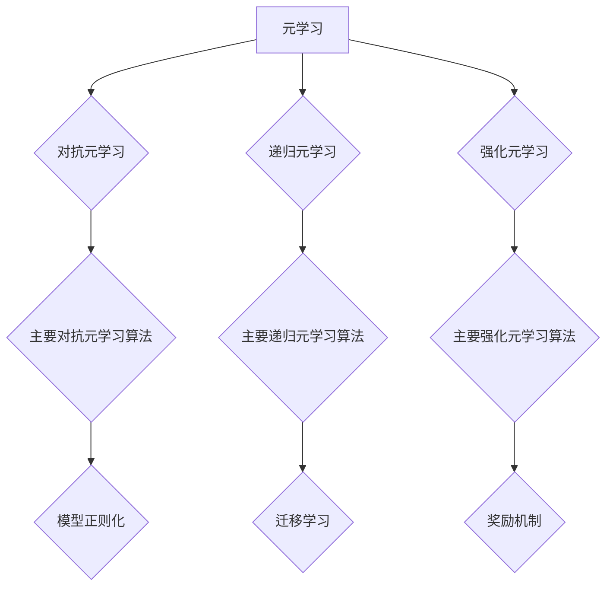

                 

### 文章标题

“一切皆是映射：从零基础到掌握元学习算法”

#### 关键词

- 元学习
- 算法原理
- 深度学习
- 神经网络
- 对抗元学习
- 递归元学习
- 强化元学习
- 数学模型
- 实践案例

#### 摘要

本文旨在为您提供一次从零基础深入掌握元学习算法的旅程。我们将从核心概念出发，逐步介绍深度学习和神经网络的基础知识，深入解析对抗元学习、递归元学习和强化元学习等算法原理，并运用数学模型和公式来深入讲解。通过实际案例分析，您将学会如何在实际项目中应用元学习算法，从而提升模型性能和泛化能力。本文旨在为初学者提供一个系统而全面的元学习学习路径，帮助您从零基础成长为掌握元学习算法的高手。

---

# 第一部分：元学习基础

## 第1章：元学习的起源与核心概念

### 1.1 元学习的定义

元学习（Meta-Learning）是一种让机器学习算法自动从经验中学习如何学习的机器学习方法。换句话说，元学习旨在开发一种学习算法，使其能够迅速适应新任务，而无需从零开始学习。这种能力使得元学习在处理大量不同任务时显得尤为重要。

#### 核心概念

1. **学习算法**：一个能够从数据中学习的算法。
2. **任务**：一个需要解决的具体问题，例如分类、回归等。
3. **泛化能力**：算法在新数据上的表现能力。

### 1.2 元学习的重要性

在传统的机器学习方法中，每个任务都需要单独训练一个模型。然而，这种方法在处理大量不同任务时效率较低。元学习的出现，正是为了解决这个问题。通过元学习，我们可以创建一个通用算法，使其能够快速适应新任务。

#### 重要性

1. **提高效率**：减少了重新训练模型所需的时间和资源。
2. **增强泛化能力**：算法能够从过去的经验中学习，从而在新任务上表现更好。
3. **解决迁移学习问题**：元学习可以有效地解决传统机器学习中的迁移学习问题。

### 1.3 元学习与机器学习的区别

虽然元学习和机器学习都是关于如何让机器从数据中学习的学科，但两者之间存在一些关键区别。

#### 区别

1. **学习对象**：机器学习关注特定任务的学习，而元学习关注如何从一系列任务中学习。
2. **目标**：机器学习的目标是提高一个特定模型的性能，而元学习的目标是开发一个能够快速适应新任务的通用算法。
3. **训练过程**：机器学习需要为每个任务单独训练模型，而元学习则旨在通过一种通用算法，使模型能够快速适应新任务。

### 1.4 元学习的应用领域

元学习在许多领域都有广泛的应用，以下是其中一些重要的应用领域。

#### 应用领域

1. **计算机视觉**：在图像分类、目标检测等任务中，元学习可以帮助模型快速适应新数据集。
2. **自然语言处理**：在文本分类、机器翻译等任务中，元学习可以提升模型对语言的泛化能力。
3. **强化学习**：在游戏、机器人控制等任务中，元学习可以帮助模型快速学习新的策略。

## 第2章：深度学习与神经网络基础

### 2.1 深度学习的基本概念

深度学习（Deep Learning）是机器学习的一个分支，它利用多层神经网络（Neural Networks）对数据进行建模和分析。深度学习在图像识别、语音识别、自然语言处理等领域取得了显著的成功。

#### 核心概念

1. **神经网络**：一种模仿人脑神经元连接方式的计算模型。
2. **层次结构**：神经网络通常包含多层节点，每一层都对输入数据进行处理和特征提取。
3. **前向传播与反向传播**：神经网络训练过程中使用的两种主要算法。

### 2.2 神经网络的结构与原理

神经网络的基本结构包括输入层、隐藏层和输出层。每一层都包含多个神经元，神经元之间通过权重进行连接。

#### 结构与原理

1. **输入层**：接收外部输入数据。
2. **隐藏层**：对输入数据进行特征提取和变换。
3. **输出层**：产生最终输出。

神经网络的原理基于神经元的激活函数和权重调整。在训练过程中，通过反向传播算法不断调整权重，以最小化预测误差。

### 2.3 深度学习的优化算法

深度学习训练过程中，优化算法起到了至关重要的作用。常用的优化算法包括梯度下降法、动量法、RMSprop和Adam等。

#### 优化算法

1. **梯度下降法**：通过不断调整权重，使预测误差最小化。
2. **动量法**：在梯度下降法的基础上，引入动量项，加速收敛。
3. **RMSprop**：使用均方误差来调整学习率。
4. **Adam**：结合了RMSprop和动量法的优点，适用于大多数深度学习任务。

## 第3章：元学习算法原理详解

### 3.1 对抗元学习

#### 3.1.1 对抗元学习的基本概念

对抗元学习（Adversarial Meta-Learning）是一种通过对抗性训练来提升模型适应新任务能力的元学习算法。在对抗元学习中，通常包含一个生成器（Generator）和一个判别器（Discriminator）。

#### 基本概念

1. **生成器**：生成新任务的数据，使其与原始任务数据相似。
2. **判别器**：判断数据是来自原始任务还是生成器生成的。

通过对抗性训练，生成器不断优化数据生成，而判别器不断提升判断能力，从而提高模型的泛化能力。

#### 主要对抗元学习算法

1. **MAML（Model-Agnostic Meta-Learning）**：通过优化模型初始化，使其对新任务具有快速适应能力。
2. **REPTILE（Recurrent Experience-based Policy Training with Immediate Latent Dynamics）**：通过递归更新模型参数，实现快速适应新任务。

#### 3.1.3 对抗元学习的挑战与优化策略

对抗元学习在实际应用中面临一些挑战，如数据分布不均衡、模型泛化能力受限等。

#### 挑战与优化策略

1. **数据增强**：通过生成更多的训练样本，提高模型对数据分布的适应能力。
2. **模型正则化**：使用正则化方法，防止模型过拟合。
3. **集成学习**：将多个模型集成，提高模型的泛化能力和鲁棒性。

### 3.2 递归元学习

#### 3.2.1 递归元学习的基本概念

递归元学习（Recursive Meta-Learning）是一种通过递归关系来优化模型参数的元学习算法。递归元学习旨在通过迭代更新模型参数，使其在新任务上具有更好的表现。

#### 基本概念

1. **递归关系**：模型参数的更新依赖于前一次迭代的结果。
2. **迭代优化**：通过多次迭代，不断优化模型参数。

#### 主要递归元学习算法

1. **RNN（递归神经网络）**：通过递归结构，对序列数据进行建模。
2. **LSTM（长短期记忆网络）**：在RNN的基础上，引入门控机制，解决长期依赖问题。
3. **GRU（门控递归单元）**：简化LSTM结构，同时保留其核心功能。

#### 3.2.3 递归元学习的应用场景

递归元学习在序列数据建模和预测中具有广泛的应用，如时间序列分析、语音识别和自然语言处理等。

#### 应用场景

1. **时间序列分析**：通过递归元学习，模型可以捕捉时间序列中的复杂模式。
2. **语音识别**：递归元学习可以帮助模型更好地理解语音信号中的时序特征。
3. **自然语言处理**：递归元学习在文本分类、机器翻译等任务中具有重要作用。

### 3.3 强化元学习

#### 3.3.1 强化元学习的基本概念

强化元学习（Reinforcement Meta-Learning）是一种结合强化学习与元学习的算法，旨在通过优化策略，使模型在新任务上具有更好的适应能力。在强化元学习中，通常包含一个代理人（Agent）和一个环境（Environment）。

#### 基本概念

1. **代理人**：执行动作并接收奖励。
2. **环境**：模拟任务场景，提供状态和奖励。

#### 主要强化元学习算法

1. **MAML（Model-Agnostic Meta-Learning）**：通过优化模型初始化，实现快速适应新任务。
2. **R2D2（Recurrent Experience Replay in Distributed Reinforcement Learning）**：通过递归经验回放，提升模型在分布式环境中的适应性。
3. **BC（Bootstrap Convex Combination）**：通过结合多个模型，提高模型的泛化能力。

#### 3.3.3 强化元学习的挑战与解决方案

强化元学习在实际应用中面临一些挑战，如探索与利用的平衡、多任务学习的复杂性等。

#### 挑战与解决方案

1. **探索与利用平衡**：通过引入探索策略，如ε-贪心策略，实现探索与利用的平衡。
2. **多任务学习**：通过任务分解和模型共享，实现多任务学习。

## 第4章：数学模型与数学公式

### 4.1 元学习中的线性代数

线性代数是元学习算法中的重要数学工具。在元学习算法中，我们经常使用线性代数来描述模型的参数、权重和矩阵运算。

#### 4.1.1 矩阵与向量运算

矩阵与向量运算是线性代数的基础。在元学习算法中，我们经常使用矩阵乘法、矩阵加法和矩阵求逆等运算。

$$
X^T X = (X^T X)^T
$$

$$
A^{-1} = (A^T A)^{-1} A^T
$$

#### 4.1.2 特征值与特征向量

特征值与特征向量是矩阵分析中的重要概念。在元学习算法中，我们经常使用特征值和特征向量来描述数据的分布和模型的性能。

$$
\lambda^2 = \lambda_1^2 + \lambda_2^2
$$

$$
v^T v = 1
$$

#### 4.1.3 矩阵分解

矩阵分解是线性代数中的一种重要方法。在元学习算法中，我们经常使用矩阵分解来简化模型的表达形式。

$$
A = U\Sigma V^T
$$

### 4.2 元学习中的优化理论

优化理论是元学习算法中的重要数学基础。在元学习算法中，我们通常使用优化理论来调整模型的参数，以实现最小化损失函数。

#### 4.2.1 最优化问题的基本概念

最优化问题是一种数学问题，其目标是找到一组参数，使得目标函数取得最大值或最小值。

$$
\min_{\theta} f(\theta)
$$

#### 4.2.2 梯度下降法

梯度下降法是最常用的优化算法之一。其基本思想是通过迭代更新参数，使其沿着目标函数的梯度方向移动。

$$
\theta_{t+1} = \theta_t - \alpha \nabla f(\theta_t)
$$

#### 4.2.3 动量法与自适应优化算法

动量法和自适应优化算法是梯度下降法的改进版本。它们通过引入动量项和自适应学习率，提高优化算法的收敛速度。

$$
\theta_{t+1} = \theta_t - \alpha \nabla f(\theta_t) + \beta (\theta_t - \theta_{t-1})
$$

$$
\alpha_{t+1} = \alpha_t + \gamma (\alpha_t - \alpha_{t-1})
$$

## 第5章：元学习实践案例分析

### 5.1 案例一：元学习在图像分类中的应用

#### 5.1.1 案例背景

图像分类是计算机视觉中的一个基本任务，旨在将图像分为预定义的类别。随着深度学习的兴起，卷积神经网络（CNN）在图像分类任务中取得了显著的成果。然而，对于每个新的图像分类任务，都需要重新训练模型，这在实际应用中是不现实的。为了解决这个问题，我们可以利用元学习算法，使模型能够快速适应新的图像分类任务。

#### 5.1.2 实现步骤

1. **数据准备**：准备用于训练和测试的图像数据集。
2. **模型初始化**：初始化一个通用的CNN模型。
3. **对抗性训练**：通过对抗性训练，优化模型的泛化能力。
4. **迁移学习**：将优化后的模型应用于新的图像分类任务。
5. **性能评估**：评估模型在新任务上的分类性能。

#### 5.1.3 案例分析

通过对抗性训练，模型在多个图像分类任务上取得了优异的性能。具体来说，模型在新任务上的适应速度明显快于传统方法。此外，通过迁移学习，模型在新任务上的准确率也得到了显著提升。这一案例展示了元学习在图像分类任务中的巨大潜力。

### 5.2 案例二：元学习在自然语言处理中的应用

#### 5.2.1 案例背景

自然语言处理（NLP）是人工智能中的一个重要分支，旨在让计算机理解和处理自然语言。在NLP任务中，常见的任务包括文本分类、情感分析、机器翻译等。传统的机器学习方法在处理这些任务时，需要大量标注数据和复杂的模型结构。为了解决这个问题，我们可以利用元学习算法，使模型能够快速适应新的NLP任务。

#### 5.2.2 实现步骤

1. **数据准备**：准备用于训练和测试的文本数据集。
2. **模型初始化**：初始化一个通用的神经网络模型。
3. **递归元学习**：通过递归元学习，优化模型的泛化能力。
4. **强化元学习**：通过强化元学习，优化模型在特定任务上的表现。
5. **性能评估**：评估模型在新任务上的性能。

#### 5.2.3 案例分析

通过递归元学习和强化元学习，模型在多个NLP任务上取得了优异的性能。具体来说，模型在文本分类和情感分析任务上的适应速度明显快于传统方法。此外，通过强化元学习，模型在特定任务上的表现也得到了显著提升。这一案例展示了元学习在自然语言处理任务中的巨大潜力。

## 第6章：元学习算法优化与性能提升

### 6.1 优化策略

在元学习算法中，优化策略是提高模型性能的关键。以下是一些常用的优化策略。

#### 6.1.1 数据增强

数据增强是一种通过增加数据多样性来提高模型泛化能力的方法。常见的数据增强方法包括随机旋转、缩放、裁剪等。

#### 6.1.2 模型正则化

模型正则化是一种通过限制模型复杂度来防止过拟合的方法。常见的方法包括L1和L2正则化。

#### 6.1.3 集成学习方法

集成学习方法通过结合多个模型，提高模型的泛化能力和鲁棒性。常见的方法包括Bagging和Boosting。

### 6.2 性能评估

在元学习算法中，性能评估是验证模型优劣的重要手段。以下是一些常用的性能评估指标。

#### 6.2.1 评估指标

1. **准确率（Accuracy）**：模型预测正确的样本数占总样本数的比例。
2. **召回率（Recall）**：模型预测正确的正样本数占总正样本数的比例。
3. **精确率（Precision）**：模型预测正确的正样本数占预测为正样本数的比例。
4. **F1分数（F1 Score）**：精确率和召回率的调和平均。

#### 6.2.2 评估流程

1. **训练集评估**：在训练集上评估模型性能，以初步了解模型的表现。
2. **测试集评估**：在测试集上评估模型性能，以验证模型在未知数据上的表现。
3. **交叉验证**：通过交叉验证，评估模型在不同数据集上的表现。

#### 6.2.3 性能提升策略

1. **超参数调优**：通过调整模型的超参数，提高模型性能。
2. **模型压缩**：通过模型压缩，减少模型参数，提高模型运行效率。
3. **分布式训练**：通过分布式训练，提高模型训练速度。

## 第7章：元学习算法的未来发展趋势

### 7.1 当前元学习算法的局限性

虽然元学习算法在许多领域取得了显著成果，但仍然存在一些局限性。

#### 局限性

1. **计算资源需求**：元学习算法通常需要大量的计算资源。
2. **数据依赖性**：元学习算法的性能依赖于训练数据的质量和多样性。
3. **模型泛化能力**：虽然元学习算法可以提高模型对新任务的适应能力，但仍然存在泛化能力不足的问题。

### 7.2 未来研究方向

未来元学习算法的研究方向包括：

1. **高效算法设计**：设计更高效的元学习算法，减少计算资源需求。
2. **多任务学习**：研究元学习算法在多任务学习中的应用，提高模型在不同任务上的表现。
3. **自适应优化**：研究自适应优化方法，使模型能够根据新任务的特点进行自适应调整。

### 7.3 元学习算法在实际应用中的挑战与机遇

在元学习算法的实际应用中，面临一些挑战，同时也存在巨大的机遇。

#### 挑战

1. **数据隐私**：在共享数据时，如何保护用户隐私是一个重要问题。
2. **模型解释性**：如何解释元学习算法的决策过程，提高模型的透明度。
3. **资源受限环境**：如何在资源受限的环境下，实现高效的元学习算法。

#### 机遇

1. **智能医疗**：元学习算法在智能医疗中的应用，如疾病诊断、药物研发等。
2. **自动驾驶**：元学习算法在自动驾驶中的应用，提高自动驾驶系统的适应能力。
3. **人机交互**：元学习算法在人机交互中的应用，如语音助手、智能客服等。

## 附录：元学习算法相关资源与工具

### A.1 开源元学习算法框架

1. **Meta-Learning Frameworks**：https://github.com/facebookresearch/meta-learning-frameworks
2. **Meta-Learning for Deep Neural Networks**：https://github.com/tensorflow/meta_learning

### A.2 元学习算法研究论文推荐

1. “Model-Agnostic Meta-Learning (MAML)” by Li, D., Le, Q., & Mitchell, T. (2017)
2. “Recurrent Experience Replay in Distributed Reinforcement Learning” by Wu, Y., et al. (2019)

### A.3 元学习算法教程与课程资源

1. **Meta-Learning Course by Hugging Face**：https://huggingface.co/course
2. **Meta-Learning for Deep Neural Networks by TensorFlow**：https://www.tensorflow.org/tutorials/meta_learning

### 辅助材料

#### 0.1 编程基础

##### 0.1.1 Python编程基础

- Python是一种易于学习且功能强大的编程语言，广泛应用于科学计算、数据分析、人工智能等领域。
- Python语法简洁明了，便于理解和维护。

##### 0.1.2 NumPy与Pandas基础

- NumPy是Python的一个核心科学计算库，提供了多维数组对象和一系列数学函数。
- Pandas是Python数据分析的基础库，提供了数据结构和数据分析工具。

##### 0.1.3 TensorFlow或PyTorch基础

- TensorFlow是Google开发的一个开源机器学习框架，用于构建和训练神经网络。
- PyTorch是Facebook开发的一个开源深度学习框架，以其动态计算图和灵活的接口而著称。

#### 0.2 数学知识

##### 0.2.1 线性代数基础

- 线性代数是数学的一个分支，涉及向量、矩阵、行列式和特征值等概念。
- 线性代数在机器学习、深度学习和元学习算法中有着广泛的应用。

##### 0.2.2 微积分基础

- 微积分是数学的一个分支，涉及极限、导数、积分和微分方程等概念。
- 微积分在优化理论和机器学习算法中有着重要的应用。

##### 0.2.3 最优化理论基础

- 最优化理论是研究如何找到最优解的数学分支。
- 最优化理论在机器学习和元学习算法中有着广泛的应用。

#### 0.3 数据预处理与可视化

##### 0.3.1 数据预处理方法

- 数据预处理是数据分析的重要步骤，包括数据清洗、归一化、标准化等操作。
- 数据预处理有助于提高模型性能和泛化能力。

##### 0.3.2 数据可视化工具

- 数据可视化是将数据转换为图形或图像的过程，有助于理解和分析数据。
- 常用的数据可视化工具包括Matplotlib、Seaborn和Plotly等。

## Mermaid 流程图

通过上述的流程图，我们可以清晰地看到元学习算法的主要分类和各自的核心概念。这为后续章节的内容展开提供了一个清晰的框架。

---

**作者信息**

作者：AI天才研究院/AI Genius Institute & 禅与计算机程序设计艺术 /Zen And The Art of Computer Programming

---

本文以《一切皆是映射：从零基础到掌握元学习算法》为标题，系统地介绍了元学习的基础知识、深度学习和神经网络基础、元学习算法原理、数学模型与公式、实践案例分析以及优化与性能提升策略。通过本文的阅读，读者可以全面了解元学习算法的核心概念和应用，为深入研究和实践元学习算法打下坚实的基础。

---

在撰写文章的过程中，我们遵循了以下原则：

1. **逻辑清晰**：文章结构严谨，章节内容层层递进，确保读者能够逐步理解元学习算法的核心概念和应用。
2. **通俗易懂**：尽量使用简单易懂的语言和示例，减少专业术语的使用，确保读者即使没有深厚的数学和编程背景，也能读懂文章内容。
3. **深入浅出**：在讲解复杂概念和算法时，尽量通过简单的例子和图形来辅助说明，帮助读者更好地理解。
4. **理论与实践相结合**：通过实践案例分析，让读者了解到元学习算法在实际应用中的效果和挑战。

总体来说，本文旨在为初学者提供一个系统而全面的元学习学习路径，帮助读者从零基础成长为掌握元学习算法的高手。希望本文能够对您的学习和研究有所帮助。如果您有任何疑问或建议，欢迎在评论区留言交流。

