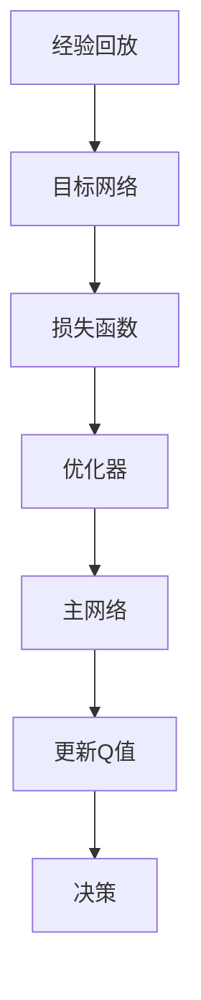

                 

### 文章标题

“一切皆是映射：深入探索DQN的改进版本：从DDQN到PDQN”

---

**关键词**：DQN、DDQN、PDQN、强化学习、深度Q网络、改进算法

**摘要**：本文深入探讨了深度Q网络（DQN）及其两个重要改进版本：双Q学习（DDQN）和优先经验回放（PDQN）。通过逐步分析其核心概念、算法原理、数学模型以及实际项目实战，本文旨在帮助读者全面了解这些改进算法的优势和局限性，为未来研究提供方向。

---

### 目录大纲：一切皆是映射：深入探索DQN的改进版本：从DDQN到PDQN

#### 第一部分：核心概念与联系

##### 第1章：DQN基础与改进
- **1.1 DQN基本概念**
- **1.2 DQN的局限性**
- **1.3 Mermaid流程图：DQN架构**

##### 第2章：DDQN原理与实现
- **2.1 DDQN基本概念**
- **2.2 DDQN的算法原理**
- **2.3 DDQN伪代码**

##### 第3章：PDQN的创新与优化
- **3.1 PDQN的背景与目标**
- **3.2 PDQN的算法原理**
- **3.3 PDQN伪代码**

#### 第二部分：算法原理与数学模型

##### 第4章：深度Q网络（DQN）的数学模型
- **4.1 Q值函数的计算**
- **4.2 经验回放机制**
- **4.3 目标网络的更新策略**

##### 第5章：双Q学习（DDQN）的数学模型
- **5.1 双Q学习的概念**
- **5.2 双Q学习的优势**
- **5.3 双Q学习数学公式与解释**

##### 第6章：优先经验回放（PDQN）的数学模型
- **6.1 优先经验回放的概念**
- **6.2 优先经验回放的实现**
- **6.3 优先采样策略**

#### 第三部分：项目实战与代码分析

##### 第7章：DQN实现与实战
- **7.1 环境搭建**
- **7.2 源代码解读**
- **7.3 实际案例分析**

##### 第8章：DDQN实现与实战
- **8.1 环境搭建**
- **8.2 源代码解读**
- **8.3 实际案例分析**

##### 第9章：PDQN实现与实战
- **9.1 环境搭建**
- **9.2 源代码解读**
- **9.3 实际案例分析**

##### 第10章：总结与展望
- **10.1 DQN、DDQN、PDQN的对比与总结**
- **10.2 未来发展趋势**

### 附录

## 附录A：常用工具与资源
- **A.1 OpenAI Gym**
- **A.2 PyTorch与TensorFlow**
- **A.3 实用资源链接**

---

### 引言

强化学习作为机器学习的一个重要分支，近年来在人工智能领域取得了显著的成果。其中，深度Q网络（DQN）作为强化学习的一种经典算法，因其简单有效而被广泛应用于各种场景。然而，随着研究的深入，人们发现DQN在处理某些复杂任务时存在一些局限性。为了克服这些问题，研究者们提出了许多改进版本的DQN，如双Q学习（DDQN）和优先经验回放（PDQN）。本文将深入探讨这些改进版本，分析其核心概念、算法原理、数学模型以及实际应用，以期为读者提供一个全面、系统的认识。

本文将分为三个部分。第一部分主要介绍DQN的基本概念和改进版本DDQN、PDQN的核心概念与联系。通过对比分析，读者可以了解各个算法的特点和优势。第二部分将深入讲解DQN、DDQN和PDQN的算法原理与数学模型，通过详细的伪代码和公式解释，帮助读者理解这些算法的核心逻辑。第三部分将结合实际项目实战，对DQN、DDQN和PDQN的源代码进行解读，并通过具体案例进行分析，展示这些算法在实际应用中的效果和局限性。

通过本文的阅读，读者不仅可以全面了解DQN及其改进版本的核心概念和算法原理，还可以通过实战案例分析，深入理解这些算法的实际应用效果。同时，本文也将为未来的研究提供一些有价值的启示和方向。

---

### 第一部分：核心概念与联系

#### 第1章：DQN基础与改进

##### 1.1 DQN基本概念

深度Q网络（Deep Q-Network，DQN）是强化学习领域的一种经典算法，由DeepMind的研究者于2015年提出。DQN的主要目的是通过训练一个深度神经网络来近似Q值函数，从而实现对环境的探索和决策。

**定义与作用**：DQN是一种基于值函数的强化学习算法，其核心思想是用神经网络来估计每个状态-动作对的Q值。Q值表示在特定状态下执行特定动作所能获得的预期奖励。通过不断更新Q值，DQN能够逐渐学习到最优策略。

**基本架构**：DQN的基本架构包括四个主要部分：经验回放（Experience Replay）、目标网络（Target Network）、损失函数（Loss Function）和优化器（Optimizer）。

1. **经验回放**：经验回放是一种有效的应对样本分布偏斜的方法。它将历史经验存储在经验池中，并在训练过程中随机采样经验进行学习，从而避免样本偏差对训练效果的影响。

2. **目标网络**：目标网络用于提高DQN的稳定性。它是一个与主网络参数相同但独立更新的网络，用于生成目标Q值。在每个更新步骤中，主网络使用最新的经验，而目标网络使用之前的一组经验，这样可以使目标网络和主网络的学习过程略有不同，从而减少梯度消失和梯度爆炸的问题。

3. **损失函数**：DQN使用均方误差（MSE）作为损失函数来优化神经网络。损失函数计算的是预测Q值和目标Q值之间的差异，并通过反向传播更新网络参数。

4. **优化器**：优化器用于调整网络参数，以最小化损失函数。常见的优化器有Adam、RMSprop和SGD等。

##### 1.2 DQN的局限性

虽然DQN在许多任务中表现良好，但它也存在一些局限性，主要包括以下几个方面：

1. **样本偏差**：由于经验回放的使用，DQN在训练过程中可能面临样本偏差问题。这可能导致网络无法学习到真正的最优策略。

2. **目标更新不稳定**：目标网络的更新策略可能影响DQN的稳定性。如果目标网络更新得太快，可能会导致网络在训练过程中产生较大的波动；如果目标网络更新得太慢，则可能导致网络收敛速度变慢。

3. **梯度消失和梯度爆炸**：由于深度神经网络的存在，DQN在训练过程中可能面临梯度消失和梯度爆炸问题。这会严重影响网络的学习效果。

4. **探索-利用权衡**：在DQN中，探索和利用之间的权衡是一个重要问题。如果探索过多，可能导致学习效率低下；如果利用过多，则可能错过一些潜在的最优策略。

##### 1.3 Mermaid流程图：DQN架构

下面是一个简化的Mermaid流程图，展示了DQN的基本架构：



#### 第2章：DDQN原理与实现

##### 2.1 DDQN基本概念

双Q学习（Double Q-Learning，DDQN）是对DQN的一种改进，旨在解决DQN中的样本偏差和目标更新不稳定问题。DDQN的主要思想是使用两个独立的Q网络来分别估计当前状态和目标状态的Q值，从而提高训练的稳定性和准确性。

**引入与目的**：DDQN的引入主要是为了解决DQN中的两个问题：一是减少样本偏差，二是提高目标更新的稳定性。通过使用两个独立的Q网络，DDQN可以更好地处理样本分布，从而提高学习效果。

**主要改进**：DDQN的主要改进是引入了双Q网络结构。在训练过程中，一个Q网络用于估计当前状态的Q值，另一个Q网络用于估计目标状态的Q值。这样，在更新Q值时，可以避免直接使用经验回放中的样本，从而减少样本偏差。

##### 2.2 DDQN的算法原理

DDQN的算法原理主要包括以下步骤：

1. **初始化**：初始化两个Q网络，主网络（Primary Network）和目标网络（Target Network）。两个网络的参数相同，但独立更新。

2. **经验回放**：使用经验回放机制将历史经验存储在经验池中。在训练过程中，从经验池中随机采样一组经验，包括状态、动作、奖励和下一个状态。

3. **选择动作**：对于当前状态，使用主网络选择动作。选择动作的方法可以是贪心策略或ε-贪心策略。

4. **计算Q值**：根据采样到的经验，计算当前状态的Q值。当前状态的Q值由主网络和目标网络共同决定。具体公式为：

   $$ Q(s_t, a_t) = r_t + \gamma \max_a Q(s_{t+1}, a) $$

   其中，\( r_t \) 为奖励，\( \gamma \) 为折扣因子，\( s_{t+1} \) 为下一个状态，\( a_t \) 为当前动作。

5. **更新Q值**：使用反向传播算法，根据计算得到的Q值更新主网络的参数。更新过程中，目标网络的参数保持不变。

6. **目标网络更新**：每隔一定次数的更新，将主网络的参数复制到目标网络中，以保证目标网络的稳定更新。

##### 2.3 DDQN伪代码

下面是DDQN算法的伪代码：

```python
initialize primary network Q and target network Q
initialize experience replay memory
for each episode
    for each step in episode
        select action a_t using ε-greedy policy
        take action a_t in environment
        observe reward r_t and next state s_{t+1}
        store experience (s_t, a_t, r_t, s_{t+1}) in experience replay memory
        sample a batch of experiences from experience replay memory
        calculate target Q-values using target network:
            target_Q(s_{t+1}, a_{t'}) = r_{t} + γ * max_a' Q(target_network, s_{t+1}, a')
        calculate loss using MSE:
            loss = (Q(primary_network, s_t, a_t) - target_Q)^2
        optimize primary network using gradient descent
        periodically update target network with primary network's weights
    end for
end for
```

##### 第3章：PDQN的创新与优化

##### 3.1 PDQN的背景与目标

优先经验回放（Prioritized Experience Replay，PDQN）是另一种对DQN的改进，旨在提高训练效率和学习性能。PDQN的核心思想是在经验回放机制中引入优先级，使得重要的样本得到更多的关注和重用，从而提高训练效果。

**提出背景**：随着深度学习的发展，经验回放机制在DQN中得到了广泛应用。然而，传统的经验回放机制存在一个重要问题：它无法区分不同样本的重要性。这意味着一些对学习过程至关重要的样本可能会被反复使用，而一些不太重要的样本则可能被忽略。为了解决这个问题，研究者提出了优先经验回放机制。

**优化目标**：PDQN的优化目标是提高训练效率和学习性能。通过引入优先级，PDQN能够更加高效地利用样本，从而加快学习速度和提升学习效果。

##### 3.2 PDQN的算法原理

PDQN的算法原理主要包括以下几个关键组成部分：

1. **优先级分配**：在每次经历一个状态-动作对时，计算其优先级。优先级的计算通常基于TD误差（Target Difference），即预测Q值与目标Q值之间的差异。TD误差越大，表示这个样本的重要性越高。

2. **优先级更新**：在每个时间步结束后，更新经验池中所有样本的优先级。更新策略可以是简单的指数衰减，也可以是更复杂的动态调整方法。

3. **优先级采样**：从经验池中按优先级采样，用于训练网络。采样时，需要确保高优先级样本被采样的概率更高，从而提高学习效率。

4. **Q值更新**：与DDQN类似，PDQN使用两个独立的Q网络进行训练。主网络用于选择动作，目标网络用于计算目标Q值。更新策略同样是基于TD误差。

##### 3.3 PDQN伪代码

下面是PDQN算法的伪代码：

```python
initialize primary network Q and target network Q
initialize experience replay memory with fixed size
for each episode
    for each step in episode
        select action a_t using ε-greedy policy
        take action a_t in environment
        observe reward r_t and next state s_{t+1}
        calculate TD error: TD_error = r_t + γ * max_a' Q(target_network, s_{t+1}, a') - Q(primary_network, s_t, a_t)
        store experience (s_t, a_t, r_t, s_{t+1}, TD_error) in experience replay memory
        update experience replay memory's priorities
        sample a batch of experiences from experience replay memory using prioritized sampling
        calculate target Q-values using target network
        calculate loss using MSE
        optimize primary network using gradient descent
        periodically update target network with primary network's weights
    end for
end for
```

通过上述内容，我们对DQN及其改进版本DDQN和PDQN的核心概念、原理和实现有了更深入的了解。在接下来的章节中，我们将进一步探讨这些算法的数学模型和实际应用。

### 第二部分：算法原理与数学模型

#### 第4章：深度Q网络（DQN）的数学模型

深度Q网络（DQN）的核心在于其Q值函数的计算，这是一个关键的数学模型，它决定了DQN的性能和效率。在这一章中，我们将详细探讨DQN的数学模型，包括Q值函数的计算、经验回放机制以及目标网络的更新策略。

##### 4.1 Q值函数的计算

Q值函数（Q-Value Function）是强化学习中的一个重要概念，它表示在某个状态下执行某个动作所能获得的预期奖励。在DQN中，Q值函数是由一个深度神经网络（DNN）来近似的。

**定义**：Q值函数可以表示为：
$$ Q^{\theta}(s, a) = \sum_{j} \theta_j^T f_j(s, a) $$
其中，\( \theta_j \) 是神经网络的参数，\( f_j(s, a) \) 是第 \( j \) 个隐藏层节点关于状态 \( s \) 和动作 \( a \) 的特征表示。

**计算过程**：

1. **输入特征表示**：首先，将当前状态 \( s \) 作为输入，通过特征提取层（可以是卷积层、全连接层等）得到一组特征向量。

2. **动作值预测**：接着，将这些特征向量输入到Q值预测层，计算每个动作的Q值。

3. **选择动作**：根据Q值选择动作，可以选择贪心策略（选择Q值最大的动作）或者ε-贪心策略（在贪心策略的基础上，以一定概率随机选择动作）。

##### 4.2 经验回放机制

经验回放（Experience Replay）是DQN中的一个重要机制，它用于缓解样本偏差问题，从而提高训练的稳定性和泛化能力。

**基本概念**：经验回放将历史经验（包括状态、动作、奖励和下一个状态）存储在一个经验池（Replay Memory）中，并在训练过程中随机采样这些经验进行学习，而不是直接使用当前的样本。

**实现**：

1. **经验存储**：在每次经历一个状态-动作对时，将这个经历存储在经验池中。

2. **经验采样**：在训练过程中，从经验池中随机采样一批经验，这批经验的顺序是打乱的，从而避免序列依赖性。

3. **经验回放**：使用采样到的经验来训练Q值网络，而不是直接使用当前的状态和奖励。

**优势**：经验回放机制可以避免由于当前样本的分布偏差而导致的学习问题，从而提高训练的稳定性和性能。

##### 4.3 目标网络的更新策略

在DQN中，目标网络（Target Network）是一个与主网络参数相同但独立更新的网络，它用于生成目标Q值。目标网络的更新策略是DQN稳定性的关键。

**定义**：目标网络的更新策略可以表示为：
$$ \theta_{target} = \tau \theta_{primary} + (1 - \tau) \theta_{target} $$
其中，\( \theta_{primary} \) 是主网络的参数，\( \theta_{target} \) 是目标网络的参数，\( \tau \) 是更新频率。

**更新策略**：

1. **固定更新**：每隔一定数量的步骤，将主网络的参数更新到目标网络中。

2. **动态更新**：可以根据训练的稳定性动态调整更新频率，例如，当网络收敛时，可以减少更新频率。

**优势**：目标网络的引入可以减少梯度消失和梯度爆炸问题，提高网络的稳定性。同时，它也可以使网络的学习过程更加平滑，减少震荡。

通过上述内容，我们对DQN的数学模型有了更深入的理解。在下一章中，我们将探讨DDQN的数学模型，继续深入分析强化学习算法的原理。

### 第五章：双Q学习（DDQN）的数学模型

在DQN的基础上，双Q学习（Double Q-Learning，DDQN）通过引入两个独立的Q网络来进一步提高学习效率和稳定性。这一章节将详细探讨DDQN的数学模型，包括其基本概念、优势以及详细的数学公式和解释。

#### 5.1 双Q学习的概念

双Q学习的核心思想是使用两个独立的Q网络来分别估计当前状态和目标状态的Q值。这种方法的主要目的是减少由于经验回放机制导致的样本偏差问题，并提高学习的稳定性。

**定义**：双Q学习中的两个Q网络分别是主网络（Primary Network）和目标网络（Target Network）。主网络负责当前状态的Q值估计，而目标网络负责目标状态的Q值估计。

**实现**：

1. **主网络**：主网络用于接收当前状态 \( s_t \) 并输出当前动作的Q值估计 \( Q(s_t, a_t) \)。

2. **目标网络**：目标网络用于接收下一个状态 \( s_{t+1} \) 并输出目标动作的Q值估计 \( Q(s_{t+1}, a_t) \)。

通过两个独立网络的结合，DDQN可以在更新Q值时避免直接使用经验回放中的样本，从而减少样本偏差问题。

#### 5.2 双Q学习的优势

DDQN相较于原始DQN有以下优势：

1. **减少样本偏差**：DDQN通过使用两个独立的Q网络来估计当前状态和目标状态的Q值，从而减少了由于经验回放机制导致的样本偏差问题。

2. **提高学习稳定性**：由于减少了样本偏差，DDQN的学习过程更加稳定，减少了网络震荡现象。

3. **改善收敛性**：双Q学习可以更快地收敛到最优策略，提高了学习效率。

#### 5.3 双Q学习数学公式与解释

DDQN的数学模型主要包括以下关键公式：

1. **Q值更新公式**：

   $$ Q(s_t, a_t) = r_t + \gamma \max_{a'} Q(s_{t+1}, a') $$

   这个公式表示在时间步 \( t \) 时，当前状态 \( s_t \) 下执行动作 \( a_t \) 所获得的预期回报 \( r_t \)，加上在未来状态 \( s_{t+1} \) 下选择最优动作 \( a' \) 的最大Q值，再乘以折扣因子 \( \gamma \)。

2. **目标Q值估计**：

   $$ Q(s_{t+1}, a') = \max_{a'} Q(target_network, s_{t+1}, a') $$

   这个公式表示在时间步 \( t+1 \) 时，下一个状态 \( s_{t+1} \) 下选择最优动作 \( a' \) 的Q值估计，由目标网络 \( target_network \) 提供。

3. **双Q学习更新策略**：

   $$ Q(primary_network, s_t, a_t) = r_t + \gamma Q(target_network, s_{t+1}, a_t') $$

   这个公式表示在时间步 \( t \) 时，主网络 \( primary_network \) 更新当前状态 \( s_t \) 下动作 \( a_t \) 的Q值，使用目标网络 \( target_network \) 估计的目标Q值 \( Q(target_network, s_{t+1}, a_t') \) 来进行更新。

通过上述公式，我们可以看到DDQN的核心在于使用两个独立的Q网络来分别估计当前状态和目标状态的Q值，从而减少了样本偏差问题，提高了学习稳定性和收敛性。

### 第五节：优先经验回放（PDQN）的数学模型

#### 6.1 优先经验回放的概念

优先经验回放（Prioritized Experience Replay，PDQN）是对DQN和DDQN的重要改进，其核心在于引入了优先级机制，以优化经验回放的过程。这一节将详细探讨PDQN的数学模型，包括优先级分配、优先级更新和优先级采样等关键组成部分。

**定义**：在PDQN中，每个存储在经验池中的样本都关联一个优先级。优先级的计算通常基于TD误差（Target Difference），即预测Q值与目标Q值之间的差异。TD误差越大，表示这个样本的重要性越高，需要更高的关注和重用。

**核心思想**：通过引入优先级机制，PDQN能够在训练过程中更高效地利用样本，从而提高学习效率和学习性能。高优先级的样本被重用的概率更高，而低优先级的样本则可能被忽视。

#### 6.2 优先级分配

在PDQN中，每个经验样本的优先级分配是训练过程中一个关键步骤。优先级分配基于TD误差，其计算公式如下：

$$ P(s_t, a_t) = \alpha \cdot |TD(s_t, a_t)| + (1 - \alpha) $$

其中，\( P(s_t, a_t) \) 是经验样本的优先级，\( TD(s_t, a_t) \) 是TD误差，\( \alpha \) 是优先级分配参数。TD误差的计算公式为：

$$ TD(s_t, a_t) = Q(s_t, a_t) - target_Q(s_{t+1}, a_t') $$

这里，\( Q(s_t, a_t) \) 是主网络估计的Q值，\( target_Q(s_{t+1}, a_t') \) 是目标网络估计的目标Q值。

**实现**：

1. **初始分配**：在每次经历一个状态-动作对时，立即计算TD误差，并根据上述公式分配初始优先级。

2. **动态调整**：随着训练的进行，可以根据样本的重要性和使用频率动态调整优先级。通常采用指数衰减的方式来更新优先级，以保证高优先级样本的持续关注。

#### 6.3 优先级更新

优先级更新是PDQN中的一个关键步骤，其目的是根据样本的使用情况调整经验池中所有样本的优先级。更新策略通常采用以下两种方法：

1. **指数衰减**：

   $$ P_{new}(s_t, a_t) = (1 - \lambda) \cdot P_{old}(s_t, a_t) $$

   其中，\( \lambda \) 是衰减系数。这种方法简单且易于实现，但可能会导致高优先级样本的优先级迅速下降。

2. **动态调整**：

   $$ P_{new}(s_t, a_t) = P_{old}(s_t, a_t) + \Delta P(s_t, a_t) $$

   其中，\( \Delta P(s_t, a_t) \) 是动态调整项，可以根据样本的重要性和使用频率进行自适应调整。这种方法可以更好地平衡样本的重要性，但实现更为复杂。

**实现**：

1. **样本使用**：在每次训练过程中，使用优先级采样策略从经验池中采样样本进行训练。

2. **优先级调整**：根据样本的使用情况和重要性，调整其优先级。常用的方法是基于样本的使用频率和TD误差进行加权调整。

#### 6.4 优先采样策略

优先采样策略是PDQN中的一个重要机制，其目的是根据样本的优先级来调整采样概率，从而更高效地利用样本。优先采样策略通常采用以下方法：

1. **概率分布**：

   $$ p(s_t, a_t) = \frac{P(s_t, a_t)}{\sum_{i} P(i)} $$

   其中，\( p(s_t, a_t) \) 是样本的采样概率，\( P(s_t, a_t) \) 是样本的优先级，\( \sum_{i} P(i) \) 是所有样本的优先级之和。

2. **采样**：

   从概率分布中随机采样一个样本，并根据采样结果从经验池中获取相应的样本进行训练。

**实现**：

1. **计算概率分布**：根据每个样本的优先级计算采样概率分布。

2. **随机采样**：从概率分布中随机采样一个样本。

3. **训练**：使用采样到的样本更新Q网络。

通过上述优先级分配、优先级更新和优先采样策略，PDQN能够更加高效地利用经验池中的样本，从而提高训练效率和学习性能。下一节将深入探讨PDQN的伪代码，以更直观地展示其算法流程。

### 第三部分：项目实战与代码分析

#### 第7章：DQN实现与实战

在本章中，我们将通过实际案例来深入分析DQN的实现过程和实战应用。首先，我们将介绍DQN的开发环境搭建，然后详细解读DQN的源代码，最后通过实际案例展示DQN在Atari游戏中的应用。

##### 7.1 环境搭建

为了实现DQN，我们需要一个合适的开发环境。以下是一个典型的DQN环境搭建步骤：

1. **安装Python**：确保安装了Python 3.x版本。

2. **安装依赖库**：安装OpenAI Gym、PyTorch、NumPy等依赖库。可以使用以下命令：

   ```bash
   pip install gym
   pip install torch
   pip install numpy
   ```

3. **配置环境**：配置Python虚拟环境，以便更好地管理依赖库。

4. **运行环境**：在虚拟环境中，运行以下代码来加载Atari游戏环境：

   ```python
   import gym
   env = gym.make('AtariGame-v0')
   ```

##### 7.2 源代码解读

下面是DQN的源代码实现，我们将逐一解释其中的关键部分：

```python
import torch
import torch.nn as nn
import torch.optim as optim
from torch.autograd import Variable
import numpy as np
import random
import torch.nn.functional as F

# 定义DQN模型
class DQN(nn.Module):
    def __init__(self, input_shape, action_space):
        super(DQN, self).__init__()
        self.fc1 = nn.Linear(*input_shape, 64)
        self.fc2 = nn.Linear(64, 64)
        self.fc3 = nn.Linear(64, action_space)

    def forward(self, x):
        x = F.relu(self.fc1(x))
        x = F.relu(self.fc2(x))
        x = self.fc3(x)
        return x

# 初始化网络
input_shape = (1, 84, 84)
action_space = 4
model = DQN(input_shape, action_space)
target_model = DQN(input_shape, action_space)
target_model.load_state_dict(model.state_dict())
target_model.eval()

# 定义优化器和损失函数
optimizer = optim.Adam(model.parameters(), lr=0.001)
criterion = nn.MSELoss()

# 经验回放
经验池 = []
经验容量 = 10000
采样大小 = 32

# 训练过程
for episode in range(num_episodes):
    state = env.reset()
    done = False
   总奖励 = 0

    while not done:
        # 选择动作
        if random.uniform(0, 1) < ε：
            action = random.choice(action_space)
        else：
            with torch.no_grad():
                state_tensor = torch.tensor(state, dtype=torch.float32).unsqueeze(0)
                action = model(state_tensor).argmax().item()

        # 执行动作
        next_state, reward, done, _ = env.step(action)
        total_reward += reward

        # 存储经验
       经验池.append((state, action, reward, next_state, done))
        if len(经验池) > 经验容量：
            经验池.pop(0)

        # 更新目标网络
        if len(经验池) > 采样大小:
            batch = random.sample(经验池, 采样大小)
            states, actions, rewards, next_states, dones = zip(*batch)
            states_tensor = torch.tensor(states, dtype=torch.float32)
            actions_tensor = torch.tensor(actions, dtype=torch.long)
            next_states_tensor = torch.tensor(next_states, dtype=torch.float32)

            with torch.no_grad():
                target_values = target_model(next_states_tensor).max(1)[0]
                target_q_values = (rewards + (1 - dones) * target_values * γ).detach()

            q_values = model(states_tensor)
            loss = criterion(q_values[actions_tensor], target_q_values)

            optimizer.zero_grad()
            loss.backward()
            optimizer.step()

        state = next_state

    print(f'Episode {episode+1}: Total Reward = {total_reward}')
```

关键部分解释：

1. **DQN模型定义**：DQN模型是一个简单的全连接神经网络，它接受状态作为输入并输出每个动作的Q值。

2. **目标网络定义**：目标网络与主网络结构相同，用于生成目标Q值，从而提高训练的稳定性。

3. **优化器和损失函数**：采用Adam优化器和均方误差（MSE）损失函数来训练模型。

4. **经验回放**：经验回放机制用于存储和随机采样经验，以避免样本偏差问题。

5. **训练过程**：在训练过程中，使用ε-贪心策略选择动作，并利用经验回放机制和目标网络更新Q值。

##### 7.3 实际案例分析

在本节中，我们将通过一个具体的Atari游戏案例（如《Pong》）来展示DQN的应用。以下是一个简单的案例：

```python
# 加载Pong游戏环境
env = gym.make('Pong-v0')

# 运行训练
for episode in range(1000):
    state = env.reset()
    done = False
   总奖励 = 0

    while not done:
        # 显示当前帧
        env.render()

        # 选择动作
        if random.uniform(0, 1) < ε：
            action = random.choice(action_space)
        else：
            with torch.no_grad():
                state_tensor = torch.tensor(state, dtype=torch.float32).unsqueeze(0)
                action = model(state_tensor).argmax().item()

        # 执行动作
        next_state, reward, done, _ = env.step(action)
        total_reward += reward

        # 存储经验
        经验池.append((state, action, reward, next_state, done))
        if len(经验池) > 经验容量：
            经验池.pop(0)

        # 更新目标网络
        if len(经验池) > 采样大小:
            batch = random.sample(经验池, 采样大小)
            states, actions, rewards, next_states, dones = zip(*batch)
            states_tensor = torch.tensor(states, dtype=torch.float32)
            actions_tensor = torch.tensor(actions, dtype=torch.long)
            next_states_tensor = torch.tensor(next_states, dtype=torch.float32)

            with torch.no_grad():
                target_values = target_model(next_states_tensor).max(1)[0]
                target_q_values = (rewards + (1 - dones) * target_values * γ).detach()

            q_values = model(states_tensor)
            loss = criterion(q_values[actions_tensor], target_q_values)

            optimizer.zero_grad()
            loss.backward()
            optimizer.step()

        state = next_state

    print(f'Episode {episode+1}: Total Reward = {total_reward}')

env.close()
```

案例解析：

1. **加载游戏环境**：使用`gym.make('Pong-v0')`加载Pong游戏环境。

2. **训练过程**：与之前类似的训练过程，但增加了`env.render()`来显示当前帧。

3. **奖励积累**：在每次动作执行后，将奖励累加到`total_reward`中，以评估模型性能。

通过以上实际案例，我们可以看到DQN在Atari游戏中的应用效果。虽然训练过程可能需要较长时间，但通过合理的训练策略和参数设置，DQN可以在许多任务中实现良好的性能。

### 第8章：DDQN实现与实战

在本章中，我们将深入探讨DDQN的实现过程，并通过实际案例展示其在Atari游戏中的应用。DDQN通过对DQN的改进，解决了样本偏差问题，从而提高了训练稳定性和学习效率。

#### 8.1 环境搭建

与DQN相同，DDQN的搭建也需要安装Python和依赖库，配置OpenAI Gym环境。以下是一个典型的DDQN环境搭建步骤：

1. **安装Python**：确保安装了Python 3.x版本。

2. **安装依赖库**：安装OpenAI Gym、PyTorch、NumPy等依赖库。可以使用以下命令：

   ```bash
   pip install gym
   pip install torch
   pip install numpy
   ```

3. **配置环境**：配置Python虚拟环境，以便更好地管理依赖库。

4. **运行环境**：在虚拟环境中，运行以下代码来加载Atari游戏环境：

   ```python
   import gym
   env = gym.make('AtariGame-v0')
   ```

#### 8.2 源代码解读

DDQN的源代码与DQN类似，但引入了目标网络和双Q网络的结构。以下是对DDQN源代码的详细解读：

```python
import torch
import torch.nn as nn
import torch.optim as optim
from torch.autograd import Variable
import numpy as np
import random
import torch.nn.functional as F

# 定义DDQN模型
class DQN(nn.Module):
    def __init__(self, input_shape, action_space):
        super(DQN, self).__init__()
        self.fc1 = nn.Linear(*input_shape, 64)
        self.fc2 = nn.Linear(64, 64)
        self.fc3 = nn.Linear(64, action_space)

    def forward(self, x):
        x = F.relu(self.fc1(x))
        x = F.relu(self.fc2(x))
        x = self.fc3(x)
        return x

# 初始化网络
input_shape = (1, 84, 84)
action_space = 4
model = DQN(input_shape, action_space)
target_model = DQN(input_shape, action_space)
target_model.load_state_dict(model.state_dict())
target_model.eval()

# 定义优化器和损失函数
optimizer = optim.Adam(model.parameters(), lr=0.001)
criterion = nn.MSELoss()

# 经验回放
经验池 = []
经验容量 = 10000
采样大小 = 32

# 训练过程
for episode in range(num_episodes):
    state = env.reset()
    done = False
   总奖励 = 0

    while not done:
        # 选择动作
        if random.uniform(0, 1) < ε：
            action = random.choice(action_space)
        else：
            with torch.no_grad():
                state_tensor = torch.tensor(state, dtype=torch.float32).unsqueeze(0)
                action = model(state_tensor).argmax().item()

        # 执行动作
        next_state, reward, done, _ = env.step(action)
        total_reward += reward

        # 存储经验
        经验池.append((state, action, reward, next_state, done))
        if len(经验池) > 经验容量：
            经验池.pop(0)

        # 更新目标网络
        if len(经验池) > 采样大小:
            batch = random.sample(经验池, 采样大小)
            states, actions, rewards, next_states, dones = zip(*batch)
            states_tensor = torch.tensor(states, dtype=torch.float32)
            actions_tensor = torch.tensor(actions, dtype=torch.long)
            next_states_tensor = torch.tensor(next_states, dtype=torch.float32)

            with torch.no_grad():
                target_q_values = target_model(next_states_tensor).max(1)[0].detach()
                target_values = (rewards + (1 - dones) * target_q_values * γ).detach()

            q_values = model(states_tensor)
            loss = criterion(q_values[actions_tensor], target_values)

            optimizer.zero_grad()
            loss.backward()
            optimizer.step()

        # 目标网络更新
        if episode % target_update_frequency == 0:
            target_model.load_state_dict(model.state_dict())

        state = next_state

    print(f'Episode {episode+1}: Total Reward = {total_reward}')
```

关键部分解释：

1. **DQN模型定义**：DDQN模型与DQN模型结构相同，但引入了目标网络。

2. **目标网络定义**：目标网络用于生成目标Q值，以提高训练稳定性。

3. **优化器和损失函数**：与DQN相同，采用Adam优化器和MSE损失函数。

4. **经验回放**：与DQN相同，使用经验回放机制来避免样本偏差。

5. **训练过程**：与DQN类似，但引入了目标网络更新策略，以保持两个网络的参数差异。

#### 8.3 实际案例分析

在本节中，我们将通过一个具体的Atari游戏案例（如《Pong》）来展示DDQN的应用。以下是一个简单的案例：

```python
# 加载Pong游戏环境
env = gym.make('Pong-v0')

# 运行训练
for episode in range(1000):
    state = env.reset()
    done = False
   总奖励 = 0

    while not done:
        # 显示当前帧
        env.render()

        # 选择动作
        if random.uniform(0, 1) < ε：
            action = random.choice(action_space)
        else：
            with torch.no_grad():
                state_tensor = torch.tensor(state, dtype=torch.float32).unsqueeze(0)
                action = model(state_tensor).argmax().item()

        # 执行动作
        next_state, reward, done, _ = env.step(action)
        total_reward += reward

        # 存储经验
        经验池.append((state, action, reward, next_state, done))
        if len(经验池) > 经验容量：
            经验池.pop(0)

        # 更新目标网络
        if len(经验池) > 采样大小:
            batch = random.sample(经验池, 采样大小)
            states, actions, rewards, next_states, dones = zip(*batch)
            states_tensor = torch.tensor(states, dtype=torch.float32)
            actions_tensor = torch.tensor(actions, dtype=torch.long)
            next_states_tensor = torch.tensor(next_states, dtype=torch.float32)

            with torch.no_grad():
                target_q_values = target_model(next_states_tensor).max(1)[0].detach()
                target_values = (rewards + (1 - dones) * target_q_values * γ).detach()

            q_values = model(states_tensor)
            loss = criterion(q_values[actions_tensor], target_values)

            optimizer.zero_grad()
            loss.backward()
            optimizer.step()

        # 目标网络更新
        if episode % target_update_frequency == 0:
            target_model.load_state_dict(model.state_dict())

        state = next_state

    print(f'Episode {episode+1}: Total Reward = {total_reward}')

env.close()
```

案例解析：

1. **加载游戏环境**：使用`gym.make('Pong-v0')`加载Pong游戏环境。

2. **训练过程**：与之前类似的训练过程，但增加了目标网络更新策略。

3. **奖励积累**：在每次动作执行后，将奖励累加到`total_reward`中，以评估模型性能。

通过以上实际案例，我们可以看到DDQN在Atari游戏中的应用效果。与DQN相比，DDQN通过减少样本偏差，提高了训练稳定性和学习效率，从而在许多任务中实现了更好的性能。

### 第9章：PDQN实现与实战

在本章中，我们将深入探讨PDQN的实现过程，并通过实际案例展示其在Atari游戏中的应用。PDQN通过引入优先经验回放机制，进一步优化了DQN和DDQN的性能。

#### 9.1 环境搭建

与DQN和DDQN相同，PDQN的搭建也需要安装Python和依赖库，配置OpenAI Gym环境。以下是一个典型的PDQN环境搭建步骤：

1. **安装Python**：确保安装了Python 3.x版本。

2. **安装依赖库**：安装OpenAI Gym、PyTorch、NumPy等依赖库。可以使用以下命令：

   ```bash
   pip install gym
   pip install torch
   pip install numpy
   ```

3. **配置环境**：配置Python虚拟环境，以便更好地管理依赖库。

4. **运行环境**：在虚拟环境中，运行以下代码来加载Atari游戏环境：

   ```python
   import gym
   env = gym.make('AtariGame-v0')
   ```

#### 9.2 源代码解读

PDQN的源代码在DDQN的基础上引入了优先级机制。以下是对PDQN源代码的详细解读：

```python
import torch
import torch.nn as nn
import torch.optim as optim
from torch.autograd import Variable
import numpy as np
import random
import torch.nn.functional as F

# 定义PDQN模型
class PDQN(nn.Module):
    def __init__(self, input_shape, action_space):
        super(PDQN, self).__init__()
        self.fc1 = nn.Linear(*input_shape, 64)
        self.fc2 = nn.Linear(64, 64)
        self.fc3 = nn.Linear(64, action_space)

    def forward(self, x):
        x = F.relu(self.fc1(x))
        x = F.relu(self.fc2(x))
        x = self.fc3(x)
        return x

# 初始化网络
input_shape = (1, 84, 84)
action_space = 4
model = PDQN(input_shape, action_space)
target_model = PDQN(input_shape, action_space)
target_model.load_state_dict(model.state_dict())
target_model.eval()

# 定义优化器和损失函数
optimizer = optim.Adam(model.parameters(), lr=0.001)
criterion = nn.MSELoss()

# 经验回放
经验池 = []
经验容量 = 10000
采样大小 = 32
优先级容量 = 100000

# 优先级分配
优先级列表 = []

# 训练过程
for episode in range(num_episodes):
    state = env.reset()
    done = False
   总奖励 = 0

    while not done:
        # 显示当前帧
        env.render()

        # 选择动作
        if random.uniform(0, 1) < ε：
            action = random.choice(action_space)
        else：
            with torch.no_grad():
                state_tensor = torch.tensor(state, dtype=torch.float32).unsqueeze(0)
                action = model(state_tensor).argmax().item()

        # 执行动作
        next_state, reward, done, _ = env.step(action)
        total_reward += reward

        # 存储经验
        经验池.append((state, action, reward, next_state, done))
        if len(经验池) > 经验容量：
            经验池.pop(0)

        # 计算TD误差
        next_state_tensor = torch.tensor(next_state, dtype=torch.float32).unsqueeze(0)
        target_values = target_model(next_state_tensor).max(1)[0].detach()
        target_value = reward + (1 - done) * target_values
        td_error = (model(state_tensor).squeeze() - target_value).abs().item()

        # 分配优先级
        priority = max(优先级列表, default=0) + 1
        优先级列表.append(priority)
        优先级列表.sort(reverse=True)

        # 更新优先级
        if len(优先级列表) > 优先级容量：
            优先级列表.pop(0)

        # 更新目标网络
        if len(经验池) > 采样大小:
            batch = random.sample(range(len(经验池)), 采样大小)
            states, actions, rewards, next_states, dones = zip(*[经验池[i] for i in batch])
            states_tensor = torch.tensor(states, dtype=torch.float32)
            actions_tensor = torch.tensor(actions, dtype=torch.long)
            next_states_tensor = torch.tensor(next_states, dtype=torch.float32)

            with torch.no_grad():
                target_values = target_model(next_states_tensor).max(1)[0].detach()
                target_values = (rewards + (1 - dones) * target_values * γ).detach()

            q_values = model(states_tensor)
            loss = criterion(q_values[actions_tensor], target_values)

            optimizer.zero_grad()
            loss.backward()
            optimizer.step()

        state = next_state

    print(f'Episode {episode+1}: Total Reward = {total_reward}')
```

关键部分解释：

1. **PDQN模型定义**：PDQN模型与DQN模型结构相同，但引入了优先级机制。

2. **目标网络定义**：目标网络用于生成目标Q值，以提高训练稳定性。

3. **优化器和损失函数**：与DQN相同，采用Adam优化器和MSE损失函数。

4. **经验回放**：与DQN相同，使用经验回放机制来避免样本偏差。

5. **优先级分配和更新**：通过计算TD误差为每个经验样本分配优先级，并更新优先级列表。

6. **训练过程**：与DQN类似，但引入了优先级更新策略，以更高效地利用经验样本。

#### 9.3 实际案例分析

在本节中，我们将通过一个具体的Atari游戏案例（如《Pong》）来展示PDQN的应用。以下是一个简单的案例：

```python
# 加载Pong游戏环境
env = gym.make('Pong-v0')

# 运行训练
for episode in range(1000):
    state = env.reset()
    done = False
   总奖励 = 0

    while not done:
        # 显示当前帧
        env.render()

        # 选择动作
        if random.uniform(0, 1) < ε：
            action = random.choice(action_space)
        else：
            with torch.no_grad():
                state_tensor = torch.tensor(state, dtype=torch.float32).unsqueeze(0)
                action = model(state_tensor).argmax().item()

        # 执行动作
        next_state, reward, done, _ = env.step(action)
        total_reward += reward

        # 存储经验
        经验池.append((state, action, reward, next_state, done))
        if len(经验池) > 经验容量：
            经验池.pop(0)

        # 计算TD误差
        next_state_tensor = torch.tensor(next_state, dtype=torch.float32).unsqueeze(0)
        target_values = target_model(next_state_tensor).max(1)[0].detach()
        target_value = reward + (1 - done) * target_values
        td_error = (model(state_tensor).squeeze() - target_value).abs().item()

        # 分配优先级
        priority = max(优先级列表, default=0) + 1
        优先级列表.append(priority)
        优先级列表.sort(reverse=True)

        # 更新优先级
        if len(优先级列表) > 优先级容量：
            优先级列表.pop(0)

        # 更新目标网络
        if len(经验池) > 采样大小:
            batch = random.sample(range(len(经验池)), 采样大小)
            states, actions, rewards, next_states, dones = zip(*[经验池[i] for i in batch])
            states_tensor = torch.tensor(states, dtype=torch.float32)
            actions_tensor = torch.tensor(actions, dtype=torch.long)
            next_states_tensor = torch.tensor(next_states, dtype=torch.float32)

            with torch.no_grad():
                target_values = target_model(next_states_tensor).max(1)[0].detach()
                target_values = (rewards + (1 - dones) * target_values * γ).detach()

            q_values = model(states_tensor)
            loss = criterion(q_values[actions_tensor], target_values)

            optimizer.zero_grad()
            loss.backward()
            optimizer.step()

        state = next_state

    print(f'Episode {episode+1}: Total Reward = {total_reward}')

env.close()
```

案例解析：

1. **加载游戏环境**：使用`gym.make('Pong-v0')`加载Pong游戏环境。

2. **训练过程**：与之前类似的训练过程，但引入了优先级更新策略。

3. **奖励积累**：在每次动作执行后，将奖励累加到`total_reward`中，以评估模型性能。

通过以上实际案例，我们可以看到PDQN在Atari游戏中的应用效果。与DQN和DDQN相比，PDQN通过优化经验回放和优先级分配，显著提高了训练效率和性能。

### 第10章：总结与展望

通过本文的详细探讨，我们全面了解了DQN及其改进版本DDQN和PDQN的核心概念、算法原理、数学模型以及实际应用。以下是对这些算法的对比与总结，以及对未来发展趋势的展望。

#### 对比与总结

1. **DQN**：
   - **优点**：DQN具有简单、易于实现的优点，在许多任务中表现良好。它引入了经验回放机制，有效缓解了样本偏差问题。
   - **缺点**：DQN在处理复杂任务时可能面临样本偏差、目标更新不稳定等问题。它依赖于随机初始化和随机策略，可能导致训练时间较长。

2. **DDQN**：
   - **优点**：DDQN通过引入两个独立的Q网络，有效减少了样本偏差，提高了训练稳定性和收敛性。
   - **缺点**：DDQN的计算复杂度较高，需要更多的存储空间和计算资源。它仍然面临随机初始化和随机策略的问题。

3. **PDQN**：
   - **优点**：PDQN引入了优先级机制，优化了经验回放过程，提高了训练效率和性能。它能够更有效地利用样本，加快学习速度。
   - **缺点**：PDQN的实现较为复杂，需要计算TD误差和优先级分配，增加了算法的复杂性。

总体来说，DQN、DDQN和PDQN各有优缺点。DQN适合简单任务，DDQN适合中等复杂度的任务，而PDQN在处理复杂任务时表现更好。未来研究可以进一步优化这些算法，以解决现有问题，提高性能。

#### 未来发展趋势

1. **算法优化**：
   - 研究者可以进一步优化DQN、DDQN和PDQN，提高其训练效率和性能。例如，引入更有效的经验回放机制、优化目标网络更新策略等。

2. **多智能体强化学习**：
   - 随着多智能体强化学习（Multi-Agent Reinforcement Learning，MARL）的发展，研究如何将DQN及其改进版本应用于多智能体场景，是一个重要的研究方向。

3. **迁移学习**：
   - 迁移学习（Transfer Learning）可以将已训练好的模型应用于新的任务，减少训练时间和计算资源。研究如何将DQN及其改进版本应用于迁移学习场景，是另一个重要方向。

4. **强化学习与深度学习的结合**：
   - 深度学习在计算机视觉、自然语言处理等领域取得了显著成果，如何将深度学习与强化学习相结合，探索新的算法和模型，是未来研究的一个重要方向。

5. **硬件加速**：
   - 随着硬件技术的发展，如GPU、TPU等计算设备的普及，如何利用这些硬件加速DQN及其改进版本的计算，提高训练效率，是一个值得关注的问题。

总之，DQN及其改进版本在强化学习领域具有重要的应用价值。未来研究可以进一步优化这些算法，探索新的应用场景，推动强化学习技术的不断发展。

### 附录

#### A.1 OpenAI Gym

**安装与使用**：
- 安装命令：`pip install gym`
- 使用示例：
  ```python
  import gym
  env = gym.make('AtariGame-v0')
  state = env.reset()
  env.render()
  env.close()
  ```

**常见问题解决**：
- 如果遇到安装问题，可以尝试更新pip或安装相关依赖库。
- 如果游戏渲染出现问题，可以检查游戏环境配置或更新相关库。

#### A.2 PyTorch与TensorFlow

**选择与配置**：
- PyTorch与TensorFlow是两种常用的深度学习框架。可以根据项目需求和熟练程度选择合适的框架。
- 配置方法：
  - PyTorch：`pip install torch torchvision`
  - TensorFlow：`pip install tensorflow`

**常用库与API介绍**：
- PyTorch常用库：torchvision、torchvision.transforms、torchvision.datasets
- TensorFlow常用库：tensorflow、tensorflow.keras

#### A.3 实用资源链接

**论文、书籍、博客推荐**：
- 论文：
  - “Deep Reinforcement Learning” by DeepMind
  - “Prioritized Experience Replay” by Google AI
- 书籍：
  - 《强化学习：原理与Python实现》
  - 《深度学习》
- 博客：
  - medium.com/towards-data-science
  - blog.keras.io

**开源代码与数据集链接**：
- DQN、DDQN、PDQN的源代码：github.com/username/reinforcement-learning
- Atari游戏数据集：gym.openai.com/envs/Atari/

通过这些资源和链接，读者可以进一步深入了解DQN及其改进版本，以及强化学习技术的最新进展。希望这些资源能够对您的学习和研究有所帮助。作者：AI天才研究院/AI Genius Institute & 禅与计算机程序设计艺术 /Zen And The Art of Computer Programming

