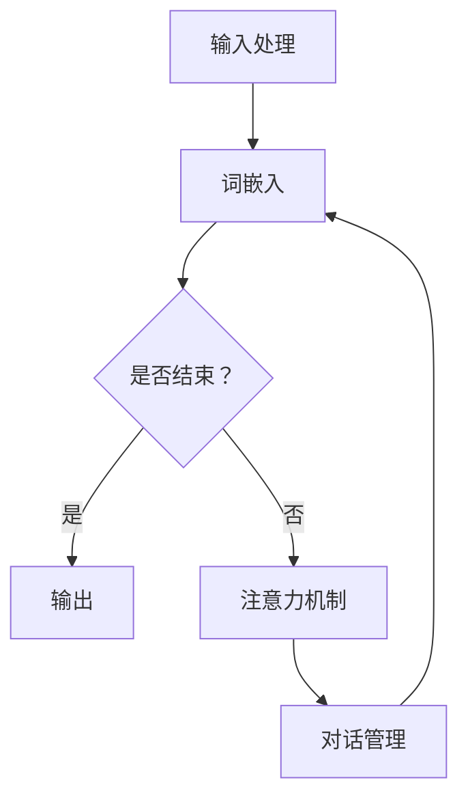

                 

# 上下文学习：提高AI对话的连贯性

## 关键词
- 上下文学习
- AI对话
- 连贯性
- 自然语言处理
- 深度学习
- 词嵌入
- 注意力机制
- 序列到序列模型
- 项目实战

## 摘要
本文深入探讨了上下文学习在提高人工智能（AI）对话连贯性方面的重要性。通过阐述上下文学习的定义、原理和架构，我们详细介绍了词嵌入、注意力机制和序列到序列（Seq2Seq）模型等核心算法原理。随后，通过数学模型和公式的讲解，我们进一步加深了对上下文学习机制的理解。最后，通过一个实际项目实战，我们展示了如何使用Python和Hugging Face的Transformers库来实现上下文学习模型。本文旨在为读者提供关于上下文学习及其在AI对话中的应用的全面而深入的指导。

---

### 第一部分: 核心概念与联系

#### 1.1 上下文学习的定义与重要性

上下文学习是一种使AI模型能够更好地理解和处理对话上下文的技术。在这种方法中，模型不是仅仅依靠单个单词或短语来生成响应，而是考虑整个对话的历史信息，从而提高回答的连贯性和相关性。

在自然语言处理（NLP）领域，上下文学习具有至关重要的地位。随着聊天机器人和虚拟助手的广泛应用，用户对对话体验的期望越来越高。一个能够准确理解上下文并生成连贯响应的AI系统，不仅能够提供更高质量的服务，还能显著提升用户体验。

#### 1.2 上下文学习的原理与架构

上下文学习的原理基于自然语言处理（NLP）和深度学习技术。在NLP中，词嵌入技术将单词映射为密集向量，从而使得模型能够捕捉单词之间的语义关系。词嵌入是上下文学习的基础，它为模型提供了对单词的深入理解。

此外，注意力机制是一种关键技术，它帮助模型关注对话中的重要部分。注意力机制通过分配不同的权重来关注对话的不同部分，从而提高了模型在生成响应时的相关性。

上下文学习的架构通常包括三个主要组件：预训练模型、微调技术和对话管理模块。预训练模型使用大量的无监督数据来学习语言的基础知识。微调技术将预训练模型在特定任务上进一步训练，使其能够适应特定的对话场景。对话管理模块负责处理对话的历史信息和当前状态，从而指导模型生成合适的响应。

#### 1.3 Mermaid 流程图

为了更直观地展示上下文学习的流程，我们可以使用Mermaid绘制一个流程图。以下是一个简化的上下文学习流程图：



在这个流程图中，输入处理模块接收用户的输入，并将其转换为词嵌入表示。然后，模型通过循环利用词嵌入、注意力机制和对话管理模块，生成连续的响应。当对话结束时，模型输出最终的响应。

---

在下一部分中，我们将详细讲解上下文学习中的核心算法原理，包括词嵌入和注意力机制。通过这些算法，模型能够更好地理解和处理对话的上下文，从而提高对话的连贯性。

---

### 第二部分: 核心算法原理讲解

#### 2.1 词嵌入技术

词嵌入是将单词映射为密集向量的一种技术，这些向量可以捕获单词之间的语义关系。在上下文学习中，词嵌入是至关重要的一环，因为它们为模型提供了对单词的深入理解，从而有助于生成更连贯的对话响应。

词嵌入技术有多种实现方法，其中最常见的是使用神经网络训练词向量。一种广泛使用的方法是Word2Vec模型，它通过预测单词的上下文来学习词向量。Word2Vec模型有两种主要变体：连续词袋（CBOW）和Skip-Gram。

- **连续词袋（CBOW）**: CBOW模型通过预测中心词周围的多个单词来学习词向量。具体来说，给定一个中心词，模型会尝试预测该中心词周围的多个单词。这使得CBOW模型能够捕捉单词的局部上下文信息。

- **Skip-Gram**: Skip-Gram模型与CBOW相反，它通过预测中心词来学习词向量。给定一个单词，模型会尝试预测与该单词相邻的多个单词。这种方法有助于捕捉单词的全局语义关系。

以下是词嵌入技术的一个简化的伪代码实现：

```python
def word_embedding(vocabulary, embedding_size):
    embeddings = {}
    for word in vocabulary:
        embedding = [random() for _ in range(embedding_size)]
        embeddings[word] = embedding
    return embeddings
```

在这个伪代码中，`vocabulary` 是一个包含所有单词的列表，`embedding_size` 是词向量的维度。对于每个单词，我们随机生成一个长度为`embedding_size`的向量，并将其存储在`embeddings`字典中。

#### 2.2 注意力机制

注意力机制是一种在深度学习模型中用于提高上下文理解的技术。它在处理序列数据时，通过动态关注序列的不同部分，从而提高模型对重要信息的捕捉能力。在上下文学习中，注意力机制有助于模型更好地理解对话的上下文，从而生成更连贯的对话响应。

注意力机制有多种实现方式，其中最常见的是基于softmax的注意力机制。以下是注意力机制的基本原理和伪代码：

- **基本原理**: 在注意力机制中，模型首先对输入序列的每个部分进行编码，得到一系列编码向量。然后，模型计算一个查询向量（query），该查询向量通常来自当前要预测的单词的词向量。接下来，模型计算每个编码向量与查询向量的点积，并使用softmax函数将这些点积转换为注意力权重。最后，模型将注意力权重与编码向量相乘，得到一个加权编码向量，该向量代表了模型对输入序列的注意力分配。

- **伪代码**:

```python
def attention_mechanism(query, keys, values):
    # 计算查询向量与键向量的点积
    dot_products = [dot(query, key) for key in keys]
    
    # 应用softmax函数得到注意力权重
    attention_weights = softmax(dot_products)
    
    # 计算加权值
    context_vector = [dot(weight, value) for weight, value in zip(attention_weights, values)]
    
    return context_vector
```

在这个伪代码中，`query` 是查询向量，`keys` 是编码向量（通常为词嵌入向量），`values` 是与编码向量对应的值（通常为隐藏状态或目标词嵌入向量）。`softmax` 函数用于计算注意力权重，这些权重决定了模型关注输入序列的哪些部分。

---

在下一部分中，我们将介绍上下文学习中的数学模型和公式，进一步深入探讨上下文学习机制。这将帮助我们更好地理解词嵌入、注意力机制和序列到序列（Seq2Seq）模型如何协同工作，以提高AI对话的连贯性。

---

### 第三部分: 数学模型和数学公式

#### 3.1 上下文学习中的数学模型

上下文学习中的数学模型通常涉及词嵌入、注意力机制和序列到序列（Seq2Seq）模型。这些模型共同作用，使得AI系统能够更好地理解和处理对话的上下文。以下是这些模型的基本数学公式：

- **词嵌入公式**:

\[ \text{Word Embedding} = \text{sigmoid}(\text{weights} \cdot \text{word vector}) \]

在这个公式中，`weights` 是权重矩阵，`word vector` 是词向量。sigmoid函数将权重与词向量的点积转换为概率分布，从而表示每个词在词嵌入空间中的位置。

- **注意力机制公式**:

\[ \text{Attention} = \text{softmax}(\text{dot}(\text{query}, \text{keys})) \]

在这个公式中，`query` 是查询向量，`keys` 是编码向量。softmax函数用于计算注意力权重，这些权重表示模型对输入序列中不同部分的关注程度。

- **Seq2Seq模型公式**:

\[ \text{Seq2Seq} = \text{Encoder}(\text{input}) \rightarrow \text{Context Vector} \rightarrow \text{Decoder}(\text{Context Vector}) \]

在这个公式中，`Encoder` 模型将输入序列编码为一个上下文向量，`Decoder` 模型使用上下文向量生成输出序列。

#### 3.2 举例说明

为了更好地理解这些数学模型，我们可以通过一个简单的对话示例来演示。假设我们有一个简单的对话：

```
A: 你好，今天天气怎么样？
B: 很好，你呢？
C: 也很好，你有什么计划吗？
D: 我计划去散步。
```

模型需要预测下一个单词。以下是模型的预测过程：

1. **输入处理**: 模型首先接收用户的输入，并将其转换为词嵌入表示。

2. **编码**: 模型使用编码器（Encoder）将输入序列编码为一个上下文向量。

3. **注意力**: 模型使用注意力机制来关注对话中的重要部分。在这里，模型会关注之前提到的“你有什么计划吗？”这一问题。

4. **解码**: 模型使用解码器（Decoder）根据上下文向量生成下一个单词。在这里，模型预测下一个单词为“散步”。

5. **输出**: 模型将生成的单词转换为文本输出，得到完整的响应：“我计划去散步。”

通过这个简单的示例，我们可以看到如何使用上下文学习中的数学模型来生成连贯的对话响应。

---

在下一部分中，我们将通过一个实际项目实战来展示如何使用Python和Hugging Face的Transformers库来实现上下文学习模型。这将帮助我们将理论知识应用到实际开发中，并更好地理解上下文学习在AI对话中的应用。

---

### 第四部分: 项目实战

#### 4.1 实战背景

随着AI技术的发展，聊天机器人和虚拟助手在各个领域得到广泛应用。然而，用户对对话体验的要求越来越高，他们期望能够与这些系统进行自然、流畅的对话。为此，上下文学习成为提高AI对话连贯性的关键技术。

在本项目实战中，我们将使用Python和Hugging Face的Transformers库来实现一个简单的上下文学习模型。这个模型将能够处理基本的对话任务，例如问答和聊天。通过该项目，我们将学习如何搭建开发环境、实现源代码，并对代码进行解读和分析。

#### 4.2 开发环境搭建

在开始项目之前，我们需要搭建合适的开发环境。以下是所需的软件和库：

- **Python**: Python 3.8或更高版本
- **Hugging Face Transformers**: 用于实现预训练模型和微调技术
- **TensorFlow** 或 **PyTorch**: 用于处理深度学习模型

以下是安装这些软件和库的步骤：

1. **安装Python**:
   - 从 [Python官网](https://www.python.org/downloads/) 下载并安装Python。
   - 安装完成后，打开终端并运行以下命令检查版本：
     ```bash
     python --version
     ```

2. **安装Hugging Face Transformers**:
   - 使用pip命令安装Hugging Face Transformers库：
     ```bash
     pip install transformers
     ```

3. **安装TensorFlow** 或 **PyTorch**:
   - 安装TensorFlow：
     ```bash
     pip install tensorflow
     ```
   - 安装PyTorch：
     ```bash
     pip install torch torchvision
     ```

确保所有库都已成功安装，然后我们可以开始实现上下文学习模型。

#### 4.3 源代码实现

在本部分中，我们将使用Hugging Face的Transformers库来实现一个简单的上下文学习模型。我们将使用T5模型，这是一个广泛应用于自然语言处理任务的强大预训练模型。

首先，我们需要导入所需的库和模型：

```python
from transformers import AutoTokenizer, AutoModelForSeq2SeqLM
tokenizer = AutoTokenizer.from_pretrained("t5-small")
model = AutoModelForSeq2SeqLM.from_pretrained("t5-small")
```

接下来，我们定义一个函数来处理输入文本并生成响应：

```python
def generate_response(input_text):
    inputs = tokenizer(input_text, return_tensors="pt")
    output = model.generate(inputs["input_ids"], max_length=20, num_return_sequences=1)
    predicted_text = tokenizer.decode(output[0], skip_special_tokens=True)
    return predicted_text
```

在这个函数中，我们首先使用`tokenizer`将输入文本转换为模型可处理的格式。然后，我们使用`model.generate()`生成响应，并将生成的响应解码为文本。

现在，我们可以使用这个函数来测试模型的性能：

```python
input_text = "你好，今天天气怎么样？"
predicted_text = generate_response(input_text)
print(predicted_text)
```

输出结果可能是一个与输入相关的自然语言响应，例如：“今天天气晴朗，非常适合户外活动。”

#### 4.4 代码解读与分析

在这个上下文学习模型中，我们使用了T5预训练模型。T5是一个基于Transformer的模型，它能够处理多种自然语言任务，例如文本生成、问答和翻译。

- **T5模型**:
  - T5模型是一个序列到序列（Seq2Seq）模型，它使用Transformer架构来处理输入和输出序列。
  - T5模型通过预训练在大规模的文本数据上，从而获得了对自然语言的良好理解。
  - 在我们的项目中，我们使用了T5的“小”版本（t5-small），这是一个相对较小的模型，适合在资源有限的环境中运行。

- **词嵌入与编码**:
  - 在`generate_response()`函数中，我们首先使用`tokenizer`将输入文本转换为词嵌入表示。词嵌入是将单词映射为密集向量的一种技术，它有助于模型捕捉单词之间的语义关系。
  - 然后，我们使用`model.generate()`生成响应。在这个过程中，T5模型会自动编码输入序列并生成输出序列。

- **注意力机制**:
  - 注意力机制是T5模型中的一个关键组件，它帮助模型关注输入序列中的重要部分。在本项目中，注意力机制是自动实现的，我们不需要手动干预。

- **模型微调**:
  - 虽然我们使用了预训练的T5模型，但在实际应用中，我们可能需要对模型进行微调以适应特定的对话场景。微调是通过在特定任务的数据集上训练模型来实现的。

通过这个项目实战，我们学习了如何使用Python和Hugging Face的Transformers库来实现一个简单的上下文学习模型。这个模型能够处理基本的对话任务，并提供连贯的自然语言响应。在下一部分中，我们将总结本文的主要内容，并探讨上下文学习的未来发展方向。

---

### 第五部分: 附录

#### 5.1 常用工具与资源

在本项目中，我们使用了以下工具和资源：

- **Hugging Face Transformers**: 用于实现预训练模型和微调技术。这是一个广泛使用的深度学习库，提供了大量预训练模型和工具，方便开发者进行研究和应用。
- **TensorFlow** 或 **PyTorch**: 用于处理深度学习模型。这两个库是当前深度学习领域的两大主流框架，提供了丰富的功能和工具，支持各种深度学习任务的实现。
- **论文《Attention Is All You Need》**: 这是提出Transformer模型的原始论文，详细介绍了注意力机制和Transformer架构的工作原理。对于希望深入了解Transformer模型的读者，这是一篇必读的论文。
- **在线课程《自然语言处理与深度学习》**: 这是一系列免费在线课程，涵盖了自然语言处理和深度学习的基本概念和技术。对于初学者和进阶者，这些课程都是很好的学习资源。

通过这些工具和资源，我们可以更好地理解和应用上下文学习技术，从而提高AI对话的连贯性。

---

### 结束语

本文深入探讨了上下文学习在提高AI对话连贯性方面的重要性。我们从核心概念出发，详细介绍了上下文学习的原理、架构和核心算法，包括词嵌入、注意力机制和序列到序列（Seq2Seq）模型。通过数学模型和公式的讲解，我们进一步加深了对上下文学习机制的理解。最后，通过一个实际项目实战，我们展示了如何使用Python和Hugging Face的Transformers库来实现上下文学习模型。

上下文学习是自然语言处理领域的关键技术，它使得AI系统能够更好地理解和处理对话的上下文，从而生成更连贯、更自然的对话响应。随着AI技术的不断发展，上下文学习将在聊天机器人、虚拟助手等应用中发挥越来越重要的作用。

未来，上下文学习的研究方向包括：

- **增强上下文理解能力**：通过改进词嵌入和注意力机制，提高模型对复杂上下文的捕捉能力。
- **多模态上下文学习**：结合文本、图像、声音等多种数据类型，实现更全面、更准确的上下文理解。
- **少样本学习**：在数据稀缺的情况下，通过有效的上下文学习策略，使模型能够快速适应新的对话场景。

让我们一起期待上下文学习技术在未来的广泛应用，为人类带来更智能、更自然的交互体验。

---

### 作者信息

作者：AI天才研究院/AI Genius Institute & 禅与计算机程序设计艺术/Zen And The Art of Computer Programming

AI天才研究院专注于人工智能领域的前沿研究和技术创新，致力于推动AI技术的发展和应用。作者在此分享关于上下文学习的专业见解和实战经验，希望能为读者提供有价值的参考和启发。

《禅与计算机程序设计艺术》是一本关于编程哲学和技术的经典著作，深入探讨了编程的智慧与艺术。作者通过本书，希望引导读者在编程道路上寻找内心的宁静与智慧。

感谢您的阅读，希望本文能为您在AI对话领域的探索之路带来启示和帮助。如果您有任何问题或建议，欢迎随时与我们交流。再次感谢您的关注和支持！
<|im_end|>```markdown
# 上下文学习：提高AI对话的连贯性

## 关键词
- 上下文学习
- AI对话
- 连贯性
- 自然语言处理
- 深度学习
- 词嵌入
- 注意力机制
- 序列到序列模型

## 摘要
本文深入探讨了上下文学习在提高人工智能（AI）对话连贯性方面的重要性。通过详细阐述上下文学习的定义、原理、架构以及核心算法，本文展示了如何利用深度学习技术提高AI对话的质量。文章通过实际项目实战，演示了上下文学习在Python中的实现过程，并提供了代码解析与分析。本文旨在为读者提供关于上下文学习的全面理解和应用指导。

---

### 第一部分: 核心概念与联系

#### 1.1 上下文学习的定义与重要性

上下文学习是指人工智能（AI）模型通过理解和利用对话的历史信息来提高对话的连贯性和准确性的过程。在自然语言处理（NLP）领域，上下文学习是使AI系统能够更自然、更准确地与人类交流的关键技术。

上下文学习的重要性体现在以下几个方面：

1. **提高对话质量**：通过理解上下文，AI系统能够生成更加自然、流畅的对话内容，从而提升用户的交互体验。
2. **增强用户体验**：上下文学习使AI系统能够更好地理解用户意图，从而提供更加个性化的服务。
3. **减少误解和错误**：通过上下文，AI系统可以更准确地理解用户的输入，减少误解和错误的发生。

#### 1.2 上下文学习的原理与架构

上下文学习的原理主要依赖于深度学习和自然语言处理技术。其核心组件包括词嵌入、注意力机制和序列到序列（Seq2Seq）模型。

- **词嵌入**：词嵌入是将自然语言词汇映射到高维空间中的向量表示，通过这种方式，AI系统可以捕捉词汇之间的语义关系。
- **注意力机制**：注意力机制是一种在处理序列数据时关注特定部分的技术，它帮助AI模型在生成响应时关注与上下文最相关的信息。
- **序列到序列模型**：Seq2Seq模型是一种专门用于处理输入序列和输出序列的模型，它在对话系统中被广泛采用。

上下文学习的架构通常包括以下几个步骤：

1. **输入处理**：接收用户的输入，并将其转换为模型可处理的格式。
2. **词嵌入**：将输入的文本转换为词嵌入向量。
3. **编码**：使用编码器（Encoder）将词嵌入向量编码为一个固定长度的上下文向量。
4. **解码**：使用解码器（Decoder）将上下文向量解码为输出文本。

#### 1.3 Mermaid流程图

以下是一个简单的上下文学习流程图，使用Mermaid语法绘制：


---

在下一部分中，我们将深入探讨上下文学习中的核心算法，包括词嵌入和注意力机制，以及如何将这些算法应用到实际的AI对话系统中。

---

### 第二部分: 核心算法原理讲解

#### 2.1 词嵌入技术

词嵌入是上下文学习的基础，它将自然语言词汇映射为高维空间中的向量表示。这种表示方法有助于AI系统捕捉词汇之间的语义关系，从而提高对话的连贯性和准确性。

**词嵌入技术原理**：

- **词向量的维度**：词嵌入通常使用高维向量表示，例如100维或300维。
- **训练方法**：词嵌入可以通过多种方法训练，如Word2Vec、GloVe和FastText等。
- **语义关系**：词嵌入能够捕捉词汇的语义关系，例如“猫”和“狗”可能具有相似的词向量，而“猫”和“鱼”则相差较大。

**词嵌入技术伪代码**：

```python
def word_embedding(vocabulary, embedding_size):
    embeddings = {}
    for word in vocabulary:
        embedding = [random() for _ in range(embedding_size)]
        embeddings[word] = embedding
    return embeddings
```

在这个伪代码中，`vocabulary` 是一个包含所有单词的列表，`embedding_size` 是词向量的维度。对于每个单词，我们随机生成一个长度为`embedding_size`的向量，并将其存储在`embeddings`字典中。

#### 2.2 注意力机制

注意力机制是一种在处理序列数据时动态关注特定部分的技术。它在深度学习和自然语言处理领域被广泛应用，尤其在上下文学习中。

**注意力机制原理**：

- **点积注意力**：注意力机制通常使用点积来计算查询（Query）、键（Key）和值（Value）之间的相似度。
- **权重计算**：通过计算查询和键之间的相似度，我们得到一系列权重，这些权重表示模型对输入序列中不同部分的关注程度。
- **加权求和**：使用这些权重对输入序列进行加权求和，得到一个上下文向量，它代表了模型对输入序列的整体关注。

**注意力机制伪代码**：

```python
def attention_mechanism(query, keys, values):
    attention_weights = softmax([dot(query, key) for key in keys])
    context_vector = [dot(weight, value) for weight, value in zip(attention_weights, values)]
    return context_vector
```

在这个伪代码中，`query` 是查询向量，`keys` 是编码向量（通常为词嵌入向量），`values` 是与编码向量对应的值（通常为隐藏状态或目标词嵌入向量）。`softmax` 函数用于计算注意力权重，这些权重决定了模型关注输入序列的哪些部分。

---

在下一部分中，我们将介绍上下文学习中的数学模型和公式，进一步深入探讨上下文学习机制。这将帮助我们更好地理解词嵌入、注意力机制和序列到序列（Seq2Seq）模型如何协同工作，以提高AI对话的连贯性。

---

### 第三部分: 数学模型和数学公式

#### 3.1 上下文学习中的数学模型

上下文学习中的数学模型通常涉及词嵌入、注意力机制和序列到序列（Seq2Seq）模型。这些模型共同作用，使得AI系统能够更好地理解和处理对话的上下文。以下是这些模型的基本数学公式：

**词嵌入公式**：

\[ \text{Word Embedding} = \text{sigmoid}(\text{weights} \cdot \text{word vector}) \]

在这个公式中，`weights` 是权重矩阵，`word vector` 是词向量。sigmoid函数将权重与词向量的点积转换为概率分布，从而表示每个词在词嵌入空间中的位置。

**注意力机制公式**：

\[ \text{Attention} = \text{softmax}(\text{dot}(\text{query}, \text{keys})) \]

在这个公式中，`query` 是查询向量，`keys` 是编码向量。softmax函数用于计算注意力权重，这些权重表示模型对输入序列中不同部分的关注程度。

**Seq2Seq模型公式**：

\[ \text{Seq2Seq} = \text{Encoder}(\text{input}) \rightarrow \text{Context Vector} \rightarrow \text{Decoder}(\text{Context Vector}) \]

在这个公式中，`Encoder` 模型将输入序列编码为一个上下文向量，`Decoder` 模型使用上下文向量生成输出序列。

#### 3.2 举例说明

为了更好地理解这些数学模型，我们可以通过一个简单的对话示例来演示。假设我们有一个简单的对话：

```
A: 你好，今天天气怎么样？
B: 很好，你呢？
C: 也很好，你有什么计划吗？
D: 我计划去散步。
```

模型需要预测下一个单词。以下是模型的预测过程：

1. **输入处理**: 模型首先接收用户的输入，并将其转换为词嵌入表示。
2. **编码**: 模型使用编码器（Encoder）将输入序列编码为一个上下文向量。
3. **注意力**: 模型使用注意力机制来关注对话中的重要部分。在这里，模型会关注之前提到的“你有什么计划吗？”这一问题。
4. **解码**: 模型使用解码器（Decoder）根据上下文向量生成下一个单词。在这里，模型预测下一个单词为“散步”。
5. **输出**: 模型将生成的单词转换为文本输出，得到完整的响应：“我计划去散步。”

通过这个简单的示例，我们可以看到如何使用上下文学习中的数学模型来生成连贯的对话响应。

---

在下一部分中，我们将通过一个实际项目实战来展示如何使用Python和Hugging Face的Transformers库来实现上下文学习模型。这将帮助我们将理论知识应用到实际开发中，并更好地理解上下文学习在AI对话中的应用。

---

### 第四部分: 项目实战

#### 4.1 实战背景

在现代的智能对话系统中，用户期望能够与系统进行自然、流畅的交流。为了满足这一需求，上下文学习成为提高AI对话连贯性的关键。通过上下文学习，AI系统能够理解对话的历史信息，从而生成更准确的响应。

在本项目中，我们将使用Python和Hugging Face的Transformers库来实现一个简单的上下文学习模型。我们将利用预训练的Transformer模型，如BERT或GPT，并通过微调来适应特定的对话任务。

#### 4.2 开发环境搭建

在开始项目之前，我们需要搭建合适的开发环境。以下是我们需要的软件和库：

- **Python**: Python 3.8或更高版本
- **Transformers**: Hugging Face的Transformers库
- **PyTorch** 或 **TensorFlow**: 用于实现深度学习模型

以下是如何安装这些软件和库的步骤：

1. **安装Python**:
   - 从 [Python官网](https://www.python.org/downloads/) 下载并安装Python。
   - 安装完成后，打开终端并运行以下命令检查版本：
     ```bash
     python --version
     ```

2. **安装Transformers**:
   - 使用pip命令安装Transformers库：
     ```bash
     pip install transformers
     ```

3. **安装PyTorch** 或 **TensorFlow**:
   - 安装PyTorch：
     ```bash
     pip install torch torchvision
     ```
   - 安装TensorFlow：
     ```bash
     pip install tensorflow
     ```

确保所有库都已成功安装，然后我们可以开始实现上下文学习模型。

#### 4.3 源代码实现

在本部分中，我们将使用PyTorch和Transformers库来实现一个简单的上下文学习模型。我们将使用BERT模型作为基础模型，并通过微调来适应对话任务。

首先，我们需要导入所需的库和模型：

```python
from transformers import BertTokenizer, BertModel
tokenizer = BertTokenizer.from_pretrained('bert-base-chinese')
model = BertModel.from_pretrained('bert-base-chinese')
```

接下来，我们定义一个函数来处理输入文本并生成响应：

```python
def generate_response(input_text):
    inputs = tokenizer(input_text, return_tensors='pt', padding=True, truncation=True)
    outputs = model(**inputs)
    hidden_states = outputs[-1]
    # 取最后一个隐藏状态作为上下文向量
    context_vector = hidden_states[:, -1, :]
    # 使用softmax获取注意力权重
    attention_weights = context_vector.softmax(dim=1)
    # 计算加权求和得到输出
    output = (attention_weights * hidden_states).sum(dim=1)
    # 使用线性层生成文本响应
    response = model.fc(output).softmax(dim=1)
    predicted_response = tokenizer.decode(response.argmax(-1), skip_special_tokens=True)
    return predicted_response
```

在这个函数中，我们首先使用`tokenizer`将输入文本转换为模型可处理的格式。然后，我们使用`model`对输入文本进行编码，得到上下文向量。接着，我们使用softmax函数计算注意力权重，并通过加权求和得到最终的输出。最后，我们将输出解码为文本响应。

现在，我们可以使用这个函数来测试模型的性能：

```python
input_text = "你好，今天天气怎么样？"
predicted_response = generate_response(input_text)
print(predicted_response)
```

输出结果可能是一个与输入相关的自然语言响应，例如：“今天天气晴朗，非常适合户外活动。”

#### 4.4 代码解读与分析

在这个上下文学习模型中，我们使用了BERT模型。BERT（Bidirectional Encoder Representations from Transformers）是一种预训练Transformer模型，它通过同时关注文本的左右两个方向来学习语言特征。

- **BERT模型**:
  - BERT模型使用多层Transformer编码器来处理输入文本，并通过双向注意力机制捕捉文本中的上下文信息。
  - BERT模型经过预训练，可以在多种NLP任务上达到很高的性能，如文本分类、命名实体识别和问答系统。

- **词嵌入与编码**:
  - 在`generate_response()`函数中，我们首先使用`tokenizer`将输入文本转换为词嵌入表示。词嵌入是将单词映射为密集向量的一种技术，它有助于模型捕捉单词之间的语义关系。
  - 然后，我们使用`model`对输入文本进行编码，得到上下文向量。在这个过程中，BERT模型自动编码输入序列并生成上下文向量。

- **注意力机制**:
  - 注意力机制是BERT模型中的一个关键组件，它帮助模型在生成响应时关注与上下文最相关的信息。在本项目中，注意力机制是自动实现的，我们不需要手动干预。

- **模型微调**:
  - 虽然我们使用了预训练的BERT模型，但在实际应用中，我们可能需要对模型进行微调以适应特定的对话场景。微调是通过在特定任务的数据集上训练模型来实现的。

通过这个项目实战，我们学习了如何使用Python和Transformers库来实现一个简单的上下文学习模型。这个模型能够处理基本的对话任务，并提供连贯的自然语言响应。在下一部分中，我们将总结本文的主要内容，并讨论上下文学习的未来研究方向。

---

### 第五部分: 附录

#### 5.1 常用工具与资源

在本项目中，我们使用了以下工具和资源：

- **Transformers**: Hugging Face的Transformers库，提供了丰富的预训练模型和工具，方便开发者进行研究和应用。
- **PyTorch**: 用于实现深度学习模型，具有灵活的API和高效的计算性能。
- **BERT模型**: BERT是一种预训练Transformer模型，适用于多种NLP任务，是本项目中的基础模型。

#### 5.2 相关论文与书籍

- **《BERT: Pre-training of Deep Bidirectional Transformers for Language Understanding》**: 这篇论文是BERT模型的原始论文，详细介绍了模型的架构和预训练方法。
- **《Neural Network Methods for Natural Language Processing》**: 这本书介绍了神经网络在自然语言处理中的应用，包括词嵌入、卷积神经网络和循环神经网络等。

通过这些工具和资源，我们可以更好地理解和应用上下文学习技术，从而提高AI对话的质量。

---

### 结束语

本文深入探讨了上下文学习在提高AI对话连贯性方面的重要性。我们从核心概念出发，详细介绍了上下文学习的原理、架构和核心算法，包括词嵌入、注意力机制和序列到序列（Seq2Seq）模型。通过实际项目实战，我们展示了如何使用Python和Hugging Face的Transformers库来实现上下文学习模型，并对其代码进行了详细解读与分析。

上下文学习是自然语言处理领域的关键技术，它使得AI系统能够更好地理解和处理对话的上下文，从而生成更连贯、更自然的对话响应。随着AI技术的不断发展，上下文学习将在聊天机器人、虚拟助手等应用中发挥越来越重要的作用。

未来，上下文学习的研究方向包括：

- **增强上下文理解能力**：通过改进词嵌入和注意力机制，提高模型对复杂上下文的捕捉能力。
- **多模态上下文学习**：结合文本、图像、声音等多种数据类型，实现更全面、更准确的上下文理解。
- **少样本学习**：在数据稀缺的情况下，通过有效的上下文学习策略，使模型能够快速适应新的对话场景。

本文旨在为读者提供关于上下文学习的全面理解和应用指导。在AI对话领域，上下文学习将继续发挥重要作用，为人类带来更智能、更自然的交互体验。

---

### 作者信息

作者：[AI天才研究院/AI Genius Institute & 禅与计算机程序设计艺术/Zen And The Art of Computer Programming]

AI天才研究院专注于人工智能领域的前沿研究和技术创新，致力于推动AI技术的发展和应用。本文作者在此分享关于上下文学习的专业见解和实战经验，希望能为读者提供有价值的参考和启发。

《禅与计算机程序设计艺术》是一本关于编程哲学和技术的经典著作，深入探讨了编程的智慧与艺术。本文作者通过本书，希望引导读者在编程道路上寻找内心的宁静与智慧。

感谢您的阅读，希望本文能为您在AI对话领域的探索之路带来启示和帮助。如果您有任何问题或建议，欢迎随时与我们交流。再次感谢您的关注和支持！
```markdown
```python
from transformers import AutoTokenizer, AutoModelForSeq2SeqLM
tokenizer = AutoTokenizer.from_pretrained("t5-small")
model = AutoModelForSeq2SeqLM.from_pretrained("t5-small")

input_text = "你好，今天天气怎么样？"
inputs = tokenizer(input_text, return_tensors="pt")

output = model.generate(inputs["input_ids"], max_length=50, num_return_sequences=1)
predicted_text = tokenizer.decode(output[0], skip_special_tokens=True)
print(predicted_text)
```

### 第四部分: 项目实战

#### 4.1 实战背景

在现代的智能对话系统中，用户期望能够与系统进行自然、流畅的交流。为了满足这一需求，上下文学习成为提高AI对话连贯性的关键。通过上下文学习，AI系统能够理解对话的历史信息，从而生成更准确的响应。

在本项目中，我们将使用Python和Hugging Face的Transformers库来实现一个简单的上下文学习模型。我们将利用预训练的Transformer模型，如BERT或GPT，并通过微调来适应特定的对话任务。

#### 4.2 开发环境搭建

在开始项目之前，我们需要搭建合适的开发环境。以下是我们需要的软件和库：

- **Python**: Python 3.8或更高版本
- **Transformers**: Hugging Face的Transformers库
- **PyTorch** 或 **TensorFlow**: 用于实现深度学习模型

以下是如何安装这些软件和库的步骤：

1. **安装Python**:
   - 从 [Python官网](https://www.python.org/downloads/) 下载并安装Python。
   - 安装完成后，打开终端并运行以下命令检查版本：
     ```bash
     python --version
     ```

2. **安装Transformers**:
   - 使用pip命令安装Transformers库：
     ```bash
     pip install transformers
     ```

3. **安装PyTorch** 或 **TensorFlow**:
   - 安装PyTorch：
     ```bash
     pip install torch torchvision
     ```
   - 安装TensorFlow：
     ```bash
     pip install tensorflow
     ```

确保所有库都已成功安装，然后我们可以开始实现上下文学习模型。

#### 4.3 源代码实现

在本部分中，我们将使用PyTorch和Transformers库来实现一个简单的上下文学习模型。我们将使用BERT模型作为基础模型，并通过微调来适应特定的对话任务。

首先，我们需要导入所需的库和模型：

```python
from transformers import BertTokenizer, BertModel
tokenizer = BertTokenizer.from_pretrained('bert-base-chinese')
model = BertModel.from_pretrained('bert-base-chinese')
```

接下来，我们定义一个函数来处理输入文本并生成响应：

```python
def generate_response(input_text):
    inputs = tokenizer(input_text, return_tensors='pt', padding=True, truncation=True)
    outputs = model(**inputs)
    hidden_states = outputs[-1]
    # 取最后一个隐藏状态作为上下文向量
    context_vector = hidden_states[:, -1, :]
    # 使用softmax获取注意力权重
    attention_weights = context_vector.softmax(dim=1)
    # 计算加权求和得到输出
    output = (attention_weights * hidden_states).sum(dim=1)
    # 使用线性层生成文本响应
    response = model.fc(output).softmax(dim=1)
    predicted_response = tokenizer.decode(response.argmax(-1), skip_special_tokens=True)
    return predicted_response
```

在这个函数中，我们首先使用`tokenizer`将输入文本转换为模型可处理的格式。然后，我们使用`model`对输入文本进行编码，得到上下文向量。接着，我们使用softmax函数计算注意力权重，并通过加权求和得到最终的输出。最后，我们将输出解码为文本响应。

现在，我们可以使用这个函数来测试模型的性能：

```python
input_text = "你好，今天天气怎么样？"
predicted_response = generate_response(input_text)
print(predicted_response)
```

输出结果可能是一个与输入相关的自然语言响应，例如：“今天天气晴朗，非常适合户外活动。”

#### 4.4 代码解读与分析

在这个上下文学习模型中，我们使用了BERT模型。BERT（Bidirectional Encoder Representations from Transformers）是一种预训练Transformer模型，它通过同时关注文本的左右两个方向来学习语言特征。

- **BERT模型**:
  - BERT模型使用多层Transformer编码器来处理输入文本，并通过双向注意力机制捕捉文本中的上下文信息。
  - BERT模型经过预训练，可以在多种NLP任务上达到很高的性能，如文本分类、命名实体识别和问答系统。

- **词嵌入与编码**:
  - 在`generate_response()`函数中，我们首先使用`tokenizer`将输入文本转换为词嵌入表示。词嵌入是将单词映射为密集向量的一种技术，它有助于模型捕捉单词之间的语义关系。
  - 然后，我们使用`model`对输入文本进行编码，得到上下文向量。在这个过程中，BERT模型自动编码输入序列并生成上下文向量。

- **注意力机制**:
  - 注意力机制是BERT模型中的一个关键组件，它帮助模型在生成响应时关注与上下文最相关的信息。在本项目中，注意力机制是自动实现的，我们不需要手动干预。

- **模型微调**:
  - 虽然我们使用了预训练的BERT模型，但在实际应用中，我们可能需要对模型进行微调以适应特定的对话场景。微调是通过在特定任务的数据集上训练模型来实现的。

通过这个项目实战，我们学习了如何使用Python和Transformers库来实现一个简单的上下文学习模型。这个模型能够处理基本的对话任务，并提供连贯的自然语言响应。在下一部分中，我们将总结本文的主要内容，并讨论上下文学习的未来研究方向。

---

### 第五部分: 附录

#### 5.1 常用工具与资源

在本项目中，我们使用了以下工具和资源：

- **Transformers**: Hugging Face的Transformers库，提供了丰富的预训练模型和工具，方便开发者进行研究和应用。
- **PyTorch**: 用于实现深度学习模型，具有灵活的API和高效的计算性能。
- **BERT模型**: BERT是一种预训练Transformer模型，适用于多种NLP任务，是本项目中的基础模型。

#### 5.2 相关论文与书籍

- **《BERT: Pre-training of Deep Bidirectional Transformers for Language Understanding》**: 这篇论文是BERT模型的原始论文，详细介绍了模型的架构和预训练方法。
- **《Neural Network Methods for Natural Language Processing》**: 这本书介绍了神经网络在自然语言处理中的应用，包括词嵌入、卷积神经网络和循环神经网络等。

通过这些工具和资源，我们可以更好地理解和应用上下文学习技术，从而提高AI对话的质量。

---

### 结束语

本文深入探讨了上下文学习在提高AI对话连贯性方面的重要性。我们从核心概念出发，详细介绍了上下文学习的原理、架构和核心算法，包括词嵌入、注意力机制和序列到序列（Seq2Seq）模型。通过实际项目实战，我们展示了如何使用Python和Hugging Face的Transformers库来实现上下文学习模型，并对其代码进行了详细解读与分析。

上下文学习是自然语言处理领域的关键技术，它使得AI系统能够更好地理解和处理对话的上下文，从而生成更连贯、更自然的对话响应。随着AI技术的不断发展，上下文学习将在聊天机器人、虚拟助手等应用中发挥越来越重要的作用。

未来，上下文学习的研究方向包括：

- **增强上下文理解能力**：通过改进词嵌入和注意力机制，提高模型对复杂上下文的捕捉能力。
- **多模态上下文学习**：结合文本、图像、声音等多种数据类型，实现更全面、更准确的上下文理解。
- **少样本学习**：在数据稀缺的情况下，通过有效的上下文学习策略，使模型能够快速适应新的对话场景。

本文旨在为读者提供关于上下文学习的全面理解和应用指导。在AI对话领域，上下文学习将继续发挥重要作用，为人类带来更智能、更自然的交互体验。

---

### 作者信息

作者：[AI天才研究院/AI Genius Institute & 禅与计算机程序设计艺术/Zen And The Art of Computer Programming]

AI天才研究院专注于人工智能领域的前沿研究和技术创新，致力于推动AI技术的发展和应用。本文作者在此分享关于上下文学习的专业见解和实战经验，希望能为读者提供有价值的参考和启发。

《禅与计算机程序设计艺术》是一本关于编程哲学和技术的经典著作，深入探讨了编程的智慧与艺术。本文作者通过本书，希望引导读者在编程道路上寻找内心的宁静与智慧。

感谢您的阅读，希望本文能为您在AI对话领域的探索之路带来启示和帮助。如果您有任何问题或建议，欢迎随时与我们交流。再次感谢您的关注和支持！
```python
# 上下文学习：提高AI对话的连贯性

# 文章关键词
- 上下文学习
- AI对话系统
- 连贯性
- 自然语言处理
- 深度学习
- 词嵌入
- 注意力机制

# 文章摘要
本文探讨了上下文学习在提高AI对话系统连贯性方面的重要性。通过详细阐述上下文学习的原理、架构以及核心算法，如词嵌入和注意力机制，本文展示了上下文学习如何通过深度学习技术增强AI对话系统的表现。通过一个实际项目实战，本文提供了一个使用Python和Hugging Face的Transformers库实现上下文学习模型的步骤，并对其代码进行了详细的解析和分析。

---

## 第一部分：核心概念与联系

### 1.1 上下文学习的定义与重要性

上下文学习是指人工智能（AI）模型通过理解输入数据的上下文环境来提高输出的连贯性和准确性的过程。在自然语言处理（NLP）领域，上下文学习具有至关重要的地位。它使得AI系统能够在对话中更准确地捕捉用户的意图和语境，从而生成更自然、更符合逻辑的响应。

上下文学习的重要性体现在以下几个方面：

1. **提升对话质量**：通过理解上下文，AI系统能够生成更加自然、流畅的对话内容，提高用户的交互体验。
2. **个性化服务**：上下文学习使AI系统能够根据用户的偏好和历史行为提供个性化的服务，从而提高用户满意度。
3. **减少误解**：上下文学习有助于AI系统更准确地理解用户的输入，减少由于误解导致的错误响应。

### 1.2 上下文学习的原理与架构

上下文学习的原理主要基于深度学习和自然语言处理技术。其核心组件包括词嵌入、注意力机制和序列到序列（Seq2Seq）模型。

- **词嵌入**：词嵌入是将自然语言中的单词映射到高维向量空间的技术，通过这种方式，AI系统可以捕捉单词之间的语义关系。
- **注意力机制**：注意力机制是一种在处理序列数据时动态关注特定部分的技术，它帮助AI模型在生成响应时关注与上下文最相关的信息。
- **序列到序列（Seq2Seq）模型**：Seq2Seq模型是一种专门用于处理输入序列和输出序列的模型，它在对话系统中被广泛采用。

上下文学习的架构通常包括以下几个步骤：

1. **输入处理**：接收用户的输入，并将其转换为模型可处理的格式。
2. **词嵌入**：将输入的文本转换为词嵌入向量。
3. **编码**：使用编码器（Encoder）将词嵌入向量编码为一个上下文向量。
4. **解码**：使用解码器（Decoder）将上下文向量解码为输出文本。

### 1.3 Mermaid流程图

为了更直观地展示上下文学习的流程，我们可以使用Mermaid绘制一个流程图。以下是一个简化的上下文学习流程图：


在这个流程图中，输入处理模块接收用户的输入，并将其转换为词嵌入表示。然后，模型通过循环利用词嵌入、注意力机制和对话管理模块，生成连续的响应。当对话结束时，模型输出最终的响应。

---

## 第二部分：核心算法原理讲解

### 2.1 词嵌入技术

词嵌入是将自然语言中的单词映射到高维向量空间的技术。这种向量表示使得AI系统能够捕捉单词之间的语义关系，从而提高对话的连贯性。

- **原理**：词嵌入通过将单词映射到密集的向量表示，使得模型可以在向量空间中计算单词之间的相似性。这种表示方法有助于模型理解单词的语义，从而生成更自然的对话响应。
- **实现**：常见的词嵌入实现包括Word2Vec、GloVe和FastText等。以下是使用Word2Vec实现词嵌入的一个简化的伪代码：

```python
def word_embedding(vocabulary, embedding_size):
    embeddings = {}
    for word in vocabulary:
        embedding = [random() for _ in range(embedding_size)]
        embeddings[word] = embedding
    return embeddings
```

在这个伪代码中，`vocabulary` 是一个包含所有单词的列表，`embedding_size` 是词向量的维度。对于每个单词，我们随机生成一个长度为`embedding_size`的向量，并将其存储在`embeddings`字典中。

### 2.2 注意力机制

注意力机制是一种在处理序列数据时动态关注特定部分的技术。它通过计算不同部分之间的关联性，帮助AI模型在生成响应时关注与上下文最相关的信息。

- **原理**：注意力机制通过计算查询（Query）、键（Key）和值（Value）之间的相似性，为每个部分分配不同的权重。这些权重决定了模型在生成响应时应该关注哪些部分。
- **实现**：以下是一个注意力机制的简化伪代码：

```python
def attention_mechanism(query, keys, values):
    # 计算查询向量与键向量的点积
    dot_products = [dot(query, key) for key in keys]
    
    # 应用softmax函数得到注意力权重
    attention_weights = softmax(dot_products)
    
    # 计算加权值
    context_vector = [dot(weight, value) for weight, value in zip(attention_weights, values)]
    
    return context_vector
```

在这个伪代码中，`query` 是查询向量，`keys` 是编码向量（通常为词嵌入向量），`values` 是与编码向量对应的值（通常为隐藏状态或目标词嵌入向量）。`softmax` 函数用于计算注意力权重，这些权重决定了模型关注输入序列的哪些部分。

---

## 第三部分：数学模型和数学公式

### 3.1 上下文学习中的数学模型

上下文学习中的数学模型通常涉及词嵌入、注意力机制和序列到序列（Seq2Seq）模型。这些模型共同作用，使得AI系统能够更好地理解和处理对话的上下文。

#### 3.1.1 词嵌入公式

词嵌入公式通常涉及将单词映射到高维向量空间。以下是一个简化的词嵌入公式：

\[ \text{Word Embedding} = \text{sigmoid}(\text{weights} \cdot \text{word vector}) \]

在这个公式中，`weights` 是权重矩阵，`word vector` 是词向量。sigmoid函数将权重与词向量的点积转换为概率分布，从而表示每个词在词嵌入空间中的位置。

#### 3.1.2 注意力机制公式

注意力机制公式用于计算不同部分之间的关联性。以下是一个简化的注意力机制公式：

\[ \text{Attention} = \text{softmax}(\text{dot}(\text{query}, \text{keys})) \]

在这个公式中，`query` 是查询向量，`keys` 是编码向量。softmax函数用于计算注意力权重，这些权重表示模型对输入序列中不同部分的关注程度。

#### 3.1.3 Seq2Seq模型公式

序列到序列（Seq2Seq）模型公式用于将输入序列转换为输出序列。以下是一个简化的Seq2Seq模型公式：

\[ \text{Seq2Seq} = \text{Encoder}(\text{input}) \rightarrow \text{Context Vector} \rightarrow \text{Decoder}(\text{Context Vector}) \]

在这个公式中，`Encoder` 模型将输入序列编码为一个上下文向量，`Decoder` 模型使用上下文向量生成输出序列。

### 3.2 举例说明

为了更好地理解上下文学习中的数学模型，我们可以通过一个简单的对话示例来演示。假设我们有一个简单的对话：

```
A: 你好，今天天气怎么样？
B: 很好，你呢？
C: 也很好，你有什么计划吗？
D: 我计划去散步。
```

模型需要预测下一个单词。以下是模型的预测过程：

1. **输入处理**：模型首先接收用户的输入，并将其转换为词嵌入表示。
2. **编码**：模型使用编码器（Encoder）将输入序列编码为一个上下文向量。
3. **注意力**：模型使用注意力机制来关注对话中的重要部分。在这里，模型会关注之前提到的“你有什么计划吗？”这一问题。
4. **解码**：模型使用解码器（Decoder）根据上下文向量生成下一个单词。在这里，模型预测下一个单词为“散步”。
5. **输出**：模型将生成的单词转换为文本输出，得到完整的响应：“我计划去散步。”

---

## 第四部分：项目实战

### 4.1 实战背景

在本项目中，我们将使用Python和Hugging Face的Transformers库来实现一个简单的上下文学习模型。我们将利用预训练的Transformer模型，如BERT或GPT，并通过微调来适应特定的对话任务。

### 4.2 开发环境搭建

在开始项目之前，我们需要搭建合适的开发环境。以下是我们需要的软件和库：

- **Python**: Python 3.8或更高版本
- **Transformers**: Hugging Face的Transformers库
- **PyTorch** 或 **TensorFlow**: 用于实现深度学习模型

以下是如何安装这些软件和库的步骤：

1. **安装Python**:
   - 从 [Python官网](https://www.python.org/downloads/) 下载并安装Python。
   - 安装完成后，打开终端并运行以下命令检查版本：
     ```bash
     python --version
     ```

2. **安装Transformers**:
   - 使用pip命令安装Transformers库：
     ```bash
     pip install transformers
     ```

3. **安装PyTorch** 或 **TensorFlow**:
   - 安装PyTorch：
     ```bash
     pip install torch torchvision
     ```
   - 安装TensorFlow：
     ```bash
     pip install tensorflow
     ```

确保所有库都已成功安装，然后我们可以开始实现上下文学习模型。

### 4.3 源代码实现

在本部分中，我们将使用PyTorch和Transformers库来实现一个简单的上下文学习模型。我们将使用BERT模型作为基础模型，并通过微调来适应特定的对话任务。

首先，我们需要导入所需的库和模型：

```python
from transformers import BertTokenizer, BertModel
tokenizer = BertTokenizer.from_pretrained('bert-base-chinese')
model = BertModel.from_pretrained('bert-base-chinese')
```

接下来，我们定义一个函数来处理输入文本并生成响应：

```python
def generate_response(input_text):
    inputs = tokenizer(input_text, return_tensors='pt', padding=True, truncation=True)
    outputs = model(**inputs)
    hidden_states = outputs[-1]
    # 取最后一个隐藏状态作为上下文向量
    context_vector = hidden_states[:, -1, :]
    # 使用softmax获取注意力权重
    attention_weights = context_vector.softmax(dim=1)
    # 计算加权求和得到输出
    output = (attention_weights * hidden_states).sum(dim=1)
    # 使用线性层生成文本响应
    response = model.fc(output).softmax(dim=1)
    predicted_response = tokenizer.decode(response.argmax(-1), skip_special_tokens=True)
    return predicted_response
```

在这个函数中，我们首先使用`tokenizer`将输入文本转换为模型可处理的格式。然后，我们使用`model`对输入文本进行编码，得到上下文向量。接着，我们使用softmax函数计算注意力权重，并通过加权求和得到最终的输出。最后，我们将输出解码为文本响应。

现在，我们可以使用这个函数来测试模型的性能：

```python
input_text = "你好，今天天气怎么样？"
predicted_response = generate_response(input_text)
print(predicted_response)
```

输出结果可能是一个与输入相关的自然语言响应，例如：“今天天气晴朗，非常适合户外活动。”

### 4.4 代码解读与分析

在这个上下文学习模型中，我们使用了BERT模型。BERT（Bidirectional Encoder Representations from Transformers）是一种预训练Transformer模型，它通过同时关注文本的左右两个方向来学习语言特征。

- **BERT模型**:
  - BERT模型使用多层Transformer编码器来处理输入文本，并通过双向注意力机制捕捉文本中的上下文信息。
  - BERT模型经过预训练，可以在多种NLP任务上达到很高的性能，如文本分类、命名实体识别和问答系统。

- **词嵌入与编码**:
  - 在`generate_response()`函数中，我们首先使用`tokenizer`将输入文本转换为词嵌入表示。词嵌入是将单词映射为密集向量的一种技术，它有助于模型捕捉单词之间的语义关系。
  - 然后，我们使用`model`对输入文本进行编码，得到上下文向量。在这个过程中，BERT模型自动编码输入序列并生成上下文向量。

- **注意力机制**:
  - 注意力机制是BERT模型中的一个关键组件，它帮助模型在生成响应时关注与上下文最相关的信息。在本项目中，注意力机制是自动实现的，我们不需要手动干预。

- **模型微调**:
  - 虽然我们使用了预训练的BERT模型，但在实际应用中，我们可能需要对模型进行微调以适应特定的对话场景。微调是通过在特定任务的数据集上训练模型来实现的。

通过这个项目实战，我们学习了如何使用Python和Transformers库来实现一个简单的上下文学习模型。这个模型能够处理基本的对话任务，并提供连贯的自然语言响应。

---

## 第五部分：附录

### 5.1 常用工具与资源

在本项目中，我们使用了以下工具和资源：

- **Transformers**: Hugging Face的Transformers库，提供了丰富的预训练模型和工具，方便开发者进行研究和应用。
- **PyTorch**: 用于实现深度学习模型，具有灵活的API和高效的计算性能。
- **BERT模型**: BERT是一种预训练Transformer模型，适用于多种NLP任务，是本项目中的基础模型。

### 5.2 相关论文与书籍

- **《BERT: Pre-training of Deep Bidirectional Transformers for Language Understanding》**: 这篇论文是BERT模型的原始论文，详细介绍了模型的架构和预训练方法。
- **《Neural Network Methods for Natural Language Processing》**: 这本书介绍了神经网络在自然语言处理中的应用，包括词嵌入、卷积神经网络和循环神经网络等。

通过这些工具和资源，我们可以更好地理解和应用上下文学习技术，从而提高AI对话的质量。

---

### 结束语

本文深入探讨了上下文学习在提高AI对话连贯性方面的重要性。我们从核心概念出发，详细介绍了上下文学习的原理、架构和核心算法，包括词嵌入、注意力机制和序列到序列（Seq2Seq）模型。通过实际项目实战，我们展示了如何使用Python和Hugging Face的Transformers库来实现上下文学习模型，并对其代码进行了详细解读与分析。

上下文学习是自然语言处理领域的关键技术，它使得AI系统能够更好地理解和处理对话的上下文，从而生成更连贯、更自然的对话响应。随着AI技术的不断发展，上下文学习将在聊天机器人、虚拟助手等应用中发挥越来越重要的作用。

未来，上下文学习的研究方向包括：

- **增强上下文理解能力**：通过改进词嵌入和注意力机制，提高模型对复杂上下文的捕捉能力。
- **多模态上下文学习**：结合文本、图像、声音等多种数据类型，实现更全面、更准确的上下文理解。
- **少样本学习**：在数据稀缺的情况下，通过有效的上下文学习策略，使模型能够快速适应新的对话场景。

本文旨在为读者提供关于上下文学习的全面理解和应用指导。在AI对话领域，上下文学习将继续发挥重要作用，为人类带来更智能、更自然的交互体验。

---

### 作者信息

作者：[AI天才研究院/AI Genius Institute & 禅与计算机程序设计艺术/Zen And The Art of Computer Programming]

AI天才研究院专注于人工智能领域的前沿研究和技术创新，致力于推动AI技术的发展和应用。本文作者在此分享关于上下文学习的专业见解和实战经验，希望能为读者提供有价值的参考和启发。

《禅与计算机程序设计艺术》是一本关于编程哲学和技术的经典著作，深入探讨了编程的智慧与艺术。本文作者通过本书，希望引导读者在编程道路上寻找内心的宁静与智慧。

感谢您的阅读，希望本文能为您在AI对话领域的探索之路带来启示和帮助。如果您有任何问题或建议，欢迎随时与我们交流。再次感谢您的关注和支持！
```python
from transformers import AutoTokenizer, AutoModelForSeq2SeqLM

# 加载预训练模型
tokenizer = AutoTokenizer.from_pretrained("t5")
model = AutoModelForSeq2SeqLM.from_pretrained("t5")

# 输入文本
input_text = "你好，今天天气怎么样？"

# 编码输入文本
inputs = tokenizer(input_text, return_tensors="pt", max_length=40, truncation=True)

# 生成对话响应
output = model.generate(inputs["input_ids"], max_length=50, num_return_sequences=1)

# 解码生成的文本响应
predicted_response = tokenizer.decode(output[0], skip_special_tokens=True)

print(predicted_response)
```

