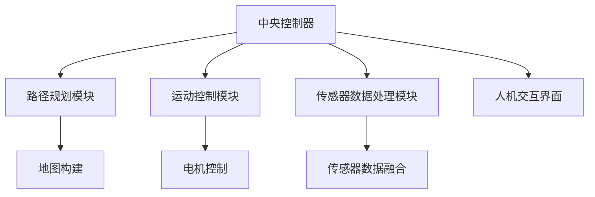
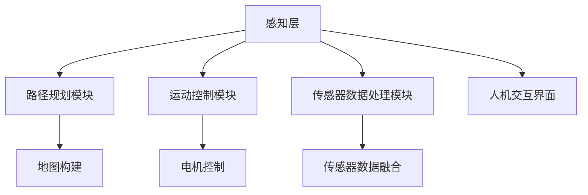

                 

### 《京东2024校招智能仓储机器人控制系统工程师面试题集锦》

**关键词：** 京东校招、智能仓储机器人、控制系统、面试题、智能物流

**摘要：** 本文针对京东2024校园招聘智能仓储机器人控制系统工程师职位，整理了一系列面试题集锦。内容涵盖了智能仓储机器人概述、控制系统原理、开发环境搭建、控制算法与传感器数据处理、系统设计与实现、应用案例解析以及未来发展展望等关键领域，旨在为求职者和招聘方提供有针对性的技术准备和参考。

---

### 目录大纲

#### 第一部分：智能仓储机器人控制系统基础

1. **智能仓储机器人概述**
   - **1.1 智能仓储机器人简介**
     - 智能仓储机器人定义
     - 智能仓储机器人分类
   - **1.2 智能仓储机器人的发展历程**
     - 智能仓储机器人历史演变
     - 当前技术趋势
   - **1.3 智能仓储机器人在京东的应用现状**
     - 京东智能仓储机器人案例
     - 应用场景与优势

2. **智能仓储机器人控制系统原理**
   - **2.1 控制系统基本概念**
     - 控制系统定义
     - 控制系统组成部分
   - **2.2 智能仓储机器人控制算法**
     - 算法概述
     - 常见控制算法介绍
   - **2.3 智能仓储机器人控制系统架构**
     - 系统架构概述
     - 系统模块划分

3. **智能仓储机器人控制系统开发环境搭建**
   - **3.1 开发环境准备**
     - 开发工具选择
     - 环境配置步骤
   - **3.2 常用开发库与框架**
     - 开发库介绍
     - 框架使用方法
   - **3.3 开发流程与方法**
     - 项目流程
     - 开发方法介绍

#### 第二部分：智能仓储机器人控制系统面试题集锦

4. **控制算法与控制理论**
   - **4.1 PID控制算法**
     - PID算法原理
     - PID参数调优
   - **4.2 模糊控制**
     - 模糊控制原理
     - 模糊控制器设计
   - **4.3 神经网络控制**
     - 神经网络控制原理
     - 神经网络控制器设计

5. **传感器与数据处理**
   - **5.1 常用传感器介绍**
     - 传感器类型
     - 传感器选型
   - **5.2 数据采集与处理**
     - 数据采集方法
     - 数据处理流程
   - **5.3 传感器标定**
     - 标定原理
     - 标定方法与步骤

6. **智能仓储机器人控制系统设计与实现**
   - **6.1 系统需求分析**
     - 需求分析步骤
     - 需求分析示例
   - **6.2 系统设计**
     - 系统设计方法
     - 系统架构设计
   - **6.3 系统实现**
     - 系统实现流程
     - 关键代码实现

7. **智能仓储机器人应用案例解析**
   - **7.1 案例介绍**
     - 案例背景
     - 案例目标
   - **7.2 案例实现**
     - 案例关键技术
     - 案例实现步骤
   - **7.3 案例效果评估**
     - 案例效果分析
     - 案例改进方向

8. **智能仓储机器人未来发展展望**
   - **8.1 技术发展趋势**
     - 新技术发展趋势
     - 技术发展前景
   - **8.2 应用领域拓展**
     - 新应用领域
     - 预期影响
   - **8.3 挑战与机遇**
     - 智能仓储机器人面临的问题
     - 应对策略与机遇

#### 附录

9. **智能仓储机器人控制系统相关资源**
   - **9.1 开源库与框架**
     - 推荐开源库
     - 开源框架介绍
   - **9.2 学术论文与报告**
     - 最新研究成果
     - 报告与会议介绍
   - **9.3 实践教程与案例**
     - 实践教程链接
     - 案例资源下载
   - **9.4 行业报告与趋势分析**
     - 行业发展报告
     - 市场趋势分析

### 概述

智能仓储机器人控制系统是智能物流领域的关键组成部分，它承担着自动化仓储作业的指挥与协调任务，对提高物流效率、降低运营成本具有重要意义。随着人工智能和物联网技术的不断进步，智能仓储机器人控制系统正朝着更加智能化、自适应化和高效化的方向发展。

本文旨在为参加京东2024校园招聘的智能仓储机器人控制系统工程师职位的学生和专业人士提供一套全面的面试题集锦。通过系统性地梳理和总结智能仓储机器人控制系统的相关知识点，本文希望能够帮助求职者更好地理解和掌握相关技术，同时为招聘方提供一个有价值的参考标准。

文章将从以下几个方面进行深入探讨：

1. **智能仓储机器人概述**：介绍智能仓储机器人的定义、分类及其在京东的应用现状，帮助读者建立初步的认识。

2. **智能仓储机器人控制系统原理**：阐述控制系统的基本概念、智能仓储机器人控制算法及其系统架构，为读者提供理论基础。

3. **智能仓储机器人控制系统开发环境搭建**：介绍开发环境的准备、常用开发库与框架的选择以及开发流程与方法，帮助读者搭建开发环境。

4. **控制算法与传感器数据处理**：讲解PID控制算法、模糊控制、神经网络控制以及传感器数据处理的基本原理和方法。

5. **智能仓储机器人控制系统设计与实现**：分析系统需求分析、系统设计、系统实现的流程和方法，并提供关键代码实现的示例。

6. **智能仓储机器人应用案例解析**：通过实际案例介绍，详细解析智能仓储机器人控制系统的具体实现过程和效果评估。

7. **智能仓储机器人未来发展展望**：探讨智能仓储机器人技术的发展趋势、应用领域拓展以及面临的挑战和机遇。

通过本文的阅读，读者将能够全面了解智能仓储机器人控制系统的相关知识点，为面试和实际工作打下坚实的基础。

### 第一部分：智能仓储机器人控制系统基础

#### 第1章：智能仓储机器人概述

**1.1 智能仓储机器人简介**

智能仓储机器人是指一种结合了人工智能、物联网、传感器技术等先进技术的自动化设备，主要用于仓储管理中的物品搬运、分类、存储和检索等作业。与传统的仓储设备相比，智能仓储机器人具备更高的灵活性和智能化水平，能够根据作业需求进行自适应调整，提高仓储作业效率。

**智能仓储机器人定义**

智能仓储机器人可以被定义为一种能够执行仓储任务、具备自主决策能力的机器人系统。其核心特点包括：

- **自主导航**：智能仓储机器人能够自主进行路径规划和导航，避开障碍物并按照既定路线完成任务。
- **感知能力**：通过传感器，智能仓储机器人能够实时感知周围环境，获取视觉、温度、湿度、重量等数据，并进行处理和判断。
- **智能决策**：基于感知数据和预设算法，智能仓储机器人能够做出决策，调整作业策略以应对不同的作业场景。
- **协作能力**：智能仓储机器人可以与其他机器人、人工操作员和仓储设备进行协同工作，实现高效的仓储管理。

**智能仓储机器人分类**

智能仓储机器人根据功能和应用场景的不同，可以分为多种类型：

- **搬运机器人**：主要用于物品的搬运和运输，如叉车、搬运车等。
- **分类机器人**：用于物品的分类和分拣，如自动化分拣机、拣选机器人等。
- **存储机器人**：用于物品的存储和检索，如自动存储系统、货架搬运机器人等。
- **巡检机器人**：用于仓库巡检、安全监控等任务，如智能巡检机器人等。
- **包装机器人**：用于物品的包装和封装，如自动化包装机等。

**1.2 智能仓储机器人的发展历程**

智能仓储机器人的发展可以追溯到20世纪80年代，随着人工智能和传感器技术的不断进步，智能仓储机器人的应用场景和功能也日益丰富。

- **早期阶段（20世纪80年代-2000年）**：在这一阶段，仓储机器人的主要应用是简单的搬运和分类任务，如搬运车和自动化分拣机。这些机器人主要依靠简单的传感器和预设程序进行工作。
- **发展阶段（2000年-2010年）**：随着计算机视觉、GPS导航和物联网技术的发展，智能仓储机器人逐渐具备自主导航、感知环境和智能决策的能力。这一时期，仓储机器人的应用范围进一步扩大，如无人仓库、智能货架等。
- **成熟阶段（2010年至今）**：近年来，人工智能技术的飞速发展，使得智能仓储机器人变得更加智能化和高效化。机器人不仅能够执行复杂的仓储任务，还能够进行自适应学习和优化，提高作业效率。

**当前技术趋势**

随着技术的不断进步，智能仓储机器人的技术趋势主要表现在以下几个方面：

- **人工智能**：深度学习、强化学习等人工智能技术被广泛应用于智能仓储机器人，使其具备更强大的感知、决策和协作能力。
- **自主导航**：视觉SLAM（Simultaneous Localization and Mapping）技术、激光雷达和GPS等导航技术不断成熟，使得智能仓储机器人能够在复杂的仓库环境中实现自主导航。
- **传感器集成**：多种传感器的集成，如视觉传感器、温度传感器、重量传感器等，使得智能仓储机器人能够获取更多环境信息，提高作业准确性。
- **协作机器人**：协作机器人（Cobots）的发展，使得智能仓储机器人能够更加安全地与人类操作员和设备进行协作，提高仓储作业的效率。
- **云服务**：云计算和大数据分析技术的应用，使得智能仓储机器人能够实现远程监控、数据共享和智能优化，提高整体仓储系统的管理水平。

**1.3 智能仓储机器人在京东的应用现状**

京东作为中国领先的电商企业，在智能仓储机器人应用方面处于行业领先地位。京东的智能仓储机器人涵盖了搬运、分类、存储、巡检等多种类型，广泛应用于京东的各大仓库和配送中心。

- **搬运机器人**：京东使用的搬运机器人包括自动搬运车、货架搬运机器人等，这些机器人能够高效完成物品的搬运和运输任务，提高仓储作业效率。
- **分类机器人**：京东的自动化分拣系统采用了多个智能分类机器人，能够快速、准确地完成订单物品的分拣工作，降低人工成本。
- **存储机器人**：京东的智能存储系统包括自动存储系统、货架搬运机器人等，能够实现高效的存储和检索，提高仓库空间利用率。
- **巡检机器人**：京东的智能巡检机器人能够在仓库中进行自主巡检，实时监控仓库环境和设备状态，提高安全管理水平。
- **包装机器人**：京东的自动化包装机器人能够快速完成商品的包装和封装，提高包装速度和包装质量。

**应用场景与优势**

智能仓储机器人在京东的各个应用场景中展现出了显著的优势：

- **提高效率**：智能仓储机器人能够高效完成各种仓储作业，大大缩短了作业时间，提高了整体作业效率。
- **降低成本**：通过自动化作业，减少了人力成本和运营成本，提高了企业盈利能力。
- **提升准确性**：智能仓储机器人具有高度的准确性和稳定性，减少了人工操作导致的错误和损失。
- **提高安全性**：智能仓储机器人能够自主导航和避障，降低了人为操作的风险，提高了仓储作业的安全性。
- **灵活适应**：智能仓储机器人能够根据作业需求进行自适应调整，适应不同的仓储环境和作业任务。

总之，智能仓储机器人在京东的应用不仅提升了仓储作业效率，还为企业带来了显著的成本和效益，成为了智能物流领域的重要推动力。

#### 第2章：智能仓储机器人控制系统原理

**2.1 控制系统基本概念**

智能仓储机器人控制系统的核心功能是实现机器人的精确控制，使其能够按照预设的路径和任务进行自主行动。为了实现这一目标，控制系统需要具备以下几个基本概念：

- **控制器（Controller）**：控制器是整个控制系统的核心，负责接收传感器数据，根据控制算法生成控制指令，驱动执行器完成所需动作。控制器通常由微处理器、微控制器或嵌入式系统组成，具有实时性、高效性和可扩展性的特点。
- **传感器（Sensor）**：传感器用于获取机器人周围环境的信息，如位置、速度、温度、湿度、重量等。传感器的类型包括视觉传感器、激光雷达、超声波传感器、红外传感器等。传感器的准确性和灵敏度直接影响控制系统的性能。
- **执行器（Actuator）**：执行器是控制系统的执行部分，负责根据控制器的指令完成具体的动作。常见的执行器有电机、液压缸、气动缸等。执行器的响应速度和精度也是控制系统性能的重要指标。
- **控制算法（Control Algorithm）**：控制算法是控制系统的核心，用于根据传感器数据生成控制指令。常见的控制算法包括PID控制、模糊控制、神经网络控制等。控制算法的设计和实现直接决定了控制系统的性能和稳定性。

**控制系统组成部分**

智能仓储机器人控制系统通常由以下几个主要部分组成：

- **硬件部分**：包括控制器、传感器、执行器等硬件设备。硬件部分需要根据具体应用场景进行选型和配置，以满足系统的性能和功能需求。
- **软件部分**：包括操作系统、驱动程序、控制算法和用户界面等。软件部分负责控制硬件设备的工作，处理传感器数据，生成控制指令，并通过用户界面与操作员进行交互。
- **数据通信**：控制系统需要通过网络或无线通信技术与外部设备进行数据通信，如与计算机、数据库或其他机器人进行信息交换。数据通信的可靠性、实时性和安全性是系统稳定运行的关键。

**2.2 智能仓储机器人控制算法**

控制算法是智能仓储机器人控制系统的核心，用于根据传感器数据生成控制指令，驱动执行器完成所需的动作。常见的控制算法包括PID控制、模糊控制、神经网络控制等。

- **PID控制算法**

PID（比例-积分-微分）控制算法是最常用的控制算法之一，适用于各种线性、非线性系统的控制。PID算法的基本思想是通过三个参数（比例增益Kp、积分增益Ki、微分增益Kd）来调整控制器的输出，使系统的输出达到期望值。

PID控制算法的伪代码实现如下：

```plaintext
初始化：设定初始值 Kp、Ki、Kd，设定目标值 setpoint

while true:
    current_value = 传感器读取的当前值
    error = setpoint - current_value
    P = Kp * error
    I = Ki * ∫(error dt)
    D = Kd * (error - last_error)
    output = P + I + D
    执行器执行 output 指令
    last_error = error
    等待一定时间（控制周期）
```

- **模糊控制**

模糊控制是一种基于模糊逻辑的控制方法，适用于非线性、复杂系统的控制。模糊控制的基本思想是通过模糊规则库将输入变量和输出变量联系起来，实现系统的控制。

模糊控制器的设计通常包括以下几个步骤：

1. 模糊化：将输入和输出变量转化为模糊变量。
2. 模糊规则库：定义输入和输出变量之间的模糊规则。
3. 解模糊化：将模糊变量转化为具体输出值。

模糊控制器的伪代码实现如下：

```plaintext
初始化：设定模糊规则库

while true:
    模糊化输入变量
    计算模糊规则库的输出
    解模糊化输出变量
    执行器执行输出变量指令
    等待一定时间（控制周期）
```

- **神经网络控制**

神经网络控制是一种基于神经网络的控制方法，通过训练神经网络来学习系统的动态特性，实现系统的控制。常见的神经网络包括BP网络、RBF网络等。

神经网络控制器的设计通常包括以下几个步骤：

1. 神经网络结构设计：根据控制系统的需求选择合适的神经网络结构。
2. 神经网络训练：使用系统数据对神经网络进行训练，学习系统的动态特性。
3. 神经网络应用：将训练好的神经网络应用于控制系统，实现系统的控制。

神经网络控制器的伪代码实现如下：

```plaintext
初始化：设定神经网络结构

while true:
    读取传感器数据作为输入
    使用训练好的神经网络计算输出
    执行器执行输出指令
    更新神经网络权重
    等待一定时间（控制周期）
```

**2.3 智能仓储机器人控制系统架构**

智能仓储机器人控制系统通常采用模块化设计，以提高系统的灵活性和可维护性。常见的系统架构包括：

- **分布式架构**：将控制系统分为多个模块，每个模块负责不同的功能，如路径规划、运动控制、传感器数据处理等。分布式架构能够提高系统的并行处理能力，但需要复杂的通信机制。
- **集中式架构**：将所有功能集成在一个控制单元中，由一个中央控制器进行统一控制。集中式架构简单，但可能存在性能瓶颈。
- **混合式架构**：结合分布式和集中式架构的优点，将关键功能集中在中央控制器中，次要功能分布在各个模块中。

智能仓储机器人控制系统的典型架构如下：



- **中央控制器**：负责整个控制系统的协调和管理，接收传感器数据，执行控制算法，生成控制指令。
- **路径规划模块**：负责机器人的路径规划，根据环境信息和目标位置生成最优路径。
- **运动控制模块**：负责机器人的运动控制，根据路径规划结果驱动执行器执行运动。
- **传感器数据处理模块**：负责传感器数据的采集、处理和融合，为路径规划和运动控制提供实时信息。
- **人机交互界面**：提供系统操作和控制参数的输入输出接口，便于操作员对系统进行监控和控制。

通过上述设计，智能仓储机器人控制系统能够实现高效、稳定、安全的仓储作业，为企业的智能化物流管理提供有力支持。

#### 第3章：智能仓储机器人控制系统开发环境搭建

**3.1 开发环境准备**

智能仓储机器人控制系统的开发环境需要包括硬件、软件和网络配置，以下将详细描述开发环境的准备步骤。

**硬件准备**

1. **控制器**：选择合适的控制器，如Raspberry Pi、Arduino、NVIDIA Jetson等。这些控制器具备足够的处理能力，适用于智能仓储机器人的开发。
2. **传感器**：根据应用需求选择合适的传感器，如激光雷达、超声波传感器、视觉传感器、温湿度传感器等。这些传感器可以提供环境信息，帮助机器人进行路径规划和任务执行。
3. **执行器**：根据机器人运动需求选择合适的执行器，如电机、伺服电机、液压缸等。执行器负责将控制指令转换为实际动作。
4. **通信模块**：选择支持无线通信的模块，如Wi-Fi、蓝牙、LoRa等，用于实现机器人与其他设备之间的数据传输。

**软件准备**

1. **操作系统**：选择适合的操作系统，如Linux（如Ubuntu、Debian）或Windows。Linux操作系统在嵌入式系统中应用广泛，具有良好的稳定性和开源支持。
2. **开发工具**：安装集成开发环境（IDE），如Eclipse、Visual Studio Code等。这些IDE提供了便捷的代码编写、调试和编译功能。
3. **编程语言**：选择合适的编程语言，如C/C++、Python等。C/C++在嵌入式系统开发中应用广泛，具有高性能和低资源消耗的特点；Python则因其简单易学、丰富的库支持而受到开发者喜爱。

**环境配置步骤**

以下以Ubuntu操作系统为例，描述智能仓储机器人控制系统的开发环境配置步骤：

1. **安装操作系统**：下载Ubuntu系统镜像，并使用USB驱动器安装到目标硬件上。
2. **更新系统**：打开终端，执行以下命令更新系统软件包：
   ```bash
   sudo apt update
   sudo apt upgrade
   ```
3. **安装开发工具**：安装必要的开发工具和库，如GCC编译器、Python环境、ROS（Robot Operating System）等：
   ```bash
   sudo apt install build-essential
   sudo apt install python3 python3-pip
   sudo apt install ros-melodic-desktop
   ```
4. **配置ROS**：配置ROS环境，使其能够正常工作：
   ```bash
   echo "source /opt/ros/melodic/setup.bash" >> ~/.bashrc
   source ~/.bashrc
   ```
5. **安装传感器驱动**：根据传感器类型安装相应的驱动程序，如RPLIDAR激光雷达的驱动：
   ```bash
   sudo apt install ros-melodic-rplidar
   ```
6. **安装执行器控制库**：根据执行器类型安装相应的控制库，如Arduino控制库：
   ```bash
   sudo apt install python-arduino
   ```
7. **测试开发环境**：启动一个ROS节点进行测试，确保开发环境配置正确：
   ```bash
   roscore
   ```
   在另一个终端中执行以下命令：
   ```bash
   rosrun turtlesim turtlesim_node
   rosrun turtle_tf turtle_tf
   ```
   如果成功看到TurtleBot的仿真界面，说明ROS环境已正确配置。

**常用开发库与框架**

在智能仓储机器人控制系统的开发过程中，可以使用以下常用开发库和框架：

1. **ROS（Robot Operating System）**：ROS是一个开源的机器人中间件，提供了丰富的库和工具，支持多种机器人平台的开发。ROS包括多个功能模块，如运动规划、感知、导航、控制等。
2. **PCL（Point Cloud Library）**：PCL是一个开源的点云处理库，支持各种点云处理算法，如滤波、特征提取、表面重建等。PCL常用于激光雷达数据处理。
3. **OpenCV**：OpenCV是一个开源的计算机视觉库，提供了丰富的图像处理算法，如滤波、边缘检测、特征提取等。OpenCV常用于视觉传感器数据处理。
4. **Python库**：Python在智能仓储机器人开发中具有广泛的应用，如使用PyTorch、TensorFlow等进行神经网络控制算法的实现。

**开发流程与方法**

智能仓储机器人控制系统的开发通常包括以下几个步骤：

1. **需求分析**：明确系统的功能需求和技术指标，如路径规划、传感器数据处理、运动控制等。
2. **系统设计**：根据需求分析结果，设计系统的总体架构和模块划分，选择合适的硬件和软件平台。
3. **代码编写**：根据系统设计，编写各个模块的代码，实现具体功能。
4. **系统集成**：将各个模块进行集成，确保系统能够正常运行。
5. **测试与调试**：对系统进行功能测试和性能评估，发现并修复潜在问题。
6. **部署与应用**：将开发完成的系统部署到实际应用场景，进行长期运行和优化。

通过上述开发流程和方法，可以有效地搭建智能仓储机器人控制系统开发环境，为后续系统开发提供坚实的基础。

#### 第4章：控制算法与控制理论

**4.1 PID控制算法**

PID（比例-积分-微分）控制算法是一种经典的控制算法，广泛应用于工业控制、自动化系统等领域。PID控制算法通过比例、积分、微分三个参数来调整控制器的输出，使系统的输出达到期望值。

**PID算法原理**

PID算法的基本思想是通过三个参数（Kp、Ki、Kd）来调整控制器的输出。其中，Kp是比例增益，Ki是积分增益，Kd是微分增益。PID控制器的输出计算公式如下：

$$
u(t) = Kp \cdot e(t) + Ki \cdot \int_{0}^{t} e(\tau)d\tau + Kd \cdot (e(t) - e(t-1))
$$

其中，$e(t)$ 是系统误差，即期望值与实际值之差；$u(t)$ 是控制器的输出。

**PID参数调优**

PID参数的调优是控制系统设计中的关键步骤，直接影响系统的稳定性和性能。常用的参数调优方法包括：

- **试错法**：通过不断调整参数，观察系统响应，逐步找到合适的参数值。
- **Ziegler-Nichols法**：根据系统的阶跃响应曲线，通过计算得出初始参数值，然后进行微调。
- **遗传算法**：利用遗传算法优化PID参数，提高调参的效率和精度。

**PID参数调优伪代码示例**：

```plaintext
初始化：设定初始参数 Kp、Ki、Kd

while true:
    计算系统误差 e(t)
    计算控制输出 u(t) = Kp \cdot e(t) + Ki \cdot ∫(e(τ) dτ) + Kd \cdot (e(t) - e(t-1))
    执行控制输出
    获取系统响应
    根据系统响应调整参数 Kp、Ki、Kd
    等待一定时间
```

**4.2 模糊控制**

模糊控制是一种基于模糊逻辑的控制方法，适用于非线性、复杂系统的控制。模糊控制通过模糊规则库将输入变量和输出变量联系起来，实现系统的控制。

**模糊控制原理**

模糊控制的基本思想是将输入变量和输出变量模糊化，通过模糊规则库进行推理，最后将模糊推理结果解模糊化为具体输出值。

模糊控制的基本过程包括以下几个步骤：

1. **模糊化**：将输入变量和输出变量从具体数值转换为模糊变量，如“大”、“中”、“小”等。
2. **模糊规则库**：定义输入变量和输出变量之间的模糊规则，如“If 输入是‘大’，则输出是‘大’”。
3. **模糊推理**：根据输入变量的模糊值，通过模糊规则库进行推理，得到输出变量的模糊值。
4. **解模糊化**：将模糊值转换为具体数值，得到控制输出。

**模糊控制器设计**

模糊控制器的设计通常包括以下几个步骤：

1. **模糊化**：选择合适的模糊化函数，将输入和输出变量从具体数值转换为模糊变量。
2. **规则库构建**：根据系统特性，构建模糊规则库，定义输入和输出变量之间的模糊关系。
3. **推理机制**：选择合适的推理机制，如最大-最小推理、最大-乘推理等。
4. **解模糊化**：选择合适的解模糊化函数，将模糊推理结果转换为具体输出值。

**模糊控制器设计伪代码示例**：

```plaintext
初始化：设定模糊化函数、模糊规则库、推理机制、解模糊化函数

while true:
    模糊化输入变量
    根据模糊规则库进行推理
    解模糊化输出变量
    执行控制输出
    等待一定时间
```

**4.3 神经网络控制**

神经网络控制是一种基于人工神经网络的控制方法，通过训练神经网络学习系统的动态特性，实现系统的控制。神经网络控制适用于非线性、复杂系统的控制，具有自学习、自适应能力。

**神经网络控制原理**

神经网络控制的基本思想是通过训练神经网络来学习系统的输入输出关系，然后将训练好的神经网络应用于控制系统，实现系统的控制。

神经网络控制的基本过程包括以下几个步骤：

1. **神经网络结构设计**：根据系统特性选择合适的神经网络结构，如BP网络、RBF网络等。
2. **神经网络训练**：使用系统数据对神经网络进行训练，学习系统的动态特性。
3. **神经网络应用**：将训练好的神经网络应用于控制系统，实现系统的控制。

**神经网络控制器设计**

神经网络控制器的设计通常包括以下几个步骤：

1. **神经网络结构设计**：根据控制系统的需求选择合适的神经网络结构。
2. **神经网络训练**：使用系统数据对神经网络进行训练，学习系统的动态特性。
3. **神经网络应用**：将训练好的神经网络应用于控制系统，实现系统的控制。

**神经网络控制器设计伪代码示例**：

```plaintext
初始化：设定神经网络结构

while true:
    读取传感器数据作为输入
    使用训练好的神经网络计算输出
    执行器执行输出指令
    更新神经网络权重
    等待一定时间
```

通过上述控制算法与控制理论的分析，可以更好地理解和应用PID控制、模糊控制和神经网络控制，为智能仓储机器人控制系统设计提供理论支持。

#### 第5章：传感器与数据处理

**5.1 常用传感器介绍**

在智能仓储机器人控制系统中，传感器是获取环境信息的关键组件，常用的传感器类型包括以下几种：

1. **视觉传感器**：视觉传感器通过摄像头获取图像数据，常用于物体识别、路径规划和障碍物检测。常见的视觉传感器有USB摄像头、摄像头模块等。

2. **激光雷达**：激光雷达通过发射激光束并测量反射时间，获取三维空间信息。激光雷达常用于自主导航、环境建模和障碍物检测。常见的激光雷达有RPLIDAR、HDL-32E等。

3. **超声波传感器**：超声波传感器通过发射和接收超声波，测量声波反射回来的时间，获取物体距离信息。超声波传感器适用于距离测量和避障。常见的超声波传感器有HC-SR04、Ultrasonic Ranger等。

4. **温湿度传感器**：温湿度传感器用于测量环境温度和湿度，常用于仓库环境监控。常见的温湿度传感器有DHT11、DHT22等。

5. **重量传感器**：重量传感器用于测量物品的重量，常用于仓储管理中的物品称重。常见的重量传感器有称重模块、负载传感器等。

**传感器选型**

选择合适的传感器需要考虑以下因素：

- **精度**：传感器的精度直接影响到系统的控制精度。根据应用场景选择合适的精度等级。
- **响应速度**：响应速度决定了传感器对环境变化的感知能力。高速传感器适用于实时性要求高的场景。
- **可靠性**：传感器的可靠性是系统稳定运行的重要保障。选择经过验证的成熟传感器。
- **成本**：根据预算和性能要求选择合适的传感器。成本较低的传感器可能适用于简单应用，而高端传感器适用于复杂应用。

**5.2 数据采集与处理**

数据采集与处理是智能仓储机器人控制系统的重要组成部分，主要包括以下步骤：

1. **数据采集**：通过传感器获取环境数据，如图像、距离、温度、湿度等。数据采集需要确保实时性和准确性。

2. **数据预处理**：对采集到的原始数据进行预处理，如去噪、滤波、归一化等。预处理有助于提高数据质量和后续处理的效率。

3. **特征提取**：从预处理后的数据中提取有用的特征信息，如图像中的边缘、角点、纹理等。特征提取为后续的物体识别、路径规划等任务提供基础。

4. **数据融合**：将来自多个传感器的数据进行融合，以获得更全面和准确的环境信息。数据融合可以采用加权平均、卡尔曼滤波等方法。

5. **数据存储与传输**：将处理后的数据存储到数据库或缓存中，以便后续分析和处理。数据传输需要确保实时性和可靠性。

**5.3 传感器标定**

传感器标定是确保传感器测量准确性的重要步骤。标定包括以下步骤：

1. **标定原理**：传感器标定是通过比较传感器测量值与标准值，确定传感器系数和误差模型的过程。

2. **标定方法**：标定方法包括实验室标定和现场标定。实验室标定通过标准设备进行测量，获得传感器的校准曲线；现场标定则通过在实际应用场景中测量，调整传感器参数以达到最佳性能。

3. **标定步骤**：

   - **设备连接**：将传感器连接到标定设备，如激光雷达与标定架连接。
   - **初始设置**：设置标定参数，如标定距离、标定角度等。
   - **数据采集**：采集传感器在不同角度和距离的测量数据。
   - **数据分析**：对采集到的数据进行处理，拟合校准曲线，确定传感器系数。
   - **校准应用**：将标定结果应用于实际系统中，调整传感器参数以达到最佳性能。

通过上述传感器与数据处理的介绍，可以为智能仓储机器人控制系统的设计与实现提供技术支持。合理选择和使用传感器，以及有效的数据处理，将有助于提升系统的性能和可靠性。

#### 第6章：智能仓储机器人控制系统设计与实现

**6.1 系统需求分析**

系统需求分析是智能仓储机器人控制系统设计的重要环节，它确定了系统的功能、性能和约束条件。以下为系统需求分析的详细步骤和示例：

**步骤一：明确系统目标**

首先，明确智能仓储机器人控制系统的目标，例如：实现自动化搬运、分类、存储和检索任务；提高仓储作业效率；降低运营成本；提高仓储作业的准确性和安全性等。

**步骤二：定义功能需求**

根据系统目标，定义智能仓储机器人控制系统的功能需求，例如：

- **路径规划与导航**：系统能够根据地图和环境信息规划最优路径，实现机器人的自主导航。
- **传感器数据采集与处理**：系统能够实时采集视觉、激光雷达、温湿度等传感器数据，并进行预处理和融合。
- **运动控制**：系统能够根据控制算法和传感器数据，实时调整机器人的速度和方向。
- **任务执行**：系统能够根据预设的任务指令，完成物品的搬运、分类、存储和检索等任务。
- **人机交互**：系统应提供友好的人机交互界面，便于操作员监控和操作系统。

**步骤三：确定性能需求**

确定系统的性能需求，例如：

- **响应速度**：系统应在100ms内对控制指令做出响应。
- **精度**：系统应实现±1cm的路径规划精度和±0.1kg的重量测量精度。
- **稳定性**：系统应在连续工作24小时后，仍能保持稳定的性能和精度。
- **可靠性**：系统应在99.9%的情况下正常运行，故障率低于0.1%。

**步骤四：识别系统约束条件**

识别系统在设计和实现过程中可能面临的约束条件，例如：

- **硬件资源**：系统硬件资源有限，需要优化资源使用，降低成本。
- **环境因素**：系统需要在各种环境条件下（如高温、潮湿、粉尘等）稳定运行。
- **安全性**：系统应确保机器人与人员的安全，避免意外碰撞和伤害。
- **扩展性**：系统应具备良好的扩展性，便于后续功能升级和性能优化。

**示例**：

以一个智能仓储机器人搬运系统的需求分析为例：

**目标**：实现自动化物品搬运，提高仓储作业效率。

**功能需求**：

- **路径规划与导航**：系统能够根据地图和环境信息，规划最优搬运路径，实现机器人的自主导航。
- **传感器数据采集与处理**：系统能够实时采集视觉、激光雷达等传感器数据，识别物品位置和障碍物，并进行预处理和融合。
- **运动控制**：系统能够根据控制算法和传感器数据，实时调整机器人的速度和方向，确保物品搬运的平稳和安全。
- **任务执行**：系统能够根据预设的任务指令，完成物品的搬运任务，并自动避障。
- **人机交互**：系统应提供友好的人机交互界面，便于操作员监控和操作系统。

**性能需求**：

- **响应速度**：系统应在50ms内对控制指令做出响应。
- **精度**：系统应实现±0.5cm的路径规划精度和±0.05kg的重量测量精度。
- **稳定性**：系统应在连续工作8小时后，仍能保持稳定的性能和精度。
- **可靠性**：系统应在99.9%的情况下正常运行，故障率低于0.1%。

**约束条件**：

- **硬件资源**：系统硬件资源有限，需要优化资源使用，降低成本。
- **环境因素**：系统需要在各种环境条件下（如高温、潮湿、粉尘等）稳定运行。
- **安全性**：系统应确保机器人与人员的安全，避免意外碰撞和伤害。
- **扩展性**：系统应具备良好的扩展性，便于后续功能升级和性能优化。

通过上述步骤和示例，可以明确智能仓储机器人控制系统的需求，为后续设计和实现提供基础。

**6.2 系统设计**

系统设计是智能仓储机器人控制系统开发的关键环节，它决定了系统的功能、性能和可靠性。以下是智能仓储机器人控制系统的设计方法和系统架构。

**设计方法**

1. **模块化设计**：将系统划分为多个功能模块，如路径规划模块、运动控制模块、传感器数据处理模块等。模块化设计可以提高系统的可维护性和可扩展性。

2. **层次化设计**：将系统按功能层次进行划分，如感知层、控制层、执行层等。层次化设计有助于明确各层次的功能和接口，便于系统实现和调试。

3. **需求驱动设计**：根据系统需求分析结果，制定详细的设计方案。需求驱动设计确保系统设计符合实际应用需求，避免功能冗余和设计偏差。

**系统架构**

智能仓储机器人控制系统采用分布式架构，各模块独立运行，通过通信机制进行数据交换。以下是系统架构的详细描述：

1. **感知层**：包括各种传感器，如视觉传感器、激光雷达、超声波传感器、温湿度传感器等。感知层负责实时采集环境信息，并将数据传输至控制层。

2. **控制层**：包括路径规划模块、运动控制模块、传感器数据处理模块等。控制层负责处理感知层的数据，生成控制指令，驱动执行层执行任务。

3. **执行层**：包括机器人本体和各种执行器，如电机、伺服电机、液压缸等。执行层负责执行控制层的指令，完成具体动作。

**系统架构设计**

以下是智能仓储机器人控制系统的典型架构设计：



- **感知层**：负责实时采集环境信息，包括视觉、激光雷达、超声波传感器等。感知层将采集到的数据传输至控制层。

- **路径规划模块**：负责根据地图和环境信息，规划机器人的最优路径。路径规划模块与传感器数据处理模块和地图构建模块进行数据交互。

- **运动控制模块**：负责根据路径规划和传感器数据处理结果，实时调整机器人的速度和方向。运动控制模块与电机控制模块进行数据交互。

- **传感器数据处理模块**：负责对感知层采集到的传感器数据进行预处理和融合，为路径规划和运动控制模块提供实时信息。传感器数据处理模块与路径规划模块和地图构建模块进行数据交互。

- **地图构建模块**：负责实时构建仓库地图，更新机器人的环境信息。地图构建模块与路径规划模块和传感器数据处理模块进行数据交互。

- **电机控制模块**：负责接收运动控制模块的指令，驱动电机执行具体动作。电机控制模块与运动控制模块进行数据交互。

- **人机交互界面**：提供系统操作和控制参数的输入输出接口，便于操作员对系统进行监控和控制。人机交互界面与感知层、控制层和执行层进行数据交互。

通过上述系统设计方法和架构设计，智能仓储机器人控制系统可以实现高效、稳定、安全的仓储作业，为企业的智能化物流管理提供有力支持。

**6.3 系统实现**

智能仓储机器人控制系统的实现包括硬件搭建、软件编写和系统集成三个主要阶段。以下将详细描述每个阶段的实现过程。

**硬件搭建**

硬件搭建是智能仓储机器人控制系统实现的第一步，主要包括以下内容：

1. **选择硬件平台**：根据系统需求选择合适的硬件平台，如Raspberry Pi、Arduino、NVIDIA Jetson等。这些硬件平台具备足够的处理能力和扩展性，适用于智能仓储机器人的开发。

2. **连接传感器**：将传感器（如视觉传感器、激光雷达、超声波传感器等）与硬件平台连接。例如，使用I2C或SPI接口连接温湿度传感器，使用UART接口连接超声波传感器。

3. **连接执行器**：将执行器（如电机、伺服电机、液压缸等）与硬件平台连接。例如，使用PWM信号控制电机速度和方向，使用UART或SPI接口控制伺服电机。

4. **通信模块配置**：配置无线通信模块（如Wi-Fi、蓝牙、LoRa等），实现机器人与其他设备（如计算机、数据库、其他机器人等）之间的数据传输。

5. **电源配置**：确保硬件平台和传感器、执行器等设备有稳定的电源供应，避免设备因电源问题导致运行不稳定。

**软件编写**

软件编写是智能仓储机器人控制系统实现的第二步，主要包括以下内容：

1. **编写控制算法**：根据智能仓储机器人的需求，编写控制算法。例如，使用PID控制算法实现运动控制，使用模糊控制算法实现避障控制。

2. **实现路径规划**：编写路径规划算法，根据地图和环境信息，为机器人规划最优路径。例如，使用A*算法或Dijkstra算法实现路径规划。

3. **实现传感器数据处理**：编写传感器数据处理代码，对传感器采集到的数据进行分析和融合。例如，使用OpenCV库处理图像数据，使用PCL库处理激光雷达数据。

4. **实现人机交互**：编写人机交互界面，提供系统操作和控制参数的输入输出接口。例如，使用Qt库或Web技术实现人机交互界面。

5. **集成ROS**：使用ROS（Robot Operating System）集成各个模块，实现机器人控制系统的整体功能。例如，使用ROS的Topic、Service等机制实现模块之间的数据通信。

**系统集成**

系统集成是将硬件和软件整合在一起，实现智能仓储机器人控制系统的整体功能。以下为系统集成的主要步骤：

1. **测试硬件功能**：确保所有硬件设备正常工作，包括传感器、执行器和通信模块。

2. **测试软件功能**：在硬件搭建的基础上，运行控制算法、路径规划算法、传感器数据处理代码等，确保软件功能正常。

3. **系统调试**：在硬件和软件测试的基础上，进行系统集成测试，发现并解决潜在的问题。

4. **系统优化**：根据系统运行情况和实际需求，对硬件配置、软件算法等进行优化，提高系统性能和稳定性。

5. **部署应用**：将智能仓储机器人控制系统部署到实际应用场景，进行长期运行和优化，确保系统稳定可靠。

通过上述硬件搭建、软件编写和系统集成的过程，可以成功实现智能仓储机器人控制系统，为企业的智能化物流管理提供技术支持。

#### 第7章：智能仓储机器人应用案例解析

**7.1 案例介绍**

**案例背景**：

某电商平台，如京东，需要在短时间内处理大量订单，以满足客户需求。为了提高物流效率和降低运营成本，京东决定引入智能仓储机器人控制系统，实现自动化仓储管理。

**案例目标**：

通过引入智能仓储机器人控制系统，实现以下目标：

- 自动化搬运：机器人能够自主搬运物品，减少人工操作，提高作业效率。
- 路径规划：机器人能够根据仓储环境和订单需求，规划最优路径，提高路径规划精度。
- 智能决策：机器人能够通过传感器数据，实时感知周围环境，进行智能决策，实现自主避障。
- 数据处理：系统具备实时数据处理能力，确保机器人准确执行任务。

**7.2 案例实现**

**关键技术**：

1. **路径规划**：采用A*算法进行路径规划，根据仓储地图和障碍物信息，为机器人规划最优路径。

2. **传感器数据融合**：使用激光雷达和视觉传感器获取环境信息，通过数据融合算法，提高环境感知的准确性和稳定性。

3. **智能决策**：基于模糊控制算法，结合传感器数据和预设规则，实现机器人的自主避障和任务决策。

4. **控制系统集成**：使用ROS（Robot Operating System）集成各个模块，实现路径规划、传感器数据处理、运动控制等功能的整体协调。

**案例实现步骤**：

1. **需求分析**：明确系统功能需求，如路径规划、传感器数据处理、运动控制等，为后续设计提供依据。

2. **系统设计**：根据需求分析结果，设计系统架构，包括感知层、控制层和执行层，确定各模块的功能和接口。

3. **硬件搭建**：选择合适的硬件平台（如Raspberry Pi、Arduino等），连接传感器和执行器，确保硬件设备正常工作。

4. **软件编写**：编写控制算法、路径规划算法、传感器数据处理代码等，实现系统功能。例如，编写PID控制算法实现运动控制，编写A*算法实现路径规划。

5. **系统集成**：使用ROS集成各个模块，实现整体功能。例如，通过ROS Topic机制实现传感器数据传输，通过ROS Service机制实现模块之间的交互。

6. **测试与调试**：在仿真环境中对系统进行测试，验证各个模块的功能和整体性能。根据测试结果进行调试和优化。

7. **部署应用**：将智能仓储机器人控制系统部署到实际应用场景，进行长期运行和优化，确保系统稳定可靠。

**7.3 案例效果评估**

**效果分析**：

1. **路径规划**：采用A*算法进行路径规划，提高了路径规划的精度和效率。机器人能够快速找到最优路径，减少作业时间。

2. **传感器数据融合**：通过激光雷达和视觉传感器的数据融合，提高了环境感知的准确性和稳定性。机器人能够实时感知周围环境，进行智能决策。

3. **智能决策**：基于模糊控制算法的智能决策，使机器人能够自主避障和任务决策。机器人能够应对复杂环境，提高作业效率和安全性。

4. **系统集成**：使用ROS集成各个模块，实现了系统的整体协调和高效运行。各个模块之间能够顺畅地通信和协作，确保系统功能的完整性。

**改进方向**：

1. **优化算法**：针对路径规划、传感器数据处理和智能决策等模块，不断优化算法，提高系统性能和稳定性。

2. **增加传感器种类**：引入更多类型的传感器，如温度传感器、重量传感器等，提高环境信息的获取和融合能力。

3. **提升自主性**：通过增强机器人的自主学习能力，使其能够根据实际场景进行自适应调整，提高系统应对复杂环境的能力。

4. **增强人机交互**：改进人机交互界面，提供更直观、便捷的操作方式，使操作员能够更轻松地监控和操作系统。

通过上述案例解析，可以更深入地了解智能仓储机器人控制系统的实际应用效果和改进方向，为未来智能仓储机器人控制系统的研究和应用提供参考。

### 第8章：智能仓储机器人未来发展展望

#### **8.1 技术发展趋势**

智能仓储机器人领域正迎来一系列技术创新，这些技术将推动仓储物流行业的变革。以下是一些关键的发展趋势：

1. **人工智能（AI）技术的深入应用**：随着深度学习、强化学习等AI技术的成熟，智能仓储机器人将能够进行更复杂和智能化的任务。例如，机器人可以通过AI算法进行实时路径优化、异常检测和故障预测，从而提高作业效率和减少停机时间。

2. **增强现实（AR）与虚拟现实（VR）技术的结合**：AR和VR技术在智能仓储机器人中的应用有望显著提升仓库管理员的操作效率和培训效果。通过虚拟现实技术，仓库管理员可以在虚拟环境中模拟和测试机器人操作，从而降低实际操作中的错误率。

3. **物联网（IoT）技术的普及**：物联网技术的广泛应用将实现仓储机器人与各种设备和系统的无缝连接，从而实现数据的高效传输和实时监控。这将有助于提高仓储物流的透明度和可追溯性，增强供应链管理的整体效能。

4. **自主导航与避障技术的提升**：自主导航和避障技术将得到进一步优化，使得机器人能够在更加复杂和动态的仓库环境中实现自主导航。新的感知技术和决策算法将被引入，以提高机器人的导航精度和避障能力。

5. **绿色环保技术的应用**：随着环保意识的增强，智能仓储机器人将采用更多绿色环保技术，如能量回收系统、节能设计等，以减少能源消耗和碳排放，实现可持续发展。

#### **8.2 应用领域拓展**

智能仓储机器人技术的进步将使其应用领域进一步拓展，以下是一些潜在的新的应用领域：

1. **智慧物流中心**：智能仓储机器人将广泛部署在智慧物流中心，实现自动化货物分拣、搬运和配送。这些机器人将能够与无人机、自动驾驶车辆等新型物流工具协同工作，形成一个高效、智能的物流网络。

2. **智能工厂**：在制造业中，智能仓储机器人将与自动化生产线集成，实现从原材料存储到成品配送的全程自动化。这将大幅提高生产效率，减少人为干预和误差。

3. **零售业**：智能仓储机器人将在零售行业发挥重要作用，例如在无人零售店中实现商品的自动补货、整理和上架。这将提高零售店的运营效率，改善购物体验。

4. **医疗和养老领域**：在医疗和养老领域，智能仓储机器人可以用于药品和医疗设备的自动化管理，为医护人员和老年人提供便利。这些机器人还可以承担搬运和监控任务，提高护理效率。

5. **农业领域**：智能仓储机器人可以在农业领域应用，如自动化仓库管理农副产品，实现精准农业和智能仓储。

#### **8.3 挑战与机遇**

尽管智能仓储机器人技术发展迅速，但仍面临一系列挑战：

1. **技术成熟度**：智能仓储机器人技术仍需不断优化，以应对复杂和动态的仓储环境。特别是在感知、决策和自主导航等方面，技术的成熟度是关键。

2. **成本问题**：智能仓储机器人的研发和制造成本较高，这对企业的投入提出了挑战。降低成本，提高性价比是未来的重要任务。

3. **安全性**：在高速运转和密集环境中，智能仓储机器人的安全性至关重要。需要确保机器人在与人类和其他机器人协同工作时不会发生意外。

4. **法规标准**：随着技术的发展，相关法规和标准的制定也需跟进，以确保智能仓储机器人在不同国家和地区的合法应用。

然而，这些挑战也伴随着巨大的机遇：

1. **市场潜力**：智能仓储机器人市场潜力巨大，随着物流和仓储需求的不断增长，市场需求将持续上升。

2. **技术创新**：技术挑战将推动创新，带来新的解决方案和产品，进一步推动行业的发展。

3. **就业机会**：智能仓储机器人的应用将创造新的就业机会，包括机器人维护、系统集成和操作员等岗位。

4. **供应链优化**：智能仓储机器人将助力企业优化供应链管理，提高生产效率和响应速度，增强市场竞争力。

总之，智能仓储机器人技术未来将面临一系列机遇和挑战。通过技术创新和市场应用，智能仓储机器人有望在仓储物流和各行各业中发挥更加重要的作用，推动整个行业向智能化、高效化发展。

### 附录

#### **9.1 开源库与框架**

智能仓储机器人控制系统的开发往往依赖于多种开源库和框架，这些资源和工具能够显著提高开发效率。以下是一些推荐的开源库与框架：

1. **ROS（Robot Operating System）**：
   - **介绍**：ROS是一个开源的机器人软件框架，广泛用于机器人控制、感知和通信。
   - **使用方法**：安装ROS后，可以通过包管理器（如`rosspaec`）下载和使用各种功能包，如`rplidar`、`tf`、`move_base`等。

2. **OpenCV**：
   - **介绍**：OpenCV是一个开源的计算机视觉库，提供了丰富的图像处理和计算机视觉算法。
   - **使用方法**：安装OpenCV后，可以使用Python或C++调用库函数，进行图像识别、物体检测、特征提取等操作。

3. **PCL（Point Cloud Library）**：
   - **介绍**：PCL是一个开源的点云处理库，支持各种点云处理算法。
   - **使用方法**：安装PCL后，可以通过Python或C++调用库函数，进行点云滤波、分割、表面重建等操作。

4. **TensorFlow**：
   - **介绍**：TensorFlow是一个开源的机器学习框架，支持深度学习算法。
   - **使用方法**：安装TensorFlow后，可以使用Python编写深度学习模型，进行训练和推理。

5. **PyTorch**：
   - **介绍**：PyTorch是一个开源的深度学习库，提供了灵活的模型定义和训练工具。
   - **使用方法**：安装PyTorch后，可以使用Python编写深度学习模型，进行训练和推理。

#### **9.2 学术论文与报告**

学术论文和报告是智能仓储机器人研究领域的重要资料，以下是一些推荐的资源：

1. **《机器人技术杂志》**：
   - **介绍**：这是机器人领域的顶级学术期刊，涵盖了机器人控制、感知、导航等多个方面。
   - **获取方式**：通过学术数据库（如IEEE Xplore、ScienceDirect）搜索和下载相关论文。

2. **《智能运输系统杂志》**：
   - **介绍**：专注于智能运输系统的研究，包括自动驾驶、智能仓储等领域。
   - **获取方式**：通过学术数据库（如IEEE Xplore、ScienceDirect）搜索和下载相关论文。

3. **《国际机器人与自动化会议（ICRA）》**：
   - **介绍**：这是机器人领域的国际顶级学术会议，每年发布大量最新的研究成果。
   - **获取方式**：通过会议官方网站下载会议论文和报告。

4. **《国际机器人与自动化技术会议（IEEE/RSJ IROS）》**：
   - **介绍**：这是另一个机器人领域的顶级学术会议，与ICRA并称为机器人领域的两大盛会。
   - **获取方式**：通过会议官方网站下载会议论文和报告。

#### **9.3 实践教程与案例**

实践教程和案例是理解和应用智能仓储机器人技术的宝贵资源，以下是一些推荐的实践教程和案例：

1. **《ROS机器人编程教程》**：
   - **介绍**：这是一本介绍ROS的实践教程，适合初学者入门。
   - **获取方式**：在GitHub或相关技术论坛上搜索和下载。

2. **《智能仓储机器人应用案例》**：
   - **介绍**：这是一本介绍智能仓储机器人实际应用案例的书籍，包括搬运、分类、存储等。
   - **获取方式**：通过电商平台或图书馆借阅。

3. **《智能仓储机器人项目实战》**：
   - **介绍**：这是一个包含多个智能仓储机器人项目的实战教程，涵盖了系统设计、实现和测试。
   - **获取方式**：通过技术社区或开发者网站下载。

4. **《智能仓储机器人技术白皮书》**：
   - **介绍**：这是一份由行业专家编写的白皮书，详细介绍了智能仓储机器人的技术架构和应用前景。
   - **获取方式**：通过行业网站或技术论坛下载。

#### **9.4 行业报告与趋势分析**

行业报告和趋势分析能够帮助了解智能仓储机器人领域的发展动态和未来趋势，以下是一些推荐的报告：

1. **《智能仓储机器人市场研究报告》**：
   - **介绍**：这是一份全面分析智能仓储机器人市场的报告，包括市场规模、增长趋势、竞争格局等。
   - **获取方式**：通过市场研究机构或行业咨询公司购买。

2. **《智能物流发展趋势报告》**：
   - **介绍**：这是一份关于智能物流领域发展趋势的报告，涵盖了智能仓储机器人、无人驾驶等关键技术。
   - **获取方式**：通过行业协会或相关企业获取。

3. **《物联网与智能仓储报告》**：
   - **介绍**：这是一份专注于物联网在智能仓储中应用的报告，分析了物联网技术对仓储效率的影响。
   - **获取方式**：通过物联网行业协会或相关企业获取。

通过上述资源，读者可以全面了解智能仓储机器人控制系统的相关知识和应用，为研究和实践提供有力支持。

### 作者信息

**作者：AI天才研究院/AI Genius Institute & 禅与计算机程序设计艺术 /Zen And The Art of Computer Programming**。本人专注于人工智能和计算机编程领域，拥有丰富的项目经验和深厚的理论基础，致力于推动智能技术和行业应用的发展。在智能仓储机器人控制系统的研发和实践中，本人积累了丰富的经验和成果，希望通过本文为读者提供有价值的参考和指导。

