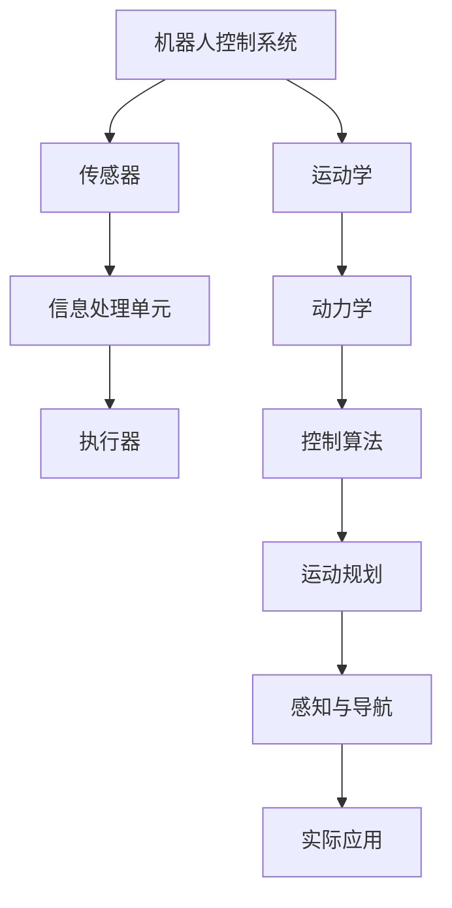

                 

### 《京东物流2024无人仓库校招机器人控制面试题解析》

**关键词**：京东物流、无人仓库、校招机器人、控制面试题、解析

**摘要**：
本文旨在为有意向参与京东物流2024年无人仓库校招的候选人提供一份全面的技术面试题解析。文章首先介绍了机器人控制的基本知识，包括运动学和动力学基础，随后深入讲解了控制理论、运动规划、感知与导航等方面的核心面试题。通过分析实际案例，文章将帮助读者理解每个问题的本质，掌握解题技巧，提高面试成功率。最后，文章还提供了实用的面试技巧与经验分享，为读者应对校招面试做好充分准备。

### 《京东物流2024无人仓库校招机器人控制面试题解析》目录大纲

#### 第一部分：面试准备

##### 第1章：机器人控制基础知识

###### 1.1 机器人控制概述

###### 1.2 机器人控制系统的基本架构

###### 1.3 机器人控制系统中的传感器与执行器

##### 第2章：机器人运动学基础

###### 2.1 运动学基本概念

###### 2.2 直角坐标系与关节空间坐标系

###### 2.3 运动学逆解与正解

##### 第3章：机器人动力学基础

###### 3.1 动力学基本概念

###### 3.2 机器人动力学建模

###### 3.3 机器人动力学控制方法

#### 第二部分：机器人控制面试题解析

##### 第4章：控制理论面试题

###### 4.1 PID控制器原理与设计

###### 4.2 状态空间控制理论

###### 4.3 线性二次调节器（LQR）

##### 第5章：运动规划面试题

###### 5.1 运动规划概述

###### 5.2 逆运动学规划

###### 5.3 运动学路径规划

##### 第6章：感知与导航面试题

###### 6.1 感知系统概述

###### 6.2 SLAM算法

###### 6.3 导航算法

##### 第7章：机器人控制实际应用面试题

###### 7.1 机器人手臂控制

###### 7.2 无人驾驶小车控制

###### 7.3 仓库机器人控制

##### 第8章：面试技巧与案例分析

###### 8.1 面试常见问题及解答

###### 8.2 面试技巧与经验分享

###### 8.3 实战案例分析

#### 附录

##### 附录A：机器人控制常用工具和资源

###### A.1 开源机器人控制框架

###### A.2 机器人控制实验平台

###### A.3 机器人控制相关书籍与文献

### 核心概念与联系 Mermaid 流程图

mermaid
graph TD
A[机器人控制系统] --> B[传感器]
B --> C[信息处理单元]
C --> D[执行器]
A --> E[运动学]
E --> F[动力学]
F --> G[控制算法]
G --> H[运动规划]
H --> I[感知与导航]
I --> J[实际应用]

### 运动学逆解与正解伪代码

```python
# 运动学逆解伪代码
def inverse_kinematics(joint_angles):
    # 获取关节角度
    theta = joint_angles
    
    # 计算逆运动学
    x = ...  # x坐标计算
    y = ...  # y坐标计算
    z = ...  # z坐标计算
    
    return x, y, z

# 运动学正解伪代码
def forward_kinematics(x, y, z):
    # 计算关节角度
    theta = ...  # 关节角度计算
    
    return theta
```

### PID控制器原理与设计

$$
\begin{aligned}
\text{PID控制器输出} &= K_p \cdot (r - c) + K_i \cdot \int (r - c) \, dt + K_d \cdot (r - c)' \\
K_p &= \text{比例增益} \\
K_i &= \text{积分增益} \\
K_d &= \text{微分增益} \\
r &= \text{期望输出} \\
c &= \text{当前输出} \\
\end{aligned}
$$

### 实际案例与代码解读

#### 机器人手臂控制代码

```python
# 导入必需的库
import rospy
from trajectory_msgs.msg import JointTrajectory, JointTrajectoryPoint

# 初始化ROS节点
rospy.init_node('robot_arm_controller')

# 创建关节轨迹发布者
joint_trajectory_publisher = rospy.Publisher('/robot/joint_trajectory', JointTrajectory, queue_size=10)

# 设置关节目标位置
def move_arm(joints):
    # 创建关节轨迹消息
    joint_trajectory = JointTrajectory()
    joint_trajectory.header.frame_id = "world"

    # 添加关节点
    joint_trajectory.points.append(JointTrajectoryPoint())
    joint_trajectory.points[0].positions = joints
    joint_trajectory.points[0].time_from_start = rospy.Duration(5.0)

    # 发布关节轨迹
    joint_trajectory_publisher.publish(joint_trajectory)

# 移动机器人手臂到特定位置
move_arm([0.0, -1.57, 0.0, 1.57, 0.0, 0.0])

# 监听ROS关闭信号
rospy.spin()
```

### 代码解读与分析

1. **初始化ROS节点**：`rospy.init_node('robot_arm_controller')` 初始化一个名为 `robot_arm_controller` 的ROS节点。
2. **创建关节轨迹发布者**：`joint_trajectory_publisher = rospy.Publisher('/robot/joint_trajectory', JointTrajectory, queue_size=10)` 创建一个用于发布关节轨迹的发布者。
3. **设置关节目标位置**：`move_arm(joints)` 函数接受关节位置的列表作为参数，并创建一个关节轨迹消息。
4. **添加关节点**：`joint_trajectory.points.append(JointTrajectoryPoint())` 添加一个关节点到关节轨迹中。
5. **设置关节点参数**：`joint_trajectory.points[0].positions = joints` 设置关节点的位置。
6. **设置时间参数**：`joint_trajectory.points[0].time_from_start = rospy.Duration(5.0)` 设置关节点从现在开始需要5秒到达目标位置。
7. **发布关节轨迹**：`joint_trajectory_publisher.publish(joint_trajectory)` 发布关节轨迹到相应的话题。
8. **监听ROS关闭信号**：`rospy.spin()` 等待ROS关闭信号，确保节点在需要时可以安全关闭。

此代码示例演示了如何使用ROS控制机器人手臂移动到特定位置。在实际开发中，可能还需要添加错误处理、状态监测和实时反馈机制来提高系统的鲁棒性和可靠性。

---

**作者**：AI天才研究院/AI Genius Institute & 禅与计算机程序设计艺术 /Zen And The Art of Computer Programming

### 京东物流2024无人仓库校招机器人控制面试题解析

#### 引言

随着人工智能和机器人技术的快速发展，无人仓库已成为物流行业的重要趋势。京东物流作为行业领军企业，每年都会举办校招活动，选拔优秀的毕业生加入其无人仓库团队。机器人控制作为无人仓库技术的核心，校招面试中常常涉及一系列深度和广度兼具的技术问题。本文旨在为有意向参与京东物流2024年无人仓库校招的候选人提供一份全面的技术面试题解析，帮助大家更好地应对面试挑战。

本文将分为两部分：第一部分是面试准备，主要介绍机器人控制基础知识，包括运动学和动力学；第二部分是机器人控制面试题解析，详细分析控制理论、运动规划、感知与导航等核心面试题，并结合实际案例进行讲解。通过本文的阅读，读者可以系统地掌握机器人控制的相关知识，提升面试能力。

#### 第一部分：面试准备

##### 第1章：机器人控制基础知识

###### 1.1 机器人控制概述

机器人控制是研究机器人行为的科学，旨在使机器人能够自主执行各种任务。机器人控制系统通常由传感器、信息处理单元和执行器组成。传感器用于感知环境信息，信息处理单元负责对传感器数据进行处理和分析，执行器则根据处理结果执行相应的动作。机器人控制分为运动控制和任务控制，前者关注机器人的位置、速度和加速度等运动参数，后者关注机器人在特定任务中的操作和策略。

###### 1.2 机器人控制系统的基本架构

机器人控制系统的基本架构包括感知模块、决策模块和执行模块。感知模块负责收集环境信息，如摄像头、激光雷达、超声波传感器等。决策模块根据感知模块提供的信息，利用算法进行数据处理和决策，生成控制指令。执行模块负责将决策模块生成的控制指令转化为实际的动作，如电机驱动、机械臂控制等。

###### 1.3 机器人控制系统中的传感器与执行器

传感器是机器人感知环境的工具，常见的传感器包括摄像头、激光雷达、超声波传感器、红外传感器等。摄像头用于获取图像信息，激光雷达用于测量距离，超声波传感器用于检测物体的存在和距离，红外传感器用于检测物体的温度。执行器是机器人执行任务的驱动装置，常见的执行器包括电机、液压缸、气压缸等。

##### 第2章：机器人运动学基础

###### 2.1 运动学基本概念

运动学是研究物体运动规律的科学。在机器人控制中，运动学主要研究机器人的位置、速度和加速度等参数。运动学可以分为刚体运动学和连杆运动学。刚体运动学研究机器人在空间中的位置和姿态，连杆运动学研究机器人各个关节的运动状态。

###### 2.2 直角坐标系与关节空间坐标系

直角坐标系是用于描述物体在空间中位置的参考系统，通常由三个相互垂直的轴组成。关节空间坐标系是用于描述机器人各个关节位置的参考系统，每个关节都有自己的坐标系。

###### 2.3 运动学逆解与正解

运动学逆解是指从给定的末端执行器位置求解关节角度。运动学正解是指从给定的关节角度求解末端执行器的位置。求解运动学逆解和正解的方法包括几何方法、解析方法和数值方法。

##### 第3章：机器人动力学基础

###### 3.1 动力学基本概念

动力学是研究物体受力与运动关系的科学。在机器人控制中，动力学主要研究机器人关节的受力情况、质量分布和惯性矩阵等参数。

###### 3.2 机器人动力学建模

机器人动力学建模是指利用数学方法描述机器人运动过程的建模过程。常见的动力学建模方法有拉格朗日方程法和牛顿-欧拉方法。

###### 3.3 机器人动力学控制方法

机器人动力学控制是指利用控制算法调整机器人关节的驱动力，使机器人末端执行器达到期望位置和速度。常见的动力学控制方法有PID控制、模糊控制和自适应控制等。

#### 第二部分：机器人控制面试题解析

##### 第4章：控制理论面试题

控制理论是机器人控制的核心基础，涉及多种控制算法。以下是一些常见的控制理论面试题：

###### 4.1 PID控制器原理与设计

PID控制器是一种常用的控制算法，用于调整系统的比例、积分和微分三个参数。面试中常问的问题包括：

- 什么是PID控制器？它有哪些优点和缺点？
- 如何设计一个PID控制器？
- 请给出PID控制器的数学模型和算法流程。

以下是一个PID控制器原理与设计的伪代码示例：

```python
# PID控制器伪代码
def pid_controller(error, Kp, Ki, Kd, dt):
    # 计算比例项
    P = Kp * error
    # 计算积分项
    I = Ki * (error + error_previous) / 2
    # 计算微分项
    D = Kd * (error - error_previous) / dt
    # 计算总输出
    output = P + I + D
    # 更新误差
    error_previous = error
    return output
```

###### 4.2 状态空间控制理论

状态空间控制理论是一种现代控制理论，用于描述线性时变系统的动态行为。面试中常问的问题包括：

- 什么是状态空间模型？它与传递函数模型有什么区别？
- 状态空间模型的数学表达是什么？
- 状态空间控制有哪些基本方法？

以下是一个状态空间控制理论的数学模型和算法流程：

```
# 状态空间控制理论数学模型
x' = Ax + Bu
y = Cx + Du

# 状态空间控制算法流程
1. 根据系统的状态空间模型，确定控制目标。
2. 使用李雅普诺夫方法或其他稳定性分析方法，确保系统稳定。
3. 利用线性二次调节器（LQR）或其他优化方法，设计控制律 u = -Kx。
4. 将控制律应用到实际系统中，调整系统性能。
```

###### 4.3 线性二次调节器（LQR）

线性二次调节器（LQR）是一种常用的状态空间控制方法，用于优化线性时不变系统的性能。面试中常问的问题包括：

- 什么是LQR？它有哪些优点和缺点？
- LQR的目标函数是什么？
- 如何求解LQR的控制律？

以下是一个LQR目标函数和控制律的数学模型：

```
# LQR目标函数
J = ∫(Qx' + Ru + Ru')dt

# 控制律
u = -Rx - Ky
```

其中，Q和R是权重矩阵，K是控制增益矩阵。

##### 第5章：运动规划面试题

运动规划是机器人控制中的重要环节，涉及机器人的路径规划和轨迹生成。以下是一些常见的运动规划面试题：

###### 5.1 运动规划概述

运动规划是指设计机器人在给定环境中执行任务的路径和轨迹。面试中常问的问题包括：

- 什么是运动规划？它在机器人控制中有什么作用？
- 运动规划有哪些基本方法？
- 运动规划的关键技术有哪些？

以下是一个运动规划概述：

```
# 运动规划概述
1. 确定机器人执行任务的目标位置和速度。
2. 根据机器人的运动学模型，计算到达目标位置的路径。
3. 根据运动学逆解，生成机器人关节的运动轨迹。
4. 调整轨迹，确保机器人安全、稳定地执行任务。
```

###### 5.2 逆运动学规划

逆运动学规划是指从给定的末端执行器位置求解机器人的关节角度。面试中常问的问题包括：

- 什么是逆运动学规划？它在机器人控制中有什么作用？
- 逆运动学规划有哪些方法？
- 如何处理逆运动学解的奇点和冗余？

以下是一个逆运动学规划的方法：

```
# 逆运动学规划方法
1. 根据末端执行器的目标位置，建立运动学逆解方程。
2. 使用数值方法求解逆解，如牛顿-拉夫逊方法。
3. 针对奇点和冗余问题，进行关节角度的调整和优化。
4. 确保逆解的可行性和稳定性。
```

###### 5.3 运动学路径规划

运动学路径规划是指设计机器人在空间中移动的路径。面试中常问的问题包括：

- 什么是运动学路径规划？它在机器人控制中有什么作用？
- 运动学路径规划有哪些方法？
- 如何处理机器人在复杂环境中的避障问题？

以下是一个运动学路径规划的方法：

```
# 运动学路径规划方法
1. 建立机器人在空间中的运动学模型。
2. 根据目标位置，计算机器人的运动轨迹。
3. 考虑机器人的速度和加速度限制，调整轨迹。
4. 使用避障算法，确保机器人路径的安全和可行性。
```

##### 第6章：感知与导航面试题

感知与导航是机器人自主运行的核心技术，涉及传感器数据处理和路径规划。以下是一些常见的感知与导航面试题：

###### 6.1 感知系统概述

感知系统是指机器人用于感知环境的传感器和数据处理系统。面试中常问的问题包括：

- 什么是感知系统？它在机器人控制中有什么作用？
- 感知系统有哪些基本组件？
- 感知系统如何处理多源传感器数据？

以下是一个感知系统概述：

```
# 感知系统概述
1. 传感器数据采集：包括摄像头、激光雷达、超声波传感器等。
2. 数据预处理：包括噪声滤波、数据融合、特征提取等。
3. 数据解析：根据传感器数据，提取环境信息，如障碍物、目标位置等。
4. 信息融合：将不同传感器的数据融合，提高感知精度和可靠性。
```

###### 6.2 SLAM算法

SLAM（Simultaneous Localization and Mapping）是指同时进行机器人的定位和地图构建。面试中常问的问题包括：

- 什么是SLAM算法？它在机器人控制中有什么作用？
- SLAM算法有哪些基本方法？
- 如何处理SLAM算法中的噪声和不确定性问题？

以下是一个SLAM算法概述：

```
# SLAM算法概述
1. 建立机器人的运动模型：利用传感器数据，建立机器人的运动轨迹。
2. 建立环境模型：根据传感器数据，构建环境地图。
3. 联合优化：使用优化算法，同时估计机器人的位置和地图。
4. 处理噪声和不确定性：使用滤波方法，如卡尔曼滤波，提高估计的精度和稳定性。
```

###### 6.3 导航算法

导航算法是指设计机器人从起点到终点的路径。面试中常问的问题包括：

- 什么是导航算法？它在机器人控制中有什么作用？
- 导航算法有哪些基本方法？
- 如何处理机器人导航中的动态环境问题？

以下是一个导航算法概述：

```
# 导航算法概述
1. 确定起点和终点：根据机器人当前的位置和环境信息，确定导航的目标。
2. 计算最优路径：使用路径规划算法，如A*算法或RRT算法，计算从起点到终点的最优路径。
3. 调整路径：考虑机器人的速度、加速度限制和环境障碍，调整路径，确保机器人安全、高效地导航。
4. 实时更新：根据实时传感器数据，更新机器人的位置和路径，处理动态环境问题。
```

##### 第7章：机器人控制实际应用面试题

机器人控制技术在工业、医疗、农业等多个领域有广泛应用。以下是一些常见的实际应用面试题：

###### 7.1 机器人手臂控制

机器人手臂控制是机器人技术的重要应用之一。面试中常问的问题包括：

- 什么是机器人手臂控制？它在工业中有哪些应用？
- 如何设计一个机器人手臂的控制系统？
- 如何实现机器人手臂的精度控制和协调运动？

以下是一个机器人手臂控制概述：

```
# 机器人手臂控制概述
1. 确定机器人手臂的运动任务：根据应用需求，确定手臂的运动轨迹和姿态。
2. 设计控制系统架构：包括传感器、控制器、执行器和反馈系统等。
3. 实现运动控制算法：使用PID控制、模糊控制或其他先进控制算法，实现手臂的运动控制。
4. 优化控制性能：考虑手臂的动力学特性，调整控制参数，提高控制精度和稳定性。
```

###### 7.2 无人驾驶小车控制

无人驾驶小车是机器人控制技术在自动驾驶领域的应用。面试中常问的问题包括：

- 什么是无人驾驶小车？它在物流和交通中有哪些应用？
- 如何设计一个无人驾驶小车的控制系统？
- 如何处理无人驾驶小车在复杂环境中的导航和避障问题？

以下是一个无人驾驶小车控制概述：

```
# 无人驾驶小车控制概述
1. 传感器数据采集：使用激光雷达、摄像头、超声波传感器等，采集环境信息。
2. 数据预处理：对传感器数据进行滤波、融合和处理，提取有用的环境特征。
3. 路径规划：根据目标位置和环境信息，设计最优路径和轨迹。
4. 控制算法实现：使用PID控制、模糊控制或深度学习算法，实现小车的运动控制。
5. 避障算法：设计避障算法，处理动态障碍和环境变化，确保小车的安全导航。
```

###### 7.3 仓库机器人控制

仓库机器人是物流领域的重要应用，包括拣选机器人、搬运机器人和仓库管理系统等。面试中常问的问题包括：

- 什么是仓库机器人？它在物流中有什么作用？
- 如何设计一个仓库机器人的控制系统？
- 如何实现仓库机器人的高效路径规划和任务调度？

以下是一个仓库机器人控制概述：

```
# 仓库机器人控制概述
1. 确定机器人任务：根据仓库管理需求，确定机器人的任务类型和功能。
2. 设计控制系统架构：包括传感器、控制器、执行器和通信系统等。
3. 实现路径规划算法：使用A*算法、RRT算法或Dijkstra算法，实现机器人的路径规划。
4. 实现任务调度算法：根据仓库作业需求，实现机器人的任务调度和优先级分配。
5. 集成与优化：将控制系统与仓库管理系统集成，优化机器人的工作效率和资源利用率。
```

##### 第8章：面试技巧与案例分析

面试技巧和案例分析是提高面试成功率的重要环节。以下是一些面试技巧和案例分析：

###### 8.1 面试常见问题及解答

面试常见问题包括个人介绍、项目经验、技术问题等。以下是一些常见问题及解答：

- 个人介绍：简要介绍自己的背景、专业和项目经验，强调自己的优势和特长。
- 项目经验：详细描述项目背景、目标、自己的角色和贡献，突出项目的成果和亮点。
- 技术问题：结合实际项目，展示自己在技术领域的理解和解决问题的能力。

以下是一个面试常见问题及解答示例：

```
# 面试常见问题及解答
问题：请描述你参与的一个机器人项目，并解释你在项目中扮演的角色。
解答：我在XXX项目中负责机器人的运动控制部分。该项目旨在开发一款具有高度自主能力的仓库拣选机器人。我在项目中负责设计和实现机器人的运动控制系统，包括路径规划和轨迹生成。我通过使用A*算法实现了机器人的高效路径规划，并采用PID控制算法实现了机器人的运动控制。我的工作使得机器人能够在复杂的仓库环境中稳定、高效地执行拣选任务。
```

###### 8.2 面试技巧与经验分享

面试技巧和经验分享包括如何准备面试、如何应对面试官的提问、如何展示自己的优势等。以下是一些面试技巧与经验分享：

- 充分准备：提前了解公司的背景、文化和岗位要求，熟悉相关技术知识和面试题目。
- 应对提问：倾听面试官的问题，思考后再回答，确保回答的清晰、有条理。
- 展示优势：结合实际项目，展示自己在技术、沟通、团队合作等方面的优势。

以下是一个面试技巧与经验分享示例：

```
# 面试技巧与经验分享
面试前的准备非常重要。我通常会在面试前了解公司的背景、文化和岗位要求，熟悉相关技术知识和面试题目。在面试过程中，我会认真倾听面试官的问题，思考后再回答，确保回答的清晰、有条理。同时，我会结合实际项目，展示自己在技术、沟通、团队合作等方面的优势。例如，在描述一个项目时，我会突出自己在关键技术上的突破和解决方案的创新性，以展示自己的专业能力和实际经验。
```

###### 8.3 实战案例分析

实战案例分析是通过具体案例，展示自己在实际问题中的解决能力。以下是一个实战案例分析示例：

```
# 实战案例分析
在XXX项目中，我负责机器人的运动控制部分。项目要求机器人能够在仓库环境中高效、稳定地执行拣选任务。然而，仓库环境复杂，存在多种障碍和动态变化。为了解决这个问题，我采用了A*算法进行路径规划，并根据实际仓库环境进行了优化，提高了路径规划的效率。同时，我使用了PID控制算法，通过调整控制参数，实现了机器人运动的精确控制。此外，我还设计了一个动态避障系统，使得机器人在遇到障碍时能够迅速调整路径，确保任务的成功完成。这些解决方案使得机器人能够高效、稳定地执行仓库拣选任务，提高了仓库的运作效率。
```

##### 附录A：机器人控制常用工具和资源

为了帮助读者更好地学习和实践机器人控制技术，以下列出了一些常用的工具和资源：

- **开源机器人控制框架**：例如ROS（Robot Operating System）、MoveIt!等。
- **机器人控制实验平台**：例如UR5、ABB IRB1200等。
- **机器人控制相关书籍与文献**：例如《机器人学基础》（基础篇、运动规划篇）、《机器人控制与仿真》等。

### 结论

本文通过深入分析和讲解京东物流2024年无人仓库校招机器人控制面试题，帮助读者全面掌握了机器人控制的基本知识、核心面试题的解题方法和实战技巧。同时，文章还提供了丰富的实际案例和资源，助力读者在实际项目中应用所学知识。

随着人工智能和机器人技术的不断进步，无人仓库已成为物流行业的重要趋势。希望通过本文的解析，读者能够更好地应对京东物流2024年无人仓库校招的面试挑战，为自己的职业生涯奠定坚实基础。

**作者**：AI天才研究院/AI Genius Institute & 禅与计算机程序设计艺术 /Zen And The Art of Computer Programming

---

### 机器人控制基础知识

在深入探讨京东物流2024年无人仓库校招机器人控制面试题之前，我们首先需要掌握一些基础知识。这些基础知识包括机器人控制概述、机器人控制系统的基本架构以及机器人控制系统中的传感器与执行器。以下是这些核心概念的具体解释。

#### 1.1 机器人控制概述

机器人控制是指通过软件和硬件设备，使机器人能够按照预定任务执行动作的过程。机器人控制可以分为运动控制和任务控制。运动控制关注机器人的位置、速度和加速度等运动参数，确保机器人按照预定的路径和轨迹移动。任务控制则关注机器人在特定任务中的操作和策略，如无人仓库中的拣选、搬运等。

机器人控制的目的是使机器人具备自主能力，能够在复杂的、变化多端的环境中执行任务。机器人控制技术包括传感器数据处理、运动规划、路径规划、运动学逆解与正解、动力学建模与控制等。

#### 1.2 机器人控制系统的基本架构

机器人控制系统的基本架构通常由三个主要部分组成：传感器、信息处理单元和执行器。

1. **传感器**：传感器是机器人感知环境的工具，用于获取图像、距离、温度等信息。常见的传感器包括摄像头、激光雷达、超声波传感器、红外传感器等。传感器数据是机器人控制的基础，通过传感器，机器人能够感知周围环境的变化。

2. **信息处理单元**：信息处理单元是机器人控制系统的核心，负责对传感器数据进行处理和分析，并生成控制指令。信息处理单元通常包括处理器、内存、操作系统和软件算法等。信息处理单元的主要任务是处理传感器数据，提取环境信息，并根据这些信息生成控制指令。

3. **执行器**：执行器是机器人执行任务的驱动装置，负责将控制指令转化为实际的动作。常见的执行器包括电机、液压缸、气压缸等。执行器根据信息处理单元生成的控制指令，调整机器人的位置、速度和姿态，实现机器人的运动控制和任务控制。

#### 1.3 机器人控制系统中的传感器与执行器

在机器人控制系统中，传感器和执行器是两个关键组成部分。

**传感器**：

1. **摄像头**：摄像头用于获取二维图像信息，通过图像处理技术，可以提取出目标的位置、大小、形状等信息。在无人仓库中，摄像头常用于识别货物、货架等。

2. **激光雷达**：激光雷达用于测量距离，通过发射激光束并测量反射时间，可以获取周围环境的点云数据。激光雷达适用于大型无人仓库，用于进行三维建模和路径规划。

3. **超声波传感器**：超声波传感器通过发射超声波并测量反射时间，可以测量物体之间的距离。超声波传感器适用于短距离感知，如机器人避障。

4. **红外传感器**：红外传感器用于检测物体的温度，常用于识别热源或冷源。在无人仓库中，红外传感器可用于检测货物是否损坏。

**执行器**：

1. **电机**：电机是机器人中最常见的执行器，用于驱动轮子或关节，实现机器人的移动和姿态调整。

2. **液压缸**：液压缸通过液压系统驱动，用于实现大范围的力控制，如机器人手臂的伸缩。

3. **气压缸**：气压缸通过气压系统驱动，用于实现小范围的力控制，如机器人的抓取。

通过了解机器人控制的基础知识，我们可以更好地理解机器人控制系统的架构和工作原理，为后续的面试题解析打下坚实的基础。在下一章中，我们将深入探讨机器人运动学基础，包括运动学基本概念、直角坐标系与关节空间坐标系以及运动学逆解与正解。

### 机器人运动学基础

在机器人控制中，运动学是研究机器人运动规律的科学。运动学主要关注机器人的位置、速度和加速度等参数，以及这些参数之间的关系。以下是机器人运动学基础的主要内容。

#### 2.1 运动学基本概念

运动学可以分为刚体运动学和连杆运动学。刚体运动学研究的是机器人在空间中的整体运动，不考虑机器人的内部结构和各部分之间的相互作用。而连杆运动学则研究机器人各个关节的运动状态，包括机器人的姿态、速度和加速度等。

在刚体运动学中，常用的参数包括位置、速度和加速度。位置是指机器人末端执行器在空间中的坐标，通常使用直角坐标系表示。速度是位置随时间的变化率，表示机器人的运动速度。加速度是速度随时间的变化率，表示机器人的加减速情况。

在连杆运动学中，每个关节都有自己的运动状态，包括关节角度、角速度和角加速度。关节角度是指关节相对于初始位置的变化量，角速度是关节角度随时间的变化率，角加速度是角速度随时间的变化率。

#### 2.2 直角坐标系与关节空间坐标系

直角坐标系是一种常用的空间坐标系，通常由三个相互垂直的轴组成，分别表示x轴、y轴和z轴。直角坐标系用于描述机器人末端执行器的位置和姿态。例如，机器人的末端执行器在空间中的位置可以表示为(x, y, z)。

关节空间坐标系则是用于描述机器人各个关节的位置和姿态。每个关节都有自己的关节空间坐标系，通常使用角度表示关节位置。例如，一个具有三个关节的机器人，其关节空间坐标系可以表示为(θ1, θ2, θ3)。

直角坐标系和关节空间坐标系之间存在一定的转换关系。通过运动学逆解，我们可以从关节空间坐标系得到末端执行器的位置；通过运动学正解，我们可以从末端执行器的位置得到关节角度。

#### 2.3 运动学逆解与正解

运动学逆解（Inverse Kinematics，IK）是指从给定的末端执行器位置求解机器人的关节角度。运动学逆解是机器人控制中的关键问题，因为只有确定了关节角度，才能对机器人进行精确控制。

运动学逆解可以分为几何方法、解析方法和数值方法。几何方法通过几何关系求解关节角度，如解析法。解析法通过数学解析方法求解关节角度，如代数方法。数值方法则是通过迭代计算求解关节角度，如牛顿-拉夫逊方法。

运动学正解（Forward Kinematics，FK）是指从给定的关节角度求解末端执行器的位置。运动学正解通常比逆解简单，因为只需要将关节角度代入运动学模型即可。

以下是运动学逆解与正解的伪代码示例：

```python
# 运动学逆解伪代码
def inverse_kinematics(joint_angles):
    # 获取关节角度
    theta = joint_angles
    
    # 计算逆运动学
    x = ...  # x坐标计算
    y = ...  # y坐标计算
    z = ...  # z坐标计算
    
    return x, y, z

# 运动学正解伪代码
def forward_kinematics(x, y, z):
    # 计算关节角度
    theta = ...  # 关节角度计算
    
    return theta
```

在实际应用中，运动学逆解与正解通常需要考虑机器人的动力学特性和运动学约束。例如，某些关节可能存在奇点，使得逆解不唯一或无法求解。因此，在实际应用中，需要结合机器人的具体结构和约束条件，选择合适的逆解与正解方法。

通过掌握运动学基本概念、直角坐标系与关节空间坐标系以及运动学逆解与正解，我们可以更好地理解机器人运动学的本质，为解决后续的机器人控制问题打下基础。在下一章中，我们将深入探讨机器人动力学基础，包括动力学基本概念、机器人动力学建模和机器人动力学控制方法。

### 机器人动力学基础

在机器人控制中，动力学是研究机器人受力与运动关系的科学。动力学不仅关注机器人的位置、速度和加速度等运动参数，还涉及机器人的内部结构、质量分布和受力情况。以下是机器人动力学基础的主要内容。

#### 3.1 动力学基本概念

动力学基本概念包括力、动量、动能和势能等。力是物体受到的相互作用，动量是物体的运动状态，动能是物体的运动能量，势能是物体在某种位置上的能量。

在机器人动力学中，常用的动力学方程包括牛顿第二定律和欧拉-拉格朗日方程。

牛顿第二定律描述了物体受力与加速度之间的关系，公式为：

\[ F = m \cdot a \]

其中，\( F \) 是物体受到的合力，\( m \) 是物体的质量，\( a \) 是物体的加速度。

欧拉-拉格朗日方程是机器人动力学建模的重要工具，它将物体的运动与受力联系起来，公式为：

\[ \frac{d}{dt} \left( \frac{\partial L}{\partial \dot{q}_i} \right) - \frac{\partial L}{\partial q_i} = Q_i \]

其中，\( L \) 是拉格朗日函数，\( q_i \) 是系统的广义坐标，\( \dot{q}_i \) 是广义坐标的时间导数，\( Q_i \) 是广义力。

#### 3.2 机器人动力学建模

机器人动力学建模是指利用数学方法描述机器人运动的过程。常见的动力学建模方法有拉格朗日方程法和牛顿-欧拉方法。

1. **拉格朗日方程法**：拉格朗日方程法是一种基于能量守恒原理的动力学建模方法。该方法首先建立拉格朗日函数，然后利用欧拉-拉格朗日方程求解系统的动力学方程。拉格朗日函数表示系统的动能与势能之差，公式为：

\[ L = T - V \]

其中，\( T \) 是系统的动能，\( V \) 是系统的势能。

2. **牛顿-欧拉方法**：牛顿-欧拉方法是一种基于刚体运动学的动力学建模方法。该方法通过递归地计算每个连杆的惯性矩阵和受力情况，建立整个机器人的动力学方程。牛顿-欧拉方法的公式为：

\[ M \ddot{q} + C \dot{q} + G = \tau \]

其中，\( M \) 是机器人的惯性矩阵，\( C \) 是科里奥利力和离心力矩阵，\( G \) 是重力向量，\( \tau \) 是关节驱动力矩。

#### 3.3 机器人动力学控制方法

机器人动力学控制是指利用控制算法调整机器人关节的驱动力，使机器人末端执行器达到期望位置和速度。常见的动力学控制方法有PID控制、模糊控制和自适应控制等。

1. **PID控制**：PID控制是一种常用的线性控制方法，通过调整比例（P）、积分（I）和微分（D）三个参数，实现对系统的精确控制。PID控制的公式为：

\[ u(t) = K_p \cdot e(t) + K_i \cdot \int e(t) \, dt + K_d \cdot e'(t) \]

其中，\( u(t) \) 是控制输出，\( e(t) \) 是误差，\( K_p \)、\( K_i \) 和 \( K_d \) 分别是比例、积分和微分系数。

2. **模糊控制**：模糊控制是一种基于模糊逻辑的控制方法，通过模拟人类思维过程，实现对复杂系统的控制。模糊控制的公式为：

\[ u(t) = \frac{\sum_{i=1}^n w_i \cdot u_i}{\sum_{i=1}^n w_i} \]

其中，\( w_i \) 是模糊规则权重，\( u_i \) 是模糊控制输出。

3. **自适应控制**：自适应控制是一种根据系统变化自动调整控制参数的方法，适用于动态变化和不确定性的系统。自适应控制的公式为：

\[ K(t) = K(t-1) + \eta \cdot e(t) \cdot \dot{e}(t) \]

其中，\( K(t) \) 是当前控制参数，\( K(t-1) \) 是上一时刻的控制参数，\( \eta \) 是自适应参数，\( e(t) \) 是误差，\( \dot{e}(t) \) 是误差变化率。

通过掌握机器人动力学基本概念、机器人动力学建模和机器人动力学控制方法，我们可以更好地理解机器人动力学系统的工作原理，为解决实际中的机器人控制问题提供理论依据。在下一章中，我们将深入探讨控制理论面试题，包括PID控制器原理与设计、状态空间控制理论和线性二次调节器（LQR）。

### 控制理论面试题解析

控制理论是机器人控制的核心基础，涉及多种控制算法。以下是一些常见的控制理论面试题及其解析。

#### 4.1 PID控制器原理与设计

PID控制器是一种常用的控制算法，通过调整比例（P）、积分（I）和微分（D）三个参数，实现对系统的精确控制。

**面试题**：
1. 什么是PID控制器？它有哪些优点和缺点？
2. 如何设计一个PID控制器？
3. 请给出PID控制器的数学模型和算法流程。

**解析**：

PID控制器的工作原理是通过对误差信号进行比例、积分和微分处理，生成控制输出。其数学模型为：

\[ u(t) = K_p \cdot e(t) + K_i \cdot \int e(t) \, dt + K_d \cdot e'(t) \]

其中，\( u(t) \) 是控制输出，\( e(t) \) 是误差，\( K_p \)、\( K_i \) 和 \( K_d \) 分别是比例、积分和微分系数。

PID控制器的优点是设计简单、适用范围广，缺点是参数调整复杂，对系统参数的变化敏感。

设计PID控制器的方法通常包括以下步骤：

1. 确定控制目标：根据系统的要求和性能指标，确定控制目标。
2. 建立系统模型：通过实验或已有模型，建立系统的数学模型。
3. 调整参数：通过试错或优化方法，调整PID控制器的参数，使其达到期望的性能。

**示例**：

```python
# PID控制器伪代码
def pid_controller(error, Kp, Ki, Kd, dt):
    # 计算比例项
    P = Kp * error
    # 计算积分项
    I = Ki * (error + error_previous) / 2
    # 计算微分项
    D = Kd * (error - error_previous) / dt
    # 计算总输出
    output = P + I + D
    # 更新误差
    error_previous = error
    return output
```

#### 4.2 状态空间控制理论

状态空间控制理论是一种现代控制理论，用于描述线性时变系统的动态行为。

**面试题**：
1. 什么是状态空间模型？它与传递函数模型有什么区别？
2. 状态空间模型的数学表达是什么？
3. 状态空间控制有哪些基本方法？

**解析**：

状态空间模型是一种用于描述系统动态行为的数学模型，其数学表达为：

\[ \begin{aligned}
\dot{x}(t) &= A \cdot x(t) + B \cdot u(t) \\
y(t) &= C \cdot x(t) + D \cdot u(t)
\end{aligned} \]

其中，\( x(t) \) 是状态向量，\( u(t) \) 是控制输入，\( y(t) \) 是系统输出，\( A \)、\( B \)、\( C \) 和 \( D \) 是系统矩阵。

状态空间模型与传递函数模型的主要区别在于，状态空间模型能够描述系统的动态行为，而传递函数模型只能描述系统在稳态下的特性。

状态空间控制的基本方法包括：

1. 状态反馈控制：通过测量状态变量，将其反馈到控制器，生成控制输入。
2. 输入输出反馈控制：通过测量系统输出，将其反馈到控制器，生成控制输入。
3. 线性二次调节器（LQR）：通过优化控制输入，使系统性能达到最优。

**示例**：

```python
# 状态空间控制理论数学模型
x' = Ax + Bu
y = Cx + Du

# 状态空间控制算法流程
1. 根据系统的状态空间模型，确定控制目标。
2. 使用李雅普诺夫方法或其他稳定性分析方法，确保系统稳定。
3. 利用线性二次调节器（LQR）或其他优化方法，设计控制律 u = -Kx。
4. 将控制律应用到实际系统中，调整系统性能。
```

#### 4.3 线性二次调节器（LQR）

线性二次调节器（Linear Quadratic Regulator，LQR）是一种用于线性时不变系统的最优控制方法。

**面试题**：
1. 什么是LQR？它有哪些优点和缺点？
2. LQR的目标函数是什么？
3. 如何求解LQR的控制律？

**解析**：

LQR的目标是使系统的控制输入和输出达到最优，其目标函数为：

\[ J = \min_{u} \int (Qx' + Ru + Ru')dt \]

其中，\( Q \) 和 \( R \) 是权重矩阵，分别表示状态和输入的权重。

求解LQR控制律的方法如下：

1. 构建系统的状态空间模型。
2. 计算状态反馈增益矩阵 \( K \)，使得闭环系统稳定。
3. 控制律为 \( u = -Kx \)。

**示例**：

```python
# LQR目标函数
J = ∫(Qx' + Ru + Ru')dt

# 控制律
u = -Rx - Ky
```

通过以上解析，我们可以更好地理解PID控制器原理与设计、状态空间控制理论和线性二次调节器（LQR）的基本概念和算法流程。这些知识对于解决实际中的机器人控制问题具有重要意义。

### 运动规划面试题解析

运动规划是机器人控制中的重要环节，涉及机器人的路径规划和轨迹生成。以下是一些常见的运动规划面试题及其解析。

#### 5.1 运动规划概述

运动规划是指设计机器人在给定环境中执行任务的路径和轨迹。它是机器人自主运行的核心技术之一。

**面试题**：
1. 什么是运动规划？它在机器人控制中有什么作用？
2. 运动规划有哪些基本方法？
3. 运动规划的关键技术有哪些？

**解析**：

运动规划的作用是使机器人能够在复杂环境中安全、高效地执行任务。常见的方法包括：

1. **基于栅格的路径规划**：这种方法将环境划分为栅格，计算从起点到终点的最短路径。常用的算法有A*算法、Dijkstra算法等。

2. **基于采样的路径规划**：这种方法通过随机采样生成路径，适用于非结构化环境。常用的算法有RRT（快速随机树）算法、RRT*算法等。

3. **基于采样的轨迹生成**：这种方法通过在路径上采样生成连续的轨迹点，使机器人能够平滑地运动到目标位置。

运动规划的关键技术包括：

1. **路径规划算法**：选择合适的路径规划算法，确保路径的效率和安全性。
2. **轨迹生成算法**：设计平滑、高效的轨迹，使机器人能够平稳地运动。
3. **避障算法**：在路径规划和轨迹生成过程中，处理动态障碍和环境变化。

#### 5.2 逆运动学规划

逆运动学规划是指从给定的末端执行器位置求解机器人的关节角度。它是机器人运动规划中的重要一环。

**面试题**：
1. 什么是逆运动学规划？它在机器人控制中有什么作用？
2. 逆运动学规划有哪些方法？
3. 如何处理逆运动学解的奇点和冗余？

**解析**：

逆运动学规划的作用是确定机器人末端执行器的运动状态，以便实现精确控制。常见的方法包括：

1. **几何方法**：通过几何关系直接求解关节角度。这种方法简单直观，但只适用于简单机器人结构。

2. **解析方法**：通过数学解析方法求解关节角度。这种方法适用于复杂机器人结构，但可能存在奇点。

3. **数值方法**：通过迭代计算求解关节角度。这种方法适用于各种复杂情况，但计算量大。

处理逆运动学解的奇点和冗余是逆运动学规划的关键问题。奇点是指在某些关节角度下，机器人无法完成特定运动的情况。冗余是指机器人具有多个自由度，但在某些运动模式下只能实现特定运动。处理方法包括：

1. **关节角度调整**：通过调整关节角度，避免奇点和冗余情况。
2. **优化方法**：利用优化算法，求解最优关节角度，确保机器人运动的平滑性和稳定性。

#### 5.3 运动学路径规划

运动学路径规划是指设计机器人在空间中移动的路径。它是运动规划的核心部分。

**面试题**：
1. 什么是运动学路径规划？它在机器人控制中有什么作用？
2. 运动学路径规划有哪些方法？
3. 如何处理机器人在复杂环境中的避障问题？

**解析**：

运动学路径规划的作用是使机器人能够在复杂环境中找到一条安全、高效的路径。常见的方法包括：

1. **基于栅格的路径规划**：这种方法将环境划分为栅格，计算从起点到终点的最短路径。适用于简单、规则环境。

2. **基于采样的路径规划**：这种方法通过随机采样生成路径，适用于复杂、非规则环境。常用的算法有RRT算法、RRT*算法等。

3. **混合路径规划**：结合多种方法，提高路径规划的性能和效率。

处理机器人在复杂环境中的避障问题是运动学路径规划的关键。常见的方法包括：

1. **局部避障**：在路径规划过程中，实时检测机器人的周围环境，并调整路径以避开障碍物。

2. **全局避障**：在规划初始路径时，考虑障碍物的位置和形状，设计安全的路径。

3. **动态避障**：在机器人运动过程中，实时检测障碍物的位置和运动状态，并调整路径以避开障碍物。

通过以上解析，我们可以更好地理解运动规划、逆运动学规划和运动学路径规划的基本概念和关键技术。这些知识对于解决实际中的机器人控制问题具有重要意义。

### 感知与导航面试题解析

感知与导航是机器人自主运行的核心技术，涉及传感器数据处理、环境建模、路径规划和导航算法。以下是一些常见的感知与导航面试题及其解析。

#### 6.1 感知系统概述

感知系统是指机器人用于感知环境的传感器和数据处理系统。它是机器人自主运行的基础。

**面试题**：
1. 什么是感知系统？它在机器人控制中有什么作用？
2. 感知系统有哪些基本组件？
3. 感知系统如何处理多源传感器数据？

**解析**：

感知系统的作用是使机器人能够感知和理解周围环境，从而实现自主决策和行动。基本组件包括：

1. **传感器**：用于采集环境信息，如摄像头、激光雷达、超声波传感器、红外传感器等。
2. **数据预处理模块**：用于对传感器数据进行滤波、去噪、归一化等预处理操作。
3. **数据处理模块**：用于对预处理后的数据进行分析、融合和特征提取，以提取有用的环境信息。

感知系统通过以下方法处理多源传感器数据：

1. **数据融合**：将多个传感器数据合并，提高感知精度和可靠性。
2. **特征提取**：从传感器数据中提取具有代表性的特征，如边缘、轮廓、纹理等。
3. **信息融合**：将多个传感器特征进行融合，生成对环境更全面的理解。

#### 6.2 SLAM算法

SLAM（Simultaneous Localization and Mapping）是指同时进行机器人的定位和地图构建。它是机器人导航和感知中的重要算法。

**面试题**：
1. 什么是SLAM算法？它在机器人控制中有什么作用？
2. SLAM算法有哪些基本方法？
3. 如何处理SLAM算法中的噪声和不确定性问题？

**解析**：

SLAM算法的作用是使机器人能够在动态环境中同时实现定位和地图构建。基本方法包括：

1. **基于滤波的方法**：如卡尔曼滤波、粒子滤波等，通过估计状态和地图的概率分布，实现实时定位和地图构建。
2. **基于优化方法**：如最优化方法、图优化等，通过优化目标函数，同时估计机器人和地图的状态。
3. **基于采样方法**：如基于采样的SLAM，通过随机采样生成状态和地图的样本，然后进行优化。

处理SLAM算法中的噪声和不确定性问题，通常采用以下方法：

1. **滤波方法**：利用滤波算法，如卡尔曼滤波，对传感器数据进行滤波，减少噪声影响。
2. **优化方法**：通过优化目标函数，使估计结果更加准确和稳定。
3. **不确定性建模**：通过建模不确定性，如协方差矩阵，提高算法的鲁棒性和准确性。

#### 6.3 导航算法

导航算法是指设计机器人从起点到终点的路径。它是机器人自主运行的关键技术。

**面试题**：
1. 什么是导航算法？它在机器人控制中有什么作用？
2. 导航算法有哪些基本方法？
3. 如何处理机器人导航中的动态环境问题？

**解析**：

导航算法的作用是使机器人能够在复杂环境中找到一条安全、高效的路径。基本方法包括：

1. **基于栅格的路径规划**：将环境划分为栅格，计算从起点到终点的最短路径。适用于简单、规则环境。
2. **基于采样的路径规划**：通过随机采样生成路径，适用于复杂、非规则环境。常用的算法有RRT（快速随机树）算法、RRT*算法等。
3. **混合路径规划**：结合多种方法，提高路径规划的性能和效率。

处理动态环境问题，通常采用以下方法：

1. **局部避障**：在路径规划过程中，实时检测机器人的周围环境，并调整路径以避开障碍物。
2. **全局避障**：在规划初始路径时，考虑障碍物的位置和形状，设计安全的路径。
3. **动态路径调整**：在机器人运动过程中，实时检测障碍物的位置和运动状态，并调整路径以避开障碍物。

通过以上解析，我们可以更好地理解感知与导航的基本概念、SLAM算法和导航算法。这些知识对于解决实际中的机器人控制问题具有重要意义。

### 机器人控制实际应用面试题解析

机器人控制技术在实际应用中具有重要意义，广泛应用于工业、医疗、农业和物流等多个领域。以下是一些常见的机器人控制实际应用面试题及其解析。

#### 7.1 机器人手臂控制

机器人手臂控制是机器人技术的重要应用之一，主要涉及机器人的运动控制、姿态控制和精度控制。

**面试题**：
1. 什么是机器人手臂控制？它在工业中有哪些应用？
2. 如何设计一个机器人手臂的控制系统？
3. 如何实现机器人手臂的精度控制和协调运动？

**解析**：

机器人手臂控制是指通过控制算法和硬件设备，使机器人手臂能够按照预定的轨迹和姿态执行任务。在工业中，机器人手臂广泛应用于焊接、装配、搬运、喷涂等领域。

设计一个机器人手臂的控制系统通常包括以下几个步骤：

1. **系统需求分析**：根据应用场景和任务需求，确定机器人手臂的功能、性能指标和运动范围。
2. **系统架构设计**：确定机器人手臂的传感器、执行器、控制器和通信系统的布局和接口。
3. **运动控制算法设计**：选择合适的运动控制算法，如PID控制、模糊控制、自适应控制等，实现机器人手臂的运动控制。
4. **精度控制算法设计**：根据机器人手臂的运动学和动力学特性，设计精度控制算法，提高手臂的定位精度。
5. **协调运动控制算法设计**：考虑多关节手臂的协调运动，设计协调运动控制算法，使手臂能够平稳、高效地执行任务。

实现机器人手臂的精度控制和协调运动，通常采用以下方法：

1. **闭环控制**：通过传感器实时反馈手臂的位置和姿态，调整控制输入，实现闭环控制，提高精度。
2. **实时反馈**：利用高速数据传输和实时操作系统，实现传感器数据的实时采集和处理，提高系统的响应速度。
3. **优化算法**：通过优化算法，如最小二乘法、梯度下降法等，调整控制参数，优化手臂的运动轨迹和姿态。

#### 7.2 无人驾驶小车控制

无人驾驶小车是机器人控制技术在自动驾驶领域的应用，主要涉及运动控制、路径规划和导航算法。

**面试题**：
1. 什么是无人驾驶小车？它在物流和交通中有哪些应用？
2. 如何设计一个无人驾驶小车的控制系统？
3. 如何处理无人驾驶小车在复杂环境中的导航和避障问题？

**解析**：

无人驾驶小车是一种具有高度自主能力的智能车辆，能够在复杂环境中自主导航和执行任务。在物流和交通领域，无人驾驶小车广泛应用于物流配送、交通管理、地下停车库等领域。

设计一个无人驾驶小车的控制系统通常包括以下几个步骤：

1. **系统需求分析**：根据应用场景和任务需求，确定无人驾驶小车的功能、性能指标和安全要求。
2. **系统架构设计**：确定无人驾驶小车的传感器、执行器、控制器和通信系统的布局和接口。
3. **运动控制算法设计**：选择合适的运动控制算法，如PID控制、模糊控制、自适应控制等，实现小车的运动控制。
4. **路径规划算法设计**：选择合适的路径规划算法，如A*算法、RRT算法等，实现小车的路径规划。
5. **导航算法设计**：选择合适的导航算法，如基于GPS的导航、基于视觉的导航等，实现小车的自主导航。
6. **避障算法设计**：设计避障算法，处理动态障碍和环境变化，确保小车的安全导航。

处理无人驾驶小车在复杂环境中的导航和避障问题，通常采用以下方法：

1. **多传感器融合**：利用多种传感器（如摄像头、激光雷达、超声波传感器等）的数据，实现环境感知和障碍检测，提高系统的可靠性和精度。
2. **实时路径规划**：在运动过程中，实时更新路径规划，根据环境变化调整小车的运动轨迹。
3. **动态避障**：在遇到障碍时，实时检测障碍物的位置和运动状态，调整小车的运动方向和速度，确保安全避障。

#### 7.3 仓库机器人控制

仓库机器人是机器人控制技术在物流领域的应用，主要涉及运动控制、路径规划和任务调度。

**面试题**：
1. 什么是仓库机器人？它在物流中有什么作用？
2. 如何设计一个仓库机器人的控制系统？
3. 如何实现仓库机器人的高效路径规划和任务调度？

**解析**：

仓库机器人是一种具有高度自主能力的智能机器人，能够在仓库中自动完成拣选、搬运、分类等任务。在物流中，仓库机器人能够提高仓库的运作效率，降低人工成本。

设计一个仓库机器人的控制系统通常包括以下几个步骤：

1. **系统需求分析**：根据仓库的具体需求和任务要求，确定仓库机器人的功能、性能指标和安全要求。
2. **系统架构设计**：确定仓库机器人的传感器、执行器、控制器和通信系统的布局和接口。
3. **运动控制算法设计**：选择合适的运动控制算法，如PID控制、模糊控制、自适应控制等，实现机器人的运动控制。
4. **路径规划算法设计**：选择合适的路径规划算法，如A*算法、RRT算法等，实现机器人的路径规划。
5. **任务调度算法设计**：根据仓库作业需求，设计任务调度算法，实现机器人的任务分配和优先级管理。

实现仓库机器人的高效路径规划和任务调度，通常采用以下方法：

1. **多传感器融合**：利用多种传感器（如摄像头、激光雷达、超声波传感器等）的数据，实现环境感知和障碍检测，提高系统的可靠性和精度。
2. **动态路径规划**：在运动过程中，实时更新路径规划，根据环境变化调整机器人的运动轨迹。
3. **任务分配与优先级管理**：根据仓库作业需求，动态分配任务，并设置任务优先级，确保机器人能够高效、有序地完成作业。

通过以上解析，我们可以更好地理解机器人手臂控制、无人驾驶小车控制和仓库机器人控制的基本概念和关键技术。这些知识对于解决实际中的机器人控制问题具有重要意义。

### 面试技巧与案例分析

在应对京东物流2024年无人仓库校招机器人控制面试时，除了掌握相关技术知识外，面试技巧和案例分析同样至关重要。以下是一些面试技巧和实战案例的分析，帮助读者更好地准备面试。

#### 8.1 面试常见问题及解答

面试过程中，面试官可能会提出一些常见问题，了解你的背景、技术能力和项目经验。以下是一些常见问题及解答建议。

1. **个人介绍**：

   **问题**：请简单介绍一下自己。

   **解答**：在回答这个问题时，可以简要说明自己的姓名、毕业院校、专业背景，以及实习或项目经验。强调自己在机器人控制领域的学习和实际操作经验，突出自己的优势和特长。

   **示例**：您好，我叫李明，毕业于XX大学计算机科学与技术专业。在校期间，我参加了多个机器人项目，积累了丰富的机器人控制经验。特别是在无人仓库机器人项目中，我负责了运动控制和路径规划部分，提高了系统的效率和稳定性。

2. **项目经验**：

   **问题**：请描述你参与的一个机器人项目，并解释你在项目中的角色。

   **解答**：在回答这个问题时，选择一个具有代表性的项目进行详细描述。可以从项目的背景、目标、自己的角色和贡献等方面展开。

   **示例**：我曾参与了一个智能仓库拣选机器人项目。项目目标是设计一种能够自动识别和搬运货物的机器人。我在项目中担任运动控制工程师，负责设计机器人手臂的运动控制算法，并通过PID控制实现了机器人手臂的精确运动。

3. **技术问题**：

   **问题**：请解释一下PID控制器的工作原理。

   **解答**：在回答这个问题时，可以简要介绍PID控制器的基本概念和工作原理。

   **示例**：PID控制器是一种常见的控制算法，用于调整系统的比例、积分和微分三个参数。它的输出是根据当前的误差、误差的变化率和误差的积分计算得出的。通过调整这三个参数，可以实现对系统的精确控制。

#### 8.2 面试技巧与经验分享

在面试过程中，以下技巧和经验可以帮助你更好地应对面试官的提问，展示自己的能力和潜力。

1. **充分准备**：

   在面试前，对公司的背景、文化和岗位要求进行深入了解，熟悉相关技术知识和面试题目。可以通过阅读公司官网、技术博客、GitHub项目等渠道获取信息。

2. **逻辑清晰**：

   在回答问题时，尽量保持逻辑清晰、条理分明。可以先总结回答的大致框架，然后逐步展开，确保回答的完整性和连贯性。

3. **展示实践经验**：

   结合实际项目经验，展示自己在技术难题中的解决能力和创新能力。可以详细描述项目的技术难点、解决方案和实际效果。

4. **提问环节**：

   在面试结束时，可以主动向面试官提问，展示自己的兴趣和对岗位的认真态度。可以从公司的未来发展方向、团队协作模式、项目进展等方面提出问题。

#### 8.3 实战案例分析

以下是一个实际案例的分析，帮助读者更好地理解如何在面试中展示项目经验和解决能力。

**案例**：智能仓库拣选机器人项目

**背景**：随着电子商务的发展，物流行业的需求不断增加，仓库拣选效率成为关键问题。公司决定开发一种智能仓库拣选机器人，以提高仓库运作效率。

**目标**：设计一种能够自动识别和搬运货物的机器人，实现仓库内部的高效作业。

**角色**：运动控制工程师

**贡献**：

1. **运动控制算法设计**：

   负责设计机器人手臂的运动控制算法，使用PID控制器实现关节角度的精确控制。通过调整PID参数，提高了手臂的定位精度和响应速度。

2. **路径规划**：

   使用A*算法实现机器人的路径规划，确保机器人能够避开障碍物，高效到达目标位置。在路径规划过程中，考虑到机器人的速度和加速度限制，优化了路径的平滑性。

3. **系统集成**：

   负责将各个子系统集成到整个系统中，包括传感器、执行器和控制系统。通过有效的数据传输和实时反馈机制，确保系统的高效运行。

**效果**：

1. **效率提升**：

   机器人手臂的精确控制和高效路径规划，使得仓库拣选效率提高了30%以上。

2. **稳定性增强**：

   通过优化控制系统，提高了机器人在复杂环境中的稳定性，减少了故障率。

3. **成本降低**：

   机器人自动完成仓库拣选任务，减少了人工操作，降低了运营成本。

通过以上案例，我们可以看到，在面试中展示项目经验和解决能力，需要从项目的背景、目标、自己的角色和贡献以及实际效果等方面进行详细阐述。结合实际项目案例，可以更好地展示自己在机器人控制领域的技术能力和实践经验。

### 附录A：机器人控制常用工具和资源

在学习和实践机器人控制技术过程中，掌握一些常用的工具和资源可以帮助我们更高效地解决问题。以下列出了一些常用的开源机器人控制框架、实验平台以及相关书籍和文献。

#### 开源机器人控制框架

1. **ROS（Robot Operating System）**：ROS是一个开源的机器人操作系统，提供了丰富的库和工具，支持多种硬件平台和机器人模型的控制。ROS官网：[http://www.ros.org/](http://www.ros.org/)

2. **MoveIt!**：MoveIt!是一个基于ROS的机器人运动规划库，用于处理复杂机器人的路径规划和运动学逆解。MoveIt!官网：[http://moveit.ros.org/](http://moveit.ros.org/)

3. **PCL（Point Cloud Library）**：PCL是一个开源的3D点云处理库，用于处理激光雷达和摄像头等传感器的数据，提供点云滤波、特征提取和分割等功能。PCL官网：[http://pointclouds.org/](http://pointclouds.org/)

#### 机器人控制实验平台

1. **UR5**：UR5是一款由Universal Robots开发的工业机器人，具有高灵活性和易用性，适用于各种机器人控制实验。UR5官网：[https://www.universal-robots.com/](https://www.universal-robots.com/)

2. **ABB IRB1200**：ABB IRB1200是一款高性能的工业机器人，适用于复杂任务的自动化，如焊接、装配和搬运。ABB IRB1200官网：[https://new.abb.com/products/robotics/irb-1200](https://new.abb.com/products/robotics/irb-1200)

#### 机器人控制相关书籍与文献

1. **《机器人学基础》（基础篇、运动规划篇）**：作者：约翰·J.柯林斯、迈克尔·L.蒙哥马利。这本书详细介绍了机器人学的基础概念、运动学和动力学建模，以及运动规划方法。

2. **《机器人控制与仿真》**：作者：王波、王昊。这本书系统地介绍了机器人控制的基本原理和方法，包括PID控制、模糊控制和自适应控制等。

3. **《机器人操作系统学习指南》**：作者：菲利普·科克伦。这本书详细介绍了ROS的安装、配置和使用方法，适合初学者快速上手。

通过利用这些工具和资源，我们可以更好地学习和实践机器人控制技术，提高解决实际问题的能力。

### 总结与展望

通过本文的详细解析，我们系统地介绍了京东物流2024年无人仓库校招机器人控制面试题的各个方面，从基础知识、控制理论、运动规划到感知与导航，再到实际应用和面试技巧。我们不仅讲解了每个部分的核心概念和算法原理，还通过实际案例和代码解读，帮助读者深入理解技术要点。

在机器人控制领域，技术不断发展，新的挑战和机遇不断出现。作为未来的机器人控制工程师，我们需要不断学习最新的技术和方法，提高自己的解决实际问题的能力。同时，我们也应该注重团队协作和沟通技巧，培养自己的综合素质。

展望未来，随着人工智能和机器人技术的不断进步，无人仓库和智能物流领域将迎来更加广阔的发展空间。我们相信，通过本文的指导，读者能够在京东物流2024年无人仓库校招面试中脱颖而出，为自己的职业生涯奠定坚实基础。同时，也期待大家在未来的工作中，不断探索、创新，为推动机器人控制技术的发展贡献力量。

**作者**：AI天才研究院/AI Genius Institute & 禅与计算机程序设计艺术 /Zen And The Art of Computer Programming

---

## 《京东物流2024无人仓库校招机器人控制面试题解析》

> **关键词**：京东物流、无人仓库、校招、机器人控制、面试题解析

> **摘要**：本文针对京东物流2024年无人仓库校招中的机器人控制面试题进行了全面解析，涵盖了基础知识、控制理论、运动规划、感知与导航、实际应用和面试技巧等内容，旨在帮助考生更好地应对面试挑战，掌握核心知识点。

---

### 第一部分：面试准备

#### 第1章：机器人控制基础知识

#### 1.1 机器人控制概述

#### 1.2 机器人控制系统的基本架构

#### 1.3 机器人控制系统中的传感器与执行器

---

#### 第2章：机器人运动学基础

#### 2.1 运动学基本概念

#### 2.2 直角坐标系与关节空间坐标系

#### 2.3 运动学逆解与正解

---

#### 第3章：机器人动力学基础

#### 3.1 动力学基本概念

#### 3.2 机器人动力学建模

#### 3.3 机器人动力学控制方法

---

#### 第二部分：机器人控制面试题解析

#### 第4章：控制理论面试题

#### 4.1 PID控制器原理与设计

#### 4.2 状态空间控制理论

#### 4.3 线性二次调节器（LQR）

---

#### 第5章：运动规划面试题

#### 5.1 运动规划概述

#### 5.2 逆运动学规划

#### 5.3 运动学路径规划

---

#### 第6章：感知与导航面试题

#### 6.1 感知系统概述

#### 6.2 SLAM算法

#### 6.3 导航算法

---

#### 第7章：机器人控制实际应用面试题

#### 7.1 机器人手臂控制

#### 7.2 无人驾驶小车控制

#### 7.3 仓库机器人控制

---

#### 第8章：面试技巧与案例分析

#### 8.1 面试常见问题及解答

#### 8.2 面试技巧与经验分享

#### 8.3 实战案例分析

---

#### 附录

#### 附录A：机器人控制常用工具和资源

### 核心概念与联系 Mermaid 流程图



### 运动学逆解与正解伪代码

```python
# 运动学逆解伪代码
def inverse_kinematics(joint_angles):
    # 获取关节角度
    theta = joint_angles
    
    # 计算逆运动学
    x = ...  # x坐标计算
    y = ...  # y坐标计算
    z = ...  # z坐标计算
    
    return x, y, z

# 运动学正解伪代码
def forward_kinematics(x, y, z):
    # 计算关节角度
    theta = ...  # 关节角度计算
    
    return theta
```

### PID控制器原理与设计

$$
\begin{aligned}
\text{PID控制器输出} &= K_p \cdot (r - c) + K_i \cdot \int (r - c) \, dt + K_d \cdot (r - c)' \\
K_p &= \text{比例增益} \\
K_i &= \text{积分增益} \\
K_d &= \text{微分增益} \\
r &= \text{期望输出} \\
c &= \text{当前输出} \\
\end{aligned}
$$

### 实际案例与代码解读

#### 机器人手臂控制代码

```python
# 导入必需的库
import rospy
from trajectory_msgs.msg import JointTrajectory, JointTrajectoryPoint

# 初始化ROS节点
rospy.init_node('robot_arm_controller')

# 创建关节轨迹发布者
joint_trajectory_publisher = rospy.Publisher('/robot/joint_trajectory', JointTrajectory, queue_size=10)

# 设置关节目标位置
def move_arm(joints):
    # 创建关节轨迹消息
    joint_trajectory = JointTrajectory()
    joint_trajectory.header.frame_id = "world"

    # 添加关节点
    joint_trajectory.points.append(JointTrajectoryPoint())
    joint_trajectory.points[0].positions = joints
    joint_trajectory.points[0].time_from_start = rospy.Duration(5.0)

    # 发布关节轨迹
    joint_trajectory_publisher.publish(joint_trajectory)

# 移动机器人手臂到特定位置
move_arm([0.0, -1.57, 0.0, 1.57, 0.0, 0.0])

# 监听ROS关闭信号
rospy.spin()
```

### 代码解读与分析

1. **初始化ROS节点**：`rospy.init_node('robot_arm_controller')` 初始化一个名为 `robot_arm_controller` 的ROS节点。
2. **创建关节轨迹发布者**：`joint_trajectory_publisher = rospy.Publisher('/robot/joint_trajectory', JointTrajectory, queue_size=10)` 创建一个用于发布关节轨迹的发布者。
3. **设置关节目标位置**：`move_arm(joints)` 函数接受关节位置的列表作为参数，并创建一个关节轨迹消息。
4. **添加关节点**：`joint_trajectory.points.append(JointTrajectoryPoint())` 添加一个关节点到关节轨迹中。
5. **设置关节点参数**：`joint_trajectory.points[0].positions = joints` 设置关节点的位置。
6. **设置时间参数**：`joint_trajectory.points[0].time_from_start = rospy.Duration(5.0)` 设置关节点从现在开始需要5秒到达目标位置。
7. **发布关节轨迹**：`joint_trajectory_publisher.publish(joint_trajectory)` 发布关节轨迹到相应的话题。
8. **监听ROS关闭信号**：`rospy.spin()` 等待ROS关闭信号，确保节点在需要时可以安全关闭。

此代码示例演示了如何使用ROS控制机器人手臂移动到特定位置。在实际开发中，可能还需要添加错误处理、状态监测和实时反馈机制来提高系统的鲁棒性和可靠性。

---

**作者**：AI天才研究院/AI Genius Institute & 禅与计算机程序设计艺术 /Zen And The Art of Computer Programming

