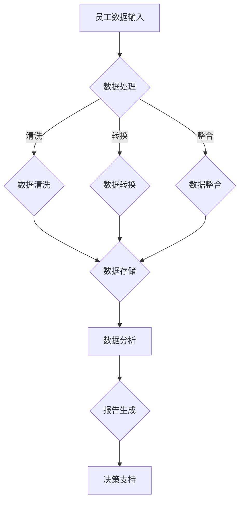

                 

### 第1章：HRIS系统的定义与作用

#### 1.1 HRIS系统的定义

人力资源信息系统（HRIS）是利用信息技术手段，对人力资源相关的数据进行收集、存储、处理、分析和报告的集成化系统。HRIS不仅涵盖了传统的员工信息管理，还涉及到薪资管理、招聘管理、绩效管理、培训管理等多个方面。通过HRIS，企业可以实现对人力资源信息的全面管理，提高人力资源管理效率，优化管理决策。

HRIS系统通常包含以下核心模块：

- **员工信息管理**：包括员工基本信息、工作经历、教育背景等。
- **薪资管理**：计算员工薪资、奖金、福利等，生成薪资报表。
- **招聘管理**：管理招聘流程，包括职位发布、简历筛选、面试安排等。
- **绩效管理**：评估员工绩效，提供绩效反馈和改进建议。
- **培训管理**：管理员工培训计划、课程安排、培训评估等。

#### 1.2 HRIS系统的作用

HRIS系统在企业人力资源管理中发挥着至关重要的作用，主要体现在以下几个方面：

1. **提高人力资源管理的效率**：

   通过HRIS系统的自动化处理功能，企业可以减少大量手动操作的工作量，如员工信息录入、薪资计算、招聘流程管理等。这不仅节省了人力资源部门的时间，还提高了工作效率。

2. **优化人力资源管理决策**：

   HRIS系统提供的实时数据分析和报表功能，可以帮助企业更准确地了解人力资源状况，为招聘、绩效评估、薪酬调整等决策提供数据支持。通过数据驱动的决策，企业可以更好地应对市场变化和业务需求。

3. **加强员工与企业之间的沟通**：

   HRIS系统提供了员工个人信息查询、申请休假、申请调岗等功能，方便员工与企业进行沟通。同时，企业可以通过系统向员工发布通知、公告，提高信息传递的效率。

4. **提升企业的竞争力**：

   通过HRIS系统的标准化和规范化管理，企业可以更好地控制人力资源成本，提高人力资源管理水平，从而提升整体竞争力。此外，HRIS系统还可以帮助企业打造良好的雇主品牌，吸引和留住优秀人才。

综上所述，HRIS系统是企业人力资源管理中不可或缺的工具，它不仅提高了管理效率，还为企业的可持续发展提供了有力支持。

#### 1.3 HRIS系统的发展历程

HRIS系统的发展历程可以追溯到20世纪60年代，当时企业开始尝试利用计算机技术进行员工信息管理。然而，最初的HR系统更多是作为一种记录工具，功能相对简单，主要侧重于员工基本信息的存储和查询。

随着计算机技术的不断发展，HR系统逐渐引入了更多的功能，如薪资计算、招聘管理、绩效评估等。这一阶段，HR系统开始逐步从单纯的记录工具转变为具有管理功能的信息系统。

20世纪90年代，随着互联网的普及和电子商务的兴起，HR系统开始实现信息化和集成化。企业可以通过互联网访问HR系统，实现远程办公和实时数据共享。同时，HR系统开始与企业的其他信息系统（如ERP系统、CRM系统等）进行集成，实现数据的无缝对接。

进入21世纪，随着大数据、云计算和人工智能等技术的应用，HRIS系统迎来了新一轮的发展。现代HRIS系统不仅具备强大的数据处理和分析能力，还能够通过人工智能技术进行预测分析和决策支持。例如，通过分析员工数据，HR系统可以预测员工的离职风险，为企业提供人力资源规划的建议。

总的来说，HRIS系统的发展历程反映了信息技术在人力资源管理领域的不断进步。从最初的记录工具到现代的综合信息系统，HRIS系统已经成为企业人力资源管理的重要支撑。

#### 1.4 HRIS系统的主要模块及其功能

HRIS系统作为企业人力资源管理的关键工具，其模块的划分和功能设计直接影响系统的整体性能和用户体验。以下是HRIS系统的几个主要模块及其具体功能：

1. **员工信息管理模块**：
   - **功能描述**：用于存储和管理员工的基本信息，如姓名、性别、出生日期、联系方式、职位、部门等。
   - **关键功能**：员工信息录入、修改、查询、删除，支持员工档案的电子化和标准化管理。
   - **实际应用**：企业可以通过该模块快速查找员工资料，提高工作效率。

2. **薪资管理模块**：
   - **功能描述**：负责计算和管理员工的薪资，包括基本工资、奖金、津贴、扣款等。
   - **关键功能**：薪资计算、发放记录、薪资报表生成、薪酬分析。
   - **实际应用**：通过该模块，企业可以确保薪资发放的准确性，减少人工错误。

3. **招聘管理模块**：
   - **功能描述**：用于管理招聘流程，包括职位发布、简历筛选、面试安排、录用通知等。
   - **关键功能**：职位发布、简历管理、面试安排、录用决策。
   - **实际应用**：帮助企业高效管理招聘流程，降低招聘成本。

4. **绩效管理模块**：
   - **功能描述**：用于评估和管理员工的工作绩效，包括绩效目标设置、绩效评估、反馈、改进。
   - **关键功能**：绩效目标设置、绩效评估、反馈机制、改进建议。
   - **实际应用**：通过该模块，企业可以实时跟踪员工绩效，激励员工提升工作表现。

5. **培训管理模块**：
   - **功能描述**：用于管理员工培训计划和培训课程，包括培训需求分析、培训计划制定、培训记录、培训效果评估。
   - **关键功能**：培训需求分析、培训计划制定、培训记录、培训效果评估。
   - **实际应用**：帮助企业系统化地开展员工培训，提升员工技能和知识水平。

6. **考勤管理模块**：
   - **功能描述**：用于记录和管理员工的考勤信息，包括出勤、加班、请假等。
   - **关键功能**：考勤记录、请假管理、加班记录、考勤报表。
   - **实际应用**：通过该模块，企业可以实时监控员工出勤情况，确保考勤管理的规范性和准确性。

7. **员工关系管理模块**：
   - **功能描述**：用于处理员工与企业之间的各种关系，包括劳动合同管理、离职管理、员工关怀等。
   - **关键功能**：劳动合同管理、离职流程管理、员工关怀计划。
   - **实际应用**：帮助企业妥善处理员工关系问题，维护良好的员工关系。

通过上述模块的有机结合，HRIS系统能够实现企业人力资源管理的全面覆盖，提高管理效率，优化人力资源决策。

#### 1.5 HRIS系统在企业管理中的重要性

HRIS系统在企业管理中扮演着至关重要的角色，其重要性主要体现在以下几个方面：

1. **数据驱动决策**：

   HRIS系统通过收集、存储和分析大量人力资源数据，为企业提供了真实、准确的数据支持。企业管理者可以通过这些数据，全面了解企业的员工结构、绩效情况、薪资水平等，从而做出更加科学、合理的决策。例如，通过分析员工离职率数据，企业可以找出离职原因，并采取相应的措施降低离职率。

2. **提高工作效率**：

   HRIS系统自动化处理大量人力资源事务，如员工信息录入、薪资计算、考勤管理等，极大地减轻了人力资源部门的工作负担，提高了工作效率。同时，系统还提供了便捷的查询和报表功能，使管理者能够快速获取所需信息，及时做出决策。

3. **优化人力资源配置**：

   通过HRIS系统，企业可以实时了解员工的技能、经验和绩效情况，从而优化人力资源配置。例如，根据员工的绩效评估结果，企业可以将优秀员工分配到关键岗位，提高整体工作效能。此外，系统还可以帮助企业预测未来的人力资源需求，提前进行人才储备和培养。

4. **提升员工满意度**：

   HRIS系统提供了丰富的员工服务功能，如员工信息查询、在线申请休假、培训报名等，使员工能够更加便捷地与企业进行互动。这不仅提高了员工的工作满意度，还有助于增强员工的归属感和忠诚度。

5. **保障数据安全**：

   HRIS系统具备完善的数据安全措施，可以有效防止数据泄露和滥用。通过用户权限管理、数据加密等技术手段，企业可以确保员工数据的安全性和隐私性，避免因数据泄露带来的风险和损失。

总之，HRIS系统不仅提高了企业人力资源管理的效率和质量，还为企业提供了数据支持和决策依据，成为企业管理的重要工具。

#### 1.6 HRIS系统的发展趋势与未来展望

随着科技的不断进步，HRIS系统的发展也呈现出一系列新的趋势。以下是HRIS系统在未来可能的发展方向：

1. **云计算与大数据**：

   云计算和大数据技术的普及，为HRIS系统带来了新的发展机遇。通过云计算，HRIS系统可以实现资源的弹性扩展，降低企业IT基础设施的投入。大数据技术则可以帮助企业更深入地分析人力资源数据，提供更加精准的决策支持。

2. **人工智能与机器学习**：

   人工智能（AI）和机器学习（ML）技术在HRIS系统中的应用逐渐增多。例如，AI技术可以用于员工行为分析、绩效评估、招聘预测等，提高人力资源管理的智能化水平。ML算法则可以帮助企业预测员工离职风险，提前采取预防措施。

3. **移动化与智能化**：

   移动设备的普及使得HRIS系统逐渐向移动化方向发展。企业可以通过移动应用，让员工随时随地访问HR系统，实现高效办公。同时，智能化的系统界面和交互设计，将进一步提升用户体验。

4. **区块链技术**：

   区块链技术具有去中心化、不可篡改等特点，未来有望在HRIS系统中得到应用。例如，通过区块链技术，企业可以建立可信的员工档案系统，确保员工数据的真实性和安全性。

5. **综合化与一体化**：

   HRIS系统将越来越向综合化和一体化方向发展。未来，HRIS系统可能会与企业的其他管理系统（如ERP、CRM等）实现更深度的集成，提供全方位的人力资源管理解决方案。

总之，随着科技的不断发展，HRIS系统将变得更加智能化、高效化和安全化，为企业的人力资源管理带来更多创新和变革。

### 第2章：HRIS系统的核心概念与联系

#### 2.1 数据仓库与数据挖掘技术

##### 2.1.1 数据仓库

数据仓库（Data Warehouse）是一种用于支持企业决策分析的数据环境，其核心功能是集成和管理大量异构数据，并提供高效的数据查询和分析能力。数据仓库通常包含以下几个关键特性：

- **大量性**：数据仓库能够存储和处理大量数据，这些数据可能来自企业的多个业务系统，如ERP、CRM等。
- **异构性**：数据仓库能够集成来自不同源、不同格式和不同结构的数据。
- **时效性**：数据仓库中的数据需要定期更新，以保持数据的时效性。
- **一致性**：数据仓库通过一系列数据清洗和整合过程，确保数据的一致性。

##### 2.1.2 数据挖掘技术

数据挖掘（Data Mining）是一种通过计算机技术从大量数据中发现规律、趋势和模式的方法。数据挖掘的过程通常包括以下几个步骤：

- **数据预处理**：对原始数据进行清洗、转换和整合，以便进行挖掘分析。
- **数据选择**：选择与特定分析任务相关的数据子集。
- **数据变换**：将数据转换为适合挖掘算法的格式。
- **模式识别**：使用各种算法（如分类、聚类、关联规则挖掘等）发现数据中的模式。
- **评估**：评估挖掘结果的准确性和实用性。

常见的数据挖掘算法包括：

- **分类**：将数据分为不同的类别，如决策树、随机森林等。
- **聚类**：将相似的数据分组，如K-means、层次聚类等。
- **关联规则挖掘**：发现数据项之间的关联关系，如Apriori算法、FP-growth算法等。

#### 2.2 数据库设计与优化

##### 2.2.1 关系型数据库设计

关系型数据库设计是HRIS系统架构中的重要组成部分。关系型数据库通过实体-关系（ER）模型来描述系统中的实体及其关系。

- **实体-关系（ER）模型**：ER模型用于描述系统中不同实体及其属性，以及实体之间的关系。一个典型的ER图包括实体、属性和关系三个要素。

- **规范化**：规范化是一种通过一系列规则减少数据冗余、提高数据一致性的数据库设计方法。常用的规范化规则包括第一范式（1NF）、第二范式（2NF）、第三范式（3NF）等。

##### 2.2.2 数据库优化

数据库优化是提高数据库性能的重要手段。以下是一些常用的数据库优化方法：

- **索引**：索引是一种提高数据检索速度的数据结构。通过在关键字段上创建索引，可以快速定位数据，提高查询效率。

- **查询优化**：查询优化是一种通过调整查询语句的结构，减少查询执行时间的方法。常见的查询优化策略包括选择合适的数据类型、避免使用子查询、使用连接操作等。

- **分区**：分区是一种将大型数据表分割成多个小数据表的方法。通过分区，可以降低单个表的查询负载，提高查询效率。

- **缓存**：缓存是一种将经常访问的数据存储在内存中的技术。通过缓存，可以减少对磁盘的访问次数，提高数据访问速度。

#### 2.3 Mermaid流程图：HRIS系统数据处理流程

下面是一个使用Mermaid绘制的HRIS系统数据处理流程图，展示了数据从输入到处理的整个过程：

在这个流程图中，A表示员工数据的输入，数据经过清洗（C）、转换（D）和整合（E）后，存储在数据库（F）中。然后，对存储的数据进行数据分析（G），生成报告（H），最后为决策提供支持（I）。

通过这个流程图，我们可以清晰地了解HRIS系统数据处理的全过程，有助于我们更好地理解系统的运作原理。

### 第3章：HRIS系统选型准备

#### 3.1 企业现状分析

在选型HRIS系统之前，对企业现状的全面分析至关重要。这一步骤不仅可以帮助我们了解企业的实际需求，还能为后续的选型工作提供可靠依据。以下是企业现状分析的关键步骤：

1. **业务流程分析**：

   首先，我们需要深入理解企业的业务流程，特别是与人力资源管理相关的流程。这包括招聘流程、员工入职流程、绩效考核流程、薪资发放流程等。通过业务流程分析，我们可以发现现有流程中的痛点和不合理之处，从而为HRIS系统的选型提供改进方向。

2. **IT基础设施评估**：

   企业现有的IT基础设施对HRIS系统的选型具有重要影响。我们需要评估企业当前的服务器、网络、数据库等基础设施是否能够满足HRIS系统的运行需求。如果现有基础设施无法满足需求，可能需要考虑升级或更换。

3. **人力资源需求分析**：

   对企业的人力资源需求进行全面分析，包括员工数量、职位分布、绩效情况、培训需求等。这有助于我们了解企业在人力资源方面的核心需求和挑战，从而选择合适的HRIS系统。

4. **现有系统整合**：

   如果企业已经使用了其他信息系统（如ERP、CRM等），我们需要分析这些系统与HRIS系统的整合可能性。确保HRIS系统能够与现有系统集成，实现数据的无缝对接。

5. **数据安全性分析**：

   数据安全性是企业选型HRIS系统时必须考虑的重要因素。我们需要评估企业现有的数据安全措施，包括数据备份、权限管理、数据加密等，确保HRIS系统能够提供足够的安全性保障。

通过上述步骤，我们可以对企业现状进行全面分析，为后续的HRIS系统选型奠定基础。

#### 3.2 需求分析与定义

需求分析是HRIS系统选型过程中至关重要的一步，它关乎系统是否能够满足企业的实际需求，进而决定选型结果的成败。以下是需求分析与定义的关键步骤：

1. **明确功能需求**：

   功能需求是HRIS系统选型中的核心内容，我们需要明确企业需要哪些基本功能。这些功能可能包括但不限于员工信息管理、薪资管理、招聘管理、绩效管理、培训管理等。在明确功能需求时，建议采用功能列表或功能矩阵等形式，确保需求的全面性和准确性。

2. **确定非功能需求**：

   除了功能需求外，非功能需求也是影响系统选型的重要因素。非功能需求包括系统的性能、安全性、可扩展性、易用性等。例如，系统需要在多用户并发访问时保持高响应速度，需要具备良好的数据安全防护机制，能够适应企业规模的不断扩大等。

3. **优先级排序**：

   在明确需求后，我们需要对需求进行优先级排序。通过评估各需求的紧迫性和重要性，我们可以确定哪些功能需求是必须的，哪些是可选的，哪些是次要的。这种优先级排序有助于我们更好地分配资源，确保关键需求的优先满足。

4. **文档化需求**：

   将需求分析的结果进行文档化，形成需求规格说明书。这份文档将成为后续系统选型和实施的重要依据，有助于确保项目的顺利进行。在文档化过程中，建议使用清晰的语言描述，并提供相关的示例和数据支持。

5. **用户参与**：

   需求分析不仅仅是技术人员的任务，还应该有用户的深度参与。通过用户访谈、需求研讨会等形式，我们可以收集到更多真实的需求，确保系统的实用性。用户的参与不仅有助于提高系统的满意度，还能增强用户的归属感和参与感。

通过上述步骤，我们可以系统地完成需求分析与定义，为HRIS系统的选型提供坚实的依据。

#### 3.3 系统集成与兼容性考虑

在HRIS系统选型过程中，系统集成与兼容性是一个不可忽视的重要方面。一个成功选型的HRIS系统不仅需要满足企业的功能需求，还必须能够与现有系统无缝集成，确保数据流动的畅通和数据一致性的维护。以下是系统集成与兼容性考虑的关键步骤：

1. **现有系统评估**：

   在进行HRIS系统选型之前，首先需要对现有系统进行全面评估。这包括了解现有系统的架构、功能模块、数据流和数据存储方式。通过评估，我们可以确定哪些现有系统需要与HRIS系统进行集成，以及可能存在的兼容性问题。

2. **数据接口设计**：

   数据接口是系统集成中的核心部分。我们需要设计合理的数据接口，确保HRIS系统与现有系统之间的数据能够顺利交换和共享。常见的数据接口包括API、Web服务、数据库连接等。在设计数据接口时，需要考虑数据传输的格式、频率和安全性。

3. **数据同步与一致性**：

   数据同步是保证系统集成与数据一致性的关键。我们需要制定详细的数据同步策略，确保HRIS系统与现有系统之间的数据能够实时更新和同步。此外，还需要建立数据一致性的监控机制，及时发现并处理数据不一致的问题。

4. **系统兼容性测试**：

   在系统集成过程中，必须进行充分的兼容性测试，确保HRIS系统在不同操作系统、数据库和中间件环境下的正常运行。兼容性测试应包括功能测试、性能测试和安全测试等多个方面。

5. **用户培训与支持**：

   系统集成成功后，用户培训和持续支持至关重要。我们需要为用户提供充分的培训，确保他们能够熟练使用新系统。此外，还需要建立完善的客户支持体系，及时解决用户在使用过程中遇到的问题。

通过上述步骤，我们可以确保HRIS系统与现有系统的成功集成，实现数据的无缝流动和一致性的维护。

### 第4章：HRIS市场调研与评估

#### 4.1 市场调研方法与工具

市场调研是HRIS系统选型过程中至关重要的一环。通过市场调研，我们可以全面了解HRIS市场的现状、竞争对手以及潜在的系统供应商，为选型提供科学依据。以下是市场调研的几种常见方法和工具：

1. **问卷调查**：

   问卷调查是一种简便有效的市场调研方法。通过设计合理的问卷，我们可以收集到大量关于HRIS系统的用户需求、满意度、使用体验等方面的信息。问卷调查的优点是成本低、覆盖面广，但缺点是数据质量受问卷设计和样本代表性的影响较大。

2. **访谈**：

   访谈是一种深入调研方法，通过与HRIS系统的用户、供应商、行业专家等进行面对面交流，我们可以获得更详细、更深入的信息。访谈的优点是信息质量高、反馈详细，但缺点是成本高、耗时较长。

3. **在线研究**：

   在线研究通过互联网平台进行，包括在线调查、论坛讨论、社交媒体分析等。这种方法可以快速收集大量数据，尤其在调研范围较广时效果显著。在线研究的优点是成本低、速度快，但数据质量和样本代表性也值得注意。

4. **行业报告**：

   行业报告通常由市场研究机构发布，提供了关于HRIS市场的发展趋势、市场规模、竞争格局等方面的详细分析。通过阅读行业报告，我们可以获得行业全景图，为选型提供参考。

5. **竞争对手分析**：

   对竞争对手的HRIS系统进行深入分析，可以帮助我们了解市场领先者的产品特点、优势劣势，从而为自身选型提供借鉴。竞争对手分析可以包括产品功能对比、用户评价、市场份额等方面。

通过上述方法和工具的综合应用，我们可以全面、系统地了解HRIS市场，为选型提供有力支持。

#### 4.2 竞争对手分析

在HRIS市场调研中，竞争对手分析是一个重要的环节。通过深入了解竞争对手的产品特点、市场表现和用户评价，我们可以更好地评估自身产品的竞争力，并为选型提供参考。以下是竞争对手分析的几个关键方面：

1. **产品功能对比**：

   首先，我们需要对主要竞争对手的产品功能进行详细对比。这包括员工信息管理、薪资管理、招聘管理、绩效管理、培训管理等功能。通过对比，我们可以发现各产品的优势与不足，从而了解自身产品在功能上的竞争力。

2. **市场份额**：

   评估竞争对手在HRIS市场中的市场份额是了解其市场地位的重要方法。通过查阅行业报告或公开数据，我们可以了解各竞争对手的市场占有率、客户数量、销售额等指标。这有助于我们判断竞争对手的市场影响力。

3. **用户评价**：

   用户评价是反映产品优劣的重要指标。我们可以通过社交媒体、行业论坛、用户反馈等方式，收集用户对竞争对手产品的评价。用户评价通常包括产品的稳定性、易用性、客户支持等方面。通过分析用户评价，我们可以了解竞争对手的口碑和用户满意度。

4. **营销策略**：

   分析竞争对手的营销策略，包括市场推广、销售渠道、定价策略等，可以帮助我们了解其市场拓展和用户获取的方法。通过对比，我们可以发现自身在营销策略上的优势和不足，从而优化自身的营销策略。

5. **产品优势与劣势**：

   在竞争对手分析中，我们需要全面评估各竞争对手的产品优势与劣势。这包括技术创新、用户体验、客户服务、市场响应速度等方面。通过分析，我们可以发现竞争对手的核心竞争力，从而为自身产品的改进提供参考。

总之，通过竞争对手分析，我们可以深入了解市场竞争态势，为HRIS系统的选型提供有力支持。

#### 4.3 HRIS系统评估标准与指标

在HRIS系统选型过程中，评估标准与指标的选择至关重要。合理的评估标准可以帮助我们从众多候选系统中筛选出最适合企业需求的系统。以下是常见的HRIS系统评估标准与指标：

1. **易用性**：

   易用性是HRIS系统的核心指标之一。一个优秀的HRIS系统应该具有直观、简洁的界面设计，便于用户快速上手。易用性评估可以从用户界面友好性、操作便捷性、系统响应速度等方面进行。

2. **稳定性**：

   稳定性是HRIS系统能否长期稳定运行的基础。我们需要评估系统的稳定性，包括系统崩溃率、故障恢复速度、数据完整性等。一个稳定的系统可以保证企业业务的连续性，减少因系统故障带来的损失。

3. **扩展性**：

   随着企业规模的不断扩大，HRIS系统需要具备良好的扩展性，以适应企业发展的需求。扩展性评估可以从系统架构的可扩展性、功能模块的灵活性、数据存储容量等方面进行。

4. **安全性**：

   数据安全性是HRIS系统选型中必须考虑的重要因素。我们需要评估系统的安全性，包括数据加密、用户权限管理、防火墙设置等。一个安全可靠的系统可以保护企业数据免受泄露和篡改。

5. **客户支持**：

   客户支持是HRIS系统能否提供长期稳定服务的重要保障。我们需要评估供应商提供的客户支持服务，包括技术支持响应时间、服务渠道多样化、培训服务等。优质的客户支持可以确保系统在运行过程中得到及时的帮助。

6. **成本效益**：

   成本效益是HRIS系统选型中不可忽视的指标。我们需要评估系统的总拥有成本（Total Cost of Ownership, TCO），包括购买成本、实施成本、维护成本等。一个具有高成本效益的系统可以在保证功能完善的同时，为企业节省成本。

7. **用户体验**：

   用户体验是影响HRIS系统使用效果的重要因素。我们需要评估系统的用户体验，包括界面设计、操作流程、功能完善度等。一个优秀的用户体验可以提升员工的工作效率和满意度。

通过上述评估标准与指标，我们可以全面、客观地评估HRIS系统的优劣，为选型决策提供有力支持。

### 第5章：HRIS系统选型流程

#### 5.1 系统需求评审

系统需求评审是HRIS系统选型过程中的关键步骤，它确保选型的HRIS系统完全满足企业的需求，并避免因需求不明确或误解导致的后续问题。以下是系统需求评审的主要步骤：

1. **需求收集**：

   需求收集是评审的基础。我们需要通过访谈、问卷调查、用户研讨会等形式，全面收集企业各部门、特别是人力资源部门的需求。在收集过程中，要确保需求的准确性和完整性，避免遗漏关键需求。

2. **需求整理**：

   收集到需求后，我们需要对需求进行整理和分类。这包括将功能需求、非功能需求、优先级需求等进行分类，形成需求清单。需求清单应详细、明确，便于后续评审和比选。

3. **需求验证**：

   需求验证是确保需求合理性和可行性的关键步骤。我们需要组织相关部门和专家，对需求进行审查和验证。通过验证，可以发现和解决需求中的矛盾和错误，确保需求清单的准确性和一致性。

4. **需求确认**：

   在需求验证后，我们需要将确认的需求清单提交给企业高层领导进行最终确认。确认后的需求清单将成为后续系统选型和实施的重要依据。

5. **需求变更管理**：

   在项目实施过程中，需求可能会发生变化。我们需要建立需求变更管理机制，确保任何需求变更都经过严格的审批和评估，不影响项目的整体进度和质量。

通过上述步骤，我们可以确保系统需求评审的全面性和准确性，为HRIS系统的选型提供坚实基础。

#### 5.2 系统评估与比选

系统评估与比选是HRIS系统选型过程中的重要环节，它帮助我们客观、全面地评估各个候选系统的优劣，从而选出最适合企业需求的系统。以下是系统评估与比选的主要步骤：

1. **制定评估标准**：

   首先，我们需要根据企业的需求和预期目标，制定一套科学的评估标准。评估标准应涵盖系统的功能、性能、安全性、易用性、成本效益等多个方面。常见的评估标准包括稳定性、扩展性、安全性、用户体验等。

2. **候选系统筛选**：

   根据制定好的评估标准，我们对市场上的候选系统进行初步筛选。筛选过程可以通过查阅产品手册、用户评论、市场报告等资料，初步确定符合评估标准的候选系统。

3. **现场演示与测试**：

   为了更深入地了解候选系统的功能、性能和用户体验，我们需要组织现场演示和测试。在演示和测试过程中，我们可以邀请企业相关部门的员工参与，通过实际操作感受系统的性能和易用性。测试内容应包括系统的关键功能、性能指标、安全防护机制等。

4. **数据分析与比较**：

   在完成演示和测试后，我们需要对收集到的数据进行分析和比较。通过对比各个候选系统的性能、功能、安全性等指标，我们可以得出初步的评估结果。

5. **用户反馈**：

   用户反馈是评估系统的重要参考。我们需要收集企业员工对候选系统的使用体验和意见，了解他们在实际使用过程中遇到的问题和建议。这些反馈可以帮助我们更全面地评估系统的适用性。

6. **决策与选择**：

   最后，根据评估结果和用户反馈，我们进行综合分析和决策，选择最适合企业需求的HRIS系统。决策过程中，需要充分考虑企业的长期发展规划和实际需求。

通过上述步骤，我们可以系统地评估和比选HRIS系统，确保选型过程的科学性和客观性。

#### 5.3 选型决策与执行

在完成系统评估和比选后，选型决策与执行成为HRIS系统选型流程的最后一个关键步骤。以下是选型决策与执行的主要步骤：

1. **决策制定**：

   在评估和比选的基础上，我们需要根据企业的需求和预算，制定最终的选型决策。决策应包括系统的选择、供应商的确定以及合同条款的商议等。决策过程中，应充分考虑系统的功能、性能、安全性、成本效益等多个方面。

2. **合同谈判**：

   制定决策后，我们需要与选定的供应商进行合同谈判。合同内容应明确系统的交付时间、功能实现、售后服务、培训支持、技术支持等方面的条款。在谈判过程中，应确保供应商能够满足企业的需求和承诺，并保留一定的灵活性以应对可能的变化。

3. **项目启动**：

   合同签订后，我们需要启动项目，制定详细的实施计划。实施计划应包括项目目标、范围、时间表、资源分配、风险管理等内容。项目启动会议是项目启动的关键，通过会议，我们确保所有项目成员对项目目标和实施计划有清晰的认识。

4. **实施准备**：

   在项目启动后，我们需要进行实施准备。这包括组建项目团队、明确团队成员职责、进行系统培训等。此外，我们还需要对现有系统进行评估和清理，确保数据的一致性和完整性。

5. **系统实施**：

   系统实施是项目核心部分。我们需要按照实施计划，逐步完成系统的安装、配置、数据迁移、测试等工作。在实施过程中，应密切监控项目的进度和质量，确保项目按计划顺利进行。

6. **用户培训与支持**：

   系统实施完成后，我们需要对用户进行培训，确保他们能够熟练操作新系统。培训内容应包括系统的基本操作、功能使用、常见问题处理等。同时，我们还需要提供持续的技术支持和售后服务，确保系统稳定运行。

7. **项目验收**：

   在系统运行一段时间后，我们需要进行项目验收。验收应包括系统功能的测试、性能评估、用户反馈等。通过验收，我们确保系统满足企业的需求和预期效果。

通过上述步骤，我们可以确保HRIS系统选型决策的顺利执行，实现系统的有效部署和运行。

### 第6章：HRIS系统实施准备

#### 6.1 实施团队组建与培训

HRIS系统的成功实施离不开一支高效专业的实施团队。团队成员的素质和技能直接关系到项目的成败。以下是组建实施团队和进行系统培训的关键步骤：

1. **组建实施团队**：

   实施团队的组建应包括项目管理人员、系统分析师、技术工程师、业务专家等多个角色。每个成员应明确其职责，以确保项目高效运行。项目经理负责整个项目的规划、执行和监控；系统分析师负责需求分析和系统设计；技术工程师负责系统安装、配置和调试；业务专家则提供业务流程和技术方面的支持。

2. **确定团队成员**：

   在组建团队时，我们需要根据项目需求和现有资源，选择合适的团队成员。项目经理应具备项目管理和沟通协调能力；系统分析师应熟悉HRIS系统的功能和架构；技术工程师应具备系统安装和配置的技能；业务专家则应具备丰富的业务知识和经验。

3. **系统培训**：

   系统培训是确保团队成员能够熟练操作新系统的重要环节。培训内容应包括系统的基本操作、功能使用、常见问题处理等。培训方式可以采用集中授课、在线学习、实操演练等。培训过程中，应鼓励团队成员积极参与，提出问题和建议，以提高培训效果。

4. **培训效果评估**：

   在培训结束后，我们需要对培训效果进行评估，确保团队成员掌握了所需的知识和技能。评估可以通过笔试、实操考试、用户反馈等多种方式进行。通过评估，我们可以发现培训中的不足，为后续培训提供改进方向。

5. **持续学习与支持**：

   系统培训不是一次性的，而是一个持续的过程。在系统实施和运行过程中，团队成员应不断学习新知识、新技能，以适应系统的变化和业务发展的需求。企业可以组织定期的培训和学习活动，提供技术支持，帮助团队成员不断提升自己的专业水平。

通过上述步骤，我们可以确保实施团队的高效运作和系统培训的全面覆盖，为HRIS系统的顺利实施奠定坚实基础。

#### 6.2 项目计划与进度管理

项目计划与进度管理是HRIS系统实施过程中至关重要的一环，它关系到项目的按时完成和资源的高效利用。以下是项目计划与进度管理的主要步骤：

1. **项目计划制定**：

   项目计划是项目实施的指导性文件，它明确了项目的目标、范围、时间表、任务分配、资源需求等。在制定项目计划时，我们需要进行详细的需求分析，明确项目的关键里程碑和交付物。项目计划应具备灵活性，能够适应项目过程中的变化。

2. **任务分解**：

   将项目整体任务分解为具体的子任务，明确每个子任务的负责人、完成时间、所需资源等。任务分解应细致到每个工作单元，以确保项目的每个环节都有明确的责任人。

3. **时间安排**：

   根据任务分解的结果，制定详细的时间安排表。时间安排表应明确每个任务的开始和结束时间，以及任务的依赖关系。通过时间安排，我们可以确保项目按照预定的时间表顺利进行。

4. **资源分配**：

   确保项目所需的人力、物资、设备等资源能够按时到位。在资源分配过程中，我们需要充分考虑团队成员的负荷和优先级，确保关键任务的资源需求得到满足。

5. **风险管理**：

   风险管理是项目计划与进度管理的重要组成部分。我们需要识别项目过程中可能遇到的风险，制定相应的应对措施。风险管理应贯穿整个项目周期，定期进行风险评估和调整。

6. **进度监控**：

   项目实施过程中，我们需要对进度进行实时监控，确保项目按照计划进行。进度监控可以通过项目管理工具（如Jira、Trello等）进行，定期生成进度报告，及时发现问题并采取措施。

7. **调整与优化**：

   在项目执行过程中，可能会出现计划与实际不符的情况。我们需要根据实际情况对计划进行调整和优化，确保项目能够按时、按质量完成。

通过上述步骤，我们可以有效地制定和执行HRIS系统实施的项目计划，确保项目进度和质量。

#### 6.3 风险评估与管理

在HRIS系统实施过程中，风险评估与管理是确保项目顺利推进的重要环节。以下是风险评估与管理的主要步骤：

1. **风险识别**：

   首先，我们需要识别项目过程中可能遇到的各种风险。这可以通过项目团队讨论、专家咨询、历史经验等方式进行。常见的风险包括技术风险、时间风险、成本风险、资源风险等。

2. **风险分析**：

   在识别出风险后，我们需要对每个风险进行详细分析，评估其发生的可能性、影响程度和优先级。风险分析可以通过定性和定量两种方法进行，例如使用风险矩阵、概率影响矩阵等工具。

3. **风险应对策略**：

   根据风险分析的结果，制定相应的风险应对策略。常见的风险应对策略包括风险规避、风险减轻、风险转移和风险接受等。具体策略的选择取决于风险的性质和项目的具体情况。

4. **风险监控与报告**：

   在项目实施过程中，我们需要对风险进行持续监控，及时发现新的风险和变化。风险监控可以通过定期召开风险评审会议、使用风险管理软件等方式进行。同时，我们需要定期向项目团队和管理层报告风险状况，确保各方对风险有清晰的了解。

5. **风险处理与调整**：

   在风险发生时，我们需要根据风险应对策略进行处理，并调整项目计划以降低风险的影响。风险处理应迅速、果断，确保项目能够继续顺利推进。

6. **风险总结与经验教训**：

   在项目结束后，我们需要对整个项目过程中的风险进行总结，分析风险管理的成功经验和不足之处。通过总结，我们可以为未来的项目提供宝贵的经验和教训，提高项目风险管理的能力。

通过上述步骤，我们可以有效地识别、分析和应对HRIS系统实施过程中的各种风险，确保项目的顺利实施。

### 第7章：HRIS系统实施与部署

#### 7.1 系统安装与配置

HRIS系统的安装与配置是确保系统能够正常运行的基础。以下是系统安装与配置的主要步骤：

1. **硬件环境准备**：

   在进行系统安装之前，我们需要确保服务器、网络设备等硬件环境的准备。这包括检查服务器硬件配置是否满足系统要求，网络设备是否正常工作等。同时，我们还需要为系统安装提供足够的存储空间和带宽。

2. **操作系统安装**：

   根据系统要求，安装相应的操作系统。操作系统应具备良好的稳定性、安全性和兼容性。在安装过程中，我们需要按照操作系统的安装指南，逐步完成安装过程。

3. **数据库安装与配置**：

   安装数据库软件，并根据系统要求配置数据库。数据库配置包括数据库实例的创建、用户权限的设置、存储空间的分配等。配置过程中，我们需要确保数据库能够与系统高效协同工作。

4. **中间件安装**：

   根据系统需求，安装中间件软件，如Web服务器、应用服务器等。中间件的安装和配置应确保其具备高可靠性、高性能和安全性。

5. **系统软件安装**：

   安装HRIS系统软件，包括系统安装包的下载、安装程序的执行等。在安装过程中，我们需要按照系统安装指南，逐步完成安装过程。

6. **配置参数设置**：

   在系统安装完成后，我们需要对系统参数进行设置，确保系统按照企业的需求正常运行。配置参数包括系统管理员账号、数据库连接信息、网络配置、安全设置等。

通过上述步骤，我们可以确保HRIS系统的安装与配置顺利完成，为系统的正常运行奠定基础。

#### 7.2 数据迁移与整合

在HRIS系统实施过程中，数据迁移与整合是一个关键步骤。以下是数据迁移与整合的主要步骤：

1. **数据源分析**：

   首先，我们需要对现有的数据源进行分析，了解数据源的格式、结构和内容。这包括现有员工信息、薪资数据、招聘数据等。通过分析，我们可以确定数据迁移的难点和关键点。

2. **数据映射**：

   在明确数据源后，我们需要进行数据映射，将现有数据与HRIS系统中的相应字段进行匹配。数据映射应确保数据的一致性和准确性，避免数据丢失或错误。

3. **数据清洗**：

   数据清洗是确保数据质量的重要步骤。我们需要对数据进行清洗，包括去除重复记录、纠正错误、填补缺失值等。数据清洗可以通过编写清洗脚本或使用数据清洗工具进行。

4. **数据转换**：

   根据HRIS系统的要求，对现有数据进行转换。数据转换包括格式转换、字段映射、数据转换等。转换过程中，我们需要确保数据格式的兼容性和一致性。

5. **数据迁移**：

   将清洗和转换后的数据迁移到HRIS系统中。数据迁移可以通过批量导入或实时同步等方式进行。在迁移过程中，我们需要监控数据迁移进度，确保数据迁移的完整性和准确性。

6. **数据整合**：

   在数据迁移完成后，我们需要进行数据整合，确保HRIS系统中的数据能够与其他系统（如ERP、CRM等）进行数据共享和整合。数据整合可以通过建立数据接口或使用ETL（抽取、转换、加载）工具进行。

通过上述步骤，我们可以确保HRIS系统的数据迁移与整合顺利进行，实现数据的无缝对接和共享。

#### 7.3 系统测试与调试

在HRIS系统实施与部署过程中，系统测试与调试是确保系统正常运行和功能完善的重要环节。以下是系统测试与调试的主要步骤：

1. **单元测试**：

   单元测试是对系统中最小的可测试单元（如函数、方法等）进行测试，确保其按照预期工作。单元测试可以通过编写测试脚本或使用自动化测试工具进行。测试内容包括功能测试、性能测试、边界测试等。

2. **集成测试**：

   集成测试是对系统中的各个模块进行联合测试，确保它们能够协同工作。集成测试需要覆盖系统的各个功能模块，包括员工信息管理、薪资管理、招聘管理、绩效管理等。测试过程中，我们需要模拟实际使用场景，确保系统的稳定性和可靠性。

3. **性能测试**：

   性能测试是评估系统在高负载情况下的性能表现，包括响应时间、并发处理能力、数据存储速度等。性能测试可以通过自动化测试工具进行，模拟大量用户同时访问系统，确保系统在高并发情况下的稳定运行。

4. **安全测试**：

   安全测试是评估系统在安全性方面的表现，包括数据加密、用户权限管理、漏洞扫描等。安全测试可以通过专业的安全工具进行，确保系统的数据安全和用户隐私保护。

5. **调试**：

   在测试过程中，我们可能会发现系统中的错误和缺陷。调试是发现并修复这些错误的过程。调试可以通过日志分析、代码审查、调试工具等方式进行，确保系统中的错误得到及时修复。

6. **用户验收测试**：

   用户验收测试（UAT）是邀请企业用户参与测试，确保系统功能符合用户需求，用户体验良好。用户验收测试可以通过模拟实际使用场景，让用户在实际操作中发现问题并提出建议。

通过上述步骤，我们可以确保HRIS系统在测试和调试阶段发现并解决潜在问题，确保系统在上线后的稳定运行。

### 第8章：HRIS系统上线与运行

#### 8.1 系统上线策略

系统上线是HRIS系统实施过程中的关键环节，直接影响系统的稳定运行和用户满意度。以下是系统上线策略的关键步骤：

1. **上线准备**：

   在系统上线前，我们需要进行充分的上线准备。这包括：

   - **环境准备**：确保服务器、网络、数据库等硬件环境正常，并进行必要的优化和调整。
   - **数据准备**：确保HRIS系统中数据完整、准确，并进行必要的备份。
   - **用户培训**：对用户进行系统操作培训，确保用户熟悉新系统的使用。

2. **上线步骤**：

   系统上线的具体步骤如下：

   - **停机**：在系统切换到新系统之前，我们需要对现有系统进行停机，确保数据的一致性。
   - **数据迁移**：将现有数据迁移到新系统，确保数据的完整性和准确性。
   - **启动新系统**：启动新系统，进行初步测试，确保系统能够正常运行。
   - **用户切换**：引导用户切换到新系统，并进行实际操作，确保系统的易用性和稳定性。

3. **上线监控**：

   在系统上线后，我们需要进行实时监控，确保系统运行稳定。监控内容包括：

   - **性能监控**：监控系统的响应时间、并发处理能力等性能指标。
   - **安全监控**：监控系统的安全性能，确保数据安全和用户隐私。
   - **用户反馈**：收集用户的反馈和意见，及时解决用户在使用过程中遇到的问题。

通过上述步骤，我们可以确保HRIS系统顺利上线，并确保系统的稳定运行和用户满意度。

#### 8.2 运维与优化

HRIS系统的运维与优化是确保系统长期稳定运行和性能提升的关键。以下是运维与优化的主要步骤：

1. **日常运维**：

   日常运维包括系统监控、故障处理、性能优化等。

   - **系统监控**：使用监控工具实时监控系统的运行状态，包括CPU、内存、磁盘使用率等关键指标。
   - **故障处理**：及时响应和处理系统故障，确保系统的稳定运行。
   - **性能优化**：定期进行性能优化，包括数据库优化、缓存优化、查询优化等，提高系统响应速度和处理能力。

2. **故障处理**：

   在系统运行过程中，可能会遇到各种故障。故障处理包括以下步骤：

   - **故障诊断**：通过日志分析、性能监控等手段，诊断故障原因。
   - **故障处理**：根据故障原因，采取相应的处理措施，如重启服务、修复数据库等。
   - **故障记录**：记录故障原因和处理过程，为后续故障处理提供参考。

3. **性能优化**：

   性能优化是提升系统性能的重要手段。以下是一些常见的性能优化方法：

   - **数据库优化**：通过索引优化、查询优化等手段，提高数据库查询速度。
   - **缓存优化**：使用缓存技术，减少数据库访问次数，提高系统响应速度。
   - **负载均衡**：通过负载均衡技术，将访问压力分散到多个服务器，提高系统的并发处理能力。
   - **系统监控**：实时监控系统性能，及时发现并处理性能瓶颈。

通过上述运维与优化步骤，我们可以确保HRIS系统的长期稳定运行和性能提升。

#### 8.3 用户反馈与持续改进

用户反馈是HRIS系统改进的重要依据，通过收集和分析用户反馈，我们可以不断优化系统功能，提升用户体验。以下是用户反馈与持续改进的主要步骤：

1. **收集用户反馈**：

   用户反馈的收集可以通过多种渠道进行，如在线问卷调查、用户访谈、用户满意度调查等。在收集过程中，我们需要确保反馈的全面性和真实性。

2. **反馈整理与分析**：

   收集到用户反馈后，我们需要对反馈进行整理和分析。分析内容包括反馈的内容、频率、影响范围等。通过分析，我们可以发现用户普遍关注的问题和需求。

3. **问题分类与优先级排序**：

   根据反馈内容，我们将问题进行分类，如功能缺陷、性能问题、用户体验问题等。然后，对问题进行优先级排序，确定哪些问题是需要优先解决的。

4. **制定改进计划**：

   针对优先级排序后的问题，我们需要制定详细的改进计划。改进计划应包括改进目标、改进方法、改进时间表等。

5. **实施改进措施**：

   按照改进计划，实施改进措施。改进措施可以包括功能升级、性能优化、界面调整等。

6. **效果评估与反馈**：

   在改进措施实施后，我们需要对改进效果进行评估，并向用户反馈改进结果。评估内容包括用户满意度、系统性能指标等。通过评估，我们可以验证改进措施的有效性，并为后续改进提供参考。

通过上述步骤，我们可以确保HRIS系统不断根据用户需求进行优化和改进，提升用户体验和满意度。

### 第9章：HRIS系统在创业中的应用场景

#### 9.1 创业公司的人力资源管理需求

创业公司在发展初期面临着复杂多变的业务环境和资源有限的挑战，因此在人力资源管理方面有独特的需求。以下是创业公司在人力资源管理方面的一些具体需求：

1. **灵活管理**：

   创业公司的员工结构相对灵活，人员流动较快。因此，创业公司需要一套能够灵活管理员工信息、职位变动和离职流程的系统。这包括对员工档案的快速更新、职位信息的动态调整以及离职流程的自动化处理。

2. **成本控制**：

   创业公司在初期往往需要严格控制成本，因此在人力资源管理系统选型时，成本是一个重要的考量因素。创业公司需要选择价格适中、功能实用的HRIS系统，避免高昂的初期投入和维护成本。

3. **快速响应**：

   创业公司需要快速响应市场和业务变化，因此在人力资源管理方面也需要有快速响应的能力。例如，招聘流程需要能够快速启动和结束，绩效评估和薪酬调整需要能够灵活调整。

4. **数据驱动决策**：

   创业公司需要通过数据来驱动决策，因此在HRIS系统中需要具备强大的数据分析功能。这可以帮助创业公司更好地了解员工绩效、招聘效果、离职原因等关键指标，从而做出更为科学的决策。

5. **员工关怀**：

   创业公司为了吸引和留住人才，需要提供良好的员工关怀。HRIS系统可以通过提供员工福利查询、培训报名、休假申请等功能，提升员工的满意度和忠诚度。

6. **系统整合**：

   创业公司的HRIS系统需要与其他业务系统（如CRM、ERP等）进行整合，实现数据共享和流程协同。这可以帮助创业公司实现信息化管理，提高整体运营效率。

#### 9.2 HRIS系统在创业公司中的价值

HRIS系统在创业公司中具有以下几方面的价值：

1. **提高管理效率**：

   HRIS系统通过自动化处理人力资源事务，如员工信息录入、薪资计算、考勤管理等，大大减轻了人力资源部门的工作负担，提高了工作效率。创业公司可以利用节省下来的时间，专注于更为重要的战略规划和业务拓展。

2. **数据驱动决策**：

   HRIS系统提供的实时数据分析功能，可以帮助创业公司更好地了解人力资源状况，如员工满意度、招聘效果、离职率等。通过数据分析，创业公司可以做出更加科学、合理的决策，优化人力资源管理策略。

3. **降低成本**：

   通过HRIS系统的标准化和自动化管理，创业公司可以降低人力资源管理的成本。例如，自动化的薪资计算和发放可以减少人工错误和成本浪费。此外，HRIS系统还可以帮助创业公司实现流程优化，降低运营成本。

4. **提升员工满意度**：

   HRIS系统提供了便捷的员工服务功能，如在线申请休假、培训报名、福利查询等，使员工能够更加便捷地与企业进行互动。通过这些功能，创业公司可以提升员工的工作满意度和忠诚度，减少员工流失。

5. **支持业务发展**：

   随着创业公司的业务发展，HRIS系统可以提供强大的扩展能力，支持企业规模的扩大和业务的拓展。例如，通过HRIS系统，创业公司可以轻松管理大量员工信息，实现多地办公和跨国运营。

6. **数据安全与合规**：

   HRIS系统具备完善的数据安全措施，可以确保员工数据的保密性和完整性，符合相关法律法规要求。创业公司通过使用HRIS系统，可以降低数据泄露和滥用的风险，维护企业的声誉和品牌形象。

#### 9.3 创业公司HRIS系统选型案例分析

以下是一个创业公司HRIS系统选型案例的分析：

**案例背景**：

某创业公司成立于2020年，主要从事人工智能领域的产品研发。公司初期员工数量较少，业务模式相对简单，但希望随着公司的发展，能够实现人力资源管理的信息化和自动化。公司面临的挑战是需要在预算有限的情况下，选择一套适合自身需求的HRIS系统。

**需求分析**：

- **功能需求**：公司需要一套能够满足员工信息管理、薪资管理、考勤管理、招聘管理、绩效管理等基础功能的HRIS系统。
- **非功能需求**：系统需要具备良好的用户体验、易扩展性、高安全性，同时成本控制在预算范围内。

**选型过程**：

- **市场调研**：公司通过互联网搜索、行业报告、用户评价等途径，初步筛选出几款符合需求的HRIS系统。
- **需求评审**：组织公司内部相关部门进行需求评审，确认各系统的功能是否满足需求。
- **现场演示与测试**：邀请供应商进行现场演示，并组织相关人员对系统进行测试，评估系统的稳定性、性能和用户体验。
- **评估与比选**：根据评估结果和用户反馈，对候选系统进行综合评估和比选。

**选型结果**：

经过综合评估，公司最终选择了某知名HRIS供应商的产品。该系统具备以下优势：

- **功能全面**：系统提供了员工信息管理、薪资管理、考勤管理、招聘管理、绩效管理等基础功能。
- **用户体验好**：界面简洁直观，操作方便，用户培训成本低。
- **扩展性强**：系统支持自定义开发，可以根据公司发展需求进行功能扩展。
- **安全可靠**：系统具备完善的数据安全措施，如数据加密、权限管理、备份恢复等。

**实施与反馈**：

- **实施过程**：公司按照供应商提供的实施计划和指导，逐步完成系统的安装、配置、数据迁移等工作。
- **用户培训**：组织员工进行系统培训，确保员工能够熟练操作新系统。
- **用户反馈**：在系统上线后，公司收集了用户的使用反馈，针对用户提出的问题和需求，进行了相应的优化和改进。

通过该案例，我们可以看到，创业公司在HRIS系统选型过程中，需要充分考虑自身需求和市场情况，通过科学的评估和比选，选择最适合的系统，以确保系统的高效实施和运行。

### 第10章：创业公司HRIS系统实施策略

#### 10.1 资源有限情况下的选型与实施

创业公司在资源有限的情况下，选择和实施HRIS系统需要特别注意以下几个方面：

1. **低成本选型**：

   创业公司需要选择价格适中、功能实用的HRIS系统，避免高昂的初期投入和维护成本。可以通过市场调研和供应商比较，选择性价比高的系统。此外，还可以考虑使用开源的HRIS解决方案，以降低成本。

2. **云服务与SaaS**：

   考虑使用云服务或SaaS模式的HRIS系统，这些系统通常具有较低的前期投入和灵活的定价策略，适合资源有限的创业公司。云服务和SaaS系统还可以提供即时的技术支持和系统更新，降低维护成本。

3. **功能实用优先**：

   在选型过程中，创业公司应优先考虑最基本且最实用的功能，如员工信息管理、薪资管理、考勤管理等。避免选择功能复杂、使用频率低的模块，以避免资源浪费。

4. **系统集成**：

   在选择HRIS系统时，应考虑系统的集成性，确保系统能够与企业现有的其他系统（如CRM、ERP等）进行无缝集成，实现数据共享和流程协同，提高整体运营效率。

5. **灵活性**：

   创业公司需要选择具有良好扩展性的HRIS系统，以便随着公司业务的发展和需求的变化，能够灵活调整和扩展系统功能。

#### 10.2 创业公司HRIS系统实施步骤

创业公司在实施HRIS系统时，可以遵循以下步骤：

1. **需求分析**：

   首先明确创业公司的HR需求，包括员工信息管理、薪资管理、招聘管理、绩效管理等方面的需求。需求分析应详细、全面，确保HRIS系统能够满足公司的实际需求。

2. **系统选型**：

   根据需求分析的结果，选择适合创业公司的HRIS系统。选型过程中，应综合考虑系统的功能、性能、安全性、成本效益等因素。

3. **项目规划**：

   制定详细的HRIS系统实施计划，明确项目的目标、范围、时间表、资源分配、风险管理等。项目计划应具有灵活性，能够适应项目过程中的变化。

4. **系统安装与配置**：

   按照供应商提供的指南，完成系统的安装和配置。在安装过程中，应确保硬件环境、网络环境、数据库环境等满足系统要求。

5. **数据迁移与整合**：

   将现有的HR数据迁移到新系统，并进行数据整合，确保数据的一致性和完整性。数据迁移过程中，应进行数据清洗和转换，确保数据质量。

6. **系统测试**：

   对HRIS系统进行全面的测试，包括功能测试、性能测试、安全测试等。确保系统在上线前能够正常运行，满足用户需求。

7. **用户培训**：

   对用户进行系统操作培训，确保用户能够熟练使用新系统。培训内容应包括系统的基本操作、功能使用、常见问题处理等。

8. **上线与运维**：

   完成系统测试和用户培训后，正式上线HRIS系统。在系统上线后，进行持续的运维和优化，确保系统的稳定运行。

#### 10.3 成功案例分享与经验总结

以下是一个创业公司成功实施HRIS系统的案例分享：

**案例背景**：

某创业公司成立于2018年，专注于移动互联网产品的研发和运营。随着公司业务的快速发展，员工数量迅速增加，传统的手工管理方式已无法满足公司的需求。公司决定引入一套HRIS系统，以实现人力资源管理的自动化和信息化。

**需求分析**：

公司明确了以下需求：

- **员工信息管理**：包括员工基本信息、工作经历、教育背景等。
- **薪资管理**：计算员工薪资、奖金、福利等，生成薪资报表。
- **招聘管理**：管理招聘流程，包括职位发布、简历筛选、面试安排等。
- **绩效管理**：评估员工绩效，提供绩效反馈和改进建议。
- **考勤管理**：记录员工出勤、加班、请假等信息。

**系统选型**：

通过市场调研和供应商比较，公司选择了某知名HRIS供应商的产品。该系统具有以下优势：

- **功能全面**：满足公司的基本需求，同时具备扩展性。
- **用户体验好**：界面简洁直观，操作方便。
- **安全性高**：具备完善的数据安全措施。
- **成本低**：采用SaaS模式，成本较低。

**实施过程**：

公司按照以下步骤进行实施：

1. **需求分析**：组织公司相关部门进行需求分析，确认HRIS系统的功能需求。
2. **系统选型**：根据需求分析结果，选择适合的HRIS系统。
3. **项目规划**：制定详细的实施计划，明确项目目标、范围、时间表等。
4. **系统安装与配置**：按照供应商提供的指南，完成系统的安装和配置。
5. **数据迁移与整合**：将现有数据迁移到新系统，进行数据清洗和整合。
6. **系统测试**：对系统进行功能测试、性能测试和安全测试，确保系统能够正常运行。
7. **用户培训**：对用户进行系统操作培训，确保用户能够熟练使用新系统。
8. **上线与运维**：系统上线后，进行持续的运维和优化，确保系统的稳定运行。

**实施效果**：

实施HRIS系统后，公司取得了显著的效果：

- **提高管理效率**：通过自动化处理人力资源事务，人力资源部门的工作效率显著提高。
- **数据驱动决策**：通过系统提供的实时数据分析功能，公司能够更好地了解人力资源状况，为决策提供支持。
- **提升员工满意度**：系统提供了便捷的员工服务功能，如在线申请休假、培训报名等，提升了员工的工作满意度。
- **降低运营成本**：系统降低了人力资源管理的成本，提高了公司的整体运营效率。

**经验总结**：

通过该案例，我们可以总结出以下经验：

- **明确需求**：需求分析是实施HRIS系统的关键，只有明确需求，才能选择合适的系统。
- **系统选型**：选择功能实用、安全性高、成本较低的HRIS系统，是确保项目成功的重要保障。
- **实施计划**：制定详细的实施计划，确保项目按时、按质量完成。
- **用户培训**：用户培训是系统成功运行的关键，只有用户能够熟练操作系统，才能充分发挥系统的作用。
- **持续优化**：系统上线后，持续进行运维和优化，确保系统的稳定运行和功能完善。

通过这些经验，创业公司可以更好地实施HRIS系统，实现人力资源管理的自动化和信息化。

### 附录A：HRIS系统选型与实施工具介绍

#### A.1 常用HRIS系统开发工具与平台

选择合适的开发工具和平台是确保HRIS系统高效实施的关键。以下是一些常用的HRIS系统开发工具与平台：

1. **低代码开发平台**：

   - **OutSystems**：OutSystems是一个低代码开发平台，提供了丰富的功能模块，支持快速构建HRIS系统。
   - **Appian**：Appian提供了一个强大的低代码开发环境，适用于构建复杂的HR应用程序。

2. **开源HRIS框架**：

   - **Liferay**：Liferay是一个开源的Portal和CRM平台，支持构建企业级的HRIS系统。
   - **Odoo**：Odoo是一个集成了多种企业应用的开源ERP和CRM系统，包括人力资源模块。

3. **数据库与数据仓库**：

   - **MySQL**：MySQL是一个广泛使用的开源关系型数据库，适用于HRIS系统的数据存储。
   - **Oracle**：Oracle数据库是企业级的关系型数据库，提供了强大的性能和安全性。

4. **数据集成工具**：

   - **Apache NiFi**：Apache NiFi是一个数据集成平台，用于流数据和批量数据的处理和分发。
   - **Talend**：Talend提供了一个全面的集成解决方案，支持数据集成、数据质量和数据管理。

5. **云服务与SaaS平台**：

   - **Workday**：Workday是一个云计算的人力资源管理平台，提供了全面的HRIS功能。
   - **G Suite**：G Suite（现在称为Google Workspace）提供了文档管理、电子邮件、日历等工具，可用于构建HR应用程序。

#### A.2 数据库与数据仓库技术选型

数据库与数据仓库的选择对HRIS系统的性能、可扩展性和安全性有重要影响。以下是数据库与数据仓库技术选型的关键因素：

1. **性能需求**：

   - **数据量**：根据企业员工数量和预期数据增长，选择适合的数据库和数据仓库技术。
   - **查询性能**：评估系统需要处理的数据查询类型和频率，选择具备高性能查询能力的数据库。

2. **扩展性**：

   - **垂直扩展**：选择支持垂直扩展的数据库，以便在处理大量数据时提高性能。
   - **水平扩展**：考虑选择支持水平扩展的数据库，以便在数据量增加时轻松扩展存储和处理能力。

3. **安全性**：

   - **数据加密**：选择支持数据加密的数据库，确保数据在传输和存储过程中安全。
   - **用户权限管理**：选择具备细粒度权限管理的数据库，确保数据访问的安全性。

4. **数据一致性**：

   - **事务支持**：评估数据库是否支持事务，确保数据的一致性。
   - **备份与恢复**：选择具备高效备份与恢复功能的数据库，确保数据的安全性和可靠性。

5. **成本效益**：

   - **采购成本**：评估数据库的采购成本，包括硬件、软件和许可证费用。
   - **维护成本**：考虑数据库的维护成本，包括硬件维护、软件升级和员工培训等。

#### A.3 其他辅助工具与资源

除了核心开发工具和平台，以下是一些其他辅助工具与资源，有助于HRIS系统的选型和实施：

1. **项目管理工具**：

   - **Asana**：Asana是一个灵活的项目管理工具，用于项目规划、任务分配和进度跟踪。
   - **Trello**：Trello是一个简单直观的项目管理工具，适用于小型项目团队的协作。

2. **敏捷开发工具**：

   - **Jira**：Jira是一个功能强大的敏捷开发工具，支持需求管理、任务跟踪和版本控制。
   - **Confluence**：Confluence是一个团队协作工具，用于文档共享和知识管理。

3. **测试工具**：

   - **Selenium**：Selenium是一个自动化测试工具，用于Web应用程序的功能测试。
   - **Postman**：Postman是一个API测试工具，用于测试和调试RESTful API。

4. **开源社区和论坛**：

   - **GitHub**：GitHub是一个开源代码托管平台，用于代码分享和协作。
   - **Stack Overflow**：Stack Overflow是一个开发者社区，用于技术问题的提问和解答。

通过合理选择和使用这些辅助工具与资源，可以提高HRIS系统选型和实施的效率，确保项目的成功。

### 附录B：HRIS系统选型与实施案例

#### B.1 案例一：中型企业HRIS系统选型与实施

**案例背景**：

某中型企业成立于2005年，主要从事智能制造领域的产品研发和销售。随着公司业务的不断扩展，员工人数增加到1000多人，传统的手工管理模式已无法满足企业的需求。为了提高人力资源管理效率，企业决定引入一套HRIS系统。

**需求分析**：

企业明确了以下需求：

- **员工信息管理**：包括员工基本信息、职位变动、绩效考核等。
- **薪资管理**：计算员工薪资、奖金、福利等，生成薪资报表。
- **招聘管理**：管理招聘流程，包括职位发布、简历筛选、面试安排等。
- **培训管理**：管理员工培训计划和培训记录。
- **考勤管理**：记录员工出勤、加班、请假等信息。

**系统选型**：

通过市场调研和供应商比较，企业选择了某知名HRIS供应商的产品。该系统具有以下优势：

- **功能全面**：满足企业的基本需求，同时具备扩展性。
- **用户体验好**：界面简洁直观，操作方便。
- **安全性高**：具备完善的数据安全措施。
- **成本效益**：采用SaaS模式，成本较低。

**实施过程**：

企业按照以下步骤进行实施：

1. **需求分析**：组织企业相关部门进行需求分析，确认HRIS系统的功能需求。
2. **系统选型**：根据需求分析结果，选择适合的HRIS系统。
3. **项目规划**：制定详细的实施计划，明确项目目标、范围、时间表等。
4. **系统安装与配置**：按照供应商提供的指南，完成系统的安装和配置。
5. **数据迁移与整合**：将现有数据迁移到新系统，进行数据清洗和整合。
6. **系统测试**：对系统进行功能测试、性能测试和安全测试，确保系统能够正常运行。
7. **用户培训**：对用户进行系统操作培训，确保用户能够熟练使用新系统。
8. **上线与运维**：系统上线后，进行持续的运维和优化，确保系统的稳定运行。

**实施效果**：

实施HRIS系统后，企业取得了显著的效果：

- **提高管理效率**：通过自动化处理人力资源事务，人力资源部门的工作效率显著提高。
- **数据驱动决策**：通过系统提供的实时数据分析功能，企业能够更好地了解人力资源状况，为决策提供支持。
- **提升员工满意度**：系统提供了便捷的员工服务功能，如在线申请休假、培训报名等，提升了员工的工作满意度。
- **降低运营成本**：系统降低了人力资源管理的成本，提高了企业的整体运营效率。

**经验总结**：

通过该案例，我们可以总结出以下经验：

- **明确需求**：需求分析是实施HRIS系统的关键，只有明确需求，才能选择合适的系统。
- **系统选型**：选择功能实用、安全性高、成本较低的HRIS系统，是确保项目成功的重要保障。
- **实施计划**：制定详细的实施计划，确保项目按时、按质量完成。
- **用户培训**：用户培训是系统成功运行的关键，只有用户能够熟练操作系统，才能充分发挥系统的作用。
- **持续优化**：系统上线后，持续进行运维和优化，确保系统的稳定运行。

#### B.2 案例二：初创公司HRIS系统搭建与优化

**案例背景**：

某初创公司成立于2018年，专注于人工智能领域的技术研发。公司成立初期，员工数量较少，但希望随着公司的发展，能够实现人力资源管理的自动化和信息化。为了降低成本，公司决定使用开源的HRIS解决方案。

**需求分析**：

公司明确了以下需求：

- **员工信息管理**：包括员工基本信息、职位变动、绩效考核等。
- **薪资管理**：计算员工薪资、奖金、福利等，生成薪资报表。
- **招聘管理**：管理招聘流程，包括职位发布、简历筛选、面试安排等。
- **培训管理**：管理员工培训计划和培训记录。
- **考勤管理**：记录员工出勤、加班、请假等信息。

**系统选型**：

通过市场调研，公司选择了开源的Odoo HR模块。该模块具有以下优势：

- **功能全面**：满足公司的基本需求，同时具备扩展性。
- **成本低**：开源软件无需支付高昂的许可证费用。
- **易于扩展**：支持自定义开发，可以根据公司需求进行功能扩展。

**实施过程**：

公司按照以下步骤进行实施：

1. **需求分析**：组织公司相关部门进行需求分析，确认HRIS系统的功能需求。
2. **系统选型**：根据需求分析结果，选择适合的HRIS系统。
3. **项目规划**：制定详细的实施计划，明确项目目标、范围、时间表等。
4. **系统安装与配置**：按照Odoo官方文档，完成系统的安装和配置。
5. **数据迁移与整合**：将现有数据迁移到Odoo系统，进行数据清洗和整合。
6. **系统测试**：对系统进行功能测试、性能测试和安全测试，确保系统能够正常运行。
7. **用户培训**：对用户进行系统操作培训，确保用户能够熟练使用新系统。
8. **上线与运维**：系统上线后，进行持续的运维和优化，确保系统的稳定运行。

**实施效果**：

实施HRIS系统后，公司取得了显著的效果：

- **提高管理效率**：通过自动化处理人力资源事务，人力资源部门的工作效率显著提高。
- **数据驱动决策**：通过系统提供的实时数据分析功能，公司能够更好地了解人力资源状况，为决策提供支持。
- **提升员工满意度**：系统提供了便捷的员工服务功能，如在线申请休假、培训报名等，提升了员工的工作满意度。
- **降低运营成本**：系统降低了人力资源管理的成本，提高了公司的整体运营效率。

**经验总结**：

通过该案例，我们可以总结出以下经验：

- **开源软件的优势**：开源软件在降低成本、提供灵活性方面具有明显优势，适合初创公司使用。
- **定制化开发**：根据公司需求进行定制化开发，可以确保系统功能满足实际需求。
- **用户参与**：在实施过程中，用户参与度越高，系统的实用性和满意度越高。
- **持续优化**：系统上线后，需要持续进行运维和优化，确保系统的稳定运行和功能完善。

#### B.3 案例三：跨国公司HRIS系统整合与升级

**案例背景**：

某跨国公司成立于1990年，业务覆盖全球多个国家和地区。随着公司业务的不断扩张，不同国家和地区的HR系统逐渐分散，导致数据孤岛和业务流程不一致。为了提高全球人力资源管理效率，公司决定对HRIS系统进行整合和升级。

**需求分析**：

公司明确了以下需求：

- **数据整合**：实现全球员工数据的统一管理和分析。
- **流程标准化**：统一全球人力资源管理的流程和规范。
- **系统集成**：确保HRIS系统与ERP、CRM等企业其他系统的集成。
- **用户体验**：提供一致的全球用户体验。
- **安全性**：确保全球数据的安全性和合规性。

**系统选型**：

通过市场调研和供应商比较，公司选择了全球领先的HRIS供应商SAP SuccessFactors。该系统具有以下优势：

- **全球化支持**：支持多语言、多货币、多时区，适合跨国公司的需求。
- **功能全面**：提供员工信息管理、薪资管理、招聘管理、绩效管理、培训管理等全面功能。
- **强大的集成能力**：支持与ERP、CRM等企业其他系统的集成。
- **灵活性与可定制性**：提供灵活的配置和自定义开发能力。

**实施过程**：

公司按照以下步骤进行实施：

1. **需求分析**：组织全球各部门进行需求分析，确保需求的一致性和完整性。
2. **项目规划**：制定详细的实施计划，明确项目目标、范围、时间表等。
3. **系统整合**：将不同国家和地区的HR系统进行整合，实现数据的统一管理和分析。
4. **流程标准化**：制定全球统一的HR流程和规范，确保业务流程的一致性。
5. **系统集成**：确保HRIS系统与ERP、CRM等企业其他系统的集成，实现数据的无缝对接。
6. **用户培训**：对全球员工进行系统操作培训，确保用户能够熟练使用新系统。
7. **系统升级**：根据实际需求，对系统进行升级和优化，提高系统的性能和稳定性。
8. **上线与运维**：系统上线后，进行持续的运维和优化，确保系统的稳定运行。

**实施效果**：

实施HRIS系统整合与升级后，公司取得了显著的效果：

- **提高管理效率**：通过数据整合和流程标准化，人力资源管理的效率显著提高。
- **数据驱动的决策**：通过实时数据分析，公司能够更好地了解全球人力资源状况，为决策提供支持。
- **提升员工满意度**：提供一致的全球用户体验，提升了员工的工作满意度和归属感。
- **降低运营成本**：通过流程优化和系统集成，降低了人力资源管理的成本。
- **合规性**：确保全球数据的安全性和合规性，符合不同国家和地区的法律法规。

**经验总结**：

通过该案例，我们可以总结出以下经验：

- **全球化视野**：在跨国公司中实施HRIS系统，需要具备全球化的视野和思维方式。
- **流程标准化**：统一全球业务流程和规范，是实现全球化人力资源管理的关键。
- **系统集成**：确保HRIS系统与企业其他系统的集成，提高数据共享和业务协同效率。
- **用户参与**：在实施过程中，重视用户参与和反馈，确保系统的实用性和用户满意度。
- **持续优化**：系统上线后，需要持续进行运维和优化，确保系统的稳定运行和功能完善。

### 附录C：HRIS系统选型与实施常见问题与解决方案

#### C.1 常见问题

在HRIS系统选型与实施过程中，可能会遇到以下常见问题：

1. **需求不明确**：

   - **问题表现**：项目开始时，需求分析不充分，导致系统功能与实际需求不符。
   - **解决方案**：充分的需求分析和需求评审，确保需求明确、具体和可操作。

2. **系统集成困难**：

   - **问题表现**：HRIS系统与其他企业系统的集成难度大，数据流动不畅。
   - **解决方案**：选择具备良好集成能力的HRIS系统，提前规划数据接口和集成方案。

3. **数据迁移失败**：

   - **问题表现**：数据迁移过程中出现数据丢失、格式错误等问题。
   - **解决方案**：进行详细的数据迁移测试，确保数据迁移过程的完整性和准确性。

4. **用户不接受新系统**：

   - **问题表现**：用户对新系统不熟悉，导致使用率低，影响系统效益。
   - **解决方案**：进行充分的用户培训，提高用户的操作熟练度和满意度。

5. **实施进度延误**：

   - **问题表现**：项目进度不理想，导致项目延期，影响整体业务运营。
   - **解决方案**：制定详细的实施计划，进行进度监控和风险管理，确保项目按时完成。

#### C.2 解决方案

针对上述常见问题，以下是相应的解决方案：

1. **需求不明确**：

   - **解决方案**：

     - **多轮需求分析**：进行多轮需求分析，确保所有需求被充分理解和记录。
     - **需求验证**：通过用户评审、专家评审等方式，验证需求的准确性和可行性。
     - **需求文档管理**：建立完善的需求文档管理机制，确保需求变更得到及时记录和审批。

2. **系统集成困难**：

   - **解决方案**：

     - **选择集成友好型系统**：选择具有良好集成能力的HRIS系统，支持多种数据接口和集成协议。
     - **提前规划**：在项目早期阶段，制定详细的集成规划和测试方案。
     - **技术支持**：获取供应商的技术支持，解决集成过程中出现的技术难题。

3. **数据迁移失败**：

   - **解决方案**：

     - **数据备份**：在数据迁移前，进行数据备份，防止数据丢失。
     - **数据清洗**：在数据迁移过程中，进行数据清洗和转换，确保数据格式和内容的一致性。
     - **测试与验证**：进行详细的数据迁移测试，确保数据迁移的完整性和准确性。

4. **用户不接受新系统**：

   - **解决方案**：

     - **用户培训**：提供全面的用户培训，确保用户能够熟练操作新系统。
     - **用户反馈**：建立用户反馈机制，及时解决用户在使用过程中遇到的问题。
     - **用户体验优化**：根据用户反馈，优化系统界面和操作流程，提高用户满意度。

5. **实施进度延误**：

   - **解决方案**：

     - **进度监控**：使用项目管理工具，实时监控项目进度，及时发现并解决问题。
     - **风险管理**：建立完善的风险管理机制，提前识别和应对潜在风险。
     - **沟通协调**：加强项目团队内部和与外部供应商的沟通协调，确保项目顺利进行。

通过上述解决方案，可以有效应对HRIS系统选型与实施过程中常见的问题，确保项目的成功实施和运行。

