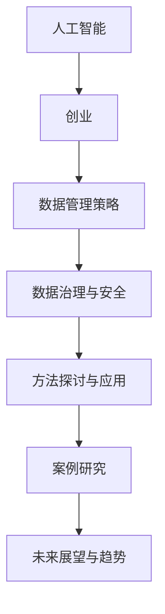

                 

### 《人工智能创业数据管理的策略与方法探讨》

在当今这个数据驱动的时代，人工智能（AI）技术在创业领域中的应用已经成为企业取得成功的关键因素。数据管理作为AI应用的基础，对于创业公司尤为重要。本文将围绕人工智能创业中的数据管理策略与方法进行探讨，旨在为创业者提供实际可行的数据管理指南。以下是本文的主要内容目录：

### 《人工智能创业数据管理的策略与方法探讨》目录大纲

#### 第一部分：人工智能与创业背景

1. **人工智能概述**
    - **1.1 人工智能的定义与历史**
    - **1.2 人工智能在不同行业的应用**
    - **1.3 创业与人工智能的交汇**

2. **创业环境与数据管理**
    - **2.1 创业的基本概念**
    - **2.2 数据管理的重要性**
    - **2.3 创业中数据管理的挑战**

#### 第二部分：数据管理策略

3. **数据管理基础**
    - **3.1 数据管理的核心概念**
    - **3.2 数据质量管理**
    - **3.3 数据仓库与数据湖**

4. **数据安全与隐私**
    - **4.1 数据安全的重要性**
    - **4.2 数据隐私保护**
    - **4.3 数据合规与法规**

5. **数据治理与策略制定**
    - **5.1 数据治理的概念**
    - **5.2 数据治理框架**
    - **5.3 数据策略制定**

#### 第三部分：方法探讨与应用

6. **人工智能与数据管理结合**
    - **6.1 人工智能在数据管理中的应用**
    - **6.2 机器学习与数据管理的融合**
    - **6.3 深度学习在数据管理中的实践**

7. **案例研究**
    - **7.1 创业公司数据管理案例**
    - **7.2 案例分析与启示**
    - **7.3 案例实施步骤与效果**

8. **未来展望与趋势**
    - **8.1 人工智能与数据管理的未来**
    - **8.2 创业中的数据管理趋势**
    - **8.3 创业数据管理的创新方向**

### 附录

- **附录A：数据管理工具与技术选型**
  - **A.1 常见数据管理工具介绍**
  - **A.2 数据库与数据存储技术**
  - **A.3 数据清洗与数据预处理技术**

- **附录B：参考文献**
  - **B.1 人工智能领域相关书籍**
  - **B.2 数据管理领域相关书籍**
  - **B.3 创业与管理相关书籍**

#### 核心概念与联系

为了更好地理解文章内容，我们可以通过Mermaid流程图来展示核心概念与联系：

接下来，我们将逐步深入探讨这些核心概念，分析数据管理策略，探讨AI与数据管理的结合，以及通过实际案例来展示数据管理的实践和应用。

### 人工智能概述

人工智能（AI）作为计算机科学的一个分支，旨在使机器能够执行通常需要人类智能才能完成的任务。AI的发展经历了几个重要的阶段，从最早的逻辑推理和知识表示，到专家系统和规则引擎，再到现代的深度学习和强化学习。

#### 1.1 人工智能的定义与历史

人工智能的定义可以从不同的角度进行理解。最广泛接受的定义是，人工智能是指计算机系统执行人类智能任务的特性，包括学习、推理、问题解决、感知、理解和自然语言处理等。根据美国人工智能协会（AAAI）的定义，人工智能是指“开发用于模拟、扩展和扩展人类智能的理论、算法和技术”。

人工智能的发展历史可以追溯到20世纪50年代。最初，人工智能的尝试主要集中在符号主义方法，这种方法通过建立规则和逻辑推理来模拟人类的思维过程。这个时期的代表性工作是1956年达特茅斯会议，它标志着人工智能作为一门独立学科的诞生。然而，早期的符号主义方法在处理复杂问题时遇到了局限性，导致“人工智能寒冬”的到来。

随着计算能力的提升和大数据技术的发展，机器学习成为人工智能的核心技术。20世纪80年代，专家系统在医疗、金融等领域取得了显著的成果。然而，专家系统的局限性使得研究者开始转向基于数据的机器学习方法。1997年，IBM的深蓝（Deep Blue）在象棋比赛中击败了世界冠军加里·卡斯帕罗夫，标志着人工智能在特定领域达到新的高度。

进入21世纪，深度学习的出现极大地推动了人工智能的发展。深度学习通过多层神经网络来模拟人脑的神经网络结构，能够自动提取特征并进行复杂模式识别。2012年，AlexNet在ImageNet竞赛中取得了突破性的成绩，深度学习在计算机视觉领域得到广泛应用。近年来，随着深度学习在语音识别、自然语言处理等领域的突破，人工智能技术正逐步改变我们的生活和工作方式。

#### 1.2 人工智能在不同行业的应用

人工智能在各个行业中的应用正在不断扩展，改变了传统行业的运作模式，提升了效率和创新能力。以下是人工智能在几个关键行业中的应用概述：

1. **医疗健康**：人工智能在医疗领域的应用包括辅助诊断、个性化治疗、药物研发和公共卫生管理。例如，通过分析医疗影像，人工智能可以帮助医生更准确地诊断疾病；在药物研发中，人工智能可以加速新药发现过程，提高成功率。

2. **金融服务**：人工智能在金融服务中的应用涵盖了风险评估、欺诈检测、智能投顾和自动化交易等方面。通过大数据分析和机器学习算法，金融机构能够更精准地评估风险，提高交易效率和客户满意度。

3. **制造业**：人工智能在制造业中的应用主要体现在生产优化、设备维护、供应链管理和质量检测等方面。通过预测性维护，人工智能可以帮助企业减少设备故障，提高生产效率；在供应链管理中，人工智能可以优化库存和物流，降低运营成本。

4. **零售业**：人工智能在零售业中的应用包括个性化推荐、智能客服和门店管理。通过分析消费者行为数据，人工智能可以提供个性化的购物体验，提高销售额；智能客服系统可以24小时在线回答客户问题，提升客户满意度。

5. **交通物流**：人工智能在交通物流中的应用包括智能交通管理、自动驾驶车辆和物流优化。智能交通系统可以通过实时数据分析，优化交通流量，减少拥堵；自动驾驶技术则有望改变未来交通模式，提高交通安全和效率。

6. **教育**：人工智能在教育中的应用包括在线学习平台、个性化教学和智能评估。在线学习平台通过推荐系统，可以根据学生的兴趣和学习进度提供个性化的课程内容；个性化教学系统可以根据学生的学习情况，调整教学策略，提高学习效果。

#### 1.3 创业与人工智能的交汇

创业与人工智能的交汇为创业者提供了前所未有的机遇。随着AI技术的不断进步，创业者可以利用人工智能来优化业务流程、提高竞争力、开辟新的市场。以下是人工智能在创业中的几个关键应用：

1. **产品开发**：人工智能可以帮助创业者快速开发智能产品。通过机器学习算法，创业公司可以构建具有自主学习和优化能力的系统，提高产品的智能化水平。例如，智能健康监测设备可以通过AI算法实时分析用户数据，提供个性化的健康建议。

2. **数据分析**：人工智能在数据分析方面的应用可以帮助创业公司更好地理解市场趋势和用户行为。通过大数据分析和机器学习算法，创业公司可以识别潜在客户，优化营销策略，提高市场占有率。

3. **智能客服**：智能客服系统可以通过自然语言处理和机器学习技术，提供24小时在线客户服务。这对于初创公司尤为重要，因为有限的客户服务资源可以通过智能客服得到有效补充，提高客户满意度。

4. **风险评估与合规**：人工智能可以帮助创业公司在金融和合规领域降低风险。通过机器学习算法，创业公司可以识别异常交易，防范欺诈行为，确保业务合规。

5. **资源优化**：人工智能可以帮助创业公司优化资源分配和运营管理。通过预测性维护和自动化流程，创业公司可以减少设备故障和运营成本，提高生产效率。

6. **人才招聘**：人工智能在人才招聘中的应用包括简历筛选和面试评估。通过自然语言处理和机器学习算法，AI系统可以自动筛选合适的候选人，提高招聘效率。

总的来说，人工智能为创业提供了强大的工具和资源，帮助创业者在激烈的市场竞争中脱颖而出。通过合理运用AI技术，创业公司可以加速产品迭代，提高市场响应速度，创造更大的商业价值。

### 创业环境与数据管理

创业环境是一个充满不确定性和变化的过程，这一特点决定了数据管理在创业中的重要性。有效的数据管理不仅能够帮助创业公司更好地理解市场趋势、用户需求，还能优化业务流程，提高竞争力。

#### 2.1 创业的基本概念

创业是指创业者通过创新和创业活动来创建新企业，实现商业价值和社会价值的过程。创业涉及多个方面，包括市场研究、产品设计、团队组建、资金筹集、业务运营等。创业者通常需要面对资源有限、竞争激烈、市场变化快速等挑战。

在创业过程中，数据管理的重要性体现在以下几个方面：

1. **市场研究**：数据管理可以帮助创业者收集和分析市场数据，了解市场需求和竞争状况，从而制定更有效的市场策略。
   
2. **产品设计**：数据管理能够支持产品设计过程中的用户研究和反馈收集，通过分析用户数据，优化产品功能和用户体验。

3. **团队组建**：数据管理可以帮助创业者评估团队技能和业绩，优化人力资源配置，提高团队协作效率。

4. **资金筹集**：数据管理能够提供财务和运营数据，帮助创业者向投资者展示企业的潜力和增长前景，提高融资成功率。

5. **业务运营**：数据管理有助于创业者实时监控业务运营状况，通过数据分析和预测，优化资源配置，提高运营效率。

#### 2.2 数据管理的重要性

数据管理是指对数据进行有效的收集、存储、处理、分析和保护的过程。在创业环境中，数据管理的重要性体现在以下几个方面：

1. **决策支持**：创业过程中，数据是做出有效决策的重要依据。通过数据管理，创业者可以获取准确、全面的数据，支持业务决策，降低决策风险。

2. **市场洞察**：数据管理能够帮助创业公司了解市场需求和用户行为，发现潜在商机，制定有针对性的市场策略。

3. **产品优化**：通过数据管理，创业者可以收集用户反馈和产品使用数据，分析用户需求和痛点，优化产品功能，提高用户满意度。

4. **运营效率**：数据管理有助于创业者实时监控业务运营状况，通过数据分析和预测，优化业务流程和资源配置，提高运营效率。

5. **风险管理**：数据管理可以帮助创业者识别和防范风险，如数据泄露、业务中断等，确保企业安全运营。

6. **合规性**：在创业过程中，数据管理需要遵守相关法律法规，确保企业的业务合规，避免法律风险。

#### 2.3 创业中数据管理的挑战

尽管数据管理对创业公司至关重要，但在实际操作中，创业者常常面临一系列数据管理挑战：

1. **数据质量**：创业初期，数据来源多样化且不规范，导致数据质量参差不齐，需要投入大量时间和资源进行数据清洗和预处理。

2. **数据隐私**：在收集和处理用户数据时，创业者需要确保用户隐私得到保护，避免数据泄露和法律纠纷。

3. **数据安全**：数据安全是创业公司面临的重大挑战，尤其是涉及敏感信息和重要数据时，需要采取有效的安全措施，防止数据泄露和篡改。

4. **数据分析能力**：创业公司通常缺乏专业的数据分析团队和技术，需要借助外部资源或内部培养，提升数据分析能力。

5. **数据整合**：创业公司可能使用多种数据存储和处理工具，如何有效地整合和管理这些数据是一个挑战。

6. **资源限制**：创业公司通常资源有限，数据管理需要投入人力、时间和资金，这对初创企业是一个考验。

综上所述，数据管理在创业环境中扮演着至关重要的角色。创业者需要认识到数据管理的重要性，并积极应对数据管理中的挑战，通过有效的数据管理策略，为创业成功奠定坚实基础。

### 数据管理基础

数据管理是确保数据在整个生命周期中保持准确、可用、完整和安全的过程。为了实现这一目标，数据管理涵盖了一系列核心概念和关键策略。以下是数据管理的一些基本概念和策略的详细讨论。

#### 3.1 数据管理的核心概念

1. **数据质量**：数据质量是指数据的准确性、完整性、一致性、及时性和可靠性。高质量的数据是数据管理的基础，对于做出准确决策至关重要。数据质量通常通过以下指标来评估：

   - **准确性**：数据是否真实反映了实际情况。
   - **完整性**：数据是否完整，没有丢失或遗漏。
   - **一致性**：数据在不同系统和来源之间是否保持一致。
   - **及时性**：数据是否及时更新，能够反映最新的信息。
   - **可靠性**：数据是否可靠，能够支持决策和业务操作。

   为了确保数据质量，创业者可以采取以下措施：

   - **数据清洗**：定期检查和清理数据，去除重复记录、纠正错误、填补缺失值。
   - **数据标准化**：统一数据格式，确保不同来源的数据具有一致性。
   - **数据验证**：在数据输入时进行验证，确保数据的准确性。

2. **数据治理**：数据治理是指制定和执行一系列政策、程序和标准，确保数据在整个生命周期中得以有效管理。数据治理的目的是确保数据质量、合规性和可用性。数据治理包括以下几个关键要素：

   - **数据策略**：明确企业的数据目标和愿景，制定数据管理政策和标准。
   - **数据架构**：设计数据架构，定义数据模型、数据流程和数据存储。
   - **数据安全**：确保数据安全，防止数据泄露、篡改和未授权访问。
   - **数据合规性**：遵守相关法律法规和行业标准，确保数据的合法性和合规性。
   - **数据质量**：确保数据质量，支持数据驱动的决策和业务运营。

3. **数据仓库**：数据仓库是一个集中存储和管理企业数据的系统，用于支持数据分析、报告和决策制定。数据仓库通常包含多个数据源，如关系数据库、文件系统和外部数据源，通过ETL（提取、转换、加载）过程将数据整合到数据仓库中。数据仓库的特点包括：

   - **数据集成**：将来自多个来源的数据整合到一个统一的环境中。
   - **数据一致性**：确保数据在不同系统和应用中的一致性。
   - **数据历史**：存储数据的变更历史，支持数据分析中的时间序列分析。
   - **数据查询优化**：优化查询性能，支持复杂的数据分析操作。

4. **数据湖**：数据湖是一种数据存储架构，用于存储大量的非结构化和半结构化数据。数据湖与数据仓库的主要区别在于，数据湖不进行预处理，直接存储原始数据，允许在需要时进行实时分析和处理。数据湖的特点包括：

   - **灵活性**：支持多种数据类型和来源，无需预先定义数据结构。
   - **可扩展性**：能够处理大规模数据，支持数据量的快速增长。
   - **分析性**：支持实时分析和机器学习，提供高级数据处理能力。

5. **数据分类**：数据分类是指根据数据的重要性和敏感度对数据进行分类，以便采取相应的数据管理措施。常见的数据分类包括：

   - **公共数据**：公开可用的数据，无需特殊保护。
   - **内部数据**：仅供内部使用，需要一定程度的保护。
   - **敏感数据**：包含个人隐私、财务信息等敏感数据，需要严格保护。

6. **数据备份与恢复**：数据备份是将数据复制到另一个存储介质上，以防止数据丢失或损坏。数据恢复是在数据丢失或损坏后，将备份的数据恢复到原始位置。有效的数据备份和恢复策略包括：

   - **定期备份**：定期进行数据备份，确保数据的安全性。
   - **远程备份**：将数据备份到远程服务器或云存储，提高数据的安全性。
   - **恢复测试**：定期测试数据恢复过程，确保在需要时能够成功恢复数据。

#### 3.2 数据质量管理

数据质量管理是确保数据在整个生命周期中保持高质量的过程。数据质量管理包括以下几个关键步骤：

1. **数据验证**：在数据输入时进行验证，确保数据的准确性、完整性和一致性。

2. **数据清洗**：定期检查和清理数据，去除重复记录、纠正错误、填补缺失值。

3. **数据标准化**：统一数据格式，确保不同来源的数据具有一致性。

4. **数据监控**：实时监控数据质量，发现和解决数据质量问题。

5. **数据治理**：制定数据管理政策和标准，确保数据质量。

6. **用户反馈**：收集用户对数据的反馈，不断改进数据质量。

#### 3.3 数据仓库与数据湖

数据仓库和数据湖是两种常见的数据存储架构，各自适用于不同的业务需求。以下是数据仓库和数据湖的对比：

1. **数据仓库**：

   - **优点**：
     - **集成性**：能够整合来自多个数据源的数据，提供统一的数据视图。
     - **一致性**：通过ETL过程对数据进行预处理，确保数据的一致性和准确性。
     - **查询优化**：优化查询性能，支持复杂的数据分析操作。

   - **缺点**：
     - **灵活性有限**：数据仓库通常需要对数据进行预先定义的结构化处理，限制了数据的灵活性。
     - **扩展性受限**：数据仓库的扩展性可能受到硬件资源和数据存储方式的限制。

   - **适用场景**：适合需要大量结构化数据分析和报告的场景，如企业绩效分析、客户关系管理、财务报表等。

2. **数据湖**：

   - **优点**：
     - **灵活性**：能够存储多种类型的数据，包括非结构化和半结构化数据，无需预先定义数据结构。
     - **可扩展性**：支持大规模数据的存储和处理，能够轻松扩展。
     - **分析性**：支持实时分析和机器学习，提供高级数据处理能力。

   - **缺点**：
     - **数据一致性**：由于直接存储原始数据，数据一致性可能较低。
     - **复杂性**：需要对数据进行额外的预处理和整合，增加了复杂性。

   - **适用场景**：适合需要大规模数据处理和实时分析的场景，如大数据分析、机器学习应用、物联网数据管理等。

通过理解数据管理的核心概念和策略，创业公司可以更好地管理和利用数据，提高业务效率和竞争力。在接下来的章节中，我们将进一步探讨数据安全与隐私保护、数据治理与策略制定，以及人工智能与数据管理的结合，帮助创业者构建高效的数据管理框架。

### 数据安全与隐私保护

在当今数据驱动的商业环境中，数据安全和隐私保护已成为企业面临的重要挑战。数据安全涉及防止数据泄露、篡改和未授权访问，而隐私保护则关注如何保护用户个人信息，避免隐私侵犯。以下是关于数据安全与隐私保护的重要概念和策略的详细讨论。

#### 4.1 数据安全的重要性

数据安全是指确保数据在存储、传输和处理过程中不被未授权访问、泄露、篡改或破坏的一系列措施。以下数据安全的重要性体现在以下几个方面：

1. **保护企业利益**：数据是企业的核心资产，数据泄露可能导致经济损失、声誉受损和业务中断。确保数据安全是保护企业利益的基本要求。

2. **合规性**：在全球范围内，许多国家和地区都制定了相关的数据保护法规，如欧盟的通用数据保护条例（GDPR）和美国的加州消费者隐私法案（CCPA）。企业需要遵守这些法规，避免法律风险和罚款。

3. **维护用户信任**：用户对企业的信任建立在对其个人信息的保护基础上。数据安全能够增强用户对企业的信任，提高用户忠诚度和满意度。

4. **防止欺诈和攻击**：数据安全措施能够有效防范网络攻击、数据泄露和欺诈行为，确保企业的业务运营稳定和安全。

5. **支持创新**：在数据安全的环境下，企业可以更放心地开展数据分析和人工智能应用，推动创新和发展。

#### 4.2 数据隐私保护

数据隐私保护是指确保用户个人信息不被未经授权的第三方访问和使用的一系列措施。以下关于数据隐私保护的重要概念包括：

1. **隐私权**：隐私权是个人信息主体（用户）对其个人信息所享有的控制权和隐私利益。隐私权是基本人权之一，各国法律都有相关保护规定。

2. **数据匿名化**：数据匿名化是通过去除或模糊化个人识别信息，使数据无法直接识别特定个人，从而保护用户隐私。

3. **隐私设计**：隐私设计是一种系统性的方法，通过在系统的设计阶段集成隐私保护措施，确保数据隐私从一开始就得到保护。

4. **隐私影响评估**：隐私影响评估（PIA）是一种评估新系统、服务或项目对用户隐私影响的方法，旨在提前识别和解决潜在隐私问题。

5. **隐私保护法规**：全球各国都制定了相关隐私保护法规，如欧盟的GDPR、美国的CCPA等。企业需要遵守这些法规，采取相应的隐私保护措施。

#### 4.3 数据合规与法规

数据合规是指企业在数据处理和存储过程中遵守相关法律法规和行业标准。以下关于数据合规的重要策略包括：

1. **法律法规遵循**：企业需要熟悉并遵守所在国家和地区的相关数据保护法规，如GDPR、CCPA等。

2. **合规性审计**：定期进行合规性审计，确保企业的数据处理和存储符合法规要求。

3. **数据保护政策**：制定并实施数据保护政策，明确数据收集、处理、存储和销毁的具体规定。

4. **员工培训**：对员工进行数据安全和隐私保护的培训，提高员工的法律意识和操作规范。

5. **第三方审查**：与第三方机构合作，进行数据安全和隐私保护的审查和评估。

#### 4.4 数据安全与隐私保护的最佳实践

为了确保数据安全和隐私保护，企业可以采取以下最佳实践：

1. **数据加密**：对敏感数据进行加密，确保数据在传输和存储过程中不被未授权访问。

2. **访问控制**：实施严格的访问控制措施，确保只有授权用户才能访问敏感数据。

3. **多因素认证**：采用多因素认证（MFA）技术，增加用户访问系统的安全性。

4. **网络隔离**：将关键系统和数据存储在隔离的网络中，防止外部攻击和内部泄露。

5. **数据备份与恢复**：定期进行数据备份，确保在数据丢失或损坏时能够快速恢复。

6. **隐私设计原则**：在设计系统和流程时，遵循隐私设计原则，如最小化数据收集、数据最小化处理等。

7. **用户透明度**：向用户透明地说明数据收集和使用方式，获取用户的明确同意。

8. **用户权利保护**：确保用户能够访问、更正和删除其个人信息，并提供便捷的投诉渠道。

综上所述，数据安全和隐私保护是创业公司必须重视的重要领域。通过采取有效的数据安全措施和隐私保护策略，企业可以保护其核心资产，维护用户信任，确保合规运营，并在激烈的市场竞争中脱颖而出。

### 数据治理与策略制定

数据治理是确保数据在整个生命周期中保持高质量、合规和安全的关键过程。有效的数据治理不仅能够提高数据的价值，还能为企业的战略决策提供支持。以下是数据治理的概念、框架和策略制定的详细讨论。

#### 5.1 数据治理的概念

数据治理是指制定和实施一系列政策、程序和标准，以确保数据的质量、可用性、完整性和安全性。数据治理的目标是通过系统化的管理和控制，确保数据在整个生命周期中能够支持企业的业务需求。

1. **数据治理的定义**：数据治理是指“通过制定和实施战略、标准和流程来管理数据资产，确保数据的价值、质量和合规性，同时支持企业的业务目标和需求”。

2. **数据治理的核心要素**：
   - **数据策略**：明确企业的数据目标和愿景，制定数据管理政策和标准。
   - **数据架构**：设计数据架构，定义数据模型、数据流程和数据存储。
   - **数据安全**：确保数据安全，防止数据泄露、篡改和未授权访问。
   - **数据质量**：确保数据质量，支持数据驱动的决策和业务运营。
   - **数据合规性**：遵守相关法律法规和行业标准，确保数据的合法性和合规性。
   - **数据管理**：制定数据管理政策和程序，规范数据收集、处理、存储和销毁。

3. **数据治理的重要性**：数据治理能够确保数据的有效管理，提高数据质量，降低数据风险，支持企业的战略决策和业务运营。以下数据治理的重要性体现在以下几个方面：
   - **提高数据价值**：通过数据治理，企业可以更好地管理和利用数据，提高数据的价值。
   - **降低数据风险**：数据治理能够降低数据泄露、数据质量问题和合规风险。
   - **支持决策**：高质量的数据是做出有效决策的重要依据，数据治理能够提供准确、可靠的数据支持。
   - **增强用户信任**：透明、合规的数据治理能够增强用户对企业的信任，提高用户满意度。

#### 5.2 数据治理框架

数据治理框架是实施数据治理策略的工具和方法。一个完整的数据治理框架通常包括以下几个关键组件：

1. **数据治理组织**：数据治理组织是负责制定和实施数据治理策略的机构。数据治理组织通常包括以下几个角色：
   - **数据治理委员会**：负责制定数据治理政策和战略，监督数据治理的实施。
   - **数据质量委员会**：负责确保数据质量，制定和执行数据质量管理策略。
   - **数据安全委员会**：负责确保数据安全，制定和执行数据安全策略。
   - **数据合规委员会**：负责确保数据符合相关法律法规和行业标准，制定和执行合规策略。

2. **数据治理流程**：数据治理流程是实施数据治理策略的具体步骤和方法。常见的数据治理流程包括：
   - **数据策略制定**：明确企业的数据目标和愿景，制定数据管理政策和标准。
   - **数据架构设计**：设计数据架构，定义数据模型、数据流程和数据存储。
   - **数据质量管理**：制定和执行数据质量管理策略，确保数据质量。
   - **数据安全与合规**：制定和执行数据安全与合规策略，确保数据安全和合规性。
   - **数据管理**：制定数据管理政策和程序，规范数据收集、处理、存储和销毁。

3. **数据治理技术**：数据治理技术是指用于支持数据治理流程的工具和技术。常见的数据治理技术包括：
   - **数据质量工具**：用于检测、清理和改进数据质量的工具。
   - **数据安全工具**：用于确保数据安全和合规性的工具，如加密、访问控制、审计等。
   - **数据管理平台**：用于管理和监控数据资产的平台，提供数据集成、数据仓库、数据湖等功能。

#### 5.3 数据策略制定

数据策略是企业在数据管理方面的一系列目标和计划。制定有效的数据策略需要考虑以下几个方面：

1. **数据愿景**：明确企业对数据的愿景和期望，如提高数据质量、支持业务决策、增强用户体验等。

2. **数据目标**：设定具体的数据管理目标，如实现数据标准化、提高数据准确性、确保数据安全等。

3. **数据治理框架**：制定数据治理框架，明确数据治理的组织、流程和技术，确保数据管理的系统性和规范性。

4. **数据使用政策**：制定数据使用政策，规范数据的收集、使用、共享和销毁，确保数据合规和用户隐私保护。

5. **数据管理流程**：制定数据管理流程，确保数据的收集、存储、处理、分析和销毁等环节的规范操作。

6. **数据治理工具**：选择合适的数据治理工具，支持数据治理流程的实施和数据管理的自动化。

7. **数据培训与文化建设**：对员工进行数据管理和治理的培训，提高数据意识和操作规范，建立数据驱动的企业文化。

通过制定有效的数据策略，企业可以确保数据在整个生命周期中保持高质量、合规和安全，为企业的战略决策和业务运营提供有力支持。在接下来的章节中，我们将探讨人工智能与数据管理的结合，以及通过实际案例来展示数据管理的实践和应用。

### 人工智能与数据管理结合

随着人工智能（AI）技术的快速发展，AI已经在数据管理领域得到了广泛应用。通过将AI技术融入数据管理，创业公司能够显著提高数据处理的效率和质量，从而更好地支持业务决策和运营优化。以下是人工智能在数据管理中的应用、机器学习与数据管理的融合、以及深度学习在数据管理中的实践的详细探讨。

#### 6.1 人工智能在数据管理中的应用

人工智能在数据管理中的应用主要包括数据清洗、数据分析和数据可视化等方面。

1. **数据清洗**：数据清洗是数据管理的重要环节，目的是去除数据中的错误、重复和缺失值。人工智能技术，特别是机器学习算法，可以自动识别和纠正数据中的问题。例如，K-Means聚类算法可以用于识别并处理重复数据，而缺失值填补算法可以通过统计分析方法或机器学习模型来预测和填补缺失值。

2. **数据分析**：人工智能技术可以大大简化数据分析过程，提高分析的准确性和效率。通过机器学习算法，创业公司可以对大量数据进行分析，发现数据中的潜在模式和趋势。例如，使用回归分析可以预测销售数据，而聚类分析可以用于用户行为分析，帮助企业制定更有效的营销策略。

3. **数据可视化**：数据可视化是将数据以图形化的方式呈现，帮助用户更直观地理解和分析数据。人工智能技术可以自动生成数据可视化报告，使用户能够快速了解数据的含义和趋势。例如，通过使用自动数据可视化工具，创业者可以轻松创建交互式的图表和仪表板，实时监控业务运营状况。

#### 6.2 机器学习与数据管理的融合

机器学习是人工智能的核心技术之一，它与数据管理的融合为创业公司带来了新的机遇和挑战。

1. **数据预处理**：在机器学习应用中，数据预处理是至关重要的一步。通过数据预处理，可以去除无关特征、处理缺失值和异常值，提高模型的质量和效率。例如，特征选择算法可以帮助选择对模型性能有显著影响的关键特征，减少数据的冗余。

2. **模型训练与优化**：机器学习模型需要大量数据来训练，而数据质量直接影响模型的性能。创业公司可以利用AI技术来自动化数据预处理和模型训练过程，提高效率和准确性。例如，使用交叉验证方法来评估和优化模型的性能，通过调整模型参数来提高预测的准确性。

3. **实时数据流处理**：在实时数据处理场景中，机器学习技术可以用于实时分析和决策。例如，通过使用流处理技术，创业公司可以实时分析用户行为数据，快速响应市场变化，优化业务策略。

#### 6.3 深度学习在数据管理中的实践

深度学习是机器学习的一个分支，通过多层神经网络结构模拟人脑的神经网络，能够处理复杂的模式识别和预测任务。以下是在数据管理中应用深度学习的一些具体实践：

1. **图像识别**：在数据管理中，图像识别是一个重要的应用领域。通过深度学习算法，创业公司可以对大量图像数据进行分类和识别，例如，用于产品质检、安全监控等场景。

2. **自然语言处理**：自然语言处理（NLP）是深度学习在数据管理中的重要应用。通过NLP技术，创业公司可以对大量文本数据进行处理和分析，例如，用于客户服务、市场研究等场景。例如，使用深度学习模型可以自动生成客户评论的摘要，提高数据分析的效率。

3. **预测性维护**：在制造业和物流等领域，深度学习可以用于预测性维护，通过分析设备和系统的运行数据，预测潜在的故障和问题。例如，使用深度学习模型可以预测设备的维修时间，优化维护计划，减少停机时间。

4. **异常检测**：深度学习算法在异常检测方面也具有强大的能力。通过分析历史数据，创业公司可以使用深度学习模型来识别异常行为，例如，用于网络安全、金融欺诈检测等场景。例如，通过分析网络流量数据，深度学习模型可以识别出潜在的攻击行为，提高安全防护能力。

总之，人工智能与数据管理的结合为创业公司提供了强大的工具和资源，通过有效利用AI技术，创业公司可以大幅提升数据处理的效率和质量，为业务决策和运营优化提供有力支持。在接下来的章节中，我们将通过实际案例来展示数据管理的具体应用和实践效果。

### 创业公司数据管理案例

为了更好地理解数据管理在创业公司中的应用，以下将介绍一家创业公司在数据管理方面所做的工作，以及其具体实施步骤和所取得的效果。

#### 7.1 创业公司数据管理案例

**公司简介**：XYZ科技公司是一家专注于开发智能健康监测设备的创业公司。其主要产品是一款能够实时监测用户健康数据的可穿戴设备。随着用户数量的增加，公司意识到数据管理在产品开发和业务运营中的重要性。

**数据管理目标**：XYZ科技公司的数据管理目标包括：
- 提高数据质量，确保数据的准确性和完整性。
- 加强数据安全性，保护用户隐私和公司核心数据。
- 提供有效的数据分析和报告工具，支持业务决策。

#### 7.2 案例分析与启示

**1. 数据质量管理**：

**分析**：在项目初期，XYZ科技公司面临数据质量不佳的问题，数据中的缺失值和错误值较多，导致数据分析结果不准确。

**措施**：公司采取了以下措施来提高数据质量：
- **数据清洗**：使用机器学习算法对用户健康数据进行清洗，去除重复记录和错误值，填补缺失值。
- **数据标准化**：统一数据格式，确保不同来源的数据具有一致性。
- **数据验证**：在数据输入时进行验证，确保数据的准确性。

**效果**：通过这些措施，XYZ科技公司显著提高了数据质量，数据分析结果的准确性和可靠性得到了提升。

**2. 数据安全与隐私保护**：

**分析**：随着用户数据的增加，数据安全成为公司面临的重要挑战。如何保护用户隐私，防止数据泄露是公司必须解决的问题。

**措施**：公司采取了以下措施来加强数据安全与隐私保护：
- **数据加密**：对用户数据进行加密，确保数据在传输和存储过程中不被未授权访问。
- **访问控制**：实施严格的访问控制措施，确保只有授权用户才能访问敏感数据。
- **多因素认证**：采用多因素认证技术，增加用户访问系统的安全性。
- **隐私设计原则**：在设计系统和流程时，遵循隐私设计原则，如最小化数据收集、数据最小化处理等。

**效果**：通过这些措施，XYZ科技公司有效保护了用户隐私，降低了数据泄露的风险，提高了用户对公司的信任度。

**3. 数据分析与报告**：

**分析**：为了支持业务决策，XYZ科技公司需要能够快速进行数据分析和生成报告。

**措施**：公司采取了以下措施来提升数据分析与报告能力：
- **数据仓库**：建立数据仓库，整合来自多个数据源的数据，提供统一的数据视图。
- **数据可视化工具**：使用自动数据可视化工具，生成交互式的图表和仪表板，实时监控业务运营状况。
- **机器学习模型**：使用机器学习模型进行用户行为分析和预测，优化产品功能和用户体验。

**效果**：通过这些措施，XYZ科技公司能够快速生成详细的数据分析报告，支持业务决策和运营优化。

#### 7.3 案例实施步骤与效果

**1. 实施步骤**：

（1）**需求分析**：确定公司数据管理的具体需求和目标，包括数据质量、安全性和分析能力。

（2）**数据架构设计**：设计数据架构，确定数据存储、处理和分析的流程。

（3）**数据清洗与预处理**：使用机器学习算法对用户健康数据进行清洗和预处理，确保数据的准确性和完整性。

（4）**数据仓库建设**：建立数据仓库，整合来自多个数据源的数据，提供统一的数据视图。

（5）**数据安全措施**：实施数据加密、访问控制和多因素认证等安全措施，保护用户隐私和数据安全。

（6）**数据可视化与报告**：使用数据可视化工具生成交互式的图表和仪表板，实时监控业务运营状况。

（7）**机器学习应用**：使用机器学习模型进行用户行为分析和预测，优化产品功能和用户体验。

**2. 效果评估**：

（1）**数据质量**：通过数据清洗和预处理，XYZ科技公司提高了数据的准确性、完整性和一致性，数据分析结果更加可靠。

（2）**数据安全**：通过数据加密和访问控制等安全措施，XYZ科技公司有效保护了用户隐私和数据安全，降低了数据泄露风险。

（3）**数据分析能力**：通过数据仓库和数据可视化工具，XYZ科技公司能够快速生成详细的数据分析报告，支持业务决策和运营优化。

（4）**用户体验**：通过机器学习模型，XYZ科技公司能够更准确地预测用户需求，优化产品功能和用户体验，提高了用户满意度。

总之，XYZ科技公司的数据管理案例展示了数据管理在创业公司中的重要性。通过有效的数据管理策略和实践，公司不仅提高了数据质量、安全性和分析能力，还为业务决策和运营优化提供了有力支持。这一案例为其他创业公司提供了宝贵的经验和借鉴。

### 未来展望与趋势

随着人工智能（AI）和数据管理技术的不断发展，未来创业中的数据管理将呈现出一系列新的趋势和方向。以下是关于人工智能与数据管理未来发展趋势的讨论，以及创业公司在数据管理方面的创新方向。

#### 8.1 人工智能与数据管理的未来

1. **人工智能技术的进一步发展**：未来，人工智能技术将在算法优化、计算能力和应用场景方面实现更大突破。特别是深度学习和强化学习等技术的进步，将为数据管理带来更多可能性。

2. **数据量的爆炸性增长**：随着物联网、5G和大数据技术的普及，数据量将持续增长。创业公司需要应对海量数据的存储、处理和分析挑战，实现数据的高效管理和利用。

3. **实时数据处理与分析**：未来，实时数据处理与分析将成为数据管理的关键方向。通过利用实时数据流处理技术，创业公司能够快速响应市场变化，优化业务决策。

4. **隐私保护与数据伦理**：随着数据隐私问题的日益突出，未来数据管理将更加注重隐私保护与数据伦理。创业公司需要遵守相关法规，采取有效的数据保护措施，确保用户隐私和数据安全。

5. **跨领域应用**：人工智能和数据管理技术将在更多领域得到应用，如医疗、金融、能源、教育等。创业公司可以通过跨领域的数据整合和分析，发现新的商业机会，推动业务创新。

#### 8.2 创业中的数据管理趋势

1. **数据治理的深化**：创业公司将更加注重数据治理的深化，通过制定详细的数据管理政策和流程，确保数据的质量、安全和合规性。

2. **数据驱动决策**：创业公司将更多地依赖数据来驱动决策，通过大数据分析和机器学习算法，从海量数据中提取有价值的信息，支持业务战略和运营优化。

3. **自动化与智能化**：创业公司将通过自动化和智能化手段来简化数据管理流程，提高数据处理效率。例如，利用机器学习算法来自动化数据清洗、数据集成和数据分析。

4. **数据共享与合作**：创业公司将更加开放，通过数据共享和合作，实现数据的价值最大化。例如，通过与合作伙伴共享数据，开展联合分析，推动业务创新。

5. **数据可视化与用户友好**：创业公司将重视数据可视化，通过用户友好的界面，将复杂的数据分析结果以直观的方式展示给业务决策者，支持决策制定。

#### 8.3 创业数据管理的创新方向

1. **个性化数据管理**：创业公司将针对不同用户群体和应用场景，提供个性化的数据管理解决方案。例如，针对不同行业用户的需求，开发定制化的数据分析工具。

2. **数据隐私保护与合规性**：创业公司将投入更多资源来研究和应用数据隐私保护技术，确保在数据共享和合作过程中，用户隐私和数据安全得到充分保护。

3. **数据伦理与责任**：创业公司将加强数据伦理建设，确保数据管理过程中的透明度和责任归属。例如，建立数据伦理委员会，制定数据使用伦理准则。

4. **边缘计算与分布式数据管理**：创业公司将探索边缘计算和分布式数据管理技术，以应对数据量的快速增长和实时处理需求。通过将数据处理和分析任务分布在边缘设备上，降低延迟，提高效率。

5. **可持续数据管理**：创业公司将关注数据管理的可持续发展，通过优化数据存储和处理流程，减少能源消耗和碳排放，实现绿色数据管理。

总之，未来人工智能与数据管理将在创业领域带来更多变革和创新。创业公司需要紧跟技术发展趋势，加强数据管理，挖掘数据价值，为业务发展提供有力支持。

### 附录

#### 附录A：数据管理工具与技术选型

**A.1 常见数据管理工具介绍**

- **Hadoop**：一个分布式数据存储和处理框架，用于处理大规模数据集。主要组件包括HDFS（分布式文件系统）、MapReduce（分布式处理框架）和YARN（资源调度框架）。
- **Spark**：一个快速通用的分布式计算引擎，用于大数据处理和分析。其核心组件包括Spark Core（基础计算引擎）、Spark SQL（SQL查询引擎）、Spark Streaming（实时数据处理）和MLlib（机器学习库）。
- **MySQL**：一个开源的关系数据库管理系统，适用于中小型数据存储和查询需求。其特点包括高性能、可靠性、易用性和灵活性。
- **PostgreSQL**：一个开源的关系数据库管理系统，适用于复杂的数据存储和查询需求。其特点包括扩展性、安全性、稳定性和丰富的功能。
- **MongoDB**：一个开源的文档数据库，适用于存储非结构化和半结构化数据。其特点包括高扩展性、灵活性和易于使用。

**A.2 数据库与数据存储技术**

- **关系数据库**：适用于结构化数据存储和查询，常见的包括MySQL、PostgreSQL等。
- **NoSQL数据库**：适用于非结构化和半结构化数据存储，常见的包括MongoDB、Cassandra等。
- **分布式文件系统**：适用于大规模数据存储和分布式处理，常见的包括HDFS、Ceph等。
- **对象存储**：适用于存储大规模对象数据，常见的包括Amazon S3、Google Cloud Storage等。

**A.3 数据清洗与数据预处理技术**

- **数据清洗工具**：用于清理和清洗数据，常见的包括OpenRefine、DataWrangler等。
- **数据预处理库**：用于数据预处理和特征工程，常见的包括Pandas（Python）、Dataframe（R）等。
- **ETL工具**：用于数据提取、转换和加载，常见的包括Informatica、Talend等。

#### 附录B：参考文献

**B.1 人工智能领域相关书籍**

- Mitchell, T. M. (1997). Machine Learning. McGraw-Hill.
- Russell, S., & Norvig, P. (2016). Artificial Intelligence: A Modern Approach. Prentice Hall.
- Goodfellow, I., Bengio, Y., & Courville, A. (2016). Deep Learning. MIT Press.

**B.2 数据管理领域相关书籍**

- Date, C. J. (2011). Database System Concepts. McGraw-Hill.
- Redman, T. C. (2013). The Data Governance Blueprint: Creating a Data-Driven Organization for Success. Wiley.
- Inmon, W. H. (2005). Building the Data Warehouse. John Wiley & Sons.

**B.3 创业与管理相关书籍**

- Blank, T., & Dorf, R. (2013). The Lean Startup: How Today's Entrepreneurs Use Continuous Innovation to Create Radically Successful Businesses. Random House.
- Collins, J. (2001). Good to Great: Why Some Companies Make the Leap... and Others Don't. HarperCollins.
- Blank, T., &-Ries, D. (2011). The Four Steps to the Epiphany: Successful Strategies for Business Model Innovation. Wiley.

