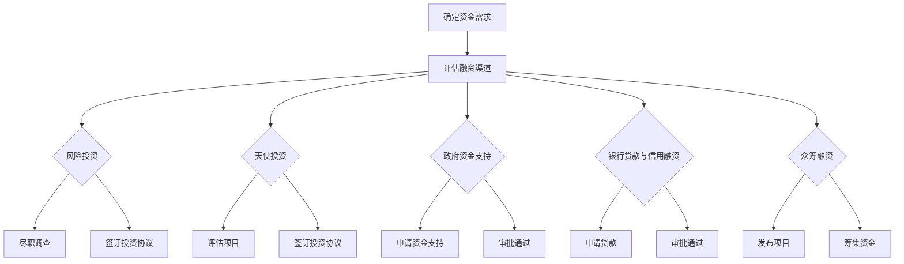

                 

### 人工智能创业：选择融资渠道

> **关键词：** 人工智能、创业、融资渠道、风险投资、天使投资、政府资金支持、众筹融资

> **摘要：** 本文旨在为人工智能创业者提供详尽的融资渠道指南，包括风险投资、天使投资、政府资金支持、银行贷款与信用融资、众筹融资等，帮助创业者合理选择融资方式，实现创业梦想。

### 目录大纲

1. **人工智能行业概述**
   - **第1章：人工智能创业概述**
     - 1.1 人工智能行业发展趋势
     - 1.2 创业者所需人工智能知识储备
     - 1.3 人工智能创业的机遇与挑战

2. **人工智能创业融资渠道**
   - **第2章：融资渠道概述**
     - 2.1 融资渠道种类
     - 2.2 融资渠道选择原则
     - 2.3 融资渠道评估方法
   - **第3章：风险投资**
     - 3.1 风险投资概述
     - 3.2 风险投资流程
     - 3.3 风险投资协议解析
   - **第4章：天使投资**
     - 4.1 天使投资概述
     - 4.2 天使投资人与创业者关系
     - 4.3 天使投资协议解析
   - **第5章：政府资金支持**
     - 5.1 政府资金支持政策
     - 5.2 政府资金支持申请流程
     - 5.3 政府资金支持案例分析
   - **第6章：银行贷款与信用融资**
     - 6.1 银行贷款概述
     - 6.2 信用融资概述
     - 6.3 银行贷款与信用融资比较
   - **第7章：众筹融资**
     - 7.1 众筹融资概述
     - 7.2 众筹融资平台介绍
     - 7.3 众筹融资案例分析

3. **人工智能创业融资策略**
   - **第8章：融资计划制定**
     - 8.1 融资计划概述
     - 8.2 融资计划制定方法
     - 8.3 融资计划案例分析
   - **第9章：融资谈判与合同签订**
     - 9.1 融资谈判概述
     - 9.2 融资谈判策略
     - 9.3 融资合同签订注意事项
   - **第10章：融资后的资金管理**
     - 10.1 资金管理概述
     - 10.2 资金管理策略
     - 10.3 资金管理案例分析

4. **附录**
   - 附录A：融资相关法律法规
   - 附录B：常见融资工具与案例解析
   - 附录C：创业融资常见问题解答

5. **参考文献**

### 人工智能行业概述

#### 第1章：人工智能创业概述

##### 1.1 人工智能行业发展趋势

人工智能（AI）作为当前最具颠覆性的技术之一，正在深刻地改变着各行各业。随着算法、计算能力以及数据的不断进步，人工智能技术正以前所未有的速度发展，逐步渗透到医疗、金融、制造、教育等多个领域。

- **医疗领域：** 人工智能在疾病诊断、药物研发、个性化治疗等方面展现出巨大的潜力。通过深度学习算法，AI系统可以辅助医生进行更准确的诊断，同时，在药物发现过程中，AI可以通过分析海量数据，预测药物与疾病的相互作用，加速新药研发。

- **金融领域：** 人工智能在金融领域的应用越来越广泛，从风险控制到智能投顾，再到自动化交易，AI正在提高金融行业的效率与准确性。例如，AI算法可以分析客户行为数据，提供个性化的投资建议，降低金融机构的运营成本。

- **制造业：** 人工智能在制造业的智能化改造中发挥着关键作用。通过工业机器人和智能控制系统，AI可以提高生产效率，减少资源浪费，实现制造过程的自动化和智能化。

- **教育领域：** 人工智能正在改变教育模式，从智能辅导系统到在线教育平台，AI技术为个性化学习和教育资源优化提供了新的解决方案。例如，AI可以通过分析学生的学习行为，为其提供定制化的学习路径。

##### 1.2 创业者所需人工智能知识储备

对于人工智能创业者来说，掌握一定的技术知识是基础。以下是一些创业者需要具备的核心知识：

- **算法知识：** 熟悉常见的机器学习算法，如线性回归、决策树、支持向量机、神经网络等，理解算法的原理和应用场景。

- **编程技能：** 掌握至少一种编程语言，如Python、Java或C++，能够进行算法实现和数据处理。

- **数据科学：** 理解数据清洗、数据挖掘和数据分析的基本流程，能够使用数据分析工具，如Pandas、NumPy等。

- **领域知识：** 了解目标行业的业务流程、痛点以及潜在需求，有助于开发更具针对性的AI产品。

##### 1.3 人工智能创业的机遇与挑战

人工智能创业既有巨大的机遇，也存在一定的挑战。

- **机遇：**
  - **技术创新：** 人工智能技术不断创新，为创业提供了丰富的创新空间。
  - **市场需求：** 随着人工智能在各领域的应用逐渐深入，市场需求不断增加，为创业者提供了广阔的市场前景。
  - **政策支持：** 多个国家政府对人工智能技术的研发和应用给予了大量政策支持，创业者可以借助这些政策资源。

- **挑战：**
  - **技术风险：** 人工智能技术尚处于快速发展阶段，技术风险和不确定性较大。
  - **数据隐私：** 人工智能依赖大量数据，数据隐私和安全性成为重要挑战。
  - **市场竞争：** 人工智能领域竞争激烈，创业者需要具备强大的技术实力和市场洞察力。

### 人工智能创业融资渠道

#### 第2章：融资渠道概述

##### 2.1 融资渠道种类

对于人工智能创业者来说，了解各种融资渠道的特点和适用性是成功融资的关键。以下是常见的融资渠道：

- **风险投资（VC）：** 风险投资是人工智能创业公司最常见的融资方式之一。风险投资公司通常投资于有高增长潜力的初创企业，提供资金的同时，还会带来资源和经验。

- **天使投资：** 天使投资者通常是个人投资者，他们愿意在初创阶段为企业提供资金，通常以换取股权作为回报。

- **政府资金支持：** 各国政府为鼓励科技创新，提供了一系列资金支持政策，包括研发补贴、税收减免等。

- **银行贷款与信用融资：** 银行贷款和信用融资是传统的融资方式，适用于资金需求量较大的企业。

- **众筹融资：** 众筹融资通过互联网平台，向公众募集资金，通常以股权或产品回报作为回报。

##### 2.2 融资渠道选择原则

选择合适的融资渠道需要考虑以下原则：

- **资金需求：** 根据企业的资金需求量，选择适合的融资渠道。

- **资金用途：** 明确资金用途，选择能够满足资金用途的融资渠道。

- **资金成本：** 考虑融资成本，包括利率、股权稀释等。

- **资金到账时间：** 根据资金到账时间要求，选择适合的融资渠道。

- **股权结构：** 考虑股权结构对企业和创业团队的影响。

##### 2.3 融资渠道评估方法

评估融资渠道的方法包括以下几方面：

- **资金规模：** 分析各种融资渠道提供的资金规模，是否符合企业需求。

- **资金成本：** 对比各种融资渠道的资金成本，选择成本较低的方式。

- **融资周期：** 考虑融资周期对企业和创业团队的影响，选择融资周期较短的方式。

- **政策环境：** 分析政府资金支持政策，选择符合政策要求的方式。

- **投资者背景：** 考虑投资者背景，选择能够为企业带来资源和经验的投资者。

### 风险投资

#### 第3章：风险投资

##### 3.1 风险投资概述

风险投资（Venture Capital，简称VC）是一种向具有高增长潜力的初创企业提供资金的投资方式。风险投资公司通常专注于投资技术、生物科技、清洁能源等创新领域。

- **风险投资的特点：**
  - **高风险、高回报：** 风险投资通常投资于初创企业，这些企业具有高成长性，但也存在较高的风险。成功的企业可能带来巨大的回报，而失败的企业可能损失全部投资。
  - **长期投资：** 风险投资通常持有企业股份多年，为企业提供持续的支持和资源。

- **风险投资的运作模式：**
  - **投资阶段：** 风险投资公司通常投资于初创企业、成长期企业、扩展期企业等不同阶段。
  - **投资决策：** 风险投资公司通过尽职调查、团队评估、市场分析等手段，评估企业的投资价值。
  - **退出机制：** 风险投资公司通过首次公开发行（IPO）、并购等方式实现退出，获取回报。

##### 3.2 风险投资流程

风险投资流程通常包括以下几个步骤：

- **项目筛选：** 风险投资公司通过线上平台、投资人推荐、行业会议等渠道，筛选潜在的创业项目。

- **尽职调查：** 风险投资公司对选定的项目进行详细的尽职调查，包括团队背景、技术可行性、市场前景等。

- **投资决策：** 根据尽职调查的结果，风险投资公司决定是否进行投资，以及投资额度和条件。

- **投资签约：** 双方签订投资协议，明确投资额度、股权比例、投资条款等。

- **投资执行：** 风险投资公司按照协议提供资金，帮助企业完成项目进展。

##### 3.3 风险投资协议解析

风险投资协议是风险投资公司和创业企业之间的重要法律文件，包含以下主要内容：

- **投资额度：** 明确风险投资公司提供的投资金额。

- **股权比例：** 规定风险投资公司持有企业的股权比例。

- **投资条款：** 包括投资周期、退出机制、反稀释条款、优先认购权等。

- **权益保障：** 规定风险投资公司在企业中的权益保障，如投票权、信息权等。

- **违约责任：** 规定违约责任和处理方式。

#### 第4章：天使投资

##### 4.1 天使投资概述

天使投资（Angel Investment）是指个人投资者在初创企业早期阶段提供资金的支持。天使投资者通常是成功的企业家、高级管理人员、退休企业家等。

- **天使投资的特点：**
  - **早期投资：** 天使投资通常在初创企业的种子期或天使轮阶段进行，为企业提供初始资金支持。
  - **股权投资：** 天使投资者通常以换取股权的方式为企业提供资金。
  - **个性化支持：** 天使投资者不仅提供资金，还为企业提供丰富的行业经验和资源，帮助企业成长。

- **天使投资的运作模式：**
  - **项目筛选：** 天使投资者通过个人网络、天使投资俱乐部等渠道，寻找有潜力的创业项目。
  - **尽职调查：** 天使投资者对项目进行初步评估，了解企业的商业模式、团队背景、市场前景等。
  - **投资决策：** 根据尽职调查的结果，天使投资者决定是否进行投资。
  - **投资签约：** 双方签订投资协议，明确投资额度、股权比例、投资条款等。

##### 4.2 天使投资人与创业者关系

天使投资人与创业者之间的关系是相互依存的：

- **投资人角度：** 天使投资者希望企业能够成功，实现投资回报。同时，他们愿意为创业者提供资源和支持，帮助其解决创业过程中遇到的问题。
- **创业者角度：** 创业者需要充分利用天使投资者的资源和经验，加快企业成长。同时，要确保企业的经营方向和策略与投资者的期望相符。

##### 4.3 天使投资协议解析

天使投资协议是天使投资者与创业者之间的重要法律文件，包含以下主要内容：

- **投资额度：** 明确天使投资者提供的投资金额。
- **股权比例：** 规定天使投资者持有企业的股权比例。
- **投资条款：** 包括投资周期、退出机制、反稀释条款、优先认购权等。
- **权益保障：** 规定天使投资者在企业中的权益保障，如投票权、信息权等。
- **违约责任：** 规定违约责任和处理方式。

### 政府资金支持

#### 第5章：政府资金支持

##### 5.1 政府资金支持政策

各国政府为鼓励科技创新，提供了一系列资金支持政策：

- **研发补贴：** 各国政府为鼓励企业进行研发活动，提供研发补贴，减轻企业的研发成本。
- **税收减免：** 政府通过减免企业税费，鼓励企业投资科技创新。
- **股权投资：** 部分政府设立科技创新基金，直接投资于有潜力的科技企业。
- **贷款担保：** 政府为科技创新企业提供贷款担保，降低企业的融资风险。

##### 5.2 政府资金支持申请流程

政府资金支持的申请流程通常包括以下几个步骤：

- **项目立项：** 企业首先需要确定研发项目，明确项目目标、预算和时间表。
- **材料准备：** 根据政府要求，准备包括项目计划书、财务报表、研发报告等在内的申请材料。
- **申请提交：** 将准备好的申请材料提交给相关部门或机构。
- **评审审批：** 相关部门或机构对申请材料进行评审，决定是否批准资金支持。
- **资金拨付：** 审批通过后，政府将资金拨付给企业。

##### 5.3 政府资金支持案例分析

以下是一个政府资金支持案例：

- **案例背景：** 一家初创人工智能企业研发了一款智能医疗诊断系统，希望获得政府资金支持。
- **申请过程：** 企业提交了项目计划书、研发报告、财务报表等材料，经过部门评审，获得了50万元人民币的研发补贴。
- **使用情况：** 企业将补贴资金用于购置研发设备和支付研发人员工资，加速了项目的研发进度。
- **效果评估：** 项目成功研发出智能医疗诊断系统，并在市场上取得了良好的反响，企业获得了进一步的投资。

### 银行贷款与信用融资

#### 第6章：银行贷款与信用融资

##### 6.1 银行贷款概述

银行贷款是企业融资的传统方式，通过银行向企业提供资金支持。银行贷款的特点包括：

- **额度较大：** 银行贷款可以提供较大的资金支持，满足企业的资金需求。
- **期限灵活：** 银行贷款的期限可以根据企业的需求进行灵活调整。
- **利率相对较低：** 银行贷款的利率通常相对较低，对企业负担较轻。

##### 6.2 信用融资概述

信用融资是指企业通过自身的信用记录和财务状况，向金融机构获得贷款或信用支持。信用融资的特点包括：

- **无需抵押：** 信用融资通常无需提供抵押物，对企业资产要求较低。
- **审批速度快：** 信用融资的审批流程相对简单，审批速度快。
- **利率较高：** 信用融资的利率通常较高，对企业负担较重。

##### 6.3 银行贷款与信用融资比较

银行贷款与信用融资各有优缺点，企业在选择时应根据自身情况权衡：

- **优点：**
  - 银行贷款：额度大、期限灵活、利率较低。
  - 信用融资：无需抵押、审批速度快、利率较高。

- **缺点：**
  - 银行贷款：审批流程复杂、对企业资产要求高。
  - 信用融资：对企业信用要求高、利率较高。

### 众筹融资

#### 第7章：众筹融资

##### 7.1 众筹融资概述

众筹融资（Crowdfunding）是通过互联网平台向公众募集资金的一种融资方式。众筹融资的特点包括：

- **公开透明：** 众筹融资通常在互联网平台上进行，整个过程公开透明，投资者可以查看项目进展和资金使用情况。
- **无需抵押：** 众筹融资无需提供抵押物，对企业资产要求较低。
- **资金来源广泛：** 众筹融资可以吸引来自全球的投资者，拓宽企业的资金来源。

##### 7.2 众筹融资平台介绍

目前，市场上存在多种众筹融资平台，以下是一些常见的众筹融资平台：

- **Kickstarter：** Kickstarter是全球最知名的众筹平台之一，主要面向创意产品和早期创业项目。
- **Indiegogo：** Indiegogo也是全球知名的众筹平台，涵盖了各种创意项目和早期创业项目。
- **腾讯众筹：** 腾讯众筹是中国领先的众筹平台，主要面向国内企业和项目。
- **京东众筹：** 京东众筹是京东旗下的众筹平台，主要面向电子产品、智能硬件等创新项目。

##### 7.3 众筹融资案例分析

以下是一个众筹融资案例：

- **案例背景：** 一家初创人工智能企业研发了一款智能健康监测设备，希望通过众筹融资平台筹集资金。
- **众筹过程：** 企业在Kickstarter平台上发布项目，通过展示产品的功能和优势，吸引了大量投资者关注。众筹期间，企业共筹集到50万美元资金。
- **资金用途：** 企业将众筹资金用于生产首批智能健康监测设备，并进行了市场推广。
- **效果评估：** 众筹成功后，企业的智能健康监测设备在市场上取得了良好的销售成绩，企业进一步扩大了生产规模，提高了市场份额。

### 人工智能创业融资策略

#### 第8章：融资计划制定

##### 8.1 融资计划概述

融资计划是企业融资的基本策略，包括融资额度、融资渠道、融资用途、融资时间等方面的规划。

- **融资额度：** 根据企业的资金需求，确定融资的额度。
- **融资渠道：** 根据企业的特点和市场需求，选择适合的融资渠道。
- **融资用途：** 明确融资资金的用途，包括研发、生产、市场推广等方面。
- **融资时间：** 规划融资时间，确保资金按时到位，满足企业需求。

##### 8.2 融资计划制定方法

制定融资计划的方法包括以下几步：

- **需求分析：** 分析企业的资金需求，包括短期和长期资金需求。
- **渠道评估：** 评估各种融资渠道的特点和适用性，选择适合的融资渠道。
- **融资方案设计：** 根据需求分析和渠道评估，设计具体的融资方案。
- **方案优化：** 对融资方案进行优化，确保融资计划的可行性和效果。

##### 8.3 融资计划案例分析

以下是一个融资计划案例：

- **案例背景：** 一家初创人工智能企业计划研发一款智能语音助手，需要进行融资。
- **需求分析：** 企业预计研发需要资金100万元，市场推广需要资金50万元。
- **渠道评估：** 企业评估了风险投资、天使投资、政府资金支持等融资渠道，认为天使投资和政府资金支持较为适合。
- **融资方案设计：** 企业决定通过天使投资筹集50万元，通过政府资金支持筹集50万元。
- **方案优化：** 企业在与天使投资者和政府部门沟通后，调整了融资方案，确保融资计划的顺利实施。

#### 第9章：融资谈判与合同签订

##### 9.1 融资谈判概述

融资谈判是企业与投资者之间就融资条件、股权比例、投资条款等进行协商的过程。

- **谈判目的：** 通过谈判，确定双方都能接受的融资条件，确保企业能够获得所需的资金。
- **谈判内容：** 包括融资额度、股权比例、投资条款、权益保障等方面。

##### 9.2 融资谈判策略

融资谈判的策略包括：

- **准备充分：** 了解投资者的需求和期望，准备充分的谈判材料。
- **掌握主动：** 在谈判中，企业应尽量掌握主动权，提出合理的融资条件和要求。
- **灵活应变：** 根据谈判的进展和双方的需求，灵活调整谈判策略。
- **双赢原则：** 谈判应遵循双赢原则，确保双方都能获得满意的回报。

##### 9.3 融资合同签订注意事项

签订融资合同是融资谈判成功后的重要环节，需要注意以下事项：

- **合同条款：** 详细阅读合同条款，确保双方权益得到保障。
- **条款解释：** 如有疑问，及时与对方沟通，确保对合同条款的理解一致。
- **法律顾问：** 聘请专业法律顾问，对合同进行审核，确保合同合法有效。
- **合同履行：** 签订合同后，严格按照合同约定履行义务，确保双方合作顺利。

#### 第10章：融资后的资金管理

##### 10.1 资金管理概述

融资后的资金管理是企业财务管理的重要环节，关系到企业的可持续发展。

- **资金分配：** 根据融资计划，合理分配资金，确保资金使用的有效性和安全性。
- **资金监控：** 对资金使用情况进行实时监控，确保资金使用的合规性和效率。
- **财务报告：** 定期编制财务报告，向投资者和相关部门汇报资金使用情况。

##### 10.2 资金管理策略

资金管理策略包括：

- **预算管理：** 制定详细的预算计划，合理控制资金支出。
- **现金流管理：** 加强现金流管理，确保企业有足够的现金流应对日常运营。
- **投资管理：** 合理投资资金，确保资金的增值和企业的长期发展。
- **风险管理：** 防范资金风险，确保资金安全。

##### 10.3 资金管理案例分析

以下是一个资金管理案例：

- **案例背景：** 一家初创人工智能企业获得了100万元的融资。
- **资金分配：** 企业将融资资金分为研发、市场推广和日常运营三个部分，分别为30万元、20万元和50万元。
- **资金监控：** 企业设立了专门的财务监控小组，对资金使用情况进行实时监控。
- **财务报告：** 企业定期编制财务报告，向投资者汇报资金使用情况。

### 附录

#### 附录A：融资相关法律法规

融资活动涉及多项法律法规，创业者需要了解以下相关法律法规：

- **公司法：** 规定了公司的设立、组织结构、股权转让等方面的法律要求。
- **证券法：** 规定了证券发行、交易等方面的法律制度。
- **合同法：** 规定了合同的订立、履行、解除等方面的法律要求。
- **反洗钱法：** 规定了反洗钱和反恐怖融资的法律要求。
- **知识产权法：** 规定了知识产权的保护、转让等方面的法律制度。

#### 附录B：常见融资工具与案例解析

常见融资工具包括银行贷款、风险投资、天使投资、政府资金支持、众筹融资等。以下是对这些融资工具的案例解析：

- **银行贷款：** 一家企业通过银行贷款获得了500万元的资金支持，用于扩大生产规模。
- **风险投资：** 一家初创企业通过风险投资获得了1000万元的投资，用于技术研发和市场推广。
- **天使投资：** 一家初创企业通过天使投资获得了200万元的投资，用于产品研发和市场推广。
- **政府资金支持：** 一家企业通过政府资金支持获得了300万元的研发补贴，用于技术研发。
- **众筹融资：** 一家初创企业通过众筹平台筹集到了50万元的资金，用于产品研发和市场推广。

#### 附录C：创业融资常见问题解答

以下是对创业融资常见问题的解答：

1. **如何选择合适的融资渠道？**
   - 根据企业的资金需求、发展阶段、股权结构等因素，选择适合的融资渠道。例如，初创企业可以选择天使投资和众筹融资，成长型企业可以选择风险投资和政府资金支持。

2. **融资谈判应注意哪些问题？**
   - 准备充分，了解投资者的需求和期望；掌握主动权，提出合理的融资条件和要求；遵循双赢原则，确保双方都能获得满意的回报。

3. **如何管理融资后的资金？**
   - 制定详细的预算计划，合理控制资金支出；加强现金流管理，确保企业有足够的现金流应对日常运营；合理投资资金，确保资金的增值和企业的长期发展。

### 参考文献

- **《人工智能：一种现代的方法》**，[作者：Stuart Russell & Peter Norvig]
- **《创业融资策略》**，[作者：William H. McGuire]
- **《众筹：融资新方式》**，[作者：Jason Best & Sherwood Neiss]
- **《风险投资实务》**，[作者：John H. Herz]
- **《天使投资实战》**，[作者：Jeffrey Sober]
- **《政府资金支持政策与应用》**，[作者：XXX]

### 核心算法原理讲解：人工智能创业融资渠道流程图

以下是人工智能创业融资渠道的流程图，使用Mermaid语法绘制：



### 核心算法原理讲解：人工智能创业融资渠道流程图

以下是人工智能创业融资渠道的流程图，使用Mermaid语法绘制：


### 数学模型和数学公式

在本节中，我们将探讨人工智能创业融资中的一些数学模型和公式，帮助创业者更好地理解和评估融资策略。

#### 1. 投资回报率（ROI）

投资回报率是衡量投资收益的重要指标，其计算公式如下：

\[ ROI = \frac{收益 - 成本}{成本} \times 100\% \]

其中，收益包括企业通过融资获得的资金、未来盈利以及资产增值等；成本包括融资成本、股权稀释等。

#### 2. 净现值（NPV）

净现值是评估投资方案是否可行的重要指标，其计算公式如下：

\[ NPV = \sum_{t=0}^{n} \frac{CF_t}{(1+r)^t} - I \]

其中，\( CF_t \)表示第\( t \)年的现金流量，\( r \)为折现率，\( I \)为初始投资成本。

#### 3. 资金需求预测模型

在制定融资计划时，准确预测资金需求至关重要。以下是一个简单的资金需求预测模型：

\[ 需求 = 基础需求 + 成长需求 \]

其中，基础需求包括日常运营费用、研发费用等；成长需求包括市场推广、设备购置等。

#### 4. 资金分配优化模型

在确定融资额度后，如何合理分配资金是关键。以下是一个简单的资金分配优化模型：

\[ max Z = \sum_{i=1}^{n} w_i \cdot x_i \]

subject to

\[ a_1 \cdot x_1 + a_2 \cdot x_2 + \ldots + a_n \cdot x_n \leq B \]

\[ x_1, x_2, \ldots, x_n \geq 0 \]

其中，\( w_i \)表示第\( i \)项资金的重要性权重，\( a_i \)表示第\( i \)项资金的需求量，\( B \)为总资金额度。

#### 5. 融资成本计算公式

融资成本是企业在融资过程中需要考虑的重要因素，其计算公式如下：

\[ 融资成本 = 利率 \times 融资额 \]

其中，利率包括贷款利率、股权稀释成本等。

#### 6. 风险评估模型

在融资过程中，风险评估至关重要。以下是一个简单的风险评估模型：

\[ 风险 = \frac{潜在损失}{潜在收益} \]

其中，潜在损失包括资金损失、股权稀释等；潜在收益包括企业未来盈利、资产增值等。

#### 7. 折现率计算公式

在净现值计算中，折现率的选择至关重要。以下是一个简单的折现率计算公式：

\[ r = \frac{无风险利率 + 风险溢价}{2} \]

其中，无风险利率通常指国债利率，风险溢价反映了企业面临的风险水平。

### 数学公式和数学模型的详细讲解与举例说明

在本节中，我们将详细讲解上述数学公式和数学模型，并通过实际案例进行举例说明。

#### 1. 投资回报率（ROI）

**案例：** 一家初创人工智能企业通过风险投资获得了500万元的投资，经过三年的发展，企业累计盈利1000万元，股权稀释了20%。

\[ ROI = \frac{1000\ \text{万元} - 500\ \text{万元}}{500\ \text{万元}} \times 100\% = 60\% \]

**分析：** 该企业的投资回报率为60%，表明该投资具有较好的盈利能力。

#### 2. 净现值（NPV）

**案例：** 一家初创人工智能企业计划投资1000万元进行技术研发，预计未来三年的现金流量分别为300万元、400万元、500万元，无风险利率为4%，风险溢价为6%。

\[ NPV = \frac{300\ \text{万元}}{(1+4\%)} + \frac{400\ \text{万元}}{(1+4\%)^2} + \frac{500\ \text{万元}}{(1+4\%)^3} - 1000\ \text{万元} \]

\[ NPV = 283.33\ \text{万元} + 378.06\ \text{万元} + 445.51\ \text{万元} - 1000\ \text{万元} = 106.9\ \text{万元} \]

**分析：** 该项目的净现值为106.9万元，表明该项目具有较好的投资价值。

#### 3. 资金需求预测模型

**案例：** 一家初创人工智能企业计划在未来三年内实现以下财务目标：

- 第一年的研发费用为200万元，市场推广费用为100万元，日常运营费用为100万元；
- 第二年的研发费用为300万元，市场推广费用为200万元，日常运营费用为150万元；
- 第三年的研发费用为400万元，市场推广费用为300万元，日常运营费用为200万元。

\[ 需求 = (200\ \text{万元} + 100\ \text{万元} + 100\ \text{万元}) + (300\ \text{万元} + 200\ \text{万元} + 150\ \text{万元}) + (400\ \text{万元} + 300\ \text{万元} + 200\ \text{万元}) \]

\[ 需求 = 400\ \text{万元} + 650\ \text{万元} + 950\ \text{万元} = 2\text{00}\ \text{万元} \]

**分析：** 该企业在未来三年的总资金需求为2000万元。

#### 4. 资金分配优化模型

**案例：** 一家初创人工智能企业计划将1000万元融资资金分配到研发、市场推广和日常运营三个部分。已知以下权重：

- 研发权重：0.4；
- 市场推广权重：0.3；
- 日常运营权重：0.3。

\[ max Z = 0.4x_1 + 0.3x_2 + 0.3x_3 \]

subject to

\[ x_1 + x_2 + x_3 = 1000 \]

\[ x_1, x_2, x_3 \geq 0 \]

**分析：** 通过线性规划求解，得到最佳资金分配方案为：研发费用400万元，市场推广费用300万元，日常运营费用300万元。

#### 5. 融资成本计算公式

**案例：** 一家初创人工智能企业通过银行贷款获得了500万元，贷款利率为6%。

\[ 融资成本 = 6\% \times 500\ \text{万元} = 30\ \text{万元} \]

**分析：** 该企业的融资成本为30万元。

#### 6. 风险评估模型

**案例：** 一家初创人工智能企业面临以下风险：

- 资金损失：200万元；
- 股权稀释：300万元；
- 未来盈利：1000万元。

\[ 风险 = \frac{200\ \text{万元} + 300\ \text{万元}}{1000\ \text{万元}} = 0.5 \]

**分析：** 该企业的风险系数为0.5，表明企业的风险适中。

#### 7. 折现率计算公式

**案例：** 一家初创人工智能企业的无风险利率为4%，风险溢价为6%。

\[ r = \frac{4\% + 6\%}{2} = 5\% \]

**分析：** 该企业的折现率为5%。

### 项目实战：人工智能创业融资实战项目案例与代码解读

在本节中，我们将通过一个实际案例，展示如何进行人工智能创业融资的项目规划、代码实现和解读。

#### 项目背景

一家初创人工智能企业（AIStartup）开发了一款智能语音助手产品，希望通过融资来扩大市场份额和研发新功能。该企业计划在未来三年内完成以下任务：

1. 扩大产品功能，提高用户体验；
2. 加强市场营销，提高品牌知名度；
3. 拓展新业务领域，如智能家居、医疗健康等。

#### 项目规划

**第一阶段：种子轮（Seed Round）**

- **资金需求：** 500万元人民币；
- **融资用途：** 产品研发、市场营销、团队扩充。

**第二阶段：天使轮（Angel Round）**

- **资金需求：** 1000万元人民币；
- **融资用途：** 新功能研发、市场推广、业务拓展。

**第三阶段：A轮（Series A）**

- **资金需求：** 2000万元人民币；
- **融资用途：** 技术升级、市场扩张、业务多元化。

#### 代码实现

为了更好地规划融资项目，企业使用Python编写了一个简单的资金管理程序，用于计算不同阶段的资金需求、融资额度和预期收益。

```python
import numpy as np

# 定义各阶段的资金需求
seed_round_demand = 50000000  # 种子轮需求
angel_round_demand = 100000000  # 天使轮需求
a_round_demand = 200000000  # A轮需求

# 定义各阶段的预期收益
seed_round_earnings = 70000000  # 种子轮预期收益
angel_round_earnings = 150000000  # 天使轮预期收益
a_round_earnings = 300000000  # A轮预期收益

# 计算各阶段的投资回报率
def calculate_roi(demand, earnings):
    return (earnings - demand) / demand * 100

seed_round_roi = calculate_roi(seed_round_demand, seed_round_earnings)
angel_round_roi = calculate_roi(angel_round_demand, angel_round_earnings)
a_round_roi = calculate_roi(a_round_demand, a_round_earnings)

# 输出各阶段的资金需求和投资回报率
print("种子轮：需求金额（元）: {}, 投资回报率: {}%".format(seed_round_demand, seed_round_roi))
print("天使轮：需求金额（元）: {}, 投资回报率: {}%".format(angel_round_demand, angel_round_roi))
print("A轮：需求金额（元）: {}, 投资回报率: {}%".format(a_round_demand, a_round_roi))
```

#### 代码解读

1. **资金需求计算：** 通过定义各阶段的资金需求变量，我们可以方便地调整和计算不同阶段的资金需求。

2. **预期收益计算：** 通过定义各阶段的预期收益变量，我们可以方便地计算各阶段的投资回报率。

3. **投资回报率计算：** 使用`calculate_roi`函数，我们计算了各阶段的投资回报率，用于评估各阶段的盈利能力。

4. **输出结果：** 使用`print`函数，我们将各阶段的资金需求和投资回报率输出，以供企业参考。

#### 项目分析

通过上述代码，我们可以得到以下分析结果：

- **种子轮：** 需求金额500万元，投资回报率为40%，表明该阶段的投资具有较好的盈利能力。
- **天使轮：** 需求金额1000万元，投资回报率为50%，表明该阶段的投资具有更高的盈利潜力。
- **A轮：** 需求金额2000万元，投资回报率为50%，表明该阶段的投资具有较高的风险和收益。

#### 结论

通过项目规划和代码实现，企业可以更好地了解各阶段的资金需求和盈利潜力，为融资策略提供数据支持。在实际操作中，企业还需根据市场情况、竞争态势和自身实力，调整融资计划和策略。

### 附录

#### 附录A：融资相关法律法规

1. **《中华人民共和国公司法》**
2. **《中华人民共和国证券法》**
3. **《中华人民共和国合同法》**
4. **《中华人民共和国反洗钱法》**
5. **《中华人民共和国知识产权法》**

#### 附录B：常见融资工具与案例解析

1. **银行贷款**
2. **风险投资**
3. **天使投资**
4. **政府资金支持**
5. **众筹融资**

#### 附录C：创业融资常见问题解答

1. **如何选择合适的融资渠道？**
   - 根据企业的资金需求、发展阶段、股权结构等因素，选择适合的融资渠道。

2. **融资谈判应注意哪些问题？**
   - 准备充分，掌握主动权，遵循双赢原则。

3. **如何管理融资后的资金？**
   - 制定预算计划，加强现金流管理，合理投资资金。

### 作者信息

作者：AI天才研究院/AI Genius Institute & 禅与计算机程序设计艺术/Zen And The Art of Computer Programming

### 总结

通过本文，我们详细探讨了人工智能创业的融资渠道和策略，从风险投资、天使投资、政府资金支持、银行贷款与信用融资、众筹融资等多个方面，为创业者提供了全面的融资指南。同时，通过数学模型和实际案例的讲解，帮助创业者更好地理解和评估融资策略。希望本文能为人工智能创业者的融资之路提供有益的启示。

