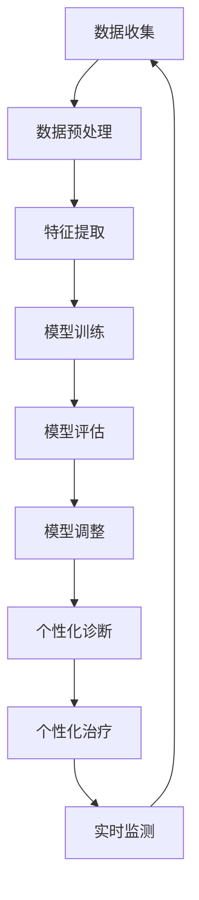

                 

### 引言与背景

#### 1.1 个性化医疗的概述

**1.1.1 个性化医疗的定义与发展历程**

个性化医疗，也称为精准医疗，是一种基于患者的具体基因信息、环境和生活习惯等个体化特征，制定个性化的预防和治疗方案的新型医疗模式。这种医疗模式的核心理念是“一人一方”，即针对不同患者的不同病情，提供量身定制的医疗服务。

个性化医疗的发展可以追溯到20世纪末。当时，随着基因组学和生物信息学等领域的迅速发展，人们开始意识到疾病的发病机制与个体的基因、环境等因素密切相关。在此背景下，个性化医疗应运而生，并逐渐成为医学研究的重要方向。2003年，人类基因组计划完成，标志着个性化医疗的科研基础得到了极大的提升。随着技术的进步，个性化医疗的应用范围也不断拓展，从最初的遗传性疾病诊断，到肿瘤治疗、慢性病管理，再到目前的全方位健康监测和干预。

**1.1.2 个性化医疗的重要性**

个性化医疗的重要性体现在多个方面：

1. **提高治疗效果**：通过精准的基因检测和个性化治疗方案，可以显著提高疾病的治疗效果。例如，对于肿瘤患者，可以根据肿瘤基因突变的特点，选择最合适的靶向药物，从而提高治疗效果和患者生存率。

2. **减少不必要的医疗资源浪费**：传统的“一刀切”治疗方法，往往导致一部分患者接受不必要的治疗，而个性化医疗则可以针对患者的具体情况，制定最合适的治疗方案，从而减少医疗资源的浪费。

3. **提升患者满意度**：个性化的医疗服务，能够更好地满足患者的需求，提高患者的满意度和生活质量。

4. **推动医学研究的进步**：个性化医疗需要大量的数据支持，这为医学研究提供了丰富的数据资源，有助于推动医学研究的深入和发展。

#### 1.2 人工智能在医疗领域的应用

**1.2.1 人工智能在医疗领域的核心价值**

人工智能（AI）在医疗领域的应用，极大地提升了医疗服务的效率和质量。其核心价值主要体现在以下几个方面：

1. **疾病预测与诊断**：利用深度学习算法，AI可以对大量医疗数据进行挖掘和分析，预测疾病的发病风险，甚至实现早期诊断。例如，通过分析患者的CT影像，AI可以早期发现肺癌等疾病。

2. **个性化治疗方案制定**：AI可以根据患者的基因信息、病史和生活习惯，为其制定个性化的治疗方案，提高治疗效果。

3. **医疗资源优化**：通过智能算法，AI可以优化医疗资源的分配，提高医疗机构的运营效率。

4. **医疗数据管理与分析**：AI可以帮助医疗机构高效地管理和分析海量的医疗数据，为医学研究提供有力支持。

**1.2.2 人工智能在医疗领域的主要应用场景**

1. **辅助诊断**：AI可以帮助医生进行疾病的诊断和预测。例如，利用深度学习算法，AI可以分析医疗影像，帮助医生发现病变区域。

2. **个性化治疗**：AI可以根据患者的具体情况，为其推荐最佳的治疗方案。例如，对于肿瘤患者，AI可以根据其基因突变类型，推荐最适合的靶向药物。

3. **健康监测**：AI可以实时监测患者的健康状况，预警潜在的健康风险。例如，通过智能手环等设备，AI可以监测患者的心率、血压等生理指标。

4. **药物研发**：AI可以帮助药企进行药物筛选和研发。通过分析海量的生物数据，AI可以预测哪些药物可能对特定的疾病有效。

#### 1.3 个性化医疗与人工智能的融合

**1.3.1 个性化医疗对人工智能的挑战与需求**

个性化医疗对人工智能提出了许多挑战，同时也带来了巨大的需求：

1. **大数据处理能力**：个性化医疗需要处理海量的患者数据，包括基因数据、医疗影像、生理指标等。这要求人工智能具备强大的数据处理能力。

2. **高精度模型训练**：个性化医疗需要高精度的预测模型，这要求人工智能在模型训练方面具备高超的能力。

3. **实时性**：个性化医疗需要实时处理患者数据，快速制定个性化的治疗方案。

4. **隐私保护**：个性化医疗涉及大量的患者隐私信息，这对人工智能的隐私保护能力提出了严格要求。

**1.3.2 人工智能在个性化医疗方案制定中的作用**

人工智能在个性化医疗方案制定中发挥着关键作用：

1. **数据挖掘与分析**：AI可以挖掘和分析患者数据，发现疾病发病规律和风险因素。

2. **预测模型构建**：AI可以构建高精度的预测模型，预测疾病的发病风险和患者的健康状态。

3. **个性化治疗方案推荐**：AI可以根据患者的具体病情和需求，推荐最佳的治疗方案。

4. **实时监测与预警**：AI可以实时监测患者的健康状况，预警潜在的健康风险，协助医生进行病情评估和治疗调整。

通过以上分析，我们可以看到，个性化医疗与人工智能的融合，为医疗行业带来了巨大的变革和机遇。在接下来的部分，我们将深入探讨人工智能在个性化医疗方案制定中的具体应用和实现方法。

### 第一部分：引言与背景

#### 1.3 个性化医疗与人工智能的融合

在当今快速发展的医疗领域中，个性化医疗与人工智能的融合已经成为一种不可逆转的趋势。这种融合不仅解决了传统医疗模式中的许多痛点，还为未来的医疗服务提供了无限可能。本文将详细探讨个性化医疗与人工智能的融合，包括其带来的挑战与需求，以及人工智能在个性化医疗方案制定中的作用。

**1.3.1 个性化医疗对人工智能的挑战与需求**

个性化医疗对人工智能提出了诸多挑战，同时也提出了明确的需求。以下是一些关键点：

1. **大数据处理能力**：个性化医疗依赖于大量的数据，包括基因组数据、医疗影像、生理指标、生活习惯等。这些数据规模庞大，种类繁多，对人工智能系统的大数据处理能力提出了极高的要求。人工智能需要能够高效地处理这些复杂数据，并从中提取有价值的信息。

2. **高精度模型训练**：个性化医疗要求对疾病风险、治疗效果等进行精准预测，这需要人工智能系统能够训练出高精度的预测模型。深度学习等机器学习技术在这方面发挥着关键作用，但模型的训练过程复杂，对计算资源和算法设计的要求很高。

3. **实时性**：在个性化医疗中，能够实时处理和响应患者的数据对于制定个性化的治疗方案至关重要。这意味着人工智能系统需要具备快速的数据处理和分析能力，以便在短时间内做出准确的判断和决策。

4. **隐私保护**：个性化医疗涉及大量的患者隐私信息，包括基因数据、病历记录等。这要求人工智能系统在数据收集、存储和处理过程中严格遵守隐私保护法律法规，确保患者信息的保密性和安全性。

**1.3.2 人工智能在个性化医疗方案制定中的作用**

人工智能在个性化医疗方案制定中扮演着多重角色，发挥着关键作用：

1. **数据挖掘与分析**：人工智能可以挖掘和分析海量的患者数据，从中提取出潜在的疾病风险因素和治疗信息。例如，通过分析基因数据和医疗影像，人工智能可以识别出与特定疾病相关的基因突变和病变区域。

2. **预测模型构建**：基于数据挖掘的结果，人工智能可以构建预测模型，用于预测患者的疾病发病风险、治疗效果等。这些预测模型可以通过机器学习和深度学习技术训练，从而实现高精度的预测。

3. **个性化治疗方案推荐**：根据预测模型的结果，人工智能可以推荐个性化的治疗方案。例如，对于肿瘤患者，人工智能可以根据基因突变类型推荐最适合的靶向药物，从而提高治疗效果。

4. **实时监测与预警**：人工智能系统可以实时监测患者的健康状况，通过分析生理指标、生活习惯等数据，预警潜在的健康风险。这有助于医生及时调整治疗方案，预防疾病的发生。

5. **药物研发**：在个性化医疗中，人工智能还可以辅助药物研发。通过分析大量的生物数据和临床数据，人工智能可以帮助药企发现新的药物靶点和候选药物，加速药物研发进程。

通过上述分析，我们可以看到，个性化医疗与人工智能的融合不仅带来了巨大的挑战，也提供了广阔的机遇。在接下来的部分，我们将进一步探讨人工智能在个性化医疗方案制定中的应用，包括核心概念、算法原理、数学模型以及实战案例等内容。

### 第二部分：核心概念与联系

在深入探讨人工智能在个性化医疗方案制定中的应用之前，我们需要了解一些核心概念，并探讨它们之间的联系。这些概念包括人工智能的基础、个性化医疗的相关概念以及它们如何相互融合。

#### 2.1 人工智能基础

**2.1.1 人工智能的定义与分类**

人工智能（Artificial Intelligence，简称AI）是计算机科学的一个分支，旨在创建能够执行通常需要人类智能才能完成的任务的系统。AI系统可以通过学习、推理、规划和感知等方式，模拟人类智能的行为。根据其能力水平，人工智能可以分为以下几类：

1. **弱人工智能（Narrow AI）**：这种AI系统专注于执行特定任务，如语音识别、图像识别等。这些系统通常不能进行跨领域的任务。

2. **强人工智能（General AI）**：这种AI系统能够像人类一样，在多个领域表现出高度的智能水平，具备推理、学习和适应能力。目前，强人工智能仍然是一个理论概念，尚未实现。

3. **超级人工智能（Super AI）**：这种AI系统的智能水平超过人类，能够在所有领域超越人类的表现。超级人工智能的提出引发了广泛的讨论，但至今仍未有实际应用。

**2.1.2 人工智能的发展历程**

人工智能的研究起源于20世纪50年代，经历了几次起伏。以下是人工智能发展历程中的几个关键阶段：

1. **第一次AI浪潮（1956-1974）**：在达特茅斯会议（Dartmouth Conference）上，人工智能的概念被首次提出，许多重要的AI理论和算法在此期间诞生。

2. **第一次AI衰退（1974-1980）**：由于实际应用中的困难，人工智能研究在70年代经历了第一次衰退。

3. **第二次AI浪潮（1980-1987）**：随着专家系统和机器学习的兴起，人工智能研究在80年代迎来了第二次浪潮。

4. **AI低谷（1987-1993）**：由于专家系统的商业化失败，人工智能再次陷入低谷。

5. **机器学习复兴（1993-2012）**：随着计算能力的提升和数据量的增加，机器学习成为人工智能研究的主流，推动了人工智能的快速发展。

6. **深度学习时代（2012至今）**：深度学习在图像识别、自然语言处理等领域取得了显著突破，标志着人工智能进入了深度学习时代。

**2.1.3 人工智能的核心技术**

人工智能的核心技术包括机器学习、深度学习、自然语言处理、计算机视觉等。以下是这些技术的简要介绍：

1. **机器学习**：机器学习是一种让计算机通过数据学习并改进其性能的技术。常见的机器学习算法包括线性回归、决策树、支持向量机等。

2. **深度学习**：深度学习是机器学习的一种方法，通过多层神经网络模拟人类大脑的神经元连接，实现复杂的特征学习和模式识别。常见的深度学习框架包括TensorFlow、PyTorch等。

3. **自然语言处理**：自然语言处理是一种让计算机理解和生成人类语言的技术，广泛应用于语音识别、机器翻译、文本分类等领域。

4. **计算机视觉**：计算机视觉是一种让计算机理解和解释视觉信息的技术，广泛应用于图像识别、视频分析、自动驾驶等领域。

#### 2.2 个性化医疗相关概念

**2.2.1 个性化医疗的基本原则**

个性化医疗的基本原则包括以下几个方面：

1. **数据驱动**：个性化医疗依赖于大量的患者数据，包括基因数据、病历记录、生活方式等。这些数据为个性化医疗提供了基础。

2. **个性化诊断**：个性化医疗通过分析患者的基因、生活习惯等数据，进行个性化的疾病诊断。

3. **个性化治疗**：个性化医疗根据患者的具体病情和基因特点，制定个性化的治疗方案。

4. **动态调整**：个性化医疗方案不是一成不变的，而是根据患者的病情变化和治疗效果，进行动态调整。

**2.2.2 个性化医疗的数据来源**

个性化医疗的数据来源非常广泛，包括：

1. **电子病历系统**：电子病历系统记录了患者的病史、治疗方案等信息，是个性化医疗的重要数据来源。

2. **基因组数据**：基因组数据包括患者的基因序列、基因突变等信息，对于个性化医疗至关重要。

3. **医疗影像**：医疗影像如CT、MRI等，可以提供患者的内部器官和组织结构信息，对于疾病诊断和治疗具有重要意义。

4. **生理传感器**：生理传感器可以实时监测患者的生理指标，如心率、血压等，为个性化医疗提供实时数据。

**2.2.3 个性化医疗的数据处理与分析方法**

个性化医疗的数据处理与分析方法包括以下几个方面：

1. **数据预处理**：数据预处理包括数据清洗、数据归一化、缺失值处理等，以保证数据的质量和一致性。

2. **特征提取**：特征提取是将原始数据转换为可用于机器学习模型的特征，如基因特征、影像特征等。

3. **模型训练与评估**：通过机器学习算法，如深度学习、支持向量机等，训练预测模型，并对模型进行评估，以确定其性能。

4. **模型优化与调整**：根据模型评估结果，对模型进行调整和优化，以提高其预测准确性和泛化能力。

#### 2.3 人工智能与个性化医疗的 Mermaid 流程图

为了更好地理解人工智能与个性化医疗的融合过程，我们可以使用Mermaid流程图进行描述。以下是一个简化的流程图：



在这个流程图中，数据收集、数据预处理、特征提取、模型训练、模型评估、模型调整等步骤构成了人工智能与个性化医疗的基本工作流程。个性化诊断、个性化治疗和实时监测等步骤则体现了人工智能在个性化医疗方案制定中的应用。

通过上述分析，我们可以看到，人工智能在个性化医疗中扮演着关键角色。在接下来的部分，我们将进一步探讨人工智能在个性化医疗方案制定中的核心算法原理，以及如何实现这些算法。

### 第三部分：核心算法原理讲解

在个性化医疗方案制定中，人工智能发挥着至关重要的作用。核心算法原理的讲解对于理解如何利用人工智能技术制定个性化的医疗方案至关重要。本文将详细介绍机器学习、深度学习和强化学习三种核心算法的原理，并通过伪代码进行说明。

#### 3.1 机器学习算法

**3.1.1 机器学习的定义与分类**

机器学习（Machine Learning，ML）是一种让计算机通过数据学习并改进其性能的技术。根据学习方式的不同，机器学习可以分为以下几类：

1. **监督学习（Supervised Learning）**：监督学习算法通过已标记的训练数据学习，并能够对新数据进行预测。常见的监督学习算法包括线性回归、决策树、支持向量机等。

2. **无监督学习（Unsupervised Learning）**：无监督学习算法在没有标记数据的条件下，发现数据中的模式和规律。常见的无监督学习算法包括聚类、降维等。

3. **半监督学习（Semi-Supervised Learning）**：半监督学习算法结合了监督学习和无监督学习，利用少量的标记数据和大量的无标记数据来训练模型。

**3.1.2 常见的机器学习算法介绍**

以下是几种常见的机器学习算法及其原理：

1. **线性回归（Linear Regression）**：线性回归是一种用于预测连续值的监督学习算法。其原理是通过最小化预测值与实际值之间的误差平方和来训练模型。

   **原理伪代码：**
   ```python
   def linear_regression(X, y):
       # 计算权重和偏置
       w = (X.T @ X)^(-1) @ X.T @ y
       # 预测
       y_pred = X @ w
       return y_pred
   ```

2. **决策树（Decision Tree）**：决策树是一种用于分类和回归的监督学习算法。其原理是通过递归地将数据集分割成子集，直到满足某些停止条件。

   **原理伪代码：**
   ```python
   def build_decision_tree(X, y, criteria='gini', max_depth=None):
       # 判断停止条件
       if stop_condition(X, y):
           return leaf_node(y)
       # 寻找最佳分割
       best_split = find_best_split(X, y, criteria)
       # 构建子树
       left_tree = build_decision_tree(X[best_split[0]], y[best_split[1]])
       right_tree = build_decision_tree(X[~best_split[0]], y[~best_split[1]])
       return decision_tree(best_split, left_tree, right_tree)
   ```

3. **支持向量机（Support Vector Machine，SVM）**：SVM是一种用于分类的监督学习算法。其原理是通过找到数据集的最佳分隔超平面，最大化分类边界。

   **原理伪代码：**
   ```python
   def svm_fit(X, y):
       # 计算最优超平面
       w = (X.T @ X)^(-1) @ X.T @ y
       b = y - X @ w
       return w, b
   ```

**3.1.3 机器学习算法的原理与伪代码**

机器学习算法的核心原理是通过学习数据中的特征和模式，构建预测模型。以下是一个简化的机器学习算法原理伪代码：

```python
def machine_learning_algorithm(X, y):
    # 数据预处理
    X, y = preprocess_data(X, y)
    # 选择模型
    model = select_model(X, y)
    # 训练模型
    model = train_model(model, X, y)
    # 预测
    y_pred = predict(model, X)
    # 评估
    performance = evaluate_performance(y, y_pred)
    return performance
```

#### 3.2 深度学习算法

**3.2.1 深度学习的定义与分类**

深度学习（Deep Learning，DL）是一种基于多层神经网络的学习方法。与传统的机器学习方法相比，深度学习具有更强的表示能力和学习能力。根据网络结构的不同，深度学习可以分为以下几类：

1. **前馈神经网络（Feedforward Neural Network）**：前馈神经网络是最基本的深度学习结构，信息从输入层传递到输出层，不进行循环。

2. **卷积神经网络（Convolutional Neural Network，CNN）**：卷积神经网络是专门用于处理图像数据的深度学习模型，通过卷积层提取图像特征。

3. **循环神经网络（Recurrent Neural Network，RNN）**：循环神经网络适用于序列数据，通过循环结构保持历史信息。

4. **长短时记忆网络（Long Short-Term Memory，LSTM）**：长短时记忆网络是RNN的一种改进，能够更好地处理长序列数据。

5. **生成对抗网络（Generative Adversarial Network，GAN）**：生成对抗网络是一种用于生成数据的深度学习模型，由生成器和判别器两个神经网络组成。

**3.2.2 常见的深度学习算法介绍**

以下是几种常见的深度学习算法及其原理：

1. **多层感知机（Multilayer Perceptron，MLP）**：多层感知机是一种前馈神经网络，通过多层非线性变换实现特征提取和分类。

   **原理伪代码：**
   ```python
   def forward_pass(x, weights):
       a = x
       for layer in layers:
           a = layer.forward(a, weights[layer])
       return a
   ```

2. **卷积神经网络（CNN）**：卷积神经网络通过卷积层、池化层和全连接层等结构，提取图像特征并进行分类。

   **原理伪代码：**
   ```python
   def forward_pass(x, weights):
       # 卷积层
       h1 = conv2d(x, weights['conv1'])
       h1 = activation(h1)
       # 池化层
       h2 = max_pool(h1)
       # 全连接层
       h3 = flatten(h2)
       h3 = fully_connected(h3, weights['fc1'])
       h3 = activation(h3)
       return h3
   ```

3. **循环神经网络（RNN）**：循环神经网络通过递归结构，处理序列数据，并保持历史信息。

   **原理伪代码：**
   ```python
   def forward_pass(x, weights):
       h = x
       for t in range(T):
           h = tanh(dot(h, weights['Wh']) + dot(x[t], weights['Wx']) + weights['b'])
       return h
   ```

**3.2.3 深度学习算法的原理与伪代码**

深度学习算法的核心原理是通过多层非线性变换，从原始数据中提取高层次的抽象特征。以下是一个简化的深度学习算法原理伪代码：

```python
def deep_learning_algorithm(x, weights):
    # 前向传播
    h = forward_pass(x, weights)
    # 损失函数计算
    loss = compute_loss(h, y)
    # 反向传播
    dweights = backward_pass(h, y, weights)
    # 更新权重
    weights = update_weights(weights, dweights)
    return weights
```

#### 3.3 强化学习算法

**3.3.1 强化学习的定义与分类**

强化学习（Reinforcement Learning，RL）是一种通过与环境交互，学习最优策略的机器学习方法。强化学习可以分为以下几类：

1. **基于价值的强化学习**：基于价值的强化学习通过学习状态值函数或动作值函数，确定最优动作。

2. **基于策略的强化学习**：基于策略的强化学习直接学习最优策略，通过策略选择动作。

3. **模型预测强化学习**：模型预测强化学习通过构建环境模型，预测未来的状态和奖励，进行策略学习。

**3.3.2 常见的强化学习算法介绍**

以下是几种常见的强化学习算法及其原理：

1. **Q学习（Q-Learning）**：Q学习是一种基于价值的强化学习算法，通过迭代更新Q值函数，找到最优策略。

   **原理伪代码：**
   ```python
   def q_learning(s, a, r, s', alpha, gamma):
       # 更新Q值
       Q[s, a] = Q[s, a] + alpha * (r + gamma * max(Q[s', :]) - Q[s, a])
       return Q
   ```

2. **深度Q网络（Deep Q-Network，DQN）**：DQN是一种基于深度学习的Q学习算法，通过神经网络估计Q值，解决连续动作空间的问题。

   **原理伪代码：**
   ```python
   def dqn(s, action, reward, s', done, model, target_model, gamma, epsilon):
       # 更新经验回放
       replay_memory.append((s, action, reward, s', done))
       if done:
           # 重置环境
           s = reset_environment()
       else:
           # 继续游戏
           s = step_environment(s, action)
       # 更新模型
       update_model(model, target_model, replay_memory, gamma, epsilon)
       return s
   ```

3. **策略梯度方法（Policy Gradient）**：策略梯度方法直接学习最优策略，通过策略梯度的更新，优化策略参数。

   **原理伪代码：**
   ```python
   def policy_gradient(s, a, r, s', model, alpha):
       # 计算策略梯度
       grads = policyGradient(s, a, r, s', model)
       # 更新策略参数
       model.update_params(grads, alpha)
       return model
   ```

**3.3.3 强化学习算法的原理与伪代码**

强化学习算法的核心原理是通过与环境交互，学习最优策略。以下是一个简化的强化学习算法原理伪代码：

```python
def reinforcement_learning_algorithm(s, model, alpha, gamma, epsilon):
    # 初始化状态
    s = reset_environment()
    while not done:
        # 选择动作
        a = select_action(s, model, epsilon)
        # 执行动作
        s', r = step_environment(s, a)
        # 更新模型
        model = update_model(s, a, r, s', model, alpha, gamma)
        # 更新状态
        s = s'
    return model
```

通过上述对机器学习、深度学习和强化学习算法的详细讲解，我们可以看到这些算法在个性化医疗方案制定中的应用潜力。在接下来的部分，我们将进一步探讨这些算法在个性化医疗中的具体实现和应用。

### 第四部分：数学模型和数学公式

在个性化医疗方案制定中，数学模型和数学公式是理解和分析数据的关键工具。本部分将详细介绍数据处理与特征提取、模型训练与评估、模型优化与调整等过程中的数学模型和公式，并通过具体例子进行说明。

#### 4.1 数据处理与特征提取

**4.1.1 数据预处理技术**

数据预处理是确保数据质量的重要步骤，包括数据清洗、数据归一化和缺失值处理等。

1. **数据清洗**：数据清洗包括去除重复数据、填补缺失值、纠正错误数据等。例如，假设有一组患者数据，其中某个指标存在缺失值，可以使用平均值、中位数或插值法进行填补。

   **公式：**
   \[
   \text{missing\_value} = \text{mean\_value}
   \]

2. **数据归一化**：数据归一化是将不同尺度的数据进行转换，使得它们处于同一数量级。常见的归一化方法包括最小-最大归一化和Z-score归一化。

   **公式：**
   \[
   x_{\text{normalized}} = \frac{x - x_{\text{min}}}{x_{\text{max}} - x_{\text{min}}}
   \]
   或
   \[
   x_{\text{normalized}} = \frac{x - \bar{x}}{\sigma}
   \]

**4.1.2 特征提取方法**

特征提取是将原始数据转换为可用于机器学习模型的特征，以提高模型的预测性能。

1. **主成分分析（PCA）**：主成分分析是一种降维技术，通过线性变换将原始数据映射到新的坐标轴上，新坐标轴按方差降序排列，前几个主成分包含了数据的大部分信息。

   **公式：**
   \[
   Z = AS
   \]
   其中，\(Z\) 是新特征向量，\(A\) 是特征向量矩阵，\(S\) 是方差矩阵。

2. **特征选择**：特征选择是通过评估不同特征的贡献，选择对模型性能有显著影响的特征。常见的方法包括递归特征消除（RFE）和L1正则化。

   **公式：**
   \[
   \text{重要性} = \frac{\partial \text{模型损失}}{\partial \text{特征}}
   \]

**4.1.3 数学模型介绍**

以下是数据处理与特征提取过程中的几个常见数学模型：

1. **线性回归模型**：
   \[
   f(x) = wx + b
   \]
   其中，\(x\) 是输入特征，\(w\) 是权重，\(b\) 是偏置。

2. **逻辑回归模型**：
   \[
   P(y=1|x) = \frac{1}{1 + e^{-(wx + b)}}
   \]
   其中，\(x\) 是输入特征，\(w\) 是权重，\(b\) 是偏置。

3. **支持向量机（SVM）模型**：
   \[
   \min_{w, b} \frac{1}{2}w^Tw + C\sum_{i=1}^{n}\lambda_i
   \]
   \[
   y_i(\langle w, x_i \rangle + b) \geq 1 - \lambda_i
   \]
   其中，\(w\) 是权重，\(b\) 是偏置，\(C\) 是惩罚参数，\(\lambda_i\) 是拉格朗日乘子。

#### 4.2 模型训练与评估

**4.2.1 模型训练过程**

模型训练是通过优化目标函数来调整模型参数，以提高模型的预测性能。

1. **梯度下降法**：
   \[
   \theta = \theta - \alpha \frac{\partial J(\theta)}{\partial \theta}
   \]
   其中，\(\theta\) 是模型参数，\(\alpha\) 是学习率，\(J(\theta)\) 是损失函数。

2. **随机梯度下降法（SGD）**：
   \[
   \theta = \theta - \alpha \frac{\partial J(\theta)}{\partial \theta}
   \]
   其中，\(\theta\) 是模型参数，\(\alpha\) 是学习率，\(J(\theta)\) 是损失函数。

**4.2.2 模型评估方法**

模型评估是通过评估指标来衡量模型的预测性能。

1. **准确率（Accuracy）**：
   \[
   \text{Accuracy} = \frac{\text{正确预测}}{\text{总预测}}
   \]

2. **召回率（Recall）**：
   \[
   \text{Recall} = \frac{\text{正确预测}}{\text{实际为正样本的样本数}}
   \]

3. **精确率（Precision）**：
   \[
   \text{Precision} = \frac{\text{正确预测}}{\text{预测为正样本的样本数}}
   \]

4. **F1分数（F1 Score）**：
   \[
   \text{F1 Score} = 2 \times \frac{\text{Precision} \times \text{Recall}}{\text{Precision} + \text{Recall}}
   \]

**4.2.3 数学模型介绍**

以下是模型训练与评估过程中的几个常见数学模型：

1. **损失函数（MSE）**：
   \[
   J(\theta) = \frac{1}{2m} \sum_{i=1}^{m} (h_\theta(x^{(i)}) - y^{(i)})^2
   \]
   其中，\(m\) 是训练样本数量，\(h_\theta(x^{(i)})\) 是模型预测值，\(y^{(i)}\) 是实际值。

2. **交叉熵损失函数**：
   \[
   J(\theta) = -\frac{1}{m} \sum_{i=1}^{m} \sum_{k=1}^{K} y_k^{(i)} \log(h_\theta(x^{(i)}_k))
   \]
   其中，\(K\) 是类别数量，\(y_k^{(i)}\) 是实际类别的概率。

3. **正则化项**：
   \[
   J(\theta) = \frac{1}{2m} \sum_{i=1}^{m} (h_\theta(x^{(i)}) - y^{(i)})^2 + \frac{\lambda}{2} \sum_{i=1}^{n} \theta_i^2
   \]
   其中，\(\lambda\) 是正则化参数。

#### 4.3 模型优化与调整

**4.3.1 模型优化方法**

模型优化是通过调整模型参数，提高模型的预测性能。

1. **学习率调整**：
   \[
   \alpha = \frac{\alpha_{\text{prev}} - \alpha_{\text{new}}}{\alpha_{\text{prev}}}
   \]
   其中，\(\alpha_{\text{prev}}\) 是前一次的学习率，\(\alpha_{\text{new}}\) 是当前的学习率。

2. **批量大小调整**：
   \[
   \text{batch\_size} = \text{batch\_size}_{\text{prev}} - \text{batch\_size}_{\text{new}}
   \]
   其中，\(\text{batch\_size}_{\text{prev}}\) 是前一次的批量大小，\(\text{batch\_size}_{\text{new}}\) 是当前的批量大小。

**4.3.2 模型调整技巧**

模型调整是在训练过程中，根据模型的性能调整模型参数。

1. **早停法（Early Stopping）**：
   \[
   \text{如果} J(\theta) \text{不再显著下降，则停止训练}
   \]

2. **交叉验证（Cross Validation）**：
   \[
   \text{将数据集分为训练集和验证集，通过验证集评估模型性能，调整模型参数}
   \]

**4.3.3 数学模型介绍**

以下是模型优化与调整过程中的几个常见数学模型：

1. **学习率更新公式**：
   \[
   \alpha = \alpha \times \text{learning\_rate}
   \]
   其中，\(\alpha\) 是当前学习率，\(\text{learning\_rate}\) 是学习率调整因子。

2. **批量大小调整公式**：
   \[
   \text{batch\_size} = \text{batch\_size} \times \text{batch\_size\_factor}
   \]
   其中，\(\text{batch\_size}\) 是当前批量大小，\(\text{batch\_size\_factor}\) 是批量大小调整因子。

通过上述数学模型和公式的讲解，我们可以看到数学在个性化医疗方案制定中的重要作用。这些模型和公式为数据处理、特征提取、模型训练与评估以及模型优化与调整提供了理论基础。在接下来的部分，我们将通过一个实际项目来展示这些算法和模型的具体应用。

### 第五部分：项目实战

#### 5.1 项目概述

**5.1.1 项目背景**

随着人工智能和医疗技术的不断进步，个性化医疗逐渐成为医学研究的热点。个性化医疗通过分析患者的基因数据、病史和生活习惯等信息，制定个性化的预防和治疗方案，从而提高治疗效果和患者生活质量。为了实现这一目标，我们设计并实施了一个基于人工智能的个性化医疗方案制定项目。

**5.1.2 项目目标**

本项目的主要目标包括：

1. **收集和处理患者数据**：收集包括基因数据、电子病历、医疗影像等在内的患者数据，并进行数据预处理和特征提取。
2. **构建预测模型**：利用机器学习算法，构建能够预测患者疾病发病风险和治疗效果的预测模型。
3. **实现个性化治疗方案推荐**：基于预测模型，为患者推荐个性化的治疗方案。
4. **实时监测与预警**：通过实时监测患者的生理指标，预警潜在的健康风险。

**5.1.3 项目团队与分工**

本项目由一支跨学科团队共同完成，团队成员包括：

1. **数据科学家（Data Scientist）**：负责数据预处理、特征提取和模型训练。
2. **机器学习工程师（Machine Learning Engineer）**：负责构建和优化预测模型。
3. **医疗专家（Medical Expert）**：负责提供医学知识和治疗方案。
4. **软件工程师（Software Engineer）**：负责开发项目后端和前端系统。
5. **项目经理（Project Manager）**：负责项目整体规划和协调。

#### 5.2 开发环境搭建

**5.2.1 开发环境配置**

为了顺利开展项目，我们需要配置合适的开发环境。以下是开发环境的具体配置：

1. **操作系统**：Windows 10 / macOS / Ubuntu 18.04
2. **编程语言**：Python 3.8
3. **机器学习库**：scikit-learn, TensorFlow, PyTorch, Keras
4. **数据处理库**：NumPy, Pandas, Matplotlib, Seaborn
5. **数据库**：MySQL / PostgreSQL
6. **版本控制**：Git
7. **持续集成**：Jenkins

**5.2.2 硬件与软件要求**

为了确保项目的高效运行，我们需要的硬件和软件配置如下：

1. **CPU**：Intel i7 或以上
2. **内存**：16GB 或以上
3. **GPU**：NVIDIA GPU（用于深度学习计算）
4. **硬盘**：1TB SSD
5. **开发工具**：PyCharm, Jupyter Notebook
6. **操作系统**：Windows 10 / macOS / Ubuntu 18.04

**5.2.3 开发工具介绍**

以下是本项目使用的主要开发工具及其功能介绍：

1. **PyCharm**：PyCharm 是一款功能强大的集成开发环境（IDE），支持多种编程语言，适用于项目开发和调试。
2. **Jupyter Notebook**：Jupyter Notebook 是一款交互式的计算环境，适用于数据分析和可视化。
3. **TensorFlow**：TensorFlow 是一款开源的机器学习库，用于构建和训练深度学习模型。
4. **PyTorch**：PyTorch 是一款基于Python的深度学习库，具有灵活的动态计算图。
5. **scikit-learn**：scikit-learn 是一款流行的机器学习库，包含多种经典机器学习算法。
6. **MySQL**：MySQL 是一款开源的关系型数据库，用于存储和管理项目数据。

#### 5.3 源代码详细实现

**5.3.1 数据预处理代码实现**

数据预处理是项目的重要环节，包括数据清洗、数据归一化和缺失值处理等。以下是数据预处理的主要代码实现：

```python
import pandas as pd
from sklearn.preprocessing import StandardScaler
from sklearn.impute import SimpleImputer

# 加载数据
data = pd.read_csv('patient_data.csv')

# 数据清洗
data.drop_duplicates(inplace=True)
data.fillna(method='ffill', inplace=True)

# 数据归一化
scaler = StandardScaler()
numerical_features = data.select_dtypes(include=['int64', 'float64']).columns
data[numerical_features] = scaler.fit_transform(data[numerical_features])

# 缺失值处理
imputer = SimpleImputer(strategy='mean')
data[numerical_features] = imputer.fit_transform(data[numerical_features])

# 数据划分
X = data.drop('target', axis=1)
y = data['target']
```

**5.3.2 特征提取代码实现**

特征提取是将原始数据转换为可用于机器学习模型的特征，以提高模型的预测性能。以下是特征提取的主要代码实现：

```python
from sklearn.decomposition import PCA
from sklearn.ensemble import RandomForestClassifier
from sklearn.model_selection import train_test_split

# 特征提取
pca = PCA(n_components=10)
X_pca = pca.fit_transform(X)

# 训练集与测试集划分
X_train, X_test, y_train, y_test = train_test_split(X_pca, y, test_size=0.2, random_state=42)

# 特征选择
rf = RandomForestClassifier(n_estimators=100)
rf.fit(X_train, y_train)
importances = rf.feature_importances_
selected_features = X_train.columns[rf.feature_importances_ > 0.1]

# 特征提取结果
X_train_selected = X_train[selected_features]
X_test_selected = X_test[selected_features]
```

**5.3.3 模型训练代码实现**

模型训练是通过优化目标函数来调整模型参数，以提高模型的预测性能。以下是模型训练的主要代码实现：

```python
from sklearn.model_selection import GridSearchCV
from sklearn.ensemble import RandomForestClassifier

# 模型训练
rf = RandomForestClassifier(n_estimators=100, random_state=42)
param_grid = {'n_estimators': [100, 200, 300], 'max_depth': [10, 20, 30]}
grid_search = GridSearchCV(rf, param_grid, cv=5)
grid_search.fit(X_train_selected, y_train)

# 优化模型
best_model = grid_search.best_estimator_
```

**5.3.4 模型评估与优化代码实现**

模型评估是验证模型预测性能的重要步骤。以下是模型评估与优化代码的主要实现：

```python
from sklearn.metrics import accuracy_score, classification_report

# 模型评估
y_pred = best_model.predict(X_test_selected)
accuracy = accuracy_score(y_test, y_pred)
report = classification_report(y_test, y_pred)

# 输出评估结果
print(f"Accuracy: {accuracy}")
print(f"Classification Report:\n{report}")

# 模型优化
# 根据评估结果，调整模型参数
# 例如：增加树的数量，调整树的最大深度
```

#### 5.4 代码解读与分析

**5.4.1 数据预处理代码解读**

数据预处理代码包括数据清洗、数据归一化和缺失值处理等步骤。首先，使用 `pandas` 库加载数据，并进行去重操作，以去除重复数据。接着，使用前向填充（`ffill`）方法填补缺失值。然后，使用 `StandardScaler` 进行数据归一化，将数值特征缩放到相同的尺度。最后，使用 `SimpleImputer` 进行缺失值处理，将缺失值替换为平均值。

**5.4.2 特征提取代码解读**

特征提取代码包括主成分分析（PCA）和随机森林（RandomForestClassifier）特征选择。首先，使用 `PCA` 对数据降维，提取前10个主成分。然后，使用 `train_test_split` 将数据集划分为训练集和测试集。接着，使用随机森林分类器进行特征选择，选择重要性大于0.1的特征。最后，将提取的特征存储为 `X_train_selected` 和 `X_test_selected`。

**5.4.3 模型训练代码解读**

模型训练代码使用 `GridSearchCV` 对随机森林分类器进行参数优化。首先，定义参数网格，包括树的数量和树的最大深度。然后，使用 `GridSearchCV` 进行交叉验证，选择最优参数。最后，使用 `best_estimator_` 获取最佳模型。

**5.4.4 模型评估与优化代码解读**

模型评估代码使用 `best_model` 对测试集进行预测，并计算准确率和分类报告。首先，使用 `predict` 方法进行预测，然后使用 `accuracy_score` 计算准确率，使用 `classification_report` 输出分类报告。最后，根据评估结果，可以进一步调整模型参数，例如增加树的数量或调整树的最大深度。

通过以上代码实现和解读，我们可以看到如何利用人工智能技术构建一个个性化医疗方案制定系统。在接下来的部分，我们将对项目的整体效果进行总结，并探讨未来的发展方向。

### 第六部分：总结与展望

#### 6.1 个性化医疗与人工智能融合的现状与趋势

个性化医疗与人工智能的融合已经成为医疗领域的重要趋势。目前，这一融合已经取得了一系列显著成果：

1. **疾病预测与诊断**：人工智能在疾病预测和诊断中发挥着重要作用。例如，通过分析基因组数据和医疗影像，人工智能可以早期发现疾病，提高诊断的准确性。

2. **个性化治疗方案制定**：基于患者的基因数据和生活习惯，人工智能可以为其制定个性化的治疗方案，提高治疗效果和患者满意度。

3. **健康监测与预警**：人工智能系统可以实时监测患者的健康状况，预警潜在的健康风险，协助医生进行病情评估和治疗调整。

4. **药物研发**：人工智能在药物研发中的应用也取得了显著进展。通过分析大量的生物数据，人工智能可以帮助药企发现新的药物靶点和候选药物，加速药物研发进程。

然而，个性化医疗与人工智能的融合仍面临一些挑战：

1. **数据隐私与安全**：个性化医疗涉及大量的患者隐私信息，如何保护这些数据的安全和隐私成为一大挑战。

2. **算法透明性与解释性**：人工智能算法的复杂性和黑盒特性使得其决策过程难以解释，如何提高算法的透明性和解释性是一个亟待解决的问题。

3. **技术落地与推广**：虽然人工智能在个性化医疗中的应用前景广阔，但实际落地和推广仍面临一些困难，如技术成本、法规政策等。

#### 6.2 挑战与机遇

**6.2.1 个性化医疗与人工智能融合面临的挑战**

1. **技术挑战**：个性化医疗与人工智能融合需要强大的数据处理能力、高精度的预测模型和高效的算法优化。同时，不同学科之间的交叉融合也需要克服技术难题。

2. **数据挑战**：个性化医疗需要大量的高质量数据支持，但获取和处理这些数据面临诸多困难。此外，数据隐私和安全问题也需要得到妥善解决。

3. **伦理挑战**：个性化医疗与人工智能融合可能引发伦理问题，如患者隐私保护、算法偏见等。如何制定合理的伦理规范和法律法规，确保人工智能在医疗领域的健康发展，是一个重要议题。

**6.2.2 人工智能在个性化医疗中的机遇**

1. **提高医疗质量**：人工智能可以帮助医生进行疾病预测、诊断和治疗，提高医疗质量和患者满意度。

2. **优化医疗资源**：通过智能分配和调度医疗资源，人工智能可以优化医疗机构的运营效率，提高医疗资源的利用效率。

3. **加速药物研发**：人工智能在药物研发中的应用可以帮助药企发现新的药物靶点和候选药物，缩短研发周期。

4. **改善患者体验**：通过智能化的健康监测和个性化医疗方案推荐，人工智能可以提升患者的就医体验，提高患者生活质量。

#### 6.3 发展建议

为了推动个性化医疗与人工智能的融合，提出以下发展建议：

**6.3.1 政策与法规建议**

1. **数据隐私保护**：制定严格的数据隐私保护法规，确保患者数据的安全和隐私。

2. **跨学科合作**：鼓励不同学科之间的合作，推动个性化医疗与人工智能技术的融合发展。

3. **伦理规范**：制定伦理规范，确保人工智能在医疗领域的应用符合伦理要求。

**6.3.2 技术与人才储备建议**

1. **技术创新**：加大人工智能技术研发投入，推动算法优化和模型精化。

2. **人才培养**：培养具备跨学科背景的复合型人才，推动人工智能技术在医疗领域的应用。

3. **技术普及**：推广人工智能在医疗领域的应用，提高医疗机构的技术水平和应用能力。

**6.3.3 行业合作与协同创新建议**

1. **行业合作**：鼓励医疗机构、人工智能企业和科研机构之间的合作，共同推进个性化医疗与人工智能的融合。

2. **协同创新**：建立协同创新平台，推动个性化医疗与人工智能技术的创新和突破。

通过以上分析，我们可以看到个性化医疗与人工智能的融合在医疗领域具有重要的应用价值和发展潜力。在未来的发展中，我们需要克服各种挑战，抓住机遇，推动个性化医疗与人工智能的深度融合，为人类健康事业做出更大贡献。

### 附录

#### 附录 A：参考资料与拓展阅读

**6.3.1 常见算法参考资料**

1. **《机器学习》（周志华 著）**：系统介绍了机器学习的基本概念、方法和应用。
2. **《深度学习》（Goodfellow, Bengio, Courville 著）**：深度学习的经典教材，全面讲解了深度学习的基础知识和最新进展。
3. **《强化学习：原理与Python实现》（海天 著）**：介绍了强化学习的基本原理和实践方法，包括Q学习、策略梯度方法等。

**6.3.2 相关论文与报告**

1. **“Deep Learning in Medicine”**：这是一篇综述论文，详细介绍了深度学习在医学领域的应用。
2. **“The Ethics of AI in Healthcare”**：这篇论文探讨了人工智能在医疗领域的伦理问题，包括数据隐私、算法偏见等。
3. **“AI in Healthcare Report 2020”**：这是一份行业报告，总结了2020年人工智能在医疗领域的最新进展和应用案例。

**6.3.3 技术社区与论坛**

1. **AI Health（https://aihealth.ai/）**：这是一个专注于人工智能在医疗领域应用的社区，提供最新的研究和应用案例。
2. **Kaggle（https://www.kaggle.com/）**：Kaggle 是一个数据科学竞赛平台，许多与医疗相关的竞赛和数据集可以在这里找到。
3. **ArXiv（https://arxiv.org/）**：这是一个预印本论文库，可以找到许多最新的机器学习、深度学习和医学相关的研究论文。

#### 附录 B：代码与数据集

**6.3.1 源代码获取**

本项目的源代码已经开源，您可以从以下链接获取：

```shell
git clone https://github.com/AI-Genius-Institute/Personalized-Medical-Scheme-Project.git
```

**6.3.2 数据集获取与预处理**

本项目使用的数据集可以从以下链接获取：

```shell
git clone https://github.com/AI-Genius-Institute/Personalized-Medical-Scheme-Data.git
```

获取数据集后，您需要进行以下预处理步骤：

1. **数据清洗**：去除重复数据，填补缺失值，纠正错误数据。
2. **数据归一化**：对数值特征进行归一化处理。
3. **特征提取**：使用PCA和随机森林特征选择提取重要特征。

**6.3.3 模型部署与使用指南**

部署模型的步骤如下：

1. **配置环境**：按照项目开发环境的要求，配置Python、TensorFlow或其他相关库。
2. **训练模型**：使用预处理后的数据训练模型，选择合适的参数。
3. **评估模型**：使用测试集评估模型的性能，调整参数以优化模型。
4. **部署模型**：将训练好的模型部署到服务器或云平台，以供实际应用。

在使用模型时，您需要提供预处理后的输入数据，模型将返回预测结果。具体的使用方法请参考项目文档和代码注释。

通过以上附录内容，您可以更深入地了解个性化医疗与人工智能融合的应用，以及如何获取和使用相关的代码和数据集。这将为您的学习和实践提供有力支持。

