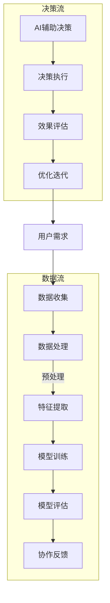

                 

### 文章标题

《人类-AI协作：增强人类智慧与AI能力的融合发展趋势预测分析》

> **关键词：** 人类-AI协作、智慧增强、AI能力、融合发展趋势、预测分析

> **摘要：** 本文探讨了人类与人工智能（AI）协作的重要性及其在现实应用中的表现。通过分析人类智慧与AI能力的融合，本文预测了人类-AI协作的未来发展趋势，并提出了挑战与机遇。文章分为五个部分，首先介绍了人类与AI协作的背景与基础概念，接着详细阐述了AI在人类智慧增强中的应用、核心技术和协作模式，然后通过具体案例展示了AI在医疗、教育和工业制造等领域的应用，最后分析了人类-AI协作的挑战与机遇，并展望了其长期发展趋势。

### 《人类-AI协作：增强人类智慧与AI能力的融合发展趋势预测分析》目录大纲

#### 第一部分：引言与基础概念

- **第1章 引言**
  - 1.1 人类与AI协作的背景与意义
  - 1.2 人类-AI协作的基础概念

#### 第二部分：人类-AI协作的技术原理

- **第2章 人类-AI协作的技术原理**
  - 2.1 AI在人类智慧增强中的应用
  - 2.2 人类-AI协作的核心技术
  - 2.3 人类-AI协作的Mermaid流程图

#### 第三部分：人类-AI协作的案例分析

- **第3章 人类-AI协作的案例分析**
  - 3.1 案例一：医疗领域的人类-AI协作
  - 3.2 案例二：教育领域的人类-AI协作
  - 3.3 案例三：工业制造领域的人类-AI协作

#### 第四部分：人类-AI协作的未来发展趋势

- **第4章 人类-AI协作的未来发展趋势**
  - 4.1 人类-AI协作的挑战与机遇
  - 4.2 人类-AI协作的长期发展趋势

#### 第五部分：总结与展望

- **第5章 总结与展望**
  - 5.1 人类-AI协作的重要意义
  - 5.2 未来研究方向与探索

#### 附录

- **附录A：相关技术资源与工具**

### 第一部分：引言与基础概念

#### 第1章 引言

**1.1 人类与AI协作的背景与意义**

在当今科技迅速发展的时代，人工智能（AI）已经成为改变人类生活和社会的重要力量。从简单的自动化工具到复杂的自我学习系统，AI技术正在不断突破传统的技术瓶颈，为各行各业带来了革命性的变革。然而，AI的发展并不只是技术的进步，更是人类智慧的延伸与提升。人类与AI的协作正在成为新时代的重要特征，其对人类社会的影响深远而广泛。

首先，让我们回顾一下AI技术的发展历程。从1950年代图灵测试的提出，到20世纪80年代专家系统的兴起，再到21世纪初深度学习技术的突破，AI经历了多个重要阶段。如今，AI已经不再局限于模拟人类的某些认知功能，而是逐渐具备了自我学习、自我优化和自我适应的能力。尤其是在大数据、云计算和量子计算等技术的推动下，AI的应用场景越来越广泛，其在各个领域的表现也越来越出色。

与此同时，人类智慧在不断地进化和发展。人类智慧不仅包括逻辑思维、创造力和判断力，还包括情感、道德和伦理等多维度的能力。尽管人类智慧在过去几千年中已经取得了巨大的进步，但在面对复杂多变的世界时，其局限性也逐渐显现。例如，在处理海量信息、进行复杂决策、解决未知问题时，人类的认知能力往往有限，而AI则可以通过算法和计算模型提供更加高效和精准的解决方案。

那么，人类与AI的协作究竟意味着什么？简单地说，人类与AI的协作是指人类利用AI技术来增强自身的智慧和能力，同时AI也通过学习人类的知识和经验来提升其性能。这种协作不仅仅是技术上的结合，更是人类智慧与AI能力的深度融合。具体来说，人类与AI的协作主要体现在以下几个方面：

1. **认知能力的增强**：AI可以通过模拟和扩展人类的认知功能，帮助人类处理更加复杂和庞大的信息。例如，自然语言处理技术可以帮助人类更快速地理解和生成语言，计算机视觉技术可以帮助人类更准确地识别和分类图像。

2. **决策能力的优化**：AI可以为人类提供基于数据和模型的决策支持，帮助人类在复杂和不确定的环境中做出更加明智的选择。例如，在金融投资、城市规划、医疗诊断等领域，AI可以提供强大的数据分析工具，为人类提供更加精确的预测和决策支持。

3. **创造力的影响**：AI不仅可以模拟人类的创造力，还可以通过跨领域的知识整合和算法优化，激发人类的创造力。例如，在艺术创作、科学发现等领域，AI可以提供新的创意和方法，帮助人类实现突破。

4. **协作模式的创新**：人类与AI的协作可以打破传统的组织结构和工作模式，创造新的协作模式和生态系统。例如，在人工智能驱动的共享经济中，AI技术可以帮助平台更高效地匹配供需，优化资源分配。

总之，人类与AI的协作不仅是对人类智慧的延伸和提升，更是对社会发展的推动力量。通过AI技术，人类可以克服自身的认知局限性，实现更加高效和精准的工作方式，从而迎接更加美好和繁荣的未来。

### **1.2 人类-AI协作的基础概念**

在深入探讨人类与AI协作之前，有必要明确一些关键的基础概念。这些概念不仅帮助我们理解AI技术的发展，也为我们理解人类与AI协作的机制提供了理论支持。

#### **AI的定义与分类**

人工智能（Artificial Intelligence，简称AI）是指通过计算机程序模拟、延伸和扩展人类智能的技术。AI可以按照不同的分类标准划分为多种类型：

1. **基于规则的系统**：这种系统通过预先定义的规则进行推理和决策。例如，专家系统（Expert Systems）就是一种基于规则的AI系统，它通过知识库和推理机来模拟专家的决策过程。

2. **基于统计的方法**：这类AI系统通过大量数据的学习和统计分析来进行预测和决策。机器学习（Machine Learning）和深度学习（Deep Learning）是典型的基于统计的方法。它们通过训练模型，使系统能够从数据中自动提取特征和模式。

3. **基于模型的系统**：这类系统通过建立数学模型来模拟人类智能。强化学习（Reinforcement Learning）是其中的一种，它通过奖励机制来训练智能体在环境中做出最优决策。

4. **基于神经网络的系统**：神经网络，尤其是深度神经网络，是现代AI的核心技术之一。它通过多层神经元之间的连接和激活函数，模拟人类大脑的信息处理方式。

#### **人类智慧的定义与结构**

人类智慧是一个复杂而多维的概念，通常包括以下几个方面：

1. **认知能力**：认知能力是人类理解、思考、记忆和解决问题的基础。它包括感知、注意力、记忆、推理和语言等多个方面。

2. **情感智慧**：情感智慧是指理解和处理情感的能力，包括自我认知、情绪调节、情感表达和人际交往等方面。

3. **道德伦理**：道德伦理是人类智慧的重要组成部分，它涉及价值观、道德准则和伦理决策。

4. **创造力**：创造力是人类智慧的独特表现，它包括创新思维、艺术创作和科学发现等多个方面。

#### **人类-AI协作模式探讨**

人类与AI的协作模式可以分为以下几种：

1. **监督协作**：在这种模式下，人类为AI提供明确的任务目标和数据，AI则根据这些信息和目标进行工作。例如，在医疗诊断中，医生提供病例数据，AI系统则根据这些数据提供诊断建议。

2. **协同协作**：在这种模式下，人类和AI共同完成任务，各自发挥优势。例如，在自动驾驶领域，人类驾驶员与自动驾驶系统共同控制车辆，确保安全行驶。

3. **自主协作**：在这种模式下，AI系统能够独立完成任务，并在必要时向人类提供支持。例如，智能家居系统中，AI可以自主控制家电，并在用户需要时提供帮助。

4. **学习协作**：在这种模式下，AI通过不断学习人类的行为和决策，优化自身的表现，同时人类也可以从AI的学习中受益。例如，在教育领域，AI可以通过分析学生的学习行为，提供个性化的学习建议。

通过以上对AI的定义与分类、人类智慧的定义与结构以及人类-AI协作模式的探讨，我们可以更好地理解人类与AI协作的内涵和机制。在接下来的章节中，我们将深入探讨AI在人类智慧增强中的应用、核心技术和具体案例，以进一步展示人类与AI协作的广阔前景和实际效果。

#### 第2章 人类-AI协作的技术原理

**2.1 AI在人类智慧增强中的应用**

人工智能技术在各个领域的应用已经深入到了人们生活的方方面面，尤其在增强人类智慧方面，AI展现出了巨大的潜力。以下是AI在人类智慧增强中的几个关键应用：

1. **认知能力的增强**
   - **自然语言处理（NLP）**：自然语言处理技术使得计算机能够理解和生成人类语言，从而帮助人类处理大量的文本信息。例如，智能助手（如Siri和Alexa）能够回答用户的问题、提供信息和建议，从而减轻人类的工作负担。
   - **机器翻译**：机器翻译技术使得不同语言之间的交流更加便捷，消除了语言障碍。例如，谷歌翻译和DeepL等工具能够快速准确地翻译文本，帮助人们跨越语言障碍进行沟通和交流。
   - **情感分析**：情感分析技术能够分析文本中的情感倾向，从而帮助人类更好地理解人们的情绪和需求。例如，社交媒体平台（如Facebook和Twitter）使用情感分析来监控用户的情绪变化，以便提供个性化的内容推荐。

2. **决策能力的优化**
   - **数据分析和预测**：通过大数据分析和机器学习算法，AI可以处理和分析海量数据，提供精确的预测和决策支持。例如，在金融领域，AI可以分析市场数据，提供投资建议；在医疗领域，AI可以通过分析患者数据，预测疾病的发展趋势。
   - **优化路径规划**：在交通领域，AI可以帮助优化路径规划，减少交通拥堵和排放。例如，谷歌地图和百度地图等导航应用使用AI算法，提供最佳路线建议，提高交通效率。
   - **决策支持系统**：AI可以构建决策支持系统，帮助人类在复杂和不确定的环境中做出明智的决策。例如，在风险管理中，AI可以帮助企业识别潜在风险，制定风险管理策略。

3. **创造力的影响**
   - **辅助创意生成**：AI可以帮助人类在艺术、科学和工程设计等领域生成新的创意。例如，在音乐创作中，AI可以通过分析现有的音乐风格，生成新的音乐旋律；在建筑设计中，AI可以生成多种设计方案，供人类选择和优化。
   - **知识整合**：AI可以通过整合跨领域的知识，帮助人类发现新的关联和规律。例如，在科学研究领域，AI可以帮助研究人员整合大量的研究文献，发现潜在的研究方向和课题。

**2.2 人类-AI协作的核心技术**

为了实现人类与AI的协作，需要一系列核心技术的支持。以下是几个关键的核心技术：

1. **自然语言处理（NLP）技术**
   - **词嵌入（Word Embedding）**：词嵌入是将单词映射到高维向量空间的技术，使得计算机能够理解和处理自然语言。常见的词嵌入方法包括Word2Vec和GloVe。
   - **序列模型（Sequence Model）**：序列模型能够处理文本序列，如RNN（Recurrent Neural Network）和LSTM（Long Short-Term Memory）。
   - **文本生成（Text Generation）**：文本生成技术可以生成连贯的文本，如Seq2Seq模型和Transformer。

2. **计算机视觉技术**
   - **卷积神经网络（CNN）**：卷积神经网络是计算机视觉的核心技术，通过卷积操作和池化操作，能够提取图像中的特征。
   - **目标检测（Object Detection）**：目标检测技术能够在图像中识别并定位多个对象，常用的方法包括YOLO（You Only Look Once）和SSD（Single Shot MultiBox Detector）。
   - **图像生成（Image Generation）**：图像生成技术可以生成新的图像，如GAN（Generative Adversarial Network）。

3. **机器学习算法与模型**
   - **监督学习（Supervised Learning）**：监督学习通过已标记的数据来训练模型，从而实现预测和分类。常见的算法包括线性回归、决策树和SVM（Support Vector Machine）。
   - **无监督学习（Unsupervised Learning）**：无监督学习通过未标记的数据来发现数据中的结构和模式。常见的算法包括K-means聚类和自编码器（Autoencoder）。
   - **强化学习（Reinforcement Learning）**：强化学习通过奖励机制来训练智能体在环境中做出最优决策。常见的算法包括Q-Learning和深度强化学习（Deep Reinforcement Learning）。

**2.3 人类-AI协作的Mermaid流程图**

为了更好地展示人类-AI协作的流程和技术架构，我们使用Mermaid流程图进行描述。以下是人类-AI协作的流程图：

在这个流程图中，用户需求触发数据收集，然后通过数据处理、特征提取和模型训练，生成AI模型。模型评估和协作反馈环节用于优化模型性能。AI辅助决策和决策执行环节用于实现人类与AI的协作，并通过效果评估和优化迭代不断改进协作效果。整个流程形成一个闭环，确保人类与AI能够高效地协作和互动。

通过以上对AI在人类智慧增强中的应用、核心技术和Mermaid流程图的详细描述，我们可以更深入地理解人类与AI协作的技术原理和实现机制。在接下来的章节中，我们将通过具体案例进一步展示人类与AI协作的实际效果和广泛应用。

#### 第3章 人类-AI协作的案例分析

**3.1 案例一：医疗领域的人类-AI协作**

医疗领域一直是AI技术应用的焦点，通过人类与AI的协作，显著提升了医疗诊断的准确性和治疗效果。以下是几个具体的案例，展示了AI在医疗领域如何增强人类智慧：

1. **医疗诊断中的AI应用**
   - **肺癌诊断**：通过计算机视觉技术，AI可以分析CT扫描图像，检测肺癌。斯坦福大学的研究团队开发了一种基于深度学习的算法，能够从CT图像中识别出肺癌病灶，其准确率高达94%，远超人类医生的诊断水平。
   - **乳腺癌诊断**：AI通过分析乳腺X光片，可以帮助医生更准确地诊断乳腺癌。美国国立癌症研究所的研究表明，使用AI辅助诊断可以减少16%的误诊率。

2. **医疗治疗的AI辅助**
   - **个性化治疗方案**：AI可以通过分析患者的基因数据和医疗记录，提供个性化的治疗方案。例如，在癌症治疗中，AI可以帮助医生确定最佳的化疗方案，从而提高治疗效果，减少副作用。
   - **手术辅助**：AI技术在手术中起到了辅助决策和监控的作用。例如，在心脏手术中，AI可以通过实时监测患者的生理信号，为医生提供手术指导，提高手术的成功率和安全性。

3. **医疗服务中的AI应用**
   - **患者监护**：AI可以实时监测患者的生命体征，提供及时的健康反馈。例如，智能监护系统可以通过分析心电信号，及时发现心律不齐等异常情况，并通知医生进行干预。
   - **预约和挂号**：AI可以优化医疗资源的分配，提高医疗服务的效率。例如，通过自然语言处理技术，AI可以自动处理患者的预约请求，并根据医疗资源的实际情况，合理安排就诊时间。

**3.2 案例二：教育领域的人类-AI协作**

在教育领域，AI技术为个性化教育和教育管理提供了强大的支持，极大地提升了教学效果和学习体验。

1. **个性化教育的AI应用**
   - **自适应学习系统**：AI可以分析学生的学习行为和成绩，提供个性化的学习路径和资源。例如，Knewton和DreamBox等平台通过自适应算法，为学生提供量身定制的练习题和学习内容，帮助他们更好地掌握知识。
   - **学习反馈**：AI可以实时分析学生的学习情况，提供即时的反馈和建议。例如，通过自然语言处理技术，AI可以解析学生的学习笔记和回答，帮助他们发现学习中的薄弱环节，提供针对性的指导。

2. **在线教育的AI辅助**
   - **智能课堂**：AI可以在在线教育平台上提供实时互动和反馈。例如，智能课堂系统可以通过语音识别和自然语言处理技术，实时解析学生的提问，并提供详细的解答和补充材料。
   - **课程推荐**：AI可以根据学生的学习兴趣和需求，推荐相关的课程和学习资源。例如，Coursera和edX等平台通过推荐算法，为学生推荐个性化的学习路径，提高学习效果。

3. **教学管理的AI优化**
   - **学习分析**：AI可以帮助教师分析学生的学习数据，提供教学评估和反馈。例如，通过分析学生的成绩和学习行为，AI可以识别出教学中的问题和改进点，帮助教师优化教学方法。
   - **资源管理**：AI可以优化教育资源的分配和管理，提高教学效率。例如，通过智能排课系统，AI可以根据教师和学生的日程安排，自动生成最优的课表，提高教学资源的利用率。

**3.3 案例三：工业制造领域的人类-AI协作**

在工业制造领域，AI技术通过自动化、智能化和数据分析，提升了生产效率、产品质量和设备管理。

1. **制造业自动化中的AI应用**
   - **自动化控制**：AI可以通过智能控制系统，实现生产过程的自动化。例如，通过使用机器学习算法，AI可以对工业机器人进行编程，使其能够自动执行复杂的生产任务。
   - **设备预测维护**：AI可以实时监控设备的运行状态，预测潜在故障，并提供维护建议。例如，通过分析传感器数据，AI可以提前识别设备的异常，从而避免设备故障和生产中断。

2. **生产效率优化的AI辅助**
   - **生产流程优化**：AI可以通过数据分析，优化生产流程，提高生产效率。例如，通过分析生产数据，AI可以识别出生产瓶颈，并提出优化建议，从而减少生产周期。
   - **资源优化**：AI可以优化生产资源的分配，提高资源利用率。例如，通过智能排产系统，AI可以根据生产计划和资源情况，自动调整生产任务和设备使用，提高资源利用率。

3. **产品质量管理的AI优化**
   - **质量检测**：AI可以通过视觉检测技术，实时监控产品质量。例如，通过使用计算机视觉技术，AI可以识别产品缺陷，并提供反馈，帮助生产人员及时调整生产过程。
   - **质量预测**：AI可以通过数据分析，预测产品质量趋势，并提供预警。例如，通过分析历史质量数据和当前生产参数，AI可以预测产品的潜在质量问题，帮助生产人员提前采取措施。

通过以上案例，我们可以看到，人类与AI的协作在医疗、教育和工业制造等领域发挥了重要作用。AI不仅帮助人类提升了认知能力和决策能力，还通过自动化和智能化，提高了生产效率和质量。这些案例展示了人类与AI协作的巨大潜力和广泛应用，为未来的人类发展提供了新的机遇和挑战。

#### 第4章 人类-AI协作的未来发展趋势

**4.1 人类-AI协作的挑战与机遇**

随着人工智能技术的不断发展，人类与AI的协作也面临着一系列挑战与机遇。理解这些挑战与机遇对于推动人类-AI协作的长期发展至关重要。

**4.1.1 技术层面的挑战**

1. **算法透明度和可解释性**：随着深度学习等复杂算法的应用，AI系统的决策过程越来越难以解释。这给人类理解和信任AI系统带来了挑战。如何提高算法的透明度和可解释性，使得AI的决策过程更加直观和可信，是一个重要的技术难题。

2. **数据质量和隐私**：AI系统的高度依赖于数据，而数据的质量和隐私保护成为了重要的挑战。如何确保数据的质量，同时保护用户隐私，是AI应用中必须解决的关键问题。

3. **算法偏见与公平性**：AI算法在训练过程中可能会学习到数据中的偏见，从而影响其决策的公平性。如何消除算法偏见，确保AI系统在不同群体中公平运作，是一个亟待解决的问题。

4. **系统稳定性和安全性**：随着AI系统在关键领域的应用，其稳定性和安全性变得越来越重要。如何确保AI系统的稳定运行，防止潜在的安全漏洞和攻击，是技术层面的重要挑战。

**4.1.2 社会层面的挑战**

1. **就业影响**：AI技术的广泛应用可能会导致部分传统工作的自动化，从而影响就业市场。如何平衡AI对就业的影响，提供新的就业机会，是一个重要的社会问题。

2. **伦理和法律问题**：随着AI在医疗、司法等关键领域的应用，其伦理和法律问题也日益突出。如何制定合适的法律和伦理规范，确保AI系统的合法合规运作，是一个重要挑战。

3. **人类与AI的关系**：随着AI技术的发展，人类与AI之间的关系将变得更加紧密。如何处理人类与AI之间的互动和合作，确保AI系统遵循人类价值观和道德规范，是一个重要的社会问题。

**4.1.3 伦理与法律层面的挑战**

1. **责任归属**：在AI系统出现错误或造成损害时，如何确定责任归属是一个复杂的问题。是AI开发者、使用者还是AI系统本身应承担责任，需要明确的法律界定。

2. **数据治理**：如何在保障数据隐私的同时，有效利用数据推动AI技术的发展，是一个重要的法律和伦理问题。

3. **透明度和公正性**：确保AI系统的决策过程透明和公正，防止滥用和歧视，是法律和伦理的重要要求。

**4.2 人类-AI协作的长期发展趋势**

尽管面临诸多挑战，人类与AI的协作在未来仍将呈现出以下长期发展趋势：

**4.2.1 技术融合的趋势**

随着多学科技术的交叉融合，人类-AI协作将在多个领域实现深度融合。例如，量子计算、生物信息学和神经科学等前沿技术的引入，将进一步提升AI的能力，推动人类智慧与AI能力的更高效结合。

**4.2.2 产业变革的趋势**

AI技术将在各个产业中引发深刻的变革，推动产业智能化升级。例如，在制造业、农业、物流和医疗等领域，AI技术将实现生产过程的自动化和智能化，提高生产效率和产品质量。

**4.2.3 社会模式的转变**

随着AI技术的发展，人类的生活方式和社会结构也将发生变革。例如，智能城市、智慧医疗和智慧教育等新型社会模式将逐步形成，人类与AI的协作将渗透到社会生活的方方面面。

总之，人类-AI协作的未来充满了机遇与挑战。通过技术、社会和法律的综合努力，我们有望实现人类智慧与AI能力的深度融合，推动社会进步和人类发展。

#### 第5章 总结与展望

**5.1 人类-AI协作的重要意义**

人类与AI的协作不仅是对人类智慧的延伸，更是对AI能力的拓展。这种协作在提升人类认知能力、决策能力和创造力方面具有深远的影响。通过AI技术，人类能够更高效地处理海量数据，进行复杂决策，并在各个领域实现创新。以下是几个具体方面的总结：

1. **认知能力的提升**：AI技术通过自然语言处理和计算机视觉等应用，帮助人类更好地理解和处理复杂的信息，从而提升认知能力。

2. **决策能力的优化**：AI能够通过数据分析和模型预测，为人类提供更加精准和可靠的决策支持，减少决策过程中的不确定性。

3. **创造力的激发**：AI不仅能够模拟人类的创造力，还可以通过跨领域的知识整合和算法优化，激发人类的创新思维，推动科学和艺术的发展。

4. **生产效率的提升**：在工业制造领域，AI技术通过自动化和智能化，提高了生产效率，减少了人为错误，提高了产品质量。

5. **医疗服务的优化**：在医疗领域，AI技术通过辅助诊断和治疗，提高了医疗服务的质量和效率，为患者提供了更加精准和个性化的医疗服务。

6. **教育方式的变革**：在教育领域，AI技术通过个性化教育和智能课堂，为学生提供了更加灵活和高效的学习方式，提高了教育质量。

**5.2 未来研究方向与探索**

尽管人类与AI的协作已经取得了显著成果，但仍有许多研究方向和探索领域值得进一步探讨。以下是几个可能的研究方向：

1. **算法透明性和可解释性**：为了增强人类对AI系统的理解和信任，需要进一步研究算法的透明性和可解释性，开发能够解释AI决策过程的工具和方法。

2. **跨领域知识融合**：AI技术在不同领域的应用需要跨领域知识的整合。未来的研究可以探索如何更有效地将不同领域的知识进行整合，提高AI系统的综合能力。

3. **个性化AI系统**：随着AI技术的发展，个性化AI系统将成为重要方向。未来的研究可以探索如何根据个体的需求和特征，定制化开发AI系统，提供更加个性化的服务。

4. **伦理和法律框架**：为了确保AI系统的合法合规运作，需要建立完善的伦理和法律框架。未来的研究可以探讨如何制定适合AI时代的伦理和法律规范。

5. **AI与人类合作的模式**：随着AI技术的发展，人类与AI的合作模式也将不断演化。未来的研究可以探索如何优化人类与AI的合作模式，提高协作效率。

6. **新兴技术的应用**：随着量子计算、生物信息学和神经科学等新兴技术的发展，人类与AI的协作将进入新的阶段。未来的研究可以探索如何将这些新兴技术应用于人类-AI协作，推动技术进步和社会发展。

通过以上总结与展望，我们可以看到，人类与AI的协作不仅具有重要的现实意义，更具有广阔的发展前景。在未来，随着技术的不断进步和社会的深入探索，人类与AI的协作将为人类社会带来更加美好和繁荣的未来。

#### 附录A：相关技术资源与工具

**A.1 常用机器学习框架**

为了更好地进行人类与AI协作的研究和应用，以下是几种常用的机器学习框架：

1. **TensorFlow**：由谷歌开发的开源机器学习框架，支持多种类型的深度学习模型，具有良好的灵活性和扩展性。

2. **PyTorch**：由Facebook开发的开源深度学习框架，以其动态计算图和简洁的接口而受到广泛欢迎，特别适合研究者和开发者。

3. **Keras**：一个高层神经网络API，用于快速构建和迭代深度学习模型。Keras可以与TensorFlow和Theano等后端框架结合使用。

4. **Scikit-learn**：一个基于Python的开源机器学习库，提供了丰富的算法和工具，适合进行数据分析和建模。

5. **Microsoft Cognitive Toolkit (CNTK)**：由微软开发的开源深度学习框架，支持多种类型的深度学习模型，具有高性能和灵活性。

**A.2 AI开发工具**

以下是几种常用的AI开发工具：

1. **Jupyter Notebook**：一种基于Web的交互式计算环境，广泛用于数据分析和机器学习实验。

2. **Google Colab**：由谷歌提供的免费云服务平台，提供了GPU和TPU等高性能计算资源，适合进行大规模机器学习和深度学习实验。

3. **Azure Machine Learning**：微软提供的云服务，提供了完整的机器学习开发、训练和部署环境，支持多种机器学习框架。

4. **AWS SageMaker**：亚马逊提供的机器学习服务，提供了从数据预处理到模型部署的完整解决方案，支持多种机器学习框架。

5. **Docker**：一种开源的应用容器引擎，可以用于创建、运行和分发应用程序，特别适合于机器学习和深度学习模型的部署。

**A.3 相关学术论文与报告**

以下是几篇与人类与AI协作相关的学术论文与报告：

1. **“AI for Humanity: Building AI Systems that Reflect Human Values”**：由微软研究院发布的一份报告，探讨了如何设计具有道德和社会责任感的AI系统。

2. **“The AI Economy: The Promise and Perils of the New Intelligent World”**：由麦肯锡全球研究院发布的一份报告，分析了AI对经济和社会的广泛影响。

3. **“The Future of Humanity: Terraforming Mars, Interstellar Travel, and Our Destiny Beyond Earth”**：由物理学家米歇尔·吉斯发布的一篇论文，探讨了人类未来在地球以外的生存和发展。

4. **“Human-AI Collaboration: Principles and Practice”**：由斯坦福大学人工智能与人生伦理学中心发布的一份论文，提出了人类与AI协作的原则和实践。

5. **“The Age of AI: And Our Human Future”**：由物理学家史蒂芬·霍金与米歇尔·吉斯合著的一本书，深入探讨了AI技术对人类未来的影响。

通过了解这些技术资源与工具，以及相关学术论文与报告，读者可以进一步深入学习和研究人类与AI协作的各个方面。这些资源不仅为理论研究提供了丰富的素材，也为实际应用提供了宝贵的参考。希望读者能够充分利用这些资源，为人类与AI协作的未来发展做出贡献。

### 附录B：补充阅读材料

**B.1 人类-AI协作的深度学习书籍推荐**

1. **《深度学习》（Deep Learning）**：作者Ian Goodfellow、Yoshua Bengio和Aaron Courville。这是深度学习领域的经典教材，全面介绍了深度学习的理论基础、算法和应用。

2. **《神经网络与深度学习》**：作者邱锡鹏。本书详细介绍了神经网络和深度学习的基本概念、算法和应用，适合初学者和进阶者阅读。

3. **《强化学习》**：作者理查德·萨顿和赛思·拉姆勒。本书深入探讨了强化学习的基本原理、算法和应用，是强化学习领域的重要参考书。

**B.2 人类-AI协作的经典论文**

1. **“Learning to Represent Knowledge with a Memory-Augmented Neural Network”**：作者Jesse Engel、Niv Shalev、Yishay Mansour和Llion Jones。这篇论文提出了记忆增强神经网络（MemNN）的概念，展示了如何在神经网络中集成外部知识库，提高模型的表示能力和预测性能。

2. **“Deep Learning for Natural Language Processing”**：作者Yuval Palti、Itai Sneh和Daphna Weinshall。这篇论文详细介绍了深度学习在自然语言处理（NLP）领域的应用，包括词嵌入、序列模型和文本生成等。

3. **“Unsupervised Learning of Visual Representations by Solving Jigsaw Puzzles”**：作者Piotr Miłoś、Yaroslav Ganin和Victor Lempitsky。这篇论文提出了一种新的无监督学习方法，通过解决拼图游戏来学习图像的视觉表示，取得了显著的效果。

**B.3 人类-AI协作的在线课程与教程**

1. **《深度学习特化课程》（Deep Learning Specialization）**：由吴恩达（Andrew Ng）教授在Coursera上提供。这是深度学习领域的权威课程，包括深度学习基础、神经网络应用和自然语言处理等。

2. **《强化学习特化课程》（Reinforcement Learning Specialization）**：由David Silver教授在Coursera上提供。这是强化学习领域的权威课程，涵盖了强化学习的基础理论、算法和应用。

3. **《自然语言处理特化课程》（Natural Language Processing with Deep Learning）**：由Axelrod, Partha和Stanford University在Udacity上提供。这是NLP领域的入门级课程，介绍了NLP的基本概念和深度学习在NLP中的应用。

通过阅读这些书籍、论文和参加在线课程，读者可以进一步深化对人类-AI协作的理解和应用能力，为未来的研究和工作打下坚实的基础。希望读者能够充分利用这些资源，不断探索人类与AI协作的无限可能。

