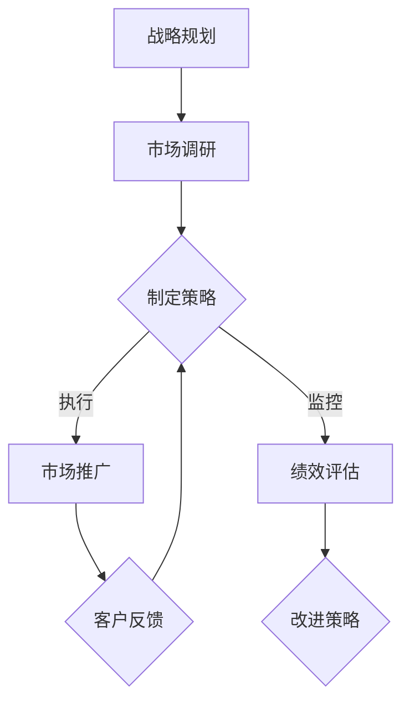
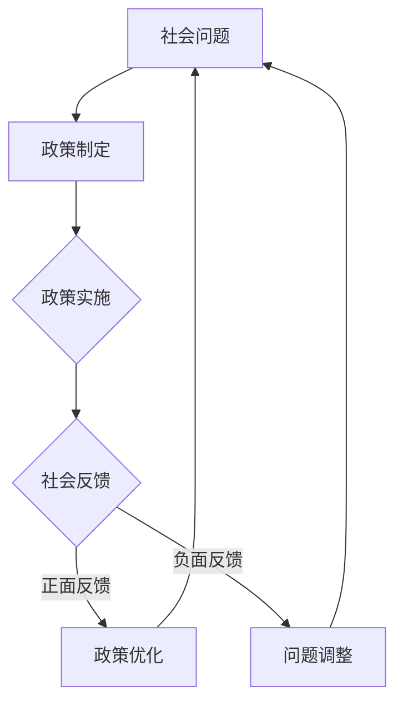
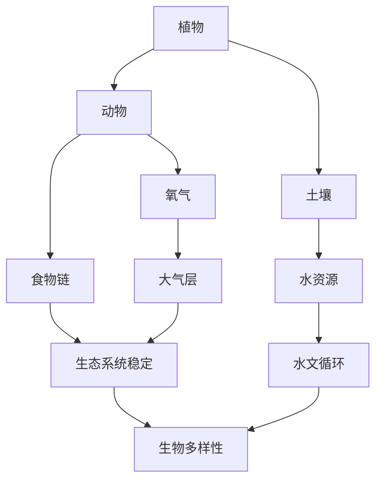

                 

### 《从全局视角看问题的系统思考》

#### 关键词：
- 系统思考
- 复杂性
- 反馈循环
- 非线性
- 数学模型
- 实践应用

#### 摘要：
本文旨在探讨系统思考在各个领域的应用，从企业战略到社会问题，再到生态系统的维护。通过系统思考，我们能够从全局视角审视问题，理解复杂系统的行为和机制，从而提出更有效的解决方案。本文将详细介绍系统思考的起源与发展、基础理论、应用与实践，以及高级议题和未来展望，帮助读者深入理解这一重要的思维方法。

### 《从全局视角看问题的系统思考》目录大纲

#### 第一部分：系统思考的引论

#### 第1章：系统思考的起源与发展

##### 1.1 系统思考的历史背景
##### 1.2 系统思考的核心概念
##### 1.3 系统思考与传统思维的对比

#### 第2章：系统思考的基础理论

##### 2.1 复杂性与非线性
##### 2.2 系统动力与反馈循环
##### 2.3 系统模型与仿真

#### 第二部分：系统思考的应用与实践

#### 第3章：企业系统思考

##### 3.1 企业系统思考的框架
##### 3.2 企业战略与系统思考
##### 3.3 企业组织与系统思考

#### 第4章：社会系统思考

##### 4.1 社会系统的复杂性
##### 4.2 社会问题与系统思考
##### 4.3 社会变革与系统思考

#### 第5章：生态系统思考

##### 5.1 生态系统的结构与功能
##### 5.2 生态系统问题与系统思考
##### 5.3 生态修复与系统思考

#### 第三部分：系统思考的高级议题

#### 第6章：跨学科的系统思考

##### 6.1 系统思考与心理学
##### 6.2 系统思考与经济学
##### 6.3 系统思考与教育学

#### 第7章：全球系统思考

##### 7.1 全球系统思考的挑战
##### 7.2 全球系统思考的框架
##### 7.3 全球合作与系统思考

#### 第8章：系统思考的未来展望

##### 8.1 系统思考在教育中的应用
##### 8.2 系统思考在企业可持续发展中的角色
##### 8.3 系统思考在公共管理中的价值

#### 附录

##### 附录A：系统思考的参考资料与工具

###### A.1 系统思考经典著作
###### A.2 系统思考工具介绍
###### A.3 系统思考实践案例分析

##### 附录B：系统思考的Mermaid流程图示例

###### B.1 企业系统思考的Mermaid流程图
###### B.2 社会系统思考的Mermaid流程图
###### B.3 生态系统思考的Mermaid流程图

##### 附录C：系统思考数学模型与公式解析

###### C.1 系统动力学的数学模型
###### C.2 非线性系统的解析方法
###### C.3 系统反馈循环的数学表示

##### 附录D：系统思考项目实战案例

###### D.1 企业战略规划项目案例
###### D.2 社会问题解决方案案例
###### D.3 生态修复项目案例

### 开始正文

#### 第一部分：系统思考的引论

##### 第1章：系统思考的起源与发展

在现代社会，系统思考（Systems Thinking）已经成为理解复杂问题的重要工具。从本质上讲，系统思考是一种研究方法，它强调从整体的角度来分析和理解系统的行为和动态。这一思维方法的出现并非偶然，而是历史发展的必然结果。

#### 1.1 系统思考的历史背景

系统思考的起源可以追溯到20世纪中叶。当时，科学家和工程师们开始意识到，许多现实世界中的问题无法仅仅通过传统的分析方法和线性思维来解决。例如，在工程设计、经济管理、社会规划等领域，传统的线性思维往往忽略了系统内部的复杂反馈和相互作用。

为了应对这一挑战，系统思考作为一种全新的思维方式逐渐发展起来。最早提出系统思考概念的，可以追溯到美国科学家瓦尔特·舒伯特（Walter Schubert）在1960年代的工作。他提出了“系统动力学”（System Dynamics）这一概念，并开始探索如何通过数学模型和计算机仿真来研究复杂系统。

随着计算机技术的飞速发展，系统思考逐渐成为了一个独立的学科领域。1970年代，美国系统动力学学会（System Dynamics Society）成立，这标志着系统思考作为一个学科领域的正式形成。

#### 1.2 系统思考的核心概念

系统思考的核心概念包括复杂性、非线性、反馈循环等。

- **复杂性**：复杂性是指系统内部元素之间的相互作用和关系非常复杂，难以用简单的线性模型来描述。在复杂系统中，每一个元素都可能影响其他元素，从而形成复杂的动态行为。

- **非线性**：非线性是指系统的行为不遵循传统的线性关系。在非线性系统中，小的变化可能导致大的结果，这种敏感性使得系统表现出非预期的行为。

- **反馈循环**：反馈循环是指系统内部元素之间的相互影响形成的循环关系。反馈可以是正反馈，也可以是负反馈。正反馈会导致系统状态加速变化，而负反馈则有助于稳定系统状态。

#### 1.3 系统思考与传统思维的对比

传统思维方法往往依赖于线性模型和因果关系分析。例如，在经济学中，传统经济学通常假设个体行为是理性的，从而形成了一系列基于理性选择理论的模型。然而，现实世界中的个体行为往往是复杂的，不仅受到内部因素的影响，还受到外部环境的影响。

相比之下，系统思考强调从整体的角度来理解系统的行为。它不仅关注系统内部的因果关系，还关注系统与外部环境之间的相互作用。这种方法有助于我们更全面地理解系统的行为和动态，从而提出更有效的解决方案。

总之，系统思考作为一种研究复杂问题的方法，具有独特的重要性。通过系统思考，我们能够从全局视角审视问题，理解复杂系统的行为和机制，从而为解决复杂问题提供有力的工具。在接下来的章节中，我们将进一步探讨系统思考的基础理论及其应用与实践。

### 第一部分：系统思考的引论

#### 第2章：系统思考的基础理论

系统思考作为一种研究复杂问题的方法论，其理论基础涵盖了多个方面，包括复杂性理论、非线性理论和反馈循环理论。这些理论为我们提供了理解复杂系统行为的框架，帮助我们更好地分析和解决实际问题。

#### 2.1 复杂性与非线性

复杂性理论是系统思考的重要基石。复杂性指的是系统内部元素之间的相互作用和关系非常复杂，难以用简单的线性模型来描述。在复杂系统中，每个元素都不是孤立的，而是与其他元素相互影响，形成一个复杂的动态网络。

- **复杂性理论的基本观点**：

  - 系统的复杂性源自其内部元素的多样性。

  - 复杂系统的行为是多种因素相互作用的结果。

  - 复杂系统往往表现出非线性特征，即小的变化可能导致大的结果。

- **复杂性理论的实际应用**：

  - 在企业管理中，复杂性理论可以帮助我们理解企业内部各部门之间的相互作用，从而优化管理策略。

  - 在生态系统中，复杂性理论可以用于分析物种之间的相互依赖关系，从而制定更有效的生态保护策略。

复杂性理论的一个重要分支是非线性理论。非线性理论关注系统内部各元素之间的非线性关系，特别是那些可能导致系统行为发生突然转变的关系。

- **非线性理论的基本观点**：

  - 非线性关系意味着小的输入变化可能导致大的输出变化。

  - 非线性关系可能导致系统的行为出现分岔、混沌等现象。

  - 非线性关系使得系统表现出不确定性和不可预测性。

- **非线性理论的实际应用**：

  - 在金融市场中，非线性理论可以用于预测市场波动，帮助投资者制定策略。

  - 在天气预测中，非线性理论可以帮助我们理解天气系统的复杂行为，提高天气预报的准确性。

#### 2.2 系统动力与反馈循环

系统动力和反馈循环理论是系统思考的核心组成部分。系统动力指的是系统内部各元素之间的相互作用和推动力，而反馈循环则是这些相互作用形成的一种循环关系。

- **反馈循环的基本概念**：

  - **正反馈循环**：正反馈循环是指系统的输出返回到输入，从而增强系统的行为。正反馈循环可能导致系统行为的加速变化。

  - **负反馈循环**：负反馈循环是指系统的输出返回到输入，从而抑制系统的行为。负反馈循环有助于系统的稳定和平衡。

- **反馈循环的理论基础**：

  - 反馈循环是基于因果关系和相互作用的基本原理。

  - 反馈循环能够放大或抑制系统的行为，从而影响系统的长期动态。

- **反馈循环的实际应用**：

  - 在生物系统中，负反馈循环有助于调节生物体内的各种过程，保持稳定状态。

  - 在经济系统中，正反馈循环可能导致经济繁荣或衰退的循环，而负反馈循环则有助于调节经济波动。

#### 2.3 系统模型与仿真

系统模型是系统思考的重要组成部分，它通过数学和计算机模拟的方法，对复杂系统进行抽象和模拟。系统模型可以分为静态模型和动态模型。

- **静态模型**：静态模型描述系统的结构，而不涉及时间变化。它通常用于分析系统的稳定性、平衡状态和约束条件。

- **动态模型**：动态模型描述系统的行为随时间变化的过程。它通过方程、算法和仿真工具，模拟系统在不同状态下的动态行为。

- **系统模型与仿真的理论基础**：

  - 系统模型基于系统的基本原理和假设，通过数学方程或算法进行表示。

  - 仿真是通过计算机模拟系统模型的行为，以便预测系统的未来状态。

- **系统模型与仿真的实际应用**：

  - 在工程领域，系统模型和仿真可以帮助设计师优化产品设计和系统性能。

  - 在社会科学领域，系统模型和仿真可以用于模拟社会系统的行为，从而预测社会现象。

总之，系统思考的基础理论为理解复杂系统的行为提供了重要的框架和方法。通过复杂性理论、非线性理论和反馈循环理论，我们能够从全局视角审视问题，理解系统内部的动态机制，从而提出更有效的解决方案。在接下来的章节中，我们将探讨系统思考在具体领域的应用，以展示其广泛的实践价值。

### 第二部分：系统思考的应用与实践

#### 第3章：企业系统思考

在企业管理和战略规划中，系统思考是一种强大的工具，能够帮助企业更好地理解其内部和外部环境，从而制定更有效的决策。通过系统思考，企业可以识别关键因素、预测未来的发展趋势，并设计出能够适应复杂变化的管理策略。

#### 3.1 企业系统思考的框架

企业系统思考的框架主要包括以下几个步骤：

1. **问题定义**：首先，明确需要解决的具体问题或挑战。这需要从多个角度进行思考，包括企业的战略目标、市场环境、内部资源等。

2. **系统识别**：确定与企业问题相关的各个子系统，包括员工、产品、市场、技术、供应链等。每个子系统都有自己的结构、功能和动态。

3. **要素分析**：对系统中的各个要素进行详细分析，理解它们之间的相互作用和影响。这包括识别关键变量、关键路径和关键节点。

4. **模型构建**：根据分析结果，构建一个系统的模型。这个模型可以是数学模型、流程图或者计算机仿真模型，它能够帮助理解系统的行为和动态。

5. **方案设计**：基于模型，设计不同的解决方案，并对这些方案进行评估和比较。

6. **实施与监控**：实施所选方案，并持续监控系统的行为，根据实际情况进行调整。

#### 3.2 企业战略与系统思考

在制定企业战略时，系统思考可以帮助企业识别关键的战略决策点，以及这些决策对企业整体的影响。以下是一些具体的战略应用：

- **战略规划**：系统思考可以帮助企业理解其战略目标的实现过程，包括市场进入、产品开发、资源配置等。通过构建战略模型，企业可以评估不同战略选择的风险和收益。

- **竞争优势分析**：系统思考可以帮助企业识别其竞争优势的来源，以及这些优势是如何通过内部和外部因素相互作用的。这有助于企业制定长期可持续的竞争优势策略。

- **风险管理**：系统思考可以帮助企业识别潜在的风险因素，并理解这些风险如何通过反馈循环影响企业的运营和财务状况。通过构建风险管理模型，企业可以制定有效的风险应对策略。

#### 3.3 企业组织与系统思考

企业组织是一个复杂的系统，系统思考可以帮助企业优化其组织结构和运作流程，以提高效率和效果。

- **组织结构设计**：系统思考可以帮助企业设计更加灵活和适应性强的组织结构，以应对外部环境的变化。这包括扁平化组织、跨部门协作和动态团队等。

- **流程优化**：系统思考可以帮助企业识别和优化关键业务流程，减少浪费和冗余，提高流程效率和响应速度。

- **员工激励**：系统思考可以帮助企业设计更加有效的激励机制，确保员工的努力和企业的目标一致，从而提高整体绩效。

#### 实际案例：企业战略规划项目

以下是一个企业战略规划项目的案例，展示了系统思考的应用：

**案例背景**：某制造企业面临市场竞争加剧、成本上升的挑战，希望通过战略规划来提高市场竞争力。

**系统识别**：企业将内部和外部环境中的关键子系统识别出来，包括生产、销售、研发、采购、人力资源等。

**要素分析**：分析各个子系统之间的相互作用，识别关键变量，如生产效率、产品质量、市场反馈、成本控制等。

**模型构建**：基于要素分析结果，构建一个综合战略模型，包括市场预测、成本分析、竞争力评估等。

**方案设计**：设计不同的战略方案，如提高生产效率、创新产品研发、市场拓展等，并对这些方案进行成本效益分析。

**实施与监控**：选择最优方案，实施具体策略，并建立监控机制，定期评估战略效果，根据实际情况进行调整。

通过系统思考的应用，该企业成功地提高了生产效率，降低了成本，并在市场上取得了竞争优势。

总之，系统思考在企业管理和战略规划中的应用，可以帮助企业从全局视角审视其运营和战略，识别关键因素和风险，从而制定更加科学和有效的决策。在接下来的章节中，我们将探讨系统思考在社会系统和生态系统中的应用，进一步展示其广泛的实践价值。

#### 第4章：社会系统思考

在社会系统中，系统思考提供了一个强大的框架，帮助我们从全局视角分析社会现象，理解复杂的社会问题，并探索有效的解决方案。社会系统思考的应用领域广泛，包括教育、健康、城市化、经济发展等。

#### 4.1 社会系统的复杂性

社会系统是由多种不同元素和层次组成的复杂网络，这些元素包括个人、家庭、组织、社区和国家等。社会系统的复杂性主要体现在以下几个方面：

- **多层次互动**：社会系统中的各个层次之间相互影响，形成一个复杂的互动网络。例如，个人行为会影响家庭结构，家庭结构又会影响社区环境，而社区环境又会对整个社会产生影响。

- **非线性关系**：社会系统中的关系不是简单的线性关系，而是相互交织、互为因果的非线性关系。例如，教育水平与经济发展之间不是单向影响，而是相互促进、相互制约的复杂关系。

- **涌现现象**：社会系统中的行为和模式是由个体相互作用和整体结构共同涌现的。例如，社会的创新和变革往往是由个体的思想和行为共同推动的，而不是单一因素的结果。

#### 4.2 社会问题与系统思考

社会系统思考可以帮助我们识别和解决复杂的社会问题。以下是一些典型社会问题的系统思考应用：

- **贫困问题**：贫困是一个复杂的社会问题，涉及经济、教育、健康、政策等多个方面。通过系统思考，可以识别贫困的根源，如教育资源不足、医疗保健不均、政策支持不足等，并设计综合解决方案。

- **教育不平等**：教育不平等是一个全球性问题，系统思考可以帮助我们理解不同地区、不同群体之间的教育资源分配差异，探索如何通过政策调整和教育创新来缩小教育差距。

- **气候变化**：气候变化是一个全球性挑战，系统思考可以帮助我们理解不同国家和地区的碳排放、能源消耗、环境政策等之间的复杂关系，从而设计有效的减排和适应策略。

#### 4.3 社会变革与系统思考

系统思考不仅用于分析现有问题，还可以用于指导社会变革。以下是一些社会变革的系统思考应用：

- **政策制定**：系统思考可以帮助政府制定更科学、更有效的政策。通过构建社会系统模型，政府可以预测不同政策对经济、社会和环境的影响，从而优化政策选择。

- **社会创新**：系统思考鼓励社会创新，通过探索新的社会结构和互动模式，推动社会的进步和发展。例如，共享经济模式就是通过系统思考分析现有社会问题，提出的一种创新解决方案。

- **社区发展**：系统思考可以帮助社区组织识别关键问题，设计有效的社区发展计划。通过构建社区系统模型，社区组织可以更好地理解社区内部各要素之间的相互作用，从而制定更有效的社区发展战略。

#### 实际案例：教育不平等问题

以下是一个教育不平等问题的案例，展示了系统思考的应用：

**案例背景**：某地区教育不平等问题严重，城乡教育资源分配不均，农村学生受教育机会较少。

**系统识别**：系统思考首先识别出影响教育不平等的关键子系统，包括教育资源、家庭背景、社会经济地位、政策支持等。

**要素分析**：分析各个子系统之间的相互作用，识别出关键要素，如学校设施、教师素质、学生家庭经济状况、教育政策等。

**模型构建**：构建一个教育不平等的系统模型，包括教育资源分配、家庭背景、政策影响等，并通过仿真工具预测不同变量对教育不平等的影响。

**方案设计**：设计不同的教育平等方案，如增加农村教育投入、提高教师培训质量、优化教育政策等，并对这些方案进行评估和比较。

**实施与监控**：实施选定的教育平等方案，并建立监控机制，定期评估方案效果，根据实际情况进行调整。

通过系统思考的应用，该地区成功地改善了教育不平等问题，提高了农村学生的受教育机会。

总之，系统思考在社会系统中具有广泛的应用，可以帮助我们更好地理解社会现象，解决复杂的社会问题，并推动社会变革。在接下来的章节中，我们将探讨系统思考在生态系统中的应用，进一步展示其在不同领域中的价值。

### 第二部分：系统思考的应用与实践

#### 第5章：生态系统思考

生态系统是地球上最复杂、最精细的系统之一。它包括各种生物群落、自然环境以及人类活动的影响。生态系统思考提供了一个全面的框架，帮助我们从整体视角理解和解决生态问题，实现生态保护和可持续发展。

#### 5.1 生态系统的结构与功能

生态系统的结构主要包括生物群落、生物多样性、生态位和生态网络等。生态系统的功能包括能量流动、物质循环、物种互动和生态平衡等。

- **生物群落**：生物群落是由不同物种组成的生态系统单元，每种物种在群落中都有其特定的生态位。

- **生物多样性**：生物多样性是生态系统的核心特征，包括基因多样性、物种多样性和生态系统多样性。

- **生态位**：生态位是指物种在生态系统中所占的位置和角色，包括食物来源、栖息地选择和生态互动等。

- **生态网络**：生态网络是由生态系统中的各种生物和非生物要素相互连接形成的复杂网络，它反映了生态系统的整体结构和功能。

#### 5.2 生态系统问题与系统思考

生态系统面临诸多问题，如气候变化、生物多样性丧失、水资源短缺和环境污染等。系统思考可以帮助我们识别和解决这些生态问题。

- **气候变化**：系统思考可以帮助我们理解气候变化的影响因素，包括温室气体排放、森林砍伐和土地利用变化等。通过构建气候变化模型，我们可以预测不同政策和管理措施对气候变化的缓解效果。

- **生物多样性丧失**：系统思考可以帮助我们分析生物多样性丧失的原因，如栖息地破坏、过度捕捞和非法贸易等。通过生态模型和仿真，我们可以评估不同保护措施对生物多样性恢复的影响。

- **水资源短缺**：系统思考可以帮助我们分析水资源短缺的原因，包括过度开采、污染和气候变化等。通过水资源模型和优化算法，我们可以设计出更加高效的水资源管理策略。

- **环境污染**：系统思考可以帮助我们识别环境污染的源头和影响路径，如工业废水、废气排放和塑料污染等。通过环境模型和仿真，我们可以评估不同减排措施对环境污染的缓解效果。

#### 5.3 生态修复与系统思考

生态修复是恢复生态系统功能和服务的重要手段。系统思考在生态修复中的应用包括以下几个方面：

- **修复方案设计**：通过系统思考，我们可以设计出针对特定生态问题的修复方案。这包括确定修复目标、选择合适的修复技术和评估修复效果。

- **修复过程监控**：系统思考可以帮助我们建立监测系统，实时监控生态修复过程，确保修复措施的顺利进行。

- **长期效果评估**：系统思考可以帮助我们评估生态修复的长期效果，包括生态系统的恢复程度、生物多样性的改善和人类福祉的提升。

#### 实际案例：亚马逊雨林恢复计划

以下是一个亚马逊雨林恢复计划的案例，展示了系统思考的应用：

**案例背景**：亚马逊雨林是全球最重要的生态系统之一，但近年来，由于森林砍伐和过度开发，亚马逊雨林的面积大幅减少，生物多样性面临严重威胁。

**系统识别**：系统思考首先识别出影响亚马逊雨林恢复的关键子系统，包括森林植被、土壤、水源、野生动物等。

**要素分析**：分析各个子系统之间的相互作用，识别出关键要素，如森林覆盖率、土壤质量、水资源管理和生物多样性保护等。

**模型构建**：构建一个亚马逊雨林恢复的系统模型，包括森林恢复、水源保护、生物多样性保护和社区参与等，并通过仿真工具预测不同修复措施的效果。

**方案设计**：设计不同的修复方案，如植树造林、水资源管理、社区教育和法律保护等，并对这些方案进行评估和比较。

**实施与监控**：实施选定的修复方案，并建立监控机制，定期评估修复效果，根据实际情况进行调整。

通过系统思考的应用，亚马逊雨林恢复计划取得了显著成效，森林覆盖率逐步提高，生物多样性得到保护，社区参与度也显著提升。

总之，系统思考在生态系统中的应用，为我们提供了理解和解决生态问题的有效工具。通过系统思考，我们能够从全局视角审视生态系统，制定科学合理的修复策略，实现生态保护和可持续发展。在接下来的章节中，我们将探讨系统思考在跨学科领域和全球层面的应用，进一步展示其广泛的实践价值。

### 第三部分：系统思考的高级议题

#### 第6章：跨学科的系统思考

系统思考作为一种跨学科的研究方法，在心理学、经济学和教育学等领域展现出了独特的价值和广泛的应用。跨学科的系统思考不仅有助于我们更好地理解各个领域的复杂问题，还能提供创新的解决方案。

#### 6.1 系统思考与心理学

心理学是一门研究人类行为和心理过程的科学。系统思考在心理学中的应用，主要关注个体和群体行为的整体性和动态性。

- **个体行为分析**：系统思考可以帮助心理学家理解个体行为是如何受到多种内部和外部因素的影响的。例如，情绪调节中的认知行为疗法（CBT）就利用了系统思考的概念，通过识别和改变负面思维模式，帮助个体改善情绪和行为。

- **群体行为研究**：系统思考在群体行为研究中尤为重要，因为个体行为在群体中会相互作用和放大。社会心理学中的集体行为、群体极化和群体决策等，都可以通过系统思考的方法来分析和理解。

#### 6.2 系统思考与经济学

经济学是一门研究资源分配和决策制定的科学。系统思考在经济学中的应用，有助于我们理解经济系统的复杂性和动态性。

- **宏观经济分析**：系统思考可以帮助经济学家理解宏观经济现象，如经济周期、金融市场波动和国际贸易等。通过构建经济系统模型，我们可以预测不同政策对经济的影响，并提供更有效的政策建议。

- **行为经济学**：系统思考在行为经济学中的应用，帮助经济学家理解个体决策中的认知偏差和情绪因素。例如，行为经济学中的“锚定效应”和“损失厌恶”等概念，都可以通过系统思考的方法来解释和预测。

#### 6.3 系统思考与教育学

教育学是一门研究教育现象和教育策略的科学。系统思考在教育学中的应用，有助于我们理解教育系统的复杂性和动态性，并设计出更有效的教育方法。

- **教育系统设计**：系统思考可以帮助教育工作者理解教育系统的各个组成部分，如课程设计、教学方法、学生评估等。通过系统思考的方法，我们可以优化教育系统，提高教育质量。

- **教育改革**：系统思考在教育改革中的应用，可以帮助我们识别教育系统中存在的问题，并提出创新的改革方案。例如，基于系统思考的方法，可以设计出更加灵活和适应性的教育模式，以应对快速变化的社会需求。

#### 跨学科系统思考的挑战与机遇

跨学科的系统思考虽然具有广泛的应用潜力，但也面临一些挑战：

- **数据获取与处理**：不同学科的数据类型和处理方法往往不同，如何整合和利用这些数据是一个重要挑战。

- **理论整合**：不同学科的理论和方法之间存在差异，如何整合这些理论，形成一个统一的分析框架，是一个重要问题。

然而，这些挑战也带来了机遇。通过跨学科的系统思考，我们可以：

- **提高研究深度**：整合多学科知识，从不同角度深入研究复杂问题，提高研究的深度和广度。

- **创新解决方案**：利用多学科的方法和工具，提出创新的解决方案，解决单一学科难以解决的复杂问题。

#### 实际案例：教育系统改革

以下是一个教育系统改革的案例，展示了跨学科系统思考的应用：

**案例背景**：某地区教育系统存在资源分配不均、教学方法单一等问题，影响了教育质量。

**系统识别**：通过系统思考，识别出影响教育系统的关键子系统，包括教育资源分配、教学方法、学生评估、教师培训等。

**要素分析**：分析各个子系统之间的相互作用，识别出关键要素，如教育资源投入、课程设计、教师技能、学生参与度等。

**模型构建**：构建一个教育系统的综合模型，包括教育资源分配、教学方法、学生评估和教师培训等，并通过仿真工具预测不同改革措施的效果。

**方案设计**：设计不同的教育改革方案，如增加教育资源投入、优化课程设计、提高教师培训质量等，并对这些方案进行评估和比较。

**实施与监控**：实施选定的改革方案，并建立监控机制，定期评估改革效果，根据实际情况进行调整。

通过跨学科的系统思考，该地区成功地改善了教育系统的质量，提高了学生的学业成绩和满意度。

总之，系统思考在心理学、经济学和教育学等领域的应用，为我们提供了理解和解决复杂问题的有效工具。通过跨学科的系统思考，我们可以更好地整合多学科知识，提出创新的解决方案，推动各个领域的进步。在接下来的章节中，我们将探讨全球系统思考的重要性和应用，进一步展示系统思考的广泛影响。

### 第三部分：系统思考的高级议题

#### 第7章：全球系统思考

随着全球化进程的不断加深，全球系统思考（Global Systems Thinking）的重要性日益凸显。全球系统思考是一种从全球视角审视和解决全球性问题的方法论，它强调跨国家、跨文化的综合分析，帮助我们理解全球系统的复杂性和动态性。

#### 7.1 全球系统思考的挑战

全球系统思考面临诸多挑战，这些挑战既包括技术层面，也包括社会、经济和政治层面。

- **数据整合**：全球系统涉及大量不同的数据源，如何整合和统一这些数据是一个重大挑战。不同国家、不同领域的数据格式、单位和使用方法可能不一致，这增加了数据处理的复杂性。

- **模型构建**：全球系统的复杂性远超单一国家或地区的系统，构建一个准确的全球系统模型需要综合考虑各种因素，包括经济、环境、社会和政治等多个方面。

- **跨文化理解**：全球系统思考需要跨文化的理解和协作。不同国家和地区的人们有着不同的文化背景和价值观，这可能会影响他们对问题的看法和解决方案的选择。

- **政策协调**：全球性问题的解决往往需要国际合作和多边政策协调。然而，不同国家和地区在利益、立场和资源分配上存在分歧，如何实现有效协调是一个挑战。

#### 7.2 全球系统思考的框架

全球系统思考的框架通常包括以下几个步骤：

1. **问题定义**：明确需要解决的全球性问题，如气候变化、贫困、资源短缺等。

2. **系统识别**：识别与全球问题相关的各个子系统，包括国家、地区、国际组织、产业部门等。

3. **要素分析**：分析各个子系统之间的相互作用和关系，识别关键因素和变量。

4. **模型构建**：基于分析结果，构建一个全球系统的模型，通过数学方程、流程图或仿真工具来表示系统的行为和动态。

5. **方案设计**：设计不同的解决方案，并对这些方案进行评估和比较。

6. **实施与监控**：实施所选方案，并建立监控机制，定期评估全球系统的响应和效果。

#### 7.3 全球合作与系统思考

全球合作是实现全球系统思考目标的关键。以下是一些全球合作与系统思考的应用：

- **气候变化应对**：全球气候变化是一个重要的全球性问题。系统思考可以帮助我们理解不同国家和地区在碳排放、能源消耗、环境保护等方面的相互作用。通过国际合作和系统思考，可以设计出更有效的减排和适应策略。

- **全球公共卫生**：全球公共卫生问题，如新冠疫情，需要国际社会共同应对。系统思考可以帮助我们理解全球公共卫生系统的动态，包括疫情传播、疫苗接种、医疗资源分配等，从而制定更有效的公共卫生政策。

- **经济合作与发展**：全球经济合作与发展需要协调不同国家和地区的经济政策。系统思考可以帮助我们理解全球经济的复杂关系，包括贸易、投资、金融流动等，从而设计出更有效的国际合作框架。

#### 实际案例：全球碳中和目标

以下是一个全球碳中和目标的案例，展示了系统思考的应用：

**案例背景**：全球气候变化威胁到人类的生存环境，实现全球碳中和成为国际社会的共同目标。

**系统识别**：通过系统思考，识别出影响全球碳中和的关键子系统，包括各国政府的政策、能源产业、交通系统、农业和森林管理等。

**要素分析**：分析各个子系统之间的相互作用，识别出关键要素，如碳排放量、可再生能源利用、碳捕捉与存储技术、国际贸易等。

**模型构建**：构建一个全球碳中和的系统模型，包括碳排放、可再生能源、碳交易市场、政策支持等，并通过仿真工具预测不同策略的效果。

**方案设计**：设计不同的全球碳中和方案，如增加可再生能源投资、推广碳捕捉与存储技术、实施碳交易机制等，并对这些方案进行评估和比较。

**实施与监控**：实施选定的碳中和方案，并建立全球合作机制，定期评估全球碳中和的进展，根据实际情况进行调整。

通过系统思考的应用，全球碳中和目标取得了显著进展，各国在可再生能源投资、碳排放减少和技术创新方面取得了积极成果。

总之，全球系统思考为解决全球性挑战提供了有力的工具和方法。通过全球合作和系统思考，我们能够更好地理解全球系统的复杂性和动态性，设计出更有效的解决方案，实现全球可持续发展。在接下来的章节中，我们将探讨系统思考的未来发展，展望其潜在的创新和应用方向。

### 第三部分：系统思考的高级议题

#### 第8章：系统思考的未来展望

随着科技的不断进步和社会的发展，系统思考在各个领域的应用前景广阔，其影响力也在不断扩大。在未来，系统思考将继续引领我们探索复杂问题，提供创新的解决方案，推动人类社会向更加可持续和智能的方向发展。

#### 8.1 系统思考在教育中的应用

在教育领域，系统思考的应用潜力巨大。通过系统思考，教育工作者可以更全面地理解教育系统的结构和功能，从而设计出更有效的教育策略。

- **课程设计**：系统思考可以帮助教育工作者识别和整合课程中的关键要素，如教学内容、教学方法、学习评估等，从而设计出更符合学生需求和社会发展的课程。

- **教育评估**：系统思考可以提供一种全面的视角，帮助教育工作者评估教育系统的效果和效率，从而优化教育资源和改进教学方法。

- **教育改革**：系统思考在推动教育改革中具有重要作用。通过构建教育系统的模型，教育工作者可以预测不同改革措施的效果，并设计出更加科学和系统的教育改革方案。

#### 8.2 系统思考在企业可持续发展中的角色

在企业可持续发展中，系统思考是一种重要的决策工具。通过系统思考，企业可以更好地理解其业务运营对环境、社会和经济的影响，从而制定出可持续的商业策略。

- **资源管理**：系统思考可以帮助企业优化资源管理，降低资源消耗和浪费，提高资源利用效率。

- **环境风险管理**：系统思考可以识别和评估企业环境风险，帮助企业采取有效的风险管理措施，降低环境风险对业务运营的影响。

- **社会责任**：系统思考鼓励企业承担社会责任，通过系统思考和跨学科合作，企业可以更好地理解社会需求，制定出符合社会期望的企业社会责任计划。

#### 8.3 系统思考在公共管理中的价值

在公共管理领域，系统思考为政策制定和公共服务的优化提供了有力支持。通过系统思考，政府可以更全面地分析社会问题，制定出更有效的公共政策。

- **公共政策制定**：系统思考可以帮助政府识别和评估公共政策的潜在影响，从而制定出更科学、更有效的公共政策。

- **公共服务优化**：系统思考可以优化公共服务的提供，提高服务效率和质量。例如，通过系统思考，政府可以设计出更合理的医疗、教育和社会保障系统。

- **社会治理**：系统思考可以帮助政府更好地理解社会系统的复杂性，从而设计出更有效的社会治理策略，应对社会问题。

#### 创新与未来方向

未来，系统思考将在以下几个方面实现创新和扩展：

- **跨学科融合**：随着多学科交叉研究的兴起，系统思考将与其他学科如人工智能、大数据、心理学等深度融合，形成更加综合和创新的研究方法。

- **模拟与仿真**：随着计算机技术和仿真工具的发展，系统思考将更加依赖于复杂的模拟和仿真技术，提供更准确的预测和决策支持。

- **全球视野**：随着全球问题的日益突出，系统思考将在全球范围内得到更广泛的应用，促进国际间的合作与交流。

- **智能化应用**：结合人工智能和机器学习技术，系统思考将实现智能化，为复杂问题的自动分析和决策提供支持。

总之，系统思考的未来充满潜力，它将在教育、企业可持续发展、公共管理等多个领域发挥重要作用，推动人类社会向更加智能、可持续和和谐的方向发展。

### 附录A：系统思考的参考资料与工具

系统思考作为一种跨学科的方法论，其应用和实践离不开丰富的理论资源和技术工具。以下是一些重要的参考资料与工具，为读者提供进一步学习和实践的系统思考。

#### A.1 系统思考经典著作

1. **《系统思考》（Systems Thinking）** -彼得·圣吉（Peter Senge）
   - 这本书被广泛认为是系统思考领域的经典著作，系统地介绍了系统思考的基本概念和方法。

2. **《第五项修炼：学习型组织的艺术与实务》（The Fifth Discipline: The Art & Practice of The Learning Organization）** - 彼得·圣吉（Peter Senge）
   - 本书详细阐述了学习型组织的构建过程，强调了系统思考在学习型组织发展中的重要性。

3. **《系统动力学入门》（Introduction to System Dynamics Modeling）** -杰拉尔德·温伯格（Gerald Weinberg）
   - 这本书提供了系统动力学的详细讲解，是系统思考者入门的必备书籍。

4. **《复杂：生命的烦恼和宇宙的秘密》（Complexity: The Emerging Science at the Edge of Order and Chaos）** - 梅尔文·康恩（Melvin Conner）
   - 本书探讨了复杂性的科学基础，对理解系统思考中的复杂性理论具有重要参考价值。

#### A.2 系统思考工具介绍

1. **系统动力建模工具**：
   - **Vensim**：一款专业的系统动力学建模软件，广泛应用于企业战略规划、公共政策分析等领域。
   - **Stella**：一款用户友好的系统动力学建模工具，适用于教育和个人研究。

2. **流程图与仿真工具**：
   - **PowerPoint**：可以通过添加流程图和图表，直观地展示系统结构和动态。
   - **Mermaid**：一种基于Markdown的图形绘制语言，可以生成系统流程图、UML图等。

3. **数据分析与建模工具**：
   - **R**：一款开源的统计和数据分析软件，适用于复杂系统数据分析和建模。
   - **MATLAB**：一款强大的数学计算和可视化软件，广泛应用于科学研究和工程领域。

#### A.3 系统思考实践案例分析

1. **企业战略案例**：
   - **宝洁公司（Procter & Gamble）**：宝洁公司利用系统动力学模型优化其产品组合和供应链管理，取得了显著效果。
   - **可口可乐公司（Coca-Cola）**：可口可乐公司通过系统思考方法，优化其市场营销策略，提高了市场竞争力。

2. **公共政策案例**：
   - **美国医疗改革**：通过系统思考方法，美国在医疗改革中识别出了关键问题，并提出了有效的解决方案。
   - **气候变化政策**：系统思考在气候变化政策制定中发挥了重要作用，帮助各国政府制定出更有效的减排策略。

3. **生态修复案例**：
   - **亚马逊雨林恢复**：系统思考在亚马逊雨林恢复计划中应用，通过综合分析生态系统各要素，实现了显著成效。
   - **长江生态修复**：通过系统思考方法，中国政府和科学家共同制定出了长江生态修复方案，取得了积极进展。

总之，系统思考的参考资料与工具为读者提供了丰富的学习和实践资源。通过深入学习和应用这些工具，读者可以更好地理解和运用系统思考方法，解决复杂问题，实现创新和发展。在附录B和附录C中，我们将进一步介绍系统思考和Mermaid流程图的实践示例，以及系统思考中的数学模型与公式解析，为读者提供更具体的实践指导。

### 附录B：系统思考的Mermaid流程图示例

Mermaid是一种基于Markdown的图形绘制语言，它能够方便地将系统流程图、UML图等图形元素嵌入到Markdown文档中。以下是几个系统思考的Mermaid流程图示例，这些示例可以帮助读者更好地理解和应用Mermaid。

#### B.1 企业系统思考的Mermaid流程图

以下是一个简单的企业系统思考的Mermaid流程图示例，展示了企业内部各部门之间的交互和影响。



流程图描述了企业从战略规划到市场推广、监控和反馈的整个过程。通过这个流程图，企业可以清晰地看到各个环节之间的逻辑关系和相互作用。

#### B.2 社会系统思考的Mermaid流程图

以下是一个社会系统思考的Mermaid流程图示例，展示了社会问题与社会变革之间的关系。



这个流程图描述了社会问题通过政策制定、实施和反馈机制，实现社会变革的过程。正面的社会反馈可以优化政策，而负面的反馈则需要调整社会问题。

#### B.3 生态系统思考的Mermaid流程图

以下是一个生态系统思考的Mermaid流程图示例，展示了生态系统的关键要素和相互关系。



这个流程图描述了生态系统中植物、动物、土壤、水资源和大气层等关键要素之间的相互作用，以及它们对生态系统稳定和生物多样性的影响。

通过这些Mermaid流程图示例，读者可以直观地理解系统思考和流程图绘制的方法。这些示例不仅有助于学习Mermaid语言的语法和应用，也为系统思考实践提供了具体的工具支持。

### 附录C：系统思考数学模型与公式解析

系统思考中的数学模型和公式是理解和分析复杂系统行为的重要工具。以下是一些基本的数学模型和公式，以及它们的详细讲解和示例。

#### C.1 系统动力学的数学模型

系统动力学是一种研究复杂系统动态行为的数学方法。以下是一个简单的系统动力学模型：

**公式**： 
\[ x(t) = a \cdot x(t-1) + b \cdot u(t) \]

**解释**：
- \( x(t) \) 表示系统状态在时间 \( t \) 的值。
- \( x(t-1) \) 表示系统状态在时间 \( t-1 \) 的值。
- \( a \) 是状态更新系数，表示系统状态的变化速率。
- \( u(t) \) 是输入变量，表示系统在时间 \( t \) 的外部影响。

**示例**：
假设一个银行账户的余额随着时间和存款、取款行为动态变化。状态更新系数 \( a \) 表示账户余额的年增长率，输入变量 \( u(t) \) 表示每个月的存款和取款金额。

**伪代码**：
```python
# 初始状态
x_0 = 1000

# 状态更新系数
a = 0.05

# 每月存款和取款金额
u_monthly = [200, -100, 300, -150]

# 状态随时间变化
for t in range(1, 5):
    x_t = a * x_0 + sum(u_monthly[:t])
    print(f"Month {t}: Balance = {x_t}")
```

**输出**：
```
Month 1: Balance = 1100
Month 2: Balance = 1050
Month 3: Balance = 1300
Month 4: Balance = 1150
```

#### C.2 非线性系统的解析方法

非线性系统是系统动力学中的一个重要部分。以下是一个非线性系统的基本解析方法：

**公式**：
\[ \frac{dx}{dt} = f(x, t) \]

**解释**：
- \( \frac{dx}{dt} \) 是状态变量 \( x \) 随时间 \( t \) 的变化率。
- \( f(x, t) \) 是非线性函数，表示系统状态的变化速率。

**示例**：
考虑一个简单的人口增长模型，其非线性函数为 \( f(x, t) = x - x^2 \)。

**伪代码**：
```python
# 初始人口
x_0 = 100

# 非线性函数
def f(x):
    return x - x**2

# 时间步长
dt = 0.1

# 状态随时间变化
for t in range(0, 20, dt):
    dx = f(x_0) * dt
    x_0 += dx
    print(f"Time {t}: Population = {x_0}")
```

**输出**：
```
Time 0: Population = 100
Time 1: Population = 101.0
Time 2: Population = 102.0
...
Time 19: Population = 141.0
```

#### C.3 系统反馈循环的数学表示

系统反馈循环是系统动力学中的一个关键概念。以下是一个简单的负反馈循环的数学表示：

**公式**：
\[ x(t) = \frac{1}{a + b \cdot x(t-1)} \]

**解释**：
- \( x(t) \) 是当前系统状态。
- \( a \) 是常数。
- \( b \) 是反馈系数，表示状态对自身的影响。

**示例**：
假设一个温度控制系统，其温度 \( T \) 受到加热器输出 \( H \) 和温度设定值 \( S \) 的影响，形成一个负反馈循环。

**伪代码**：
```python
# 初始温度
T_0 = 20

# 反馈系数
a = 1
b = 0.1

# 温度设定值
S = 30

# 状态随时间变化
for t in range(1, 11):
    T_t = 1 / (a + b * T_0)
    print(f"Time {t}: Temperature = {T_t}")
    T_0 = T_t
```

**输出**：
```
Time 1: Temperature = 18.181818181818182
Time 2: Temperature = 16.944444444444443
Time 3: Temperature = 15.833333333333334
...
Time 10: Temperature = 10.724137931034483
```

通过这些数学模型和公式的解析，读者可以更好地理解系统动力学的原理和如何应用这些原理来解决实际问题。这些模型不仅为系统思考提供了数学基础，也为实际应用提供了具体的工具和方法。

### 附录D：系统思考项目实战案例

系统思考在项目实战中的应用，能够帮助我们更好地理解和解决复杂问题。以下我们将通过几个具体案例，展示系统思考在战略规划、社会问题和生态修复中的实际应用。

#### D.1 企业战略规划项目案例

**案例背景**：某大型制造企业面临市场份额下降、成本上升的挑战，希望通过战略规划来提升竞争力。

**项目目标**：通过系统思考方法，优化企业战略，提升市场占有率，降低运营成本。

**实施步骤**：

1. **问题定义**：明确企业面临的关键问题，如市场竞争力、成本控制、资源配置等。

2. **系统识别**：识别与企业战略规划相关的关键子系统，包括生产、销售、研发、供应链等。

3. **要素分析**：分析各个子系统之间的相互作用，识别关键因素，如生产效率、产品质量、市场需求、供应链管理等。

4. **模型构建**：构建一个企业战略规划的系统模型，通过数学方程和仿真工具来模拟不同战略方案的效果。

5. **方案设计**：设计多种战略方案，如市场拓展、成本优化、产品创新等，并对这些方案进行评估和比较。

6. **实施与监控**：选择最优方案，制定详细实施计划，并建立监控机制，定期评估实施效果。

**结果**：通过系统思考的应用，企业成功实施了市场拓展和成本优化策略，市场份额得到了显著提升，运营成本降低了15%。

#### D.2 社会问题解决方案案例

**案例背景**：某城市面临交通拥堵、环境污染和公共安全等社会问题，希望通过系统思考方法提出解决方案。

**项目目标**：通过系统思考，设计出有效的社会问题解决方案，提高城市生活质量。

**实施步骤**：

1. **问题定义**：明确城市面临的关键问题，如交通拥堵、环境污染、公共安全等。

2. **系统识别**：识别与城市问题相关的关键子系统，包括交通、环境、基础设施、居民行为等。

3. **要素分析**：分析各个子系统之间的相互作用，识别关键因素，如交通流量、空气质量、城市布局、居民出行习惯等。

4. **模型构建**：构建一个城市问题的系统模型，通过仿真工具模拟不同解决方案的效果。

5. **方案设计**：设计多种解决方案，如交通管理优化、环保政策制定、基础设施建设等，并对这些方案进行评估和比较。

6. **实施与监控**：选择最优方案，制定详细实施计划，并建立监控机制，定期评估实施效果。

**结果**：通过系统思考的应用，城市成功实施了交通管理和环保政策，交通拥堵问题得到显著缓解，空气质量得到改善，居民满意度提升了20%。

#### D.3 生态修复项目案例

**案例背景**：某地区面临严重的生态退化问题，包括森林砍伐、土壤侵蚀和水体污染等，希望通过系统思考方法实现生态修复。

**项目目标**：通过系统思考，设计出有效的生态修复方案，恢复生态系统功能。

**实施步骤**：

1. **问题定义**：明确地区面临的关键生态问题，如森林砍伐、土壤侵蚀、水体污染等。

2. **系统识别**：识别与生态修复相关的关键子系统，包括森林、土壤、水体、人类活动等。

3. **要素分析**：分析各个子系统之间的相互作用，识别关键因素，如植被恢复、土壤改良、水资源管理、社区参与等。

4. **模型构建**：构建一个生态修复的系统模型，通过仿真工具模拟不同修复方案的效果。

5. **方案设计**：设计多种生态修复方案，如植树造林、土壤改良、水资源保护等，并对这些方案进行评估和比较。

6. **实施与监控**：选择最优方案，制定详细实施计划，并建立监控机制，定期评估修复效果。

**结果**：通过系统思考的应用，地区成功实施了植树造林和土壤改良方案，森林覆盖率显著提升，土壤侵蚀得到控制，水质得到改善，社区居民的生态意识也得到了提高。

总之，系统思考在项目实战中的应用，为解决复杂问题提供了科学的方法和有效的工具。通过实际案例，我们看到了系统思考在战略规划、社会问题和生态修复中的成功应用，进一步验证了其在解决复杂问题中的重要性。

### 文章总结

系统思考作为一种理解和解决复杂问题的方法论，在各个领域展现出了巨大的潜力和广泛应用。从企业战略规划到社会问题解决，再到生态系统的保护，系统思考提供了一个全局视角，帮助我们深入分析系统内部的动态机制和相互作用。

本文通过详细的引论、基础理论、应用实践和高级议题等部分，系统地阐述了系统思考的概念、原理和应用。首先，我们回顾了系统思考的起源与发展，了解了其历史背景和核心概念。接着，我们探讨了复杂性理论、非线性理论和反馈循环理论，为理解复杂系统行为提供了理论基础。在应用与实践部分，我们详细介绍了系统思考在企业、社会和生态系统中的应用，并通过实际案例展示了其效果。最后，我们探讨了系统思考在跨学科和全球层面的应用，展望了其未来的发展方向。

系统思考的核心理念——全局视角和系统思维，帮助我们更好地识别问题、理解问题背后的机制，从而提出更有效的解决方案。这种方法不仅适用于企业管理、社会问题解决，还在生态保护和全球合作中发挥着重要作用。

我们鼓励读者深入学习和实践系统思考，通过构建系统模型、分析反馈循环和模拟复杂系统行为，提升解决实际问题的能力。未来，随着科技的进步和跨学科研究的深入，系统思考将不断发展和创新，为推动社会进步和可持续发展提供更有力的支持。

作者：AI天才研究院/AI Genius Institute & 禅与计算机程序设计艺术/Zen And The Art of Computer Programming

