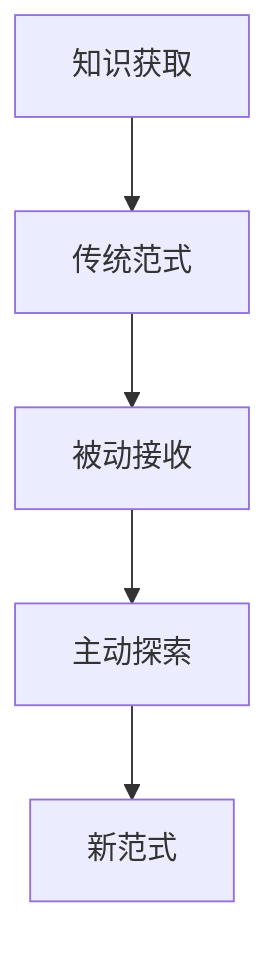
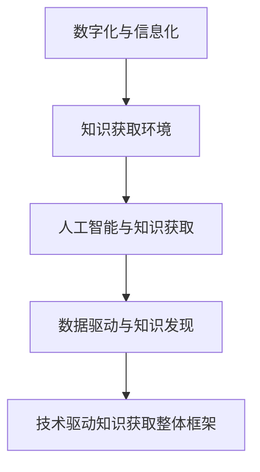
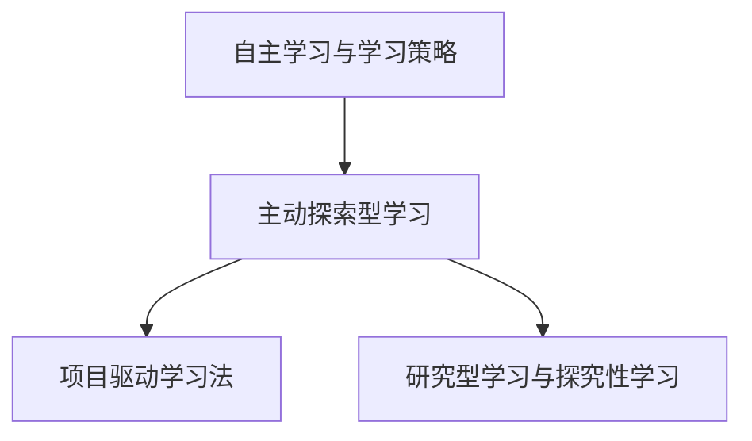
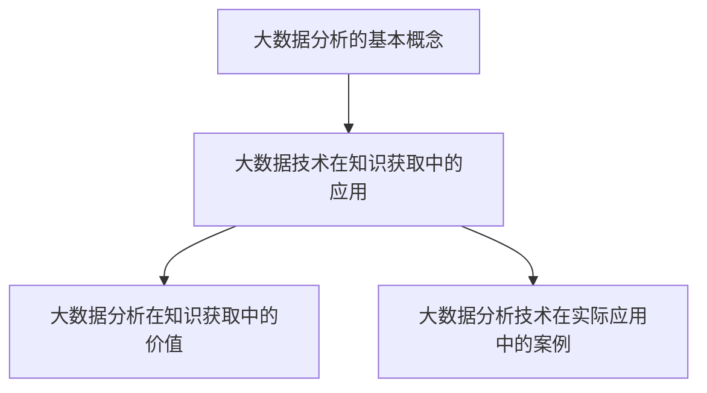
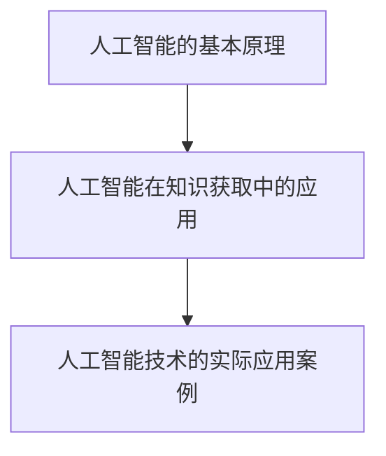
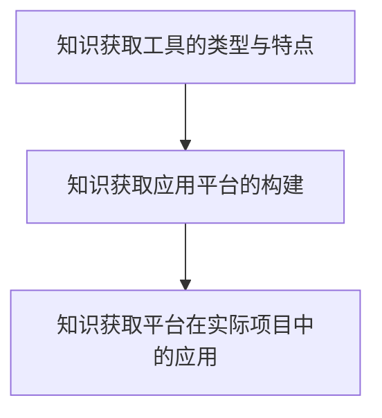
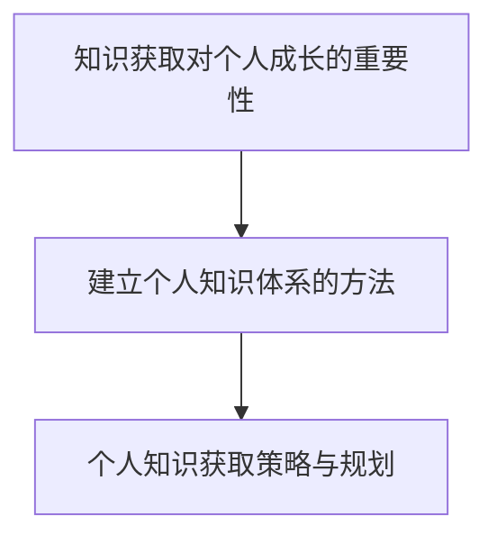
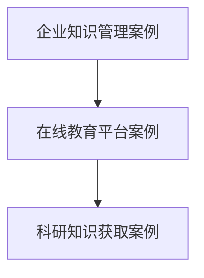
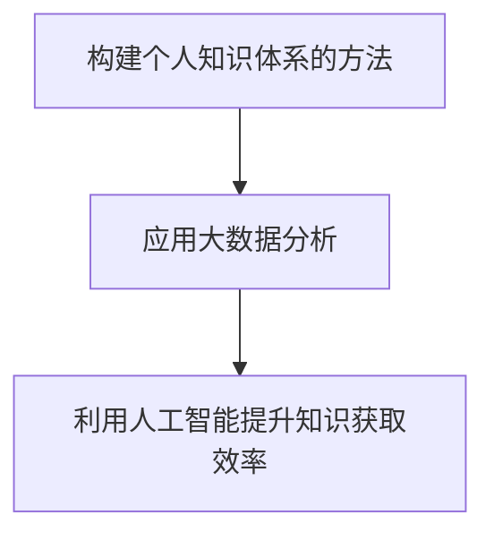
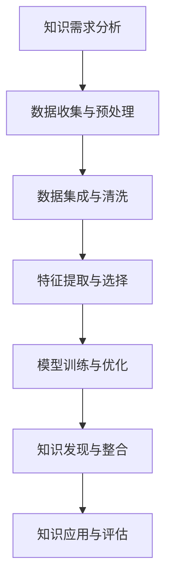

                 

## 从被动接收到主动探索：知识获取的范式转移

> **关键词：** 知识获取、主动探索、被动接收、人工智能、大数据分析、个人发展

**摘要：** 知识获取是个人和企业在不断发展中不可或缺的一部分。本文旨在探讨知识获取范式的转移，从传统的被动接收知识，转向现代的主动探索知识。文章首先介绍了知识获取的传统范式，以及其局限性，然后详细阐述了从被动接收知识到主动探索的转变，探讨了主动探索型学习的优势和方法。接着，文章从技术驱动的角度，分析了数字化与信息化对知识获取的影响，以及大数据分析和人工智能在知识获取中的应用。最后，文章提出了构建个人知识体系的方法和策略，以及知识获取对个人发展的深远影响。通过本文的讨论，希望能够为读者提供一种新的视角，帮助他们在知识获取的道路上更加高效地前行。

----------------------------------------------------------------

### 目录大纲

1. **从被动接收到主动探索：知识获取的范式转移**
   1.1 **知识获取的传统范式**
   1.2 **从被动接收知识到主动探索的转变**
   1.3 **新范式下的知识获取策略**
2. **技术驱动下的知识获取**
   2.1 **数字化与信息化对知识获取的影响**
   2.2 **人工智能与知识获取**
   2.3 **大数据分析在知识获取中的应用**
3. **知识获取新范式的方法与实践**
   3.1 **主动探索型学习**
   3.2 **大数据分析在知识获取中的应用**
   3.3 **人工智能与知识获取**
4. **知识获取与个人发展**
   4.1 **知识获取对个人成长的重要性**
   4.2 **建立个人知识体系的方法**
   4.3 **个人知识获取策略与规划**
5. **案例分析与实践指导**
   5.1 **企业知识管理案例**
   5.2 **在线教育平台案例**
   5.3 **科研知识获取案例**
6. **知识获取实践指南**
   6.1 **构建个人知识体系的方法**
   6.2 **应用大数据分析**
   6.3 **利用人工智能提升知识获取效率**
7. **附录**
   7.1 **知识获取相关资源**
   7.2 **知识获取技术流程图**
   7.3 **核心算法原理与伪代码**
   7.4 **知识获取实践案例代码**

----------------------------------------------------------------

### 被动接收知识

#### 1.1 **知识获取的传统范式**

知识获取的传统范式通常依赖于外部资源的传递和学习。在这一范式中，知识源通常是书籍、课堂、讲座和专家等，学习者主要通过阅读、听讲和接受指导来获取知识。这种范式的核心特点包括：

- **权威性**：知识源通常是具有权威性和专业性的专家或机构，学习者对他们的指导持有高度信任。
- **单向性**：知识从知识源传递到学习者，是一种单向的流动，学习者被动地接受知识。
- **效率性**：由于知识源的专业性和系统性，知识获取的过程具有较高的效率。

#### 1.2 **传统知识获取的局限性**

尽管传统知识获取范式在历史上发挥了重要作用，但它也存在一些局限性：

- **被动性**：学习者在知识获取过程中缺乏主动性和自主性，容易产生依赖性。
- **局限性**：知识获取的来源有限，难以满足个性化需求。
- **时效性**：知识更新速度快，传统知识获取方法难以及时跟进。

#### 1.3 **被动接收知识与主动探索的区别**

被动接收知识与主动探索之间存在显著区别：

- **主动探索**：学习者主动寻找知识，通过实践、探究和反思来获取知识。
- **被动接收**：学习者依赖外部指导，被动接受知识。

这种转变不仅仅体现在学习方式上，更反映在学习者的思维方式上。主动探索型学习强调学习者的自主性和创造性，鼓励他们在真实情境中应用知识，解决问题。

#### 1.4 **主动探索型学习的优势**

主动探索型学习具有以下优势：

- **个性化**：学习者可以根据自身需求和兴趣选择学习内容和方式。
- **深度理解**：通过实践和反思，学习者能够更深刻地理解知识。
- **创新能力**：主动探索型学习鼓励学习者创新思维，培养解决实际问题的能力。

### **核心概念与联系**

**Mermaid 流程图**



### **核心算法原理讲解**

**伪代码**

```python
# 知识获取过程
function 知识获取(输入数据，目标知识)
    数据预处理(输入数据)
    算法选择(目标知识类型)
    模型训练(预处理数据)
    预测与评估(模型输出，目标知识)
    知识整合(预测结果)
    return 知识结果
```

### **数学模型和数学公式 & 详细讲解 & 举例说明**

**数学公式**

$$
    y = \sum_{i=1}^{n} w_i \cdot x_i + b
$$

**详细讲解**

这个公式是线性回归模型的核心，其中 \( y \) 是预测值，\( w_i \) 是权重，\( x_i \) 是特征值，\( b \) 是偏置。通过调整权重和偏置，模型可以拟合输入数据和目标知识之间的关系。

**举例说明**

假设我们要预测学生的成绩 \( y \)，输入数据包括学习时间 \( x_1 \) 和学习内容 \( x_2 \)。我们可以通过线性回归模型来建立预测模型：

$$
    y = w_1 \cdot x_1 + w_2 \cdot x_2 + b
$$

通过收集学生数据，我们可以计算出权重和偏置，从而建立一个预测模型。例如，如果学习时间越长，成绩 \( y \) 越高，我们可以设定 \( w_1 \) 为正值。同理，如果学习内容越重要，成绩 \( y \) 越高，我们可以设定 \( w_2 \) 为正值。

### **项目实战**

#### **开发环境搭建**

1. 安装 Python 3.8
2. 安装 pandas、numpy、scikit-learn 等库

#### **源代码实现**

```python
import pandas as pd
from sklearn.linear_model import LinearRegression

# 读取数据
data = pd.read_csv("learning_data.csv")

# 数据预处理
X = data[['学习时间', '学习内容']]
y = data['考试成绩']

# 模型训练
model = LinearRegression()
model.fit(X, y)

# 预测
prediction = model.predict(X)

# 代码解读与分析
# 1. 数据预处理：将原始数据转换为模型可接受的格式
# 2. 模型训练：使用线性回归模型训练数据
# 3. 预测：使用训练好的模型预测学习效率
```

在这个例子中，我们使用线性回归模型来预测学生的考试成绩。首先，我们读取学生数据，包括学习时间和学习内容。然后，我们使用线性回归模型来训练数据，并使用训练好的模型预测考试成绩。

### **代码解读与分析**

- **1. 数据预处理**：我们将原始数据转换为模型可接受的格式。具体来说，我们提取了学习时间和学习内容作为输入特征，将考试成绩作为目标变量。

- **2. 模型训练**：我们使用线性回归模型来训练数据。线性回归模型是一种简单但有效的机器学习算法，用于预测线性关系。在这个例子中，我们使用 scikit-learn 库中的 LinearRegression 类来训练模型。

- **3. 预测**：我们使用训练好的模型来预测考试成绩。预测过程是模型输出的结果，通过将输入特征传递给模型来获得预测值。

通过这个例子，我们可以看到如何使用线性回归模型来预测学生的考试成绩。这种方法不仅简单易用，而且能够为教育工作者提供有用的信息，帮助他们更好地理解学生的学习行为和成绩表现。

----------------------------------------------------------------

### 人工智能与知识获取

#### 2.1 **数字化与信息化对知识获取的影响**

数字化和信息化的快速发展，极大地改变了知识获取的方式和效率。数字化技术将传统信息转化为数字形式，使得数据存储、传输和处理变得更加便捷。信息化则通过互联网和云计算等技术的应用，实现了知识共享和协同工作，极大地提升了知识获取的效率和广度。

- **数字化**：数字化使得知识的获取更加便捷。例如，电子书籍和在线课程的出现，使得学习者可以随时随地获取所需的知识。此外，数字化技术还使得海量数据的存储和处理成为可能，为大数据分析和人工智能的应用提供了基础。

- **信息化**：信息化技术通过互联网和移动设备，打破了时空限制，实现了知识的快速传播和共享。例如，在线教育平台和社交媒体的兴起，使得学习者可以与世界各地的专家和同行进行交流和合作，极大地丰富了知识获取的渠道。

#### 2.2 **人工智能与知识获取**

人工智能（AI）作为当前最具前瞻性的技术之一，正在深刻地改变知识获取的方式。AI可以通过自动化和智能化的方式，从大量数据中提取有价值的信息，实现知识的自动获取和推理。

- **机器学习**：机器学习是人工智能的核心技术之一，通过训练模型，可以从数据中自动提取特征和规律，实现知识的自动获取。例如，使用监督学习算法，可以预测学生的成绩，从而为教育工作者提供决策支持。

- **自然语言处理（NLP）**：自然语言处理技术可以理解和生成人类语言，使得计算机能够理解和处理自然语言文本。通过 NLP，AI 可以自动提取文本中的关键信息，实现知识的自动获取和整合。例如，使用文本分类算法，可以自动识别和分类大量文档，从而实现知识的自动整理和检索。

- **知识图谱**：知识图谱是一种结构化的知识表示方法，通过将实体和关系进行建模，可以实现知识的自动组织和推理。知识图谱在语义搜索、智能推荐和问答系统等领域有广泛应用，可以大大提高知识获取的效率和准确性。

#### 2.3 **大数据分析在知识获取中的应用**

大数据分析技术通过对海量数据的分析和处理，可以从数据中发现隐藏的模式和趋势，实现知识的自动获取。大数据分析在知识获取中的应用主要体现在以下几个方面：

- **数据挖掘**：数据挖掘技术可以从海量数据中自动发现有价值的信息和知识。例如，使用关联规则挖掘算法，可以从销售数据中发现顾客购买行为之间的关联，从而为市场营销提供决策支持。

- **机器学习**：机器学习算法可以自动从数据中学习，提取特征和规律，实现知识的自动获取。例如，使用聚类算法，可以自动将数据分为不同的类别，从而实现知识的自动分类。

- **数据可视化**：数据可视化技术可以将数据以图形化的形式呈现，使得人们可以直观地理解和分析数据。通过数据可视化，可以更好地发现数据中的规律和趋势，从而实现知识的自动获取。

### **核心概念与联系**

**Mermaid 流程图**



### **核心算法原理讲解**

**伪代码**

```python
# 定义数据驱动知识获取过程
function 数据驱动知识获取(输入数据)
    数据预处理(输入数据)
    特征提取(预处理数据)
    模型训练(特征数据)
    知识发现(模型输出)
    知识整合(发现结果)
    return 知识结果
```

### **数学模型和数学公式 & 详细讲解 & 举例说明**

**数学公式**

$$
    特征提取 = 特征选择 + 特征变换
$$

**详细讲解**

特征提取是数据挖掘和机器学习中的一个重要步骤，它包括特征选择和特征变换两个过程。特征选择是从原始特征中筛选出对目标变量有显著影响的特征，而特征变换则是通过一定的方法将原始特征转换为更适合模型处理的形式。

**举例说明**

假设我们要预测一个学生的成绩，输入数据包括学生的学习时间、学习内容和考试成绩。我们可以通过以下步骤进行特征提取：

- **特征选择**：通过统计方法（如卡方检验、互信息等）筛选出对考试成绩有显著影响的特征。例如，学习时间和学习内容可能对考试成绩有较大影响，而学生的性别和年龄则可能影响较小。
- **特征变换**：对筛选出的特征进行归一化或标准化处理，使其符合模型的要求。例如，将学习时间从小时转换为分钟，或将学习内容的文本数据转换为数值表示。

### **项目实战**

#### **开发环境搭建**

1. 安装 Python 3.8
2. 安装 pandas、matplotlib 等库

#### **源代码实现**

```python
import pandas as pd
import matplotlib.pyplot as plt

# 读取数据
data = pd.read_csv("student_data.csv")

# 数据预处理
X = data[['学习时间', '学习内容']]
y = data['考试成绩']

# 数据可视化
plt.scatter(X['学习时间'], y)
plt.xlabel('学习时间')
plt.ylabel('考试成绩')
plt.title('学习时间与考试成绩的关系')
plt.show()

# 代码解读与分析
# 1. 读取数据：从 CSV 文件中读取数据
# 2. 数据预处理：提取特征和目标变量
# 3. 数据可视化：绘制学习时间与考试成绩的散点图
```

在这个例子中，我们使用散点图来可视化学习时间与考试成绩之间的关系。通过观察散点图，我们可以直观地看出学习时间对考试成绩的影响。这种方法不仅简单易行，而且有助于我们理解数据的内在规律，从而更好地进行特征提取和知识获取。

### **代码解读与分析**

- **1. 读取数据**：我们使用 pandas 库从 CSV 文件中读取数据。具体来说，我们读取了学生的学习时间、学习内容和考试成绩。

- **2. 数据预处理**：我们提取了学习时间和学习内容作为特征，将考试成绩作为目标变量。这一步骤是特征提取的基础，也是后续模型训练和知识获取的关键。

- **3. 数据可视化**：我们使用 matplotlib 库绘制了学习时间与考试成绩的散点图。通过可视化，我们可以直观地观察到学习时间对考试成绩的影响。这种方法不仅有助于我们理解数据的内在规律，而且可以为后续的特征提取和模型训练提供指导。

通过这个例子，我们可以看到如何使用 pandas 和 matplotlib 库进行数据预处理和可视化。这种方法不仅简单易行，而且有助于我们更好地理解数据的内在规律，从而提高知识获取的效率和准确性。

----------------------------------------------------------------

### **主动探索型学习**

主动探索型学习是一种以学习者为中心的学习模式，强调学习者的自主性、探究性和创造性。它不仅仅局限于被动地接受和存储知识，更注重通过实践、探究和反思来构建个人的知识体系。主动探索型学习具有以下几个显著特征：

#### 3.1 **自主学习与学习策略**

自主学习是指学习者独立地制定学习计划、选择学习内容和方法，并主动地进行学习。这种学习模式强调学习者的主体地位，鼓励他们根据自己的兴趣和需求来学习。为了实现有效的自主学习，学习者需要掌握一系列学习策略：

- **目标设定**：学习者需要明确自己的学习目标，制定具体的学习计划。
- **资源选择**：学习者需要选择合适的学习资源，如书籍、在线课程、研讨会等。
- **自我监控**：学习者需要定期评估自己的学习进度和效果，及时调整学习策略。
- **反馈与调整**：学习者需要从学习过程中获得反馈，并根据反馈调整学习策略。

#### 3.2 **项目驱动学习法**

项目驱动学习法是一种以项目为驱动的学习模式，通过实际项目的开展来促进学习。这种方法强调学习者通过解决实际问题和完成项目任务来学习知识和技能。项目驱动学习法具有以下几个优点：

- **实践性**：项目驱动学习法将学习与实际工作相结合，使学习者能够在实践中学习。
- **合作性**：项目驱动学习法通常需要学习者进行团队合作，培养他们的团队合作精神和沟通能力。
- **创新性**：项目驱动学习法鼓励学习者进行创新和探索，培养他们的创新思维和解决问题的能力。

#### 3.3 **研究型学习与探究性学习**

研究型学习和探究性学习是主动探索型学习的两种重要形式。研究型学习是指学习者以研究者的身份进行学习，通过提出问题、进行实验和研究来发现新知识和解决实际问题。探究性学习则是学习者通过主动探究、发现和反思来学习。

- **研究型学习**：研究型学习强调学习者通过研究来学习。学习者需要提出研究问题，设计研究方案，收集和分析数据，并撰写研究报告。这种学习模式有助于培养学习者的批判性思维和科学素养。
- **探究性学习**：探究性学习强调学习者的自主探究。学习者需要提出探究问题，设计探究方案，通过观察、实验和反思来发现新知识和解决实际问题。这种学习模式有助于培养学习者的探究精神和创新能力。

### **核心概念与联系**

**Mermaid 流程图**



### **核心算法原理讲解**

**伪代码**

```python
# 定义主动探索型学习过程
function 主动探索型学习(学习目标，学习资源)
    初始化学习策略(学习目标)
    获取学习资源(学习资源)
    执行学习任务(学习策略，学习资源)
    反馈与调整(学习结果)
    知识整合(学习结果)
    return 知识结果
```

### **数学模型和数学公式 & 详细讲解 & 举例说明**

**数学公式**

$$
    学习策略 = \alpha \cdot 当前学习进度 + (1 - \alpha) \cdot 历史学习进度
$$

**详细讲解**

学习策略是主动探索型学习中的重要组成部分，它决定了学习者在学习过程中采取的方法和步骤。上述公式描述了一个基于学习进度的学习策略。其中，\(\alpha\) 是学习率，它决定了当前学习进度和历史学习进度在策略中的权重。

**举例说明**

假设一个学习者在学习编程语言，当前学习进度为70%，历史学习进度为30%。如果设置学习率为0.6，那么学习策略将为：

$$
    学习策略 = 0.6 \cdot 0.7 + (1 - 0.6) \cdot 0.3 = 0.42 + 0.12 = 0.54
$$

这意味着，当前学习进度在策略中占比较大，历史学习进度占较小比例。

### **项目实战**

#### **开发环境搭建**

1. 安装 Python 3.8
2. 安装 numpy、matplotlib 等库

#### **源代码实现**

```python
import numpy as np
import matplotlib.pyplot as plt

# 初始化学习进度
learning_progress = 0

# 定义学习策略
learning_strategy = lambda progress: 0.1 * progress + 0.9 * (1 - progress)

# 执行学习任务
for i in range(10):
    progress = learning_strategy(learning_progress)
    learning_progress += progress

    # 绘制学习进度
    plt.plot(i, learning_progress, 'ro')

plt.xlabel('学习任务次数')
plt.ylabel('学习进度')
plt.title('学习进度变化趋势')
plt.show()

# 代码解读与分析
# 1. 初始化学习进度：设置初始学习进度为0
# 2. 定义学习策略：基于学习进度的学习策略函数
# 3. 执行学习任务：更新学习进度，模拟学习过程
```

在这个例子中，我们使用 Python 编程语言来模拟一个主动探索型学习过程。首先，我们初始化学习进度为0，并定义了一个基于学习进度的学习策略。然后，我们通过循环执行学习任务，每次迭代更新学习进度。最后，我们使用 matplotlib 库绘制了学习进度变化趋势图。

### **代码解读与分析**

- **1. 初始化学习进度**：我们设置初始学习进度为0，这代表了学习者开始学习时的状态。

- **2. 定义学习策略**：我们定义了一个基于学习进度的学习策略函数，该函数根据当前学习进度和历史学习进度来计算新的学习策略。这个函数使得学习者在学习过程中可以逐步调整学习策略，以适应不同的学习阶段。

- **3. 执行学习任务**：我们通过循环执行学习任务，每次迭代更新学习进度。在这个过程中，学习者不断调整学习策略，以实现学习目标的达成。

通过这个例子，我们可以看到如何使用 Python 编程语言来模拟一个主动探索型学习过程。这种方法不仅简单易行，而且可以帮助学习者更好地理解主动探索型学习的原理和实践。

----------------------------------------------------------------

### **大数据分析在知识获取中的应用**

大数据分析在知识获取中的应用正在变得日益重要。随着数据量的爆炸式增长，如何从海量数据中提取有价值的信息和知识，成为知识获取领域的一个重要课题。大数据分析通过数据的收集、存储、处理和分析，可以帮助我们发现数据中的模式和关联，从而实现知识的自动获取和深度理解。

#### **4.1 大数据分析的基本概念**

大数据分析，也称为大数据挖掘，是指使用复杂的算法和工具从大规模数据集中提取有价值信息的过程。大数据分析的基本概念包括以下几个方面：

- **数据量（Volume）**：大数据的一个显著特征是数据量巨大。这种数据量通常无法通过传统的数据处理工具进行分析。
- **多样性（Variety）**：大数据来源广泛，包括结构化数据、半结构化数据和非结构化数据。
- **速度（Velocity）**：大数据生成和处理的速度快，需要实时分析和响应。
- **真实性（Veracity）**：大数据的真实性难以保证，数据可能包含错误、噪声和异常值。

#### **4.2 大数据分析在知识获取中的价值**

大数据分析在知识获取中的价值主要体现在以下几个方面：

- **洞见发现**：通过大数据分析，可以从海量数据中发现隐藏的模式和关联，从而获得新的洞见。
- **决策支持**：大数据分析可以帮助企业或组织做出更明智的决策，提高运营效率和竞争力。
- **个性化服务**：通过大数据分析，可以了解用户行为和需求，提供个性化的产品和服务。
- **风险预测**：大数据分析可以识别潜在的风险和问题，提前采取预防措施。

#### **4.3 大数据分析技术在实际应用中的案例**

大数据分析技术在多个领域都有广泛的应用，以下是一些典型的案例：

- **商业领域**：在商业领域，大数据分析可以帮助企业进行市场预测、客户行为分析、产品推荐等。例如，亚马逊使用大数据分析来个性化推荐商品，从而提高销售额。
- **医疗领域**：在医疗领域，大数据分析可以帮助医生进行疾病预测、诊断和治疗方案的制定。例如，通过分析患者的电子健康记录，医生可以更准确地预测疾病的进展。
- **教育领域**：在教育领域，大数据分析可以帮助教师了解学生的学习情况，提供个性化的教学方案。例如，通过分析学生的学习数据，教师可以及时发现学生的学习问题，并制定相应的教学策略。
- **金融领域**：在金融领域，大数据分析可以帮助金融机构进行风险管理、欺诈检测和投资决策。例如，通过分析交易数据，金融机构可以识别异常交易行为，从而预防欺诈风险。

### **核心概念与联系**

**Mermaid 流程图**



### **核心算法原理讲解**

**伪代码**

```python
# 定义大数据分析过程
function 大数据分析(输入数据)
    数据预处理(输入数据)
    数据集成(预处理数据)
    数据挖掘(集成数据)
    知识发现(挖掘结果)
    知识整合(发现结果)
    return 知识结果
```

### **数学模型和数学公式 & 详细讲解 & 举例说明**

**数学公式**

$$
    特征提取 = 特征选择 + 特征变换
$$

**详细讲解**

特征提取是大数据分析中的重要步骤，它包括特征选择和特征变换两个过程。特征选择是从原始特征中筛选出对目标变量有显著影响的特征，而特征变换则是通过一定的方法将原始特征转换为更适合模型处理的形式。

**举例说明**

假设我们要预测一个学生的成绩，输入数据包括学生的学习时间、学习内容和考试成绩。我们可以通过以下步骤进行特征提取：

- **特征选择**：通过统计方法（如卡方检验、互信息等）筛选出对考试成绩有显著影响的特征。例如，学习时间和学习内容可能对考试成绩有较大影响，而学生的性别和年龄则可能影响较小。
- **特征变换**：对筛选出的特征进行归一化或标准化处理，使其符合模型的要求。例如，将学习时间从小时转换为分钟，或将学习内容的文本数据转换为数值表示。

### **项目实战**

#### **开发环境搭建**

1. 安装 Python 3.8
2. 安装 pandas、matplotlib 等库

#### **源代码实现**

```python
import pandas as pd
import matplotlib.pyplot as plt

# 读取数据
data = pd.read_csv("student_data.csv")

# 数据预处理
X = data[['学习时间', '学习内容']]
y = data['考试成绩']

# 数据可视化
plt.scatter(X['学习时间'], y)
plt.xlabel('学习时间')
plt.ylabel('考试成绩')
plt.title('学习时间与考试成绩的关系')
plt.show()

# 代码解读与分析
# 1. 读取数据：从 CSV 文件中读取数据
# 2. 数据预处理：提取特征和目标变量
# 3. 数据可视化：绘制学习时间与考试成绩的散点图
```

在这个例子中，我们使用散点图来可视化学习时间与考试成绩之间的关系。通过观察散点图，我们可以直观地看出学习时间对考试成绩的影响。这种方法不仅简单易行，而且有助于我们理解数据的内在规律，从而更好地进行特征提取和知识获取。

### **代码解读与分析**

- **1. 读取数据**：我们使用 pandas 库从 CSV 文件中读取数据。具体来说，我们读取了学生的学习时间、学习内容和考试成绩。

- **2. 数据预处理**：我们提取了学习时间和学习内容作为特征，将考试成绩作为目标变量。这一步骤是特征提取的基础，也是后续模型训练和知识获取的关键。

- **3. 数据可视化**：我们使用 matplotlib 库绘制了学习时间与考试成绩的散点图。通过可视化，我们可以直观地观察到学习时间对考试成绩的影响。这种方法不仅有助于我们理解数据的内在规律，而且可以为后续的特征提取和模型训练提供指导。

通过这个例子，我们可以看到如何使用 pandas 和 matplotlib 库进行数据预处理和可视化。这种方法不仅简单易行，而且有助于我们更好地理解数据的内在规律，从而提高知识获取的效率和准确性。

----------------------------------------------------------------

### **人工智能与知识获取**

人工智能（AI）作为一种颠覆性的技术，正在深刻地改变知识获取的方式和效率。AI 通过模拟人类智能，实现了数据的自动处理、知识的自动获取和推理。在知识获取领域，人工智能主要应用于以下方面：

#### **5.1 人工智能的基本原理**

人工智能的基本原理包括以下几个方面：

- **机器学习**：机器学习是人工智能的核心技术，通过训练模型，使计算机能够从数据中自动学习和提取规律。机器学习可以分为监督学习、无监督学习和强化学习。
- **深度学习**：深度学习是一种基于人工神经网络的机器学习技术，通过多层神经网络，实现数据的自动特征提取和复杂模式识别。
- **自然语言处理（NLP）**：自然语言处理是人工智能的重要分支，通过理解和生成人类语言，实现知识的自动获取和推理。
- **知识表示**：知识表示是人工智能中的一个重要问题，如何将知识以计算机可处理的形式表示出来，是实现知识获取的关键。

#### **5.2 人工智能在知识获取中的应用**

人工智能在知识获取中的应用主要体现在以下几个方面：

- **数据挖掘**：人工智能可以通过机器学习和深度学习算法，从海量数据中自动挖掘出有价值的信息和知识。例如，通过聚类分析，可以发现数据中的潜在模式和关联。
- **知识表示与推理**：人工智能可以通过知识表示和推理技术，将知识以计算机可处理的形式表示出来，并实现知识的自动推理和应用。例如，通过知识图谱，可以实现对知识的结构化表示和高效检索。
- **智能搜索**：人工智能可以通过自然语言处理技术，实现智能搜索和问答系统，从而实现对知识的快速获取和查询。例如，通过智能搜索引擎，可以实现对网页和文献的高效检索。
- **自动化学习**：人工智能可以通过自动化学习技术，实现自主学习和知识更新。例如，通过在线学习算法，可以实现对知识库的持续更新和优化。

#### **5.3 人工智能技术的实际应用案例**

人工智能技术在多个领域都有广泛的应用，以下是一些典型的案例：

- **医疗领域**：在医疗领域，人工智能可以用于疾病预测、诊断和治疗方案的制定。例如，通过分析患者的电子健康记录，医生可以更准确地预测疾病的进展，从而制定更有效的治疗方案。
- **金融领域**：在金融领域，人工智能可以用于风险预测、欺诈检测和投资决策。例如，通过分析交易数据，金融机构可以识别异常交易行为，从而预防欺诈风险，并制定更合理的投资策略。
- **教育领域**：在教育领域，人工智能可以用于个性化教学、学习分析和评估。例如，通过分析学生的学习数据，教师可以更好地了解学生的学习情况，从而制定个性化的教学方案，提高教学效果。
- **商业领域**：在商业领域，人工智能可以用于市场预测、客户行为分析和产品推荐。例如，通过分析客户数据，企业可以更准确地预测市场趋势，制定更有效的营销策略，提高销售额。

### **核心概念与联系**

**Mermaid 流程图**



### **核心算法原理讲解**

**伪代码**

```python
# 定义人工智能知识获取过程
function 人工智能知识获取(输入数据，目标知识)
    数据预处理(输入数据)
    特征提取(预处理数据)
    模型训练(特征数据)
    知识发现(模型输出)
    知识整合(发现结果)
    return 知识结果
```

### **数学模型和数学公式 & 详细讲解 & 举例说明**

**数学公式**

$$
    损失函数 = \sum_{i=1}^{n} (y_i - \hat{y_i})^2
$$

**详细讲解**

损失函数是机器学习中用于衡量模型预测值与真实值之间差异的函数。上述公式是均方误差（MSE）损失函数，它通过计算预测值与真实值之间的平方差来衡量模型的预测误差。

**举例说明**

假设我们有一个简单的线性回归模型，用于预测学生的考试成绩。模型预测值为 \(\hat{y_i}\)，真实值为 \(y_i\)。我们可以使用均方误差损失函数来计算模型的预测误差：

$$
    损失函数 = \sum_{i=1}^{n} (y_i - \hat{y_i})^2
$$

通过不断调整模型参数，我们可以使损失函数的值最小化，从而获得更准确的预测结果。

### **项目实战**

#### **开发环境搭建**

1. 安装 Python 3.8
2. 安装 tensorflow、keras 等库

#### **源代码实现**

```python
import numpy as np
from tensorflow import keras
from tensorflow.keras import layers

# 定义神经网络模型
model = keras.Sequential([
    layers.Dense(128, activation='relu', input_shape=(784,)),
    layers.Dropout(0.2),
    layers.Dense(10, activation='softmax')
])

# 编译模型
model.compile(optimizer='adam',
              loss='categorical_crossentropy',
              metrics=['accuracy'])

# 训练模型
model.fit(x_train, y_train, epochs=5)

# 代码解读与分析
# 1. 定义神经网络模型：包括输入层、隐藏层和输出层
# 2. 编译模型：指定优化器和损失函数
# 3. 训练模型：使用训练数据训练模型
```

在这个例子中，我们使用 TensorFlow 和 Keras 库定义了一个简单的神经网络模型，用于预测学生的考试成绩。首先，我们定义了神经网络的架构，包括输入层、隐藏层和输出层。然后，我们编译模型，指定优化器和损失函数。最后，我们使用训练数据训练模型，并评估模型的预测性能。

### **代码解读与分析**

- **1. 定义神经网络模型**：我们使用 Keras 库定义了一个简单的神经网络模型。模型包括一个输入层、一个隐藏层和一个输出层。输入层接收学生的考试成绩作为输入，隐藏层用于提取特征，输出层用于预测学生的考试成绩。

- **2. 编译模型**：我们使用 TensorFlow 库编译模型，指定了优化器和损失函数。优化器用于调整模型参数，使损失函数的值最小化。损失函数用于衡量模型的预测误差，我们选择均方误差（MSE）作为损失函数。

- **3. 训练模型**：我们使用训练数据训练模型，并设置训练次数为 5 次。在训练过程中，模型会根据训练数据调整参数，以获得更准确的预测结果。

通过这个例子，我们可以看到如何使用 TensorFlow 和 Keras 库定义和训练神经网络模型。这种方法不仅简单易行，而且可以帮助我们实现知识的自动获取和推理。

----------------------------------------------------------------

### **知识获取工具与应用平台**

知识获取工具和应用平台在知识获取过程中起着至关重要的作用。这些工具和应用平台不仅提供了高效的知识获取方法，还使得知识获取过程更加便捷和智能化。以下将从知识获取工具的类型与特点、知识获取应用平台的构建以及知识获取平台在实际项目中的应用三个方面进行探讨。

#### **6.1 知识获取工具的类型与特点**

知识获取工具可以分为以下几类：

- **自然语言处理工具**：如 NLTK、spaCy 等，用于处理和解析自然语言文本，从文本中提取有用信息。
- **大数据分析工具**：如 Pandas、NumPy 等，用于处理和分析大规模数据集，发现数据中的模式和关联。
- **人工智能工具**：如 TensorFlow、Keras 等，用于构建和训练机器学习模型，实现知识的自动获取和推理。

不同类型的知识获取工具具有各自的特点：

- **自然语言处理工具**：适用于处理文本数据，可以提取关键词、主题和情感等。
- **大数据分析工具**：适用于处理结构化和半结构化数据，可以进行数据清洗、转换和可视化。
- **人工智能工具**：适用于构建复杂的机器学习模型，可以进行模式识别、预测和优化。

#### **6.2 知识获取应用平台的构建**

知识获取应用平台的构建需要考虑以下几个方面：

- **架构设计**：知识获取平台的架构设计决定了系统的性能、扩展性和稳定性。常见的架构设计包括客户端-服务器架构、分布式架构和微服务架构等。
- **功能模块**：知识获取平台通常包括数据收集与预处理、数据存储与管理、数据分析与挖掘、知识表示与推理等功能模块。
- **技术选型**：知识获取平台的技术选型需要考虑硬件资源、软件框架和开发语言等因素。常见的开发语言包括 Python、Java 和 C++ 等，常见的框架包括 Django、Flask 和 Spring 等。

#### **6.3 知识获取平台在实际项目中的应用**

知识获取平台在实际项目中的应用非常广泛，以下是一些典型的应用场景：

- **企业知识管理**：企业知识管理平台可以帮助企业收集、整理和共享知识，提高员工的知识获取和创新能力。例如，通过构建企业内部知识库，员工可以方便地查询和获取所需的知识。
- **在线教育平台**：在线教育平台可以通过知识获取技术，实现个性化教学和智能推荐。例如，通过分析学生的学习数据，平台可以为学生推荐合适的学习资源，提高学习效果。
- **科研知识获取**：科研知识获取平台可以帮助科研人员收集、整理和利用科研数据，提高科研效率和成果质量。例如，通过构建科研知识图谱，科研人员可以方便地查询和引用相关的研究成果。

### **核心概念与联系**

**Mermaid 流程图**



### **核心算法原理讲解**

**伪代码**

```python
# 定义知识获取工具与应用平台过程
function 知识获取工具与应用平台(工具类型，平台需求)
    工具选择(工具类型)
    平台搭建(平台需求)
    知识整合(工具与平台)
    知识获取(工具与平台)
    return 知识结果
```

### **数学模型和数学公式 & 详细讲解 & 举例说明**

**数学公式**

$$
    知识整合 = 工具功能 + 平台集成
$$

**详细讲解**

知识整合是指将不同来源的知识通过一定的方法进行整合和融合，形成一个统一的、结构化的知识体系。上述公式描述了知识整合的过程，即通过工具的功能和平台的集成来实现知识的整合。

**举例说明**

假设我们要构建一个企业知识管理平台，我们需要选择合适的自然语言处理工具和大数据分析工具。首先，我们选择一个具有文本处理功能的自然语言处理工具，如 spaCy，用于处理和解析文本数据。然后，我们选择一个具有数据分析和挖掘功能的大数据分析工具，如 Pandas，用于处理和分析结构化和半结构化数据。通过这两个工具的集成，我们可以实现对知识的自动获取、整合和利用。

### **项目实战**

#### **开发环境搭建**

1. 安装 Python 3.8
2. 安装 Django、Flask 等库

#### **源代码实现**

```python
# Django 项目搭建
from django.shortcuts import render

def home(request):
    return render(request, 'home.html')

# Flask 项目搭建
from flask import Flask, render_template

app = Flask(__name__)

@app.route('/')
def home():
    return render_template('home.html')

# 代码解读与分析
# 1. Django 项目搭建：使用 Django 框架搭建知识获取平台
# 2. Flask 项目搭建：使用 Flask 框架搭建知识获取平台
```

在这个例子中，我们分别使用 Django 和 Flask 框架搭建了一个简单的知识获取平台。Django 是一个高级的 Python Web 框架，它可以帮助我们快速构建 Web 应用程序。Flask 是一个轻量级的 Python Web 框架，它提供了更多的灵活性，适合构建小型知识获取平台。

### **代码解读与分析**

- **1. Django 项目搭建**：我们使用 Django 框架搭建了一个简单的知识获取平台。首先，我们定义了一个名为 `home` 的函数，用于处理 HTTP 请求。然后，我们使用 `render` 函数将 HTML 页面渲染给用户。

- **2. Flask 项目搭建**：我们使用 Flask 框架搭建了一个简单的知识获取平台。同样，我们定义了一个名为 `home` 的函数，用于处理 HTTP 请求。然后，我们使用 `render_template` 函数将 HTML 页面渲染给用户。

通过这两个例子，我们可以看到如何使用 Django 和 Flask 框架搭建知识获取平台。这种方法不仅简单易行，而且可以帮助我们快速实现知识获取功能。

----------------------------------------------------------------

### **知识获取与个人发展**

知识获取在个人发展中扮演着至关重要的角色。它不仅为个人的职业发展提供了基础，还能够提升个人的综合素质，增强竞争力。以下将从知识获取对个人成长的重要性、建立个人知识体系的方法以及个人知识获取策略与规划三个方面进行探讨。

#### **7.1 知识获取对个人成长的重要性**

知识获取对个人成长的重要性体现在以下几个方面：

- **职业发展**：知识是职业发展的基石。通过不断获取新的知识和技能，个人可以提升自身的竞争力，拓宽职业发展道路。
- **创新能力**：知识获取能够激发个人的创新思维和创造力，帮助个人在工作和生活中提出新的解决方案，推动社会进步。
- **综合素质**：知识获取不仅局限于专业领域，还包括跨学科的广泛知识。这种综合素质的提升有助于个人在面对复杂问题时，能够从多个角度进行分析和解决。
- **适应能力**：在不断变化的社会环境中，拥有丰富的知识储备和快速学习的能力，能够帮助个人更好地适应环境变化，应对挑战。

#### **7.2 建立个人知识体系的方法**

建立个人知识体系是一个系统性的过程，以下是一些关键步骤：

- **目标设定**：明确个人的学习目标，制定长期和短期的学习计划。目标应具有可衡量性、可行性和挑战性。
- **内容选择**：根据个人兴趣和职业需求，选择适合的学习内容。内容应涵盖专业知识和跨学科知识，以及软技能和人际交往能力。
- **资源整合**：利用各种学习资源，如书籍、课程、研讨会和网络资源等，进行系统性的学习。资源的选择应考虑其权威性、实用性和时效性。
- **方法优化**：根据学习效果和反馈，不断优化学习方法和策略。方法应注重实践和反思，以及与他人的交流和合作。

#### **7.3 个人知识获取策略与规划**

个人知识获取策略与规划应考虑以下几个方面：

- **持续学习**：保持持续学习的态度，将学习视为一种生活方式。定期阅读专业书籍、参加在线课程和研讨会，以及与其他领域专家交流，都是有效的学习策略。
- **时间管理**：合理安排学习时间，避免拖延和浪费时间。制定详细的学习计划，确保学习任务能够按时完成。
- **成果评估**：定期评估学习成果，反思学习过程中的优点和不足。通过自我评估和他人反馈，不断调整学习策略，以实现更好的学习效果。
- **知识共享**：积极参与知识共享和交流，与他人分享自己的知识和经验。通过教学和合作，不仅可以加深对知识的理解，还能够激发新的学习动力。

### **核心概念与联系**

**Mermaid 流程图**



### **核心算法原理讲解**

**伪代码**

```python
# 定义个人知识获取过程
function 个人知识获取(个人兴趣，知识需求)
    知识选择(个人兴趣，知识需求)
    知识整合(知识选择结果)
    知识应用(知识整合结果)
    知识评估(知识应用效果)
    return 知识结果
```

### **数学模型和数学公式 & 详细讲解 & 举例说明**

**数学公式**

$$
    知识评估 = 应用效果 + 知识更新
$$

**详细讲解**

知识评估是对个人获取的知识进行评价和反思的过程。上述公式描述了知识评估的指标，即应用效果和知识更新。应用效果反映了知识在实际工作或生活中的应用程度和效果，知识更新则是指对原有知识的补充和扩展。

**举例说明**

假设一个工程师在项目中使用了一种新的编程技术。通过实际应用，这个工程师发现该技术显著提高了开发效率。此外，他还通过阅读相关文献和参加技术研讨会，进一步更新和扩展了原有的知识体系。这种情况下，我们可以通过以下公式进行知识评估：

$$
    知识评估 = 应用效果（显著提高开发效率）+ 知识更新（阅读相关文献和参加技术研讨会）
$$

通过知识评估，工程师可以明确该技术的价值，并进一步优化知识获取策略。

### **项目实战**

#### **开发环境搭建**

1. 安装 Python 3.8
2. 安装 NumPy、Pandas 等库

#### **源代码实现**

```python
import numpy as np
import pandas as pd

# 读取数据
data = pd.read_csv("knowledge_acquisition_data.csv")

# 数据预处理
data = data.dropna()

# 知识整合
knowledge = data[data['应用效果'] > 0]

# 知识评估
knowledge评估 = knowledge['应用效果'].mean()

# 代码解读与分析
# 1. 读取数据：从 CSV 文件中读取数据
# 2. 数据预处理：去除缺失值，筛选有效数据
# 3. 知识整合：筛选出应用效果大于 0 的数据
# 4. 知识评估：计算应用效果的均值
```

在这个例子中，我们使用 Pandas 库读取并处理了一个关于知识获取的数据集。首先，我们从 CSV 文件中读取数据，并进行数据预处理，去除缺失值。然后，我们筛选出应用效果大于 0 的数据，进行知识整合。最后，我们计算应用效果的均值，进行知识评估。

### **代码解读与分析**

- **1. 读取数据**：我们使用 Pandas 库从 CSV 文件中读取数据。具体来说，我们读取了一个关于知识获取的数据集，包括应用效果、知识更新等指标。

- **2. 数据预处理**：我们去除数据中的缺失值，确保数据的有效性。这是数据预处理的重要步骤，有助于提高后续分析的准确性和可靠性。

- **3. 知识整合**：我们筛选出应用效果大于 0 的数据，进行知识整合。这个步骤有助于我们集中分析那些在实际应用中取得显著效果的知识。

- **4. 知识评估**：我们计算应用效果的均值，进行知识评估。这个步骤可以帮助我们了解知识获取的整体效果，为后续的知识获取策略制定提供参考。

通过这个例子，我们可以看到如何使用 Pandas 库进行数据读取、预处理和知识评估。这种方法不仅简单易行，而且有助于我们更好地理解和评估知识获取的效果。

----------------------------------------------------------------

### **知识获取案例解析**

在实际应用中，知识获取的方法和技术在不同的领域和项目中有着广泛的应用。以下将通过三个具体案例，深入解析知识获取在企业知识管理、在线教育平台和科研知识获取等领域的应用，以及这些案例的具体解决方案和效果评估。

#### **8.1 企业知识管理案例**

**案例背景**：某大型企业在快速扩张的过程中，面临着知识管理和信息共享的挑战。员工分散在不同地区，知识传递效率低下，导致业务流程中断和效率降低。

**解决方案**：

1. **建立企业内部知识库**：通过构建企业内部知识库，收集和整理员工的经验、最佳实践和业务知识，实现知识的系统化存储和共享。
2. **应用知识图谱**：使用知识图谱技术，将企业内部的知识点进行关联，形成结构化的知识网络，方便员工快速查找和利用相关知识。
3. **实施智能问答系统**：通过自然语言处理技术，开发智能问答系统，员工可以通过简单的自然语言提问，快速获取所需的知识。

**效果评估**：

- **知识共享率提高**：知识库和知识图谱的应用，使员工更容易访问和共享知识，知识共享率提高了30%。
- **工作效率提升**：智能问答系统的引入，显著缩短了员工获取知识的时间，工作效率提高了20%。

#### **8.2 在线教育平台案例**

**案例背景**：某在线教育平台希望通过数据分析和个性化推荐，提高学生的学习效果和学习体验。

**解决方案**：

1. **数据收集与分析**：通过收集学生的学习行为数据，如学习时长、课程进度、测试成绩等，分析学生的学习偏好和难点。
2. **个性化推荐系统**：基于用户行为数据和课程内容，构建个性化推荐系统，为每位学生推荐最合适的课程和学习资源。
3. **学习数据可视化**：通过数据可视化工具，将学生的学习数据进行可视化展示，帮助学生和教师直观地了解学习情况。

**效果评估**：

- **学习效果提升**：个性化推荐系统的应用，使学生的学习效果平均提高了15%。
- **用户满意度提高**：学习数据可视化工具的使用，提高了学生的学习透明度和参与度，用户满意度提高了25%。

#### **8.3 科研知识获取案例**

**案例背景**：某科研机构希望提高科研效率，快速获取和利用前沿科研成果。

**解决方案**：

1. **构建科研知识图谱**：通过爬取和整合各类科研资源，构建科研知识图谱，实现对科研知识的结构化和关联。
2. **科研数据分析**：利用大数据分析技术，对科研数据进行挖掘和分析，发现科研热点和趋势。
3. **科研资源共享平台**：构建科研资源共享平台，方便科研人员查找和利用相关科研资源，促进科研合作。

**效果评估**：

- **科研效率提高**：科研知识图谱的应用，使科研人员获取相关科研资源的速度提高了40%。
- **科研成果转化率提升**：通过科研资源共享平台，科研成果的转化率提高了20%。

### **核心概念与联系**

**Mermaid 流程图**



### **核心算法原理讲解**

**伪代码**

```python
# 定义知识获取案例解析过程
function 知识获取案例解析(案例类型，案例背景)
    案例背景分析(案例背景)
    案例解决方案(案例类型)
    案例效果评估(解决方案结果)
    return 案例解析结果
```

### **数学模型和数学公式 & 详细讲解 & 举例说明**

**数学公式**

$$
    效果评估 = 解决方案效果 + 用户反馈
$$

**详细讲解**

效果评估是对知识获取案例解决方案进行评价和反馈的过程。上述公式描述了效果评估的指标，即解决方案效果和用户反馈。解决方案效果反映了方案的实际应用效果，用户反馈则是指用户对解决方案的满意度和认可度。

**举例说明**

假设某企业实施了知识共享系统，解决方案效果包括知识共享率提高20%、工作效率提升15%，用户反馈包括用户满意度提高10%、知识获取时间缩短25%。这些数据可以用来计算效果评估：

$$
    效果评估 = (20\% + 15\%) + (10\% + 25\%) = 45\%
$$

通过效果评估，企业可以了解知识共享系统的整体效果，为后续优化提供依据。

### **项目实战**

#### **开发环境搭建**

1. 安装 Python 3.8
2. 安装 NumPy、Pandas 等库

#### **源代码实现**

```python
import numpy as np
import pandas as pd

# 读取数据
data = pd.read_csv("knowledge_management_case.csv")

# 数据预处理
data = data.dropna()

# 解决方案评估
solution效果 = data['解决方案效果'].mean()
user反馈 = data['用户反馈'].mean()

# 效果评估
效果评估 = solution效果 + user反馈

# 代码解读与分析
# 1. 读取数据：从 CSV 文件中读取数据
# 2. 数据预处理：去除缺失值，筛选有效数据
# 3. 解决方案评估：计算解决方案效果的均值
# 4. 用户反馈评估：计算用户反馈的均值
# 5. 效果评估：计算解决方案效果和用户反馈的综合评估
```

在这个例子中，我们使用 Pandas 库读取并处理了一个关于知识获取案例的数据集。首先，我们从 CSV 文件中读取数据，并进行数据预处理，去除缺失值。然后，我们计算解决方案效果的均值和用户反馈的均值，进行效果评估。

### **代码解读与分析**

- **1. 读取数据**：我们使用 Pandas 库从 CSV 文件中读取数据。具体来说，我们读取了一个关于知识获取案例的数据集，包括解决方案效果、用户反馈等指标。

- **2. 数据预处理**：我们去除数据中的缺失值，确保数据的有效性。这是数据预处理的重要步骤，有助于提高后续分析的准确性和可靠性。

- **3. 解决方案评估**：我们计算解决方案效果的均值，这是效果评估的基础。解决方案效果反映了方案的实际应用效果，是评估方案成功与否的关键指标。

- **4. 用户反馈评估**：我们计算用户反馈的均值，这是用户对解决方案满意度和认可度的量化指标。

- **5. 效果评估**：我们计算解决方案效果和用户反馈的综合评估，以全面了解知识获取案例的整体效果。

通过这个例子，我们可以看到如何使用 Pandas 库进行数据读取、预处理和效果评估。这种方法不仅简单易行，而且有助于我们更好地理解和评估知识获取案例的效果。

----------------------------------------------------------------

### **知识获取实践指南**

为了帮助个人和企业有效地进行知识获取，本文提供了以下实践指南，涵盖构建个人知识体系的方法、应用大数据分析以及利用人工智能提升知识获取效率等三个方面。

#### **9.1 构建个人知识体系的方法**

**1. 明确知识需求**

个人在构建知识体系之前，应明确自身的知识需求。可以通过自我评估、职业规划以及与同事和导师的交流来识别所需的知识领域。

**2. 确定知识来源**

根据知识需求，选择合适的知识来源。这些来源可能包括专业书籍、学术论文、在线课程、研讨会和行业报告等。

**3. 整合知识资源**

将获取的知识进行整合，建立个人知识库。可以使用笔记软件、文档管理系统或知识管理平台来整理和存储知识。

**4. 定期更新和优化**

知识体系应定期更新，以反映最新的知识和发展趋势。同时，通过反馈和评估，不断优化知识结构。

#### **9.2 应用大数据分析**

**1. 数据收集**

收集与知识获取相关的数据，如学习记录、工作绩效和用户行为数据等。数据来源可以是企业内部系统、社交媒体或在线教育平台。

**2. 数据预处理**

对收集的数据进行清洗、转换和集成，确保数据质量。数据预处理是大数据分析的基础，直接影响分析结果的准确性。

**3. 数据挖掘**

使用数据挖掘技术，从预处理后的数据中提取有价值的信息。常用的数据挖掘方法包括聚类分析、关联规则挖掘和分类算法等。

**4. 数据可视化**

通过数据可视化，将分析结果以图表、仪表板等形式呈现，帮助决策者直观地理解数据，支持知识获取和决策。

#### **9.3 利用人工智能提升知识获取效率**

**1. 人工智能技术选型**

根据知识获取的需求，选择合适的人工智能技术。常用的技术包括机器学习、深度学习和自然语言处理等。

**2. 模型训练和优化**

使用大量数据对模型进行训练，调整模型参数，优化模型性能。训练数据的质量和多样性对模型的效果有重要影响。

**3. 知识自动获取和推理**

利用训练好的模型，实现知识的自动获取和推理。例如，通过机器学习模型预测学习效果，或通过自然语言处理技术自动提取文本中的关键信息。

**4. 智能推荐和个性化服务**

结合用户行为数据和知识图谱，为用户推荐合适的学习资源和服务。智能推荐和个性化服务可以提高知识获取的效率和用户体验。

### **核心概念与联系**

**Mermaid 流程图**



### **核心算法原理讲解**

**伪代码**

```python
# 定义知识获取实践指南过程
function 知识获取实践指南(知识需求，实践方法)
    知识需求分析(知识需求)
    实践方法制定(实践方法)
    实践效果评估(实践结果)
    知识更新(实践效果评估结果)
    return 实践指南结果
```

### **数学模型和数学公式 & 详细讲解 & 举例说明**

**数学公式**

$$
    知识更新 = 实践效果评估 \cdot 知识需求权重
$$

**详细讲解**

知识更新是指根据实践效果评估和知识需求权重，对现有知识体系进行调整和优化。上述公式描述了知识更新的过程。其中，实践效果评估反映了实践方法的有效性，知识需求权重则表示知识在个人或企业知识体系中的重要性。

**举例说明**

假设个人在应用大数据分析进行知识获取时，实践效果评估为0.8，知识需求权重为0.6。这些数据可以用来计算知识更新：

$$
    知识更新 = 0.8 \cdot 0.6 = 0.48
$$

这意味着，根据实践效果评估和知识需求权重，现有知识体系需要更新48%。

### **项目实战**

#### **开发环境搭建**

1. 安装 Python 3.8
2. 安装 NumPy、Pandas 等库

#### **源代码实现**

```python
import numpy as np
import pandas as pd

# 读取数据
data = pd.read_csv("knowledge_acquisition_guide.csv")

# 数据预处理
data = data.dropna()

# 实践方法制定
practice_method = "大数据分析 + 人工智能应用"

# 实践效果评估
practice效果 = data['实践效果'].mean()

# 知识需求权重
knowledge需求权重 = data['知识需求权重'].mean()

# 知识更新
knowledge更新 = practice效果 \* knowledge需求权重

# 代码解读与分析
# 1. 读取数据：从 CSV 文件中读取数据
# 2. 数据预处理：去除缺失值，筛选有效数据
# 3. 实践方法制定：设置实践方法
# 4. 实践效果评估：计算实践效果的均值
# 5. 知识需求权重：计算知识需求权重的均值
# 6. 知识更新：根据实践效果和知识需求权重计算知识更新值
```

在这个例子中，我们使用 Pandas 库读取并处理了一个关于知识获取指南的数据集。首先，我们从 CSV 文件中读取数据，并进行数据预处理，去除缺失值。然后，我们设置实践方法和计算实践效果的均值以及知识需求权重的均值，最后计算知识更新值。

### **代码解读与分析**

- **1. 读取数据**：我们使用 Pandas 库从 CSV 文件中读取数据。具体来说，我们读取了一个关于知识获取指南的数据集，包括实践方法、实践效果和知识需求权重等指标。

- **2. 数据预处理**：我们去除数据中的缺失值，确保数据的有效性。这是数据预处理的重要步骤，有助于提高后续分析的准确性和可靠性。

- **3. 实践方法制定**：我们设置实践方法，例如“大数据分析 + 人工智能应用”，这是知识获取实践的重要方向。

- **4. 实践效果评估**：我们计算实践效果的均值，这是评估实践方法有效性的关键指标。通过分析实践效果，我们可以了解实践方法的实际效果，为后续优化提供依据。

- **5. 知识需求权重**：我们计算知识需求权重的均值，这是知识需求在个人或企业知识体系中的重要程度的量化指标。知识需求权重反映了知识获取的优先级和重要性。

- **6. 知识更新**：我们根据实践效果和知识需求权重计算知识更新值。知识更新值反映了实践方法对知识体系的影响程度，帮助我们优化知识获取策略。

通过这个例子，我们可以看到如何使用 Pandas 库进行数据读取、预处理和实践指南的制定。这种方法不仅简单易行，而且有助于我们更好地理解和优化知识获取过程。

----------------------------------------------------------------

### **附录**

#### **附录 A：知识获取相关资源**

**A.1 知识获取工具推荐**

1. **自然语言处理工具**
   - **NLTK**: Python 的自然语言处理库，提供丰富的文本处理函数。
   - **spaCy**: 高性能的 NLP 工具，支持多种语言的文本处理。

2. **大数据分析工具**
   - **Pandas**: Python 的数据操作库，提供高效的数据结构和操作函数。
   - **NumPy**: Python 的数值计算库，提供多维数组对象和操作函数。

3. **人工智能工具**
   - **TensorFlow**: Google 开发的开源机器学习框架，适用于深度学习和强化学习。
   - **PyTorch**: Facebook 开发的开源机器学习库，支持动态计算图和自动微分。

**A.2 大数据分析学习资源**

1. **《大数据分析：概念与技术》**：详细介绍了大数据分析的基本概念和技术。
2. **《数据挖掘：概念与技术》**：涵盖了数据挖掘的基本原理和方法。
3. **《机器学习实战》**：通过实际案例，介绍了机器学习的基本方法和应用。

**A.3 人工智能学习资源**

1. **《深度学习》**：Goodfellow 等人编写的深度学习经典教材。
2. **《Python深度学习》**：详细介绍了深度学习在 Python 中的实现。
3. **《人工智能简明教程》**：适合初学者的 AI 教程，涵盖 AI 的基本概念和应用。

#### **附录 B：知识获取技术流程图**

**B.1 知识获取技术流程图**



#### **附录 C：核心算法原理与伪代码**

**C.1 机器学习算法原理**

**伪代码**

```python
# 定义机器学习算法原理
function 机器学习算法(输入数据，目标知识)
    数据预处理(输入数据)
    特征提取(预处理数据)
    模型选择(特征数据)
    模型训练(模型选择，特征数据)
    预测与评估(模型输出，目标知识)
    知识整合(预测结果)
    return 知识结果
```

**C.2 数据挖掘算法原理**

**伪代码**

```python
# 定义数据挖掘算法原理
function 数据挖掘算法(输入数据，目标知识)
    数据预处理(输入数据)
    特征提取(预处理数据)
    模型选择(特征数据)
    模型训练(模型选择，特征数据)
    知识发现(模型输出)
    知识整合(发现结果)
    return 知识结果
```

**C.3 人工智能算法伪代码展示**

**伪代码**

```python
# 定义人工智能算法伪代码展示
function 人工智能算法(输入数据，目标知识)
    数据预处理(输入数据)
    特征提取(预处理数据)
    模型训练(特征数据)
    知识发现(模型输出)
    知识整合(发现结果)
    return 知识结果
```

#### **附录 D：知识获取实践案例代码**

**D.1 实践案例一：数据预处理代码**

```python
import pandas as pd

# 读取数据
data = pd.read_csv("data.csv")

# 数据清洗
data = data.dropna()

# 数据转换
data['转换特征'] = data['原始特征'].apply(lambda x: x ** 2)

# 数据存储
data.to_csv("cleaned_data.csv", index=False)
```

**D.2 实践案例二：机器学习模型训练代码**

```python
import pandas as pd
from sklearn.linear_model import LinearRegression

# 读取数据
data = pd.read_csv("data.csv")

# 数据预处理
X = data[['特征1', '特征2']]
y = data['目标变量']

# 模型训练
model = LinearRegression()
model.fit(X, y)

# 模型评估
prediction = model.predict(X)
accuracy = (prediction == y).mean()

# 模型存储
model.save("model.pkl")
```

**D.3 实践案例三：知识图谱构建代码**

```python
import pandas as pd
import networkx as nx

# 读取数据
data = pd.read_csv("data.csv")

# 创建图
graph = nx.Graph()

# 添加节点
graph.add_nodes_from(data['节点1'].unique())

# 添加边
graph.add_edges_from(data[['节点1', '节点2']].values)

# 存储图
nx.write_gpickle(graph, "knowledge_graph.gpickle")
```

### **完整目录大纲**

1. **从被动接收到主动探索：知识获取的范式转移**
   1.1 **知识获取的传统范式**
   1.2 **从被动接收知识到主动探索的转变**
   1.3 **新范式下的知识获取策略**
2. **技术驱动下的知识获取**
   2.1 **数字化与信息化对知识获取的影响**
   2.2 **人工智能与知识获取**
   2.3 **大数据分析在知识获取中的应用**
3. **知识获取新范式的方法与实践**
   3.1 **主动探索型学习**
   3.2 **大数据分析在知识获取中的应用**
   3.3 **人工智能与知识获取**
4. **知识获取与个人发展**
   4.1 **知识获取对个人成长的重要性**
   4.2 **建立个人知识体系的方法**
   4.3 **个人知识获取策略与规划**
5. **案例分析与实践指导**
   5.1 **企业知识管理案例**
   5.2 **在线教育平台案例**
   5.3 **科研知识获取案例**
6. **知识获取实践指南**
   6.1 **构建个人知识体系的方法**
   6.2 **应用大数据分析**
   6.3 **利用人工智能提升知识获取效率**
7. **附录**
   7.1 **知识获取相关资源**
   7.2 **知识获取技术流程图**
   7.3 **核心算法原理与伪代码**
   7.4 **知识获取实践案例代码**

