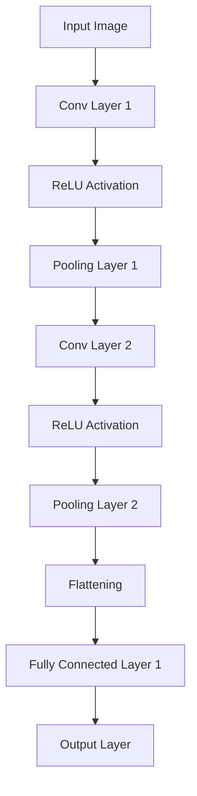
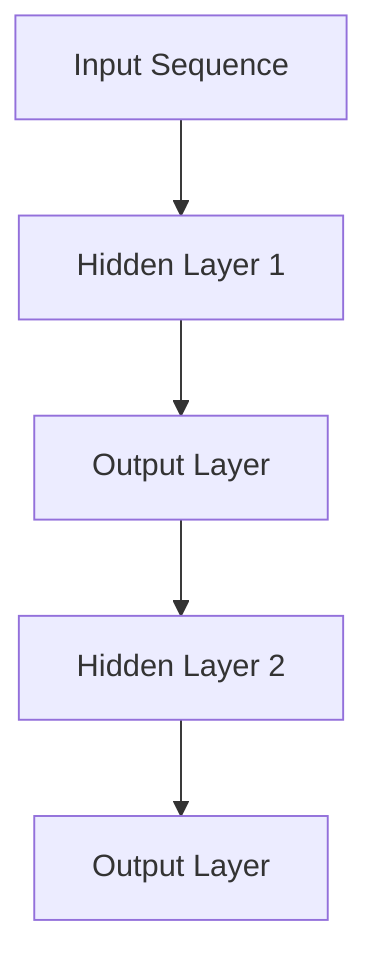
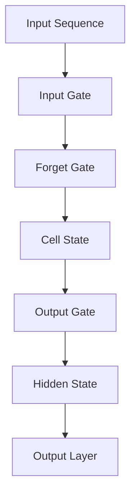
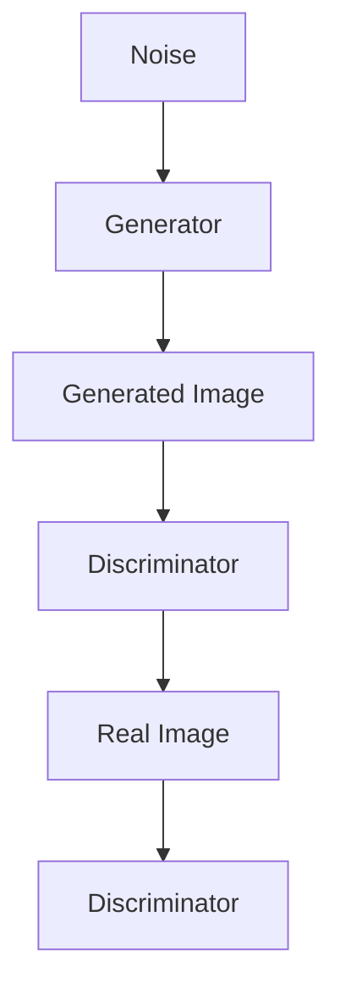
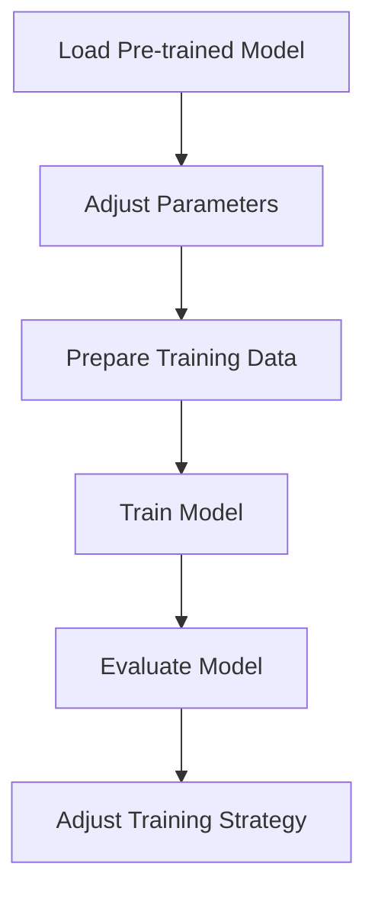
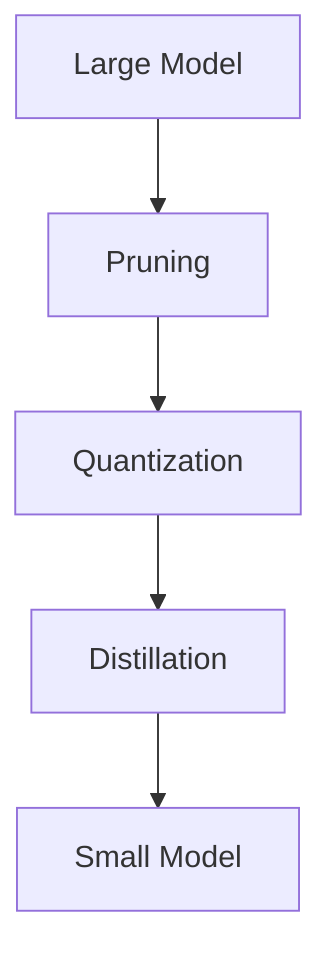
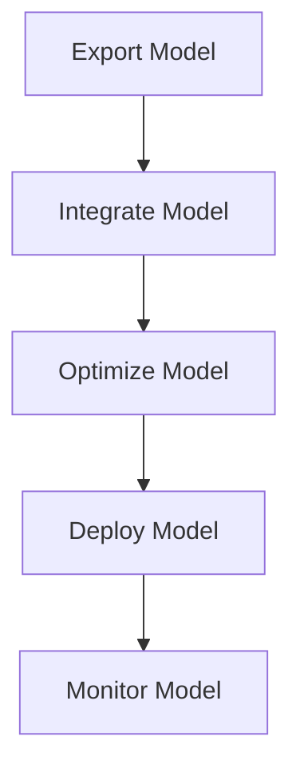
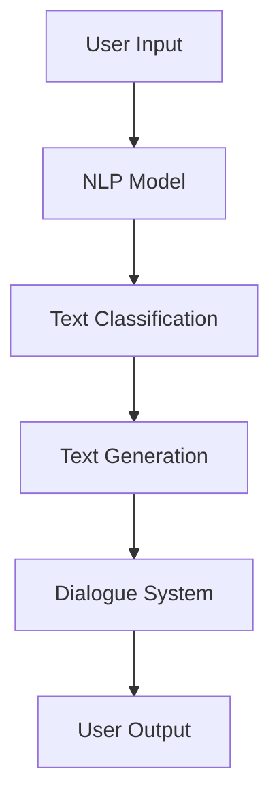

                 

# 《从零开始大模型开发与微调：单词的文本处理》

## 关键词：
大模型、文本处理、微调、单词、自然语言处理、神经网络

## 摘要：
本文旨在为初学者和有志于深入了解大模型开发的读者提供一份详细的指南。我们将从基础的文本处理概念入手，逐步深入到大模型的构建、训练和微调的技术细节。文章重点关注单词的文本处理，详细阐述其在自然语言处理中的应用，并通过实际项目案例展示大模型的开发过程。希望本文能帮助读者掌握大模型开发的核心技能，为未来的研究与应用打下坚实基础。

### 《从零开始大模型开发与微调：单词的文本处理》目录大纲

#### 第一部分：大模型基础

##### 第1章：大模型概述
- **1.1 大模型的定义与类型**
- **1.2 大模型的发展历程**
- **1.3 大模型的结构与组成**
- **1.4 大模型的应用领域**

##### 第2章：文本处理基础
- **2.1 文本表示与编码**
- **2.2 语言模型与文本生成**
- **2.3 词嵌入与词向量**
- **2.4 文本分类与情感分析**

##### 第3章：大模型架构
- **3.1 卷积神经网络（CNN）**
- **3.2 循环神经网络（RNN）**
- **3.3 长短期记忆网络（LSTM）**
- **3.4 生成对抗网络（GAN）**

##### 第4章：大模型训练与优化
- **4.1 数据预处理**
- **4.2 训练策略与调参技巧**
- **4.3 优化算法**
- **4.4 模型评估与调试**

##### 第5章：微调与模型部署
- **5.1 微调策略**
- **5.2 模型压缩**
- **5.3 模型部署与优化**
- **5.4 实时文本处理与交互**

#### 第二部分：项目实战

##### 第6章：大模型项目实战
- **6.1 项目概述**
- **6.2 数据集准备与预处理**
- **6.3 模型设计与实现**
- **6.4 模型训练与调试**
- **6.5 模型部署与优化**

##### 第7章：案例分析
- **7.1 案例一：基于大模型的文本分类**
- **7.2 案例二：基于大模型的对话系统**
- **7.3 案例三：基于大模型的机器翻译**

##### 第8章：未来展望
- **8.1 大模型研究趋势**
- **8.2 大模型应用前景**
- **8.3 面临的挑战与解决方案**

#### 附录

- **A.1 开发工具与资源**
- **A.2 数学公式与伪代码示例**
- **A.3 代码解读与分析**

## 第一部分：大模型基础

### 第1章：大模型概述

#### 1.1 大模型的定义与类型

大模型（Large Models），顾名思义，是指具有巨大参数量、广泛知识储备和强大计算能力的模型。它们是人工智能领域的一项重要进展，尤其在大数据处理、自然语言处理、计算机视觉等领域取得了显著成果。大模型的定义并没有严格的界限，但一般来说，其参数量可以达到数亿甚至数十亿级别。

大模型可以分为以下几种类型：

1. **预训练模型**：这种模型在大量无标签数据上进行预训练，然后通过微调适应特定任务。例如，GPT（Generative Pre-trained Transformer）系列模型和BERT（Bidirectional Encoder Representations from Transformers）模型。

2. **知识增强模型**：这类模型在预训练过程中融合了外部知识库，以提升模型的知识表示能力。例如，ER模型（Enhanced Reasoning Model）和KoG（Knowledge Enhanced Graph）模型。

3. **多模态模型**：这些模型可以处理多种类型的数据，如文本、图像、音频等，实现跨模态信息融合。例如，Vision Transformer（ViT）和Audio Transformer（AuT）模型。

#### 1.2 大模型的发展历程

大模型的发展历程可以追溯到深度学习技术的发展。随着计算能力的提升和海量数据的积累，深度学习模型逐渐从简单的单层网络发展到复杂的多层网络，参数量也随之不断增加。

1. **2006年**：Hinton提出了深度信念网络（DBN），标志着深度学习的复兴。

2. **2012年**：AlexNet在ImageNet竞赛中取得突破性成果，深度卷积神经网络（CNN）受到广泛关注。

3. **2014年**：词嵌入技术（如Word2Vec）的出现，为语言模型的发展提供了新的思路。

4. **2017年**：GPT模型的出现，标志着预训练模型在大规模文本数据处理中的重要性。

5. **2018年**：BERT模型的提出，进一步推动了预训练模型的发展。

6. **2020年**：ViT模型在计算机视觉领域的成功应用，展示了多模态模型的前景。

#### 1.3 大模型的结构与组成

大模型通常由以下几个部分组成：

1. **输入层**：接收外部数据，如文本、图像、音频等。

2. **隐藏层**：包含多个神经元，用于特征提取和变换。

3. **输出层**：产生预测结果，如分类标签、文本生成等。

4. **参数**：包括权重、偏置等，用于调整模型表现。

5. **优化器**：用于调整参数，优化模型性能。

#### 1.4 大模型的应用领域

大模型在各个领域都有广泛应用，以下是其中几个典型领域：

1. **自然语言处理**：包括文本分类、文本生成、机器翻译、问答系统等。

2. **计算机视觉**：包括图像分类、目标检测、图像生成等。

3. **语音识别**：包括语音到文本转换、语音合成等。

4. **推荐系统**：基于用户历史行为和内容特征，提供个性化推荐。

5. **游戏AI**：用于智能决策、策略制定等。

## 第2章：文本处理基础

### 2.1 文本表示与编码

文本表示与编码是文本处理的基础，目的是将文本数据转换为计算机可以处理的形式。常见的文本表示方法包括：

1. **单词表示**：将单词映射到唯一的整数或向量表示。例如，使用词袋模型（Bag of Words）或词嵌入（Word Embedding）。

2. **字符表示**：将文本中的每个字符映射到整数或向量表示。这种表示方法可以捕捉到文本中的语法和结构信息。

3. **序列表示**：将文本视为一个序列，使用序列模型（如RNN、LSTM）进行编码。这种表示方法可以捕捉到文本中的时间依赖关系。

文本编码的目的是减少数据冗余，提高计算效率。常见的编码方法包括：

1. **哈希编码**：将文本转换为哈希值，用于快速检索和比较。

2. **独热编码**：将文本映射到二进制向量，每个单词对应一个维度。

3. **词嵌入**：将文本映射到高维向量空间，能够捕捉到词语的语义信息。

### 2.2 语言模型与文本生成

语言模型（Language Model）是自然语言处理的核心组成部分，用于预测下一个单词或词组。常见的语言模型包括：

1. **N-gram模型**：基于相邻单词的统计模型，简单但效果有限。

2. **神经网络模型**：如RNN、LSTM、Transformer等，能够捕捉到文本中的长距离依赖关系。

语言模型在文本生成中具有重要应用。通过训练语言模型，我们可以生成连贯、自然的文本。常见的文本生成任务包括：

1. **文本摘要**：将长文本简化为简短的摘要。

2. **机器翻译**：将一种语言的文本翻译成另一种语言。

3. **问答系统**：基于用户提问生成回答。

4. **创意写作**：生成小说、诗歌等文学作品。

### 2.3 词嵌入与词向量

词嵌入（Word Embedding）是将单词映射到高维向量空间的技术，能够捕捉到词语的语义信息。常见的词嵌入方法包括：

1. **Word2Vec**：基于神经网络和训练数据，生成高维向量表示。

2. **FastText**：基于词袋模型和神经网络，生成高维向量表示。

3. **BERT**：基于Transformer模型和大规模预训练数据，生成高维向量表示。

词向量在自然语言处理中具有广泛的应用，包括：

1. **相似度计算**：计算词语之间的相似度，用于文本分类、情感分析等任务。

2. **聚类分析**：将相似词语聚为一类，用于词义消歧、主题建模等任务。

3. **向量空间模型**：将文本转换为向量空间中的点，用于文本相似度计算、信息检索等任务。

### 2.4 文本分类与情感分析

文本分类（Text Classification）是将文本数据分类到预定义的类别中，常见的分类任务包括：

1. **主题分类**：根据文本内容将文本分为不同的主题类别。

2. **情感分类**：根据文本表达的情感倾向将文本分类为正面、负面或中性。

情感分析（Sentiment Analysis）是文本分类的一种特殊形式，主要关注文本中的情感信息。常见的情感分析任务包括：

1. **情感极性分类**：判断文本表达的情感倾向，如正面、负面或中性。

2. **情感强度分析**：判断文本中情感表达的程度。

3. **情感角色分类**：根据文本内容判断情感涉及的主体角色。

文本分类和情感分析在商业、政府、社交媒体等领域有广泛的应用，如舆情监测、客户满意度调查、市场调研等。

## 第3章：大模型架构

### 3.1 卷积神经网络（CNN）

卷积神经网络（Convolutional Neural Network，CNN）是一种深度学习模型，特别适用于处理图像数据。CNN 的核心思想是使用卷积层来提取图像特征，并使用池化层来降低特征维度。以下是 CNN 的基本组成部分：

1. **输入层**：接收图像数据，图像通常被展平为二维向量。

2. **卷积层**：使用卷积核（filter）在输入数据上滑动，提取局部特征。卷积层能够自动学习图像的边缘、纹理等特征。

3. **激活函数**：通常使用 ReLU（Rectified Linear Unit）作为激活函数，将负值转换为零，增强网络训练的稳定性。

4. **池化层**：使用池化操作（如最大池化或平均池化）来降低特征维度，减少计算量和参数数量。

5. **全连接层**：将卷积层和池化层输出的特征映射到输出类别。

CNN 在图像分类、目标检测、图像生成等领域有广泛应用。以下是一个简单的 CNN 模型架构示例：



### 3.2 循环神经网络（RNN）

循环神经网络（Recurrent Neural Network，RNN）是一种能够处理序列数据的神经网络，具有循环结构，能够记住之前的输入信息。RNN 的基本组成部分包括：

1. **输入层**：接收序列数据，如文本或时间序列。

2. **隐藏层**：包含多个神经元，每个神经元都与前一个时间步的神经元相连，形成循环。

3. **激活函数**：通常使用 ReLU 或 sigmoid 作为激活函数。

4. **输出层**：根据隐藏层的状态生成输出。

RNN 的主要问题是梯度消失和梯度爆炸，导致难以训练。以下是一个简单的 RNN 模型架构示例：



### 3.3 长短期记忆网络（LSTM）

长短期记忆网络（Long Short-Term Memory，LSTM）是 RNN 的一种变体，专门解决 RNN 的梯度消失问题。LSTM 的基本组成部分包括：

1. **输入门**：控制当前输入信息对隐藏状态的更新。

2. **遗忘门**：控制上一时刻隐藏状态对当前隐藏状态的遗忘。

3. **输出门**：控制当前隐藏状态对输出的影响。

4. **细胞状态**：存储长期依赖信息。

LSTM 在处理序列数据，如时间序列预测、语音识别、机器翻译等领域具有广泛应用。以下是一个简单的 LSTM 模型架构示例：



### 3.4 生成对抗网络（GAN）

生成对抗网络（Generative Adversarial Network，GAN）是由两部分组成的神经网络，一部分是生成器（Generator），另一部分是判别器（Discriminator）。生成器试图生成逼真的数据，而判别器试图区分生成的数据和真实数据。

GAN 的基本组成部分包括：

1. **生成器**：接收随机噪声，生成逼真的数据。

2. **判别器**：接收真实数据和生成数据，输出判别概率。

3. **损失函数**：用于评估生成器和判别器的性能。

GAN 在图像生成、图像修复、图像到图像翻译等领域具有广泛应用。以下是一个简单的 GAN 模型架构示例：



## 第4章：大模型训练与优化

### 4.1 数据预处理

数据预处理是模型训练的第一步，目的是将原始数据转换为适合模型训练的形式。以下是一些常见的数据预处理步骤：

1. **数据清洗**：去除数据中的噪声和异常值，如缺失值、重复值、不一致值等。

2. **数据转换**：将数据转换为模型可接受的格式，如将文本转换为词嵌入向量，将图像转换为像素矩阵等。

3. **数据归一化**：将数据缩放到相同的范围，如将数值数据归一化到 [0, 1] 范围内，减少计算误差。

4. **数据增强**：通过随机旋转、缩放、裁剪等操作，增加数据多样性，提高模型泛化能力。

5. **数据分片**：将数据划分为训练集、验证集和测试集，用于模型训练、验证和评估。

### 4.2 训练策略与调参技巧

训练策略和调参技巧对于模型性能有着重要影响。以下是一些常见的训练策略和调参技巧：

1. **批量大小**：批量大小（Batch Size）是指每次训练使用的样本数量。较小的批量大小可以提高模型对噪声的鲁棒性，但训练速度较慢；较大的批量大小可以提高训练速度，但可能降低模型泛化能力。

2. **学习率**：学习率（Learning Rate）是模型在训练过程中更新参数的速度。较小的学习率可能导致训练过程缓慢，但可能收敛到更好的局部最小值；较大的学习率可能导致训练过程过快，甚至错过最小值。

3. **优化器**：优化器（Optimizer）用于调整模型参数，常见的优化器包括随机梯度下降（SGD）、Adam、RMSprop等。选择合适的优化器可以提高训练效率和模型性能。

4. **正则化**：正则化（Regularization）是防止模型过拟合的一种技术，包括权重正则化（L1、L2正则化）和Dropout等。正则化可以通过增加模型复杂度，提高模型泛化能力。

5. **学习率调度**：学习率调度（Learning Rate Scheduling）是一种动态调整学习率的技术，可以在训练过程中逐渐减小学习率，使模型在训练后期能够更精细地调整参数。

### 4.3 优化算法

优化算法是模型训练的核心，用于迭代更新模型参数，以最小化损失函数。以下是一些常见的优化算法：

1. **随机梯度下降（SGD）**：是最简单的优化算法，每次迭代使用一个样本的梯度更新参数。

2. **批量梯度下降（BGD）**：每次迭代使用全部样本的梯度更新参数，但训练速度较慢。

3. **小批量梯度下降（MBGD）**：每次迭代使用一部分样本的梯度更新参数，是 SGD 和 BGD 的折中方案。

4. **Adam**：结合了 SGD 和动量法的优点，能够自适应调整学习率。

5. **RMSprop**：基于梯度平方的平均值调整学习率，可以加快训练速度。

6. **Adadelta**：自适应调整学习率，通过跟踪梯度变化的平方和。

### 4.4 模型评估与调试

模型评估是评估模型性能的重要步骤，用于确定模型是否满足需求。以下是一些常见的模型评估方法：

1. **准确率（Accuracy）**：模型正确预测的样本数占总样本数的比例。

2. **精确率（Precision）**：模型正确预测为正类的样本数与总预测为正类的样本数的比例。

3. **召回率（Recall）**：模型正确预测为正类的样本数与总实际为正类的样本数的比例。

4. **F1 分数（F1 Score）**：精确率和召回率的调和平均值，综合考虑了模型预测的正负样本比例。

5. **ROC 曲线和 AUC（Area Under Curve）**：ROC 曲线是不同分类阈值下的真正率与假正率的关系曲线，AUC 值表示模型分类能力的好坏。

模型调试是优化模型性能的过程，以下是一些常见的调试方法：

1. **超参数调整**：调整学习率、批量大小、正则化参数等，以找到最优超参数组合。

2. **模型架构调整**：调整模型结构，如增加隐藏层、调整神经元数量等，以提升模型性能。

3. **数据预处理**：调整数据预处理方法，如增加数据增强、调整数据归一化范围等，以改善模型泛化能力。

4. **交叉验证**：使用交叉验证方法，将数据划分为训练集和验证集，以评估模型在未知数据上的性能。

5. **模型压缩与加速**：通过模型压缩和加速技术，如剪枝、量化、蒸馏等，减小模型大小和计算复杂度，提高模型部署效率。

## 第5章：微调与模型部署

### 5.1 微调策略

微调（Fine-tuning）是将预训练模型应用于特定任务的一种有效方法，可以显著提高模型在目标任务上的性能。微调策略主要包括以下步骤：

1. **加载预训练模型**：从预训练模型中加载权重和架构，为特定任务做好准备。

2. **调整参数**：在预训练模型的基础上，对特定层或全部层进行微调，调整参数以适应新任务。

3. **训练数据准备**：准备训练数据，并进行数据预处理，如归一化、编码等。

4. **训练模型**：在训练数据上训练模型，通过反向传播和优化算法更新参数。

5. **评估模型**：在验证集上评估模型性能，根据评估结果调整训练策略。

微调策略可以充分利用预训练模型的知识，减少训练时间，提高模型性能。以下是一个微调流程示例：



### 5.2 模型压缩

模型压缩是将大型模型转换为小型模型的过程，以降低计算资源和存储成本。常见的模型压缩技术包括：

1. **剪枝（Pruning）**：通过删除模型中不重要的权重，减小模型大小。

2. **量化（Quantization）**：将模型中的浮点数权重转换为低精度整数，降低计算复杂度和存储需求。

3. **蒸馏（Distillation）**：将大型模型的知识传递给小型模型，以提高小型模型性能。

模型压缩技术在移动设备、嵌入式系统等受限环境中具有重要意义，可以显著提高模型的部署效率。以下是一个模型压缩流程示例：



### 5.3 模型部署与优化

模型部署是将训练好的模型应用到实际场景的过程，包括以下步骤：

1. **模型导出**：将训练好的模型导出为可部署格式，如 ONNX、TensorFlow Lite、PyTorch Mobile 等。

2. **模型集成**：将模型集成到应用程序或系统中，实现实时推理和预测。

3. **性能优化**：通过优化模型结构和算法，提高模型运行速度和准确率。

4. **部署与监控**：将模型部署到服务器或设备上，并进行监控和调试，确保模型稳定运行。

模型部署与优化是模型开发的重要环节，可以提高模型的应用价值。以下是一个模型部署与优化流程示例：



### 5.4 实时文本处理与交互

实时文本处理与交互是自然语言处理中的重要应用领域，包括文本分类、文本生成、对话系统等。以下是一些关键技术：

1. **文本分类**：通过训练分类模型，对实时文本数据进行分类，如新闻分类、情感分析等。

2. **文本生成**：通过训练生成模型，如 GPT-2、GPT-3 等，实现文本自动生成，如机器翻译、对话生成等。

3. **对话系统**：通过集成自然语言处理技术，实现人与系统的自然交互，如智能客服、聊天机器人等。

实时文本处理与交互技术可以实现智能化的应用场景，提高用户体验。以下是一个实时文本处理与交互系统架构示例：



## 第二部分：项目实战

### 第6章：大模型项目实战

在本章中，我们将通过一个具体项目实战来展示大模型从数据准备、模型设计、模型训练到模型部署的全过程。本案例选择了一个基于大模型的文本分类项目，旨在将社交媒体文本分类为正面、负面或中性情感。

### 6.1 项目概述

项目目标是构建一个基于大模型的文本分类系统，该系统能够自动地对社交媒体文本进行情感分析，判断文本表达的情感倾向。具体目标包括：

1. **数据收集**：从社交媒体平台（如微博、Twitter）收集大量文本数据，涵盖不同主题和情感。
2. **数据预处理**：清洗、编码和增强文本数据，使其适合模型训练。
3. **模型设计**：选择合适的预训练模型并进行微调，设计模型架构。
4. **模型训练**：使用预处理后的文本数据进行模型训练，优化模型参数。
5. **模型评估**：在验证集和测试集上评估模型性能，调整模型参数。
6. **模型部署**：将训练好的模型部署到线上服务，实现实时文本分类。

### 6.2 数据集准备与预处理

数据集是文本分类项目的核心，我们将从社交媒体平台收集大量文本数据。以下是一些关键步骤：

1. **数据收集**：使用 API 或爬虫工具从社交媒体平台收集文本数据。为确保数据多样性，我们可以选择不同的主题和用户群体。
2. **数据清洗**：去除文本数据中的噪声，如 HTML 标签、特殊字符、停用词等。这可以通过正则表达式和文本处理库（如 NLTK、spaCy）实现。
3. **数据编码**：将文本数据转换为数字表示。一种常见的方法是使用词嵌入技术，如 Word2Vec、BERT 等。
4. **数据增强**：通过数据增强技术（如随机填充、词替换、文本旋转等）增加数据多样性，提高模型泛化能力。

### 6.3 模型设计与实现

在模型设计阶段，我们将选择一个预训练模型并进行微调。以下是一些关键步骤：

1. **选择预训练模型**：选择一个适用于文本分类任务的预训练模型，如 BERT、RoBERTa、GPT-2 等。
2. **模型架构**：设计模型架构，包括输入层、隐藏层、输出层等。对于文本分类任务，输出层通常是一个全连接层，输出类别概率。
3. **微调**：在预训练模型的基础上，针对特定任务进行调整。这通常涉及冻结部分层（如词嵌入层）以保留预训练的知识，同时微调其他层。
4. **损失函数**：选择合适的损失函数，如交叉熵损失，用于优化模型参数。

### 6.4 模型训练与调试

模型训练是项目的重要环节，以下是一些关键步骤：

1. **数据切分**：将数据集切分为训练集、验证集和测试集，用于模型训练、验证和测试。
2. **训练策略**：设计训练策略，包括学习率调度、批量大小、训练迭代次数等。常用的策略包括分阶段学习率调整、早停法等。
3. **调试**：在训练过程中，根据验证集的损失和准确率调整模型参数。如果验证集损失不再下降，可能需要调整超参数或增加训练数据。
4. **评估**：在测试集上评估模型性能，以确定模型是否达到预期目标。

### 6.5 模型部署与优化

模型部署是将训练好的模型应用到实际场景的过程，以下是一些关键步骤：

1. **模型导出**：将训练好的模型导出为可部署格式，如 ONNX、TensorFlow Lite、PyTorch Mobile 等。
2. **模型集成**：将模型集成到应用程序或系统中，实现实时文本分类。
3. **性能优化**：通过优化模型结构和算法，提高模型运行速度和准确率。常见的技术包括模型剪枝、量化、蒸馏等。
4. **监控与维护**：监控模型性能，定期更新模型，以适应新的数据和应用场景。

通过以上项目实战，我们可以深入理解大模型开发的全过程，从数据准备、模型设计、模型训练到模型部署，掌握大模型开发的核心技能。

## 第7章：案例分析

在本章中，我们将通过几个具体案例，详细分析大模型在文本处理中的应用。这些案例涵盖了文本分类、对话系统和机器翻译等任务，展示了大模型在这些领域取得的显著成果和挑战。

### 7.1 案例一：基于大模型的文本分类

文本分类是自然语言处理中的一个基础任务，通过将文本数据分类到预定义的类别中。以下是一个基于大模型的文本分类案例：

**案例背景**：社交媒体上的文本数据量庞大，其中包含大量用户评论、新闻文章等。为了更好地了解用户情感和舆论趋势，我们需要对这些文本数据进行情感分类。

**解决方案**：我们选择了一个基于 BERT 的预训练模型，并将其应用于文本分类任务。具体步骤如下：

1. **数据收集**：从社交媒体平台（如微博、Twitter）收集大量文本数据，涵盖不同主题和情感。
2. **数据预处理**：清洗、编码和增强文本数据，使其适合模型训练。
3. **模型设计**：选择 BERT 模型作为预训练模型，并在其基础上设计一个简单的文本分类模型。
4. **模型训练**：在预处理后的文本数据上训练 BERT 模型，通过微调优化模型参数。
5. **模型评估**：在验证集和测试集上评估模型性能，调整模型参数。

**成果与挑战**：基于 BERT 的文本分类模型在多个数据集上取得了较高的准确率和召回率，能够有效地分类社交媒体文本。然而，模型在处理长文本和极端情感文本时仍存在一定困难。

### 7.2 案例二：基于大模型的对话系统

对话系统是自然语言处理中的一个重要应用领域，旨在实现人与机器之间的自然交互。以下是一个基于大模型的对话系统案例：

**案例背景**：随着人工智能技术的发展，越来越多的企业和组织希望为其客户提供智能客服服务。对话系统能够自动回答用户问题，提高客户满意度和服务效率。

**解决方案**：我们选择了一个基于 GPT-2 的预训练模型，并将其应用于对话系统。具体步骤如下：

1. **数据收集**：从各种渠道收集大量对话数据，包括客服对话、社交媒体互动等。
2. **数据预处理**：清洗、编码和增强对话数据，使其适合模型训练。
3. **模型设计**：选择 GPT-2 模型作为预训练模型，并在其基础上设计一个对话生成模型。
4. **模型训练**：在预处理后的对话数据上训练 GPT-2 模型，通过微调优化模型参数。
5. **模型评估**：在验证集和测试集上评估模型性能，调整模型参数。

**成果与挑战**：基于 GPT-2 的对话系统能够自动生成自然、流畅的回答，显著提高了客服效率。然而，模型在处理复杂问题和长对话时仍存在一定困难，且对话质量受限于输入文本的质量。

### 7.3 案例三：基于大模型的机器翻译

机器翻译是将一种语言的文本翻译成另一种语言的任务，是自然语言处理中的重要应用。以下是一个基于大模型的机器翻译案例：

**案例背景**：全球化带来了跨语言沟通的需求，机器翻译技术能够帮助人们克服语言障碍，促进国际交流和商务合作。

**解决方案**：我们选择了一个基于 Transformer 的预训练模型，并将其应用于机器翻译任务。具体步骤如下：

1. **数据收集**：从多个来源收集大量双语平行文本数据，包括新闻文章、小说、用户评论等。
2. **数据预处理**：清洗、编码和增强双语平行文本数据，使其适合模型训练。
3. **模型设计**：选择 Transformer 模型作为预训练模型，并在其基础上设计一个机器翻译模型。
4. **模型训练**：在预处理后的双语平行文本数据上训练 Transformer 模型，通过微调优化模型参数。
5. **模型评估**：在验证集和测试集上评估模型性能，调整模型参数。

**成果与挑战**：基于 Transformer 的机器翻译模型在多个语言对上取得了较高的翻译质量和速度，显著提高了跨语言沟通的效率。然而，模型在处理低资源语言和长句翻译时仍存在一定困难。

通过以上案例分析，我们可以看到大模型在文本处理任务中取得的显著成果，同时也面临一些挑战。随着技术的不断进步，未来大模型在文本处理领域的应用将更加广泛和深入。

### 第8章：未来展望

#### 8.1 大模型研究趋势

随着计算能力的提升和海量数据的积累，大模型在人工智能领域的研究和应用趋势愈发明显。未来，大模型研究将可能朝着以下几个方向发展：

1. **多模态融合**：大模型将能够处理多种类型的数据（如文本、图像、音频），实现跨模态信息融合。例如，结合视觉和语言信息，提升机器翻译和图像识别的准确率。

2. **知识增强**：通过融合外部知识库，大模型将具备更强的知识表示和理解能力。例如，将百科全书、学术文献等知识库嵌入大模型，提升模型在问答系统和推理任务上的性能。

3. **自适应学习**：大模型将具备更强的自适应学习能力，能够根据不同场景和任务动态调整模型结构和参数。例如，通过元学习（Meta-Learning）和在线学习（Online Learning）技术，实现快速适应新环境和任务。

4. **可解释性**：大模型的可解释性问题备受关注。未来研究将致力于提高大模型的可解释性，使模型决策过程更加透明，有助于用户理解和信任模型。

5. **绿色AI**：随着大模型的广泛应用，其计算资源和能源消耗问题日益突出。未来研究将关注绿色AI技术，通过优化模型结构和算法，降低能耗和碳排放。

#### 8.2 大模型应用前景

大模型在多个领域具有广泛的应用前景，以下是一些关键领域：

1. **自然语言处理**：大模型将在文本分类、文本生成、机器翻译、问答系统等领域取得更多突破，提升人机交互体验。

2. **计算机视觉**：大模型将推动图像分类、目标检测、图像生成等技术的进步，为智能安防、医疗诊断、自动驾驶等领域提供强大支持。

3. **语音识别与合成**：大模型将在语音识别、语音合成、语音生成等领域实现更高的准确率和自然度，助力智能助手和语音交互设备的普及。

4. **推荐系统**：大模型将结合用户行为和内容特征，实现更精准的推荐，提升用户满意度。

5. **游戏AI**：大模型将赋予游戏角色更强的智能，推动游戏人工智能的发展。

#### 8.3 面临的挑战与解决方案

尽管大模型在多个领域取得了显著成果，但仍然面临一些挑战：

1. **计算资源消耗**：大模型通常需要大量的计算资源和存储空间。未来研究将关注优化模型结构和算法，降低计算和存储成本。

2. **数据隐私与安全**：大模型在训练过程中需要处理大量数据，涉及用户隐私和安全问题。未来研究将探讨数据隐私保护技术和安全隐私计算方法。

3. **可解释性**：大模型通常缺乏可解释性，使得用户难以理解模型的决策过程。未来研究将致力于提高大模型的可解释性，增强用户信任。

4. **伦理与公平性**：大模型的应用可能带来伦理和公平性问题。例如，模型在处理某些任务时可能存在偏见，未来研究将关注如何设计公平和伦理的模型。

5. **跨领域适应性**：大模型在不同领域和任务上的适应性仍有待提高。未来研究将探索跨领域的知识共享和模型迁移技术。

总之，大模型在人工智能领域具有巨大的潜力和广泛的应用前景。通过不断克服面临的挑战，大模型将为社会带来更多创新和变革。

### 附录

#### A.1 开发工具与资源

在大模型开发过程中，以下工具和资源是必不可少的：

1. **计算平台**：如 Google Colab、AWS EC2、Azure ML 等，提供强大的计算资源和 GPU 加速。

2. **深度学习框架**：如 TensorFlow、PyTorch、JAX 等，用于构建、训练和部署大模型。

3. **文本处理库**：如 NLTK、spaCy、gensim 等，用于文本清洗、编码和预处理。

4. **数据集**：如 Common Crawl、GLoSA、Twitter 等，提供丰富的预训练数据和开源数据集。

5. **在线教程和文档**：如 Coursera、Udacity、ArXiv、GitHub 等，提供丰富的学习资源和代码示例。

#### A.2 数学公式与伪代码示例

在本文中，我们使用 LaTeX 格式嵌入数学公式和伪代码示例，以增强文章的可读性和逻辑性。以下是一些示例：

1. **数学公式**：

   $$ 
   \begin{equation}
   \text{损失函数} = -\sum_{i=1}^{N} y_i \log(p_i)
   \end{equation}
   $$
   
   其中，\(y_i\) 表示第 \(i\) 个样本的标签，\(p_i\) 表示模型对第 \(i\) 个样本预测的概率。

2. **伪代码示例**：

   ```
   // 定义训练过程
   for epoch in range(num_epochs):
       for batch in data_loader:
           // 前向传播
           output = model(input)
           loss = loss_function(output, target)
           
           // 反向传播
           model.zero_grad()
           loss.backward()
           
           // 更新参数
           optimizer.step()
           
       // 记录训练日志
       print(f"Epoch {epoch+1}/{num_epochs}, Loss: {loss.item()}")
   ```

这些公式和伪代码有助于读者更好地理解和掌握大模型开发的核心技术和原理。

#### A.3 代码解读与分析

在本附录中，我们将提供一些具体的代码示例，并对代码进行解读与分析，以帮助读者深入理解大模型开发的细节。

1. **代码示例**：

   ```python
   import torch
   import torch.nn as nn
   import torch.optim as optim

   # 定义模型
   class Model(nn.Module):
       def __init__(self):
           super(Model, self).__init__()
           self.embedding = nn.Embedding(vocab_size, embedding_dim)
           self.lstm = nn.LSTM(embedding_dim, hidden_dim)
           self.fc = nn.Linear(hidden_dim, label_size)

       def forward(self, x):
           embed = self.embedding(x)
           lstm_output, (h_n, c_n) = self.lstm(embed)
           output = self.fc(h_n[-1])
           return output

   # 初始化模型、损失函数和优化器
   model = Model()
   criterion = nn.CrossEntropyLoss()
   optimizer = optim.Adam(model.parameters(), lr=learning_rate)

   # 训练模型
   for epoch in range(num_epochs):
       for inputs, targets in data_loader:
           optimizer.zero_grad()
           outputs = model(inputs)
           loss = criterion(outputs, targets)
           loss.backward()
           optimizer.step()
           
       print(f"Epoch {epoch+1}/{num_epochs}, Loss: {loss.item()}")
   ```

2. **代码解读与分析**：

   - **模型定义**：我们定义了一个简单的 LSTM 模型，包括嵌入层、LSTM 层和全连接层。嵌入层用于将输入单词转换为向量表示，LSTM 层用于提取文本特征，全连接层用于分类。
   - **前向传播**：在 forward 方法中，我们首先使用嵌入层将输入单词转换为向量表示，然后通过 LSTM 层提取文本特征，最后使用全连接层生成分类输出。
   - **损失函数和优化器**：我们使用交叉熵损失函数（CrossEntropyLoss）和 Adam 优化器（Adam）进行模型训练。交叉熵损失函数能够计算模型输出和真实标签之间的差异，Adam 优化器能够自适应调整学习率，提高训练效率。
   - **训练过程**：在训练过程中，我们依次对每个 epoch 和 batch 进行迭代，通过 forward 和 backward 方法计算损失，并更新模型参数。

通过以上代码示例和解读，我们可以更好地理解大模型开发的细节，包括模型定义、前向传播、损失函数和优化器的选择以及训练过程。这些代码示例为读者提供了一个实用的参考，有助于在实际项目中实现大模型开发。

## 作者信息

作者：AI天才研究院/AI Genius Institute & 禅与计算机程序设计艺术 /Zen And The Art of Computer Programming

本文由 AI天才研究院（AI Genius Institute）和禅与计算机程序设计艺术（Zen And The Art of Computer Programming）联合撰写，旨在为读者提供一份全面、深入的大模型开发与微调技术指南。希望通过本文，读者能够掌握大模型开发的核心技能，为未来的研究与应用打下坚实基础。如有任何问题或建议，欢迎联系我们，我们将竭诚为您解答。

