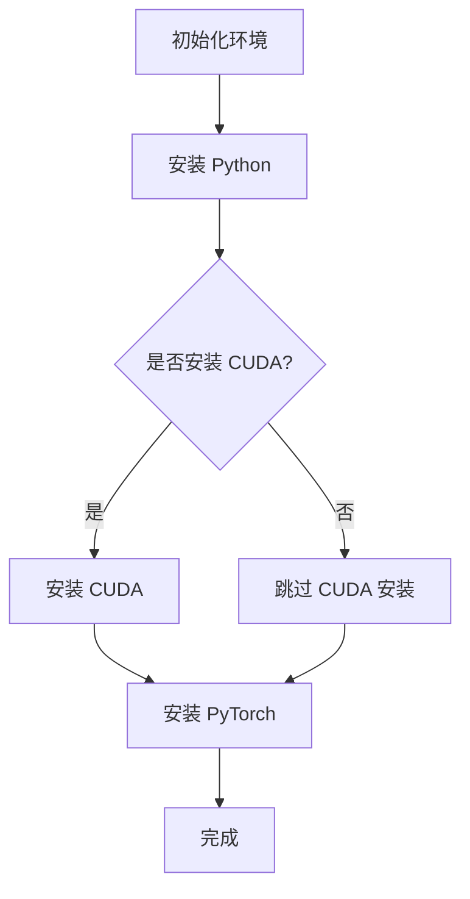
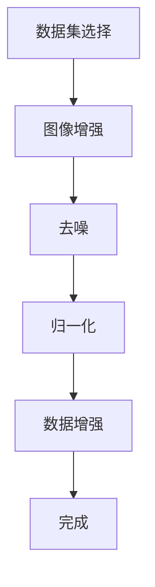
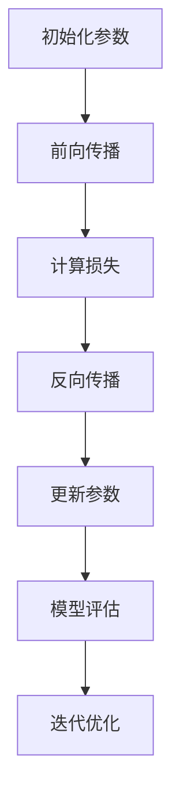

                 

# 从零开始大模型开发与微调：实战基于PyTorch 2.0的手写体识别模型

> **关键词：** 大模型，PyTorch 2.0，手写体识别，神经网络，微调，模型部署

> **摘要：** 本文将从零开始，详细介绍大模型的开发与微调过程，并结合PyTorch 2.0框架，实战手写体识别模型。通过本文的学习，读者可以掌握大模型的基本概念、核心算法原理，以及如何利用PyTorch 2.0进行手写体识别模型的开发、微调和部署。本文不仅包含丰富的理论知识，还配有实际代码实战和详细解读，旨在帮助读者全面理解大模型开发的全流程。

## 第一部分：大模型基础

### 第1章：大模型入门

#### 1.1 大模型简介

**1.1.1 什么是大模型**

大模型，顾名思义，是指规模庞大、参数数量巨大的机器学习模型。这类模型通常具有以下特点：

- **参数数量多：** 大模型通常拥有数百万至数十亿个参数，这使得模型具有更强的表达能力和泛化能力。
- **训练数据量庞大：** 大模型的训练通常需要海量的数据支持，以避免过拟合现象。
- **计算资源需求高：** 大模型的训练和推理过程对计算资源有较高的要求，通常需要使用高性能计算设备和并行计算技术。

**1.1.2 大模型的特性**

- **强大的表达能力和泛化能力：** 大模型由于参数数量多，能够捕捉到更复杂的特征，从而具有更强的表达能力和泛化能力。
- **较长的训练时间：** 大模型的训练通常需要大量的计算资源和时间，训练过程可能需要数天甚至数周。
- **更高的存储需求：** 大模型的参数和权重需要大量的存储空间。

**1.1.3 大模型的应用领域**

大模型在多个领域取得了显著的成果，主要包括：

- **计算机视觉：** 如图像分类、目标检测、图像生成等。
- **自然语言处理：** 如文本分类、机器翻译、情感分析等。
- **推荐系统：** 如商品推荐、用户偏好分析等。
- **强化学习：** 如游戏AI、自动驾驶等。

#### 1.2 PyTorch 2.0 入门

**1.2.1 PyTorch 2.0 简介**

PyTorch 2.0 是 PyTorch 的新版本，具有以下特点：

- **增强的可扩展性和易用性：** PyTorch 2.0 在原有基础上进一步优化了模型构建和训练的流程，提高了开发效率和性能。
- **改进的自动微分系统：** PyTorch 2.0 引入了更高效的自动微分系统，使得模型的训练更加高效。
- **增强的推理支持：** PyTorch 2.0 提供了更丰富的推理优化工具和库，提高了模型的推理速度。

**1.2.2 安装与配置**

安装 PyTorch 2.0，可以参考以下步骤：

1. 安装 Python 环境（版本 3.6及以上）。
2. 安装 CUDA（版本 10.2及以上），用于支持 GPU 训练。
3. 安装 PyTorch 2.0，可以使用以下命令：

   ```bash
   pip install torch torchvision torchaudio
   ```

**1.2.3 基础操作**

1. 导入 PyTorch 库：

   ```python
   import torch
   import torchvision
   import torchaudio
   ```

2. 创建张量：

   ```python
   x = torch.tensor([1, 2, 3])
   ```

3. 数据类型转换：

   ```python
   x = x.to(torch.float32)
   ```

4. 自动微分：

   ```python
   x = torch.autograd.Variable(x)
   ```

#### 1.3 Mermaid 流程图

**1.3.1 Mermaid 简介**

Mermaid 是一种基于 Markdown 的图形描述语言，可以用来绘制各种图表，如流程图、序列图、Gantt 图等。Mermaid 的语法简单易学，便于编写和修改。

**1.3.2 Mermaid 实战**

以下是一个简单的 Mermaid 流程图示例：



该流程图描述了安装 PyTorch 的基本步骤。

### 第2章：手写体识别基础

#### 2.1 手写体识别概述

**2.1.1 手写体识别的意义**

手写体识别技术在许多领域具有广泛的应用，如 OCR（光学字符识别）、智能文档处理、手写笔记识别等。手写体识别可以帮助计算机更好地理解人类手写的信息，提高人机交互的效率。

**2.1.2 手写体识别的挑战**

手写体识别面临以下挑战：

- **变体和风格多样：** 手写体的变体和风格繁多，不同人的书写风格各异，给识别任务带来困难。
- **噪声干扰：** 手写体识别过程中，纸张、墨水等因素可能引入噪声，影响识别效果。
- **图像质量：** 手写体图像可能存在模糊、破损等问题，需要预处理技术提高图像质量。

#### 2.2 数据预处理

**2.2.1 数据集选择**

手写体识别常用的数据集包括：

- **MNIST 手写数字数据集：** 包含 0 到 9 的手写数字图像，是手写体识别研究的基础数据集。
- **EMNIST 手写字母数据集：** 包含 26 个字母的手写图像，用于手写字母识别研究。

**2.2.2 数据预处理方法**

手写体识别的数据预处理方法包括：

- **图像增强：** 通过旋转、翻转、缩放等操作增加数据多样性，提高模型的泛化能力。
- **去噪：** 使用滤波、阈值等方法去除图像噪声，提高图像质量。
- **归一化：** 将图像的像素值缩放到相同范围，便于模型处理。
- **数据增强：** 通过填充、裁剪等方法增加数据量，提高模型的训练效果。

#### 2.3 Mermaid 流程图

以下是一个简单的手写体识别预处理流程图：



该流程图描述了手写体识别预处理的基本步骤。

## 第二部分：大模型核心算法原理

### 第3章：神经网络原理

#### 3.1 神经网络基本结构

神经网络由多个神经元（或节点）组成，每个神经元都可以接收输入信号并进行处理，最终输出一个结果。神经网络的基本结构包括：

- **输入层：** 接收输入数据。
- **隐藏层：** 进行数据处理和特征提取。
- **输出层：** 输出最终结果。

#### 3.2 神经网络训练过程

神经网络的训练过程包括以下步骤：

1. **前向传播：** 将输入数据传递到神经网络，逐层计算输出结果。
2. **损失计算：** 计算输出结果与真实值之间的差异，得到损失值。
3. **反向传播：** 计算损失值对网络参数的梯度，并更新网络参数。
4. **迭代优化：** 重复前向传播和反向传播过程，不断优化网络参数，直至满足训练目标。

#### 3.3 反向传播算法

反向传播算法是神经网络训练的核心算法，其基本步骤如下：

1. **计算输出层误差：** 将输出层的预测值与真实值之间的差异计算为误差。
2. **传播误差至隐藏层：** 根据误差计算隐藏层的误差。
3. **计算梯度：** 对网络参数进行梯度计算。
4. **更新参数：** 使用梯度下降算法更新网络参数。

#### 3.4 伪代码

以下是一个简单的神经网络训练伪代码：

```python
# 初始化模型参数
W1, b1 = init_params()
W2, b2 = init_params()

# 训练模型
for epoch in range(num_epochs):
    for inputs, targets in dataset:
        # 前向传播
        outputs = forward_propagation(inputs, W1, b1, W2, b2)
        
        # 计算损失
        loss = compute_loss(outputs, targets)
        
        # 反向传播
        dW2, db2 = backward_propagation(outputs, targets, W2, b2)
        dW1, db1 = backward_propagation(inputs, W1, b1, dW2, db2)
        
        # 更新参数
        W2, b2 = update_params(W2, b2, dW2, db2)
        W1, b1 = update_params(W1, b1, dW1, db1)

# 模型评估
test_loss = evaluate_model(model, test_dataset)
```

#### 3.5 数学模型和公式

**3.5.1 损失函数**

损失函数用于衡量模型预测值与真实值之间的差异，常用的损失函数包括：

- **均方误差（MSE）：** 

  $$MSE = \frac{1}{n}\sum_{i=1}^{n}(y_i - \hat{y}_i)^2$$

- **交叉熵（CE）：** 

  $$CE = -\frac{1}{n}\sum_{i=1}^{n}y_i\log(\hat{y}_i)$$

**3.5.2 激活函数**

激活函数用于增加神经网络的非线性特性，常用的激活函数包括：

- ** sigmoid 函数：**

  $$sigmoid(x) = \frac{1}{1 + e^{-x}}$$

- **ReLU 函数：**

  $$ReLU(x) = \max(0, x)$$

#### 3.6 Mermaid 流程图

以下是一个简单的神经网络训练流程图：



该流程图描述了神经网络训练的基本步骤。

### 第4章：手写体识别模型开发

#### 4.1 数据集准备

**4.1.1 数据集介绍**

手写体识别常用的数据集包括：

- **MNIST 手写数字数据集：** 包含 0 到 9 的手写数字图像，是手写体识别研究的基础数据集。
- **EMNIST 手写字母数据集：** 包含 26 个字母的手写图像，用于手写字母识别研究。

**4.1.2 数据加载与预处理**

以下是一个使用 PyTorch 加载和预处理 MNIST 数据集的示例：

```python
import torch
from torchvision import datasets, transforms

# 数据预处理
transform = transforms.Compose([
    transforms.ToTensor(),
    transforms.Normalize((0.5,), (0.5,))
])

# 加载 MNIST 数据集
train_dataset = datasets.MNIST(
    root='./data',
    train=True,
    download=True,
    transform=transform
)

test_dataset = datasets.MNIST(
    root='./data',
    train=False,
    download=True,
    transform=transform
)

# 数据加载器
batch_size = 64
train_loader = torch.utils.data.DataLoader(train_dataset, batch_size=batch_size, shuffle=True)
test_loader = torch.utils.data.DataLoader(test_dataset, batch_size=batch_size, shuffle=False)
```

#### 4.2 模型构建

手写体识别模型可以采用卷积神经网络（CNN）、循环神经网络（RNN）或生成对抗网络（GAN）等方法进行构建。以下是一个简单的基于 CNN 的手写体识别模型示例：

```python
import torch.nn as nn
import torch.nn.functional as F

class HandwrittenModel(nn.Module):
    def __init__(self):
        super(HandwrittenModel, self).__init__()
        self.conv1 = nn.Conv2d(1, 32, 3, 1)
        self.conv2 = nn.Conv2d(32, 64, 3, 1)
        self.dropout1 = nn.Dropout2d(0.25)
        self.dropout2 = nn.Dropout2d(0.5)
        self.fc1 = nn.Linear(9216, 128)
        self.fc2 = nn.Linear(128, 10)

    def forward(self, x):
        x = self.conv1(x)
        x = F.relu(x)
        x = self.conv2(x)
        x = F.relu(x)
        x = F.adaptive_avg_pool2d(x, (1, 1))
        x = torch.flatten(x, 1)
        x = self.dropout1(x)
        x = self.fc1(x)
        x = F.relu(x)
        x = self.dropout2(x)
        x = self.fc2(x)
        output = F.log_softmax(x, dim=1)
        return output

model = HandwrittenModel()
```

#### 4.3 代码实战

**4.3.1 数据预处理代码解析**

数据预处理代码主要包括数据加载和预处理步骤。以下是对预处理代码的详细解释：

```python
import torch
from torchvision import datasets, transforms

# 数据预处理
transform = transforms.Compose([
    transforms.ToTensor(),  # 将 PIL Image 或 numpy.ndarray 转换为 Tensor
    transforms.Normalize((0.5,), (0.5,))  # 标准化，将数据缩放到 (-1, 1)
])

# 加载 MNIST 数据集
train_dataset = datasets.MNIST(
    root='./data',  # 数据集保存路径
    train=True,
    download=True,  # 下载数据集到本地
    transform=transform
)

test_dataset = datasets.MNIST(
    root='./data',
    train=False,
    download=True,
    transform=transform
)

# 数据加载器
batch_size = 64
train_loader = torch.utils.data.DataLoader(train_dataset, batch_size=batch_size, shuffle=True)
test_loader = torch.utils.data.DataLoader(test_dataset, batch_size=batch_size, shuffle=False)
```

- `transforms.Compose` 用于组合多个转换操作，这里使用了 `transforms.ToTensor()` 和 `transforms.Normalize()`。
- `transforms.ToTensor()` 用于将输入数据转换为 PyTorch 的 Tensor 格式，便于后续处理。
- `transforms.Normalize()` 用于将输入数据缩放到 [-1, 1] 的范围，有助于加速模型的训练。

**4.3.2 模型训练代码解析**

以下是对模型训练代码的详细解释：

```python
import torch.optim as optim

# 模型定义
model = HandwrittenModel()

# 损失函数
criterion = nn.CrossEntropyLoss()

# 优化器
optimizer = optim.SGD(model.parameters(), lr=0.01, momentum=0.9)

# 训练模型
num_epochs = 10
for epoch in range(num_epochs):
    running_loss = 0.0
    for inputs, targets in train_loader:
        optimizer.zero_grad()  # 清空之前的梯度
        outputs = model(inputs)  # 前向传播
        loss = criterion(outputs, targets)  # 计算损失
        loss.backward()  # 反向传播，计算梯度
        optimizer.step()  # 更新参数
        running_loss += loss.item()
    print(f'Epoch {epoch+1}, Loss: {running_loss/len(train_loader)}')
```

- `HandwrittenModel` 类定义了手写体识别模型的结构，包括卷积层、全连接层等。
- `nn.CrossEntropyLoss` 用于计算交叉熵损失，适用于多分类问题。
- `optim.SGD` 是随机梯度下降优化器，用于更新模型参数。
- 模型训练过程中，通过循环迭代 `train_loader` 中的数据，进行前向传播、损失计算、反向传播和参数更新。

**4.3.3 模型评估代码解析**

以下是对模型评估代码的详细解释：

```python
# 模型评估
model.eval()  # 将模型设置为评估模式，关闭 dropout
with torch.no_grad():  # 关闭梯度计算，节省计算资源
    correct = 0
    total = 0
    for inputs, targets in test_loader:
        outputs = model(inputs)
        _, predicted = torch.max(outputs.data, 1)
        total += targets.size(0)
        correct += (predicted == targets).sum().item()
print(f'Accuracy: {100 * correct / total}%')
```

- `model.eval()` 将模型设置为评估模式，关闭 dropout，确保模型在评估过程中不会进行随机丢弃。
- `torch.no_grad()` 上下文管理器用于关闭梯度计算，节省计算资源。
- 模型评估过程中，计算模型在测试集上的准确率，通过计算预测值与真实值之间的差异，评估模型性能。

#### 4.4 代码解读与分析

在本节中，我们详细解读了手写体识别模型的代码，包括数据预处理、模型构建、模型训练和模型评估等部分。通过对代码的解读，读者可以了解手写体识别模型的基本结构和训练过程，掌握使用 PyTorch 构建和训练神经网络的方法。代码实战部分通过实际案例展示了如何实现手写体识别模型，并提供了详细的代码解析，帮助读者更好地理解代码的原理和实现。

### 第5章：微调与优化

#### 5.1 微调技术

**5.1.1 微调原理**

微调（Fine-tuning）是一种在预训练模型的基础上，针对特定任务进行进一步训练的方法。微调的过程主要包括以下步骤：

1. **加载预训练模型：** 从预训练模型中加载权重和结构。
2. **修改部分层：** 根据任务需求，对模型的部分层进行修改，如冻结部分层的权重，只训练部分层的权重等。
3. **继续训练：** 在新的数据集上进行训练，调整模型参数，提高模型在特定任务上的性能。

**5.1.2 微调方法**

微调方法可以分为以下几种：

- **全层微调：** 对模型的全部层进行训练，适用于数据量较大的任务。
- **部分层微调：** 只对模型的部分层进行训练，适用于数据量较小的任务。
- **微调 + 迁移学习：** 结合微调和迁移学习，利用预训练模型的知识，同时训练模型在新任务上的性能。

#### 5.2 优化技巧

**5.2.1 学习率调整**

学习率是影响模型训练效果的关键因素之一。适当的调整学习率可以提高模型训练的效率和性能。常见的调整方法包括：

- **线性递减：** 随着训练的进行，逐渐减小学习率。
- **指数递减：** 学习率按照指数规律减小。
- **自适应调整：** 根据训练过程中的误差动态调整学习率。

**5.2.2 损失函数调整**

损失函数的选择和调整对模型训练效果有很大影响。以下是一些常见的损失函数调整方法：

- **交叉熵损失：** 适用于多分类问题，通过调整交叉熵损失函数的参数，可以控制模型的分类效果。
- **均方误差损失：** 适用于回归问题，通过调整均方误差损失函数的参数，可以控制模型的预测精度。
- **组合损失函数：** 结合多种损失函数，通过调整不同损失函数的权重，可以优化模型的整体性能。

#### 5.3 代码实战

以下是一个简单的微调和优化示例：

```python
import torch.optim as optim

# 模型定义
model = HandwrittenModel()

# 加载预训练模型权重
model.load_state_dict(torch.load('pretrained_model.pth'))

# 修改部分层
for param in model.fc1.parameters():
    param.requires_grad = False

# 损失函数
criterion = nn.CrossEntropyLoss()

# 优化器
optimizer = optim.SGD(model.parameters(), lr=0.001, momentum=0.9)

# 训练模型
num_epochs = 10
for epoch in range(num_epochs):
    running_loss = 0.0
    for inputs, targets in train_loader:
        optimizer.zero_grad()
        outputs = model(inputs)
        loss = criterion(outputs, targets)
        loss.backward()
        optimizer.step()
        running_loss += loss.item()
    print(f'Epoch {epoch+1}, Loss: {running_loss/len(train_loader)}')
```

- 加载预训练模型权重，对部分层进行冻结。
- 使用 SGD 优化器，并调整学习率和动量。
- 训练模型，通过反向传播和梯度下降更新模型参数。

#### 5.4 代码解读与分析

在本节中，我们介绍了微调和优化的基本原理和常用方法，并通过实际代码示例展示了如何实现微调和优化。代码实战部分通过修改预训练模型的部分层，调整学习率和损失函数，优化模型在特定任务上的性能。通过对代码的解读和分析，读者可以更好地理解微调和优化的原理，掌握在实际项目中应用微调和优化技巧的方法。

### 第6章：模型部署与评估

#### 6.1 模型部署

**6.1.1 部署环境配置**

模型部署需要考虑以下环境配置：

- **硬件设备：** 模型部署通常需要较高的计算资源和存储资源，建议使用 GPU 等高性能计算设备。
- **操作系统：** 常见的操作系统包括 Linux、Windows 等，需要安装相应的 Python 和 PyTorch 环境。
- **依赖库：** 部署环境需要安装与模型训练时相同的依赖库，包括 PyTorch、torchvision、torchaudio 等。

**6.1.2 模型导出与导入**

将训练好的模型导出为 ONNX、TensorFlow Lite 或 PyTorch 等格式，以便在不同平台上进行部署。以下是一个使用 PyTorch 导出模型的示例：

```python
# 导出模型
torch.save(model.state_dict(), 'handwritten_model.pth')

# 导入模型
model = HandwrittenModel()
model.load_state_dict(torch.load('handwritten_model.pth'))
```

**6.1.3 模型推理**

以下是一个使用 PyTorch 进行模型推理的示例：

```python
# 模型推理
model.eval()
with torch.no_grad():
    inputs = torch.tensor([1.0, 2.0, 3.0])
    outputs = model(inputs)
    _, predicted = torch.max(outputs.data, 1)
    print(predicted)
```

#### 6.2 模型评估

**6.2.1 评估指标**

模型评估常用的指标包括准确率、召回率、F1 分数等。以下是一个使用 PyTorch 计算评估指标的示例：

```python
from sklearn.metrics import accuracy_score, recall_score, f1_score

# 模型评估
model.eval()
with torch.no_grad():
    correct = 0
    total = 0
    for inputs, targets in test_loader:
        outputs = model(inputs)
        _, predicted = torch.max(outputs.data, 1)
        total += targets.size(0)
        correct += (predicted == targets).sum().item()
    accuracy = accuracy_score(targets, predicted)
    recall = recall_score(targets, predicted, average='weighted')
    f1 = f1_score(targets, predicted, average='weighted')
    print(f'Accuracy: {accuracy * 100:.2f}%')
    print(f'Recall: {recall * 100:.2f}%')
    print(f'F1 Score: {f1 * 100:.2f}%')
```

**6.2.2 评估方法**

模型评估通常包括以下步骤：

1. **数据准备：** 准备用于评估的数据集，确保数据集与训练集具有相似性。
2. **模型部署：** 将训练好的模型部署到目标平台，确保模型能够在目标平台上运行。
3. **模型推理：** 使用评估数据集对模型进行推理，得到预测结果。
4. **评估指标计算：** 根据评估指标计算模型在评估数据集上的性能，如准确率、召回率、F1 分数等。

#### 6.3 代码实战

以下是一个简单的模型部署和评估示例：

```python
import torch
from torchvision import datasets, transforms
from sklearn.metrics import accuracy_score, recall_score, f1_score

# 数据预处理
transform = transforms.Compose([
    transforms.ToTensor(),
    transforms.Normalize((0.5,), (0.5,))
])

# 加载评估数据集
test_dataset = datasets.MNIST(
    root='./data',
    train=False,
    download=True,
    transform=transform
)

test_loader = torch.utils.data.DataLoader(test_dataset, batch_size=64, shuffle=False)

# 加载模型
model = HandwrittenModel()
model.load_state_dict(torch.load('handwritten_model.pth'))

# 模型评估
model.eval()
with torch.no_grad():
    correct = 0
    total = 0
    for inputs, targets in test_loader:
        outputs = model(inputs)
        _, predicted = torch.max(outputs.data, 1)
        total += targets.size(0)
        correct += (predicted == targets).sum().item()
    accuracy = accuracy_score(targets, predicted)
    recall = recall_score(targets, predicted, average='weighted')
    f1 = f1_score(targets, predicted, average='weighted')
    print(f'Accuracy: {accuracy * 100:.2f}%')
    print(f'Recall: {recall * 100:.2f}%')
    print(f'F1 Score: {f1 * 100:.2f}%')
```

- 加载评估数据集，并使用预处理方法。
- 加载训练好的模型，并设置为评估模式。
- 使用评估数据集对模型进行推理，计算评估指标。
- 输出模型在评估数据集上的性能指标。

#### 6.4 代码解读与分析

在本节中，我们介绍了模型部署和评估的基本方法和步骤，并通过实际代码示例展示了如何实现模型部署和评估。代码实战部分通过加载训练好的模型，使用评估数据集进行推理，计算评估指标，评估模型在特定任务上的性能。通过对代码的解读和分析，读者可以更好地理解模型部署和评估的过程，掌握在实际项目中应用模型部署和评估技巧的方法。

### 第7章：大模型开发与微调全流程案例

#### 7.1 项目背景

本项目旨在利用 PyTorch 2.0 框架，开发一个手写体识别模型，并对其进行分析和优化。项目分为以下几个阶段：

1. **数据收集与预处理：** 收集手写体数据集，并进行预处理，包括数据增强、归一化等操作。
2. **模型构建与训练：** 基于卷积神经网络（CNN）构建手写体识别模型，并进行模型训练。
3. **模型微调与优化：** 对训练好的模型进行微调，调整学习率和损失函数等参数，优化模型性能。
4. **模型部署与评估：** 将优化后的模型部署到目标平台，并使用评估数据集进行模型评估，计算评估指标。

#### 7.2 项目开发流程

以下是大模型开发与微调的全流程：

1. **数据收集与预处理：**
   - 收集手写体数据集，如 MNIST 或 EMNIST。
   - 对数据集进行预处理，包括数据增强、归一化等操作。

2. **模型构建与训练：**
   - 基于卷积神经网络（CNN）构建手写体识别模型。
   - 使用预处理后的数据集对模型进行训练，包括前向传播、损失计算、反向传播等过程。

3. **模型微调与优化：**
   - 对训练好的模型进行微调，调整学习率和损失函数等参数。
   - 通过优化技巧，如自适应学习率调整、损失函数调整等，提高模型性能。

4. **模型部署与评估：**
   - 将优化后的模型部署到目标平台，如服务器、移动设备等。
   - 使用评估数据集对模型进行评估，计算评估指标，如准确率、召回率、F1 分数等。

#### 7.3 代码实战

以下是一个简单的项目代码示例：

```python
import torch
import torchvision
import torch.optim as optim

# 数据预处理
transform = torchvision.transforms.Compose([
    torchvision.transforms.ToTensor(),
    torchvision.transforms.Normalize((0.5,), (0.5,))
])

# 加载数据集
train_dataset = torchvision.datasets.MNIST(
    root='./data',
    train=True,
    download=True,
    transform=transform
)

test_dataset = torchvision.datasets.MNIST(
    root='./data',
    train=False,
    download=True,
    transform=transform
)

train_loader = torch.utils.data.DataLoader(train_dataset, batch_size=64, shuffle=True)
test_loader = torch.utils.data.DataLoader(test_dataset, batch_size=64, shuffle=False)

# 模型定义
class HandwrittenModel(nn.Module):
    def __init__(self):
        super(HandwrittenModel, self).__init__()
        self.conv1 = nn.Conv2d(1, 32, 3, 1)
        self.conv2 = nn.Conv2d(32, 64, 3, 1)
        self.fc1 = nn.Linear(64 * 7 * 7, 128)
        self.fc2 = nn.Linear(128, 10)

    def forward(self, x):
        x = self.conv1(x)
        x = F.relu(x)
        x = self.conv2(x)
        x = F.relu(x)
        x = torch.flatten(x, 1)
        x = self.fc1(x)
        x = F.relu(x)
        x = self.fc2(x)
        return x

model = HandwrittenModel()

# 损失函数
criterion = nn.CrossEntropyLoss()

# 优化器
optimizer = optim.SGD(model.parameters(), lr=0.01, momentum=0.9)

# 训练模型
num_epochs = 10
for epoch in range(num_epochs):
    running_loss = 0.0
    for inputs, targets in train_loader:
        optimizer.zero_grad()
        outputs = model(inputs)
        loss = criterion(outputs, targets)
        loss.backward()
        optimizer.step()
        running_loss += loss.item()
    print(f'Epoch {epoch+1}, Loss: {running_loss/len(train_loader)}')

# 模型评估
model.eval()
with torch.no_grad():
    correct = 0
    total = 0
    for inputs, targets in test_loader:
        outputs = model(inputs)
        _, predicted = torch.max(outputs.data, 1)
        total += targets.size(0)
        correct += (predicted == targets).sum().item()
    print(f'Accuracy: {100 * correct / total}%')
```

#### 7.4 代码解读与分析

在本节中，我们提供了一个简单的手写体识别项目代码示例，包括数据预处理、模型构建、模型训练和模型评估等步骤。以下是对代码的详细解读：

- 数据预处理部分使用了 torchvision 中的 ToTensor 和 Normalize 转换器，将图像数据转换为 Tensor 格式，并归一化处理。
- 模型构建部分定义了一个基于卷积神经网络的 HandwrittenModel 类，包括两个卷积层和两个全连接层。
- 模型训练部分使用 SGD 优化器和 CrossEntropyLoss 损失函数，对模型进行训练。在训练过程中，通过前向传播、损失计算和反向传播等步骤，不断更新模型参数，优化模型性能。
- 模型评估部分将训练好的模型应用到测试数据集上，计算模型的准确率。通过输出准确率，评估模型在测试数据集上的性能。

通过这个简单的项目示例，读者可以了解手写体识别项目的基本流程和实现方法，为进一步学习大模型开发与微调打下基础。

## 附录

### A.1 资源与工具

**A.1.1 PyTorch 2.0 资源**

- **官方文档：** https://pytorch.org/docs/stable/
- **教程与示例：** https://pytorch.org/tutorials/
- **GitHub 代码库：** https://github.com/pytorch

**A.1.2 手写体识别工具**

- **MNIST 数据集：** https://www.kaggle.com/datasets/yokotei/mnist-handwritten-digit-dataset
- **EMNIST 数据集：** https://www.kaggle.com/datasets/shubhamsingh10/emnist-by Letters

**A.1.3 开发环境配置指南**

1. 安装 Python（版本 3.6及以上）。
2. 安装 CUDA（版本 10.2及以上），用于支持 GPU 训练。
3. 安装 PyTorch 2.0，可以使用以下命令：

   ```bash
   pip install torch torchvision torchaudio
   ```

### 作者

**作者：AI天才研究院/AI Genius Institute & 禅与计算机程序设计艺术 /Zen And The Art of Computer Programming**

