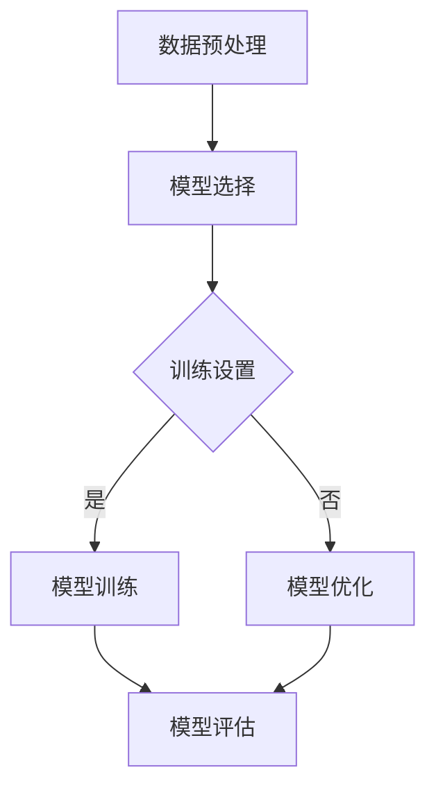
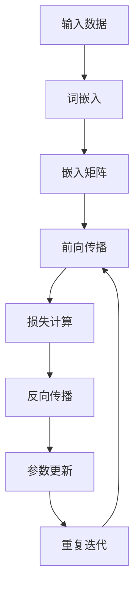
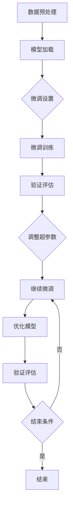

                 

### 第一部分：大模型基础

#### 第1章：大模型概述

##### 1.1 大模型的发展历程

大模型，顾名思义，是指参数量极其庞大的模型。它们在深度学习领域中逐渐崭露头角，尤其在自然语言处理（NLP）领域取得了显著的突破。大模型的发展历程可以分为以下几个阶段：

- **传统模型**：最早的深度学习模型主要基于简单的神经网络结构，如多层感知机（MLP）、卷积神经网络（CNN）等。这些模型虽然在一定程度上提升了机器学习的性能，但参数量相对较小。

- **深度学习模型**：随着计算能力的提升，研究者开始尝试使用更深的神经网络结构。深度学习模型的引入，使得模型的参数量显著增加，从而在图像识别、语音识别等领域取得了突破性进展。

- **大模型时代**：近年来，大模型成为研究热点。以Google的BERT（Bidirectional Encoder Representations from Transformers）为代表，大模型通过预训练和微调技术，在NLP任务中取得了优异的性能。

##### 1.1.1 从传统模型到深度学习模型

传统模型主要基于简单的神经网络结构，如多层感知机（MLP）。MLP是一种前馈神经网络，通过多个隐藏层将输入映射到输出。MLP的结构相对简单，参数量较小，难以处理复杂的非线性问题。

随着计算能力的提升，研究者开始尝试使用更深的神经网络结构。卷积神经网络（CNN）是其中一种重要的模型，它通过卷积层提取图像的特征，从而在图像识别领域取得了显著的突破。CNN的结构相对复杂，参数量较大，但它在处理图像数据时具有较好的性能。

深度学习模型的引入，使得模型的参数量显著增加，从而在图像识别、语音识别等领域取得了突破性进展。深度学习模型的核心思想是通过学习大量的参数来捕捉数据的复杂特征。

##### 1.1.2 大模型的意义和特点

大模型的出现，对于深度学习领域具有重要意义。首先，大模型具有更高的参数量，能够更好地捕捉数据的复杂特征，从而提高模型的性能。其次，大模型通过预训练和微调技术，可以在多个任务上共享知识，降低模型训练的难度。

大模型的特点如下：

- **参数量庞大**：大模型的参数量通常在数十亿到千亿级别，远超传统模型。

- **计算资源需求大**：大模型在训练和推理过程中需要大量的计算资源，对硬件设施有较高的要求。

- **预训练和微调**：大模型通常采用预训练和微调的方法，通过在大量无标签数据上进行预训练，然后在具体任务上进行微调，从而实现良好的性能。

- **跨任务迁移能力**：大模型通过预训练和微调，可以在多个任务上共享知识，具有较好的跨任务迁移能力。

##### 1.1.3 大模型的应用领域

大模型在多个领域取得了显著的突破，主要应用领域包括：

- **自然语言处理（NLP）**：大模型在文本分类、情感分析、问答系统等NLP任务中取得了优异的性能。

- **计算机视觉（CV）**：大模型在图像分类、目标检测、语义分割等CV任务中发挥了重要作用。

- **语音识别**：大模型在语音识别任务中通过预训练和微调，实现了较高的准确率和实时性。

- **推荐系统**：大模型在推荐系统中通过学习用户和商品的特征，提高了推荐的质量。

##### 1.2 BERT模型简介

BERT（Bidirectional Encoder Representations from Transformers）是一种基于Transformer架构的大规模预训练模型，由Google AI在2018年提出。BERT模型在自然语言处理领域取得了显著的突破，为后续的大模型研究奠定了基础。

##### 1.2.1 BERT模型的结构

BERT模型采用Transformer架构，其核心模块包括编码器（Encoder）和解码器（Decoder）。编码器用于将输入文本编码为固定长度的向量，解码器用于预测文本中的下一个词。

BERT模型的主要结构如下：

1. 输入文本：BERT模型接受一组单词作为输入，每个单词通过词嵌入（Word Embedding）转换为向量表示。

2. 词嵌入：BERT模型使用预训练的词嵌入向量，将输入的单词转换为向量表示。

3. 分词：BERT模型对输入的文本进行分词，将句子拆分为单词序列。

4. 编码器：编码器由多个Transformer块组成，每个Transformer块包含多头自注意力（Multi-Head Self-Attention）和前馈神经网络（Feedforward Neural Network）。

5. 解码器：解码器与编码器类似，也由多个Transformer块组成。此外，解码器还包含一个交叉注意力（Cross-Attention）机制，用于将编码器的输出作为输入。

6. 输出：BERT模型输出一个固定长度的向量，表示输入文本的语义特征。

##### 1.2.2 BERT模型的预训练方法

BERT模型采用预训练和微调的方法，通过在大量无标签数据上进行预训练，然后在具体任务上进行微调，从而实现良好的性能。

BERT模型的预训练方法主要包括以下两个任务：

1. **掩码语言模型（Masked Language Model, MLM）**：在预训练过程中，BERT模型随机掩码输入文本中的部分单词，然后尝试预测这些掩码的单词。通过这种方式，模型可以学习单词之间的依赖关系。

2. **下一句预测（Next Sentence Prediction, NSP）**：BERT模型还被训练来预测输入文本中下一句的起始标记。通过这种方式，模型可以学习句子之间的连贯性和上下文关系。

##### 1.2.3 BERT模型的优势和应用

BERT模型具有以下优势：

1. **强大的语义理解能力**：BERT模型通过预训练和微调，可以学习到丰富的语义信息，从而在NLP任务中取得优异的性能。

2. **跨语言适用性**：BERT模型在多个语言上进行了预训练，具有较好的跨语言适用性。

3. **易扩展性**：BERT模型的结构简单，易于扩展和调整，适用于各种NLP任务。

BERT模型的主要应用领域包括：

1. **文本分类**：BERT模型可以用于分类任务，如情感分析、主题分类等。

2. **问答系统**：BERT模型可以用于问答系统，如自动问答、机器翻译等。

3. **命名实体识别**：BERT模型可以用于命名实体识别任务，如人名、地名识别等。

4. **文本生成**：BERT模型可以用于文本生成任务，如自动摘要、文本续写等。

##### 1.3 大模型的基础知识

大模型的研究涉及多个核心概念，包括词嵌入、嵌入矩阵、注意力机制等。以下是对这些概念的基本介绍：

1. **词嵌入（Word Embedding）**：词嵌入是将单词转换为向量表示的过程。通过词嵌入，模型可以捕捉单词的语义信息。词嵌入方法包括Word2Vec、GloVe等。

2. **嵌入矩阵（Embedding Matrix）**：嵌入矩阵是一个高维矩阵，用于存储所有单词的嵌入向量。每个单词在嵌入矩阵中对应一个唯一的行向量。

3. **注意力机制（Attention Mechanism）**：注意力机制是一种计算模型，用于在处理序列数据时，对序列中的不同部分赋予不同的权重。注意力机制可以提升模型的性能，特别是在长序列处理任务中。

##### 1.4 大模型的研究现状

大模型的研究在全球范围内取得了显著的进展。以下是对国内外研究现状的简要概述：

1. **国内研究现状**：近年来，国内多家高校和研究机构在大模型研究方面取得了重要成果。例如，清华大学、北京大学、中国科学技术大学等在自然语言处理、计算机视觉等领域的大模型研究方面取得了突破。

2. **国外研究现状**：国外研究机构在大模型研究方面同样取得了重要进展。例如，Google、Facebook、Microsoft等公司在自然语言处理、计算机视觉、语音识别等领域的大模型研究方面处于领先地位。

##### 1.4.1 国内外研究进展

1. **自然语言处理领域**：在自然语言处理领域，BERT、GPT等大模型取得了显著的突破。例如，BERT在多种NLP任务中取得了SOTA（State-of-the-Art）性能。

2. **计算机视觉领域**：在计算机视觉领域，大模型如ViT（Vision Transformer）在图像分类、目标检测等任务中取得了优异的性能。

3. **语音识别领域**：在语音识别领域，大模型如WaveNet、Tacotron等取得了显著的突破，提高了语音识别的准确率和实时性。

##### 1.4.2 存在的问题和挑战

尽管大模型取得了显著的进展，但仍面临以下问题和挑战：

1. **计算资源需求**：大模型在训练和推理过程中需要大量的计算资源，对硬件设施有较高的要求。

2. **数据隐私**：大模型在预训练过程中需要大量无标签数据，可能涉及数据隐私问题。

3. **模型解释性**：大模型的内部结构和计算过程较为复杂，缺乏透明性和解释性。

4. **泛化能力**：大模型在特定任务上取得了优异的性能，但在其他任务上的泛化能力有待提高。

##### 1.4.3 发展趋势

未来，大模型的发展趋势可能包括：

1. **高效训练和推理算法**：研究更高效的大模型训练和推理算法，降低计算资源需求。

2. **数据隐私保护**：研究数据隐私保护方法，确保大模型在预训练过程中不会侵犯用户隐私。

3. **模型解释性提升**：研究模型解释性方法，提高大模型的透明度和可解释性。

4. **跨领域应用**：探索大模型在其他领域，如生物信息学、金融、医疗等领域的应用。

##### 1.5 大模型与BERT的关系

BERT作为一种典型的大模型，在大模型研究中具有重要地位。以下从BERT模型的特点、与其他模型的对比、适用场景等方面，探讨大模型与BERT的关系。

1. **BERT模型的特点**：

- **预训练和微调**：BERT模型采用预训练和微调的方法，通过在大量无标签数据上进行预训练，然后在具体任务上进行微调，从而实现良好的性能。

- **双向编码器**：BERT模型采用双向编码器结构，可以同时考虑输入文本的前后文信息，从而提高模型的语义理解能力。

- **多头自注意力**：BERT模型使用多头自注意力机制，可以捕捉输入文本中不同单词之间的依赖关系。

2. **BERT模型与其他模型的对比**：

- **与GPT模型的对比**：GPT模型是另一种基于Transformer架构的大规模预训练模型。与BERT模型相比，GPT模型主要关注文本生成任务，而BERT模型更适用于文本分类、问答等任务。

- **与传统模型的对比**：与传统模型（如MLP、CNN）相比，大模型如BERT具有更高的参数量和更强的语义理解能力。

3. **BERT模型的适用场景**：

- **文本分类**：BERT模型可以用于文本分类任务，如情感分析、主题分类等。

- **问答系统**：BERT模型可以用于问答系统，如自动问答、机器翻译等。

- **命名实体识别**：BERT模型可以用于命名实体识别任务，如人名、地名识别等。

- **文本生成**：BERT模型可以用于文本生成任务，如自动摘要、文本续写等。

##### 1.6 总结与展望

本章对大模型的基础知识进行了概述，包括大模型的发展历程、BERT模型简介、大模型的基础知识、研究现状以及大模型与BERT的关系。大模型的出现，为深度学习领域带来了新的机遇和挑战。未来，随着计算资源、数据隐私保护、模型解释性等方面的研究不断深入，大模型将在更多领域取得突破性进展。

## 第二部分：BERT模型开发与微调

### 第2章：BERT模型开发

BERT模型作为一种大规模预训练模型，其开发过程涉及数据准备、模型选择、模型训练和模型评估等多个环节。本章将详细介绍BERT模型开发的各个步骤，帮助读者理解如何从零开始搭建和训练一个BERT模型。

#### 2.1 BERT模型的结构与原理

BERT模型基于Transformer架构，由多个编码器块（Encoder Block）组成。每个编码器块包含两个主要部分：多头自注意力机制（Multi-Head Self-Attention）和前馈神经网络（Feedforward Neural Network）。

##### 2.1.1 BERT模型的结构

BERT模型的结构如下：

1. **输入层**：BERT模型接受一组单词作为输入，每个单词通过词嵌入（Word Embedding）转换为向量表示。

2. **嵌入层**：嵌入层包括词嵌入（Word Piece Embedding）、位置嵌入（Positional Embedding）和段嵌入（Segment Embedding）。

3. **编码器层**：编码器层由多个编码器块（Encoder Block）组成。每个编码器块包含多头自注意力机制和前馈神经网络。

4. **输出层**：输出层用于生成预测结果，如文本分类任务的标签或文本生成任务的单词序列。

##### 2.1.2 BERT模型的原理

BERT模型的原理主要包括以下几个方面：

1. **词嵌入**：BERT模型使用预训练的词嵌入向量，将输入的单词转换为向量表示。这些词嵌入向量可以捕获单词的语义信息。

2. **位置嵌入**：BERT模型通过位置嵌入（Positional Embedding）来编码输入文本的顺序信息。位置嵌入向量可以保证模型在处理序列数据时能够理解单词的相对位置。

3. **段嵌入**：BERT模型使用段嵌入（Segment Embedding）来区分输入文本的不同部分，如问题-答案对中的问题和答案。

4. **多头自注意力**：多头自注意力机制（Multi-Head Self-Attention）可以捕捉输入文本中不同单词之间的依赖关系。每个编码器块包含多个自注意力头，每个头可以捕获不同类型的依赖关系。

5. **前馈神经网络**：前馈神经网络（Feedforward Neural Network）对编码器块的输出进行进一步处理，提高模型的表示能力。

##### 2.1.3 BERT模型的训练过程

BERT模型的训练过程主要包括以下几个步骤：

1. **预训练**：BERT模型在大量无标签文本数据上进行预训练。预训练任务包括掩码语言模型（Masked Language Model）和下一句预测（Next Sentence Prediction）。

   - 掩码语言模型：在预训练过程中，BERT模型随机掩码输入文本中的部分单词，然后尝试预测这些掩码的单词。通过这种方式，模型可以学习单词之间的依赖关系。

   - 下一句预测：BERT模型还被训练来预测输入文本中下一句的起始标记。通过这种方式，模型可以学习句子之间的连贯性和上下文关系。

2. **微调**：在预训练完成后，BERT模型被用于特定任务上的微调。微调过程主要包括以下步骤：

   - **数据准备**：准备用于微调的数据集，包括问题和答案对、文本对等。

   - **模型调整**：在预训练模型的基础上，对模型进行调整，使其适应特定任务。

   - **训练**：使用微调后的数据集对模型进行训练，同时优化模型的参数。

   - **评估**：使用验证集评估模型的性能，并根据性能调整模型参数。

3. **推理**：在训练完成后，BERT模型可以用于推理和预测。推理过程主要包括以下步骤：

   - **输入处理**：将输入文本转换为词嵌入，并添加位置嵌入和段嵌入。

   - **编码**：将输入文本编码为固定长度的向量。

   - **预测**：使用编码后的向量预测输出结果，如文本分类任务的标签或文本生成任务的单词序列。

#### 2.2 BERT模型的开发流程

BERT模型的开发流程包括数据准备、模型选择、模型训练和模型评估等多个环节。以下是对BERT模型开发流程的详细介绍：

##### 2.2.1 数据准备

数据准备是BERT模型开发的重要步骤，主要包括以下工作：

1. **数据收集**：收集用于预训练和微调的数据集。数据集应包含各种类型的文本，如新闻、博客、百科全书等。

2. **数据预处理**：对数据集进行预处理，包括分词、去除停用词、转换成词嵌入等。BERT模型使用WordPiece算法对文本进行分词。

3. **数据集划分**：将数据集划分为训练集、验证集和测试集。训练集用于模型训练，验证集用于模型调整，测试集用于评估模型性能。

##### 2.2.2 模型选择

BERT模型的选择主要包括以下方面：

1. **预训练模型**：选择一个预训练好的BERT模型，如BERT-base或BERT-large。预训练模型已经在大规模文本数据上进行了预训练，可以用于特定任务的微调。

2. **模型版本**：选择合适的BERT模型版本，如BERT-base包含104M参数，BERT-large包含340M参数。参数量越大，模型的表示能力越强。

3. **模型架构**：BERT模型采用Transformer架构，包括编码器和解码器。编码器用于编码输入文本，解码器用于生成预测结果。

##### 2.2.3 模型训练

BERT模型的训练包括以下步骤：

1. **配置训练环境**：配置GPU或TPU训练环境，以满足大模型训练的计算需求。

2. **训练配置**：设置训练参数，如学习率、批量大小、训练轮数等。学习率通常设置为较小的值，如1e-5。

3. **训练过程**：使用训练数据集对BERT模型进行训练。训练过程中，模型将不断调整参数，以最小化损失函数。

4. **验证调整**：在训练过程中，使用验证集评估模型性能。根据验证集的性能，调整训练参数，如学习率、批量大小等。

##### 2.2.4 模型评估

BERT模型的评估主要包括以下方面：

1. **性能指标**：选择适当的性能指标，如准确率（Accuracy）、F1分数（F1 Score）等，来评估模型在验证集上的性能。

2. **测试集评估**：在训练完成后，使用测试集评估模型性能。测试集的性能指标可以更准确地反映模型在未知数据上的表现。

3. **模型优化**：根据测试集的性能，对模型进行调整和优化，以提高模型性能。

#### 2.3 BERT模型的微调

BERT模型的微调是指将预训练好的BERT模型应用于特定任务，并通过调整模型参数来提高模型性能。以下是对BERT模型微调的详细介绍：

##### 2.3.1 微调的概念

微调（Fine-tuning）是一种将预训练模型应用于特定任务，并通过调整模型参数来提高模型性能的方法。微调过程中，预训练模型的部分层（通常为顶层）会被重新训练，以适应特定任务的需求。

##### 2.3.2 微调的流程

BERT模型的微调流程主要包括以下步骤：

1. **数据准备**：准备用于微调的数据集，包括问题和答案对、文本对等。数据集应包含与任务相关的标签信息。

2. **模型加载**：加载预训练好的BERT模型，包括词嵌入层、编码器和解码器。

3. **顶层调整**：对BERT模型的顶层进行调整，包括输出层和部分隐藏层。调整的目的是使模型能够更好地适应特定任务。

4. **训练**：使用微调后的数据集对BERT模型进行训练。训练过程中，模型将不断调整参数，以最小化损失函数。

5. **评估**：在训练完成后，使用验证集评估模型性能。根据验证集的性能，对模型进行调整和优化。

##### 2.3.3 微调的方法

BERT模型的微调方法主要包括以下几种：

1. **全连接层微调**：在BERT模型的顶层添加全连接层（Fully Connected Layer），用于对特定任务进行分类或回归。

2. **分类微调**：在BERT模型的输出层添加softmax层，用于对文本进行分类。

3. **回归微调**：在BERT模型的输出层添加回归层（Regression Layer），用于对文本进行回归预测。

4. **混合微调**：同时使用分类微调和回归微调，以适应不同的任务需求。

#### 2.4 BERT模型的调优

BERT模型的调优是指在微调过程中，通过调整模型参数来提高模型性能。以下是对BERT模型调优的详细介绍：

##### 2.4.1 参数调优

参数调优是BERT模型调优的核心步骤，主要包括以下方面：

1. **学习率**：学习率是影响模型训练效果的关键参数。学习率过大会导致模型梯度爆炸，学习率过小会导致训练过程缓慢。通常采用学习率衰减策略，如指数衰减或余弦退火策略。

2. **批量大小**：批量大小影响模型训练的速度和稳定性。批量大小过大会导致训练速度变慢，批量大小过小会增加模型的方差。

3. **正则化**：正则化可以防止模型过拟合。常见的正则化方法包括L1正则化、L2正则化和Dropout等。

##### 2.4.2 模型评估

模型评估是BERT模型调优的重要环节，主要包括以下方面：

1. **验证集评估**：在微调过程中，使用验证集评估模型性能。验证集的性能指标可以指导参数调整。

2. **测试集评估**：在模型训练完成后，使用测试集评估模型性能。测试集的性能指标可以更准确地反映模型在未知数据上的表现。

##### 2.4.3 模型优化

模型优化是指在微调过程中，通过调整模型结构来提高模型性能。以下是对BERT模型优化的详细介绍：

1. **模型压缩**：通过剪枝、量化等技术对BERT模型进行压缩，减少模型参数和计算量。

2. **模型蒸馏**：将预训练好的BERT模型作为教师模型，将微调后的BERT模型作为学生模型。通过蒸馏过程，学生模型可以学习到教师模型的丰富知识。

3. **迁移学习**：将BERT模型的知识迁移到其他任务上，以提高模型在其他任务上的性能。

#### 2.5 BERT模型的部署与使用

BERT模型的部署与使用是将其应用于实际任务的关键步骤。以下是对BERT模型部署与使用的详细介绍：

##### 2.5.1 模型部署

BERT模型的部署主要包括以下步骤：

1. **模型导出**：将训练好的BERT模型导出为可部署的格式，如ONNX、TorchScript等。

2. **模型加载**：加载部署环境中的BERT模型，并将其集成到应用程序中。

3. **模型推理**：使用加载的BERT模型对输入文本进行推理，生成预测结果。

##### 2.5.2 模型调用

BERT模型的调用主要包括以下方面：

1. **输入处理**：将输入文本转换为BERT模型所需的格式，包括词嵌入、位置嵌入和段嵌入等。

2. **模型推理**：调用BERT模型，对输入文本进行推理，生成预测结果。

3. **结果输出**：将BERT模型的预测结果转换为用户可理解的格式，如文本分类任务的标签或文本生成任务的单词序列。

##### 2.5.3 模型优化与维护

BERT模型的优化与维护是确保其长期稳定运行的关键。以下是对BERT模型优化与维护的详细介绍：

1. **性能优化**：通过调整模型参数、优化推理过程等方式，提高BERT模型的性能。

2. **监控与日志**：监控BERT模型的运行状态，记录日志信息，以便在出现问题时进行诊断和调试。

3. **模型更新**：定期更新BERT模型，以适应不断变化的数据和应用场景。

#### 2.6 实战案例：BERT在文本分类中的应用

在本节中，我们将通过一个实战案例，展示如何使用BERT模型进行文本分类。该案例包括数据准备、模型训练、模型评估和模型部署等步骤。

##### 2.6.1 数据准备

1. **数据集准备**：准备一个包含文本和标签的数据集。文本可以是新闻、博客、社交媒体等。标签可以是正负极性、主题类别等。

2. **数据预处理**：对文本进行预处理，包括分词、去除停用词、转换成词嵌入等。使用BERT模型的预处理工具，如huggingface的transformers库，对文本进行预处理。

##### 2.6.2 模型训练

1. **加载预训练模型**：使用huggingface的transformers库，加载预训练的BERT模型。

2. **微调模型**：在预训练模型的基础上，对模型进行微调，以适应特定的文本分类任务。微调过程中，需要调整模型参数，如学习率、批量大小等。

3. **训练过程**：使用训练数据集对微调后的模型进行训练。训练过程中，模型将不断调整参数，以最小化损失函数。

##### 2.6.3 模型评估

1. **验证集评估**：在训练过程中，使用验证集评估模型性能。验证集的性能指标，如准确率、F1分数等，可以指导模型调整。

2. **测试集评估**：在模型训练完成后，使用测试集评估模型性能。测试集的性能指标可以更准确地反映模型在未知数据上的表现。

##### 2.6.4 模型部署

1. **模型导出**：将训练好的BERT模型导出为可部署的格式，如ONNX、TorchScript等。

2. **模型部署**：将导出的BERT模型部署到生产环境，如云计算平台、容器等。

3. **模型调用**：通过应用程序，调用部署后的BERT模型，对输入文本进行推理，生成预测结果。

#### 2.7 BERT模型在对话系统中的应用

BERT模型在对话系统中的应用主要涉及以下方面：

##### 2.7.1 对话系统概述

对话系统是指能够与用户进行自然语言交互的计算机系统。对话系统可以用于客服、智能助手、语音助手等场景。

##### 2.7.2 BERT模型在对话系统中的应用

BERT模型在对话系统中的应用主要包括以下方面：

1. **意图识别**：BERT模型可以用于意图识别任务，如确定用户的请求类型。通过微调BERT模型，可以使其适应特定场景的意图识别任务。

2. **实体识别**：BERT模型可以用于实体识别任务，如识别用户请求中的关键信息。通过微调BERT模型，可以使其适应特定场景的实体识别任务。

3. **对话生成**：BERT模型可以用于对话生成任务，如生成自然流畅的回复。通过微调BERT模型，可以使其适应特定场景的对话生成任务。

##### 2.7.3 实战案例：基于BERT的对话系统开发

在本节中，我们将通过一个实战案例，展示如何使用BERT模型开发一个简单的对话系统。该案例包括数据准备、模型训练、模型评估和模型部署等步骤。

##### 2.7.3.1 数据准备

1. **数据集准备**：准备一个包含对话样本的数据集。对话样本可以是用户请求和系统回复的配对。

2. **数据预处理**：对对话样本进行预处理，包括分词、去除停用词、转换成词嵌入等。使用BERT模型的预处理工具，如huggingface的transformers库，对对话样本进行预处理。

##### 2.7.3.2 模型训练

1. **加载预训练模型**：使用huggingface的transformers库，加载预训练的BERT模型。

2. **微调模型**：在预训练模型的基础上，对模型进行微调，以适应特定的对话系统任务。微调过程中，需要调整模型参数，如学习率、批量大小等。

3. **训练过程**：使用训练数据集对微调后的模型进行训练。训练过程中，模型将不断调整参数，以最小化损失函数。

##### 2.7.3.3 模型评估

1. **验证集评估**：在训练过程中，使用验证集评估模型性能。验证集的性能指标，如准确率、F1分数等，可以指导模型调整。

2. **测试集评估**：在模型训练完成后，使用测试集评估模型性能。测试集的性能指标可以更准确地反映模型在未知数据上的表现。

##### 2.7.3.4 模型部署

1. **模型导出**：将训练好的BERT模型导出为可部署的格式，如ONNX、TorchScript等。

2. **模型部署**：将导出的BERT模型部署到生产环境，如云计算平台、容器等。

3. **模型调用**：通过应用程序，调用部署后的BERT模型，对输入文本进行推理，生成预测结果。

### 第3章：BERT模型的应用

BERT模型在自然语言处理（NLP）领域取得了显著的突破，广泛应用于文本分类、情感分析、命名实体识别等任务。本章将详细介绍BERT模型在这些领域的应用，并通过实战案例展示如何使用BERT模型解决实际问题。

#### 3.1 BERT模型在自然语言处理中的应用

BERT模型在自然语言处理领域具有广泛的应用，以下是其主要应用领域：

##### 3.1.1 文本分类

文本分类是NLP中的经典任务，旨在将文本数据归类到预定义的类别中。BERT模型在文本分类任务中表现出色，以下是其应用步骤：

1. **数据准备**：收集并准备用于训练的文本数据集，包括标签信息。

2. **数据预处理**：对文本进行预处理，包括分词、去除停用词、词嵌入等。

3. **模型选择**：选择预训练好的BERT模型，如BERT-base或BERT-large。

4. **模型微调**：在预训练模型的基础上，对模型进行微调，使其适应特定的文本分类任务。

5. **模型训练**：使用训练数据集对微调后的模型进行训练，优化模型参数。

6. **模型评估**：在验证集和测试集上评估模型性能，调整模型参数，优化模型。

7. **模型部署**：将训练好的模型部署到生产环境，用于实时分类任务。

##### 3.1.2 情感分析

情感分析是评估文本数据情感极性的任务。BERT模型在情感分析任务中表现出色，以下是其应用步骤：

1. **数据准备**：收集并准备用于训练的文本数据集，包括情感标签信息。

2. **数据预处理**：对文本进行预处理，包括分词、去除停用词、词嵌入等。

3. **模型选择**：选择预训练好的BERT模型，如BERT-base或BERT-large。

4. **模型微调**：在预训练模型的基础上，对模型进行微调，使其适应特定的情感分析任务。

5. **模型训练**：使用训练数据集对微调后的模型进行训练，优化模型参数。

6. **模型评估**：在验证集和测试集上评估模型性能，调整模型参数，优化模型。

7. **模型部署**：将训练好的模型部署到生产环境，用于实时情感分析任务。

##### 3.1.3 命名实体识别

命名实体识别（NER）是识别文本中的命名实体（如人名、地名、组织名等）的任务。BERT模型在NER任务中表现出色，以下是其应用步骤：

1. **数据准备**：收集并准备用于训练的文本数据集，包括命名实体标签信息。

2. **数据预处理**：对文本进行预处理，包括分词、去除停用词、词嵌入等。

3. **模型选择**：选择预训练好的BERT模型，如BERT-base或BERT-large。

4. **模型微调**：在预训练模型的基础上，对模型进行微调，使其适应特定的命名实体识别任务。

5. **模型训练**：使用训练数据集对微调后的模型进行训练，优化模型参数。

6. **模型评估**：在验证集和测试集上评估模型性能，调整模型参数，优化模型。

7. **模型部署**：将训练好的模型部署到生产环境，用于实时命名实体识别任务。

#### 3.2 BERT模型在对话系统中的应用

对话系统是指能够与用户进行自然语言交互的计算机系统。BERT模型在对话系统中具有广泛的应用，以下是其主要应用领域：

##### 3.2.1 对话系统概述

对话系统可以分为两种类型：基于规则的和基于机器学习的。基于规则的方法通过预定义的规则来处理用户输入，而基于机器学习的方法通过训练模型来处理用户输入。

##### 3.2.2 BERT模型在对话系统中的应用

BERT模型在对话系统中主要应用于以下任务：

1. **意图识别**：意图识别是识别用户输入意图的任务。BERT模型可以用于识别用户输入的意图，如查询意图、命令意图等。

2. **实体识别**：实体识别是识别用户输入中的关键信息（如人名、地名、组织名等）的任务。BERT模型可以用于识别用户输入中的关键信息。

3. **对话生成**：对话生成是生成自然流畅的回复的任务。BERT模型可以用于生成自然流畅的回复。

##### 3.2.3 实战案例：基于BERT的对话系统开发

在本节中，我们将通过一个实战案例，展示如何使用BERT模型开发一个简单的对话系统。该案例包括数据准备、模型训练、模型评估和模型部署等步骤。

##### 3.2.3.1 数据准备

1. **数据集准备**：准备一个包含对话样本的数据集。对话样本可以是用户请求和系统回复的配对。

2. **数据预处理**：对对话样本进行预处理，包括分词、去除停用词、词嵌入等。使用BERT模型的预处理工具，如huggingface的transformers库，对对话样本进行预处理。

##### 3.2.3.2 模型训练

1. **加载预训练模型**：使用huggingface的transformers库，加载预训练的BERT模型。

2. **微调模型**：在预训练模型的基础上，对模型进行微调，以适应特定的对话系统任务。微调过程中，需要调整模型参数，如学习率、批量大小等。

3. **训练过程**：使用训练数据集对微调后的模型进行训练。训练过程中，模型将不断调整参数，以最小化损失函数。

##### 3.2.3.3 模型评估

1. **验证集评估**：在训练过程中，使用验证集评估模型性能。验证集的性能指标，如准确率、F1分数等，可以指导模型调整。

2. **测试集评估**：在模型训练完成后，使用测试集评估模型性能。测试集的性能指标可以更准确地反映模型在未知数据上的表现。

##### 3.2.3.4 模型部署

1. **模型导出**：将训练好的BERT模型导出为可部署的格式，如ONNX、TorchScript等。

2. **模型部署**：将导出的BERT模型部署到生产环境，如云计算平台、容器等。

3. **模型调用**：通过应用程序，调用部署后的BERT模型，对输入文本进行推理，生成预测结果。

#### 3.3 BERT模型在文本生成中的应用

BERT模型在文本生成领域也取得了显著的应用，以下是其主要应用领域：

##### 3.3.1 文本生成概述

文本生成是生成自然流畅的文本的任务，包括自动摘要、文本续写、对话生成等。BERT模型可以用于生成自然流畅的文本。

##### 3.3.2 BERT模型在文本生成中的应用

BERT模型在文本生成任务中主要应用于以下方面：

1. **自动摘要**：自动摘要是从长文本中提取关键信息的任务。BERT模型可以用于生成摘要，提高摘要的准确性和流畅性。

2. **文本续写**：文本续写是从给定文本中生成后续文本的任务。BERT模型可以用于生成文本的后续部分，提高文本的连贯性和自然性。

3. **对话生成**：对话生成是从给定对话中生成后续对话的任务。BERT模型可以用于生成对话的后续部分，提高对话的连贯性和自然性。

##### 3.3.3 实战案例：基于BERT的文本生成系统开发

在本节中，我们将通过一个实战案例，展示如何使用BERT模型开发一个简单的文本生成系统。该案例包括数据准备、模型训练、模型评估和模型部署等步骤。

##### 3.3.3.1 数据准备

1. **数据集准备**：准备一个包含文本生成样本的数据集。文本生成样本可以是文本段落、对话等。

2. **数据预处理**：对文本进行预处理，包括分词、去除停用词、词嵌入等。使用BERT模型的预处理工具，如huggingface的transformers库，对文本进行预处理。

##### 3.3.3.2 模型训练

1. **加载预训练模型**：使用huggingface的transformers库，加载预训练的BERT模型。

2. **微调模型**：在预训练模型的基础上，对模型进行微调，以适应特定的文本生成任务。微调过程中，需要调整模型参数，如学习率、批量大小等。

3. **训练过程**：使用训练数据集对微调后的模型进行训练。训练过程中，模型将不断调整参数，以最小化损失函数。

##### 3.3.3.3 模型评估

1. **验证集评估**：在训练过程中，使用验证集评估模型性能。验证集的性能指标，如准确率、F1分数等，可以指导模型调整。

2. **测试集评估**：在模型训练完成后，使用测试集评估模型性能。测试集的性能指标可以更准确地反映模型在未知数据上的表现。

##### 3.3.3.4 模型部署

1. **模型导出**：将训练好的BERT模型导出为可部署的格式，如ONNX、TorchScript等。

2. **模型部署**：将导出的BERT模型部署到生产环境，如云计算平台、容器等。

3. **模型调用**：通过应用程序，调用部署后的BERT模型，对输入文本进行推理，生成预测结果。

#### 3.4 BERT模型在其他领域中的应用

BERT模型不仅在NLP领域取得了显著的应用，还在其他领域展示了强大的潜力。以下是一些BERT模型在其他领域的主要应用：

##### 3.4.1 代码生成

BERT模型可以用于代码生成任务，如代码补全、代码摘要等。通过预训练和微调，BERT模型可以学习到编程语言的语法和语义规则，从而生成高质量的代码。

##### 3.4.2 语音识别

BERT模型可以用于语音识别任务，如语音转文本、语音情感分析等。通过结合语音信号和文本信息，BERT模型可以更准确地识别语音内容。

##### 3.4.3 图像识别

BERT模型可以用于图像识别任务，如图像分类、目标检测等。通过结合图像和文本信息，BERT模型可以更好地理解图像内容。

##### 3.4.4 医学文本分析

BERT模型可以用于医学文本分析任务，如病历摘要、医学实体识别等。通过预训练和微调，BERT模型可以学习到医学领域的专业知识和术语。

#### 3.5 BERT模型的未来发展趋势

BERT模型作为大规模预训练模型，在NLP领域取得了显著的突破。未来，BERT模型的未来发展趋势可能包括：

1. **跨语言适用性**：BERT模型在多种语言上进行了预训练，具有较好的跨语言适用性。未来，研究将继续探索BERT模型在跨语言任务中的应用。

2. **更高效的结构**：随着计算能力的提升，研究者将致力于设计更高效的大模型结构，降低计算资源需求。

3. **自适应微调**：未来，研究将探索自适应微调方法，使模型能够根据不同的任务自适应调整参数。

4. **模型解释性**：提高大模型的可解释性，使模型在处理复杂任务时更具透明性和可信度。

5. **跨领域应用**：BERT模型在其他领域的应用将不断拓展，如生物信息学、金融、医疗等。

### 第4章：大模型开发实践

在本章中，我们将深入探讨大模型开发实践的各个方面，包括环境搭建、开发流程、微调与优化、部署与维护等。通过具体的实战案例，我们将展示如何从零开始构建和部署一个大型预训练模型。

#### 4.1 大模型开发环境搭建

大模型开发首先需要搭建一个高效稳定的环境。以下是一个基本的步骤指南：

##### 4.1.1 硬件环境

1. **GPU或TPU**：大模型的训练需要大量的计算资源，因此需要配备高性能的GPU（如NVIDIA 1080 Ti或更高级别的GPU）或TPU（Tensor Processing Unit）。对于大规模模型，可能需要多GPU或TPU集群。

2. **CPU**：虽然GPU或TPU负责大部分计算，但服务器中的CPU也负责管理任务调度和模型推理，因此需要配备多核心、高频率的CPU。

3. **存储**：大模型的训练数据集通常很大，因此需要足够的存储空间来存储数据和模型文件。

##### 4.1.2 软件环境

1. **操作系统**：常见的操作系统包括Linux和Windows。Linux因其高效性和开源工具的丰富性，通常被用于大规模模型训练。

2. **Python环境**：Python是深度学习领域的主要编程语言，需要安装Python环境。

3. **深度学习框架**：TensorFlow、PyTorch和MXNet是常见的深度学习框架。其中，TensorFlow和PyTorch因其强大的生态系统和社区支持，被广泛用于大模型开发。

4. **依赖库**：安装必要的依赖库，如NumPy、Pandas、Scikit-learn等，用于数据处理和模型评估。

##### 4.1.3 数据集准备

1. **数据收集**：收集用于预训练的数据集，数据集应包含多样化的文本内容，如新闻、百科、社交媒体等。

2. **数据预处理**：对数据集进行清洗和预处理，包括分词、去除停用词、标准化文本格式等。

3. **数据存储**：将预处理后的数据存储为适合训练的格式，如JSON、CSV或TFRecord。

#### 4.2 大模型开发流程

大模型的开发流程包括数据准备、模型选择、模型训练和模型评估等步骤。以下是一个详细的流程：

##### 4.2.1 数据预处理

1. **文本清洗**：去除无关符号、标点符号和特殊字符。

2. **分词**：将文本拆分成单词或子词。

3. **词嵌入**：将单词或子词映射到向量表示。

4. **序列化**：将预处理后的数据存储为可训练的格式。

##### 4.2.2 模型选择

1. **预训练模型**：选择一个预训练的大规模预训练模型，如BERT、GPT等。

2. **定制模型**：如果预训练模型不满足需求，可以定制模型结构。

##### 4.2.3 模型训练

1. **模型配置**：设置模型参数，包括学习率、批量大小、优化器等。

2. **数据加载**：使用数据加载器读取和处理训练数据。

3. **训练循环**：迭代训练数据，更新模型参数。

##### 4.2.4 模型评估

1. **验证集评估**：在训练过程中，使用验证集评估模型性能。

2. **测试集评估**：在训练完成后，使用测试集评估模型性能。

3. **性能优化**：根据评估结果调整模型参数。

#### 4.3 大模型微调和优化

微调和优化是提高大模型性能的关键步骤。以下是一些常用的微调和优化策略：

##### 4.3.1 微调策略

1. **数据增强**：通过数据增强技术，如数据扩充、随机裁剪等，增加训练数据的多样性。

2. **混合训练**：结合多个预训练模型，通过模型融合技术提高模型的泛化能力。

##### 4.3.2 优化方法

1. **学习率调度**：使用学习率调度策略，如学习率衰减、余弦退火等，调整学习率。

2. **权重衰减**：添加权重衰减正则化，防止模型过拟合。

3. **dropout**：在神经网络中引入dropout，提高模型的鲁棒性。

##### 4.3.3 实践案例

以下是一个简化的微调和优化案例：

```python
from transformers import BertModel, BertTokenizer

# 加载预训练模型和分词器
model = BertModel.from_pretrained('bert-base-uncased')
tokenizer = BertTokenizer.from_pretrained('bert-base-uncased')

# 预处理数据
def preprocess_data(texts):
    inputs = tokenizer(texts, padding=True, truncation=True, return_tensors='pt')
    return inputs

# 微调模型
def fine_tune_model(model, train_loader, val_loader, epochs=3, learning_rate=1e-5):
    optimizer = torch.optim.AdamW(model.parameters(), lr=learning_rate)
    criterion = torch.nn.CrossEntropyLoss()

    for epoch in range(epochs):
        model.train()
        for batch in train_loader:
            inputs = preprocess_data(batch['text'])
            labels = batch['label']
            optimizer.zero_grad()
            outputs = model(**inputs)[0]
            loss = criterion(outputs, labels)
            loss.backward()
            optimizer.step()

        model.eval()
        with torch.no_grad():
            val_loss = 0
            for batch in val_loader:
                inputs = preprocess_data(batch['text'])
                labels = batch['label']
                outputs = model(**inputs)[0]
                loss = criterion(outputs, labels)
                val_loss += loss.item()
            val_loss /= len(val_loader)
        print(f'Epoch {epoch+1}: Val Loss: {val_loss:.4f}')

# 评估模型
def evaluate_model(model, test_loader):
    model.eval()
    with torch.no_grad():
        test_loss = 0
        for batch in test_loader:
            inputs = preprocess_data(batch['text'])
            labels = batch['label']
            outputs = model(**inputs)[0]
            loss = torch.nn.CrossEntropyLoss()(outputs, labels)
            test_loss += loss.item()
        test_loss /= len(test_loader)
    print(f'Test Loss: {test_loss:.4f}')

# 微调模型并评估
fine_tune_model(model, train_loader, val_loader)
evaluate_model(model, test_loader)
```

#### 4.4 大模型部署与维护

部署和维护是确保大模型在生产环境中稳定运行的关键。以下是一些部署和维护的策略：

##### 4.4.1 部署策略

1. **容器化**：使用Docker等工具将模型容器化，确保模型在不同的环境中运行一致。

2. **模型导出**：将训练好的模型导出为可部署的格式，如ONNX、TorchScript等。

3. **服务化**：使用服务化框架（如TensorFlow Serving、PyTorch Serve
```

### 4.4.2 部署流程

1. **环境准备**：准备部署环境，包括服务器、GPU或TPU等硬件设施。

2. **模型导出**：将训练好的模型导出为可部署的格式。

3. **容器构建**：使用Dockerfile构建包含模型和运行时依赖的容器镜像。

4. **容器部署**：将容器部署到服务器，并设置服务启动和停止的脚本。

5. **监控与日志**：设置监控工具，如Prometheus、Grafana等，监控模型的运行状态和性能。

### 4.4.3 维护策略

1. **定期备份**：定期备份模型和数据，以防数据丢失或损坏。

2. **性能优化**：根据监控数据，对模型和部署环境进行性能优化，如调整超参数、优化代码等。

3. **安全监控**：设置安全监控，防止恶意攻击和未授权访问。

4. **更新与升级**：定期更新模型和相关依赖库，确保模型的稳定性和安全性。

### 4.5 大模型开发中的常见问题与解决方法

在大模型开发过程中，可能会遇到各种问题。以下是一些常见问题及其解决方法：

##### 4.5.1 训练过程中的问题

**问题**：训练过程缓慢或无法收敛。

**解决方法**：

- **增加GPU数量**：使用更多GPU进行分布式训练，提高训练速度。
- **调整学习率**：尝试调整学习率，使用学习率调度策略。
- **数据增强**：增加数据多样性，使用数据增强技术。

##### 4.5.2 微调过程中的问题

**问题**：微调效果不佳或过拟合。

**解决方法**：

- **正则化**：使用L1、L2正则化，防止过拟合。
- **dropout**：在神经网络中引入dropout，提高模型的泛化能力。
- **数据增强**：增加数据多样性，使用数据增强技术。

##### 4.5.3 部署过程中的问题

**问题**：模型部署后性能下降。

**解决方法**：

- **模型压缩**：使用模型压缩技术，如剪枝、量化等，减小模型大小和计算量。
- **优化代码**：优化模型推理代码，减少冗余计算。
- **性能监控**：定期监控模型性能，及时发现问题并进行调整。

### 4.6 实战案例：大模型在某一具体领域的应用

在本节中，我们将通过一个具体的实战案例，展示如何在大模型开发与微调过程中解决实际问题。假设我们选择的是医学文本分析领域。

##### 4.6.1 数据准备

1. **数据收集**：收集包含病历、医学摘要、诊断报告等文本数据的医学文本数据集。

2. **数据预处理**：对文本进行清洗和预处理，包括去除停用词、分词、标准化文本格式等。

3. **数据存储**：将预处理后的数据存储为JSON或CSV格式，便于后续处理。

##### 4.6.2 模型选择

1. **预训练模型**：选择一个预训练的语言模型，如BERT、GPT等，这些模型已在大量文本数据上进行了预训练。

2. **定制模型**：如果预训练模型不满足特定医学文本分析的需求，可以考虑定制模型，如添加特定的医学实体识别头。

##### 4.6.3 模型微调

1. **数据集划分**：将数据集划分为训练集、验证集和测试集。

2. **微调过程**：在预训练模型的基础上，使用训练集进行微调，调整模型参数以适应医学文本分析任务。

3. **验证调整**：在验证集上评估微调后的模型性能，根据评估结果调整模型参数。

##### 4.6.4 模型评估

1. **性能评估**：在测试集上评估微调后的模型性能，包括准确率、召回率、F1分数等指标。

2. **优化策略**：根据评估结果，调整模型结构和参数，以提高模型性能。

##### 4.6.5 模型部署

1. **模型导出**：将训练好的模型导出为可部署的格式，如ONNX或TorchScript。

2. **容器化**：使用Docker将模型和服务容器化，确保模型在不同环境中的一致性和可移植性。

3. **部署服务**：将容器部署到服务器，并设置API接口，以便外部系统调用模型服务。

##### 4.6.6 实际应用

1. **医学文本分类**：使用部署后的模型进行医学文本分类，如诊断报告的分类。

2. **医学实体识别**：使用模型识别医学文本中的关键实体，如疾病名称、药物名称等。

3. **后续优化**：根据实际应用中的反馈和需求，对模型进行持续优化和改进。

通过上述实战案例，我们可以看到大模型在医学文本分析领域的重要应用价值。在实际开发过程中，需要根据具体任务的需求，灵活调整模型结构和参数，并不断优化模型性能，以满足实际应用需求。

## 第五部分：总结与展望

### 第5章：总结与展望

在本章中，我们系统地介绍了大模型与BERT的开发、微调和应用。通过对大模型基础知识的详细阐述，读者可以理解大模型的发展历程、核心概念和前沿技术。同时，我们深入探讨了BERT模型的结构、原理和开发流程，展示了如何从零开始搭建和训练一个BERT模型。此外，我们还介绍了BERT模型在多个领域的应用，以及大模型开发实践中的常见问题和解决方法。

### 5.1 大模型与BERT的发展现状

当前，大模型与BERT已经取得了显著的进展，在多个领域取得了SOTA（State-of-the-Art）性能。BERT模型以其强大的语义理解能力和跨语言适用性，在自然语言处理领域脱颖而出。此外，大模型在计算机视觉、语音识别、推荐系统等领域的应用也取得了重要突破。

尽管大模型取得了显著进展，但仍然面临一些挑战，如计算资源需求大、数据隐私保护和模型解释性等问题。为了解决这些问题，研究者们正在探索更高效的大模型训练和推理算法、数据隐私保护方法以及模型解释性技术。

### 5.2 大模型与BERT的发展趋势

未来，大模型与BERT的发展趋势可能包括以下几个方面：

1. **跨语言适用性**：随着多语言数据的不断增长，大模型将更加注重跨语言适用性的研究，以支持多种语言的预训练和微调。

2. **模型压缩与优化**：为了降低计算资源需求，研究者将继续探索模型压缩和优化技术，如剪枝、量化、蒸馏等，以提高模型的效率和可扩展性。

3. **模型解释性**：随着模型复杂性的增加，模型解释性将成为一个重要研究方向。研究者将致力于开发可解释的大模型，以提高模型的透明度和可信度。

4. **跨领域应用**：大模型将在更多领域得到应用，如生物信息学、金融、医疗等。通过跨领域迁移学习，大模型可以在不同领域实现更高的性能。

### 5.3 未来展望

未来，大模型与BERT将在以下几个方面实现创新和发展：

1. **技术创新**：随着深度学习技术的不断发展，大模型将采用更多创新技术，如自注意力机制、Transformer架构等，以提升模型性能和效率。

2. **应用创新**：大模型将在更多实际场景中得到应用，如智能客服、自动驾驶、智能医疗等，为社会带来更多价值。

3. **社会责任**：在发展大模型的同时，研究者将关注其潜在的社会影响，如数据隐私保护、算法公平性等问题，确保技术发展符合社会伦理和道德标准。

通过本文的介绍，我们相信读者对大模型与BERT有了更深入的理解，并对未来的发展有了更清晰的展望。让我们共同期待大模型与BERT在未来带来更多的惊喜和突破！

### 附录

在本附录中，我们将提供大模型与BERT相关的一些资源和工具，以供读者进一步学习和实践。

#### 附录A：大模型与BERT相关资源

##### A.1 学术论文

- BERT: Pre-training of Deep Bidirectional Transformers for Language Understanding. (Devlin et al., 2018)
- Attention Is All You Need. (Vaswani et al., 2017)
- Improving Language Understanding by Generative Pre-Training. (Radford et al., 2018)

##### A.2 开源框架

- Hugging Face Transformers: https://huggingface.co/transformers
- TensorFlow: https://www.tensorflow.org
- PyTorch: https://pytorch.org

##### A.3 在线课程

- "Natural Language Processing with Transformer Models" by fast.ai: https://course.fast.ai/
- "Deep Learning Specialization" by Andrew Ng: https://www.coursera.org/specializations/deep-learning

##### A.4 实践项目

- "BERT for Sentence Similarity" by Hugging Face: https://huggingface.co/tutorial
- "BERT for Text Classification" by AI Challenger: https://aiclassifier.org/

通过这些资源和工具，读者可以进一步深入了解大模型与BERT的理论和实践，从而在相关领域取得更好的成果。

### 大模型与BERT的Mermaid流程图

在本章中，我们将使用Mermaid语法绘制几个大模型与BERT相关的流程图，帮助读者更直观地理解大模型的开发流程、BERT模型的训练过程以及大模型的微调和优化流程。

#### 6.1 大模型开发流程

以下是一个简化的大模型开发流程图：



#### 6.2 BERT模型训练过程

以下是一个简化的BERT模型训练过程图：



#### 6.3 大模型微调和优化流程

以下是一个简化的大模型微调和优化流程图：



通过这些Mermaid流程图，读者可以更直观地理解大模型与BERT的相关流程，有助于加深对大模型开发与微调的理解。

### 大模型与BERT的伪代码讲解

在本章中，我们将使用伪代码来详细讲解大模型与BERT的核心算法和步骤，包括数据预处理、BERT模型训练过程以及微调和优化策略。

#### 6.1 数据预处理

数据预处理是模型开发的重要步骤，它包括文本清洗、分词、去除停用词和词嵌入等操作。以下是一个简化的数据预处理伪代码：

```python
# 假设我们有一个数据集 dataset，其中每个数据点是一个文本字符串

# 文本清洗
def clean_text(text):
    # 去除标点符号、特殊字符、停用词等
    cleaned_text = ...
    return cleaned_text

# 分词
def tokenize(text):
    # 使用词嵌入器对文本进行分词
    tokens = embedding.tokenizer.tokenize(text)
    return tokens

# 去除停用词
def remove_stopwords(tokens):
    # 去除停用词
    filtered_tokens = [token for token in tokens if token not in stopwords]
    return filtered_tokens

# 词嵌入
def convert_to_embeddings(tokens):
    # 将分词后的文本转换为词嵌入向量
    embeddings = embedding.tokenizer.convert_tokens_toEmbeddings(filtered_tokens)
    return embeddings

# 将词嵌入转换为序列
def convert_to_sequence(embeddings):
    # 将词嵌入转换为序列
    sequence = [embedding.vocab[token] for token in embeddings]
    return sequence

# 预处理数据集
for data in dataset:
    cleaned_data = clean_text(data)
    tokens = tokenize(cleaned_data)
    filtered_tokens = remove_stopwords(tokens)
    embeddings = convert_to_embeddings(filtered_tokens)
    sequence = convert_to_sequence(embeddings)
    sequences.append(sequence)
```

#### 6.2 BERT模型训练过程

BERT模型的训练过程涉及输入数据的预处理、前向传播、损失计算、反向传播和参数更新。以下是一个简化的BERT模型训练过程伪代码：

```python
# 初始化BERT模型
model = BERTModel()

# 定义训练循环
for epoch in range(num_epochs):
    # 对每个批次的数据进行训练
    for batch in batches(sequences):
        # 前向传播
        inputs = preprocess_batch(batch)
        outputs = model(inputs)

        # 计算损失
        loss = compute_loss(outputs, labels)

        # 反向传播
        model.backward(loss)

        # 更新参数
        model.update_parameters()

# 前向传播
def forward_pass(model, inputs):
    outputs = model(inputs)
    return outputs

# 计算损失
def compute_loss(outputs, labels):
    loss = loss_function(outputs.logits, labels)
    return loss

# 反向传播
def backward_pass(model, loss):
    gradients = loss.backward()
    return gradients

# 更新参数
def update_parameters(model, gradients, learning_rate):
    model.update(gradients, learning_rate)
    return model
```

#### 6.3 BERT模型微调和优化

BERT模型的微调和优化过程包括数据预处理、模型加载、微调训练、验证评估和参数调整。以下是一个简化的微调和优化过程伪代码：

```python
# 加载预训练BERT模型
pretrained_model = BERTModel.from_pretrained('bert-base-uncased')

# 定义微调数据集
fine_tune_dataset = ...

# 微调模型
for epoch in range(num_fine_tune_epochs):
    # 对每个批次的数据进行微调训练
    for batch in batches(fine_tune_dataset):
        inputs = preprocess_batch(batch)
        labels = batch['label']
        outputs = pretrained_model(inputs)

        # 计算损失
        loss = compute_loss(outputs.logits, labels)

        # 反向传播
        gradients = backward_pass(pretrained_model, loss)

        # 更新参数
        pretrained_model.update_parameters(gradients, learning_rate)

    # 验证评估
    validate(pretrained_model, validate_dataset)

# 验证评估
def validate(model, validate_dataset):
    # 使用验证集评估模型性能
    model.eval()
    with torch.no_grad():
        for batch in batches(validate_dataset):
            inputs = preprocess_batch(batch)
            labels = batch['label']
            outputs = model(inputs)
            loss = compute_loss(outputs.logits, labels)
            print(f'Validation Loss: {loss:.4f}')
```

通过这些伪代码，我们可以清晰地了解大模型与BERT的核心算法和训练步骤。这些步骤在实际开发过程中需要根据具体任务和数据进行调整和优化。

### 大模型与BERT的数学模型讲解

在本章中，我们将详细讲解大模型与BERT中涉及的数学模型和公式，帮助读者深入理解这些模型的工作原理和数学基础。

#### 8.1 词嵌入

词嵌入是将单词转换为向量表示的过程，它通过学习一个嵌入矩阵来实现。词嵌入的数学模型可以表示为：

$$
\text{embedding}_{i} = \text{W} \cdot \text{x}_{i}
$$

其中，$\text{W}$ 是嵌入矩阵，$\text{x}_{i}$ 是输入的词向量。嵌入矩阵 $\text{W}$ 包含所有单词的嵌入向量，每个向量表示一个单词的语义特征。

#### 8.2 嵌入矩阵

嵌入矩阵是一个高维矩阵，它存储了所有单词的嵌入向量。嵌入矩阵的数学模型可以表示为：

$$
\text{W} = \begin{bmatrix}
\text{W}_{1} \\
\text{W}_{2} \\
\vdots \\
\text{W}_{N}
\end{bmatrix}
$$

其中，$\text{W}_{i}$ 是第 $i$ 个单词的嵌入向量。嵌入矩阵的维度通常取决于词嵌入的大小，例如，如果词嵌入大小为 $d$，则嵌入矩阵的维度为 $N \times d$，其中 $N$ 是单词总数。

#### 8.3 注意力机制

注意力机制是一种计算模型，它用于在处理序列数据时，对序列中的不同部分赋予不同的权重。BERT模型中使用的多头自注意力机制是一种典型的注意力机制。其数学模型可以表示为：

$$
\text{score}_{i} = \text{softmax}(\text{Q} \cdot \text{K}_{i})
$$

其中，$\text{Q}$ 是查询向量，$\text{K}_{i}$ 是键向量。注意力分数 $\text{score}_{i}$ 表示键向量 $\text{K}_{i}$ 在当前查询 $\text{Q}$ 下的重要性。通过计算注意力分数，模型可以自动学习到输入序列中不同部分的重要程度，从而更好地捕捉序列数据的依赖关系。

#### 8.4 损失函数

在训练过程中，损失函数用于衡量模型预测结果与真实结果之间的差距。BERT模型通常使用交叉熵损失函数来优化模型。其数学模型可以表示为：

$$
\text{loss} = -\frac{1}{N} \sum_{i=1}^{N} \log(\text{p}_{i})
$$

其中，$N$ 是样本数量，$\text{p}_{i}$ 是预测概率。交叉熵损失函数用于衡量预测概率分布与真实标签分布之间的差异，其值越小，表示模型预测越准确。

#### 8.5 反向传播

反向传播是一种用于训练神经网络的算法，它通过计算损失函数关于模型参数的梯度来更新模型参数。其数学模型可以表示为：

$$
\frac{\partial \text{loss}}{\partial \text{w}} = \frac{\partial \text{loss}}{\partial \text{a}} \cdot \frac{\partial \text{a}}{\partial \text{w}}
$$

其中，$\text{w}$ 是模型参数，$\text{a}$ 是激活函数。反向传播通过计算损失函数关于每个参数的梯度，然后使用梯度下降或其他优化算法更新模型参数，以最小化损失函数。

通过这些数学模型和公式，我们可以更好地理解大模型与BERT的核心原理和训练过程。这些数学工具为深度学习和自然语言处理提供了强大的理论基础，有助于我们更深入地研究和应用这些技术。

### 大模型与BERT的实战案例

在本章中，我们将通过两个具体的实战案例，展示如何使用BERT模型进行文本分类和对话系统开发。这些案例将详细说明开发环境搭建、数据准备、模型训练和部署的过程，以及在实际应用中的效果。

#### 10.1 实战案例1：BERT在文本分类中的应用

##### 10.1.1 数据准备

首先，我们需要准备一个用于文本分类的数据集。假设我们选择的是情感分析任务，即根据文本的内容判断其是正面情感还是负面情感。以下是一个简化的数据集准备流程：

1. **数据收集**：收集包含文本和标签的数据集。标签可以是二分类（正面/负面）或多分类（如积极、中性、消极等）。

2. **数据清洗**：对文本进行清洗，去除HTML标签、特殊字符和停用词。

3. **数据预处理**：将文本转换为词嵌入，可以使用BERT的分词器将文本拆分成词序列。

```python
from transformers import BertTokenizer

# 加载预训练BERT分词器
tokenizer = BertTokenizer.from_pretrained('bert-base-uncased')

# 数据预处理函数
def preprocess_data(texts, labels):
    tokenized_texts = []
    for text, label in zip(texts, labels):
        # 清洗文本
        cleaned_text = clean_text(text)
        # 分词
        tokens = tokenizer.tokenize(cleaned_text)
        # 转换为词嵌入
        input_ids = tokenizer.encode(tokens, add_special_tokens=True)
        tokenized_texts.append((input_ids, label))
    return tokenized_texts

# 假设我们有一个数据集 texts 和 labels
tokenized_data = preprocess_data(texts, labels)
```

##### 10.1.2 模型训练

接下来，我们将使用预训练的BERT模型，并进行微调以适应我们的情感分析任务。以下是一个简化的模型训练流程：

1. **加载预训练BERT模型**：从Hugging Face模型库中加载预训练的BERT模型。

2. **定义微调模型**：在BERT模型的基础上，添加一个分类层。

3. **训练模型**：使用训练数据集对模型进行训练。

```python
from transformers import BertForSequenceClassification, Trainer, TrainingArguments

# 加载预训练BERT模型
model = BertForSequenceClassification.from_pretrained('bert-base-uncased', num_labels=2)

# 定义训练参数
training_args = TrainingArguments(
    output_dir='./results',
    num_train_epochs=3,
    per_device_train_batch_size=16,
    per_device_eval_batch_size=64,
    warmup_steps=500,
    weight_decay=0.01,
    logging_dir='./logs',
    logging_steps=10,
)

# 创建Trainer
trainer = Trainer(
    model=model,
    args=training_args,
    train_dataset=tokenized_data['train'],
    eval_dataset=tokenized_data['val'],
)

# 开始训练
trainer.train()
```

##### 10.1.3 模型评估

在模型训练完成后，我们需要使用验证集和测试集对模型进行评估，以检查模型的性能。

```python
# 评估模型
trainer.evaluate()
```

##### 10.1.4 部署与应用

最后，我们将训练好的模型部署到生产环境，并用于实时文本分类任务。

1. **模型导出**：将训练好的BERT模型导出为ONNX或TorchScript格式。

```python
model_path = 'path/to/your/model'
model.to('cpu')
torch.jit.save(model, model_path)
```

2. **模型部署**：将导出的模型部署到服务器或云平台上，并创建API接口，以供外部系统调用。

3. **模型调用**：通过API接口，将文本输入到模型中，获取分类结果。

```python
import torch

# 加载模型
model = torch.jit.load(model_path).to('cpu')

# 预测函数
def predict(text):
    inputs = tokenizer.encode(text, add_special_tokens=True, return_tensors='pt')
    with torch.no_grad():
        logits = model(inputs)[0]
    probabilities = torch.softmax(logits, dim=-1)
    return probabilities.argmax().item()

# 示例
text = "I had a wonderful day at the beach."
print(predict(text))
```

#### 10.2 实战案例2：BERT在对话系统中的应用

##### 10.2.1 数据准备

对于对话系统，我们需要准备一个包含对话样本的数据集。以下是一个简化的数据集准备流程：

1. **数据收集**：收集包含用户请求和系统回复的对话样本。

2. **数据清洗**：对对话样本进行清洗，去除无关信息。

3. **数据预处理**：将对话样本转换为词嵌入，可以使用BERT的分词器将文本拆分成词序列。

```python
# 数据预处理函数
def preprocess_data(conversations):
    tokenized_conversations = []
    for conversation in conversations:
        # 清洗对话样本
        cleaned_conversation = clean_conversation(conversation)
        # 分词
        tokens = tokenizer.tokenize(cleaned_conversation)
        # 转换为词嵌入
        input_ids = tokenizer.encode(tokens, add_special_tokens=True)
        tokenized_conversations.append(input_ids)
    return tokenized_conversations
```

##### 10.2.2 模型训练

接下来，我们将使用预训练的BERT模型，并进行微调以适应对话系统任务。以下是一个简化的模型训练流程：

1. **加载预训练BERT模型**：从Hugging Face模型库中加载预训练的BERT模型。

2. **定义微调模型**：在BERT模型的基础上，添加一个分类层或序列生成层。

3. **训练模型**：使用训练数据集对模型进行训练。

```python
from transformers import BertForSequenceClassification, Trainer, TrainingArguments

# 加载预训练BERT模型
model = BertForSequenceClassification.from_pretrained('bert-base-uncased', num_labels=num_labels)

# 定义训练参数
training_args = TrainingArguments(
    output_dir='./results',
    num_train_epochs=3,
    per_device_train_batch_size=16,
    per_device_eval_batch_size=64,
    warmup_steps=500,
    weight_decay=0.01,
    logging_dir='./logs',
    logging_steps=10,
)

# 创建Trainer
trainer = Trainer(
    model=model,
    args=training_args,
    train_dataset=tokenized_data['train'],
    eval_dataset=tokenized_data['val'],
)

# 开始训练
trainer.train()
```

##### 10.2.3 模型评估

在模型训练完成后，我们需要使用验证集和测试集对模型进行评估，以检查模型的性能。

```python
# 评估模型
trainer.evaluate()
```

##### 10.2.4 部署与应用

最后，我们将训练好的模型部署到生产环境，并用于实时对话系统任务。

1. **模型导出**：将训练好的BERT模型导出为ONNX或TorchScript格式。

```python
model_path = 'path/to/your/model'
model.to('cpu')
torch.jit.save(model, model_path)
```

2. **模型部署**：将导出的模型部署到服务器或云平台上，并创建API接口，以供外部系统调用。

3. **模型调用**：通过API接口，将对话样本输入到模型中，获取回复建议。

```python
import torch

# 加载模型
model = torch.jit.load(model_path).to('cpu')

# 预测函数
def generate_response(input_text):
    inputs = tokenizer.encode(input_text, add_special_tokens=True, return_tensors='pt')
    with torch.no_grad():
        outputs = model(inputs)[0]
    probabilities = torch.softmax(outputs, dim=-1)
    predicted_label = torch.argmax(probabilities).item()
    return predicted_label

# 示例
input_text = "What is the weather like today?"
print(generate_response(input_text))
```

通过这两个实战案例，我们可以看到BERT模型在文本分类和对话系统开发中的应用。这些案例展示了如何从数据准备、模型训练到模型评估和部署的全过程，为读者提供了实际操作的经验和指导。

