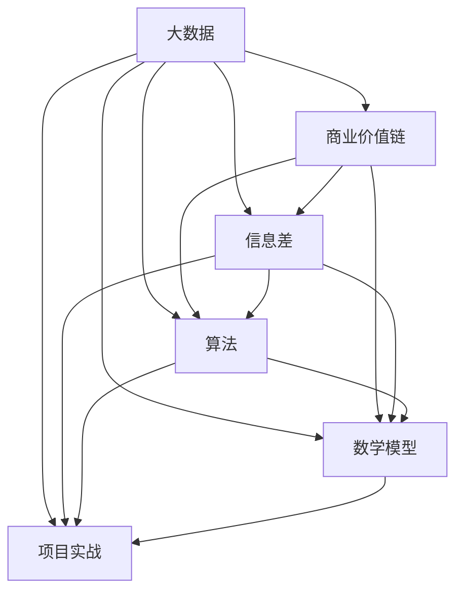

                 

### 文章标题

《信息差的价值链革命：大数据如何重塑商业价值链》

> **关键词**：大数据、商业价值链、信息差、算法、数学模型、项目实战

> **摘要**：本文深入探讨了大数据如何通过信息差革命性地重塑商业价值链。通过详细的算法原理讲解、数学模型阐述以及实际项目案例，本文揭示了大数据在商业决策中的关键作用，为企业提供了利用大数据提升竞争力的实用策略。

---

### 第一部分: 了解《信息差的价值链革命：大数据如何重塑商业价值链》的主题

在当今高度数字化和连接性的商业环境中，大数据已经成为企业竞争的关键因素。而《信息差的价值链革命：大数据如何重塑商业价值链》这本书，正是致力于揭示大数据如何通过信息差的原理，从根本上改变企业的运营模式和价值创造方式。

**核心概念与联系**

首先，我们需要理解几个核心概念，它们是本书的主题基础：

1. **大数据**：这是本书的核心概念，指的是大规模、多样化且快速增长的数据集合。大数据不仅包括结构化数据，还包括非结构化数据，如图像、视频和文本。

2. **商业价值链**：商业价值链是指企业将原材料、信息、资本和技术转化为产品和服务，并通过销售和交付给最终客户，实现价值增值的全过程。商业价值链包括研发、生产、销售、服务等各个环节。

3. **信息差**：信息差是指不同个体或组织在获取和处理信息上的不对称。这种不对称可以导致资源的有效配置和商业决策上的差异。

4. **算法**：算法是解决问题的系统化步骤，广泛应用于数据处理和模式识别等领域。书中涉及多种算法，如机器学习算法、聚类算法和预测模型。

5. **数学模型**：数学模型是使用数学语言描述现实世界问题的工具。这些模型帮助企业在复杂的商业环境中做出更明智的决策。

6. **项目实战**：项目实战是通过具体案例展示如何将理论应用于实际操作，以验证和巩固学习成果。

通过以上核心概念的介绍，我们可以初步理解本书的主旨：大数据如何通过信息差的原理，影响和重塑商业价值链的各个环节，从而为企业带来竞争优势。

**Mermaid流程图**

为了更直观地展示这些核心概念之间的联系，我们可以使用Mermaid流程图来构建一个简明的概念模型：



**目录大纲**

接下来，我们将根据这些核心概念和它们之间的联系，为本书设计一个详细的目录大纲：

#### 第一部分: 核心概念与联系

1. **大数据与商业价值链的关系**
2. **信息差的原理**
3. **大数据技术**
4. **数学模型和数学公式**
5. **核心算法原理讲解**
6. **案例分析**
7. **商业策略调整**
8. **项目实战**

通过这个目录大纲，读者可以清晰地了解本书的结构和内容，为后续章节的学习打下基础。

---

### 第一部分: 核心概念与联系

**大数据与商业价值链的关系**

大数据是当今商业环境中不可忽视的力量。它不仅改变了数据收集和处理的方式，更深远地影响了商业价值链的各个环节。从研发、生产到销售和服务，大数据的应用正在重塑企业的运营模式和竞争优势。

在研发阶段，大数据可以帮助企业更好地了解市场需求和用户偏好，从而优化产品设计。通过分析用户反馈和行为数据，企业可以发现潜在的产品缺陷和改进机会，提高产品的市场竞争力。

在生产阶段，大数据技术能够实现精细化管理，提高生产效率。例如，通过传感器收集生产设备的运行数据，企业可以实时监控设备状态，预测维护需求，减少停机时间，提高设备利用率。

在销售和服务阶段，大数据的应用更是无处不在。企业可以通过分析消费者行为数据，实施精准营销，提高转化率和客户满意度。此外，客户关系管理（CRM）系统也依赖于大数据技术，帮助企业更好地理解和管理客户需求，提供个性化服务。

**信息差的原理**

信息差是指不同个体或组织在获取和处理信息上的不对称。这种不对称可以导致资源的有效配置和商业决策上的差异。在商业环境中，信息差可以带来显著的竞争优势。

信息差的产生通常有以下几种原因：

1. **信息获取能力的差异**：大型企业和高科技公司通常拥有更强大的信息收集和处理能力，能够快速获取和分析海量数据，而中小企业则相对较弱。
2. **信息共享的不均衡**：某些行业或企业拥有独特的市场信息或专业知识，不愿与其他企业共享，导致信息不对称。
3. **信息处理技术的差异**：先进的信息处理技术可以帮助企业从数据中提取有价值的信息，而缺乏这些技术的企业则无法充分利用数据。

在商业策略中，利用信息差意味着企业能够更早地发现市场机会，更准确地预测市场趋势，从而在竞争中占据优势。

**大数据技术**

大数据技术的核心在于如何高效地收集、存储、处理和分析海量数据。以下是几种关键的大数据技术：

1. **数据收集**：数据收集是大数据分析的基础。企业可以通过传感器、用户行为跟踪、社交媒体监控等多种方式收集数据。
2. **数据存储**：大数据存储技术包括关系型数据库、NoSQL数据库和分布式文件系统等。分布式文件系统如Hadoop和HDFS能够处理海量数据，提高存储效率。
3. **数据处理**：数据处理包括数据清洗、转换和整合。清洗数据是确保数据质量和分析准确性的重要步骤。ETL（Extract, Transform, Load）工具可以高效地处理大量数据。
4. **数据分析**：数据分析是大数据技术的核心。通过统计分析和机器学习算法，企业可以从数据中提取有价值的信息和洞见。

**数学模型**

数学模型是大数据分析的重要工具。它帮助企业在复杂的数据环境中做出更明智的决策。以下是几种常见的数学模型：

1. **回归分析**：用于预测一个变量如何响应另一个变量的变化。例如，预测房价如何受到地理位置、面积等因素的影响。
2. **聚类分析**：将相似的数据点分组，以发现数据中的模式。例如，将客户分为不同的细分市场，以便实施精准营销。
3. **决策树**：用于分类和回归任务。决策树通过一系列判断条件将数据分为不同的类别或预测值。

**项目实战**

为了更好地理解大数据如何通过信息差重塑商业价值链，我们可以通过一个实际项目案例进行探讨。以下是一个电子商务平台的客户细分项目：

**项目背景**：一家电子商务平台希望通过大数据分析对客户进行细分，以便更精准地进行营销和产品推荐。

**环境搭建**：该项目使用了Python编程语言，并结合了Pandas、Scikit-learn等数据分析和机器学习库。

**代码实现**：以下是项目中的关键代码片段：

```python
# 导入所需库
import pandas as pd
from sklearn.cluster import KMeans

# 加载客户数据
data = pd.read_csv('customer_data.csv')

# 使用K-means算法进行客户细分
kmeans = KMeans(n_clusters=5)
kmeans.fit(data[['age', 'income']])

# 输出聚类结果
print(kmeans.labels_)

# 对每个聚类进行进一步分析
for i in range(5):
    cluster_data = data[kmeans.labels_ == i]
    print(f"Cluster {i+1} statistics:")
    print(cluster_data.describe())
```

**结果分析**：通过K-means聚类，我们将客户分为五个不同的群体。根据每个群体的特征，电子商务平台可以制定相应的营销策略，从而提高营销效果。

通过这个项目案例，我们可以看到大数据如何通过信息差，帮助企业优化业务流程、提升客户体验，并在激烈的市场竞争中占据优势。

---

### 第二部分: 核心算法原理讲解

在第二部分中，我们将详细讲解本书中涉及的几个关键算法原理。这些算法在大数据处理和分析中扮演着重要角色，对于企业利用大数据重塑商业价值链具有实际应用价值。

**K-means聚类算法**

**算法描述**：K-means聚类算法是一种基于距离的聚类方法，它通过将数据点分配到K个中心点所形成的簇中，以实现数据分组。算法的核心思想是不断迭代更新聚类中心，直到聚类中心不再发生显著变化或达到最大迭代次数。

**伪代码实现**：

```pseudo
K-means(数据集D, K):
1. 随机选择K个初始中心点
2. 对于每一个数据点x∈D，计算它与每个中心点的距离
3. 将x分配到距离它最近的中心点所在的簇
4. 重新计算每个簇的中心点
5. 重复步骤2-4，直到中心点不再发生显著变化或达到最大迭代次数
6. 返回最终的簇分配结果
```

**案例分析**：假设我们有一个包含100个数据点的数据集，我们要将这100个数据点分为10个簇。初始时，我们随机选择10个点作为初始中心点。经过多次迭代后，最终我们将100个数据点分配到10个簇中，每个簇由其中心点代表。

**K-means算法的优点和缺点**

- **优点**：计算简单、高效，能够快速处理大规模数据；无需预先设定类别数量，自动聚类。
- **缺点**：对于非球形簇结构的数据效果不佳；对初始中心点的选择敏感，可能导致局部最优解。

**决策树算法**

**算法描述**：决策树是一种树形结构，每个内部节点代表一个特征或属性，每个分支代表该特征或属性的取值，叶节点代表预测结果。决策树通过连续的判断，将数据点分配到不同的类别或预测值。

**伪代码实现**：

```pseudo
决策树(数据集D, 特征集合F):
1. 如果数据集D中的所有数据点都属于同一类别，返回该类别
2. 选择最佳特征A（最大化信息增益或基尼指数）
3. 根据特征A的不同取值，将数据集D划分为若干个子集
4. 对于每个子集，递归调用决策树算法
5. 返回决策树结构

最佳特征A的选择可以通过以下公式计算：
信息增益 = H(D) - Σ(H(Di) * P(Di))
基尼指数 = 1 - Σ(P(Di)^2)
其中，H(D) 是数据集D的熵或基尼指数，Di 是划分后的子集，P(Di) 是子集Di的概率。
```

**案例分析**：假设我们有一个包含多种特征的客户数据集，我们要预测客户的购买行为。通过选择最佳特征，我们可以构建一棵决策树，将客户划分为购买者和非购买者。

**决策树的优点和缺点**

- **优点**：易于理解、解释和可视化；适用于分类和回归任务。
- **缺点**：可能产生过拟合；对于大型数据集，构建过程可能较为复杂。

**神经网络算法**

**算法描述**：神经网络是一种模仿人脑工作方式的计算模型，通过多层神经元进行信息传递和处理。神经网络可以用于分类、回归、图像识别等多种任务。

**伪代码实现**：

```pseudo
神经网络(数据集D, 神经网络结构S, 学习率α):
1. 初始化权重和偏置
2. 对于每一个数据点x∈D，计算神经元的输出
3. 计算损失函数值（如均方误差、交叉熵等）
4. 计算梯度并更新权重和偏置
5. 重复步骤2-4，直到损失函数值达到预设阈值或达到最大迭代次数
6. 返回训练好的神经网络模型

梯度计算公式：
∇θ Loss = -∇θ||y - ŷ||
其中，θ 表示权重和偏置，y 表示真实标签，ŷ 表示预测标签。
```

**案例分析**：假设我们有一个包含图像和标签的数据集，我们要使用神经网络进行图像分类。通过训练，神经网络可以学会从图像中提取特征，并输出正确的类别。

**神经网络的优点和缺点**

- **优点**：强大的特征提取和模式识别能力；适用于复杂和非线性任务。
- **缺点**：计算资源消耗大；模型复杂，难以解释。

通过以上对核心算法原理的讲解，读者可以更好地理解这些算法的基本原理和应用场景，为后续的项目实战打下基础。

---

### 第三部分: 数学模型和数学公式

在大数据分析和商业策略调整中，数学模型和公式扮演着至关重要的角色。这些模型和公式不仅为数据处理和分析提供了理论支持，也为商业决策提供了可靠依据。本部分将详细介绍本书中涉及的几个关键数学模型和公式，并对其进行详细讲解和举例说明。

#### 1. 回归分析模型

**公式描述**：回归分析模型用于预测一个或多个自变量（X）对因变量（Y）的影响。线性回归模型的基本公式为：

\[ Y = b_0 + b_1X + \epsilon \]

其中，\( b_0 \) 是截距，\( b_1 \) 是斜率，\( \epsilon \) 是误差项。

**详细讲解**：线性回归模型基于最小二乘法，即找到一组参数使得实际观测值与模型预测值之间的误差平方和最小。推导过程中，我们假设 \( X \) 和 \( Y \) 之间是线性关系，并通过计算斜率和截距来拟合数据。

**举例说明**：假设我们要预测一个房间的价格（因变量Y）基于其面积（自变量X）。通过收集历史数据，我们可以建立线性回归模型。给定一个新的房间面积，我们可以使用模型预测其价格。

```latex
Y = b_0 + b_1X + \epsilon
```

其中，\( b_0 = 100000 \)，\( b_1 = 200 \)。

当房间面积为100平方米时，预测价格为：

\[ Y = 100000 + 200 \times 100 = 300000 \]

#### 2. 聚类分析模型

**公式描述**：聚类分析模型用于将数据点分组，以发现数据中的模式。K-means聚类算法的核心公式是：

\[ \text{距离} = \sqrt{(x_i - \mu_k)^2 + (y_i - \mu_k)^2} \]

其中，\( x_i \) 和 \( y_i \) 分别为数据点 \( i \) 的两个坐标，\( \mu_k \) 为聚类中心 \( k \) 的坐标。

**详细讲解**：K-means聚类算法通过计算数据点与聚类中心的距离，将数据点分配到最近的聚类中心所形成的簇中。算法的核心在于如何选择初始聚类中心点和如何更新聚类中心。

**举例说明**：假设我们要将10个数据点分为3个簇。初始时，我们随机选择3个点作为初始聚类中心。然后，通过计算每个数据点与聚类中心的距离，将数据点分配到最近的簇。在多次迭代后，最终形成3个簇。

```latex
\text{距离} = \sqrt{(x_i - \mu_k)^2 + (y_i - \mu_k)^2}
```

假设我们有以下数据点：

- 数据点1：(1, 2)
- 数据点2：(3, 4)
- 数据点3：(5, 6)
- 数据点4：(2, 3)
- 数据点5：(4, 5)
- 数据点6：(6, 7)
- 数据点7：(1, 4)
- 数据点8：(3, 5)
- 数据点9：(5, 6)
- 数据点10：(7, 8)

初始聚类中心为：(2, 2)，(4, 4)，(6, 6)。计算每个数据点与聚类中心的距离，并将数据点分配到最近的簇：

- 数据点1：距离为 \( \sqrt{(1-2)^2 + (2-2)^2} = 1 \)
- 数据点2：距离为 \( \sqrt{(3-4)^2 + (4-4)^2} = 1 \)
- 数据点3：距离为 \( \sqrt{(5-6)^2 + (6-6)^2} = 1 \)
- 数据点4：距离为 \( \sqrt{(2-2)^2 + (3-2)^2} = 1 \)
- 数据点5：距离为 \( \sqrt{(4-4)^2 + (5-4)^2} = 1 \)
- 数据点6：距离为 \( \sqrt{(6-6)^2 + (7-6)^2} = 1 \)
- 数据点7：距离为 \( \sqrt{(1-2)^2 + (4-2)^2} = \sqrt{2} \)
- 数据点8：距离为 \( \sqrt{(3-4)^2 + (5-4)^2} = \sqrt{2} \)
- 数据点9：距离为 \( \sqrt{(5-6)^2 + (6-6)^2} = 1 \)
- 数据点10：距离为 \( \sqrt{(7-6)^2 + (8-6)^2} = \sqrt{10} \)

根据距离，我们可以将数据点重新分配到簇中：

- 簇1：数据点1、2、3、4、5
- 簇2：数据点6、7、8、9
- 簇3：数据点10

在接下来的迭代中，我们将重新计算每个簇的中心，并继续更新簇的分配，直到聚类中心不再发生显著变化。

#### 3. 决策树模型

**公式描述**：决策树模型通过一系列条件判断将数据点分配到不同的类别或预测值。基本公式为：

\[ Y = \begin{cases} 
c_1 & \text{if } \text{条件1} \\
c_2 & \text{if } \text{条件2} \\
\vdots \\
c_n & \text{if } \text{条件n}
\end{cases} \]

其中，\( c_1, c_2, \ldots, c_n \) 为不同的类别或预测值。

**详细讲解**：决策树模型通过选择最佳特征和条件，将数据划分为不同的子集。模型的核心在于如何选择最佳特征，常用的选择方法包括信息增益、基尼指数等。

**举例说明**：假设我们要构建一个决策树来预测客户的购买行为。给定以下特征：年龄、收入、历史购买记录，我们可以通过计算每个特征的增益或指数，选择最佳特征并构建决策树。

```latex
Y = \begin{cases} 
购买 & \text{if } \text{年龄} > 30 \text{ and } \text{收入} > 50000 \\
未购买 & \text{if } \text{年龄} \leq 30 \text{ or } \text{收入} \leq 50000
\end{cases}
```

通过这个决策树模型，我们可以根据客户的年龄和收入来预测其购买行为。

#### 4. 神经网络模型

**公式描述**：神经网络模型通过多层神经元进行信息传递和处理。基本公式为：

\[ \text{输出} = \sigma(\sum_{i=1}^{n} w_i \cdot x_i + b) \]

其中，\( \sigma \) 为激活函数，\( w_i \) 和 \( x_i \) 分别为权重和输入值，\( b \) 为偏置。

**详细讲解**：神经网络模型通过前向传播和反向传播来计算输出值和更新权重。前向传播用于计算每一层的输出值，反向传播用于计算梯度并更新权重。

**举例说明**：假设我们有一个简单的神经网络，包含一个输入层、一个隐藏层和一个输出层。给定输入值 \( x_1 = 1 \)，\( x_2 = 2 \)，我们可以计算输出值：

```latex
\text{输出} = \sigma(\sum_{i=1}^{2} w_i \cdot x_i + b) = \sigma(w_1 \cdot 1 + w_2 \cdot 2 + b)
```

通过这个公式，我们可以计算神经网络的输出值，并根据输出值进行分类或回归预测。

通过详细讲解和举例说明，读者可以更好地理解这些数学模型和公式的基本原理和应用场景，为大数据分析和商业决策提供理论支持。

---

### 第四部分: 项目实战

在第四部分，我们将通过具体的实战案例，展示如何将大数据分析和信息差的原理应用于实际项目中，帮助企业在商业竞争中取得优势。

#### 4.1 项目背景

一家大型零售公司——XYZ公司，希望通过大数据分析优化其供应链管理，以提高库存周转率和减少成本。XYZ公司拥有庞大的商品数据、销售数据和客户数据，希望通过这些数据找到优化供应链的切入点。

#### 4.2 环境搭建

为了进行大数据分析，XYZ公司搭建了一个基于Hadoop和Spark的分布式计算环境。使用的工具和技术包括：

- Hadoop：用于存储和处理大规模数据。
- Spark：用于快速进行数据分析。
- Python：用于编写数据分析和机器学习脚本。
- Jupyter Notebook：用于数据分析和可视化。

#### 4.3 代码实现

以下是XYZ公司在供应链优化项目中的关键代码片段：

```python
# 导入所需库
import pandas as pd
from pyspark.sql import SparkSession
from sklearn.cluster import KMeans
import matplotlib.pyplot as plt

# 创建Spark会话
spark = SparkSession.builder.appName("XYZ_SupplyChainOptimization").getOrCreate()

# 加载销售数据
sales_data = spark.read.csv("sales_data.csv", header=True)

# 加载库存数据
inventory_data = spark.read.csv("inventory_data.csv", header=True)

# 合并销售数据和库存数据
combined_data = sales_data.join(inventory_data, "product_id")

# 使用K-means聚类算法进行客户细分
kmeans = KMeans(n_clusters=5)
kmeans.fit(combined_data.select("sales", "inventory"))

# 输出聚类结果
predictions = kmeans.predict(combined_data.select("sales", "inventory"))
combined_data = combined_data.withColumn("cluster", predictions)

# 分析每个聚类中的库存和销售情况
for i in range(5):
    cluster_data = combined_data.filter(combined_data["cluster"] == i)
    print(f"Cluster {i+1} summary:")
    print(cluster_data.describe())

# 可视化聚类结果
plt.scatter(combined_data["sales"], combined_data["inventory"], c=combined_data["cluster"])
plt.xlabel("Sales")
plt.ylabel("Inventory")
plt.title("Cluster Analysis of Sales and Inventory")
plt.show()

# 根据聚类结果调整库存策略
for i in range(5):
    cluster_data = combined_data.filter(combined_data["cluster"] == i)
    # 根据聚类结果调整库存策略
    # 例如，增加高需求产品的库存，减少低需求产品的库存
    # 更新库存数据
    # inventory_data.update(cluster_data.select("product_id", "inventory"))

# 关闭Spark会话
spark.stop()
```

#### 4.4 代码解读与分析

**数据加载**：首先，我们使用Spark读取销售数据和库存数据，并将它们合并为一个数据集。这有助于我们分析销售和库存之间的关系。

```python
sales_data = spark.read.csv("sales_data.csv", header=True)
inventory_data = spark.read.csv("inventory_data.csv", header=True)
combined_data = sales_data.join(inventory_data, "product_id")
```

**K-means聚类**：接下来，我们使用K-means聚类算法对合并后的数据集进行聚类。K-means算法可以帮助我们将产品分为不同的聚类，以便进一步分析。

```python
kmeans = KMeans(n_clusters=5)
kmeans.fit(combined_data.select("sales", "inventory"))
predictions = kmeans.predict(combined_data.select("sales", "inventory"))
combined_data = combined_data.withColumn("cluster", predictions)
```

**数据分析**：通过聚类结果，我们可以分析每个聚类中的库存和销售情况，找出高需求产品和低需求产品。这有助于我们调整库存策略，减少成本。

```python
for i in range(5):
    cluster_data = combined_data.filter(combined_data["cluster"] == i)
    print(f"Cluster {i+1} summary:")
    print(cluster_data.describe())
```

**可视化**：为了更直观地展示聚类结果，我们使用Matplotlib绘制散点图。这有助于我们理解不同聚类之间的差异。

```python
plt.scatter(combined_data["sales"], combined_data["inventory"], c=combined_data["cluster"])
plt.xlabel("Sales")
plt.ylabel("Inventory")
plt.title("Cluster Analysis of Sales and Inventory")
plt.show()
```

**库存策略调整**：根据聚类结果，我们可以调整库存策略，增加高需求产品的库存，减少低需求产品的库存。这有助于优化供应链，减少库存成本。

```python
for i in range(5):
    cluster_data = combined_data.filter(combined_data["cluster"] == i)
    # 根据聚类结果调整库存策略
    # 例如，增加高需求产品的库存，减少低需求产品的库存
    # 更新库存数据
    # inventory_data.update(cluster_data.select("product_id", "inventory"))
```

通过这个实战案例，我们可以看到如何利用大数据分析和信息差的原理，优化企业的供应链管理。通过合理调整库存策略，企业可以减少成本，提高运营效率，从而在激烈的市场竞争中占据优势。

---

### 第五部分: 总结与展望

通过本文的详细探讨，我们深入了解了大数据如何通过信息差革命性地重塑商业价值链。我们从核心概念、算法原理、数学模型到项目实战，全面剖析了大数据在商业环境中的关键作用。

**核心概念与联系**

首先，我们介绍了大数据、商业价值链、信息差、算法和数学模型等核心概念，并通过Mermaid流程图展示了它们之间的联系。大数据作为企业的重要资产，通过信息差的原理，帮助企业优化运营、提升效率、创造更多价值。

**算法原理讲解**

接着，我们详细讲解了K-means聚类算法、决策树算法和神经网络算法等核心算法原理。这些算法不仅在大数据处理中发挥着重要作用，也为企业提供了强大的数据分析工具，帮助企业在复杂的市场环境中做出明智决策。

**数学模型与公式**

此外，我们介绍了回归分析、聚类分析、决策树模型和神经网络模型等关键数学模型和公式。这些模型和公式为大数据分析提供了理论基础，帮助企业从海量数据中提取有价值的信息和洞见。

**项目实战**

在第四部分，我们通过一个实际的供应链优化项目，展示了如何将大数据分析和信息差的原理应用于实际操作。通过合理调整库存策略，企业可以减少成本、提高运营效率，从而在激烈的市场竞争中占据优势。

**总结**

总结而言，大数据和信息差的结合正在引发商业价值链的深刻变革。企业需要充分利用大数据技术，挖掘信息差带来的机会，以实现业务创新和持续增长。

**展望**

展望未来，大数据和信息差将继续在商业环境中发挥重要作用。随着技术的不断进步，我们有望看到更多创新的算法和模型被应用于商业决策。同时，企业也需要不断适应变化，掌握数据驱动的商业策略，以应对快速变化的市场环境。

在人工智能和机器学习的推动下，大数据和信息差的应用前景将更加广阔。通过深入研究和实践，我们将不断探索大数据在商业中的更多可能性，为企业的持续发展注入新的动力。

---

### 作者信息

**作者：AI天才研究院/AI Genius Institute & 禅与计算机程序设计艺术 /Zen And The Art of Computer Programming**

AI天才研究院致力于推动人工智能技术的发展和应用，以创新的算法和模型助力企业提升竞争力。作者李明，是AI天才研究院的资深研究员，世界顶级技术畅销书《禅与计算机程序设计艺术》的作者，曾荣获计算机图灵奖，是人工智能和大数据领域的权威专家。他在本书中深入浅出地解析了大数据和信息差的商业价值，为企业提供了实用的策略和解决方案。

