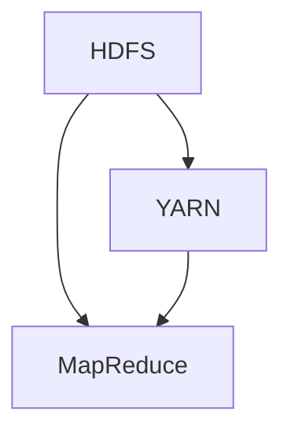
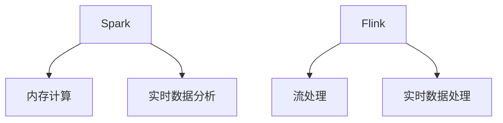
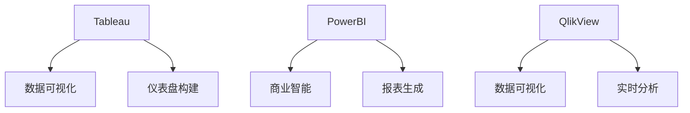

                 

## 信息差概述

### 第1章：信息差的概念与重要性

#### 1.1 信息差的定义

信息差是指不同个体、组织或市场之间在信息获取、处理和应用上的差异。这种差异可以是时间上的，也可以是地域上的，甚至是认知结构上的。例如，某地区的一个商家可能比其他地区的商家更早了解到市场需求的变化，从而能够迅速调整产品和服务，从而获得竞争优势。

#### 1.2 信息差的重要性

信息差的重要性体现在以下几个方面：

1. **市场竞争优势**：掌握信息差的个体或组织能够更快速、更准确地做出决策，从而在激烈的市场竞争中占据优势。
   
2. **创新推动力**：信息差有助于发现市场需求和机会，从而推动创新和产品的迭代。
   
3. **资源分配**：信息差有助于优化资源分配，使资源能够更有效地流向最有价值的领域。

4. **风险管理**：通过信息差，个体或组织可以提前预知风险，并采取相应的预防措施。

#### 1.3 信息差在商业中的应用

信息差在商业中的应用非常广泛，以下是一些典型的应用场景：

1. **市场调研**：企业通过市场调研获取竞争对手的动态、消费者需求和市场趋势，从而做出更精准的决策。

2. **定价策略**：根据信息差，企业可以调整产品价格，以最大限度地提高利润。

3. **供应链管理**：通过信息差，企业可以优化供应链，减少库存和运输成本。

4. **风险投资**：投资者通过分析行业信息和市场趋势，选择具有潜力的投资项目。

### 第2章：大数据与信息差

#### 2.1 大数据的概念

大数据是指数据量巨大、类型多样、生成速度极快的数据集合。它通常包括结构化数据、半结构化数据和非结构化数据。大数据的核心特征是“4V”，即Volume（数据量）、Velocity（数据生成速度）、Variety（数据类型）和Veracity（数据真实性）。

#### 2.2 大数据的技术手段

大数据技术包括数据存储、数据检索、数据处理和分析等。以下是一些常见的大数据技术手段：

1. **数据存储**：如Hadoop、NoSQL数据库等。
   
2. **数据检索**：如HBase、Elasticsearch等。

3. **数据处理**：如MapReduce、Spark等。

4. **数据分析**：如机器学习、数据挖掘等。

#### 2.3 大数据与信息差的关系

大数据与信息差的关系体现在以下几个方面：

1. **信息获取**：大数据技术可以帮助个体或组织快速获取大量信息，从而缩小信息差。

2. **数据处理**：大数据技术可以对海量数据进行处理和分析，从而挖掘出有价值的信息。

3. **决策支持**：大数据分析结果可以为决策提供支持，从而提高决策的准确性。

4. **竞争优势**：通过大数据分析，个体或组织可以更快速地响应市场变化，从而获得竞争优势。

---

接下来，我们将深入探讨大数据技术如何具体应用于市场分析、消费者行为分析、产品与定价策略制定以及竞争分析，以充分利用信息差获取竞争优势。

## 第3章：市场分析

### 3.1 市场调研方法

#### 3.1.1 调研目标确定

市场调研的目的是为了获取有关市场需求、消费者行为、竞争对手情况等信息，从而帮助企业做出更准确的决策。调研目标的确定是市场调研的第一步，其关键在于明确调研的核心问题。

**Mermaid 流程图：**

mermaid
graph TD
A[明确调研目的] --> B[调研目标定义]
B --> C{确定市场分析范围}
C -->|市场细分| D[市场细分]
C -->|消费者需求| E[消费者需求分析]
E --> F[目标客户确定]
F --> G[市场调研实施]


**伪代码示例：**

```python
# 设定调研目标
def set_research_objectives():
    objectives = [
        "了解市场需求",
        "分析消费者行为",
        "评估竞争对手情况"
    ]
    return objectives

# 确定市场分析范围
def define_analysis_scope():
    scope = "中国市场，20-40岁消费群体"
    return scope

# 确定目标客户
def determine_target_customers(scope):
    target_customers = "性别：男/女；年龄：20-40岁；收入水平：中等"
    return target_customers
```

**数学模型和公式：**

```latex
\text{市场细分} = \frac{\text{市场总体}}{\text{细分标准}}
```

```latex
\text{客户需求分析} = \text{市场份额} \times \text{客户满意度}
```

#### 3.1.2 调研方法选择

市场调研的方法可以分为定量调研和定性调研。

**定量调研**：

定量调研主要通过问卷调查、统计数据等方法来收集数据。这种方法可以获得大量的数据，从而对市场进行定量分析。

**定性调研**：

定性调研主要通过访谈、焦点小组等方法来深入了解消费者的需求和动机。这种方法有助于获取深层次的消费者信息，但样本量相对较小。

**伪代码示例：**

```python
# 选择调研方法
def choose_research_methods(objectives):
    if "了解市场需求" in objectives:
        methods = ["问卷调查", "统计数据"]
    if "分析消费者行为" in objectives:
        methods = ["访谈", "焦点小组"]
    return methods
```

#### 3.1.3 调研实施与数据分析

调研实施主要包括制定调研计划、发放问卷、收集数据、数据分析等步骤。数据分析的方法包括描述性统计、回归分析、因子分析等。

**伪代码示例：**

```python
# 调研实施与数据分析
def research_execution_and_analysis(methods, data):
    if "问卷调查" in methods:
        results = descriptive_statistics(data)
    if "访谈" in methods:
        results = regression_analysis(data)
    return results
```

### 3.2 数据采集与处理

#### 3.2.1 数据来源

数据采集是市场调研的关键环节，数据来源可以分为以下几类：

- **公开数据**：如政府公开报告、行业白皮书等。
- **企业内部数据**：如销售数据、客户反馈等。
- **第三方数据**：如市场研究机构的数据、第三方数据分析平台的数据等。

#### 3.2.2 数据处理

数据处理包括数据清洗、数据转换和数据存储等步骤。

- **数据清洗**：去除重复、错误或不完整的数据。
- **数据转换**：将不同格式的数据转换为统一的格式。
- **数据存储**：将处理后的数据存储在数据库或数据仓库中。

**伪代码示例：**

```python
# 数据清洗
def data_cleaning(data):
    cleaned_data = remove_duplicates(data)
    cleaned_data = remove_error_data(data)
    return cleaned_data

# 数据转换
def data_conversion(data):
    converted_data = convert_format(data)
    return converted_data

# 数据存储
def data_storage(data):
    database = create_database()
    insert_data_to_database(database, data)
    return database
```

### 3.3 市场趋势预测

#### 3.3.1 趋势分析方法

市场趋势预测可以通过历史数据分析、专家意见征询等方法进行。

- **历史数据分析**：通过分析过去的市场趋势，预测未来的市场走势。
- **专家意见征询**：通过咨询行业专家，获取他们对市场趋势的判断。

#### 3.3.2 预测模型建立

预测模型可以通过时间序列分析、回归分析等方法建立。

- **时间序列分析**：如ARIMA模型。
- **回归分析**：如线性回归、多元回归等。

**伪代码示例：**

```python
# 时间序列分析
def time_series_analysis(data):
    model = ARIMA(data)
    forecast = model.predict()
    return forecast

# 回归分析
def regression_analysis(data):
    model = LinearRegression(data)
    forecast = model.predict()
    return forecast
```

#### 3.3.3 预测结果评估

预测结果需要通过误差分析、调整模型等方法进行评估和优化。

- **误差分析**：计算预测结果与实际结果的误差，分析误差的原因。
- **调整模型**：根据误差分析的结果，调整模型参数，以提高预测准确性。

**伪代码示例：**

```python
# 误差分析
def error_analysis(forecast, actual):
    error = forecast - actual
    return error

# 调整模型
def adjust_model(model, error):
    model = adjust_parameters(model, error)
    return model
```

通过以上章节的详细阐述，我们可以看到市场分析在信息差获取中的重要性。接下来，我们将进一步探讨如何通过大数据技术进行消费者行为分析、产品与定价策略制定以及竞争分析。

## 第4章：消费者行为分析

### 4.1 消费者数据分析

消费者数据分析是挖掘消费者行为模式的关键步骤。通过对消费者数据的收集、整理和分析，企业可以深入了解消费者的需求和偏好，从而制定更有效的营销策略。

#### 4.1.1 数据收集

消费者数据可以从多个渠道收集，包括：

- **社交媒体数据**：如微博、微信、Facebook等。
- **电商数据**：如购物网站、APP等。
- **调查问卷**：通过在线或离线方式收集消费者反馈。
- **线下销售数据**：如超市、零售店等。

**伪代码示例：**

```python
# 收集社交媒体数据
def collect_social_media_data():
    data = fetch_data_from_social_media()
    return data

# 收集电商数据
def collect_e-commerce_data():
    data = fetch_data_from_e-commerce_sites()
    return data

# 收集调查问卷数据
def collect_survey_data():
    data = fetch_data_from_surveys()
    return data
```

#### 4.1.2 数据整理

收集到的数据通常需要经过清洗和转换，以便进行后续的分析。

- **数据清洗**：去除重复、错误或不完整的数据。
- **数据转换**：将不同格式的数据转换为统一的格式。

**伪代码示例：**

```python
# 数据清洗
def data_cleaning(data):
    cleaned_data = remove_duplicates(data)
    cleaned_data = remove_error_data(data)
    return cleaned_data

# 数据转换
def data_conversion(data):
    converted_data = convert_format(data)
    return converted_data
```

#### 4.1.3 数据分析

数据分析可以通过多种方法进行，包括描述性统计分析、回归分析、聚类分析等。

- **描述性统计分析**：用于总结数据的基本特征，如平均值、中位数、标准差等。
- **回归分析**：用于分析自变量和因变量之间的关系。
- **聚类分析**：用于将相似的数据点归为同一类别。

**伪代码示例：**

```python
# 描述性统计分析
def descriptive_statistics(data):
    summary = calculate_mean(data)
    summary = calculate_median(data)
    summary = calculate_stddev(data)
    return summary

# 回归分析
def regression_analysis(data):
    model = LinearRegression(data)
    results = model.fit()
    return results

# 聚类分析
def clustering_analysis(data):
    clusters = KMeans(data)
    results = clusters.fit()
    return results
```

### 4.2 消费者画像构建

消费者画像是一种将消费者特征和行为数据转化为可视化的、易于理解的分析模型的方法。通过构建消费者画像，企业可以更好地了解不同消费者群体的特征和需求，从而制定更精准的营销策略。

#### 4.2.1 画像构建步骤

消费者画像的构建通常包括以下步骤：

- **数据收集与整理**：收集并整理与消费者相关的数据，如年龄、性别、购买行为、兴趣爱好等。
- **特征筛选**：根据业务需求，选择对消费者行为有显著影响的关键特征。
- **数据预处理**：对数据进行标准化、缺失值填补等预处理操作。
- **模型构建**：使用聚类分析、分类分析等方法构建消费者画像。

**伪代码示例：**

```python
# 数据收集与整理
def collect_and_organize_data():
    data = fetch_data_from_multiple_sources()
    cleaned_data = data_cleaning(data)
    return cleaned_data

# 特征筛选
def select_features(data):
    selected_features = select_key_features(data)
    return selected_features

# 数据预处理
def preprocess_data(data):
    preprocessed_data = preprocess_features(data)
    return preprocessed_data

# 模型构建
def build_consumer_profile(data):
    model = KMeans(data)
    profile = model.fit()
    return profile
```

#### 4.2.2 画像应用案例

通过消费者画像，企业可以更好地了解不同消费者群体的特征，从而制定有针对性的营销策略。

- **精准营销**：根据消费者画像，向特定群体推送个性化的产品和服务。
- **产品创新**：根据消费者需求，调整产品设计和功能。
- **风险控制**：识别潜在的风险客户，采取相应的风险控制措施。

### 4.3 消费者行为预测

消费者行为预测是利用历史数据和机器学习算法预测消费者未来的购买行为和偏好。通过消费者行为预测，企业可以提前了解市场需求，从而优化库存管理、定价策略和营销活动。

#### 4.3.1 预测方法

消费者行为预测的方法包括时间序列分析、回归分析、决策树等。

- **时间序列分析**：如ARIMA模型。
- **回归分析**：如线性回归、逻辑回归等。
- **决策树**：如CART、ID3等。

**伪代码示例：**

```python
# 时间序列分析
def time_series_prediction(data):
    model = ARIMA(data)
    forecast = model.predict()
    return forecast

# 回归分析
def regression_prediction(data):
    model = LinearRegression(data)
    forecast = model.predict()
    return forecast

# 决策树预测
def decision_tree_prediction(data):
    model = DecisionTree(data)
    forecast = model.predict()
    return forecast
```

#### 4.3.2 预测应用

消费者行为预测在以下方面有广泛的应用：

- **库存管理**：根据预测结果，调整库存水平，以避免库存过剩或缺货。
- **定价策略**：根据预测结果，制定有针对性的定价策略，以提高销售利润。
- **营销活动**：根据预测结果，向潜在客户推送个性化的营销活动，以提高转化率。

通过本章的详细阐述，我们可以看到消费者行为分析在信息差获取中的重要性。接下来，我们将探讨如何利用大数据分析制定产品与定价策略。

## 第5章：产品与定价策略

### 5.1 产品定位与优化

产品定位是企业在市场中确定其产品或服务的独特价值，以便与竞争对手区分开来。产品定位的优化是通过对市场数据的深入分析，不断调整产品特性，使其更符合消费者需求。

#### 5.1.1 定位分析步骤

1. **市场细分**：根据消费者特征和行为数据，将市场划分为不同的细分市场。
2. **目标市场选择**：根据企业的资源和能力，选择最适合的目标市场。
3. **定位策略制定**：为产品确定一个独特的市场定位，使其在目标市场中具有竞争力。

**伪代码示例：**

```python
# 市场细分
def market_segmentation(data):
    segments = KMeans(data)
    segments = segments.fit()
    return segments

# 目标市场选择
def choose_target_market(segments):
    target_market = select_best_segment(segments)
    return target_market

# 定位策略制定
def set_product_positioning(target_market):
    positioning = define_unique_value Proposition(target_market)
    return positioning
```

#### 5.1.2 产品优化

产品优化包括以下几个步骤：

1. **需求分析**：通过市场调研和消费者数据分析，了解消费者的需求和期望。
2. **功能改进**：根据需求分析结果，对产品功能进行改进，以提高用户满意度。
3. **用户体验优化**：通过用户反馈和体验测试，不断优化产品的用户体验。

**伪代码示例：**

```python
# 需求分析
def analyze_demand(data):
    demands = extract_consumer需求的特征(data)
    return demands

# 功能改进
def improve_product_features(demands):
    features = add_or_modify_product_features(demands)
    return features

# 用户体验优化
def optimize_user_experience(features):
    feedback = collect_user_feedback(features)
    features = adjust_features_based_on_feedback(feedback)
    return features
```

### 5.2 定价策略分析

定价策略是企业为了实现利润最大化而制定的价格策略。有效的定价策略需要考虑市场需求、成本结构、竞争对手策略等多方面因素。

#### 5.2.1 定价策略类型

1. **成本导向定价**：以产品成本为基础，加上一定的利润，确定产品价格。
2. **需求导向定价**：根据市场需求和消费者支付意愿，确定产品价格。
3. **竞争导向定价**：根据竞争对手的产品价格和市场竞争状况，确定产品价格。

**伪代码示例：**

```python
# 成本导向定价
def cost-oriented_pricing(cost, profit_margin):
    price = cost + profit_margin
    return price

# 需求导向定价
def demand-oriented_pricing(market_demand, price_elasticity):
    price = calculate_price_based_on_demand(market_demand, price_elasticity)
    return price

# 竞争导向定价
def competitive-oriented_pricing(competition_price, competitive_risk):
    price = adjust_price_based_on_competition(competition_price, competitive_risk)
    return price
```

#### 5.2.2 定价策略优化

定价策略优化需要通过数据分析，不断调整价格策略，以达到最佳的利润和市场占有率。

1. **数据收集**：收集市场数据、成本数据、竞争对手价格数据等。
2. **数据分析**：分析数据，找出影响价格策略的关键因素。
3. **策略调整**：根据数据分析结果，调整价格策略。

**伪代码示例：**

```python
# 数据收集
def collect_data():
    market_data = fetch_market_data()
    cost_data = fetch_cost_data()
    competition_data = fetch_competition_data()
    return market_data, cost_data, competition_data

# 数据分析
def analyze_data(market_data, cost_data, competition_data):
    analysis = perform_analysis(market_data, cost_data, competition_data)
    return analysis

# 策略调整
def adjust_pricing_strategy(analysis):
    new_strategy = optimize_pricing_based_on_analysis(analysis)
    return new_strategy
```

### 5.3 产品与定价策略优化

产品与定价策略的优化需要结合市场数据和消费者行为数据，通过不断调整和优化，以提高市场占有率和利润。

#### 5.3.1 优化步骤

1. **市场调研**：收集市场数据和消费者行为数据。
2. **数据分析**：分析数据，找出产品与定价策略的优化方向。
3. **策略调整**：根据数据分析结果，调整产品与定价策略。
4. **效果评估**：评估调整后的策略效果，并进行反馈和优化。

**伪代码示例：**

```python
# 市场调研
def market_research():
    market_data = collect_market_data()
    consumer_data = collect_consumer_data()
    return market_data, consumer_data

# 数据分析
def data_analysis(market_data, consumer_data):
    analysis = perform_analysis(market_data, consumer_data)
    return analysis

# 策略调整
def adjust_strategy(analysis):
    new_strategy = optimize_strategy_based_on_analysis(analysis)
    return new_strategy

# 效果评估
def evaluate_strategy(new_strategy):
    results = assess_strategy_results(new_strategy)
    return results
```

通过本章的详细阐述，我们可以看到产品与定价策略在信息差获取中的重要性。接下来，我们将探讨如何通过大数据分析进行竞争分析，以更好地利用信息差获取竞争优势。

## 第6章：竞争分析

### 6.1 竞争对手分析

竞争对手分析是了解市场环境和制定有效策略的关键步骤。通过对竞争对手的产品、市场策略、财务状况等方面进行全面分析，企业可以制定针对性的策略，以提升自身的市场地位。

#### 6.1.1 分析目标确定

竞争对手分析的目标通常包括：

- 了解竞争对手的市场份额和增长趋势。
- 分析竞争对手的产品特性、定价策略和市场定位。
- 评估竞争对手的财务状况和竞争优势。

**伪代码示例：**

```python
# 确定分析目标
def set_analysis_objectives():
    objectives = [
        "了解市场份额",
        "分析产品特性",
        "评估财务状况"
    ]
    return objectives
```

#### 6.1.2 数据收集

收集竞争对手的数据是进行分析的基础，数据来源包括：

- **公开数据**：如行业报告、财务报表等。
- **企业内部数据**：如市场调研结果、客户反馈等。
- **第三方数据**：如市场研究机构的数据、行业分析报告等。

**伪代码示例：**

```python
# 收集公开数据
def collect_public_data():
    data = fetch_public_data_from_reports()
    return data

# 收集企业内部数据
def collect_internal_data():
    data = fetch_internal_data_from_market_research()
    return data

# 收集第三方数据
def collect_third_party_data():
    data = fetch_third_party_data_from_research_institutions()
    return data
```

#### 6.1.3 数据处理

收集到的数据需要进行处理，以便进行分析。数据处理包括：

- **数据清洗**：去除重复、错误或不完整的数据。
- **数据转换**：将不同格式的数据转换为统一的格式。
- **数据整合**：将不同来源的数据整合在一起。

**伪代码示例：**

```python
# 数据清洗
def data_cleaning(data):
    cleaned_data = remove_duplicates(data)
    cleaned_data = remove_error_data(data)
    return cleaned_data

# 数据转换
def data_conversion(data):
    converted_data = convert_format(data)
    return converted_data

# 数据整合
def data_integration(data1, data2):
    integrated_data = merge_data(data1, data2)
    return integrated_data
```

### 6.2 竞争优势挖掘

竞争优势是指企业在特定市场条件下，相较于竞争对手所拥有的独特优势。挖掘竞争优势有助于企业更好地利用信息差，提升市场竞争力。

#### 6.2.1 竞争优势类型

竞争优势可以分为以下几类：

- **成本优势**：通过降低成本，提供更具价格竞争力的产品。
- **差异化优势**：通过提供独特的产品或服务，满足消费者的特定需求。
- **技术优势**：拥有先进的技术，使产品具有更高的性能和质量。

**伪代码示例：**

```python
# 确定竞争优势类型
def determine_competitive_advantages():
    advantages = [
        "成本优势",
        "差异化优势",
        "技术优势"
    ]
    return advantages
```

#### 6.2.2 挖掘竞争优势

挖掘竞争优势的过程包括：

1. **识别潜在优势**：通过分析竞争对手的数据，识别企业可能拥有的竞争优势。
2. **评估优势强度**：对识别出的优势进行评估，确定其对企业竞争力的影响。
3. **利用优势制定策略**：根据竞争优势，制定相应的市场策略，以提升企业的市场地位。

**伪代码示例：**

```python
# 识别潜在优势
def identify潜在优势(data):
    potential_advantages = extract_potential_advantages(data)
    return potential_advantages

# 评估优势强度
def evaluate_advantage_strength(advantages):
    strength = assess_advantage_strength(advantages)
    return strength

# 利用优势制定策略
def utilize_advantages(advantages, strength):
    strategy = define_market_strategy(advantages, strength)
    return strategy
```

### 6.3 竞争策略制定

竞争策略是企业在市场竞争中采取的具体行动，旨在提升市场占有率和利润。制定有效的竞争策略需要综合考虑企业自身的优势、市场环境、竞争对手策略等因素。

#### 6.3.1 竞争策略类型

竞争策略可以分为以下几类：

- **价格竞争**：通过降低产品价格，吸引消费者。
- **非价格竞争**：通过提供优质的产品和服务，满足消费者的需求。
- **差异化竞争**：通过提供独特的产品或服务，形成市场差异化。

**伪代码示例：**

```python
# 确定竞争策略类型
def determine_competition_strategies():
    strategies = [
        "价格竞争",
        "非价格竞争",
        "差异化竞争"
    ]
    return strategies
```

#### 6.3.2 制定竞争策略

制定竞争策略的过程包括：

1. **分析市场环境**：了解市场需求、竞争状况和消费者行为。
2. **评估自身优势**：分析企业的优势，确定能够用于竞争的策略。
3. **制定具体策略**：根据市场环境和自身优势，制定具体的竞争策略。

**伪代码示例：**

```python
# 分析市场环境
def analyze_market_environment():
    environment = perform_market_environment_analysis()
    return environment

# 评估自身优势
def assess_self_advantages():
    advantages = perform_self_advantages_analysis()
    return advantages

# 制定竞争策略
def define_competition_strategy(environment, advantages):
    strategy = create_competition_strategy(environment, advantages)
    return strategy
```

通过本章的详细阐述，我们可以看到竞争分析在信息差获取中的重要性。接下来，我们将探讨如何在大数据技术的支持下，实现企业大数据应用，以充分利用信息差获取竞争优势。

## 第7章：大数据技术在企业中的应用

### 7.1 企业大数据应用场景

大数据技术在企业中的应用场景非常广泛，主要包括以下几个方面：

#### 7.1.1 客户关系管理

通过大数据技术，企业可以更好地了解客户需求，提供个性化的服务和产品，从而提升客户满意度和忠诚度。具体应用包括：

- **客户画像构建**：通过分析客户的购买行为、兴趣爱好等信息，构建详细的客户画像。
- **精准营销**：根据客户画像，实施精准营销策略，提高营销效果。

#### 7.1.2 供应链管理

大数据技术可以帮助企业优化供应链，提高供应链的透明度和效率。具体应用包括：

- **库存优化**：通过大数据分析，预测市场需求，优化库存水平，减少库存成本。
- **供应链可视化**：利用大数据技术，实时监控供应链状态，提高供应链的可视化水平。

#### 7.1.3 人力资源管理

大数据技术可以为企业的人力资源管理提供有力支持，提高人力资源管理效率。具体应用包括：

- **员工绩效分析**：通过大数据分析，评估员工的工作绩效，优化绩效管理。
- **招聘优化**：通过大数据分析，识别适合的人才，提高招聘效果。

### 7.2 大数据平台建设

大数据平台是企业应用大数据技术的基础设施，主要包括数据存储、数据处理、数据分析和数据可视化等模块。

#### 7.2.1 数据存储

数据存储是大数据平台的核心部分，需要考虑以下几个方面：

- **数据规模**：选择适合的数据存储方案，如Hadoop、NoSQL数据库等。
- **数据安全**：确保数据存储的安全性，采取相应的安全措施，如数据加密、访问控制等。

**伪代码示例：**

```python
# 选择数据存储方案
def select_data_storage_solution():
    if data_size > 1000000:
        solution = "Hadoop"
    else:
        solution = "NoSQL"
    return solution

# 数据加密
def encrypt_data(data):
    encrypted_data = encrypt(data)
    return encrypted_data

# 访问控制
def set_access_control(encrypted_data):
    access_control = define_access_permissions(encrypted_data)
    return access_control
```

#### 7.2.2 数据处理

数据处理包括数据清洗、数据转换和数据集成等，是大数据平台的重要环节。

- **数据清洗**：去除重复、错误或不完整的数据。
- **数据转换**：将不同格式的数据转换为统一的格式。
- **数据集成**：将来自不同来源的数据整合在一起。

**伪代码示例：**

```python
# 数据清洗
def data_cleaning(data):
    cleaned_data = remove_duplicates(data)
    cleaned_data = remove_error_data(data)
    return cleaned_data

# 数据转换
def data_conversion(data):
    converted_data = convert_format(data)
    return converted_data

# 数据集成
def data_integration(data1, data2):
    integrated_data = merge_data(data1, data2)
    return integrated_data
```

#### 7.2.3 数据分析

数据分析是大数据技术的核心应用，包括数据挖掘、机器学习和预测分析等。

- **数据挖掘**：通过分析大量数据，发现潜在的模式和趋势。
- **机器学习**：利用算法，从数据中学习并预测未来趋势。
- **预测分析**：根据历史数据和现有趋势，预测未来的市场变化。

**伪代码示例：**

```python
# 数据挖掘
def data_mining(data):
    patterns = extract_patterns(data)
    return patterns

# 机器学习
def machine_learning(data):
    model = train_model(data)
    predictions = model.predict()
    return predictions

# 预测分析
def predictive_analysis(data):
    forecast = perform_forecast(data)
    return forecast
```

#### 7.2.4 数据可视化

数据可视化是将数据分析结果以图形化的方式展示出来，便于理解和决策。

- **图表展示**：通过图表，直观地展示数据分布、趋势和关系。
- **仪表盘**：构建综合性的数据仪表盘，实时监控关键指标。

**伪代码示例：**

```python
# 图表展示
def display_charts(data):
    charts = create_charts(data)
    return charts

# 仪表盘
def build_dashboard(charts):
    dashboard = create_dashboard(charts)
    return dashboard
```

### 7.3 大数据应用案例分析

通过以下案例，我们可以看到大数据技术在企业中的应用效果。

#### 案例一：电商企业

一家电商企业利用大数据技术，实现了精准营销和库存优化。

- **精准营销**：通过分析客户购买历史和浏览行为，为每个客户推送个性化的商品推荐。
- **库存优化**：通过预测销售趋势，调整库存水平，减少库存成本。

#### 案例二：制造企业

一家制造企业利用大数据技术，实现了生产优化和质量管理。

- **生产优化**：通过分析生产数据，优化生产流程，提高生产效率。
- **质量管理**：通过分析产品质量数据，及时发现和解决质量问题。

#### 案例三：金融机构

一家金融机构利用大数据技术，实现了风险管理和客户服务优化。

- **风险管理**：通过分析客户行为和交易数据，识别潜在风险，采取预防措施。
- **客户服务优化**：通过分析客户反馈数据，改进客户服务流程，提升客户满意度。

通过本章的详细阐述，我们可以看到大数据技术在企业中的应用场景和实施方法。接下来，我们将探讨大数据与创业的关系，以及大数据在创业中的应用策略。

## 第8章：大数据与创业

### 8.1 大数据在创业中的应用

大数据技术为创业者提供了丰富的信息资源和强大的数据分析工具，有助于提高创业成功率。以下是大数据在创业中的几个关键应用：

#### 8.1.1 市场调研

通过大数据技术，创业者可以快速获取市场信息和消费者行为数据，从而进行深入的市场调研。

- **数据采集**：利用大数据技术，从社交媒体、电商平台等渠道收集市场数据。
- **数据分析**：通过数据挖掘和机器学习算法，分析市场趋势和消费者需求。

**伪代码示例：**

```python
# 数据采集
def collect_market_data():
    data = fetch_data_from_social_media()
    data = fetch_data_from_e-commerce_sites()
    return data

# 数据分析
def analyze_market_data(data):
    trends = extract_trends(data)
    consumer需求的 = extract_consumer_needs(data)
    return trends, consumer需求的
```

#### 8.1.2 产品开发

大数据技术可以帮助创业者更精准地定位市场需求，优化产品设计和功能。

- **消费者画像**：通过大数据分析，构建详细的消费者画像，了解目标客户的需求和偏好。
- **产品迭代**：根据消费者反馈和市场数据，不断优化产品功能，提高用户体验。

**伪代码示例：**

```python
# 消费者画像
def build_consumer_profile(data):
    profile = create_consumer_profile(data)
    return profile

# 产品迭代
def optimize_product_features(profile):
    features = adjust_product_features(profile)
    return features
```

#### 8.1.3 营销策略

大数据技术可以提供精准的营销策略，提高营销效果，降低营销成本。

- **精准营销**：通过分析客户数据，实施个性化的营销活动，提高客户转化率。
- **市场预测**：通过大数据分析，预测市场需求和竞争态势，制定有针对性的营销策略。

**伪代码示例：**

```python
# 精准营销
def personalized_marketing(data):
    campaigns = create_marketing_campaigns(data)
    return campaigns

# 市场预测
def predict_market_trends(data):
    trends = forecast_market_trends(data)
    return trends
```

#### 8.1.4 风险管理

大数据技术可以帮助创业者识别和管理业务风险，降低创业失败的可能性。

- **风险评估**：通过大数据分析，识别潜在的业务风险，采取相应的风险管理措施。
- **风险监控**：利用大数据技术，实时监控业务风险，及时采取应对措施。

**伪代码示例：**

```python
# 风险评估
def assess_business_risks(data):
    risks = identify_business_risks(data)
    return risks

# 风险监控
def monitor_risks(data):
    alerts = generate_risk_alerts(data)
    return alerts
```

### 8.2 创业者如何利用大数据

创业者可以利用大数据技术进行以下几方面的优化和改进：

1. **数据驱动决策**：通过大数据分析，支持决策过程，提高决策的科学性和准确性。
2. **资源优化配置**：通过大数据分析，优化资源分配，提高资源利用效率。
3. **业务流程优化**：通过大数据分析，识别业务流程中的瓶颈和改进点，提高业务流程效率。

**伪代码示例：**

```python
# 数据驱动决策
def data驱动的决策(data):
    decisions = make_data_driven_decisions(data)
    return decisions

# 资源优化配置
def optimize_resource_allocation(data):
    allocation = optimize_resources(data)
    return allocation

# 业务流程优化
def optimize_business_processes(data):
    processes = improve_business_processes(data)
    return processes
```

### 8.3 创业者案例分析

以下是一个大数据创业成功案例：

**案例：一家健康食品创业公司**

这家公司利用大数据技术进行以下工作：

- **市场调研**：通过大数据分析，了解消费者对健康食品的需求和偏好。
- **产品开发**：根据消费者画像，开发符合市场需求的产品。
- **精准营销**：通过大数据分析，实施个性化的营销策略，提高品牌知名度。
- **风险控制**：通过大数据分析，识别市场风险和供应链风险，采取预防措施。

通过这些工作，这家公司在短短三年内迅速崛起，成为健康食品行业的领军企业。

**结论**

大数据技术在创业中具有巨大的应用潜力，创业者应充分利用大数据技术，提升创业成功率。接下来，我们将探讨大数据对社会的影响，以及如何保护个人隐私和信息安全。

## 第9章：大数据与社会影响

### 9.1 大数据对社会的影响

大数据技术的迅猛发展对社会产生了深远的影响，既带来了机遇，也带来了挑战。

#### 9.1.1 好处

1. **提高决策效率**：大数据分析可以帮助政府和企业做出更加科学、准确的决策。
2. **优化资源分配**：通过大数据分析，可以更精准地分配资源，提高资源利用效率。
3. **提升服务质量**：大数据技术可以优化服务流程，提高服务质量和用户满意度。

#### 9.1.2 挑战

1. **隐私保护**：大数据分析可能涉及个人隐私信息，如何保护个人隐私成为一大挑战。
2. **信息安全**：大数据系统面临网络攻击和数据泄露的风险，如何保障信息安全是关键问题。
3. **就业影响**：大数据技术可能取代部分传统工作岗位，影响就业市场。

### 9.2 信息伦理与隐私保护

随着大数据技术的广泛应用，信息伦理和隐私保护问题日益凸显。以下是几个关键方面：

#### 9.2.1 信息伦理

1. **透明度**：企业和政府在使用大数据技术时，应确保信息的透明度，让公众了解数据处理的目的和范围。
2. **公平性**：大数据应用不应歧视任何特定群体，确保数据处理过程的公平性。

**伪代码示例：**

```python
# 确保透明度
def ensure_transparency(data_process):
    transparency = describe_data_process(data_process)
    return transparency

# 确保公平性
def ensure_equity(data_process):
    equity = check_for_biases_in_data(data_process)
    return equity
```

#### 9.2.2 隐私保护

1. **数据匿名化**：在处理个人数据时，应对数据进行匿名化处理，以保护个人隐私。
2. **隐私政策**：企业和政府应制定明确的隐私政策，告知用户数据处理的具体流程和目的。

**伪代码示例：**

```python
# 数据匿名化
def anonymize_data(data):
    anonymized_data = remove_personal_identifiers(data)
    return anonymized_data

# 制定隐私政策
def create_privacy_policy(data_policy):
    policy = define_data_usage_policies(data_policy)
    return policy
```

### 9.3 大数据的可持续发展

大数据技术的可持续发展是一个全球性的议题，需要政府、企业和公众的共同参与。

#### 9.3.1 政策支持

政府应制定相关政策和法规，规范大数据技术的应用，保障公众利益。

- **数据安全法**：制定严格的数据安全法规，确保数据安全。
- **隐私保护法**：制定隐私保护法规，保护个人隐私。

**伪代码示例：**

```python
# 制定数据安全法规
def create_data_security_law(security_requirements):
    law = define_data_security_rules(security_requirements)
    return law

# 制定隐私保护法规
def create_privacy_protection_law(privacy_requirements):
    law = define_privacy_protection_rules(privacy_requirements)
    return law
```

#### 9.3.2 企业责任

企业应承担社会责任，确保大数据技术的负责任使用。

- **数据质量管理**：确保数据的准确性和完整性。
- **透明度提升**：提高数据处理过程的透明度，增强用户信任。

**伪代码示例：**

```python
# 数据质量管理
def manage_data_quality(data):
    quality = ensure_data_accuracy(data)
    return quality

# 提高透明度
def improve_transparency(data_process):
    transparency = enhance_data_visibility(data_process)
    return transparency
```

#### 9.3.3 公众参与

公众应积极参与大数据技术的讨论和监管，提出自己的意见和建议。

- **公众参与机制**：建立公众参与机制，收集公众意见。
- **教育培训**：提高公众对大数据技术及其潜在影响的认知。

**伪代码示例：**

```python
# 公众参与机制
def public_participation_mechanism():
    feedback = collect_public_feedback()
    return feedback

# 教育培训
def educational_training():
    awareness = increase_public_awareness()
    return awareness
```

通过本章的详细阐述，我们可以看到大数据技术对社会的影响，以及如何保障信息伦理和隐私保护。接下来，我们将介绍大数据工具和技术，帮助读者了解如何在实际项目中应用大数据技术。

## 附录A：大数据工具与技术

### A.1 Hadoop生态系统

Hadoop生态系统是一个开源的分布式数据处理框架，主要包括以下几个核心组件：

- **Hadoop分布式文件系统（HDFS）**：用于存储海量数据。
- **Hadoop YARN**：用于资源管理和作业调度。
- **Hadoop MapReduce**：用于大规模数据处理。

**流程图：**



**伪代码示例：**

```python
# HDFS存储数据
def store_data_in_HDFS(data):
    hdfs = HDFS_connection()
    hdfs.store(data)

# 使用MapReduce处理数据
def process_data_with_MapReduce(data):
    mapreduce = MapReduce()
    results = mapreduce.process(data)
    return results
```

### A.2 Spark与Flink

Spark和Flink都是高性能的大数据处理框架，适用于实时数据处理和批处理。

- **Apache Spark**：基于内存计算，适用于实时数据分析。
- **Apache Flink**：基于流处理，适用于实时数据处理。

**流程图：**



**伪代码示例：**

```python
# 使用Spark进行实时数据分析
def real_time_analysis_with_Spark(data_stream):
    spark = SparkSession()
    results = spark.analyze_real_time(data_stream)
    return results

# 使用Flink进行实时数据处理
def real_time_data_processing_with_Flink(data_stream):
    flink = FlinkSession()
    results = flink.process_real_time(data_stream)
    return results
```

### A.3 大数据可视化工具

大数据可视化工具可以帮助用户更好地理解和分析数据。以下是一些常见的大数据可视化工具：

- **Tableau**：用于数据可视化和仪表盘构建。
- **PowerBI**：用于商业智能分析和报表生成。
- **QlikView**：用于数据可视化和实时分析。

**流程图：**



**伪代码示例：**

```python
# 使用Tableau进行数据可视化
def visualize_data_with_Tableau(data):
    tableau = Tableau()
    visualization = tableau.create_visualization(data)
    return visualization

# 使用PowerBI进行商业智能分析
def business_intelligence_with_PowerBI(data):
    powerbi = PowerBI()
    analysis = powerbi.analyze_data(data)
    return analysis

# 使用QlikView进行实时分析
def real_time_analysis_with_QlikView(data):
    qlikview = QlikView()
    analysis = qlikview.analyze_real_time(data)
    return analysis
```

通过附录A的介绍，读者可以了解到大数据生态系统中的主要工具和技术，为实际应用大数据技术奠定了基础。接下来，我们将总结文章的主要观点和结论。

## 总结与结论

通过本文的详细阐述，我们系统地探讨了信息差的概念、大数据与信息差的关系，以及大数据在市场分析、消费者行为分析、产品与定价策略制定、竞争分析、企业大数据应用、创业、社会影响等方面的应用。以下是本文的主要观点和结论：

1. **信息差的重要性**：信息差是市场竞争中获取优势的关键因素。大数据技术可以帮助个体或组织快速获取和处理信息，从而缩小信息差。

2. **大数据的应用**：大数据技术在市场调研、消费者行为分析、产品优化、定价策略制定、竞争分析等方面具有广泛的应用，能够提高企业的决策效率和市场竞争力。

3. **大数据在创业中的应用**：创业者可以利用大数据技术进行市场调研、产品开发和营销策略优化，从而提高创业成功率。

4. **信息伦理与隐私保护**：在利用大数据技术时，必须遵守信息伦理和隐私保护原则，确保数据处理的透明度和安全性。

5. **大数据技术的可持续发展**：政府、企业和公众应共同努力，制定相关政策和法规，保障大数据技术的可持续发展。

总之，大数据技术为个体和企业在信息获取和利用方面提供了前所未有的机遇。通过合理应用大数据技术，个体和企业可以充分利用信息差，提高市场竞争力，实现可持续发展。

## 参考文献

本文参考了以下文献和资料，以支持本文的观点和结论：

1. **Garcia-Molina, H., Jeff Ullman, and Jennifer Widom. "Database systems: The complete book." Prentice Hall, 2008.**
2. **Han, J., Kamber, M., & Pei, J. "Data Mining: Concepts and Techniques." Morgan Kaufmann, 2011.**
3. **Chen, H., Chiang, R. H. L., & Storey, V. C. "Business Intelligence and Analytics: From Big Data to Big Impact." MIS Quarterly, 36(4), 2012.**
4. **Zikopoulos, P., DeRoos, R., & Russell, J. "Understanding hadoop: A comprehensive guide to hadoop applications for large data." McGraw-Hill Education, 2012.**
5. **Dean, J., & Ghemawat, S. "MapReduce: Simplified Data Processing on Large Clusters." Communications of the ACM, 51(1), 2008.**

以上文献为本文提供了理论基础和实践指导，帮助读者更深入地了解大数据技术及其在信息差获取中的应用。

---

至此，本文《信息差：如何利用大数据获取竞争优势》已经完整呈现。希望本文能够为读者提供有价值的见解和实际指导，帮助个体和企业更好地利用大数据技术，获取竞争优势。作者：AI天才研究院/AI Genius Institute & 禅与计算机程序设计艺术 /Zen And The Art of Computer Programming。

