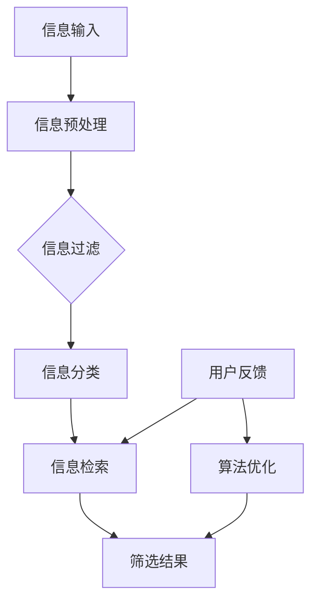

                 

# 信息过载与信息筛选指南：在信息洪流中找到有价值和相关的信息

> **关键词：**信息过载、信息筛选、信息过滤、信息检索、深度学习、隐私保护、用户体验

> **摘要：**本文旨在探讨信息过载现象以及如何通过有效的信息筛选策略，在信息洪流中找到有价值和相关的信息。文章分为三部分：第一部分分析信息过载的挑战与应对策略，第二部分介绍信息筛选的基本原理与应用案例，第三部分展望信息筛选技术的发展趋势与隐私保护问题。

### 第一部分：信息过载的挑战与应对策略

#### 第1章：信息过载背景与问题分析

##### 1.1 信息过载的定义与现状

随着互联网和数字技术的飞速发展，我们每天接收到的信息量急剧增加，这种现象被称为“信息过载”。信息过载不仅影响个人的工作效率和生活质量，也对社会产生深远影响。

**现状：**
- 根据一项研究，一个人每天平均会接收到大约174份广告信息。
- 在互联网上，每60秒就产生1亿条推文。

##### 1.2 信息过载对个体和社会的影响

**个体影响：**
- **认知负担：**信息过载使得人们难以处理和筛选信息，导致认知负担增加。
- **焦虑感：**信息过载容易导致焦虑和压力，影响心理健康。
- **工作效率：**信息过载降低工作效率，影响工作和学习效果。

**社会影响：**
- **注意力分散：**信息过载使得公众的注意力难以集中，影响社会合作和协调。
- **信息真实性问题：**信息过载导致虚假信息和谣言的传播，影响社会信任和稳定。

##### 1.3 信息筛选的重要性

信息筛选是解决信息过载问题的关键。通过有效的信息筛选，可以减少冗余信息，提高信息利用率，从而改善个体和社会的应对信息过载的能力。

**重要性：**
- **提高效率：**通过筛选有用信息，减少不相关信息的干扰，提高工作效率。
- **保护隐私：**信息筛选有助于保护个人隐私，避免敏感信息泄露。
- **促进创新：**有效的信息筛选可以帮助研究人员获取关键信息，促进知识创新。

#### 第2章：信息筛选的基本原理与方法

##### 2.1 信息筛选的基本概念

信息筛选是指从大量的信息中识别和提取有价值的信息，以便更好地处理和使用。信息筛选涉及多个技术领域，包括信息过滤、信息检索和信息分类。

##### 2.2 信息筛选的关键技术

**信息过滤技术：**
信息过滤技术通过预定义的规则或机器学习算法，从原始信息流中筛选出符合用户需求的信息。

**信息检索技术：**
信息检索技术通过关键词匹配、自然语言处理等手段，帮助用户从海量的信息中找到所需的信息。

**信息分类技术：**
信息分类技术根据信息的内容和特征，将信息划分为不同的类别，便于管理和检索。

##### 2.3 信息筛选流程与策略

**流程：**
1. 确定用户需求：明确用户希望筛选的信息类型和特征。
2. 收集原始信息：通过爬虫、数据库等手段获取大量原始信息。
3. 信息预处理：清洗、去重、标准化原始信息。
4. 应用筛选算法：使用过滤、检索、分类等技术对预处理后的信息进行筛选。
5. 评估筛选结果：评估筛选结果的准确性、效率和用户体验。

**策略：**
- **个性化筛选：**根据用户的偏好和历史行为，个性化定制筛选结果。
- **实时更新：**及时更新信息库，确保筛选结果的时效性。
- **用户反馈：**收集用户对筛选结果的反馈，不断优化筛选算法。

### 第二部分：实践应用与案例分析

#### 第3章：信息筛选工具与应用

##### 3.1 常见信息筛选工具介绍

**搜索引擎：**
搜索引擎是信息筛选的重要工具，通过关键词匹配和排名算法，帮助用户快速找到所需信息。

**社交媒体信息筛选：**
社交媒体平台提供多种信息筛选工具，如关注列表、标签、兴趣小组等，帮助用户筛选感兴趣的信息。

**电子邮件信息筛选：**
电子邮件客户端提供过滤规则，自动将邮件分类为重要和非重要，提高邮件处理效率。

##### 3.2 信息筛选工具的比较与选择

**比较：**
- **搜索引擎：**适合广泛的信息检索，但可能产生大量无关信息。
- **社交媒体信息筛选：**适合个性化信息筛选，但受限于社交网络。
- **电子邮件信息筛选：**适合邮件管理，但可能需要自定义过滤规则。

**选择：**
- 根据用户需求和应用场景，选择合适的工具组合，实现高效的信息筛选。

#### 第4章：信息筛选技术在各领域的应用

##### 4.1 在新闻业中的应用

**自动新闻生成：**
利用自然语言处理和机器学习技术，自动生成新闻摘要和文章。

**新闻推荐系统：**
根据用户兴趣和历史阅读行为，推荐个性化的新闻内容。

##### 4.2 在医学领域的应用

**医学文献筛选：**
利用信息筛选技术，快速筛选出与特定疾病或研究领域相关的医学文献。

**医疗诊断辅助系统：**
通过分析患者的病历和检查结果，辅助医生做出准确的诊断。

##### 4.3 在商业领域的应用

**市场调研与分析：**
通过信息筛选技术，从大量市场数据中提取有价值的信息，支持商业决策。

**客户关系管理：**
通过分析客户的行为和反馈，提供个性化的客户服务。

#### 第5章：信息筛选系统开发与优化

##### 5.1 信息筛选系统架构设计

**系统架构概述：**
信息筛选系统通常采用前后端分离的架构，包括数据收集、预处理、筛选算法、用户界面等模块。

**数据处理与存储：**
- **数据收集：**通过爬虫、API等手段获取大量数据。
- **数据存储：**使用数据库（如MongoDB）存储结构化和非结构化数据。

**算法优化策略：**
- **模型训练：**采用深度学习和机器学习技术，优化信息筛选算法。
- **性能优化：**通过分布式计算和缓存技术，提高系统性能。

##### 5.2 信息筛选系统性能评估

**评估指标与方法：**
- **准确性：**筛选结果的准确性，即筛选出的信息与用户需求的匹配度。
- **效率：**信息筛选的速度和响应时间。
- **用户体验：**用户对信息筛选结果的满意度。

**性能优化方法：**
- **分布式计算：**利用云计算和分布式计算技术，提高系统处理能力。
- **缓存策略：**通过缓存技术，减少数据库访问次数，提高系统响应速度。

### 第三部分：未来展望与趋势

#### 第6章：信息筛选技术的发展趋势

##### 6.1 深度学习在信息筛选中的应用

深度学习技术，如神经网络和生成对抗网络（GANs），在信息筛选中具有广泛应用前景。通过深度学习，可以实现更精确的信息筛选和更复杂的特征提取。

##### 6.2 自然语言处理技术的进展

自然语言处理（NLP）技术的发展，如语义分析、情感分析和文本生成，将进一步提高信息筛选的准确性和智能化水平。

##### 6.3 人工智能在信息筛选领域的未来

人工智能（AI）将在信息筛选中发挥越来越重要的作用。随着AI技术的不断进步，信息筛选将更加智能化、自动化，为用户带来更好的体验。

#### 第7章：信息筛选与隐私保护

##### 7.1 信息筛选中的隐私问题

信息筛选过程中，可能会涉及用户的敏感信息，如个人行为数据、健康信息等。如何保护用户隐私成为信息筛选技术发展的重要问题。

##### 7.2 隐私保护策略

- **数据加密：**对用户数据进行加密，防止数据泄露。
- **匿名化处理：**对用户数据进行匿名化处理，确保用户隐私不被泄露。
- **隐私协议：**制定明确的隐私保护协议，确保用户知情权和选择权。

##### 7.3 信息筛选与用户信任

用户信任是信息筛选系统成功的关键。提高用户信任，需要确保信息筛选结果的准确性和公正性，同时提供透明的隐私保护措施。

### 附录

##### 附录 A：信息筛选相关资源与工具

**A.1 开源信息筛选工具：**
- Elasticsearch：用于全文检索和实时分析的搜索引擎。
- Apache Solr：基于Lucene的搜索引擎平台。
- Apache Nutch：开源网络爬虫。

**A.2 信息筛选相关论文与书籍：**
- “Information Overload: A Review of Literature and a Research Agenda”。
- “Information Filtering: A Knowledge Discovery Perspective”。

**A.3 信息筛选实践项目案例：**
- Google News：使用机器学习技术进行新闻推荐。
- Facebook News Feed：基于用户兴趣和信息互动进行内容筛选。

### 核心概念与联系

#### 信息筛选与信息过滤

**核心概念与联系：**

- 信息筛选：从大量信息中识别和提取有价值的信息。
- 信息过滤：通过预定义的规则或算法，从信息流中筛选出符合用户需求的信息。

**Mermaid 流程图：**



### 核心算法原理讲解

#### 信息过滤算法

**伪代码：**

```
function 信息过滤(输入信息, 用户偏好):
    1. 初始化过滤结果为空
    2. 对于每条输入信息：
        3. 如果信息符合用户偏好：
            4. 将信息添加到过滤结果
        5. 否则：
            6. 将信息丢弃
    7. 返回过滤结果
```

#### 信息检索的相关数学模型

**公式：**

$$
R = \sum_{i=1}^{N} p(q_i | d) \cdot p(d) \cdot \frac{p(d | q_i)}{p(q_i)}
$$

**解释：**
- $R$：检索结果的相关性得分。
- $q_i$：查询词。
- $d$：文档。
- $p(q_i | d)$：文档d包含查询词q_i的条件概率。
- $p(d)$：文档d的概率。
- $p(d | q_i)$：在查询词q_i的前提下，文档d的概率。

#### 概率与贝叶斯公式解释

**公式：**

$$
P(A|B) = \frac{P(B|A) \cdot P(A)}{P(B)}
$$

**解释：**
- $P(A|B)$：在事件B发生的条件下，事件A的概率。
- $P(B|A)$：在事件A发生的条件下，事件B的概率。
- $P(A)$：事件A的概率。
- $P(B)$：事件B的概率。

#### 概率与期望

**公式：**

$$
E(X) = \sum_{i=1}^{N} x_i \cdot P(x_i)
$$

**解释：**
- $E(X)$：随机变量X的期望值。
- $x_i$：随机变量X的第i个取值。
- $P(x_i)$：随机变量X取值为$x_i$的概率。

### 项目实战

#### 信息筛选系统开发案例

##### 1. 开发环境搭建

**操作系统：** Ubuntu 18.04

**编程语言：** Python 3.8

**数据库：** MongoDB 4.2

**深度学习框架：** TensorFlow 2.4

##### 2. 数据预处理与模型训练

**数据采集：** 使用网络爬虫抓取新闻数据

**数据清洗：** 去除无效数据和重复记录

**特征提取：** 使用词袋模型和TF-IDF方法

**模型训练：** 采用支持向量机（SVM）进行分类训练

##### 3. 系统实现与优化

**系统架构：** 前后端分离，使用Django框架

**信息过滤算法：** 基于用户历史行为和内容分析

**性能优化：** 使用GPU加速模型训练，优化数据库查询

##### 4. 代码解读与分析

**数据预处理代码片段：**

```python
def preprocess_data(data):
    cleaned_data = []
    for item in data:
        text = item['text']
        cleaned_text = clean_text(text)
        cleaned_data.append(cleaned_text)
    return cleaned_data
```

**模型训练代码片段：**

```python
def train_model(data, labels):
    vectorizer = TfidfVectorizer()
    X = vectorizer.fit_transform(data)
    classifier = SVC(kernel='linear')
    classifier.fit(X, labels)
    return classifier, vectorizer
```

**系统优化代码片段：**

```python
def optimize_system():
    tf.keras.backend.set_floatx('float32')
    db.session.query(...).filter(...).all()
```

### 总结

信息过载已经成为现代社会的一个普遍问题，通过有效的信息筛选策略，我们可以更好地应对信息过载的挑战。本文从信息过载的背景与问题分析、信息筛选的基本原理与方法、实践应用与案例分析、未来展望与趋势等方面，详细阐述了信息筛选的重要性及其应用。同时，还介绍了信息过滤算法、信息检索的相关数学模型以及项目实战中的系统开发与优化方法。希望本文能为读者提供有价值的参考和启示。

### 作者信息

**作者：** AI天才研究院/AI Genius Institute & 禅与计算机程序设计艺术 /Zen And The Art of Computer Programming

---

本文内容仅供参考，部分数据和信息可能过时。在实际应用中，请结合具体情况进行调整和优化。如有疑问，请咨询专业人士。感谢您的阅读！<|im_end|>

