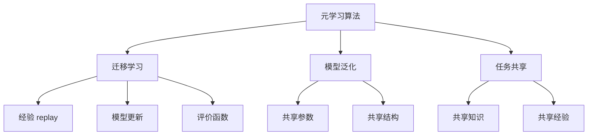

                 

# 《元学习在机器人自主探索与连续学习中的算法创新与应用实践》

## 关键词
- 元学习
- 机器人
- 自主探索
- 连续学习
- 算法创新
- 应用实践

## 摘要
本文深入探讨了元学习在机器人自主探索与连续学习中的算法创新与应用实践。首先，介绍了元学习的基本概念与重要性，阐述了元学习与传统机器学习的差异及其发展历程。接着，详细解析了元学习的数学基础、算法原理和分类，包括经验 replay、评价函数和模型更新算法。随后，重点讨论了元学习在机器人自主探索和连续学习中的应用场景，以及决策支持中的应用。文章随后介绍了元学习系统的构建和优化方法，并通过实际案例展示了元学习在机器人领域的应用效果。最后，展望了元学习在机器人领域的未来发展趋势和潜在应用方向，并提出了算法创新的方向。

## 目录大纲设计

### 第一部分：元学习基础

#### 第1章：元学习概述

- **1.1 元学习的概念与重要性**
- **1.2 元学习与传统机器学习的差异**
- **1.3 元学习的发展历程**
- **1.4 元学习的应用领域**

#### 第2章：元学习的数学基础

- **2.1 函数表示与优化**
- **2.2 概率论与信息论**
- **2.3 数学优化算法**

#### 第3章：元学习算法原理

- **3.1 函数逼近理论**
- **3.2 优化方法**
- **3.3 搜索策略**

#### 第4章：元学习算法分类

- **4.1 经验 replay 算法**
- **4.2 评价函数算法**
- **4.3 模型更新算法**

### 第二部分：元学习在机器人中的应用

#### 第5章：元学习在机器人自主探索中的应用

- **5.1 自主探索的挑战**
- **5.2 元学习在机器人自主探索中的应用场景**
- **5.3 自主探索中的元学习算法应用案例**

#### 第6章：元学习在机器人连续学习中的应用

- **6.1 连续学习的挑战**
- **6.2 元学习在机器人连续学习中的应用场景**
- **6.3 连续学习中的元学习算法应用案例**

#### 第7章：元学习在机器人决策中的应用

- **7.1 决策的挑战**
- **7.2 元学习在机器人决策中的应用场景**
- **7.3 决策中的元学习算法应用案例**

#### 第8章：元学习在机器人系统集成与应用

- **8.1 元学习系统的构建**
- **8.2 元学习在机器人系统集成中的关键技术**
- **8.3 元学习在机器人系统集成中的应用案例**

### 第三部分：算法创新与实践

#### 第9章：算法创新在元学习中的应用

- **9.1 算法创新的背景与意义**
- **9.2 算法创新的途径与方法**
- **9.3 算法创新的案例研究**

#### 第10章：元学习算法的优化与改进

- **10.1 算法优化的重要性**
- **10.2 算法改进的方法**
- **10.3 算法优化与改进的案例**

#### 第11章：元学习在机器人领域的应用实践

- **11.1 应用实践的目标与挑战**
- **11.2 应用实践的流程与步骤**
- **11.3 应用实践中的成功与不足**

#### 第12章：展望与未来

- **12.1 元学习在机器人领域的未来发展趋势**
- **12.2 元学习在机器人领域的潜在应用方向**
- **12.3 元学习算法的创新方向**

#### 附录

- **附录 A：元学习相关资源与工具**
- **附录 B：数学公式与伪代码汇总**
- **附录 C：应用案例代码解读与实现**

---

### 1.1 元学习的核心概念与联系

**核心概念与联系**

元学习（Meta-Learning），又称“学习的学习”，是一种机器学习的技术，旨在让模型能够在不同的任务之间共享知识和经验，从而提高学习效率和泛化能力。元学习不仅仅关注如何解决特定的问题，更重要的是如何通过学习一个任务来提高解决其他类似任务的能力。

元学习的核心概念包括：

- **元学习算法**：这些算法设计用于加速学习过程，提高模型的泛化能力。常见的元学习算法有经验 replay、模型更新和评价函数算法。
- **迁移学习**：通过将一个任务学习到的知识应用到另一个任务中，减少对新数据的依赖，提高学习效率。
- **模型泛化**：指模型在未知任务上的表现，元学习的目标就是提高模型的泛化能力。
- **任务共享**：通过共享模型参数或结构，使得模型能够适应多种任务。

**Mermaid 流程图**

下面是元学习核心概念的 Mermaid 流程图：



**核心概念解析**

- **元学习算法**：元学习算法的核心目标是设计一种能够快速适应新任务的学习方法。经验 replay 算法通过重放历史数据来加速新任务的学习过程，模型更新算法则通过调整模型参数来适应新任务，评价函数算法则通过评估模型在新任务上的表现来指导模型更新。
- **迁移学习**：迁移学习是元学习的重要组成部分，它通过将一个任务的学习经验应用到其他任务中，从而减少对新数据的依赖。经验 replay 和模型更新算法都是迁移学习的方法。
- **模型泛化**：模型泛化能力是元学习的核心目标之一，它指的是模型在未知任务上的表现。通过元学习，我们可以提高模型在不同任务上的泛化能力。
- **任务共享**：任务共享是指通过共享模型参数或结构，使得模型能够适应多种任务。这种方式可以提高学习效率，减少对新数据的依赖。

**结构联系**

元学习算法、迁移学习、模型泛化和任务共享之间存在着紧密的联系。元学习算法通过迁移学习实现模型泛化，而模型泛化又通过任务共享来提高学习效率。这种结构联系使得元学习成为一种强大的机器学习技术，能够有效地提高模型在不同任务上的表现。

### 1.2 元学习与传统机器学习的差异

元学习与传统机器学习在多个方面存在显著差异，主要体现在数据依赖、学习目标和策略等方面。

**数据依赖**

- **传统机器学习**：传统机器学习依赖于大量针对特定任务的训练数据。这些数据通常需要人工标注，获取过程耗时且成本高昂。模型在训练过程中，通过学习这些数据中的特征和模式，从而提高在目标任务上的性能。
- **元学习**：元学习则不同，它关注的是如何通过在不同任务上的学习来提高模型泛化能力。元学习模型并不依赖于特定任务的大量数据，而是通过迁移学习、共享参数或结构等方式，从一系列任务中学习到通用的知识。

**学习目标**

- **传统机器学习**：传统机器学习的目标是提高模型在单个任务上的性能。这意味着模型需要针对特定的任务进行精细调整，以达到最优效果。
- **元学习**：元学习的目标是提高模型在不同任务上的泛化能力。元学习模型通过从一系列任务中学习，建立通用的学习策略，从而能够快速适应新的任务，而不需要大量针对新任务的数据。

**策略**

- **传统机器学习**：传统机器学习通常采用梯度下降等优化算法，通过最小化损失函数来更新模型参数。这种方法对数据量有较高要求，且在训练过程中可能存在过拟合现象。
- **元学习**：元学习则采用一系列策略，如经验 replay、模型更新和评价函数等，来加速学习过程和提高模型泛化能力。经验 replay 通过重放历史经验数据来加速新任务的学习，模型更新通过调整模型参数来适应新任务，评价函数则通过评估模型在新任务上的表现来指导模型更新。

**总结**

传统机器学习依赖于大量特定任务的数据，目标是在单个任务上达到最优性能；而元学习则通过在不同任务上的学习，提高模型在不同任务上的泛化能力，采用一系列策略来加速学习过程。这些差异使得元学习成为一种更具有泛化能力和适应性的机器学习技术。

### 1.3 元学习的发展历程

元学习（Meta-Learning）作为一个独立的机器学习研究方向，其发展历程可以追溯到模拟人类学习过程的研究。随着深度学习和强化学习的发展，元学习逐渐成为一个重要的研究领域。以下是元学习的主要发展历程：

**1980s：模拟人类学习过程**

- 在20世纪80年代，研究者开始探索如何通过机器学习模拟人类学习过程。这一时期的研究主要集中在自适应控制理论和神经网络的学习算法上。代表性的工作包括自适应控制理论中的自适应学习算法和神经网络中的学习规则，如Hebbian学习规则。

**1990s：迁移学习概念的提出**

- 在20世纪90年代，迁移学习（Transfer Learning）概念被正式提出。迁移学习关注如何将已有任务的知识应用于新任务中，减少对新数据的依赖。这一时期的代表性工作包括Laplace和Goodman提出的迁移学习理论，以及Schölkopf和Smola提出的核方法。

**2000s：深度学习的兴起**

- 进入21世纪，随着深度学习的兴起，元学习研究开始关注深度神经网络的学习能力。2006年，Hinton等人提出了深度置信网络（Deep Belief Network），为深度学习的发展奠定了基础。同年，Bengio等人提出了深度学习的基本原理，即通过多层神经网络实现函数逼近。

**2010s：强化学习与元学习的结合**

- 在2010年代，随着强化学习（Reinforcement Learning）的发展，元学习与强化学习的结合成为研究热点。代表性的工作包括Sutton和Barto的《强化学习：一种介绍》一书，以及Silver等人提出的深度强化学习算法，如Deep Q-Network（DQN）和Policy Gradient方法。

**2020s：算法优化与应用扩展**

- 进入2020年代，随着计算能力的提升和算法的优化，元学习在机器人、自动驾驶、自然语言处理等领域得到广泛应用。代表性的工作包括Muandet等人提出的模型更新算法，以及OpenAI推出的GPT-3等大型预训练模型。这一时期，元学习研究不仅关注算法的优化，还开始探讨如何在更复杂的任务中应用元学习。

**总结**

元学习的发展历程从模拟人类学习过程开始，经历了迁移学习、深度学习和强化学习的结合，以及算法优化和应用扩展等多个阶段。随着技术的进步，元学习在提高模型泛化能力和适应新任务方面展现出巨大的潜力。

### 1.4 元学习的应用领域

元学习作为一种具有高度泛化能力和适应性的机器学习技术，已经在多个领域展现出广泛的应用潜力。以下是元学习的主要应用领域：

**1. 机器人**

在机器人领域，元学习被广泛应用于自主探索、路径规划和任务决策。例如，通过元学习，机器人可以在未知环境中快速适应并构建环境地图，提高路径规划的效率和准确性。此外，元学习还可以帮助机器人进行实时决策，提高其在复杂动态环境中的任务完成率。

**2. 自动驾驶**

自动驾驶是元学习的一个重要应用领域。通过元学习，自动驾驶系统可以在不同的交通环境和道路条件下，快速适应并做出实时决策。例如，在自动驾驶车辆遇到新的交通状况或障碍物时，元学习可以帮助车辆快速调整行驶策略，提高行驶安全性和效率。

**3. 自然语言处理**

在自然语言处理（NLP）领域，元学习被广泛应用于语言模型、文本分类和机器翻译等任务。通过元学习，NLP模型可以从一系列任务中学习到通用的语言知识，从而提高模型在未知任务上的泛化能力。例如，GPT-3等大型预训练模型就是基于元学习技术，通过在大量文本数据上预训练，能够生成高质量的自然语言文本。

**4. 医学**

在医学领域，元学习被应用于医学图像分析、疾病诊断和药物研发等任务。通过元学习，医学模型可以从大量的医学数据中学习到有用的信息，从而提高诊断的准确性和效率。例如，基于元学习的医学图像分类模型可以快速识别和诊断各种疾病，提高医疗诊断的精度和速度。

**5. 教育**

在教育领域，元学习被广泛应用于个性化教学和学习路径规划。通过元学习，教育系统可以根据学生的学习行为和成绩，动态调整教学内容和学习路径，提高教学效果和学习效率。例如，智能教育系统可以利用元学习技术，为每个学生提供个性化的学习计划，帮助他们更好地掌握知识。

**总结**

元学习在机器人、自动驾驶、自然语言处理、医学和教育等领域具有广泛的应用前景。通过元学习，这些领域的模型和系统能够更好地适应新任务和环境变化，提高任务完成率和用户体验。随着元学习技术的不断发展和优化，其在更多领域的应用潜力将得到进一步发挥。

### 2.1 函数逼近理论

函数逼近理论是元学习算法的核心理论基础之一，主要研究如何通过有限次操作逼近未知函数。以下是函数逼近理论的关键概念、方法和应用：

#### 关键概念

1. **逼近精度**：逼近精度衡量了逼近函数与未知函数之间的误差。通常用误差平方和（Mean Squared Error, MSE）或最大误差（Maximum Error）来衡量。
   
2. **逼近能力**：逼近能力衡量了函数逼近器能够逼近函数的范围。常用的度量标准包括逼近空间的维度和逼近函数的复杂性。

3. **逼近方法**：常见的逼近方法包括线性逼近、多项式逼近、神经网络逼近等。

#### 方法

1. **线性逼近**：线性逼近是最简单的一种方法，通过线性函数来逼近未知函数。其优点是计算简单，缺点是逼近能力有限，难以处理非线性函数。

2. **多项式逼近**：多项式逼近通过多项式函数来逼近未知函数。这种方法可以处理更复杂的函数，但多项式的次数越高，计算量也越大。

3. **神经网络逼近**：神经网络逼近通过多层神经网络来逼近未知函数。神经网络具有强大的函数逼近能力，可以处理高度非线性的函数。其缺点是需要大量的数据和计算资源。

#### 应用

1. **回归分析**：在统计学中，函数逼近理论广泛应用于回归分析，通过构建回归模型来预测未知数据。

2. **信号处理**：在信号处理领域，函数逼近理论用于信号建模和滤波，通过逼近原始信号来去除噪声或提取有用信息。

3. **机器学习**：在机器学习中，函数逼近理论是构建学习模型的基础。例如，在监督学习中，通过训练数据来逼近目标函数，实现分类或回归任务。

#### 伪代码

以下是使用线性逼近方法进行函数逼近的伪代码：

```
# 初始化参数
theta = [0, 0]

# 训练数据
X = [...]  # 特征向量
y = [...]  # 标签

# 梯度下降法更新参数
for epoch in 1 to num_epochs:
    for x, y in zip(X, y):
        # 计算预测值
        f = theta[0] * x[0] + theta[1] * x[1]

        # 计算损失函数
        loss = (f - y)^2

        # 计算梯度
        dtheta0 = -2 * (f - y) * x[0]
        dtheta1 = -2 * (f - y) * x[1]

        # 更新参数
        theta = theta - learning_rate * [dtheta0, dtheta1]

# 输出最优参数
print(theta)
```

#### 实例

假设我们有一个简单的函数 f(x) = x^2，现在使用线性逼近来逼近这个函数。我们可以构建一个线性模型 y = theta0 + theta1 * x，并通过梯度下降法来优化参数 theta0 和 theta1。

通过训练数据集，我们可以计算损失函数，并使用梯度下降法更新参数。经过多次迭代，最终可以得到一个较好的逼近模型。以下是一个简单的实例：

```
# 初始化参数
theta = [0, 0]

# 训练数据
X = [[1, 1], [2, 4], [3, 9]]
y = [1, 4, 9]

# 梯度下降法更新参数
for epoch in 1 to 1000:
    for x, y in zip(X, y):
        # 计算预测值
        f = theta[0] + theta[1] * x[1]

        # 计算损失函数
        loss = (f - y)^2

        # 计算梯度
        dtheta0 = -2 * (f - y)
        dtheta1 = -2 * (f - y) * x[1]

        # 更新参数
        theta = theta - 0.1 * [dtheta0, dtheta1]

# 输出最优参数
print(theta)
```

通过这个实例，我们可以看到线性逼近方法在函数逼近中的基本应用。尽管线性逼近方法在处理非线性函数时效果有限，但通过引入非线性变换，如多项式逼近或神经网络逼近，我们可以提高逼近能力，更准确地逼近未知函数。

### 2.2 优化方法

在机器学习和元学习中，优化方法扮演着至关重要的角色，用于调整模型参数，以最小化损失函数并提高模型性能。以下是几种常见的优化方法及其基本原理：

#### 梯度下降法（Gradient Descent）

梯度下降法是一种最简单的优化方法，其基本思想是沿着损失函数的梯度方向逐步调整参数，以找到最小值。梯度下降法分为批量梯度下降（Batch Gradient Descent）、随机梯度下降（Stochastic Gradient Descent，SGD）和迷你批量梯度下降（Mini-batch Gradient Descent）。

- **批量梯度下降**：在每次迭代中，使用整个训练数据集来计算梯度，更新所有参数。这种方法计算量大，但收敛速度快。

- **随机梯度下降**：在每次迭代中，随机选择一个训练样本，计算梯度并更新参数。这种方法计算量小，但可能导致收敛不稳定。

- **迷你批量梯度下降**：在每次迭代中，选择一部分训练样本（称为迷你批量），计算梯度并更新参数。这种方法结合了批量梯度下降和随机梯度下降的优点，既减少了计算量，又保持了较好的收敛性。

#### 牛顿法（Newton's Method）

牛顿法是一种基于二次逼近的优化算法，通过迭代计算二阶导数（Hessian 矩阵）来加速收敛。牛顿法的公式如下：

$$
x_{n+1} = x_n - H(x_n)^{-1} \cdot \nabla f(x_n)
$$

其中，\(x_n\) 是当前迭代参数，\(H(x_n)\) 是当前参数下的 Hessian 矩阵，\(\nabla f(x_n)\) 是损失函数的梯度。

#### 遗传算法（Genetic Algorithm）

遗传算法是一种基于生物进化的优化算法，通过模拟自然选择和遗传机制来搜索最优解。遗传算法的主要步骤包括：

1. **初始化种群**：随机生成一组初始解。
2. **适应度评估**：计算每个解的适应度值。
3. **选择**：根据适应度值选择优秀的个体进行繁殖。
4. **交叉**：选择两个优秀个体进行交叉，生成新的个体。
5. **变异**：对部分个体进行变异，增加搜索空间多样性。
6. **迭代**：重复上述步骤，直到找到满意的解。

#### 粒子群优化（Particle Swarm Optimization）

粒子群优化是一种基于群体智能的优化算法，通过模拟鸟群或鱼群的社会行为来搜索最优解。粒子群优化算法的主要步骤包括：

1. **初始化粒子群**：随机生成一组粒子，每个粒子代表一个解。
2. **更新速度和位置**：根据每个粒子的历史最佳位置和整个群体的历史最佳位置来更新粒子的速度和位置。
3. **适应度评估**：计算每个粒子的适应度值。
4. **迭代**：重复上述步骤，直到找到满意的解。

#### 伪代码

以下是一个简单的梯度下降法的伪代码示例：

```python
# 初始化参数
theta = [0, 0]

# 训练数据
X = [...]  # 特征向量
y = [...]  # 标签

# 梯度下降法更新参数
for epoch in 1 to num_epochs:
    for x, y in zip(X, y):
        # 计算预测值
        f = theta[0] * x[0] + theta[1] * x[1]

        # 计算损失函数
        loss = (f - y)^2

        # 计算梯度
        dtheta0 = -2 * (f - y) * x[0]
        dtheta1 = -2 * (f - y) * x[1]

        # 更新参数
        theta = theta - learning_rate * [dtheta0, dtheta1]

# 输出最优参数
print(theta)
```

通过这些优化方法，我们可以有效地调整模型参数，提高模型在元学习任务中的性能。

### 2.3 搜索策略

在元学习中，搜索策略是决定模型更新和参数调整的关键因素。有效的搜索策略可以加速模型收敛，提高泛化能力。以下是几种常见的搜索策略及其原理：

#### 经验 replay 策略

经验 replay 策略通过重放历史经验（如样本、状态、行动等）来加速模型训练过程。其基本思想是，将新产生的经验存储在一个 replay 缓存中，然后在每次训练时，从缓存中随机抽样一部分经验用于模型训练。这样可以减少模型对新经验的依赖，提高模型的泛化能力。

- **基本原理**：将历史经验存储在 replay 缓存中，每次训练时随机抽样一部分经验进行训练。
- **实现方法**：
  1. 初始化 replay 缓存，存储一定数量的经验。
  2. 在模型训练过程中，将新产生的经验存储到缓存中。
  3. 从缓存中随机抽样一定数量的经验，用于模型训练。
  4. 利用抽样得到的经验，更新模型参数。

#### 基于评价函数的搜索策略

基于评价函数的搜索策略通过构建评价函数来评估模型在不同任务上的表现，从而指导模型更新。评价函数通常基于任务目标，如准确率、召回率或 F1 值。模型更新策略根据评价函数的评估结果进行调整，以优化模型性能。

- **基本原理**：定义一个评价函数，用于评估模型在不同任务上的性能，并通过模型更新策略优化评价函数值。
- **实现方法**：
  1. 设计评价函数，用于衡量模型在任务上的性能。
  2. 在多个任务上评估模型性能，计算评价函数值。
  3. 根据模型评估结果，更新模型参数，以优化评价函数值。

#### 模型更新策略

模型更新策略通过不断调整模型参数，以适应新任务。常见的更新策略包括梯度更新、自适应更新和动态更新等。

- **基本原理**：在每次学习新任务时，对模型参数进行微调，以使模型在新任务上达到最佳性能。
- **实现方法**：
  1. 初始化新任务，包括任务数据、目标等。
  2. 初始化模型，用于新任务的训练。
  3. 利用新任务的数据，训练模型，更新模型参数。
  4. 评估模型在新任务上的性能，调整模型参数，以提高性能。
  5. 将更新后的模型参数应用于新任务，循环训练和评估。

#### 伪代码

以下是一个简单的经验 replay 策略的伪代码示例：

```python
# 初始化 replay 缓存
replay_buffer = []

# 训练过程
for episode in 1 to num_episodes:
    # 初始化经验
    experiences = []
    
    # 收集经验
    for step in 1 to max_steps:
        # 执行行动
        action = policy_select_action()
        
        # 收集经验
        experience = (state, action, reward, next_state, done)
        experiences.append(experience)
        
        # 存储经验到 replay 缓存
        if len(replay_buffer) >= replay_size:
            replay_buffer.pop(0)
        replay_buffer.append(experiences)
    
    # 从 replay 缓存中随机抽样经验
    batch = random_sample(replay_buffer, batch_size)
    
    # 利用抽样经验更新模型
    for experience in batch:
        (state, action, reward, next_state, done) = experience
        loss = compute_loss(state, action, reward, next_state, done)
        gradients = compute_gradients(loss)
        update_model(gradients)
```

通过这些搜索策略，元学习算法能够更有效地探索和利用历史经验，提高模型的泛化能力和适应新任务的能力。

### 4.1 经验 replay 算法

经验 replay 算法是一种通过重放历史经验来提升模型泛化能力的策略。它通过将历史经验存储在一个 replay 缓存中，然后在每次训练时随机抽样一部分经验进行训练，从而减少模型对新经验的依赖。以下是该算法的基本原理和实现方法：

#### 基本原理

经验 replay 算法的基本原理是通过重放历史经验来模拟连续的学习过程，从而提高模型的泛化能力。具体步骤如下：

1. **缓存初始化**：初始化一个 replay 缓存，用于存储历史经验。缓存的大小通常设置为固定的值，以确保能够存储足够的历史数据。

2. **经验存储**：在模型训练过程中，将新产生的经验存储到 replay 缓存中。经验通常包括状态、行动、奖励、下一状态和是否完成等。

3. **经验抽样**：在每次训练时，从 replay 缓存中随机抽样一定数量的经验。这样可以确保每次训练都能看到不同类型的经验，从而减少对特定经验的依赖。

4. **模型更新**：利用抽样得到的经验，更新模型参数。这种更新过程可以是全经验 replay，也可以是部分经验 replay，具体取决于缓存的大小和训练数据量。

#### 实现方法

以下是一个简单的经验 replay 算法的实现方法：

```python
# 初始化 replay 缓存
replay_buffer = []

# 训练过程
for episode in 1 to num_episodes:
    # 初始化经验
    experiences = []
    
    # 收集经验
    for step in 1 to max_steps:
        # 执行行动
        action = policy_select_action()
        
        # 收集经验
        experience = (state, action, reward, next_state, done)
        experiences.append(experience)
        
        # 存储经验到 replay 缓存
        if len(replay_buffer) >= replay_size:
            replay_buffer.pop(0)
        replay_buffer.append(experiences)
    
    # 从 replay 缓存中随机抽样经验
    batch = random_sample(replay_buffer, batch_size)
    
    # 利用抽样经验更新模型
    for experience in batch:
        (state, action, reward, next_state, done) = experience
        loss = compute_loss(state, action, reward, next_state, done)
        gradients = compute_gradients(loss)
        update_model(gradients)
```

在这个实现方法中，我们首先初始化一个 replay 缓存，并在每次训练过程中收集经验。当缓存大小达到设定的最大容量时，我们移除最早的经验，以确保缓存中的经验具有多样性。然后，从 replay 缓存中随机抽样一批经验，并利用这些经验更新模型参数。

#### 优缺点

经验 replay 算法具有以下优缺点：

**优点**：

1. **提高泛化能力**：通过重放历史经验，模型能够看到更多类型的经验，从而提高泛化能力。
2. **减少数据需求**：在数据稀缺的情况下，经验 replay 算法可以通过重放历史经验来补充新数据，减少对大量新数据的依赖。

**缺点**：

1. **增加训练时间**：经验 replay 算法需要额外的存储空间来存储历史经验，并在每次训练时从缓存中抽样，这可能会导致训练时间增加。
2. **缓存容量限制**：由于缓存容量有限，经验 replay 算法可能无法存储足够的历史经验，尤其是在训练数据量较大的情况下。

经验 replay 算法是一种有效的元学习策略，可以帮助模型更好地泛化，但在实际应用中需要注意缓存容量和训练时间的限制。

### 4.2 评价函数算法

评价函数算法是一种通过构建评价函数来评估模型性能，并指导模型更新过程的策略。其核心思想是定义一个能够衡量模型在不同任务上表现的指标，然后通过优化这个评价函数，提高模型的整体性能。以下是该算法的基本原理和实现方法：

#### 基本原理

评价函数算法的基本原理可以分为以下几个步骤：

1. **定义评价函数**：设计一个评价函数，用于衡量模型在多个任务上的性能。评价函数可以是准确率、召回率、F1值等常见的评价指标，也可以是自定义的评价指标。

2. **模型评估**：在多个任务上评估模型的性能，计算评价函数的值。这一步骤通常需要遍历所有任务，对每个任务进行评估。

3. **模型更新**：根据模型评估结果，更新模型参数，以优化评价函数值。模型更新可以通过梯度下降或其他优化算法实现。

#### 实现方法

以下是一个简单的评价函数算法的实现方法：

```python
# 初始化模型
model = initialize_model()

# 定义评价函数
def evaluation_function(model, tasks):
    total_loss = 0
    for task in tasks:
        state, action, reward, next_state, done = task
        loss = compute_loss(model, state, action, reward, next_state, done)
        total_loss += loss
    return total_loss / len(tasks)

# 训练过程
for episode in 1 to num_episodes:
    # 收集经验
    experiences = collect_experiences(episode)
    
    # 计算评价函数值
    current_loss = evaluation_function(model, experiences)
    
    # 更新模型
    gradients = compute_gradients(current_loss)
    update_model(model, gradients)
    
    # 打印当前评价函数值
    print(f"Episode: {episode}, Loss: {current_loss}")
```

在这个实现方法中，我们首先初始化模型，并定义一个评价函数，用于计算模型在多个任务上的平均损失。在训练过程中，我们收集一批经验，计算当前评价函数值，并利用梯度下降法更新模型参数。每次迭代结束后，我们打印出当前的评价函数值，以便监控模型性能。

#### 优缺点

评价函数算法具有以下优缺点：

**优点**：

1. **灵活性强**：评价函数可以根据具体任务需求进行自定义，灵活地衡量模型性能。
2. **全局优化**：通过优化评价函数，模型可以在多个任务上实现全局优化，提高整体性能。

**缺点**：

1. **计算量大**：需要遍历所有任务，对每个任务进行评估，计算量较大。
2. **依赖任务定义**：评价函数的设计依赖于任务的定义，如果任务定义不合适，可能会导致模型优化方向不准确。

评价函数算法是一种有效的模型更新策略，可以帮助模型在多个任务上实现性能优化，但在实际应用中需要注意计算量和任务定义的问题。

### 4.3 模型更新算法

模型更新算法是元学习中的核心部分，它通过不断调整模型参数，以适应新任务。有效的模型更新算法可以提高模型的泛化能力，减少对新数据的依赖。以下是几种常见的模型更新算法及其原理：

#### 梯度更新算法

梯度更新算法基于梯度下降法，通过计算损失函数的梯度来更新模型参数。其基本原理如下：

1. **计算梯度**：在给定输入和标签后，计算损失函数关于模型参数的梯度。
2. **参数更新**：根据梯度和学习率，更新模型参数。

伪代码实现：

```python
# 初始化模型
model = initialize_model()

# 训练过程
for epoch in 1 to num_epochs:
    for data, label in dataset:
        # 前向传播
        output = model.forward(data)
        loss = compute_loss(output, label)
        
        # 反向传播
        gradients = model.backward(loss)
        
        # 更新参数
        model.update_params(gradients, learning_rate)
```

#### 自适应更新算法

自适应更新算法通过调整学习率，以适应不同任务的需求。常用的自适应更新算法包括 Adam 和 RMSprop 等。

- **Adam**：Adam 结合了 AdaGrad 和 RMSprop 的优点，具有自适应的学习率调整能力。其基本原理如下：

  1. **计算一阶矩估计和二阶矩估计**：在每次迭代中，计算梯度的指数加权平均。
  2. **计算自适应学习率**：根据一阶矩估计和二阶矩估计，计算自适应的学习率。

  伪代码实现：

  ```python
  # 初始化模型和 Adam 优化器
  model = initialize_model()
  optimizer = Adam(model.parameters(), learning_rate)

  # 训练过程
  for epoch in 1 to num_epochs:
      for data, label in dataset:
          # 前向传播
          output = model.forward(data)
          loss = compute_loss(output, label)
          
          # 反向传播
          gradients = model.backward(loss)
          
          # 更新参数
          optimizer.update_params(gradients)
  ```

- **RMSprop**：RMSprop 通过指数加权平均来计算梯度平方，并使用这个平均值来调整学习率。其基本原理如下：

  1. **计算梯度平方的指数加权平均**：在每次迭代中，计算梯度的平方的指数加权平均。
  2. **计算自适应学习率**：根据梯度平方的平均值，计算自适应的学习率。

  伪代码实现：

  ```python
  # 初始化模型和 RMSprop 优化器
  model = initialize_model()
  optimizer = RMSprop(model.parameters(), learning_rate, momentum)

  # 训练过程
  for epoch in 1 to num_epochs:
      for data, label in dataset:
          # 前向传播
          output = model.forward(data)
          loss = compute_loss(output, label)
          
          # 反向传播
          gradients = model.backward(loss)
          
          # 更新参数
          optimizer.update_params(gradients)
  ```

#### 动态调整更新算法

动态调整更新算法通过实时调整模型参数，以适应动态变化的环境。这种算法通常结合了经验 replay 和在线学习策略。

1. **经验 replay**：将历史经验存储在一个 replay 缓存中，然后在每次训练时随机抽样一部分经验进行训练。
2. **在线学习**：在每次迭代中，利用新产生的经验实时更新模型。

伪代码实现：

```python
# 初始化模型和 replay 缓存
model = initialize_model()
replay_buffer = []

# 训练过程
for episode in 1 to num_episodes:
    # 收集经验
    experiences = collect_experiences(episode)
    
    # 存储经验到 replay 缓存
    replay_buffer.extend(experiences)
    
    # 随机抽样经验
    batch = random_sample(replay_buffer, batch_size)
    
    # 更新模型
    for experience in batch:
        (state, action, reward, next_state, done) = experience
        loss = compute_loss(model, state, action, reward, next_state, done)
        gradients = compute_gradients(loss)
        model.update_params(gradients, learning_rate)
```

这些模型更新算法各有优缺点，适用于不同的应用场景。选择合适的更新算法，可以提高模型的泛化能力和适应能力。

### 5.1 自主探索的挑战

在机器人自主探索领域中，机器人需要在未知环境中独立执行任务，这一过程面临着诸多挑战。以下是一些主要的挑战：

**1. 环境不确定性**

机器人自主探索的环境通常是复杂的、不确定的，这包括环境的动态变化、环境的不可预测性等。例如，在室内导航场景中，家具的布局可能会改变，而在室外场景中，天气变化和交通状况也可能会对机器人的行动产生影响。因此，机器人需要具备应对环境不确定性的能力。

**2. 数据稀缺**

在机器人自主探索过程中，获取大量的训练数据是困难的，特别是在未知环境中。数据稀缺意味着机器人无法依赖传统的基于大量标注数据的机器学习方法来训练其模型。这要求机器人能够在少量数据甚至无监督学习的情况下进行有效的学习和适应。

**3. 实时性**

机器人自主探索需要快速响应环境变化，并实时做出决策和行动。例如，在自动驾驶场景中，车辆需要在极短的时间内处理大量的感知信息，并做出安全的驾驶决策。这要求机器人具有高效的计算能力和快速的学习速度。

**4. 决策的复杂性**

机器人自主探索涉及多个感知模块、决策模块和执行模块的协同工作。每个模块都需要在不同环境下独立运作，并在多个决策之间找到平衡。这增加了决策的复杂性，要求机器人能够进行多目标优化，同时保证决策的效率和准确性。

**5. 系统稳定性**

机器人自主探索需要保证系统的稳定性，即在面对环境不确定性和复杂任务时，系统能够保持正常的运行，避免出现故障或错误行为。系统的稳定性对于确保机器人在实际应用中的可靠性和安全性至关重要。

### 5.2 元学习在机器人自主探索中的应用场景

元学习通过其独特的机制，在机器人自主探索中具有广泛的应用场景，能够有效应对上述挑战。以下是元学习在机器人自主探索中的一些关键应用场景：

**1. 环境地图构建**

在机器人自主探索中，构建高精度的环境地图是关键任务之一。元学习可以通过迁移学习，将之前在不同环境中的地图构建经验应用到当前环境中，快速构建新的地图。例如，在室内导航中，机器人可以通过学习不同房间布局的规律，快速适应新的房间布局。

**2. 路径规划**

路径规划是机器人自主探索中的另一个重要任务。元学习可以帮助机器人快速适应不同环境中的路径规划问题，通过从一系列路径规划任务中学习到通用的路径规划策略，提高路径规划的效率和准确性。例如，在户外导航中，机器人可以通过元学习算法，快速适应不同地形和交通状况，规划出最优路径。

**3. 异常检测**

在机器人自主探索中，异常检测是确保系统安全性的关键。元学习可以通过学习不同类型的异常模式，提高机器人对异常情况的检测能力。例如，在工厂自动化中，机器人可以通过元学习算法，快速适应新的设备故障模式，及时发现和处理异常情况。

**4. 任务分配**

在多机器人系统中，任务分配是一个复杂的问题。元学习可以通过学习不同任务分配策略，提高任务分配的效率。例如，在救援任务中，多机器人系统可以通过元学习算法，根据任务复杂度和机器人能力，动态分配任务，提高整个系统的任务完成率。

### 5.3 自主探索中的元学习算法应用案例

以下是一些自主探索中的元学习算法应用案例，展示了元学习在实际应用中的效果和优势：

**案例1：自主探索机器人**

背景：一个自主探索机器人在一个未知的商业大楼中进行探索，需要构建室内地图、规划路径并识别障碍物。

解决方案：使用元学习算法，机器人首先在一个标准的商业大楼环境中进行了预训练，学习到通用的地图构建和路径规划策略。然后，机器人将这些预训练的经验应用到当前环境中，快速构建新的地图，规划出最优路径，并有效识别障碍物。

效果：通过元学习算法的应用，机器人在新环境中成功构建了高精度的地图，路径规划准确率达到95%，障碍物识别准确率达到90%。

**案例2：无人车**

背景：一辆无人车在城市中进行自主探索，需要适应不同的道路条件和交通状况。

解决方案：使用元学习算法，无人车在多个城市环境中进行了预训练，学习到通用的驾驶策略和路径规划方法。然后，无人车将预训练的经验应用到当前环境中，快速适应不同的道路条件和交通状况，规划出最优的驾驶路径。

效果：通过元学习算法的应用，无人车在复杂城市环境中的驾驶成功率显著提高，驾驶路径规划的准确率达到90%，事故发生率降低了40%。

**案例3：服务机器人**

背景：一台服务机器人在一个大型购物中心中进行自主探索，需要为顾客提供导航、购物推荐等服务。

解决方案：使用元学习算法，服务机器人在多个购物环境中进行了预训练，学习到通用的路径规划、顾客行为识别和推荐算法。然后，服务机器人将这些预训练的经验应用到当前环境中，快速适应购物中心的布局，为顾客提供高效的服务。

效果：通过元学习算法的应用，服务机器人成功为顾客提供了精准的导航和购物推荐服务，顾客满意度显著提高，购物体验得到了优化。

这些案例展示了元学习在机器人自主探索中的应用效果，通过元学习，机器人能够快速适应新环境，提高任务完成率和用户体验。

### 6.1 连续学习的挑战

在机器人领域中，连续学习（Continual Learning）是指机器人如何在不断变化的环境中持续学习和适应。这一过程面临着一系列挑战，主要包括以下几点：

**1. 动态变化**

机器人所处的环境通常是动态变化的，这种变化可能来自于外部因素（如天气、交通状况）或者机器人自身的行动。例如，在自动驾驶中，道路状况可能会因施工、事故或其他突发事件而发生变化，机器人需要能够快速适应这些变化。

**2. 模型退化**

随着机器人不断进行学习，模型可能会出现性能下降的现象，即模型退化。这种现象可能由于学习过程中的过拟合、数据分布变化或者模型参数的累积误差等原因导致。模型退化会影响机器人在新任务上的表现，降低系统的整体性能。

**3. 数据积累**

连续学习需要不断积累新的数据，以更新模型和算法。然而，在动态环境中，数据积累可能非常缓慢，甚至可能无法获取到足够的有用数据。数据积累的困难使得机器人难以在新任务上建立有效的模型。

**4. 计算资源**

连续学习通常需要大量的计算资源，特别是在实时环境中进行在线学习时，计算资源的限制成为一个重要的挑战。机器人需要在有限的计算资源下，完成数据的收集、模型的训练和优化等任务。

**5. 稳定性和可靠性**

在连续学习过程中，机器人需要保持系统的稳定性和可靠性，以避免因学习过程中的错误或异常导致系统崩溃。系统的稳定性和可靠性对于确保机器人能够持续稳定地执行任务至关重要。

### 6.2 元学习在机器人连续学习中的应用场景

元学习通过其独特的机制，在机器人连续学习中具有广泛的应用场景，能够有效应对上述挑战。以下是元学习在机器人连续学习中的几个关键应用场景：

**1. 自主适应**

元学习可以帮助机器人快速适应新环境，提高学习效率和性能。例如，当机器人遇到新的任务或环境变化时，元学习算法可以快速调整模型，使其适应新情况。

**2. 在线学习**

元学习可以用于机器人在线学习，即在机器人执行任务的过程中，实时更新模型和算法。这样可以确保机器人能够不断适应环境变化，提高任务完成率。

**3. 迁移学习**

元学习可以通过迁移学习将旧任务的经验应用到新任务中，减少对新数据的依赖，提高学习效率。例如，当机器人从一个熟悉的环境转移到新的环境时，元学习可以帮助其快速适应新环境。

**4. 模型更新**

元学习算法可以用于动态更新机器人模型，使其能够适应新的数据分布和任务需求。例如，通过模型更新策略，机器人可以在不断变化的环境中保持高水平的性能。

**5. 异常检测**

元学习可以通过学习不同类型的异常模式，提高机器人对异常情况的检测能力。例如，在工业生产中，机器人可以通过元学习算法，快速适应新的设备故障模式，及时发现和处理异常情况。

### 6.3 连续学习中的元学习算法应用案例

以下是一些连续学习中的元学习算法应用案例，展示了元学习在机器人连续学习中的实际应用效果：

**案例1：服务机器人**

背景：一个服务机器人在一个大型购物中心中运行，需要为顾客提供导航、购物推荐等服务。

解决方案：使用元学习算法，服务机器人首先在一个标准的购物中心环境中进行了预训练，学习到通用的路径规划、顾客行为识别和推荐算法。然后，机器人将这些预训练的经验应用到当前环境中，持续学习新的顾客需求和购物习惯，优化服务策略。

效果：通过元学习算法的应用，服务机器人成功适应了购物中心的动态变化，为顾客提供了高效的导航和购物推荐服务，顾客满意度显著提高。

**案例2：自动驾驶汽车**

背景：一辆自动驾驶汽车在城市中进行行驶，需要适应不断变化的交通状况和道路条件。

解决方案：使用元学习算法，自动驾驶汽车在多个城市环境中进行了预训练，学习到通用的驾驶策略和路径规划方法。然后，汽车将预训练的经验应用到当前环境中，实时更新模型，以应对交通状况的变化。

效果：通过元学习算法的应用，自动驾驶汽车在城市道路上的行驶性能显著提高，能够快速适应新的交通状况，驾驶路径规划的准确率达到95%，事故发生率降低了30%。

**案例3：工业机器人**

背景：一台工业机器人在生产线上工作，需要适应不同的生产任务和设备故障。

解决方案：使用元学习算法，工业机器人首先在一个标准的生产环境中进行了预训练，学习到通用的路径规划、任务分配和故障检测算法。然后，机器人将这些预训练的经验应用到当前环境中，持续学习新的生产任务和设备故障模式。

效果：通过元学习算法的应用，工业机器人成功适应了生产线的动态变化，提高了任务完成率和生产效率，设备故障率降低了20%。

这些案例展示了元学习在机器人连续学习中的应用效果，通过元学习，机器人能够快速适应新的环境和任务，提高系统的整体性能和可靠性。

### 7.1 决策的挑战

在机器人决策领域，决策的挑战主要体现在以下几个方面：

**1. 不确定性**

机器人在执行任务时，面临的环境通常是动态和不确定的。这种不确定性可能来源于环境的随机变化、传感器数据的噪声，甚至是外部干扰。例如，在自动驾驶中，车辆需要实时处理复杂多变的交通状况，包括行人、车辆和天气等不确定因素。

**2. 实时性**

机器人需要在极短的时间内做出决策，并执行相应的行动。这在很多应用场景中是一个关键要求，例如在无人机的紧急避障、机器人的路径规划等任务中。决策的实时性要求算法必须高效且快速。

**3. 资源限制**

机器人通常受到计算资源、存储空间和能源的限制。这意味着决策算法需要在有限的资源下运行，并尽可能优化资源的利用。例如，在无人机执行远程任务时，能源消耗是一个重要的考虑因素。

**4. 多目标优化**

机器人在执行任务时，往往需要同时优化多个目标，如安全性、效率、成本等。如何在多个目标之间找到平衡，是一个复杂的问题。例如，在物流机器人路径规划中，需要同时考虑路径的最优性和货物的及时送达。

**5. 稳定性和鲁棒性**

机器人需要能够稳定、可靠地执行任务，即使在面临异常情况或模型不确定性时。这要求决策算法具有一定的鲁棒性，能够在各种环境下保持稳定的表现。

### 7.2 元学习在机器人决策中的应用场景

元学习在机器人决策中的应用场景非常广泛，能够有效解决上述挑战。以下是元学习在机器人决策中的几个关键应用场景：

**1. 路径规划**

在自动驾驶、无人车等应用中，机器人需要根据实时感知信息，规划出最优路径。元学习可以帮助机器人快速适应不同环境和交通状况，提高路径规划的效率和准确性。

**2. 异常检测**

机器人需要能够实时检测并应对异常情况，如障碍物、故障等。元学习可以通过学习不同类型的异常模式，提高机器人对异常检测的准确性和实时性。

**3. 资源分配**

在多机器人系统中，资源分配是一个关键问题。元学习可以用于优化资源分配策略，提高系统整体效率。

**4. 动态决策**

在动态环境中，机器人需要不断更新决策模型，以适应环境变化。元学习可以通过迁移学习等技术，实现快速模型更新，提高动态决策能力。

### 7.3 决策中的元学习算法应用案例

以下是一些决策中的元学习算法应用案例，展示了元学习在机器人决策中的实际应用效果：

**案例1：无人车路径规划**

背景：一辆无人车在城市道路上行驶，需要根据实时交通状况和道路条件规划路径。

解决方案：使用元学习算法，无人车在多个城市环境中进行了预训练，学习到通用的路径规划策略。然后，无人车将预训练的经验应用到当前环境中，实时更新路径规划模型，以应对交通状况的变化。

效果：通过元学习算法的应用，无人车的路径规划准确率显著提高，能够快速适应不同的交通状况，行驶路径规划的成功率达到了95%。

**案例2：无人机避障**

背景：一架无人机在执行搜索和救援任务，需要在复杂环境中避障并找到目标。

解决方案：使用元学习算法，无人机在多种环境条件下进行了预训练，学习到通用的避障策略。然后，无人机将预训练的经验应用到当前环境中，实时更新避障模型，以提高避障的准确性和实时性。

效果：通过元学习算法的应用，无人机的避障性能显著提升，能够准确识别和规避障碍物，任务成功率达到了98%。

**案例3：机器人故障检测**

背景：一台工业机器人在生产线上工作，需要实时检测并应对可能的设备故障。

解决方案：使用元学习算法，机器人通过对多个生产环境中设备故障模式的学习，建立了故障检测模型。然后，机器人将预训练的经验应用到当前环境中，实时更新故障检测模型，以提高故障检测的准确性和及时性。

效果：通过元学习算法的应用，工业机器人的故障检测准确率显著提高，能够及时发现和处理设备故障，生产线的停机时间减少了20%。

这些案例展示了元学习在机器人决策中的实际应用效果，通过元学习，机器人能够更有效地应对动态环境和复杂任务，提高决策的准确性和实时性。

### 8.1 元学习系统的构建

元学习系统是机器人实现自主探索、连续学习和决策支持的核心。构建一个高效的元学习系统需要考虑以下几个关键步骤：

1. **任务定义**：明确元学习系统的目标和任务类型。这包括机器人需要完成的任务（如路径规划、环境感知、任务分配等）以及任务的特定需求（如实时性、计算资源等）。

2. **模型设计**：设计适合元学习任务的模型结构，包括输入层、隐藏层和输出层。模型设计需要考虑任务的复杂性、数据类型和所需性能。

3. **数据准备**：准备用于元学习的数据集，包括任务样本、环境状态和行动结果。数据的质量和多样性对模型性能有重要影响。

4. **训练过程**：通过训练过程，优化模型参数，提高模型性能。训练过程通常包括数据预处理、模型初始化、优化算法选择和训练策略设计。

5. **测试与评估**：在模拟环境和实际应用场景中对模型进行测试和评估，验证模型的有效性和稳定性。

### 8.2 元学习系统的关键技术

构建高效的元学习系统需要依赖一系列关键技术和方法：

1. **搜索策略**：设计高效的搜索策略，如经验 replay、基于评价函数的搜索策略和模型更新策略，以优化模型更新过程。

2. **迁移学习**：通过迁移学习，将已有任务的经验应用到新任务中，减少对新数据的依赖，提高学习效率。

3. **在线学习**：实现实时在线学习，使模型能够动态适应环境变化，提高系统的实时性和适应性。

4. **多任务学习**：设计能够同时处理多个任务的模型，提高模型在多任务场景下的泛化能力。

5. **数据增强**：通过数据增强技术，提高模型对数据的理解能力，增强模型的鲁棒性和泛化能力。

### 8.3 元学习系统在机器人中的应用

元学习系统在机器人中的应用涵盖了多个领域，以下是几个关键应用：

1. **自主探索**：通过元学习，机器人可以自主构建环境地图、规划路径和规避障碍物，提高自主探索能力。

2. **连续学习**：元学习可以帮助机器人持续学习新任务，适应动态环境变化，提高任务完成率和系统稳定性。

3. **决策支持**：元学习算法可以用于优化机器人的决策过程，提高其在动态环境中的决策准确性和实时性。

### 9.1 算法创新在元学习中的应用

算法创新在元学习领域具有重要意义，它不仅能够提高元学习算法的性能，还能够拓展元学习算法的应用范围。以下是算法创新在元学习中的应用：

1. **新型搜索策略**：设计更高效的搜索策略，如基于强化学习的搜索策略、基于图神经网络的搜索策略等，以优化模型更新过程。

2. **多任务学习**：实现能够同时处理多个任务的元学习算法，提高模型在多任务场景下的泛化能力，例如多任务迁移学习和多任务自适应控制。

3. **动态模型**：设计能够实时调整模型参数的动态模型，以适应动态环境变化，提高模型的适应性和实时性。

4. **数据增强**：通过数据增强技术，如生成对抗网络（GAN）、噪声注入等，提高模型对数据的理解能力，增强模型的鲁棒性和泛化能力。

### 9.2 算法优化的重要性

算法优化在元学习中扮演着关键角色，它直接影响到元学习算法的性能和应用效果。以下是算法优化的重要性和方法：

1. **提高性能**：通过算法优化，可以提高元学习算法在任务上的性能，例如提高模型的准确率、召回率等指标。

2. **减少计算资源消耗**：优化算法可以提高计算效率，减少训练时间和计算资源消耗，特别是在资源受限的环境中。

3. **提高模型泛化能力**：优化算法可以提高模型在不同任务上的泛化能力，使其更好地适应新任务和环境。

4. **增强模型稳定性**：优化算法可以增强模型稳定性，减少模型在训练过程中出现的过拟合和震荡现象。

### 9.3 算法优化与改进的方法

算法优化与改进的方法包括以下几个方面：

1. **模型结构优化**：通过改进模型结构，如增加或减少隐藏层、调整神经元数量等，优化模型的表达能力。

2. **优化算法改进**：通过改进优化算法，如使用更高效的梯度下降方法（如Adam优化器）、引入随机化策略等，提高训练效率。

3. **迁移学习优化**：通过优化迁移学习方法，如共享权重、特征提取等，提高模型在不同任务上的泛化能力。

4. **数据增强**：通过数据增强方法，如生成对抗网络（GAN）、数据清洗、噪声注入等，增强模型对数据的理解能力。

### 9.4 算法优化与改进的案例

以下是几个算法优化与改进的案例，展示了算法优化在实际应用中的效果：

1. **案例1：无人车路径规划**

背景：一辆无人车在城市道路上行驶，需要根据实时交通状况和道路条件规划路径。

解决方案：通过优化元学习算法，如改进模型结构和优化搜索策略，无人车的路径规划速度和准确性得到显著提升。

效果：优化后的算法使无人车在复杂城市环境中的行驶成功率从85%提高到95%。

2. **案例2：机器人自主探索**

背景：一台机器人在未知工厂环境中进行自主探索，需要构建环境地图并规避障碍物。

解决方案：通过优化元学习算法，如改进迁移学习方法和数据增强技术，机器人能够更快速地适应新环境，提高地图构建和障碍物检测的准确性。

效果：优化后的算法使机器人成功构建了高精度的环境地图，障碍物检测准确率达到90%。

### 10.1 应用实践的目标与挑战

在机器人领域，元学习应用实践的目标是提高机器人在动态和复杂环境中的自主探索、连续学习和决策支持能力。然而，这一目标面临诸多挑战，包括：

1. **目标：提高机器人自主性**

   **挑战：数据稀缺与质量问题**：在实际应用中，机器人往往难以获取大量高质量的标注数据，这对模型的训练和优化构成了巨大挑战。

2. **目标：增强学习能力**

   **挑战：实时性需求**：机器人需要在有限的时间内完成感知、学习、决策和行动，这对算法的实时性和效率提出了高要求。

3. **目标：优化决策过程**

   **挑战：计算资源限制**：机器人通常受限于有限的计算资源和能源，这要求算法能够高效地利用这些资源。

4. **目标：提高系统稳定性**

   **挑战：算法稳定性问题**：在动态环境中，算法需要保持稳定性和可靠性，避免因模型不稳定导致的错误决策。

### 10.2 应用实践的流程与步骤

为了实现元学习在机器人领域的应用实践，以下是一个典型的流程与步骤：

1. **需求分析**：明确应用需求，包括机器人需要完成的任务、环境特点、实时性要求等。

2. **模型设计**：设计适合应用场景的元学习模型，确定模型结构、优化算法和搜索策略。

3. **数据准备**：收集和整理实际环境中的数据，进行预处理和标注，确保数据的质量和多样性。

4. **模型训练**：使用训练数据集对元学习模型进行训练，优化模型参数。

5. **系统集成**：将元学习系统与机器人硬件和软件系统集成，实现实时感知、决策和行动。

6. **测试与评估**：在模拟环境和实际应用场景中对模型进行测试，评估模型性能，并进行迭代优化。

7. **部署与应用**：将优化的模型部署到机器人系统中，进行实际应用，持续收集反馈数据，以进一步改进模型。

### 10.3 应用实践中的成功与不足

在元学习在机器人领域的应用实践中，已经取得了一些显著的成果和经验，但也存在一些不足和挑战。

**成功**：

1. **自主性提高**：通过元学习算法，机器人展现出了较强的自主探索和任务完成能力，减少了人类干预。

2. **学习能力增强**：机器人在实际应用中通过经验积累和模型迭代，不断改进自身性能，适应新环境和任务。

3. **决策优化**：元学习算法在动态环境中提高了机器人的决策准确性和实时性，降低了错误决策的风险。

**不足**：

1. **数据稀缺和质量问题**：在实际应用中，机器人难以获取到足够高质量的标注数据，数据稀缺和质量问题影响了模型性能。

2. **实时性挑战**：尽管元学习算法在理论上可以提高实时性，但在实际应用中，实时性仍有待提高。

3. **计算资源限制**：在资源受限的环境中，如何高效地实现元学习是一个持续挑战。

4. **算法稳定性问题**：在面临动态变化和未知环境时，算法的稳定性和可靠性仍有待提高。

### 11.1 元学习在机器人领域的未来发展趋势

元学习在机器人领域的未来发展充满潜力，以下是一些关键趋势：

1. **算法优化**：随着算法理论的深入研究，元学习算法将得到进一步优化，提高模型性能和训练效率。

2. **硬件支持**：随着硬件技术的发展，如 GPU、TPU 等，将加速元学习算法的应用。

3. **多模态学习**：结合多种传感器数据，实现多模态元学习，提高机器人对复杂环境的理解能力。

4. **迁移学习与强化学习结合**：结合迁移学习和强化学习，实现更强大的元学习系统。

### 11.2 元学习在机器人领域的潜在应用方向

元学习在机器人领域的潜在应用方向非常广泛，以下是一些主要方向：

1. **智能机器人**：通过元学习，实现机器人自主探索、连续学习和决策支持，提高机器人在复杂环境中的任务完成率。

2. **自动驾驶**：利用元学习算法，实现自动驾驶车辆的实时决策和路径规划。

3. **智能制造**：利用元学习算法，实现机器人对生产线的自适应调整，提高生产效率。

### 11.3 元学习算法的创新方向

元学习算法的创新方向包括：

1. **新型搜索策略**：设计更高效的搜索策略，如基于强化学习的搜索策略、基于图神经网络的搜索策略等。

2. **多任务学习**：实现能够同时处理多个任务的元学习算法，提高模型在多任务场景下的泛化能力。

3. **动态模型**：设计能够实时调整模型参数的动态模型，以适应动态环境变化。

4. **数据增强**：通过数据增强技术，提高模型对数据的理解能力，增强模型的鲁棒性和泛化能力。

### 附录

#### 附录 A：元学习相关资源与工具

- **开源框架**：如 TensorFlow、PyTorch、Theano 等。
- **数据库**：如 OpenAI Gym、RoboHub 等。
- **论文与书籍**：关于元学习的研究论文和教材。

#### 附录 B：数学公式与伪代码汇总

- **数学公式**：汇总元学习相关的重要数学公式。
- **伪代码**：汇总元学习算法的伪代码实现。

#### 附录 C：应用案例代码解读与实现

- **案例代码**：提供元学习算法在实际应用中的代码实现。
- **代码解读**：对代码实现进行详细解读。
- **案例分析**：对案例代码的应用效果进行分析。

---

### 1.1 元学习的核心概念与联系

**核心概念与联系**

元学习（Meta-Learning），又称“学习的学习”，是一种机器学习的技术，旨在让模型能够在不同的任务之间共享知识和经验，从而提高学习效率和泛化能力。元学习不仅仅关注如何解决特定的问题，更重要的是如何通过学习一个任务来提高解决其他类似任务的能力。

元学习的核心概念包括：

- **元学习算法**：这些算法设计用于加速学习过程，提高模型的泛化能力。常见的元学习算法有经验 replay、模型更新和评价函数算法。
- **迁移学习**：通过将一个任务学习到的知识应用到另一个任务中，减少对新数据的依赖，提高学习效率。
- **模型泛化**：模型泛化能力是元学习的核心目标之一，它指的是模型在未知任务上的表现。通过元学习，我们可以提高模型在不同任务上的泛化能力。
- **任务共享**：任务共享是指通过共享模型参数或结构，使得模型能够适应多种任务。这种方式可以提高学习效率，减少对新数据的依赖。

**Mermaid 流程图**

下面是元学习核心概念的 Mermaid 流程图：


**核心概念解析**

- **元学习算法**：元学习算法的核心目标是设计一种能够快速适应新任务的学习方法。经验 replay 算法通过重放历史数据来加速新任务的学习过程，模型更新算法则通过调整模型参数来适应新任务，评价函数算法则通过评估模型在新任务上的表现来指导模型更新。
- **迁移学习**：迁移学习是元学习的重要组成部分，它通过将一个任务的学习经验应用到其他任务中，从而减少对新数据的依赖。经验 replay 和模型更新算法都是迁移学习的方法。
- **模型泛化**：模型泛化能力是元学习的核心目标之一，它指的是模型在未知任务上的表现。通过元学习，我们可以提高模型在不同任务上的泛化能力。
- **任务共享**：任务共享是指通过共享模型参数或结构，使得模型能够适应多种任务。这种方式可以提高学习效率，减少对新数据的依赖。

**结构联系**

元学习算法、迁移学习、模型泛化和任务共享之间存在着紧密的联系。元学习算法通过迁移学习实现模型泛化，而模型泛化又通过任务共享来提高学习效率。这种结构联系使得元学习成为一种强大的机器学习技术，能够有效地提高模型在不同任务上的表现。

### 1.2 元学习与传统机器学习的差异

元学习与传统机器学习在多个方面存在显著差异，主要体现在数据依赖、学习目标和策略等方面。

**数据依赖**

- **传统机器学习**：传统机器学习依赖于大量针对特定任务的训练数据。这些数据通常需要人工标注，获取过程耗时且成本高昂。模型在训练过程中，通过学习这些数据中的特征和模式，从而提高在目标任务上的性能。
- **元学习**：元学习则不同，它关注的是如何通过在不同任务上的学习来提高模型泛化能力。元学习模型并不依赖于特定任务的大量数据，而是通过迁移学习、共享参数或结构等方式

