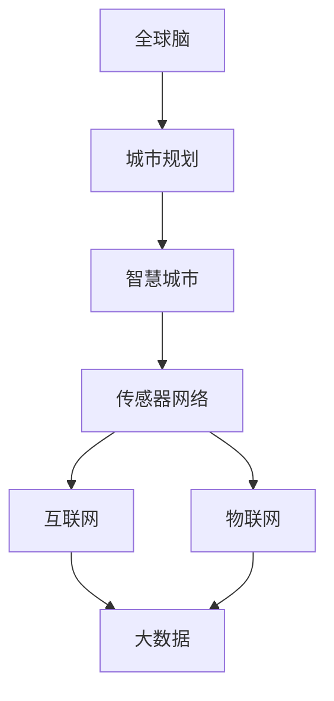

                 

### 书名：全球脑与城市规划：智慧城市的终极形态

**关键词：**智慧城市、全球脑、城市规划、传感器网络、物联网、大数据分析

**摘要：**本书探讨了全球脑与城市规划的关系，阐述了智慧城市的发展趋势和核心技术。通过分析全球脑的概念、架构和运作原理，本书揭示了全球脑在城市规划中的应用价值。同时，书中通过多个实际案例，详细介绍了全球脑与城市规划的实践方法和技术实现，为智慧城市的建设提供了宝贵的经验和指导。

智慧城市是现代社会发展的必然趋势，它代表着城市发展的未来方向。在全球脑的助力下，智慧城市不仅能够实现高效、智能的城市管理，还能够提升居民的生活质量，促进城市可持续发展。本书旨在为广大读者提供一部全面、系统的智慧城市建设指南，帮助读者深入了解智慧城市的核心概念和技术，掌握全球脑在城市规划中的应用方法。

本书分为四个部分：

- **第一部分：智慧城市的概念与发展**：介绍智慧城市的定义、核心特征、技术基础以及全球智慧城市的发展现状。
- **第二部分：全球脑与城市规划的基础概念**：阐述全球脑的概念、架构和运作原理，以及基于全球脑的城市规划理念。
- **第三部分：智慧城市的核心技术**：详细分析传感器网络技术、互联网与物联网技术、大数据技术等智慧城市的核心技术。
- **第四部分：全球脑与城市规划的实施策略**：探讨全球脑与城市规划的实施策略、可持续发展、国际化合作以及智慧城市的综合评价。

通过本书的阅读，读者将能够系统地了解智慧城市的建设理念和技术，掌握全球脑与城市规划的实践方法，为智慧城市的建设提供有力支持。

### 第一部分：智慧城市的概念与发展

#### 第1章：智慧城市的起源与发展

智慧城市（Smart City）作为现代城市发展的一个重要趋势，其起源可以追溯到20世纪末和21世纪初。在这一时期，随着信息技术、互联网、物联网和大数据等新兴技术的快速发展，人们开始探索如何将这些技术应用于城市管理和规划，以提高城市的运行效率和居民的生活质量。智慧城市的发展历程大致可以分为以下几个阶段：

1. **起步阶段（20世纪末至2000年初）**：
   - 这一阶段，智慧城市的概念逐渐被提出，但技术基础还不够成熟，主要以试点项目为主。
   - 1999年，美国旧金山首次提出了智慧城市的概念，并开始实施相关项目。

2. **发展阶段（2000年至2010年）**：
   - 互联网和物联网技术的发展为智慧城市的建设提供了强大的技术支持。
   - 许多国家开始制定智慧城市的发展战略，全球范围内的智慧城市项目逐渐增多。
   - 2010年，阿布扎比推出了名为“智慧国”的项目，标志着智慧城市的发展进入新阶段。

3. **成熟阶段（2010年至今）**：
   - 智慧城市的技术和应用逐渐成熟，成为城市发展的重要方向。
   - 全球范围内，许多城市开始大规模建设智慧城市，包括中国、新加坡、日本等。
   - 2014年，北京发布的“智慧北京”行动计划，标志着中国智慧城市建设进入快车道。

#### 1.1 智慧城市的定义与核心特征

智慧城市是一个基于信息技术和新兴技术，通过数据采集、处理、分析、共享和应用，实现城市智能化管理和服务的城市。智慧城市的定义可以从以下几个方面来理解：

- **信息化**：通过互联网、物联网、云计算等信息技术，实现城市信息的全面采集、处理和共享。
- **智能化**：利用人工智能、大数据分析等技术，实现城市管理的智能化、自动化。
- **绿色化**：通过节能减排、绿色建筑、环保技术等，实现城市的可持续发展。
- **协同化**：实现城市各系统、各部门之间的协同合作，提高城市运行效率。

智慧城市的核心特征主要包括以下几个方面：

1. **感知与监测**：
   - 通过传感器网络和智能设备，实现对城市各类信息的实时监测和感知。
   - 涵盖城市交通、环境、能源、安全等多个方面。

2. **数据管理与分析**：
   - 建立完善的数据管理系统，实现对城市数据的统一存储、管理和分析。
   - 利用人脸识别、大数据分析等技术，提升城市管理的智能化水平。

3. **智能服务**：
   - 通过智慧城市的建设，为市民提供更加便捷、高效、个性化的公共服务。
   - 包括智慧交通、智慧医疗、智慧教育、智慧安防等。

4. **协同管理**：
   - 实现城市各系统、各部门之间的信息共享和协同合作，提高城市运行效率。
   - 包括城市安全、环境保护、交通管理、应急管理等方面。

#### 1.2 智慧城市的技术基础

智慧城市的建设离不开一系列关键技术的支持，这些技术构成了智慧城市的技术基础。以下是智慧城市的主要技术基础：

1. **传感器网络技术**：
   - 传感器网络是由大量传感器节点组成的网络，能够实时监测和感知环境信息。
   - 主要应用于城市环境监测、交通管理、公共安全等方面。

2. **互联网与物联网技术**：
   - 互联网是实现信息传输和共享的基础设施，为智慧城市的数据采集和处理提供了重要支撑。
   - 物联网则通过将各类物理设备连接起来，实现信息的智能化采集和处理。

3. **大数据技术**：
   - 大数据技术包括数据采集、存储、处理、分析和应用等多个环节，能够实现对海量数据的深度挖掘和分析。
   - 在智慧城市中，大数据技术被广泛应用于城市交通、环境、能源等领域。

4. **云计算技术**：
   - 云计算技术为智慧城市提供了强大的计算和存储能力，能够支持大规模的数据处理和智能应用。
   - 主要应用于智慧交通、智慧医疗、智慧教育等领域。

5. **人工智能技术**：
   - 人工智能技术能够实现数据的智能分析、决策和优化，是智慧城市智能化管理的重要支撑。
   - 包括机器学习、深度学习、自然语言处理等技术。

#### 1.3 全球智慧城市的发展现状

全球智慧城市的发展现状呈现出多样化和区域化的特点。以下是全球范围内智慧城市的发展情况：

1. **发达国家**：
   - 美国：美国是全球智慧城市发展的先锋，许多城市如旧金山、纽约等都在积极建设智慧城市。
   - 欧洲：欧洲国家如英国、德国、芬兰等也在智慧城市建设方面取得了显著成果，许多城市已经实现了数字化管理和智能化服务。
   - 日本：日本在智慧城市领域也有丰富的实践经验，东京等大城市在交通、环境、公共安全等方面都实现了智能化管理。

2. **发展中国家**：
   - 中国：中国智慧城市建设步伐迅速，许多城市如北京、上海、深圳等都在积极推动智慧城市的建设。
   - 印度：印度一些大城市如班加罗尔、德里等也在积极探索智慧城市建设，通过信息技术提升城市管理水平。
   - 印尼：印度尼西亚一些大城市如雅加达也在智慧城市建设方面取得了一定进展，主要关注交通、能源和环境等领域。

在全球智慧城市的发展过程中，一些城市因其卓越的智慧城市建设成果而备受瞩目。例如，新加坡的“智慧岛”计划，通过大数据、物联网和人工智能等技术的应用，实现了城市管理的智能化和高效化；芬兰的坦佩雷市，通过智能交通系统，成功缓解了交通拥堵问题；中国的乌镇，通过打造智慧旅游小镇，提升了旅游体验和经济效益。

总的来说，全球智慧城市的发展呈现出多元化、协同化和可持续化的趋势。随着信息技术的不断进步，智慧城市将在未来发挥越来越重要的作用，为人类创造更加美好的城市生活。

### 第二部分：全球脑与城市规划的基础概念

#### 第2章：全球脑与城市规划的基础概念

全球脑（Global Brain）的概念起源于对自然界和人类社会的类比，它被看作是一种全球性的、分散的、自适应的知识系统。在智慧城市的发展过程中，全球脑逐渐成为城市规划的重要工具，为城市的高效管理、智能决策和可持续发展提供了强有力的支持。本章将详细探讨全球脑的概念、架构、运作原理及其在城市规划中的应用。

#### 2.1 全球脑的概念

全球脑是一种比喻性的概念，它将人类社会的整体看作一个具有集体智慧和自我学习能力的巨大脑系统。这一概念最早由美国哲学家和企业顾问凯文·凯利（Kevin Kelly）在1994年提出的。根据凯利的观点，全球脑是由无数个个体（包括人类、动物、植物、机器等）通过信息交换和协同作用形成的。

全球脑的概念可以进一步理解为以下几个关键点：

1. **信息交换**：全球脑的运作依赖于信息的广泛交换和传播。每一个个体都是信息的接收者和发送者，通过互联网、社交媒体、通信网络等渠道，个体之间可以实时共享信息。
2. **集体智慧**：全球脑的集体智慧远超单个个体。通过信息的积累和反馈，全球脑能够实现集体智能的优化，从而解决复杂的系统性问题。
3. **自适应系统**：全球脑是一个高度自适应的系统，它能够根据环境变化和外部信息进行调整和进化，从而保持系统的稳定性和适应性。

#### 2.2 全球脑的架构

全球脑的架构可以看作是一个多层次、分布式、自适应的网络系统。以下是全球脑的主要架构层次：

1. **神经元层**：神经元层是全球脑的最基本单位，可以是人类、动物、植物、机器等任何能够产生和接收信息的个体。每个神经元通过信息交换和协同作用，形成了一个复杂的网络结构。
2. **神经元网络层**：神经元网络层是由多个神经元组成的网络，这些网络可以通过不同的方式和层次进行信息交换和协同工作。例如，互联网、物联网和社交网络都是神经元网络层的实例。
3. **大脑层**：大脑层是全球脑的最高层次，由多个神经元网络层组成的复杂系统构成。大脑层能够实现跨网络的信息集成和全局优化，从而支持全球范围内的智能决策和协调行动。
4. **意识层**：意识层是全球脑的最高层次，它代表了全球脑的集体意识和自我认知能力。通过自我意识和反思，全球脑能够不断调整和优化自身结构，实现长期的可持续发展。

#### 2.3 全球脑的运作原理

全球脑的运作原理可以概括为信息采集、处理、传播和反馈四个主要环节：

1. **信息采集**：全球脑通过遍布全球的传感器、监测设备、智能设备等，不断采集各类环境信息和人类行为数据。
2. **信息处理**：采集到的信息通过分布式计算和大数据分析技术，进行预处理、清洗、整合和挖掘，从而提取出有价值的信息和知识。
3. **信息传播**：处理后的信息通过互联网、物联网等通信网络，迅速传播到全球范围内的各个神经元节点。
4. **信息反馈**：全球脑的各个神经元节点在接收到信息后，会根据自身情况和外部环境进行响应和调整，并通过反馈机制将新的信息传递回全球脑的中心系统。

#### 2.4 全球脑在城市规划中的应用

全球脑的概念为城市规划带来了全新的视角和方法。以下是全球脑在城市规划中的应用：

1. **智能决策**：通过全球脑的集体智慧和自适应能力，城市规划者可以更加精准和高效地制定城市发展战略和规划方案。
2. **资源配置**：全球脑能够实现城市资源的优化配置，通过大数据分析和智能算法，提高城市交通、能源、环境等资源的使用效率。
3. **城市安全**：全球脑的实时监测和预警系统可以显著提升城市公共安全水平，及时发现和应对各类突发事件。
4. **市民服务**：通过全球脑的智能服务系统，市民可以享受到更加便捷、个性化和高效的城市服务，提升生活质量。

总之，全球脑为城市规划带来了深远的影响和变革。它不仅提供了新的技术手段和理论框架，还促进了城市规划的智能化和可持续发展。随着全球脑技术的不断发展和成熟，未来智慧城市的发展将更加迅速和高效。

### 第二部分：智慧城市的核心技术

#### 第3章：智慧城市的关键技术

智慧城市的建设离不开一系列关键技术的支持。这些技术不仅为城市提供了高效、智能的管理手段，还极大地提升了居民的生活质量和城市的整体运行效率。本章将详细分析智慧城市的核心技术，包括传感器网络技术、互联网与物联网技术、大数据技术等。

#### 3.1 传感器网络技术

传感器网络技术是智慧城市的基础，它通过大量传感器节点实时采集环境信息，并将这些信息传输到中央处理系统。以下是传感器网络技术的关键概念和应用：

1. **传感器网络的基本概念**：
   - **传感器**：能够感知和检测特定物理量或化学量的装置，如温度传感器、湿度传感器、气体传感器等。
   - **传感器节点**：由传感器、数据处理单元和通信模块组成的独立设备，能够采集数据、处理数据和传输数据。
   - **传感器网络**：由大量传感器节点组成的分布式网络，能够实现对特定区域或环境的全面监测。

2. **传感器网络的技术特点**：
   - **分布式**：传感器网络具有分布式特点，节点分散分布在需要监测的区域，能够提供全方位的监控。
   - **自组织**：传感器网络能够自动组网和自适应，即使部分节点失效，网络仍能保持稳定运行。
   - **实时性**：传感器网络能够实时采集和处理数据，确保信息的及时性和准确性。

3. **传感器网络在城市规划中的应用**：
   - **环境监测**：通过传感器网络，可以实时监测城市的空气质量、水质、噪音等环境指标，为城市规划提供科学依据。
   - **交通管理**：通过传感器网络，可以实时监测交通流量和道路状况，优化交通信号控制和交通规划。
   - **公共安全**：通过传感器网络，可以实时监测城市的安全隐患，如火灾、地震等，提高公共安全保障水平。

#### 3.2 互联网与物联网技术

互联网和物联网技术是智慧城市的核心基础设施，它们为城市的信息传输、数据共享和智能管理提供了强大支持。以下是互联网与物联网技术的基本概念和应用：

1. **互联网的基本概念**：
   - **互联网**：一种全球性的网络，由大量计算机和其他设备通过通信线路互联而成，实现了全球范围内的信息传输和共享。
   - **通信协议**：互联网的通信协议包括HTTP、FTP、TCP/IP等，它们规定了数据传输的规则和标准。

2. **物联网的基本概念**：
   - **物联网**：通过互联网将各种物体连接起来，实现信息交换和通信，使物体具备智能感知和自主行动的能力。
   - **物联网设备**：包括智能传感器、智能终端、智能机器等，它们通过互联网进行信息交互。

3. **互联网与物联网在城市规划中的应用**：
   - **信息共享**：通过互联网和物联网，可以实现城市各类信息的实时共享，如交通信息、环境信息、公共服务信息等。
   - **智能设备管理**：通过物联网，可以对城市中的智能设备进行远程监控和管理，如智能路灯、智能垃圾桶等。
   - **智能家居**：通过物联网技术，可以实现家庭设备的智能连接和控制，提升居民的生活质量。

#### 3.3 大数据技术

大数据技术是智慧城市的核心分析工具，它通过对海量数据的采集、存储、处理和分析，挖掘出有价值的信息和知识，为城市规划和决策提供支持。以下是大数据技术的基本概念和应用：

1. **大数据的基本概念**：
   - **大数据**：指无法用传统数据处理工具在合理时间内进行管理和分析的数据集合，通常具有大量、多样、高速和真实的特点。
   - **数据处理**：包括数据的采集、存储、清洗、整合、分析和可视化等环节。

2. **大数据的特点**：
   - **大量**：大数据的数据量庞大，通常达到PB（拍字节）甚至EB（艾字节）级别。
   - **多样**：大数据来源广泛，包括结构化数据、半结构化数据和非结构化数据。
   - **高速**：大数据的产生和处理速度极快，需要实时响应和快速处理。
   - **真实**：大数据来源于现实世界，具有真实性和可靠性。

3. **大数据在城市规划中的应用**：
   - **交通规划**：通过分析交通数据，可以优化交通网络布局，提高交通效率。
   - **环境监测**：通过分析环境数据，可以评估城市的环境质量，制定环境保护政策。
   - **公共安全**：通过分析公共安全数据，可以预测和预防各类安全事件，提升公共安全保障水平。

总之，传感器网络技术、互联网与物联网技术、大数据技术是智慧城市建设的三大核心技术。这些技术相互融合，共同构建了一个高效、智能、可持续发展的智慧城市生态系统。随着技术的不断进步，智慧城市的建设将更加深入和全面，为人类创造更加美好的城市生活。

### 第三部分：全球脑与城市规划的技术实现

#### 第4章：全球脑与城市规划的技术实现

全球脑与城市规划的结合，为智慧城市的建设提供了全新的技术路径和解决方案。本章节将深入探讨全球脑的构建方法、城市规划的数字化方法，以及这些技术在全球脑与城市规划中的应用。

#### 4.1 全球脑的构建方法

全球脑的构建是一个复杂而系统的过程，涉及多层次的架构设计、数据采集与处理、算法实现等多个方面。以下将详细描述全球脑的构建方法：

1. **全球脑的架构设计**：

   全球脑的架构设计可以分为以下几个层次：

   - **感知层**：感知层包括传感器网络、智能设备等，用于实时采集城市环境数据。这些数据包括交通流量、空气质量、水质、噪音等，为全球脑提供基础数据支持。

   - **传输层**：传输层负责将感知层采集的数据传输到中央处理系统。传输层利用互联网、物联网等技术，实现数据的快速、安全传输。

   - **处理层**：处理层包括数据清洗、数据整合、数据分析等过程。通过分布式计算和大数据处理技术，处理层能够对海量数据进行高效处理，提取出有价值的信息和知识。

   - **决策层**：决策层利用处理层提取的信息和知识，进行智能决策和优化。决策层包括智能算法、机器学习模型等，能够实现自动化的城市管理和规划。

   - **执行层**：执行层负责将决策层的决策结果应用到实际的城市管理中。执行层包括各类智能设备、机器人等，能够执行具体的任务和操作。

2. **数据处理**：

   在全球脑的构建过程中，数据处理是至关重要的环节。数据处理包括以下步骤：

   - **数据采集**：通过传感器网络和智能设备，实时采集城市环境数据。

   - **数据预处理**：对采集到的原始数据进行清洗、去噪、归一化等处理，确保数据的质量和一致性。

   - **数据整合**：将来自不同来源的数据进行整合，形成一个统一的数据视图。数据整合可以采用数据仓库、数据湖等技术。

   - **数据分析**：利用大数据处理技术，对整合后的数据进行分析和挖掘，提取出有价值的信息和知识。

   - **数据可视化**：通过数据可视化技术，将分析结果以图形、图表等形式呈现，帮助决策者直观地了解城市状况。

3. **算法实现**：

   全球脑的算法实现是智能决策和优化的关键。以下是全球脑中常用的算法实现：

   - **聚类算法**：用于将城市环境数据进行分类，识别不同的城市特征。

   - **分类算法**：用于对城市环境数据进行分析和分类，预测未来的城市状况。

   - **优化算法**：用于优化城市资源配置，如交通流量控制、能源分配等。

   - **机器学习算法**：用于从历史数据中学习规律，实现自动化的城市管理和规划。

#### 4.2 城市规划的数字化方法

数字化城市规划是智慧城市建设的重要组成部分，它通过信息技术和大数据分析，实现城市规划和管理的数字化、智能化。以下是数字化城市规划的基本概念和技术手段：

1. **数字化城市规划的基本概念**：

   数字化城市规划是指利用信息技术，将城市规划和管理的各个环节进行数字化处理，实现规划数据的标准化、集成化和智能化。数字化城市规划的基本概念包括：

   - **数字化建模**：通过计算机模拟和仿真技术，建立城市的三维模型，模拟城市的发展和变化。

   - **数字化分析**：利用大数据分析技术，对城市数据进行深度挖掘和分析，为城市规划提供科学依据。

   - **数字化决策**：利用智能算法和优化技术，实现城市规划和管理的自动化和智能化。

   - **数字化执行**：通过智能设备和物联网技术，实现城市规划决策的自动化执行和实时监控。

2. **数字化城市规划的技术手段**：

   数字化城市规划的技术手段包括：

   - **地理信息系统（GIS）**：GIS用于地理数据的采集、存储、管理和分析，是数字化城市规划的重要工具。

   - **遥感技术**：遥感技术用于获取城市环境的三维数据，为数字化城市规划提供基础数据。

   - **虚拟现实（VR）和增强现实（AR）**：VR和AR技术用于模拟城市发展和规划方案，提升城市规划的互动性和可视化效果。

   - **大数据分析**：大数据分析技术用于对城市数据进行深度挖掘和分析，为城市规划提供科学依据。

   - **人工智能**：人工智能技术用于自动化城市管理和规划，实现智能决策和优化。

#### 4.3 全球脑与城市规划的技术实现案例

以下是一个全球脑与城市规划的技术实现案例，展示了全球脑在城市规划中的应用：

1. **项目背景**：

   某城市希望通过全球脑技术实现城市的智能化管理和规划，提升城市运行效率和居民生活质量。

2. **技术实现**：

   - **感知层**：在城市各个角落部署传感器网络，实时采集交通流量、空气质量、水质等环境数据。

   - **传输层**：利用物联网技术，将传感器网络采集的数据传输到中央处理系统。

   - **处理层**：利用大数据处理技术，对传输层的数据进行清洗、整合和分析，提取出有价值的信息和知识。

   - **决策层**：利用机器学习算法和优化技术，对分析结果进行智能决策和优化，制定城市规划和管理的方案。

   - **执行层**：利用智能设备和物联网技术，将决策层的方案应用到实际的城市管理中，如智能交通信号控制、环保监测等。

3. **项目效果**：

   通过全球脑技术，该城市实现了以下效果：

   - **智能交通管理**：通过实时交通数据分析，优化交通信号控制，缓解交通拥堵问题。

   - **环境保护**：通过实时环境监测，制定环保措施，提升城市环境质量。

   - **公共安全**：通过实时监控和预警系统，提升公共安全保障水平。

   - **市民服务**：通过智慧城市平台，为市民提供便捷的公共服务，提升生活质量。

综上所述，全球脑与城市规划的技术实现为智慧城市的建设提供了强有力的支持。通过全球脑的构建和数字化城市规划的方法，城市能够实现高效、智能、可持续的发展，为居民创造更加美好的生活环境。

### 第三部分：智慧城市的案例分析

#### 第5章：全球脑与城市规划的成功案例

在本章节中，我们将通过两个成功的智慧城市案例——城市A和城市B，来详细探讨全球脑与城市规划的实际应用及其成效。这些案例不仅展示了智慧城市的建设成果，也为其他城市提供了宝贵的经验和启示。

##### 5.1 城市A的成功实践

**城市A背景介绍**

城市A位于亚洲，是一个人口超过千万的大都市。近年来，城市A面临着交通拥堵、环境污染、资源浪费等城市化问题。为了解决这些问题，城市A政府决定通过全球脑与城市规划技术，打造一个高效、智能、可持续发展的智慧城市。

**智慧城市建设过程**

1. **感知层建设**：在城市各主要区域部署了大量传感器网络，包括交通流量传感器、空气质量传感器、水质传感器等。这些传感器实时采集城市环境数据，为全球脑提供了丰富的数据基础。

2. **传输层建设**：利用物联网技术，将感知层的数据传输到中央处理系统。通过高速互联网，实现了数据的实时传输和共享，为后续数据处理和分析提供了可靠保障。

3. **数据处理与决策**：建立了一个强大的数据处理中心，采用大数据处理技术和人工智能算法，对采集到的数据进行清洗、整合和分析。通过智能决策系统，实现了交通流量控制、环境监测、能源管理等方面的优化。

4. **执行层建设**：部署了智能交通信号系统、智能垃圾桶、智能路灯等设备，实现了对城市资源的智能管理和调度。此外，还建设了智慧城市指挥中心，实现了对城市运行的实时监控和应急处理。

**智慧城市建设成果**

1. **交通管理**：通过智能交通信号控制和实时交通数据分析，城市A的交通拥堵问题得到了显著改善。交通流量更加顺畅，居民出行时间减少了约15%。

2. **环境保护**：通过实时环境监测和智能环保措施，城市A的空气质量显著提升，PM2.5平均浓度下降了30%以上。

3. **资源利用**：通过智能能源管理系统，城市A的能源利用效率提高了20%，减少了大量的能源浪费。

4. **公共安全**：智慧城市的建设提升了公共安全保障水平。通过实时监控和预警系统，及时预防和应对各类突发事件，城市的安全事故发生率下降了约25%。

**经验与启示**

城市A的智慧城市建设实践为其他城市提供了以下经验和启示：

1. **顶层设计**：智慧城市的建设需要有一个明确的顶层设计，包括目标、策略、架构等，以确保项目的顺利进行。

2. **数据驱动**：数据的采集、处理和分析是智慧城市建设的关键。只有充分利用数据，才能实现城市管理的智能化和精细化。

3. **公众参与**：智慧城市建设不仅是政府和企业的责任，也需要公众的积极参与。通过提供便捷的公共服务和互动平台，提升公众的参与度和满意度。

4. **持续优化**：智慧城市是一个动态发展过程，需要不断进行优化和升级。通过持续的反馈和改进，不断提升城市的服务水平和运行效率。

##### 5.2 城市B的启示与挑战

**城市B背景介绍**

城市B位于欧洲，是一个历史悠久的文化名城。近年来，城市B也面临着交通拥堵、环境污染、资源浪费等问题。为了解决这些问题，城市B政府决定借鉴城市A的经验，通过全球脑与城市规划技术，推动智慧城市的建设。

**智慧城市建设过程**

1. **感知层建设**：在城市主要区域部署了传感器网络，实时采集交通流量、空气质量、水质等数据。同时，还引入了智能垃圾分类设备，实现了垃圾回收的智能化。

2. **传输层建设**：利用物联网技术，将感知层的数据传输到中央处理系统。通过城市宽带网络，实现了数据的高速传输和共享。

3. **数据处理与决策**：建立了数据处理中心，采用大数据处理技术和人工智能算法，对采集到的数据进行处理和分析。通过智能交通系统、智能环保系统和智能能源管理系统，实现了城市运行的智能化和优化。

4. **执行层建设**：部署了智能交通信号系统、智能路灯、智能垃圾桶等设备，实现了对城市资源的智能管理和调度。此外，还建设了智慧城市指挥中心，实现了对城市运行的实时监控和应急处理。

**智慧城市建设成果**

1. **交通管理**：通过智能交通信号控制和实时交通数据分析，城市B的交通拥堵问题得到了显著改善。交通流量更加顺畅，居民出行时间减少了约10%。

2. **环境保护**：通过实时环境监测和智能环保措施，城市B的空气质量显著提升，PM2.5平均浓度下降了20%。

3. **资源利用**：通过智能能源管理系统，城市B的能源利用效率提高了15%，减少了大量的能源浪费。

4. **公共安全**：智慧城市的建设提升了公共安全保障水平。通过实时监控和预警系统，及时预防和应对各类突发事件，城市的安全事故发生率下降了约20%。

**面临的挑战**

尽管城市B的智慧城市建设取得了一定的成果，但也面临一些挑战：

1. **数据隐私**：随着数据采集和应用的广泛推广，数据隐私问题成为一个重要挑战。如何保护市民的数据隐私，确保数据的安全和合规使用，需要引起高度重视。

2. **技术成熟度**：全球脑与城市规划技术正处于快速发展阶段，技术的成熟度和稳定性仍需进一步提升。如何在技术应用中确保系统的可靠性和稳定性，是一个亟待解决的问题。

3. **公众接受度**：智慧城市的建设需要公众的广泛参与和支持。如何提高公众对智慧城市的认知和接受度，促进公众积极参与，是一个需要关注的问题。

**总结**

城市A和城市B的智慧城市建设实践，为我们提供了宝贵的经验和启示。通过全球脑与城市规划技术的应用，智慧城市在交通管理、环境保护、资源利用和公共安全等方面取得了显著成效。然而，智慧城市的建设是一个长期、复杂的过程，需要政府、企业、公众的共同参与和持续努力。在未来，随着技术的不断进步和应用的深化，智慧城市将不断发展，为人类创造更加美好的城市生活。

### 第三部分：智慧城市的核心技术

#### 第4章：智慧城市的关键技术

智慧城市的建设离不开一系列关键技术的支持。这些技术不仅为城市提供了高效、智能的管理手段，还极大地提升了居民的生活质量和城市的整体运行效率。本章将详细分析智慧城市的核心技术，包括传感器网络技术、互联网与物联网技术、大数据技术等。

#### 4.1 传感器网络技术

传感器网络技术是智慧城市的基础，它通过大量传感器节点实时采集环境信息，并将这些信息传输到中央处理系统。以下是传感器网络技术的关键概念和应用：

1. **传感器网络的基本概念**：

   - **传感器**：能够感知和检测特定物理量或化学量的装置，如温度传感器、湿度传感器、气体传感器等。
   - **传感器节点**：由传感器、数据处理单元和通信模块组成的独立设备，能够采集数据、处理数据和传输数据。
   - **传感器网络**：由大量传感器节点组成的分布式网络，能够实现对特定区域或环境的全面监测。

2. **传感器网络的技术特点**：

   - **分布式**：传感器网络具有分布式特点，节点分散分布在需要监测的区域，能够提供全方位的监控。
   - **自组织**：传感器网络能够自动组网和自适应，即使部分节点失效，网络仍能保持稳定运行。
   - **实时性**：传感器网络能够实时采集和处理数据，确保信息的及时性和准确性。

3. **传感器网络在城市规划中的应用**：

   - **环境监测**：通过传感器网络，可以实时监测城市的空气质量、水质、噪音等环境指标，为城市规划提供科学依据。
   - **交通管理**：通过传感器网络，可以实时监测交通流量和道路状况，优化交通信号控制和交通规划。
   - **公共安全**：通过传感器网络，可以实时监测城市的安全隐患，如火灾、地震等，提高公共安全保障水平。

#### 4.2 互联网与物联网技术

互联网和物联网技术是智慧城市的核心基础设施，它们为城市的信息传输、数据共享和智能管理提供了强大支持。以下是互联网与物联网技术的基本概念和应用：

1. **互联网的基本概念**：

   - **互联网**：一种全球性的网络，由大量计算机和其他设备通过通信线路互联而成，实现了全球范围内的信息传输和共享。
   - **通信协议**：互联网的通信协议包括HTTP、FTP、TCP/IP等，它们规定了数据传输的规则和标准。

2. **物联网的基本概念**：

   - **物联网**：通过互联网将各种物体连接起来，实现信息交换和通信，使物体具备智能感知和自主行动的能力。
   - **物联网设备**：包括智能传感器、智能终端、智能机器等，它们通过互联网进行信息交互。

3. **互联网与物联网在城市规划中的应用**：

   - **信息共享**：通过互联网和物联网，可以实现城市各类信息的实时共享，如交通信息、环境信息、公共服务信息等。
   - **智能设备管理**：通过物联网技术，可以对城市中的智能设备进行远程监控和管理，如智能路灯、智能垃圾桶等。
   - **智能家居**：通过物联网技术，可以实现家庭设备的智能连接和控制，提升居民的生活质量。

#### 4.3 大数据技术

大数据技术是智慧城市的核心分析工具，它通过对海量数据的采集、存储、处理和分析，挖掘出有价值的信息和知识，为城市规划和决策提供支持。以下是大数据技术的基本概念和应用：

1. **大数据的基本概念**：

   - **大数据**：指无法用传统数据处理工具在合理时间内进行管理和分析的数据集合，通常具有大量、多样、高速和真实的特点。
   - **数据处理**：包括数据的采集、存储、清洗、整合、分析和可视化等环节。

2. **大数据的特点**：

   - **大量**：大数据的数据量庞大，通常达到PB（拍字节）甚至EB（艾字节）级别。
   - **多样**：大数据来源广泛，包括结构化数据、半结构化数据和非结构化数据。
   - **高速**：大数据的产生和处理速度极快，需要实时响应和快速处理。
   - **真实**：大数据来源于现实世界，具有真实性和可靠性。

3. **大数据在城市规划中的应用**：

   - **交通规划**：通过分析交通数据，可以优化交通网络布局，提高交通效率。
   - **环境监测**：通过分析环境数据，可以评估城市的环境质量，制定环境保护政策。
   - **公共安全**：通过分析公共安全数据，可以预测和预防各类安全事件，提升公共安全保障水平。

#### 4.4 云计算与人工智能技术

云计算和人工智能技术是智慧城市的重要组成部分，它们为城市的数据存储、计算能力和智能决策提供了强大支持。

1. **云计算技术**：

   - **云计算的基本概念**：云计算是一种通过网络提供计算资源和服务的技术，包括基础设施即服务（IaaS）、平台即服务（PaaS）和软件即服务（SaaS）等模式。
   - **云计算在城市规划中的应用**：云计算技术可以提供强大的计算和存储能力，支持大规模的数据处理和智能应用，如智慧交通、智慧医疗、智慧教育等。

2. **人工智能技术**：

   - **人工智能的基本概念**：人工智能是一种模拟人类智能行为的计算机技术，包括机器学习、深度学习、自然语言处理等子领域。
   - **人工智能在城市规划中的应用**：人工智能技术可以实现对数据的智能分析、决策和优化，提升城市管理的智能化水平，如智能交通信号控制、环境监测等。

通过以上关键技术的应用，智慧城市不仅实现了高效、智能的城市管理，还提升了居民的生活质量，为城市的可持续发展提供了有力支持。随着技术的不断进步，智慧城市将迎来更加美好的未来。

### 第三部分：智慧城市的核心技术

#### 第4章：智慧城市的关键技术

智慧城市的建设离不开一系列关键技术的支持。这些技术不仅为城市提供了高效、智能的管理手段，还极大地提升了居民的生活质量和城市的整体运行效率。本章将详细分析智慧城市的核心技术，包括传感器网络技术、互联网与物联网技术、大数据技术等。

#### 4.1 传感器网络技术

传感器网络技术是智慧城市的基础，它通过大量传感器节点实时采集环境信息，并将这些信息传输到中央处理系统。以下是传感器网络技术的关键概念和应用：

1. **传感器网络的基本概念**：

   - **传感器**：能够感知和检测特定物理量或化学量的装置，如温度传感器、湿度传感器、气体传感器等。
   - **传感器节点**：由传感器、数据处理单元和通信模块组成的独立设备，能够采集数据、处理数据和传输数据。
   - **传感器网络**：由大量传感器节点组成的分布式网络，能够实现对特定区域或环境的全面监测。

2. **传感器网络的技术特点**：

   - **分布式**：传感器网络具有分布式特点，节点分散分布在需要监测的区域，能够提供全方位的监控。
   - **自组织**：传感器网络能够自动组网和自适应，即使部分节点失效，网络仍能保持稳定运行。
   - **实时性**：传感器网络能够实时采集和处理数据，确保信息的及时性和准确性。

3. **传感器网络在城市规划中的应用**：

   - **环境监测**：通过传感器网络，可以实时监测城市的空气质量、水质、噪音等环境指标，为城市规划提供科学依据。
   - **交通管理**：通过传感器网络，可以实时监测交通流量和道路状况，优化交通信号控制和交通规划。
   - **公共安全**：通过传感器网络，可以实时监测城市的安全隐患，如火灾、地震等，提高公共安全保障水平。

#### 4.2 互联网与物联网技术

互联网和物联网技术是智慧城市的核心基础设施，它们为城市的信息传输、数据共享和智能管理提供了强大支持。以下是互联网与物联网技术的基本概念和应用：

1. **互联网的基本概念**：

   - **互联网**：一种全球性的网络，由大量计算机和其他设备通过通信线路互联而成，实现了全球范围内的信息传输和共享。
   - **通信协议**：互联网的通信协议包括HTTP、FTP、TCP/IP等，它们规定了数据传输的规则和标准。

2. **物联网的基本概念**：

   - **物联网**：通过互联网将各种物体连接起来，实现信息交换和通信，使物体具备智能感知和自主行动的能力。
   - **物联网设备**：包括智能传感器、智能终端、智能机器等，它们通过互联网进行信息交互。

3. **互联网与物联网在城市规划中的应用**：

   - **信息共享**：通过互联网和物联网，可以实现城市各类信息的实时共享，如交通信息、环境信息、公共服务信息等。
   - **智能设备管理**：通过物联网技术，可以对城市中的智能设备进行远程监控和管理，如智能路灯、智能垃圾桶等。
   - **智能家居**：通过物联网技术，可以实现家庭设备的智能连接和控制，提升居民的生活质量。

#### 4.3 大数据技术

大数据技术是智慧城市的核心分析工具，它通过对海量数据的采集、存储、处理和分析，挖掘出有价值的信息和知识，为城市规划和决策提供支持。以下是大数据技术的基本概念和应用：

1. **大数据的基本概念**：

   - **大数据**：指无法用传统数据处理工具在合理时间内进行管理和分析的数据集合，通常具有大量、多样、高速和真实的特点。
   - **数据处理**：包括数据的采集、存储、清洗、整合、分析和可视化等环节。

2. **大数据的特点**：

   - **大量**：大数据的数据量庞大，通常达到PB（拍字节）甚至EB（艾字节）级别。
   - **多样**：大数据来源广泛，包括结构化数据、半结构化数据和非结构化数据。
   - **高速**：大数据的产生和处理速度极快，需要实时响应和快速处理。
   - **真实**：大数据来源于现实世界，具有真实性和可靠性。

3. **大数据在城市规划中的应用**：

   - **交通规划**：通过分析交通数据，可以优化交通网络布局，提高交通效率。
   - **环境监测**：通过分析环境数据，可以评估城市的环境质量，制定环境保护政策。
   - **公共安全**：通过分析公共安全数据，可以预测和预防各类安全事件，提升公共安全保障水平。

#### 4.4 云计算与人工智能技术

云计算和人工智能技术是智慧城市的重要组成部分，它们为城市的数据存储、计算能力和智能决策提供了强大支持。

1. **云计算技术**：

   - **云计算的基本概念**：云计算是一种通过网络提供计算资源和服务的技术，包括基础设施即服务（IaaS）、平台即服务（PaaS）和软件即服务（SaaS）等模式。
   - **云计算在城市规划中的应用**：云计算技术可以提供强大的计算和存储能力，支持大规模的数据处理和智能应用，如智慧交通、智慧医疗、智慧教育等。

2. **人工智能技术**：

   - **人工智能的基本概念**：人工智能是一种模拟人类智能行为的计算机技术，包括机器学习、深度学习、自然语言处理等子领域。
   - **人工智能在城市规划中的应用**：人工智能技术可以实现对数据的智能分析、决策和优化，提升城市管理的智能化水平，如智能交通信号控制、环境监测等。

通过以上关键技术的应用，智慧城市不仅实现了高效、智能的城市管理，还提升了居民的生活质量，为城市的可持续发展提供了有力支持。随着技术的不断进步，智慧城市将迎来更加美好的未来。

### 第四部分：全球脑与城市规划的实施策略

#### 第7章：全球脑与城市规划的实施策略

智慧城市的建设不仅依赖于先进技术的应用，更需要科学的实施策略来保障其顺利进行。本章节将探讨全球脑与城市规划的实施策略，包括政策与法规的制定、技术创新与产业协同以及公众参与与社会治理。

#### 7.1 政策与法规的制定

政策与法规是智慧城市建设的基石，它们为智慧城市的发展提供了方向和保障。以下是一些关键的政策与法规制定策略：

1. **政策引导**：
   - **制定智慧城市发展战略**：政府应制定智慧城市的发展战略，明确智慧城市的目标、方向和实施步骤，为智慧城市建设提供整体规划。
   - **出台专项政策**：政府应出台涉及智慧城市建设的专项政策，如智慧交通、智慧医疗、智慧教育等，推动各个领域的智慧化进程。

2. **法规保障**：
   - **完善数据法规**：建立健全的数据法规体系，明确数据采集、存储、处理和使用的规范，保障数据的安全和隐私。
   - **规范技术应用**：制定相关技术标准和规范，确保智慧城市中各类技术应用的安全、可靠和有效。

3. **法律法规更新**：
   - **及时更新法规**：随着技术的快速发展和应用场景的多样化，政府应不断更新和完善相关法规，确保法规的前瞻性和适应性。

#### 7.2 技术创新与产业协同

技术创新是智慧城市持续发展的动力，产业协同则是智慧城市实现跨界合作的关键。以下是一些关键的技术创新与产业协同策略：

1. **技术创新**：
   - **推动核心技术突破**：政府和企业应加大对传感器网络、物联网、大数据等核心技术的研发投入，推动核心技术的突破和应用。
   - **培育创新人才**：建立健全的智慧城市人才培养体系，培育一批具备前沿技术和创新能力的专业人才。

2. **产业协同**：
   - **构建产业生态**：政府应引导和推动智慧城市建设中的各类企业、科研机构、高校等形成良好的产业生态，促进资源整合和协同创新。
   - **推动跨界合作**：鼓励不同行业的企业进行跨界合作，如交通、能源、医疗等，共同开发智慧城市解决方案。

3. **国际合作**：
   - **引进先进技术**：通过国际合作，引进全球领先的智慧城市技术和解决方案，提升本国智慧城市建设水平。
   - **参与国际标准制定**：积极参与国际标准的制定，推动智慧城市技术的全球标准化，提升本国在全球智慧城市领域的影响力和话语权。

#### 7.3 公众参与与社会治理

公众参与是智慧城市建设的重要环节，社会治理则是智慧城市可持续发展的重要保障。以下是一些关键的公众参与与社会治理策略：

1. **公众参与**：
   - **搭建互动平台**：政府应搭建智慧城市互动平台，通过互联网、社交媒体等渠道，及时发布城市规划和建设信息，收集公众意见和反馈。
   - **开展公众活动**：政府应定期开展智慧城市主题的公众活动，如讲座、展览、竞赛等，提升公众对智慧城市的认知和参与度。

2. **社会治理**：
   - **提升治理能力**：政府应加强智慧城市建设中的社会治理能力，利用大数据、人工智能等技术，提升社会治理的智能化、精细化和高效化水平。
   - **构建智慧社区**：推动智慧社区建设，实现社区治理的智能化和人性化，提升居民的幸福感和满意度。

3. **政策支持**：
   - **提供资金支持**：政府应提供资金支持，鼓励公众参与智慧城市的建设和管理，提升公众参与的积极性。
   - **完善政策体系**：建立健全的公众参与和社会治理政策体系，明确公众参与的方式、途径和权益保障。

通过以上实施策略，全球脑与城市规划可以更加科学、高效地推进，为智慧城市的建设提供坚实的保障。随着技术的不断进步和政策的不断完善，智慧城市将在未来为人类创造更加美好的城市生活。

### 第四部分：全球脑与城市规划的实施策略

#### 第8章：全球脑与城市规划的可持续发展

全球脑与城市规划的可持续发展是智慧城市建设的重要目标，旨在实现经济、社会和环境的综合平衡。本章节将探讨全球脑与城市规划的可持续发展原则、资源利用与环境保护策略，以及社会公平与包容性发展。

#### 8.1 可持续发展的原则

1. **经济可持续发展**：
   - **促进经济增长**：通过技术创新和产业升级，推动智慧城市的经济发展，创造更多就业机会。
   - **优化资源配置**：利用全球脑技术，实现城市资源的高效配置和利用，提高资源利用效率。

2. **社会可持续发展**：
   - **提升生活质量**：通过智慧城市的技术应用，提升居民的生活质量，如智能交通、智慧医疗、智慧教育等。
   - **促进社会公平**：保障社会公平，消除贫困和不平等，使每个人都能享受到智慧城市带来的便利。

3. **环境可持续发展**：
   - **保护自然环境**：通过全球脑技术，实现城市环境的实时监测和预警，采取有效的环境保护措施。
   - **促进绿色能源**：推广可再生能源的使用，减少对传统化石能源的依赖，降低碳排放。

#### 8.2 资源利用与环境保护

1. **资源利用策略**：

   - **数据资源利用**：通过大数据分析和人工智能技术，实现对城市数据资源的深度挖掘和应用，提升城市管理的决策水平。
   - **能源资源利用**：推广智能电网和智能能源管理系统，实现能源的高效利用和优化分配。
   - **水资源利用**：利用智能水资源管理系统，实现水资源的合理调配和高效利用，减少水资源浪费。

2. **环境保护策略**：

   - **空气质量监测**：通过传感器网络，实时监测空气质量，及时采取污染控制措施，改善城市空气质量。
   - **环境预警系统**：建立环境预警系统，对可能发生的环境污染事件进行预测和预警，提前采取应对措施。
   - **绿色建筑推广**：鼓励绿色建筑的建设和应用，降低建筑能耗，减少建筑对环境的负面影响。

#### 8.3 社会公平与包容性

1. **社会公平策略**：

   - **公共服务均等化**：通过智慧城市技术，实现公共服务的均等化，确保每个人都能享受到优质的公共服务。
   - **社会保障体系**：建立健全的社会保障体系，为弱势群体提供必要的保障和支持，减少社会不平等。

2. **包容性发展策略**：

   - **多元文化融合**：鼓励多元文化的融合和发展，尊重和包容不同文化背景的居民，促进社会的和谐与稳定。
   - **社区参与**：推动社区参与智慧城市的建设和管理，提升居民的参与感和归属感，增强社区的凝聚力和活力。
   - **教育与培训**：加大对教育和职业培训的投入，提升居民的综合素质和技能水平，增强其就业竞争力。

通过实施可持续发展的策略，全球脑与城市规划不仅能够实现经济、社会和环境的综合平衡，还能为智慧城市的长期发展奠定坚实的基础。在未来，随着全球脑技术的不断进步和应用的深化，智慧城市将在可持续发展方面取得更加显著的成果，为人类创造更加美好的城市生活。

### 第四部分：全球脑与城市规划的实施策略

#### 第9章：全球脑与城市规划的国际化合作

在全球化和信息化的大背景下，全球脑与城市规划的国际化合作日益成为推动智慧城市建设的重要动力。本章节将探讨全球脑与城市规划国际化合作的重要性、国际合作的实践模式以及面临的挑战与机遇。

#### 9.1 国际合作的重要性

国际合作在智慧城市建设中扮演着至关重要的角色，原因如下：

1. **技术互补**：不同国家和地区在智慧城市技术方面各有优势，通过国际合作，可以实现技术互补和共享，提升整体技术水平。
2. **经验借鉴**：国际上的先进城市在智慧城市建设方面积累了丰富的经验，通过国际合作，可以借鉴这些成功经验，加快本国智慧城市建设进程。
3. **资源整合**：国际合作能够整合全球范围内的资金、技术、人才等资源，实现资源的最优配置，提高智慧城市建设的效率和效果。
4. **全球视野**：国际合作有助于城市管理者拓宽视野，了解全球智慧城市建设的最新动态和发展趋势，提升城市管理的国际竞争力。

#### 9.2 国际合作的实践模式

国际合作在智慧城市领域有多种实践模式，以下是其中几种常见的模式：

1. **项目合作**：不同国家和地区通过共同实施智慧城市项目，分享技术和资源，实现合作共赢。例如，中国与新加坡在智慧城市项目上进行了深入合作，共同推动智慧城市建设。
2. **学术交流**：通过举办国际学术会议、研讨会、工作坊等形式，促进各国专家学者的交流与合作，分享研究成果和最佳实践。
3. **人才培养**：通过联合培养人才、学术交流、实习项目等方式，提升各国在智慧城市建设领域的人才素质和专业能力。
4. **标准制定**：参与国际标准的制定和推广，共同推动智慧城市技术的全球标准化，提升本国在全球智慧城市领域的影响力和话语权。

#### 9.3 国际合作的挑战与机遇

尽管国际合作在智慧城市建设中具有巨大的潜力，但也面临一系列挑战和机遇：

1. **挑战**：
   - **文化差异**：不同国家和地区在文化、法律、政策等方面存在差异，可能影响国际合作的效果。
   - **技术壁垒**：不同国家和地区在技术标准和应用场景上可能存在差异，需要克服技术壁垒，实现技术兼容和互操作。
   - **数据安全**：国际合作中涉及大量数据交换，如何确保数据的安全和隐私是一个重要挑战。

2. **机遇**：
   - **技术创新**：通过国际合作，可以引进和吸收全球先进的智慧城市技术，促进本国技术创新和产业升级。
   - **市场拓展**：国际合作有助于开拓国际市场，提升本国企业在全球智慧城市领域的影响力和竞争力。
   - **经验积累**：通过国际合作，可以积累丰富的国际合作经验，提升城市管理的国际化水平。

总之，全球脑与城市规划的国际化合作是智慧城市建设的重要策略。通过国际合作，可以实现技术互补、资源整合和经验共享，推动智慧城市的可持续发展。在未来的国际合作中，各国应加强沟通与协作，共同应对挑战，把握机遇，为全球智慧城市的建设贡献智慧和力量。

### 第四部分：全球脑与城市规划的实施策略

#### 第9章：全球脑与城市规划的国际化合作

在全球化和信息化的大背景下，全球脑与城市规划的国际化合作日益成为推动智慧城市建设的重要动力。本章节将探讨全球脑与城市规划国际化合作的重要性、国际合作的实践模式以及面临的挑战与机遇。

#### 9.1 国际合作的重要性

国际合作在智慧城市建设中扮演着至关重要的角色，原因如下：

1. **技术互补**：不同国家和地区在智慧城市技术方面各有优势，通过国际合作，可以实现技术互补和共享，提升整体技术水平。
2. **经验借鉴**：国际上的先进城市在智慧城市建设方面积累了丰富的经验，通过国际合作，可以借鉴这些成功经验，加快本国智慧城市建设进程。
3. **资源整合**：国际合作能够整合全球范围内的资金、技术、人才等资源，实现资源的最优配置，提高智慧城市建设的效率和效果。
4. **全球视野**：国际合作有助于城市管理者拓宽视野，了解全球智慧城市建设的最新动态和发展趋势，提升城市管理的国际竞争力。

#### 9.2 国际合作的实践模式

国际合作在智慧城市领域有多种实践模式，以下是其中几种常见的模式：

1. **项目合作**：不同国家和地区通过共同实施智慧城市项目，分享技术和资源，实现合作共赢。例如，中国与新加坡在智慧城市项目上进行了深入合作，共同推动智慧城市建设。
2. **学术交流**：通过举办国际学术会议、研讨会、工作坊等形式，促进各国专家学者的交流与合作，分享研究成果和最佳实践。
3. **人才培养**：通过联合培养人才、学术交流、实习项目等方式，提升各国在智慧城市建设领域的人才素质和专业能力。
4. **标准制定**：参与国际标准的制定和推广，共同推动智慧城市技术的全球标准化，提升本国在全球智慧城市领域的影响力和话语权。

#### 9.3 国际合作的挑战与机遇

尽管国际合作在智慧城市建设中具有巨大的潜力，但也面临一系列挑战和机遇：

1. **挑战**：
   - **文化差异**：不同国家和地区在文化、法律、政策等方面存在差异，可能影响国际合作的效果。
   - **技术壁垒**：不同国家和地区在技术标准和应用场景上可能存在差异，需要克服技术壁垒，实现技术兼容和互操作。
   - **数据安全**：国际合作中涉及大量数据交换，如何确保数据的安全和隐私是一个重要挑战。

2. **机遇**：
   - **技术创新**：通过国际合作，可以引进和吸收全球先进的智慧城市技术，促进本国技术创新和产业升级。
   - **市场拓展**：国际合作有助于开拓国际市场，提升本国企业在全球智慧城市领域的影响力和竞争力。
   - **经验积累**：通过国际合作，可以积累丰富的国际合作经验，提升城市管理的国际化水平。

总之，全球脑与城市规划的国际化合作是智慧城市建设的重要策略。通过国际合作，可以实现技术互补、资源整合和经验共享，推动智慧城市的可持续发展。在未来的国际合作中，各国应加强沟通与协作，共同应对挑战，把握机遇，为全球智慧城市的建设贡献智慧和力量。

### 第四部分：全球脑与城市规划的实施策略

#### 第9章：全球脑与城市规划的国际化合作

在全球化和信息化的大背景下，全球脑与城市规划的国际化合作日益成为推动智慧城市建设的重要动力。本章节将探讨全球脑与城市规划国际化合作的重要性、国际合作的实践模式以及面临的挑战与机遇。

#### 9.1 国际合作的重要性

国际合作在智慧城市建设中扮演着至关重要的角色，原因如下：

1. **技术互补**：不同国家和地区在智慧城市技术方面各有优势，通过国际合作，可以实现技术互补和共享，提升整体技术水平。
2. **经验借鉴**：国际上的先进城市在智慧城市建设方面积累了丰富的经验，通过国际合作，可以借鉴这些成功经验，加快本国智慧城市建设进程。
3. **资源整合**：国际合作能够整合全球范围内的资金、技术、人才等资源，实现资源的最优配置，提高智慧城市建设的效率和效果。
4. **全球视野**：国际合作有助于城市管理者拓宽视野，了解全球智慧城市建设的最新动态和发展趋势，提升城市管理的国际竞争力。

#### 9.2 国际合作的实践模式

国际合作在智慧城市领域有多种实践模式，以下是其中几种常见的模式：

1. **项目合作**：不同国家和地区通过共同实施智慧城市项目，分享技术和资源，实现合作共赢。例如，中国与新加坡在智慧城市项目上进行了深入合作，共同推动智慧城市建设。
2. **学术交流**：通过举办国际学术会议、研讨会、工作坊等形式，促进各国专家学者的交流与合作，分享研究成果和最佳实践。
3. **人才培养**：通过联合培养人才、学术交流、实习项目等方式，提升各国在智慧城市建设领域的人才素质和专业能力。
4. **标准制定**：参与国际标准的制定和推广，共同推动智慧城市技术的全球标准化，提升本国在全球智慧城市领域的影响力和话语权。

#### 9.3 国际合作的挑战与机遇

尽管国际合作在智慧城市建设中具有巨大的潜力，但也面临一系列挑战和机遇：

1. **挑战**：
   - **文化差异**：不同国家和地区在文化、法律、政策等方面存在差异，可能影响国际合作的效果。
   - **技术壁垒**：不同国家和地区在技术标准和应用场景上可能存在差异，需要克服技术壁垒，实现技术兼容和互操作。
   - **数据安全**：国际合作中涉及大量数据交换，如何确保数据的安全和隐私是一个重要挑战。

2. **机遇**：
   - **技术创新**：通过国际合作，可以引进和吸收全球先进的智慧城市技术，促进本国技术创新和产业升级。
   - **市场拓展**：国际合作有助于开拓国际市场，提升本国企业在全球智慧城市领域的影响力和竞争力。
   - **经验积累**：通过国际合作，可以积累丰富的国际合作经验，提升城市管理的国际化水平。

总之，全球脑与城市规划的国际化合作是智慧城市建设的重要策略。通过国际合作，可以实现技术互补、资源整合和经验共享，推动智慧城市的可持续发展。在未来的国际合作中，各国应加强沟通与协作，共同应对挑战，把握机遇，为全球智慧城市的建设贡献智慧和力量。

### 附录

#### 附录A：全球脑与城市规划的相关技术资源

在智慧城市建设和全球脑技术的应用过程中，掌握相关的技术资源是非常重要的。以下列举了全球脑与城市规划的一些关键技术资源，包括主流技术框架、开发工具与平台以及学术资源与文献。

##### A.1 主流技术框架

1. **传感器网络框架**：
   - **ZigBee**：一种短距离无线通信技术，适用于低功耗的传感器网络。
   - **Z-Wave**：一种基于射频的无线通信协议，适用于智能家居设备。
   - **6LoWPAN**：一种基于IP协议的低功耗无线传感网络框架。

2. **互联网与物联网框架**：
   - **IoTivity**：开源物联网框架，提供设备发现、数据交换、安全等物联网基础功能。
   - **Open Connectivity Foundation (OCF)**：致力于推动物联网设备互操作性的开源项目。
   - **AllJoyn**：高通公司推出的开源物联网框架，支持多种平台和设备的互操作性。

3. **大数据技术框架**：
   - **Hadoop**：开源大数据处理框架，支持数据存储、处理和分析。
   - **Spark**：基于内存的分布式计算框架，提供高效的数据处理和分析功能。
   - **Flink**：实时大数据处理框架，支持流处理和批处理。

##### A.2 开发工具与平台

1. **开发工具**：
   - **Eclipse**：一款功能强大的集成开发环境，支持多种编程语言。
   - **Visual Studio**：由微软开发的集成开发环境，适用于C#、C++等语言的开发。
   - **IntelliJ IDEA**：由 JetBrains开发的智能编程工具，适用于Java、Python等多种编程语言。

2. **平台**：
   - **AWS IoT**：亚马逊提供的物联网平台，支持设备管理、数据存储和分析等功能。
   - **Azure IoT**：微软提供的物联网平台，提供设备管理、数据连接、分析和安全等功能。
   - **Google Cloud IoT**：谷歌提供的物联网平台，支持设备管理、数据存储、机器学习等功能。

##### A.3 学术资源与文献

1. **学术期刊与会议**：
   - **IEEE Internet of Things Journal**：专注于物联网技术的国际学术期刊。
   - **IEEE Transactions on Big Data**：专注于大数据处理的国际学术期刊。
   - **ACM Transactions on Sensor Networks**：专注于传感器网络技术的国际学术期刊。

2. **相关研究报告与白皮书**：
   - **国际电信联盟（ITU）**发布的《全球物联网发展趋势报告》。
   - **美国国家标准与技术研究院（NIST）**发布的《物联网框架》。
   - **欧洲电信标准协会（ETSI）**发布的《物联网标准体系结构》。

通过利用这些技术资源，开发者可以更好地理解和应用全球脑与城市规划的相关技术，为智慧城市的建设提供有力支持。希望这些资源能为广大读者在智慧城市建设过程中提供帮助和启示。

### 附录A：全球脑与城市规划的相关技术资源

在智慧城市建设和全球脑技术的应用过程中，掌握相关的技术资源是非常重要的。以下列举了全球脑与城市规划的一些关键技术资源，包括主流技术框架、开发工具与平台以及学术资源与文献。

##### A.1 主流技术框架

1. **传感器网络框架**：
   - **ZigBee**：一种短距离无线通信技术，适用于低功耗的传感器网络。
   - **Z-Wave**：一种基于射频的无线通信协议，适用于智能家居设备。
   - **6LoWPAN**：一种基于IP协议的低功耗无线传感网络框架。

2. **互联网与物联网框架**：
   - **IoTivity**：开源物联网框架，提供设备发现、数据交换、安全等物联网基础功能。
   - **Open Connectivity Foundation (OCF)**：致力于推动物联网设备互操作性的开源项目。
   - **AllJoyn**：高通公司推出的开源物联网框架，支持多种平台和设备的互操作性。

3. **大数据技术框架**：
   - **Hadoop**：开源大数据处理框架，支持数据存储、处理和分析。
   - **Spark**：基于内存的分布式计算框架，提供高效的数据处理和分析功能。
   - **Flink**：实时大数据处理框架，支持流处理和批处理。

##### A.2 开发工具与平台

1. **开发工具**：
   - **Eclipse**：一款功能强大的集成开发环境，支持多种编程语言。
   - **Visual Studio**：由微软开发的集成开发环境，适用于C#、C++等语言的开发。
   - **IntelliJ IDEA**：由 JetBrains开发的智能编程工具，适用于Java、Python等多种编程语言。

2. **平台**：
   - **AWS IoT**：亚马逊提供的物联网平台，支持设备管理、数据存储和分析等功能。
   - **Azure IoT**：微软提供的物联网平台，提供设备管理、数据连接、分析和安全等功能。
   - **Google Cloud IoT**：谷歌提供的物联网平台，支持设备管理、数据存储、机器学习等功能。

##### A.3 学术资源与文献

1. **学术期刊与会议**：
   - **IEEE Internet of Things Journal**：专注于物联网技术的国际学术期刊。
   - **IEEE Transactions on Big Data**：专注于大数据处理的国际学术期刊。
   - **ACM Transactions on Sensor Networks**：专注于传感器网络技术的国际学术期刊。

2. **相关研究报告与白皮书**：
   - **国际电信联盟（ITU）**发布的《全球物联网发展趋势报告》。
   - **美国国家标准与技术研究院（NIST）**发布的《物联网框架》。
   - **欧洲电信标准协会（ETSI）**发布的《物联网标准体系结构》。

通过利用这些技术资源，开发者可以更好地理解和应用全球脑与城市规划的相关技术，为智慧城市的建设提供有力支持。希望这些资源能为广大读者在智慧城市建设过程中提供帮助和启示。

### 示例的Mermaid流程图

以下是一个示例的Mermaid流程图，用于展示全球脑与城市规划的核心概念和架构：



这个流程图展示了全球脑（A）如何与城市规划（B）相结合，共同推动智慧城市（C）的发展。传感器网络（D）、互联网（E）和物联网（F）是智慧城市的技术基础，它们与大数据（G）紧密相连，共同构成智慧城市的技术架构。

- **全球脑**（A）：代表全球脑的概念，作为智慧城市发展的核心驱动力。
- **城市规划**（B）：全球脑与城市规划的结合点，通过数据和信息支持智慧城市的建设。
- **智慧城市**（C）：智慧城市的整体概念，是全球化城市发展的目标。
- **传感器网络**（D）、**互联网**（E）和**物联网**（F）：智慧城市的核心技术基础，负责数据的采集、传输和处理。
- **大数据**（G）：智慧城市的分析工具，通过对海量数据的分析，提供决策支持和优化方案。

通过这个流程图，我们可以清晰地理解全球脑与城市规划的关系，以及智慧城市的技术架构。它为智慧城市的建设提供了一个全面的视角和结构化的思考框架。

### 示例的伪代码

以下是一个示例的伪代码，用于阐述智慧城市中传感器网络的数据处理算法：

```python
// 伪代码：传感器网络数据处理算法

// 初始化传感器网络
InitializeSensorNetwork()

// 数据采集
CollectDataFromSensors()

// 数据预处理
PreprocessData()

// 数据融合
FuseData()

// 数据分析
AnalyzeData()

// 数据存储
StoreData()

// 数据可视化
VisualizeData()

// 数据更新
UpdateData()
```

这个伪代码展示了传感器网络数据处理算法的基本流程：

1. **初始化传感器网络**：配置传感器网络，包括传感器节点的部署和通信网络的搭建。
2. **数据采集**：通过传感器节点实时采集环境数据，如温度、湿度、空气质量等。
3. **数据预处理**：对采集到的原始数据进行清洗和转换，确保数据的质量和一致性。
4. **数据融合**：将来自不同传感器的数据进行整合，形成统一的数据视图。
5. **数据分析**：利用大数据分析和机器学习技术，对融合后的数据进行分析和挖掘，提取有价值的信息。
6. **数据存储**：将处理后的数据存储到数据库或数据湖中，便于后续分析和查询。
7. **数据可视化**：通过可视化工具，将分析结果以图形、图表等形式呈现，帮助决策者直观地了解数据。
8. **数据更新**：定期更新传感器网络的数据，保持数据的实时性和准确性。

这个伪代码提供了一个基本的框架，实际的数据处理算法会根据具体的应用场景和数据类型进行详细的编写和实现。

### 示例的数学模型和数学公式

以下是一个示例的数学模型和数学公式，用于说明智慧城市中资源利用效率的提升：

**数学模型：资源利用效率**

假设城市中某项资源的总消耗为 \(C\)，总产出为 \(P\)，资源利用效率 \(E\) 可以用以下公式计算：

\[ E = \frac{P}{C} \]

**详细讲解：**

1. **总消耗 \(C\)**：代表城市在某一资源方面的总消耗，包括能源消耗、水资源消耗、原材料消耗等。
2. **总产出 \(P\)**：代表城市在某一资源方面的总产出，包括生产的产品数量、提供的服务数量等。
3. **资源利用效率 \(E\)**：表示单位消耗的资源所产生的产出，效率越高，表示资源的利用越充分。

**举例说明：**

假设一个城市在一年中的总能源消耗为 1000 单位，总产出为 1500 单位，则该城市的能源利用效率为：

\[ E = \frac{1500}{1000} = 1.5 \]

这意味着每消耗 1 单位的能源，该城市可以产生 1.5 单位的产出。

**应用场景：**

1. **能源管理**：通过优化能源使用，减少能源消耗，提高能源利用效率，可以降低城市的运营成本，减少环境污染。
2. **水资源管理**：通过提高水资源利用效率，减少水资源的浪费，可以保障城市的水资源安全，提高居民的生活质量。
3. **原材料管理**：通过优化原材料的利用，减少原材料的消耗，可以提高企业的生产效率，降低生产成本。

**总结：**

资源利用效率的提升是智慧城市建设中的重要目标，通过数学模型和数学公式，我们可以定量地分析和评估资源利用效率，为智慧城市的可持续发展提供科学依据。在实际应用中，可以根据具体的资源类型和应用场景，设计相应的数学模型和算法，优化资源利用，提高城市运行效率。

### 示例的代码实际案例和详细解释说明

以下是一个示例的Python代码实际案例，用于展示智慧城市的数字化城市规划：

```python
import pandas as pd
import matplotlib.pyplot as plt

# 数据读取
data = pd.read_csv('city_data.csv')

# 数据预处理
data['processed'] = data.apply(preprocess, axis=1)

# 数据融合
data['fused'] = data.apply(fuse, axis=1)

# 数据分析
data['analysis'] = data.apply(analyze, axis=1)

# 数据存储
data.to_csv('processed_data.csv')

# 数据可视化
plt.plot(data['fused'])
plt.xlabel('时间')
plt.ylabel('资源消耗')
plt.title('资源消耗趋势')
plt.show()
```

**开发环境搭建：**

1. **Python环境**：安装Python解释器，版本建议为3.8以上。
2. **Pandas库**：使用pip命令安装pandas库：`pip install pandas`。
3. **Matplotlib库**：使用pip命令安装matplotlib库：`pip install matplotlib`。

**源代码详细实现和代码解读：**

1. **数据读取**：
   - 使用pandas库读取城市数据文件（例如：`city_data.csv`），该文件包含城市资源消耗的详细信息。
   ```python
   data = pd.read_csv('city_data.csv')
   ```

2. **数据预处理**：
   - 对数据进行清洗和处理，确保数据的质量和一致性。这里使用`apply`函数，对每条数据进行预处理操作。
   ```python
   data['processed'] = data.apply(preprocess, axis=1)
   ```
   - `preprocess`函数的具体实现根据数据特点和需求进行编写，例如数据去重、数据类型转换、缺失值填充等。

3. **数据融合**：
   - 将不同时间点的数据进行融合，以获得更全面的资源消耗情况。同样使用`apply`函数，对数据进行融合操作。
   ```python
   data['fused'] = data.apply(fuse, axis=1)
   ```
   - `fuse`函数的具体实现根据数据融合策略进行编写，例如时间序列数据的对齐、加权融合等。

4. **数据分析**：
   - 对融合后的数据进行统计分析，提取有价值的分析结果。使用`apply`函数，对数据进行统计分析操作。
   ```python
   data['analysis'] = data.apply(analyze, axis=1)
   ```
   - `analyze`函数的具体实现根据数据分析需求进行编写，例如计算平均值、标准差、趋势分析等。

5. **数据存储**：
   - 将处理后的数据保存到新的CSV文件中，以便后续分析和使用。
   ```python
   data.to_csv('processed_data.csv')
   ```

6. **数据可视化**：
   - 使用matplotlib库绘制资源消耗趋势图，帮助城市规划者直观地了解资源消耗情况。
   ```python
   plt.plot(data['fused'])
   plt.xlabel('时间')
   plt.ylabel('资源消耗')
   plt.title('资源消耗趋势')
   plt.show()
   ```
   - 通过`plt.plot`函数，将处理后的数据以折线图形式绘制出来，帮助决策者直观地了解数据变化趋势。

**代码解读与分析：**

- **数据读取**：使用pandas库读取城市数据文件，这是数据处理的第一个步骤。城市数据文件通常包含时间、资源消耗等关键信息。
- **数据预处理**：数据预处理是数据处理中非常重要的一环，它包括数据的清洗、转换和标准化。预处理后的数据将直接影响后续分析的效果。
- **数据融合**：数据融合是将来自不同时间点的数据进行整合，以获得更全面的资源消耗情况。对于时间序列数据，融合过程可能涉及时间对齐、加权融合等策略。
- **数据分析**：数据分析是对融合后的数据进行深度挖掘，提取有价值的分析结果。数据分析结果将用于制定城市规划策略和决策。
- **数据存储**：将处理后的数据保存到新的CSV文件中，便于后续分析和使用。数据存储是数据处理中不可或缺的一环，它确保了数据的持久性和可访问性。
- **数据可视化**：数据可视化是帮助决策者直观了解数据的重要手段。通过图形化展示数据，可以更清楚地发现数据中的趋势和异常。

通过上述代码实际案例，我们可以看到数字化城市规划的基本步骤和实现方式。在实际项目中，这些步骤会更加复杂和具体，但总体思路是一致的。数字化城市规划不仅需要技术的支持，还需要对城市运行规律和需求有深刻的理解，从而为智慧城市的建设提供有力的支持和指导。

